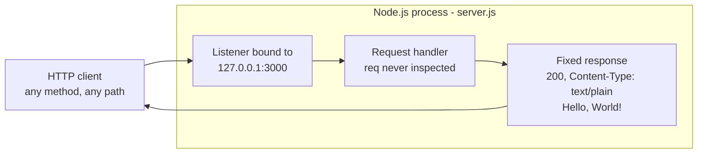
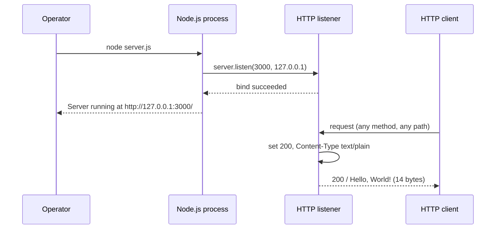
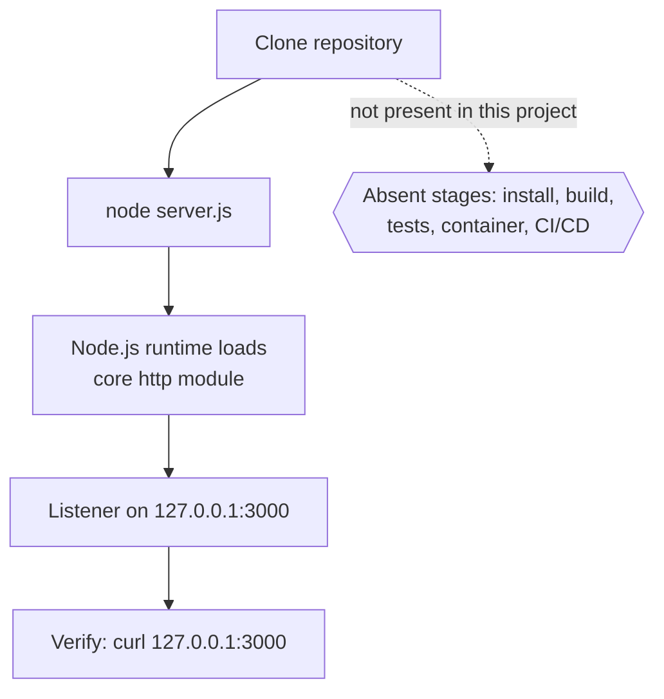

# hao-backprop-test

test project for backprop integration.

A minimal, dependency-free Node.js HTTP fixture: one file, one listener, one
fixed plain-text response. It exists to be started, called and inspected by
other tooling, not to be deployed as a product.

## Table of Contents

- [Overview](#overview)
- [Features](#features)
- [Architecture](#architecture)
- [Prerequisites](#prerequisites)
- [Setup and Running](#setup-and-running)
- [Configuration](#configuration)
- [API Documentation](#api-documentation)
- [Deployment Guide](#deployment-guide)
- [Troubleshooting](#troubleshooting)
- [Project Structure](#project-structure)
- [Limitations and Non-Goals](#limitations-and-non-goals)
- [Code Documentation](#code-documentation)
- [License](#license)

## Overview

`hao-backprop-test` is a **fixture**: a deliberately minimal HTTP service whose
whole purpose is to be predictable. The entire application is one CommonJS
file, `server.js`, and its only import is the Node.js core `http` module.
Source: `server.js:L36`. Nothing has to be installed before it runs, because
that core module ships with the runtime and the checkout contains no dependency
manifest to install from. Source: repository tree.

When started, it binds an HTTP listener to the loopback address `127.0.0.1` on
port `3000`, writes one readiness log line to stdout, and then answers **every
request Node.js hands to its request handler** - whatever the method, whatever
the path - with the same response: status `200`, the header
`Content-Type: text/plain`, and the 14-byte body `Hello, World!\n`.
Source: `server.js:L47`, `server.js:L57`, `server.js:L74-L78`,
`server.js:L108-L111`.

A handful of request shapes are resolved by the Node.js runtime rather than by
this code, so they are the documented exceptions to that uniformity: an
unsupported `Expect` header value, a malformed request line and `CONNECT` are
answered before the request handler is invoked, while `HEAD` does run the handler
and has its body suppressed afterwards. Each is listed with its observed response
in [Runtime Exceptions](#runtime-exceptions-enforced-by-nodejs).

**Despite the repository name, this project contains no machine-learning or
backpropagation code.** There is no training loop, no gradient computation, no
model and no numerical library anywhere in it. The name records the intent that
the fixture be used while integrating something called backprop; the code
itself returns a constant over HTTP. Reading the name as a description of the
implementation is the most likely misunderstanding of this repository.
Source: `server.js` executable statements
(L36, L47, L57, L74-L78, L108-L111) - and there is no second source file for such
code to hide in. Source: repository tree.

What it is not: not a web framework, not a starting template, not a production
service. It has no routing, no configuration mechanism, no authentication, no
TLS, no request logging, no persistence, no health endpoint, no automated tests
and no graceful shutdown. Those absences are characteristics of a fixture
rather than defects, and every one of them is documented below so that no
reader goes looking for a facility that was never built.

### How Claims Are Evidenced

Every factual statement in this document carries its source, and the sources
come in three classes, because three different kinds of fact are being asserted.
Which class a claim needs is not a matter of taste: a claim about Node.js
behavior cannot be proved by this repository's code, and a claim about what the
project does not contain cannot be proved by an import line.

| Citation          | What it points at              | Proves                 |
| ----------------- | ------------------------------ | ---------------------- |
| `server.js:Lx-Ly` | Executable lines of the code   | What this code does    |
| `repository tree` | Files in a clean checkout      | What the project lacks |
| `Node.js runtime` | Node's docs plus observed runs | What the runtime does  |

Three rules keep those classes apart:

- **`server.js:Lx-Ly` ranges cover executable statements.** No range spans a
  JSDoc block, so no claim here is proved by documentation this project wrote
  about itself. The single exception is
  [Code Documentation](#code-documentation), where the annotation *is* the
  subject of the claim rather than its evidence, and the citations there say so.
  One detail for the careful checker: the `server.listen` statement spans
  `L108-L111` and has an explanatory `//` line at `L109` inside it. That note is
  commentary on the statement, never the evidence for a claim.
- **A claim about the whole program names every statement.** An absence such as
  "no error handler anywhere" cannot be shown by one line, so it is cited as
  `server.js` executable statements (L36, L47, L57, L74-L78, L108-L111) - the
  complete set, all eleven of them.
- **Node-managed behavior is cited to Node.js, not to this code.** Runtime-set
  headers, parser-level replies, `'listening'` and `'error'` event semantics,
  process and event-loop behavior: all are attributed to the runtime, checked
  against the Node.js API reference for
  [`http`](https://nodejs.org/api/http.html),
  [`net`](https://nodejs.org/api/net.html) and
  [`events`](https://nodejs.org/api/events.html), and observed on Node.js
  22.23.2 - the runtime every transcript below was captured on.

To check the repository-tree claims yourself, run `git ls-files` in the
checkout: it lists `README.md` and `server.js`, and nothing else.

## Features

Three capabilities, listed with the feature identifiers used in the project
specification so that this document and that specification can be cross-read.

| ID    | Feature                       | Source                |
| ----- | ----------------------------- | --------------------- |
| F-001 | HTTP Server Listener          | `server.js:L108-L111` |
| F-002 | Uniform HTTP Response Handler | `server.js:L74-L78`   |
| F-003 | Startup Readiness Logging     | `server.js:L110`      |

### F-001 HTTP Server Listener

- Binds to host `127.0.0.1`, port `3000`. Both are hard-coded constants.
  Source: `server.js:L47`, `server.js:L57`.
- `server.listen` is called with the port first, the host second and the
  readiness callback third. Source: `server.js:L108`.
- Because the bind address is the IPv4 loopback interface, the listener is
  reachable **only from processes on the same host**. Callers on another
  machine, or in another container, cannot connect. The bind address is in the
  source - Source: `server.js:L47` - and what binding it to loopback implies for
  reachability is the operating system's and the runtime's behavior, not a
  firewall rule and not something this code decides.
  Source: Node.js runtime.
- A failed bind is **not handled**: no `'error'` listener is registered anywhere
  in the program. Source: `server.js` executable statements
  (L36, L47, L57, L74-L78, L108-L111). With no listener attached, Node.js treats
  the `'error'` event the server emits as unhandled and the process terminates.
  Source: Node.js runtime. See [Troubleshooting](#troubleshooting).

### F-002 Uniform HTTP Response Handler

- The request handler sets the status code, sets one response header, then
  writes the body and ends the response. Source: `server.js:L75-L77`.
- It **never inspects the request**. Neither `req.method` nor `req.url` is
  read, so `GET /`, `GET /any/arbitrary/path`, `POST /` and `DELETE /foo` are
  all treated identically. Source: `server.js:L74-L78`.
- The counterpart of that uniformity: there is no routing, no `404` path, no
  method rejection and no error branch. Every request that reaches the handler
  succeeds, which also means the application can never report a request as
  wrong. Source: `server.js:L74-L78`.
- Uniformity is a property of **this handler**, not of everything a client can
  observe. Node.js resolves some request shapes itself: an unsupported `Expect`
  value, a malformed request line and `CONNECT` are answered without the handler
  running, and a `HEAD` request runs the handler but has its body suppressed.
  Those exceptions are documented in
  [Runtime Exceptions](#runtime-exceptions-enforced-by-nodejs).

### F-003 Startup Readiness Logging

- The readiness callback writes exactly one line to stdout:
  `Server running at http://127.0.0.1:3000/`. Source: `server.js:L108-L111`.
- The line is built from a template literal interpolating the same two
  constants used to bind, so the logged URL always matches the real listen
  address. Source: `server.js:L110`.
- The callback is passed to `server.listen` - Source: `server.js:L108` - and
  Node.js invokes it as a one-time `'listening'` listener, so it runs once the
  bind has succeeded and never again. Source: Node.js runtime.
- This readiness log is the **only log the application authors**, and the only
  output a successful run produces: nothing is written per request, and nothing
  is written on shutdown. `console.log` appears once in the whole program and
  there is no other output call. Source: `server.js` executable statements
  (L36, L47, L57, L74-L78, L108-L111).
- It records **startup, not liveness**. There is no heartbeat, timer, metric or
  probe behind it - the program contains no such statement - so the line proves
  only that the listener was accepting connections at that moment.
  Source: `server.js` executable statements
  (L36, L47, L57, L74-L78, L108-L111).
- A failed start is the exception to "only output". No `'error'` handler is
  registered anywhere in the program - Source: `server.js` executable statements
  (L36, L47, L57, L74-L78, L108-L111) - so **Node.js itself** writes an
  unhandled-`'error'` diagnostic to **stderr** and the process ends.
  Source: Node.js runtime; the transcript is under
  [Port 3000 Is Already in Use](#port-3000-is-already-in-use). That is runtime
  output rather than application logging - the application has no error logger.

## Architecture

One process, one listener, one request handler, one response. There is no
router, no middleware chain, no state and no persistence: the request handler
reads nothing from the request and writes a constant, so **the part of the
response this application controls - the `200` status, the
`Content-Type: text/plain` header and the 14-byte body - is identical for every
request it handles.** That determinism stops at the application boundary: the
complete wire response is not byte-identical between two requests, because
Node.js adds a `Date` header whose value changes and connection headers that
follow the request and its protocol version. [Response
Headers](#response-headers) draws that line header by header. Beyond the HTTP
server's own event loop the process performs no asynchronous I/O, opens no
files, makes no outbound network calls and holds no session or cache in memory:
no statement in the program does any of those things.
Source: `server.js` executable statements
(L36, L47, L57, L74-L78, L108-L111).

The module declares no `module.exports`, and no statement assigns to `exports`
either. Its observable interface is therefore not a JavaScript API but a
**network contract** plus a single **readiness log** line, which is why
[API Documentation](#api-documentation) below is an HTTP reference rather than a
function reference. Source: `server.js` executable statements
(L36, L47, L57, L74-L78, L108-L111).

### Request Flow



### Startup and Request Lifecycle



Binding the listener is the module's only startup action.
Source: `server.js:L108-L111`. The process then stays alive because an open
listening handle keeps the Node.js event loop from running out of work - that is
runtime behavior, not something this code arranges.
Source: Node.js runtime.

Both diagrams show the ordinary path, the one this repository's code is
responsible for. Four request shapes depart from it: three are answered by the
runtime without ever reaching the request handler drawn above, and a `HEAD`
request follows the drawn path but has its body suppressed on the way out. All
four are enumerated in
[Runtime Exceptions](#runtime-exceptions-enforced-by-nodejs).

## Prerequisites

Node.js is the only requirement, and there is nothing else to install. The sole
import in `server.js` is the Node.js core `http` module - Source:
`server.js:L36` - and the checkout declares no dependencies at all, since it
holds no `package.json` and no lockfile. Source: repository tree.

Every version fact in this section was checked on **2026-08-14** and is stated
with its date, so it can be recognised as out of date rather than trusted
indefinitely; the current schedule lives at
<https://nodejs.org/en/about/previous-releases>.

| Runtime | Version | Status as of 2026-08-14                    |
| ------- | ------- | ------------------------------------------ |
| Node.js | 24.19.0 | Recommended - Active LTS, codename Krypton |
| Node.js | 22.23.2 | Verified - Maintenance LTS, codename Jod   |
| Node.js | >= 18   | Practical floor                            |

- **24.19.0**, released 2026-08-03, was the newest release carrying the LTS flag
  as of 2026-08-14. It became LTS on 2025-10-28, enters maintenance on
  2026-10-20 and reaches end-of-life on 2028-04-30.
- **22.23.2** is the runtime every transcript in this document was captured on;
  behavior was identical to 24.19.0 when both were checked on 2026-08-14. It
  reaches end-of-life on 2027-04-30.
- **>= 18** is a practical floor rather than a tested minimum. The fixture
  touches five `http` APIs and no more - `createServer`, `res.statusCode`,
  `res.setHeader`, `res.end` and `server.listen`. Source: `server.js:L36`,
  `server.js:L74-L78`, `server.js:L108`. Each of them is long-stable core API
  carrying no deprecation notice. Source: Node.js runtime.

**This repository pins no Node.js version.** There is no `package.json`, so no
`engines` field; there is no `.nvmrc`, no `.node-version` and no
`.tool-versions` file either. The table above is a recommendation made by this
document, not a constraint the project declares. Downloads are at
<https://nodejs.org/en/download>.

`curl` is optional. It is used only to check the service by hand in the
examples below; any HTTP client, or a browser pointed at
`http://127.0.0.1:3000/`, does the same job.

## Setup and Running

### Step 1 - Get the source

```bash
git clone https://github.com/ajitblitzy/Ajit_GH_Repo-12-Mar-26.git
cd Ajit_GH_Repo-12-Mar-26
```

That is the upstream this document was written against, and it clones
anonymously - no credentials, token or SSH key needed. Two details are worth
knowing before you run it:

- **The directory is named after the repository, not after the project.** `git
  clone` creates `Ajit_GH_Repo-12-Mar-26`; `server.js` and this README sit at its
  root. The project title in the heading above is the name recorded in the
  README, not the repository name.
- **Working from a fork or mirror?** Substitute its clone URL and `cd` into
  whatever directory `git clone` reports. If you copy a URL out of an existing
  checkout with `git remote get-url origin`, check it for embedded credentials
  first - anything between `https://` and an `@` in the host position is a user
  name and a secret, and such a URL must never be pasted into a document, a
  script or a terminal transcript. Clone from the plain, credential-free form
  shown above.

### Step 2 - Install nothing

There is **no install step and no build step**, and that is deliberate rather
than an omission: `server.js` imports only the Node.js core `http` module, so
there are no third-party packages to fetch and nothing to compile or bundle.
Source: `server.js:L36`. The repository contains no `package.json` and no
lockfile, so there is no install command to run in the first place.
Source: repository tree.

### Step 3 - Run

```bash
node server.js
```

The service writes exactly one line, then keeps running in the foreground:

```text
Server running at http://127.0.0.1:3000/
```

That line is the readiness log, written by the callback passed to
`server.listen`. Source: `server.js:L108-L111`. Node.js runs that callback when
the server emits `'listening'`, which is why the line appears only after the bind
has succeeded and why seeing it means the listener is accepting connections.
Source: Node.js runtime.

Stop the service with `Ctrl+C` in the terminal that owns it.

### Step 4 - Verify by hand

The repository has no test suite, so verification is a manual check. From the
same host, in a second terminal:

```bash
curl -i http://127.0.0.1:3000/
```

One observed response, captured on Node.js 22.23.2:

```http
HTTP/1.1 200 OK
Content-Type: text/plain
Date: Fri, 14 Aug 2026 11:51:13 GMT
Connection: keep-alive
Keep-Alive: timeout=5
Content-Length: 14

Hello, World!
```

That block is **one transcript, not the header contract**. The application sets
exactly one header, `Content-Type: text/plain`; `Date`, `Content-Length`,
`Connection` and `Keep-Alive` are generated by the Node.js runtime and some of
them vary with the request and the protocol version. The status line, the
`Content-Type` and the body are what you can rely on -
[Response Headers](#response-headers) sets out which header is stable and which
is not. This check is a manual smoke test; it is **not** automated test coverage,
and this project has none.

## Configuration

There are exactly two configuration values, both hard-coded literals in
`server.js`:

| Option     | Value         | Type   | Override | Source          |
| ---------- | ------------- | ------ | -------- | --------------- |
| `hostname` | `'127.0.0.1'` | string | None     | `server.js:L47` |
| `port`     | `3000`        | number | None     | `server.js:L57` |

**There is no configuration mechanism.** No statement in the program reads
`process.env`, opens a configuration file or looks at `process.argv`, so there
are no environment variables, no configuration file and no command-line
arguments to find. Changing either value means **editing its declaration in
`server.js`** and restarting the process.
Source: `server.js` executable statements
(L36, L47, L57, L74-L78, L108-L111).

Two consequences are worth knowing before changing either value:

- Changing `hostname` changes who can reach the service. The declared value is
  the IPv4 loopback address - Source: `server.js:L47` - and binding loopback is
  what limits connections to the same host. Source: Node.js runtime. Binding a
  routable address instead would expose an unauthenticated, plaintext endpoint,
  so weigh that first.
- Changing `port` moves the listener. The readiness log interpolates both
  constants, so it follows the change automatically and keeps reporting the
  real address. Source: `server.js:L110`.

## API Documentation

The service exposes **one catch-all endpoint**. It is not a REST API with
resources and verbs; it is a single fixed response served for every request the
Node.js runtime hands to the request handler. The handful of request shapes the
runtime answers by itself are listed under
[Runtime Exceptions](#runtime-exceptions-enforced-by-nodejs), and they are the
only departures from the table below.

### Endpoint Contract

| Attribute          | Value                                                |
| ------------------ | ---------------------------------------------------- |
| Base address       | `http://127.0.0.1:3000` (loopback only)              |
| Methods accepted   | Every method - `req.method` is never read            |
| Paths accepted     | Every path - `req.url` is never read                 |
| Status code        | `200` from the request handler                       |
| App-set header     | `Content-Type: text/plain` - the only one            |
| Runtime headers    | `Date`, `Content-Length`, `Connection`, `Keep-Alive` |
| Response body      | `Hello, World!\n`                                    |
| Body length        | 14 bytes; suppressed for `HEAD`                      |
| Authentication     | None                                                 |
| Transport          | Plain HTTP, no TLS                                   |
| Runtime exceptions | Four shapes Node.js answers itself; see below        |

Source: `server.js:L47`, `server.js:L57`, `server.js:L74-L78`,
`server.js:L108`. The rows describing runtime headers, the `HEAD` body
suppression and the four runtime exceptions are the runtime's behavior rather
than this code's. Source: Node.js runtime.

The body is the text `Hello, World!` followed by one newline character, which
is why its length is 14 bytes and not 13. Source: `server.js:L77`.

### Response Headers

The application sets **one** header, with the program's only `setHeader` call.
Source: `server.js:L76`. Everything else on the wire is generated by the Node.js
`http` runtime, and three of those headers are not invariant: they follow the
request and its protocol version. Header **order** is not part of the contract
either, and it varies between runtimes. Source: Node.js runtime.

**Scope of the table below: responses written through Node's `ServerResponse`
object.** That covers the `200` this application's request handler produces and
the `417` the runtime produces for an unsupported `Expect` value. It does **not**
cover the parser-level `400`, which Node.js writes straight to the socket before
any `ServerResponse` exists; that response carries only its status line and
`Connection: close` - no `Date`, and no `Content-Type`. See [Runtime
Exceptions](#runtime-exceptions-enforced-by-nodejs).

| Header                     | Set by  | Sent                         |
| -------------------------- | ------- | ---------------------------- |
| `Content-Type: text/plain` | the app | Always - the only app header |
| `Date`                     | runtime | Always; the value changes    |
| `Content-Length: 14`       | runtime | Not for `HEAD` or HTTP/1.0   |
| `Connection`               | runtime | Always; the value varies     |
| `Keep-Alive: timeout=5`    | runtime | Only while kept alive        |

What "varies" means precisely, all of it observed on Node.js 22.23.2 against this
unchanged source, and all of it the runtime's doing rather than this code's.
Source: Node.js runtime.

- `Content-Length` is derived from the body. It is present on an HTTP/1.1
  response that carries the body, **absent** for `HEAD`, and absent on HTTP/1.0,
  where the closing connection delimits the body instead.
- `Connection` is `keep-alive` for an ordinary HTTP/1.1 request, and `close`
  when the client sends `Connection: close` or speaks HTTP/1.0.
- `Keep-Alive: timeout=5` accompanies a kept-alive connection only, and the `5`
  is a Node.js default rather than application configuration.
- `Date` accompanies every response written through `ServerResponse`, and its
  value changes with each one. The parser-level `400` is the one documented
  response without it.

Two observed variants, both against the same unchanged source. Sending
`GET / HTTP/1.1` with `Connection: close` drops `Keep-Alive`:

```http
HTTP/1.1 200 OK
Content-Type: text/plain
Date: Fri, 14 Aug 2026 11:51:13 GMT
Connection: close
Content-Length: 14

Hello, World!
```

Sending `GET / HTTP/1.0` drops `Content-Length` as well, because closing the
connection is what delimits the body:

```http
HTTP/1.1 200 OK
Content-Type: text/plain
Date: Fri, 14 Aug 2026 11:51:13 GMT
Connection: close

Hello, World!
```

So write clients against the status code, the `Content-Type` and the body. Treat
`Date`, `Content-Length`, `Connection` and `Keep-Alive` as runtime output to be
read, not as guarantees.

### Example 1 - GET /

```bash
curl -i http://127.0.0.1:3000/
```

```http
HTTP/1.1 200 OK
Content-Type: text/plain
Date: Fri, 14 Aug 2026 11:51:13 GMT
Connection: keep-alive
Keep-Alive: timeout=5
Content-Length: 14

Hello, World!
```

### Example 2 - Any path

Paths are ignored: a deep, undefined path returns the same response instead of
a `404`.

```bash
curl -i http://127.0.0.1:3000/any/arbitrary/path
```

```http
HTTP/1.1 200 OK
Content-Type: text/plain
Date: Fri, 14 Aug 2026 11:51:13 GMT
Connection: keep-alive
Keep-Alive: timeout=5
Content-Length: 14

Hello, World!
```

### Example 3 - Any method

Methods are ignored: `POST` is neither routed differently nor rejected.

```bash
curl -i -X POST http://127.0.0.1:3000/
```

```http
HTTP/1.1 200 OK
Content-Type: text/plain
Date: Fri, 14 Aug 2026 11:51:13 GMT
Connection: keep-alive
Keep-Alive: timeout=5
Content-Length: 14

Hello, World!
```

`DELETE /foo` was checked the same way and returned the identical response:
`200`, `Content-Type: text/plain`, 14 bytes.

### Runtime Exceptions Enforced by Node.js

The request handler is uniform, but it is not the whole story: the Node.js `http`
runtime resolves four request shapes on its own, and they split into two kinds.
`HEAD` **runs** the application's request handler and has its body suppressed
afterwards. The other three - an unsupported `Expect` value, a malformed request
line and `CONNECT` - are resolved by the runtime **before** the handler would be
invoked, so no application code executes for them. Either way, none of it can be
changed without editing `server.js`, so these are documented exceptions rather
than defects. In every one of the four cases the departure from the ordinary
path - the suppressed body, the substituted status, the closed connection - is
the runtime's decision rather than this application's.
Source: Node.js runtime. What the program contributes is only what it does *not*
register: there is no `'connect'` listener, no `'upgrade'` listener and no
`'checkContinue'` or `'checkExpectation'` listener anywhere in it, which is why
Node.js falls back to its own defaults for these shapes.
Source: `server.js` executable statements
(L36, L47, L57, L74-L78, L108-L111).

| Request shape          | Handler  | What the client gets                     |
| ---------------------- | -------- | ---------------------------------------- |
| `HEAD` (any path)      | Runs     | `200` and headers; no body, no length    |
| Unsupported `Expect`   | Bypassed | `417 Expectation Failed`, chunked, empty |
| Malformed request line | Bypassed | `400 Bad Request`, `Connection: close`   |
| `CONNECT`              | Bypassed | No response at all; connection closed    |

Where each one is decided:

- For `HEAD` the handler does run and does call `res.end('Hello, World!\n')`,
  and the runtime then suppresses the body. The response still carries
  `Content-Type: text/plain`, which is the application's own header - that header
  is the visible proof the handler executed.
- An unsupported `Expect` value is answered by the runtime before the handler is
  invoked, so no application code executes. The reply carries **no**
  `Content-Type`, which is the visible proof the handler did not run.
- A malformed request line, or an unusable HTTP version, is rejected by the
  runtime's parser; the handler never runs, and the reply is written straight to
  the socket rather than through a `ServerResponse`, so it has neither a
  `Content-Type` nor a `Date`.
- `CONNECT` is dispatched to a `'connect'` listener, and this server registers
  none, so the connection is closed instead.

All four were observed on Node.js 22.23.2 against the unchanged source.

A `HEAD` request - the case most likely to surprise a client that assumes 14
bytes always arrive:

```bash
curl -sS -I http://127.0.0.1:3000/
```

```http
HTTP/1.1 200 OK
Content-Type: text/plain
Date: Fri, 14 Aug 2026 11:51:13 GMT
Connection: keep-alive
Keep-Alive: timeout=5
```

An `Expect` value the runtime does not support, answered without the handler
running:

```bash
curl -sS -i -H 'Expect: banana' http://127.0.0.1:3000/
```

```http
HTTP/1.1 417 Expectation Failed
Date: Fri, 14 Aug 2026 11:51:13 GMT
Connection: keep-alive
Keep-Alive: timeout=5
Transfer-Encoding: chunked
```

A malformed request line, and a `CONNECT` request, sent over a raw TCP socket
because `curl` will not produce either:

```text
>>> BOGUS-LINE-WITHOUT-VERSION
<<< HTTP/1.1 400 Bad Request
<<< Connection: close

>>> CONNECT 127.0.0.1:3000 HTTP/1.1
>>> Host: 127.0.0.1:3000
<<< (no bytes; the server closes the connection)
```

Two related notes, so the boundary is unambiguous:

- `Expect: 100-continue` is **supported**: the runtime answers
  `HTTP/1.1 100 Continue` itself and the request then receives the ordinary
  `200` response.
- An upgrade request (`Connection: upgrade` with an `Upgrade` header) receives
  the ordinary `200` on the verified runtime. No protocol switch ever happens,
  because this server registers no `'upgrade'` listener either.

### Not Implemented

Every capability above has a counterpart absence. None of the following exists
in `server.js`, so no client should expect it:

- **Routing** - no path is special, not even `/`; a request for
  `/does/not/exist` succeeds. Source: `server.js:L74-L78`.
- **`404` handling** - there is no not-found path, so a missing resource cannot
  be reported as missing.
- **Method rejection** - `PUT`, `DELETE`, `PATCH` and the rest all receive
  `200`; `405` is never returned. The application rejects no method; where a
  method is handled differently, the runtime is doing it - see
  [Runtime Exceptions](#runtime-exceptions-enforced-by-nodejs).
- **Request body handling** - an uploaded body is neither read nor echoed; it
  is ignored along with the rest of the request. A `POST` carrying a body was
  observed receiving the same `200` and 14-byte response.
- **Content negotiation** - the handler reads no request header, `Accept`
  included, and always answers `text/plain`, never HTML or JSON.
  Source: `server.js:L74-L78`.
- **Authentication and authorization** - every caller is anonymous and every
  request is served.
- **TLS** - the module imports `http` and creates the listener with
  `http.createServer`, not `https`, so traffic is plaintext.
  Source: `server.js:L36`, `server.js:L74`.
- **Request logging** - nothing is written per request: the program's only output
  call is the readiness log, so that line is the only log the application writes
  and the only output of a successful run.
  Source: `server.js` executable statements
  (L36, L47, L57, L74-L78, L108-L111). On a failed bind Node.js adds its own
  diagnostic on stderr, which is runtime output rather than application logging.
  Source: Node.js runtime.
- **Health, liveness or readiness endpoint** - there is no `/health` route,
  because the handler never looks at the path, and no probe of any kind exists in
  the program. Source: `server.js:L74-L78`; `server.js` executable statements
  (L36, L47, L57, L74-L78, L108-L111). The readiness log is a one-time
  **startup** signal, not a liveness signal: Node.js runs its callback once, on
  `'listening'` - Source: Node.js runtime - so it says nothing about whether the
  process is still up. A startup line sitting in a terminal or a log file must
  not be read as a health check; the only way to test liveness here is to send a
  request and see whether it is answered.
- **CORS, security headers and rate limiting** - the handler makes one
  `setHeader` call and sets nothing else, and no such control exists elsewhere in
  the program. Source: `server.js:L74-L78`.

## Deployment Guide

### Run Model

Deployment is one manual step: start the process on the host that needs it.

```bash
node server.js
```

There is no build to run first, no artifact to publish and no orchestration
layer: the repository holds no build script, container file or workflow
definition. Source: repository tree. The program does nothing to detach itself
either - its only startup action is the `listen` call.
Source: `server.js:L108-L111`. So the process runs in the foreground, owns the
terminal it was started from, and stops when that terminal stops it, which is
ordinary Node.js and shell behavior rather than anything this code arranges.
Source: Node.js runtime.



### Interface Contract - Loopback Only

The bind address is an **interface contract**, not an incidental detail.
`server.js` binds the literal `127.0.0.1` - Source: `server.js:L47`,
`server.js:L108` - and a socket bound to the loopback interface accepts
connections only from processes on the same host. Source: Node.js runtime.
In practice:

- A caller on another machine cannot reach it and sees a refused connection.
- A caller in a different container cannot reach it either, because every
  container has its own loopback interface.
- Port forwarding or a reverse proxy running on the same host can bridge that
  gap, but nothing in this repository sets either of those up.

### Absent Operational Facilities

The following do not exist in the repository. They are listed so that an
operator stops looking for them; each is a characteristic of a fixture rather
than a defect to be fixed here:

| Facility          | Status                                      |
| ----------------- | ------------------------------------------- |
| Build step        | Absent - the source runs as written         |
| Container image   | Absent - no `Dockerfile`, no compose file   |
| CI/CD pipeline    | Absent - no workflow definitions            |
| Process manager   | Absent - no service unit or supervisor file |
| Health check      | Absent - no endpoint, probe or heartbeat    |
| Graceful shutdown | Absent - no signal handling, no draining    |
| Automated tests   | Absent - verification is manual             |
| Log aggregation   | Absent - nothing collects the stdout line   |

Every row above is an absence of a file or a facility in the checkout.
Source: repository tree.

Two clarifications, so neither absence is overstated. The single stdout line is
the only log the application writes and the only output of a successful run -
Source: `server.js` executable statements
(L36, L47, L57, L74-L78, L108-L111) - but a failed bind adds a Node.js diagnostic
on stderr, and the readiness callback runs once on `'listening'` rather than
repeatedly. Source: Node.js runtime; see
[Troubleshooting](#troubleshooting). That makes the line a readiness signal
rather than a liveness signal: nothing here reports continued health, so an
operator who needs that has to probe the endpoint themselves.

Running the fixture under a supervisor, behind a reverse proxy or inside a
container is possible, since the process is an ordinary foreground Node.js
program. None of that is configured here, though, and doing it would mean
adding files this repository deliberately does not contain.

## Troubleshooting

| Symptom                      | Remedy                             |
| ---------------------------- | ---------------------------------- |
| `EADDRINUSE` on startup      | Free port `3000`, or edit `port`   |
| `curl` exits 7, status `000` | Start the service; call from host  |
| `node` is not recognized     | Install Node.js; see Prerequisites |
| Nothing logged when stopping | Expected; see the note below       |

### Port 3000 Is Already in Use

Starting a second instance while the first still holds the port terminates the
new process with exit code `1`. The program registers no `'error'` handler -
Source: `server.js` executable statements
(L36, L47, L57, L74-L78, L108-L111) - so Node.js reports the bind failure as an
unhandled `'error'` event emitted on the server, after the `listen` call has
already returned, rather than as anything the application can catch or phrase
itself. **Node.js writes the diagnostic below to stderr**, which makes this the
one case where the process emits output the application did not author.
Source: Node.js runtime; the transcript below was captured on Node.js 22.23.2.

```text
node:events:497
      throw er; // Unhandled 'error' event
      ^

Error: listen EADDRINUSE: address already in use 127.0.0.1:3000
    at Server.setupListenHandle [as _listen2] (node:net:1941:16)
    at listenInCluster (node:net:1998:12)
[... remaining stack frames omitted ...]
  code: 'EADDRINUSE',
  errno: -4091,
  syscall: 'listen',
  address: '127.0.0.1',
  port: 3000
}

Node.js v22.23.2
```

Remedies:

- Stop whatever already holds `127.0.0.1:3000`, then start the service again.
- Or edit the `port` constant in `server.js` and restart.
  Source: `server.js:L57`. No flag and no environment variable can do this,
  because nothing in the program reads either.
  Source: `server.js` executable statements
  (L36, L47, L57, L74-L78, L108-L111).

The process has no recovery path of its own: it does not retry, does not fall
back to another port and does not wait for the port to be freed - there is no
statement that could. Source: `server.js` executable statements
(L36, L47, L57, L74-L78, L108-L111).

### Connection Refused

With nothing listening, the TCP connection is refused. `curl` reports a status
of `000`, because no HTTP response was ever received, and exits with code `7`:

```bash
curl -s -o /dev/null -w '%{http_code}\n' http://127.0.0.1:3000/; echo "exit=$?"
```

```text
000
exit=7
```

There are two causes, and they need different fixes:

- **The service is not running.** Start it as described in
  [Setup and Running](#setup-and-running) and confirm that the readiness log
  appears.
- **The caller is on another host.** This is by design: the bind address in the
  source is loopback - Source: `server.js:L47` - and a loopback socket refuses
  off-host callers however the request is made. Source: Node.js runtime. Run the
  client on the same host.

### Node.js Is Not on PATH

The runtime is missing, or is not on `PATH`. The exact wording depends on the
shell; a POSIX shell reports this form and exits with `127`:

```text
node: command not found
```

`cmd.exe` instead reports that `'node' is not recognized as an internal or
external command, operable program or batch file.` and sets `ERRORLEVEL` to
`9009`. Either way, install Node.js and confirm that `node --version` answers -
see [Prerequisites](#prerequisites).

### Nothing Is Logged on Shutdown

Stopping the process - `Ctrl+C`, `SIGTERM` or any other termination - produces
no shutdown message, and requests in flight at that moment are cut off rather
than allowed to finish. After a `SIGTERM` the process is gone and its stdout
still holds only the readiness log line:

```text
Server running at http://127.0.0.1:3000/
```

This is a **known limitation, documented rather than fixed**. `server.js`
registers no `SIGTERM` or `SIGINT` handler and never calls `server.close()`, so
there is nothing to log and nothing to drain.
Source: `server.js` executable statements
(L36, L47, L57, L74-L78, L108-L111). Adding a shutdown handler would change the
application's behavior, which is outside the scope of this documentation.

This is also why the readiness log cannot serve as a health check: the line
above was written at startup and outlives the process, so finding it in a
terminal or a log file says nothing about whether the service is still
listening.

## Project Structure

The repository is two files. Apart from Git's own `.git` directory there are no
subdirectories, no build output, no generated assets and no screenshots or
rendered diagrams:

```text
<repository-root>/
|-- README.md    this document
`-- server.js    the entire application, 111 annotated lines
```

`<repository-root>` is whatever directory `git clone` created - by default
`Ajit_GH_Repo-12-Mar-26`, as [Setup and Running](#setup-and-running) explains.

Absent by design, and worth stating so that nobody hunts for them: no
`package.json` and no lockfile, no `LICENSE`, no `CONTRIBUTING.md`,
`CHANGELOG.md`, `CODE_OF_CONDUCT.md`, `SECURITY.md` or `AUTHORS`, no `.nvmrc`
or `.editorconfig`, no linter or formatter configuration, no `docs/` directory,
no `test/` directory and no CI workflow directory.

## Limitations and Non-Goals

Everything in this list is intentional. The fixture is useful because it is
small and predictable, and these limitations are what keep it that way. The
in-code absences are cited against the program's complete set of executable
statements, since that is what makes "nowhere in the program" checkable:
`server.js` executable statements (L36, L47, L57, L74-L78, L108-L111).

- **No machine learning and no backpropagation.** The repository name is not a
  description of the code: there is no model, no training loop and no numerical
  computation in any of those statements.
- **No routing.** One response for every method and every path the handler is
  given; no `404` and no `405` from the application.
  Source: `server.js:L74-L78`. The runtime's own exceptions are listed under
  [Runtime Exceptions](#runtime-exceptions-enforced-by-nodejs).
- **No configuration mechanism.** Two hard-coded constants - Source:
  `server.js:L47`, `server.js:L57` - and no statement that reads an environment
  variable, a configuration file or a command-line argument.
- **No TLS.** Plain HTTP only: the module imports `http` and calls
  `http.createServer`. Source: `server.js:L36`, `server.js:L74`.
- **No authentication or authorization.** Every request is served anonymously.
  Source: `server.js:L74-L78`.
- **No persistence and no state.** Nothing is stored, cached or remembered
  between requests. Source: `server.js:L74-L78`.
- **No request logging and no metrics.** The readiness log is the only output
  call in the program, so it is the only log the application writes and the only
  output of a successful run. Source: `server.js:L110`. A failed bind adds a
  Node.js diagnostic on stderr. Source: Node.js runtime.
- **No liveness or health signal.** The readiness callback is registered for
  `'listening'` and runs once - Source: `server.js:L108-L111`; Node.js runtime -
  and there is no health endpoint, probe or heartbeat among the statements above,
  so nothing reports whether the process is still up.
- **No error handling.** The request handler has no failure branch.
  Source: `server.js:L74-L78`. No `'error'` listener is registered either, so a
  failed bind ends the process. Source: Node.js runtime.
- **No graceful shutdown.** No signal handling and no draining of in-flight
  requests appears in any statement above.
- **No automated tests.** There is no test file, test directory or test runner
  configuration in the checkout; verification is the manual `curl` check
  described above. Source: repository tree.
- **Not reachable off-host.** Loopback binding is deliberate.
  Source: `server.js:L47`; Node.js runtime.
- **No dependency manifest.** There is no `package.json`, so the project cannot
  declare dependencies or scripts at all. Source: repository tree.

## Code Documentation

`server.js` carries its own documentation layer, so the source can be read on
its own without cross-referencing this file. This is the one section whose
subject *is* the annotation, so - unlike everywhere else in this document - the
citations below point at comment lines on purpose, and each one names the
annotation it describes rather than offering it as proof of runtime behavior:

- A **file and module header** states the module's purpose, records that it
  exports nothing, and describes both the network contract and the readiness
  signal. Annotation: `server.js:L1-L35`.
- **`@constant` blocks** document `hostname` and `port`, each with its type,
  its default and the operational consequence of the value.
  Annotation: `server.js:L38-L46`, `server.js:L49-L56`.
- A block on the **request handler** types both callback parameters -
  `http.IncomingMessage` and `http.ServerResponse` - and records that `req` is
  never inspected. Annotation: `server.js:L59-L73`.
- A **`@callback ListeningCallback` typedef** describes the zero-argument
  readiness callback. Annotation: `server.js:L80-L88`.
- The block above the bind call documents **`server.listen`** itself: the
  argument order, the callback typed as `ListeningCallback`, and the
  `http.Server` the call returns. It also records the failure model accurately -
  that the call does not throw, that a failed bind arrives afterwards as an
  `'error'` event on the server, and that no listener is registered for it - and
  marks that with `@fires http.Server#event:error` rather than a `@throws` entry,
  because nothing here can be caught around the call. The block is attached to
  `server.listen` with `@function` and `@memberof`, so JSDoc emits it as a
  documented entry instead of discarding it - see the note on generated output
  below. Annotation: `server.js:L90-L107`.
- **Inline comments** on the executable lines explain the mechanics for a
  reader who does not know the Node.js `http` API: what `res.statusCode`,
  `res.setHeader` and `res.end` do, and why the logged URL always matches the
  bind address. The `http` reference is at <https://nodejs.org/api/http.html>.
  Annotation: `server.js:L36`, `server.js:L47`, `server.js:L57`,
  `server.js:L75-L77`, `server.js:L108-L109`.

Those annotations are comments only. No executable statement was changed, and
`node --check server.js` exits `0`.

Rendering the JSDoc as HTML is optional and needs no change to the repository -
run the generator ad hoc and write its output outside the working tree:

```bash
npx jsdoc@4.0.5 server.js -d /tmp/jsdoc-out
```

To check what the annotations actually produce rather than trusting the prose
above, dump the model instead of rendering it:

```bash
npx jsdoc@4.0.5 -X server.js
```

It emits six documented entries - the module, `hostname`, `port`, `server` with
its two typed handler parameters, the `ListeningCallback` typedef, and
`server.listen` with its three typed parameters, its `http.Server` return and the
`http.Server#event:error` it records as fired. No entry carries an exception,
which is deliberate: the bind failure is an event, not a throw.

One caveat about the HTML render, so nobody goes looking for something that is
not there: JSDoc's default template lays out the module, both constants, `server`
and the `ListeningCallback` typedef, but it does not print a section for the
`server.listen` entry, because that entry's parent is a plain constant rather
than a container the template gives a page to. The entry exists in the model -
`-X` shows it in full - and the source block above the call is the other place to
read it.

`jsdoc` is **not a dependency of this project**. It is declared nowhere,
because declaring it would require a `package.json` that the repository
deliberately does not have. There is likewise no documentation build, no
preview server and no publishing pipeline: this README is rendered directly by
whatever displays it, and the Mermaid diagrams above are rendered inline by
GitHub with no tooling at all.

## License

**No `LICENSE` file exists in this repository**, and no license terms are
declared anywhere in it - not in the source, and not in a manifest, since there
is no `package.json` either. Source: repository tree;
`server.js` executable statements (L36, L47, L57, L74-L78, L108-L111).
This document therefore states no terms of use;
the absence is recorded as a fact rather than filled in with an assumed
license. Anyone who needs defined terms should ask the repository owner to add
a `LICENSE` file.

---

This document and the JSDoc in `server.js` were written against the
**pre-documentation baseline** commit `1484182` - the upload that carried the
unannotated 14-statement `server.js` and the two-line README, and the state the
repository had before any documentation was added. The commits that added this
document build on that baseline, so `1484182` is a fixed reference point for
comparison rather than a claim about how many commits the repository has now, and
the repository carried no tags when it was written. The `server.js:Lx-Ly`
citations throughout are the fastest way to check whether the documentation still
matches the code.
