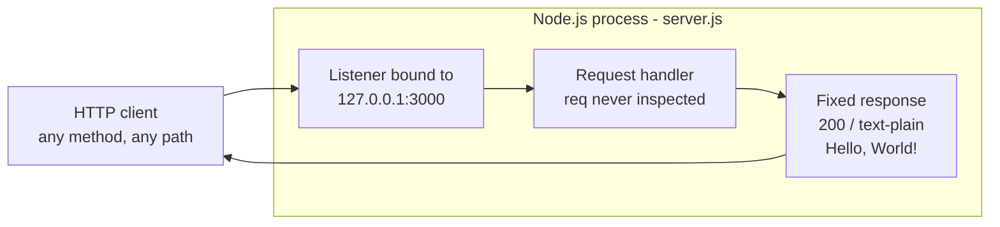
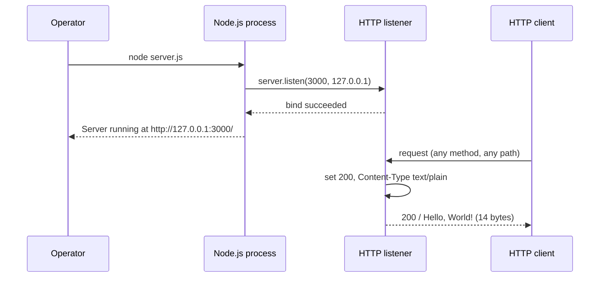
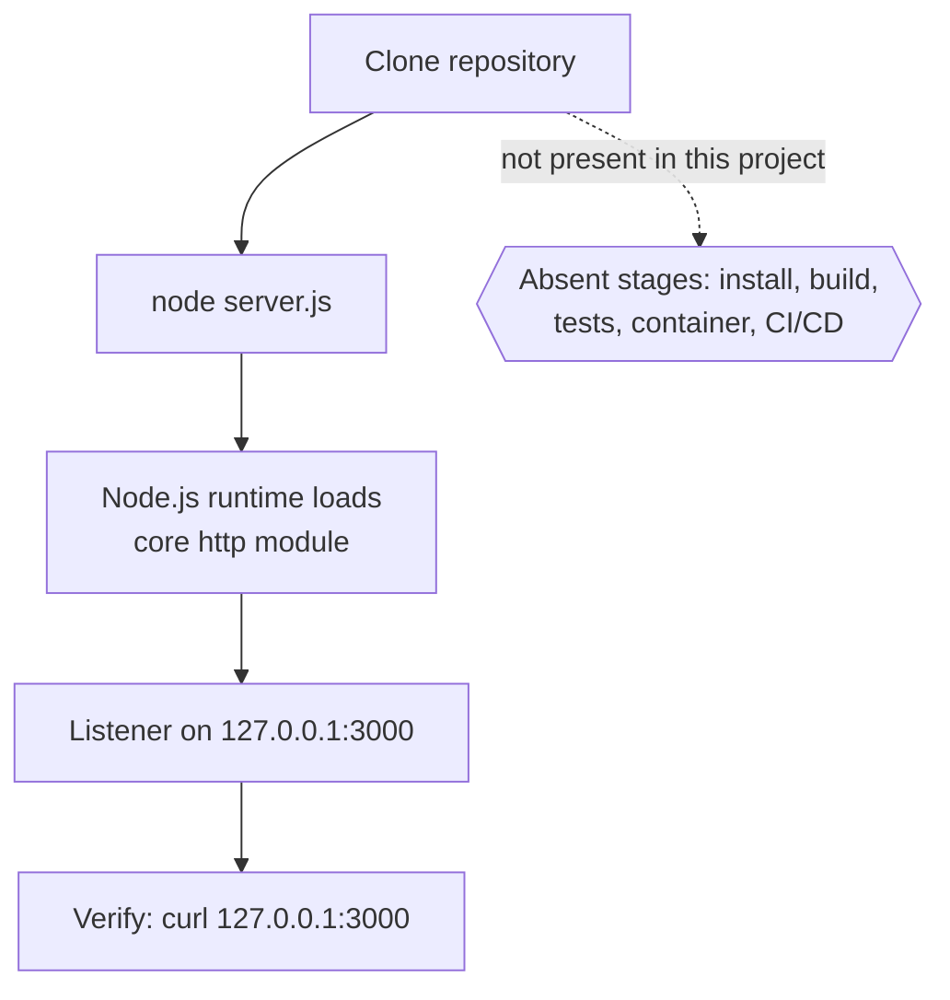

# hao-backprop-test

test project for backprop integration.

A minimal, dependency-free Node.js HTTP fixture: one file, one listener, one
fixed plain-text response. It exists to be started, called and inspected by
other tooling, not to be deployed as a product.

## Table of Contents

- [Overview](#overview)
- [Features](#features)
- [Architecture](#architecture)
- [Prerequisites](#prerequisites)
- [Setup and Running](#setup-and-running)
- [Configuration](#configuration)
- [API Documentation](#api-documentation)
- [Deployment Guide](#deployment-guide)
- [Troubleshooting](#troubleshooting)
- [Project Structure](#project-structure)
- [Limitations and Non-Goals](#limitations-and-non-goals)
- [Code Documentation](#code-documentation)
- [License](#license)

## Overview

`hao-backprop-test` is a **fixture**: a deliberately minimal HTTP service whose
whole purpose is to be predictable. The entire application is one CommonJS
file, `server.js`, and its only import is the Node.js core `http` module, so
there is nothing to install before it runs. Source: `server.js:L41`.

When started, it binds an HTTP listener to the loopback address `127.0.0.1` on
port `3000`, writes one readiness log line to stdout, and then answers **every**
request - whatever its method, whatever its path - with the same response:
status `200`, the header `Content-Type: text/plain`, and the 14-byte body
`Hello, World!\n`. Source: `server.js:L54`, `server.js:L65`,
`server.js:L82-L86`, `server.js:L112-L115`.

**Despite the repository name, this project contains no machine-learning or
backpropagation code.** There is no training loop, no gradient computation, no
model and no numerical library anywhere in it. The name records the intent that
the fixture be used while integrating something called backprop; the code
itself returns a constant over HTTP. Reading the name as a description of the
implementation is the most likely misunderstanding of this repository.
Source: `server.js:L1-L115`.

What it is not: not a web framework, not a starting template, not a production
service. It has no routing, no configuration mechanism, no authentication, no
TLS, no request logging, no persistence, no health endpoint, no automated tests
and no graceful shutdown. Those absences are characteristics of a fixture
rather than defects, and every one of them is documented below so that no
reader goes looking for a facility that was never built.

## Features

Three capabilities, listed with the feature identifiers used in the project
specification so that this document and that specification can be cross-read.

| ID    | Feature                       | Source                |
| ----- | ----------------------------- | --------------------- |
| F-001 | HTTP Server Listener          | `server.js:L112-L115` |
| F-002 | Uniform HTTP Response Handler | `server.js:L82-L86`   |
| F-003 | Startup Readiness Logging     | `server.js:L114`      |

### F-001 HTTP Server Listener

- Binds to host `127.0.0.1`, port `3000`. Both are hard-coded constants.
  Source: `server.js:L54`, `server.js:L65`.
- `server.listen` is called with the port first, the host second and the
  readiness callback third. Source: `server.js:L112`.
- Because the bind address is the IPv4 loopback interface, the listener is
  reachable **only from processes on the same host**. Callers on another
  machine, or in another container, cannot connect. That follows from the bind
  address itself, not from a firewall rule. Source: `server.js:L54`.
- A failed bind is **not handled**. No `'error'` listener is registered, so the
  failure surfaces as an unhandled `'error'` event and the process terminates.
  See [Troubleshooting](#troubleshooting). Source: `server.js:L98-L115`.

### F-002 Uniform HTTP Response Handler

- The request handler sets the status code, sets one response header, then
  writes the body and ends the response. Source: `server.js:L83-L85`.
- It **never inspects the request**. Neither `req.method` nor `req.url` is
  read, so `GET /`, `GET /any/arbitrary/path`, `POST /` and `DELETE /foo` are
  all treated identically. Source: `server.js:L82-L86`.
- The counterpart of that uniformity: there is no routing, no `404` path, no
  method rejection and no error branch. Every request succeeds, which also
  means no request can ever be reported as wrong. Source: `server.js:L82-L86`.

### F-003 Startup Readiness Logging

- Once the bind succeeds, the readiness callback writes exactly one line to
  stdout: `Server running at http://127.0.0.1:3000/`.
  Source: `server.js:L112-L115`.
- The line is built from a template literal interpolating the same two
  constants used to bind, so the logged URL always matches the real listen
  address. Source: `server.js:L114`.
- This readiness log is the **only lifecycle signal the process ever
  produces**. Nothing is written per request, and nothing is written on
  shutdown. Source: `server.js:L1-L115`.

## Architecture

One process, one listener, one request handler, one response. There is no
router, no middleware chain, no state and no persistence: the request handler
reads nothing from the request and writes a constant, so two identical requests
cannot produce different answers. Beyond the HTTP server's own event loop the
process performs no asynchronous I/O, opens no files, makes no outbound network
calls and holds no session or cache in memory. Source: `server.js:L1-L115`.

The module declares no `module.exports`. Its observable interface is therefore
not a JavaScript API but a **network contract** plus a single **readiness log**
line, which is why [API Documentation](#api-documentation) below is an HTTP
reference rather than a function reference. Source: `server.js:L1-L115`.

### Request Flow



### Startup and Request Lifecycle



The process stays alive because an active listener keeps the event loop busy.
Binding the listener is the module's only startup action.
Source: `server.js:L112-L115`.

## Prerequisites

Node.js is the only requirement, and there is nothing else to install: the sole
import in `server.js` is the Node.js core `http` module, so the project has no
third-party dependencies. Source: `server.js:L41`.

| Runtime | Version | Status                                     |
| ------- | ------- | ------------------------------------------ |
| Node.js | 24.19.0 | Recommended - Active LTS, codename Krypton |
| Node.js | 22.23.2 | Verified - Maintenance LTS, codename Jod   |
| Node.js | >= 18   | Practical floor                            |

- **24.19.0** is the newest release carrying the LTS flag. It became LTS on
  2025-10-28, enters maintenance on 2026-10-20 and reaches end-of-life on
  2028-04-30.
- **22.23.2** is the runtime every transcript in this document was captured on;
  behavior is identical to 24.19.0. It reaches end-of-life on 2027-04-30.
- **>= 18** is a practical floor rather than a tested minimum. The `http` API
  surface this fixture uses - `createServer`, `res.statusCode`,
  `res.setHeader`, `res.end` and `server.listen` - is long-stable core API.
  Source: `server.js:L41-L115`.

**This repository pins no Node.js version.** There is no `package.json`, so no
`engines` field; there is no `.nvmrc`, no `.node-version` and no
`.tool-versions` file either. The table above is a recommendation made by this
document, not a constraint the project declares. Downloads are at
<https://nodejs.org/en/download>.

`curl` is optional. It is used only to check the service by hand in the
examples below; any HTTP client, or a browser pointed at
`http://127.0.0.1:3000/`, does the same job.

## Setup and Running

### Step 1 - Get the source

```bash
git clone <repository-url>
cd hao-backprop-test
```

### Step 2 - Install nothing

There is **no install step and no build step**, and that is deliberate rather
than an omission: `server.js` imports only the Node.js core `http` module, so
there are no third-party packages to fetch and nothing to compile or bundle.
The repository contains no `package.json` and no lockfile, so there is no
install command to run. Source: `server.js:L41`.

### Step 3 - Run

```bash
node server.js
```

The service writes exactly one line, then keeps running in the foreground:

```text
Server running at http://127.0.0.1:3000/
```

That line is the readiness log. It appears only after the bind has succeeded,
so seeing it means the listener is accepting connections.
Source: `server.js:L112-L115`.

Stop the service with `Ctrl+C` in the terminal that owns it.

### Step 4 - Verify by hand

The repository has no test suite, so verification is a manual check. From the
same host, in a second terminal:

```bash
curl -i http://127.0.0.1:3000/
```

The response:

```http
HTTP/1.1 200 OK
Content-Type: text/plain
Date: Fri, 14 Aug 2026 10:12:07 GMT
Connection: keep-alive
Keep-Alive: timeout=5
Content-Length: 14

Hello, World!
```

`Date` changes with every request, and the order in which Node.js emits the
headers can differ between runtimes - treat the set of headers as the contract,
never their order. `Keep-Alive: timeout=5` is a Node.js runtime default, not a
setting of this application. This check is a manual smoke test; it is **not**
automated test coverage, and this project has none.

## Configuration

There are exactly two configuration values, both hard-coded literals in
`server.js`:

| Option     | Value         | Type   | Override | Source          |
| ---------- | ------------- | ------ | -------- | --------------- |
| `hostname` | `'127.0.0.1'` | string | None     | `server.js:L54` |
| `port`     | `3000`        | number | None     | `server.js:L65` |

**There is no configuration mechanism.** The project reads no environment
variables, loads no configuration file and parses no command-line arguments.
Changing either value means **editing its declaration in `server.js`** and
restarting the process; there is nothing else to look for.
Source: `server.js:L43-L65`.

Two consequences are worth knowing before changing either value:

- Changing `hostname` changes who can reach the service. `127.0.0.1` is the
  IPv4 loopback address, so only processes on the same host can connect.
  Binding a routable address would expose an unauthenticated, plaintext
  endpoint, so weigh that first. Source: `server.js:L43-L54`.
- Changing `port` moves the listener. The readiness log interpolates both
  constants, so it follows the change automatically and keeps reporting the
  real address. Source: `server.js:L114`.

## API Documentation

The service exposes **one catch-all endpoint**. It is not a REST API with
resources and verbs; it is a single fixed response served for every request
that arrives.

### Endpoint Contract

| Attribute        | Value                                   |
| ---------------- | --------------------------------------- |
| Base address     | `http://127.0.0.1:3000` (loopback only) |
| Methods accepted | All - `req.method` is never read        |
| Paths accepted   | All - `req.url` is never read           |
| Status code      | `200`                                   |
| Response header  | `Content-Type: text/plain`              |
| Response body    | `Hello, World!\n`                       |
| Body length      | 14 bytes                                |
| Authentication   | None                                    |
| Transport        | Plain HTTP, no TLS                      |

Source: `server.js:L54`, `server.js:L65`, `server.js:L82-L86`,
`server.js:L112`.

The body is the text `Hello, World!` followed by one newline character, which
is why its length is 14 bytes and not 13. `Content-Length` is derived by the
Node.js runtime from that body; the application sets only `Content-Type`.
Source: `server.js:L84-L85`.

Responses also carry `Date`, `Connection: keep-alive` and
`Keep-Alive: timeout=5`. All three come from Node.js `http` runtime defaults
rather than from this application, which sets exactly one header, and the order
in which headers appear is not part of the contract. Source: `server.js:L84`.

### Example 1 - GET /

```bash
curl -i http://127.0.0.1:3000/
```

```http
HTTP/1.1 200 OK
Content-Type: text/plain
Date: Fri, 14 Aug 2026 10:12:07 GMT
Connection: keep-alive
Keep-Alive: timeout=5
Content-Length: 14

Hello, World!
```

### Example 2 - Any path

Paths are ignored: a deep, undefined path returns the same response instead of
a `404`.

```bash
curl -i http://127.0.0.1:3000/any/arbitrary/path
```

```http
HTTP/1.1 200 OK
Content-Type: text/plain
Date: Fri, 14 Aug 2026 10:12:07 GMT
Connection: keep-alive
Keep-Alive: timeout=5
Content-Length: 14

Hello, World!
```

### Example 3 - Any method

Methods are ignored: `POST` is neither routed differently nor rejected.

```bash
curl -i -X POST http://127.0.0.1:3000/
```

```http
HTTP/1.1 200 OK
Content-Type: text/plain
Date: Fri, 14 Aug 2026 10:12:07 GMT
Connection: keep-alive
Keep-Alive: timeout=5
Content-Length: 14

Hello, World!
```

`DELETE /foo` was checked the same way and returned the identical response:
`200`, `Content-Type: text/plain`, 14 bytes.

### Not Implemented

Every capability above has a counterpart absence. None of the following exists
in `server.js`, so no client should expect it:

- **Routing** - no path is special, not even `/`; a request for
  `/does/not/exist` succeeds. Source: `server.js:L82-L86`.
- **`404` handling** - there is no not-found path, so a missing resource cannot
  be reported as missing.
- **Method rejection** - `PUT`, `DELETE`, `PATCH` and the rest all receive
  `200`; `405` is never returned.
- **Request body handling** - an uploaded body is neither read nor echoed; it
  is ignored along with the rest of the request.
- **Content negotiation** - `Accept` is ignored and the response is always
  `text/plain`, never HTML or JSON. Source: `server.js:L84`.
- **Authentication and authorization** - every caller is anonymous and every
  request is served.
- **TLS** - the listener is created with `http.createServer`, not `https`, so
  traffic is plaintext. Source: `server.js:L82`.
- **Request logging** - nothing is written per request; the readiness log is
  the only output the process produces. Source: `server.js:L1-L115`.
- **Health or readiness endpoint** - there is no `/health` route; the readiness
  log is the only liveness signal.
- **CORS, security headers and rate limiting** - none of these headers or
  controls are set. Source: `server.js:L84`.

## Deployment Guide

### Run Model

Deployment is one manual step: start the process on the host that needs it.

```bash
node server.js
```

There is no build to run first, no artifact to publish and no orchestration
layer. The process runs in the foreground, owns the terminal it was started
from, and stops when that terminal stops it.
Source: `server.js:L112-L115`.



### Interface Contract - Loopback Only

The bind address is an **interface contract**, not an incidental detail.
Because `server.js` binds `127.0.0.1`, the listener accepts connections only
from processes on the same host. Source: `server.js:L54`, `server.js:L112`.
In practice:

- A caller on another machine cannot reach it and sees a refused connection.
- A caller in a different container cannot reach it either, because every
  container has its own loopback interface.
- Port forwarding or a reverse proxy running on the same host can bridge that
  gap, but nothing in this repository sets either of those up.

### Absent Operational Facilities

The following do not exist in the repository. They are listed so that an
operator stops looking for them; each is a characteristic of a fixture rather
than a defect to be fixed here:

| Facility          | Status                                      |
| ----------------- | ------------------------------------------- |
| Build step        | Absent - the source runs as written         |
| Container image   | Absent - no `Dockerfile`, no compose file   |
| CI/CD pipeline    | Absent - no workflow definitions            |
| Process manager   | Absent - no service unit or supervisor file |
| Health check      | Absent - no health endpoint                 |
| Graceful shutdown | Absent - no signal handling, no draining    |
| Automated tests   | Absent - verification is manual             |
| Log aggregation   | Absent - one stdout line and nothing more   |

Running the fixture under a supervisor, behind a reverse proxy or inside a
container is possible, since the process is an ordinary foreground Node.js
program. None of that is configured here, though, and doing it would mean
adding files this repository deliberately does not contain.

## Troubleshooting

| Symptom                      | Remedy                             |
| ---------------------------- | ---------------------------------- |
| `EADDRINUSE` on startup      | Free port `3000`, or edit `port`   |
| `curl` exits 7, status `000` | Start the service; call from host  |
| `node` is not recognized     | Install Node.js; see Prerequisites |
| Nothing logged when stopping | Expected; see the note below       |

### Port 3000 Is Already in Use

Starting a second instance while the first still holds the port terminates the
new process with exit code `1`. No `'error'` handler is registered, so the
failure arrives as an unhandled `'error'` event rather than as a message the
application controls. Source: `server.js:L98-L115`.

```text
node:events:497
      throw er; // Unhandled 'error' event
      ^

Error: listen EADDRINUSE: address already in use 127.0.0.1:3000
    at Server.setupListenHandle [as _listen2] (node:net:1941:16)
    at listenInCluster (node:net:1998:12)
[... remaining stack frames omitted ...]
  code: 'EADDRINUSE',
  errno: -4091,
  syscall: 'listen',
  address: '127.0.0.1',
  port: 3000
}

Node.js v22.23.2
```

Remedies:

- Stop whatever already holds `127.0.0.1:3000`, then start the service again.
- Or edit the `port` constant in `server.js` and restart. No flag and no
  environment variable can do this. Source: `server.js:L56-L65`.

The process has no recovery path of its own: it does not retry, does not fall
back to another port and does not wait for the port to be freed.
Source: `server.js:L98-L115`.

### Connection Refused

With nothing listening, the TCP connection is refused. `curl` reports a status
of `000`, because no HTTP response was ever received, and exits with code `7`:

```bash
curl -s -o /dev/null -w '%{http_code}\n' http://127.0.0.1:3000/; echo "exit=$?"
```

```text
000
exit=7
```

There are two causes, and they need different fixes:

- **The service is not running.** Start it as described in
  [Setup and Running](#setup-and-running) and confirm that the readiness log
  appears.
- **The caller is on another host.** This is by design: the listener is bound
  to loopback, so off-host callers are refused however the request is made.
  Run the client on the same host. Source: `server.js:L54`.

### Node.js Is Not on PATH

The runtime is missing, or is not on `PATH`. The exact wording depends on the
shell; a POSIX shell reports this form and exits with `127`:

```text
node: command not found
```

`cmd.exe` instead reports that `'node' is not recognized as an internal or
external command, operable program or batch file.` and sets `ERRORLEVEL` to
`9009`. Either way, install Node.js and confirm that `node --version` answers -
see [Prerequisites](#prerequisites).

### Nothing Is Logged on Shutdown

Stopping the process - `Ctrl+C`, `SIGTERM` or any other termination - produces
no shutdown message, and requests in flight at that moment are cut off rather
than allowed to finish. After a `SIGTERM` the process is gone and its stdout
still holds only the readiness log line:

```text
Server running at http://127.0.0.1:3000/
```

This is a **known limitation, documented rather than fixed**. `server.js`
registers no `SIGTERM` or `SIGINT` handler and never calls `server.close()`, so
there is nothing to log and nothing to drain. Adding a shutdown handler would
change the application's behavior, which is outside the scope of this
documentation. Source: `server.js:L1-L115`.

## Project Structure

The repository is two files. There are no subdirectories, no build output and
no generated assets:

```text
hao-backprop-test/
|-- README.md    this document
`-- server.js    the entire application, 115 annotated lines
```

Absent by design, and worth stating so that nobody hunts for them: no
`package.json` and no lockfile, no `LICENSE`, no `CONTRIBUTING.md`,
`CHANGELOG.md`, `CODE_OF_CONDUCT.md`, `SECURITY.md` or `AUTHORS`, no `.nvmrc`
or `.editorconfig`, no linter or formatter configuration, no `docs/` directory,
no `test/` directory and no CI workflow directory.

## Limitations and Non-Goals

Everything in this list is intentional. The fixture is useful because it is
small and predictable, and these limitations are what keep it that way:

- **No machine learning and no backpropagation.** The repository name is not a
  description of the code: there is no model, no training loop and no numerical
  computation anywhere in `server.js`. Source: `server.js:L1-L115`.
- **No routing.** One response for every method and every path; no `404` and
  no `405`. Source: `server.js:L82-L86`.
- **No configuration mechanism.** Two hard-coded constants, no environment
  variables, no configuration file, no command-line arguments.
  Source: `server.js:L43-L65`.
- **No TLS.** Plain HTTP only. Source: `server.js:L82`.
- **No authentication or authorization.** Every request is served anonymously.
- **No persistence and no state.** Nothing is stored, cached or remembered
  between requests. Source: `server.js:L82-L86`.
- **No request logging and no metrics.** The readiness log is the only output.
  Source: `server.js:L114`.
- **No error handling.** A failed bind terminates the process, and the request
  handler has no failure branch. Source: `server.js:L82-L86`,
  `server.js:L98-L115`.
- **No graceful shutdown.** No signal handling and no draining of in-flight
  requests. Source: `server.js:L1-L115`.
- **No automated tests.** Verification is the manual `curl` check described
  above.
- **Not reachable off-host.** Loopback binding is deliberate.
  Source: `server.js:L54`.
- **No dependency manifest.** Without a `package.json` the project cannot
  declare dependencies or scripts at all.

## Code Documentation

`server.js` carries its own documentation layer, so the source can be read on
its own without cross-referencing this file:

- A **file and module header** states the module's purpose, records that it
  exports nothing, and describes both the network contract and the readiness
  signal. Source: `server.js:L1-L40`.
- **`@constant` blocks** document `hostname` and `port`, each with its type,
  its default and the operational consequence of the value.
  Source: `server.js:L43-L53`, `server.js:L56-L64`.
- A block on the **request handler** types both callback parameters -
  `http.IncomingMessage` and `http.ServerResponse` - and records that `req` is
  never inspected. Source: `server.js:L67-L81`.
- A **`@callback ListeningCallback` typedef** and a block on the bind call
  document the readiness callback, the argument order of `server.listen` and
  the unhandled `'error'` event on bind failure.
  Source: `server.js:L88-L111`.
- **Inline comments** on the executable lines explain the mechanics for a
  reader who does not know the Node.js `http` API: what `res.statusCode`,
  `res.setHeader` and `res.end` do, and why the logged URL always matches the
  bind address. The `http` reference is at <https://nodejs.org/api/http.html>.
  Source: `server.js:L41-L115`.

Those annotations are comments only. No executable statement was changed, and
`node --check server.js` exits `0`.

Rendering the JSDoc as HTML is optional and needs no change to the repository -
run the generator ad hoc and write its output outside the working tree:

```bash
npx jsdoc@4.0.5 server.js -d /tmp/jsdoc-out
```

`jsdoc` is **not a dependency of this project**. It is declared nowhere,
because declaring it would require a `package.json` that the repository
deliberately does not have. There is likewise no documentation build, no
preview server and no publishing pipeline: this README is rendered directly by
whatever displays it, and the Mermaid diagrams above are rendered inline by
GitHub with no tooling at all.

## License

**No `LICENSE` file exists in this repository**, and no license terms are
declared anywhere in it - not in the source, and not in a manifest, since there
is no `package.json` either. This document therefore states no terms of use;
the absence is recorded as a fact rather than filled in with an assumed
license. Anyone who needs defined terms should ask the repository owner to add
a `LICENSE` file.

---

The project has a single upstream commit, `1484182`, and no tags. This document
and the JSDoc in `server.js` were written against that source, so the
`server.js:Lx-Ly` citations throughout are the fastest way to check whether the
documentation still matches the code.
