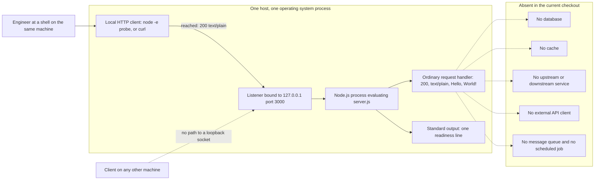

# hao-backprop-test

test project for backprop integration.

This file is the entry point for the project's documentation. It explains what
the program is, how to run it, what to expect when you do, and where each
engineering area is documented in depth. Read it first; the eight documents
listed in [Documentation map](#documentation-map) own the detail.

## What this project is

The repository tracks exactly one runnable program [.:git ls-files]: a
single-file Node.js HTTP server that answers requests on the local machine
only, because it binds a loopback address [server.js:3,12]. It is a test
fixture, meaning a small fixed thing you run so that something else can be
exercised against it, and the repository states that purpose itself
[README.md:2].

- **Source-defined:** the program binds the loopback address `127.0.0.1`
  [server.js:3] on TCP port `3000` [server.js:4], so only clients on the same
  machine can reach it.
- **Source-defined:** one ordinary request handler is registered for the whole
  server [server.js:6-10]. It sets status `200` [server.js:7] and
  `Content-Type: text/plain` [server.js:8], then ends the response with the
  body `Hello, World!\n` [server.js:9]. It never reads anything from the
  request object [server.js:6-10].
- **Source-defined:** because that handler ignores the request, every ordinary
  request that reaches it gets the same three values, whatever path or method
  it used [server.js:6-10]. Which requests reach the handler at all, and which
  the Node.js runtime answers before the handler could run, is owned by
  [the networking area](docs/areas/networking.md).
- **Source-defined:** after a successful bind the program prints one readiness
  line, and that is the only output it ever produces [server.js:12-13].
- **Absent in the current checkout:** there is no second entry point, no
  exported module, no framework, and no route table. The file is 14 lines long
  and starts listening while it is being evaluated [server.js:1-14].

## Current checkout

Everything in this documentation set was read from, or executed against, one
specific state of the repository. The facts below are scoped to that state, and
another branch of the same repository may contain something different.

<!-- markdownlint-disable MD013 -->

| Item | Value | Evidence |
| --- | --- | --- |
| Documentation baseline branch | `17-Aug-2026-Br1` | [.git/HEAD:ref] |
| Documentation baseline commit | `1484182` | [.:git rev-parse HEAD] |
| Tracked files at that commit | `README.md` and `server.js`, nothing else | [.:git ls-files] |
| Remote hosting | A single remote, GitHub-hosted; the configured URL is deliberately not reproduced here because it carries an access credential | [.git/config:remote "origin"] |
| Runtime behind every observed result in this file | Node.js 24.19.0 with the npm 11.17.0 it bundles, verified on August 17, 2026 | Observed on Node.js 24.19.0 on August 17, 2026 |
| Runtime version declared by the repository | None | [.:git ls-files] |

<!-- markdownlint-enable MD013 -->

Every claim in this file carries one of four labels, and the eight area
documents use the same four:

- **Source-defined** — read directly from the code in this checkout.
- **Observed on Node.js 24.19.0 on August 17, 2026** — measured by running that
  code under that runtime on that date. A result from any other Node.js build
  is not reported here as this program's behavior.
- **Absent in the current checkout** — verified to be missing from this
  checkout, and scoped to it.
- **Recommendation** — a suggestion for future work, never a description of
  current behavior.

That gives future maintenance a clear surface: if `server.js` changes, or a
different Node.js version is used, re-run the checks recorded in
[the testing and quality area](docs/areas/testing-and-quality.md) and update
the runtime and date above.

## Prerequisites

- A Node.js runtime, and nothing else. **Source-defined:** the program loads
  only Node's own built-in `http` module [server.js:1].
- **Absent in the current checkout:** the repository pins no runtime version.
  There is no `package.json`, no lockfile, no `.nvmrc`, no `.node-version`, no
  `.tool-versions`, no container file, and no CI version matrix to read one
  from [.:git ls-files].
- **Absent in the current checkout:** there is nothing to install and nothing
  to build. The project has no declared application package dependencies, so
  there is no install step and no build output [.:git ls-files]. The Node.js
  runtime itself is still required in order to run the file [server.js:1].
- **Recommendation:** because the repository names no version, this
  documentation set selected Node.js 24.19.0, and the npm 11.17.0 bundled with
  it, as an external baseline, and every observed result below was produced on
  that build. Treat it as the version these documents were verified against
  rather than as a repository requirement.

Obtaining and verifying that runtime, and the complete operator command set,
live in [the DevOps area](docs/areas/devops.md). What follows here is only the
shortest path that works.

## Quick start

Four steps take you from a checkout to a verified response and back to a
stopped process. Run them from the root of the checkout.

### Step 1 — Confirm the runtime

```bash
node --version
npm --version
```

```console
v24.19.0
11.17.0
```

- **Observed on Node.js 24.19.0 on August 17, 2026:** those are the two values
  this documentation set was verified against. Another version is not known to
  fail; it simply has not been measured here, because the repository asks for
  none [.:git ls-files].

### Step 2 — Start the program

```bash
node server.js
```

```console
Server running at http://127.0.0.1:3000/
```

- **Source-defined:** that line is printed from the callback `server.listen`
  invokes once the bind succeeds, so seeing it means the port was acquired
  [server.js:12-13].
- **Observed on Node.js 24.19.0 on August 17, 2026:** the process then held the
  terminal and printed nothing further, however many requests it served. Leave
  it running and open a second terminal for step 3.

### Step 3 — Send one ordinary request

Use the HTTP client built into Node, so that verifying the server needs nothing
beyond the runtime you already have. The command is written to run unchanged in
both a POSIX shell and Windows PowerShell.

<!-- markdownlint-disable MD013 -->

```bash
node -e "require('http').get('http://127.0.0.1:3000/', r => { let b = ''; r.on('data', c => b += c); r.on('end', () => console.log(r.statusCode, r.headers['content-type'], JSON.stringify(b))); })"
```

<!-- markdownlint-enable MD013 -->

```console
200 text/plain "Hello, World!\n"
```

- **Observed on Node.js 24.19.0 on August 17, 2026:** that single line was the
  output in Windows PowerShell 5.1 and in a POSIX shell alike. The three values
  in it are exactly the three the request handler sets [server.js:7-9].
- Optional, and only if `curl` is already installed:
  `curl -sS http://127.0.0.1:3000/` is a shorter liveness check. **Observed on
  Node.js 24.19.0 on August 17, 2026:** it printed `Hello, World!` and exited
  zero. It stays optional because the built-in client above needs nothing the
  runtime does not already provide.

### Step 4 — Stop the program

Press **Ctrl+C** in the terminal that is holding the process.

- **Source-defined:** the program installs no signal handler, never calls
  `server.close()`, and registers no `error` listener, so no code of its own
  runs on the way out and no shutdown message is printed [server.js:1-14].
- **Observed on Node.js 24.19.0 on August 17, 2026:** once the process ended,
  port `3000` had no listener and a fresh request from the built-in client
  failed with `ECONNREFUSED`. Stopping a detached process, and the exit status
  each signal produces, are covered in
  [the DevOps area](docs/areas/devops.md).

## Expected output

The program's own output is small and fixed [server.js:1-14]. Most of what a
client sees on the wire is added by the runtime instead, and some fields change
on every run, so the three groups are kept apart here.

<!-- markdownlint-disable MD013 -->

| Field | Value | Origin |
| --- | --- | --- |
| Readiness line on standard output | `Server running at http://127.0.0.1:3000/` | **Source-defined:** a template literal built from the host and port constants [server.js:3-4,13] |
| Response status code | `200` | **Source-defined:** set by the request handler [server.js:7] |
| Response `Content-Type` | `text/plain`, with no `charset` parameter | **Source-defined:** set by the request handler [server.js:8] |
| Response body | `Hello, World!\n`, 14 bytes | **Source-defined:** the literal passed to `res.end` [server.js:9] |
| Reason phrase, `Date`, `Connection`, `Keep-Alive`, `Content-Length` | See the response below; no line of the application asks for any of them [server.js:1-14] | **Observed on Node.js 24.19.0 on August 17, 2026** |
| The `Date` value, the process id, the client's source port | Different on every run, so this documentation set writes them as variable fields such as `<http-date>` and `<pid>` rather than freezing one run's values into a contract | **Observed on Node.js 24.19.0 on August 17, 2026** |

<!-- markdownlint-enable MD013 -->

One ordinary keep-alive response looked like this, with the volatile timestamp
replaced by its placeholder:

```text
HTTP/1.1 200 OK
Content-Type: text/plain
Date: <http-date>
Connection: keep-alive
Keep-Alive: timeout=5
Content-Length: 14

Hello, World!
```

- **Observed on Node.js 24.19.0 on August 17, 2026:** that was the whole
  response, header order included, and neither a `Server` nor an `X-Powered-By`
  header was present.
- **Source-defined:** only the `Content-Type` line and the body text were
  chosen by this program [server.js:8-9]. How those runtime-added fields change
  for `HEAD`, for HTTP/1.0, and for malformed requests, and what the runtime's
  timeout defaults are, belong to
  [the networking area](docs/areas/networking.md).

## Troubleshooting

Five situations account for nearly every failed first run. The full set of
diagnostic commands lives in [the DevOps area](docs/areas/devops.md).

<!-- markdownlint-disable MD013 -->

| Symptom | Cause | Action |
| --- | --- | --- |
| `node` is not found, or step 1 prints a different version | No Node.js runtime is on your `PATH`, or not the one these documents were verified against. **Absent in the current checkout:** the repository pins no version, so nothing in it corrects this for you [.:git ls-files] | Install a Node.js runtime and repeat step 1; the setup procedure is in [the DevOps area](docs/areas/devops.md) |
| Startup prints no readiness line and fails with `EADDRINUSE` | Port `3000` is a literal that cannot be overridden without editing the source [server.js:4], and no listener is registered for the server's `error` event, so the failed bind is reported by the runtime and the process exits [server.js:12-14] | Stop whatever already holds the port, or stop the earlier copy of this program, then start it again; the failure paths are detailed in [the DevOps area](docs/areas/devops.md) |
| Nothing answers from another machine, or from this host's routable address | The listener is bound to the loopback address only, so it has no presence on any other address of the host [server.js:3,12]. This is an addressing limit, not an access control | Connect to `127.0.0.1:3000` from the same machine; the reachability boundary is mapped in [the networking area](docs/areas/networking.md) |
| The process seems to start but no readiness line appears | The line is printed only from the successful-bind callback, so its absence means the bind has not completed [server.js:12-13] | Check standard error in the same terminal: **Observed on Node.js 24.19.0 on August 17, 2026**, a failed bind was reported there and never on standard output; the two emitters are kept apart in [the observability area](docs/areas/observability.md) |
| The response is not `200`, `text/plain`, and `Hello, World!\n` | Those three values are the only ones the handler ever sets [server.js:6-10], so a different answer means the request never reached the handler or something else is listening on the port | Confirm which process owns port `3000`, then compare the answer against the protocol matrix in [the networking area](docs/areas/networking.md) |

<!-- markdownlint-enable MD013 -->

## System context



The solid path is the only one that works. A client on the same machine reaches
the loopback listener [server.js:3,12], which hands the request to the single
process that is evaluating the file [server.js:1-14], and the handler answers
from constants [server.js:7-9]. **Observed on Node.js 24.19.0 on August 17,
2026:** a request to the host's routable address was refused, which is why the
off-host client has only a dashed edge. Every node in the `ABSENT` block is a
component this checkout does not contain: the program opens no outbound
connection of any kind, because the only module it loads is Node's `http`
[server.js:1] and no line of it performs a read, write, or call to anything
else [server.js:1-14].

## Terminology

Terms a new reader may not share, defined once here and used consistently
across the area documents.

<!-- markdownlint-disable MD013 -->

| Term | Meaning in this project |
| --- | --- |
| Loopback address | An IP address that never leaves the machine. `127.0.0.1` is the IPv4 one, and it is the address this program binds [server.js:3] |
| TCP port | The number that distinguishes one listening program from another on the same address. This program uses `3000` [server.js:4] |
| Bind | Claiming an address and port for a listening socket. It either succeeds, after which the readiness line prints [server.js:12-13], or fails, after which nothing serves |
| HTTP status code | The numeric result at the start of a response. This program always sets `200`, meaning success [server.js:7] |
| `Content-Type` | The response header that tells a client how to interpret the body. This program sets `text/plain`, meaning unformatted text [server.js:8] |
| Ordinary request handler | The callback registered for the server's request event [server.js:6-10]. "Ordinary" matters: it handles the requests the runtime delivers to it, and the runtime answers some exchanges, such as malformed ones, without it |
| CommonJS | Node's original module system, the one that uses `require`. This file is CommonJS and loads its single dependency that way [server.js:1] |
| Node core module | A module that ships inside the Node.js runtime rather than being installed. `http` is the only module this program loads [server.js:1] |
| Event loop | The runtime's mechanism for waiting on work and running callbacks. It is why the process stays alive after the last line of the file has run [server.js:12-14] |
| Standard output and standard error | The two streams a process writes to. This program writes one line to standard output [server.js:13]; anything on standard error came from the runtime, not from it [server.js:1-14] |
| Readiness line | The single line `Server running at http://127.0.0.1:3000/`, printed after a successful bind [server.js:12-13]. It is this project's only application-emitted signal |

<!-- markdownlint-enable MD013 -->

## Documentation map

Eight area documents divide the system so that each fact has exactly one owner
[.:git ls-files]. Each of them links back to this file, and each stays inside
its own boundary.

- [Application and runtime](docs/areas/application-runtime.md) — architecture,
  module loading, control flow, the line-by-line source walkthrough, the five
  hard-coded values, and the process lifecycle.
- [Networking](docs/areas/networking.md) — the listener, the ordinary
  request-handler contract, the protocol and parser cases, the runtime-added
  response fields and timeout defaults, and the reachability boundary.
- [Infrastructure](docs/areas/infrastructure.md) — the actual local topology,
  what must exist on a host before the program can bind, the single-process
  model, and the absent deployment tiers.
- [DevOps](docs/areas/devops.md) — the complete acquire, run, verify, stop, and
  restart workflow, the absence of any install or build step, the source
  history on this branch, release and rollback limits, and the absent CI/CD.
- [Security](docs/areas/security.md) — the trust and exposure boundary, the
  inventory of controls that do and do not exist, and what hardening is
  required before the listener is reachable from anywhere else.
- [Observability](docs/areas/observability.md) — the one signal the application
  emits, why runtime output on standard error is a separate emitter, manual
  liveness checking, and the missing telemetry.
- [Data and state](docs/areas/data-and-state.md) — what the program reads and
  returns, why the request object is never consumed, the transient state that
  does exist, and the restart and scaling implications.
- [Testing and quality](docs/areas/testing-and-quality.md) — the current
  absence of tests and tooling, the validation matrix every observation in this
  set is re-run from, and clearly separated recommendations for future tests.

## Status

Read this project as what its own description says it is: a test project for
backprop integration [README.md:2]. It is not a production-ready service. That
is an assessment drawn from the gaps recorded below and in the documents above,
not a policy statement quoted from the repository, and it follows from what the
14 lines do and do not contain [server.js:1-14].

- **Absent in the current checkout:** no automated test, no lint or quality
  tooling, no CI or CD pipeline, no container or infrastructure definition, and
  no dependency manifest [.:git ls-files].
- **Absent in the current checkout:** no transport security, no authentication,
  no authorization, no input validation, and no rate limiting; the loopback
  bind limits who can reach the listener but is an addressing choice, not an
  access control [server.js:1-14].
- **Absent in the current checkout:** no request logging, no metrics, no
  tracing, no dedicated health route, and no persistence of any kind, so
  nothing survives the process and nothing reports on it while it runs
  [server.js:1-14].
- **Recommendation:** treat every item above as prerequisite work before this
  program is used for anything beyond local integration testing, and start from
  the area document that owns the gap.
