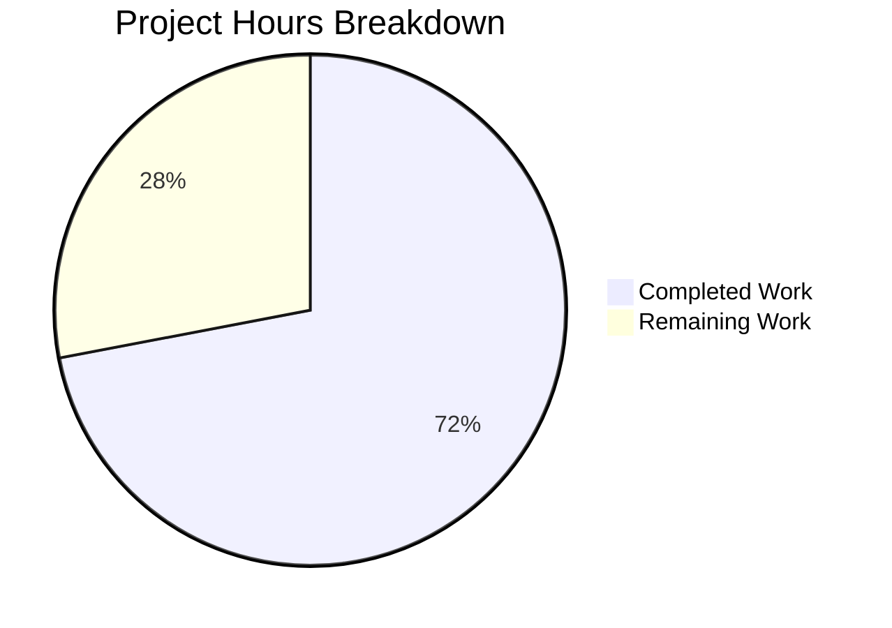
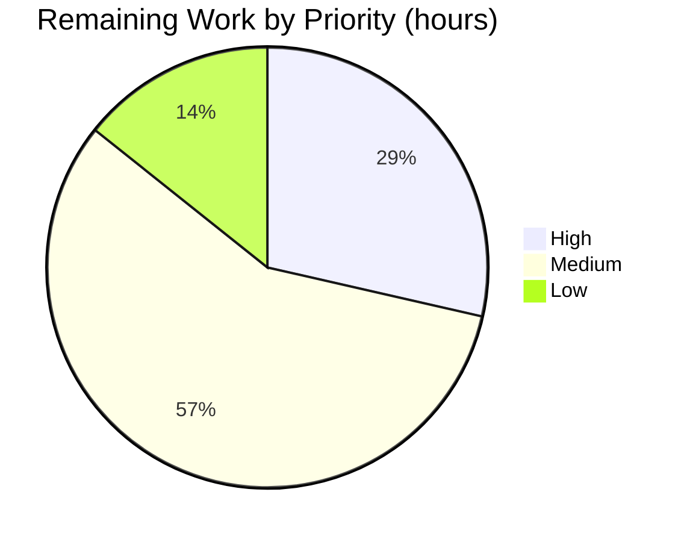

# 1. Executive Summary

## 1.1 Project Overview

`hao-backprop-test` is a minimal Node.js project whose entire deliverable surface is one console script at the repository root: `Welcome.js` prints a single welcome line and doubles as a smoke test and placeholder for backprop integration. Two header comment lines now make its behaviour legible from the file itself, stating the message it prints and the exact command that runs it. Nothing else moved: the statement is byte-identical, the output is unchanged at 18 bytes, and the repository still holds four tracked paths with no dependencies, services, configuration or user interface.

## 1.2 Completion Status

**72% complete — 18.0 of 25.0 hours delivered, 7.0 hours remaining.** The deliverable is finished and verified; the remaining hours are follow-through on the repository's record, a regression gate, the welcome-message wording and two descriptors.


*Colour key — Completed: Dark Blue (#5B39F3) · Remaining: White (#FFFFFF)*

| Metric | Hours |
|---|---|
| Total Hours | 25.0 |
| Completed Hours (AI + Manual) | 18.0 |
| Remaining Hours | 7.0 |

## 1.3 Key Accomplishments

- The script documents itself: a two-line header comment names the printed message and the run command (`Welcome.js:1-2`).
- The comment is byte-exact, ASCII and inside the three-line ceiling, with no blank line before the statement.
- The statement is byte-identical to its pre-change form (sha256 `5c7ac141…`) in an additions-only diff.
- The script still writes exactly `Welcome to Blitzy` — 18 bytes stdout, empty stderr, exit 0 — on both documented runtime lines.
- The acceptance gate passes on both lines and both tracked scripts parse clean.
- One path changed with two added lines; the three untouched paths keep their baseline hashes.
- The zero-install posture holds: no manifest, lockfile, `node_modules` or runtime pin.
- No security surface was introduced: no credentials, inputs, dynamic evaluation or output sink.

## 1.4 Critical Unresolved Issues

**5 of 9** — five items remain open against the nine requirements this work was scoped to. No requirement is unimplemented or unverified; each open item is follow-through on one delivered as written.

| Issue | Impact | Owner | ETA |
|---|---|---|---|
| The tracked record still describes `Welcome.js` as 1 line / 34 bytes with no comment, and its verification block prints a minimality assertion (`wc -l` = 1) the file now fails | A reader, or a copied verification block, is misled; a copied block fails on a line count the file no longer has | Project maintainer | 2 h |
| No automated guard exercises the file: no test, runner, linter or CI exists, so acceptance is manual | A future edit to the printed message or the run command leaves the comment silently wrong | Project maintainer | 3 h |
| The rule governing the welcome message names "Welcome Blitzy" while the script prints `Welcome to Blitzy` | The intended wording of the message is ambiguous | Rule owner | 1 h |
| Two descriptors in the plan of record do not match the checkout: the environment default is given as v22.23.3 (it is v22.23.2) and `README.md` as 2 lines (`wc -l` gives 1) | A machine-checked inventory reads both as mismatches | Project maintainer | 1 h |
| A failed stdout write is silent: with stdout on a full device or closed, the process exits 0 and the message is lost | A supervisor reading only the exit status cannot tell a dropped line from a delivered one | Operator of any wrapper | No in-scope change permitted |

## 1.5 Access Issues

No access issues identified. Nothing blocks build, run or validation: the project needs no credentials, service accounts, API keys or network access.

## 1.6 Recommended Next Steps

1. **[High]** Refresh the tracked record's description of `Welcome.js` and retire its superseded line, then re-run the gate.
2. **[Medium]** Define and document a repeatable regression gate for the file.
3. **[Medium]** Confirm the intended welcome-message wording with the rule's owner.
4. **[Low]** Correct the two plan-of-record descriptors.
5. **[Low]** Have any wrapper verify the emitted content, not the exit status alone.

# 2. Project Hours Breakdown

## 2.1 Completed Work Detail

| Component | Hours | Description |
|---|---|---|
| Script documentation authored to the agreed content contract | 2.0 | The two header comment lines naming the printed message and the run command, positioned directly above the statement with no blank line, ASCII, no in-file markup (`Welcome.js:1-2`). |
| Statement preservation and scope verification | 3.0 | The 34-byte statement held byte-identical (sha256 `5c7ac141…`), the change shown as a single-path additions-only diff, the tracked inventory unchanged at four paths, and the three untouched paths re-checked against their sha256 baselines. |
| Static gate and repository-wide quality checks | 3.0 | `node --check` clean on both documented runtime lines, the whole-tree parse loop exiting 0, plus marker, non-ASCII, trailing-whitespace, file-mode and casing checks and a documentation-scaffolding sweep. |
| Executed acceptance verification | 7.0 | stdout byte, hex and sha256 capture; pre-change versus post-change comparison; stderr emptiness; exit status; cross-runtime equivalence; repeat and concurrent determinism; argument, stdin, environment and stream variants; non-effect sweeps. |
| Security and compliance baseline sweeps | 2.0 | Secret, input-path and injection-sink sweeps over the change and the tree (0 of each), and the compliance evaluation of every deliverable against the agreed quality benchmarks. |
| Superseded-clause and rule-resolution accounting | 1.0 | Recording which clauses of the earlier record no longer describe the file, naming the superseded verification line, and settling the welcome-message rule against the higher-priority requirements. |
| **Total** | **18.0** | |

## 2.2 Remaining Work Detail

| Category | Hours | Priority |
|---|---|---|
| Refresh the tracked record's description of the file and retire its superseded verification line, then re-run the acceptance gate over the touched tree | 2.0 | High |
| Define and document a repeatable regression gate for the file now that it holds more than one statement | 3.0 | Medium |
| Confirm the intended welcome-message wording with the rule's owner | 1.0 | Medium |
| Correct the two plan-of-record descriptors that do not match the checkout | 1.0 | Low |
| **Total** | **7.0** | |

## 2.3 Hour Calculation

| Term | Value | Derivation |
|---|---|---|
| Completed hours | 18.0 | Sum of the six completed components in §2.1 |
| Remaining hours | 7.0 | Sum of the four categories in §2.2 |
| Total project hours | 25.0 | 18.0 + 7.0 |
| Completion | **72%** | (18.0 ÷ 25.0) × 100 |

The percentage covers only the work this change was scoped to — the header comment on `Welcome.js` and the verification and follow-through it implies. No work outside that scope is counted, and no open item is treated as complete: the four remaining categories are the only work left, and each traces to a requirement or to a record that now describes the file inaccurately.

# 3. Test Results

| Area / Category | Framework | Tests | Passed | Failed | Coverage | What This Proves |
|---|---|---|---|---|---|---|
| Script parse, whole tree | Node.js CLI (`node --check`) | 2 files | 2 | 0 | n/a | Both tracked scripts parse clean on the documented reference line and the supported floor. |
| Documented run interface | Executed CLI gate | 8 checks | 8 | 0 | n/a | The documented command writes exactly 18 bytes with empty stderr and exit status 0, identically on both runtime lines. |
| Output preservation | Pre-change vs post-change capture comparison | 1 comparison | 1 | 0 | n/a | The statement behaves exactly as it did before the comment was added — byte-identical stdout, exit 0, empty stderr. |
| Comment contract | File-byte checks | 6 checks | 6 | 0 | n/a | The two comment lines are byte-exact to the agreed text, inside the three-line ceiling, with no blank line, ASCII and no in-file markup. |
| Scope and immutability | git and sha256 checks | 5 checks | 5 | 0 | n/a | One path changed with additions only; the three untouched paths are byte-identical to their baseline hashes. |
| Quality sweeps | Pattern sweeps over the file | 4 sweeps | 4 | 0 | n/a | No placeholder, TODO or dead code; no input surface; no error-handling construct; no non-ASCII bytes or trailing whitespace. |
| Security baseline | Pattern sweeps by weakness class | 4 classes | 4 | 0 | n/a | No credentials, no input paths, no injection sink, no cryptography, deserialization or network surface. |
| Automated test suite | `node --test` (Node.js built-in runner) | 0 | 0 | 0 | 0 of 0 | The repository declares no test file and no runner, so nothing executes automatically — acceptance is the documented manual gate. |

Counts are the checks executed against the delivered change on both documented runtime lines. The repository carries no coverage tooling — adding any would breach its accepted zero-dependency posture — so coverage is given as not applicable rather than as a percentage.

**Not Covered**

- **Automated regression of the script.** Nothing exercises `Welcome.js` when it changes, so a future edit to the printed message or the run command leaves the header comment wrong with no automated signal. A human must re-run the documented gate on any change to the file.
- **No guard of any kind exists around the file.** There is no test file, runner configuration, linter, formatter, scanner or CI workflow in the repository, and the accepted scope forbids adding one; the hand-run gate is the whole acceptance mechanism.
- **The pre-existing HTTP demo in `server.js`.** Its `127.0.0.1:3000` surface is outside this change and was not exercised; no verification of it is claimed here.
- **Coverage measurement.** No coverage tool is installed or permitted, so no coverage figure exists for any part of the project.

# 4. Runtime Validation & UI Verification

Everything below was driven from the repository root against the delivered change. The project has no user interface and no in-scope HTTP endpoint, so no screen, browser flow or responsive layout was exercised; the only HTTP surface in the checkout is the pre-existing `server.js` demo, which is unrelated to this change and was never started.

- ✅ **Script parse** — `node --check Welcome.js` exits 0 with no output, and the whole-tree parse loop over both tracked scripts exits 0.
- ✅ **Documented run interface** — `node Welcome.js` from the repository root prints `Welcome to Blitzy` (18 bytes, hex `57 65 6c 63 6f 6d 65 20 74 6f 20 42 6c 69 74 7a 79 0a`) and exits 0, identically on the v24.21.0 reference line and the v22.23.2 floor.
- ✅ **Output contract** — stderr is empty (0 bytes); stdout is a single LF-terminated line with no prefix, timestamp, banner, level or padding; stdout sha256 `2dc7e85a…`.
- ✅ **Behaviour preservation** — the revision before the comment, extracted from git and run, produced stdout byte-identical to the delivered file's with the same empty stderr and exit status.
- ✅ **No input surface** — identical output under extra arguments (including thousands), piped and closed stdin, environment variables set, and a fully empty environment.
- ✅ **Determinism and concurrency** — repeated and parallel runs produced a single distinct stdout hash, with no interleaving and no non-zero exits.
- ✅ **Non-effect** — the working tree is unchanged after every run, no manifest, lockfile or `node_modules` appears, and no listening socket exists before, during or after a run.
- ✅ **Restrictive runtime** — the script still emits its message under Node's permission model, which denies filesystem, child-process and worker access by default.
- ⚠ **Failed stdout write** — with stdout on a full device (ENOSPC) or closed, the process still exits 0 with empty stderr and the message is lost. This is the runtime's default handling of `console.log`, identical before and after the comment, and no guard may be added inside the accepted scope.
- ⚠ **Reference line is not the default interpreter** — a plain `node` on this host resolves to the supported floor, so every reference-line capture required activating the 24.x line explicitly; behaviour is byte-identical on both.

Nothing failed. Two things were never exercised at runtime and are not claimed: the `server.js` HTTP demo (out of scope, deliberately not started, and its `127.0.0.1:3000` port is hardcoded with no override), and any logging, metrics, health or tracing surface, of which the project has none — the only operator-visible signals are the 18-byte stdout line and the process exit status.

# 5. Compliance & Quality Review

## 5.1 Compliance Matrix

| # | Deliverable / Benchmark | Status | Evidence |
|---|---|---|---|
| 1 | Deliverable completeness — comment present at the top of the file, inside the three-line ceiling, both facts stated | ✅ PASS | `Welcome.js:1-2`, two comment lines, zero blank lines |
| 2 | Comment accuracy — both claims true of the code it describes | ✅ PASS | Message identical to the statement literal; the named command is the file's real invocation from the root |
| 3 | Content contract — byte-exact agreed wording, ASCII, no in-file markup | ✅ PASS | Both lines compare equal character for character; 0 non-ASCII bytes; 0 markup, fence or table markers |
| 4 | Statement preservation — byte-identical, additions-only diff | ✅ PASS | Line 3 sha256 `5c7ac141…` equals the pre-change blob; 2 `+` lines, 0 `-` lines |
| 5 | Output invariance — 18 bytes on stdout, empty stderr, exit 0 | ✅ PASS | Identical on the v24.21.0 reference line and the v22.23.2 floor |
| 6 | Scope discipline — one path changed, three untouched paths byte-identical | ✅ PASS | `git diff --name-only` names `Welcome.js` alone; the three baseline hashes reproduce exactly |
| 7 | Dependency posture — no manifest, lockfile, `node_modules`, install command or runtime pin | ✅ PASS | Four tracked paths before and after; no package-manager command was run |
| 8 | Non-goals respected — no error handling, wrapper, guard, second statement, diagram or documentation scaffolding | ✅ PASS | 0 hits for try/catch/listener/guard; no `docs/` tree, generator, lint or CI configuration |
| 9 | Code quality — no placeholder, TODO or dead code; formatting and file identity preserved | ✅ PASS | 0 marker hits; single-quoted literal, semicolon, no indentation, one terminating LF, mode 644, no trailing whitespace |
| 10 | Security baseline — no credentials, input paths, injection sinks, cryptography, deserialization or network surface | ✅ PASS | The file's only two literals are the message in the comment and the statement's argument |
| 11 | Documentation currency — the repository's record describes the file as it now stands and its verification block passes | ⚠ NOT MET | The record still states 1 line / 34 bytes and no comment, and prints a `wc -l` = 1 assertion the 3-line file fails |
| 12 | Project rule — welcome message delivered in the repository's relevant format with simple, crisp code | ✅ PASS | Delivered by the root console script and documented in place; the rule's literal "create" clause gives way to the higher-priority requirements |

## 5.2 AAP & Rule Divergences and Gaps

| # | What the AAP/Rule Required | What Was Delivered Instead | Why It Diverged | Impact | Remediation |
|---|---|---|---|---|---|
| 1 | The project rule: create the "Welcome Blitzy" message in the relevant format, with simple and crisp code | The pre-existing literal `Welcome to Blitzy` preserved byte-identically and documented in place (`Welcome.js:3`, comment at `Welcome.js:1-2`) | The requirements for this change forbid editing, renaming, reformatting or moving the statement or changing the message it prints, and they outrank the rule | The rule names a differently worded message than the script prints | Confirm the intended wording; ~1 h (Sanctioned — required by the higher-priority requirements) |
| 2 | The change present as a working-tree modification, checked by `git status --porcelain` reading exactly ` M Welcome.js` | The change is the committed revision `9a4261e` on the branch, so the working tree is clean | The platform's completion path commits the change rather than leaving it uncommitted | None on the artefact; the same facts come from the diff against the base branch | Read the range diff (`M Welcome.js`, 2 insertions, 0 deletions) rather than the working tree |
| 3 | The record's own rule that its acceptance gate be re-run on any change to this file | The tracked record at `blitzy/documentation/Project Guide.md` was left byte-identical, so it still describes 1 line / 34 bytes with no comment and still prints `wc -l` = 1 | The agreed scope marks that path out of scope and immutable, so its stale clauses were deliberately not edited | A reader, or a copied verification block, is misled; a copied block asserts a line count the file no longer has | Refresh those clauses and retire the superseded line, then re-run the gate; ~2 h |
| 4 | The record's own condition for guarding this file: a guard once the file holds more than one statement | Acceptance remains manual: no test file, runner, linter, formatter, scanner or CI exists, although that condition is now met | The agreed scope forbids any new path, manifest or tooling; the zero-install, zero-dependency posture is an acceptance criterion | A future edit to the literal or the invocation leaves the comment silently wrong | Define and document a repeatable gate for the file; ~3 h |
| 5 | No error handling around the statement (an explicit non-goal) | No guard was added, so a failed stdout write is silent: `/dev/full` (ENOSPC) and a closed stdout both exit 0 with the message lost | The agreed scope forbids try/catch, listeners, guards and exit-code handling; the behaviour is the runtime's default and identical before and after the change | A supervisor reading only the exit status cannot distinguish a dropped line from a delivered one | Accepted caveat; no in-scope change may settle it — have any wrapper verify the emitted content |
| 6 | Accuracy of the plan of record's descriptive claims about the environment and the repository | The checkout's default interpreter is v22.23.2, not the v22.23.3 stated, and `README.md` is 2 text lines / 58 bytes with no terminating newline, so `wc -l` gives 1 rather than the stated 2 | The record's environment text conflicts with its own documented floor and with the host image; the README descriptor counts text lines rather than `wc -l` | None on the deliverable; a machine-checked inventory reads both as mismatches | Correct the two descriptors; ~1 h |

**1 — The rule's wording versus the delivered literal (Sanctioned).** The project rule asks for the "Welcome Blitzy" message to be created in the relevant format with simple and crisp code; the script prints `Welcome to Blitzy` (`Welcome.js:3`). Rewriting that literal was not available to this change: the requirements forbid editing, renaming, reformatting or moving the statement or altering the message it prints, and they outrank the rule. The rule was therefore satisfied by making the existing message legible in place, with the two-line header comment at `Welcome.js:1-2`. Nothing here is broken, but the rule text names a wording the code does not print, so someone should confirm which was intended: if "Welcome Blitzy" is the intended message, that is a one-line change to the literal plus a matching comment update; if the rule named the existing message, no change is needed.

**2 — The change arrives committed, not in the working tree.** The verification described the change as an uncommitted modification, checked by `git status --porcelain` reading exactly ` M Welcome.js`; the delivered change is instead the committed revision `9a4261e` ("docs(Welcome.js): add header comment naming the printed message and run command"), so the working tree is clean. This is a difference in delivery form, not in content: the platform's completion path commits the work. The facts the check exists to establish are fully available from the base-branch comparison — `git diff --name-status origin/05-Oct-26-Br1...HEAD` returns `M Welcome.js`, `git diff --numstat` returns `2 0`, and the statement still hashes to `5c7ac141…`. Nothing needs changing; a future reviewer should read the range diff rather than the working tree, or the change will look absent.

**3 — The repository's own record now describes the file inaccurately.** The tracked record at `blitzy/documentation/Project Guide.md` states that `Welcome.js` is 1 line / 34 bytes, "carries no comment or padding", and it publishes a verification block whose minimality assertion is `wc -l < Welcome.js` = 1. The file is now 3 lines / 109 bytes, so that assertion fails and the description is wrong. It was left byte-identical because the agreed scope marks that path out of scope and immutable, and its own rule requires the gate to be re-run on any change to this file. The consequence is a live trap: anyone who copies that block into automation gets a false failure, and anyone who trusts the record over the file misjudges the tree. Refreshing the clauses and retiring the superseded line closes it.

**4 — Nothing guards the file, and the trigger for guarding it has now been met.** `Welcome.js` is verified only by hand: the repository declares no test file, no runner, no linter, no formatter, no scanner and no CI workflow, and `node --test` finds zero tests. The record itself states that a guard would be warranted once the file held more than one statement — a condition the added comment line now satisfies. No guard was added because the accepted scope forbids any new path, manifest or tooling, and the zero-install, zero-dependency posture is an explicit acceptance criterion. The residual risk is documentation drift: the comment names the printed message and the run command, and a future edit to either leaves it wrong with nothing to catch it. The remedy is a documented, repeatable gate rather than new tooling.

**5 — A failed write to stdout is silent.** With stdout redirected to a full device (ENOSPC) or closed, `node Welcome.js` still exits 0 with empty stderr while the message is lost, so a supervisor that treats exit status 0 as delivery cannot tell a dropped line from a delivered one. This is the runtime's default handling of a `console.log` write, and it behaves identically before and after the comment — the change neither introduced nor worsened it. It cannot be settled inside the accepted scope, which explicitly forbids adding `try`/`catch`, an `uncaughtException` listener, a guard or exit-code handling around the statement, and it lies outside the documented invocation. Treat it as a known caveat wherever the script is wrapped: verify the emitted content rather than the status alone.

**6 — Two descriptors in the plan of record do not match the checkout.** The environment is described as providing interpreter v22.23.3 by default; the host's default is v22.23.2, which is exactly the floor the same record documents as supported, and the 24.x reference line is the one every capture asserted explicitly. Separately, `README.md` is described as 2 lines / 58 bytes; the byte count is right, but the file's second line has no terminating newline, so `wc -l` gives 1. Neither affects the delivered change: both runtime lines were exercised and produced identical bytes, and `README.md` is out of scope and byte-identical. They matter only to a mechanical audit, which would read them as two unexplained mismatches. Correcting both is a descriptive edit.

# 6. Risk Assessment

| Risk | Category | Severity | Probability | Mitigation | Status |
|---|---|---|---|---|---|
| The header comment goes stale silently: nothing exercises it, so an edit to the printed message or the run command leaves the documentation wrong with no signal | Technical | Medium | High on any future edit to the file | Define and document the repeatable gate before the next change to `Welcome.js` | Open — needs a human decision (3 h) |
| A verification block copied from the tracked record fails on the line count it asserts (`wc -l < Welcome.js` = 1, against a 3-line file) | Operational | Medium | Medium | Refresh the record's clauses for the file and retire the superseded line | Open (2 h) |
| The runtime line is unpinned: no manifest, `engines` field, `.nvmrc` or CI exists, and a plain `node` resolves to the v22.23.2 floor rather than the v24.21.0 reference line | Technical | Low | Medium | Assert the documented reference line explicitly in any automation; output is byte-identical on both lines | Accepted — required by the zero-install posture |
| A failed stdout write is invisible: with stdout full or closed the process exits 0 and the message is lost | Operational | Medium | Low | Have any supervisor wrapping the script verify the emitted content, not the exit status alone | Accepted caveat — the agreed scope forbids a guard |
| The intended wording of the welcome message is ambiguous: the governing rule names "Welcome Blitzy", the script prints `Welcome to Blitzy` | Delivery | Low | Medium | Confirm the intended wording with the rule's owner before treating the message as final | Open (1 h) |
| The neighbouring HTTP demo binds a fixed port: `server.js` listens on `127.0.0.1:3000` with no override and no error handling | Integration | Low | Low | Do not start it on a shared host; treat the port and host as fixed | Accepted — out of scope and byte-identical |
| New attack surface could be introduced into the file later: today it has no credentials, inputs, dynamic evaluation or output sink beyond a constant literal | Security | Low | Low | Keep the file input-free and re-check the zero-secret, zero-input, zero-sink baseline on any change | Verified green — no surface exists now |

# 7. Visual Project Status



*Colour key — Completed Work: Dark Blue (#5B39F3) · Remaining Work: White (#FFFFFF)*



| Priority | Hours | Categories |
|---|---|---|
| High | 2.0 | Refresh the tracked record and re-run the acceptance gate |
| Medium | 4.0 | Regression gate for the file (3.0); welcome-message wording (1.0) |
| Low | 1.0 | Plan-of-record descriptors |
| **Total** | **7.0** | Matches the Remaining Hours in §1.2 and the §2.2 total |

# 8. Summary & Recommendations

The project is **72% complete** against the work it was scoped to: 18.0 of 25.0 hours delivered, 7.0 hours remaining. The in-scope deliverable — a two-line header comment at the top of `Welcome.js` that names the message the script prints and the command that runs it — is complete and verified. The comment sits directly above the statement with no blank line, is byte-exact to the agreed wording, stays inside the three-line ceiling, and the file remains ASCII, mode 644, with a single terminating newline.

Verification was end to end rather than by inspection. The statement is byte-identical to its pre-change form (sha256 `5c7ac141…`), so the diff against the base branch holds two added lines, no deletions, and the statement as unchanged context. Running the script writes exactly `Welcome to Blitzy` — 18 bytes, hex `57 65 6c 63 6f 6d 65 20 74 6f 20 42 6c 69 74 7a 79 0a` — with empty stderr and exit status 0, identically on the v24.21.0 reference line and the v22.23.2 floor. The output is deterministic across repeated and parallel runs, unchanged under arguments, piped or closed stdin, environment variables and a fully empty environment, and the revision before the comment produces byte-identical stdout. Both tracked scripts parse clean, the repository still holds four tracked paths, and the three untouched paths match their baseline hashes exactly.

Four gaps remain to be closed, and one caveat cannot be closed at all. The tracked record still describes the file as one line with no comment and prints a minimality assertion the 3-line file now fails, so a reader or a copied verification block is misled; that is the only High-priority item. Nothing guards the file — no test, runner, linter or CI exists, by design — while the record's own condition for adding a guard has now been met, so a repeatable gate should be defined and documented. The governing rule for the welcome message names "Welcome Blitzy" against the `Welcome to Blitzy` the script prints, which needs one confirmation. Two descriptors in the plan of record do not match the checkout. The caveat is a failed stdout write: it is silent, so a supervisor reading only the exit status cannot tell a dropped line from a delivered one, and the accepted scope forbids the guard that would settle it.

| Metric | Value |
|---|---|
| Completion (scoped work) | 72% |
| Completed hours | 18.0 |
| Remaining hours | 7.0 |
| Tracked paths changed | 1 (`Welcome.js`, +2 / −0) |
| Output contract | 18 bytes stdout · 0 bytes stderr · exit 0 |
| Runtime lines verified | v24.21.0 (reference) and v22.23.2 (floor) |

**Production readiness: ready for release, with the record refresh as the one item worth doing first.** The change is two comment lines that never execute; the file's only executable line is byte-identical to its baseline, proven by running the earlier revision and comparing stdout; the tree gains no path, dependency, manifest or runtime pin; and nothing outside `Welcome.js` was modified. Treat the record refresh as the first action because it removes a live trap — a verification block that now fails — and because it is the fastest way to bring the repository's own description of the file back in step with the file. Then decide on the regression gate and confirm the message wording; neither blocks a release.

# 9. Development Guide

### System Prerequisites

- **Node.js.** The project documents two runtime lines: a 24.x reference line (v24.21.0, the line every capture in this guide was taken on) and a 22.x supported floor (v22.23.2, also the host's default `node`; Node 22 reaches end of life on 30 April 2027). Either runs the script, and output is byte-identical on both.
- **A POSIX shell** and `git`. Because the repository's `pre-push`, `post-checkout`, `post-commit` and `post-merge` hooks are git-lfs shims with `filter.lfs.required` set, **git-lfs** (3.7.1 tested) must be installed for clone, checkout and push.
- **Nothing else.** No database, cache, message queue, container runtime or service is involved, and no port is bound by the script.

### Environment Setup

- Node has no virtual-environment concept and this project has none: the isolated environment is a `PATH` prefix to the chosen runtime's `bin` directory.
- No environment variable, secret, credential or configuration file is read. The script also produces identical output under a completely empty environment (`env -i`).

### Dependency Installation

None, ever. The tree holds no `package.json`, no lockfile and no `node_modules`, and must keep none — the manifest-free, zero-install posture is an acceptance criterion. **Do not run `npm install`, `npm init` or `npm ci`,** and do not add a manifest, lockfile, `.gitignore`, test file or scratch file to the tree. The script's only external entity is the ambient `console` global.

### Build

Nothing to build: there is no bundler, transpiler or code-generation step. The build-equivalent, read-only gate is `node --check`.

### Application Startup

There is no service to start and no startup order to observe.

```bash
cd <checkout root>
node Welcome.js          # prints exactly: Welcome to Blitzy
```

Expected: 18 bytes on stdout, 0 bytes on stderr, exit status `0`, roughly 22 ms. To run the documented reference line instead of the floor, activate it first:

```bash
PATH=<node-24-install>/bin:$PATH node Welcome.js
PATH=<node-24-install>/bin:$PATH node --version   # v24.21.0
```

### Verification Steps

Run the whole gate from the repository root, on both runtime lines:

```bash
node --check Welcome.js && echo "parse OK"           # parse OK
out=$(node Welcome.js); echo "[$out]"                # [Welcome to Blitzy]
node Welcome.js | wc -c                              # 18
node Welcome.js 2>&1 >/dev/null | wc -c              # 0
node Welcome.js >/dev/null; echo "exit=$?"           # exit=0
node Welcome.js | od -An -t x1                       # 57 65 6c 63 6f 6d 65 20 74 6f 20 42 6c 69 74 7a 79 0a
ls Welcome.js                                        # Welcome.js
for f in $(git ls-files '*.js'); do node --check "$f"; done   # exit 0
node --test                                          # tests 0 / suites 0 / pass 0 / fail 0, exit 0
```

The published block for this file also carries a line-count assertion, `wc -l < Welcome.js` = 1. That line predates the header comment and **must not be used as a pass criterion**: the file is 3 lines / 109 bytes. The other eight checks stand. `node --test` finds zero tests because the project declares no test file and no runner — this gate is the acceptance mechanism, so run it by hand on every change to `Welcome.js`.

### Example Usage

```bash
$ node Welcome.js
Welcome to Blitzy

$ node Welcome.js | od -An -t x1
 57 65 6c 63 6f 6d 65 20 74 6f 20 42 6c 69 74 7a
 79 0a

$ node Welcome.js >/dev/null; echo "exit=$?"
exit=0
```

### Troubleshooting

| Symptom | Cause | Resolution |
|---|---|---|
| `Error: Cannot find module '<root>/welcome.js'`, exit 1 | Wrong filename casing on a case-sensitive filesystem | Use `Welcome.js` exactly as cased |
| The same module-not-found error from another directory | The documented command is working-directory relative | Run it from the repository root, or pass an absolute path to `Welcome.js` |
| A different Node version than expected | A plain `node` resolves to the host default (the documented floor), not the 24.x reference line | Activate the reference line with the `PATH` prefix shown above |
| A copied verification block fails on the line count | That assertion predates the header comment; the file is now 3 lines | Drop the line-count assertion; do not edit the file to satisfy it |
| No output but `exit=0` | The stdout write failed silently (full device, or stdout closed) | Keep stdout open and verify the emitted content, not the exit status alone |
| Port or network checks unavailable | `lsof`, `ss`, `netstat` and `strace` are not installed on this host | Use `curl` or a process's own log. Only `server.js` binds a port, fixed at `127.0.0.1:3000` |
| Clone/checkout/push hooks fail | The hook scripts are git-lfs shims and LFS is required | Install git-lfs (3.7.1 tested) before cloning or pushing |

# 10. Appendices

### A. Command Reference

| Command | Purpose | Expected result |
|---|---|---|
| `node Welcome.js` | Run the script from the repository root | `Welcome to Blitzy`, 18 bytes stdout, 0 bytes stderr, exit 0 |
| `PATH=<node-24-install>/bin:$PATH node Welcome.js` | Run on the documented 24.x reference line | Identical output to the line above |
| `node --check Welcome.js` | Parse-only gate; never executes the file | No output, exit 0 |
| `node Welcome.js \| wc -c` | Verify the stdout byte count | `18` |
| `node Welcome.js 2>&1 >/dev/null \| wc -c` | Verify stderr is empty | `0` |
| `node Welcome.js >/dev/null; echo "exit=$?"` | Check the exit status | `exit=0` |
| `node Welcome.js \| od -An -t x1` | Byte-exact output check | `57 65 6c 63 6f 6d 65 20 74 6f 20 42 6c 69 74 7a 79 0a` |
| `for f in $(git ls-files '*.js'); do node --check "$f"; done` | Parse every tracked script | No output, exit 0 |
| `node --test` | Show the declared test suite | `tests 0 / suites 0 / pass 0 / fail 0`, exit 0 |
| `git diff --name-status <base>...HEAD` | Confirm the change's scope | `M Welcome.js`, one path |
| `sha256sum Welcome.js server.js README.md "blitzy/documentation/Project Guide.md"` | Confirm preservation of the untouched paths | The three untouched paths reproduce their baseline hashes |

### B. Port Reference

| Path | Host | Port | Notes |
|---|---|---|---|
| `Welcome.js` | — | none | The script binds no port, opens no socket and starts no service |
| `server.js` | `127.0.0.1` | `3000` | Pre-existing HTTP demo, out of scope; host and port are hardcoded (`server.js:3-4`) with no override, so it cannot be re-pointed and must not be started on a shared host |

### C. Key File Locations

| Path | Role |
|---|---|
| `Welcome.js` | The deliverable: the root console script and the file this change documents (3 lines / 109 bytes) |
| `README.md` | Repository stub naming no sibling file (2 text lines / 58 bytes, no terminating newline) |
| `server.js` | Pre-existing "Hello, World!" HTTP demo, unchanged and unrelated to this change |
| `blitzy/documentation/Project Guide.md` | The tracked record of earlier work on `Welcome.js`; its description of the file is now out of date |

### D. Technology Versions

| Component | Version | Notes |
|---|---|---|
| Node.js (reference line) | v24.21.0 | The line every capture in this guide was taken on |
| Node.js (supported floor) | v22.23.2 | Host default (`/usr/bin/node`); Node 22 end of life 30 April 2027 |
| git-lfs | 3.7.1 | Required: the repository's hooks are LFS shims with `filter.lfs.required` set |
| Third-party packages | none | No manifest, lockfile or `node_modules`; the only external entity is `console` |

### E. Environment Variable Reference

None. `Welcome.js` reads no environment variable, argument, stdin byte or file, and produces identical output under a fully empty environment. The project requires no secrets, credentials or configuration, and none should be added.

### F. Developer Tools Guide

| Tool | Status | Use |
|---|---|---|
| `node` | Installed | Run and parse-gate the script; `--test` shows the suite, which is empty |
| `git` | Installed | Scope and preservation checks against the base branch |
| `git-lfs` | Installed (3.7.1) | Required by the repository's hooks |
| `sha256sum`, `od`, `wc`, `stat` | Installed | Byte-level verification of the file and its output |
| `curl` | Installed | The only practical way to probe a port on this host |
| `lsof`, `ss`, `netstat`, `strace`, `xxd` | **Not installed** | Port, socket and syscall inspection is unavailable; rely on `curl`, `/proc/net/tcp` and the process's own output |
| Test runner, linter, formatter, scanner, CI | **None, by design** | The project's accepted scope forbids adding any of them; `node --check` plus the gate above is the whole static pass |

### G. Glossary

| Term | Meaning |
|---|---|
| Reference line | The Node.js version the project documents and verifies against: v24.21.0 |
| Supported floor | The oldest documented runtime: v22.23.2, the host's default `node` |
| Acceptance gate | The hand-run command block in §9 that proves the script parses and emits exactly `Welcome to Blitzy` |
| Output contract | 18 bytes on stdout, 0 bytes on stderr, exit status 0 |
| Zero-install posture | The accepted requirement that the tree carry no manifest, lockfile or `node_modules`, and that no package-manager command be run |
| Superseded line | The `wc -l` = 1 assertion in the tracked record, which the header comment made obsolete |
