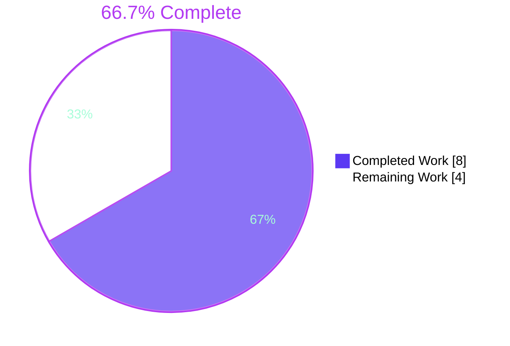
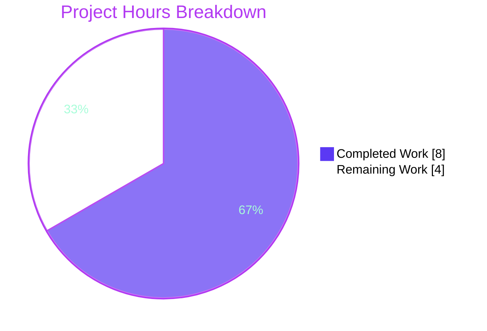
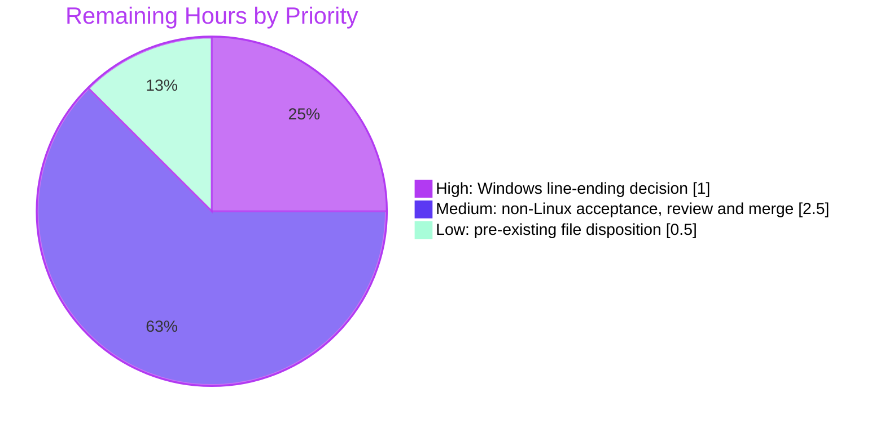

# 1. Executive Summary

## 1.1 Project Overview

This project delivers `welcome`, a one-line POSIX shell program at the repository root that prints `Welcome to Blitzy` to standard output. It answers a request for the lightest, fewest-token language: the statement `echo Welcome to Blitzy` is 22 characters and 6 BPE tokens, and runs on any host's `sh` with no build, install or dependency. It serves developers and evaluators who run `sh welcome` as a smoke check. The technical scope is deliberately one 23-byte file; scaffolding, tests, CI and documentation files are excluded by design, and pre-existing repository content is left untouched.

## 1.2 Completion Status



| Metric | Value |
|---|---|
| Total Hours | 12.0 |
| Completed Hours (AI + Manual) | 8.0 (8.0 AI + 0.0 manual) |
| Remaining Hours | 4.0 |
| Percent Complete | 66.7% |

8.0 hours completed out of 12.0 total hours = 66.7% complete. All AAP-specified implementation is done; the remaining 4.0 hours are path-to-production work.

## 1.3 Key Accomplishments

- ✅ `welcome` matches its contract byte for byte: 23 bytes, ASCII, LF, no BOM or shebang, mode `100644`
- ✅ `sh welcome` writes exactly the 18 specified bytes, nothing to stderr, and exits 0
- ✅ Identical output under `sh` (dash), `dash`, `bash` and `bash --posix`, plus six further shells in Linux containers
- ✅ Output is unaffected by arguments, environment, locale, `IFS`, working directory and stdin; 100 repeated runs are identical and leave the tree untouched
- ✅ Write failures exit non-zero with the shell's own diagnostic, with no added handler, as the AAP requires
- ✅ No network, no child processes, and a single write to fd 1; runs unprivileged
- ✅ 22 characters and 6 tokens in `cl100k_base` and `o200k_base`; about 0.85 ms per run
- ✅ `welcome` is the only path added; every AAP exclusion is absent and pre-existing files are byte-identical

## 1.4 Critical Unresolved Issues

2 open items, both against the portability requirement (1 of 11 AAP requirements). The other 10 requirements have nothing open.

| Issue | Impact | Owner | ETA |
|---|---|---|---|
| A `core.autocrlf=true` checkout (the Git for Windows default) converts `welcome` to CRLF; see Section 5.2, row 1 | Git Bash on Windows prints `Welcome to Blitzy\r\n` (19 bytes) instead of the specified 18 | Repository owner | 1.0 h |
| macOS, BSD, WSL and Git Bash hosts, all named deployment targets, have never run `welcome` | Portability to those hosts rests on POSIX conformance, not observation | QA engineer | 2.0 h |

## 1.5 Access Issues

| System/Resource | Type of Access | Issue Description | Resolution Status | Owner |
|---|---|---|---|---|
| macOS, Windows (Git Bash, WSL) and BSD test hosts | Runtime test environment | The validation environment is Linux-only, so these named targets could not be exercised | Open: needs a human with access to those hosts | QA engineer |

## 1.6 Recommended Next Steps

1. [High] Decide how `welcome` survives a Windows checkout: add a one-line `.gitattributes` (`welcome text eol=lf`), which the AAP excluded, or document `git config core.autocrlf input` for Windows users.
2. [Medium] Run the whole-package gate (Section 9.4) on macOS, WSL, Git Bash and FreeBSD, and record the results.
3. [Medium] Review and merge commit `b64507c` into `main`.
4. [Low] Decide whether the pre-existing `Welcome.js`, `server.js`, `README.md` and `blitzy/documentation/Project Guide.md` stay alongside `welcome`.

# 2. Project Hours Breakdown

## 2.1 Completed Work Detail

| Component | Hours | Description |
|---|---|---|
| Language selection and source-size measurement (FR-3, performance NFR) | 1.0 | POSIX `sh` chosen as the lightest runtime and the shortest statement: 22 characters, 6 tokens in `cl100k_base` and `o200k_base`, about 0.85 ms per run, no build step |
| `welcome` implementation (FR-1, FR-2, AAP 0.4.1 file contract) | 0.5 | `welcome` created at the repository root as `echo Welcome to Blitzy` plus LF: 23 bytes, ASCII, unquoted, no shebang or comments, mode `100644` (commit `b64507c`) |
| Acceptance and cross-shell portability verification (AAP 0.10.3, implicit requirements, portability on Linux) | 2.0 | Exact 18-byte stdout, empty stderr and exit 0 under 10 conforming shells; clean-clone delivery; per-change command and whole-package gate (Section 9.4) |
| Determinism, repeatability and failure-path verification (AAP 0.1.1, 0.10.1) | 2.0 | Arguments, `env -i`, locales including a real `tr_TR.UTF-8`, `IFS`, working directory and stdin; repeated and concurrent runs; closed stdout, full stdout, SIGPIPE, unreadable and missing file |
| Security NFR runtime verification (AAP 0.10.2) | 2.0 | Syscall traces, a network-less namespace, an unprivileged uid, hostile argv, stdin and environment, and secret non-leakage |
| Scope, exclusions and AB_New Product continuity (AAP 0.6, 0.8) | 0.5 | Only `welcome` added; every excluded path absent; pre-existing blobs unchanged; no tracked file references `welcome` |
| **Total** | **8.0** | |

## 2.2 Remaining Work Detail

| Category | Hours | Priority |
|---|---|---|
| Windows line-ending decision and guard for `welcome` (Section 5.2, row 1) | 1.0 | High |
| Acceptance on non-Linux targets: macOS, WSL, Git Bash, FreeBSD (portability requirement) | 2.0 | Medium |
| Code review and merge of `b64507c` into `main` (path-to-production) | 0.5 | Medium |
| Disposition of pre-existing repository files (Section 5.2, row 2) | 0.5 | Low |
| **Total** | **4.0** | |

# 3. Test Results

All tests below were run from the repository root on Ubuntu 25.10 with `sh` → dash 0.5.12-12ubuntu2, bash 5.2.37 and shellcheck 0.10.0. The AAP deliberately ships no test files (AAP 0.10.3), so the suite is the two verification commands in Section 9.4 plus a runtime matrix checked against the expected bytes `57 65 6c 63 6f 6d 65 20 74 6f 20 42 6c 69 74 7a 79 0a`. The script has one line, and every test executes it.

| Area / Category | Framework | Tests | Passed | Failed | Coverage | What This Proves |
|---|---|---|---|---|---|---|
| Static contract gate (whole-package gate; the per-change command also prints `PASS`) | `sh -n`, `shellcheck -s sh`, `od`, `wc`, `grep`, `test` | 12 | 12 | 0 | 1/1 line | The file is valid POSIX sh, lint-clean, exactly 23 bytes on one line, free of CR, BOM and shebang, and not executable |
| Output and cross-shell equivalence | `sh`, `dash`, `bash`, `bash --posix` with `cmp` | 10 | 10 | 0 | 1/1 line | Every installed shell writes the same 18 bytes, nothing to stderr, and exits 0 |
| Determinism and input inertness | Shell matrix with `cmp` | 24 | 24 | 0 | 1/1 line | Output is unchanged by hostile arguments (`$(id)`, `;id`, `-n`, `\c`, `*`), `LC_ALL=C`, `env -i`, `IFS=:`, another working directory and random stdin |
| Failure paths | Shell matrix (`>&-`, `>/dev/full`) | 8 | 8 | 0 | 1/1 line | An unwritable stdout exits 1 with the shell's diagnostic under every shell |
| Repeatability, side effects and exit status | `git status`, `sha256sum`, `uniq -c` | 3 | 3 | 0 | 1/1 line | 100 runs print identical lines, leave the tree and file hash unchanged, and exit 0 |
| Source size and lightness | `tiktoken`, `wc`, `time` | 4 | 4 | 0 | n/a | The statement is 22 characters and 6 tokens in both encodings; 200 runs take 0.170 s (about 0.85 ms each) |
| Delivery and encoding hazards | `git clone`, `od` | 5 | 4 | 1 | n/a | A clean clone delivers 23 bytes at `100644` and prints exact output; CRLF and BOM copies fail as AAP 0.4.1 documents; an `autocrlf=true` clone prints 19 bytes (open, Section 5.2 row 1) |
| Caller-environment boundary | `env 'BASH_FUNC_echo%%=…'` | 1 | 1 | 0 | n/a | `sh welcome` ignores a bash exported-function override; `bash welcome` does not (Section 5.2 row 3) |
| **Total** | | **67** | **66** | **1** | | |

**Not Covered**

- **Non-Linux hosts.** macOS `/bin/sh`, FreeBSD `sh`, WSL and Git Bash on Windows are named targets but have never run `welcome`. Before release, run the whole-package gate on each (Section 9.4).
- **Windows-default checkout guard.** Nothing in the repository stops an `autocrlf=true` checkout from converting the file to CRLF. The one failing test above reproduces this. Decide on and test a guard (Section 5.2, row 1).
- **Regression protection.** By AAP design there is no committed test or CI job, so a future edit that adds a BOM, CRLF or shebang is caught only if someone runs the gate by hand.
- **Direct execution (`./welcome`).** Out of scope by AAP 0.6.2. It exits 126 with `Permission denied`, and no test covers it.

# 4. Runtime Validation & UI Verification

`welcome` has no UI, API, authentication or external integration; standard output is its only interface. No browser flow applies. Runtime validation drove the program itself:

- ✅ **Operational: start-up and acceptance.** `sh welcome` from the repository root and from a clean `git clone` prints `Welcome to Blitzy` plus LF (18 bytes), writes nothing to stderr and exits 0, with no build or install step.
- ✅ **Operational: shell portability on Linux.** Output is byte-identical under `sh` (dash 0.5.12), `dash`, `bash` 5.2.37 and `bash --posix`, and under BusyBox 1.37 and 1.38, ksh93u+m, mksh, yash 2.60, posh and `zsh --emulate sh` in Linux containers.
- ✅ **Operational: invocation contexts.** Output is the same via an absolute path, another working directory, `sh < welcome`, `cat welcome | sh`, `$(sh welcome)`, Python `subprocess`, a symlink and a pseudo-terminal (where the tty shows its normal `\r\n` translation).
- ✅ **Operational: failure behaviour.** Closed or full stdout exits 1 with a diagnostic, and a closed pipe ends with SIGPIPE (141). An unreadable copy run as an unprivileged user exits 2 under dash and 126 under bash; a missing file exits 2 or 127. No run hangs or reports false success.
- ✅ **Operational: security properties.** Syscall traces under `sh`, `dash` and BusyBox show one `write(1, …, 18)`, no network syscalls, no child processes and no write-mode opens. Output is identical inside a network-less namespace and as uid 65534 with no capabilities. Secrets set in the environment never reach stdout or stderr.
- ✅ **Operational: pre-existing content.** `node Welcome.js` and `server.js` (run in an isolated network namespace) behave identically at the base commit and at HEAD.
- ⚠ **Partial: Windows-default checkout.** A `core.autocrlf=true` clone makes `welcome` 24 bytes, and it then prints 19 bytes ending `0d 0a` (Section 5.2, row 1).
- ⚠ **Partial: caller-controlled bash environment.** `BASH_FUNC_echo%%` and `BASH_ENV` change the output of `bash welcome`; the AAP invocation `sh welcome` is unaffected (Section 5.2, row 3).
- ⚠ **Never exercised: non-Linux hosts.** `welcome` has not been run at all on macOS, FreeBSD, WSL or Git Bash on Windows.

# 5. Compliance & Quality Review

## 5.1 Compliance Matrix

| # | AAP Deliverable | Benchmark | Status | Progress | Evidence |
|---|---|---|---|---|---|
| 1 | FR-1: print `Welcome to Blitzy` | Byte-exact 18-byte stdout | ✅ PASS | 100% | `sh welcome \| od -An -tx1 -w18` |
| 2 | FR-2: file named `welcome` | Root path, no extension, no case-fold collision with `Welcome.js` | ✅ PASS | 100% | `git ls-files -s welcome` |
| 3 | FR-3: lightest, fewest-token language | 22 characters, 6 tokens, no build step | ✅ PASS | 100% | `welcome:1` |
| 4 | Implicit: exit 0, one LF, empty stderr | Acceptance, AAP 0.10.3 | ✅ PASS | 100% | Whole-package gate |
| 5 | Determinism | Unaffected by arguments, environment, locale and stdin | ✅ PASS | 100% | 24-case matrix |
| 6 | File contract, AAP 0.4.1 | 23 bytes, ASCII, LF, no BOM, shebang or comments, `100644` | ✅ PASS | 100% | Blob `2def75e8` |
| 7 | Portability | Any conforming POSIX `sh` on Linux, macOS, BSD, WSL and Git Bash | ⚠ PARTIAL | Linux verified; non-Linux hosts and the Windows checkout open | Sections 3 and 4 |
| 8 | Security NFR | No input, stdout only, no network, no privileges | ✅ PASS | 100% | Syscall traces, namespace and uid 65534 runs |
| 9 | Performance NFR | No build step; about 1 ms per run | ✅ PASS | 100% | 0.85 ms per run |
| 10 | Failure behaviour, AAP 0.10.1 | Left to `sh` and `echo`; non-zero exit, no handler | ✅ PASS | 100% | Exit 1 on closed or full stdout |
| 11 | Scope, AAP 0.6 and 0.7 | Only `welcome` created; every exclusion absent | ✅ PASS | 100% | `git diff --name-status origin/main` shows `A welcome` |
| 12 | Rule AB_New Product and code quality | Written fresh from the prompt; lint-clean; no placeholders or comments | ✅ PASS | 100% | `shellcheck -s sh welcome`; pre-existing blobs unchanged |

## 5.2 AAP & Rule Divergences and Gaps

| # | What the AAP/Rule Required | What Was Delivered Instead | Why It Diverged | Impact | Remediation |
|---|---|---|---|---|---|
| 1 | An LF-terminated file that runs unchanged on the named targets, including Git Bash on Windows (AAP 0.1.1, 0.1.2, 0.6.1) | An LF blob with no line-ending guard; an `autocrlf=true` checkout turns it into CRLF | The AAP makes Git Bash a target but excludes `.gitattributes` (0.6.2), the only in-repository guard | A default Git for Windows checkout prints a trailing `\r` (19 bytes) | The owner chooses: add `welcome text eol=lf`, or document `core.autocrlf input` |
| 2 | A repository containing only `welcome` (AAP 0.5.1), built as a new project (AB_New Product) | `welcome` sits beside the unchanged pre-existing `Welcome.js`, `server.js`, `README.md` and `blitzy/documentation/Project Guide.md` | These files were already on `main`, and the work was scoped to leave them byte-identical rather than modify existing code | `README.md` does not mention `sh welcome`, and two programs print the same line | The owner decides whether to keep, retire or document them |
| 3 | Deterministic output "under a conforming `sh` and `echo`" (AAP 0.1.1), with the source fixed byte for byte (0.4.1) | A caller-exported bash function (`BASH_FUNC_echo%%`) overrides `echo` in `bash welcome`; accepted, not mitigated | Mitigation (`command echo`) would change the AAP-fixed source; an overridden `echo` falls outside the AAP's conforming-`echo` condition | Affects only `bash welcome` with a hostile caller environment; `sh welcome` is unaffected | None required; invoke as `sh welcome` |

**1. Windows line endings.** AAP 0.1.2 names Git Bash on Windows as a deployment target, and AAP 0.4.1 records that a CRLF ending changes the output. AAP 0.6.2, however, excludes `.gitattributes`, the one file that could pin the line ending in the repository. The committed blob is LF (`git ls-files -s welcome`, blob `2def75e8`), and `git check-attr -a welcome` reports nothing. A clone with `core.autocrlf=true`, the Git for Windows default, yields a 24-byte file that prints `… 79 0d 0a`. This is the only failing test in Section 3. Either add a one-line `.gitattributes` (`welcome text eol=lf`) as a deliberate override of AAP 0.6.2, or accept the risk and tell Windows users to clone with `core.autocrlf input`.

**2. Pre-existing repository content.** AAP 0.5.1 shows a tree holding only `welcome`, but `origin/main` (`39974fd`) already tracked `Welcome.js` (a Node.js script that prints the same line), `server.js` (a Node HTTP server hard-coded to `127.0.0.1:3000`), `README.md` ("hao-backprop-test") and a project guide describing `Welcome.js`. The work was scoped to leave these byte-identical, and all four blobs match at base and HEAD; deleting or rewriting them would have modified existing code beyond the prompt. As a result the README gives no run instruction for `welcome`, and newcomers meet two programs that print the same line. Decide whether to retire `Welcome.js` and `server.js` and whether to add a README line; the AAP excluded both of those changes.

**3. Bash exported-function override.** AAP 0.1.1 guarantees deterministic output only under a conforming `sh` and `echo`. Running `env 'BASH_FUNC_echo%%=() { printf x\\n; }' bash welcome` prints `x`, because bash imports caller-exported functions ahead of its builtin, even in POSIX mode. The same environment under `sh welcome` (dash) prints the exact 18 bytes (Section 3, caller-environment row). A `command echo` guard would add tokens and break the byte-fixed source in AAP 0.4.1, so the behaviour was accepted as outside the file's trust boundary. It needs no action beyond invoking the program as `sh welcome`, the documented invocation.

# 6. Risk Assessment

| Risk | Category | Severity | Probability | Mitigation | Status |
|---|---|---|---|---|---|
| A Windows checkout with `core.autocrlf=true` turns `welcome` into CRLF and adds a trailing `\r` to the output | Integration | Medium | Medium (the Git for Windows default) | Add `.gitattributes` with `welcome text eol=lf`, or document `git config core.autocrlf input` | Open |
| A non-Linux `sh` (macOS, FreeBSD, WSL, Git Bash) behaves differently from the shells tested | Technical | Low | Low (POSIX fixes `echo` for these operands) | Run the whole-package gate on each target before claiming support | Open |
| A future edit saves the file with a BOM (exit 127, `echo: not found`), CRLF or a shebang, and no committed test or CI catches it | Operational | Medium | Low | Run the per-change command (Section 9.4) after every edit; the AAP excludes CI | Accepted |
| A caller-controlled bash environment (`BASH_FUNC_echo%%`, `BASH_ENV`) changes the output of `bash welcome` | Security | Low | Low (requires control of the caller's environment) | Invoke as `sh welcome`; sanitise the environment of automated callers | Accepted |
| A hostile `PATH` substitutes a different `sh`, since `sh` is located through `PATH` by design | Security | Low | Low | Run from a trusted `PATH`, or call `/bin/sh welcome` explicitly | Accepted |
| Host interpreter or libc CVEs (upstream glibc 2.42 advisories not yet in Ubuntu's build) | Security | Low | Low (the traced `sh` path touches no affected code) | Apply OS security updates for `dash`, `bash` and `libc6` | Monitor |
| The pre-existing `Welcome.js`, `server.js` and `README.md` send users to the wrong program or instructions | Operational | Low | Medium | Settle their disposition (Section 5.2, row 2) and point the README at `sh welcome` if kept | Open |
| Starting the pre-existing `server.js` binds the hard-coded `127.0.0.1:3000` and collides with other local services | Integration | Low | Low | Out of scope for `welcome`; do not start it, or make the port configurable if it is kept | Accepted |

# 7. Visual Project Status



Remaining hours by priority (4.0 h in total, matching Section 2.2):



| Remaining category | Hours | Priority |
|---|---|---|
| Windows line-ending decision and guard | 1.0 | High |
| Acceptance on macOS, WSL, Git Bash and FreeBSD | 2.0 | Medium |
| Code review and merge | 0.5 | Medium |
| Pre-existing file disposition | 0.5 | Low |
| **Total** | **4.0** | |

# 8. Summary & Recommendations

The project is 66.7% complete: 8.0 of 12.0 hours. Every AAP-specified implementation item is delivered. `welcome` is the single 23-byte POSIX shell line the plan called for, `echo Welcome to Blitzy`, committed at mode `100644` in `b64507c`. Run as `sh welcome`, it prints exactly the 18 specified bytes, writes nothing to stderr and exits 0. The repository gates confirm this (`PASS` and `GATE-PASS`), as do 66 of 67 runtime tests covering four host shells, hostile input, locale and environment changes, failure paths and repeatability. The one failure is the open Windows checkout case described below.

Verification went beyond the acceptance command. The program was exercised under ten conforming shells, traced at the syscall level, run with no network and as an unprivileged user, and checked through a clean clone. It reads no input, writes only its line, spawns nothing and needs no privileges. Pre-existing repository content is byte-identical and behaves as it did before the change, so the AB_New Product rule holds.

Two items remain open, both on the portability requirement. First, a Windows checkout with `core.autocrlf=true` converts the file to CRLF, and the only in-repository guard, `.gitattributes`, is one the AAP excluded; the owner must choose between that guard and a documented clone setting. Second, macOS, FreeBSD, WSL and Git Bash are named targets that have never run the program. A third decision, needing no code, concerns the pre-existing `Welcome.js`, `server.js` and `README.md`, which predate this work and still describe another program.

The critical path to production is short: settle the line-ending policy (1.0 h), run the whole-package gate on the four non-Linux targets (2.0 h), review and merge (0.5 h), and decide on the pre-existing files (0.5 h). Success is `GATE-PASS` on every target, including a default Git for Windows clone, with `sh welcome | od -An -tx1 -w18` printing the 18 specified bytes.

Production readiness: ready for Linux and other hosts whose `sh` behaves as verified, and conditionally ready for Windows once the line-ending decision is made. No code change is expected unless the owner adopts the `.gitattributes` guard.

# 9. Development Guide

## 9.1 System Prerequisites

- Any POSIX-conformant host with an `sh` on `PATH`: Linux, macOS, BSD, WSL or Git Bash. Verified here on Ubuntu 25.10 (kernel 6.12) with `sh` → dash 0.5.12-12ubuntu2.
- Optional, for verification only: `bash` (5.2.37 verified), `shellcheck` (0.10.0), `od`, `wc` and `head` (GNU or uutils coreutils give identical gate results), and `git` (2.51.0).
- No compiler, runtime, package manager, container, database or network access is needed. Hardware requirements are negligible.

## 9.2 Environment Setup

No virtual environment, environment variables or configuration files are required. The program reads no environment variables, and `LC_ALL`, `IFS` and `env -i` are verified to have no effect.

```bash
git clone <repository-url>
cd <repository-directory>
git checkout blitzy-32be8cb8-b440-40f1-bf93-ca85b54a61ae
```

On Windows, clone without CRLF conversion so the file keeps its LF ending (Section 5.2, row 1):

```bash
git clone -c core.autocrlf=input <repository-url>
```

## 9.3 Dependency Installation

None. There are no manifests, lock files or build steps. To confirm the host shell:

```bash
command -v sh                   # e.g. /usr/bin/sh
readlink -f "$(command -v sh)"  # e.g. /usr/bin/dash on Debian/Ubuntu
```

## 9.4 Running and Verifying

Run from the repository root:

```bash
sh welcome                           # prints: Welcome to Blitzy
```

Acceptance checks (AAP 0.10.3):

```bash
sh welcome | od -An -tx1 -w18        # 57 65 6c 63 6f 6d 65 20 74 6f 20 42 6c 69 74 7a 79 0a
sh welcome; echo $?                  # Welcome to Blitzy, then 0
sh welcome 2>&1 >/dev/null | wc -c   # 0  (stderr is empty)
wc -l -c welcome                     # 1 23 welcome  (uutils pads with a leading space)
git ls-files -s welcome              # 100644 2def75e886f776170d148397be7ea0a8db0b1f16 0 welcome
```

Per-change command. Run it after every edit to `welcome`, pasting it as one line; it prints `PASS`:

```bash
E=' 57 65 6c 63 6f 6d 65 20 74 6f 20 42 6c 69 74 7a 79 0a'; sh -n welcome && shellcheck -s sh welcome && [ "$(sh welcome 2>&1 | od -An -tx1 -w18)" = "$E" ] && echo PASS || echo FAIL
```

Whole-package gate. Run it before release and on every target host, as one line; it prints `GATE-PASS`:

```bash
E=' 57 65 6c 63 6f 6d 65 20 74 6f 20 42 6c 69 74 7a 79 0a'; sh -n welcome && shellcheck -s sh welcome && [ "$(sh welcome 2>&1 | od -An -tx1 -w18)" = "$E" ] && [ "$(dash welcome 2>&1 | od -An -tx1 -w18)" = "$E" ] && [ "$(bash welcome 2>&1 | od -An -tx1 -w18)" = "$E" ] && sh welcome >/dev/null 2>&1 && [ "$(wc -c < welcome)" -eq 23 ] && [ "$(wc -l < welcome)" -eq 1 ] && ! grep -q "$(printf '\r')" welcome && [ "$(head -c 3 welcome | od -An -tx1)" != ' ef bb bf' ] && [ "$(head -c 2 welcome)" != '#!' ] && [ ! -x welcome ] && echo GATE-PASS || echo GATE-FAIL
```

On hosts without `dash` or `shellcheck` (macOS, Git Bash), drop those clauses and keep the `sh` and `bash` byte checks. BSD and macOS `od` may lack `-w`; there, compare `sh welcome | od -An -tx1 | tr -s ' \n' ' '` against the same 18 bytes.

## 9.5 Example Usage

```bash
sh welcome                         # Welcome to Blitzy
msg=$(sh welcome); echo "$msg"     # capture into a variable
(cd / && sh "$OLDPWD/welcome")     # run from another directory by path
sh < welcome                       # feed the script on stdin
sh welcome >/dev/full; echo $?     # write failure: diagnostic on stderr, exit 1
```

## 9.6 Troubleshooting

| Symptom | Cause | Resolution |
|---|---|---|
| `./welcome: Permission denied`, exit 126 | Direct execution is out of scope; the file is `100644` with no shebang | Run `sh welcome` |
| Output ends `0d 0a` and the file is 24 bytes | CRLF conversion on checkout (`core.autocrlf=true`) or by an editor | `tr -d '\r' < welcome > welcome.tmp && mv welcome.tmp welcome`, or re-clone with `core.autocrlf=input` |
| `welcome: 1: echo: not found`, exit 127 | A UTF-8 BOM was added by an editor | Rewrite with `printf 'echo Welcome to Blitzy\n' > welcome` |
| `shellcheck welcome` reports SC2148 | The file is shebang-less by design | Always pass `-s sh`: `shellcheck -s sh welcome` |
| `od -An -tx1` prints two lines | `od` wraps after 16 bytes | Add `-w18` |
| `bash welcome` prints something other than the line | A caller-exported function (`BASH_FUNC_echo%%`) or `BASH_ENV` is set | Use `sh welcome`, or clear the environment with `env -i PATH="$PATH" sh welcome` |
| `bash: warning: setlocale: … cannot change locale` on stderr | `LC_ALL` names a locale that is not installed; bash itself warns at start-up | Install the locale or unset `LC_ALL`; `sh welcome` is unaffected |

# 10. Appendices

## A. Command Reference

| Command | Purpose |
|---|---|
| `sh welcome` | Run the program |
| `sh welcome \| od -An -tx1 -w18` | Show the output bytes |
| `sh welcome; echo $?` | Show the output and exit status |
| `wc -l -c welcome` | Confirm 1 line, 23 bytes |
| `sh -n welcome` | Syntax check |
| `shellcheck -s sh welcome` | Lint as POSIX sh |
| `git ls-files -s welcome` | Confirm mode `100644` and blob `2def75e8` |
| `printf 'echo Welcome to Blitzy\n' > welcome` | Rewrite the file exactly (ASCII, LF, no BOM) |
| Per-change command and whole-package gate | Full verification (Section 9.4) |

## B. Port Reference

| Component | Port | Notes |
|---|---|---|
| `welcome` | None | Binds no port and opens no network connection |
| `server.js` (pre-existing, out of scope) | `127.0.0.1:3000` | Hard-coded; not used by `welcome` |

## C. Key File Locations

| Path | Role |
|---|---|
| `welcome` | The entire product: `echo Welcome to Blitzy` plus LF |
| `Welcome.js` | Pre-existing Node.js script printing the same line; unchanged |
| `server.js` | Pre-existing Node.js HTTP server; unchanged |
| `README.md` | Pre-existing README ("hao-backprop-test"); unchanged |
| `blitzy/documentation/Project Guide.md` | Pre-existing guide describing `Welcome.js`; unchanged |

## D. Technology Versions

| Technology | Version verified | Role |
|---|---|---|
| POSIX shell command language | POSIX.1-2024 | Implementation language |
| dash (as `/bin/sh`) | 0.5.12-12ubuntu2 | Primary interpreter |
| GNU bash | 5.2.37 | Cross-check interpreter |
| BusyBox, ksh93u+m, mksh, yash, posh, zsh | 1.37 and 1.38, 1.0.10, 59c, 2.60, 0.14.1, 5.9 | Container portability checks |
| shellcheck | 0.10.0 | Lint |
| git | 2.51.0 | Delivery and clone checks |
| Host OS | Ubuntu 25.10, Linux 6.12 | Verification host |

## E. Environment Variable Reference

`welcome` reads no environment variables. `PATH` is used only by the caller's shell to locate `sh`. `LC_ALL`, `LANG`, `IFS` and `ENV`, and an empty environment (`env -i`), are verified to leave the output unchanged under `sh`.

## F. Developer Tools Guide

- **Editing:** keep the file ASCII with an LF ending and no BOM. The safest edit is a `printf … > welcome` rewrite, followed by the per-change command.
- **Hex inspection:** `od -An -tx1 -w23 welcome` should print `65 63 68 6f 20 57 65 6c 63 6f 6d 65 20 74 6f 20 42 6c 69 74 7a 79 0a`.
- **Token check:** with Python `tiktoken`, the statement encodes to 6 tokens in both `cl100k_base` and `o200k_base`.
- **Shell cross-check:** run the per-change command under each available shell, e.g. `dash welcome`, `bash --posix welcome`, `busybox sh welcome`.

## G. Glossary

| Term | Meaning |
|---|---|
| POSIX `sh` | The standard shell every conforming host provides; dash on Debian and Ubuntu |
| LF / CRLF | Unix line ending (`0x0A`) versus Windows line ending (`0x0D 0x0A`) |
| BOM | UTF-8 byte-order mark (`EF BB BF`); breaks `welcome` with exit 127 |
| `core.autocrlf` | Git setting that converts line endings on checkout; `true` is the Git for Windows default |
| Shebang | A leading `#!` interpreter line; deliberately absent, so run with `sh welcome` |
| BPE token | A byte-pair-encoding unit counted by `cl100k_base` and `o200k_base` |
