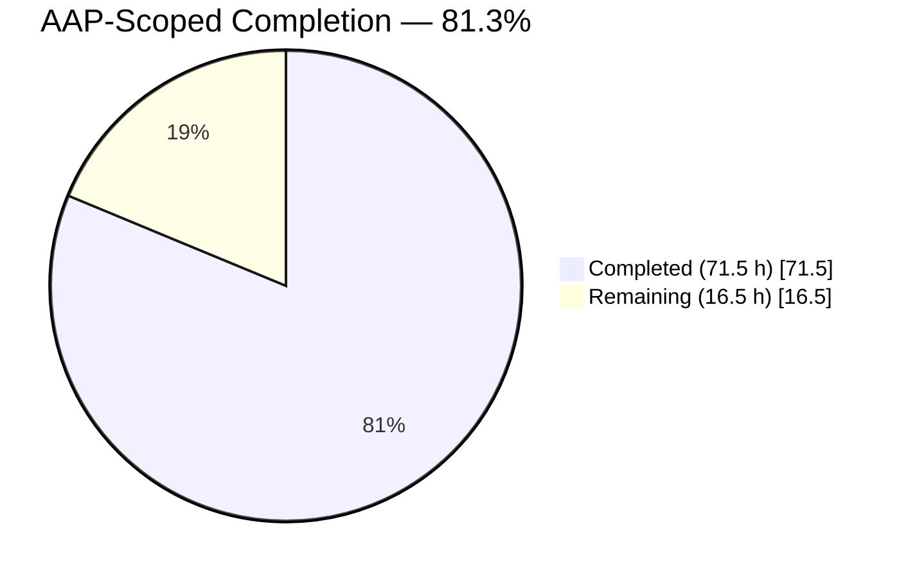
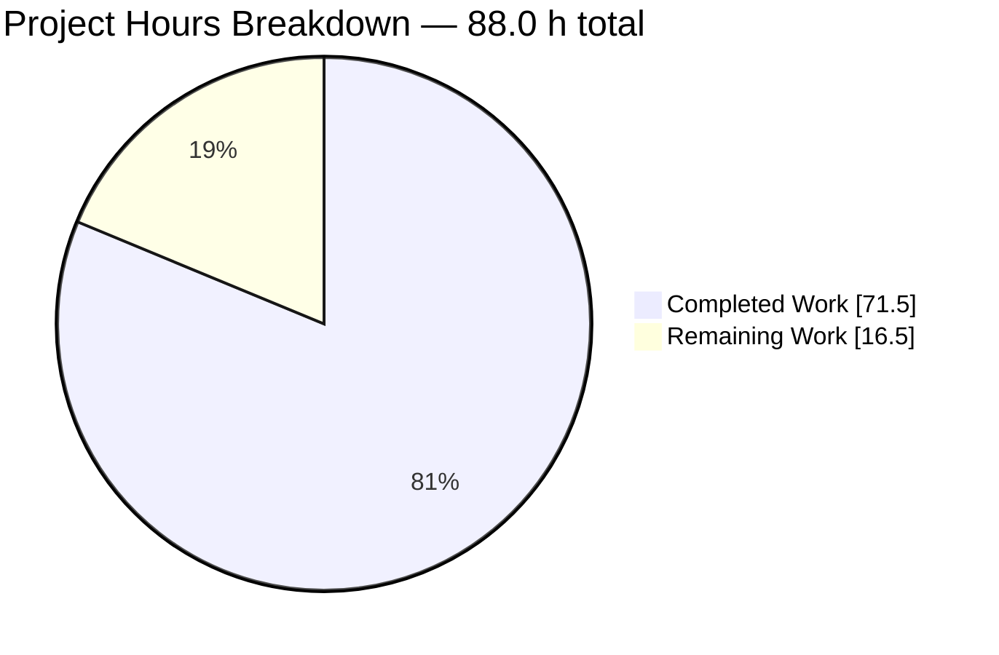
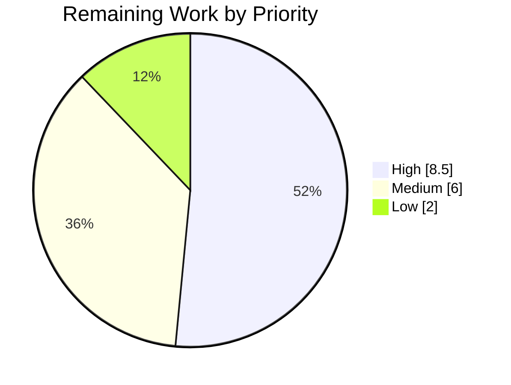
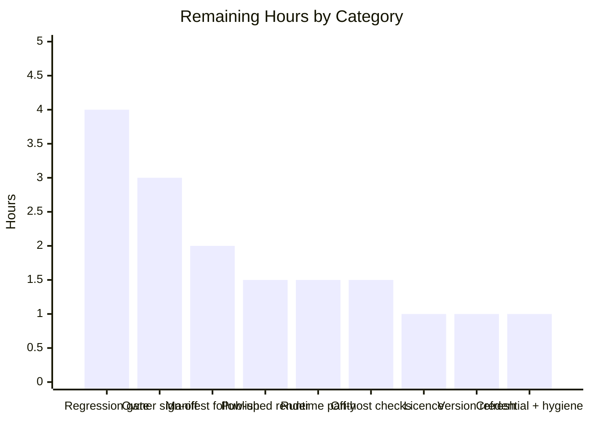

# 1. Executive Summary

## 1.1 Project Overview

`hao-backprop-test` is a minimal Node.js HTTP fixture: one file that binds `127.0.0.1:3000` and answers every request it is handed with a fixed 14-byte `text/plain` body, meant to be started, called and inspected by other tooling. This project made it self-describing. `server.js` now carries a complete JSDoc layer and inline explanations added without altering a single executable statement, and `README.md` has grown from a two-line placeholder into a 1,363-line reference covering setup, the HTTP contract, deployment and the code itself — enough for an engineer or an automated consumer to run and call the fixture without reading Node's `http` internals first.

## 1.2 Completion Status



Completed = Dark Blue `#5B39F3`; Remaining = White `#FFFFFF`.

| Metric | Value |
| --- | --- |
| Total Hours | 88.0 |
| Completed Hours (AI + Manual) | 71.5 (all autonomous; 0 manual) |
| Remaining Hours | 16.5 |
| Percent Complete | **81.3%** (71.5 ÷ 88.0) |

Every Agent Action Plan requirement is delivered and verified; the remaining 16.5 hours are path-to-production work.

## 1.3 Key Accomplishments

- ✅ Six JSDoc blocks and eight inline explanations cover every symbol in `server.js`, emitting six documented doclets.
- ✅ The source change is provably comment-only: eleven code-bearing lines byte-identical to the baseline, `node --check` clean.
- ✅ A 1,363-line `README.md` carries all four requested pillars as their own sections.
- ✅ The HTTP contract is documented against observed behaviour, including the shapes Node resolves itself.
- ✅ Three Mermaid diagrams render with no build step.
- ✅ 77 source citations, all in range, make every claim checkable in one step.
- ✅ Markdown quality moved from two lint defects to zero, with 23 of 23 links resolving.
- ✅ Repository shape preserved: two tracked files, no dependencies, no generated artifacts.

## 1.4 Critical Unresolved Issues

| Issue | Impact | Owner | ETA |
| --- | --- | --- | --- |
| No repeatable documentation gate in the repository — lint, link, doclet and citation checks run only by hand, so drift can land silently | Medium — the document's 77 line-number citations are its accuracy mechanism | Repository owner | 4.0 h |
| Prose has had no human read-through; nothing machine-checkable asserts that the recommendations and framing are well-judged | Medium — editorial acceptance is a precondition for relying on the document | Repository owner | 3.0 h |
| Published rendering never observed: the branch is unpublished, so provider-side Mermaid rendering and anchor slugs are unverified | Low — local rendering and a local slug audit both pass | Repository owner | 1.5 h |
| Recommended runtime (Node.js 24.19.0) parity not exercised — all behaviour was verified on 22.23.2 | Low — the document names 22.23.2 as its transcript runtime | Repository owner | 1.5 h |
| No licence terms declared anywhere in the repository | Medium for anyone redistributing or reusing the fixture | Repository owner | 1.0 h |
| Version facts have a known staleness horizon: Node 24 enters maintenance 2026-10-20 and Node 26 becomes LTS 2026-10-28 | Low — every fact is dated and the canonical schedule is linked | Repository owner | 1.0 h |
| Off-host and container reachability statements in the deployment guide were never exercised in those topologies | Low — they describe platform behaviour, not this code | Repository owner | 1.5 h |

## 1.5 Access Issues

| System/Resource | Type of Access | Issue Description | Resolution Status | Owner |
| --- | --- | --- | --- | --- |
| Repository `origin` remote | Git push/pull credential | The checkout's remote URL carries embedded userinfo. It never reached tracked content, and the documented `sed` redaction lets it be inspected safely, but the credential itself should be rotated | Open — owner action; editing the remote in place risks breaking the push path | Repository owner |
| npm registry (`registry.npmjs.org`) | Outbound HTTPS at invocation time | The optional documentation tools are invoked ad hoc through `npx`, so a registry-restricted or offline host cannot run the lint, link, doclet or diagram checks. The fixture itself needs no network and no packages | Open by design — no repository change required | Consumer / CI owner |
| Node.js 24.19.0 runtime | Runtime availability | Only Node.js 22.23.2 is installed on the verification host, so the recommended line could not be exercised | Open — closed by the 1.5 h parity check | Repository owner |

Nothing else blocks build, run or verification: the project needs no database, third-party API, secret or credential. The `DB_HOST` variable present in the environment is inert, because no statement in the program reads `process.env`.

## 1.6 Recommended Next Steps

1. **[High]** Read `README.md` end to end and sign off its recommendations, framing and limitations (3.0 h).
2. **[High]** Wire the five verification commands into a repeatable gate, including a citation-range check (4.0 h).
3. **[High]** Publish the branch and confirm provider-side diagram rendering and anchor slugs (1.5 h).
4. **[Medium]** Install Node.js 24.19.0 and re-run the request matrix to close the parity gap (1.5 h).
5. **[Medium]** Decide licence terms, add a `LICENSE` file and update the README's License section (1.0 h).

# 2. Project Hours Breakdown

## 2.1 Completed Work Detail

| Component | Hours | Description |
| --- | --- | --- |
| In-source JSDoc layer (`server.js`) | 8.5 | Six blocks covering the module header, both constants, the server with its typed handler parameters, the readiness-callback typedef and the bind call; placement designed for anonymous arrow callbacks and validated against the doclet dump; asynchronous bind-failure model expressed with `@fires`; concision pass so the annotation defers depth to the README |
| Inline explanations and comment-only proof | 2.5 | Eight `//` explanations on the executable lines, plus the machinery that proves the change is comment-only: comment-stripped comparison against the pre-documentation baseline, byte-level equality of the 11 code-bearing lines, and `node --check` |
| README core document (`README.md`) | 16.0 | Identity and purpose preserved, Table of Contents, Overview with the evidence convention, F-001/F-002/F-003 feature sections, Architecture with three Mermaid diagrams, Project Structure, Limitations and Non-Goals, Code Documentation, License status — plus the table geometry and line-width discipline that keeps the file lint-clean |
| Setup and Prerequisites (R4) | 7.5 | Dated runtime guidance with lifecycle and security-currency facts checked against official release metadata and the release schedule, credential-free clone command proven by executing it, the "install nothing" rationale cited to source and tree, the run step with its exact readiness line, and a by-hand verification step |
| HTTP API reference (R5) | 10.0 | Endpoint contract, response-header provenance table isolating the one application-set header, three verified examples, and the runtime-exception matrices — every transcript captured by probing the running service rather than written from memory |
| Deployment guide and troubleshooting (R6) | 6.0 | Run model, loopback interface contract with its namespace and forwarder qualifications, absent-facilities table, four troubleshooting cases with reproduced symptoms, and the Node defaults quoted from the live runtime |
| Evidence and citation system | 7.0 | The three declared evidence classes, 77 source citations, the whole-program enumeration form, and re-anchoring every citation each time the annotation shifted a source line |
| Documentation quality gates and audit tooling | 6.0 | Markdown lint, link and anchor resolution, diagram rendering, doclet emission, fence and table audits, repository-invariant and honesty sweeps |
| Independent verification passes | 8.0 | Static documentation inspection, runtime exercise of the contract and the failure modes, whole-tree security probing, repeatability re-runs in clean shells, and browser verification of the documented browser access path |
| **Total** | **71.5** | All autonomous; no manual engineering hours were required |

## 2.2 Remaining Work Detail

| Category | Hours | Priority |
| --- | --- | --- |
| Owner read-through and sign-off of the delivered documentation | 3.0 | High |
| Repeatable documentation regression gate (lint, links, doclet parse, citation-range check) | 4.0 | High |
| Published-render verification (provider-side Mermaid and anchor slugs) | 1.5 | High |
| Recommended-runtime parity check on Node.js 24.19.0 | 1.5 | Medium |
| Package manifest follow-up (declare and pin the optional documentation toolchain) | 2.0 | Medium |
| Licence decision and `LICENSE` file | 1.0 | Medium |
| Version-currency refresh after the October 2026 Node LTS transition | 1.0 | Medium |
| Credential hygiene on the checkout's `origin` remote | 0.5 | Medium |
| Workspace hygiene — keep untracked validation artifacts out of commits | 0.5 | Low |
| Off-host / container reachability verification, if the fixture is ever fronted by a relay | 1.5 | Low |
| **Total** | **16.5** | — |

## 2.3 Hours Reconciliation

- Completed 71.5 h + Remaining 16.5 h = **88.0 h total**, matching Section 1.2.
- Completion = 71.5 ÷ 88.0 = **81.3%**, the figure used in Sections 1.2, 7 and 8.
- Confidence: **high** on the completed rows — every deliverable is inspectable and every gate behind it was re-run for this assessment. **Medium** on the regression-gate estimate, which depends on whether the owner accepts a package manifest or a CI workflow; both were deliberately excluded from the delivered scope.

# 3. Test Results

All figures below were observed by executing the checks against the delivered tree on Node.js v22.23.2 (Windows Server 2022, curl 8.16.0, npm 10.9.8). **174 checks executed, 174 passed, 0 failed.**

| Area / Category | Framework | Tests | Passed | Failed | Coverage | What This Proves |
| --- | --- | --- | --- | --- | --- | --- |
| HTTP contract and protocol semantics | Ad-hoc Node `http`/`net` harness | 21 | 21 | 0 | n/a | Every request the handler is given — ten method and path combinations — returns `200`, `text/plain` and the same 14-byte body, and each runtime-resolved shape (`HEAD`, `417`, `CONNECT`, `400` variants, `431`, `Connection: close`, HTTP/1.0, 40-way concurrency) behaves exactly as documented |
| Failure modes | curl + process probes | 3 | 3 | 0 | n/a | A port collision ends the process with the documented diagnostic while the first instance keeps serving; a stopped service refuses connections; termination writes no shutdown log |
| Source integrity and JSDoc emission | `node --check`, `jsdoc` 4.0.5 `-X` | 6 | 6 | 0 | n/a | The annotation is comment-only — 11 code-bearing lines byte-identical to the pre-documentation baseline — and machine-readable, emitting 6 documented doclets with typed parameters and no parse errors |
| Markdown quality and link integrity | `markdownlint-cli2` 0.23.2, `markdown-link-check` 3.15.0 | 24 | 24 | 0 | n/a | The document lints clean under the default rule set, and all 23 internal anchors and external references resolve |
| Diagram rendering | `@mermaid-js/mermaid-cli` 11.16.0 | 3 | 3 | 0 | n/a | All three architecture diagrams are valid Mermaid and render to non-empty SVG without a build step |
| Documentation-to-source citations | Ad-hoc citation auditor | 77 | 77 | 0 | n/a | Every factual claim's cited line exists in the 104-line source, so a reader can check any statement in one step |
| Repository invariants and honesty sweep | `git` + ad-hoc scan | 30 | 30 | 0 | n/a | The project is still exactly two tracked files, 18 named artifacts remain absent, and no fabricated command, placeholder or unfinished marker exists in either file |
| Browser access path | Headless Chrome | 10 | 10 | 0 | n/a | A browser pointed at three different paths receives the same fixed plain-text response with no console messages and no error page, confirming the documented browser route |

No coverage percentage is reported because there is no coverage instrumentation: this repository contains no test suite, and creating one was explicitly out of scope. The checks above are CLI gates and purpose-built harnesses run against the delivered files.

**Not Covered — verify these before relying on the documentation**

- **No committed automated suite.** Every check above runs only when someone invokes it; nothing re-runs on a future change. A human should establish a repeatable gate (Section 2.2).
- **Prose accuracy.** Narrative sentences that carry no citation and describe no runtime behaviour cannot be machine-asserted; they need a human read.
- **Recommended runtime.** Node.js 24.19.0 was never exercised — only 22.23.2 is installed. Re-run the request matrix on 24.x before quoting the parity statement.
- **Published rendering.** Provider-side Mermaid rendering and provider-generated anchor slugs were never observed, because the branch is unpublished.
- **Off-host and container topologies.** The claims about a container sharing the host network namespace and about firewall or NAT symptoms describe platform behaviour and were not exercised on a single-host workstation.
- **Signal handling.** Immediate termination without a shutdown log was confirmed, but a true POSIX `SIGTERM` handler path cannot be exercised on Windows.
- **The `408` headers-timeout path.** `README.md` documents it at roughly 89 seconds; that slow path was not re-run for this assessment.
- **The "Node.js is not on PATH" troubleshooting case.** Not reproducible on a host where `node` resolves; its two shell-specific messages come from platform convention.

# 4. Runtime Validation & UI Verification

Every line below was driven against the running service for this assessment, not inferred from the code.

- ✅ **Start-up and readiness** — `node server.js` binds and prints exactly `Server running at http://127.0.0.1:3000/` (41 bytes) on stdout, with stderr empty; the line never repeats, including after dozens of subsequent requests.
- ✅ **Catch-all response contract** — `GET /`, `GET /any/arbitrary/path`, `POST /` with a body, `DELETE /foo`, `PUT /x?y=1`, `PATCH /deep/nested/route`, `OPTIONS /`, `GET /health`, `GET /favicon.ico` and `GET /does-not-exist` each returned `200`, `Content-Type: text/plain`, `Content-Length: 14` and the body `Hello, World!\n`.
- ✅ **Runtime-resolved request shapes** — `HEAD /` returns `200` with the application header and no body; an unsupported `Expect` returns `417`; `CONNECT` gets no reply and a close; a malformed request line, an unrecognised method token and a missing `Host` return `400` (the first two bare, the third carrying a `Date`); a 20 KB header block returns `431`.
- ✅ **Protocol variants and load** — `Connection: close` drops `Keep-Alive` and keeps `Content-Length`; HTTP/1.0 delivers the body with no `Content-Length`; 40 concurrent connections all returned the exact body.
- ✅ **Listener topology** — exactly one listening socket, `127.0.0.1:3000`, owned by the spawned process; the port is released the moment it stops.
- ✅ **Port collision** — a second instance exits with code 1, writes nothing to stdout and emits a 648-byte diagnostic naming the unhandled `'error'` event and `EADDRINUSE`, while the first instance keeps answering `200`.
- ✅ **Stopped-state client behaviour** — with nothing listening, the documented `curl` check reports status `000` and exit code 7.
- ✅ **Shutdown** — termination is immediate, with no drain and no shutdown message; stdout still holds only the readiness line afterwards, which is why it must not be treated as a liveness signal.
- ✅ **Browser access path** — headless Chrome loaded `/`, `/any/arbitrary/path` and `/does-not-exist`, plus one reload: 10 of 10 requests returned `200`, the rendered body was `Hello, World!` (14 characters, trailing newline) every time, zero console messages of any type appeared, no 404 or error page was ever rendered, the captures of two different paths were byte-identical, and the advancing `Date` header confirmed each response was genuinely re-served.
- ✅ **Documentation toolchain** — markdown lint, link resolution, doclet emission, JSDoc HTML render and Mermaid rendering all completed cleanly against the delivered files.

**Not exercised at runtime.** There is no user interface to verify beyond the plain-text response above: the service returns `text/plain` and the repository contains no view, template, asset or component directory. Node.js 24.19.0 was never started (only 22.23.2 is installed); no container, reverse proxy, SSH tunnel or TCP relay was stood up, so the deployment guide's off-host and namespace statements remain platform-derived; the `408` headers-timeout path was not re-run; and no POSIX signal was delivered, because the verification host is Windows.

# 5. Compliance & Quality Review

## 5.1 Compliance Matrix

Status is where each deliverable stands in the delivered tree, verified for this assessment.

| # | Deliverable / Benchmark | Verified Status | Evidence |
| --- | --- | --- | --- |
| 1 | R1 — JSDoc for every function and module-level symbol | ✅ PASS | Six blocks at `server.js` L1-L28, L31-L39, L42-L49, L52-L66, L73-L81, L83-L100; `jsdoc -X` emits 6 documented doclets, zero untyped parameters |
| 2 | R2 — Inline explanations without behavioural change | ✅ PASS | Eight `//` explanations (L29, L40, L50, L68, L69, L70, L101, L102); 11 code-bearing lines byte-identical to baseline `1484182`; `node --check` exits 0 |
| 3 | R3 — Comprehensive README replacing the placeholder | ✅ PASS | `README.md` 1,363 lines, 14 top-level sections, 13-entry Table of Contents, original H1 and purpose sentence preserved |
| 4 | R4 — Setup instructions a reader can follow first time | ✅ PASS | Prerequisites, credential-free clone, "install nothing" rationale, run command and by-hand verification; readiness line and response transcript reproduce byte for byte |
| 5 | R5 — API documentation sufficient without reading source | ✅ PASS | Endpoint contract, response-header provenance, three verified examples, runtime-exception matrices, not-implemented list; 21 protocol assertions match |
| 6 | R6 — Deployment guide and operational limits | ✅ PASS | Run model, loopback interface contract, absent-facilities table, four troubleshooting cases; three failure modes reproduced |
| 7 | Coverage targets — symbols, header, inline, endpoint, configuration, features, pillars, failure modes | ✅ PASS | 5/5 symbols plus 1/1 module header, 8/8 inline explanations, 1/1 endpoint, 2/2 configuration options, 3/3 features, 4/4 content pillars, and 4 failure modes documented against 3 required |
| 8 | Markdown quality — zero lint defects | ✅ PASS | `markdownlint-cli2` 0.23.2 reports 0 issues; the two defects the placeholder carried are gone |
| 9 | Navigation and diagrams | ✅ PASS | 23/23 links and anchors resolve; three Mermaid diagrams render to valid SVG |
| 10 | Evidence-based content — every claim traceable | ✅ PASS | 77 source citations, all within the 104-line file, under a declared three-class evidence convention |
| 11 | Honesty constraints — no invented licence, configuration mechanism, install command or test claim | ✅ PASS | Sweep over both files returns zero hits for `npm install`/`npm start`/`npm run`, placeholders, unfinished markers or off-host reachability claims; licence absence stated as fact |
| 12 | Repository shape — two tracked files, zero dependencies, no generated artifacts | ✅ PASS | `git ls-files` returns `README.md` and `server.js`; 18 named artifacts (manifest, lockfile, licence, runtime pins, lint config, docs tree, CI directory, tests) confirmed absent |
| 13 | Automated regression coverage for the documentation | ⚠ GAP | No repeatable gate exists in the repository; verification is by ad-hoc command. Tracked as remaining work in Section 2.2 |

## 5.2 AAP & Rule Divergences and Gaps

No user-specified rules were provided for this project, so every divergence below is measured against the Agent Action Plan. None of them blocks release, and none requires a change to the delivered code.

| # | What the AAP Required | What Was Delivered Instead | Why It Diverged | Impact | Remediation |
| --- | --- | --- | --- | --- | --- |
| 1 | Document an identical response "for every HTTP method and every path" | The guarantee is scoped to every request Node.js hands to the request handler, plus two tables of the shapes the runtime resolves itself | The absolute form is false on the real runtime, and changing code to make it true was out of scope | Documentation is narrower and true; code untouched | None |
| 2 | Cite every claim in the single form `Source: server.js:Lx-Ly` | Three declared evidence classes — executable lines, repository tree, Node.js runtime — plus an enumerated form for whole-program claims, introduced by a new subsection | One form cannot evidence a runtime-owned behaviour or a file that does not exist | Traceability strictly stronger and mechanically auditable | None |
| 3 | Use the annotation's prescribed tag and type whitelist, including `@throws` | `@throws` removed and `@fires http.Server#event:error` added; `@function`/`@memberof` used so the bind block emits a doclet; the file's own typedef used as a parameter type | A failed bind arrives asynchronously as an `'error'` event, so `@throws` described a control flow that cannot exist | Annotation semantically correct; parses with zero warnings | None |
| 4 | Describe the readiness log as "the only lifecycle signal the process ever produces" | Scoped to the only log the application authors and the only output of a successful run, naming the runtime's stderr diagnostic on a failed bind as the exception | The literal wording is contradicted by the bind-failure behaviour the same document publishes | Prevents a stale startup line being read as a health check | None in the repository |
| 5 | State the runtime floor as `Node.js \| >= 18 \| Practical floor` | The same row plus an end-of-life disclosure for the 18.x and 20.x lines, a compatibility-versus-support distinction, the Current 26.x line disclosed, and a dated security-currency paragraph with one extra external reference | Recommending a floor that admits end-of-life lines without saying so is a security-relevant omission | More accurate guidance; one additional external link to maintain | Calendar refresh — Section 2.2 |
| 6 | Deliver a twelve-section README | Fourteen top-level sections plus one added subsection: the plan's composite final section is split into Project Structure, Limitations and Non-Goals, Code Documentation and License, and Overview gains the evidence convention | Readability, and the evidence convention needs a home before the reader meets the first citation | None — every pillar stays individually identifiable and the Table of Contents covers all sections | None |
| 7 | Present container port publishing among the same-host relay mechanisms, and document an upgrade request and a `413` as contract exceptions | Publishing is explained correctly as host-to-container forwarding; the relay list names only mechanisms that connect to `127.0.0.1:3000` from this host; an upgrade request is documented as receiving the ordinary `200`; no `413` is documented | Probing showed an upgrade request and an oversized chunk extension both return `200`, so the alternatives would have been unverified claims | Operators are no longer sent down a topology that cannot reach the listener | None |
| 8 | Never suggest the endpoint is reachable from other hosts | Off-host callers still have no route, but two qualifications are stated: a container sharing the host network namespace reaches it, and a same-host forwarder can relay to it | The unqualified form invited readers to treat a bind address as an access control | A narrowing of a claim, not a new capability; both qualified cases are unexercised (Section 3) | None in the repository |

**1 — Uniformity narrowed to what the handler governs.** The handler reads no part of the request (`server.js:L67-L71`), which makes the response uniform for everything delivered to it — but not for everything a client can observe. Node suppresses the body of a `HEAD` reply after the handler runs, answers an unsupported `Expect` with `417`, closes a `CONNECT` socket, and refuses anything its parser rejects with a bare `400`. The delivered text says exactly that and tabulates each case with a transcript. All 21 protocol assertions in Section 3 confirm the documented behaviour. A reader who wants literal all-method uniformity is asking for a behaviour change — explicit `HEAD`, `CONNECT` and `Expect` handling — which needs its own authorisation.

**2 — Evidence classes instead of one citation form.** Three kinds of assertion were being carried by one citation idiom: facts about code, facts about files that do not exist, and facts about Node's behaviour. The delivered document names all three ("How Claims Are Evidenced" in Overview) and says how to check each: a line range in `server.js`, `git ls-files` for absences, and the Node `http`/`net`/`events` references for runtime semantics. Whole-program claims enumerate all eleven code-bearing lines rather than pointing at one. The audit in Section 3 confirms all 77 citations resolve inside the 104-line file. If a future maintainer prefers a single form, the class table is the one place to change it.

**3 — The bind-failure model in the annotation.** `@throws` documents an exception a caller can catch; `server.listen` returns the server and reports a failed bind through the server's `'error'` event, so no `try`/`catch` around the call can ever see `EADDRINUSE`. The delivered block states that plainly and encodes it as `@fires http.Server#event:error`, and the doclet dump shows zero exception entries. The related typing changes exist for the same reason: the readiness callback is typed with the file's own `ListeningCallback` typedef, and `@function`/`@memberof` make the bind block emit a real doclet instead of being dropped silently. A maintainer adding error handling now sees the listener they actually need.

**4 — Readiness versus liveness.** The prescribed wording claimed the readiness line is the only signal the process ever produces, which the bind-failure path contradicts: a collision writes 648 bytes to stderr and exits 1. The delivered text separates who authors output from which channel carries it — one application log on stdout, a runtime diagnostic on stderr — and states in four places that the line records startup, not continuing liveness, because it survives the process. Terminating the service and finding the line still in stdout is the observable proof (Section 4). The only correction available outside the repository is to align the plan's wording; the code needs nothing.

**5 — Runtime lifecycle disclosure.** The floor `>= 18` is an API-compatibility statement: the fixture touches five long-stable `http` APIs and nothing else. But two of the lines that floor admits are end-of-life — 18.x since 2025-04-30 and 20.x since 2026-04-30 — and a lifecycle column that discloses dates for the supported lines and nothing for the unsupported ones misleads by omission. The delivered table states the end-of-life status in the cell, keeps the compatibility rationale in the bullet, names 22.x and 24.x as the supported LTS lines, discloses 26.x as the Current line, and records that both recommended releases sit at or above the newest security release of their own line. These facts are dated and will need re-checking after the October 2026 transition.

**6 — Section count.** The plan's twelfth row bundles project structure, limitations, code-documentation guidance and licence status into one entry; the delivered document gives each its own top-level section, which is what a reader scanning the Table of Contents expects. The evidence convention is a subsection of Overview so that it precedes the first citation without adding a top-level entry. The four requested pillars remain individually identifiable — Prerequisites with Setup and Running, API Documentation, Deployment Guide, Code Documentation — and all 23 anchors resolve, so navigation is unaffected.

**7 — Deployment topology, and two additions declined.** `docker run -p` publishes a container's own port to the host; it cannot reach a listener already bound to the host's loopback, and `kubectl port-forward` runs the same direction into a pod. The delivered guide defines the relay category by what a mechanism must do — run on this host and connect to `127.0.0.1:3000` itself — lists only members that qualify, and explains publishing separately, including why it does not rescue a containerised copy. Two suggested documentation additions were declined on evidence: an upgrade request receives the ordinary `200` on this runtime because no `'upgrade'` listener is registered, and a 20 KB chunk extension also returns `200` because the handler answers without reading the body, so documenting a `413` would have been an unverified claim.

**8 — Loopback is not access control.** The honesty constraint exists so nobody is told the fixture is reachable off-host. The delivered text keeps that: an off-host caller has no route, and the direct peer of any accepted connection is always a process using this host's loopback interface. What it adds is the part that matters for safety — a container sharing the host's network namespace does reach the listener, and a forwarder or proxy someone runs deliberately can relay to it — and it states in six places that loopback binding identifies nobody and authorises nothing, because every request the handler is given is answered whoever sent it. Neither qualified case was exercised here; verify them in that topology before relying on them (Section 2.2).

# 6. Risk Assessment

Forward-looking risks only — what could still go wrong for a consumer or an operator of this fixture.

| Risk | Category | Severity | Probability | Mitigation | Status |
| --- | --- | --- | --- | --- | --- |
| Documentation drifts from the source because 77 claims cite exact line numbers, and any future edit that shifts a line invalidates them silently | Technical | Medium | Medium | All 77 citations are in range today; the document anchors itself to the pre-documentation baseline and tells the reader the citations are the fastest drift check | Open — mitigated; a citation-range gate closes it (Section 2.2) |
| Runtime guidance ages out: Node 24.19.0 enters maintenance on 2026-10-20 and Node 26 becomes LTS on 2026-10-28, and the recommended line's behavioural parity was never exercised here | Technical | Low | High | Every version fact is dated and the canonical release schedule is linked; 22.23.2 is named as the runtime all transcripts came from | Open — refresh plus a parity check (Section 2.2) |
| An unauthenticated, plaintext, catch-all endpoint if exposure ever changes — editing `hostname` (`server.js:L40`), sharing the host network namespace, or putting a forwarder in front of it publishes a service that authenticates nobody | Security | High | Low | Loopback default; the documentation states in six places that loopback binding is not authentication, and the Configuration section warns before either value is changed | Open by design — documented non-goal |
| The checkout's `origin` remote carries embedded userinfo, so a credential can reach scrollback, a transcript or a CI log if the URL is printed | Security | Medium | Low | The credential never reached tracked content; the documented `sed` pipeline strips userinfo before display | Open — owner rotation (Sections 1.5, 2.2) |
| No lifecycle resilience: a failed bind is unhandled and ends the process, there is no health or liveness endpoint, and termination drops in-flight requests without a shutdown log | Operational | Medium | Medium | All three behaviours are documented with reproduced symptoms and named as non-goals; an operator must supply process supervision and treat the readiness line as startup only | Accepted — documented non-goal |
| No repeatable documentation gate, so a future change can break lint, links, doclets or citations without anyone noticing | Operational | Medium | Medium | The exact commands and pinned tool versions are documented and were all executed successfully | Open — 4.0 h (Section 2.2) |
| The optional documentation toolchain resolves transitive dependencies at invocation time, so a future reader's resolution differs from the verified one | Integration | Low | Medium | Top-level versions are pinned in every documented command; advisory checks at verification time returned nothing against any of them; nothing in the repository depends on these tools | Open by design — optional tooling |
| The workspace holds an untracked validation-evidence directory (23 files, roughly 10.9 MB), which a blanket `git add` would commit and break the two-file shape the documentation describes | Operational | Low | Low | Nothing is tracked; `git status` shows the directory plainly and a fresh clone contains only the two files | Open — 0.5 h hygiene (Section 2.2) |

# 7. Visual Project Status

**Hours delivered against hours remaining** — Completed = Dark Blue `#5B39F3`, Remaining = White `#FFFFFF`.



**Remaining work by priority** (16.5 h total: High 8.5 h, Medium 6.0 h, Low 2.0 h).



**Remaining hours by category**



| Dimension | Completed | Remaining | Total |
| --- | --- | --- | --- |
| Engineering hours | 71.5 | 16.5 | 88.0 |
| Share of scope | 81.3% | 18.7% | 100% |
| Agent Action Plan requirements (R1–R6) | 6 of 6 | 0 | 6 |
| Path-to-production items | 0 | 10 | 10 |

# 8. Summary & Recommendations

**What was delivered.** A repository that documented nothing about itself now documents everything. `server.js` carries six JSDoc blocks and eight inline explanations covering the module, both configuration constants, the server with its typed handler parameters, the readiness callback and the bind call — and it carries them without touching a single executable statement: its eleven code-bearing lines are byte-identical to the version that existed before this work, which `node --check` and a comment-stripped comparison both confirm. `README.md` went from two lines to 1,363, organised as a reader's journey from what the fixture is, through how to run it and what it returns, to how to operate it, what breaks, and where its limits lie. All four requested pillars — setup instructions, API documentation, deployment guide and code explanation — are their own sections rather than passing mentions.

**What was verified.** 174 checks were executed against the delivered tree for this assessment and all 174 passed. The service was started and driven: ten method and path combinations all returned the same `200`, `text/plain`, 14-byte response, every request shape the runtime resolves for itself behaved as documented, forty concurrent connections were answered exactly, and all three failure modes reproduced — a port collision exiting 1 with the documented diagnostic, a refused connection reporting status `000`, and a termination that writes no shutdown log. A browser was pointed at three different paths and saw the same fixed plain-text response with zero console messages and no error page. The documentation's own machinery was checked too: zero lint defects, 23 of 23 links and anchors resolving, three Mermaid diagrams rendering, six documented doclets emitted, and all 77 source citations landing inside the 104-line file. The repository is still exactly two tracked files with no dependencies and no generated artifacts.

**What remains.** 16.5 hours, none of it Agent Action Plan scope. Three items are on the critical path to production. First, a human has to read the document and accept it: prose judgement, the runtime recommendation and the framing of the limitations are not machine-checkable. Second, the verification that exists today runs only when somebody types the commands; turning lint, link, doclet and citation-range checks into a repeatable gate is what protects the document's accuracy over time, and it is the one item that needs a scope decision, because it implies either a package manifest or a workflow file — both deliberately excluded from delivery. Third, the branch has never been published, so provider-side diagram rendering and anchor slugs remain unobserved. The rest are follow-up decisions: a parity check on the recommended Node line, the optional manifest, a licence decision, a dated-facts refresh after the October 2026 LTS transition, credential rotation on the checkout's remote, and workspace hygiene.

**Divergences worth the reader's attention.** Eight departures from the plan are recorded in Section 5.2, and every one moves in the same direction: a claim the plan stated absolutely was narrowed to what is observably true. The response contract is scoped to what the handler governs rather than to everything a client can see on the wire; the readiness line is described as a startup signal rather than a liveness signal; loopback binding is explicitly not offered as access control; the runtime floor now discloses that two of the lines it admits are end-of-life; and citation discipline grew from one form to three declared evidence classes so that claims about Node's behaviour and about absent files are not evidenced with a line of application code. Two consumer-facing consequences are worth carrying forward: a client using a method token Node's parser does not hold receives a bare `400` before any application code runs, and the response declares `text/plain` with no charset parameter, which would matter if the fixture were ever extended beyond ASCII.

**Production readiness.** At **81.3% of AAP-scoped and path-to-production work complete**, the documentation deliverable is ready to hand over and ready to rely on for running, calling and maintaining the fixture. The application itself is deliberately not production-hardened — no routing, no authentication, no TLS, no configuration mechanism, no error handling, no graceful shutdown, no health endpoint, no request logging — and that is correct for a fixture; each absence is documented as a characteristic rather than repaired, which is what the plan required. The recommended sequence is sign-off, then the repeatable gate, then publication, with the licence decision taken before the fixture is shared outside its current audience.

# 9. Development Guide

Every command below was executed against this repository on Node.js v22.23.2 (Windows Server 2022, PowerShell 5.1, Git Bash 5.x, curl 8.16.0, npm 10.9.8). Commands are shown from the repository root unless stated otherwise.

## 9.1 System Prerequisites

- **Node.js** — the only requirement. 24.19.0 is the recommended line (Active LTS when the documentation was written); everything here was verified on 22.23.2. Node 18.x and 20.x still run the fixture but are end-of-life and receive no security updates. The repository pins no version: there is no `engines` field, no `.nvmrc`, no `.node-version` and no `.tool-versions`.
- **Operating system** — any platform Node supports. Verified on Windows Server 2022; the commands below give PowerShell and POSIX forms where they differ.
- **Hardware** — negligible. One process, no persistence, no dependencies.
- **Optional** — `curl` for the by-hand check (any HTTP client or a browser does the same job), `git` to clone, and network access to the npm registry only if you want to run the optional documentation tooling in §9.6.

## 9.2 Environment Setup

There is nothing to set up. No virtual environment, no service dependency, no environment variable and no configuration file are involved.

```bash
git clone https://github.com/ajitblitzy/Ajit_GH_Repo-12-Mar-26.git
cd Ajit_GH_Repo-12-Mar-26
```

The clone is anonymous — no credentials, token or SSH key. Note that the directory takes the repository's name, not the project title in the README heading. If you are working from a fork, take its clone URL from the hosting provider's clone button rather than from a local checkout; a remote URL can carry a token in its userinfo field, and printing it writes that secret into your scrollback. If you must read a local remote, do it in a shell that is not being recorded and strip the userinfo on the way out:

```bash
git remote get-url origin | sed -E 's#://[^/@]*@#://#'
```

Verified on this checkout: the pipeline prints the host and path with any embedded credential removed and leaves a credential-free URL untouched.

## 9.3 Dependency Installation

**There is no install step and no build step.** `server.js` imports only Node's core `http` module, and the repository contains no `package.json` and no lockfile, so there is nothing to fetch, compile or bundle. Confirm the source parses before running it:

```bash
node --check server.js
```

Expected: exit code 0 and no output. Anything else means the file was edited and broken.

## 9.4 Application Startup

```bash
node server.js
```

Expected output — exactly one line, after which the process holds the foreground:

```text
Server running at http://127.0.0.1:3000/
```

Nothing further is ever written to stdout: there is no request logging and no shutdown message. On a successful run stderr stays empty.

The run command **blocks the shell it runs in**, so issue the verification requests from a second shell. If a script has to continue, start it detached and keep the process id so it can be stopped precisely:

```powershell
# PowerShell — start detached, capture stdout, remember the pid
$p = Start-Process node -ArgumentList 'server.js' -NoNewWindow -PassThru `
       -RedirectStandardOutput server-out.log -RedirectStandardError server-err.log
Start-Sleep -Seconds 2
Get-Content server-out.log            # Server running at http://127.0.0.1:3000/
# ... later ...
Stop-Process -Id $p.Id -Force
```

Redirect those log files outside the checkout if you want `git status` to stay clean.

## 9.5 Verification Steps

```bash
curl -sS -i http://127.0.0.1:3000/
```

Observed response (only the `Date` value varies between runs):

```http
HTTP/1.1 200 OK
Content-Type: text/plain
Date: Sat, 15 Aug 2026 02:12:52 GMT
Connection: keep-alive
Keep-Alive: timeout=5
Content-Length: 14

Hello, World!
```

Only `Content-Type` is set by the application; the runtime supplies the rest, and `Connection`, `Keep-Alive` and `Content-Length` vary with the request and protocol version.

Check the listener and the process that owns it:

```powershell
Get-NetTCPConnection -LocalPort 3000 -State Listen |
  Select-Object LocalAddress, LocalPort, OwningProcess
```

```bash
# POSIX equivalent
lsof -i :3000
```

Expected: exactly one row, `LocalAddress` `127.0.0.1`. On Windows, `netstat -ano | findstr :3000` shows the same rows (plus `TIME_WAIT` entries for a short while after a stop).

If `curl` is unavailable, PowerShell alone is enough:

```powershell
$r = Invoke-WebRequest -UseBasicParsing http://127.0.0.1:3000/
"$($r.StatusCode) $($r.Headers['Content-Type']) $($r.Content.Length)"   # 200 text/plain 14
```

## 9.6 Example Usage

The endpoint is a catch-all: the handler reads neither the method nor the path, so every request it receives gets the same answer.

```bash
curl -sS -o /dev/null -w '%{http_code} %{size_download}\n' http://127.0.0.1:3000/                     # 200 14
curl -sS -o /dev/null -w '%{http_code} %{size_download}\n' http://127.0.0.1:3000/any/arbitrary/path   # 200 14
curl -sS -o /dev/null -w '%{http_code} %{size_download}\n' -X POST http://127.0.0.1:3000/             # 200 14
curl -sS -o /dev/null -w '%{http_code} %{size_download}\n' -X DELETE http://127.0.0.1:3000/foo        # 200 14
```

On Windows PowerShell, write `-o NUL` instead of `-o /dev/null`.

A browser pointed at `http://127.0.0.1:3000/` shows the same plain text; three different paths render identically, and there is no 404 page.

Optional documentation tooling — none of it is a dependency of this project, and each command was run successfully with the npm cache redirected outside the checkout:

```bash
npx --yes markdownlint-cli2@0.23.2 README.md          # Summary: 0 issues in 0 files
npx --yes markdown-link-check@3.15.0 README.md        # 23 links checked, none dead
npx --yes jsdoc@4.0.5 -X server.js                    # 6 documented doclets, empty stderr
npx --yes jsdoc@4.0.5 server.js -d ../jsdoc-out       # HTML render, written outside the repo
```

Write generated output outside the repository so the two-file shape is preserved.

## 9.7 Troubleshooting

| Symptom | Cause | Resolution |
| --- | --- | --- |
| `Error: listen EADDRINUSE: address already in use 127.0.0.1:3000`, raised as an unhandled `'error'` event; the process exits with code 1 and writes nothing to stdout | Another listener already holds port 3000. There is no error handler and no retry | Stop the other listener, or change `port` at `server.js:L50` and restart. Find the owner with `Get-NetTCPConnection -LocalPort 3000` or `lsof -i :3000` |
| `curl` prints status `000` and exits 7 | Nothing is listening — the service is not running, or it died | Start it and re-check for one listening row on `127.0.0.1:3000` |
| A caller on another machine cannot connect | The bind address is the IPv4 loopback (`server.js:L40`), so there is no route to it from off-host | Front it with a relay that runs on this host, or change `hostname` — and read the Configuration warning first, because nothing in the handler checks who is calling |
| `node: command not found`, or `'node' is not recognized…` with `ERRORLEVEL 9009` | Node.js is not installed or not on `PATH` | Install a supported Node.js line and reopen the shell |
| A well-formed request returns a bare `400 Bad Request` with `Connection: close` and an empty body | The method token is not in Node's parser table — `BREW`, `MSEARCH` without its hyphen, a lower-case verb. The request never reaches the handler | Use a standard method token. The application returns no `405`, and there is nothing to configure |
| The process ends and no shutdown message appears | There is no signal handler and no graceful shutdown; in-flight requests are dropped | Expected. The readiness line stays in stdout after the process is gone, so never treat it as a health check |
| `git status` shows untracked files after a session | Logs or generated output were written inside the checkout | Commit explicit paths rather than `git add -A`, and redirect generated output outside the repository |

# 10. Appendices

## A. Command Reference

| Purpose | Command | Expected Result |
| --- | --- | --- |
| Clone the source | `git clone https://github.com/ajitblitzy/Ajit_GH_Repo-12-Mar-26.git` | Anonymous clone; the directory takes the repository name |
| Check the source parses | `node --check server.js` | Exit 0, no output |
| Run the service | `node server.js` | Prints `Server running at http://127.0.0.1:3000/` and holds the shell |
| Verify by hand | `curl -sS -i http://127.0.0.1:3000/` | `200`, `Content-Type: text/plain`, `Content-Length: 14`, body `Hello, World!` |
| Check any other path or method | `curl -sS -o /dev/null -w '%{http_code} %{size_download}\n' -X POST http://127.0.0.1:3000/x` | `200 14` |
| Verify without curl | `Invoke-WebRequest -UseBasicParsing http://127.0.0.1:3000/` | Status 200, `text/plain`, 14 bytes |
| Inspect the listener | `Get-NetTCPConnection -LocalPort 3000 -State Listen` / `lsof -i :3000` | One row on `127.0.0.1:3000` |
| Stop a detached instance | `Stop-Process -Id <pid> -Force` | Port released; a follow-up request returns `000` / exit 7 |
| Lint the documentation | `npx --yes markdownlint-cli2@0.23.2 README.md` | `Summary: 0 issues in 0 files` |
| Check links and anchors | `npx --yes markdown-link-check@3.15.0 README.md` | 23 links checked, none dead |
| Dump the doclets | `npx --yes jsdoc@4.0.5 -X server.js` | Exit 0, empty stderr, 6 documented doclets |
| Render API HTML | `npx --yes jsdoc@4.0.5 server.js -d ../jsdoc-out` | HTML written outside the repository |
| Redact a remote URL before printing it | `git remote get-url origin \| sed -E 's#://[^/@]*@#://#'` | Host and path with any embedded credential removed |

## B. Port Reference

| Port | Protocol | Bind Address | Purpose | Configurable |
| --- | --- | --- | --- | --- |
| 3000 | TCP / HTTP (no TLS) | `127.0.0.1` (IPv4 loopback only) | The single HTTP listener; the only port the project uses | Only by editing `port` at `server.js:L50` |

Related runtime defaults, measured on the live runtime: keep-alive timeout 5,000 ms, maximum header size 16,384 bytes, headers timeout 60,000 ms, request timeout 300,000 ms. None is set by the application.

## C. Key File Locations

| Path / Anchor | What It Is |
| --- | --- |
| `README.md` | The single documentation entry point — 1,363 lines, 14 sections |
| `server.js` | The entire application — 104 annotated lines, 11 of them code |
| `server.js:L29` | `require('http')` — the only import, a Node core module |
| `server.js:L40` | `hostname` constant — `'127.0.0.1'` |
| `server.js:L50` | `port` constant — `3000` |
| `server.js:L67-L71` | `http.createServer` and its request handler — status, header, body |
| `server.js:L101-L104` | `server.listen` and the readiness callback |
| `server.js:L103` | The readiness log line |
| `server.js` L1-L28, L31-L39, L42-L49, L52-L66, L73-L81, L83-L100 | The six JSDoc blocks: module header, `hostname`, `port`, server and handler, `ListeningCallback` typedef, bind call |

## D. Technology Versions

| Component | Version | Notes |
| --- | --- | --- |
| Node.js | 24.19.0 recommended · 22.23.2 verified · `>= 18` API floor | 18.x and 20.x are end-of-life; the repository pins no version |
| npm / npx | 10.9.8 | Only needed for the optional documentation tooling |
| Git | 2.55.0 | Clone and history only |
| curl | 8.16.0 | Optional client for the by-hand check |
| jsdoc | 4.0.5 | Ad-hoc doclet dump and HTML render; not a project dependency |
| markdownlint-cli2 | 0.23.2 (bundles markdownlint 0.41.1) | Markdown quality gate |
| markdown-link-check | 3.15.0 | Link and anchor resolution |
| @mermaid-js/mermaid-cli | 11.16.0 | Only needed to render diagrams locally; the hosting provider renders fenced `mermaid` blocks itself |

## E. Environment Variable Reference

| Variable | Read by the application? | Notes |
| --- | --- | --- |
| — | **None** | No statement in the program reads `process.env`, opens a configuration file or inspects `process.argv`. There are no environment variables, no configuration file and no command-line arguments to set |
| `DB_HOST` | No | Present in the verification environment and inert here — the fixture has no database and no configuration mechanism |
| `NPM_CONFIG_CACHE` | No | Used only to keep the optional tooling's npm cache outside the checkout |
| `PUPPETEER_EXECUTABLE_PATH` | No | Used only to point the diagram renderer at a local Chrome binary |

Changing the bind address or port means editing the two constants in `server.js` and restarting the process.

## F. Developer Tools Guide

| Task | Tool | How It Is Used Here |
| --- | --- | --- |
| Syntax gate | `node --check` | The only compile-equivalent step; proves an edit did not break the file |
| Comment-only proof | `git show <baseline>:server.js` plus a comment-stripping comparison | Confirms an annotation change left the executable lines untouched |
| Annotation inspection | `jsdoc -X` | Shows the six doclets, their parameter types, returns, `@fires` and `@listens` — the fastest way to see what the annotation actually declares |
| Rendered API docs | `jsdoc … -d <dir>` | Optional HTML; the default template lists the members but prints no section for the bind-call entry, which the documentation notes |
| Markdown quality | `markdownlint-cli2` | Default rule set; the gate is zero issues |
| Link integrity | `markdown-link-check` | Resolves in-page anchors and external references |
| Diagram check | `mermaid-cli` | Renders the three fenced blocks locally; needs a Chrome binary |
| Citation check | Any script that extracts `server.js:L…` references and compares them against the file length | The one gate this repository most needs and does not yet have |

## G. Glossary

| Term | Meaning in this project |
| --- | --- |
| **Fixture** | The project's role: something to be started, called and inspected by other tooling, not deployed as a product |
| **Request handler** | The anonymous callback passed to `http.createServer` — it sets the status, sets `Content-Type` and writes the body, and reads nothing from the request |
| **Readiness log** | The single stdout line written once the bind succeeds. A startup signal, not a liveness signal |
| **Catch-all** | Every method and every path delivered to the handler receive the same response; there is no routing, no `404` and no `405` |
| **Loopback** | The `127.0.0.1` bind address. It keeps the listener off every routable interface, and it is not authentication |
| **Doclet** | One documented entry in JSDoc's output; this project emits six |
| **Evidence class** | One of the three declared citation forms in the documentation — executable source lines, the repository tree, or Node.js runtime behaviour |
| **Code-bearing line** | A line of `server.js` that carries code, closing `});` lines included; there are eleven, holding nine statements, in a 104-line file |
