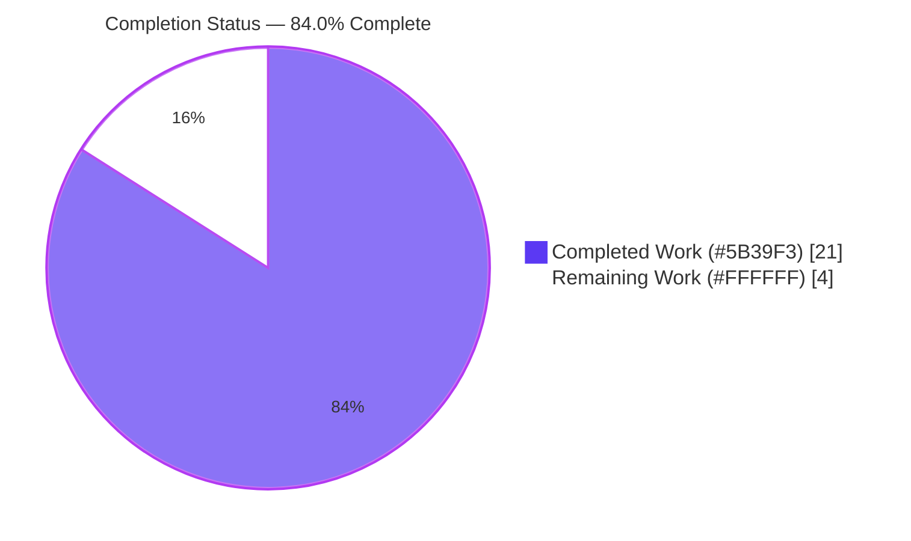
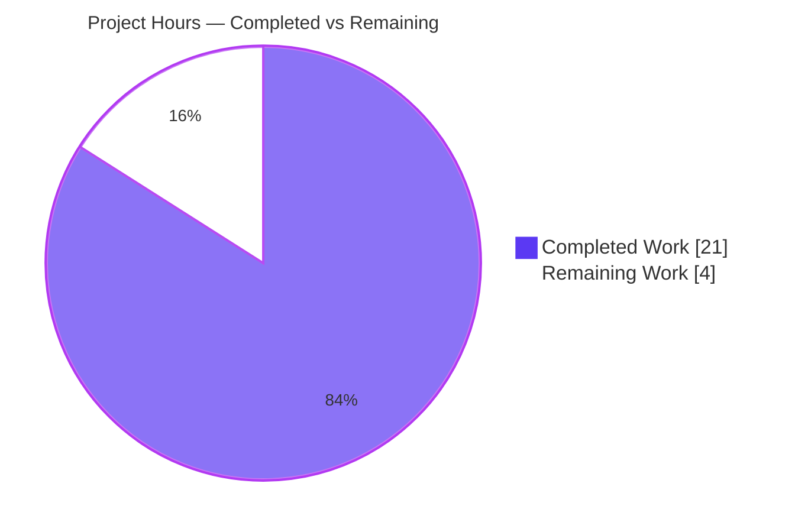
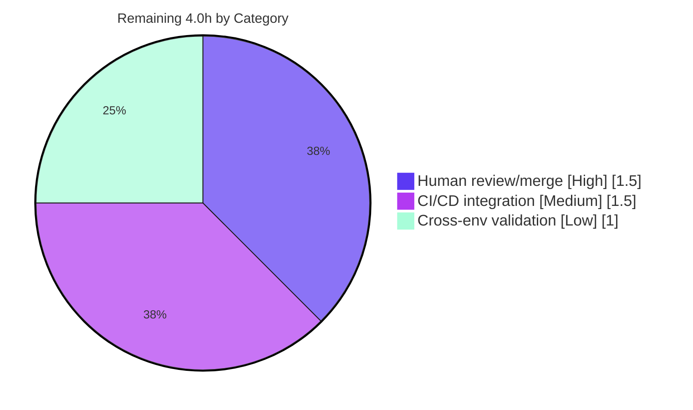

# Blitzy Project Guide — `hao-backprop-test`

> **Project:** `hao-backprop-test` — automated test suite for a minimal, zero-dependency Node.js HTTP server
> **Branch:** `blitzy-7c01c7c6-a0f3-4b08-a455-eff460f1fc85` · **HEAD:** `9c9b57b`
> **Runtime:** Node.js v22.22.2 · npm 10.9.7
> **Brand legend:** <span style="color:#5B39F3">■ Completed / AI Work (#5B39F3)</span> · <span style="color:#FFFFFF;background:#000">■ Remaining / Not Completed (#FFFFFF)</span>

---

## 1. Executive Summary

### 1.1 Project Overview

This project delivers a complete, automated test suite for `hao-backprop-test`, a deliberately minimal zero-dependency Node.js HTTP server that answers every request with `200 / text/plain / "Hello, World!\n"`. The objective — driven by the user request to "scan the code, add testing, and cover performance scenarios" — was a greenfield testing effort (0% prior coverage). Blitzy agents added functional, lifecycle, edge-case, error-handling, and performance/load tests using only Node.js built-in modules (`node:test`, `node:assert`, `node:http`, `node:perf_hooks`, `node:child_process`), preserving the project's zero-dependency design and leaving the application source (`server.js`) byte-for-byte unchanged. The result is 15 passing tests, 100% coverage of `server.js`, and a passing performance harness.

### 1.2 Completion Status



**Completion: 84.0% complete** — calculated per PA1 (AAP-scoped hours only): `Completed 21.0h / (Completed 21.0h + Remaining 4.0h) = 21.0 / 25.0 = 84.0%`.

| Metric | Hours |
|--------|-------|
| **Total Hours** | **25.0** |
| Completed Hours (AI + Manual) | 21.0 (21.0 AI + 0.0 Manual) |
| Remaining Hours | 4.0 |
| **Percent Complete** | **84.0%** |

### 1.3 Key Accomplishments

- ✅ **Functional test suite** (`test/server.test.js`, 12 tests) — verifies status `200`, `Content-Type: text/plain`, exact body `Hello, World!\n`, `Content-Length: 14`, method-agnostic behavior (GET/POST/PUT/DELETE/PATCH/OPTIONS), HEAD empty-body nuance, and route-agnostic arbitrary paths.
- ✅ **Lifecycle test suite** (`test/lifecycle.test.js`, 3 tests) — verifies the exact startup log, loopback-only binding to `127.0.0.1:3000`, and the port-conflict failure path (`EADDRINUSE` / non-zero exit).
- ✅ **Performance / load harness** (`test/performance/load-test.js`) — measures throughput, latency p50/p95/p99, error rate, startup latency, and sustained-load stability; satisfies AAP T-009/T-010.
- ✅ **Reusable test infrastructure** — in-process interception harness + black-box child-process harness (`test/helpers/server-harness.js`), promisified HTTP client and percentile utility (`test/helpers/http-client.js`), shared expected-value fixtures (`test/fixtures/expected.js`).
- ✅ **100% coverage of `server.js`** (line / branch / function) — the AAP's primary coverage target.
- ✅ **Zero-dependency principle preserved** — `package.json` declares 0 dependencies; all imports are Node built-ins or relative paths.
- ✅ **`server.js` unchanged** — minimal-change discipline honored (blob `320a75a`, byte-identical to HEAD).
- ✅ **Standardized commands** — `package.json` scripts (`test`, `test:coverage`, `test:perf`) plus README "Testing" section documenting Node 22 glob nuance.

### 1.4 Critical Unresolved Issues

| Issue | Impact | Owner | ETA |
|-------|--------|-------|-----|
| _None_ — no in-scope code defects; all artifacts pass validation at 100% | None | — | — |

> There are **no critical blocking issues**. All five production-readiness gates passed during autonomous validation. The remaining work consists of standard human-gated path-to-production activities (review/merge, CI/CD, cross-environment validation) listed in Section 2.2.

### 1.5 Access Issues

| System/Resource | Type of Access | Issue Description | Resolution Status | Owner |
|-----------------|----------------|-------------------|-------------------|-------|
| _None_ | — | No access issues identified | N/A | — |

> **No access issues identified.** The project requires no repository credentials, service tokens, third-party APIs, databases, or network resources beyond local loopback port `3000`. The entire test stack is bundled with the Node.js runtime.

### 1.6 Recommended Next Steps

1. **[High]** Human review and merge of the test-suite pull request — confirm test intent, run the suite locally, and merge to the integration branch.
2. **[Medium]** Add a CI/CD workflow (e.g., GitHub Actions) that runs `npm test` and `npm run test:coverage` on push/PR, pinned to Node.js 22.x.
3. **[Medium]** Wire the performance harness (`npm run test:perf`) into CI as a non-blocking, informational job (thresholds are soft/environment-relative).
4. **[Low]** Validate the suite across additional Node.js LTS lines (20.x, 24.x) and document a short operational runbook for the port-3000 prerequisite.

---

## 2. Project Hours Breakdown

### 2.1 Completed Work Detail

| Component | Hours | Description |
|-----------|-------|-------------|
| Code scan & test strategy (R1) | 1.5 | Repository analysis, behavior discovery, harness-pattern selection (in-process vs. black-box) |
| `test/server.test.js` (R2) | 3.0 | 12 functional + edge tests: status/headers/body/Content-Length, method-agnostic, HEAD, route-agnostic |
| `test/lifecycle.test.js` (R3) | 2.0 | 3 lifecycle tests: startup log, loopback binding, port-conflict `EADDRINUSE` |
| `test/performance/load-test.js` (R4) | 4.0 | Load harness: throughput, p50/p95/p99 latency, error rate, startup latency, stability + env hardening |
| `test/helpers/server-harness.js` (R5) | 3.5 | In-process `http.createServer` interception + child-process spawn/await-log/teardown helpers |
| `test/helpers/http-client.js` (R6) | 1.5 | Promisified `http` request helper + `percentile()` utility |
| `test/fixtures/expected.js` (R7) | 0.5 | Shared expected-value constants (status, content-type, body, host, port, startup log) |
| `package.json` (R8) | 1.0 | Minimal zero-dependency manifest with `test` / `test:coverage` / `test:perf` scripts |
| `README.md` Testing section (R9) | 1.5 | Documented run commands and Node 22 bare-directory glob rationale |
| Coverage + QA validation cycle (R10) | 2.5 | 100/100/100 coverage verification, 5× determinism runs, performance validation, scope/compliance checks |
| **Total Completed** | **21.0** | |

> **Validation:** Total of the Hours column = **21.0**, matching Completed Hours in Section 1.2. ✓

### 2.2 Remaining Work Detail

| Category | Hours | Priority |
|----------|-------|----------|
| Human review & merge of test-suite PR (R12) | 1.5 | High |
| CI/CD workflow integration (R13) | 1.5 | Medium |
| Cross-environment validation + operational runbook (R14) | 1.0 | Low |
| **Total Remaining** | **4.0** | |

> **Validation:** Total of the Hours column = **4.0**, matching Remaining Hours in Section 1.2 and the Section 7 pie "Remaining Work" value. ✓

### 2.3 Total Project Hours Reconciliation

| Calculation | Value |
|-------------|-------|
| Section 2.1 Completed | 21.0 |
| Section 2.2 Remaining | 4.0 |
| **Total (2.1 + 2.2)** | **25.0** |
| **Completion % (21.0 / 25.0 × 100)** | **84.0%** |

> Matches Total Hours in Section 1.2. ✓ — `Completed (21.0) + Remaining (4.0) = Total (25.0)`; `84.0%` complete.

---

## 3. Test Results

All tests below originate from Blitzy's autonomous validation logs for this project, reproduced live during assessment (Node.js v22.22.2). The functional + lifecycle suites are executed via `node --test --test-concurrency=1 'test/**/*.test.js'`; the performance harness is executed separately via `node test/performance/load-test.js`.

| Test Category | Framework | Total Tests | Passed | Failed | Coverage % | Notes |
|---------------|-----------|-------------|--------|--------|------------|-------|
| Functional / Edge (`server.test.js`) | `node:test` + `node:assert` | 12 | 12 | 0 | `server.js` 100% | Status/headers/body/CL-14; GET/POST/PUT/DELETE/PATCH/OPTIONS; HEAD empty body; 4 route-agnostic paths; byte-exact body |
| Lifecycle (`lifecycle.test.js`) | `node:test` + `node:child_process` | 3 | 3 | 0 | behavioral (child process) | Exact startup log; loopback bind + 200; port-conflict `EADDRINUSE` / non-zero exit |
| Performance / Load (`load-test.js`) | `node:http` + `node:perf_hooks` | 1 harness (T-009/T-010) | PASS | 0 | n/a | 2000 req, 0 errors (0.00%), throughput ~7477–7986 req/s, startup ~43–48ms, p50 ~5ms / p95 ~9ms / p99 ~32–43ms, stability=PASS |
| **Total (assertion suites)** | **`node:test`** | **15** | **15** | **0** | — | 0 skipped, 0 todo, 0 cancelled; deterministic across 5 consecutive runs |

**Coverage detail (from `npm run test:coverage`):**

| File | Line % | Branch % | Func % | Notes |
|------|--------|----------|--------|-------|
| `server.js` | **100.00** | **100.00** | **100.00** | **Primary AAP coverage target — MET** |
| `test/fixtures/expected.js` | 100.00 | 100.00 | 100.00 | — |
| `test/server.test.js` | 100.00 | 100.00 | 100.00 | — |
| `test/lifecycle.test.js` | 100.00 | 100.00 | 100.00 | — |
| `test/helpers/http-client.js` | 67.39 | — | — | Uncovered = `percentile`/`timedRequest` (exercised by perf harness, run separately) |
| `test/helpers/server-harness.js` | 88.71 | — | — | Uncovered = defensive error/timeout/exit safety-nets |
| **All files** | **90.55** | **85.45** | **82.98** | Helper partials are legitimate, NOT an AAP gate |

---

## 4. Runtime Validation & UI Verification

This is a headless HTTP server with **no UI**; runtime validation covers process startup, request handling, and clean shutdown.

**Application runtime (`node server.js`):**
- ✅ **Startup** — emits exact log `Server running at http://127.0.0.1:3000/`
- ✅ **Binding** — binds `127.0.0.1:3000` (loopback only)
- ✅ **GET /** — `200` / `Content-Type: text/plain` / body `Hello, World!\n` (14 bytes, byte-verified via both `curl` and the Node http client)
- ✅ **Method invariance** — POST/PUT/DELETE/PATCH/OPTIONS to arbitrary paths return identical response
- ✅ **Route invariance** — `/`, `/foo`, `/a/b/c?x=1`, long paths all return identical response
- ✅ **HEAD /** — `200` + headers with empty body (Node strips body for HEAD)
- ✅ **Shutdown** — releases port `3000` cleanly

**Performance harness (`npm run test:perf`):**
- ✅ **Operational** — 2000 requests, **0 errors (0.00%)**, throughput ~7477–7986 req/s, startup latency ~43–48ms, p50 ~5ms / p95 ~9ms / p99 ~32–43ms, **stability=PASS**
- ✅ **Env hardening** — invalid `CONCURRENCY` / `TOTAL_REQUESTS` values exit `1` BEFORE spawning the server (no hangs); guaranteed teardown via `finally` (no orphaned children)

**UI Verification:** ⚠ Not applicable — the project exposes no browser UI; the response is a static `text/plain` payload.

---

## 5. Compliance & Quality Review

| AAP Deliverable / Benchmark | Status | Progress | Notes |
|-----------------------------|--------|----------|-------|
| Functional response-contract tests | ✅ Pass | 100% | `test/server.test.js` — 12 tests |
| Method/route-invariance edge tests | ✅ Pass | 100% | All HTTP methods + arbitrary paths + HEAD |
| Lifecycle (startup/bind/log) tests | ✅ Pass | 100% | `test/lifecycle.test.js` |
| Failure path (`EADDRINUSE`) test | ✅ Pass | 100% | Port-conflict negative case |
| Performance scenarios (T-009/T-010) | ✅ Pass | 100% | `test/performance/load-test.js` |
| `server.js` coverage ~100% | ✅ Pass | 100% | 100/100/100 line/branch/func |
| Zero external dependencies | ✅ Pass | 100% | `package.json` declares 0 deps; built-ins only |
| `server.js` not modified | ✅ Pass | 100% | Blob `320a75a`, byte-identical to HEAD |
| CommonJS + `*.test.js` conventions | ✅ Pass | 100% | Matches `server.js` style |
| Standardized test commands | ✅ Pass | 100% | `package.json` scripts + README |
| CI/CD pipeline | ⬜ Not started | 0% | Out of AAP default scope; path-to-production (R13) |
| Cross-environment validation | ⬜ Not started | 0% | Path-to-production (R14) |
| Human review/merge gate | ⬜ Not started | 0% | Requires human action (R12) |

**Fixes applied during autonomous validation:** None required — all artifacts from prior Blitzy commits passed at 100% with zero source changes. One environmental transient (stray orphaned `node server.js` processes causing `EADDRINUSE` during perf testing) was resolved by killing the exact PIDs and re-running; this was a test-execution artifact, not an in-scope defect.

---

## 6. Risk Assessment

| Risk | Category | Severity | Probability | Mitigation | Status |
|------|----------|----------|-------------|------------|--------|
| Bare-directory `node --test test/` fails on Node 22 (`MODULE_NOT_FOUND`) | Technical | Low | Low | Repo uses quoted glob `'test/**/*.test.js'` in scripts + README documents rationale | Mitigated |
| Helper files <100% coverage (http-client 67%, server-harness 89%) | Technical | Low | N/A | Uncovered lines are perf-only utilities + defensive safety-nets; `server.js` (the AAP target) is 100% | Accepted |
| In-process `http.createServer` interception harness brittleness | Technical | Low | Low | Single, well-isolated wrapper returning the real server unchanged; teardown closes handle | Resolved |
| Transient `EADDRINUSE` from orphaned test processes | Technical | Low | Low | Guaranteed `finally` teardown; exact-PID kills (never `pkill`) | Resolved |
| No CI/CD pipeline | Operational | Medium | High | Add GitHub Actions workflow (R13) | Open |
| Hardcoded port `3000` (single shared resource) | Operational | Low | Low | `--test-concurrency=1` serializes server-starting suites; port-conflict test is deliberate | Mitigated |
| Soft, environment-relative performance thresholds | Operational | Low | Medium | Documented as informational, not contractual SLAs | Accepted |
| CI runner environment assumptions (port 3000 free, Node 22) | Integration | Low | Medium | Document prerequisites; pin Node version in CI (R14) | Open |
| Orphaned child process on abnormal exit | Integration | Low | Low | `finally`-block teardown verified; no orphans on any tested path | Mitigated |
| Security surface (no auth, plaintext, loopback-only) | Security | Low | Low | By design — server is loopback-only test fixture; no sensitive data, no external exposure | Accepted |

**Overall risk posture: LOW.** Zero real security risks. Only 2 items are **Open** (no CI/CD #5, CI env assumptions #8) and both map directly to the remaining path-to-production work in Section 2.2.

---

## 7. Visual Project Status

### 7.1 Project Hours Breakdown



> Completed = <span style="color:#5B39F3">#5B39F3 (Dark Blue)</span> · Remaining = <span style="color:#FFFFFF;background:#000">#FFFFFF (White)</span>. "Remaining Work" = **4** matches Section 1.2 (4.0h) and the Section 2.2 sum (4.0h). ✓

### 7.2 Remaining Work by Category (Priority Distribution)



**Remaining hours per category (bar view):**

| Category | Hours | Bar |
|----------|-------|-----|
| Human review & merge [High] | 1.5 | ███████████████ |
| CI/CD integration [Medium] | 1.5 | ███████████████ |
| Cross-env validation [Low] | 1.0 | ██████████ |
| **Total** | **4.0** | |

> The three category values sum to **4.0h**, consistent with Sections 1.2, 2.2, and 7.1. ✓

---

## 8. Summary & Recommendations

**Achievements.** The project is **84.0% complete** (21.0 of 25.0 AAP-scoped hours). Blitzy agents delivered a complete, deterministic, zero-dependency test suite: **15/15 tests pass**, `server.js` reaches **100% line/branch/function coverage** (the AAP's primary target), and the explicit user requirement for performance testing is fully satisfied by a load harness reporting throughput, latency percentiles, error rate, startup latency, and stability (2000 requests, 0 errors). The minimal-change discipline and zero-dependency principle were both honored end-to-end — `server.js` is byte-identical to its original blob (`320a75a`) and no external packages were introduced.

**Remaining gaps (4.0h).** All remaining work is standard, human-gated path-to-production activity rather than code defects: (1) human review and merge of the test-suite PR [High, 1.5h], (2) CI/CD workflow integration [Medium, 1.5h], and (3) cross-environment validation plus an operational runbook [Low, 1.0h].

**Critical path to production.** Review & merge → add CI workflow pinned to Node 22.x running `npm test` + `npm run test:coverage` → optionally wire `npm run test:perf` as an informational job → validate on additional LTS lines.

**Success metrics (all met for the autonomous scope):** 100% test pass rate, 100% `server.js` coverage, 0 performance errors, 0 external dependencies, 0 source modifications.

**Production-readiness assessment.** The autonomous scope is **production-ready**: it compiles cleanly (`node --check` on all 7 JS files), all 15 tests pass deterministically, coverage meets the target, the application runs correctly, and the performance suite passes with zero errors. The working tree is clean on branch `blitzy-7c01c7c6-a0f3-4b08-a455-eff460f1fc85` (HEAD `9c9b57b`). Overall risk posture is **LOW**. The path to full production deployment is short and well-defined.

| Metric | Value |
|--------|-------|
| Completion | 84.0% |
| Tests passing | 15 / 15 |
| `server.js` coverage | 100% / 100% / 100% |
| Performance errors | 0 / 2000 |
| External dependencies | 0 |
| Source files modified | 0 |
| Risk posture | LOW |

---

## 9. Development Guide

All commands run from the repository root and were tested live during validation (Node.js v22.22.2, npm 10.9.7). The entire stack is built into Node.js — **no `npm install` is required**.

### 9.1 System Prerequisites

- **Node.js v22.x** (validated on v22.22.2; LTS line). Verify: `node --version`
- **npm 10.x** (optional, only for the convenience scripts; validated on 10.9.7). Verify: `npm --version`
- **Operating system:** Linux/macOS/Windows (validated on Linux)
- **Network:** TCP port `3000` on `127.0.0.1` must be free when tests run
- **No external packages, databases, or services required**

### 9.2 Environment Setup

```bash
# Clone / enter the repository
cd hao-backprop-test

# Confirm runtime
node --version    # expect: v22.x (validated v22.22.2)

# No dependency installation is needed — the stack is 100% Node.js built-ins.
# NOTE: running `npm install` is a no-op for dependencies but CREATES an
# unwanted package-lock.json (the committed repo intentionally has no lockfile).
# If you run it, remove the artifact afterward:
#   rm -f package-lock.json
```

### 9.3 Dependency Installation

No dependencies to install. `package.json` declares zero `dependencies` and zero `devDependencies`. Skip `npm install` entirely. Every `require` resolves to a Node built-in (`node:test`, `node:assert`, `node:http`, `node:perf_hooks`, `node:child_process`, `node:path`) or a relative path.

### 9.4 Application Startup

```bash
# Start the server (foreground)
node server.js
# Expected stdout:
#   Server running at http://127.0.0.1:3000/
```

### 9.5 Verification Steps

```bash
# 1. Functional + lifecycle suite (expect: 15/15 pass)
npm test
#   raw equivalent:
#   node --test --test-concurrency=1 'test/**/*.test.js'

# 2. Coverage run (expect: server.js 100% line/branch/func)
npm run test:coverage
#   raw equivalent:
#   node --test --experimental-test-coverage --test-force-exit --test-concurrency=1 'test/**/*.test.js'

# 3. Performance / load (expect: 0 errors, stability=PASS)
npm run test:perf
#   raw equivalent (custom parameters):
#   CONCURRENCY=50 TOTAL_REQUESTS=2000 node test/performance/load-test.js

# 4. Single test file
node --test test/server.test.js     # expect 12/12

# 5. Debug a single file (inspector)
node --inspect-brk --test test/server.test.js
```

### 9.6 Example Usage

```bash
# Verify the live server's response contract
node server.js &            # start in background (note the PID it prints is the shell's)
sleep 1
curl -i http://127.0.0.1:3000/
# Expected:
#   HTTP/1.1 200 OK
#   Content-Type: text/plain
#   Content-Length: 14
#
#   Hello, World!

# Any method/path returns the identical response:
curl -i -X POST http://127.0.0.1:3000/any/path?x=1

# Stop the background server when done (use the exact node PID):
#   kill <node-pid>
```

### 9.7 Troubleshooting

| Symptom | Cause | Resolution |
|---------|-------|------------|
| `MODULE_NOT_FOUND` running `node --test test/` | Node 22 treats a bare directory positional as a module entry point | Use the quoted glob: `node --test 'test/**/*.test.js'` (already used by the npm scripts) |
| `EADDRINUSE` on startup or during tests | Port `3000` already occupied (often a stray `node server.js`) | Free the port: find the exact PID (`lsof -i :3000`) and `kill <pid>` — never `pkill node` |
| Unexpected `package-lock.json` appears | `npm install` was run | `rm -f package-lock.json` (the repo intentionally has no lockfile) |
| Perf harness exits `1` immediately | Invalid `CONCURRENCY` / `TOTAL_REQUESTS` env var | Provide positive integers, e.g. `CONCURRENCY=50 TOTAL_REQUESTS=2000` (fail-fast is intentional) |
| Coverage process hangs after suite | In-process harness holds a server handle | The `--test-force-exit` flag (in `test:coverage`) guarantees clean exit |

---

## 10. Appendices

### A. Command Reference

| Purpose | Command |
|---------|---------|
| Run functional + lifecycle suite | `npm test` → `node --test --test-concurrency=1 'test/**/*.test.js'` |
| Run with coverage | `npm run test:coverage` → `node --test --experimental-test-coverage --test-force-exit --test-concurrency=1 'test/**/*.test.js'` |
| Run performance / load | `npm run test:perf` → `node test/performance/load-test.js` |
| Custom perf parameters | `CONCURRENCY=N TOTAL_REQUESTS=M node test/performance/load-test.js` |
| Single test file | `node --test test/server.test.js` |
| Debug (inspector) | `node --inspect-brk --test test/server.test.js` |
| Start server | `node server.js` |
| Syntax check a file | `node --check <file.js>` |

### B. Port Reference

| Port | Host | Purpose | Notes |
|------|------|---------|-------|
| `3000` | `127.0.0.1` | HTTP server bind (hardcoded in `server.js`) | Loopback only; must be free before running tests; port-conflict test deliberately occupies it briefly |

### C. Key File Locations

| Path | Role |
|------|------|
| `server.js` | System under test — HTTP server (UNCHANGED, blob `320a75a`) |
| `package.json` | Zero-dependency manifest + test scripts |
| `README.md` | Project description + Testing section |
| `test/server.test.js` | Functional + edge tests (12) |
| `test/lifecycle.test.js` | Startup/bind/failure tests (3) |
| `test/performance/load-test.js` | Performance / load harness (T-009/T-010) |
| `test/helpers/server-harness.js` | In-process + child-process harness helpers |
| `test/helpers/http-client.js` | Promisified HTTP client + `percentile()` |
| `test/fixtures/expected.js` | Shared expected-value constants |

### D. Technology Versions

| Component | Version | Source |
|-----------|---------|--------|
| Node.js | v22.22.2 | `node --version` (verified) |
| npm | 10.9.7 | `npm --version` (verified) |
| git | 2.51.0 | `git --version` (verified) |
| git-lfs | 3.7.1 | present (standard hooks only) |
| `node:test` / `node:assert` / `node:http` / `node:perf_hooks` / `node:child_process` | bundled with Node 22.22.2 | built-in |
| External runtime/test dependencies | 0 | by design |

### E. Environment Variable Reference

| Variable | Default | Used by | Purpose |
|----------|---------|---------|---------|
| `CONCURRENCY` | `50` | `test/performance/load-test.js` | Number of concurrent in-flight requests (positive integer; invalid → exit 1) |
| `TOTAL_REQUESTS` | `2000` | `test/performance/load-test.js` | Total requests to issue during the load run (positive integer; invalid → exit 1) |

> The application (`server.js`) reads **no** environment variables — host (`127.0.0.1`) and port (`3000`) are hardcoded by design.

### F. Developer Tools Guide

| Tool | Usage |
|------|-------|
| Node built-in test runner | `node --test` with glob `'test/**/*.test.js'`; `--test-concurrency=1` serializes server-starting suites |
| Coverage | `--experimental-test-coverage` flag (no `c8`/`nyc` needed); `--test-force-exit` guarantees clean exit |
| Inspector / debugger | `node --inspect-brk --test <file>` then attach a debugger |
| `node --check <file>` | Static syntax validation (used in CI-style verification) |
| `curl` / `lsof` | Manual runtime verification and port inspection |

### G. Glossary

| Term | Definition |
|------|------------|
| AAP | Agent Action Plan — the authoritative scope document for this effort |
| In-process interception harness | Test pattern that wraps `http.createServer` to capture the live server instance before requiring `server.js`, enabling coverage without source edits |
| Black-box child-process harness | Test pattern that spawns `node server.js`, awaits the startup log, drives HTTP traffic, and terminates the process |
| Method/route-agnostic | The server returns an identical response regardless of HTTP method or URL path |
| `EADDRINUSE` | OS error when a process attempts to bind a port already in use — the expected failure mode in the port-conflict test |
| T-009 / T-010 | AAP performance test IDs (throughput/latency and sustained-load stability) |
| Zero-dependency principle | Design constraint: use only Node.js built-in modules; no external npm packages |

---

*Generated by the Blitzy autonomous assessment agent. Completion (84.0%) reflects AAP-scoped and path-to-production work only. Brand colors: Completed `#5B39F3`, Remaining `#FFFFFF`, Headings/Accents `#B23AF2`, Highlight `#A8FDD9`.*