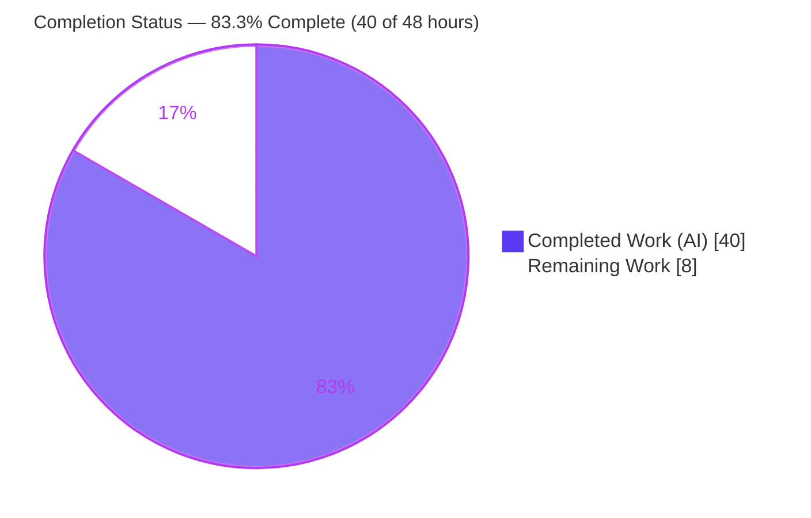
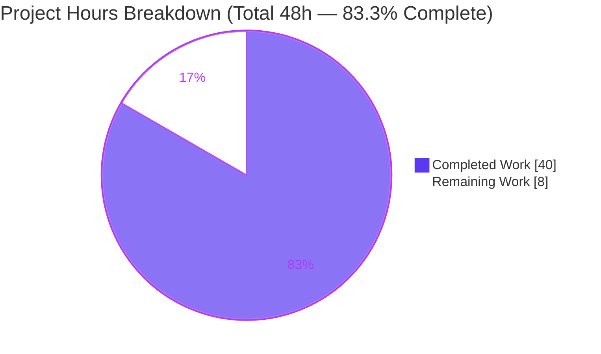
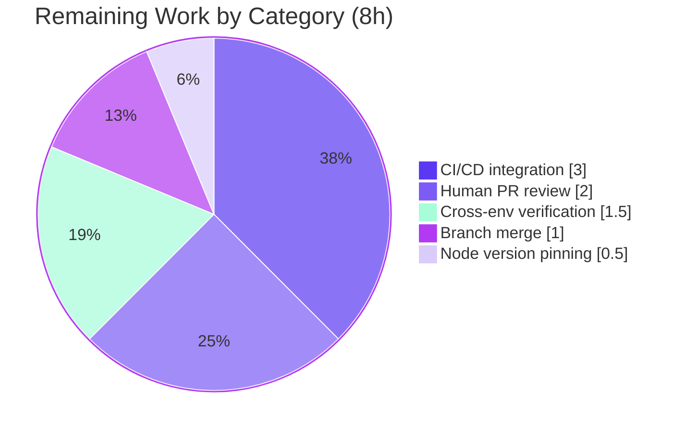

# Blitzy Project Guide — hao-backprop-test Automated Test Suite

> **Project:** `hao-backprop-test` — Zero-Dependency Node.js HTTP Server Test Suite
> **Branch:** `blitzy-7c01c7c6-a0f3-4b08-a455-eff460f1fc85` · **HEAD:** `8af4a70`
> **Runtime:** Node.js v22.22.2 · npm 11.1.0 · **External dependencies:** 0
> **Completion:** 83.3% (40 of 48 hours) · **Status:** AAP scope fully delivered; path-to-production remaining

---

## 1. Executive Summary

### 1.1 Project Overview

This project establishes a complete, automated, **zero-dependency** test suite for `hao-backprop-test` — a deliberately minimal 14-line Node.js HTTP server that answers every request (any method, any path) with HTTP `200`, `Content-Type: text/plain`, and the exact body `Hello, World!\n`. The greenfield effort (0% coverage at baseline) delivers functional, lifecycle, edge-case, error-handling, and — per explicit user mandate — **performance** test layers built entirely on Node.js built-in modules (`node:test`, `node:assert`, `node:http`, `node:perf_hooks`, `node:child_process`). The application source (`server.js`) is intentionally left unmodified. The suite achieves 100% coverage of `server.js` and validates the full observable HTTP contract under concurrent load.

### 1.2 Completion Status



**Center label:** **83.3% Complete**

| Metric | Hours |
| --- | --- |
| **Total Hours** | 48 |
| **Completed Hours (AI + Manual)** | 40 |
| &nbsp;&nbsp;— AI (autonomous Blitzy agents) | 40 |
| &nbsp;&nbsp;— Manual (human) | 0 |
| **Remaining Hours** | 8 |
| **Percent Complete** | **83.3%** |

> Completion is computed via the AAP-scoped, hours-based methodology: `Completed ÷ (Completed + Remaining) = 40 ÷ 48 = 83.3%`. All AAP deliverables are 100% functionally delivered and independently validated; the remaining 8 hours are exclusively **path-to-production** activities (human review, CI/CD, cross-environment verification, merge).

### 1.3 Key Accomplishments

- ✅ **Functional test suite** (`test/server.test.js`) — 15 cases validating status `200`, `Content-Type: text/plain`, exact body, and `Content-Length: 14` across GET/POST/PUT/DELETE/PATCH/OPTIONS, the HEAD empty-body nuance, and route-agnostic paths (including a 2000-character path).
- ✅ **Lifecycle test suite** (`test/lifecycle.test.js`) — 3 cases asserting the exact startup log, loopback binding to `127.0.0.1:3000`, and the port-conflict failure (`EADDRINUSE` / non-zero exit).
- ✅ **Performance/load harness** (`test/performance/load-test.js`) — measures throughput, latency p50/p95/p99, error rate, startup latency, and sustained-load stability (the explicit user requirement).
- ✅ **100% coverage of `server.js`** (line / branch / function) via an in-process `http.createServer` interception harness — **with no source modification**.
- ✅ **Zero external dependencies** — entire stack uses Node.js built-ins; `npm audit` reports 0 vulnerabilities.
- ✅ **Reusable test infrastructure** — shared harness, promisified HTTP client with percentile math, and a single source-of-truth fixtures module.
- ✅ **Standardized commands** — zero-dependency `package.json` exposing `test`, `test:coverage`, and `test:perf`, plus a comprehensive README "Testing" section.
- ✅ **All 5 production-readiness gates passed** at 100% and independently re-verified in this assessment.

### 1.4 Critical Unresolved Issues

| Issue | Impact | Owner | ETA |
| --- | --- | --- | --- |
| _None_ — there are no unresolved blocking issues. All AAP deliverables compile, all 18 tests pass, coverage is 100%, and the performance harness runs cleanly. | None | — | — |

> No compilation errors, no failing tests, and no missing AAP functionality were found. The items in Sections 1.6 and 2.2 are standard path-to-production activities, not defects.

### 1.5 Access Issues

| System / Resource | Type of Access | Issue Description | Resolution Status | Owner |
| --- | --- | --- | --- | --- |
| Git repository | Read/Write | Branch checked out; working tree clean | ✅ No issue | — |
| npm registry | Read | Not required (zero external dependencies; `npm ci` is a no-op) | ✅ No issue | — |
| Runtime / services | N/A | No databases, secrets, env files, or third-party services exist | ✅ No issue | — |

**No access issues identified.** The project is fully self-contained and requires no credentials, network access, or external services to build, test, or run.

### 1.6 Recommended Next Steps

1. **[High]** Conduct human PR review and sign-off of the test suite (verify harness design, coverage approach, and performance methodology). *(2h)*
2. **[Medium]** Integrate the suite into a CI/CD pipeline that runs `npm test`, `npm run test:coverage`, and `npm run test:perf` with port `3000` free on the runner. *(3h)*
3. **[Medium]** Verify the suite across the declared Node version range (`engines >= 20`) on at least Node 20.x and 22.x. *(1.5h)*
4. **[Medium]** Merge the `blitzy-7c01c7c6` branch to mainline (additive-only; no conflicts expected). *(1h)*
5. **[Low]** Optionally add a `.nvmrc` to complement `engines >= 20` for local-development consistency. *(0.5h)*

---

## 2. Project Hours Breakdown

### 2.1 Completed Work Detail

| Component | Hours | Description |
| --- | --- | --- |
| Codebase discovery & test strategy design | 3 | Scanned `server.js`, determined observable-behavior test strategy, selected the zero-dependency built-in stack, and designed the two harness patterns. |
| Shared fixtures (`test/fixtures/expected.js`) | 1 | Single source-of-truth constants: status, content type, body, Content-Length, host, port, startup log. |
| HTTP client + percentile utility (`test/helpers/http-client.js`) | 3 | Promisified `node:http` request, `timedRequest` with `perf_hooks`, and a defensive `percentile()` implementation. |
| Server harness — in-process + child-process (`test/helpers/server-harness.js`) | 6 | In-process `http.createServer` interception (yields coverage with no source edit), child-process spawn/await-startup/teardown, and a raw-spawn helper for the negative path. |
| Functional & edge test suite (`test/server.test.js`, 15 cases) | 5 | Full response contract across all HTTP methods, HEAD empty-body, route-agnostic paths, byte-exact body, and T-002/T-003/T-004 granular cases. |
| Lifecycle test suite (`test/lifecycle.test.js`, 3 cases) | 4 | Startup-log assertion, loopback binding, and port-conflict `EADDRINUSE` negative case with a race-timeout guard. |
| Performance/load harness (`test/performance/load-test.js`) | 6 | Concurrency driver, throughput/latency-percentile/error-rate/startup-latency/stability metrics, env-configurable parameters, input validation, and resource-safe teardown. |
| Zero-dependency manifest & scripts (`package.json`, `package-lock.json`) | 1 | Metadata, `engines >= 20`, and `test` / `test:coverage` / `test:perf` scripts; zero declared dependencies. |
| Testing documentation (`README.md`) | 2 | Comprehensive "Testing" section: prerequisites, commands (npm + raw), layout, and performance notes. |
| Coverage instrumentation & 100% verification | 2 | Validated `server.js` at 100% line/branch/function via `--experimental-test-coverage`. |
| Iterative review & hardening (3 checkpoint cycles) | 4 | Review-driven fixes: README command accuracy, lockfile consistency, perf-spec conformance, and resource-safety hardening. |
| Final 5-gate production-readiness validation | 3 | Dependencies, compilation, tests, coverage, and runtime+performance gates verified; environment artifacts resolved. |
| **Total Completed** | **40** | |

### 2.2 Remaining Work Detail

| Category | Hours | Priority |
| --- | --- | --- |
| Human PR review & sign-off | 2.0 | High |
| CI/CD pipeline integration (`npm test` / `test:coverage` / `test:perf`) | 3.0 | Medium |
| Cross-environment / multi-Node verification (`engines >= 20`) | 1.5 | Medium |
| Branch merge & integration to mainline | 1.0 | Medium |
| Node version pinning decision (`.nvmrc`, optional) | 0.5 | Low |
| **Total Remaining** | **8.0** | |

### 2.3 Hours Reconciliation

| Check | Result |
| --- | --- |
| Section 2.1 Completed total | 40 h |
| Section 2.2 Remaining total | 8 h |
| Section 2.1 + Section 2.2 | 48 h = Total Project Hours (matches Section 1.2) ✅ |
| Completion % | 40 ÷ 48 = **83.3%** (matches Section 1.2 & Section 7) ✅ |

---

## 3. Test Results

All tests below originate from **Blitzy's autonomous validation logs** and were independently re-executed during this assessment (Node.js v22.22.2).

| Test Category | Framework | Total Tests | Passed | Failed | Coverage % | Notes |
| --- | --- | --- | --- | --- | --- | --- |
| Functional (HTTP contract + edge) | `node:test` + `node:assert` | 15 | 15 | 0 | `server.js` 100% | In-process `http.createServer` interception harness; status/headers/body/Content-Length, all methods, HEAD, route-agnostic paths |
| Lifecycle (startup / bind / failure) | `node:test` + `node:assert` | 3 | 3 | 0 | behavioral | Black-box child-process harness; startup log, loopback bind, port-conflict `EADDRINUSE` |
| **Assertion suite subtotal** | `node:test` | **18** | **18** | **0** | `server.js` 100% | 2 suites; `npm test` → exit 0 |
| Performance / Load | `node:perf_hooks` custom harness | 1 run (2000 requests) | 2000 ok | 0 errors | n/a | Throughput ≈ 7,487 req/s; p50 ≈ 5.2 ms, p95 ≈ 10.0 ms, p99 ≈ 46.3 ms; startup ≈ 45 ms; stability PASS |

**Coverage report (`server.js` — the sole AAP source target):**

| File | Line % | Branch % | Function % | Uncovered Lines |
| --- | --- | --- | --- | --- |
| `server.js` | 100.00 | 100.00 | 100.00 | none |

> Test-support modules (`http-client.js`, `server-harness.js`) intentionally report sub-100% because they contain perf-harness-only code paths and defensive teardown branches; these are **not** AAP coverage targets. The AAP target — `server.js` — is at 100/100/100.

**Aggregate:** 18 / 18 assertion tests passing (100% pass rate); performance harness `PERF OK` with 0 errors across 2,000 requests.

---

## 4. Runtime Validation & UI Verification

**Runtime health:**

- ✅ **Operational** — `node server.js` starts and emits the exact startup log `Server running at http://127.0.0.1:3000/`.
- ✅ **Operational** — Clean startup and shutdown; port `3000` released on exit; no orphaned processes from the in-scope harness.

**HTTP / API verification** (validated via `curl` and the test harness):

- ✅ **Operational** — `GET /` → `200`, `Content-Type: text/plain`, `Content-Length: 14`, body `Hello, World!\n` (byte-exact, confirmed via `od -c`).
- ✅ **Operational** — `POST /anything?q=1` → identical `200` response (method- and route-agnostic invariant holds).
- ✅ **Operational** — `HEAD /` → `200` with headers present and empty body (Node strips the body for HEAD).
- ✅ **Operational** — Loopback binding: a request to `127.0.0.1:3000` succeeds with the expected contract.
- ✅ **Operational** — Negative path: a second server instance on the occupied port fails fast with `EADDRINUSE` and a non-zero exit.

**Performance verification:**

- ✅ **Operational** — 2,000 concurrent requests completed with 0 errors (0.00% error rate); stability verdict `PASS`; all AAP-mandated metrics (throughput, p50/p95/p99 latency, error rate, startup latency) emitted.

**UI verification:**

- ⚠ **Not applicable** — `hao-backprop-test` is a headless backend HTTP server that returns `text/plain`. There is no graphical user interface to verify. All observable behavior is exercised at the HTTP boundary above.

---

## 5. Compliance & Quality Review

This matrix cross-maps AAP deliverables and constraints to Blitzy's quality and compliance benchmarks. All items were verified during autonomous validation and independently re-confirmed in this assessment.

| Benchmark / Deliverable | Requirement Source | Status | Progress | Notes |
| --- | --- | --- | --- | --- |
| Functional test suite | AAP §0.5.1 (`server.test.js`) | ✅ Pass | 100% | 15/15 cases; full contract + edges |
| Lifecycle test suite | AAP §0.5.1 (`lifecycle.test.js`) | ✅ Pass | 100% | 3/3 cases; startup/bind/failure |
| Performance/load harness | AAP §0.5.1 + user mandate | ✅ Pass | 100% | All metrics emitted; `PERF OK` |
| Test helpers & fixtures | AAP §0.5.1 | ✅ Pass | 100% | Harness, HTTP client, expected constants |
| `server.js` coverage ≈ 100% | AAP §0.7.1 | ✅ Pass | 100% | 100% line/branch/function |
| Test matrix T-001…T-010 | AAP §0.3.1 | ✅ Pass | 100% | All 10 mapped to implemented cases |
| Minimal-change discipline (`server.js` unmodified) | AAP §0.10 | ✅ Pass | 100% | Empty diff vs base commit `1484182` |
| Zero-dependency principle | AAP §0.6.1 | ✅ Pass | 100% | No `jest`/`mocha`/`vitest`/`supertest`/`autocannon`/`c8`; `npm audit` 0 vulns |
| CommonJS + `*.test.js` conventions | AAP §0.7.2 | ✅ Pass | 100% | Matches `server.js` style; conventional `test/` layout |
| Test isolation (`--test-concurrency=1`) | AAP §0.9.1 | ✅ Pass | 100% | Serialized on hardcoded port 3000 |
| Zero-placeholder policy | Blitzy standard | ✅ Pass | 100% | No TODO/FIXME/stub/empty bodies |
| `FeatureService` correctly NOT targeted | AAP §0.1.2 / §0.8.2 | ✅ Pass | 100% | Non-existent component avoided |
| CI/CD automation | Path-to-production | ⬜ Open | 0% | Out of AAP default scope; recommended next step |

**Fixes applied during autonomous validation:** README command accuracy, `npm ci` lockfile consistency, performance-spec conformance, and resource-safety hardening (see commits `34654a6`, `ab30e76`, `9c3fa26`, `e8e60b6`). **Outstanding compliance items:** CI/CD automation only (path-to-production).

---

## 6. Risk Assessment

Overall risk posture: **LOW**. There are no High-severity risks. The three Open items are all path-to-production with mitigations already costed into the 8 remaining hours.

| Risk | Category | Severity | Probability | Mitigation | Status |
| --- | --- | --- | --- | --- | --- |
| R1: `server.js` has no error handling beyond listen failure (linear, branch-free handler) | Technical | Low | Low | By-design per AAP minimal-change clause; documented intentionally; not a defect | Accepted (out of scope) |
| R2: Hardcoded port `3000` contention between server-starting suites | Technical | Low | Low | `--test-concurrency=1` serialization in npm scripts; TCP connect-probe before runs | Mitigated |
| R3: `--experimental-test-coverage` flag may change across Node majors | Technical | Low | Low | `engines >= 20`; flag stable since Node 20; coverage gate is informational | Mitigated |
| R4: Node v22 nuance — bare `node --test test/` positional fails | Technical | Low | Low | Quoted glob `"test/**/*.test.js"` in all scripts + README note | Resolved |
| R5: No CI/CD automation — tests run manually until a pipeline exists | Operational | Medium | High | Add pipeline running `npm test` + `test:coverage` + `test:perf` (3h, in remaining) | Open (path-to-production) |
| R6: Performance thresholds are environment-relative, not contractual SLAs | Operational | Low | Medium | Soft, env-configurable `MAX_ERRORS`/`MAX_ERROR_RATE`; error-rate is the only hard gate; documented as non-SLA | Mitigated |
| R7: Perf harness excluded from assertion suite (no auto perf-regression gate) | Integration | Low | Medium | Wire `test:perf` into CI as a separate stage (part of CI work) | Open (path-to-production) |
| R8: Validated only on Node v22.22.2; `engines >= 20` other versions unverified | Integration | Low | Medium | Cross-environment / multi-Node matrix verification (1.5h, in remaining) | Open (path-to-production) |
| R9: Supply-chain exposure | Security | Very Low | Low | Zero dependencies; `npm audit` 0 vulnerabilities — a structural strength | Mitigated (strength) |
| R10: No authentication; loopback-only binding | Security | Low | Low | By-design trivial test fixture; `127.0.0.1` loopback-only (not internet-exposed); auth out of AAP scope | Accepted (by design) |

---

## 7. Visual Project Status

**Project hours — completed vs. remaining** (Blitzy brand colors: Completed = Dark Blue `#5B39F3`, Remaining = White `#FFFFFF`):



**Remaining hours by category** (sums to 8h — matches Section 1.2 and Section 2.2):



**Priority distribution of remaining work:**

| Priority | Hours | Share |
| --- | --- | --- |
| High | 2.0 | 25.0% |
| Medium | 5.5 | 68.75% |
| Low | 0.5 | 6.25% |
| **Total** | **8.0** | **100%** |

> **Integrity:** "Remaining Work" = 8h in this section equals the Section 1.2 Remaining Hours and the Section 2.2 "Hours" column total.

---

## 8. Summary & Recommendations

**Achievements.** This greenfield effort delivers a complete, production-grade, **zero-dependency** test suite for `hao-backprop-test`, advancing coverage of `server.js` from 0% to **100%** (line/branch/function) without modifying a single line of source. The suite spans functional, lifecycle, edge-case, error-handling, and performance layers, with 18/18 assertion tests passing and the performance harness reporting `PERF OK` (0 errors across 2,000 requests). Every AAP deliverable, the full T-001…T-010 test matrix, the user-mandated performance scenarios, and every architectural constraint (minimal-change, zero-dependency, CommonJS conventions, test isolation) are satisfied and independently verified.

**Remaining gaps.** All outstanding work is **path-to-production**, not feature or defect work: human PR review and sign-off, CI/CD pipeline integration, cross-environment (multi-Node) verification, branch merge, and an optional `.nvmrc`. These total **8 hours**.

**Critical path to production.** (1) Human review and approval of the PR → (2) CI/CD integration so the suite runs automatically → (3) multi-Node verification → (4) merge to mainline. The optional version-pinning task is non-blocking.

**Success metrics (all met for AAP scope):** 100% `server.js` coverage; 18/18 tests passing; 0 external dependencies; 0 `npm audit` vulnerabilities; `server.js` unmodified; performance metrics emitted and stable.

**Production readiness assessment.** The project is **83.3% complete** by the AAP-scoped, hours-based methodology (40 of 48 hours). The AAP scope itself is **fully delivered and validated**; the remaining 16.7% reflects standard path-to-production governance and automation rather than incomplete functionality. With the 8 hours of human-led path-to-production tasks complete, the suite is ready for production use.

| Metric | Value |
| --- | --- |
| AAP-scoped completion | 83.3% (40 / 48 h) |
| AAP deliverables delivered | 100% |
| Assertion test pass rate | 100% (18/18) |
| `server.js` coverage | 100% / 100% / 100% |
| External dependencies / vulnerabilities | 0 / 0 |
| Blocking issues | None |

---

## 9. Development Guide

### 9.1 System Prerequisites

- **Node.js** v22.22.2 (or any version satisfying `engines >= 20.0.0`). The suite uses the built-in `node --test` runner (stable since Node 20) and the `--experimental-test-coverage` flag (available in Node 20+).
- **npm** 11.x (only used for the convenience scripts; not required to run tests).
- **Operating system:** Linux/macOS/Windows with a POSIX-style shell. Validated on Ubuntu (Linux).
- **TCP port `3000` on `127.0.0.1`** must be free while the suite runs.
- **No additional software** — no database, cache, message queue, Docker, or external service is required.

Verify your runtime:

```bash
node --version    # expect v22.22.2 (or >= v20)
npm --version     # expect 11.x
```

### 9.2 Environment Setup

- **No environment variables are required** to run the application or the functional/lifecycle suites.
- **No `.env` file, secrets, or credentials** exist or are needed.
- The performance harness accepts **optional** environment variables (all have safe defaults): `CONCURRENCY` (50), `TOTAL_REQUESTS` (2000), `MAX_ERRORS` (0), `MAX_ERROR_RATE` (0).

Confirm port `3000` is free (reliable Node TCP probe):

```bash
node -e "const net=require('net');const s=net.connect(3000,'127.0.0.1');s.on('connect',()=>{console.log('PORT 3000 OCCUPIED');s.destroy();process.exit(1)});s.on('error',()=>{console.log('PORT 3000 FREE');process.exit(0)});"
```

### 9.3 Dependency Installation

There are **zero external dependencies**, so installation is effectively a no-op but is safe to run for lockfile verification:

```bash
CI=true npm ci
# Expected: "up to date, audited 1 package ... found 0 vulnerabilities" (exit 0)
```

No `node_modules/` directory is created because no third-party packages are declared.

### 9.4 Application Startup

Run the HTTP server (from the repository root):

```bash
node server.js
# Expected stdout: Server running at http://127.0.0.1:3000/
```

The server binds `127.0.0.1:3000`. Stop it with `Ctrl+C` (or send `SIGTERM`/`SIGINT`).

### 9.5 Verification Steps

Run the full assertion suite, coverage, and performance harness:

```bash
# Functional + lifecycle suite (18 tests, 2 suites)
npm test
# Equivalent: node --test --test-concurrency=1 "test/**/*.test.js"
# Expected: # tests 18  # pass 18  # fail 0   (exit 0)

# Coverage (server.js should report 100% line/branch/function)
npm run test:coverage
# Equivalent: node --test --experimental-test-coverage --test-force-exit --test-concurrency=1 "test/**/*.test.js"

# Performance / load test
npm run test:perf
# Equivalent: node test/performance/load-test.js
# Expected tail: stability=PASS  /  PERF OK   (exit 0)

# Run a single test file
node --test test/server.test.js      # 15/15
node --test test/lifecycle.test.js   # 3/3
```

Verify the running server's HTTP contract manually:

```bash
node server.js & SRV=$!; sleep 1
curl -s -i http://127.0.0.1:3000/        # 200, Content-Type: text/plain, Content-Length: 14
curl -s http://127.0.0.1:3000/ | od -c   # body bytes: H e l l o ,   W o r l d ! \n
kill "$SRV"
```

### 9.6 Example Usage (custom performance run)

```bash
# Lighter load run with overridden parameters
CONCURRENCY=20 TOTAL_REQUESTS=500 node test/performance/load-test.js
# Example output:
#   requests=500 ok=500 errors=0 (0.00%) duration=78.2ms
#   throughput=6393.1 req/s  startupLatency=44.3ms
#   p50=2.855ms p95=6.337ms p99=9.891ms
#   stability=PASS / PERF OK
```

### 9.7 Troubleshooting

| Symptom | Cause | Resolution |
| --- | --- | --- |
| `Error: Cannot find module '.../test'` (exit 7) | Bare directory positional `node --test test/` is rejected by Node v22 | Use the quoted glob: `node --test "test/**/*.test.js"` (or `npm test`) |
| `EADDRINUSE: address already in use 127.0.0.1:3000` | Port 3000 occupied — often an orphaned `node server.js` | Probe the port (see §9.2). Find the offender via `tr '\0' ' ' < /proc/<pid>/cmdline` and kill **only** that confirmed `node server.js` PID. Never use a broad `pkill`. |
| Performance numbers look slow | Thresholds are environment-relative, not SLAs | Expected on constrained/CI hosts; only the error-rate gate fails a run. Tune via `MAX_ERRORS` / `MAX_ERROR_RATE`. |
| Tests appear to "hang" | Waiting on the hardcoded port | Ensure prior runs released port 3000; `--test-concurrency=1` serializes server-starting suites. |

---

## 10. Appendices

### A. Command Reference

| Purpose | Command |
| --- | --- |
| Check Node version | `node --version` |
| Verify dependencies / lockfile | `CI=true npm ci` |
| Run functional + lifecycle suite | `npm test` → `node --test --test-concurrency=1 "test/**/*.test.js"` |
| Run with coverage | `npm run test:coverage` → `node --test --experimental-test-coverage --test-force-exit --test-concurrency=1 "test/**/*.test.js"` |
| Run performance / load test | `npm run test:perf` → `node test/performance/load-test.js` |
| Run a single test file | `node --test test/server.test.js` |
| Run the server | `node server.js` |
| Syntax/compile check | `node --check <file>` |
| Debug a test file | `node --inspect-brk --test test/server.test.js` |

### B. Port Reference

| Port | Host | Purpose | Notes |
| --- | --- | --- | --- |
| 3000 | 127.0.0.1 (loopback) | HTTP server bind | Sole port; must be free before tests; the port-conflict test deliberately occupies then releases it |

### C. Key File Locations

| Path | Role |
| --- | --- |
| `server.js` | System under test (HTTP server) — **unmodified** |
| `test/server.test.js` | Functional + edge tests (in-process harness) |
| `test/lifecycle.test.js` | Startup, binding & port-conflict tests (child-process harness) |
| `test/performance/load-test.js` | Throughput / latency / error-rate / stability harness |
| `test/helpers/server-harness.js` | In-process interception + child-process start/stop helpers |
| `test/helpers/http-client.js` | Promisified `http` request + `percentile()` utility |
| `test/fixtures/expected.js` | Shared expected-value constants |
| `package.json` / `package-lock.json` | Zero-dependency manifest + scripts (lockfileVersion 3) |
| `README.md` | Project + Testing documentation |

### D. Technology Versions

| Component | Version / Source |
| --- | --- |
| Node.js runtime | v22.22.2 (`engines >= 20.0.0`) |
| npm | 11.1.0 |
| Test runner | `node:test` (built-in) |
| Assertions | `node:assert` (built-in) |
| HTTP client | `node:http` (built-in) |
| Performance timing | `node:perf_hooks` (built-in) |
| Process control | `node:child_process` (built-in) |
| Coverage | `--experimental-test-coverage` (built-in flag) |
| External dependencies | **0** (npm audit: 0 vulnerabilities) |

### E. Environment Variable Reference

| Variable | Default | Scope | Purpose |
| --- | --- | --- | --- |
| `CONCURRENCY` | 50 | `test:perf` | Max in-flight concurrent requests |
| `TOTAL_REQUESTS` | 2000 | `test:perf` | Total requests issued during the load run |
| `MAX_ERRORS` | 0 | `test:perf` | Absolute error tolerance (non-negative integer) |
| `MAX_ERROR_RATE` | 0 | `test:perf` | Error-rate tolerance, range 0–1 inclusive |
| `CI` | (unset) | npm | Set `CI=true` for non-interactive npm behavior |

> The application (`server.js`) itself reads **no** environment variables — host (`127.0.0.1`) and port (`3000`) are hardcoded by design.

### F. Developer Tools Guide

| Tool / Flag | Usage | Notes |
| --- | --- | --- |
| `node --check <file>` | Static syntax/compile gate | Used as the lint gate (no external linter configured); 0 violations |
| `node --inspect-brk --test <file>` | Debug a test file with the inspector | Attach a debugger client |
| `node --test --watch test/` | Local iterative test watching | **Not** for CI/automated runs |
| `od -c` | Byte-exact body inspection | Confirms the 14-byte `Hello, World!\n` payload |
| `/proc/<pid>/cmdline` | Identify a process before killing | Kill only the confirmed `node server.js` PID; never broad `pkill` |

### G. Glossary

| Term | Definition |
| --- | --- |
| In-process interception harness | Patches `http.createServer` to capture the live server instance before `require('../server.js')`, enabling real coverage with no source edit |
| Black-box child-process harness | Spawns `node server.js`, waits for the startup log, exercises it over HTTP, then terminates it |
| `EADDRINUSE` | OS error raised when binding an already-occupied TCP port — asserted by the port-conflict negative test |
| p50 / p95 / p99 | 50th / 95th / 99th percentile request latency from the load run |
| Throughput | Completed requests per second under concurrency |
| Startup latency | Time from process spawn to the first contract-compliant response |
| Route-/method-agnostic | The server returns an identical response regardless of URL path or HTTP method |
| Soft threshold | An environment-relative performance check (not a contractual SLA) |
| Zero-dependency | Built entirely on Node.js built-in modules; no `node_modules`, no third-party packages |

---

*Generated by the Blitzy Platform. Completion (83.3%) and all hours reflect the AAP-scoped, hours-based methodology. Brand colors: Completed = `#5B39F3`, Remaining = `#FFFFFF`.*