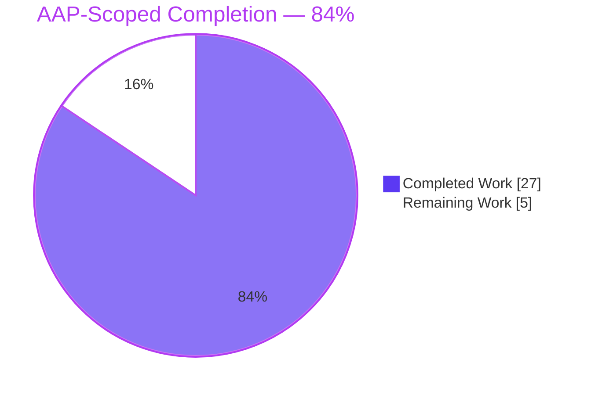
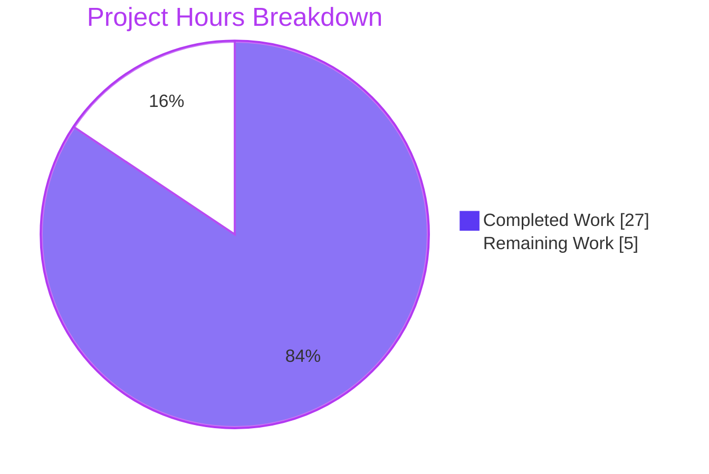
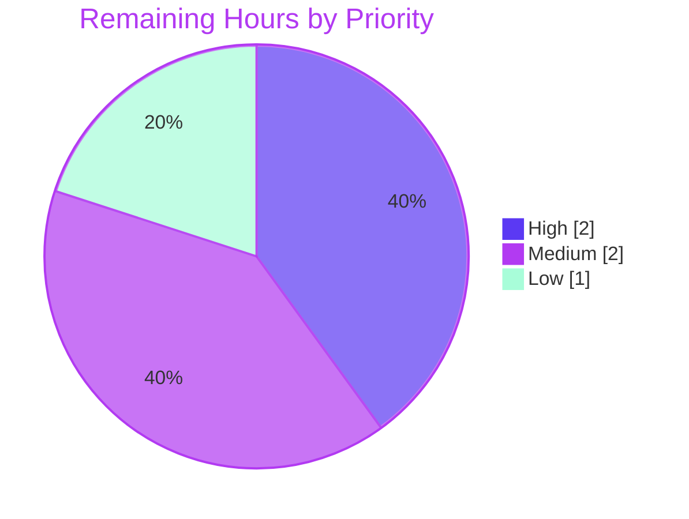

# 1. Executive Summary

## 1.1 Project Overview

This project delivers `Welcome.py`, a single-file Python console utility at the repository root that writes two fixed lines of plain, unformatted text to standard output and exits 0. It serves developers and automated checks needing a dependency-free script: no install step, no arguments and no input of any kind. The technical scope is four files — the program, a five-assertion standard-library test suite, the README documenting how to run both, and a `.gitignore` for Python bytecode. The branch sits on the current `main`, whose `server.js` and `Welcome.js` are carried unchanged. Output fidelity is the dominant requirement: the printed characters must match the supplied source text exactly.

## 1.2 Completion Status



| Metric | Value |
|---|---|
| **Total Hours** | **32.0** |
| Completed Hours (AI + Manual) | 27.0 (AI 27.0 / Manual 0.0) |
| Remaining Hours | 5.0 |
| **Percent Complete** | **84%** — (27.0 / 32.0) × 100 = 84.4% |

Colour key: Completed = Dark Blue `#5B39F3`; Remaining = White `#FFFFFF`.

## 1.3 Key Accomplishments

- ✅ `Welcome.py` prints the two-line payload and exits 0 — 72 bytes, digest `8012dda8…7b33`, empty stderr.
- ✅ Three flows, one function each — `get_welcome_text()`, `print_welcome_text(text)`, `main()` — separately asserted.
- ✅ Zero imports; importing the module emits nothing and adds only `Welcome` to `sys.modules`.
- ✅ Five-assertion gate passes on CPython 3.11.16, 3.12.14, 3.13.7 and 3.14.0, and fails on payload or emitter drift.
- ✅ No input surface: arguments, stdin, environment, configuration and files all unread.
- ✅ `README.md` documents run command, exact output, 3.11 floor, gate and failure modes — each re-executed.
- ✅ Branch rebased onto current `main`; `server.js` and `Welcome.js` byte-identical upstream.
- ✅ Zero dependencies; every deliberately excluded artefact absent.

## 1.4 Critical Unresolved Issues

Four items are open. One of the 15 scoped requirement areas — portability (N3) — is partially verified; the other 14 are fully verified. The remaining three are an owner decision and two accepted caveats. None prevents the program from running correctly.

| Issue | Impact | Owner | ETA |
|---|---|---|---|
| Portability unproven on macOS and Windows: Linux is verified on CPython 3.11.16–3.14.0, but Windows newline translation invalidates the 72-byte/digest check (`README.md:36`), and `README.md:40` still cites CPython 3.12.3 | Medium — documented support is broader than demonstrated; §5.2 D6 | Release owner | 2.0 h |
| Merging replaces `main`'s `Welcome.js` project guide with this one (`blitzy/documentation/Project Guide.md`); the repository also tracks `server.js` and `Welcome.js` under the `hao-backprop-test` name | Medium — must be decided before merge; §5.2 D2, D3, D7 | Repository owner | 1.0 h |
| `python Welcome.py >&-` (stdout closed at start-up) delivers nothing yet exits 0 with empty stderr; documented at `README.md:27` | Low — that caller is told the run succeeded; §5.2 D4 | Release owner | 0.5 h (with next row) |
| The gate fails under `python -I`, `-P` or `PYTHONSAFEPATH=1` with `ModuleNotFoundError: No module named 'Welcome'`; documented at `README.md:50` | Low — hardened runners must use default mode; §5.2 D5 | Release owner | (shared with row above) |

## 1.5 Access Issues

No credential, registry or network access is required. One platform gap remains:

| System/Resource | Type of Access | Issue Description | Resolution Status | Owner |
|---|---|---|---|---|
| macOS and Windows hosts | Test platform | Not available where the project has been built and tested, so the cross-platform claim and the newline-translation caveat are unexercised | Open — needs one run per platform | Release owner |
| CPython 3.11–3.14, Git repository, dependencies | Local toolchain / VCS | All present and exercised; zero dependencies, no service integration | No issue | — |

## 1.6 Recommended Next Steps

1. **[High]** Decide the fate of `main`'s `Welcome.js` guide, `server.js`, `Welcome.js` and the repository name before merging (1.0 h).
2. **[High]** Review the ten-commit branch and merge it, with the gate in the merge checklist (1.0 h).
3. **[Medium]** Run the program and gate on macOS and Windows (1.5 h).
4. **[Medium]** Confirm the two accepted caveats stay documented rather than guarded (0.5 h).
5. **[Low]** Update `README.md:40` to name the interpreters actually exercised (0.5 h).

# 2. Project Hours Breakdown

## 2.1 Completed Work Detail

| Component | Hours | Description |
|---|---|---|
| `Welcome.py` payload constant, three flow functions and guarded entry point | 3.0 | Module docstring, `WELCOME_TEXT` built from two adjacent literals (`Welcome.py:4-7`), `get_welcome_text()`, `print_welcome_text(text)`, `main()` and the `if __name__ == "__main__":` guard — 26 lines, zero imports, one defaulted `print()` |
| Payload transcription fidelity | 2.0 | Character-level assurance of the two lines (17 and 53 characters), the ASCII hyphen, the bare `&`, the separated `f`/`i` and the absent terminal period, plus three-way agreement between the constant, the test literal and the README block |
| Five-assertion test suite | 4.0 | `tests/test_welcome.py` (81 lines): independently written expected literal, whitespace-sensitive emitter probe, accessor and reload assertions, and a real subprocess run asserting return code, stdout and empty stderr |
| `README.md` documentation | 3.5 | Run command, exact expected output, CPython 3.11 floor, gate command, byte/digest corroboration, the output contract's failure modes, the isolated-mode caveat, and continuity with the pre-existing description |
| `.gitignore` and repository composition | 1.5 | Two bytecode patterns that ignore no tracked path, plus the tracked-inventory work that keeps the product change at three creations and one update with every pre-existing file intact |
| Output-contract runtime verification | 5.0 | Execution on CPython 3.11.16, 3.12.14, 3.13.7 and 3.14.0, interpreter-flag and locale variants, redirection, piping, symlink and foreign-working-directory invocation, concurrency and idempotency, plus the environmental failure modes |
| Zero-input surface and security posture | 2.0 | Runtime confirmation that arguments, stdin, environment variables, configuration and files are unread, including positive proof stdin is never consumed, plus the no-network/no-subprocess/no-write observation and a secret sweep |
| Flow separation and import-cost evidence | 2.5 | Each flow invoked in isolation, the emitter proven a pure pass-through, and import cost measured: `sys.modules` delta of one name, no output at import, per-run cost at the measurement noise floor |
| Gate execution and assertion strength | 2.5 | Gate run under plain, verbose, warnings-as-errors, buffered and fail-fast options; each test also run alone and out of order; mutation checks confirming the suite fails on real regressions |
| Integration with current `main` | 1.0 | Branch rebased onto `main` at `39974fd`, the add/add overlap on `blitzy/documentation/Project Guide.md` settled in this branch's favour, and `README.md:6` extended to name the merged `Welcome.js` |
| **Total** | **27.0** | Matches Completed Hours in §1.2 |

## 2.2 Remaining Work Detail

| Category | Hours | Priority |
|---|---|---|
| Repository composition and identity decisions — `main`'s `Welcome.js` project guide, tracking of `server.js` and `Welcome.js`, and the `hao-backprop-test` naming | 1.0 | High |
| Branch review, merge to `main`, and release handoff including the one-command gate in the merge checklist | 1.0 | High |
| macOS and Windows portability validation, including the newline-translation effect on the byte/digest check | 1.5 | Medium |
| Disposition of the two accepted caveats — closed-stdout silent no-op and the gate's default-interpreter-mode requirement | 0.5 | Medium |
| Refresh the `README.md:40` verification statement to the interpreters actually exercised | 0.5 | Low |
| Documentation regression-protection decision for README prose | 0.5 | Low |
| **Total** | **5.0** | Matches Remaining Hours in §1.2 and §7 |

## 2.3 Hours Calculation

- Completed Hours = 3.0 + 2.0 + 4.0 + 3.5 + 1.5 + 5.0 + 2.0 + 2.5 + 2.5 + 1.0 = **27.0**
- Remaining Hours = 1.0 + 1.0 + 1.5 + 0.5 + 0.5 + 0.5 = **5.0**
- Total Project Hours = 27.0 + 5.0 = **32.0**
- Percent Complete = (27.0 / 32.0) × 100 = **84.4%**, reported as **84%**

Every hour above traces to a scoped deliverable (the four files, the functional and non-functional requirements, the specified assertions) or to a path-to-production activity needed to release them. Confidence is high on the completed figures — each component exists in the tree and its behaviour was observed — and medium on the cross-platform item, whose effort depends on how quickly macOS and Windows hosts can be reached.

# 3. Test Results

The whole automated gate is one command run from the repository root: `python -m unittest discover -s tests`. For this assessment it was executed with warnings as errors on four interpreters — CPython 3.11.16, 3.12.14, 3.13.7 and 3.14.0 — and reported `Ran 5 tests` / `OK`, exit status 0, on each (0.010–0.015 s). The five suite rows below each count one execution per interpreter; the last two rows are direct command checks run on the same four interpreters.

| Area / Category | Framework | Tests | Passed | Failed | Coverage | What This Proves |
|---|---|---|---|---|---|---|
| Output fidelity (`main()` under captured stdout) | `unittest` | 4 | 4 | 0 | `main()` + both flows it composes | The printed text matches the expected payload character for character, including the single trailing newline |
| Emission flow in isolation (`print_welcome_text`) | `unittest` | 4 | 4 | 0 | `print_welcome_text()` | The emitter appends exactly one newline and alters nothing else — its whitespace-padded probe fails if the argument is stripped |
| Payload accessor (`get_welcome_text`) | `unittest` | 4 | 4 | 0 | `get_welcome_text()` | The constant carries no trailing newline, so `print()` is its only source |
| Import safety | `unittest` | 4 | 4 | 0 | Module body and `__main__` guard under reload | Importing or reloading the module writes nothing to stdout and never runs `main()` |
| End-to-end process contract (real subprocess run) | `unittest` | 4 | 4 | 0 | `Welcome.py` as an executed script | Running the file exits 0, emits exactly the expected stdout and writes nothing to stderr |
| Runtime contract checks (digest, byte count, stderr bytes, exit status, escape bytes, import silence) | Shell (`sha256sum`, `wc`, `grep`) | 24 | 24 | 0 | Emitted bytes and import path | Every interpreter emits 72 bytes with digest `8012dda8ef6285781c3ca772d98fb265df8ce38e2d5284aa01b99a4d97d37b33`, no escape byte, empty stderr and exit 0, and `import Welcome` prints nothing |
| Compile check under `-W error` | `py_compile` | 8 | 8 | 0 | Both Python files | `Welcome.py` and `tests/test_welcome.py` compile warning-free from the declared floor upward |
| **Total** | — | **52** | **52** | **0** | — | 20 suite executions plus 32 direct command checks, all observed |

**Not Covered**

- **Flow composition.** The suite asserts output, not call structure: `main()` printing `WELCOME_TEXT` directly, or `get_welcome_text()` returning `WELCOME_TEXT.strip()`, leaves every byte unchanged and passes. The three-function separation Rule 1 requires is verified by reading `Welcome.py:10-22`; re-read it on every change.
- **Test count.** A test renamed out of the `test*` pattern stops running silently (`Ran 4 tests` / `OK`). Treat `Ran 5 tests` as part of the pass condition.
- **`README.md` prose.** No assertion reads the documentation, by design. Its commands were executed as written, but a future edit could introduce an inaccurate claim or a non-ASCII character without failing the gate.
- **macOS and Windows.** Every run above was on Linux. The byte-count and digest checks hold only where stdout is not newline-translated.
- **Coverage measurement.** No coverage tool is part of the project, so no percentage exists; the invocation inventory stands in — all three functions, the module body and the `__main__` guard are each exercised.
- **`server.js` and `Welcome.js`.** Neither is executed or covered by any test; both are confirmed byte-identical to `main`.

# 4. Runtime Validation & UI Verification

This project has no web or graphical interface: the only surface is a terminal, so there is no screen, route or component to verify and no browser session was involved. Everything below was driven as a real process and observed.

- ✅ **Start-up and primary flow** — `python Welcome.py` from the repository root prints `Welcome to Blitzy` then `AI-Powered Code Generation & Technical Specifications`, exits 0, writes 0 bytes to stderr.
- ✅ **Declared floor and interpreter range** — identical 72-byte output, digest `8012dda8…7b33` and exit 0 on CPython 3.11.16, 3.12.14, 3.13.7 and 3.14.0.
- ✅ **Unstyled output** — zero escape bytes on every interpreter, and identical output under `-I`, `-S`, `-E`, `-B`, `-O`, `-OO`, `-X utf8`, `env -i` and locale variants.
- ✅ **Import path** — `python -c "import Welcome"` exits 0 with zero bytes on both streams, and `sys.modules` gains only `Welcome`.
- ✅ **Zero-input behaviour** — surplus arguments (`--help junk`) and piped stdin are ignored; output stays byte-identical, and no usage text or parsing error appears.
- ✅ **Redirection, piping and concurrency** — file redirect, `| wc -c`, `| sha256sum`, symlink and foreign-directory invocation, and 16 concurrent runs all deliver the same bytes, flushed at normal exit.
- ✅ **Automated gate** — `python -m unittest discover -s tests` reports `Ran 5 tests` / `OK`, exit 0, on all four interpreters.
- ✅ **Environmental failure modes** — `> /dev/full` exits 120 with `OSError: [Errno 28] No space left on device` on stderr, and a consumer closing the pipe early exits 120 with `BrokenPipeError`: delivery failures stay visible.
- ⚠ **Closed standard output** — `python Welcome.py >&-` exits 0 with empty stderr and delivers nothing. This is CPython behaviour when descriptor 1 is closed at start-up and is documented at `README.md:27`; it remains an accepted caveat.
- ⚠ **Hardened interpreter modes** — `python -I -m unittest discover -s tests` exits 1 with `ModuleNotFoundError: No module named 'Welcome'` (likewise `-P` and `PYTHONSAFEPATH=1`), while the program itself runs unaffected. Documented at `README.md:50`.

**Never exercised at runtime:** macOS and Windows, both named in `README.md:40`. `server.js` (which would bind `127.0.0.1:3000`) and `Welcome.js` were never run.

# 5. Compliance & Quality Review

## 5.1 Compliance Matrix

| # | Deliverable / Requirement | Status | Evidence | Progress |
|---|---|---|---|---|
| 1 | Emit both payload lines in order, followed by exactly one newline and no further bytes (F1, F2) | ✅ Pass | `Welcome.py:4-7,15-17,20-22`; constant is 71 characters ending `s`; observed output 72 bytes; `test_main_writes_expected_text_to_stdout` | ████████ 100% |
| 2 | Terminate with exit status 0 and write nothing else to either stream (F3, F4) | ✅ Pass | Observed `exit=0`, stderr 0 bytes, zero escape bytes on four interpreters; `test_script_execution_honours_full_contract` asserts return code 0 and empty stderr | ████████ 100% |
| 3 | Require no input of any kind (F5) | ✅ Pass | Arguments, stdin, environment, configuration and files all unread at runtime; no such site exists in `Welcome.py` | ████████ 100% |
| 4 | Deliverable is `Welcome.py` at the repository root (F6) | ✅ Pass | `./Welcome.py`, capital `W`, no relocated or lowercase variant | ████████ 100% |
| 5 | Character-for-character output fidelity (N1) | ✅ Pass | Digest `8012dda8…7b33` on CPython 3.11.16, 3.12.14, 3.13.7 and 3.14.0; constant, test literal and README block agree exactly | ████████ 100% |
| 6 | Import work bounded to definitions, no output or side effect (N2) | ✅ Pass | Zero imports; `import Welcome` emits nothing; `sys.modules` gains only `Welcome`; `test_import_of_module_produces_no_output` | ████████ 100% |
| 7 | Portability: CPython ≥ 3.11 on Linux, macOS or Windows, zero install (N3) | ⚠ Partial | Program and gate verified on Linux across CPython 3.11.16–3.14.0 with no install step; macOS and Windows untested — see §5.2 D6 | ███████░ 85% |
| 8 | PEP 8 layout and PEP 257 docstrings, one responsibility per function (N4) | ✅ Pass | Docstrings on the module and all three functions; longest lines 69 (product) and 76 (test) against the 79 limit; no non-ASCII byte | ████████ 100% |
| 9 | No untrusted input, network, filesystem write or subprocess in the product (N5) | ✅ Pass | None present in `Welcome.py`; the only subprocess is the test's list-form run of the script; no secrets in the tree | ████████ 100% |
| 10 | Behaviour assertable by capturing stdout, with the five specified assertions (N6) | ✅ Pass | `tests/test_welcome.py:37-77`, 5/5 passing on four interpreters and proven to fail on real regressions | ████████ 100% |
| 11 | Planned file set: three creations and one update, no forbidden artefact | ⚠ Partial | `git diff --name-status origin/main...HEAD` shows `A .gitignore`, `A Welcome.py`, `A tests/test_welcome.py`, `M README.md` as planned, plus an unplanned `M blitzy/documentation/Project Guide.md` — see §5.2 D7; every excluded artefact absent | ███████░ 90% |
| 12 | Rule 1 — Python implementation, each flow clearly separated, no performance impact | ✅ Pass | Python-only product; three flows in three functions, each invoked independently; per-run cost at the measurement noise floor with zero imports | ████████ 100% |

## 5.2 AAP & Rule Divergences and Gaps

| What the AAP/Rule Required | What Was Delivered Instead | Why It Diverged | Impact | Remediation |
|---|---|---|---|---|
| D1 — "The repository is empty today"; `README.md` listed as a creation | `README.md` updated in place; `server.js`, `Welcome.js` and a project guide already tracked | The plan's premise about the starting tree was inaccurate, and `main` gained files in parallel | None functional | None required — recorded for accuracy |
| D2 — Plan prose: "no other language anywhere in the repository" | `server.js` and `Welcome.js` remain tracked, byte-identical (`server.js:1-14`, `Welcome.js:1`) | The file-operation table authorises no deletion, and no file enters scope on the rule's account alone | None on the product; a repository-inventory question | Owner keeps them (no action) or authorises removal |
| D3 — README fixed at four items beneath the existing title | `README.md:1-2` keep `hao-backprop-test` and its backprop description; extra passages at `:6`, `:27`, `:50` | Continuity with pre-existing content and documentation of the accepted caveats | Repository name misdescribes the deliverable | Owner decides on renaming; passages are accurate |
| D4 — Exit status 0 for a successful invocation | `python Welcome.py >&-` delivers nothing and still exits 0; documented at `README.md:27` | Every code-level remedy (`try`/`except`, `file=`, `flush=`, `sys.exit`) is excluded by the plan | A caller that closes stdout is told the run succeeded | Accept as documented, or amend scope for a guard |
| D5 — Gate is `python -m unittest discover -s tests` | Works only in default interpreter mode; `-I`, `-P`, `PYTHONSAFEPATH=1` give `ModuleNotFoundError`; documented at `README.md:50` | `tests/__init__.py` and `sys.path` edits are both excluded | Hardened runners see an import failure; program unaffected | Pin the gate to default mode, or authorise a fix |
| D6 — CPython ≥ 3.11 on Linux, macOS or Windows | Linux verified on 3.11.16–3.14.0; `README.md:40` cites an unexercised 3.12.3 | No macOS or Windows host was available; the 3.12.3 line is inherited from the plan | Documented support broader than demonstrated | Run on macOS and Windows; refresh `README.md:40` |
| D7 — `README.md` is the only documentation file | `blitzy/documentation/Project Guide.md` rewritten (+270/−215), replacing `main`'s `Welcome.js` guide | The add/add overlap on rebase onto `39974fd` was settled in this branch's favour | Merging drops the `Welcome.js` guide from `main`'s tip | Owner accepts, or keeps both under distinct names |

**D1 — the plan's starting-tree premise.** The plan asserts an empty repository and lists `README.md` as a creation. The base commit `1484182` already held `README.md` (a heading and a one-line description) and `server.js`, and `main` has since gained `Welcome.js` and `blitzy/documentation/Project Guide.md` through merge `39974fd`. Delivery therefore updated `README.md` rather than creating it, and the product change against `main` is three creations and one update, as `git diff --name-status origin/main...HEAD` shows. Nothing in the code needs to change on this account; it explains why a Python utility shares the tree with two Node files and a heading unrelated to it.

**D2 — two non-Python files stay tracked.** Plan prose glosses Rule 1's language obligation as "no other language anywhere in the repository", which `server.js` (a 14-line Node HTTP server) and `Welcome.js` (a one-line `console.log` merged from `main`) both contradict. Both are kept byte-identical because the plan's file-operation table declares no deletion and states that no file enters scope on the rule's account alone; `Welcome.js` also belongs to work already merged into `main`. Nothing imports, references or runs either file. Rule 1 as the user wrote it concerns the product, which is Python. The owner decides whether the repository should carry them; removal needs an explicit instruction.

**D3 — repository identity and README scope.** The plan fixes README content at the run command, expected output, version floor and test command beneath the existing title. `README.md:1-2` keep `# hao-backprop-test` and `test project for backprop integration.` verbatim — the first 58 bytes match the original upload — and three passages go beyond the four items: `README.md:6` naming `server.js` and `Welcome.js` as unrelated, the failure-mode paragraph at `:27` and the isolated-mode sentence at `:50`. Continuity and documenting the accepted caveats were chosen over the literal limit. A newcomer reading the name will expect machine-learning code. Renaming is the owner's decision; the added passages are accurate as written.

**D4 — silent non-delivery when stdout is closed.** Run as `python Welcome.py >&-`, the program emits nothing, writes nothing to stderr and exits 0 — reproduced during this assessment. CPython binds `sys.stdout` to `None` when descriptor 1 is closed at start-up, and `print()` then does nothing; `python -c "print('X')" >&-` behaves identically. Every remedy that would surface the failure — a `try`/`except`, `file=`, `flush=` or `sys.exit` — is excluded by the plan, which fixes the module at one defaulted `print(text)` with no imports. The behaviour is documented at `README.md:27` beside the two failure modes that do surface with exit 120. A caller that cares should verify it received 72 bytes.

**D5 — the gate depends on default interpreter mode.** `python -m unittest discover -s tests` passes from the repository root, but `-I`, `-P` or `PYTHONSAFEPATH=1` make it exit 1 with `ModuleNotFoundError: No module named 'Welcome'` (reproduced with `-I` here). Those modes drop the working-directory entry that lets `tests/test_welcome.py:15` import the root module. Both available fixes are out of scope: `tests/__init__.py` is deliberately absent — adding it would also reopen the `-t .` discovery hazard — and the test module's import set is fixed, ruling out `sys.path` edits. `README.md:50` states the requirement and quotes the error. Any runner adopted later must invoke the gate in default mode.

**D6 — portability claimed more broadly than demonstrated.** The plan and `README.md:40` declare CPython 3.11 or newer on Linux, macOS or Windows, and the README adds that the design was exercised on CPython 3.12.3. What has been exercised is Linux on CPython 3.11.16, 3.12.14, 3.13.7 and 3.14.0: output, exit status, the gate and byte corroboration hold on each, so the declared floor is substantiated. No macOS or Windows host was available, and the 3.12.3 sentence comes from the plan rather than from a run. Risk is low — the module uses only builtins — but a Windows run should confirm the gate and read the 72-byte check as character-level.

**D7 — `main`'s project guide is replaced.** The plan makes `README.md` the only documentation file. `main` already tracks `blitzy/documentation/Project Guide.md`, documenting `Welcome.js`; this branch rewrites it (+270/−215) as the `Welcome.py` guide. The overlap surfaced as an add/add conflict when the branch was rebased onto `main` at `39974fd`, and it was settled by keeping this branch's version; nothing in the plan sanctions touching that file. Merging as-is removes the `Welcome.js` guide from `main`'s tip, although it stays in history at `4d1256c`. Before merging, the owner should either accept the replacement or keep both guides under distinct file names.

No user-specified rule was departed from. Rule 1's three obligations are each satisfied by the product: the implementation is Python, its three flows are separated one per function and each is invoked independently, and its cost above a bare interpreter is not distinguishable from measurement noise, with zero imports and no module-level side effects. The stricter reading that the whole repository must be Python-only is covered by D2.

# 6. Risk Assessment

These are forward-looking risks for the delivered codebase, not a history of the work.

| Risk | Category | Severity | Probability | Mitigation | Status |
|---|---|---|---|---|---|
| Documented support is wider than demonstrated — macOS and Windows are untested, and the 72-byte/digest check does not hold where stdout translates newlines | Technical | Medium | Medium | Run the program and the gate once per platform; treat the suite's character-level assertion as the portable check and the byte checks as Unix corroboration | Open — 1.5 h in §2.2 |
| Merging this branch replaces the `Welcome.js` project guide on `main` with the `Welcome.py` guide, so `main` loses current documentation for a file it still ships | Integration | Medium | High | Decide before merge: accept the replacement, or store the two guides under distinct names in `blitzy/documentation/` | Open — owner decision, 1.0 h in §2.2 |
| The repository reads as three unrelated products — the `hao-backprop-test` name, a Node HTTP server (`server.js`, binds `127.0.0.1:3000` if run) and a one-line `Welcome.js` — inviting misidentification or an accidental run of the server | Operational | Medium | Low | Owner settles naming and tracking; nothing in the Python product references either Node file | Open — shares the 1.0 h in §2.2 |
| A caller that starts the program with standard output closed receives exit 0 and no output, so that specific delivery failure is silent | Operational | Low | Medium | Callers verify they received 72 bytes or the expected digest; the behaviour is documented at `README.md:27` | Accepted caveat — disposition due |
| A hardened runner (`-I`, `-P`, `PYTHONSAFEPATH=1`) makes the documented gate fail on `import Welcome` | Integration | Low | Medium | Pin whatever runner is adopted to default interpreter mode, as `README.md:50` states | Open — decision due |
| `README.md` has no automated regression protection, and `README.md:40` already cites an interpreter version that was not exercised | Technical | Low | Low | Refresh line 40; re-read the README on every change, or run the documentation sanity greps in Appendix A | Open — 1.0 h in §2.2 |
| No continuous-integration pipeline exists by design, so the gate runs only when a person runs it and a regression could reach `main` unnoticed | Operational | Low | Low | Make `python -m unittest discover -s tests` (expecting `Ran 5 tests`) part of the merge checklist | Accepted by design |
| No attack surface exists today (no input, network, filesystem write or dependency); the residual risk is a future change adding one, on interpreters that trail current CPython security releases | Security | Low | Low | Keep the zero-import, zero-input posture as a review criterion for `Welcome.py`, and run on a current patch release of the chosen CPython line | Mitigated — monitor |

# 7. Visual Project Status

Completed work is shown in Dark Blue `#5B39F3`; remaining work in White `#FFFFFF`.



Remaining work by priority (hours from §2.2):



| View | Completed | Remaining | Total |
|---|---|---|---|
| Hours | 27.0 | 5.0 | 32.0 |
| Share | 84% | 16% | 100% |

Remaining hours by category: repository composition and identity decisions 1.0 · branch review and merge 1.0 · macOS and Windows validation 1.5 · accepted-caveat dispositions 0.5 · `README.md:40` refresh 0.5 · documentation regression-protection decision 0.5 — total 5.0, matching §1.2 and the pie above.

# 8. Summary & Recommendations

**What was delivered.** The repository now contains a working, dependency-free console utility. `Welcome.py` holds the payload as a compile-time constant and three single-responsibility functions — supply, emission, composition — invoked through a `__main__` guard, in 26 lines with no import statements at all. `tests/test_welcome.py` provides the whole automated gate in five assertions that cover output fidelity, the emitter in isolation, the accessor's newline ownership, silence at import, and the real process contract. `README.md` documents how to run both, what to expect byte for byte, which interpreters are supported and how the contract behaves when delivery fails, and `.gitignore` keeps bytecode out of version control. Ten commits on top of the current `main` add 159 product lines across those four files, leaving `server.js` and `Welcome.js` byte-identical.

**What was verified.** Running the program yields exactly 72 bytes with digest `8012dda8…7b33`, exit status 0, an empty standard error and no escape bytes on CPython 3.11.16, 3.12.14, 3.13.7 and 3.14.0, so the declared 3.11 floor is substantiated on Linux. The gate reports 5 tests, all passing, on each of those interpreters — 20 of 20 executions — and has been shown to fail when the payload drifts, when the emitter strips its argument, or when the guard is broken. The program ignores arguments, standard input and environment variables; importing it emits nothing and adds a single name to `sys.modules`; its per-run cost above a bare interpreter is not distinguishable from measurement noise. Each documented README command was executed as written and behaved as described.

**What remains.** Five hours of work, none of it in the program itself. The first decision is repository composition: merging this branch replaces `main`'s `Welcome.js` project guide with this one, and the owner must also settle whether `server.js`, `Welcome.js` and the `hao-backprop-test` name still belong alongside a Python welcome-text utility. Portability needs one run each on macOS and Windows, where newline translation changes the byte-count and digest corroboration, and `README.md:40` should name the interpreters actually exercised. The two accepted caveats — silent non-delivery when stdout is closed, and the gate's dependence on default interpreter mode — need a confirmed disposition, and the README's lack of automated regression protection is a deliberate consequence of adopting no tooling that the owner should confirm.

**Critical path to production.** Settle the project-guide and repository-composition decisions, then review and merge the branch with the one-command gate — expecting `Ran 5 tests` / `OK` — in the checklist. Nothing else stands between this code and release: there is no build step, no artefact to publish, no configuration to provision, no credential to rotate and no service to deploy. Success metrics are unambiguous and already met on every tested interpreter: `python Welcome.py` prints the two lines, exits 0 and produces 72 bytes with the expected digest.

**Production readiness.** At 84% of the scoped work complete (27.0 of 32.0 hours), the program itself is production-ready: correct, documented, exercised under adversarial input, free of dependencies and attack surface, and covered by a gate that bites. The remaining 16% is platform breadth, repository housekeeping and merge preparation rather than functionality, so the recommendation is to release on Linux once the project-guide decision is made, and treat the macOS and Windows claim as provisional until each has been exercised.

# 9. Development Guide

Every command below was executed from the repository root and produced the output shown.

## 9.1 System Prerequisites

- **CPython 3.11 or newer.** Verified on 3.11.16, 3.12.14, 3.13.7 and 3.14.0. Nothing in the code enforces the floor; it is a documentation statement. Bare `python` may resolve to any of these — call a versioned binary (for example `python3.14`) when the version matters.
- **Operating system:** any of Linux, macOS or Windows in principle; Linux is what has been exercised.
- **Hardware:** none beyond what the interpreter needs — the process writes 72 bytes and exits.
- **Not required:** package manager, virtual environment, compiler, container runtime, database, network access, environment variables, secrets.

```bash
# Confirm an interpreter and that it satisfies the declared floor
python3 --version                                          # -> e.g. Python 3.13.7
python -c "import sys; print(sys.version_info >= (3, 11))" # -> True
```

## 9.2 Environment Setup

There is nothing to set up. Clone the repository, change into its root, and run the program.

```bash
cd /path/to/Ajit_GH_Repo-12-Mar-26     # the repository root — Welcome.py lives here
ls Welcome.py tests/test_welcome.py    # -> both paths listed
```

Two optional settings keep the working tree pristine while you experiment; neither is needed for correctness, because `.gitignore` already excludes bytecode:

```bash
export PYTHONPYCACHEPREFIX="$HOME/.cache/welcome-pycache"   # write __pycache__ outside the checkout
# or
python -B Welcome.py                                        # write no bytecode at all
```

## 9.3 Dependency Installation

None. The program imports nothing and the suite imports only the standard library (`contextlib`, `importlib`, `io`, `subprocess`, `sys`, `unittest`). There is no `requirements.txt`, `pyproject.toml` or lockfile, and none should be added.

```bash
python -m py_compile Welcome.py tests/test_welcome.py   # -> exit 0, no output
```

## 9.4 Application Startup

There is no service, port or startup order — one process runs and exits.

```bash
python Welcome.py
# Welcome to Blitzy
# AI-Powered Code Generation & Technical Specifications

python3 Welcome.py        # equivalent where `python` is absent or is Python 2
```

## 9.5 Verification Steps

```bash
# 1. Exit status
python Welcome.py > /dev/null; echo "exit=$?"          # -> exit=0

# 2. Exact size and digest (Unix; see the note below)
python Welcome.py | wc -c                               # -> 72
python Welcome.py | sha256sum
# -> 8012dda8ef6285781c3ca772d98fb265df8ce38e2d5284aa01b99a4d97d37b33

# 3. Standard error is empty
python Welcome.py 2>err.txt >/dev/null; wc -c < err.txt; rm err.txt   # -> 0

# 4. Nothing is styled: no escape byte in the output
python Welcome.py | grep -c $'\x1b'                     # -> 0

# 5. The automated gate (run from the repository root)
python -m unittest discover -s tests
# -> Ran 5 tests in 0.012s
# -> OK

# 6. Per-test detail
python -m unittest discover -s tests -v                 # -> five lines ending "... ok"

# 7. Warnings as errors
python -W error -m unittest discover -s tests           # -> Ran 5 tests / OK

# 8. The gate across every installed interpreter from the floor upward
for py in python3.11 python3.12 python3.13 python3.14; do
  printf '%s ' "$py"; "$py" -m unittest discover -s tests 2>&1 | tail -n 1
done                                                    # -> "<interpreter> OK" per line

# 9. Nothing happens at import
python -c "import Welcome"                              # -> exit 0, no output

# 10. Bytecode stays out of version control
git status --porcelain --untracked-files=all | wc -l    # -> 0
```

Treat `Ran 5 tests` as part of the pass condition: a test renamed out of the `test*` pattern stops running without turning the gate red.

**Platform note.** Steps 2 and 4 are Unix corroboration: `sha256sum` is absent by default on macOS and in standard Windows shells, and Windows text-mode stdout translates `\n` to `\r\n`, which changes both the byte count and the digest. The portable equivalent computes the digest in-process:

```bash
python -c "import hashlib, Welcome; d=(Welcome.get_welcome_text()+chr(10)).encode(); print(len(d), hashlib.sha256(d).hexdigest())"
# -> 72 8012dda8ef6285781c3ca772d98fb265df8ce38e2d5284aa01b99a4d97d37b33
```

## 9.6 Example Usage

```bash
# Capture the text for comparison in a script
python Welcome.py > expected.txt && cat expected.txt

# Use it in a pipeline
python Welcome.py | head -n 1        # -> Welcome to Blitzy

# Call the flows individually from another Python process
python -c "import Welcome; print(repr(Welcome.get_welcome_text()))"
python -c "import Welcome; Welcome.print_welcome_text('any text')"   # -> any text
```

## 9.7 Troubleshooting

| Symptom | Cause | Resolution |
|---|---|---|
| `can't open file 'Welcome.py': No such file or directory` | Not in the repository root | `cd` to the root; the program is invoked as `python Welcome.py` from there |
| `ImportError: Start directory is not importable: '<root>/tests'` | `-t .` was added to the discover command while there is deliberately no `tests/__init__.py` | Run the gate exactly as documented: `python -m unittest discover -s tests`, with no `-t` |
| `ModuleNotFoundError: No module named 'Welcome'` during the gate | The interpreter was run in isolated or safe-path mode (`-I`, `-P`, `PYTHONSAFEPATH=1`), which removes the working directory from `sys.path` | Run the gate in default mode; the program itself is unaffected by those flags |
| Gate reports `NO TESTS RAN` | Invoked from a directory where `tests/` is empty or absent | Run from the repository root, where `tests/test_welcome.py` exists |
| Program prints nothing and still exits 0 | Standard output was closed at start-up (`>&-`), so the interpreter binds it to `None` and `print()` does nothing | Provide a real destination for stdout; verify delivery by checking for 72 bytes |
| `wc -c` reports 74 rather than 72, or the digest differs | Running on Windows, where text-mode stdout translates newlines | Use the in-process digest check above; the suite's assertion is character-level and unaffected |
| `__pycache__` directories appear in the checkout | Normal Python behaviour after running the suite | They are ignored (`.gitignore:2`); use `PYTHONPYCACHEPREFIX` or `-B` to avoid them |

# 10. Appendices

## A. Command Reference

| Purpose | Command (from the repository root) | Expected result |
|---|---|---|
| Run the program | `python Welcome.py` | Two lines, exit 0 |
| Check exit status | `python Welcome.py > /dev/null; echo "exit=$?"` | `exit=0` |
| Byte count | `python Welcome.py \| wc -c` | `72` |
| Digest | `python Welcome.py \| sha256sum` | `8012dda8ef6285781c3ca772d98fb265df8ce38e2d5284aa01b99a4d97d37b33` |
| Portable digest | `python -c "import hashlib, Welcome; d=(Welcome.get_welcome_text()+chr(10)).encode(); print(len(d), hashlib.sha256(d).hexdigest())"` | `72` and the same digest |
| Run the gate | `python -m unittest discover -s tests` | `Ran 5 tests` / `OK`, exit 0 |
| Gate, verbose | `python -m unittest discover -s tests -v` | Five `... ok` lines |
| Gate, warnings as errors | `python -W error -m unittest discover -s tests` | `Ran 5 tests` / `OK` |
| Gate across interpreters | `for py in python3.11 python3.12 python3.13 python3.14; do printf '%s ' "$py"; "$py" -m unittest discover -s tests 2>&1 \| tail -n 1; done` | `OK` for each interpreter |
| Compile check | `python -m py_compile Welcome.py tests/test_welcome.py` | Exit 0, no output |
| Import silence check | `python -c "import Welcome"` | Exit 0, no output |
| Ignore-rule check | `git check-ignore -v __pycache__/x.pyc Welcome.pyc` | `.gitignore:2` and `.gitignore:3` |
| Documentation sanity greps | `grep -nP '[^\x00-\x7F]' README.md` · `grep -c 'unittest discover -s tests' README.md` | No non-ASCII match; the gate command present |

## B. Port Reference

The product binds no port and opens no socket; nothing needs to be reachable for it to run.

| Port | Used by | Note |
|---|---|---|
| — | `Welcome.py`, `tests/test_welcome.py` | None. No listener, no client, no network call |
| 3000 | Pre-existing `server.js` (out of scope) | Only if someone runs that file deliberately; the Python product never references it |

## C. Key File Locations

| Path | Role | Size |
|---|---|---|
| `Welcome.py` | The deliverable: payload constant, three flow functions, guarded entry point | 26 lines |
| `tests/test_welcome.py` | The entire automated gate: five assertions over the stdout contract | 81 lines |
| `README.md` | Run command, expected output, version floor, gate command, contract failure modes | 50 lines |
| `.gitignore` | Two patterns excluding `__pycache__/` and `*.pyc` | 3 lines |
| `blitzy/documentation/Project Guide.md` | This project guide; on `main` the same path holds the `Welcome.js` guide (see §5.2 D7) | — |
| `server.js` | Pre-existing Node hello-world, outside this work's scope, unchanged | 14 lines |
| `Welcome.js` | One-line Node script merged from `main`, outside this work's scope, unchanged | 1 line |

## D. Technology Versions

| Component | Version | Note |
|---|---|---|
| Declared minimum | CPython 3.11 | Documentation-only; no version gate in code |
| Verified | CPython 3.11.16, 3.12.14, 3.13.7, 3.14.0 | Program, compile check and gate exercised on each, on Linux |
| Test framework | `unittest` (standard library) | No third-party test dependency |
| Third-party packages | None | No manifest, no lockfile, no install step |

## E. Environment Variable Reference

The product reads no environment variable; the following affect only the interpreter and are optional for development convenience.

| Variable | Effect | Needed? |
|---|---|---|
| `PYTHONPYCACHEPREFIX` | Writes bytecode caches outside the checkout | Optional |
| `PYTHONDONTWRITEBYTECODE` | Writes no bytecode at all (same as `-B`) | Optional |
| `PYTHONSAFEPATH` | Removes the working directory from `sys.path`, which makes the gate fail to import the module | Leave unset when running the gate |

## F. Developer Tools Guide

No linter, formatter, type checker, coverage tool or CI pipeline is part of this project, by deliberate decision — PEP 8 and PEP 257 conformance is a review criterion instead, and the entire quality gate is the single `unittest` command. Practical consequences for anyone changing the code:

- Keep `Welcome.py` import-free and its module body limited to the constant, the three definitions and the guard; the suite's reload assertion and the project's cost posture both depend on it.
- Keep the expected literal in `tests/test_welcome.py` independent of `Welcome.WELCOME_TEXT`, so a drifted payload fails the gate instead of being read back from the value it is meant to verify.
- Leave the emitter probe's edge spaces in place: they are what make the suite detect an emitter that strips its argument.
- Never adjust the expected literal to make a fidelity failure pass; re-check both sides against the payload recorded in `README.md`.
- Run the gate from the repository root in default interpreter mode, and never add `-t .`.

## G. Glossary

| Term | Meaning |
|---|---|
| Payload | The two fixed lines this program prints: `Welcome to Blitzy` and `AI-Powered Code Generation & Technical Specifications` |
| The gate | `python -m unittest discover -s tests` — the project's only automated quality check |
| Guarded entry point | The `if __name__ == "__main__":` block that runs `main()` on execution but not on import |
| Flow | One of the three separated responsibilities: supply (`get_welcome_text`), emission (`print_welcome_text`), composition (`main`) |
| Digest | `8012dda8ef6285781c3ca772d98fb265df8ce38e2d5284aa01b99a4d97d37b33`, the SHA-256 of the 72 expected output bytes |
| Isolated / safe-path mode | `python -I`, `python -P` or `PYTHONSAFEPATH=1`, which drop the working directory from `sys.path` and so break the gate's import |
