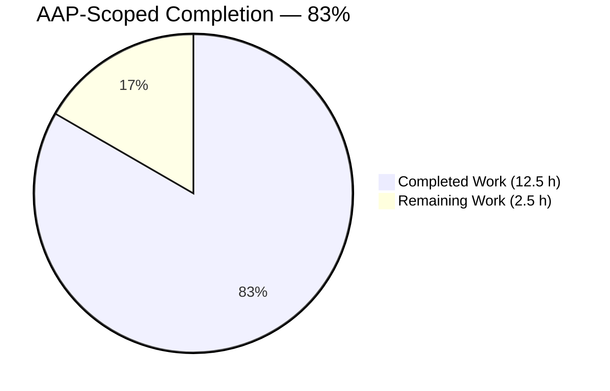
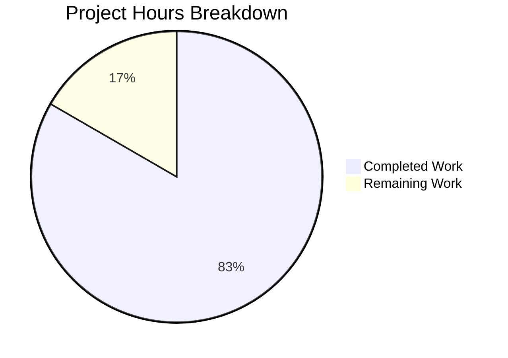
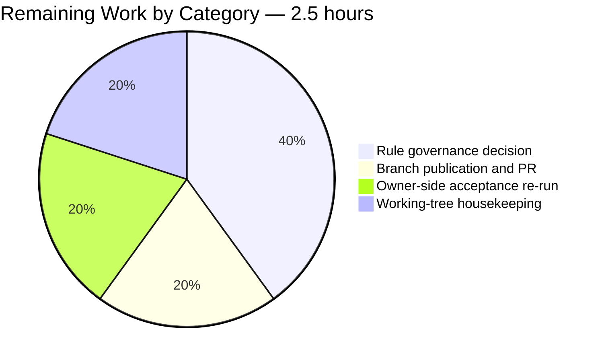

# 1. Executive Summary

## 1.1 Project Overview

This project delivers a single-file JavaScript product, `Welcome.js`, at the repository root. Running `node Welcome.js` writes the exact message `Welcome to Blitzy` to standard output, and the process then exits on its own with status `0`. The file holds one statement on one line and needs no install, dependency resolution, build or transpile step. Its readers are whoever runs it to accept it and any developer who later takes it as this repository's reference for the smallest correct JavaScript program. The pre-existing `README.md` and `server.js` are untouched.

## 1.2 Completion Status



Colour key — Completed: Dark Blue `#5B39F3` · Remaining: White `#FFFFFF`.

| Metric | Value |
|---|---|
| Total Hours | **15.0** |
| Completed Hours (AI + Manual) | **12.5** (12.5 AI + 0.0 manual) |
| Remaining Hours | **2.5** |
| Percent Complete | **83%** (12.5 ÷ 15.0 × 100) |

## 1.3 Key Accomplishments

- ✅ `Welcome.js` delivered at the repository root — one line, 34 bytes, exact filename casing.
- ✅ Output verified byte for byte: 18 bytes on stdout, nothing on stderr, exit status `0`.
- ✅ Byte-identical results on Node.js v24.21.0 (reference) and v22.23.2 (supported floor).
- ✅ Natural termination confirmed — no forced exit, so queued output is never truncated.
- ✅ Zero-install posture proven: no import, manifest, lockfile or `node_modules` anywhere above or in the tree.
- ✅ Source runs identically whether classified as CommonJS or as an ES module.
- ✅ Minimality criteria exactly at their ceiling: 1 source line, 1 added file, 3 tracked files.
- ✅ Pre-existing files byte-identical, with the existing HTTP surface re-verified intact.

## 1.4 Critical Unresolved Issues

**1 of the 20 scoped acceptance items remains open**: all 17 requirements are met, and of the project rule's three clauses two are met and one is not.

| Issue | Impact | Owner | ETA |
|---|---|---|---|
| The project rule requires new products in Python; this product is JavaScript, as its own request specified by language and by filename. No Python artifact exists in the tree. | Governance only. Every requirement and acceptance criterion is met — no functional, security, performance or continuity effect. A literal audit of the rule finds one of three clauses unsatisfied. | Project owner | 1.0 h — Section 5.2, divergence 1 |

## 1.5 Access Issues

No access issues identified. The product consumes no environment variable, secret, credential, endpoint or database, and needs no privileged resource to build, run or verify.

| System/Resource | Type of Access | Issue Description | Resolution Status | Owner |
|---|---|---|---|---|
| — | — | No access issues identified | N/A | — |

## 1.6 Recommended Next Steps

1. **[High]** Settle the project rule's language clause — amend or narrow the rule, or issue a product-scoped waiver. Leave `Welcome.js` byte-identical.
2. **[High]** Publish the branch and open the pull request (2 commits, `+1` line); the record-only second commit may be squashed.
3. **[Medium]** Re-run the acceptance gate on the Node line you standardise on (Section 9.5).
4. **[Low]** Delete the untracked `blitzy/` capture directory before staging, so a blanket `git add` cannot add a second file.

# 2. Project Hours Breakdown

## 2.1 Completed Work Detail

| Component | Hours | Description |
|---|---:|---|
| Requirements analysis and design decisions | 1.5 | Fixed the runtime (Node.js 24.x LTS reference, 22.x supported floor), the module-neutral no-manifest posture, root placement, and the one-statement style contract — single-quoted literal, semicolon, no indentation, single trailing LF. |
| `Welcome.js` implementation | 1.0 | The delivered source: `console.log('Welcome to Blitzy');` at the repository root, exact filename casing, one line, 34 bytes, committed with no accompanying artifact. |
| Output-contract verification | 2.0 | Stdout `Welcome to Blitzy` as exactly 18 bytes, empty stderr and exit `0`, confirmed by hex dump on Node v24.21.0 and v22.23.2 with byte-identical results; natural termination confirmed without `process.exit()`. |
| Robustness and isolation verification | 2.0 | Command-line arguments, stdin and environment variables are all ignored; identical output under an empty environment, from a foreign working directory, into a slow pipe reader, under repeated and concurrent execution; no residual process, handle or file write. |
| Minimality and exclusion audit | 1.5 | 1 source line and exactly 1 added path confirmed against the pre-project tree; no manifest, lockfile, `node_modules`, test file, CI workflow, container file, environment file or Python artifact anywhere in or above the repository; module classification neutral under both CommonJS and ESM. |
| Rule compliance assessment | 1.5 | Flow/feature separation and performance non-impact established from the source and by measurement; the language clause adjudicated, documented and escalated with the reasoning and the evidence behind it. |
| Pre-existing system continuity verification | 3.0 | `README.md` and `server.js` proven byte-identical to their pre-project state; the existing HTTP surface exercised across methods, paths, protocol boundaries, restarts, both runtimes and a browser; application latency measured before, during and after repeated runs of the new script. |
| **Total** | **12.5** | |

## 2.2 Remaining Work Detail

| Category | Hours | Priority |
|---|---:|---|
| Rule governance decision on the language clause (amend/narrow the rule, or issue a product-scoped waiver) | 1.0 | High |
| Branch publication and pull request (optionally squashing the record-only commit) | 0.5 | High |
| Owner-side acceptance re-run on the target runtime line | 0.5 | Medium |
| Working-tree housekeeping — remove the untracked capture directory before staging | 0.5 | Low |
| **Total** | **2.5** | |

## 2.3 Hours Reconciliation

- Completed Hours (Section 2.1) = **12.5**
- Remaining Hours (Section 2.2) = **2.5**
- Total Project Hours = 12.5 + 2.5 = **15.0**, matching Section 1.2
- Completion = 12.5 ÷ 15.0 × 100 = **83%**, the figure used in Sections 1.2, 7 and 8

Confidence is **high** for the completed figures: each is anchored to source that exists at a known path and to commands whose output was observed. Confidence is **high** for the remaining figures as well, since three of the four items are procedural and the fourth is a wording decision with no code work attached.

# 3. Test Results

The repository carries no test file and no test runner: `node --test` from the repository root reports `tests 0 / suites 0 / pass 0 / fail 0` and exits `0`. Acceptance for this product is the execution gate below, run as commands against the delivered file. Every count in this table was produced by executing the checks on both supported runtimes and reading the results.

| Area / Category | Framework | Tests | Passed | Failed | Coverage | What This Proves |
|---|---|---:|---:|---:|---|---|
| Syntax and whole-tree parse | `node --check` (v24.21.0, v22.23.2) | 4 | 4 | 0 | 2 of 2 tracked `.js` files | Every JavaScript file in the repository parses on both supported runtimes |
| Output contract | `node` execution with captured streams | 10 | 10 | 0 | The single delivered flow | Running the file prints `Welcome to Blitzy` as 18 bytes on stdout, writes nothing to stderr and exits `0` on both runtimes |
| Source fidelity and minimality | `wc`, `od`, `sha256sum`, `git ls-files` | 8 | 8 | 0 | `Welcome.js` in full | The file is 1 line and 34 bytes, holds the literal exactly once, carries no comment or padding, ends in a single LF, and sits at the root under the exact required name |
| Zero-install posture and exclusions | `ls`, `find`, ancestor walk, `grep` | 7 | 7 | 0 | Repository plus every ancestor directory | No manifest, lockfile, `node_modules`, test file, CI, container, environment or Python artifact exists, and the source has no import, export or `require` |
| Repository continuity | `git diff`, `git rev-parse`, `git status` | 5 | 5 | 0 | All 3 tracked paths | Exactly one path was added; `README.md` and `server.js` are byte-identical to their pre-project state; the tracked working tree is clean |
| Runtime behaviour and isolation | `node`, `timeout`, `env -i`, pipelines | 8 | 8 | 0 | The single delivered flow | The process ends on its own with status `0`, output survives a slow reader, and the file needs nothing from the environment or working directory and leaves no residue |
| Automated test suite | `node --test` | 0 | 0 | 0 | None — no test file exists | There is no automated suite in the repository, by design |
| **Total** | — | **42** | **42** | **0** | — | — |

**Not Covered**

- **No automated regression net exists for any part of the deliverable.** Every check above is a manual command. A future edit to `Welcome.js` — a changed literal, an added line, a renamed file — would not be caught by tooling. Before any change to this file, re-run the gate in Section 9; if the file ever grows beyond one statement, that is the point at which a small automated check earns its place.
- **The pre-existing `server.js` has no automated coverage either.** Its behaviour was exercised by hand and is intact, but nothing guards it against a future change.
- **Stream-failure behaviour is not asserted.** `console.log` does not raise when the underlying stream cannot accept the write, so a full or closed destination would lose the message while the process still exits `0`. Verify output by capturing it, not by trusting the exit status alone.
- Everything else delivered is covered: the single flow's output, exit status, source bytes, filename, placement, zero-install posture and isolation were all exercised directly.

# 4. Runtime Validation & UI Verification

The deliverable has no user interface: it is a command-line script whose entire observable surface is one line on standard output. The flows below were driven at runtime and observed.

- ✅ **Operational** — Product execution: `node Welcome.js` from the repository root prints `Welcome to Blitzy`, exits `0`, and writes nothing to stderr.
- ✅ **Operational** — Byte-exact output: captured stdout is 18 bytes, `57 65 6c 63 6f 6d 65 20 74 6f 20 42 6c 69 74 7a 79 0a`, identical on Node v24.21.0 and v22.23.2.
- ✅ **Operational** — Natural termination: under `timeout 10` the process exits `0` on both runtimes, so the event loop empties on its own with no handle left registered.
- ✅ **Operational** — Output durability: a deliberately slow pipe reader still receives all 18 bytes, confirming no truncation from a forced exit.
- ✅ **Operational** — Environmental independence: identical output under an empty environment (`env -i`), from a foreign working directory via an absolute path, and with stdout redirected to a file.
- ✅ **Operational** — Repeatability and residue: repeated and concurrent runs produce identical bytes every time, leave no process or handle behind, and modify no tracked file.
- ✅ **Operational** — Module classification: the file runs correctly with an ancestor manifest declaring either `"type": "module"` or `"type": "commonjs"`, and with no manifest at all.
- ✅ **Operational** — Pre-existing HTTP service (`server.js`): starts cleanly on `127.0.0.1:3000`, serves `200 | text/plain | Hello, World!` across methods, paths, query and body variants, answers oversized requests with `431` and malformed ones with `400` without leaking internals, and shuts down releasing the port.
- ✅ **Operational** — Pre-existing surface in a real browser: the served response renders with zero console messages and no request returning `400` or above, before and after repeated runs of the new script; responses are byte-identical across captures.
- ✅ **Operational** — Performance non-impact: with the script run repeatedly and concurrently alongside the running service, request latency medians stayed at or below the idle baseline with no failed request, and the service's memory, thread and descriptor counts were stable.

**Never exercised at runtime:** nothing in the delivered scope. There is no endpoint, screen, integration, authentication flow, database or background job in this product — its single flow is the one exercised above. The pre-existing service was started and exercised only as continuity evidence; it is not part of this deliverable and was not modified.

# 5. Compliance & Quality Review

## 5.1 Compliance Matrix

| # | Deliverable / Benchmark | Status | Evidence |
|---|---|---|---|
| 1 | Exact message on a user-visible channel (F-1, I-1) | ✅ PASS | `Welcome.js:1`; captured stdout is 18 bytes, hex verified character by character |
| 2 | Filename exactly `Welcome.js` at the repository root (F-2, I-2, I-4) | ✅ PASS | `git ls-files` exact-case match at path depth 1; no `welcome.js`, `.mjs`, `.cjs` or `.py` variant exists |
| 3 | JavaScript implementation (F-3) | ✅ PASS | `node --check Welcome.js` exits `0` on v24.21.0 and v22.23.2; syntax level is ES5 |
| 4 | Self-termination with success status (F-4, I-5) | ✅ PASS | Exit `0`, empty stderr, `timeout` never triggered; no `process.exit`, timer or listener in the source |
| 5 | Minimal line count, one statement (N-1) | ✅ PASS | `wc -l` = 1, `wc -c` = 34, one semicolon, no blank line, no padding |
| 6 | Simple and readable, no abstraction (N-2) | ✅ PASS | No function, class, variable, wrapper, guard or export in the file |
| 7 | Runs as written — no install, build or transpile (N-3) | ✅ PASS | Zero imports; no manifest, lockfile or `node_modules` in the repository or any ancestor directory |
| 8 | Application performance not impacted (N-4) | ✅ PASS | Standalone short-lived process, never imported by or referenced from the existing service; measured latency during and after repeated runs stayed at or below baseline |
| 9 | Each flow and feature clearly separated (N-5) | ✅ PASS | The one feature's one flow occupies its own dedicated file containing nothing else |
| 10 | Module-system independence, no local module configuration (I-6) | ✅ PASS | No import or export syntax; correct execution with and without an ancestor manifest of either type |
| 11 | Excluded artifacts absent (no tests, CI, container, config, docs, dependency) | ✅ PASS | Repository-wide sweeps return nothing for every excluded class; the only `.md` is the pre-existing `README.md` |
| 12 | Project rule — new products in Python | ❌ NOT MET, by recorded decision | `Welcome.js:1` is JavaScript; no Python artifact exists in the tree. See Section 5.2, divergence 1 |

Security posture is stated rather than sampled, because the source supports a complete enumeration: the program reads no argument, no standard input, no environment variable and no file; opens no socket; executes no dynamic code; holds no secret; and declares no dependency. There is therefore no input to validate, no credential to manage and no transitive advisory exposure. File permissions are `0644`.

## 5.2 AAP & Rule Divergences and Gaps

| # | What the AAP/Rule Required | What Was Delivered Instead | Why It Diverged | Impact | Remediation |
|---|---|---|---|---|---|
| 1 | Project rule: "Create a product in Python clearly separating each flow and feature. Ensure the performance of the application is not impacted by this code." | A single JavaScript file, `Welcome.js:1`, containing `console.log('Welcome to Blitzy');`. No `.py` file, stub, port or shim exists anywhere in the tree | The product request fixed both the language and the filename for this artifact ("in Javascript", stored in "Welcome.js"), and the governing plan chose the specific instruction over the general rule, recording the language clause as knowingly unmet | Governance only — 2 of the rule's 3 clauses are met. No functional, security, performance or continuity effect | Owner decision: amend/narrow the rule, or issue a product-scoped waiver for this product. Do not change the file |
| 2 | Minimality evidence: exactly 1 file added and 1 source line | Unchanged — 1 file, 1 line. The branch carries a second commit, `6c16ea2`, which changes no path and records the language decision in its message | The language decision came out as a deliberate zero-byte change, so its rationale went into the history rather than into a file: a note in the source or a separate document would have broken the one-line and one-file ceilings | None. `git diff --name-status 1cef465 6c16ea2` returns no paths; file, line and byte counts are all unaffected | Optional: squash or drop the commit before merge. Nothing else to do |
| 3 | No artifact beyond `Welcome.js` in the repository | The tracked tree gains exactly one file. The working tree additionally holds 7 untracked PNG captures under `blitzy/screenshots/` | Runtime verification of the pre-existing HTTP surface wrote its image captures into a directory inside the checkout rather than outside it | None on the committed tree — `git ls-files` lists 3 paths and the untracked files appear in no diff. The exposure is that a blanket `git add` would add them | Delete the `blitzy/` directory before staging, and stage `Welcome.js` explicitly rather than with `git add -A` |

**Divergence 1 — the language clause.** The rule states a project-wide Python mandate with no per-product carve-out, while this product's own request named JavaScript and the filename `Welcome.js` in the same sentence. Both cannot govern one artifact: a `.js` file cannot hold runnable Python, renaming it would break the required filename, and shipping a `welcome.py` beside it would double the file count against a minimality criterion the request made explicit, leaving two products and no stated deliverable. The clause is therefore unmet by decision, not by oversight. Decide which instruction governs in future — amend the rule so a per-product language instruction wins, or waive it here. No code change can close it.

**Divergence 2 — the record-only commit.** `git log` shows two commits above the base: `1cef465`, which adds the one line of `Welcome.js`, and `6c16ea2`, which changes nothing and explains in its message why the product remains JavaScript with the language question open. It exists because that decision had nowhere to live in the tree: a comment in the file would have breached the one-line ceiling and the zero-comment style contract, and a waiver document would have added a second file. Verify with `git diff --name-status 1cef465 6c16ea2`, which returns nothing, and `git ls-files`, which lists three paths. Squash it if you prefer a single-commit history; acceptance is unchanged either way.

**Divergence 3 — untracked capture files in the working tree.** `git status --porcelain --untracked-files=all` lists seven PNG files under `blitzy/screenshots/`, images captured while the pre-existing HTTP surface was being verified in a browser. They are untracked, so the repository itself still gains exactly one file and the zero-install and one-file criteria hold as stated; `git diff origin/main...HEAD --stat` shows `1 file changed, 1 insertion(+)`. The risk is purely procedural: a `git add -A` before commit would pull 2 MB of images into a repository whose acceptance depends on containing one added file. Remove the directory (`rm -rf blitzy`) before staging, and stage the one path by name.

# 6. Risk Assessment

| Risk | Category | Severity | Probability | Mitigation | Status |
|---|---|---|---|---|---|
| The project rule's Python clause stays unreconciled, so a compliance audit of this repository finds one of three clauses unsatisfied | Operational / Compliance | Medium | High | Amend or narrow the rule so an explicit per-product language instruction governs, or issue a product-scoped waiver; keep `Welcome.js` byte-identical | Open — owner decision (Section 5.2) |
| No automated regression net: a future edit to `Welcome.js` that changes the literal, adds a line or renames the file would not be caught by tooling | Technical | Medium | Medium | Re-run the Section 9 gate on any change to the file; add a small automated check only if the product grows beyond one statement | Accepted by design |
| The supported runtime floor (Node.js 22.x) reaches end of life on 30 April 2027, after which hosts running it receive no security patches | Operational | Low | High | Standardise on the 24.x line or later; the source uses no version-sensitive syntax, so no code change will be needed | Monitored |
| Output assertions can mislead: a terminal's newline translation shows 19 bytes instead of 18, and `console.log` does not raise if the stream cannot accept the write | Technical | Low | Medium | Assert the byte count against a captured file or a pipe, never against a terminal, and verify the output itself rather than only the exit status | Mitigated by the documented gate |
| A `package.json` declaring `"type": "module"` added in or above this repository would break the pre-existing `server.js` at runtime, while `Welcome.js` would keep working | Integration | Medium | Low | Keep the tree manifest-free; if a manifest ever becomes necessary, set `"type": "commonjs"` and re-run both files | Mitigated — no manifest in or above the tree |
| Pre-existing `server.js` robustness: no `'error'` listener on `listen` (a second start exits `1` with a stack trace on stderr), no graceful-shutdown drain, and port `3000` hardcoded with no override | Operational | Low | Medium | Attach `server.on('error', …)`, drain on `SIGTERM`/`SIGINT`, and read the port from configuration — all outside this deliverable's scope | Open — pre-existing, owner decision |
| Untracked capture files in the working tree get committed by a blanket `git add`, adding a second artifact and breaching the one-added-file criterion | Technical | Low | Low | Delete `blitzy/` before staging and stage `Welcome.js` by name | Open — 0.5 h housekeeping |
| A future change that introduces a dependency, a command-line argument or an input channel would create a security surface this product does not have today | Security | Low | Low | Preserve the zero-dependency, zero-input posture; treat any proposed dependency or integration as a scope change to be agreed first | Mitigated — 0 dependencies, 0 inputs, 0 secrets today |

# 7. Visual Project Status



Colour key — Completed Work: Dark Blue `#5B39F3` · Remaining Work: White `#FFFFFF`. Total 15.0 hours; 83% complete.

Remaining hours by category (Section 2.2):



| Priority | Hours | Share of remaining |
|---|---:|---:|
| High | 1.5 | 60% |
| Medium | 0.5 | 20% |
| Low | 0.5 | 20% |
| **Total** | **2.5** | **100%** |

# 8. Summary & Recommendations

The product asked for is delivered and verified. `Welcome.js` sits at the repository root, holds one statement, and writes `Welcome to Blitzy` to standard output before the process ends on its own with status `0`. All 17 functional, non-functional and implicit requirements are met, and each was checked against the delivered bytes rather than against intent: the message is the exact 17 characters plus a single newline, the filename carries the exact casing and extension at the exact location, the file is one line and 34 bytes, and the whole thing runs with no install, dependency resolution, build or transpile step. The two figures the request made into acceptance criteria — one source line and one added file — are both exactly at their ceiling. Against the AAP-scoped work universe, the project stands at **83% complete** (12.5 of 15.0 hours).

Verification was run on both supported Node.js lines, v24.21.0 and v22.23.2, with byte-identical results, and it covered the areas where a one-line script can still be wrong: output fidelity down to the hex bytes, exit status and stderr emptiness, termination without a forced exit that could truncate queued output, indifference to arguments, standard input and the environment, module classification under both CommonJS and ESM, and the absence of every artifact class the request excluded. The pre-existing repository surface was treated as a continuity obligation rather than an assumption: `README.md` and `server.js` are byte-identical to their pre-project state, the existing HTTP service still serves its response across methods, paths and protocol boundaries and still renders cleanly in a browser, and request latency measured during and after repeated runs of the new script stayed at or below its idle baseline.

One item is open, and it is not a code defect. The governing project rule directs that new products be written in Python, while this product's own request named JavaScript and the filename `Welcome.js` explicitly. Both cannot govern one artifact, the specific instruction was followed, and the rule's language clause is therefore unmet by decision — with its other two clauses, flow separation and performance non-impact, met and verified. Closing it is a wording decision only: amend or narrow the rule so a per-product language instruction governs, or issue a product-scoped waiver. The file itself must stay as delivered, because renaming it, porting it or adding a second artifact beside it would each break criteria the request stated outright.

The critical path to production is short and almost entirely procedural. Settle the language clause (1.0 h), publish the branch and open the pull request (0.5 h), re-run the acceptance gate in your own environment on the Node line you standardise on (0.5 h), and delete the untracked capture directory before staging so the one-added-file criterion cannot be breached by a blanket `git add` (0.5 h). Success metrics are binary and mechanically checkable: stdout matches `Welcome to Blitzy` exactly with a single trailing newline, the process exits `0` with nothing on stderr, `wc -l Welcome.js` returns `1`, and no manifest, lockfile or `node_modules` is present.

**Production readiness: ready as delivered, subject to the governance decision.** There is no dependency to patch, no lockfile to audit, no configuration to drift, no secret to rotate and no service to operate — the maintenance surface is the host runtime's own support lifecycle, and the supported floor leaves support on 30 April 2027. The one caveat worth carrying forward is that acceptance here is manual by design: there is no automated check guarding `Welcome.js`, so re-run the documented gate on any future change to it, and revisit that decision only if the product ever grows beyond a single statement.

# 9. Development Guide

Every command below was executed against this repository and produced the output shown. Run them from the repository root.

## 9.1 System Prerequisites

- **Node.js** — a supported LTS line. This repository is verified on **v24.21.0** (reference line) and **v22.23.2** (supported floor). No other software is required.
- **Operating system** — any platform with a Node.js build; verified on Linux. Filesystem case sensitivity matters: the file is `Welcome.js`, with a capital `W`.
- **Hardware** — nothing beyond what the runtime itself needs; the program performs one write and exits in roughly 25–30 ms.
- **Not required** — no package manager, no virtual environment, no database, cache, broker or container, and no network access.

```bash
node --version        # observed: v22.23.2
```

## 9.2 Environment Setup

There is nothing to set up. The repository declares no dependency and reads no configuration.

```bash
git clone <your-remote> && cd <repository>
git checkout blitzy-e2f602a0-05aa-4abd-9177-dc7377485002
git ls-files          # observed: README.md  Welcome.js  server.js
```

- No `.env` file, environment variable or secret is consumed by the product.
- Do **not** run `npm install`, `npm init` or `npm ci` here: adding a `package.json`, a lockfile or `node_modules` breaks a stated acceptance criterion.

## 9.3 Dependency Installation

None — by design. The source imports nothing and `console` is a runtime global, so there is no dependency graph to resolve.

```bash
ls package.json package-lock.json node_modules 2>/dev/null | wc -l   # observed: 0
```

## 9.4 Running the Product

```bash
cd <repository root>
node Welcome.js
# observed stdout: Welcome to Blitzy
# observed exit status: 0
```

If you keep several Node versions side by side, run it once with each line you intend to support — the captured bytes are identical on both verified lines:

```bash
PATH=<your-node-24-install>/bin:$PATH node Welcome.js
```

There is no service to start, no port to bind and no startup order to respect.

## 9.5 Verification Steps

The acceptance gate, exactly as run — no temporary files needed:

```bash
node --check Welcome.js && echo "parse OK"          # observed: parse OK
out=$(node Welcome.js); echo "[$out]"               # observed: [Welcome to Blitzy]
node Welcome.js | wc -c                             # observed: 18   (17 chars + one LF)
node Welcome.js 2>&1 >/dev/null | wc -c             # observed: 0    (stderr is empty)
node Welcome.js >/dev/null; echo "exit=$?"          # observed: exit=0
node Welcome.js | od -An -t x1                      # observed: 57 65 6c 63 6f 6d 65 20 74 6f 20 42 6c 69 74 7a 79 0a
wc -l < Welcome.js                                  # observed: 1    (minimality evidence)
ls Welcome.js                                       # observed: Welcome.js (exact casing at root)
for f in $(git ls-files '*.js'); do node --check "$f"; done   # observed: every file parses, exit 0
```

All nine lines must hold. Repeat them with a second supported Node line prefixed on `PATH` to confirm parity.

## 9.6 Example Usage

```bash
# Capture the message into a variable
MSG="$(node Welcome.js)"; echo "[$MSG]"          # observed: [Welcome to Blitzy]

# Use it in a pipeline
node Welcome.js | tr '[:lower:]' '[:upper:]'     # observed: WELCOME TO BLITZY

# Assert it in a script
if [ "$(node Welcome.js)" = "Welcome to Blitzy" ]; then echo OK; else echo MISMATCH; fi   # observed: OK
```

## 9.7 Troubleshooting

| Symptom | Cause | Resolution |
|---|---|---|
| `Error: Cannot find module '.../Welcome.js'` with `MODULE_NOT_FOUND`, exit 1 | The command was run from a directory other than the repository root | `cd` to the repository root, or pass the file's absolute path — running it by absolute path from an unrelated directory was verified to work |
| The same `MODULE_NOT_FOUND` error after typing `node welcome.js` | Wrong filename case; the file is `Welcome.js` | Use the exact casing. On a case-insensitive filesystem the mistake is masked locally and then fails on Linux |
| Byte count reads 19 instead of 18 | The output went to a terminal, whose newline translation adds a carriage return | Count from a pipe or a captured file: `node Welcome.js \| wc -c` |
| `node: command not found` | No Node.js on `PATH` | Install a supported LTS line, or invoke the interpreter by its full path followed by `Welcome.js` |
| `node --test` reports 0 tests | Correct — the repository intentionally contains no test file | Use the gate in Section 9.5 as the acceptance check |
| `git status` shows untracked files under `blitzy/` | Image captures left in the working tree | `rm -rf blitzy`, then stage `Welcome.js` by name rather than with `git add -A` |

# 10. Appendices

## A. Command Reference

| Purpose | Command | Observed result |
|---|---|---|
| Run the product | `node Welcome.js` | `Welcome to Blitzy`, exit 0 |
| Run on a second supported Node line | `PATH=<your-node-24-install>/bin:$PATH node Welcome.js` | Identical bytes |
| Syntax check (no execution) | `node --check Welcome.js` | Exit 0, no output |
| Whole-tree parse | `for f in $(git ls-files '*.js'); do node --check "$f"; done` | `Welcome.js` and `server.js` both exit 0 |
| Byte count of the output | `node Welcome.js \| wc -c` | `18` |
| Hex dump of the output | `node Welcome.js \| od -An -t x1` | `57 65 6c 63 6f 6d 65 20 74 6f 20 42 6c 69 74 7a 79 0a` |
| Stderr emptiness | `node Welcome.js 2>&1 >/dev/null \| wc -c` | `0` |
| Minimality evidence | `wc -l < Welcome.js` | `1` |
| Source hash | `sha256sum Welcome.js` | `5c7ac141d94f92056efb756f17335252c31e3d08d509e641d76512f73112c1fc` |
| Zero-install check | `ls package.json package-lock.json node_modules 2>/dev/null \| wc -l` | `0` |
| Added-path check | `git diff --name-status 1484182 HEAD` | `A Welcome.js` |
| Change summary vs base | `git diff --stat origin/main...HEAD` | `1 file changed, 1 insertion(+)` |
| Automated suite status | `node --test` | `tests 0 / pass 0 / fail 0`, exit 0 |

## B. Port Reference

| Port | Used by | Notes |
|---|---|---|
| — | `Welcome.js` | The product binds no port; it writes to stdout and exits |
| 3000 | `server.js` (pre-existing, out of scope) | Hardcoded together with host `127.0.0.1`; no environment override exists. Loopback only |

## C. Key File Locations

| Path | Role | Size |
|---|---|---|
| `Welcome.js` | The product — one statement writing the message to stdout | 1 line, 34 bytes |
| `server.js` | Pre-existing HTTP demo server; unmodified by this work | 14 lines |
| `README.md` | Pre-existing stub for an unrelated project; unmodified | 2 lines |

## D. Technology Versions

| Component | Version | Role |
|---|---|---|
| Node.js | v24.21.0 | Reference runtime (24.x LTS line) |
| Node.js | v22.23.2 | Supported floor (22.x Maintenance LTS, end of life 30 April 2027) |
| JavaScript | ES5-level syntax | One member call and one string literal; nothing version-sensitive |
| Third-party packages | none | `console` is a runtime global; the dependency count is zero |

## E. Environment Variable Reference

None. The product reads no `process.env`, no command-line argument, no standard input and no file. It produces identical output under a completely empty environment (`env -i`).

## F. Developer Tools Guide

| Tool | Status in this repository | Notes |
|---|---|---|
| Package manager (`npm`/`yarn`/`pnpm`) | Not used | Adding a manifest, lockfile or `node_modules` breaks an acceptance criterion |
| Linter / formatter | Not installed, none configured | The style contract — single-quoted literal, semicolon, no indentation, single trailing LF — is verifiable by reading one line |
| Test runner | Not used | `node --test` reports 0 tests; acceptance is the gate in Section 9.5 |
| Build tool / bundler / transpiler | Not used | Zero imports and ES5-level syntax leave nothing to build |
| Container / CI tooling | Not used | The product is run, not deployed |
| `node --check` | Available in the runtime | The read-only parse gate; installs nothing |

## G. Glossary

| Term | Meaning in this project |
|---|---|
| Acceptance gate | The set of commands in Section 9.5 whose combined result determines whether the deliverable passes |
| Minimality criteria | The two counts the request made binding: exactly 1 source line in `Welcome.js` and exactly 1 file added to the repository |
| Zero-install posture | The property that the source runs as written, with no manifest, lockfile, `node_modules`, build or transpile step anywhere in or above the repository |
| Module-neutral source | Source containing no `import` or `export`, so it behaves identically whether the runtime classifies the file as CommonJS or as an ES module |
| Natural termination | Ending the process by letting the event loop empty rather than calling `process.exit()`, so queued output is never truncated |
| Pre-existing surface | `README.md` and `server.js`, present before this work, read-only throughout, and byte-identical afterwards |
