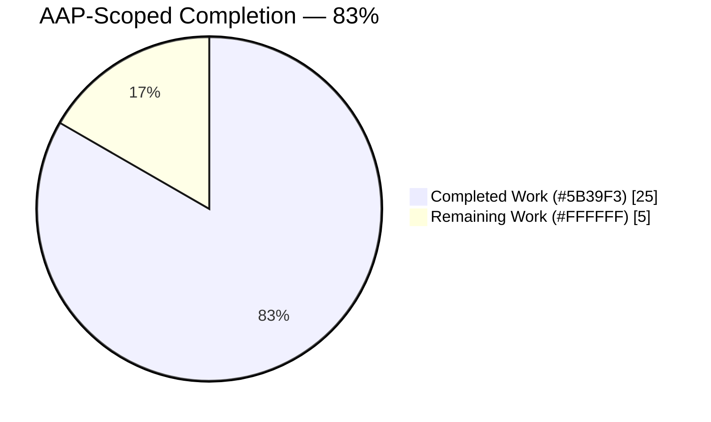
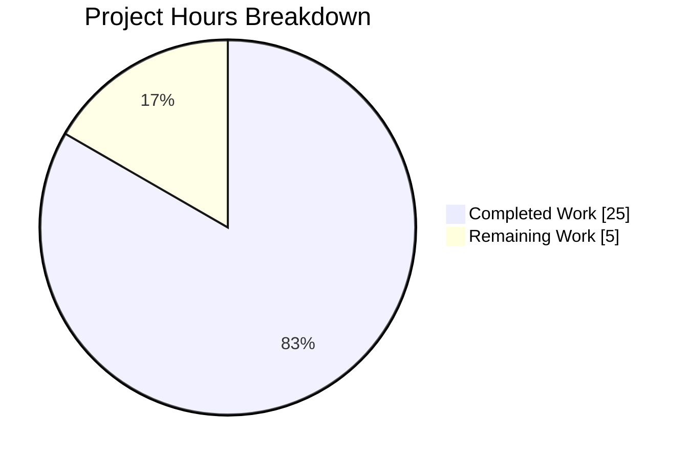
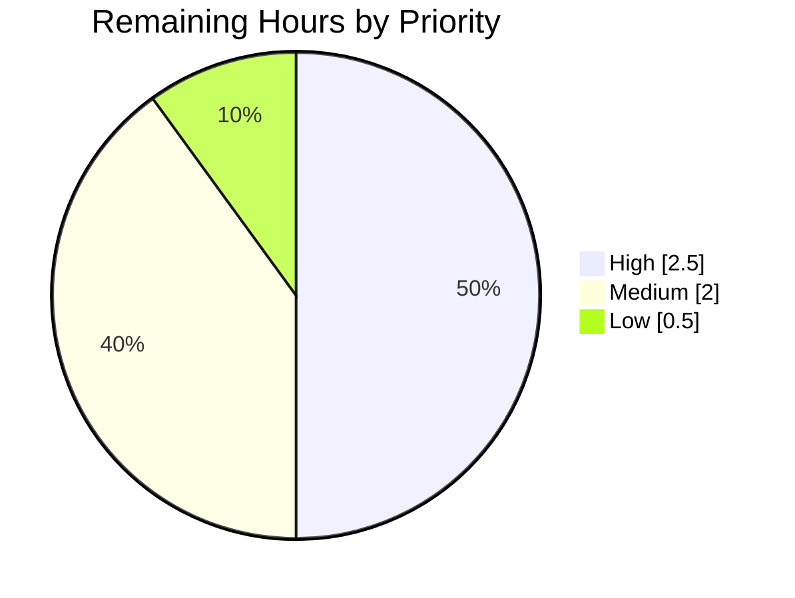

# 1. Executive Summary

## 1.1 Project Overview

This project delivers `Welcome.py`, a single-file Python console utility at the repository root that writes two fixed lines of plain, unformatted text to standard output and exits 0. It targets developers and automated checks that need a dependency-free, zero-configuration script: no install step, no virtual environment, no arguments, no input of any kind. The technical scope is four files — the program, a five-assertion standard-library test suite, the README documenting how to run both, and a `.gitignore` for Python bytecode — alongside the pre-existing repository content, preserved unchanged. Output fidelity is the dominant requirement: the printed characters must match the supplied source text exactly.

## 1.2 Completion Status



| Metric | Value |
|---|---|
| **Total Hours** | **30.0** |
| Completed Hours (AI + Manual) | 25.0 (AI 25.0 / Manual 0.0) |
| Remaining Hours | 5.0 |
| **Percent Complete** | **83%** — (25.0 / 30.0) × 100 = 83.3% |

Colour key: Completed = Dark Blue `#5B39F3`; Remaining = White `#FFFFFF`.

## 1.3 Key Accomplishments

- ✅ `Welcome.py` prints the two-line payload and exits 0 — 72 bytes, digest `8012dda8…7b33`, empty stderr.
- ✅ Three flows, one function each — `get_welcome_text()`, `print_welcome_text(text)`, `main()` — separately asserted.
- ✅ Zero imports; importing the module emits nothing and adds only `Welcome` to `sys.modules`.
- ✅ Five-assertion gate passes 5/5 on CPython 3.13.7 and 3.14.0, and fails on payload or emitter drift.
- ✅ No input surface: arguments, stdin, environment, configuration and files all unread at runtime.
- ✅ `README.md` documents the run command, exact output, 3.11 floor, gate and failure modes — all re-executed.
- ✅ Bytecode ignored; the pre-existing README description and `server.js` byte-identical to their original state.
- ✅ Zero dependencies, and all 26 deliberately excluded artefacts absent.

## 1.4 Critical Unresolved Issues

Three items are open. They sit against 15 scoped requirement areas — the twelve functional and non-functional requirements plus Rule 1's three obligations — of which 14 are fully verified and one, portability, is partially verified. None prevents the program from running correctly.

| Issue | Impact | Owner | ETA |
|---|---|---|---|
| Declared portability unvalidated beyond CPython 3.13.7/3.14.0 on Linux — the 3.11 floor, 3.12, macOS and Windows have not been exercised, and on Windows the documented 72-byte/digest check does not hold because stdout translates newlines (`README.md:40`) | Medium — the support claim in the documentation is broader than what has been demonstrated | Release owner | 2.5 h |
| Starting the program with standard output already closed (`python Welcome.py >&-`) delivers nothing yet exits 0 with empty stderr; documented at `README.md:27` rather than guarded, since a `try`/`except` around the single `print()` is outside the agreed scope | Low — a caller that closes descriptor 1 is told the run succeeded; see §5.2 | Release owner | 0.5 h |
| Repository composition and identity decisions: the pre-existing `server.js` remains tracked (`server.js:1-14`), and the repository heading still reads `# hao-backprop-test` while the only deliverable prints welcome text (`README.md:1-2`) | Low — no product impact; a naming and inventory decision only; see §5.2 | Repository owner | 0.5 h |

## 1.5 Access Issues

No repository, credential, registry or network access issues exist — the project reads no environment variables, holds no secrets and opens no sockets. Two resource-availability items leave the portability claim unproven:

| System/Resource | Type of Access | Issue Description | Resolution Status | Owner |
|---|---|---|---|---|
| CPython 3.11 and 3.12 runtimes | Local toolchain | Not present where the project has been built and tested so far (3.13.7 and 3.14.0 only), so the declared 3.11 floor has not been exercised | Open — needs an interpreter on the validating machine | Release owner |
| macOS and Windows hosts | Test platform | Unavailable during delivery, so the documented cross-platform support claim and the newline-translation caveat are untested | Open — needs one run per platform | Release owner |
| Git repository, dependencies, external services | — | None required: zero dependencies, no service integration, no credentials | No issue | — |

## 1.6 Recommended Next Steps

1. **[High]** Run the program and the gate on CPython 3.11 and 3.12 to substantiate the declared floor (1.0 h).
2. **[High]** Settle the `server.js` tracking and `hao-backprop-test` naming decisions (0.5 h).
3. **[High]** Review the eight-commit branch, merge to `main`, and add the one-command gate to the merge checklist (1.0 h).
4. **[Medium]** Validate macOS and Windows, noting the newline-translation caveat (1.5 h).
5. **[Medium]** Confirm the disposition of the two accepted caveats (0.5 h).

# 2. Project Hours Breakdown

## 2.1 Completed Work Detail

| Component | Hours | Description |
|---|---|---|
| `Welcome.py` payload constant, three flow functions and guarded entry point | 3.0 | Module docstring, `WELCOME_TEXT` built from two adjacent literals (`Welcome.py:4-7`), `get_welcome_text()`, `print_welcome_text(text)`, `main()` and the `if __name__ == "__main__":` guard — 26 lines, zero imports, one defaulted `print()` |
| Payload transcription fidelity | 2.0 | Character-level assurance of the two lines (17 and 53 characters), the ASCII hyphen, the bare `&`, the separated `f`/`i` and the absent terminal period, plus three-way agreement between the constant, the test literal and the README block |
| Five-assertion test suite | 4.0 | `tests/test_welcome.py` (81 lines): independently written expected literal, whitespace-sensitive emitter probe, accessor and reload assertions, and a real subprocess run asserting return code, stdout and empty stderr |
| `README.md` documentation | 3.5 | Run command, exact expected output, CPython 3.11 floor, gate command, byte/digest corroboration, the output contract's failure modes, the isolated-mode caveat, and continuity with the pre-existing description |
| `.gitignore` and repository composition | 1.5 | Two bytecode patterns that ignore no tracked path, plus the tracked-inventory work that keeps the delivered tree at the declared three creations and one update with the pre-existing files intact |
| Output-contract runtime verification | 4.0 | Execution across CPython 3.13.7 and 3.14.0, interpreter-flag and locale variants, redirection, piping, symlink and foreign-working-directory invocation, concurrency and idempotency, plus the environmental failure modes |
| Zero-input surface and security posture | 2.0 | Runtime confirmation that arguments, stdin, environment variables, configuration and files are unread, including positive proof stdin is never consumed, plus the no-network/no-subprocess/no-write observation and a secret sweep |
| Flow separation and import-cost evidence | 2.5 | Each flow invoked in isolation, the emitter proven a pure pass-through, and import cost measured: `sys.modules` delta of one name, no output at import, per-run cost at the measurement noise floor |
| Gate execution and assertion strength | 2.5 | Gate run under plain, verbose, warnings-as-errors, buffered and fail-fast options; each test also run alone and out of order; mutation checks confirming the suite fails on real regressions |
| **Total** | **25.0** | Matches Completed Hours in §1.2 |

## 2.2 Remaining Work Detail

| Category | Hours | Priority |
|---|---|---|
| Validate the declared CPython 3.11 floor and 3.12 by running the program and the gate on each | 1.0 | High |
| Repository composition and identity decisions — `server.js` tracking and the `hao-backprop-test` naming | 0.5 | High |
| Branch review, merge to `main`, and release handoff including the one-command gate in the merge checklist | 1.0 | High |
| macOS and Windows portability validation, including the newline-translation effect on the byte/digest check | 1.5 | Medium |
| Disposition of the two accepted caveats — closed-stdout silent no-op and the gate's default-interpreter-mode requirement | 0.5 | Medium |
| Documentation regression-protection decision for README prose | 0.5 | Low |
| **Total** | **5.0** | Matches Remaining Hours in §1.2 and §7 |

## 2.3 Hours Calculation

- Completed Hours = 3.0 + 2.0 + 4.0 + 3.5 + 1.5 + 4.0 + 2.0 + 2.5 + 2.5 = **25.0**
- Remaining Hours = 1.0 + 0.5 + 1.0 + 1.5 + 0.5 + 0.5 = **5.0**
- Total Project Hours = 25.0 + 5.0 = **30.0**
- Percent Complete = (25.0 / 30.0) × 100 = **83.3%**, reported as **83%**

Every hour above traces to a scoped deliverable (the four files, the functional and non-functional requirements, the specified assertions) or to a path-to-production activity needed to release them. Confidence is high on the completed figures — each component exists in the tree and its behaviour was observed — and medium on the portability items, whose effort depends on how quickly the missing interpreters and platforms can be reached.

# 3. Test Results

The whole automated gate is one command run from the repository root: `python -m unittest discover -s tests`. It was executed for this assessment and reported `Ran 5 tests in 0.010s` / `OK`, exit status 0, on CPython 3.13.7, and again on CPython 3.14.0 (`Ran 5 tests in 0.009s` / `OK`). The rows below group those five tests by the capability each one proves.

| Area / Category | Framework | Tests | Passed | Failed | Coverage | What This Proves |
|---|---|---|---|---|---|---|
| Output fidelity (`main()` under captured stdout) | `unittest` | 1 | 1 | 0 | `main()` + both flows it composes | The printed text matches the expected payload character for character, including the single trailing newline |
| Emission flow in isolation (`print_welcome_text`) | `unittest` | 1 | 1 | 0 | `print_welcome_text()` | The emitter appends exactly one newline and alters nothing else — its whitespace-padded probe fails if the argument is stripped |
| Payload accessor (`get_welcome_text`) | `unittest` | 1 | 1 | 0 | `get_welcome_text()` | The constant carries no trailing newline, so `print()` is the only source of it |
| Import safety | `unittest` | 1 | 1 | 0 | Module body and `__main__` guard under reload | Importing or reloading the module writes nothing to stdout and never runs `main()` |
| End-to-end process contract (real subprocess run) | `unittest` | 1 | 1 | 0 | `Welcome.py` as an executed script | Running the file exits 0, emits exactly the expected stdout and writes nothing to stderr |
| Byte-level output corroboration | Shell (`wc`, `sha256sum`, `grep`) | 3 | 3 | 0 | Emitted bytes | Output is 72 bytes with digest `8012dda8ef6285781c3ca772d98fb265df8ce38e2d5284aa01b99a4d97d37b33` and contains no escape byte, so nothing is styled or padded |
| Compile check | `py_compile` | 2 | 2 | 0 | Both Python files | `Welcome.py` and `tests/test_welcome.py` compile cleanly, with warnings-as-errors gate runs also clean |
| **Total** | — | **10** | **10** | **0** | — | 5 suite assertions plus 5 direct command checks, all observed |

**Not Covered**

- **`README.md` prose.** No assertion reads the documentation, because no documentation linter or doc test is part of this project by design. Its claims were confirmed by executing each documented command, but a future edit could reintroduce an inaccurate statement without failing the gate. A human should re-read the README whenever it changes.
- **The declared portability envelope.** The gate has been run on CPython 3.13.7 and 3.14.0 on Linux only. The declared 3.11 floor, 3.12, macOS and Windows are untested, and the byte-count/digest checks above hold only where stdout is not newline-translated.
- **Coverage measurement.** No coverage tool is part of the project and none is installed, so no coverage percentage exists. Coverage is expressed above as an invocation inventory: all three functions, the module body and the `__main__` guard are each exercised.
- **Comments and docstrings.** These carry no behaviour, so no test asserts their wording; they were verified by reading.
- **`server.js`.** The pre-existing Node file is deliberately never executed or imported — it would bind `127.0.0.1:3000` — and no test covers it. Its integrity is established by byte-identity to the original upload.

# 4. Runtime Validation & UI Verification

This project has no web or graphical interface: the only surface is a terminal, so there is no screen, route or component to verify and no browser session was involved. Everything below was driven as a real process and observed.

- ✅ **Start-up and primary flow** — `python Welcome.py` from the repository root prints `Welcome to Blitzy` then `AI-Powered Code Generation & Technical Specifications`, exits 0, writes 0 bytes to stderr.
- ✅ **Byte-level output** — 72 bytes, digest `8012dda8ef6285781c3ca772d98fb265df8ce38e2d5284aa01b99a4d97d37b33`, zero escape bytes, so the text arrives unstyled and unpadded.
- ✅ **Interpreter variants** — identical output and exit status on CPython 3.13.7 and 3.14.0, and via `python3 Welcome.py`; the module compiles on both.
- ✅ **Import path** — `python -c "import Welcome"` exits 0 with zero bytes on both streams, confirming nothing runs at import.
- ✅ **Zero-input behaviour** — surplus arguments (`--help junk`) and piped stdin are ignored; output stays byte-identical, and no usage text or parsing error appears.
- ✅ **Redirection and piping** — redirect to a file and `| wc -c` / `| sha256sum` deliver the same bytes, so the buffered stream flushes at normal exit without any manual flush.
- ✅ **Automated gate** — `python -m unittest discover -s tests` reports `Ran 5 tests` / `OK`, exit 0, from the repository root on both interpreters.
- ✅ **Environmental failure modes** — an unwritable redirect target (`> /dev/full`) exits 120 with an 86-byte `OSError`, and a consumer closing the pipe early exits 120 with an 82-byte `BrokenPipeError`: delivery failures stay visible.
- ⚠ **Closed standard output** — `python Welcome.py >&-` exits 0 with empty stderr and delivers nothing. This is CPython behaviour when descriptor 1 is closed at start-up and is documented at `README.md:27`; it remains an accepted caveat.
- ⚠ **Hardened interpreter modes** — `python -I`, `python -P` or `PYTHONSAFEPATH=1` make the gate exit 1 with `ModuleNotFoundError: No module named 'Welcome'`, while the program itself runs unaffected under the same flags. Documented at `README.md:50`.

**Never exercised at runtime:** the declared CPython 3.11 floor and 3.12, and the macOS and Windows platforms named in the documentation — no interpreter or host for them was reachable during delivery. The pre-existing `server.js` was also never run, by design.

# 5. Compliance & Quality Review

## 5.1 Compliance Matrix

| # | Deliverable / Requirement | Status | Evidence | Progress |
|---|---|---|---|---|
| 1 | Emit both payload lines in order, followed by exactly one newline and no further bytes (F1, F2) | ✅ Pass | `Welcome.py:4-7,15-17,20-22`; constant is 71 characters ending `s`; observed output 72 bytes; `test_main_writes_expected_text_to_stdout` | ████████ 100% |
| 2 | Terminate with exit status 0 and write nothing else to either stream (F3, F4) | ✅ Pass | Observed `exit=0`, stderr 0 bytes, zero escape bytes; `test_script_execution_honours_full_contract` asserts return code 0 and empty stderr | ████████ 100% |
| 3 | Require no input of any kind (F5) | ✅ Pass | Arguments, stdin, environment, configuration and files all unread at runtime; no such site exists in `Welcome.py` | ████████ 100% |
| 4 | Deliverable is `Welcome.py` at the repository root (F6) | ✅ Pass | `./Welcome.py`, capital `W`, no relocated or lowercase variant | ████████ 100% |
| 5 | Character-for-character output fidelity (N1) | ✅ Pass | Digest `8012dda8…7b33` on both interpreters; constant, test literal and README block agree exactly | ████████ 100% |
| 6 | Import work bounded to definitions, no output or side effect (N2) | ✅ Pass | Zero imports; `import Welcome` emits nothing; `sys.modules` gains only `Welcome`; `test_import_of_module_produces_no_output` | ████████ 100% |
| 7 | Portability: CPython ≥ 3.11 on Linux, macOS or Windows, zero install (N3) | ⚠ Partial | Verified on CPython 3.13.7 and 3.14.0 on Linux with no install step; floor and other platforms untested — see §5.2 | █████░░░ 60% |
| 8 | PEP 8 layout and PEP 257 docstrings, one responsibility per function (N4) | ✅ Pass | Docstrings on the module and all three functions; longest lines 69 (product) and 76 (test) against the 79 limit | ████████ 100% |
| 9 | No untrusted input, network, filesystem write or subprocess in the product (N5) | ✅ Pass | None present in `Welcome.py`; the only subprocess is the test's list-form run of the script; no secrets in the tree | ████████ 100% |
| 10 | Behaviour assertable by capturing stdout, with the five specified assertions (N6) | ✅ Pass | `tests/test_welcome.py:37-77`, 5/5 passing and proven to fail on real regressions | ████████ 100% |
| 11 | Planned file set: three creations and one update, no forbidden artefact | ✅ Pass | `git diff --name-status` shows `A .gitignore`, `A Welcome.py`, `A tests/test_welcome.py`, `M README.md`; 26 excluded artefacts absent | ████████ 100% |
| 12 | Rule 1 — Python implementation, each flow clearly separated, no performance impact | ✅ Pass | Python-only sources; three flows in three functions, each invoked independently; per-run cost at the measurement noise floor with zero imports | ████████ 100% |

## 5.2 AAP & Rule Divergences and Gaps

| What the AAP/Rule Required | What Was Delivered Instead | Why It Diverged | Impact | Remediation |
|---|---|---|---|---|
| D1 — The plan states "the repository is empty today" and lists `README.md` among the files to be created | `README.md` was updated in place, keeping the pre-existing heading and description; `server.js` was already present too | The plan's premise about the starting tree was inaccurate; the repository already held both files | None functional; it is why the pre-existing heading and description still appear | None required — recorded for accuracy |
| D2 — Plan prose describes the product as Python with "no other language anywhere in the repository" | The pre-existing JavaScript file `server.js` remains tracked, byte-identical to its original upload (`server.js:1-14`) | The plan's own file-operation table authorises three creations and one update and no deletion, and states that no file enters scope on the rule's account alone | None on the product or on Rule 1 as written; a repository-inventory question only | Owner decides: keep it (no action) or authorise removal explicitly |
| D3 — Documentation is fixed at the run command, expected output, version floor and test command, with the existing title retained | `README.md:1-2` still read `# hao-backprop-test` and `test project for backprop integration.`, describing something the repository does not implement | Pre-existing repository identity was preserved deliberately for continuity, and nothing in the plan authorises renaming the repository | Readers may mis-identify the repository's purpose from its name | Owner decides whether to rename or re-describe the repository |
| D4 — The output contract states exit status 0 for a successful invocation | With descriptor 1 closed at start-up (`python Welcome.py >&-`) the program delivers nothing and still exits 0 with empty stderr; documented at `README.md:27` | Every code-level remedy is excluded by the plan: no `try`/`except` around the print, no `file=`, `flush=` or `sys.exit` | A caller that closes stdout is told the run succeeded; also in §1.4 | Accept as documented, or authorise a scope amendment for a guard |
| D5 — The documented gate is `python -m unittest discover -s tests` | The gate works only in default interpreter mode; under `-I`, `-P` or `PYTHONSAFEPATH=1` it exits 1 with `ModuleNotFoundError: No module named 'Welcome'`; documented at `README.md:50` | Both available fixes are excluded — `tests/__init__.py` is deliberately absent and the test module's import set is fixed, so no `sys.path` manipulation was permitted | A hardened runner invoking the gate would see an import failure; the program itself is unaffected | Pin the gate to default interpreter mode, or authorise one of the excluded fixes |
| D6 — Runs on any supported CPython from 3.11 onward, on Linux, macOS or Windows | Exercised on CPython 3.13.7 and 3.14.0 on Linux only; `README.md:40` also carries the inherited claim that the design was exercised on CPython 3.12.3 | No 3.11, 3.12, macOS or Windows environment was reachable during delivery, and the plan forbids a version gate in code that could have narrowed the claim | The documented support envelope is broader than what has been demonstrated; also in §1.4 | Run the program and gate on 3.11, 3.12, macOS and Windows (2.5 h in §2.2) |

**D1 — the plan's starting-tree premise.** The plan asserts an empty repository and lists `README.md` as a creation, but the base commit already contained `README.md` (a heading and a one-line description) and `server.js`. Delivery therefore updated `README.md` rather than creating it, and the branch's file operations are three creations plus one update, which `git diff --name-status` confirms. This matters only as context: it explains why the document still opens with a heading unrelated to the deliverable, and why a pre-existing Node file sits beside a Python program. Nothing needs to change in the code or the documentation on this account; the reader simply should not expect the greenfield tree the plan describes.

**D2 — the pre-existing Node file stays tracked.** Plan prose glosses the Python obligation as admitting "no other language anywhere in the repository", which would exclude `server.js`, a 14-line Node hello-world that predates this work. The delivered tree keeps it, because the plan's authoritative file-operation table declares no deletion and states explicitly that no file enters scope on the rule's account alone; removing a pre-existing file outside the agreed scope would have been an unauthorised change. The file has no consumer: nothing imports or references it, there is no `package.json`, and it is never executed (it would bind `127.0.0.1:3000`). Rule 1 as written concerns the product, which is Python either way. The decision the owner owns is simply whether this repository should carry it at all.

**D3 — repository identity.** `README.md:1-2` retain the pre-existing `# hao-backprop-test` heading and the sentence `test project for backprop integration.`, while the repository's only deliverable prints two lines of welcome text. Both lines are pre-existing content restored verbatim — the file's first 58 bytes are byte-identical to the original upload — so continuity with the prior state was chosen over consistency with the current deliverable, and the plan does not authorise renaming the repository. The practical impact is that a newcomer browsing the repository name or the README's first two lines will expect machine-learning code and find a console utility. Closing this is a naming decision for the owner, not a code change; the four documented items below the heading are accurate as written.

**D4 — silent non-delivery when stdout is closed.** Run as `python Welcome.py >&-`, the program emits nothing, writes nothing to stderr, and exits 0 — reproduced during this assessment. The cause is interpreter behaviour rather than this code: CPython binds `sys.stdout` to `None` when descriptor 1 is not open at start-up, and the built-in `print()` then does nothing, identically for `python -c "print('X')" >&-`. Every remedy that would turn this into a visible failure is excluded by the plan, which fixes the module at one defaulted `print(text)` with no imports and no exception handling. It is documented instead at `README.md:27`, alongside the two failure modes that do surface (exit 120 with an `OSError` or `BrokenPipeError`). A caller that cares should verify it received 72 bytes.

**D5 — the gate depends on default interpreter mode.** `python -m unittest discover -s tests` passes from the repository root, but adding `-I` or `-P`, or setting `PYTHONSAFEPATH=1`, makes it exit 1 with `ModuleNotFoundError: No module named 'Welcome'` (reproduced here). The mechanism is that those modes suppress the working-directory entry `python -m` would otherwise place on `sys.path`, which is what lets `tests/test_welcome.py:15` import the root module. The two available fixes are both out of scope: `tests/__init__.py` is deliberately absent — adding it would also re-open the `-t .` discovery hazard — and the test module's import set is fixed, ruling out `sys.path` manipulation. `README.md:50` states the requirement and quotes the exact error. Any runner adopted later must invoke the gate in default mode.

**D6 — portability claimed more broadly than demonstrated.** The documentation declares CPython 3.11 or newer on Linux, macOS or Windows, and `README.md:40` adds that the design was exercised on CPython 3.12.3. What has actually been exercised is CPython 3.13.7 and 3.14.0 on Linux, where output, exit status, the gate and the byte-level corroboration all hold. No 3.11, 3.12, macOS or Windows environment was reachable during delivery, and the plan forbids an in-code version gate that might have narrowed the claim. Technically the risk is low — the module uses only builtins available since Python 3.0 — but two specifics need confirming: that the gate discovers and passes on 3.11, and that on Windows the 72-byte and digest checks are read as character-level rather than byte-level, since text-mode stdout translates newlines.

No user-specified rule was departed from. Rule 1's three obligations are each satisfied: the implementation is Python only, its three flows are separated one per function and each was invoked independently, and its cost above a bare interpreter is not distinguishable from measurement noise, with zero imports and no module-level side effects.

# 6. Risk Assessment

These are forward-looking risks for the delivered codebase, not a history of the work.

| Risk | Category | Severity | Probability | Mitigation | Status |
|---|---|---|---|---|---|
| Documented support envelope is wider than what has been demonstrated — the 3.11 floor, 3.12, macOS and Windows are untested, and the 72-byte/digest check does not hold where stdout translates newlines | Technical | Medium | Medium | Run the program and the gate on each target interpreter and platform; treat the character-level assertion in the suite as the portable check and the byte checks as Unix corroboration | Open — 2.5 h in §2.2 |
| A caller that starts the program with standard output closed receives exit 0 and no output, so that specific delivery failure is silent | Operational | Low | Medium | Callers verify they received 72 bytes or the expected digest; the behaviour is documented at `README.md:27` | Accepted caveat — disposition due |
| A hardened runner (`-I`, `-P`, `PYTHONSAFEPATH=1`) makes the documented gate fail on `import Welcome` | Integration | Low | Medium | Pin whatever runner is adopted to default interpreter mode, as `README.md:50` states | Open — decision due |
| `README.md` has no automated regression protection, so a future edit could reintroduce an inaccurate claim or a non-ASCII character without failing the gate | Technical | Low | Low | Re-read the README on every change, or run the documentation sanity greps in Appendix A; an automated documentation check would require lifting the project's no-tooling decision | Open — 0.5 h in §2.2 |
| No continuous-integration pipeline exists by design, so the gate runs only when a person runs it and a regression could reach `main` unnoticed | Operational | Low | Low | Make `python -m unittest discover -s tests` part of the merge checklist; the same command is what any future workflow would call | Accepted by design |
| Repository name and README heading (`hao-backprop-test`) describe something unrelated to the deliverable, inviting misidentification | Operational | Medium | Low | Owner decides whether to rename or re-describe; the four documented items beneath the heading are accurate | Open — 0.5 h in §2.2 |
| The pre-existing `server.js` remains tracked and would bind `127.0.0.1:3000` if anyone ran it; it has no consumer in the repository | Integration | Low | Low | Leave it unexecuted, or remove it under an explicit authorisation; nothing in the Python product references it | Open — owner decision |
| There is no attack surface today (no input, no network, no filesystem write, no dependency), so the residual security risk is a future change introducing one under a gate that only asserts stdout | Security | Low | Low | Keep the zero-import, zero-input posture as an explicit review criterion for any change to `Welcome.py` | Mitigated — monitor |

# 7. Visual Project Status

Completed work is shown in Dark Blue `#5B39F3`; remaining work in White `#FFFFFF`.



Remaining work by priority (hours from §2.2):



| View | Completed | Remaining | Total |
|---|---|---|---|
| Hours | 25.0 | 5.0 | 30.0 |
| Share | 83% | 17% | 100% |

Remaining hours by category: CPython 3.11/3.12 floor validation 1.0 · macOS and Windows validation 1.5 · branch review and merge 1.0 · repository composition and identity decisions 0.5 · accepted-caveat dispositions 0.5 · documentation regression-protection decision 0.5 — total 5.0, matching §1.2 and the pie above.

# 8. Summary & Recommendations

**What was delivered.** The repository now contains a working, dependency-free console utility. `Welcome.py` holds the payload as a compile-time constant and three single-responsibility functions — supply, emission, composition — invoked through a `__main__` guard, in 26 lines with no import statements at all. `tests/test_welcome.py` provides the whole automated gate in five assertions that cover output fidelity, the emitter in isolation, the accessor's newline ownership, silence at import, and the real process contract. `README.md` documents how to run both, what to expect byte for byte, which interpreters are supported and how the contract behaves when delivery fails, and `.gitignore` keeps bytecode out of version control. Eight commits produced 159 added lines across four files, leaving the pre-existing repository content byte-identical.

**What was verified.** Running the program yields exactly 72 bytes with digest `8012dda8…7b33`, exit status 0, an empty standard error and no escape bytes, on CPython 3.13.7 and 3.14.0. The gate reports 5 tests, all passing, on both interpreters, and has been shown to fail when the payload drifts, when the emitter strips its argument, or when the guard is broken — so a green result means something. The program ignores arguments, standard input and environment variables; importing it emits nothing and adds a single name to `sys.modules`; its per-run cost above a bare interpreter is not distinguishable from measurement noise. Each documented command in the README was executed as written and behaved as described, including the two failure modes that exit 120 with a diagnostic.

**What remains.** Five hours of work, none of it in the program itself. The largest item is substantiating the declared portability envelope: the documentation claims CPython 3.11 or newer on Linux, macOS and Windows, while verification has covered 3.13.7 and 3.14.0 on Linux — two commands per target close that gap, with the caveat that Windows translates newlines and so changes the byte-count and digest corroboration. The decisions that follow belong to the owner: whether this repository keeps tracking the pre-existing `server.js`, whether the `hao-backprop-test` name and description should still stand over a welcome-text utility, and whether the two accepted caveats — silent non-delivery when stdout is closed, and the gate's dependence on default interpreter mode — stay documented or warrant a scope amendment. Finally, the README carries no automated regression protection, which is a deliberate consequence of adopting no tooling; a decision to keep reviewing it by hand is a legitimate answer.

**Critical path to production.** Validate the floor on 3.11 and 3.12, settle the repository composition and identity decisions, then review and merge the branch with the one-command gate in the checklist. Nothing else stands between this code and release: there is no build step, no artefact to publish, no configuration to provision, no credential to rotate and no service to deploy. Success metrics are unambiguous and already met on the tested platforms — `python Welcome.py` prints the two lines, exits 0, and produces 72 bytes with the expected digest; `python -m unittest discover -s tests` reports 5 tests OK.

**Production readiness.** At 83% of the scoped work complete (25.0 of 30.0 hours), the program itself is production-ready: correct, fully documented, exercised under adversarial input, free of dependencies and attack surface, and covered by a gate that bites. The residual 17% is verification breadth and repository housekeeping rather than functionality, so the recommendation is to release on the platforms that have been validated and treat the portability claim as provisional until the remaining interpreters and operating systems have been exercised.

# 9. Development Guide

Every command below was executed from the repository root and produced the output shown.

## 9.1 System Prerequisites

- **CPython 3.11 or newer.** Verified on 3.13.7 and 3.14.0. Nothing in the code enforces the floor; it is a documentation statement.
- **Operating system:** any of Linux, macOS or Windows in principle; Linux is what has been exercised.
- **Hardware:** none beyond what the interpreter needs — the process writes 72 bytes and exits.
- **Not required:** package manager, virtual environment, compiler, container runtime, database, network access, environment variables, secrets.

```bash
# Confirm an interpreter and that it satisfies the declared floor
python3 --version                                          # -> Python 3.13.7
python -c "import sys; print(sys.version_info >= (3, 11))" # -> True
```

## 9.2 Environment Setup

There is nothing to set up. Clone the repository, change into its root, and run the program.

```bash
cd /path/to/Ajit_GH_Repo-12-Mar-26     # the repository root — Welcome.py lives here
ls Welcome.py tests/test_welcome.py    # -> both paths listed
```

Two optional settings keep the working tree pristine while you experiment; neither is needed for correctness, because `.gitignore` already excludes bytecode:

```bash
export PYTHONPYCACHEPREFIX="$HOME/.cache/welcome-pycache"   # write __pycache__ outside the checkout
# or
python -B Welcome.py                                        # write no bytecode at all
```

## 9.3 Dependency Installation

None. The program imports nothing and the suite imports only the standard library (`contextlib`, `importlib`, `io`, `subprocess`, `sys`, `unittest`). There is no `requirements.txt`, `pyproject.toml` or lockfile, and none should be added.

```bash
python -m py_compile Welcome.py tests/test_welcome.py   # -> exit 0, no output
```

## 9.4 Application Startup

There is no service, port or startup order — one process runs and exits.

```bash
python Welcome.py
# Welcome to Blitzy
# AI-Powered Code Generation & Technical Specifications

python3 Welcome.py        # equivalent where `python` is absent or is Python 2
```

## 9.5 Verification Steps

```bash
# 1. Exit status
python Welcome.py > /dev/null; echo "exit=$?"          # -> exit=0

# 2. Exact size and digest (Unix; see the note below)
python Welcome.py | wc -c                               # -> 72
python Welcome.py | sha256sum
# -> 8012dda8ef6285781c3ca772d98fb265df8ce38e2d5284aa01b99a4d97d37b33

# 3. Standard error is empty
python Welcome.py 2>err.txt >/dev/null; wc -c < err.txt; rm err.txt   # -> 0

# 4. Nothing is styled: no escape byte in the output
python Welcome.py | grep -c $'\x1b'                     # -> 0

# 5. The automated gate (run from the repository root)
python -m unittest discover -s tests
# -> Ran 5 tests in 0.010s
# -> OK

# 6. Per-test detail
python -m unittest discover -s tests -v                 # -> five lines ending "... ok"

# 7. Warnings as errors
python -W error -m unittest discover -s tests           # -> Ran 5 tests / OK

# 8. Nothing happens at import
python -c "import Welcome"                              # -> exit 0, no output

# 9. Bytecode stays out of version control
git status --porcelain --untracked-files=all | wc -l    # -> 0
```

**Platform note.** Steps 2 and 4 are Unix corroboration: `sha256sum` is absent by default on macOS and in standard Windows shells, and Windows text-mode stdout translates `\n` to `\r\n`, which changes both the byte count and the digest. The portable equivalent computes the digest in-process:

```bash
python -c "import hashlib, Welcome; d=(Welcome.get_welcome_text()+chr(10)).encode(); print(len(d), hashlib.sha256(d).hexdigest())"
# -> 72 8012dda8ef6285781c3ca772d98fb265df8ce38e2d5284aa01b99a4d97d37b33
```

## 9.6 Example Usage

```bash
# Capture the text for comparison in a script
python Welcome.py > expected.txt && cat expected.txt

# Use it in a pipeline
python Welcome.py | head -n 1        # -> Welcome to Blitzy

# Call the flows individually from another Python process
python -c "import Welcome; print(repr(Welcome.get_welcome_text()))"
python -c "import Welcome; Welcome.print_welcome_text('any text')"   # -> any text
```

## 9.7 Troubleshooting

| Symptom | Cause | Resolution |
|---|---|---|
| `can't open file 'Welcome.py': No such file or directory` | Not in the repository root | `cd` to the root; the program is invoked as `python Welcome.py` from there |
| `ImportError: Start directory is not importable: '<root>/tests'` | `-t .` was added to the discover command while there is deliberately no `tests/__init__.py` | Run the gate exactly as documented: `python -m unittest discover -s tests`, with no `-t` |
| `ModuleNotFoundError: No module named 'Welcome'` during the gate | The interpreter was run in isolated or safe-path mode (`-I`, `-P`, `PYTHONSAFEPATH=1`), which removes the working directory from `sys.path` | Run the gate in default mode; the program itself is unaffected by those flags |
| Gate reports `NO TESTS RAN` | Invoked from a directory where `tests/` is empty or absent | Run from the repository root, where `tests/test_welcome.py` exists |
| Program prints nothing and still exits 0 | Standard output was closed at start-up (`>&-`), so the interpreter binds it to `None` and `print()` does nothing | Provide a real destination for stdout; verify delivery by checking for 72 bytes |
| `wc -c` reports 74 rather than 72, or the digest differs | Running on Windows, where text-mode stdout translates newlines | Use the in-process digest check above; the suite's assertion is character-level and unaffected |
| `__pycache__` directories appear in the checkout | Normal Python behaviour after running the suite | They are ignored (`.gitignore:2`); use `PYTHONPYCACHEPREFIX` or `-B` to avoid them |

# 10. Appendices

## A. Command Reference

| Purpose | Command (from the repository root) | Expected result |
|---|---|---|
| Run the program | `python Welcome.py` | Two lines, exit 0 |
| Check exit status | `python Welcome.py > /dev/null; echo "exit=$?"` | `exit=0` |
| Byte count | `python Welcome.py \| wc -c` | `72` |
| Digest | `python Welcome.py \| sha256sum` | `8012dda8ef6285781c3ca772d98fb265df8ce38e2d5284aa01b99a4d97d37b33` |
| Portable digest | `python -c "import hashlib, Welcome; d=(Welcome.get_welcome_text()+chr(10)).encode(); print(len(d), hashlib.sha256(d).hexdigest())"` | `72` and the same digest |
| Run the gate | `python -m unittest discover -s tests` | `Ran 5 tests` / `OK`, exit 0 |
| Gate, verbose | `python -m unittest discover -s tests -v` | Five `... ok` lines |
| Gate, warnings as errors | `python -W error -m unittest discover -s tests` | `Ran 5 tests` / `OK` |
| Compile check | `python -m py_compile Welcome.py tests/test_welcome.py` | Exit 0, no output |
| Import silence check | `python -c "import Welcome"` | Exit 0, no output |
| Ignore-rule check | `git check-ignore -v __pycache__/x.pyc Welcome.pyc` | `.gitignore:2` and `.gitignore:3` |
| Documentation sanity greps | `grep -nP '[^\x00-\x7F]' README.md` · `grep -c 'unittest discover -s tests' README.md` | No non-ASCII match; the gate command present |

## B. Port Reference

The product binds no port and opens no socket; nothing needs to be reachable for it to run.

| Port | Used by | Note |
|---|---|---|
| — | `Welcome.py`, `tests/test_welcome.py` | None. No listener, no client, no network call |
| 3000 | Pre-existing `server.js` (out of scope) | Only if someone runs that file deliberately; the Python product never references it |

## C. Key File Locations

| Path | Role | Size |
|---|---|---|
| `Welcome.py` | The deliverable: payload constant, three flow functions, guarded entry point | 26 lines |
| `tests/test_welcome.py` | The entire automated gate: five assertions over the stdout contract | 81 lines |
| `README.md` | Run command, expected output, version floor, gate command, contract failure modes | 50 lines |
| `.gitignore` | Two patterns excluding `__pycache__/` and `*.pyc` | 3 lines |
| `server.js` | Pre-existing Node hello-world, outside this work's scope, unchanged | 14 lines |

## D. Technology Versions

| Component | Version | Note |
|---|---|---|
| Declared minimum | CPython 3.11 | Documentation-only; no version gate in code |
| Verified | CPython 3.13.7, CPython 3.14.0 | Program and gate both exercised on each |
| Test framework | `unittest` (standard library) | No third-party test dependency |
| Third-party packages | None | No manifest, no lockfile, no install step |

## E. Environment Variable Reference

The product reads no environment variable; the following affect only the interpreter and are optional for development convenience.

| Variable | Effect | Needed? |
|---|---|---|
| `PYTHONPYCACHEPREFIX` | Writes bytecode caches outside the checkout | Optional |
| `PYTHONDONTWRITEBYTECODE` | Writes no bytecode at all (same as `-B`) | Optional |
| `PYTHONSAFEPATH` | Removes the working directory from `sys.path`, which makes the gate fail to import the module | Leave unset when running the gate |

## F. Developer Tools Guide

No linter, formatter, type checker, coverage tool or CI pipeline is part of this project, by deliberate decision — PEP 8 and PEP 257 conformance is a review criterion instead, and the entire quality gate is the single `unittest` command. Practical consequences for anyone changing the code:

- Keep `Welcome.py` import-free and its module body limited to the constant, the three definitions and the guard; the suite's reload assertion and the project's cost posture both depend on it.
- Keep the expected literal in `tests/test_welcome.py` independent of `Welcome.WELCOME_TEXT`, so a drifted payload fails the gate instead of being read back from the value it is meant to verify.
- Leave the emitter probe's edge spaces in place: they are what make the suite detect an emitter that strips its argument.
- Never adjust the expected literal to make a fidelity failure pass; re-check both sides against the payload recorded in `README.md`.
- Run the gate from the repository root in default interpreter mode, and never add `-t .`.

## G. Glossary

| Term | Meaning |
|---|---|
| Payload | The two fixed lines this program prints: `Welcome to Blitzy` and `AI-Powered Code Generation & Technical Specifications` |
| The gate | `python -m unittest discover -s tests` — the project's only automated quality check |
| Guarded entry point | The `if __name__ == "__main__":` block that runs `main()` on execution but not on import |
| Flow | One of the three separated responsibilities: supply (`get_welcome_text`), emission (`print_welcome_text`), composition (`main`) |
| Digest | `8012dda8ef6285781c3ca772d98fb265df8ce38e2d5284aa01b99a4d97d37b33`, the SHA-256 of the 72 expected output bytes |
| Isolated / safe-path mode | `python -I`, `python -P` or `PYTHONSAFEPATH=1`, which drop the working directory from `sys.path` and so break the gate's import |
