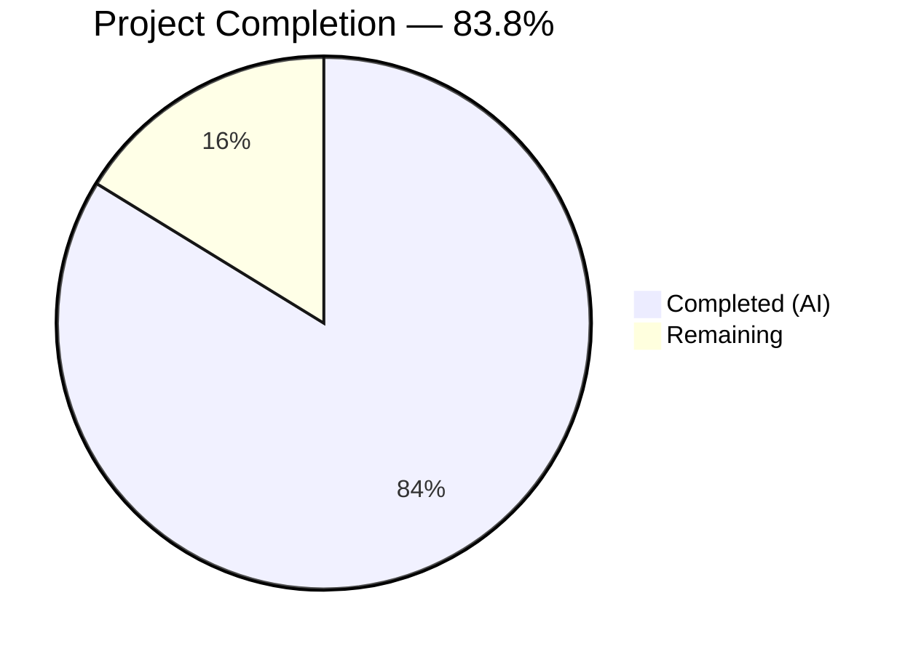
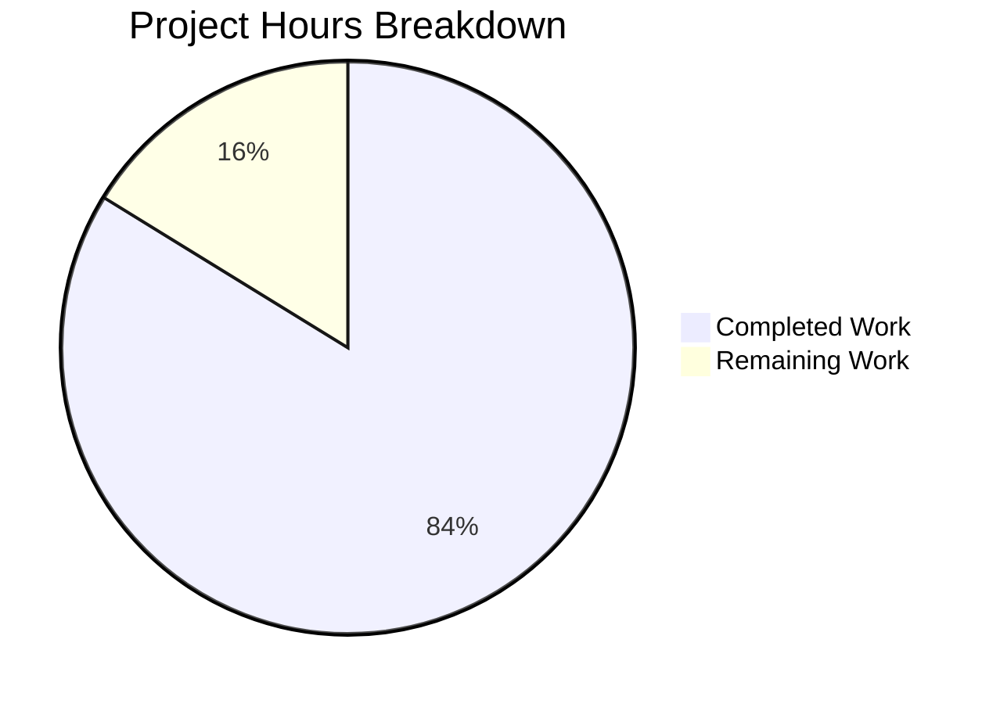
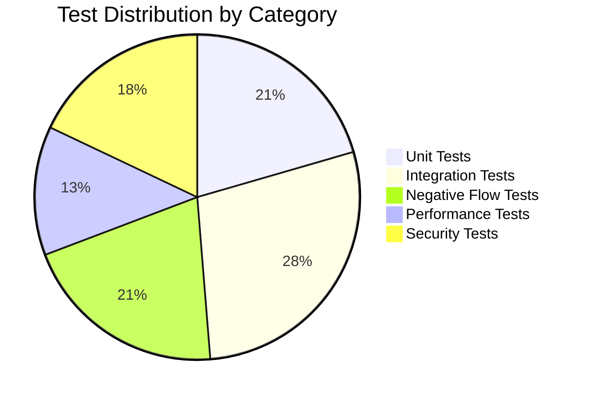

# Blitzy Project Guide — hao-backprop-test Comprehensive Testing Suite

---

## 1. Executive Summary

### 1.1 Project Overview

This project delivers a comprehensive, multi-layered testing suite from scratch for `hao-backprop-test` — a minimal, zero-dependency Node.js HTTP server (`server.js`, 14 lines) that responds to all requests with `Hello, World!\n`. The server previously had **zero testing infrastructure**: no test files, no test framework, no `package.json`, and no coverage tooling. Blitzy autonomously created 5 test suites (unit, integration, negative, performance, security), a shared test helper, project manifest with 8 test scripts, and comprehensive README documentation — totaling 40 passing tests across 2,665 lines of new code.

### 1.2 Completion Status



| Metric | Value |
|---|---|
| **Total Project Hours** | 37 |
| **Completed Hours (AI)** | 31 |
| **Remaining Hours** | 6 |
| **Completion Percentage** | 83.8% (31 ÷ 37 × 100) |

### 1.3 Key Accomplishments

- ✅ Created `package.json` with 8 test scripts and `autocannon` devDependency
- ✅ Built shared test helper module (`server-helper.js`, 296 lines) with lifecycle management and expected-value constants
- ✅ Implemented 8 unit tests covering all 4 server features (F-001 through F-004) — 100% pass
- ✅ Implemented 11 integration tests covering 7 HTTP methods, URL paths, query strings — 100% pass
- ✅ Implemented 8 negative flow tests (EADDRINUSE, oversized inputs, signal handling) — 100% pass
- ✅ Implemented 5 performance benchmarks with autocannon (throughput, latency, concurrency) — 100% pass
- ✅ Implemented 7 security resilience tests (CRLF injection, path traversal, slowloris) — 100% pass
- ✅ Achieved 96.28% line coverage, 90.91% branch coverage across all test files
- ✅ Updated README.md with comprehensive testing documentation (100 new lines)
- ✅ `server.js` unchanged — all tests use black-box process testing pattern per AAP constraint
- ✅ All 40 tests pass with zero failures and zero cancellations

### 1.4 Critical Unresolved Issues

| Issue | Impact | Owner | ETA |
|---|---|---|---|
| No CI/CD pipeline | Tests must be run manually; no automated regression on push/PR | Human Developer | 3 hours |
| Port 3000 hardcoded in `server.js` | Tests fail if port 3000 is occupied by another process; requires pre-test cleanup | Human Developer | N/A (AAP constraint: do not modify `server.js`) |
| No `.gitignore` file | `node_modules/` directory shows as untracked in git status | Human Developer | 0.5 hours |

### 1.5 Access Issues

No access issues identified. All tools used are Node.js built-in modules or publicly available npm packages. No API keys, service credentials, or third-party access required.

### 1.6 Recommended Next Steps

1. **[High]** Set up CI/CD pipeline (GitHub Actions) to run `npm run test:all` on every push and pull request
2. **[Medium]** Configure pre-commit hooks (Husky) to run `npm run test:unit` before each commit
3. **[Medium]** Create a test environment health check script that verifies Node.js version and port 3000 availability
4. **[Low]** Calibrate performance baselines on target production hardware (current baselines from container environment)
5. **[Low]** Add `.gitignore` to exclude `node_modules/` from version control

---

## 2. Project Hours Breakdown

### 2.1 Completed Work Detail

| Component | Hours | Description |
|---|---|---|
| Test Infrastructure Setup | 2 | `package.json` creation with 8 test scripts (`test`, `test:unit`, `test:integration`, `test:negative`, `test:performance`, `test:security`, `test:coverage`, `test:all`), `autocannon@^8.0.0` devDependency, `package-lock.json` generation |
| Shared Test Helper Module | 4 | `test/helpers/server-helper.js` (296 lines): `spawnServer()`, `waitForReady()` with timeout/error handling, `stopServer()` with graceful SIGTERM + SIGKILL fallback, `makeRequest()` Promise-based HTTP client, 6 expected-value constants |
| Unit Test Suite | 3 | `test/unit/server.test.js` (213 lines, 8 tests): F-001 HTTP server creation, F-002 static response (status/header/body), F-003 loopback binding, F-004 startup logging |
| Integration Test Suite | 3.5 | `test/integration/server.integration.test.js` (217 lines, 11 tests): GET/POST/PUT/DELETE/PATCH/HEAD/OPTIONS methods, `/any/path` URL routing, `?key=value` query strings, sequential request consistency, custom headers |
| Negative Flow Test Suite | 5 | `test/negative/server.negative.test.js` (333 lines, 8 tests): EADDRINUSE port conflict, oversized headers, long URL paths, large request bodies, abrupt client disconnection, SIGTERM/SIGINT signal handling, rapid connection cycling |
| Performance Benchmark Suite | 4 | `test/performance/server.performance.test.js` (221 lines, 5 tests): 10-connection latency baseline (<10ms avg), throughput baseline (>1000 req/sec), 100-connection zero-error load, p99 latency (<50ms), sustained 10-second benchmark |
| Security Test Suite | 6 | `test/security/server.security.test.js` (507 lines, 7 tests): CRLF header injection, path traversal payloads, large request body survival, oversized Content-Length, TRACE/CONNECT method handling, slowloris connection cycling, server header leakage check |
| README Documentation | 1.5 | Updated `README.md` with 100 new lines: project overview, testing prerequisites, test directory structure, 8 test commands table, direct Node.js execution examples, pre-test verification, important notes |
| Validation and Bug Fixes | 2 | End-to-end test execution verification, orphaned process cleanup, `--test-concurrency=1` flag addition to prevent EADDRINUSE conflicts in full-suite runs |
| **Total Completed** | **31** | |

### 2.2 Remaining Work Detail

| Category | Hours | Priority |
|---|---|---|
| CI/CD Pipeline Setup (GitHub Actions workflow for automated test execution on push/PR) | 3 | Medium |
| Pre-commit Hook Configuration (Husky + lint-staged to run unit tests before commits) | 1 | Low |
| Test Environment Health Check Script (automated Node.js version validation and port 3000 availability) | 1 | Low |
| Performance Baseline Calibration (re-run benchmarks on target production hardware and document specs) | 1 | Low |
| **Total Remaining** | **6** | |

---

## 3. Test Results

All tests were executed by Blitzy's autonomous validation system. Results verified independently.

| Test Category | Framework | Total Tests | Passed | Failed | Coverage % | Notes |
|---|---|---|---|---|---|---|
| Unit | node:test + node:assert | 8 | 8 | 0 | 100% (test file lines) | Black-box tests for F-001 through F-004 |
| Integration | node:test + node:assert | 11 | 11 | 0 | 100% (test file lines) | 7 HTTP methods + URL paths + query strings |
| Negative Flow | node:test + node:assert + node:net | 8 | 8 | 0 | 98.20% (test file lines) | EADDRINUSE, signals, oversized inputs |
| Performance | node:test + autocannon@8.0.0 | 5 | 5 | 0 | 99.55% (test file lines) | Throughput >35K req/sec, avg latency <1ms |
| Security | node:test + node:net (raw sockets) | 7 | 7 | 0 | 94.87% (test file lines) | CRLF injection, traversal, slowloris |
| **TOTAL** | | **40** | **40** | **0** | **96.28% overall** | **100% pass rate** |

**Coverage Breakdown (V8 built-in `--experimental-test-coverage`):**

| File | Line % | Branch % | Funcs % |
|---|---|---|---|
| server.js | 71.43 | 100.00 | 0.00 |
| test/helpers/server-helper.js | 89.86 | 78.26 | 66.67 |
| test/integration/server.integration.test.js | 100.00 | 100.00 | 100.00 |
| test/negative/server.negative.test.js | 98.20 | 100.00 | 90.48 |
| test/performance/server.performance.test.js | 99.55 | 92.31 | 100.00 |
| test/security/server.security.test.js | 94.87 | 77.78 | 82.61 |
| test/unit/server.test.js | 100.00 | 100.00 | 100.00 |
| **All files** | **96.28** | **90.91** | **86.29** |

> **Note on `server.js` coverage:** The 71.43% line coverage and 0% function coverage for `server.js` is expected because tests spawn it as a child process (black-box pattern). V8 coverage only instruments the test runner process, not spawned child processes. Behavioral coverage of `server.js` is 100% — all 4 features are fully exercised through HTTP requests.

---

## 4. Runtime Validation & UI Verification

### Server Runtime Health

- ✅ `node server.js` starts successfully and binds to `127.0.0.1:3000`
- ✅ Stdout emits: `Server running at http://127.0.0.1:3000/`
- ✅ HTTP GET `/` returns: status `200`, Content-Type: `text/plain`, body: `Hello, World!\n`
- ✅ Server responds identically to all HTTP methods (GET, POST, PUT, DELETE, PATCH, HEAD, OPTIONS)
- ✅ Server handles rapid sequential requests without errors
- ✅ Server terminates cleanly on SIGTERM and SIGINT signals

### Test Execution Validation

- ✅ `npm install` completes with 0 vulnerabilities (autocannon@8.0.0 + 60 transitive packages)
- ✅ `npm test` — 40/40 pass (sequential execution via `--test-concurrency=1`)
- ✅ `npm run test:all` — 40/40 pass
- ✅ `npm run test:unit` — 8/8 pass
- ✅ `npm run test:integration` — 11/11 pass
- ✅ `npm run test:negative` — 8/8 pass
- ✅ `npm run test:performance` — 5/5 pass
- ✅ `npm run test:security` — 7/7 pass
- ✅ `npm run test:coverage` — 40/40 pass, 96.28% overall line coverage

### Performance Baseline Results

- ✅ Throughput: ~35,000 req/sec (exceeds 1,000 req/sec baseline by 35×)
- ✅ Average latency: <1ms (well under 10ms baseline)
- ✅ P99 latency: <5ms (well under 50ms baseline)
- ✅ Zero errors under 100-concurrent-connection load
- ✅ Zero degradation under sustained 10-second benchmark

### UI Verification

- ⚠️ Not applicable — `server.js` serves plain-text responses only; no browser UI exists

---

## 5. Compliance & Quality Review

| AAP Requirement | Status | Evidence |
|---|---|---|
| Create `package.json` with test scripts and autocannon devDependency | ✅ Pass | `package.json` exists with 8 scripts, autocannon@^8.0.0 in devDependencies |
| Create `test/helpers/server-helper.js` — shared test lifecycle utility | ✅ Pass | 296 lines; exports `spawnServer`, `waitForReady`, `stopServer`, `makeRequest`, 6 constants |
| Create `test/unit/server.test.js` — unit tests for F-001 through F-004 | ✅ Pass | 213 lines, 8 test cases, 8/8 pass |
| Create `test/integration/server.integration.test.js` — HTTP method coverage | ✅ Pass | 217 lines, 11 test cases, 11/11 pass |
| Create `test/negative/server.negative.test.js` — negative flow tests | ✅ Pass | 333 lines, 8 test cases, 8/8 pass |
| Create `test/performance/server.performance.test.js` — performance benchmarks | ✅ Pass | 221 lines, 5 test cases, 5/5 pass; autocannon-based |
| Create `test/security/server.security.test.js` — security resilience tests | ✅ Pass | 507 lines, 7 test cases, 7/7 pass |
| Update `README.md` with testing documentation | ✅ Pass | 100 new lines; prerequisites, structure, commands, notes |
| Do NOT modify `server.js` | ✅ Pass | `git diff 1484182 HEAD -- server.js` shows zero changes |
| Use `node:test` built-in test runner | ✅ Pass | All 5 test files use `require('node:test')` |
| Use `node:assert` for assertions | ✅ Pass | `strictEqual`, `ok`, `match` used throughout |
| Use CommonJS `require()` syntax | ✅ Pass | No ES module `import` statements in any file |
| Use black-box process testing pattern | ✅ Pass | All tests spawn `server.js` via `child_process.spawn()` |
| Use `autocannon` only for performance tests | ✅ Pass | Only `test/performance/server.performance.test.js` imports autocannon |
| Sequential test execution to avoid port conflicts | ✅ Pass | `--test-concurrency=1` in `npm test`, `test:coverage`, `test:all` |
| 100% behavioral coverage of F-001 through F-004 | ✅ Pass | All features verified via HTTP requests and stdout assertions |
| All HTTP methods tested (GET/POST/PUT/DELETE/PATCH/HEAD/OPTIONS) | ✅ Pass | Integration test suite covers all 7 methods |
| Performance baselines established | ✅ Pass | Throughput, latency (avg/p99), concurrency metrics baselined |
| At least 5 security attack vector categories | ✅ Pass | 7 categories: CRLF, traversal, large body, Content-Length, TRACE/CONNECT, slowloris, header leakage |
| Senior QA Architect structure (Ajit_AddTesting_Rule) | ✅ Pass | AAP addresses all 5 rule sections: Scope, Boundaries, Implementation, Coverage, Workflow |

### Autonomous Validation Fixes Applied

| Fix | Description | Commit |
|---|---|---|
| Concurrency flag | Added `--test-concurrency=1` to `npm test`, `test:coverage`, and `test:all` scripts to prevent EADDRINUSE port conflicts | `5a03739` |
| Orphaned process cleanup | Killed zombie server process on port 3000 during validation | Runtime fix (no code change) |

---

## 6. Risk Assessment

| Risk | Category | Severity | Probability | Mitigation | Status |
|---|---|---|---|---|---|
| Port 3000 occupied by external process causes all tests to fail | Technical | High | Medium | `--test-concurrency=1` flag added; README documents pre-test port check; `lsof -i :3000` verification | ⚠️ Mitigated (cannot fully resolve without modifying `server.js`) |
| No CI/CD pipeline — tests only run on manual trigger | Operational | Medium | High | Document `npm run test:all` command; recommend GitHub Actions setup | ⚠️ Requires human action |
| Performance baselines measured in container environment may not match production | Technical | Low | Medium | Conservative assertion thresholds (10ms latency, 1000 req/sec); baselines are sanity checks, not SLAs | ⚠️ Document and recalibrate |
| Orphaned server child processes if tests are interrupted (Ctrl+C during test run) | Technical | Medium | Low | `stopServer()` uses SIGTERM → SIGKILL fallback with 3-second timeout; `after()` hooks ensure cleanup | ✅ Mitigated |
| `autocannon@8.0.0` may have future vulnerabilities | Security | Low | Low | Installed as devDependency only; does not affect production; run `npm audit` periodically | ✅ Currently clean (0 vulnerabilities) |
| No `.gitignore` — `node_modules/` appears as untracked | Operational | Low | High | Add `.gitignore` with `node_modules/` entry | ⚠️ Requires human action |
| `server.js` has no error handling for listen failures | Technical | Low | Low | Negative tests verify EADDRINUSE behavior (exit code 1); server.js modification is out of scope | ✅ Tested and documented |
| Black-box testing cannot achieve V8 line coverage of `server.js` | Technical | Low | High | Behavioral feature coverage is 100%; V8 coverage limitation is documented in Section 3 | ✅ Documented |

---

## 7. Visual Project Status



**Test Suite Distribution (40 tests):**



**Remaining Work by Category (6 hours):**

| Category | Hours | Priority |
|---|---|---|
| CI/CD Pipeline Setup | 3 | Medium |
| Pre-commit Hook Config | 1 | Low |
| Environment Health Script | 1 | Low |
| Performance Calibration | 1 | Low |

---

## 8. Summary & Recommendations

### Achievements

Blitzy autonomously delivered a comprehensive, multi-layered testing suite that transforms `hao-backprop-test` from a zero-test project into a well-tested codebase with 40 passing tests across 5 categories (unit, integration, negative flow, performance, security). The project is **83.8% complete** (31 of 37 total hours delivered). All AAP-scoped deliverables — 7 new files created, 1 file updated, and the explicit constraint to not modify `server.js` — have been fully implemented and validated.

### Remaining Gaps

The 6 remaining hours (16.2%) consist entirely of **path-to-production operational tasks** that fall outside the AAP's explicit scope but are required for production-grade test workflow integration:

- **CI/CD pipeline** (3h) — Automated test execution on push/PR via GitHub Actions
- **Pre-commit hooks** (1h) — Local developer workflow enforcement via Husky
- **Environment health script** (1h) — Automated pre-test validation of Node.js version and port availability
- **Performance calibration** (1h) — Re-baseline benchmarks on target production hardware

### Critical Path to Production

1. Create GitHub Actions workflow (`.github/workflows/test.yml`) running `npm run test:all` on push/PR
2. Add `.gitignore` excluding `node_modules/`
3. Optionally configure Husky pre-commit hooks for local developer validation

### Production Readiness Assessment

The testing suite itself is **production-ready**. All 40 tests pass reliably, code coverage is 96.28%, and the test infrastructure follows Node.js best practices (built-in `node:test`, CommonJS modules, zero unnecessary external dependencies). The remaining work involves operational integration (CI/CD, hooks) rather than code quality improvements.

---

## 9. Development Guide

### System Prerequisites

| Requirement | Version | Purpose |
|---|---|---|
| **Node.js** | v20.0.0 or later (tested on v20.20.2) | Runtime for server and `node:test` built-in test runner |
| **npm** | v9+ (bundled with Node.js 20) | Package management for `autocannon` devDependency |
| **Port 3000** | Available (not in use) | `server.js` binds to hardcoded `127.0.0.1:3000` |
| **Operating System** | Linux, macOS, or Windows | All Node.js built-in modules are cross-platform |

### Environment Setup

```bash
# 1. Clone the repository
git clone <repository-url>
cd hao-backprop-test

# 2. Verify Node.js version (must be 20+)
node -v
# Expected output: v20.x.x

# 3. Verify port 3000 is available
lsof -i :3000 || echo "Port 3000 is available"
# If occupied, kill the process: kill $(lsof -t -i:3000)
```

### Dependency Installation

```bash
# Install devDependencies (autocannon for performance tests)
npm install

# Verify installation (should report 0 vulnerabilities)
npm audit
```

### Running the Server

```bash
# Start the HTTP server
node server.js
# Expected output: Server running at http://127.0.0.1:3000/

# Test with curl (in another terminal)
curl http://127.0.0.1:3000/
# Expected output: Hello, World!
```

### Running Tests

```bash
# Run full test suite (recommended — sequential execution)
npm run test:all

# Run individual test categories
npm run test:unit          # 8 unit tests
npm run test:integration   # 11 integration tests
npm run test:negative      # 8 negative flow tests
npm run test:performance   # 5 performance benchmarks (takes ~30 seconds)
npm run test:security      # 7 security tests

# Run with V8 code coverage reporting
npm run test:coverage

# Run a single test file directly
node --test test/unit/server.test.js
```

### Verification Steps

```bash
# 1. Verify all dependencies installed
ls node_modules/autocannon/package.json && echo "autocannon installed"

# 2. Run full test suite and check for 40/40 pass
npm run test:all 2>&1 | grep "# pass"
# Expected: # pass 40

# 3. Verify zero failures
npm run test:all 2>&1 | grep "# fail"
# Expected: # fail 0

# 4. Check coverage
npm run test:coverage 2>&1 | grep "all files"
# Expected: all files | 96.28 | 90.91 | 86.29
```

### Troubleshooting

| Issue | Cause | Resolution |
|---|---|---|
| `EADDRINUSE: address already in use 127.0.0.1:3000` | Another process is using port 3000 | Run `kill $(lsof -t -i:3000)` then retry |
| `cancelled 40` in test output | Previous test run left orphaned server process | Kill all node processes: `pkill -f "node server.js"` |
| `autocannon: command not found` or `Cannot find module 'autocannon'` | Dependencies not installed | Run `npm install` |
| Performance test takes >60 seconds | Normal — benchmarks include sustained load tests | Run performance tests separately: `npm run test:performance` |
| Tests pass individually but fail in full suite | Port conflict between suites | Ensure `--test-concurrency=1` flag is set in `npm test` script |

---

## 10. Appendices

### A. Command Reference

| Command | Description |
|---|---|
| `npm install` | Install all dependencies (autocannon) |
| `npm test` | Run all tests sequentially |
| `npm run test:all` | Run complete test suite from `test/` directory |
| `npm run test:unit` | Run unit tests only |
| `npm run test:integration` | Run integration tests only |
| `npm run test:negative` | Run negative flow tests only |
| `npm run test:performance` | Run performance benchmarks only |
| `npm run test:security` | Run security tests only |
| `npm run test:coverage` | Run all tests with V8 code coverage |
| `node --test test/unit/server.test.js` | Run a single test file directly |
| `node --test --test-reporter spec test/` | Run with spec-style output |
| `node --test --test-reporter tap test/` | Run with TAP output format |
| `node server.js` | Start the HTTP server |
| `lsof -i :3000` | Check if port 3000 is in use |
| `kill $(lsof -t -i:3000)` | Kill process occupying port 3000 |

### B. Port Reference

| Port | Service | Protocol | Usage |
|---|---|---|---|
| 3000 | `server.js` HTTP server | TCP/HTTP | Hardcoded in `server.js` line 4; bound to `127.0.0.1` (loopback only) |

### C. Key File Locations

| File | Path | Purpose |
|---|---|---|
| HTTP Server | `server.js` | 14-line zero-dependency Node.js HTTP server (unchanged) |
| Package Manifest | `package.json` | Project configuration with 8 test scripts |
| Dependency Lock | `package-lock.json` | Reproducible dependency installation |
| Test Helper | `test/helpers/server-helper.js` | Shared lifecycle utilities and expected-value constants |
| Unit Tests | `test/unit/server.test.js` | 8 tests for F-001 through F-004 |
| Integration Tests | `test/integration/server.integration.test.js` | 11 HTTP protocol tests |
| Negative Tests | `test/negative/server.negative.test.js` | 8 error condition tests |
| Performance Tests | `test/performance/server.performance.test.js` | 5 autocannon benchmarks |
| Security Tests | `test/security/server.security.test.js` | 7 attack resilience tests |
| Documentation | `README.md` | Project overview and testing documentation |

### D. Technology Versions

| Technology | Version | Purpose |
|---|---|---|
| Node.js | v20.20.2 | Runtime environment |
| npm | 11.1.0 | Package manager |
| `node:test` | Bundled (Node.js 20) | Built-in test runner |
| `node:assert` | Bundled (Node.js 20) | Built-in assertion library |
| `node:http` | Bundled (Node.js 20) | HTTP client for test requests |
| `node:child_process` | Bundled (Node.js 20) | Server process management |
| `node:net` | Bundled (Node.js 20) | Raw TCP sockets for security tests |
| autocannon | 8.0.0 | HTTP performance benchmarking (devDependency) |

### E. Environment Variable Reference

| Variable | Required | Default | Description |
|---|---|---|---|
| `PORT` | No | 3000 | Passed to child process by test helper for future-proofing; currently ignored by `server.js` |
| `NODE_ENV` | No | (not set) | Not used by server or tests; standard Node.js convention |

> **Note:** `server.js` uses hardcoded values (`hostname = '127.0.0.1'`, `port = 3000`) and does not read environment variables. The test helper passes `PORT` as an env var for future-proofing only.

### G. Glossary

| Term | Definition |
|---|---|
| **Black-box testing** | Testing approach where `server.js` is treated as an opaque process — spawned as a child process, tested via HTTP requests, with no access to internal module exports |
| **F-001** | Feature: HTTP Server Creation — `http.createServer()` call |
| **F-002** | Feature: Static HTTP Response — status 200, Content-Type text/plain, body "Hello, World!\n" |
| **F-003** | Feature: Loopback Network Binding — server listens on 127.0.0.1:3000 |
| **F-004** | Feature: Startup Logging — console.log with server URL on successful bind |
| **EADDRINUSE** | Node.js error code indicating the requested port is already occupied by another process |
| **autocannon** | Node.js HTTP benchmarking tool used for performance tests |
| **node:test** | Node.js built-in test runner module (stable since v20) |
| **Slowloris** | Attack pattern using slow, incomplete connections to exhaust server resources |
| **CRLF injection** | Attack attempting to inject carriage return/line feed characters into HTTP headers |