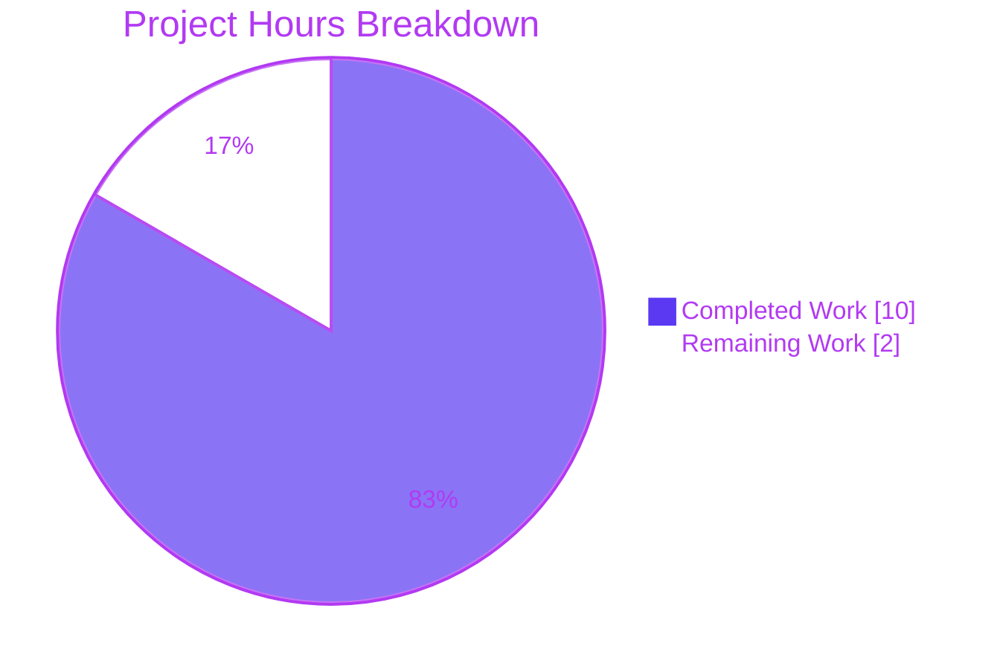
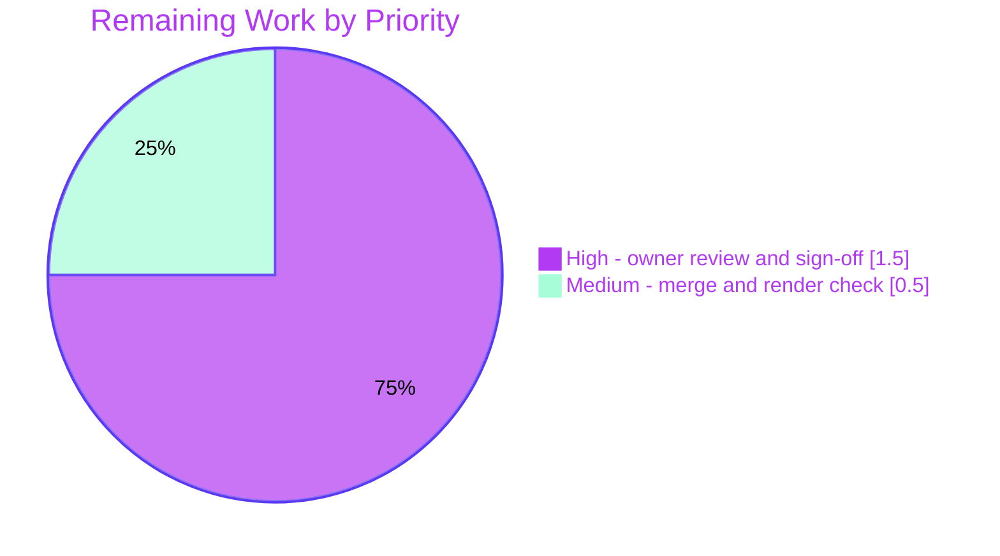

# 1. Executive Summary

## 1.1 Project Overview

hao-backprop-test is a 14-line Node.js HTTP server (`server.js`) that answers ordinary requests on `127.0.0.1:3000` with `Hello, World!`. The goal was to document the whole codebase simply, completely and quickly. That meant Spanish `//` comments above every statement of `server.js`, and six Spanish sections added to `README.md`: description, prerequisites, running, usage, a code table and limitations. The readers are developers who read the source or who run, call, stop and troubleshoot the server. Runtime behaviour had to stay unchanged, and new files and tooling were out of scope.

## 1.2 Completion Status

**10 hours completed out of 12 total hours = 83.3% complete.** All 15 AAP deliverables are done. The remaining 2 hours are owner review and merge.


```mermaid
%%{init: {"theme": "base", "themeVariables": {"pie1": "#5B39F3", "pie2": "#FFFFFF", "pieStrokeColor": "#B23AF2", "pieOuterStrokeColor": "#B23AF2", "pieSectionTextColor": "#B23AF2", "pieTitleTextColor": "#B23AF2", "pieLegendTextColor": "#B23AF2"}}}%%
pie showData title 83.3% Complete
    "Completed Work" : 10
    "Remaining Work" : 2
```

| Metric | Value |
|---|---|
| Total Hours | 12 |
| Completed Hours (AI + Manual) | 10 (10 AI + 0 manual) |
| Remaining Hours | 2 |
| Percent Complete | 83.3% |

## 1.3 Key Accomplishments

- ✅ All 9 statements in `server.js` have a Spanish comment directly above them, and the file opens with a 5-line header.
- ✅ The executable lines of `server.js` are byte-identical to baseline `1484182`, and runtime behaviour matches the baseline exactly.
- ✅ `README.md` keeps its original two lines and adds six Spanish sections. Each section ends with its `Fuente:` line.
- ✅ In the 9-row `Código | Qué hace` table, each row quotes its statement exactly and matches that statement's comment.
- ✅ Every published command reproduces its documented output on a live server, including in the browser.
- ✅ "Node.js 22 o superior" was confirmed on v22.0.0, v22.23.3, v24.21.0 and v26.10.0.
- ✅ There are no placeholders, and no files other than `README.md` and `server.js` changed.

## 1.4 Critical Unresolved Issues

**0 of 15 AAP deliverables are open.** Two release steps remain. Both are owner actions, not defects.

| Issue | Impact | Owner | ETA |
|---|---|---|---|
| Three wording choices depart from the literal prose of AAP 0.5.3 and need owner sign-off (Section 5.2) | The merge should wait for acceptance. Runtime is unaffected | Repository owner | 1.5 h |
| The README has not been viewed as rendered on GitHub, and the branch is not yet merged into `02-Sep-26-Br1` | Unconfirmed how the table, fenced blocks and relative link render | Repository owner | 0.5 h |

## 1.5 Access Issues

No access issues identified. The nodejs.org release downloads were reachable and passed their checksums. The `origin` remote was also reachable, and the branch is there at `fcf4f2e`.

## 1.6 Recommended Next Steps

1. [High] Review the Spanish text, then accept or amend the three divergences in Section 5.2.
2. [Medium] Merge `blitzy-102428d6-2955-46d0-89ca-bf405e779947` into `02-Sep-26-Br1`, then check the README as rendered on GitHub.
3. [Low] After any future edit to `server.js`, re-run Section 9.4 so the comments, table and prose stay in sync.
4. [Low] Keep the server as a test fixture. The README's `## Limitaciones` section explains why it is not production-ready.

# 2. Project Hours Breakdown

## 2.1 Completed Work Detail

| Component | Hours | Description |
|---|---|---|
| Code and runtime-behaviour analysis | 1.0 | Inventoried the 9 documentable statements. Established facts not visible in the code: HEAD gets no body, a busy port exits with code 1, SIGINT exits with 130, and the server listens on IPv4 loopback only (AAP 0.2.2) |
| `server.js` inline comments | 1.5 | 5-line Spanish header and one blank line, then a comment directly above each of the 9 statements, indented to match. Executable lines untouched (`server.js:1-30`) |
| README guide sections | 2.0 | `## Descripción`, `## Requisitos`, `## Ejecución` and `## Uso`: prerequisites, start and stop, GET, `curl -i`, browser, POST and HEAD examples with exact outputs (`README.md:4-67`) |
| README reference sections | 1.5 | `## Estructura del código` (file list, `[server.js](server.js)` link, 9-row table), `## Limitaciones` (6 bullets), and the six `Fuente:` lines (`README.md:69-99`) |
| Accuracy alignment with Node.js behaviour | 1.5 | Limited request claims to requests Node.js hands to the function, described the per-second `Date` header, and kept the comments and table rows identical in both files |
| Verification | 2.5 | AAP 0.9.2 steps 0–10, every published example run against a live server, parity with the baseline, browser check, and a runtime matrix across Node.js 22, 24 and 26 |
| **Total** | **10.0** | Matches Completed Hours in Section 1.2 |

## 2.2 Remaining Work Detail

| Category | Hours | Priority |
|---|---|---|
| Owner review of the Spanish documentation and sign-off on the divergences in Section 5.2 | 1.5 | High |
| Merge into `02-Sep-26-Br1` and check the README as rendered on GitHub | 0.5 | Medium |
| **Total** | **2.0** | Matches Remaining Hours in Section 1.2 |

## 2.3 Completion Calculation

Completed 10 h / (10 h completed + 2 h remaining) × 100 = **83.3%**. Every AAP deliverable is complete. The remaining hours are path-to-production steps only an owner can take. The estimate has high confidence, because the scope is fixed at two files that were verified end to end.

# 3. Test Results

The repository has no automated test suite, no `package.json`, and no coverage tooling. Verification uses the AAP 0.9.2 sequence of shell checks, comparisons of content between the two files, and probes against a live server. Every figure below is from an executed run on Node.js v22.23.3, with each server in its own private network namespace.

| Area / Category | Framework | Tests | Passed | Failed | Coverage | What This Proves |
|---|---|---|---|---|---|---|
| Whole-package gate (AAP 0.9.2 steps 0–10 plus the `::1` check) | Bash, `diff`, `awk`, `curl`; Node.js v22.23.3 freshly downloaded and checksum-verified | 21 | 21 | 0 | All 11 AAP steps | The published verification sequence passes end to end on a clean runtime |
| Code table and comment seams | Bash / `awk` comparison script | 18 | 18 | 0 | 9/9 table rows, 9/9 comments | Each table cell quotes its statement exactly. Each explanation equals the comment above that statement |
| README and comment format rules | Bash / `grep` script | 12 | 12 | 0 | 6/6 `Fuente:` lines | Header shape, exact `Fuente:` wording, the relative link and a single 9-row table are all correct. There are no line numbers, LTS labels, JSDoc or untraced examples |
| HTTP contract | `curl` against a live server | 16 | 16 | 0 | GET, POST, PUT, DELETE, HEAD, special headers, `::1` | Ordinary requests get exactly `Hello, World!\n`, `200` and `text/plain`, and HEAD has no body. Node.js itself answers `Expect: unsupported` (417) and a 20 KB header (431). `Date` repeats within one second, and `::1` is refused |
| Process lifecycle and output streams | Bash, signals, `wc`, `grep` | 5 | 5 | 0 | Start, busy port, SIGINT, SIGTERM | The only output is the 41-byte startup line on stdout, with 0 bytes on stderr. The `PORT`/`HOST` variables and `--port` are ignored. A busy port gives the exact `EADDRINUSE` line and exit code 1. Exit codes are 130 for SIGINT and 143 for SIGTERM |
| Baseline parity against `1484182` | `diff -r` / `cmp` on captured runs | 3 | 3 | 0 | 13 HTTP captures, 7 stream and exit captures, bind-error stderr | The comments changed no observable runtime behaviour |
| Node.js version matrix | Checksum-verified downloads, 7-capture probe per version | 3 | 3 | 0 | v22.0.0, v22.23.3, v24.21.0, v26.10.0 | Results are identical from the oldest 22.x through the newest 26.x, which backs "Node.js 22 o superior" |
| Browser view | Headless Chrome | 2 | 2 | 0 | `/`, `/cualquier/ruta?q=1` | The page shows `Hello, World!` with 200 and `text/plain`, and the console logs nothing |

**Not Covered**

- **The README as rendered on GitHub.** The Markdown was checked only as text. Before merging, preview it on GitHub and check the table, the `console.log` cell in double backticks, the `bash`/`text` fenced blocks, the accented characters, and the `[server.js](server.js)` link.
- **Other platforms.** The README commands were run only on Linux. In Windows PowerShell, `curl` may resolve to an alias whose output differs. Try one GET on the platforms your readers use.
- **Other Node.js releases.** Patch releases other than the four listed, and future major lines, were not run.
- **Protection against drift.** Nothing in the repository re-runs these checks automatically. A future edit to `server.js` can leave the comments, the table or the prose stale unless Section 9.4 is re-run.

# 4. Runtime Validation & UI Verification

Each flow below was run against the committed `server.js` (`fcf4f2e`) on Node.js v22.23.3, in the order a reader of the README would follow.

- ✅ **Start-up.** `node server.js` prints `Server running at http://127.0.0.1:3000/` and stays in the foreground. No other output appears on stdout, and nothing appears on stderr.
- ✅ **GET `/`.** `curl http://127.0.0.1:3000/` prints exactly `Hello, World!` (14 bytes). `curl -i` shows `200 OK` plus the `Content-Type`, `Content-Length`, `Date`, `Connection` and `Keep-Alive` headers the README names.
- ✅ **POST on any path.** `curl -X POST http://127.0.0.1:3000/cualquier/ruta` and a form POST to `/any/path?q=1` return the same reply. `Accept: application/json` still gets `text/plain`.
- ✅ **HEAD.** `curl -I` returns `200` and `Content-Type: text/plain`, with no `Content-Length` and 0 body bytes.
- ✅ **Node.js special cases (`README.md:95`).** `Expect: unsupported` gets `417` with no `Content-Type`, and a 20 KB header gets `431`. Node.js answers both without calling the handler.
- ✅ **Browser.** Headless Chrome shows `Hello, World!` at `/` and at `/cualquier/ruta?q=1`, with status 200 and `text/plain`. The console logged nothing, and no request returned a status of 400 or higher.
- ✅ **Loopback and fixed settings.** `http://[::1]:3000/` is refused. The `PORT` and `HOST` environment variables and a `--port` argument are ignored. A copy with the `port` constant edited starts on `3001`.
- ✅ **Busy port.** A second instance writes `Error: listen EADDRINUSE: address already in use 127.0.0.1:3000` to stderr and exits with code 1. The first instance keeps running.
- ✅ **Stop.** SIGINT (Ctrl+C) ends the process with status 130, after which the port refuses connections. SIGTERM gives status 143.
- ✅ **Continuity and runtimes.** Responses, output streams and exit codes are identical to baseline `1484182`. Results are also identical on Node.js v22.0.0, v22.23.3, v24.21.0 and v26.10.0.

**Never exercised at runtime:**
- The README's rendered view on GitHub.
- Any platform other than Linux.

The project has no authentication, database or external integrations, so none were tested.

# 5. Compliance & Quality Review

## 5.1 Compliance Matrix

| # | AAP Deliverable | Quality Benchmark | Status | Progress | Evidence |
|---|---|---|---|---|---|
| 1 | `server.js` header block (AAP 0.4.1, 0.5.3) | Complete, accurate documentation | ✅ PASS | 100% | `server.js:1-6`: 5 comment lines (project, `http`, run command, URL, GET/POST/HEAD) followed by one blank line |
| 2 | A comment above each statement (AAP 0.5.3, 0.7.1) | Full coverage | ✅ PASS | 9/9 | `server.js:7-30`. The adjacency check prints nothing |
| 3 | Runtime unchanged (AAP 0.8.3) | No behavioural regression | ✅ PASS | 100% | The diff of executable lines against `1484182` is empty, and every capture matches the baseline |
| 4 | Original README lines kept, trailing newline added (AAP 0.5.1) | Preserve existing content | ✅ PASS | 100% | `README.md:1-2` match the baseline. Both files end with LF |
| 5 | `## Descripción`, `## Requisitos`, `## Ejecución` (AAP 0.5.3) | Accurate user guidance | ✅ PASS | 3/3 | `README.md:4-35`. The startup output block matches real output |
| 6 | `## Uso` examples (AAP 0.5.3, 0.7.4) | Examples executed | ✅ PASS | 5/5 | GET, `curl -i`, browser, POST and HEAD all reproduced (`README.md:37-67`) |
| 7 | `## Estructura del código` table and link (AAP 0.5.3, 0.5.5) | Source fidelity | ✅ PASS | 9/9 | `README.md:69-88`. Each cell matches the source, and each row matches its comment |
| 8 | `## Limitaciones` (AAP 0.5.3, 0.7.2) | Troubleshooting stated | ✅ PASS | 100% | `README.md:90-99`, including the exact `EADDRINUSE` text and exit code 1 |
| 9 | `Fuente:` lines (AAP 0.4.2) | Traceable claims | ✅ PASS | 6/6 | `README.md:8,17,35,67,88,99` match the AAP wording byte for byte |
| 10 | Language and format (AAP 0.3.2, 0.4.1–0.4.2) | Simple, consistent style | ✅ PASS | 100% | Spanish prose, with literals kept verbatim. Own-line `//` comments only. No JSDoc, line numbers or LTS labels |
| 11 | "Finalizado" (AAP 0.7.2) | Zero-placeholder policy | ✅ PASS | 100% | No TODO, TBD, FIXME, placeholder, "pendiente" or empty section |
| 12 | Scope bound and verification (AAP 0.8, 0.9.2) | Minimal change, verified | ✅ PASS | 100% | Only 2 files modified (+115/−1). The gate passes 21/21 |

## 5.2 AAP & Rule Divergences and Gaps

No user rules were supplied, so every row below departs from the AAP's own prose rather than from a rule. In each case the AAP's accuracy requirements took precedence over that prose: AAP 0.7.3 requires every documented behaviour to match the code, and the AAP 0.9.2 content review forbids any comment that contradicts observed behaviour.

| What the AAP/Rule Required | What Was Delivered Instead | Why It Diverged | Impact | Remediation |
|---|---|---|---|---|
| AAP 0.5.3: the `createServer` function "runs on every request"; GET, POST and HEAD requests always receive the fixed reply; the handler "ignores method, path, headers and body" | Claims are limited to "normales" requests (`server.js:4-5`; `README.md:6,61,94`) and to "cada petición que Node.js le entrega" (`server.js:15`; `README.md:79`) | Node.js answers some requests itself without calling the function, so the unconditional wording would be false | None on runtime. The text is more precise, and slightly longer | Owner accepts. No code change needed |
| AAP 0.5.3: `## Limitaciones` lists five bullets | A sixth bullet: "Node.js resuelve por su cuenta algunos casos especiales, sin llamar a esa función." (`README.md:95`) | It discloses the exception above, and it is the target of "(véase «Limitaciones»)" in `README.md:6` | Readers learn that exceptions exist, but not which ones | Accept as is, add a concrete example, or remove the bullet together with its pointer |
| AAP 0.5.3: "`Date` changes on every request" | "su valor puede cambiar de una petición a otra, pero las peticiones hechas en el mismo segundo pueden llevar el mismo valor" (`README.md:51`) | Node.js generates `Date` once per second, so the AAP statement is false | None. The statement matches observed behaviour | None required |

**Request-dispatch wording.** The AAP asked the comments and README to say that the function handles every request. In fact, Node.js intercepts some requests before the handler runs. Two cases were verified at runtime: an HTTP/1.1 request with `Expect: unsupported` receives `417 Expectation Failed` with no `Content-Type`, and a request with a 20 KB header receives `431`. Neither response comes from `server.js`. The comments and README therefore say "normales" and "cada petición que Node.js le entrega" (`server.js:4-5,15`; `README.md:6,55,61,79,94`). That keeps every demonstrated example true and avoids a false universal claim. The comment and its table row still match word for word. The owner only needs to accept the wording.

**Sixth `## Limitaciones` bullet.** Qualifying requests as "normales" needed a place that names the exception, and the `## Descripción` pointer "(véase «Limitaciones»)" leads to `README.md:95`. The bullet is deliberately generic. A concrete `417` example was left out because it traces neither to a literal in `server.js` nor to the observations recorded in the AAP (AAP 0.4.2 traceability). The owner can choose one of three options:
- Keep the bullet as it is.
- Add the `Expect` → `417` example. It is verified at runtime, but it depends on Node.js rather than on this code.
- Delete the bullet, and edit `README.md:6` so that the pointer does not dangle.

**`Date` header wording.** The AAP's own wording said that `Date` changes on every request. Node.js v22 caches the formatted date for up to one second. Five requests sent within one second all carried `Date: Sun, 27 Sep 2026 17:17:16 GMT`, and a request two seconds later carried a new value. `README.md:51` therefore says the value can change between requests but may repeat within the same second. It still names `curl -i` as the way to see the header, and it still shows no fixed output block, as the AAP intended. No action is required, and restoring the AAP wording would make the README inaccurate.

# 6. Risk Assessment

| Risk | Category | Severity | Probability | Mitigation | Status |
|---|---|---|---|---|---|
| Documentation drift. Host, port, body, log line and each comment's text are repeated in the comment, the table row and the README prose. No automated check in the repository keeps them in sync | Technical | Medium | Medium | After any change to `server.js`, run the checks in Section 9.4. Edit a comment and its table row together | Open |
| No HTTPS or authentication. Only the loopback binding (`hostname`) keeps the server off the network. Following the README's advice to edit the constants (for example to `0.0.0.0`) exposes it | Security | Medium | Low | Keep `127.0.0.1`. `## Limitaciones` states the server is not suitable for production | Accepted (documented) |
| The process crashes on a busy port because there is no `'error'` listener, and it has no graceful shutdown. Open connections drop on SIGINT | Operational | Medium | Low | Documented in `## Limitaciones` with a remedy. Fixing it is a code change, outside this documentation-only scope | Accepted (documented) |
| "Node.js 22 o superior" is proven only on v22.0.0, v22.23.3, v24.21.0 and v26.10.0. A future major release could change `http` defaults such as headers or keep-alive | Technical | Low | Low | Re-run the Section 9.4 runtime checks when adopting a new Node.js major version | Monitor |
| `Content-Type: text/plain` has no charset, so browsers guess the encoding (Chrome falls back to windows-1252) | Integration | Low | Low | The ASCII body displays correctly. It would only matter if the body gained non-ASCII text | Accepted |
| The GitHub-rendered README has not been viewed. That covers the double-backtick `console.log` cell, the accented headings and the relative link | Integration | Low | Low | Preview on GitHub as part of the merge (Section 2.2) | Open |

# 7. Visual Project Status


```mermaid
%%{init: {"theme": "base", "themeVariables": {"pie1": "#5B39F3", "pie2": "#FFFFFF", "pieStrokeColor": "#B23AF2", "pieOuterStrokeColor": "#B23AF2", "pieSectionTextColor": "#B23AF2", "pieTitleTextColor": "#B23AF2", "pieLegendTextColor": "#B23AF2"}}}%%
pie showData title Project Hours Breakdown
    "Completed Work" : 10
    "Remaining Work" : 2
```

**Remaining hours by priority (2 h total, from Section 2.2)**


```mermaid
%%{init: {"theme": "base", "themeVariables": {"pie1": "#B23AF2", "pie2": "#A8FDD9", "pieStrokeColor": "#5B39F3", "pieOuterStrokeColor": "#5B39F3", "pieSectionTextColor": "#000000", "pieTitleTextColor": "#B23AF2", "pieLegendTextColor": "#B23AF2"}}}%%
pie showData title Remaining Work by Priority
    "High - owner review and sign-off" : 1.5
    "Medium - merge and render check" : 0.5
```

| Priority | Hours | Share of Remaining |
|---|---|---|
| High | 1.5 | 75% |
| Medium | 0.5 | 25% |
| Low | 0 | 0% |
| **Total** | **2.0** | 100% |

# 8. Summary & Recommendations

The project is **83.3% complete**: 10 of 12 hours are done, and all 15 AAP deliverables are complete. `server.js` now explains every one of its 9 statements in Spanish, under a 5-line header, and its executable lines are byte-identical to baseline `1484182`. `README.md` keeps its original title and sentence and adds six Spanish sections. Together they tell a reader what the server is, what it needs, how to start, call and stop it, what each statement does, and where it stops being suitable. Only these two files changed (+115/−1 lines), and neither contains a placeholder.

Verification was done end to end rather than by inspection alone. The full AAP 0.9.2 sequence passes 21/21 on a freshly downloaded Node.js v22.23.3. Every published command reproduces its documented output on a live server. Each of the 9 table rows quotes its statement exactly and repeats the comment above it. Responses, output streams and exit codes are identical to the uncommented baseline. The prerequisite "Node.js 22 o superior" holds from v22.0.0 through v26.10.0, and a headless browser shows the documented page.

Three wording choices depart from the AAP's literal prose: requests are qualified as "normales", `## Limitaciones` gains a sixth bullet on the special cases Node.js handles itself, and the `Date` header is described as changing at most once per second. Each was made because the literal AAP wording would be false against Node.js, and each is confirmed at runtime (Section 5.2). None affects behaviour, but the owner should accept them explicitly before merging.

The critical path to production is short: review the Spanish text and the divergences (1.5 h), then merge into `02-Sep-26-Br1` and check the README as GitHub renders it (0.5 h). Success after the merge means the README renders cleanly on GitHub, and the Section 9.4 checks still pass on the merged branch.

**Readiness:** the documentation is ready to merge once the owner signs off. The server itself remains a test fixture: no HTTPS, authentication, error listener or graceful shutdown. The README says so plainly, and changing that was outside this scope. To keep the documentation accurate, re-run Section 9.4 after any change to `server.js`, and update each comment and its table row together.

# 9. Development Guide

## 9.1 System Prerequisites

- Node.js 22 or newer. Verified on v22.0.0, v22.23.3, v24.21.0 and v26.10.0.
- `curl`, or a web browser on the same machine.
- `git`, `bash`, `diff` and `awk`, for the checks in Section 9.4.
- TCP port `3000` free on `127.0.0.1`.
- Linux or any Unix-like shell. The commands were verified on Linux x86_64.
- There is no `package.json`, lockfile or install step.

## 9.2 Environment Setup

```bash
git clone https://github.com/ajitblitzy/Ajit_GH_Repo-12-Mar-26.git
cd Ajit_GH_Repo-12-Mar-26
git checkout blitzy-102428d6-2955-46d0-89ca-bf405e779947
node --version          # expect v22.x or newer
```

Optional: provision an isolated, checksum-verified Node.js v22.23.3 outside the checkout, as the AAP does (x86_64 Linux).

```bash
NODE_VER=v22.23.3; NODE_DIR=$(mktemp -d)
( cd "$NODE_DIR" \
  && curl -fsSLO "https://nodejs.org/dist/$NODE_VER/node-$NODE_VER-linux-x64.tar.xz" \
  && curl -fsSLO "https://nodejs.org/dist/$NODE_VER/SHASUMS256.txt" \
  && sha256sum -c --ignore-missing SHASUMS256.txt \
  && tar -xJf "node-$NODE_VER-linux-x64.tar.xz" )
export PATH="$NODE_DIR/node-$NODE_VER-linux-x64/bin:$PATH"; hash -r
node --version          # expect v22.23.3
```

No environment variables, secrets or services are needed.

## 9.3 Application Startup

Run from the repository root:

```bash
node server.js
```

Expected output:

```text
Server running at http://127.0.0.1:3000/
```

The process stays in the foreground. Press Ctrl+C to stop it; the exit status is 130. To run it in the background, with its log kept outside the checkout:

```bash
LOG=$(mktemp); node server.js > "$LOG" 2>&1 & PID=$!
sleep 1; cat "$LOG"          # Server running at http://127.0.0.1:3000/
kill -INT "$PID"; wait "$PID"; echo "exit=$?"   # exit=130
```

## 9.4 Verification Steps

Run from the repository root after any change to `server.js` or `README.md`. Step 2 holds only while `server.js` changes are limited to comments. After an intentional code change, compare against the new baseline instead.

```bash
# 1. Syntax
node --check server.js && echo SYNTAX_OK

# 2. Executable lines unchanged vs baseline 1484182 (expect EXEC_UNCHANGED)
diff <(git show 1484182:server.js | grep -vE '^[[:space:]]*$') \
     <(grep -vE '^[[:space:]]*(//.*)?$' server.js) && echo EXEC_UNCHANGED

# 3. Every statement has a comment directly above it (expect no output)
awk 'prev !~ /^[[:space:]]*\/\// && $0 !~ /^[[:space:]]*(\/\/.*)?$/ && $0 !~ /^[[:space:]]*\}\);$/ {print NR": "$0} {prev=$0}' server.js

# 4. README structure: six headings in order, six Fuente lines
grep -nE '^## (Descripción|Requisitos|Ejecución|Uso|Estructura del código|Limitaciones)$' README.md
grep -c '^Fuente: ' README.md                                   # expect 6

# 5. No unfinished markers (expect no output)
grep -nE 'TODO|TBD|FIXME' README.md server.js; grep -niE 'placeholder|pendiente|por completar' README.md server.js

# 6. Only the two documented files differ from baseline
git diff --name-only 1484182                                    # expect README.md, server.js
```

Then, with the server running (Section 9.3), check the runtime claims:

```bash
curl -s -o /dev/null -w '%{http_code} %{content_type}\n' http://127.0.0.1:3000/   # 200 text/plain
node server.js; echo "exit=$?"     # second instance: EADDRINUSE line on stderr, exit=1
```

## 9.5 Example Usage

```bash
curl http://127.0.0.1:3000/                              # Hello, World!
curl -i http://127.0.0.1:3000/                           # HTTP/1.1 200 OK, Content-Type: text/plain, Content-Length: 14, Date, Connection, Keep-Alive
curl -X POST http://127.0.0.1:3000/cualquier/ruta        # Hello, World!
curl -I http://127.0.0.1:3000/                           # 200 and Content-Type, no body, no Content-Length
```

In a browser, `http://127.0.0.1:3000/` shows `Hello, World!`.

To use another port, edit the constant; there are no flags or environment variables. For example, to try it on a copy without touching the checkout:

```bash
D=$(mktemp -d); sed 's/^const port = 3000;$/const port = 3001;/' server.js > "$D/server.js"
node "$D/server.js"                                      # Server running at http://127.0.0.1:3001/
```

## 9.6 Troubleshooting

| Symptom | Cause | Resolution |
|---|---|---|
| `Error: listen EADDRINUSE: address already in use 127.0.0.1:3000`, exit 1 | Another process holds port 3000. The server has no `'error'` listener | Find the holder with `lsof -ti tcp:3000 -sTCP:LISTEN`, stop it, and run `node server.js` again |
| `curl: (7) Failed to connect` on `http://[::1]:3000/` or a LAN address | The server binds to IPv4 loopback only | Use `http://127.0.0.1:3000/` from the same machine |
| `PORT=4000 node server.js` still listens on 3000 | Host and port are hard-coded | Edit `hostname` or `port` in `server.js` |
| A progress meter appears around `Hello, World!` | `curl` prints its meter to stderr when stdout is redirected | Add `-s`, or run it in an interactive terminal |
| Open connections drop when the server stops | There is no graceful shutdown | This is expected. It is documented in `## Limitaciones` |
| `node: command not found`, or a version below 22 | Node.js is missing or too old | Install Node.js 22 or newer, or use the isolated runtime in Section 9.2 |

# 10. Appendices

## A. Command Reference

| Purpose | Command |
|---|---|
| Start the server | `node server.js` |
| Stop the server | Ctrl+C, or `kill -INT <pid>` (exit 130) |
| GET the reply | `curl http://127.0.0.1:3000/` |
| Show status and headers | `curl -i http://127.0.0.1:3000/` |
| POST to another path | `curl -X POST http://127.0.0.1:3000/cualquier/ruta` |
| HEAD request | `curl -I http://127.0.0.1:3000/` |
| Syntax check | `node --check server.js` |
| Executable lines unchanged | `diff <(git show 1484182:server.js \| grep -vE '^[[:space:]]*$') <(grep -vE '^[[:space:]]*(//.*)?$' server.js)` |
| README headings / `Fuente:` count | `grep -nE '^## ' README.md` / `grep -c '^Fuente: ' README.md` |
| Find what holds port 3000 | `lsof -ti tcp:3000 -sTCP:LISTEN` |

## B. Port Reference

| Port | Address | Protocol | Purpose | Configurable |
|---|---|---|---|---|
| 3000 | `127.0.0.1` (IPv4 loopback only) | HTTP/1.1 | The only endpoint; every ordinary request gets `Hello, World!` | Only by editing `port` / `hostname` in `server.js` |

## C. Key File Locations

| Path | Contents |
|---|---|
| `server.js` | The whole application: a header comment at lines 1–5, then one comment above each of the 9 statements |
| `README.md` | Original lines 1–2, then `## Descripción`, `## Requisitos`, `## Ejecución`, `## Uso`, `## Estructura del código`, `## Limitaciones` |
| Commit `1484182` | Undocumented baseline. The executable-line comparison runs against it |
| Commits `3ab71bc`, `ab56a7d` | Inline comments in `server.js`; README sections |
| Commits `0c70a44`, `fcf4f2e` | Wording for request dispatch and the `Date` header, in both files |

## D. Technology Versions

| Technology | Version | Role |
|---|---|---|
| Node.js | 22 or newer; verified on v22.0.0, v22.23.3, v24.21.0, v26.10.0 | Runtime |
| Node.js `http` module | Built-in | The only dependency |
| JavaScript | CommonJS, ES2015 syntax | Source language |
| Markdown | GitHub-flavoured | README format |

## E. Environment Variable Reference

The server reads no environment variables, command-line arguments or configuration files. Setting `PORT` or `HOST`, or passing `--port`, was shown to have no effect: the server still listens on `127.0.0.1:3000`. To change the address or the port, edit `hostname` or `port` in `server.js`.

## F. Developer Tools Guide

- **No build, lint or test tooling** is configured. The shell checks in Section 9.4 are the verification suite.
- **Editing a comment:** change the `//` line and the matching `Qué hace` cell in `## Estructura del código` together, then run Section 9.4 steps 2–4.
- **Editing code:** update the comment above the statement, the table cell (which quotes the statement exactly), and any README prose that repeats a literal (host, port, body, startup line).

## G. Glossary

| Term | Meaning |
|---|---|
| Loopback (`127.0.0.1`) | IPv4 address reachable only from the same machine |
| `EADDRINUSE` | Node.js error raised when the port is already bound; with no `'error'` listener the process exits with code 1 |
| HEAD | HTTP method that returns status and headers only; Node.js drops the body |
| `Fuente:` line | The closing line of each README section, naming `server.js` and the identifiers the section draws on |
| Petición normal | An ordinary request that Node.js passes to the handler, as opposed to the special cases Node.js answers itself (for example `417` or `431`) |
