# Technical Specification

# 1. Introduction

## 1.1 Executive Summary

The **`hao-backprop-test`** repository is a deliberately minimal Node.js project that implements a single, self-contained HTTP service. The entire codebase comprises exactly two files: `server.js`, the sole executable entry point, and `README.md`, a two-line description of intent. `server.js` constructs an HTTP server using only the Node.js built-in `http` module — there are no third-party dependencies, no package manifest, no build step, and no application framework.

**Project overview.** When executed with Node.js, the service binds to the loopback address `127.0.0.1` on TCP port `3000` and answers every incoming request — regardless of HTTP method, URL path, request headers, or body — with an identical reply: status code `200`, a `Content-Type: text/plain` header, and the response body `Hello, World!\n`. On a successful bind it writes a single line, `Server running at http://127.0.0.1:3000/`, to standard output. This is the canonical "Hello, World!" HTTP server pattern reproduced without embellishment; `server.js` contains no routing, middleware, persistence, authentication, or explicit error handling.

**Core business problem.** According to `README.md`, the repository exists as a *"test project for backprop integration."* The artifact therefore addresses a narrow, well-bounded engineering need: to provide a small, predictable, dependency-free HTTP endpoint that can act as a controlled fixture or smoke-test target while some external integration effort (referred to only as "backprop") is exercised. It is important to state plainly that the repository itself contains **no** backpropagation, machine-learning, or integration logic of any kind — its function is to be a stable, trivially reproducible service that other tooling can start, reach, and validate against.

**Key stakeholders and users.** The repository defines no user roles, accounts, or access tiers in code. The stakeholders below are drawn from the stated purpose in `README.md` and the observable behavior of `server.js`; where a role is not explicitly named in the repository it is marked as inferred.

| Stakeholder / User | Relationship to the System |
|---|---|
| Repository author / maintainer | Owns the single-file service and its declared intent as a "test project for backprop integration" (`README.md`). |
| Integrating developer or automated "backprop" process (inferred) | Uses the endpoint at `http://127.0.0.1:3000/` as a target for integration or smoke testing, consistent with the README's stated purpose. |
| Local operator (inferred) | Launches the process via a Node.js runtime and confirms readiness from the `Server running at ...` startup log emitted by `server.js`. |

**Expected business impact and value proposition.** The repository states no financial goals, adoption targets, or business metrics, so impact is described strictly in engineering terms grounded in the code. The value of the artifact derives from its extreme simplicity: because `server.js` depends only on the Node.js standard library, it carries no third-party supply-chain surface, no dependency version drift, and no build tooling, which makes it fast to run and highly reproducible. Because it returns one deterministic response to all requests, its behavior is trivial to assert against, making it a low-risk, low-maintenance fixture for validating that an external integration can start, connect to, and receive a well-formed HTTP response from a known-good service.

## 1.2 System Overview

This section situates the `hao-backprop-test` repository within its context, describes its capabilities and components at a high level, and states the success criteria that can be substantiated from the code. Because the repository is intentionally minimal — two files and no configuration — the overview below reflects a small, single-purpose HTTP service rather than a multi-component enterprise system.

### 1.2.1 Project Context

**Business context and market positioning.** The repository is not a market-facing product and does not describe any commercial positioning. `README.md` identifies it as a *"test project for backprop integration,"* which frames it as an internal engineering fixture — a disposable, known-good service used to exercise or validate an external integration rather than to deliver end-user functionality. There is no product literature, licensing statement, pricing, or roadmap in the repository.

**Current system limitations / prior system.** This is not an upgrade or replacement of a pre-existing system. The version history contains a single commit ("Add files via upload") with no migration, deprecation, or refactoring lineage, and there is no legacy module, compatibility shim, or configuration indicating a system being superseded. Consequently, there are no carried-over limitations to document; the "limitations" of the current artifact are simply the boundaries of a minimal example (single fixed response, loopback-only binding, no error handling), which are detailed in Section 1.3.2.

**Integration with the existing enterprise landscape.** The service exposes exactly one integration surface: an HTTP listener on `127.0.0.1:3000`. Because it binds to the loopback interface, it is reachable only from processes on the same host and is not exposed to a broader network by default. The code contains no outbound integrations — no database clients, message brokers, external HTTP calls, environment-variable configuration, authentication, or service-discovery hooks. The README names "backprop" as the intended integrating counterpart, but the repository ships no client library, SDK, credentials, or configuration for it; the integration is expected to occur externally by issuing HTTP requests to the local endpoint.

### 1.2.2 High-Level Description

**Primary system capabilities.** The service provides three observable capabilities, all implemented in `server.js`:

| Capability | Behavior (from `server.js`) |
|---|---|
| HTTP listener | Binds an HTTP server to `127.0.0.1` on port `3000` via `server.listen(...)`. |
| Uniform request handling | Responds to every request — any method, path, header, or body — with HTTP `200`, `Content-Type: text/plain`, and body `Hello, World!\n`. |
| Startup signaling | Logs `Server running at http://127.0.0.1:3000/` to stdout once binding succeeds. |

**Major system components.** The system has a single application component supported by the Node.js runtime:

| Component | Role |
|---|---|
| `server.js` | The entire application: creates the server, defines the inline request handler, and starts listening. |
| Node.js built-in `http` module | The only runtime dependency; provides `http.createServer` and the server/`listen` machinery. |
| `README.md` | Human-facing documentation stating the project's name and purpose. |

**Core technical approach.** `server.js` is a CommonJS script that imports the standard-library `http` module, declares fixed module-scope constants for `hostname` (`127.0.0.1`) and `port` (`3000`), creates a server with an inline callback handler, and starts it with a `listen` callback that logs readiness. The design is synchronous in its setup, stateless across requests, and free of any persistence, branching, or asynchronous I/O beyond the HTTP server's own event loop. The request/response flow is illustrated below.

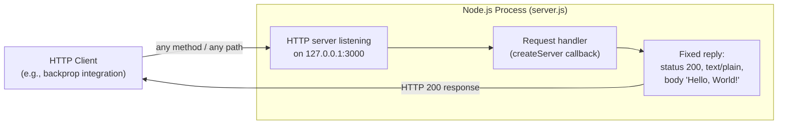
```mermaid
flowchart LR
    Client["HTTP Client<br/>(e.g., backprop integration)"]
    subgraph Process["Node.js Process (server.js)"]
        Listener["HTTP server listening<br/>on 127.0.0.1:3000"]
        Handler["Request handler<br/>(createServer callback)"]
        Resp["Fixed reply:<br/>status 200, text/plain,<br/>body 'Hello, World!'"]
    end
    Client -->|"any method / any path"| Listener
    Listener --> Handler
    Handler --> Resp
    Resp -->|"HTTP 200 response"| Client
```

### 1.2.3 Success Criteria

The repository defines **no explicit, measurable objectives, key performance indicators (KPIs), service-level agreements (SLAs), performance budgets, or automated acceptance tests**. There is no test suite, benchmark, monitoring configuration, or metrics instrumentation anywhere in the codebase. To avoid fabricating targets, the criteria below are **derived from the observable behavior of `server.js`** and are presented as functional expectations rather than as stated goals.

**Measurable objectives (derived functional criteria).**

| Derived Criterion | Observable Signal |
|---|---|
| The service starts and binds successfully | Startup line `Server running at http://127.0.0.1:3000/` printed to stdout |
| The endpoint answers every request | An HTTP `200` status is returned for any method and path |
| The response contract is stable | `Content-Type: text/plain` header and body `Hello, World!\n` |
| No install or build is required to run | Executes with a Node.js runtime and standard library only (no `package.json`) |

**Critical success factors.**

| Critical Success Factor | Basis in Repository |
|---|---|
| A Node.js runtime is available to execute the script | `server.js` uses `require('http')` (CommonJS, Node.js standard library) |
| Loopback TCP port `3000` is free on the host | Hardcoded `port = 3000` and `hostname = '127.0.0.1'` |
| The client runs on the same host | Binding to `127.0.0.1` restricts reachability to localhost |

**Key performance indicators (KPIs).** None are defined in the repository. No latency, throughput, availability, or error-rate targets are declared in code or documentation, and there is no instrumentation from which such indicators could be computed.

## 1.3 Scope

This section defines what the `hao-backprop-test` repository does and does not cover. All in-scope items are substantiated by `server.js` and `README.md`; all out-of-scope items are marked as such because they are verifiably absent from the codebase (confirmed by reading both files in full, and by `git ls-files` showing only these two tracked files with no configuration, tests, or additional modules).

### 1.3.1 In-Scope

**Core features and functionalities.** The functional scope is limited to standing up a trivial HTTP endpoint and returning a fixed response.

| Category | In-Scope Element |
|---|---|
| Must-have capability | An HTTP server that binds to `127.0.0.1` on port `3000` |
| Must-have capability | A uniform `200` / `text/plain` / `Hello, World!\n` response to every request |
| Must-have capability | A startup readiness message (`Server running at http://127.0.0.1:3000/`) to stdout |
| Primary user workflow | Start the process → a local client issues any HTTP request → the client receives the fixed response |
| Essential integration | Inbound HTTP over the loopback interface, served by the Node.js built-in `http` module |
| Key technical requirement | A Node.js runtime executing a CommonJS script using only the standard library, with port `3000` available on localhost |

**Implementation boundaries.** The boundaries below describe how far the system reaches; each is a direct consequence of the code.

| Boundary Dimension | Coverage |
|---|---|
| System boundary | A single Node.js process running a single file (`server.js`), listening only on the loopback interface |
| User groups covered | No accounts, roles, or permissions; any HTTP client on the local host is served identically |
| Geographic / market coverage | None — the service is bound to `127.0.0.1` (no external network exposure) and includes no localization or regional logic |
| Data domains included | None — there is no data model, schema, or persistence; the only "data" is the constant response string |

### 1.3.2 Out-of-Scope

The following capabilities are explicitly out of scope because no code implementing them exists in the repository. They are grouped by domain for clarity.

| Domain | Out-of-Scope (absent from the codebase) |
|---|---|
| Routing & request semantics | Multiple endpoints, path/method routing, query/body parsing, and content negotiation — the handler ignores request details |
| Security | TLS/HTTPS, authentication, authorization, CORS, and rate limiting |
| Data & state | Databases, caches, sessions, file or in-memory persistence, and any data model |
| Reliability & operations | Explicit error handling, graceful shutdown, health checks, clustering/scaling, structured logging frameworks, and metrics/monitoring |
| Configuration | Environment variables, config files, or any way to change the hardcoded host and port |
| "Backprop" / ML integration | Any backpropagation, machine-learning, or external-system integration code, SDKs, clients, or credentials |

**Future-phase considerations.** The repository declares no roadmap, milestones, or planned enhancements. `README.md` states only the project's name and purpose, and there is no design document, issue backlog, or TODO indicating future phases. No future work is therefore committed by the codebase.

**Integration points not covered.** All outbound integration is out of scope: the service makes no calls to external services, databases, message brokers, or the "backprop" counterpart itself. The repository provides the *target* endpoint only; the code that would perform the "backprop integration" named in the README lives outside this repository and is not included here.

**Unsupported use cases.** Grounded in the observed implementation, the service does not support: public or production deployment (it binds to loopback only), remote/network access from other hosts, dynamic or content-specific responses (every reply is identical), configurable behavior at runtime, or any stated concurrency, throughput, or availability guarantees.

## 1.4 References

The following repository artifacts were inspected in full and serve as the evidence base for this Introduction section. No external web sources were required, as the project has no third-party dependencies to verify.

**Files examined**

- `server.js` — Established the entire runtime behavior of the system: the Node.js built-in `http` import, the fixed `hostname` (`127.0.0.1`) and `port` (`3000`), the uniform `200` / `text/plain` / `Hello, World!\n` response handler, and the `server.listen` startup log. Basis for Sections 1.1, 1.2.2, 1.2.3, and 1.3.
- `README.md` — Established the project's name (`hao-backprop-test`) and its stated purpose ("test project for backprop integration"). Basis for the purpose, context, and stakeholder framing in Sections 1.1, 1.2.1, and 1.3.

**Folders examined**

- `/` (repository root) — Confirmed the complete file inventory (only `server.js` and `README.md`), the absence of any subfolders, and the absence of package manifests, lockfiles, Dockerfiles, CI/CD configuration, environment files, tests, and `.blitzyignore` files. Basis for the minimality, boundary, and out-of-scope claims throughout Sections 1.2 and 1.3.

# 2. Product Requirements

## 2.1 Feature Catalog

This section decomposes the `hao-backprop-test` service into discrete, independently testable features. Because the repository is intentionally minimal — a single executable (`server.js`, 15 lines) and a two-line `README.md`, with no package manifest, configuration, or tests — the catalog contains exactly **three** features. Each maps one-to-one to an observable capability enumerated in Section 1.2.2 (High-Level Description). No additional features are inferred: capabilities that are verifiably absent from the codebase — routing, authentication/authorization, TLS, persistence, and any backpropagation/machine-learning integration — are documented as out-of-scope in Section 1.3.2 and are deliberately excluded here.

**Feature summary**

| Feature ID | Feature Name | Category | Priority |
|---|---|---|---|
| F-001 | HTTP Server Listener | Runtime & Networking | Critical |
| F-002 | Uniform HTTP Response Handler | Request Handling | Critical |
| F-003 | Startup Readiness Logging | Observability | Medium |

All three features are implemented and committed in the repository's single commit (`1484182`, "Add files via upload"); they therefore carry a **Status of `Completed`** and a baseline **version of 1.0**. Every feature lives in the same source file (`server.js`) and shares a single runtime dependency — the Node.js built-in `http` module.

### 2.1.1 F-001: HTTP Server Listener

**Feature Metadata**

| Attribute | Value |
|---|---|
| Unique ID | F-001 |
| Feature Name | HTTP Server Listener |
| Feature Category | Runtime & Networking |
| Priority Level | Critical |
| Status | Completed |
| Version | 1.0 (baseline, commit `1484182`) |

**Description**

| Aspect | Detail |
|---|---|
| Overview | Instantiates an HTTP server with the Node.js built-in `http` module and binds it to the loopback address `127.0.0.1` on TCP port `3000` (`server.js` lines 6 and 12). |
| Business Value | Provides the stable, dependency-free network endpoint that the intended "backprop integration" effort connects to as a controlled smoke-test target (per `README.md` and Section 1.1). |
| User Benefits | An integrating developer or automated process gains a known-good endpoint at `http://127.0.0.1:3000/`; a local operator can launch it with only a Node.js runtime — no install or build step. |
| Technical Context | CommonJS script: `const http = require('http')` (line 1); fixed constants `hostname = '127.0.0.1'` (line 3) and `port = 3000` (line 4); server created via `http.createServer(...)` (line 6) and started via `server.listen(port, hostname, cb)` (line 12). No application framework (no Express/Fastify). |

**Dependencies**

| Dependency Type | Detail |
|---|---|
| Prerequisite Features | None — F-001 is the foundational feature on which F-002 and F-003 depend. |
| System Dependencies | A Node.js runtime; the standard-library `http` module (`http.createServer`, `server.listen`). |
| External Dependencies | None — no third-party packages, no `package.json`, no lockfile (confirmed by repository inspection). |
| Integration Requirements | Inbound HTTP over the loopback interface; TCP port `3000` free on `localhost`; the client must run on the same host, because binding to `127.0.0.1` restricts reachability to the local machine (Section 1.3.1). |

### 2.1.2 F-002: Uniform HTTP Response Handler

**Feature Metadata**

| Attribute | Value |
|---|---|
| Unique ID | F-002 |
| Feature Name | Uniform HTTP Response Handler |
| Feature Category | Request Handling |
| Priority Level | Critical |
| Status | Completed |
| Version | 1.0 (baseline, commit `1484182`) |

**Description**

| Aspect | Detail |
|---|---|
| Overview | The inline request handler passed to `http.createServer` returns an identical response — HTTP status `200`, header `Content-Type: text/plain`, and body `Hello, World!\n` — to every request, regardless of method, URL path, headers, or body (`server.js` lines 6–10). |
| Business Value | A single deterministic response makes the fixture's behavior trivial to assert against, yielding a low-risk, low-maintenance target for validating an external integration (Section 1.1 value proposition). |
| User Benefits | Callers receive a predictable, well-formed HTTP reply for any request they send; no request shaping or configuration is required to obtain a successful response. |
| Technical Context | The `createServer` callback (lines 6–10) sets `res.statusCode = 200` (line 7), `res.setHeader('Content-Type', 'text/plain')` (line 8), and `res.end('Hello, World!\n')` (line 9). The `req` argument is never read, so there is no routing, parsing, branching, or content negotiation. |

**Dependencies**

| Dependency Type | Detail |
|---|---|
| Prerequisite Features | F-001 (HTTP Server Listener) — the handler is the callback registered with the server that F-001 creates and starts. |
| System Dependencies | The Node.js `http` response API (`res.statusCode`, `res.setHeader`, `res.end`). |
| External Dependencies | None. |
| Integration Requirements | An inbound HTTP request delivered by the F-001 listener; no other integration is required, and the response never depends on external state. |

### 2.1.3 F-003: Startup Readiness Logging

**Feature Metadata**

| Attribute | Value |
|---|---|
| Unique ID | F-003 |
| Feature Name | Startup Readiness Logging |
| Feature Category | Observability |
| Priority Level | Medium |
| Status | Completed |
| Version | 1.0 (baseline, commit `1484182`) |

**Description**

| Aspect | Detail |
|---|---|
| Overview | Once the server binds successfully, the `listen` callback writes a single readiness line — `Server running at http://127.0.0.1:3000/` — to standard output (`server.js` lines 12–14). |
| Business Value | Emits the observable readiness signal a local operator or automated harness uses to confirm the fixture is up and to learn the address it is serving (Section 1.1 "local operator"). |
| User Benefits | Immediate, human-readable confirmation of successful startup and of the bound host/port, without requiring an external health check or probe. |
| Technical Context | The `server.listen(port, hostname, cb)` callback (line 12) invokes `console.log(\`Server running at http://${hostname}:${port}/\`)` (line 13); the message is interpolated from the same `hostname`/`port` constants used for binding, so it always reflects the actual listen address. |

**Dependencies**

| Dependency Type | Detail |
|---|---|
| Prerequisite Features | F-001 (HTTP Server Listener) — the log line is emitted only from the `listen` callback, which fires after the server binds. |
| System Dependencies | Node.js `console.log` writing to the process `stdout` stream; the `listen` callback mechanism. |
| External Dependencies | None. |
| Integration Requirements | A `stdout` stream available to capture the readiness line (e.g., a terminal or a log collector attached to the process). |

## 2.2 Functional Requirements

This section states the testable functional requirements for each feature. Requirements use the identifier format `F-XXX-RQ-YYY`. Each feature is documented with three tables: **Requirement Details** (with acceptance criteria), **Technical Specifications**, and **Validation Rules**. All five requirements are baseline **version 1.0** (commit `1484182`).

Every requirement is rated **Must-Have** and **Low** complexity: Section 1.3.1 lists all three underlying capabilities as "must-have," and each is implemented in a handful of lines of `server.js` with no branching. Note the distinction between *feature-level* priority (Section 2.1 — where F-003 is Medium) and *requirement-level* priority here: a requirement is Must-Have when its capability is required for the feature to satisfy its stated scope. In keeping with Section 1.2.3, the repository defines **no SLAs, KPIs, latency, throughput, or availability targets**; "Performance Criteria" rows therefore record that no numeric target is declared and describe only the observable execution characteristics.

### 2.2.1 F-001: HTTP Server Listener

**Requirement Details**

| Requirement ID | Description | Priority | Complexity |
|---|---|---|---|
| F-001-RQ-001 | Instantiate an HTTP server using the Node.js built-in `http` module. | Must-Have | Low |
| F-001-RQ-002 | Bind the server to host `127.0.0.1` on TCP port `3000` (loopback only). | Must-Have | Low |

**Acceptance Criteria**

| Requirement ID | Acceptance Criteria |
|---|---|
| F-001-RQ-001 | A server object is created via `http.createServer` (line 6); the only module import is `require('http')` (line 1) — no third-party package is loaded. |
| F-001-RQ-002 | A client on the local host can open an HTTP connection to `127.0.0.1:3000` and receive a reply; the process reaches the readiness state (F-003). Because the bind host is `127.0.0.1`, connections from other hosts are not served. |

**Technical Specifications**

| Aspect | Specification |
|---|---|
| Input Parameters | Hardcoded module-scope constants `hostname = '127.0.0.1'` (line 3) and `port = 3000` (line 4). No runtime arguments, environment variables, or config files. |
| Output/Response | A listening TCP socket bound to `127.0.0.1:3000`; on success the `listen` callback (F-003) is invoked. |
| Performance Criteria | None declared in the repository. Server setup is synchronous; request servicing runs on Node's single-threaded event loop. No concurrency or throughput target is specified. |
| Data Requirements | None — no persistence, schema, session, or in-memory state. |

**Validation Rules**

| Category | Rule |
|---|---|
| Business Rules | The server must bind only to the loopback interface (`127.0.0.1`) and only to port `3000`; both values are fixed constants and cannot be changed at runtime. |
| Data Validation | None — no inbound data is inspected or validated at the listener level. |
| Security Requirements | No TLS/HTTPS and no authentication; network exposure is constrained to `localhost` by the loopback binding. TLS and auth are explicitly out-of-scope (Section 1.3.2). |
| Compliance Requirements | None declared in the codebase. |

### 2.2.2 F-002: Uniform HTTP Response Handler

**Requirement Details**

| Requirement ID | Description | Priority | Complexity |
|---|---|---|---|
| F-002-RQ-001 | Respond with HTTP status `200`, header `Content-Type: text/plain`, and body `Hello, World!\n`. | Must-Have | Low |
| F-002-RQ-002 | Return a uniform response independent of request method, path, headers, and body. | Must-Have | Low |

**Acceptance Criteria**

| Requirement ID | Acceptance Criteria |
|---|---|
| F-002-RQ-001 | For a request, the response status equals `200` (line 7), the `Content-Type` header equals `text/plain` (line 8), and the response body equals exactly `Hello, World!\n` (line 9). |
| F-002-RQ-002 | Requests using different methods (GET/POST/PUT/DELETE/…) and different paths, headers, or bodies all yield the identical response; the handler never reads the `req` argument (line 6). |

**Technical Specifications**

| Aspect | Specification |
|---|---|
| Input Parameters | The `req` (`IncomingMessage`) and `res` (`ServerResponse`) objects supplied to the handler callback (line 6); `req` is never read. |
| Output/Response | Status `200`; header `Content-Type: text/plain`; body `Hello, World!\n`, written and terminated by `res.end(...)` (lines 7–9). |
| Performance Criteria | None declared. The handler performs no I/O beyond writing the fixed response; it executes no asynchronous work. |
| Data Requirements | None — the only "data" is the constant response string; there is no external or persisted data. |

**Validation Rules**

| Category | Rule |
|---|---|
| Business Rules | Every request receives the same successful reply; there are no conditional responses, error branches, or alternate status codes. |
| Data Validation | None — request content is neither parsed nor validated. |
| Security Requirements | No authentication, authorization, or CORS controls; the response body is a constant string and exposes no sensitive data. These controls are out-of-scope (Section 1.3.2). |
| Compliance Requirements | None declared in the codebase. |

### 2.2.3 F-003: Startup Readiness Logging

**Requirement Details**

| Requirement ID | Description | Priority | Complexity |
|---|---|---|---|
| F-003-RQ-001 | On successful bind, write the readiness line `Server running at http://127.0.0.1:3000/` to standard output. | Must-Have | Low |

**Acceptance Criteria**

| Requirement ID | Acceptance Criteria |
|---|---|
| F-003-RQ-001 | After `listen` succeeds, `stdout` contains the line `Server running at http://127.0.0.1:3000/` (lines 12–13); the host and port in the message match the bound listen address because both are interpolated from the same constants. |

**Technical Specifications**

| Aspect | Specification |
|---|---|
| Input Parameters | The `hostname` and `port` constants, interpolated into the log message template literal (line 13). |
| Output/Response | A single line written to `stdout` via `console.log` (line 13); no HTTP output is produced by this feature. |
| Performance Criteria | None declared. The line is emitted exactly once, at startup, from the `listen` callback. |
| Data Requirements | None. |

**Validation Rules**

| Category | Rule |
|---|---|
| Business Rules | The readiness line must be emitted only after a successful bind, i.e., from within the `listen` callback (line 12). |
| Data Validation | None. |
| Security Requirements | The logged line contains only the loopback host and port; it discloses no credentials or secrets. |
| Compliance Requirements | None declared in the codebase. |

## 2.3 Feature Relationships

This section documents only the relationships that are directly evident in `server.js`. Because all three features are implemented in one 15-line file, their relationships are simple and unambiguous: F-001 is foundational, and both F-002 and F-003 are callbacks wired into the server that F-001 creates and starts.

### 2.3.1 Feature Dependency Map

F-002 depends on F-001 because it is the request-handler callback passed to `http.createServer` (line 6). F-003 depends on F-001 because it is the callback passed to `server.listen` (line 12) and fires only after the bind succeeds. F-001 in turn depends on the Node.js built-in `http` module. No other dependencies exist.

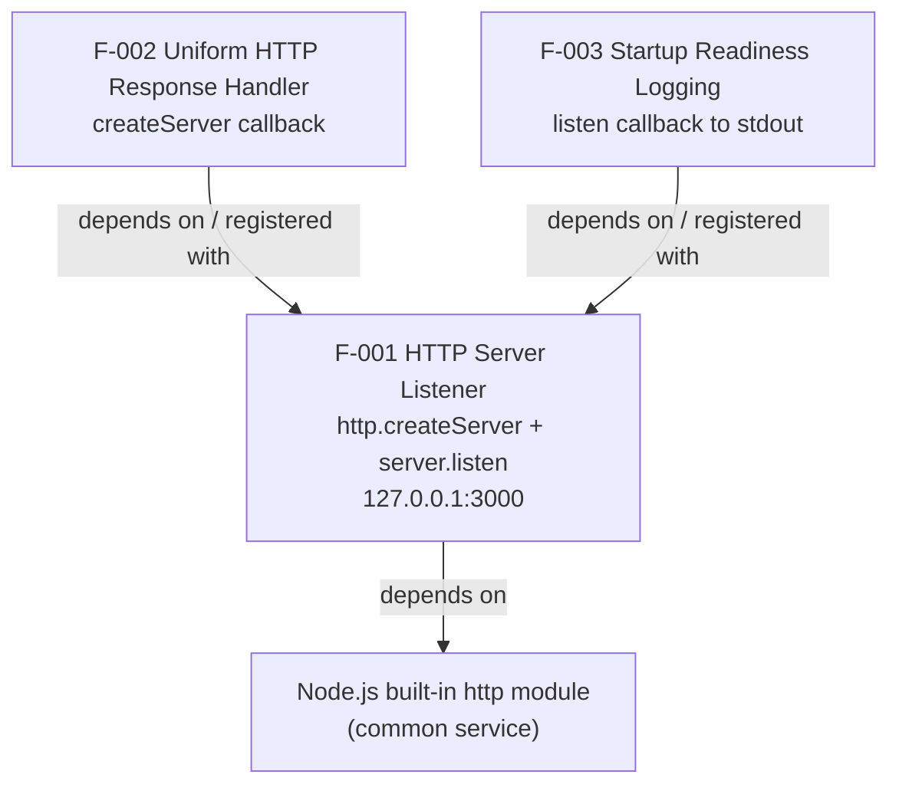
```mermaid
flowchart TD
    HTTP["Node.js built-in http module<br/>(common service)"]
    F001["F-001 HTTP Server Listener<br/>http.createServer + server.listen<br/>127.0.0.1:3000"]
    F002["F-002 Uniform HTTP Response Handler<br/>createServer callback"]
    F003["F-003 Startup Readiness Logging<br/>listen callback to stdout"]

    F001 -->|"depends on"| HTTP
    F002 -->|"depends on / registered with"| F001
    F003 -->|"depends on / registered with"| F001
```

At runtime the direction of control is the inverse of the dependency arrows: F-001 invokes F-002 once **per inbound request** and invokes F-003 exactly once **on successful bind**. The per-request request/response flow is illustrated in the flowchart in Section 1.2.2 (High-Level Description).

### 2.3.2 Integration Points

| Integration Point | Direction | Features Involved | Description |
|---|---|---|---|
| HTTP endpoint `127.0.0.1:3000` | Inbound | F-001, F-002 | The sole external surface: F-001 accepts the connection and F-002 produces the reply. Reachable only from the local host (loopback binding). |
| Process `stdout` | Outbound (operational) | F-003 | The readiness line is written to standard output for an operator or log collector. |

No outbound application integrations exist — there are no database clients, message brokers, external HTTP calls, or any "backprop" client/SDK in the repository (consistent with Sections 1.2.1 and 1.3.2). The named "backprop integration" is expected to occur externally by issuing HTTP requests to the inbound endpoint.

### 2.3.3 Shared Components and Common Services

The three features share the following components and services, all within a single Node.js process:

| Shared Element | Type | Used By | Role |
|---|---|---|---|
| `server.js` | Source file | F-001, F-002, F-003 | The single module that defines all three features. |
| `server` object (from `http.createServer`) | Runtime object | F-001, F-002, F-003 | F-001 creates and starts it; F-002 is its request callback; F-003 is its `listen` callback. |
| `hostname` / `port` constants (lines 3–4) | Configuration constants | F-001, F-003 | F-001 binds to them; F-003 interpolates them into the readiness message so the log always matches the bind address. |
| Node.js built-in `http` module | Common service | F-001, F-002 | Provides `http.createServer`, `server.listen`, and the response API (`res.statusCode`, `res.setHeader`, `res.end`). |
| Node.js `console` / `stdout` stream | Common service | F-003 | Provides `console.log` for the readiness message. |
| Node.js runtime & event loop | Common service | F-001, F-002, F-003 | Hosts the single-threaded process that runs the server and dispatches callbacks. |

## 2.4 Implementation Considerations

This section captures the technical constraints, performance, scalability, security, and maintenance considerations for each feature, followed by the system-wide assumptions and constraints. All observations are grounded in `server.js`; where a consideration reflects a deliberate absence (e.g., no error handling), that absence is itself the finding and is corroborated by the out-of-scope inventory in Section 1.3.2.

### 2.4.1 Per-Feature Considerations

Because all three features occupy a single 15-line file with no configuration, tests, or third-party dependencies, they share most implementation characteristics. The matrix below states them per feature.

| Consideration | F-001 HTTP Server Listener | F-002 Uniform Response Handler | F-003 Startup Readiness Logging |
|---|---|---|---|
| Technical constraints | Host/port are hardcoded constants (lines 3–4); binding is loopback-only; no environment/config override; built on the Node `http` module in CommonJS. | Response is fixed in code (lines 7–9); no routing, parsing, or content negotiation; the `req` object is ignored (line 6). | Message text and destination (`stdout`) are fixed in code; emitted only from the `listen` callback (line 12). |
| Performance requirements | None declared (Section 1.2.3). Setup is synchronous; requests run on Node's single-threaded event loop. | None declared. The handler performs no I/O beyond writing the fixed body; no async work. | None declared. Exactly one `stdout` write at startup. |
| Scalability considerations | Single process; no clustering, worker threads, or load balancing (out-of-scope, Section 1.3.2). | Stateless by construction, so replication would be trivial in principle, but no scaling mechanism is provided. | Not applicable beyond process count — one readiness line per process start. |
| Security implications | No TLS/HTTPS and no authentication; exposure is limited to `localhost` by the loopback bind. | No authorization, CORS, or input validation; the constant body discloses no sensitive data. | Logs only the loopback host and port; no credentials or secrets are written. |
| Maintenance requirements | No tests or build pipeline; a single file to maintain; changing the address requires editing the constants. | No tests; changing behavior requires editing the handler; low surface area. | No tests; changing the message requires editing the log statement. |

### 2.4.2 Assumptions and Constraints

The following system-wide assumptions and constraints apply to all three features and are directly attributable to the code (or to the verified absence of code).

| # | Assumption / Constraint | Basis in Repository |
|---|---|---|
| A-1 | A Node.js runtime is available to execute the CommonJS script. | `server.js` uses `require('http')`; the repository pins no version (no `package.json` / `engines` field). |
| A-2 | TCP port `3000` is free on `127.0.0.1`, and the client runs on the same host. | Hardcoded `hostname`/`port` (lines 3–4); loopback binding restricts reachability to localhost. |
| C-1 | Behavior is not runtime-configurable. | Host, port, response, and log message are all literals in `server.js`; there are no env vars or config files. |
| C-2 | Bind or runtime errors are unhandled. | No `'error'` listener is registered on the server, and there is no `try/catch`; a failed bind (e.g., port already in use) is therefore not handled gracefully. |
| C-3 | There is no graceful shutdown, health check, or metrics. | None present in `server.js`; these are listed as out-of-scope in Section 1.3.2. |
| C-4 | The service is unsuitable for production or multi-purpose web serving. | Every request returns one identical response; there is no routing, persistence, or security layer — it is a controlled test fixture (Section 1.1). |
| C-5 | No requirement versioning process exists beyond the baseline. | The repository has a single commit (`1484182`) with no branching or tags; all requirements are baseline version 1.0. |

## 2.5 Traceability Matrix

The matrices below provide bidirectional traceability: from each functional requirement to its implementing source lines in `server.js`, and from each feature to the capability (Section 1.2.2) and in-scope element (Section 1.3.1) it satisfies. Every requirement traces to concrete code, and every feature traces to a stated scope item — there are no orphaned requirements and no scope items left unimplemented.

### 2.5.1 Requirement-to-Source Traceability

| Requirement ID | Feature | Source Evidence (`server.js`) | Tech-Spec Reference |
|---|---|---|---|
| F-001-RQ-001 | F-001 | Lines 1, 6 (`require('http')`, `http.createServer`) | §1.2.2, §1.3.1 |
| F-001-RQ-002 | F-001 | Lines 3–4, 12 (`hostname`/`port`, `server.listen`) | §1.2.2, §1.3.1 |
| F-002-RQ-001 | F-002 | Lines 7–9 (`statusCode`, `Content-Type`, `res.end` body) | §1.2.2, §1.3.1 |
| F-002-RQ-002 | F-002 | Line 6 (`req` ignored → uniform response) | §1.2.2, §1.3.1 |
| F-003-RQ-001 | F-003 | Lines 12–14 (`listen` callback → `console.log`) | §1.2.2, §1.3.1 |

### 2.5.2 Feature-to-Capability and Scope Traceability

| Feature | Section 1.2.2 Capability | Section 1.3.1 In-Scope Element | Status |
|---|---|---|---|
| F-001 | HTTP listener | HTTP server that binds to `127.0.0.1` on port `3000` | Completed |
| F-002 | Uniform request handling | Uniform `200` / `text/plain` / `Hello, World!\n` response to every request | Completed |
| F-003 | Startup signaling | Startup readiness message (`Server running at http://127.0.0.1:3000/`) to `stdout` | Completed |

### 2.5.3 Coverage Summary

| Metric | Value |
|---|---|
| Features cataloged | 3 (F-001, F-002, F-003) |
| Functional requirements | 5 (2 for F-001, 2 for F-002, 1 for F-003) |
| Requirements traced to source | 5 of 5 (100%) |
| Features implemented (Status `Completed`) | 3 of 3 (100%) |
| Baseline version | 1.0 (commit `1484182`) |

## 2.6 References

The following repository artifacts and technical-specification sections were used as evidence for this section. No external web sources were required.

**Repository files**

- `server.js` — The sole executable and single source of truth for all three features. Established F-001 (lines 1, 3–4, 6, 12), F-002 (lines 6–10), and F-003 (lines 12–14), and all five functional requirements and their acceptance criteria.
- `README.md` — Established the project name (`hao-backprop-test`) and its stated purpose ("test project for backprop integration"), which grounds the Business Value entries in the feature catalog.

**Repository structure and history**

- Repository root (`/`) — Confirmed the repository contains exactly two files (`server.js`, `README.md`) with no package manifest, lockfile, configuration, or tests, bounding the feature catalog to three features.
- Git history — A single commit (`1484182`, "Add files via upload") established the `Completed` status and baseline version 1.0 for all features and requirements.

**Cross-referenced technical-specification sections**

- §1.1 Executive Summary — Project purpose, value proposition, and stakeholder roles (integrating developer/automated process, local operator).
- §1.2 System Overview — §1.2.1 Project Context (loopback-only integration surface, absence of outbound integrations); §1.2.2 High-Level Description (the three capabilities mapped to F-001/F-002/F-003 and the request/response flowchart referenced from §2.3); §1.2.3 Success Criteria (confirmation that no KPIs/SLAs are defined).
- §1.3 Scope — §1.3.1 In-Scope (must-have capabilities used for requirement priority and the traceability matrix); §1.3.2 Out-of-Scope (routing, security, persistence, reliability/ops, configuration, and backprop/ML integration — excluded from the feature catalog).

# 3. Technology Stack

## 3.1 Programming Languages

The `hao-backprop-test` service is implemented in a **single programming language**. The entire executable surface of the repository is the 15-line `server.js` file; there are no other source files, no polyglot components, and no separate client, mobile, or native tiers. Consequently the language inventory is deliberately narrow and maps one-to-one to the sole application component. None of the multi-language tiers implied by a general-purpose default stack (for example TypeScript, Python, Swift, Kotlin, or Objective-C) are present in the repository.

| Language | Edition observed | Component / Platform | Source of truth | Role |
|---|---|---|---|---|
| JavaScript (ECMAScript) | ES2015 (ES6) or later | Server-side HTTP service (Node.js) | `server.js` | Implements the complete application: server creation, the request handler, and startup logging |

**Edition evidence.** `server.js` uses language features introduced in ECMAScript 2015 (ES6): block-scoped `const` declarations (lines 1, 3, 4, and 6), an arrow-function request handler and `listen` callback (lines 6 and 12), and a template literal for the startup message (line 13). No syntax newer than ES2015 (for example `async`/`await` or optional chaining) appears, so the source is compatible with any ES2015-capable engine without transpilation.

**Module system.** The file uses the **CommonJS** module system — it loads the platform's HTTP capability with `require('http')` on line 1 rather than an ECMAScript-module `import`. There is no `"type": "module"` declaration anywhere because there is no `package.json`; the script therefore runs under the runtime's default CommonJS loader.

```javascript
const http = require('http');          // CommonJS import of a core module
const server = http.createServer((req, res) => { /* ... */ }); // ES2015 arrow fn
```

### 3.1.1 Host Runtime

JavaScript is not self-executing; it requires a host runtime. The exclusive use of `require('http')` together with the `http.createServer` and `server.listen` APIs identifies **Node.js** as the target runtime — these are Node.js core-library APIs rather than browser globals or another engine's primitives. As documented in Section 2.4 (Assumption A-1), the repository **pins no runtime version**: there is no `package.json` `engines` field and no `.nvmrc`. The `http` APIs invoked (`createServer`, `listen`, `res.statusCode`, `res.setHeader`, `res.end`) are long-stable Node.js core APIs, so the script is compatible across all currently maintained Node.js LTS lines without modification. The inspection environment happened to provide Node.js v22.23.1 with npm 11.1.0, but that is incidental context and **not** a repository requirement. The runtime execution model is detailed in Section 3.6.

### 3.1.2 Selection Rationale

Because the project's stated purpose is a *"test project for backprop integration"* (`README.md`; see Section 1.1), the language choice optimizes for the smallest possible, immediately runnable HTTP endpoint rather than for feature breadth. JavaScript on Node.js satisfies that objective directly:

| Selection criterion | How JavaScript on Node.js satisfies it |
|---|---|
| Zero-dependency simplicity | The HTTP server is built entirely from the runtime's standard library (`http`), so no compiler toolchain, package manager, or dependency install is required to run the code. |
| Minimal footprint for a fixture | A single interpreted script (no build artifact) is the least amount of code needed to expose a deterministic HTTP endpoint for an external integrator to call. |
| Native HTTP support | Node.js provides a first-class, event-driven HTTP server in its core library, removing any need for an external web framework. |
| Low onboarding cost | JavaScript/Node.js is ubiquitous, and the file is the canonical Node.js "Hello, World!" HTTP example, making the fixture trivially understandable and reproducible. |

### 3.1.3 Constraints and Dependencies

The following language-level constraints follow directly from the code (and the verified absence of code), consistent with Section 2.4's constraint inventory:

- **Single language, single file.** All behavior lives in `server.js`; there is no additional server-, client-, or build-time language.
- **No version pinning.** With no `package.json`/`engines` and no `.nvmrc`, the ECMAScript edition and Node.js version are governed by whatever runtime executes the script, not by the repository (Assumption A-1).
- **CommonJS only.** The code relies on `require`; it is not authored as an ES module and would require a `package.json` (`"type": "module"`) change to be loaded as ESM.
- **No static typing or transpilation.** The project is plain JavaScript — there is no TypeScript, Babel, or other transpiler configuration, so there is no compile step and no type-checking safety net.
- **Runtime dependency.** The only language dependency is the presence of a Node.js runtime that exposes the core `http` module; there are no third-party language libraries (see Section 3.3).

## 3.2 Frameworks & Libraries

The service uses **no application framework and no third-party libraries**. Its only building block above the JavaScript language itself is the **Node.js standard-library `http` module**, imported on line 1 of `server.js` (`const http = require('http')`). This is corroborated by Section 1.2, which identifies the built-in `http` module as *"the only runtime dependency,"* and by the complete absence of a `package.json`, lockfile, or `node_modules` directory in the repository.

The table below records which framework/library categories were assessed and their status in the codebase, reconciling the general-purpose default stack against what is actually present.

| Category | Present? | Evidence in repository |
|---|---|---|
| Node.js core `http` module | **Yes** | `require('http')` and `http.createServer(...)` in `server.js` (lines 1, 6) |
| Web application framework (Express, Fastify, Koa, Flask) | No | No dependency manifest; no framework `require`/`import` in `server.js` |
| AI/ML framework (e.g., LangChain) | No | No such imports; `server.js` contains no ML or "backprop" logic (see Section 1.2.1) |
| Frontend framework (React, React Native) + CSS framework (TailwindCSS) | No | Repository has no frontend, no build tooling, and no client source files |
| Desktop/native shell (ElectronJS) | No | No desktop packaging or native project files present |
| Testing / assertion library | No | No test files and no test runner configuration |

### 3.2.1 The Node.js Built-in `http` Module

The `http` module is the single framework-level component of the system. It is a **built-in (standard-library) module**, meaning it ships with — and is versioned together with — the Node.js runtime; it has no independent package version and is not installed from a registry. `server.js` exercises a small, stable subset of its API surface:

| API used | Line(s) in `server.js` | Purpose |
|---|---|---|
| `http.createServer(callback)` | 6 | Creates the HTTP server and registers the inline request handler (feature F-002) |
| `res.statusCode = 200` | 7 | Sets the fixed response status |
| `res.setHeader('Content-Type', 'text/plain')` | 8 | Sets the fixed response content type |
| `res.end('Hello, World!\n')` | 9 | Writes the fixed body and completes the response |
| `server.listen(port, hostname, callback)` | 12 | Binds the server to `127.0.0.1:3000` and fires the startup callback (features F-001, F-003) |

Because these are core APIs, the effective "version" of this framework layer is simply the version of the Node.js runtime in use (unpinned by the repository, per Section 3.1.1).

### 3.2.2 Absence of Third-Party Frameworks and Libraries

There are **no supporting libraries** of any kind. The repository contains no `package.json`, no `package-lock.json`/`yarn.lock`, and no `node_modules` directory, so there is no declared or vendored dependency graph. No web framework mediates routing or middleware — `server.js` handles requests with a single inline callback and performs no routing, parsing, content negotiation, or middleware chaining (consistent with Section 2.4, feature F-002). This is a deliberate design point rather than an omission to be corrected: the entire HTTP capability is satisfied by the runtime's standard library.

### 3.2.3 Compatibility Requirements and Justification

**Compatibility.** The only compatibility requirement is a Node.js runtime that exposes the core `http` module — a requirement satisfied by every mainstream Node.js release, since `http` has been a stable core module for the life of the platform. There are no inter-library version constraints to reconcile because there are no libraries; there is likewise no peer-dependency, framework-version, or transitive-dependency compatibility matrix to manage.

**Justification for the "no framework" choice.**

- **Fit for purpose.** The system's job is to return one deterministic HTTP response for an external integrator to call (Section 1.1). The core `http` module fully satisfies that requirement; a web framework would add abstraction, configuration, and dependencies with no functional benefit for a fixed single-route response.
- **Zero install / instant run.** Relying only on the standard library means the fixture runs with a bare Node.js runtime and no dependency-installation step (Section 1.2.3).
- **Reduced attack surface and maintenance.** With no third-party frameworks, there is no dependency-vulnerability exposure, no upgrade treadmill, and a single 15-line file to maintain (Section 2.4). Supply-chain considerations are examined further in Section 3.3.

## 3.3 Open Source Dependencies

The repository declares and vendors **zero third-party open-source dependencies**. A direct inventory of the repository root confirms there is no dependency manifest and no installed dependency tree of any kind.

| Dependency artifact | Present? | Consequence |
|---|---|---|
| `package.json` (declared dependencies / scripts / `engines`) | No | No declared direct dependencies; nothing to resolve from a registry |
| `package-lock.json` / `yarn.lock` / `pnpm-lock.yaml` | No | No pinned/locked transitive dependency graph |
| `node_modules/` | No | No vendored/installed third-party packages |
| Git submodules / vendored source trees | No | No externally sourced code is embedded in the repo |

### 3.3.1 Declared and Vendored Dependencies

There are none. The sole runtime capability the code depends on — the `http` module — is a **built-in module of the Node.js runtime**, not a package obtained from a registry (see Section 3.2.1). Node.js and its standard library are themselves open-source software, but the `http` module arrives bundled with the runtime rather than as an installable dependency of this project. Its effective version is therefore the version of the installed Node.js runtime, which the repository does not pin (Section 3.1.1, Assumption A-1 in Section 2.4).

### 3.3.2 Package Registries and Versions

No package registry is used. Because there is no `package.json` and no lockfile, the project performs **no dependency resolution against npm (`registry.npmjs.org`) or any alternative registry**, and there are consequently **no third-party package versions to enumerate**. The only versioned component in the system is the Node.js runtime that hosts the script, and that version is determined by the execution environment rather than declared in the repository.

### 3.3.3 Supply-Chain and Security Implications

The absence of third-party open-source dependencies has direct, and largely favorable, security consequences that align with the security observations in Section 2.4:

- **No third-party supply-chain attack surface.** With no direct or transitive npm packages, the project is not exposed to dependency-confusion, typosquatting, or compromised-package risks, and there is no lockfile drift to audit.
- **No dependency-vulnerability backlog.** There are no third-party CVEs to track or patch; nothing needs `npm audit` remediation because nothing is installed.
- **Residual runtime responsibility.** The one remaining supply-chain surface is the Node.js runtime itself. Because the repository pins no version, operational security depends on the host executing the script on a **currently supported Node.js release** (ideally an active LTS line) so that the bundled `http` module and V8 engine receive security fixes. This is an environment/operations concern rather than a repository dependency, and it is the only open-source component whose patch level must be managed.

## 3.4 Third-Party Services & Integrations

The service integrates with **no external third-party services at runtime**. `server.js` makes no outbound network calls, loads no SDK or client library, reads no credentials or environment variables, and contains no service-discovery, authentication, monitoring, or cloud hooks. This matches Section 1.2.1, which records that the code contains *"no outbound integrations — no database clients, message brokers, external HTTP calls, environment-variable configuration, authentication, or service-discovery hooks."*

| Service category (from default stack) | Integrated? | Evidence / Notes |
|---|---|---|
| External APIs / outbound integrations | No | `server.js` opens no client sockets and imports only the core `http` module (server role) |
| Authentication service (e.g., Auth0) | No | No auth middleware, tokens, or identity-provider configuration; endpoint is unauthenticated (Section 2.4) |
| Monitoring / APM / metrics service | No | No APM agent, metrics exporter, or telemetry SDK; the only observability is a single `console.log` to stdout (feature F-003) |
| Cloud platform services (e.g., AWS) | No | No cloud SDK, credentials, or service configuration anywhere in the repository |
| Message broker / queue | No | No broker client or messaging library present |
| Source-code hosting (Git remote) | Yes (build-time only) | Repository is tracked with Git and hosted on GitHub; this is a development/SCM service, not a runtime integration (see Section 3.6) |

### 3.4.1 The Single Integration Surface (Inbound HTTP)

The system exposes exactly **one** integration surface: an inbound HTTP listener bound to `127.0.0.1:3000` (features F-001 and F-002). Because it binds to the loopback interface, it is reachable only by processes on the same host and is not exposed to a broader network by default (Section 1.2.1). The intended integrating counterpart named in `README.md` — *"backprop"* — is expected to drive this endpoint **externally**, by issuing HTTP requests to the local address; the repository ships **no** client library, SDK, credentials, or configuration for that counterpart. In other words, the integration is inbound-only and request-driven, and there is no coupling from the service out to any external system.

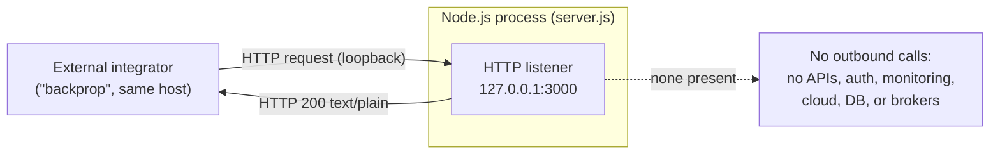
```mermaid
flowchart LR
    Integrator["External integrator<br/>(&quot;backprop&quot;, same host)"]
    subgraph Proc["Node.js process (server.js)"]
        Endpoint["HTTP listener<br/>127.0.0.1:3000"]
    end
    NoOut["No outbound calls:<br/>no APIs, auth, monitoring,<br/>cloud, DB, or brokers"]
    Integrator -->|"HTTP request (loopback)"| Endpoint
    Endpoint -->|"HTTP 200 text/plain"| Integrator
    Endpoint -. "none present" .-> NoOut
```

### 3.4.2 Authentication, Monitoring, and Cloud Services

None of these service classes are present, which carries the security implications noted in Section 2.4:

- **Authentication / authorization.** There is no authentication service and no authorization layer; every request is served identically without credentials. Network exposure is constrained solely by the loopback bind rather than by an identity service.
- **Monitoring / observability.** No external monitoring, tracing, or metrics service is wired in. The sole runtime signal is the startup line `Server running at http://127.0.0.1:3000/` written to stdout (feature F-003); there is no metrics endpoint, structured log shipper, or health check.
- **Cloud services.** The project is cloud-agnostic and cloud-free: it declares no cloud provider, no managed-service client, and no infrastructure configuration. It runs as a plain local process (Section 3.6).

### 3.4.3 Source-Control Hosting

The only external service the project touches at all is **source-control hosting**: the working tree is a Git repository whose `origin` remote is hosted on **GitHub**. This is a development-time/SCM concern rather than a runtime integration and is discussed alongside version control in Section 3.6. (For security, the specific credentialed remote URL is intentionally not reproduced in this document.)

## 3.5 Databases & Storage

The system has **no data tier**. It uses no database, no cache, and no external or local storage service. `server.js` neither reads nor writes any data store: the single response body is a string literal (`'Hello, World!\n'`, line 9) compiled into the source, and no file, connection string, or storage client appears anywhere in the repository. This is consistent with Section 1.2, which describes the service as *"stateless across requests, and free of any persistence,"* and with Section 2.4, which records that the handler *"performs no I/O beyond writing the fixed body."*

| Storage category (from default stack) | Present? | Evidence / Notes |
|---|---|---|
| Primary database (e.g., MongoDB) | No | No database driver, connection string, or query code in `server.js`; no `package.json` declaring one |
| Secondary / analytical database | No | None present |
| Caching layer (e.g., Redis, in-process cache) | No | No cache client and no in-memory cache structures; the fixed response needs none |
| Object / blob storage service | No | No storage SDK, bucket configuration, or file uploads |
| Local file persistence | No | `server.js` performs no filesystem reads or writes at runtime |

### 3.5.1 Data Persistence Strategy

The persistence strategy is **stateless by construction**: there is deliberately nothing to persist. Every request produces an identical, hard-coded response independent of any prior request (feature F-002), so the service holds no session, user, or application state between requests and across restarts. There is no schema, no migration tooling, and no data-lifecycle management because there is no data.

### 3.5.2 Storage-Related Security Implications

Because no data is stored, transmitted from a store, or cached, there is **no data-at-rest attack surface** and no sensitive-data handling to secure: no credentials, connection secrets, or storage endpoints exist in the codebase, and the constant response body discloses nothing sensitive (Section 2.4). Should a data tier ever be required, it would be a net-new addition — the current architecture has no storage integration point to build upon.

## 3.6 Development & Deployment

The development and deployment toolchain is as minimal as the codebase. The project is version-controlled with Git and executed directly by the Node.js runtime; it has **no build system, no containerization, and no CI/CD automation**. All of the following observations are grounded in the verified repository contents (only `.git/`, `README.md`, and `server.js` exist) and Section 2.4's constraint inventory.

### 3.6.1 Development Tools

| Tool / Category | Present? | Evidence in repository |
|---|---|---|
| Version control | **Yes — Git** | `.git/` directory; a single commit (`1484182`, "Add files via upload"); no tags, per Section 2.4 (C-5) |
| Remote code hosting | **Yes — GitHub** | Git `origin` remote points to a GitHub repository (credentialed URL intentionally not reproduced) |
| Package manager (npm/yarn/pnpm) | No | No `package.json` or lockfile |
| Linter / formatter (ESLint, Prettier) | No | No linter/formatter configuration files |
| Editor / IDE configuration | No | No `.editorconfig`, `.vscode/`, or similar committed |
| Build tool / bundler / transpiler | No | No build, bundler, or transpiler configuration (Section 3.6.2) |
| Test runner | No | No test files or test-runner configuration (Section 1.2.3) |
| Task runner / npm scripts | No | No `package.json` `scripts` block |

The practical development toolset is therefore just **Git** (for source control, with GitHub as the remote host) plus a **text editor** and a **Node.js runtime** to run the script; nothing else is committed to the repository.

### 3.6.2 Build System

There is **no build system**. The application is a plain, interpreted JavaScript file that runs as-is — there is no compilation, transpilation, bundling, or minification step, and no build configuration or `package.json` `scripts` to invoke one. This follows directly from the language choices in Section 3.1 (plain CommonJS JavaScript, no TypeScript/Babel) and the zero-dependency posture in Section 3.3. The "build" is effectively a no-op: the source file is the deployable artifact.

### 3.6.3 Containerization

There is **no containerization**. The repository contains no `Dockerfile`, no `docker-compose.yml`/`compose.yaml`, and no other container or orchestration manifest. The service is intended to run as a bare operating-system process under a Node.js runtime, not inside a container image. No container registry, base image, or image-build step is defined anywhere in the codebase.

### 3.6.4 CI/CD

There is **no CI/CD pipeline**. The repository contains no `.github/workflows/` directory and no `.yml`/`.yaml` pipeline definitions for any CI/CD system, and there is no build/test/deploy automation (consistent with the absence of a build system in Section 3.6.2 and of tests in Section 1.2.3). Code reaches the repository through direct Git commits/uploads (a single commit is present, per C-5 in Section 2.4); there is no automated gate, artifact publication, or deployment workflow. Any deployment is a manual action performed by an operator running the script.

### 3.6.5 Runtime and Deployment Model

Deployment is a single manual step: provide a Node.js runtime and execute the script. The process is single, stateless, and single-threaded (it runs on Node.js's event loop), and it binds only to the loopback interface.

```bash
# The entire deployment: run the script with a Node.js runtime

node server.js
# -> logs "Server running at http://127.0.0.1:3000/"

```

**Integration requirements between components.** Even in this minimal system, a few components must line up for the service to run. These derive from `server.js` and the assumptions/constraints in Section 2.4 (A-1, A-2, C-1, C-2, C-3):

| Component boundary | Integration requirement |
|---|---|
| `server.js` → Node.js runtime | A Node.js runtime exposing the core `http` module via the CommonJS loader must be present; no version is pinned by the repo (A-1). |
| `server.js` → OS / network | TCP port `3000` on `127.0.0.1` must be free; the process binds it via `server.listen(...)`. A failed bind is not handled (C-2). |
| Service → external integrator | The integrator must run on the **same host** and reach the service over the loopback interface (A-2); the endpoint is unauthenticated and served over plain HTTP (no TLS). |
| Configuration | None — host, port, response, and log message are hard-coded literals; there are no environment variables or config files to supply (C-1). |
| Lifecycle | No process manager, health check, or graceful shutdown is provided; the process runs until terminated (C-3). |

The end-to-end path from source to a running listener — and the stages that are deliberately absent — is summarized below.

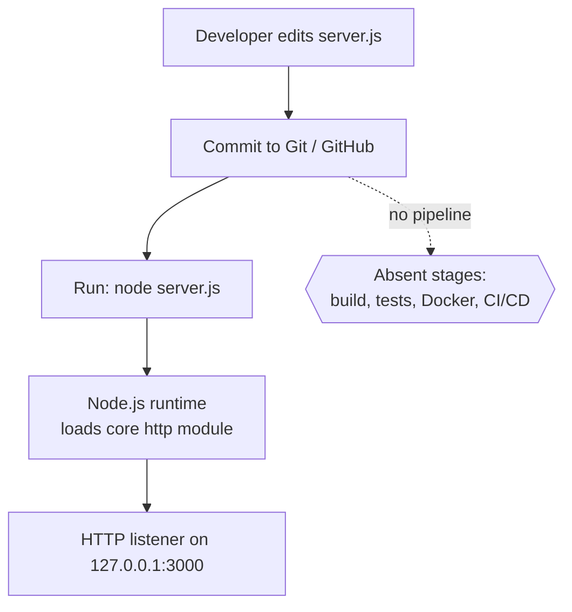
```mermaid
flowchart TD
    Dev["Developer edits server.js"]
    Commit["Commit to Git / GitHub"]
    Run["Run: node server.js"]
    Runtime["Node.js runtime<br/>loads core http module"]
    Listen["HTTP listener on 127.0.0.1:3000"]
    Absent{{"Absent stages:<br/>build, tests, Docker, CI/CD"}}
    Dev --> Commit
    Commit --> Run
    Run --> Runtime
    Runtime --> Listen
    Commit -. "no pipeline" .-> Absent
```

## 3.7 References

The following repository artifacts, technical-specification sections, and external lookups were examined to produce Section 3.

**Repository files and folders inspected**

- `server.js` — The sole application source; established the programming language and edition (JavaScript, ES2015+), the CommonJS module system, the exclusive use of the Node.js core `http` module and its specific APIs, the hard-coded `127.0.0.1:3000` binding, the fixed `200`/`text/plain`/`Hello, World!\n` response, and the stdout startup log. Basis for Sections 3.1, 3.2, 3.4, 3.5, and 3.6.
- `README.md` — Established the project name (`hao-backprop-test`) and its stated purpose ("test project for backprop integration"), which frames the technology-selection rationale in Sections 3.1.2 and 3.2.3 and the integration discussion in Section 3.4.
- Repository root (`/`) — Full recursive listing confirmed the complete inventory (only `.git/`, `README.md`, and `server.js`) and the verified absence of `package.json`, lockfiles, `node_modules/`, `Dockerfile`/compose files, CI/CD workflow definitions, Infrastructure-as-Code, tests, and configuration. Basis for the "no dependencies / no build / no containerization / no CI-CD" findings in Sections 3.3 and 3.6.
- `.git/` — Established that version control is Git with a single commit (`1484182`) and a GitHub-hosted `origin` remote (credentialed URL intentionally not reproduced). Basis for Section 3.6.1 and the source-control note in Section 3.4.3.

**Technical-specification sections cross-referenced**

- Section 1.1 Executive Summary — Project purpose as a test fixture (rationale in Sections 3.1.2, 3.2.3).
- Section 1.2 System Overview — Confirmation that the built-in `http` module is the only runtime dependency and that the service is stateless with no outbound integrations (Sections 3.2, 3.4, 3.5).
- Section 1.3.2 (Out-of-Scope, within Section 1.3 Scope) — Corroborates the deliberate absence of clustering, health checks, and related capabilities referenced in Section 3.6.
- Section 2.4 Implementation Considerations — Assumptions A-1 (runtime available, no version pinned) and A-2 (loopback/same-host), and constraints C-1–C-5, referenced throughout Sections 3.1, 3.3, 3.4, 3.5, and 3.6; feature IDs F-001/F-002/F-003.

**External sources**

- [web] Node.js release/LTS schedule — Two `web_search` queries were attempted to confirm the current Node.js LTS lineup; both returned no results. Accordingly, no external version claim is asserted, and the runtime is documented conservatively (no repository-pinned version; core `http` APIs are stable across maintained LTS lines). The Node.js v22.23.1 / npm 11.1.0 figures cited are the incidental versions observed in the inspection environment, not repository requirements.

# 4. Process Flowchart

## 4.1 System Workflows Overview

The `hao-backprop-test` service is a single-file, single-process Node.js HTTP fixture (`server.js`, 15 lines) whose entire runtime behavior consists of two workflows: a **one-time startup/bind sequence** and a **stateless request/response cycle** repeated for every inbound request. There are no multi-stage business processes, orchestrations, long-running sagas, background jobs, scheduled tasks, or outbound integrations. This is corroborated by direct inspection of `server.js`, by the out-of-scope inventory in Section 1.3.2, and by the three-feature catalog in Section 2.1 (F-001 HTTP Server Listener, F-002 Uniform HTTP Response Handler, F-003 Startup Readiness Logging). Every flow diagram in Section 4 documents exactly what the code does — no workflow is inferred, aspirational, or padded to resemble a larger system.

Because the service is a controlled test target rather than a business application, the term "business process" reduces to a single observable interaction: a local client issues any HTTP request and receives a fixed `200 / text/plain / Hello, World!` reply (the "primary user workflow" recorded in Section 1.3.1). The subsections below establish the actors, the workflow inventory, and the high-level diagram that the rest of Section 4 decomposes.

### 4.1.1 Actors and System Boundaries

The system has two human/external actors and two internal boundaries. There is **no outbound boundary** — `server.js` opens no client sockets and imports only the built-in `http` module (Section 3.4).

| Actor / Boundary | Role in the workflow | Interface | Evidence |
|---|---|---|---|
| Local operator | Starts the process (`node server.js`) and reads the readiness line from STDOUT | Host shell + process `stdout` | `server.js` L12–14 (F-003) |
| Integrator / "backprop" client | Issues HTTP requests and consumes the fixed reply; must run on the same host because the bind is loopback-only | Inbound HTTP over `127.0.0.1:3000` | `server.js` L3–4, L6–10; `README.md`; Section 3.4.1 |
| Node.js process (`server.js`) | Hosts the HTTP listener and the request handler; the sole application component | Node.js runtime + built-in `http` module | `server.js` L1, L6, L12 |
| OS loopback TCP stack | Binds/accepts the TCP socket on `127.0.0.1:3000` | Kernel networking | `server.js` L12 (`server.listen`) |

### 4.1.2 Workflow Inventory

Only two workflows exist in the codebase. They are summarized here and detailed in Sections 4.2, 4.3, 4.5, and 4.6.

| ID | Workflow | Trigger | Actors | Terminal state | Requirement refs |
|---|---|---|---|---|---|
| W-1 | Startup & Bind | `node server.js` (one-time) | Operator, Node process, OS | `Listening` on success, or `Terminated` on bind failure | F-001-RQ-001, F-001-RQ-002, F-003-RQ-001 |
| W-2 | Request / Response | Any inbound HTTP request (repeatable) | Integrator client, Node process | HTTP `200` returned; TCP connection kept alive | F-002-RQ-001, F-002-RQ-002 |

### 4.1.3 High-Level System Workflow Diagram

The following diagram combines both workflows on one canvas. Subgraphs act as swim lanes / system boundaries: the **Startup / Bind** lane (W-1) and the **Request Handling** lane (W-2). The only genuine decision point in the entire system is the bind outcome at startup; the request path contains no application decision points.

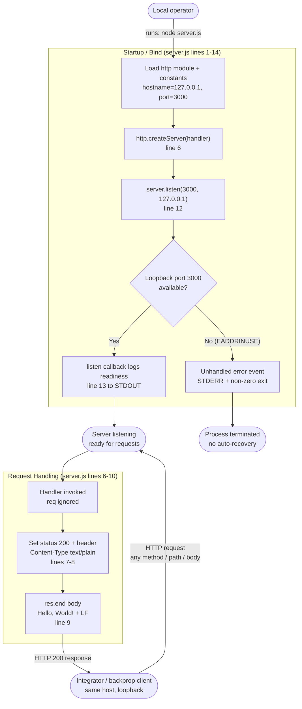
```mermaid
flowchart TD
    Operator(["Local operator"]) -->|"runs: node server.js"| Start

    subgraph Boot["Startup / Bind (server.js lines 1-14)"]
        Start["Load http module + constants<br/>hostname=127.0.0.1, port=3000"]
        Create["http.createServer(handler)<br/>line 6"]
        Bind["server.listen(3000, 127.0.0.1)<br/>line 12"]
        Decide{"Loopback port 3000<br/>available?"}
        Ready["listen callback logs readiness<br/>line 13 to STDOUT"]
        Fail["Unhandled error event<br/>STDERR + non-zero exit"]
        Start --> Create --> Bind --> Decide
        Decide -->|"Yes"| Ready
        Decide -->|"No (EADDRINUSE)"| Fail
    end

    Ready --> Listening(["Server listening<br/>ready for requests"])
    Fail --> Ended(["Process terminated<br/>no auto-recovery"])

    Integrator(["Integrator / backprop client<br/>same host, loopback"]) -->|"HTTP request<br/>any method / path / body"| Listening
    Listening --> Handler

    subgraph Serve["Request Handling (server.js lines 6-10)"]
        Handler["Handler invoked<br/>req ignored"]
        Build["Set status 200 + header<br/>Content-Type text/plain<br/>lines 7-8"]
        Send["res.end body<br/>Hello, World! + LF<br/>line 9"]
        Handler --> Build --> Send
    end

    Send -->|"HTTP 200 response"| Integrator
```

**Timing note.** The application declares no SLA, latency budget, throughput target, or timeout (Sections 1.2.3 and 2.2). The only timing value observable at runtime is Node.js's default `Keep-Alive: timeout=5` response header (a runtime default, not an application setting); this is discussed further in Section 4.2.4.

## 4.2 Core Business Process Flows

The three core features documented in Section 2.1 map to concrete process flows: **F-001** governs the startup/bind workflow (W-1), **F-002** governs the request/response workflow (W-2), and **F-003** is the success-side terminal step of W-1. Each flow below is drawn line-for-line from `server.js`; none introduces behavior that is not present in the source.

### 4.2.1 F-001 HTTP Server Listener — Startup and Bind Flow

The startup flow is synchronous (Section 2.4). It loads the built-in `http` module (`server.js` L1), reads the hardcoded `hostname` / `port` constants (L3–4), creates the server with the inline handler (`http.createServer`, L6), and calls `server.listen(port, hostname, cb)` (L12). The **single decision point** is whether the loopback port `3000` is free: on success the OS binds the socket, the `listen` callback fires (invoking F-003), and the process reaches the `Listening` state; on failure the server emits an `'error'` event that no code handles, terminating the process (the error path is detailed in Section 4.6). This flow satisfies F-001-RQ-001 (instantiate via the built-in `http` module) and F-001-RQ-002 (bind `127.0.0.1:3000`, loopback-only).

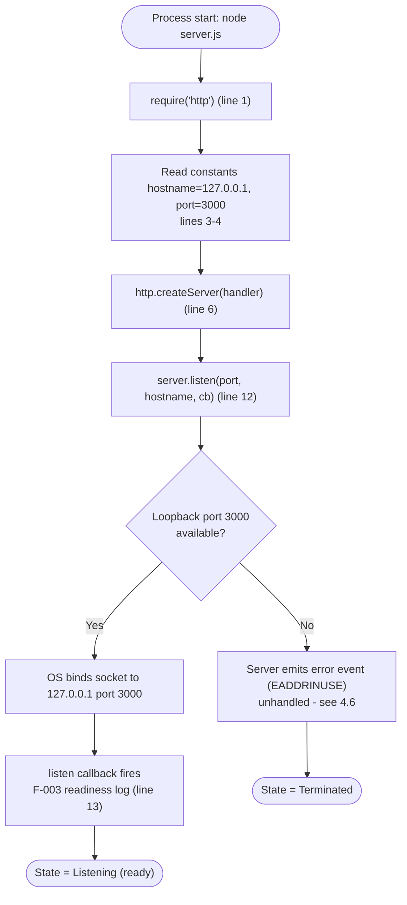
```mermaid
flowchart TD
    A(["Process start: node server.js"]) --> B["require('http') (line 1)"]
    B --> C["Read constants hostname=127.0.0.1, port=3000<br/>lines 3-4"]
    C --> D["http.createServer(handler) (line 6)"]
    D --> E["server.listen(port, hostname, cb) (line 12)"]
    E --> F{"Loopback port 3000<br/>available?"}
    F -->|"Yes"| G["OS binds socket to 127.0.0.1 port 3000"]
    G --> H["listen callback fires<br/>F-003 readiness log (line 13)"]
    H --> I(["State = Listening (ready)"])
    F -->|"No"| J["Server emits error event (EADDRINUSE)<br/>unhandled - see 4.6"]
    J --> K(["State = Terminated"])
```

### 4.2.2 F-002 Uniform HTTP Response Handler — Request/Response Flow

For every inbound request the `http.Server` invokes the handler callback (`server.js` L6). The handler **never reads the `req` object** — no method, path, query, header, or body is inspected — so there is no routing, parsing, content negotiation, or branching. It sets `res.statusCode = 200` (L7), sets the `Content-Type: text/plain` header (L8), and terminates the response with `res.end('Hello, World!\n')` (L9). Runtime verification confirmed the uniformity requirement F-002-RQ-002: `GET /`, `POST /anything/deep/path` (with a body), and `DELETE /foo?bar=baz` all returned an identical `HTTP/1.1 200 OK`, `Content-Type: text/plain`, `Content-Length: 14`, and body `Hello, World!\n` (satisfying F-002-RQ-001). Because the handler is fully deterministic, this flow has **no decision diamonds**.

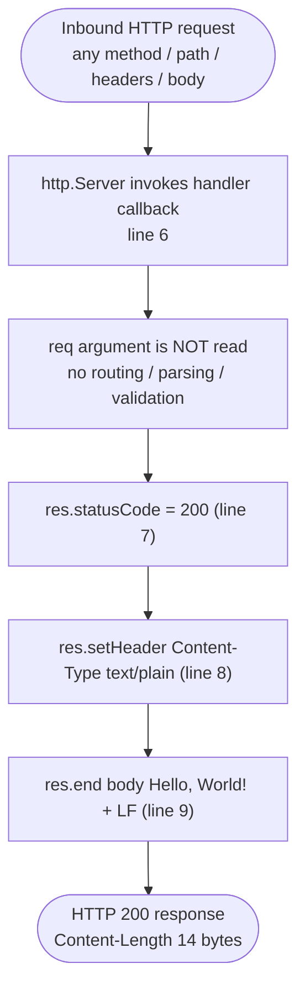
```mermaid
flowchart TD
    A(["Inbound HTTP request<br/>any method / path / headers / body"]) --> B["http.Server invokes handler callback<br/>line 6"]
    B --> C["req argument is NOT read<br/>no routing / parsing / validation"]
    C --> D["res.statusCode = 200 (line 7)"]
    D --> E["res.setHeader Content-Type text/plain (line 8)"]
    E --> F["res.end body Hello, World! + LF (line 9)"]
    F --> G(["HTTP 200 response<br/>Content-Length 14 bytes"])
```

### 4.2.3 F-003 Startup Readiness Logging — Flow

F-003 is not an independent workflow; it is the success-side terminal step of W-1. It executes **only inside the `listen` callback** (`server.js` L12), after a successful bind, writing exactly one line — `Server running at http://127.0.0.1:3000/` — to `stdout` via `console.log` (L13). The host and port in the message are interpolated from the same constants used to bind, so the logged address always matches the actual listen address (F-003-RQ-001). If the bind fails, the callback never runs and no readiness line is emitted — the crash path writes to `stderr` instead (Section 4.6). This step corresponds to the "listen callback fires → F-003 readiness log" node in the Section 4.2.1 diagram, so no separate flowchart is warranted.

### 4.2.4 Decision Points, User Touchpoints, and Timing

**Decision points.** The entire system contains exactly one decision point; the request path has none.

| Decision point | Location | Branches | Notes |
|---|---|---|---|
| Is loopback port `3000` available? | `server.listen` at startup (L12) | Yes → `Listening`; No → process crash | The only genuine branch in the codebase |
| (request handling) | handler L6–10 | none | Handler ignores `req` and always returns `200` (F-002-RQ-002) |

**User touchpoints.**

| Touchpoint | Actor | Channel | Observable signal |
|---|---|---|---|
| Process launch | Local operator | Shell (`node server.js`) | Process starts |
| Readiness confirmation | Local operator | `stdout` | `Server running at http://127.0.0.1:3000/` |
| HTTP request/response | Integrator / backprop client | HTTP over loopback | Request → fixed `200 / text/plain` reply |

**Timing and SLA considerations.** The application declares no SLA, latency, throughput, or availability target, and configures no timeouts (Sections 1.2.3 and 2.2). Observed timing/response characteristics are Node.js runtime defaults, not application settings:

| Aspect | Observed value | Basis |
|---|---|---|
| Application SLA / latency / throughput | None declared | Sections 1.2.3, 2.2 |
| Setup mode | Synchronous; requests run on Node's single-threaded event loop | Section 2.4 |
| Response `Content-Length` | 14 bytes (body `Hello, World!\n`) | Runtime observation + `server.js` L9 |
| `Keep-Alive` timeout | `Keep-Alive: timeout=5` (Node default `keepAliveTimeout`, ~5000 ms) — **not** app-configured | Runtime observation (Node.js default) |

## 4.3 Integration and Sequence Workflows

Per Section 3.4, the service exposes exactly **one** integration surface — an inbound HTTP listener bound to `127.0.0.1:3000` (features F-001 and F-002) — and performs **zero** outbound integrations. The "backprop" counterpart named in `README.md` drives this endpoint **externally** by issuing HTTP requests; the repository ships no client library, SDK, credentials, or configuration for it (Section 3.4.1). The sequence diagrams in this section provide the temporal, participant-laned (swim-lane) view of the two workflows introduced in Section 4.1.2.

### 4.3.1 Integration Surface and Data Flow

| Direction | Surface | Data exchanged | Evidence |
|---|---|---|---|
| Inbound | HTTP over loopback `127.0.0.1:3000` | Request (received but never read) → fixed `200`, `text/plain`, body `Hello, World!\n` | `server.js` L3–4, L6–10 (F-001, F-002) |
| Outbound | None | None — no DB clients, external HTTP calls, brokers, cloud SDKs, or environment-driven config | Section 3.4; `server.js` (only `require('http')`) |

The only "data" in the system is the constant response string; there is no external, cached, or persisted data (Section 2.2 records "Data Requirements: None" for all features). Because the socket is bound to the loopback interface, all data flow is confined to the local host and never crosses a network boundary (Section 3.4.1).

### 4.3.2 Request/Response Sequence Diagram

This diagram shows the runtime interaction for W-2. The `req` object is never inspected, so the server transitions directly from "connection accepted" to emitting the fixed reply. The connection is then kept alive under Node's default keep-alive behavior.

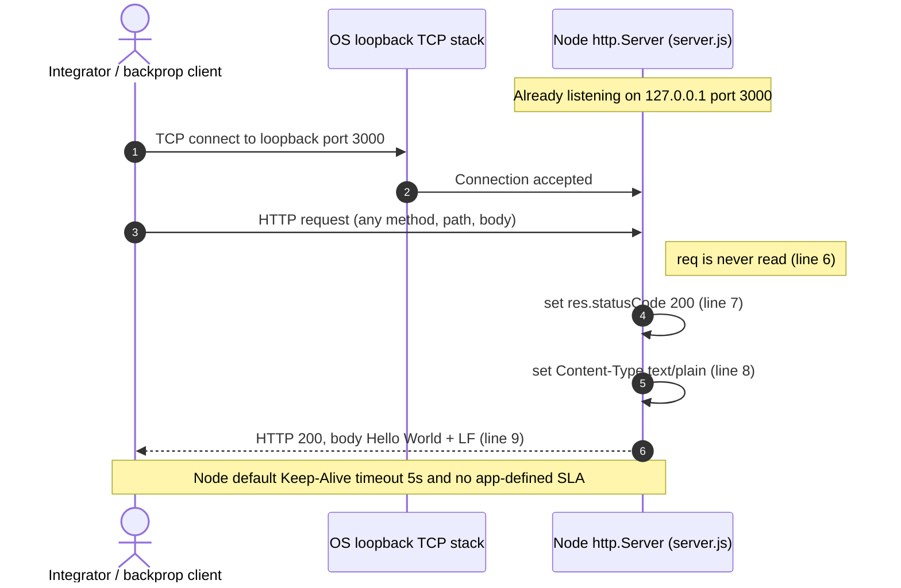
```mermaid
sequenceDiagram
    autonumber
    actor Client as Integrator / backprop client
    participant OS as OS loopback TCP stack
    participant Server as Node http.Server (server.js)
    Note over Server: Already listening on 127.0.0.1 port 3000
    Client->>OS: TCP connect to loopback port 3000
    OS->>Server: Connection accepted
    Client->>Server: HTTP request (any method, path, body)
    Note right of Server: req is never read (line 6)
    Server->>Server: set res.statusCode 200 (line 7)
    Server->>Server: set Content-Type text/plain (line 8)
    Server-->>Client: HTTP 200, body Hello World + LF (line 9)
    Note over Client,Server: Node default Keep-Alive timeout 5s and no app-defined SLA
```

### 4.3.3 Startup Sequence Diagram

This diagram shows the runtime interaction for W-1, including both outcomes of the single bind decision point. The success branch produces the STDOUT readiness line (F-003); the failure branch produces a STDERR stack trace and process exit (Section 4.6).

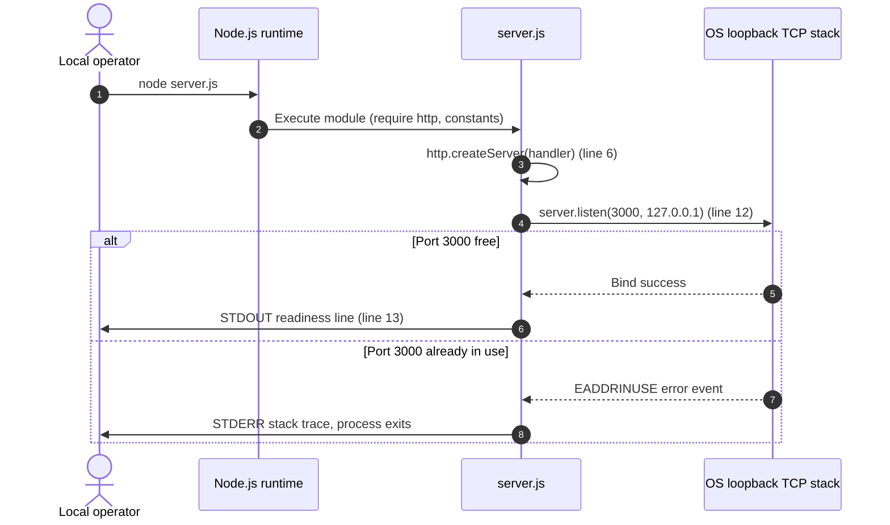
```mermaid
sequenceDiagram
    autonumber
    actor Op as Local operator
    participant Node as Node.js runtime
    participant App as server.js
    participant OS as OS loopback TCP stack
    Op->>Node: node server.js
    Node->>App: Execute module (require http, constants)
    App->>App: http.createServer(handler) (line 6)
    App->>OS: server.listen(3000, 127.0.0.1) (line 12)
    alt Port 3000 free
        OS-->>App: Bind success
        App->>Op: STDOUT readiness line (line 13)
    else Port 3000 already in use
        OS-->>App: EADDRINUSE error event
        App->>Op: STDERR stack trace, process exits
    end
```

### 4.3.4 API Interactions, Event Processing, and Batch Sequences

The prompt calls for API interactions, event-processing flows, and batch-processing sequences. All three are either trivial or verifiably absent, and are documented here honestly rather than fabricated.

| Integration category | Present? | Evidence / Notes |
|---|---|---|
| API interactions | Minimal | A single un-routed HTTP endpoint. There is no REST resource model, no path/method routing, no versioned API contract, and no request schema — the only contract is "any request → `200 / text/plain / Hello, World!`" (F-002-RQ-002; Section 1.3.2). |
| Event processing | None (beyond built-in callbacks) | The application registers no message/event handlers of its own; the `createServer` callback is Node's built-in `request`-event handler and the `listen` callback is a one-shot startup callback. No message broker, queue, pub/sub, or event-stream integration exists (Sections 1.3.2, 3.4). Notably, no `'error'` event listener is registered (Section 4.6). |
| Batch processing | None | No scheduled jobs, cron, worker threads, timers, or bulk pipelines exist; the service is a single-process, request-driven listener (Sections 1.3.2, 2.4). |

## 4.4 Validation Rules and Authorization Checkpoints

This section maps the prompt's validation-rule requirements (business rules per step, data validation, authorization checkpoints, regulatory compliance) onto the actual code. The authoritative source is the per-feature **Validation Rules** in Section 2.2; every rule below is present in `server.js` or is explicitly recorded there as absent. Nothing is invented.

### 4.4.1 Business Rules at Each Step

| Workflow step | Business rule | How enforced | Source |
|---|---|---|---|
| Bind (W-1) | Bind **only** to loopback `127.0.0.1` and **only** to port `3000`; neither is runtime-configurable | Hardcoded constants (`server.js` L3–4); no env/config override | Section 2.2 (F-001); Section 2.4 (C-1) |
| Readiness log (W-1) | Emit the readiness line **only after** a successful bind | Structural — `console.log` runs inside the `listen` callback (L12–13) | Section 2.2 (F-003-RQ-001) |
| Request handling (W-2) | Every request receives the **same** successful reply; no conditional responses, error branches, or alternate status codes | Deterministic handler (L6–10); `req` never read | Section 2.2 (F-002) |

### 4.4.2 Data Validation Requirements

No inbound data is inspected or validated at any layer. At the listener level, connections are not validated beyond the OS-level bind (Section 2.2 F-001: "Data Validation: None — no inbound data is inspected or validated at the listener level"). At the handler level, the request method, path, query string, headers, and body are never read (`server.js` L6), so there is no schema check, type check, size limit, encoding check, or content negotiation. This absence is intentional for a fixed-response fixture and is recorded across Section 2.2 (Data Validation: None for all features) and Section 1.3.2 (no query/body parsing).

### 4.4.3 Authorization Checkpoints

There are **zero** authorization checkpoints in the request path. The only access-limiting mechanism is a network-level constraint, not an identity or permission check.

| Control | Present? | Evidence |
|---|---|---|
| Authentication | No | Sections 2.2 (Security Requirements), 3.4.2 |
| Authorization / roles / scopes | No | Sections 1.3.2, 2.4 |
| API key / bearer token | No | Section 3.4 (no credentials loaded) |
| CORS / rate limiting | No | Section 1.3.2 |
| TLS / HTTPS | No | Section 2.2 (F-001 Security Requirements) |
| Network reachability constraint (loopback bind) | Yes (implicit) | `server.js` L3 (`127.0.0.1`); F-001-RQ-002 |

The loopback bind (F-001-RQ-002) restricts reachability to processes on the same host; it is a deployment boundary rather than a per-request authorization checkpoint. No request is ever accepted or rejected on the basis of identity, credentials, or permissions.

### 4.4.4 Regulatory and Compliance Checks

No regulatory or compliance checks are declared anywhere in the codebase — Section 2.2 records "Compliance Requirements: None declared in the codebase" for **every** feature. There is no PII handling, audit trail, data-retention policy, consent flow, or encryption-in-transit (no TLS). The response body is a constant string that exposes no sensitive data, and the single readiness log line contains only the loopback host and port, disclosing no credentials or secrets (Section 2.2 F-002/F-003 Security Requirements). This posture is consistent with the artifact's role as a disposable, local test fixture (Section 1.1).

## 4.5 State Management and Transaction Boundaries

State management in this system is limited to the **process/server lifecycle**. There is no per-request state, no shared application state, no persistence, no caching, and no transactional work. Section 2.4 records the service as "Stateless by construction," and the diagram and tables below make that concrete.

### 4.5.1 Process / Server Lifecycle State Transitions

The only stateful entity is the Node.js process (and the `http.Server` object it owns), which moves through a short lifecycle. The steady state is `Listening`; serving a request does **not** change the state (self-transition), because the handler holds no state between requests. A failed bind moves directly from `Binding` to `Terminated` (Section 4.6).

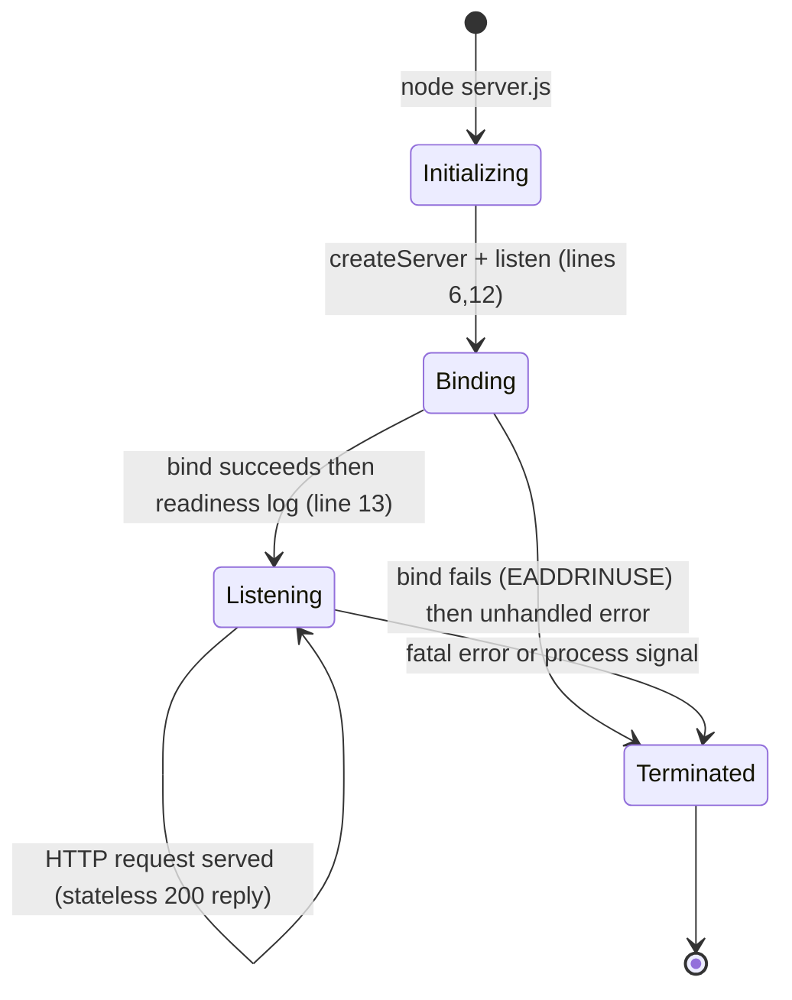
```mermaid
stateDiagram-v2
    [*] --> Initializing: node server.js
    Initializing --> Binding: createServer + listen (lines 6,12)
    Binding --> Listening: bind succeeds then readiness log (line 13)
    Binding --> Terminated: bind fails (EADDRINUSE) then unhandled error
    Listening --> Listening: HTTP request served (stateless 200 reply)
    Listening --> Terminated: fatal error or process signal
    Terminated --> [*]
```

The `http.Server` object internally tracks runtime state such as its `listening` flag and its open keep-alive sockets, but this is machinery managed by the Node.js runtime, not application state defined in `server.js`.

### 4.5.2 Per-Request Statelessness

Each request is handled in complete isolation. The handler (`server.js` L6–10) reads and writes only the local `res` object for the current request; it references no module-level mutable variables, no counter, no session, and no in-memory store. Consequently, two requests are indistinguishable and cannot influence one another, and the response never depends on prior requests or external state (Section 2.2 F-002: "the response never depends on external state"). The only cross-request state that exists is the OS/Node-managed TCP connection state (keep-alive sockets), which is transport-level, not application-level.

### 4.5.3 Data Persistence, Caching, and Transaction Boundaries

Because there is no data model and no shared/persisted data, none of these concerns apply. Each concern is documented as absent, with its evidence.

| Concern | Present? | Evidence |
|---|---|---|
| Data persistence point (DB / file / session write) | None | No database client, file write, or session store; Sections 1.3.2, 2.2 (Data Requirements: None) |
| Caching layer / requirement | None | No cache client and no in-memory cache; response is a compile-time constant | Section 1.3.2 |
| Transaction boundary (commit / rollback) | None | Each request is a single synchronous write of a constant; no multi-step or ACID operation | Section 2.4 |
| In-memory application state | None | Handler uses only local `req` / `res`; "Stateless by construction" | Section 2.4 |

In short, there are **no transaction boundaries to define**: a request is a single, synchronous, side-effect-free emission of a constant response, so there is no commit/rollback semantics and no data store whose consistency must be maintained.

## 4.6 Error Handling and Recovery Flows

The application contains **no explicit error handling** — Section 2.4 constraint C-2 records that "a failed bind (e.g., port already in use) is therefore not handled gracefully," and there is no `try/catch` and no `'error'` event listener anywhere in `server.js`. This section documents the *actual* error behavior (verified at runtime), not an idealized one: a startup bind-failure path that terminates the process, request-time behavior that relies entirely on Node's built-in defaults, and the complete absence of retry, fallback, and self-recovery logic.

### 4.6.1 Error-Handling Flowchart

The flowchart separates the **startup-time** error path (a real failure mode) from **request-time** behavior (where the application adds nothing beyond Node's defaults).

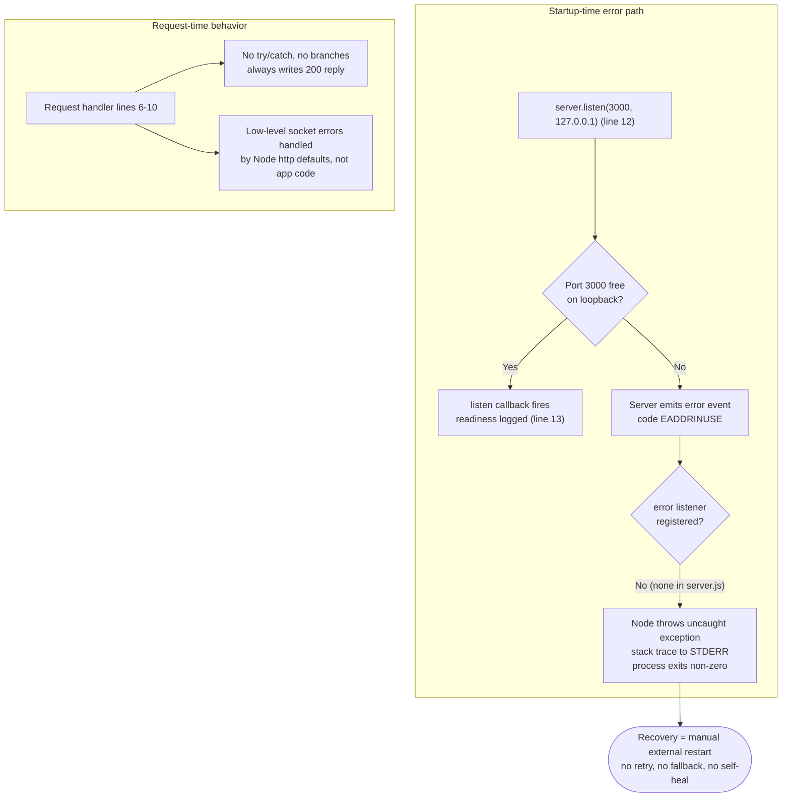
```mermaid
flowchart TD
    subgraph Boot["Startup-time error path"]
        L["server.listen(3000, 127.0.0.1) (line 12)"]
        D1{"Port 3000 free<br/>on loopback?"}
        OK["listen callback fires<br/>readiness logged (line 13)"]
        Err["Server emits error event<br/>code EADDRINUSE"]
        D2{"error listener<br/>registered?"}
        Throw["Node throws uncaught exception<br/>stack trace to STDERR<br/>process exits non-zero"]
        L --> D1
        D1 -->|"Yes"| OK
        D1 -->|"No"| Err
        Err --> D2
        D2 -->|"No (none in server.js)"| Throw
    end
    subgraph Run["Request-time behavior"]
        R["Request handler lines 6-10"]
        N["No try/catch, no branches<br/>always writes 200 reply"]
        S["Low-level socket errors handled<br/>by Node http defaults, not app code"]
        R --> N
        R --> S
    end
    Throw --> Rec(["Recovery = manual external restart<br/>no retry, no fallback, no self-heal"])
```

### 4.6.2 Startup Error Path (EADDRINUSE)

Runtime verification made the failure path concrete. When a second instance is started while port `3000` is already bound, `server.listen` (`server.js` L12) emits an `'error'` event on the `Server` instance with `code: 'EADDRINUSE'` (`errno: -98`, `syscall: 'listen'`, `address: '127.0.0.1'`, `port: 3000`). Because `server.js` registers **no** `'error'` listener, Node.js treats this as an unhandled `'error'` event and throws it, producing an uncaught exception: the process prints a stack trace to `stderr` (headed `Error: listen EADDRINUSE: address already in use 127.0.0.1:3000`, followed by the Node version line) and **exits with a non-zero code**. The already-running first instance is unaffected and continues serving. This directly confirms constraint C-2 in Section 2.4. The same unhandled-`'error'` mechanism would apply to any other fatal listen-time error (e.g., `EACCES` for a privileged port), though only `EADDRINUSE` was reproduced here.

### 4.6.3 Retry, Fallback, Error Notification, and Recovery

None of the resilience mechanisms named in the prompt are implemented. Each is documented as absent, with the actual behavior in its place.

| Mechanism | Present? | Actual behavior |
|---|---|---|
| Retry | None | No reconnect or re-bind attempt; a failed `listen` terminates the process on the first try |
| Fallback (alternate port/host) | None | `hostname` and `port` are fixed constants (L3–4) with no fallback path (Section 2.4 C-1) |
| Error notification | Implicit only | A stack trace on `stderr` plus a non-zero exit code; there is no alerting, monitoring, or telemetry hook (Section 3.4.2) |
| Recovery / self-heal | None (external only) | No graceful shutdown, health check, or restart logic (Section 2.4 C-3); recovery requires an external relaunch |

Because the application registers no `SIGTERM`/`SIGINT` handler and no graceful-shutdown routine (Section 2.4 C-3), and delegates all low-level socket error handling to the Node.js `http` defaults, recovery from any fatal condition is **entirely external**: an operator or a process supervisor / container restart policy must relaunch `node server.js`. No such supervisor, restart policy, or recovery script is included in the repository (Section 1.3.2).

## 4.7 References

**Repository files and folders inspected for this section**

- `server.js` — The sole application source (15 lines). Established every flow in Section 4: the startup/bind sequence (L1, L3–4, L6, L12), the uniform request handler and its fixed `200 / text/plain / Hello, World!\n` response (L6–10), the readiness log (L12–14), and the absence of routing, validation, state, and error handling.
- `README.md` — Two-line project description (`# hao-backprop-test` / `test project for backprop integration.`). Established the fixture's purpose and identified the external "backprop" client actor used in the workflow and sequence diagrams.
- Repository root (`/`) — Confirmed the complete inventory is only `server.js` and `README.md` (no `package.json`, config, tests, or subfolders), which bounds the system to a single process with the two workflows documented here.

**Runtime observation (behavior verification)**

- Executed the repository's own `server.js` with Node.js (v22.23.1 in the inspection environment) to confirm the behaviors documented in Sections 4.2, 4.3, and 4.6: the STDOUT readiness line; the identical `200`, `Content-Type: text/plain`, `Content-Length: 14` reply for varied methods, paths, and bodies (including the Node-default `Keep-Alive: timeout=5` header); and the unhandled `'error'` (`EADDRINUSE`) crash-with-stack-trace on a duplicate bind while the first instance kept running.

**Cross-referenced Technical Specification sections**

- Section 1.1 Executive Summary — Purpose of the service as a disposable test fixture.
- Section 1.2 System Overview — High-level capabilities and the base request/response model (1.2.2); confirmation that no KPIs/SLAs are defined (1.2.3).
- Section 1.3 Scope — The "primary user workflow" (1.3.1) and the out-of-scope inventory used throughout Section 4 (1.3.2).
- Section 2.1 Feature Catalog — Feature identifiers F-001, F-002, F-003 referenced across the flows.
- Section 2.2 Functional Requirements — Requirement IDs (F-001-RQ-001/002, F-002-RQ-001/002, F-003-RQ-001) and per-feature Validation Rules that back Section 4.4.
- Section 2.4 Implementation Considerations — Constraints C-1 (no runtime config), C-2 (unhandled bind/runtime errors), and C-3 (no graceful shutdown/health check/metrics) underpinning Sections 4.5 and 4.6.
- Section 3.4 Third-Party Services & Integrations — Confirmation of the single inbound HTTP integration surface and zero outbound integrations underpinning Section 4.3.

# 5. System Architecture

## 5.1 High-Level Architecture

This section describes the architecture of the `hao-backprop-test` service as it actually exists in the repository. The entire system is one 15-line CommonJS file (`server.js`) that runs on a Node.js runtime and answers every HTTP request with a fixed reply. Because the codebase is intentionally minimal — two files, no package manifest, no configuration, no tests — the architecture is correspondingly small, and this section documents both what is present and, where a heading would otherwise invite invention (external integrations, caches, data stores, SLAs), what is verifiably absent. All statements are grounded in `server.js`, `README.md`, and the cross-referenced findings in Sections 1.2, 2.1, 2.4, 3.2, 3.6, 4.1, and 4.6.

### 5.1.1 System Overview

**Architecture style and rationale.** The service is a **single-process, single-tier, stateless HTTP service** implemented directly on the Node.js standard-library `http` module, with no application framework and no third-party dependencies (`server.js` line 1: `const http = require('http')`). It is neither layered (there is no controller/service/repository separation) nor distributed (there is exactly one process and one component); the whole application — server creation, request handling, and startup logging — lives in one file. This style is a deliberate fit for the repository's stated purpose: `README.md` describes it as a *"test project for backprop integration,"* i.e., a controlled, known-good HTTP target rather than a production application (see Sections 1.1 and 1.2.1). The rationale for the style is minimalism and determinism — the smallest possible surface that still exposes a real network endpoint an external integrator can call — which yields zero install/build steps, no dependency-vulnerability exposure, and behavior that is trivial to assert against (Section 3.2.3).

**Key architectural principles and patterns.** The following patterns are observable in the code:

- **Event-driven, non-blocking I/O (reactor pattern).** The `http.createServer` callback and the `server.listen` callback are registered with, and invoked by, the Node.js event loop; the application performs no synchronous blocking work and no explicit asynchronous I/O beyond the HTTP machinery (`server.js` lines 6–14; Section 4.1).
- **Stateless request handling (shared-nothing).** The request handler reads no shared mutable state and writes none; every request is served identically and independently, so the response never depends on prior requests or external state (`server.js` lines 6–10; feature F-002).
- **Single Responsibility / deterministic response.** The one handler has exactly one job — emit HTTP `200`, `Content-Type: text/plain`, body `Hello, World!\n` — regardless of request method, path, headers, or body (F-002; requirement F-002-RQ-002).
- **Zero-dependency, standard-library-only.** The only building block above JavaScript is the built-in `http` module; there is no `package.json`, lockfile, or `node_modules` (Section 3.2.2).
- **Configuration-as-code (no externalized config).** Host, port, response, and log text are hard-coded literals; there are no environment variables or config files (`server.js` lines 3–4, 7–9, 13; constraint C-1 in Section 2.4).

**System boundaries and major interfaces.** The system boundary is the single Node.js process running `server.js` on one host. It exposes exactly one inbound interface and one operator interface, and it opens **no** outbound interface (it imports only the built-in `http` module and never creates a client socket, per Section 4.1.1):

- **Inbound network interface (primary):** an HTTP/1.1 listener bound to the loopback address `127.0.0.1` on TCP port `3000` (`server.js` lines 3–4, 12). Binding to loopback restricts reachability to clients on the same host (assumption A-2, Section 2.4).
- **Operator interface:** the process lifecycle (started with `node server.js`, terminated externally) and a single `stdout` readiness line, `Server running at http://127.0.0.1:3000/` (F-003; `server.js` lines 12–14).
- **Outbound interfaces:** none — no database clients, message brokers, external HTTP calls, or service-discovery hooks exist anywhere in the code (Sections 1.2.1, 4.1.1).

The diagram below fixes the system boundary, the two actors, the internal components, and the explicit absence of any outbound integration.

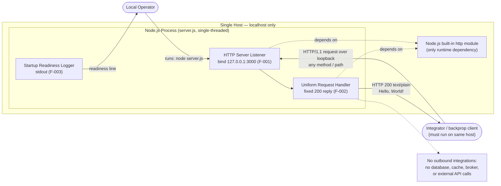
```mermaid
flowchart LR
    Operator(["Local Operator"])
    Client(["Integrator / backprop client<br/>(must run on same host)"])

    subgraph Host["Single Host — localhost only"]
        direction TB
        subgraph Proc["Node.js Process (server.js, single-threaded)"]
            direction TB
            Listener["HTTP Server Listener<br/>bind 127.0.0.1:3000 (F-001)"]
            Handler["Uniform Request Handler<br/>fixed 200 reply (F-002)"]
            Logger["Startup Readiness Logger<br/>stdout (F-003)"]
            Listener --> Handler
        end
        HttpMod["Node.js built-in http module<br/>(only runtime dependency)"]
    end

    NoOut["No outbound integrations:<br/>no database, cache, broker,<br/>or external API calls"]

    Operator -->|"runs: node server.js"| Listener
    Logger -->|"readiness line"| Operator
    Client -->|"HTTP/1.1 request over loopback<br/>any method / path"| Listener
    Handler -->|"HTTP 200 text/plain<br/>Hello, World!"| Client
    Handler -.->|"depends on"| HttpMod
    Listener -.->|"depends on"| HttpMod
    Handler -.-> NoOut
```

### 5.1.2 Core Components

The runtime system decomposes into three application responsibilities — all defined inside `server.js` and mapped one-to-one to the features in Section 2.1 — plus the Node.js `http` module that hosts them. `README.md` is documentation and is not a runtime component. Because tables in this specification are limited to four columns, the component inventory is presented as two complementary tables: the first covers responsibility, dependencies, and integration points; the second records the critical considerations for each component.

| Component | Primary Responsibility | Key Dependencies | Integration Points |
|---|---|---|---|
| HTTP Server Listener (F-001) | Instantiate the HTTP server and bind it to `127.0.0.1:3000` | Node.js `http` module (`createServer`, `listen`); OS loopback TCP stack | Inbound TCP/HTTP on `127.0.0.1:3000` |
| Uniform Request Handler (F-002) | Return fixed `200` / `text/plain` / `Hello, World!\n` for every request | `http` response API (`res.statusCode`, `res.setHeader`, `res.end`); depends on F-001 | Invoked in-process per inbound request by the listener |
| Startup Readiness Logger (F-003) | Emit one readiness line to `stdout` after a successful bind | `console.log`; the F-001 `listen` callback | Process `stdout` stream (operator/log collector) |
| Node.js built-in `http` module | Provide the server, `listen`, and request/response objects | Node.js runtime and its event loop | In-process standard-library API surface |

| Component | Critical Considerations |
|---|---|
| HTTP Server Listener (F-001) | Host/port are hard-coded (C-1); loopback bind limits reachability to localhost (A-2); a failed bind is unhandled and crashes the process (C-2 — `EADDRINUSE`, Section 4.6.2). |
| Uniform Request Handler (F-002) | Ignores method/URL/headers/body; no routing, validation, authentication, or content negotiation; stateless; the response is identical for all inputs. |
| Startup Readiness Logger (F-003) | The single readiness line is the *only* observability signal; there is no metrics endpoint, health check, or structured logging (C-3). |
| Node.js built-in `http` module | Supplies default response headers (`Date`, `Connection: keep-alive`, `Keep-Alive: timeout=5`) and default socket-error handling; runs on a single-threaded event loop with no clustering. |

### 5.1.3 Data Flow Description

**Primary data flows.** The system has two flows, both fully described in Section 4:

- **Startup / bind flow (W-1, one-time).** On `node server.js`, the process loads the `http` module and the `hostname`/`port` constants, creates the server, and calls `server.listen(3000, '127.0.0.1', cb)`. On a successful bind the `listen` callback writes the readiness line to `stdout`; if the bind fails the process terminates (Sections 4.1.3 and 4.6.2).
- **Request / response flow (W-2, per request).** A client on the same host opens a loopback TCP connection and sends any HTTP request. The listener hands the request to the inline handler, which sets status `200` and the `Content-Type` header and ends the response with the literal body. The `http` module serializes the response over the connection and, by default, keeps the TCP connection alive (`Keep-Alive: timeout=5`). The request object is never read.

**Integration patterns and protocols.** The single integration pattern is **synchronous, client-initiated HTTP request/response** over HTTP/1.1 in plaintext (no TLS). There is no asynchronous messaging, no publish/subscribe, no queueing, and no batch processing; the only "events" are the internal event-loop callbacks Node uses to drive `createServer` and `listen` (Section 4.3.4).

**Data transformation points.** There are effectively none at the application level. Inbound request data is not parsed, validated, routed, or transformed — the handler ignores `req` entirely (`server.js` line 6). The response body is a static string literal, so no serialization of application data occurs; the only transformation is performed by the Node.js `http` module, which frames the response (status line, `Date`, `Content-Length: 14`, and keep-alive headers) around the fixed body. This behavior was confirmed by direct runtime observation of the reproduced server.

**Key data stores and caches.** None exist. The service is stateless by construction: there is no database, file store, in-memory cache, session store, or message log anywhere in the codebase (Sections 3.5 and 4.5). The only in-process "state" is transient — the `server` object and the per-request `req`/`res` objects managed by the `http` module for the lifetime of a connection.

### 5.1.4 External Integration Points

At runtime the service integrates with **no external systems**. It exposes one inbound surface for callers and opens no outbound connections; the README names "backprop" as the intended integrating counterpart, but the repository ships no client library, SDK, credentials, or configuration for it — the integration is expected to occur externally by issuing HTTP requests to the local endpoint (Section 1.2.1). Git/GitHub is used only for source control and is a development-time concern, not a runtime integration (Section 3.6). The table below enumerates the integration surfaces (four-column limit observed; SLA requirements are addressed in the note that follows because none are declared).

| External System / Surface | Integration Type | Data Exchange Pattern | Protocol / Format |
|---|---|---|---|
| Local HTTP client / "backprop" integrator | Inbound (client-initiated) | Synchronous request → fixed response | HTTP/1.1 over loopback TCP; `text/plain` |
| Databases, caches, message brokers | None | — | — |
| External / third-party APIs (outbound) | None | — | — |
| Authentication / identity providers | None | — | — |

**SLA requirements.** The repository declares **no** SLA, latency budget, throughput target, availability objective, or timeout for any integration surface (Sections 1.2.3 and 2.2). The only timing value observable at runtime is Node.js's default `Keep-Alive: timeout=5` response header, which is a runtime default rather than an application-defined service level (Section 4.1.3). No performance or availability commitment can therefore be attributed to the system from its code.

## 5.2 Component Details

This section details each runtime component of the service. The application is one file, so the "components" below are the logical responsibilities inside `server.js` (mapped to features F-001, F-002, F-003 in Section 2.1) plus the Node.js `http` module that hosts them. For each component the same five aspects are addressed — purpose/responsibilities, technologies/frameworks, key interfaces/APIs, data-persistence requirements, and scaling considerations — followed by the required component-interaction, state-transition, and sequence diagrams.

### 5.2.1 `server.js` — Application Entry Point (Node.js Process)

- **Purpose and responsibilities.** The single executable artifact and the process boundary of the entire system. It wires the other components together: it imports the `http` module, declares the `hostname`/`port` constants, creates the server with the request-handler callback, and starts it with the readiness-logger callback (`server.js` lines 1–14).
- **Technologies and frameworks.** Plain CommonJS JavaScript (ES2015+ syntax: `const`, arrow function, template literal) executed by a Node.js runtime; no application framework and no third-party libraries (Section 3.2).
- **Key interfaces and APIs.** Exposes no programmatic API of its own; its only "interface" is the module top-level script that runs on `node server.js`. It consumes the `http` module API and the `console` API.
- **Data-persistence requirements.** None. It holds no state beyond the transient `server` object reference for the life of the process.
- **Scaling considerations.** One process per invocation, single-threaded on the Node.js event loop; there is no clustering, worker-thread, or multi-process orchestration in the file (constraint C-3 context; Section 2.4).

### 5.2.2 HTTP Server Listener (F-001)

- **Purpose and responsibilities.** Instantiate the HTTP server and bind it to the loopback address `127.0.0.1` on TCP port `3000`, establishing the system's sole inbound network interface (`server.js` lines 6, 12).
- **Technologies and frameworks.** Node.js built-in `http` module (`http.createServer`, `server.listen`) over the operating system's TCP/IP loopback stack.
- **Key interfaces and APIs.** `http.createServer(callback)` (line 6) and `server.listen(port, hostname, callback)` (line 12). The bound endpoint is `http://127.0.0.1:3000/`. Satisfies requirements F-001-RQ-001 (instantiate server) and F-001-RQ-002 (bind loopback:3000).
- **Data-persistence requirements.** None; the listener maintains only live TCP socket state managed by the `http` module.
- **Scaling considerations.** The address and port are hard-coded constants (C-1), so scaling to multiple ports/hosts would require code changes. Binding to loopback restricts reachability to the local host (A-2), which precludes network-level horizontal scaling without modification. A failed bind is not handled and terminates the process (C-2; Section 4.6.2), so multiple concurrent instances on the same port are not possible.

### 5.2.3 Uniform Request Handler (F-002)

- **Purpose and responsibilities.** Serve every inbound request with an identical, deterministic reply — HTTP `200`, `Content-Type: text/plain`, body `Hello, World!\n` — irrespective of method, URL path, headers, or body (`server.js` lines 6–10).
- **Technologies and frameworks.** The `http` module's response API, invoked as the inline `createServer` callback; no routing library, middleware chain, parser, or template engine.
- **Key interfaces and APIs.** `res.statusCode = 200` (line 7), `res.setHeader('Content-Type', 'text/plain')` (line 8), `res.end('Hello, World!\n')` (line 9). The `req` argument is never read. Satisfies F-002-RQ-001 (fixed response contract) and F-002-RQ-002 (uniform, input-independent response).
- **Data-persistence requirements.** None; the handler is a pure function of no inputs and reads/writes no shared state (stateless, shared-nothing).
- **Scaling considerations.** Because the handler is stateless and performs no I/O beyond writing a 14-byte body, a single event loop can multiplex many concurrent connections; horizontal replication would be trivial *in principle* but no replication or load-balancing mechanism is provided (Section 2.4.1).

### 5.2.4 Startup Readiness Logger (F-003)

- **Purpose and responsibilities.** After a successful bind, emit exactly one readiness line to standard output so an operator or harness can confirm the service is up and learn its address (`server.js` lines 12–14).
- **Technologies and frameworks.** Node.js `console.log` writing to the process `stdout` stream, invoked from the `server.listen` callback.
- **Key interfaces and APIs.** `console.log(\`Server running at http://${hostname}:${port}/\`)` (line 13); the message is interpolated from the same constants used to bind, so it always reflects the actual listen address. Satisfies F-003-RQ-001.
- **Data-persistence requirements.** None; the line is written to a stream, not stored.
- **Scaling considerations.** Exactly one line per process start; it is not a throughput-bearing path and imposes no scaling constraint. It is also the *only* observability signal — there is no metrics or health endpoint (C-3).

### 5.2.5 Node.js Built-in `http` Module (Runtime Substrate)

- **Purpose and responsibilities.** Provide the HTTP server machinery: connection acceptance, request/response object construction, HTTP framing, and default connection management. It is the only runtime dependency and is versioned with the Node.js runtime itself (Section 3.2.1).
- **Technologies and frameworks.** Node.js standard library; runs on the runtime's single-threaded, non-blocking event loop (reactor pattern).
- **Key interfaces and APIs.** `http.createServer`, the `Server` object (`listen`, `'error'` event), and the `req`/`res` objects (`IncomingMessage`/`ServerResponse`). It supplies default response headers observed at runtime — `Date`, `Connection: keep-alive`, `Keep-Alive: timeout=5`, and `Content-Length` — none of which are set by application code.
- **Data-persistence requirements.** None; it manages only transient in-memory socket/connection state.
- **Scaling considerations.** Concurrency is achieved through non-blocking I/O on one event loop rather than threads; the module does not itself provide clustering. Its default `keepAliveTimeout` (5 s, surfaced as `Keep-Alive: timeout=5`) governs idle connection reuse and is a runtime default, not an application setting (Section 4.1.3).

### 5.2.6 Component Interaction Diagram

The following diagram shows how the components are wired together at startup and how the `http` module invokes the two callbacks — the request handler (per request) and the readiness logger (once, on successful bind). Solid edges are direct calls/registrations; the dashed edge marks the runtime provision of the `Server` object by the `http` module.

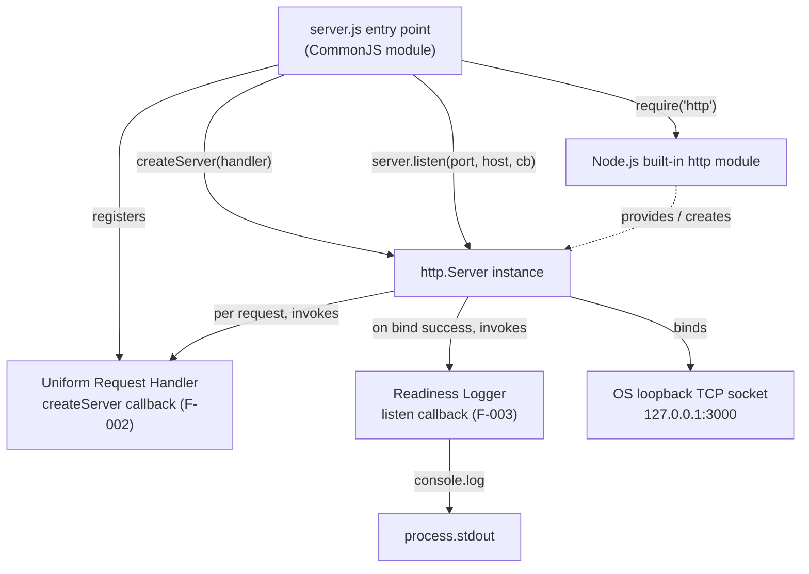
```mermaid
flowchart TD
    Entry["server.js entry point<br/>(CommonJS module)"]
    HttpMod["Node.js built-in http module"]
    Server["http.Server instance"]
    Handler["Uniform Request Handler<br/>createServer callback (F-002)"]
    LogCb["Readiness Logger<br/>listen callback (F-003)"]
    Stdout["process.stdout"]
    Socket["OS loopback TCP socket<br/>127.0.0.1:3000"]

    Entry -->|"require('http')"| HttpMod
    Entry -->|"createServer(handler)"| Server
    Entry -->|"registers"| Handler
    Entry -->|"server.listen(port, host, cb)"| Server
    Server -->|"binds"| Socket
    Server -->|"per request, invokes"| Handler
    Server -->|"on bind success, invokes"| LogCb
    LogCb -->|"console.log"| Stdout
    HttpMod -.->|"provides / creates"| Server
```

### 5.2.7 State Transition Diagram

The process/server has a small, well-defined lifecycle. From `Created` (server object built but not yet bound) it either reaches `Listening` on a successful bind or goes directly to `Terminated` if the bind fails (`EADDRINUSE`). While `Listening`, it serves each request with the fixed reply and remains in the same state (statelessness — no request mutates server state). Termination is always external (an operator signal or kill), because no graceful-shutdown or restart logic exists (constraint C-3; Section 4.5).

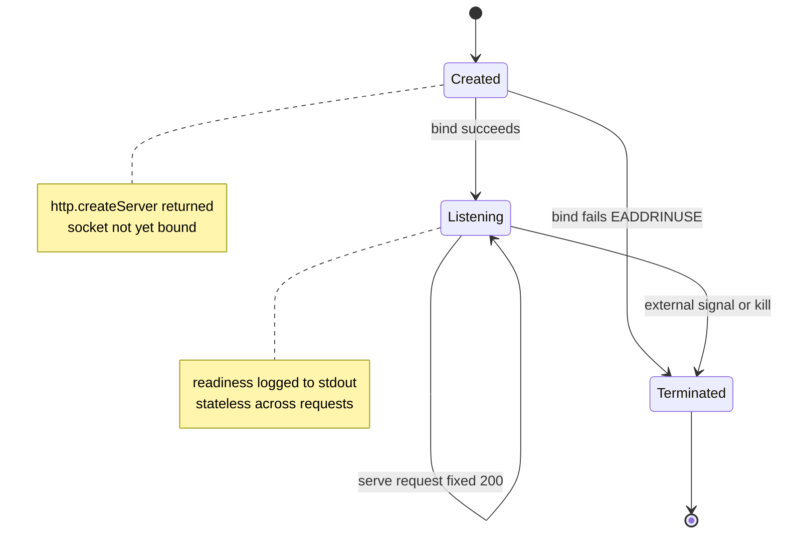
```mermaid
stateDiagram-v2
    [*] --> Created
    Created --> Listening : bind succeeds
    Created --> Terminated : bind fails EADDRINUSE
    Listening --> Listening : serve request fixed 200
    Listening --> Terminated : external signal or kill
    Terminated --> [*]
    note right of Created
        http.createServer returned
        socket not yet bound
    end note
    note right of Listening
        readiness logged to stdout
        stateless across requests
    end note
```

### 5.2.8 Sequence Diagrams for Key Flows

**Startup / bind flow (W-1).** The operator runs the script; the runtime creates the server and calls `listen`; the outcome branches on whether the loopback port is free. On success the readiness line is logged; on `EADDRINUSE` the unhandled `'error'` event becomes an uncaught exception that terminates the process (Section 4.6.2).

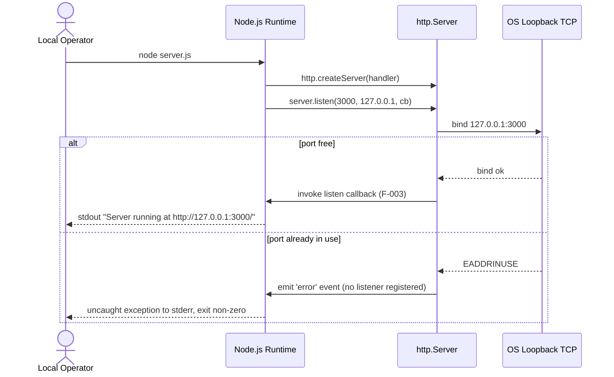
```mermaid
sequenceDiagram
    actor Op as Local Operator
    participant Node as Node.js Runtime
    participant Srv as http.Server
    participant OS as OS Loopback TCP
    Op->>Node: node server.js
    Node->>Srv: http.createServer(handler)
    Node->>Srv: server.listen(3000, 127.0.0.1, cb)
    Srv->>OS: bind 127.0.0.1:3000
    alt port free
        OS-->>Srv: bind ok
        Srv->>Node: invoke listen callback (F-003)
        Node-->>Op: stdout "Server running at http://127.0.0.1:3000/"
    else port already in use
        OS-->>Srv: EADDRINUSE
        Srv->>Node: emit 'error' event (no listener registered)
        Node-->>Op: uncaught exception to stderr, exit non-zero
    end
```

**Request / response flow (W-2).** A same-host client sends any request; the listener invokes the handler, which ignores the request and writes the fixed reply. The `http` module frames the response and, by default, keeps the connection alive.

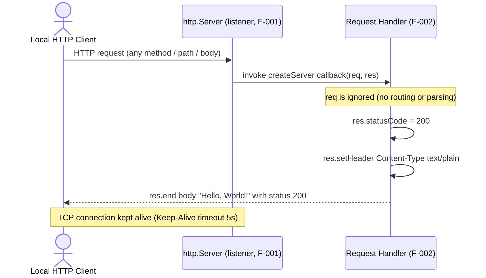
```mermaid
sequenceDiagram
    actor Cli as Local HTTP Client
    participant Srv as http.Server (listener, F-001)
    participant H as Request Handler (F-002)
    Cli->>Srv: HTTP request (any method / path / body)
    Srv->>H: invoke createServer callback(req, res)
    Note over H: req is ignored (no routing or parsing)
    H->>H: res.statusCode = 200
    H->>H: res.setHeader Content-Type text/plain
    H-->>Cli: res.end body "Hello, World!" with status 200
    Note over Srv,Cli: TCP connection kept alive (Keep-Alive timeout 5s)
```

## 5.3 Technical Decisions

This section records the architectural decisions embodied in the code and the tradeoffs they imply. The repository contains **no written ADRs, design notes, or configuration** that state rationale explicitly; the decisions below are therefore *reconstructed from the observable implementation* (`server.js`) and the constraint inventory in Section 2.4, and are justified against the project's stated purpose as a minimal integration-test fixture (`README.md`; Sections 1.1 and 3.2.3). No decision, tradeoff, or alternative is attributed to the authors beyond what the code demonstrates.

### 5.3.1 Architecture Style Decisions and Tradeoffs

The overarching decision is to implement the smallest thing that exposes a real HTTP endpoint: a **single-process, single-file, stateless service on the Node.js standard library**, with no framework, no layering, and no externalized configuration. This is well matched to a disposable test target where predictability and zero setup matter more than extensibility. The principal tradeoffs are summarized below (three-column table; the ADRs in Section 5.3.6 expand each with context and consequences).

| Decision Area | Chosen Approach | Primary Tradeoff |
|---|---|---|
| Framework | Node.js built-in `http` only; no Express/Fastify | No routing/middleware affordances if the system ever needs to grow |
| Dependencies | Zero third-party packages; no `package.json` | No dependency management, version pinning, or `engines` guarantee |
| Response model | One fixed, uniform response for all requests | Cannot serve differentiated content; purely a fixture |
| Configuration | Hard-coded `hostname`/`port`/body literals (C-1) | Any change (address, port, payload) requires editing code |
| Process model | Single, single-threaded process; no clustering | No built-in horizontal scaling or multi-core utilization |

### 5.3.2 Communication Pattern Choice

The system uses exactly one communication pattern: **synchronous, client-initiated HTTP/1.1 request/response** over the loopback interface, in plaintext (`server.js` lines 6–10, 12). There is no asynchronous messaging, event streaming, publish/subscribe, RPC, queueing, or batch pipeline anywhere in the code (Section 4.3.4). This choice follows directly from the requirement — the "backprop" integrator validates behavior by issuing HTTP requests and reading the reply (Section 1.2.1) — and from the decision to depend only on the `http` module, which natively provides the request/response primitive. The tradeoff is that any interaction style beyond simple synchronous HTTP (e.g., long-lived streams, callbacks to the client, or message-broker delivery) is unsupported, which is acceptable for a fixture but not for a general service.

### 5.3.3 Data Storage and Caching Rationale

**Data storage.** The service intentionally has **no data store** — no database, ORM, file persistence, or session store (Section 3.5). The rationale is that the response is a compile-time constant that depends on no inputs and no prior requests, so there is nothing to persist; adding storage would introduce state, dependencies, and failure modes with no functional benefit for a fixed-response fixture. The tradeoff is that the service has no memory of any request and cannot support any stateful use case, which is by design (constraint C-4).

**Caching.** There is likewise **no application caching layer** (no in-memory cache, no CDN, no reverse-proxy cache configured by the repo). Caching would be redundant because the single response is already a static in-memory literal returned without computation or I/O; there is no expensive result to memoize. The only cache-adjacent behavior observable at runtime is HTTP connection reuse via Node's default `Connection: keep-alive` / `Keep-Alive: timeout=5`, which is a transport optimization supplied by the `http` module rather than an application caching decision (Section 4.1.3).

### 5.3.4 Security Mechanism Selection

The security posture is **"minimize exposure rather than add controls."** The only active security mechanism is the network-scoping decision to bind to the loopback address, which limits reachability to the same host; no authentication, authorization, TLS, CORS, input validation, or rate limiting is implemented (Section 2.4.1). This is defensible for a local test fixture — the constant response discloses no sensitive data and the endpoint is not network-exposed — but it means the service provides no confidentiality, integrity-in-transit, or access control and is therefore unsuitable for production or multi-tenant use (constraint C-4).

| Mechanism | Present? | Rationale / Basis in Code |
|---|---|---|
| Loopback-only binding | Yes | `hostname = '127.0.0.1'` (line 3) restricts reachability to localhost — the sole active control |
| TLS / HTTPS | No | Server created via `http.createServer` (not `https`); plaintext is sufficient for a same-host fixture |
| Authentication / authorization | No | Handler ignores `req`; every caller receives the same reply — no identity or access checks |
| Input validation / CORS / rate limiting | No | No request data is read or constrained; not needed for a constant response |

### 5.3.5 Decision Tree

The decision tree below reconstructs the "no" answers that collapse a general web-service design down to the observed single-file implementation. Each branch corresponds to a capability the fixture does **not** require, and therefore does not include.

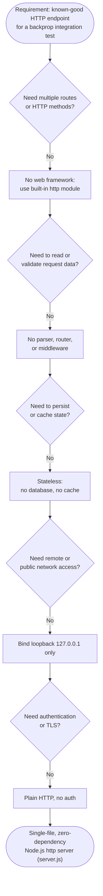
```mermaid
flowchart TD
    Start(["Requirement: known-good HTTP endpoint<br/>for a backprop integration test"])
    Q1{"Need multiple routes<br/>or HTTP methods?"}
    Q2{"Need to read or<br/>validate request data?"}
    Q3{"Need to persist<br/>or cache state?"}
    Q4{"Need remote or<br/>public network access?"}
    Q5{"Need authentication<br/>or TLS?"}
    D1["No web framework:<br/>use built-in http module"]
    D2["No parser, router,<br/>or middleware"]
    D3["Stateless:<br/>no database, no cache"]
    D4["Bind loopback 127.0.0.1 only"]
    D5["Plain HTTP, no auth"]
    Result(["Single-file, zero-dependency<br/>Node.js http server (server.js)"])
    Start --> Q1
    Q1 -->|"No"| D1 --> Q2
    Q2 -->|"No"| D2 --> Q3
    Q3 -->|"No"| D3 --> Q4
    Q4 -->|"No"| D4 --> Q5
    Q5 -->|"No"| D5 --> Result
```

### 5.3.6 Architecture Decision Records (ADRs)

The following ADRs are reconstructed from the implementation; all are effectively **Accepted** (each is realized in the committed code, baseline v1.0 at commit `1484182`). The summary table lists every decision; detailed records follow for the four most architecturally significant ones.

| ADR | Decision | Status | Key Consequence |
|---|---|---|---|
| ADR-01 | Use Node.js built-in `http`; no web framework | Accepted | Zero deps and instant run; no routing/middleware |
| ADR-02 | Zero third-party dependencies (no `package.json`) | Accepted | No supply-chain/upgrade burden; no version/`engines` pin |
| ADR-03 | Single uniform fixed response; no routing | Accepted | Deterministic and trivially assertable; cannot vary output |
| ADR-04 | Bind to loopback `127.0.0.1` only | Accepted | Safe local exposure; unreachable off-host |
| ADR-05 | Hard-coded configuration; no env/config (C-1) | Accepted | Simple; requires code edits to change behavior |
| ADR-06 | Plain HTTP; no authentication/authorization/TLS | Accepted | Minimal and sufficient locally; no confidentiality/access control |
| ADR-07 | Stateless; no persistence or caching | Accepted | No data layer to manage; no request memory |
| ADR-08 | No explicit error handling or graceful shutdown | Accepted | Minimal code; bind failure crashes; recovery is external (C-2, C-3) |

**ADR-01 — Build on the Node.js built-in `http` module (no web framework).**

| Aspect | Detail |
|---|---|
| Context | A single HTTP endpoint is needed as a known-good integration target; no routing or middleware is required. |
| Decision | Import only the standard-library `http` module and register one inline handler (`server.js` lines 1, 6). |
| Alternatives | Express/Fastify/Koa (added abstraction and dependencies) — not adopted. |
| Consequences | Zero install/build, no dependency-vulnerability surface, one small file; but no framework routing, parsing, or middleware if requirements grow (Section 3.2.3). |

**ADR-04 — Bind to the loopback interface only.**

| Aspect | Detail |
|---|---|
| Context | The fixture is exercised by a same-host integrator; broad network exposure is undesirable for a test target. |
| Decision | Bind `server.listen` to `127.0.0.1:3000` via hard-coded constants (`server.js` lines 3–4, 12). |
| Alternatives | Binding `0.0.0.0`/a public interface (wider reachability, larger attack surface) — not adopted. |
| Consequences | Reachability is limited to localhost (assumption A-2); the client must run on the same host, and no network-level scaling is possible without code change. |

**ADR-06 — Plain HTTP with no authentication, authorization, or TLS.**

| Aspect | Detail |
|---|---|
| Context | The response is a non-sensitive constant served only on loopback. |
| Decision | Use `http` (not `https`) and perform no identity/access checks (`server.js` lines 6–10). |
| Alternatives | TLS termination and an auth layer (confidentiality/access control) — not adopted for a local fixture. |
| Consequences | No transport encryption or access control; acceptable locally but unsuitable for production (constraint C-4; Section 2.4.1). |

**ADR-08 — No explicit error handling or graceful shutdown.**

| Aspect | Detail |
|---|---|
| Context | The happy path (bind, serve, log) is all the fixture needs to demonstrate. |
| Decision | Register no `'error'` listener, no `try/catch`, and no `SIGTERM`/`SIGINT` handler (`server.js`, verified across the whole file). |
| Alternatives | Bind-retry/fallback port, health checks, graceful drain — not adopted. |
| Consequences | A failed bind (`EADDRINUSE`) throws an uncaught exception and terminates the process; recovery is entirely external (constraints C-2, C-3; Section 4.6). |

## 5.4 Cross-Cutting Concerns

Cross-cutting concerns are, for this service, defined largely by what is deliberately absent. The application is a 15-line fixture with a single `stdout` log line and no instrumentation, so this section documents the *actual* behavior for each concern rather than an idealized capability, and flags where a concern is not addressed in code. All findings are grounded in `server.js`, runtime verification, and Sections 2.4, 3.6, and 4.6.

### 5.4.1 Monitoring and Observability

The only observability signal the application emits is the single startup readiness line written to `stdout` (`Server running at http://127.0.0.1:3000/`; F-003, `server.js` lines 12–14). There is no metrics endpoint, health/readiness probe, telemetry export, or APM integration anywhere in the code (constraint C-3; Section 3.4.2). Because every request returns `200`, an external caller could treat a successful request to `http://127.0.0.1:3000/` as a *de facto* liveness check, but no dedicated health endpoint or monitoring hook exists.

| Aspect | Present? | Actual Behavior / Basis |
|---|---|---|
| Startup readiness signal | Yes | One `stdout` line on successful bind (F-003) |
| Metrics (e.g., `/metrics`, counters, gauges) | No | No metrics instrumentation in `server.js` |
| Health-check endpoint | No | No dedicated route; any request returns `200` (de facto liveness only) |
| Distributed tracing / APM | No | No trace/telemetry libraries; single in-process component |

### 5.4.2 Logging and Tracing Strategy

Application logging is limited to the one `console.log` readiness line at startup; there is **no request/access logging, no structured (JSON) logging, no log levels, and no log rotation** (`server.js`; Section 4.2). There is no distributed tracing, no correlation/trace-context propagation, and no logging framework — consistent with a single-process, single-file design that emits one deterministic line. The only other output the process can produce is written by the Node.js runtime itself: on a fatal, unhandled condition (e.g., the `EADDRINUSE` bind failure), Node prints an exception stack trace to `stderr` before exiting (Section 4.6.2). Log destination is therefore whatever stream captures the process's `stdout`/`stderr` (a terminal or an attached collector); the application makes no assumptions about it.

### 5.4.3 Error Handling Patterns

The dominant pattern is **"no explicit handling; delegate to Node.js defaults."** The application registers no `'error'` listener, no `try/catch`, and no `SIGTERM`/`SIGINT` handler (verified across the whole file; constraint C-2). Two error categories result:

- **Startup / bind-time (fatal).** If the loopback port is already bound, `server.listen` emits an `'error'` event with `code: 'EADDRINUSE'`; because no listener is registered, Node throws it as an uncaught exception, prints a stack trace to `stderr`, and exits with a non-zero code. A pre-existing first instance is unaffected (Section 4.6.2).
- **Request-time (delegated).** The handler contains no branches and never throws — it always writes the fixed reply — so there is no application-level request error path. Low-level socket errors are handled by the Node.js `http` module's defaults, not by application code, and the server continues serving.

No resilience patterns are present: **no retry, no fallback/alternate-port, no circuit breaker, no bulkhead, and no self-healing** (Section 4.6.3). The diagram below shows how an error propagates from the application layer, through the runtime, to either process termination or continued operation, with recovery living entirely outside the process.

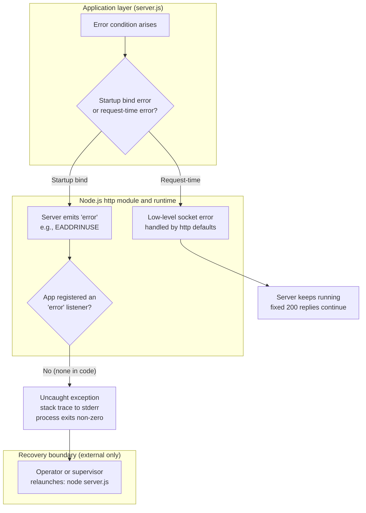
```mermaid
flowchart TD
    subgraph App["Application layer (server.js)"]
        direction TB
        Start["Error condition arises"]
        C1{"Startup bind error<br/>or request-time error?"}
        Start --> C1
    end
    subgraph Runtime["Node.js http module and runtime"]
        direction TB
        BindErr["Server emits 'error'<br/>e.g., EADDRINUSE"]
        NoListener{"App registered an<br/>'error' listener?"}
        SockErr["Low-level socket error<br/>handled by http defaults"]
        BindErr --> NoListener
    end
    Crash["Uncaught exception<br/>stack trace to stderr<br/>process exits non-zero"]
    Continue["Server keeps running<br/>fixed 200 replies continue"]
    subgraph Recovery["Recovery boundary (external only)"]
        direction TB
        Ext["Operator or supervisor<br/>relaunches: node server.js"]
    end
    C1 -->|"Startup bind"| BindErr
    C1 -->|"Request-time"| SockErr
    NoListener -->|"No (none in code)"| Crash
    SockErr --> Continue
    Crash --> Ext
```

### 5.4.4 Authentication and Authorization Framework

There is **no authentication or authorization framework**. The handler ignores the request entirely, so there is no identity establishment, no session or token handling, no API keys, and no role/permission (RBAC) checks — every caller receives the same reply (`server.js` lines 6–10; Section 4.4.3). The single access-control mechanism is architectural rather than credential-based: binding to `127.0.0.1` restricts reachability to the local host (ADR-04, Section 5.3.4). This is acceptable for a non-sensitive local fixture but provides no per-caller access control.

| Mechanism | Present? | Basis in Code |
|---|---|---|
| Authentication (identity) | No | `req` is never read; no credential handling |
| Authorization (RBAC/scopes) | No | No access checks; uniform response for all callers |
| Session / token management | No | Stateless; no cookies, JWTs, or API keys |
| Network scoping (loopback) | Yes | `hostname = '127.0.0.1'` limits reachability to localhost |

### 5.4.5 Performance Requirements and SLAs

The repository declares **no performance requirements and no SLAs** — no latency budget, throughput target, availability objective, or concurrency limit exists in code or documentation (Sections 1.2.3, 2.2). To avoid fabricating targets, only *qualitative* characteristics that follow from the code are stated: the request handler performs no I/O and returns a 14-byte constant, so per-request work is trivial and runs synchronously on Node's single-threaded, non-blocking event loop; concurrency is bounded by that single loop rather than by any configured limit. The service sets no socket or request timeouts; the only timing value observable at runtime is Node's default `Keep-Alive: timeout=5` response header, which is a runtime default, not an application service level.

| Attribute | Declared in Repo? | Observed Basis (not an SLA) |
|---|---|---|
| Latency / response-time target | No | Constant-time handler, no I/O; no figure measured or promised |
| Throughput / concurrency target | No | Single event loop; no configured limit |
| Availability objective | No | Single process; no redundancy or uptime commitment |
| Timeout configuration | No | App sets none; Node default keep-alive `timeout=5` only |

### 5.4.6 Disaster Recovery Procedures

The repository provides **no disaster-recovery mechanism** — no backups, redundancy, failover, process supervisor, restart policy, or graceful-shutdown routine (constraints C-2, C-3; Sections 3.6, 4.6.3). Two properties make DR simple in practice, however. First, the service is **stateless**: it persists no data, so there is nothing to back up and no data-loss (RPO) concern — a restart fully restores functionality, dropping at most any in-flight connections. Second, recovery is **entirely external**: because a fatal error terminates the process with no self-heal, restoring service requires an operator or an external process supervisor / container restart policy to relaunch `node server.js`; no such supervisor is included in the repository. No RTO/RPO objectives are defined.

| DR Concern | Provided in Repo? | Actual Behavior |
|---|---|---|
| Data backup / restore | Not applicable | Stateless — no persistent data to back up (Section 4.5) |
| Redundancy / failover | No | Single process; no standby or load balancer |
| Automated restart / supervision | No | No process manager or restart policy committed (C-3) |
| Recovery action | External only | Operator/supervisor relaunches `node server.js` (Section 4.6.3) |

## 5.5 References

The following repository artifacts and previously authored specification sections were examined as evidence for Section 5.

**Repository files and folders**

- `server.js` - The sole executable artifact (15 lines); established the entire runtime architecture: the `require('http')` dependency (line 1), the hard-coded `hostname`/`port` constants (lines 3–4), the `http.createServer` inline handler that returns a fixed `200`/`text/plain`/`Hello, World!\n` reply (lines 6–10), and the `server.listen` call with the readiness-logging callback (lines 12–14). Basis for every component, data-flow, decision, and cross-cutting statement in this section.
- `README.md` - Two-line project description; established the project name (`hao-backprop-test`) and its stated purpose as a "test project for backprop integration," which frames the architecture-style rationale.
- Repository root (`/`) - Folder listing established that the repository contains only `server.js` and `README.md` — no `package.json`/manifest, `node_modules`, configuration, tests, databases, Dockerfiles, or CI/CD — confirming the absence of the components, integrations, stores, and pipelines discussed as "not present" throughout Section 5.

**Runtime verification**

- Direct runtime reproduction of `server.js` (Node.js v22.23.1) - Confirmed the startup log line, the uniform `200`/`text/plain`/`Content-Length: 14` response for differing methods and paths, the Node-supplied default headers (`Date`, `Connection: keep-alive`, `Keep-Alive: timeout=5`), and the unhandled `EADDRINUSE` crash of a second instance. Used to substantiate the data-flow, sequence, and error-handling descriptions.

**Cross-referenced specification sections**

- Section 1.1 Executive Summary - Purpose of the service as an integration-test fixture.
- Section 1.2 System Overview - High-level capabilities, single-component structure, and the "only runtime dependency is the built-in `http` module" finding.
- Section 2.1 Feature Catalog - Feature identifiers and definitions (F-001 HTTP Server Listener, F-002 Uniform HTTP Response Handler, F-003 Startup Readiness Logging) used as the component names.
- Section 2.2 Functional Requirements - Requirement identifiers (F-001-RQ-001/002, F-002-RQ-001/002, F-003-RQ-001) and the absence of declared performance criteria.
- Section 2.4 Implementation Considerations - Assumptions (A-1, A-2) and constraints (C-1 fixed config, C-2 unhandled errors, C-3 no shutdown/health/metrics, C-4 not production-grade) cited in the decisions and cross-cutting subsections.
- Section 3.2 Frameworks & Libraries - Confirmed no framework and no third-party libraries; only the standard-library `http` module.
- Section 3.4 Third-Party Services & Integrations - Confirmed zero runtime third-party integrations (single inbound HTTP surface only).
- Section 3.5 Databases & Storage - Confirmed the absence of any database or storage layer.
- Section 3.6 Development & Deployment - Deployment model (`node server.js`), single stateless single-threaded process, and absence of build/containerization/CI-CD.
- Section 4.1 System Workflows Overview - Actors and boundaries and the two workflows (W-1 Startup & Bind, W-2 Request/Response) used in the data-flow and sequence subsections.
- Section 4.2 Core Business Process Flows - Per-feature flow detail corroborating the component descriptions.
- Section 4.3 Integration and Sequence Workflows - Confirmed the single synchronous HTTP request/response pattern and the absence of event/batch processing.
- Section 4.4 Validation Rules and Authorization Checkpoints - Confirmed the absence of validation and authorization checks.
- Section 4.5 State Management and Transaction Boundaries - Statelessness and the absence of persistence, caching, and transactions.
- Section 4.6 Error Handling and Recovery Flows - The `EADDRINUSE` startup-failure path and the absence of retry/fallback/self-heal, cited in the error-handling and disaster-recovery subsections.

No external web sources were required for this section; all facts are grounded in direct repository inspection and runtime verification.

# 6. SYSTEM COMPONENTS DESIGN

## 6.1 Core Services Architecture

### 6.1.1 Applicability Assessment

**Core Services Architecture is not applicable for this system.**

The `hao-backprop-test` repository implements its entire runtime as a **single, single-threaded Node.js process** defined in one file (`server.js`), built directly on the Node.js standard-library `http` module with **zero third-party dependencies and no application framework** (`server.js` line 1: `const http = require('http')`). There is exactly one process, one deployable unit, and one logical component; the system is therefore a self-contained single-service program, not a set of cooperating services.

A Core Services Architecture — in the microservices / distributed sense addressed by this section's prompt — presupposes **multiple independently deployable services** that must be bounded against one another, discover one another, be load-balanced, and be made resilient to one another's partial failure. None of those preconditions exists in this codebase:

- The repository root contains only two tracked files — `server.js` and `README.md` — with no additional processes, no sub-services, and no subfolders (verified against git `HEAD`, which tracks exactly these two files).
- Sections 5.1.1 and 5.3.1 already characterize the architecture as **single-process, single-tier, and stateless**, and explicitly as *neither layered nor distributed*, with exactly one process and one component.
- The sole communication pattern is synchronous, client-initiated HTTP/1.1 request/response over the loopback interface; per Section 5.3.2 there is no asynchronous messaging, event streaming, publish/subscribe, RPC, queueing, or batch pipeline anywhere in the code.

This minimalism is deliberate rather than incidental. `README.md` declares the project a *"test project for backprop integration"* — a controlled, known-good HTTP endpoint rather than a production application (constraint **C-4**, Section 2.4.2). The governing design decision (Section 5.3.1, ADR-01) is to implement the smallest artifact that still exposes a real network endpoint, which by construction excludes the multi-service topology that a Core Services Architecture describes.

**Building-block assessment.** The table below maps the defining building blocks of a core/microservices architecture to their presence in this repository. Every one is verifiably absent.

| Core-Services Building Block | Present? | Evidence / Actual Behavior |
|---|---|---|
| Multiple independently deployable services | No | One process, one file (`server.js`); a single logical component (Section 5.1.1) |
| Distributed / multi-tier topology | No | Single-tier on one host; "neither layered nor distributed" (Sections 5.1.1, 5.3.1) |
| Inter-service communication (RPC, messaging, pub/sub) | No | Only client-to-process HTTP/1.1; no messaging, RPC, or queueing (Section 5.3.2) |
| Service discovery / registry | No | Endpoint is the hardcoded constant `127.0.0.1:3000` (constraint C-1); no registry or DNS-SD |
| Load balancer / reverse proxy | No | Single instance; a second instance crashes on `EADDRINUSE`; none provided (Section 5.2.2) |
| Orchestration / auto-scaling platform | No | No `package.json`, Dockerfile, manifest, or orchestrator; one process (Sections 2.4.1, 3.6) |
| Shared data store / stateful backing service | No | Stateless by construction; no database, cache, or session store (Sections 5.1.3, 5.3.3) |

**How the remainder of this section is organized.** Because the section prompt enumerates specific concern areas, the sub-sections that follow do not fabricate a distributed design. Instead, each documents — per required area — *why* the microservices/distributed pattern does not apply and *what the single-process system does in its place*, so that the section remains a useful reference for operators and integrators:

- **6.1.2 Service Components Analysis** — service boundaries and responsibilities, inter-service communication, service discovery, load balancing, circuit breakers, and retry/fallback.
- **6.1.3 Scalability Design Assessment** — horizontal/vertical scaling, auto-scaling triggers, resource allocation, performance-optimization techniques, and capacity planning.
- **6.1.4 Resilience Patterns Assessment** — fault tolerance, disaster recovery, data redundancy, failover configuration, and service-degradation policy.

Each of 6.1.2 through 6.1.4 includes the labeled Mermaid diagram required by the prompt, adapted to depict the actual single-service reality rather than an invented distributed topology.

### 6.1.2 Service Components Analysis

Because the system comprises exactly one process, the concerns in this area either collapse to a single trivial case (service boundary and responsibilities) or do not apply at all (inter-service communication, discovery, load balancing, circuit breakers, retry/fallback). Each is documented below, grounded in `server.js` and Sections 5.1–5.3 and 4.6.

**Service boundaries and responsibilities.** There is exactly one service boundary: the single Node.js process running `server.js` on one host (Section 5.1.1). Within that process live three logical responsibilities. They are co-located functions — not separately deployable services — and they interact only through ordinary in-process invocation driven by the Node.js `http` module and event loop:

| Logical Responsibility (Feature) | Responsibility | In-Process Trigger |
|---|---|---|
| HTTP Server Listener (F-001) | Create the server and bind `127.0.0.1:3000` | `http.createServer` + `server.listen` (`server.js` L6, L12) |
| Uniform Request Handler (F-002) | Return fixed `200` / `text/plain` / `Hello, World!` for every request | Invoked per request by the listener (`server.js` L6–10) |
| Startup Readiness Logger (F-003) | Emit one stdout readiness line after a successful bind | Invoked once by the `listen` callback (`server.js` L12–14) |

These three responsibilities share the same process, the same single-threaded event loop, and the same `server` object; none is network-addressable, and none exposes an internal API to the others (Section 5.2). The diagram below fixes the single service boundary, the one same-host caller, and the explicit absence of any peer service, registry, broker, or load balancer.

**Diagram 6.1.2-A — Service Interaction (single service; no peer services or intermediaries).**

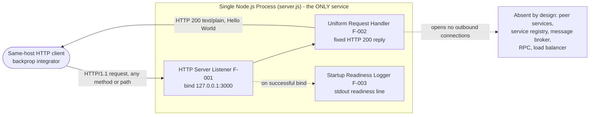
```mermaid
flowchart LR
    Client(["Same-host HTTP client<br/>backprop integrator"])

    subgraph Process["Single Node.js Process (server.js) - the ONLY service"]
        direction TB
        Listener["HTTP Server Listener F-001<br/>bind 127.0.0.1:3000"]
        Handler["Uniform Request Handler F-002<br/>fixed HTTP 200 reply"]
        Logger["Startup Readiness Logger F-003<br/>stdout readiness line"]
        Listener --> Handler
        Listener -.->|on successful bind| Logger
    end

    Absent["Absent by design: peer services,<br/>service registry, message broker,<br/>RPC, load balancer"]

    Client -->|"HTTP/1.1 request, any method or path"| Listener
    Handler -->|"HTTP 200 text/plain, Hello World"| Client
    Handler -.->|opens no outbound connections| Absent
```

**Inter-service communication patterns.** Not applicable — with only one service there is no service-to-service communication. The only exchange that crosses the process boundary is the inbound, synchronous, client-initiated HTTP/1.1 request/response over the loopback TCP interface (Sections 5.1.3, 5.3.2). The process opens **no outbound connections** of any kind: it imports only the built-in `http` module and never creates a client socket, database client, or message-broker connection (Section 5.1.4).

**Service discovery mechanisms.** None, and none is required. The listen address is the hardcoded literal pair `hostname = '127.0.0.1'` / `port = 3000` (`server.js` L3–4), so there is nothing to register and no registry to consult. There is no DNS-based discovery, no service registry (e.g., Consul/etcd/ZooKeeper), and no environment-variable or configuration-driven endpoint resolution (constraint C-1, Section 2.4.2). A client locates the endpoint only through prior knowledge of the fixed loopback address (assumption A-2).

**Load balancing strategy.** None. A single process binds a single port, and because the bind is exclusive, a second instance on the same port fails immediately with `EADDRINUSE` and terminates (Sections 5.2.2, 4.6.2) — multiple instances cannot coexist without code changes. No load balancer, reverse proxy, or Node clustering (`node:cluster`) is present. Concurrency is absorbed *within* the single process by the non-blocking event loop rather than distributed across instances (Section 5.2.5).

**Circuit breaker patterns.** Not applicable. A circuit breaker guards calls to downstream dependencies; this system has **no downstream dependencies** — no database, cache, external API, or peer service to call (Section 5.1.4). With nothing to protect against, there is no circuit-breaker library or logic, and none is needed.

**Retry and fallback mechanisms.** None. Section 4.6.3 records both as absent: a failed `listen` is not retried, and there is no fallback port or host because the `hostname`/`port` constants have no alternate path. At request time the handler performs no I/O and invokes nothing that could fail transiently, so there is no retry surface. Recovery from a fatal condition is entirely external (Section 4.6.3; expanded in 6.1.4).

**Summary.** The table consolidates the six service-component concerns for this single-process system.

| Service-Component Concern | Applicable? | Implementation / Actual Behavior |
|---|---|---|
| Service boundaries & responsibilities | Trivial (one) | One process boundary; three in-process responsibilities F-001/F-002/F-003 (Section 5.2) |
| Inter-service communication | Not applicable | Only inbound client HTTP/1.1 over loopback; no outbound connections (Sections 5.1.4, 5.3.2) |
| Service discovery | Not applicable | Hardcoded `127.0.0.1:3000` (C-1); no registry or DNS-SD |
| Load balancing | None | Single instance/port; `EADDRINUSE` on a second; event-loop concurrency only (Section 5.2.2) |
| Circuit breaker | Not applicable | No downstream dependencies to protect (Section 5.1.4) |
| Retry & fallback | None | No retry, no alternate port/host; recovery is external (Section 4.6.3) |

### 6.1.3 Scalability Design Assessment

Scalability, in the Core-Services sense, concerns how a system adds capacity by replicating or enlarging services and how an orchestrator drives that automatically. This system implements **none of those mechanisms**: it is a single, single-threaded process with no clustering, no orchestration, and no declared performance or capacity targets (Sections 2.4.1, 5.3.1). Each required dimension and the actual runtime behavior are documented below.

**Horizontal and vertical scaling approach.** There is no horizontal-scaling mechanism. `server.js` starts one process with one event loop and never forks, spawns worker threads, or uses the Node `cluster` module (Sections 5.2.1, 5.3.1). Because the handler is stateless and shared-nothing, horizontal replication would be *trivial in principle*, but **no replication, clustering, or load-balancing mechanism is provided** (Sections 2.4.1, 5.2.3), and the exclusive bind on port 3000 prevents a second instance on the same host and port from starting (Section 5.2.2). Vertical scaling is likewise unassisted: a single event-loop thread cannot exploit additional CPU cores, so adding cores yields no throughput gain for this process (Section 5.3.1). The only headroom available at runtime is the memory and single-core CPU time that the host grants the one process.

**Auto-scaling triggers and rules.** None. The repository contains no orchestrator, no container manifests, and no autoscaler (for example, a Kubernetes Horizontal Pod Autoscaler), and it exposes no metrics endpoint on which a scaling policy could be triggered (constraint C-3; Sections 3.6, 5.2.4). There are therefore no scaling triggers, thresholds, cooldown windows, or min/max replica rules to document.

**Resource allocation strategy.** None is defined in the repository. There are no CPU or memory requests/limits, no container or cgroup configuration, and no runtime tuning flags — the process consumes whatever the operating system affords it (Sections 2.4.1, 3.6). Per-request allocation is minimal and constant: the handler reads no request body and returns a fixed 14-byte in-memory literal, performing no I/O and allocating no per-request application buffers of its own (`server.js` L6–10; Section 5.2.3).

**Performance-optimization techniques.** No performance optimization is *declared*, and no performance requirement, latency budget, throughput target, or SLA exists anywhere in the code or specification (Sections 1.2.3, 2.4.1, 5.4.5). Two performance-relevant behaviors are nonetheless observable, and both are properties of the platform rather than deliberate application tuning:

- **Non-blocking, event-driven I/O.** The `http` server and its callbacks run on the Node.js event loop, so one thread can multiplex many concurrent connections without blocking (Sections 5.1.1, 5.2.5).
- **Constant-time, zero-I/O response.** The reply is a compile-time constant returned without computation, database access, or caching — there is no cache layer (Section 5.3.3) — which is inherently fast, but is a consequence of the fixed-response design rather than an optimization pass.

The only timing value surfaced at runtime is Node's default `Keep-Alive: timeout=5` response header, a transport default rather than an application setting (Sections 5.1.4, 5.3.3).

**Capacity-planning guidelines.** None exist. The repository declares no throughput or concurrency targets, ships no load-test or benchmark harness, and defines no capacity model or headroom guidance (Sections 1.2.3, 5.4.5). Any capacity a deployment might require would have to be established externally against the single-process, single-core ceiling described above; it cannot be derived from the codebase.

**Scalability architecture (as-implemented vs. absent).** The diagram contrasts the implemented single-process runtime with the horizontal-scaling machinery that is deliberately out of scope (Section 1.3.2).

**Diagram 6.1.3-A — Scalability Architecture (implemented single-process runtime vs. out-of-scope horizontal-scaling mechanisms).**

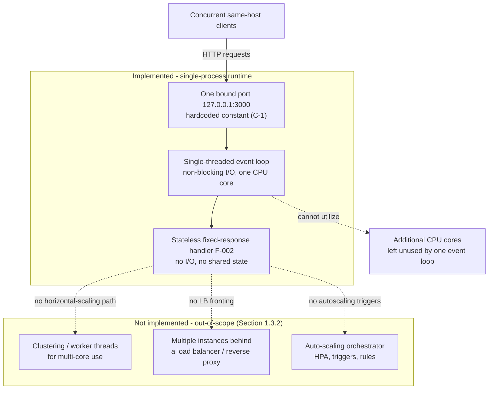
```mermaid
flowchart TB
    Clients["Concurrent same-host clients"]

    subgraph Present["Implemented - single-process runtime"]
        direction TB
        Port["One bound port 127.0.0.1:3000<br/>hardcoded constant (C-1)"]
        EL["Single-threaded event loop<br/>non-blocking I/O, one CPU core"]
        Handler["Stateless fixed-response handler F-002<br/>no I/O, no shared state"]
        Port --> EL
        EL --> Handler
    end

    subgraph Absent["Not implemented - out-of-scope (Section 1.3.2)"]
        direction TB
        Cluster["Clustering / worker threads<br/>for multi-core use"]
        Multi["Multiple instances behind<br/>a load balancer / reverse proxy"]
        Auto["Auto-scaling orchestrator<br/>HPA, triggers, rules"]
    end

    Cores["Additional CPU cores<br/>left unused by one event loop"]

    Clients -->|HTTP requests| Port
    EL -.->|cannot utilize| Cores
    Handler -.->|no horizontal-scaling path| Cluster
    Handler -.->|no LB fronting| Multi
    Handler -.->|no autoscaling triggers| Auto
```

**Summary.** The table consolidates the five scalability dimensions for this single-process system.

| Scalability Dimension | Implemented? | Actual Behavior / Basis |
|---|---|---|
| Horizontal scaling | No | Single process; no cluster/worker threads; exclusive port bind (Sections 5.2.1, 5.2.2) |
| Vertical scaling | Unassisted | One event-loop thread cannot use extra CPU cores (Section 5.3.1) |
| Auto-scaling triggers/rules | No | No orchestrator/HPA; no metrics to trigger on (C-3; Section 3.6) |
| Resource allocation | None defined | No CPU/memory limits or container config; OS-granted only (Section 2.4.1) |
| Performance optimization | None declared | Event-loop concurrency + constant zero-I/O reply are platform traits (Sections 5.2.5, 5.3.3) |
| Capacity planning | None | No targets, benchmarks, or capacity model (Sections 1.2.3, 5.4.5) |

### 6.1.4 Resilience Patterns Assessment

Resilience patterns govern how a system tolerates, contains, and recovers from failure. This system implements **no explicit resilience mechanisms**: it has no error handling, no redundancy, and no recovery logic of its own, and its failure model is binary — the single process is either running and serving or terminated (Sections 4.6, 5.3.6/ADR-08). Each required pattern is documented below with the actual behavior in its place.

**Fault-tolerance mechanisms.** None. The single process is itself the single point of failure, and it contains no `try/catch` block and no `'error'` event listener anywhere in `server.js` (Section 4.6; ADR-08). Consequently a fatal startup condition is not tolerated: when the loopback port is already in use, `server.listen` emits an `'error'` event with code `EADDRINUSE`; because no listener is registered, Node.js promotes it to an uncaught exception, prints a stack trace to `stderr`, and the process exits with a non-zero code (Section 4.6.2). At request time the handler performs no fallible I/O, so no request-level fault-tolerance logic exists or is required.

**Disaster-recovery procedures.** None are defined in the repository, and recovery is **entirely external** (Sections 4.6.3, 5.4.6). There is no `SIGTERM`/`SIGINT` handler, no graceful-shutdown routine, and no automated restart (constraint C-3); after a crash or kill, an operator or an external process supervisor / container restart policy must relaunch `node server.js`. Crucially, **no such supervisor, restart policy, backup, or recovery script is included in the repository** (Section 4.6.3) — the recovery procedure is simply to re-run the command. Because the service is stateless, a relaunched instance is immediately equivalent to the one it replaces; there is nothing to restore.

**Data-redundancy approach.** Not applicable. The service is stateless by construction and persists nothing — there is no database, file store, in-memory cache, or session store anywhere in the codebase (Sections 5.1.3, 5.3.3). With no data at rest and no data in flight beyond the fixed response literal, there is nothing to replicate, back up, or reconcile, so data redundancy does not apply.

**Failover configuration.** None. There is exactly one instance and no standby, replica, or secondary endpoint; the address and port are hardcoded constants with no fallback path (constraint C-1; Section 4.6.3). Because a second instance cannot bind the same port (Section 5.2.2), there is no active/passive or active/active pair to fail over between. A crash therefore results in downtime until an external actor restarts the process, not an automatic failover.

**Service-degradation policies.** None. The system has no graceful-degradation, load-shedding, throttling, or health-check behavior (constraint C-3; Section 5.2.4). It does not distinguish a "degraded" mode from a "healthy" one: while the process is listening it serves every request identically and successfully, and if it is not listening it serves nothing at all. The state model is therefore binary — fully available or fully unavailable (Section 5.2.7) — with no intermediate degradation path.

**Resilience pattern implementation (actual behavior).** The diagram traces the two outcomes of startup and the single, external-only recovery path.

**Diagram 6.1.4-A — Resilience Pattern Implementation (crash-on-fatal-error with external-only recovery).**

```mermaid
flowchart TD
    Start(["Operator runs: node server.js"])
    Bind{"Bind 127.0.0.1:3000<br/>succeeds?"}
    Run["Listening state:<br/>serve fixed HTTP 200 to every request<br/>stateless, no degradation modes"]
    Crash["Unhandled error event (EADDRINUSE)<br/>becomes uncaught exception<br/>stack trace to stderr, exit non-zero"]
    Down(["Process terminated<br/>no self-heal, no failover, no standby"])
    Ext(["External recovery ONLY:<br/>operator or supervisor relaunches process"])

    Start --> Bind
    Bind -->|yes| Run
    Bind -->|no| Crash
    Run -->|fatal error or kill signal| Down
    Crash --> Down
    Down --> Ext
    Ext -.->|manual restart| Start
```

**Summary.** The table consolidates the five resilience patterns for this single-process system.

| Resilience Pattern | Implemented? | Actual Behavior / Basis |
|---|---|---|
| Fault tolerance | No | Single point of failure; no try/catch or 'error' listener; bind error crashes (Section 4.6, ADR-08) |
| Disaster recovery | External only | No graceful shutdown/auto-restart (C-3); operator/supervisor relaunches; nothing to restore (Sections 4.6.3, 5.4.6) |
| Data redundancy | Not applicable | Stateless; no data store to replicate or back up (Sections 5.1.3, 5.3.3) |
| Failover | None | One instance, no standby; hardcoded endpoint; crash equals downtime (Sections 5.2.2, 4.6.3) |
| Service degradation | None | No load shedding or health checks; binary available/unavailable (Sections 5.2.4, 5.2.7) |

### 6.1.5 References

**Repository artifacts examined**

- `server.js` — The sole executable artifact; established the entire runtime behavior underpinning the not-applicable determination: a single Node.js process using only the built-in `http` module (line 1), a hardcoded loopback bind to `127.0.0.1:3000` (lines 3–4, 12), a uniform fixed `200` / `text/plain` / `Hello, World!` handler that ignores the request (lines 6–10), and a single stdout readiness log (lines 12–14). Confirmed the absence of any framework, routing, clustering, persistence, or error-handling code.
- `README.md` — Declared the project identity and purpose ("test project for backprop integration"), establishing the deliberate test-fixture intent behind the minimal, single-service design.
- `/` (repository root) — Confirmed the complete two-file inventory (`server.js`, `README.md`) with no subfolders, additional processes, package manifest, container/orchestration files, or service definitions; corroborated against the git `HEAD` tree (tracks exactly these two files).

**Technical Specification sections cross-referenced**

- Section 1.3.2 Out-of-Scope — Clustering, scaling, load balancing, and orchestration are listed as explicitly out of scope.
- Section 2.4 Implementation Considerations — Constraints C-1 (hardcoded, non-configurable), C-2 (unhandled bind error), C-3 (no graceful shutdown/health check/metrics), C-4 (test fixture, unsuitable for production); assumption A-2; the single-process/no-clustering scalability note.
- Section 3.6 Development & Deployment — Absence of container manifests, orchestrators, and CI/CD, confirming there is no auto-scaling platform.
- Section 4.6 Error Handling and Recovery Flows — The `EADDRINUSE` crash path (4.6.2) and the documented absence of retry, fallback, notification, and self-heal, with external-only recovery (4.6.3).
- Section 5.1 High-Level Architecture — The single-process, single-tier, stateless characterization; no outbound integrations (5.1.4); no data stores or caches (5.1.3); no declared SLA.
- Section 5.2 Component Details — Component responsibilities F-001/F-002/F-003, the per-component scaling considerations (5.2.1–5.2.5), and the binary state model (5.2.7).
- Section 5.3 Technical Decisions — The single-process/no-clustering decision (5.3.1), the synchronous-HTTP communication-pattern choice (5.3.2), the no-storage/no-caching rationale (5.3.3), and ADR-01 / ADR-08.
- Section 5.4 Cross-Cutting Concerns — The Performance and SLAs (5.4.5) and Disaster Recovery (5.4.6) treatments, referenced for consistency of the scalability and resilience findings.

**Web sources**

- None. All findings in this section are grounded in direct repository inspection and the cross-referenced specification sections above; no external sources were required.

## 6.2 Database Design

### 6.2.1 Applicability Assessment

**Database Design is not applicable to this system.**

The `hao-backprop-test` repository has no data tier: it uses no database, no cache, and no local or external storage service, and it therefore has no schema to design, no entities to relate, and no persisted data to manage. The determination is grounded in exhaustive inspection of the repository, which contains exactly two tracked files — `server.js` and `README.md` — with no subfolders, no package manifest, and no configuration or infrastructure files.

The single executable artifact, `server.js`, imports only the Node.js standard-library `http` module (line 1: `const http = require('http')`) and declares no other dependency. A repository-wide search confirms this is the *only* `require()` in the codebase; there is no database driver, ORM, migration tool, cache client, connection string, or filesystem-persistence call anywhere. The service's entire "data" is a single compile-time string literal — `'Hello, World!\n'` (line 9) — that the request handler returns for every request without reading from or writing to any store (lines 6–10).

This is consistent with the rest of the specification. Section 3.5 records that the system "has no data tier … no database, no cache, and no external or local storage service," and that persistence is stateless by construction with no schema, migration tooling, or data-lifecycle management "because there is no data." Section 4.5 records that there is no per-request state, no shared application state, no persistence, no caching, and no transactional work, and that there are "no transaction boundaries to define." The minimalism is deliberate: `README.md` declares the project a "test project for backprop integration" — a controlled test fixture (constraint C-4, Section 2.4) rather than a data-driven application.

**Storage-capability assessment.** The table maps each data-tier building block to its presence in the repository. Every one is verifiably absent.

| Data-Tier Building Block | Present? | Evidence / Actual State |
|---|---|---|
| Relational / document / key-value database | No | No driver, client, or connection string; only import is `http` (`server.js` L1) |
| Schema, tables, collections, or entities | No | No data model defined anywhere; response is a string literal (`server.js` L9) |
| ORM / query builder / data-access layer | No | No Prisma/Sequelize/TypeORM/Mongoose/Knex and no SQL in the repository |
| Migration / schema-versioning tooling | No | No migration directory or tool (Alembic/Flyway/Prisma/Knex) present |
| Caching layer (Redis / Memcached / in-process) | No | No cache client and no in-memory cache structure (Sections 3.5, 4.5.3) |
| Object / blob storage or local file persistence | No | No storage SDK and no filesystem read/write at runtime (Section 3.5) |

**Data flow without a persistence tier.** Although there is no store, request data does flow through the process at runtime. The diagram fixes that flow explicitly and shows that it never touches any persistent tier: the process receives an inbound request, ignores it, reads a process-local in-memory constant, and returns it.

Diagram 6.2.1-A — Data Flow (in-memory only; no persistence tier).

```mermaid
flowchart LR
    Client(["Same-host HTTP client<br/>backprop integrator"])
    subgraph Proc["Single Node.js Process (server.js)"]
        direction TB
        Recv["Inbound HTTP request<br/>method, path, headers, body ignored"]
        Const["In-memory constant string literal<br/>Hello, World! (server.js line 9)<br/>compiled into source, process-local"]
        Resp["HTTP 200 text/plain response"]
        Recv --> Const
        Const --> Resp
    end
    Store["Persistent storage tier:<br/>database, cache, file, session store<br/>ABSENT - never read from or written to"]
    Client -->|"HTTP/1.1 request"| Recv
    Resp -->|"fixed response"| Client
    Const -.->|"no read, no write - zero I/O"| Store
```

**How the remainder of this section is organized.** Because the section prompt enumerates specific database concern areas, the sub-sections that follow do not fabricate a schema or storage design. Instead, each documents — per required area — *why* the concern does not apply and *what the stateless system does in its place*, so the section remains a useful reference:

- **6.2.2 Schema Design** — entity relationships, data models and structures, indexing, partitioning, replication configuration, and backup architecture.
- **6.2.3 Data Management** — migration procedures, versioning strategy, archival policies, storage/retrieval mechanisms, and caching policies.
- **6.2.4 Compliance Considerations** — data retention rules, backup and fault-tolerance policies, privacy controls, audit mechanisms, and access controls.
- **6.2.5 Performance Optimization** — query optimization, caching strategy, connection pooling, read/write splitting, and batch processing.

### 6.2.2 Schema Design

No schema exists to design. The system defines no persistent entities, no tables or collections, no relationships, no indexes, and no constraints. The only data element in the running process is a single in-memory string literal that is never stored, so it has no schema, key, or index. Each required schema concern is documented below with its actual state.

#### 6.2.2.1 Entity Relationships and Data Models

There are zero persistent entities and therefore zero relationships. The sole data element is the response constant `'Hello, World!\n'` (`server.js` line 9), a UTF-8 string of 14 bytes held in process memory and returned verbatim to every caller (`server.js` lines 6–10). It is not a database entity: it has no identity, no key, no attributes beyond its literal value, and no relationship to any other data because no other data exists. The entity-relationship view below makes the absence concrete by documenting this single non-persistent element and noting explicitly that no tables, collections, relationships, indexes, or constraints exist.

Diagram 6.2.2-A — Entity-Relationship View (single non-persistent in-memory literal; zero persistent entities).

```mermaid
erDiagram
    NON_PERSISTENT_RESPONSE_LITERAL {
        string value "Hello, World! (server.js line 9)"
        string data_type "UTF-8 string literal, 14 bytes"
        string scope "process-local, in-memory only"
        string persistence "none - not stored, no table or collection"
        string indexes "none"
        string constraints "none"
    }
```

The single box above is shown only to make the entity-relationship view concrete; it represents a compile-time constant in process memory, not a persisted record. It has no counterpart table, document, or row in any store.

#### 6.2.2.2 Indexes and Constraints

There are no indexes and no constraints, because there is no data store in which to define them. As required by the section prompt, the table documents every index and constraint category explicitly — each with a count of zero.

| Schema Element | Count | Evidence / Notes |
|---|---|---|
| Tables / collections | 0 | No data store defined (`server.js`; Section 3.5) |
| Primary keys | 0 | No entities to key |
| Foreign keys / relationships | 0 | No related entities |
| Unique / check / not-null constraints | 0 | No columns or fields to constrain |
| Indexes (clustered, secondary, full-text) | 0 | No table or query surface to index |

#### 6.2.2.3 Indexing and Partitioning Strategy

Not applicable. An indexing strategy optimizes lookups over stored rows or documents, and a partitioning strategy (horizontal sharding, or range/hash/list partitioning) distributes stored data across nodes or files. This system stores no rows or documents at all, so there is nothing to index or partition. The fixed response is returned in constant time directly from memory without any lookup, scan, or key resolution (Section 6.1.3).

#### 6.2.2.4 Replication Configuration

Not applicable — there is no data tier to replicate. Replication keeps copies of a stateful data store synchronized across primary and replica nodes; this system holds no state and runs as a single process (Sections 4.5, 6.1.4). No primary/replica topology, replication stream (WAL/binlog/oplog), or synchronization configuration exists or is required. The diagram contrasts the implemented single stateless process with the data-tier replication topology that is deliberately absent.

Diagram 6.2.2-B — Replication Architecture (single stateless process vs. absent data-tier replication).

```mermaid
flowchart TB
    Clients(["Same-host HTTP clients"])
    subgraph Present["Implemented - single stateless process"]
        direction TB
        Proc["Node.js process (server.js)<br/>one instance, bind 127.0.0.1:3000<br/>holds NO data, nothing to replicate"]
    end
    subgraph Absent["Not implemented - data-tier replication topology"]
        direction TB
        Primary["Primary / writer DB node"]
        Stream["Replication stream<br/>WAL / binlog / oplog"]
        Replica["Read replica / standby node"]
        Primary -.-> Stream
        Stream -.-> Replica
    end
    Clients -->|"HTTP request"| Proc
    Proc -.->|"no data tier exists<br/>no primary, no replica, no sync"| Primary
```

#### 6.2.2.5 Backup Architecture

Not applicable. A backup architecture protects stored data against loss; with no database, file store, or cache, there is nothing to back up (Section 3.5). The application is fully reconstructable from source control at any time — its entire behavior is the 14 lines of `server.js` tracked in Git — and a relaunched instance is immediately equivalent to any prior instance because it carries no state (Section 6.1.4). No backup jobs, snapshots, point-in-time recovery, or restore procedures exist or are needed.

### 6.2.3 Data Management

Data management concerns the lifecycle of stored data — how it is created, versioned, retrieved, cached, archived, and evolved over time. Because the system persists no data, none of these lifecycle activities exists. Each concern is documented below with its actual state.

#### 6.2.3.1 Data Storage and Retrieval Mechanisms

There is no storage mechanism and no retrieval mechanism. The request handler performs no I/O beyond writing the fixed response body (Section 2.4); it neither reads from nor writes to any database, file, cache, or session store (`server.js` lines 6–10). The only "retrieval" is an in-process reference to a compile-time constant, which requires no query, connection, or lookup. Section 4.5.3 records the data-persistence point, caching layer, transaction boundary, and in-memory application state all as "None."

#### 6.2.3.2 Migration and Versioning Strategy

Not applicable at the data layer. Schema migration and data versioning presuppose a schema that evolves across releases; with no schema, there is no migration tooling (Alembic/Flyway/Prisma/Knex), no migration-history table, and no forward/rollback scripts (Section 3.5). Versioning in this repository is limited to *source-code* version control: Git tracks the two files, and the specification treats the single commit as baseline version 1.0 (constraint C-5). There is no separate data-schema version to manage or migrate.

#### 6.2.3.3 Archival Policies

Not applicable. Archival moves aged data from active storage to cheaper long-term storage on a retention schedule. With no data written and nothing accumulating over time, there is nothing to age, archive, or purge (Section 3.5.1). No archival tier, cold-storage target, or data-lifecycle rule exists.

#### 6.2.3.4 Caching Policies

Not applicable. There is no cache client (Redis/Memcached) and no in-process cache structure anywhere in the codebase (Sections 3.5, 4.5.3). No caching is needed: the response is a compile-time constant already resident in memory, so there is no computed or fetched value whose recomputation a cache would avoid. The only cache-adjacent behavior observable at runtime is HTTP transport keep-alive (Node's default `Keep-Alive: timeout=5` response header), which is a connection-reuse default of the `http` module rather than an application data cache (Section 6.1.3).

### 6.2.4 Compliance Considerations

Data-compliance controls govern how stored data is retained, protected, kept private, audited, and access-controlled. Because the system stores, collects, and processes no data, there is no data subject to these controls. Each area is documented below with its actual state; several also reflect a reduced attack surface that follows directly from holding no data (Section 3.5.2).

#### 6.2.4.1 Data Retention Rules

Not applicable. Retention rules define how long stored records are kept before deletion; with no records written, there is no retention clock, no retention schedule, and no deletion workflow (Section 3.5.1). The service holds nothing between requests or across restarts (Section 4.5).

#### 6.2.4.2 Backup and Fault-Tolerance Policies

No data-backup policy exists because there is no data to back up (Section 3.5). At the process level, the system implements no fault-tolerance mechanism: there is no `try/catch` and no `'error'` listener, so a failed bind (`EADDRINUSE`) terminates the process, and recovery is entirely external — an operator or process supervisor relaunches `node server.js` (Sections 4.6, 6.1.4). Because the process is stateless, a relaunched instance is immediately equivalent to its predecessor and there is nothing to restore.

#### 6.2.4.3 Privacy Controls

Not applicable, and no personal data is at risk. The handler ignores the request entirely — it never reads the method, path, headers, or body (`server.js` lines 6–10) — so it collects, processes, and stores no user data, no PII, and no request content. The response is a constant literal that discloses nothing sensitive (Section 3.5.2). Consequently there is no data to encrypt at rest, anonymize, redact, or subject to data-subject-access or erasure requests.

#### 6.2.4.4 Audit Mechanisms

There is no data-access audit trail, because there is no data to access. The only observability signal in the system is a single stdout line logged once at startup — `Server running at http://127.0.0.1:3000/` (`server.js` lines 12–14); there is no request logging, no access log, no change-data-capture, and no audit table (constraint C-3; Section 6.1.3). No per-request or per-record audit events are produced.

#### 6.2.4.5 Access Controls

There are no database access controls because there is no database, and no application-level access control exists either. The service enforces no authentication, authorization, or role-based access to any data (Sections 3.5.2, 6.1.2). The only access boundary is network reachability: the server binds the loopback address `127.0.0.1` (`server.js` lines 3, 12), which limits connections to the local host (assumption A-2) — but this is a network-exposure limit, not a data-access control. No credentials, connection secrets, or storage endpoints exist in the codebase (Section 3.5.2).

### 6.2.5 Performance Optimization

Database performance-optimization techniques tune how queries execute and how a store is accessed under load. Because the system issues no queries and opens no data connections, none of these techniques applies. No performance requirement, latency budget, throughput target, or SLA is defined anywhere in the code or specification (Sections 1.2.3, 6.1.3). The table summarizes each required technique, followed by a brief note on each.

| Optimization Technique | Applicable? | Actual State / Basis |
|---|---|---|
| Query optimization patterns | No | No queries issued; response is an in-memory constant (`server.js` L9) |
| Caching strategy | No | No cache layer; nothing to cache (Sections 3.5, 4.5.3) |
| Connection pooling | No | No outbound data connections opened; only inbound HTTP (Section 6.1.2) |
| Read/write splitting | No | No reads or writes to any store; no primary/replica to split across |
| Batch processing | No | No batch/ETL/queue pipeline; each request is independent (Section 5.3.2) |

**Query optimization patterns.** Not applicable — the service executes no database queries, so there are no query plans, joins, `EXPLAIN` analyses, or index-tuning opportunities. The fixed response is emitted in constant time directly from memory.

**Caching strategy.** Not applicable — there is no cache and nothing to cache (see 6.2.3.4). The constant response is already resident in process memory.

**Connection pooling.** Not applicable — connection pooling reuses expensive database connections, but the process opens no outbound database, cache, or service connections at all; it imports only the `http` module (`server.js` line 1; Section 6.1.2). Inbound HTTP connection reuse is handled by Node's transport-layer keep-alive, which is unrelated to database connection pooling.

**Read/write splitting.** Not applicable — routing reads to replicas and writes to a primary requires a replicated data store, which does not exist (see 6.2.2.4). The handler performs neither reads nor writes against any store.

**Batch processing.** Not applicable — there is no batch, ETL, queue, or scheduled-job pipeline in the codebase; every request is handled independently and synchronously, with no accumulation or deferred processing (Section 5.3.2).

**Observed performance characteristic.** The one performance-relevant behavior is a property of the design rather than an optimization: because the reply is a compile-time constant returned without any database access, computation, or I/O, request handling is inherently fast — but this reflects the absence of a data tier, not a database-tuning decision (Section 6.1.3).

### 6.2.6 References

**Repository artifacts examined**

- `server.js` — The sole executable artifact; established that the only import is the Node.js built-in `http` module (line 1), that the response is a compile-time string literal `'Hello, World!\n'` (line 9) returned by a handler that performs no I/O (lines 6–10), that the bind address is the hardcoded loopback `127.0.0.1:3000` (lines 3–4, 12), and that no database driver, ORM, migration tool, cache client, connection string, or filesystem-persistence call exists anywhere. A repository-wide search confirmed `require('http')` is the only `require()` in the codebase.
- `README.md` — Declared the project identity and intent ("test project for backprop integration"), establishing the deliberate test-fixture rationale behind the storage-free design.
- `/` (repository root) — Confirmed the complete two-file inventory (`server.js`, `README.md`) with no subfolders, no package manifest, no lockfile, and no configuration or infrastructure (Docker/Kubernetes/Terraform/SQL) files that could declare a datastore; corroborated against the git `HEAD` tree.

**Technical Specification sections cross-referenced**

- Section 1.2 System Overview / Section 1.3.2 Out-of-Scope — The stateless, persistence-free characterization and the exclusion of databases, caches, and sessions from scope.
- Section 2.4 Implementation Considerations — "Stateless by construction"; the handler "performs no I/O beyond writing the fixed body"; constraints C-3 (no metrics/health/graceful shutdown), C-4 (test fixture), C-5 (single commit, baseline v1.0).
- Section 3.5 Databases & Storage — The authoritative "no data tier" determination; the storage-category table; the stateless-by-construction persistence strategy (3.5.1); and the no-data-at-rest security posture (3.5.2).
- Section 4.5 State Management and Transaction Boundaries — The process-lifecycle-only state model, per-request statelessness, and the persistence/caching/transaction-boundary concern table (4.5.3), all recorded as "None."
- Section 4.6 Error Handling and Recovery Flows — The `EADDRINUSE` crash path and external-only recovery, referenced for the backup/fault-tolerance treatment.
- Section 5.3 Technical Decisions — The no-storage/no-caching rationale (5.3.3) and the synchronous-HTTP communication pattern with no messaging, queueing, or batch pipeline (5.3.2).
- Section 6.1 Core Services Architecture — The single-process, single-threaded, stateless architecture and the not-applicable precedent; the scalability and resilience treatments (6.1.2–6.1.4) referenced for the connection, caching, and replication findings.

**Web sources**

- None. All findings in this section are grounded in direct repository inspection and the cross-referenced specification sections above; no external sources were required.

## 6.3 Integration Architecture

### 6.3.1 Integration Architecture Overview and Applicability

The `hao-backprop-test` service has an integration *purpose* — `README.md` describes it as a *"test project for backprop integration"* — but the integration architecture that the code actually realizes is deliberately minimal. The system exposes exactly **one** integration surface: an inbound HTTP/1.1 listener bound to the loopback address `127.0.0.1:3000` (`server.js` lines 3–4, 6, 12; features F-001 and F-002). It performs **zero** outbound integrations — `server.js` imports only the Node.js built-in `http` module (line 1) and never opens a client socket, loads an SDK, reads a credential, or contacts any external service (Sections 3.4 and 5.1.4).

Because an external counterpart is expected to drive that endpoint, Integration Architecture is **applicable in a limited capacity** for this system rather than wholly absent. The intended integrator named in the README — *"backprop"* — is expected to call the endpoint **externally** by issuing HTTP requests to the local address; the repository ships no client library, SDK, credentials, or configuration for that counterpart, so the coupling is inbound-only and request-driven (Section 3.4.1). This is the key distinction from sibling Section 6.1 (Core Services Architecture) and Section 6.2 (Database Design), which are wholly not applicable: here a real, callable network API does exist and is therefore documented in full.

The three concern areas enumerated by this section's prompt consequently apply unevenly, and each is documented honestly in the sub-sections that follow:

- **API Design (Section 6.3.2) — applies.** There is a real, callable network API, so its protocol, (absent) authentication and authorization, (absent) rate limiting, (absent) versioning, and documentation posture are all specified against the actual inbound surface.
- **Message Processing (Section 6.3.3) — not applicable.** There is no asynchronous messaging of any kind; the sole interaction pattern is synchronous request/response (Section 5.1.3).
- **External Systems (Section 6.3.4) — inbound only.** The single external relationship is the inbound "backprop" caller; there are no outbound third-party integrations, legacy interfaces, API gateways, or formal service contracts.

**Integration capability inventory.** The table below maps each integration building block to its presence in the repository. Only the inbound API surface exists.

| Integration Capability | Present? | Evidence / Actual Behavior |
|---|---|---|
| Inbound API surface | Yes (one) | Single HTTP/1.1 listener on `127.0.0.1:3000` (`server.js` L3–4, 6, 12; F-001/F-002) |
| Outbound / third-party integration | No | Only `require('http')`; no client socket, SDK, or credential (Sections 3.4, 5.1.4) |
| Authentication / authorization | No | Every request served identically; no auth middleware or tokens (Sections 3.4.2, 4.4) |
| Rate limiting / throttling | No | No rate-limit logic; handler ignores the request entirely (`server.js` L6–10) |
| API versioning | No | Single un-routed endpoint; no `/v1` path or version negotiation (Section 4.3.4) |
| Message queue / broker | No | No broker client or messaging library present (Section 3.4) |
| Event / stream / batch processing | No | No pub/sub, streams, cron, timers, or workers (Section 4.3.4) |
| API gateway / reverse proxy | No | Two-file repository; no nginx/Kong/proxy configuration present |

**Integration boundary.** The diagram fixes the single inbound surface, the same-host "backprop" integrator, the in-process components that answer it, and the explicit absence of any outbound integration.

**Diagram 6.3.1-A — Integration Flow (single inbound HTTP surface; no outbound integrations).**

```mermaid
flowchart LR
    Integrator["External integrator<br/>backprop client, same host"]

    subgraph Host["Single host - loopback only"]
        direction TB
        subgraph Proc["Node.js process (server.js)"]
            direction TB
            Endpoint["Inbound HTTP listener F-001<br/>127.0.0.1:3000"]
            Handler["Uniform request handler F-002<br/>fixed HTTP 200 text/plain"]
            Endpoint --> Handler
        end
        HttpMod["Node.js built-in http module<br/>only runtime dependency"]
    end

    Outbound["No outbound integrations:<br/>no third-party API, DB, cache,<br/>broker, gateway, or auth service"]

    Integrator -->|"HTTP/1.1 request over loopback<br/>any method or path"| Endpoint
    Handler -->|"HTTP 200 text/plain Hello World"| Integrator
    Handler -.->|"depends on"| HttpMod
    Endpoint -.->|"depends on"| HttpMod
    Handler -.->|"opens none"| Outbound
```

All exchange is confined to the local host because the socket is bound to the loopback interface (assumption A-2, Section 2.4); no data crosses a network boundary and no external system is contacted (Section 4.3.1).

### 6.3.2 API Design

The inbound HTTP surface is the system's entire API, and this sub-section specifies it exactly as `server.js` implements it. The defining characteristic is **uniformity**: the single request handler ignores the request's method, URL, headers, and body and returns the same reply to every caller (`server.js` lines 6–10; requirement F-002-RQ-002). There is therefore no resource model, no routing, and no request schema — the only API "contract" is *"any request → `200` / `text/plain` / `Hello, World!\n`"* (Section 4.3.4). The aspects the prompt requires (protocol, authentication, authorization, rate limiting, versioning, documentation) are specified below; four of the six are absent, and each absence is grounded in code.

**API specification summary.** The following table is the canonical specification of the endpoint (four-column limit observed).

| API Aspect | Specification | Status | Evidence |
|---|---|---|---|
| Protocol | HTTP/1.1 over loopback TCP, plaintext (no TLS) | Implemented | `server.js` L1, 6, 12 |
| Endpoint | `http://127.0.0.1:3000/` (single, un-routed) | Implemented | `server.js` L3–4, 12 |
| Methods | All methods accepted, all treated identically | Implemented | `server.js` L6 (`req` ignored) |
| Response | `200`, `Content-Type: text/plain`, body `Hello, World!\n` | Implemented | `server.js` L7–9 |
| Authentication | None (unauthenticated) | Absent | Section 3.4.2 |
| Authorization | None | Absent | Section 4.4 |
| Rate limiting | None | Absent | `server.js` L6–10 |
| Versioning | None (single un-routed endpoint) | Absent | Section 4.3.4 |
| Documentation | `README.md` + fixed behavior only (no OpenAPI) | Informal | `README.md` |

**API architecture.** The diagram contrasts the implemented request path with the API-management layers that a conventional API would place in front of the listener — all of which are absent here.

**Diagram 6.3.2-A — API Architecture (implemented request path vs. absent API-management layers).**

```mermaid
flowchart TB
    Client["Same-host HTTP client<br/>backprop integrator"]

    subgraph Present["Implemented request path"]
        direction TB
        Listener["HTTP/1.1 listener F-001<br/>127.0.0.1:3000 plaintext"]
        Route["No router - single un-routed endpoint<br/>ignores method path headers body"]
        Resp["Fixed response F-002<br/>200 text/plain Hello World"]
        Listener --> Route
        Route --> Resp
    end

    subgraph Absent["Typical API layers - none implemented"]
        direction TB
        Gateway["API gateway / reverse proxy"]
        Auth["AuthN / AuthZ"]
        Rate["Rate limiting"]
        Ver["Versioning / content negotiation"]
    end

    Client -->|"HTTP/1.1 request any method"| Listener
    Resp -->|"HTTP 200 text/plain"| Client
    Listener -.->|"not fronted by"| Gateway
    Route -.->|"no checks"| Auth
    Route -.->|"no throttling"| Rate
    Route -.->|"no versioned contract"| Ver
```

#### 6.3.2.1 Protocol Specifications

The API speaks **HTTP/1.1 in plaintext over a loopback TCP socket**. The transport and listen address are set by the application (`hostname = '127.0.0.1'`, `port = 3000`; `server.js` lines 3–4, 12), while the HTTP framing is provided by the Node.js built-in `http` module (`server.js` line 1). There is **no TLS/HTTPS**: the module imported is `http`, not `https`, so no certificate, cipher, or secure-transport configuration exists (Section 3.4.2). The application sets only two response properties — status `200` and `Content-Type: text/plain` (`server.js` lines 7–8) — and writes the body `Hello, World!\n` (line 9); every other response header is a Node runtime default rather than an application setting.

| Protocol Property | Value | Set By | Evidence |
|---|---|---|---|
| Transport | TCP over loopback (`127.0.0.1`) | Application | `server.js` L3, 12 |
| Application protocol | HTTP/1.1, plaintext (no TLS) | Node `http` module | `server.js` L1, 6 |
| Response status | `200 OK` | Application | `server.js` L7 |
| Content-Type | `text/plain` | Application | `server.js` L8 |
| Content-Length | `14` (bytes of `Hello, World!\n`) | Node `http` module | Runtime-observed |
| Connection | `keep-alive`, `Keep-Alive: timeout=5` | Node `http` (default) | Runtime-observed |

The sequence diagram traces one request/response exchange, the system's single key flow. The `req` object is never inspected, so the server moves directly from accepting the connection to emitting the fixed reply; the connection is then held open under Node's default keep-alive behavior.

**Diagram 6.3.2-B — Request/Response Sequence (key API flow).**

```mermaid
sequenceDiagram
    autonumber
    actor Client as backprop integrator (same host)
    participant OS as OS loopback TCP stack
    participant Server as Node http.Server (server.js)
    Note over Server: Listening on 127.0.0.1 port 3000 (F-001)
    Client->>OS: TCP connect to loopback port 3000
    OS->>Server: Connection accepted
    Client->>Server: HTTP request any method path headers body
    Note right of Server: No auth, no routing, req never read (line 6)
    Server->>Server: set statusCode 200 (line 7)
    Server->>Server: set Content-Type text/plain (line 8)
    Server-->>Client: HTTP 200 body Hello World LF (line 9)
    Note over Client,Server: Node default Keep-Alive timeout 5s, no app-defined SLA
```

#### 6.3.2.2 Authentication Methods

**None.** The endpoint is unauthenticated — every request is served identically without any credential (Section 3.4.2). A repository-wide search for authentication constructs (`jwt`, `oauth`, `apikey`, `token`, `bearer`, `passport`, `session`, `cookie`) returns zero matches, and `server.js` registers no authentication middleware. There is no API-key scheme, no bearer/JWT token validation, no OAuth flow, no HTTP Basic auth, no mutual TLS, and no session mechanism. Network exposure is constrained solely by the loopback bind (assumption A-2) — reachability, not identity, is the only access control present, and it is a property of the bind address rather than of the API.

#### 6.3.2.3 Authorization Framework

**None.** Authorization presupposes an authenticated principal to evaluate, and no such principal exists (Section 6.3.2.2). The handler applies no permission checks, roles, scopes, policies, or access-control lists; Section 4.4 records "Authorization Checkpoints" as absent for every feature. Every caller that can reach the loopback socket receives identical, unrestricted access to the single response. There is consequently no role model, no scope enforcement, and no policy-decision or policy-enforcement point to document.

#### 6.3.2.4 Rate Limiting Strategy

**None.** No rate limiting, throttling, quota, concurrency cap, or backpressure logic exists. The handler performs no client tracking, counting, or windowing — it returns the fixed reply for every request unconditionally (`server.js` lines 6–10), and a search for rate/throttle/limit constructs returns zero matches. The only implicit bound on request handling is the capacity of the single-threaded Node.js event loop and the underlying OS/TCP limits, neither of which is an application-defined policy (Section 6.1.3). No request is ever rejected, delayed, or shed by application logic.

#### 6.3.2.5 Versioning Approach

**None.** The API is a single un-routed endpoint with no version identifier of any kind: there is no URI version segment (for example `/v1`), no version request header, no media-type (content-type) versioning, and no content negotiation (Section 4.3.4). Because the contract is a single fixed response that does not vary by input, there is no versionable surface to evolve and no deprecation or compatibility policy. Any behavioral change would be a source edit to `server.js`, tracked only by version control; the repository sits at a single baseline commit (v1.0, constraint C-5) with no released API versions.

#### 6.3.2.6 Documentation Standards

**No formal API-documentation standard is used.** There is no OpenAPI/Swagger specification, no API Blueprint or RAML, no JSON Schema, and no generated or published API reference — a search for `openapi`/`swagger` returns zero matches, and the repository contains no specification artifact. The only documentation is `README.md`, which states the project name (`# hao-backprop-test`) and a one-line purpose (`test project for backprop integration.`) but includes no endpoint, request/response, or usage reference. In practice the API is self-describing through its trivial, invariant behavior, and the runtime readiness line `Server running at http://127.0.0.1:3000/` (feature F-003; `server.js` lines 12–14) is the only machine- or operator-facing signal that communicates the endpoint address.

### 6.3.3 Message Processing

**Message Processing is not applicable for this system.** The service implements no asynchronous messaging of any kind: `server.js` uses only the synchronous, client-initiated HTTP/1.1 request/response pattern (Section 5.1.3), imports only the Node.js built-in `http` module (line 1), and contains no message broker, queue, stream, event bus, or scheduled/batch job. A repository-wide search for messaging, streaming, and scheduling constructs (`kafka`, `amqp`, `rabbitmq`, `sqs`, `sns`, `mqtt`, `nats`, `redis`, `bull`, `publish`, `subscribe`, `emit`, `EventEmitter`, `stream`, `cron`, `schedule`, `batch`, `webhook`) returns zero matches. The only "events" in the system are the internal event-loop callbacks Node uses to drive `createServer` and `listen`; the application registers no message or event handlers of its own (Section 4.3.4).

Even though this concern area does not apply, each item the prompt enumerates is documented below so the section remains a complete reference.

| Message-Processing Building Block | Present? | Evidence / Actual Behavior |
|---|---|---|
| Event processing (application-level) | No | Only Node built-in request/listen callbacks; no app event handlers (Section 4.3.4) |
| Message queue / broker | No | No broker client (Kafka/RabbitMQ/SQS/etc.); only `require('http')` (Section 3.4) |
| Stream processing | No | No stream reader/writer or processing pipeline; `req` never consumed (`server.js` L6) |
| Batch processing | No | No cron, timers, worker threads, or bulk jobs (Section 4.3.4) |
| Error-handling strategy (messaging) | N/A | No message pipeline to fail; no DLQ/retry/redelivery (Section 4.6) |

**Message flow.** The diagram contrasts the implemented synchronous request/response flow with the asynchronous messaging infrastructure that is deliberately absent.

**Diagram 6.3.3-A — Message Flow (synchronous request/response only; no asynchronous messaging).**

```mermaid
flowchart LR
    Client["backprop integrator"]

    subgraph Sync["Implemented - synchronous request/response only"]
        direction TB
        In["Inbound HTTP request<br/>received, never parsed"]
        Out["Synchronous HTTP 200 reply<br/>fixed text/plain body"]
        In --> Out
    end

    subgraph AsyncAbsent["Not implemented - asynchronous messaging"]
        direction TB
        Queue["Message queue / broker<br/>Kafka RabbitMQ SQS none"]
        Stream["Stream processor none"]
        Event["Event bus / pub-sub none"]
        Batch["Batch / scheduled jobs<br/>cron timers none"]
    end

    Client -->|"HTTP/1.1 request"| In
    Out -->|"HTTP/1.1 response"| Client
    In -.->|"no publish"| Queue
    In -.->|"no stream ingest"| Stream
    In -.->|"no events emitted"| Event
    In -.->|"no batching"| Batch
```

#### 6.3.3.1 Event Processing Patterns

Not applicable. The application defines no event-processing pattern — no publish/subscribe, no event sourcing, no CQRS, and no event bus. The two callbacks in `server.js` (the `createServer` request handler and the `listen` startup callback) are invoked by the Node.js event loop, but they are ordinary synchronous handlers, not participants in an application-level event pipeline (Section 4.3.4). The application does not even register a `'connection'` or `'error'` event listener on the server object (Section 4.6), so there is no custom event wiring of any kind.

#### 6.3.3.2 Message Queue Architecture

Not applicable. There is no message queue or broker. No client for Kafka, RabbitMQ/AMQP, Amazon SQS/SNS, Redis, NATS, MQTT, or any other messaging system is imported or configured (Section 3.4). Consequently there is no producer, no consumer, no topic/queue/exchange, no partitioning or consumer-group model, and no delivery-guarantee (at-most-once / at-least-once / exactly-once) configuration to document.

#### 6.3.3.3 Stream Processing Design

Not applicable. The service performs no stream processing. It does not consume the inbound request as a stream — `req` is never read (`server.js` line 6) — it opens no readable or writable data streams, and it uses no stream-processing framework, windowing, or aggregation logic. The response body is a single fixed literal written in one `res.end('Hello, World!\n')` call (line 9), so there is no streamed or chunked application output either.

#### 6.3.3.4 Batch Processing Flows

Not applicable. There are no batch or scheduled flows. The repository contains no cron schedule, no `setInterval`/`setTimeout` timer, no worker thread, no job queue, and no bulk-processing pipeline; the service is a single-process, request-driven listener that performs work only in direct response to an inbound HTTP request (Sections 2.4 and 4.3.4). There is nothing to trigger, window, checkpoint, or reconcile on a schedule.

#### 6.3.3.5 Error Handling Strategy

Not applicable in the messaging sense — with no message pipeline there is no dead-letter queue, no redelivery, no poison-message handling, and no consumer retry to define. For completeness, the system's overall error posture (documented fully in Section 4.6) is minimal and applies to the HTTP path rather than to messaging: `server.js` contains no `try/catch` and registers no `'error'` listener, so a failed `server.listen` (for example `EADDRINUSE`) becomes an uncaught exception that terminates the process, and recovery is external only (Section 6.1.4). At request time the handler performs no fallible I/O — it reads nothing and invokes nothing that can fail transiently — so there is no request-level error path, retry, or fallback to document.

### 6.3.4 External Systems

This sub-section documents the system's relationships with systems outside its own process. At runtime there is exactly **one**: the inbound "backprop" HTTP caller. The service has no outbound runtime dependencies — it makes no external calls and consumes no external service (Sections 3.4 and 5.1.4). The intended integrator drives the endpoint entirely from the outside; the repository ships no client code, SDK, credentials, or endpoint configuration for it (Section 3.4.1).

**External dependency inventory.** The table enumerates every external dependency the system has, at runtime and at build time (four-column limit observed).

| External Dependency | Type | Coupling | Notes |
|---|---|---|---|
| "backprop" HTTP client | Inbound integrator | Runtime, request-driven | Calls `127.0.0.1:3000`; no client code shipped in repo (Section 3.4.1) |
| Node.js runtime + `http` module | Platform | Runtime, in-process | Only runtime dependency; no version pinned in repo (Section 3.1) |
| Git / GitHub | Source-control host | Build-time only | SCM concern, not a runtime integration (Section 3.6) |

The remainder of this sub-section addresses each external-systems concern the prompt enumerates.

#### 6.3.4.1 Third-Party Integration Patterns

The only third-party integration pattern present is **inbound, synchronous, client-initiated HTTP request/response**: an external caller (the "backprop" integrator) drives the endpoint, and the service answers with its fixed reply (Section 4.3.1). No **outbound** third-party integration pattern exists — there is no API client, SDK, webhook sender or receiver, service-mesh sidecar, or message-based integration. The service never initiates a connection to any third party (`server.js` imports only `http` and opens no client socket), and it holds no credentials or endpoint configuration for the "backprop" counterpart, which integrates entirely from the outside (Section 3.4.1).

#### 6.3.4.2 Legacy System Interfaces

None. There is no interface to any legacy system — no SOAP/WSDL client, no FTP/SFTP transfer, no fixed-width or EDI file exchange, no direct database link, and no mainframe or message-bridge adapter. The codebase is a single greenfield file with exactly one dependency (the Node.js `http` module) and contains no adapters, connectors, or anti-corruption layers of any kind (`server.js`; Section 3.4).

#### 6.3.4.3 API Gateway Configuration

None. No API gateway or reverse proxy fronts the service. The repository contains only `server.js` and `README.md`, so there is no gateway or proxy configuration of any kind — no NGINX, Kong, Envoy, HAProxy, or Traefik configuration, no cloud API-gateway artifact, no `docker-compose` or Kubernetes ingress manifest. The service binds its port directly (`server.js` line 12) and is reached directly by same-host clients; there is no upstream layer performing routing, TLS termination, authentication, rate limiting, or request/response transformation (Sections 6.3.2.1–6.3.2.4).

#### 6.3.4.4 External Service Contracts

There is no formal external service contract. No OpenAPI/Swagger definition, interface schema, or service-level agreement is published (Section 6.3.2.6), and no SLA, latency budget, throughput target, or availability objective is declared anywhere in the code or specification (Sections 1.2.3 and 5.1.4). The only contract binding the service to its integrator is **implicit and behavioral**: for any HTTP request received on `127.0.0.1:3000`, the service returns `200 OK`, `Content-Type: text/plain`, and the body `Hello, World!\n` (requirement F-002-RQ-002). The single observable timing value — the `Keep-Alive: timeout=5` response header — is a Node.js runtime default rather than a contracted service level (Section 5.1.4), so no performance or availability commitment can be attributed to the system from its code.

### 6.3.5 References

**Repository artifacts examined**

- `server.js` — The sole executable artifact; established the entire integration behavior underpinning this section: a single Node.js built-in `http` import with no outbound client (line 1), a hardcoded loopback bind to `127.0.0.1:3000` (lines 3–4, 12), a uniform fixed `200` / `text/plain` / `Hello, World!\n` handler that ignores the request (lines 6–10), and a single stdout readiness log (lines 12–14). Confirmed the absence of any outbound HTTP client, authentication/authorization, routing, versioning, rate limiting, message broker/queue/stream, batch job, or gateway configuration.
- `README.md` — Declared the project identity and integration purpose (`# hao-backprop-test` / `test project for backprop integration.`), establishing the inbound "backprop" integrator relationship and the informal, README-only documentation posture.
- `/` (repository root) — Confirmed the complete two-file inventory (`server.js`, `README.md`) with no subfolders, no API-gateway/proxy configuration, no OpenAPI/contract artifacts, no messaging or CI/CD files, and no package manifest; corroborated against the git `HEAD` tree (tracks exactly these two files).

**Technical Specification sections cross-referenced**

- Section 1.2.3 / 1.3.2 — No declared SLA, KPI, or performance objective; scaling, routing, TLS, and external integrations listed as out of scope.
- Section 2.1 / 2.2 — Feature and requirement identifiers used throughout (F-001 HTTP Server Listener, F-002 Uniform Request Handler, F-003 Startup Readiness Logger; requirement F-002-RQ-002 — uniform response independent of the request).
- Section 2.4 Implementation Considerations — Constraints C-1 (hardcoded, non-configurable), C-3 (no graceful shutdown/health check/metrics), C-4 (test fixture, unsuitable for production), C-5 (single-commit v1.0 baseline); assumption A-2 (loopback bind limits reachability).
- Section 3.1 Programming Languages — Node.js runtime/language basis; no runtime version pinned in the repository.
- Section 3.4 Third-Party Services & Integrations — No runtime third-party integrations; the single inbound HTTP surface (3.4.1); no authentication/monitoring/cloud services (3.4.2); GitHub as a build-time-only SCM concern (3.4.3).
- Section 3.6 Development & Deployment — Absence of container manifests, reverse proxies, API gateways, and CI/CD.
- Section 4.3 Integration and Sequence Workflows — The integration-surface and data-flow table (4.3.1), the request/response and startup sequence diagrams (4.3.2–4.3.3), and the documented absence of API routing, event processing, and batch sequences (4.3.4).
- Section 4.4 Validation Rules and Authorization Checkpoints — Authorization checkpoints absent for every feature.
- Section 4.6 Error Handling and Recovery Flows — No `try/catch` or `'error'` listener; the `EADDRINUSE` crash path; external-only recovery.
- Section 5.1 High-Level Architecture — The single-process, single-tier, stateless characterization; External Integration Points (5.1.4); no outbound interfaces; the single synchronous HTTP request/response integration pattern (5.1.3); no declared SLA.
- Section 6.1 Core Services Architecture — Precedent single-process determination; event-loop concurrency; external-only recovery model referenced for consistency.
- Section 6.2 Database Design — Stateless, no data tier, referenced for consistency of the "no persisted/exchanged data" findings.

**Web sources**

- None. All findings in this section are grounded in direct repository inspection and the cross-referenced specification sections above; no external sources were required.

## 6.4 Security Architecture

### 6.4.1 Security Architecture Applicability Assessment

**Detailed Security Architecture is not applicable for this system.**

The `hao-backprop-test` repository is a 14-line, single-file Node.js HTTP fixture (`server.js`) whose only import is the Node.js standard-library `http` module. A full-repository, case-insensitive scan for authentication, authorization, cryptography, and compliance constructs returned **zero matches**: there is no login or identity code, no JWT/OAuth/API-key/session/cookie handling, no role/permission/policy logic, no `crypto`/`tls`/`https` usage, and no PII/audit/retention/consent handling. The request handler never reads the request method, path, headers, or body and returns an identical `200` / `text/plain` / `Hello, World!\n` reply to every caller (`server.js` lines 6–10). Consequently there are **no authentication, authorization, or data-protection subsystems to architect**. This determination is consistent with Sections 4.4.3, 5.3.4, and 5.4.4, and with the out-of-scope security declaration in Section 1.3.2.

The only security-relevant mechanism present in the code is a network-scoping decision rather than a credential- or cryptography-based control: the server binds to the loopback address `127.0.0.1` (`server.js` line 3; ADR-04, Section 5.3.4), restricting reachability to processes on the same host. Runtime verification confirmed the posture — a request carrying no credentials receives `200 OK` immediately with no `WWW-Authenticate` challenge, and an HTTPS handshake against port `3000` fails because no TLS listener exists (plaintext HTTP/1.1 only). The overarching security stance, as recorded in ADR-06 and Section 5.3.4, is to **"minimize exposure rather than add controls,"** which is defensible for a non-sensitive, same-host test fixture but renders the service unsuitable for production or multi-tenant use (constraint C-4).

#### 6.4.1.1 Standard Security Practices Followed

Because no bespoke security controls are warranted for a disposable, loopback-bound test fixture, the system relies on the following **standard, architecture-level security practices** in place of a formal security subsystem. Each is realized structurally by the design of `server.js` rather than by a dedicated control.

| Standard Practice | How It Is Realized | Basis |
|---|---|---|
| Minimize network exposure | Bind to loopback `127.0.0.1` only; never `0.0.0.0` or a public interface | `server.js` L3; ADR-04 |
| Minimize attack surface | Request never parsed; single constant response; no routing, inputs, or state | `server.js` L6–10; §4.4.2 |
| Eliminate supply-chain risk | Zero third-party dependencies; no `package.json` or `node_modules` | ADR-02; §3.3 |
| Avoid secret exposure | No credentials, keys, tokens, or connection strings anywhere in the repository | grep (zero matches); §4.4.4 |
| Avoid data-at-rest exposure | Stateless by construction; no database, cache, or file storage | §3.5, §6.2 |

#### 6.4.1.2 Security Capability Inventory

The table below inventories each security domain required by this specification against what is actually implemented in code. Every "No" is substantiated by direct inspection of `server.js` and the repository-wide keyword scan; the single "Yes" is the loopback binding.

| Security Domain | Present in Code? | Evidence |
|---|---|---|
| Authentication (identity, MFA, sessions, tokens, passwords) | No | grep zero matches; §5.4.4 |
| Authorization (RBAC, permissions, policy enforcement, resource checks) | No | grep zero matches; §4.4.3 |
| Encryption in transit (TLS/HTTPS) | No | `http.createServer` (not `https`); ADR-06 |
| Encryption at rest / key management | No | No data store; no `crypto` import; §3.5 |
| Audit logging | No | Only F-003 startup line; §5.4.2 |
| Compliance controls (PII, retention, consent) | No | "None declared in the codebase"; §2.2, §4.4.4 |
| Network isolation (loopback binding) | Yes | `server.js` L3; ADR-04 |

Despite the not-applicable determination, the sub-sections that follow document each area required by the specification — Authentication Framework (6.4.2), Authorization System (6.4.3), Data Protection (6.4.4), and Security Zones and Trust Boundaries (6.4.5) — recording the verified absence of each control, the de facto posture that results, the required flow and zone diagrams, the security control matrices, and the standard practice that would apply were the fixture ever hardened for production. All security policy tables in this section are limited to at most four columns per the documentation standard.

### 6.4.2 Authentication Framework

**There is no authentication framework in this system.** As established in Section 5.4.4, the request handler ignores the request entirely, so there is no identity establishment, credential collection, session, or token handling of any kind — every caller receives the same reply (`server.js` lines 6–10). Runtime verification confirmed that a request carrying no credentials is answered with `200 OK` and that the response never contains a `WWW-Authenticate` header, so the server never challenges a caller for identity. The diagram below traces an inbound request through the actual (credential-free) path and contrasts it with the standard authentication stages that are absent from the code.

```mermaid
flowchart LR
    Client["Local HTTP client"]
    subgraph Server["Node.js process on 127.0.0.1:3000"]
        direction TB
        Recv["Receive HTTP/1.1 request"]
        Skip["No authentication stage<br/>req method, headers, body never read"]
        Handler["Uniform handler returns<br/>200 text/plain Hello World"]
        Recv --> Skip
        Skip --> Handler
    end
    subgraph AbsentAuth["Standard authentication stages absent from code"]
        direction TB
        Cred["Credential collection"]
        Verify["Identity verification and MFA"]
        Token["Session or token issuance"]
        Cred --> Verify
        Verify --> Token
    end
    Client -->|"request without credentials"| Recv
    Handler -->|"200 OK always"| Client
    Skip -.->|"not implemented"| Cred
```

*Diagram 6.4.2-A — Authentication flow: inbound requests bypass all standard authentication stages and are served unconditionally.*

#### 6.4.2.1 Identity Management

No identity concept exists. Because the handler never inspects `req` (`server.js` line 6), callers are neither identified nor distinguished, and there is no user store, directory service, identity provider, or account model. Section 1.3.1 states explicitly that the service has "no accounts, roles, or permissions; any HTTP client on the local host is served identically." Every request is effectively anonymous and equivalent.

#### 6.4.2.2 Multi-Factor Authentication

Multi-factor authentication is not applicable because it presupposes a primary authentication factor, and none exists. There is no first factor (password, key, or token) and therefore no second factor, one-time password (OTP/TOTP), hardware authenticator, WebAuthn, or step-up challenge anywhere in the codebase (grep zero matches).

#### 6.4.2.3 Session Management

There is no session management. The service is stateless by construction (Sections 4.5 and 5.3.3): it sets no cookies, maintains no server-side session store, and issues no session identifiers. The only connection-level state observable at runtime is Node's default `Connection: keep-alive` / `Keep-Alive: timeout=5` response header, which is a transport-layer optimization supplied by the `http` module rather than an application session (Section 5.3.3).

#### 6.4.2.4 Token Handling

There is no token handling. The system performs no issuance, validation, storage, refresh, or revocation of any token type — no JSON Web Tokens, bearer tokens, API keys, or opaque session tokens (grep zero matches; Section 4.4.3). The `Authorization` request header is never read.

#### 6.4.2.5 Password Policies

Password policies are not applicable. The system holds no credentials and provides no user registration, login, or reset flow, so there is no password hashing (no `bcrypt`/`scrypt`/`argon2`/`pbkdf2`), no complexity or rotation rules, and no lockout thresholds, because there are no accounts to which such a policy could attach.

#### 6.4.2.6 Authentication Policy Matrix

The following matrix summarizes each authentication element required by this specification, its verified status in the code, and the standard practice that would apply if authentication were introduced for a non-fixture deployment (constraint C-4).

| Authentication Element | Status | Basis / Standard Practice If Introduced |
|---|---|---|
| Identity management | Absent | No `req` inspection; would require an identity provider or user directory |
| Multi-factor authentication | Absent | No primary factor exists; would require a first factor before MFA |
| Session management | Absent (stateless) | No cookies/session store; would require a signed, expiring session |
| Token handling | Absent | No token read/issued; would require validated JWT or API key |
| Password policies | Absent | No credentials stored; would require salted hashing and complexity rules |

### 6.4.3 Authorization System

**There are zero authorization checkpoints in the request path** (Section 4.4.3). No request is ever accepted or rejected on the basis of identity, credentials, roles, or permissions; the handler returns the same resource to every caller (`server.js` lines 6–10). The only access-limiting mechanism is a network-level constraint — the loopback bind — which is a deployment boundary rather than a per-request authorization decision. The diagram below shows the actual request path, in which no policy enforcement point intervenes, alongside the standard authorization stages that are absent from the code.

```mermaid
flowchart LR
    Client["Any local caller<br/>no identity, no role"]
    subgraph Proc["Request path in server.js"]
        direction TB
        In["Request received"]
        NoPEP["No policy enforcement point<br/>no role or permission lookup"]
        Out["Same resource returned<br/>200 text/plain Hello World"]
        In --> NoPEP
        NoPEP --> Out
    end
    subgraph AbsentAuthz["Standard authorization stages absent from code"]
        direction TB
        Role["Role and permission resolution"]
        Policy["Policy decision allow or deny"]
        Enforce["Resource level enforcement"]
        Role --> Policy
        Policy --> Enforce
    end
    Client -->|"request"| In
    Out -->|"granted unconditionally"| Client
    NoPEP -.->|"not implemented"| Role
```

*Diagram 6.4.3-A — Authorization flow: no policy enforcement point exists; the single resource is granted to every caller unconditionally.*

#### 6.4.3.1 Role-Based Access Control

There is no role-based access control. No roles, groups, scopes, or claims are defined or evaluated anywhere in the code (grep zero matches). Section 1.3.1 confirms the service has "no accounts, roles, or permissions," and every caller is treated identically regardless of origin.

#### 6.4.3.2 Permission Management

There is no permission model, access-control list, capability set, or grant/revoke mechanism. No permission is ever checked because the handler branches on nothing — Section 4.4.1 records that there are "no conditional responses, error branches, or alternate status codes."

#### 6.4.3.3 Resource Authorization

Resource authorization is not applicable in any meaningful sense. The service exposes a single, undifferentiated logical resource (the fixed response) at every path and method, so there is no object-level, field-level, or path-scoped authorization because there are no distinct resources or operations to protect (Section 4.4.2). Every request URL and method resolves to the same reply.

#### 6.4.3.4 Policy Enforcement Points

There are zero policy enforcement points (PEPs) in the request path (Section 4.4.3). No middleware, guard, filter, or interceptor evaluates a request before it reaches the handler. The one access-limiting mechanism — the loopback bind (`server.js` line 3) — is a network-level boundary applied by the operating system at socket-bind time, not a per-request authorization checkpoint: it constrains *who can reach* the socket, but once a same-host request arrives it is always served (Sections 4.4.3, 5.4.4).

#### 6.4.3.5 Audit Logging

There is no audit or access logging. The only log the application emits is the single F-003 startup readiness line written to stdout on a successful bind (`Server running at http://127.0.0.1:3000/`); there is no per-request access log, no security-event log, no structured (JSON) logging, and no log retention (Section 5.4.2). No authorization decision is recorded because none is made, and the startup line discloses only the loopback host and port — no credentials or secrets (Section 4.4.4).

#### 6.4.3.6 Authorization Control Matrix

The matrix below summarizes each authorization control required by this specification against its verified status in the code.

| Authorization Control | Status | Evidence / Basis |
|---|---|---|
| Role-based access control (RBAC) | Absent | No roles/scopes/claims; §1.3.1, grep zero matches |
| Permission management | Absent | No permission model or ACL; §4.4.1 |
| Resource authorization | Not applicable | Single undifferentiated resource; §4.4.2 |
| Policy enforcement points | Absent | No middleware/guard in request path; §4.4.3 |
| Audit logging | Absent | Only F-003 startup line; no access log; §5.4.2 |
| Network reachability constraint (loopback) | Present (implicit) | `server.js` L3; deployment boundary, not a PEP |

### 6.4.4 Data Protection

**There is no data-protection subsystem in this system.** The service transmits over plaintext HTTP/1.1, persists no data, and processes no sensitive information — the only payload it emits is a public, compile-time constant. The subsections below document each required data-protection area against the verified implementation, and the closing matrices summarize the controls and applicable compliance frameworks.

#### 6.4.4.1 Encryption Standards

No encryption of any kind is implemented. In transit, the server is created with `http.createServer` (not `https`), so traffic is plaintext HTTP/1.1 with no TLS/SSL protocol version, cipher suite, or certificate involved (ADR-06; the runtime HTTPS handshake against port `3000` failed). At rest, encryption is not applicable because the service persists no data (Sections 3.5 and 6.2) and imports no `crypto` module (grep zero matches). There is therefore no symmetric or asymmetric encryption standard (e.g., AES-256-GCM, RSA, ECDSA) to specify.

#### 6.4.4.2 Key Management

There is no key management. The repository contains no cryptographic keys, certificates, key stores, secrets, or connection strings, and no integration with a secrets manager, KMS, or HSM (grep zero matches; Section 4.4.4). Because no keys exist, there is nothing to generate, distribute, rotate, escrow, or revoke.

#### 6.4.4.3 Data Masking Rules

Data masking is not applicable because the system processes and returns no sensitive data. The only "data" the service emits is a compile-time constant string, `Hello, World!\n` (`server.js` line 9), which is non-sensitive and identical for all callers; the request payload is never read, so there is nothing to redact or tokenize on input. The single startup log line contains only the loopback host and port and discloses no PII, credentials, or secrets (Section 4.4.4). No masking, redaction, or tokenization rules exist or are required.

#### 6.4.4.4 Secure Communication

Transport is unencrypted HTTP/1.1 (ADR-06; Section 5.3.2). The service defines no TLS termination, HSTS, secure-cookie, or certificate configuration, and a direct HTTPS handshake against port `3000` fails at runtime because no TLS listener is present. The compensating control is architectural: because the socket is bound to `127.0.0.1`, request and response bytes never traverse a physical network — they remain on the local host's loopback interface — so the absence of transport encryption does not expose traffic on the wire (ADR-04; assumption A-2). This is acceptable for a same-host fixture but provides no confidentiality or integrity-in-transit if the service were ever exposed beyond loopback (constraint C-4).

#### 6.4.4.5 Compliance Controls

No compliance controls are declared or implemented. Section 2.2 records "Compliance Requirements: None declared in the codebase" for every feature, and Section 4.4.4 confirms there is no PII handling, audit trail, data-retention policy, consent flow, or encryption-in-transit. The service handles no personal, financial, or health data, so no specific regulatory regime is engaged by the code as written.

#### 6.4.4.6 Data Protection Control Matrix

| Data Protection Control | Status | Evidence / Basis |
|---|---|---|
| Encryption in transit (TLS) | Absent | `http.createServer` not `https`; ADR-06 |
| Encryption at rest | Not applicable | No data store; no `crypto` import; §3.5, §6.2 |
| Key management | Absent | No keys/certs/secrets; §4.4.4 |
| Data masking / redaction | Not applicable | Constant non-sensitive response; §4.4.2 |
| Secure communication (transport) | Plaintext (loopback-mitigated) | Loopback bind confines bytes to host; ADR-04 |

#### 6.4.4.7 Compliance Requirements

The table below records the compliance posture. No framework is engaged by the code because the service processes no regulated data; each entry is documented for completeness and to guide any future deployment beyond the fixture role (constraint C-4).

| Regulatory Framework | Engaged by Code? | Basis |
|---|---|---|
| GDPR (personal data) | No | No PII collected, stored, or processed; §4.4.4 |
| HIPAA (health data) | No | No health data handled; constant response only |
| PCI-DSS (cardholder data) | No | No payment data; no data store; §3.5 |
| SOC 2 (security controls) | No | No declared controls, audit trail, or monitoring; §2.2, §5.4.1 |

### 6.4.5 Security Zones and Trust Boundaries

The system has a single meaningful trust boundary — the edge of the local host — established by the loopback bind (`server.js` line 3; ADR-04). Off-host clients cannot reach the service because the listener is bound to `127.0.0.1` rather than a routable interface, while any process running on the same host is served without further restriction. The diagram below depicts the resulting security zones and the one boundary control that separates them.

```mermaid
flowchart TB
    subgraph External["Off-host network zone"]
        direction TB
        Remote["Remote clients and Internet"]
    end
    subgraph Host["Local host trust zone 127.0.0.1"]
        direction TB
        LocalClient["Same-host processes<br/>e.g. backprop test client"]
        subgraph AppZone["Application process server.js"]
            direction TB
            Listener["http listener 127.0.0.1:3000<br/>plaintext HTTP/1.1"]
            Handler["Uniform 200 handler<br/>no auth, no TLS, stateless"]
            Listener --> Handler
        end
        LocalClient -->|"HTTP request over loopback"| Listener
    end
    Remote -.->|"blocked by loopback bind, not 0.0.0.0"| Listener
```

*Diagram 6.4.5-A — Security zones: the loopback bind isolates the application from all off-host callers; same-host processes reach it unconditionally over the loopback interface.*

#### 6.4.5.1 Trust Zone Definitions and Boundaries

The deployment comprises three nested zones separated by one enforced boundary and one unenforced boundary.

- **Off-host network zone (untrusted, unreachable).** Remote clients and the Internet have no route to the service; the listener is bound to `127.0.0.1`, not `0.0.0.0` or a routable address (ADR-04). This Zone 1 ↔ Zone 2 boundary is the only *enforced* security boundary and is applied by the operating system at socket-bind time.
- **Local host trust zone (trusted by assumption).** Assumption A-2 places the integrator on the same host. All same-host processes are treated as equally trusted; there is no intra-host segmentation, sandboxing, or per-caller control. The Zone 2 ↔ Zone 3 boundary is therefore *unenforced* — any local caller that reaches the socket is served.
- **Application process (`server.js`).** A single Node.js process listens on `127.0.0.1:3000` and returns a plaintext, stateless, uniform `200` response. It holds no secrets and reads no request data, so it introduces no additional trust surface of its own.

#### 6.4.5.2 Consolidated Security Control Matrix

The matrix consolidates every control domain across authentication, authorization, and data protection into a single view. Only network isolation is implemented; all credential-, cryptography-, and policy-based controls are absent by design for a same-host fixture.

| Control Domain | Implemented? | Mechanism / Evidence |
|---|---|---|
| Network isolation | Yes | Loopback bind `127.0.0.1` (`server.js` L3; ADR-04) |
| Authentication | No | `req` never read; no `WWW-Authenticate`; §5.4.4 |
| Authorization | No | Zero policy enforcement points; §4.4.3 |
| Transport encryption (TLS) | No | `http` not `https`; HTTPS handshake fails; ADR-06 |
| Data-at-rest encryption | Not applicable | Stateless; no data store; §3.5, §6.2 |
| Secrets / key management | No | No keys/secrets/connection strings; §4.4.4 |
| Input validation | No | Request never parsed; §4.4.2 |
| Rate limiting / throttling | No | No limiter middleware; §1.3.2 |
| Audit / access logging | No | Only F-003 startup line; §5.4.2 |
| Compliance controls | No | "None declared in the codebase"; §2.2, §4.4.4 |

#### 6.4.5.3 Residual Risk Summary

Because the request is never parsed and no data is stored, the application's own attack surface is minimal — there is no injection, deserialization, or data-exfiltration-at-rest vector. The residual risks below follow from the absent controls and are acceptable only within the fixture's same-host role; a deployment beyond loopback would require the standard controls described in 6.4.2–6.4.4 (constraint C-4).

| Residual Risk | Mitigating Factor | Basis |
|---|---|---|
| Any same-host process can invoke the endpoint | Loopback confinement; non-sensitive constant response | §4.4.3, `server.js` L9 |
| Traffic is unencrypted in transit | Bytes never leave the loopback interface | ADR-04, ADR-06 |
| No rate limiting against local request floods | Handler does trivial constant-time work, no I/O | §5.4.5 |
| Second bind on port 3000 crashes the process (availability) | Recovery is external; first instance unaffected | C-2; §4.6.2 |

### 6.4.6 References

**Repository artifacts inspected for this section**

- `server.js` — The sole executable; established the loopback bind on `127.0.0.1` (line 3), plaintext HTTP via the built-in `http` module (lines 1, 6), the uniform `200` / `text/plain` / `Hello, World!\n` response that never reads the request (lines 6–10), the single startup log line (lines 12–14), and the verified absence of any authentication, authorization, TLS, secret, or error-handling code.
- `README.md` — Established the project's identity and purpose as a disposable test fixture ("test project for backprop integration"), reinforcing the non-sensitive, same-host security context.
- Repository root (`/`) — Confirmed via directory listing and `git ls-files` that only `server.js` and `README.md` are tracked; there is no `package.json`, `node_modules`, configuration file, secret store, test, CI/CD definition, or `.blitzyignore`, and no `.blitzyignore` exists anywhere in the workspace.

**Evidence from repository-wide inspection**

- Case-insensitive keyword scans of the tracked files — Confirmed zero matches for authentication (`auth`, `jwt`, `oauth`, `token`, `session`, `cookie`, `password`), authorization (`rbac`, `role`, `permission`, `acl`, `policy`, `guard`, `middleware`), data protection (`crypto`, `tls`, `ssl`, `https`, `encrypt`, `hash`, `bcrypt`, `secret`, `helmet`, `csrf`, `cors`), and compliance (`gdpr`, `hipaa`, `pci`, `soc2`, `audit`, `retention`, `privacy`) constructs; the only `require()` is the Node built-in `http` module.
- Runtime verification — Confirmed the startup readiness line, a credential-free `200 OK` with no `WWW-Authenticate` header, and a failed HTTPS handshake on port `3000` (no TLS listener), corroborating plaintext-only, unauthenticated behavior.

**Cross-referenced Technical Specification sections**

- `1.3 Scope` — In-scope statement of "no accounts, roles, or permissions" (1.3.1) and out-of-scope security items: TLS/HTTPS, authentication, authorization, CORS, rate limiting (1.3.2).
- `2.2 Functional Requirements` — Per-feature Security Requirements and "Compliance Requirements: None declared in the codebase."
- `3.3 Open Source Dependencies` — Zero third-party dependencies (no supply-chain attack surface).
- `3.5 Databases & Storage` — No data tier; nothing to encrypt or protect at rest.
- `4.4 Validation Rules and Authorization Checkpoints` — No data validation (4.4.2), zero authorization checkpoints (4.4.3), and no regulatory/compliance checks (4.4.4).
- `4.5 State Management and Transaction Boundaries` — Stateless design; no session or persisted state.
- `4.6 Error Handling and Recovery Flows` — Unhandled `EADDRINUSE` bind failure and external-only recovery (4.6.2), informing the availability residual risk.
- `5.3 Technical Decisions` — Communication pattern (5.3.2), security mechanism selection (5.3.4), and ADR-04 (loopback bind), ADR-05 (hard-coded config), ADR-06 (plain HTTP, no auth/TLS), ADR-08 (no error handling).
- `5.4 Cross-Cutting Concerns` — Monitoring/observability (5.4.1), logging strategy (5.4.2), authentication and authorization framework (5.4.4), and performance/SLA posture (5.4.5).
- `6.2 Database Design` — Confirmation that no persistent data exists, making data-at-rest protection not applicable.

**Web sources**

- None. All findings in this section derive from direct repository inspection, runtime verification, and cross-referenced Technical Specification sections.

## 6.5 Monitoring and Observability

### 6.5.1 Monitoring Architecture Applicability

**Detailed Monitoring Architecture is not applicable for this system.**

The `hao-backprop-test` repository is a deliberately minimal test fixture whose entire runtime is a single 15-line file, `server.js`, built directly on the Node.js standard-library `http` module with **zero third-party dependencies** (`server.js` line 1). The repository tracks only three items — `.git/`, `README.md` (58 bytes), and `server.js` (342 bytes) — with no `package.json`, no lockfile, no container or orchestration manifest, no CI/CD workflow, and no configuration files of any kind (corroborated by Sections 3.4 and 3.6). Consequently there is **no metrics collection, no log aggregation, no distributed tracing, no alert management, and no dashboards** anywhere in the codebase, and no external monitoring, APM, or telemetry service is integrated (Section 3.4.2). This absence is a direct product of the governing design intent — the smallest artifact that still exposes a real HTTP endpoint (ADR-01) — and is captured formally by constraint **C-3** (no health check, metrics, or graceful-shutdown facilities) and constraint **C-4** (a test fixture, not a production application).

Because a full monitoring stack (collectors, aggregators, tracing backends, alert managers, and dashboards) presupposes instrumentation, dependencies, and infrastructure that this repository does not contain, the sub-sections that follow do **not** fabricate one. Instead, per the required areas of the prompt, they document *why* each capability does not apply and, more usefully, **which basic monitoring practices operators will follow in its place** — the single standard-output readiness log, the uniform HTTP `200` response used as a *de facto* liveness probe, and manual observation of the process at the operating-system level. This treatment is consistent with Section 5.4.1, which already records monitoring and observability as largely absent by design.

**Capability assessment.** The table below maps every monitoring and observability capability enumerated by this section's prompt to its presence in the repository. Every automated capability is verifiably absent; only two elementary signals exist.

| Capability (from prompt) | Present in Repository? | Evidence / Actual Behavior |
|---|---|---|
| Metrics collection | No | No metrics library, exporter, counter, gauge, or `/metrics` route; only core `http` is imported (`server.js` L1) |
| Log aggregation | No | A single `console.log` to `stdout` (`server.js` L13); no shipper, collector, or structured logging (Section 5.4.2) |
| Distributed tracing | No | No tracing/OpenTelemetry libraries; a single in-process component with no context propagation (Section 5.4.2) |
| Alert management | No | No alerting mechanism, rules, thresholds, or notifier (constraint C-3) |
| Dashboard design | No | No dashboard tooling; the only observation surface is the operator terminal (Section 5.4.1) |
| Health checks | De facto only | No dedicated route; every request returns `200`, usable as a manual liveness probe (`server.js` L6–10) |
| Performance metrics | No | No latency/throughput instrumentation; only qualitative traits documented (Section 5.4.5) |
| Business metrics | No | Stateless fixed-response fixture; no business events, transactions, or domain data to measure |
| SLA monitoring | No | No SLA, latency budget, throughput target, or availability objective defined (Section 5.4.5) |
| Capacity tracking | No | No metrics, benchmarks, or capacity model; single-process/single-core ceiling only (Section 6.1.3) |
| Incident-response tooling | No | No paging, escalation, runbooks, or post-mortem process; recovery is external/manual (Sections 4.6.3, 5.4.6) |
| Startup readiness signal | Yes | One `stdout` line on successful bind: `Server running at http://127.0.0.1:3000/` (F-003, `server.js` L12–14) |

**Monitoring architecture (actual minimal reality).** The diagram depicts the complete observability surface that exists: the single Node.js process as the only telemetry source, the two operating-system-provided standard streams it can write to, the uniform HTTP response an operator can probe manually, and — explicitly — the automated components that are absent by design.

```mermaid
flowchart TB
    Operator(["Operator / backprop integrator<br/>same host"])

    subgraph Proc["Node.js process - server.js (only telemetry source)"]
        direction TB
        Listener["HTTP Server Listener F-001<br/>bind 127.0.0.1:3000"]
        Handler["Uniform Request Handler F-002<br/>always HTTP 200 text/plain"]
        Logger["Startup Readiness Logger F-003<br/>one console.log line"]
        Listener --> Handler
        Listener -.->|on successful bind| Logger
    end

    subgraph Streams["Standard streams - OS provided"]
        direction TB
        Stdout["stdout: 'Server running at<br/>http://127.0.0.1:3000/'"]
        Stderr["stderr: uncaught-exception<br/>stack trace on fatal error"]
    end

    subgraph Absent["Absent by design - constraint C-3"]
        direction TB
        NoMetrics["No metrics collector<br/>or /metrics endpoint"]
        NoAgg["No log aggregator<br/>or shipper"]
        NoTrace["No tracing / APM"]
        NoAlert["No alert manager"]
        NoDash["No dashboards"]
    end

    Operator -->|"HTTP/1.1 request, any method/path"| Listener
    Handler -->|"HTTP 200 text/plain"| Operator
    Handler -.->|"manual curl probe: expect 200"| Operator
    Logger --> Stdout
    Listener -.->|"fatal EADDRINUSE becomes uncaught exception"| Stderr
    Operator -->|reads terminal| Stdout
    Operator -->|reads terminal| Stderr
    Stdout -.->|not shipped to| NoAgg
    Handler -.->|no instrumentation to| NoMetrics
```


### 6.5.2 Basic Monitoring Practices

In place of a monitoring architecture, four elementary, tooling-free practices constitute the entirety of what operators can observe for this fixture: reading the single standard-output log line, verifying liveness with a manual HTTP request, observing the process at the operating-system level, and viewing everything through the operator terminal. Each is grounded directly in `server.js` and the runtime behavior documented in Sections 5.4.1–5.4.2.

#### 6.5.2.1 Standard-Output Logging (Log Aggregation Posture)

Application logging consists of exactly **one line** emitted once, when the server successfully binds its port: `server.js` line 13 calls `console.log(\`Server running at http://${hostname}:${port}/\`)` inside the `server.listen` callback (F-003, `server.js` L12–14). There is **no request/access logging, no structured (JSON) logging, no log levels, no correlation IDs, and no log rotation** (Section 5.4.2). The only other output the process can produce originates from the Node.js runtime itself: on a fatal, unhandled condition such as a port-bind conflict, Node prints an uncaught-exception stack trace to `stderr` before exiting (Section 4.6.2).

"Log aggregation" therefore reduces to whatever external stream captures the process's `stdout`/`stderr` — a terminal, a `systemd` journal, a `pm2` log file, or a container runtime's log driver if the operator chooses to run it under one. The application makes no assumptions about, and ships no configuration for, any such collector. The complete set of log events the system can emit is enumerated below.

| Log Event | Trigger | Output Stream | Emitter |
|---|---|---|---|
| Startup readiness line | Successful `server.listen` bind | `stdout` | Application — `console.log` (F-003, `server.js` L13) |
| Fatal startup error trace | Port already in use (`EADDRINUSE`) | `stderr` | Node.js runtime — uncaught exception (Section 4.6.2) |
| Per-request activity | Any inbound HTTP request | none | Not logged — no access/request logging exists (Section 5.4.2) |

The recommended basic practice is simply to **capture and retain `stdout`/`stderr`** from the launching shell or supervisor so that the readiness line and any crash trace are preserved for after-the-fact inspection.

#### 6.5.2.2 Health Checks — Manual Liveness Verification

The repository defines **no dedicated health, readiness, or liveness endpoint** (constraint C-3). However, because the uniform request handler returns HTTP `200` with `Content-Type: text/plain` and the body `Hello, World!\n` for **every** request regardless of method or path (`server.js` L6–10), any successful HTTP request to the loopback endpoint serves as a *de facto* liveness check (Section 5.4.1). The basic practice is an out-of-band manual probe issued by an operator or the integrating counterpart on the same host:

```bash
# Manual liveness probe (no dedicated health route exists)

curl -i http://127.0.0.1:3000/
# expect: HTTP/1.1 200 OK, Content-Type: text/plain, body "Hello, World!"

```

Readiness is confirmed by observing the startup line on `stdout`; a startup failure is confirmed by the presence of a stack trace on `stderr` instead. The three verifiable checks and their expected outcomes are summarized below.

| Check Type | Method | Expected Result |
|---|---|---|
| Liveness | HTTP request to `http://127.0.0.1:3000/` (any method/path) | `200 OK`, `text/plain`, body `Hello, World!\n` |
| Readiness | Observe `stdout` after launch | Line `Server running at http://127.0.0.1:3000/` |
| Startup failure | Observe `stderr` after launch | Uncaught-exception stack trace (e.g., `EADDRINUSE`); process exits |

#### 6.5.2.3 Process and Runtime Observation

Beyond the application's own signals, operators rely on standard operating-system and Node.js runtime facilities. The process is single, stateless, and single-threaded (Section 6.1.3), so its health collapses to a binary "running vs. terminated" model (Section 5.2.7). Basic runtime observation therefore uses general-purpose tools rather than any application hook: process presence and resource usage via `ps`/`top` (or a supervisor's status command), and the process **exit code** — a clean exit versus the non-zero exit produced when an unhandled error such as `EADDRINUSE` terminates the process (Section 4.6.2). No CPU/memory limits, timeouts, or runtime tuning flags are configured by the repository; the only timing value observable at runtime is Node's default `Keep-Alive: timeout=5` response header, which is a transport default rather than an application setting (Section 5.4.5).

#### 6.5.2.4 Observation Surface and Dashboard Layout

No dashboards exist and no dashboard tooling is present (Section 5.4.1); the **entire observation surface is the operator's terminal**. There are no metric tiles, charts, gauges, or time-series panels because there are no metrics to render. The diagram below represents the only "dashboard layout" available — three conceptual panels corresponding to the three observable signals — and explicitly notes the absence of any charting surface.

```mermaid
flowchart TB
    subgraph Terminal["Operator terminal - the entire observation surface"]
        direction TB
        Panel1["Readiness panel (stdout)<br/>'Server running at http://127.0.0.1:3000/'"]
        Panel2["Fatal-error panel (stderr)<br/>uncaught-exception stack trace, e.g. EADDRINUSE"]
        Panel3["Manual liveness panel<br/>curl 127.0.0.1:3000 returns HTTP 200 'Hello, World!'"]
    end
    Absent["No metric tiles, charts, gauges, or time-series<br/>panels - no dashboard tooling is present"]
    Panel1 -.-> Absent
    Panel2 -.-> Absent
    Panel3 -.-> Absent
```


### 6.5.3 Alerting, SLA, and Incident Response Posture

This sub-section documents the alerting, service-level, and incident-response areas required by the prompt. For this fixture all three are either absent or reduced to manual, operator-driven activity; the content below states what exists, presents the required matrices honestly populated to reflect the current state, and depicts the manual detection-and-response flow that stands in for automated alerting.

#### 6.5.3.1 Alert Management and Alert Routing

There is **no alert management and no alert routing**: the repository defines no alerting mechanism, no rules or thresholds, no notifier, and no on-call/paging integration (constraint C-3). No metric or event source exists on which an alert could fire (Section 6.1.3). Detection of a failure is therefore entirely manual and depends on either an external actor observing that the endpoint no longer returns `200` or an operator noticing a missing readiness line — or a stack trace — in the terminal. Routing collapses to "whoever is watching acts"; there is no severity classification, deduplication, or notification channel. The diagram traces this manual flow.

```mermaid
flowchart TD
    Event["Failure occurs<br/>process exits on EADDRINUSE, is killed, or stops responding"]
    NoAuto{{"Automated alert configured?"}}
    Event --> NoAuto
    NoAuto -->|"No - no alert manager, rules, or notifier (C-3)"| Manual["Detection is manual only"]

    subgraph Detect["Manual detection channels"]
        direction TB
        Probe["External actor issues an HTTP request<br/>and observes no 200 response"]
        Watch["Operator watching the terminal notices<br/>a missing readiness line or a stderr trace"]
    end

    Manual --> Probe
    Manual --> Watch
    Probe --> Triage{"Process listening<br/>on 127.0.0.1:3000?"}
    Watch --> Triage
    Triage -->|"Yes - returns 200"| Healthy["Treated as healthy;<br/>no action taken"]
    Triage -->|No| Investigate["Operator inspects the stderr<br/>stack trace to identify the cause"]
    Investigate --> Remediate["Manual remediation:<br/>re-run 'node server.js'"]
    Remediate --> Restored["Service restored<br/>stateless - nothing to recover"]
```

**Alert threshold matrix.** No thresholds are configured anywhere in the repository. The matrix records each condition that a monitored deployment might normally alert on, confirms that no threshold exists, and states the only detection and response available today.

| Condition | Alert Threshold | Detection Method | Response |
|---|---|---|---|
| Process not listening / crashed | None configured | Manual HTTP probe or terminal watch | Manually re-run `node server.js` |
| Port-bind conflict (`EADDRINUSE`) | None configured | `stderr` stack trace at startup | Free port `3000`, then re-run |
| High request latency | None configured (no metric) | Not detected | Not applicable |
| Elevated error rate | None configured | Not detected (handler always returns `200`) | Not applicable |
| Resource saturation (CPU/memory) | None configured | External OS tools only (`ps`/`top`) | Not applicable |

#### 6.5.3.2 Performance, Business, SLA, and Capacity Posture

The repository declares **no SLAs and no performance, business, or capacity metrics** (Section 5.4.5). There is no latency budget, throughput target, availability objective, or concurrency limit in code or documentation, and there are no business/domain metrics because the stateless fixed-response handler processes no domain data. Capacity tracking is likewise absent: no benchmarks, load-test harness, or capacity model exists, and the effective ceiling is simply the single-core, single-event-loop capacity of one process (Section 6.1.3). To document SLA requirements without fabricating targets, the table records each dimension as **undefined** alongside only the qualitative characteristic that follows from the code — explicitly not a commitment.

| SLA Dimension | Requirement Defined? | Observed Characteristic (not a commitment) |
|---|---|---|
| Availability / uptime | None | Single process; a crash means downtime until an external restart (Section 5.4.6) |
| Latency / response time | None | Constant-time, zero-I/O handler; no figure measured or promised (Section 5.4.5) |
| Throughput / concurrency | None | Single event loop; no configured limit (Section 5.4.5) |
| Error budget / success rate | None | Handler returns `200` unconditionally; no error SLO defined |
| Recovery objectives (RTO/RPO) | None | Stateless — RPO not applicable; RTO equals manual restart time (Section 5.4.6) |

#### 6.5.3.3 Incident Response — Escalation, Runbooks, and Post-Mortems

No formal incident-response process is defined in the repository. There is **no on-call rotation or escalation procedure, no ticketing, no post-mortem template, and no improvement-tracking mechanism**; recovery is entirely external and manual (Sections 4.6.3, 5.4.6). Because the service is stateless, the *de facto* runbook is a single recovery action with nothing to restore:

1. Confirm the outage — the endpoint returns no `200`, or a stack trace is present on `stderr`.
2. If the cause is `EADDRINUSE`, identify and stop the process already holding port `3000` (or choose another host/port by editing the hardcoded constants, per constraint C-1).
3. Relaunch with `node server.js` and confirm the `stdout` readiness line reappears.

Escalation, post-mortem, and improvement tracking have no dedicated artifacts. The only form of "improvement tracking" present is the Git history itself, which records a single commit (`1484182`) with no tags (constraint C-5) — there is no changelog, issue tracker, or action-item log committed to the repository. Formalizing any of these processes would require introducing tooling and infrastructure that are intentionally out of scope for this test fixture (constraint C-4; Section 1.3.2).


### 6.5.4 References

**Repository artifacts examined**

- `server.js` — The sole executable artifact and the only telemetry source; established every claim about the observability surface: use of only the built-in `http` module with zero dependencies (line 1), the hardcoded loopback bind `127.0.0.1:3000` (lines 3–4, 12), the uniform fixed `200`/`text/plain`/`Hello, World!` handler used as a *de facto* liveness probe (lines 6–10), and the single `stdout` startup readiness log (lines 12–14). Confirmed the absence of any metrics, health-check route, tracing, alerting, or logging framework.
- `README.md` — Declared the project identity and intent ("test project for backprop integration"), establishing the deliberate test-fixture rationale (constraint C-4) behind the absence of a monitoring architecture.
- `/` (repository root) — Confirmed the complete tracked inventory (`.git/`, `README.md`, `server.js`) with no `package.json`, lockfile, container/orchestration manifest, CI workflow, or configuration files; this two-file inventory is the primary basis for the "not applicable" determination.

**Technical Specification sections cross-referenced**

- Section 1.2.1 System Overview — No outbound integrations (no monitoring/telemetry hooks) in the code.
- Section 1.3.2 Out-of-Scope — Operational/orchestration concerns are explicitly out of scope.
- Section 2.4 Implementation Considerations — Constraints C-1 (hardcoded, non-configurable), C-3 (no health check, metrics, or graceful shutdown), C-4 (test fixture, not production), C-5 (single commit, no tags).
- Section 3.4 Third-Party Services & Integrations (3.4.2) — No external monitoring, APM, or metrics service integrated; the sole runtime signal is the startup `stdout` line.
- Section 3.6 Development & Deployment — No build system, containerization, or CI/CD; manual `node server.js` deployment; no process manager, health check, or graceful shutdown.
- Section 4.6 Error Handling and Recovery Flows (4.6.2, 4.6.3) — The `EADDRINUSE` crash path (stack trace to `stderr`, non-zero exit) and the external-only, manual recovery model.
- Section 5.2 Component Details (5.2.7) — The binary "running vs. terminated" state model with no degraded state.
- Section 5.4 Cross-Cutting Concerns — Monitoring and observability largely absent (5.4.1); logging/tracing strategy of a single `stdout` line with no structured logging, levels, rotation, or tracing (5.4.2); no performance requirements or SLAs and the Node default `Keep-Alive: timeout=5` (5.4.5); disaster recovery is external and stateless with no RTO/RPO (5.4.6).
- Section 6.1 Core Services Architecture (6.1.3) — Single-process, single-core capacity ceiling; no metrics endpoint on which any scaling or alerting policy could trigger.

**Web sources**

- None. All findings in this section are grounded in direct repository inspection and the cross-referenced specification sections above; no external sources were required.


## 6.6 Testing Strategy

### 6.6.1 Testing Approach

**Detailed Testing Strategy is not applicable for this system.**

`hao-backprop-test` is a deliberately minimal test fixture, not an application that warrants a multi-layer testing program. Its entire runtime is a single 342-byte file, `server.js` (14 lines), built directly on the Node.js standard-library `http` module with **zero third-party dependencies** (`server.js` line 1; Section 3.3). The repository tracks only three items — `.git/`, `README.md`, and `server.js` — with **no `package.json`, no test files, no test-runner configuration, and no CI/CD workflow** (Section 3.6.1 records "Test runner: No — No test files or test-runner configuration"; Section 3.6.4 confirms there is no CI/CD pipeline). The only occurrences of the word "test" anywhere in the tree are in the README project name (`hao-backprop-test`) and its one-line description ("test project for backprop integration."); neither is test code. Because the system is a "simple tool" in the sense of the section prompt's fallback clause, this section states the determination plainly and then documents **only the basic unit-testing approach that will be used**, kept strictly consistent with the observed zero-dependency technology stack.

Three factors make a comprehensive strategy unnecessary and, in most dimensions, impossible to populate without fabrication:

- **No behavior to cover beyond three trivial units.** The request handler is deterministic and side-effect-free: for *every* request — regardless of method, path, headers, or body — it sets `res.statusCode = 200`, `Content-Type: text/plain`, and ends with `Hello, World!\n` (`server.js` lines 6–10, feature F-002). There is no branching, routing, persistence, or asynchronous I/O to exercise. The only other units are the loopback bind to `127.0.0.1:3000` (F-001, `server.js` lines 3–4, 12) and the startup readiness log (F-003, `server.js` lines 12–14).
- **No infrastructure a test suite would target.** There is no database or storage (Sections 3.5, 6.2), no outbound calls or third-party service integrations (Sections 3.4, 6.3), and no UI (the response is `text/plain`, not HTML). Consequently there is nothing to seed, mock, or drive through a browser.
- **No quality targets are defined.** The repository declares no SLA, no coverage threshold, and no performance budget (Section 5.4.5), and it is explicitly a test fixture "not a production application" (constraint C-4). No quality gate exists to enforce.

**Applicability of each test level.** The matrix below maps each test level enumerated by the prompt to its relevance for this fixture. Every entry is grounded in the repository contents; nothing is invented.

| Test Level | Applicable to This Fixture? | Basis |
|---|---|---|
| Unit testing | Yes — minimal, recommended baseline | Three deterministic units (F-001/F-002/F-003) verifiable with the zero-dependency `node:test` runner |
| Integration testing | Minimal — single HTTP boundary only | One inbound HTTP surface; no database or external service to integrate (Sections 3.4, 3.5, 6.3) |
| End-to-end testing | Reduces to one HTTP probe | No UI and no multi-step workflow; one uniform response (F-002) |
| Currently committed tests | None | `git ls-files` returns only `README.md` and `server.js`; no test artifacts exist (Section 3.6.1) |

> **Status note.** Everything documented in Sections 6.6.1–6.6.3 describes a *proposed minimal baseline* that would be consistent with the current stack. **No automated tests exist in the repository today**; the approach below deliberately introduces no new runtime or build dependency.

#### 6.6.1.1 Unit Testing

Unit testing is the one test level that adds value here, because the three features are small, pure, and independently assertable. The approach uses only what the Node.js runtime already provides.

**Testing frameworks and tools.** The recommended tool is the **Node.js built-in test runner (`node:test`)** paired with the built-in **`node:assert`** assertion module — both verified available in the observed runtime (Node v22.23.1). This choice is dictated by the technology stack: with no `package.json` and a zero-dependency posture (Sections 3.3, 3.6), any external framework (Jest, Mocha, Vitest, AVA) would introduce a dependency graph, a lockfile, and an install step that the project intentionally avoids. `node:test` is executed with `node --test` and requires no installation.

```bash
node --test          # discovers *.test.js, prints TAP output, exits non-zero on any failure
```

**Test organization structure.** Because the codebase is a single file at the repository root, a single co-located test file (`server.test.js`) — or a `test/` directory — discovered by the runner's default file matching is sufficient. One `describe` block per feature (F-001/F-002/F-003) keeps the mapping between tests and requirements explicit.

**Mocking strategy.** Mocking is essentially **not required**. The handler performs no I/O and has no collaborators to stub, and there are no external services to fake (Section 3.4). One structural caveat is worth recording: `server.js` **exports nothing** and calls `server.listen(...)` at load time, so importing it starts a real listener on the hardcoded port `3000` (constraint C-1) with no handle to close it. The least-invasive approach is therefore **black-box**: run the real server (as a child process or by importing it once) and issue a real loopback request using the built-in `http` client. A true white-box unit test that invokes the handler in isolation would require a small refactor to export the handler — a code change, noted here honestly rather than assumed. If lightweight isolation is ever needed, `node:test` ships its own `mock` helpers (`mock.fn`, `t.mock`), again with no extra dependency.

**Code coverage requirements.** No coverage target is defined in the repository (there is no `.nycrc`, no coverage tool, and no gate). The runner can produce coverage with `node --test --experimental-test-coverage`. Because `server.js` contains no conditional branches, exercising all three features yields effectively complete line and branch coverage of the file with only a handful of assertions; this is documented as a *recommended baseline* ("all three features exercised"), explicitly **not** an enforced percentage.

**Test naming conventions.** Test names should trace back to feature IDs for auditability — e.g., `F-002: any request returns 200 text/plain 'Hello, World!'`. Test files use the `*.test.js` suffix so the built-in runner discovers them automatically.

**Test data management.** Test data is trivial and fully in-test: inputs are arbitrary request literals (any method/path/body) constructed inline, and expected outputs are the fixed response constants (`200`, `text/plain`, `Hello, World!\n`). There are **no fixture files, no seed data, no factories, and no persistent state to reset** (Sections 4.5, 6.2). The diagram below shows this flow — literal inputs and literal expectations meeting at a single assertion, with an explicit note that there is nothing to set up or tear down.

```mermaid
flowchart LR
    subgraph Inputs["Test inputs - literal and in-test (no seed data)"]
        direction TB
        Req["Arbitrary request:<br/>any method, path, headers, body"]
        Exp["Expected constants:<br/>status 200, text/plain, 'Hello, World!'"]
    end

    subgraph Exec["Execution against server.js"]
        direction TB
        Send["Send request to 127.0.0.1:3000"]
        Handle["Handler ignores input and<br/>returns the fixed response (F-002)"]
        Send --> Handle
    end

    Compare{"Actual response equals<br/>expected constants?"}
    Result["Assertion result: pass or fail"]
    NoStore[["No database, files, or fixtures<br/>to set up or tear down"]]

    Req --> Send
    Handle -->|"actual: 200 text/plain 'Hello, World!'"| Compare
    Exp --> Compare
    Compare --> Result
    Inputs -. "no persistent test data" .-> NoStore
```

**Example test pattern.** A representative F-002 case using only built-in modules:

```javascript
const { test } = require('node:test');
const assert = require('node:assert');
test('F-002: uniform 200 text/plain response', async () => { /* probe 127.0.0.1:3000; assert status 200 + body */ });
```

#### 6.6.1.2 Integration Testing

Integration testing is minimal because the system is a single-process monolith with exactly one integration boundary (Section 6.1).

**Service integration test approach.** There are no inter-service calls to integrate (Section 6.1 records a single process and a single component). "Integration" here means exercising the one real boundary that exists — the Node.js `http` runtime binding of `server.js` — by starting a live instance and probing it over the loopback interface, as opposed to invoking the handler in isolation. This black-box HTTP check is the highest-value integration-level test.

**API testing strategy.** The single inbound HTTP/1.1 API (`127.0.0.1:3000`, F-001/F-002) is validated by asserting its uniform contract: any method and any path must yield `200` / `text/plain` / `Hello, World!\n`. Section 6.3 documents this as a single un-routed endpoint with no versioned contract, so API testing is a small set of assertions issued with the built-in `http` client (again, no `supertest`/`axios` dependency).

**Database integration testing.** **Not applicable.** There is no database or persistent storage (Sections 3.5, 6.2); there is nothing to connect to, migrate, or seed.

**External service mocking.** **Not applicable.** The service makes zero outbound calls and integrates with no third-party services at runtime (Sections 3.4, 6.3). There is no HTTP client, message broker, or SDK to mock.

**Test environment management.** The test environment is a single local host running a Node.js runtime; the system under test binds a loopback port started and stopped within the test lifecycle. To avoid the unhandled `EADDRINUSE` crash that occurs when port `3000` is already bound (Section 4.6.2), tests should launch the server on an ephemeral port (`port 0`) in a setup hook and terminate it in a teardown hook, which also enables repeatable and parallel runs. No containers or external provisioning are involved (Section 3.6.3). The following diagram shows the complete environment: a single host, the runtime providing the test tools, the test process, the system under test, and — explicitly — the components that do **not** need provisioning.

```mermaid
flowchart TB
    subgraph Host["Single local host - developer or operator machine"]
        direction TB
        Runtime["Node.js runtime (repo pins no version, A-1)<br/>provides node:test and node:assert"]
        subgraph TestProc["Test runner process - node --test"]
            direction TB
            Cases["Unit test cases<br/>literal expected values, no fixture files"]
        end
        subgraph SUT["System under test - server.js"]
            direction TB
            Listener["HTTP listener 127.0.0.1:3000 (F-001)"]
            Handler["Uniform handler returns 200 text/plain (F-002)"]
            Listener --> Handler
        end
        Runtime --> TestProc
        Runtime --> SUT
        Cases -->|"loopback HTTP request"| Listener
        Handler -->|"HTTP 200 'Hello, World!'"| Cases
    end

    subgraph Absent["Absent - nothing to provision (C-4)"]
        direction TB
        NoDB["No database or storage"]
        NoExt["No external or third-party services"]
        NoContainer["No containers, orchestration, or CI runners"]
    end

    Handler -.->|"no external dependencies"| Absent
```

**Resource requirements for test execution.** Test execution is as lightweight as the system itself. The table records what a full run needs; every figure follows from the single-process, zero-dependency design (Sections 6.1.3, 3.3).

| Resource | Requirement | Basis |
|---|---|---|
| Host / OS | One machine; any OS with a Node.js runtime | Manual `node --test` run; no container (Section 3.6.3) |
| CPU / memory | ~1 core; negligible memory | Single event loop, zero-I/O handler (Section 6.1.3) |
| Network | One free loopback TCP port; no egress | Loopback bind only; no outbound calls (Sections 3.4, 6.3) |
| External services | None | No database, broker, or third-party dependency (Sections 3.4, 3.5) |

#### 6.6.1.3 End-to-End Testing

**End-to-end testing collapses to a single HTTP round trip** because there is no UI and no multi-step workflow.

**E2E test scenarios.** Two scenarios are meaningful, both derived directly from observed behavior:

| Scenario | Steps | Expected Outcome |
|---|---|---|
| Happy path (F-001/F-002) | Start process; issue any HTTP request to `127.0.0.1:3000` | `200 OK`, `text/plain`, body `Hello, World!\n` (`server.js` L6–10) |
| Startup conflict (C-2) | Start a second instance while port `3000` is bound | `EADDRINUSE` uncaught exception on `stderr`; process exits non-zero (Section 4.6.2) |

**UI automation approach.** **Not applicable.** There is no user interface, no HTML, and no client-side asset; the endpoint returns `text/plain` consumed programmatically. Browser-driver tools (Selenium, Cypress, Playwright) have nothing to automate.

**Test data setup/teardown.** Setup is starting the server process; teardown is terminating it. There is **no data to seed or clean** because the service is stateless (Sections 4.5, 6.2). Using an ephemeral port keeps teardown clean and avoids the bind conflict above.

**Performance testing requirements.** No performance requirements or SLAs are defined (Sections 5.4.5, 6.5.3.2), so there are **no thresholds to assert**. Any latency or throughput sample against the loopback endpoint would be informational only; in particular the Node default `Keep-Alive: timeout=5` response header is a runtime default, not an application SLA (Section 5.4.5). Performance thresholds are therefore documented as undefined in Section 6.6.3.

**Cross-browser testing strategy.** **Not applicable** for the same reason as UI automation — there is no browser-rendered content to validate across browsers.

**Security testing requirements.** Because the system has no authentication, authorization, TLS, or input handling (Section 6.4), security testing does not involve credential, session, or injection cases. It reduces to verifying the *one* security-relevant property that does exist — the loopback bind that is the sole active control (ADR-04) — and confirming the documented absences so they do not regress silently.

| Security Aspect | Test Approach | Basis |
|---|---|---|
| Network isolation (loopback) | Assert the endpoint is reachable on `127.0.0.1` and not bound to `0.0.0.0` | Sole active control (ADR-04, Section 6.4) |
| Transport (no TLS expected) | Confirm plain HTTP responds and no TLS listener exists | Plain HTTP by design (ADR-06, Section 6.4) |
| Input handling / injection | No test needed; handler ignores all request input | Uniform response, no parsing (F-002, `server.js` L6–10) |
| Authentication / authorization | Confirm no credential is required and none is accepted | No auth framework exists (Section 6.4) |

### 6.6.2 Test Automation

**No test automation is configured in the repository.** There is no CI/CD pipeline, no `.github/workflows/` directory, and no build/test/deploy automation of any kind (Section 3.6.4). Any test execution is therefore a manual action: an operator runs `node --test` in a shell, exactly as deployment itself is the manual `node server.js` (Section 3.6.5). This sub-section documents that manual reality and, for each automation concern the prompt enumerates, the minimal practice that would apply — without fabricating a pipeline that does not exist.

The end-to-end execution path — from authoring a test through the pass/fail decision, plus the explicitly absent automation trigger — is shown below.

```mermaid
flowchart TD
    Start(["Developer or operator initiates a test run"])
    Write["Author test files<br/>e.g. server.test.js using node:test and node:assert"]
    Invoke["Run: node --test<br/>zero third-party dependencies"]
    Discover["Runner discovers *.test.js files"]

    subgraph Suite["Unit test suite - server.js under test"]
        direction TB
        T1["F-001 case: server binds 127.0.0.1:3000"]
        T2["F-002 case: any request returns 200,<br/>text/plain, body 'Hello, World!'"]
        T3["F-003 case: readiness line on stdout"]
    end

    Assert{"All node:assert checks pass?"}
    Pass["TAP report pass<br/>process exit code 0"]
    Fail["TAP report fail with diff<br/>non-zero exit code"]
    NoCI[["Absent: no CI/CD trigger -<br/>runs are manual (Section 3.6.4)"]]

    Start --> Write --> Invoke --> Discover
    Discover --> T1
    Discover --> T2
    Discover --> T3
    T1 --> Assert
    T2 --> Assert
    T3 --> Assert
    Assert -->|"Yes"| Pass
    Assert -->|"No"| Fail
    Invoke -. "not wired to automation" .-> NoCI
```

**CI/CD integration.** None exists. Because the repository has no `package.json`, no build step, and no pipeline definition (Sections 3.6.2, 3.6.4), tests are not wired into any automated gate. If CI were ever introduced, the lowest-friction addition consistent with the stack is a single job that runs `node --test`; formalizing this is, however, explicitly out of scope for a test fixture (constraint C-4; Section 1.3.2).

**Automated test triggers.** There are no triggers today; runs are operator-initiated. In a minimal CI model the natural triggers would be *on push* and *on pull request* to the working branch — but no such configuration is present in the repository.

**Parallel test execution.** The built-in runner already isolates test files into separate processes and supports a `--test-concurrency` flag, so parallelism is available at no cost. For this fixture it is unnecessary (three deterministic units in one file). The single caution is port contention: parallel workers must **not** all bind the hardcoded port `3000`, or they will collide with the unhandled `EADDRINUSE` failure (constraint C-2, Section 4.6.2); binding an ephemeral port (`port 0`) per worker removes the hazard.

**Test reporting requirements.** `node --test` emits **TAP** to `stdout` by default and offers built-in reporters selectable with `--test-reporter` (`spec`, `tap`, `dot`, `junit`) — including a JUnit-XML reporter for machine consumption — all without adding a dependency. Today, reporting is simply TAP text in the operator's terminal, which is consistent with the terminal being the entire observation surface for this system (Section 6.5.2.4).

**Failed test handling.** A failing assertion causes `node --test` to print an actual-versus-expected diff and exit with a **non-zero status code**. In the current manual model the operator reads that outcome directly from the terminal — the same manual-detection posture documented for runtime failures (Section 6.5.3.1). In a hypothetical CI model, the non-zero exit would fail the job and block the gate.

**Flaky test management.** Flakiness is unlikely by construction: the handler is pure and deterministic with no timing, network-egress, or shared-data dependencies (F-002). The one realistic flake source is the fixed-port bind conflict (constraint C-2, Section 4.6.2); the prescribed mitigation is prevention — ephemeral ports and no shared state — rather than automatic retries, which would mask rather than fix nondeterminism. No quarantine or retry mechanism is defined in the repository.

**Automation matrix.** The table consolidates each concern, its current state, and the minimal recommended practice.

| Automation Concern | Current State | Minimal Recommended Practice |
|---|---|---|
| CI/CD integration | None (Section 3.6.4) | One `node --test` job if CI is ever added |
| Automated triggers | None; manual runs only | Run on push / pull request |
| Parallel execution | Available, unused | Ephemeral ports per worker to avoid C-2 |
| Test reporting | TAP to terminal | Built-in `junit` reporter for CI artifacts |
| Failed test handling | Operator reads non-zero exit | Non-zero exit fails the gate |
| Flaky test management | Not applicable (deterministic) | Prevent via ephemeral ports; no retries |

### 6.6.3 Quality Metrics

**No quality metrics, thresholds, or gates are defined in the repository.** There is no coverage configuration, no declared success-rate or performance target (Section 5.4.5), and no CI gate (Section 3.6.4). To document this area without inventing enforced numbers, each metric below is recorded as *undefined in the repository* alongside a **recommended baseline** that a minimal, zero-dependency test suite could reasonably adopt — clearly labeled as a recommendation, not an existing commitment.

**Code coverage targets.** No coverage target is configured. Because `server.js` contains no conditional branches, exercising the three features (F-001/F-002/F-003) yields effectively complete line and branch coverage of the file with only a few assertions (coverage is obtainable via `node --test --experimental-test-coverage`). The recommended baseline is expressed behaviorally — "all three features exercised" — rather than as an enforced percentage, since no gate exists to enforce one.

**Test success rate requirements.** No success-rate SLO is declared. For a suite this deterministic there is no legitimate source of intermittent failure, so the recommended baseline is a **100% pass rate**, with any failure treated as blocking. This is a recommendation only; the repository defines no such requirement.

**Performance test thresholds.** None are defined. The system declares no latency budget, throughput target, or availability objective (Sections 5.4.5, 6.5.3.2), and the Node default `Keep-Alive: timeout=5` header is a runtime default rather than a performance threshold (Section 5.4.5). Any loopback timing sample would be informational only, so this dimension remains **undefined** and no threshold is asserted.

**Quality gates.** No automated quality gate exists, because there is neither a build nor a CI pipeline (Sections 3.6.2, 3.6.4). In the current manual model the only "gate" is an operator confirming that `node --test` exits with status `0` before running or sharing the code. If CI were introduced, the minimal gate would be "all tests pass" (a non-zero exit blocks the merge/run) — but this is not present today.

**Documentation requirements.** The repository's entire documentation is the two-line `README.md`, which contains no testing guidance. No test-documentation standard is defined. The recommended baseline is lightweight and traceable: name each test after the feature it verifies (e.g., `F-002: ...`) and include a short header comment in any test file describing what is covered. This keeps tests self-documenting without introducing a documentation toolchain.

**Quality-metrics matrix.** The matrix consolidates the current state and the recommended baseline for each metric.

| Quality Metric | Defined in Repository? | Recommended Baseline (not enforced) |
|---|---|---|
| Code coverage target | No — no coverage config | All three features (F-001/F-002/F-003) exercised; effectively full coverage of a branchless file |
| Test success rate | No — no SLO declared | 100% pass for a deterministic suite; any failure blocks |
| Performance thresholds | No — no SLA (Section 5.4.5) | None; loopback timing samples are informational only |
| Quality gates | No — no CI/build (Section 3.6.4) | `node --test` exits `0` before run/merge |
| Test documentation | No — README is two lines | Name each test by feature ID; short test-file header |

### 6.6.4 References

**Repository artifacts examined**

- `server.js` — The sole executable artifact and the basis for the entire testing analysis: use of only the built-in `http` module with zero dependencies (line 1); the hardcoded loopback bind `127.0.0.1:3000` that defines unit F-001 (lines 3–4, 12); the deterministic, side-effect-free handler returning `200`/`text/plain`/`Hello, World!\n` that defines unit F-002 (lines 6–10); and the single `stdout` readiness log that defines unit F-003 (lines 12–14). Established that the file exports nothing and binds on load (constraint C-1), which shapes the black-box test approach, and that there is nothing to mock and no test data to persist.
- `README.md` — Established the project identity and intent ("test project for backprop integration"), the test-fixture rationale (constraint C-4), and the fact that the word "test" appears in the repository only in the project name/description, not as test code.
- `/` (repository root) — Confirmed the complete tracked inventory (`.git/`, `README.md`, `server.js`) via `git ls-files` and a filesystem scan: no `package.json`, no test files, no test-runner or coverage configuration, and no CI/CD workflow. This two-file inventory is the primary basis for the "not applicable" determination and for the statement that no automated tests currently exist.

**Runtime and tooling evidence (direct observation)**

- Node.js runtime (observed version v22.23.1) — Verified that the built-in `node:test` runner and `node:assert` assertion module are available, establishing the zero-dependency testing path (`node --test`) documented in Section 6.6.1.1; the repository itself pins no Node.js version (Assumption A-1).
- Mermaid CLI (`mmdc` v11.16.0) — Used offline to validate the three required diagrams (test execution flow, test environment architecture, test data flow) before embedding.

**Technical Specification sections cross-referenced**

- Section 1.3.2 Out-of-Scope — Operational and test-automation concerns are explicitly out of scope.
- Section 2.4 Implementation Considerations — Constraints C-1 (hardcoded, non-configurable port), C-2 (unhandled bind failure), C-3 (no health check/graceful shutdown), and C-4 (test fixture, not production).
- Section 3.3 Open Source Dependencies — Zero third-party dependencies, the rationale for choosing the built-in `node:test` runner over an external framework.
- Section 3.4 Third-Party Services & Integrations — No external services, hence no external-service mocking and no database integration testing.
- Section 3.5 Databases & Storage — No database or persistent storage; database integration testing is not applicable.
- Section 3.6 Development & Deployment — No build system, containerization, or CI/CD; "Test runner: No" (3.6.1); no pipeline (3.6.4); manual `node server.js` deployment.
- Section 4.5 State Management and Transaction Boundaries — Stateless service; no test data to set up or tear down.
- Section 4.6 Error Handling and Recovery Flows (4.6.2) — The `EADDRINUSE` crash path underpinning the startup-conflict E2E scenario and the port-contention flakiness caution.
- Section 5.4 Cross-Cutting Concerns (5.4.5) — No performance requirements or SLAs; the Node default `Keep-Alive: timeout=5` is a runtime default, not a threshold.
- Section 6.1 Core Services Architecture (6.1.3) — Single-process, single-core ceiling; the basis for the modest test-execution resource requirements and the note that parallelism is unnecessary.
- Section 6.2 Database Design — Confirms the absence of a data tier.
- Section 6.3 Integration Architecture — Single un-routed HTTP endpoint with no versioned contract; the scope of API testing.
- Section 6.4 Security Architecture — No authentication, authorization, TLS, or input handling; loopback bind as the sole active control (ADR-04) and plain HTTP by design (ADR-06); the basis for the security-testing requirements.
- Section 6.5 Monitoring and Observability — The `200` response used as a *de facto* liveness probe, the terminal as the sole observation surface, and the manual failure-detection posture.

**Web sources**

- None. All findings in this section are grounded in direct repository inspection, direct runtime verification, and the cross-referenced specification sections above; no external sources were required.

# 7. User Interface Design

## 7.1 User Interface Assessment

**No user interface required.**

The `hao-backprop-test` repository does not define, ship, or depend on a user interface (UI) of any kind. There is no web UI, no graphical desktop application, no mobile client, and no interactive command-line interface. The system is a **headless, machine-to-machine HTTP service**: its entire runtime behavior is contained in `server.js` (15 lines), which returns a single fixed plain-text response to every request. The only other file, `README.md` (2 lines), is documentation. No front-end source, markup, styling, or client tooling exists in the repository.

### 7.1.1 Basis for the Determination

The determination is grounded in direct inspection of the repository and is corroborated by earlier sections of this specification:

- **Repository contents.** The repository root contains exactly two files — `server.js` and `README.md` — and no subfolders. There is no `public/`, `static/`, `views/`, `templates/`, `components/`, or `src/` directory, and no `package.json` or build tooling that could assemble a client bundle. Semantic searches for HTML, templates, front-end components, stylesheets, client-side JavaScript, dashboards, admin panels, and interactive CLIs returned no matches.
- **The response is plain text, not markup.** `server.js` sets `res.setHeader('Content-Type', 'text/plain')` and writes the body `Hello, World!\n` (lines 8–9). The service emits `text/plain` — not `text/html` — so it produces no rendered markup, no DOM, and nothing a browser would present as a page.
- **No front-end technologies are present.** Section 3.2 (Frameworks & Libraries) explicitly records that no front-end framework (React, React Native), no CSS framework (TailwindCSS), and no desktop shell (ElectronJS) are used, noting that the repository "has no frontend, no build tooling, and no client source files."
- **The consumer is a program, not a person.** Section 1.2 (System Overview) characterizes the single integration surface as an inbound HTTP listener on `127.0.0.1:3000` whose caller is an "HTTP Client (e.g., backprop integration)" — a programmatic, machine-to-machine consumer rather than an interactive human user.

The fixed response contract and the operator launch command are the only human-adjacent artifacts, and neither constitutes a UI:

```text
$ node server.js
Server running at http://127.0.0.1:3000/

$ curl http://127.0.0.1:3000/
HTTP/1.1 200 OK
Content-Type: text/plain

Hello, World!
```

The startup line is a one-way operational log message emitted by the `listen` callback (feature F-003, Startup Readiness Logging); the HTTP payload is an API response consumed programmatically (feature F-002, Uniform HTTP Response Handler). Neither offers navigation, input controls, visual rendering, or interactivity.

### 7.1.2 Coverage of the Required User Interface Topics

Because no UI exists, each topic within this section's scope is not applicable. The table records the assessment and its basis so the conclusion is auditable.

| UI Aspect | Status | Basis in Repository |
|---|---|---|
| Core UI technologies | Not applicable | No front-end, CSS, or desktop framework (Section 3.2); the only building block above JavaScript is the Node.js built-in `http` module. |
| UI use cases | Not applicable | The sole use case is a machine-to-machine HTTP request/response; no human-facing task flows are implemented. |
| UI / backend interaction boundaries | Not applicable | The only boundary is the inbound HTTP endpoint `127.0.0.1:3000`, consumed by programmatic clients; there is no presentation tier in front of it. |
| UI schemas | Not applicable | No forms, view models, or component schemas exist. The only contract is the fixed HTTP response (`200`, `text/plain`, `Hello, World!\n`) — an API response contract, not a UI schema. |
| Screens required | None | No pages, views, windows, or screens are defined or rendered anywhere in the codebase. |
| User interactions | Not applicable | The only human action is a local operator running `node server.js` and reading the stdout readiness line; there are no interactive UI controls. |
| Visual design considerations | Not applicable | No visual or graphical elements, styling, layout, branding, theming, or accessibility surface exist. |

### 7.1.3 Conditions That Would Introduce a User Interface

Should the project later add a browser-facing or interactive client — for example, an HTML dashboard served from a new route, or a front-end application placed in a `public/` or `src/` directory with an accompanying build toolchain — this section would be expanded to document its core technologies, use cases, UI/backend interaction boundaries, schemas, screens, user interactions, and visual design considerations. As of the baseline commit (`1484182`), no such surface exists, and this section is therefore intentionally limited to recording the absence of a user interface.

## 7.2 References

The following repository artifacts and specification sections were examined to determine that no user interface exists and to substantiate this section.

**Files examined**

- `server.js` — The sole executable; established that the service returns a fixed `text/plain` HTTP response (`Content-Type: text/plain`, body `Hello, World!\n`) with no HTML, templating, routing, or client assets, confirming a headless service.
- `README.md` — Documentation only; identified the project as a "test project for backprop integration" with no mention of a user interface.

**Folders examined**

- Repository root (`/`) — Confirmed the repository contains only `server.js` and `README.md` and no subfolders (no `public/`, `static/`, `views/`, `templates/`, `components/`, or `src/`), i.e., no front-end source or asset directories.

**Cross-referenced specification sections**

- Section 1.2 System Overview — Confirmed the single integration surface is an inbound HTTP listener on `127.0.0.1:3000` consumed by a programmatic ("backprop integration") client rather than a human user.
- Section 2.1 Feature Catalog — Confirmed the three implemented features (F-001 HTTP Server Listener, F-002 Uniform HTTP Response Handler, F-003 Startup Readiness Logging) are all non-UI; F-003 emits only a stdout readiness line.
- Section 3.2 Frameworks & Libraries — Confirmed the explicit absence of any front-end framework (React, React Native), CSS framework (TailwindCSS), and desktop shell (ElectronJS), and that the repository has "no frontend, no build tooling, and no client source files."

# 8. Infrastructure

## 8.1 Infrastructure Applicability Assessment

**Detailed Infrastructure Architecture is not applicable for this system.**

The `hao-backprop-test` repository is a deliberately minimal test fixture, not a deployable production system, and it therefore has no deployment infrastructure to document. Its entire runtime is a single 15-line CommonJS file, `server.js`, built directly on the Node.js standard-library `http` module with **zero third-party dependencies** (`server.js` line 1). Direct filesystem inspection confirms the repository tracks only three items — the `.git/` directory, `README.md` (58 bytes), and `server.js` (342 bytes) — with **no package manifest or lockfile, no `Dockerfile` or container manifest, no CI/CD workflow, no Infrastructure-as-Code definitions, and no configuration files of any kind**. `README.md` states the project's purpose in a single sentence: it is a *"test project for backprop integration."*

Because the repository provisions, references, and requires **no deployment infrastructure** — no cloud account, no container platform, no orchestrator, no managed services, and no networked hosts beyond the single machine on which the process is launched — a conventional infrastructure architecture (compute fleets, network topology, IaC pipelines, cost models, and HA/DR designs) does not exist to describe and would have to be invented to appear. In keeping with the evidence-based mandate of this specification, the sub-sections that follow instead document the system's actual, minimal operational footprint and explain, area by area, *why* each infrastructure capability enumerated by this section's prompt does not apply. This determination mirrors the "not applicable" findings already recorded for monitoring in Section 6.5.1 and for build/containerization/CI-CD in Section 3.6, and it is grounded in the constraints catalogued in Section 2.4 — notably **C-4** (the artifact is a test fixture, not a production application) and **C-1** (behavior is not runtime-configurable).

### 8.1.1 System Classification and Rationale

The system is a **standalone, single-process application** — an HTTP service run in place by a Node.js runtime — rather than a distributed, service-oriented, or cloud-native workload. Its classification is summarized below, with each dimension grounded in observed repository evidence.

| Dimension | Classification | Evidence |
|---|---|---|
| System type | Standalone single-process HTTP application | `server.js` creates one `http` server; one tracked source file |
| Purpose | Internal test fixture / known-good integration target | `README.md`: "test project for backprop integration" |
| Deployment model | Manual, run-in-place (`node server.js`) | Section 3.6.5; no build or deploy automation exists |
| Distribution model | Source-as-artifact via Git / GitHub | Section 3.6.1; single commit `1484182`, no tags or releases |
| Runtime dependency | Node.js runtime + built-in `http` only (no version pinned) | `server.js` L1; constraint A-1 (no `package.json`/`engines`) |
| Infrastructure footprint | None beyond one host running a Node.js runtime | No cloud, container, orchestration, or IaC artifacts present |

The rationale for this minimal footprint is architectural intent rather than omission. As reconstructed in Section 5.3.1 and recorded in the Architecture Decision Records, the governing decision (ADR-01) is to implement *the smallest artifact that still exposes a real HTTP endpoint*: a single-file, zero-dependency service on the Node.js standard library, with the address hard-coded (ADR-05 / constraint C-1) and reachability deliberately limited to the loopback interface (ADR-04). A test fixture optimized for zero setup, determinism, and disposability has no need for the provisioning, scaling, and operational tooling that infrastructure architecture exists to manage — and adding any of it would contradict the stated purpose in `README.md`.

### 8.1.2 Infrastructure Capability Assessment

The matrix below maps every infrastructure capability implied by this section's prompt to its presence in the repository. Every capability that would require external provisioning is verifiably absent; only elementary, host-local facilities exist.

| Infrastructure Capability | Present? | Evidence / Actual State |
|---|---|---|
| Cloud services (IaaS/PaaS/SaaS) | No | No provider account, SDK, or config; no outbound integrations (Section 5.1.4) |
| Containerization (Docker/OCI) | No | No `Dockerfile` or `compose` manifest anywhere (Section 3.6.3) |
| Orchestration (Kubernetes, etc.) | No | No orchestration manifests; a single process (Sections 3.6.3, 5.3.1) |
| Infrastructure as Code | No | No Terraform, CloudFormation, Ansible, or Pulumi files present |
| CI/CD automation | No | No `.github/workflows/` or any pipeline definition (Section 3.6.4) |
| Configuration management | No | Host, port, and body are hard-coded literals; no env/config (C-1) |
| Managed data stores / caches | No | Stateless; no database, cache, or session store (Sections 3.5, 5.1.3) |
| Load balancing / high availability | No | One single-threaded process; no clustering (Section 5.3.1) |
| Monitoring / observability infra | Two elementary signals only | One `stdout` readiness line + de facto `200` liveness (Section 6.5) |
| Source control | Yes | Git with a GitHub remote; single commit `1484182` (Section 3.6.1) |
| Runtime host | Yes — exactly one | One machine with a Node.js runtime binds loopback (A-1, A-2) |

The diagram below depicts the complete infrastructure architecture that exists: a single host running one Node.js process bound to the loopback interface, reached by a same-host integrator, alongside the tiers of infrastructure that are absent by design.

```mermaid
flowchart TB
    Integrator(["Backprop integrator / HTTP client<br/>(must run on same host)"])

    subgraph Host["Single Host - localhost only (developer workstation or server)"]
        direction TB
        Runtime["Node.js Runtime<br/>(no version pinned, A-1)"]
        subgraph Proc["Node.js Process: node server.js"]
            direction TB
            Listener["HTTP Listener<br/>bind 127.0.0.1:3000 (F-001)"]
            Handler["Uniform Handler<br/>always HTTP 200 text/plain (F-002)"]
            Logger["Startup Logger<br/>one stdout readiness line (F-003)"]
            Listener --> Handler
            Listener -.->|on successful bind| Logger
        end
        Runtime --> Listener
    end

    subgraph Absent["Absent infrastructure - by design (constraints C-3, C-4)"]
        direction TB
        NoCloud["No cloud account or managed services"]
        NoContainer["No containers or image registry"]
        NoOrch["No orchestrator or load balancer"]
        NoPipe["No CI/CD, no IaC, no data store"]
    end

    Integrator -->|"HTTP/1.1 over loopback, any method/path"| Listener
    Handler -->|"HTTP 200 text/plain, Hello, World!"| Integrator
    Handler -.->|"stands in for a full infrastructure stack"| NoCloud
```

### 8.1.3 Minimal Build and Distribution Requirements

Per the prompt's instruction for standalone applications, the only infrastructure-adjacent requirements worth documenting are the minimal build and distribution steps. There are none beyond obtaining the source and running it — there is **no build system** (the source file *is* the deployable artifact) and **no install step** (there are no dependencies to fetch), as established in Sections 3.6.1–3.6.2 and ADR-02.

| Phase | Requirement | Detail / Evidence |
|---|---|---|
| Acquire | Clone from GitHub or copy `server.js` | Source-as-artifact; single commit `1484182` (Section 3.6.1) |
| Install | None | Zero third-party dependencies; no `npm install` (ADR-02) |
| Build | None (no-op) | No compile/transpile/bundle; no `package.json` scripts (Section 3.6.2) |
| Run | `node server.js` | Manual single step; binds `127.0.0.1:3000` (Section 3.6.5) |
| Verify | Observe `stdout` line or `curl` the endpoint | `Server running at http://127.0.0.1:3000/` (F-003) |

The entire "build and deploy" procedure is therefore a single command with no preceding steps:

```bash
# No install, no compile, no packaging — the source file is the artifact

node server.js
# -> Server running at http://127.0.0.1:3000/

```

The only external requirement for this procedure is the presence of a **Node.js runtime** on the host; the repository pins no version (constraint A-1), and Git/GitHub is used solely for source retrieval, which is a development-time concern rather than a runtime dependency (Section 5.1.4). External dependencies and resource sizing are enumerated in Section 8.2.1.

## 8.2 Deployment Environment

The deployment environment is a **single host** on which an operator runs `node server.js`; there is no fleet, no network tier, and no environment topology beyond that one process. This sub-section documents that minimal environment honestly — its type, (absent) geographic distribution, resource sizing, cost, external dependencies, and compliance posture — and then describes how the environment is (not) managed.

### 8.2.1 Target Environment Assessment

**Environment type.** The target is an **on-premises / local single-host environment** — literally whatever machine the operator uses to launch the process. It is **not** a cloud, hybrid, or multi-cloud deployment: the repository contains no cloud provider account, SDK, or configuration, and the service opens no outbound connections (Section 5.1.4). Because `server.js` binds the loopback address `127.0.0.1` (constraint A-2; ADR-04), the running service is reachable only from the same host and is never exposed to a broader network by default.

**Geographic distribution.** None. The service has **no regions, availability zones, edge/CDN presence, replication, or localization logic**; its "coverage" is a single loopback endpoint on one machine (Section 1.3.1). Multi-region or geographically distributed deployment is out of scope by construction because remote and network access are unsupported (Section 1.3.2).

**Resource requirements and sizing guidelines.** The repository declares **no resource requirements and configures no CPU/memory limits, timeouts, or runtime-tuning flags** (Section 6.5.2.3). The service is a single, single-threaded, stateless process performing no I/O beyond returning a fixed 14-byte body (Sections 5.1.3, 5.3.1). The guidance below is therefore the practical minimum to run it, explicitly distinguished from any repository-declared value (of which there are none).

| Resource | Declared by Repository | Practical Sizing Guidance |
|---|---|---|
| CPU | None | 1 vCPU / a single core is sufficient — single-threaded event loop, no clustering (Section 5.3.1) |
| Memory | None (no limits set) | Node.js runtime baseline only; the app holds no state and allocates no persistent data (Section 5.1.3) |
| Storage | None | ~400 bytes of source (`server.js` 342 B + `README.md` 58 B) plus space for the Node.js runtime install |
| Network | Loopback only | One TCP port (`3000`) on `127.0.0.1`; no DNS, firewall, or load balancer required (A-2) |

**Infrastructure cost estimates.** Because no infrastructure is provisioned, the **direct infrastructure cost is $0** — there are no cloud, container-registry, orchestration, or CI/CD compute charges. The only cost is the incidental use of a host the operator already possesses.

| Cost Category | Estimated Cost | Basis |
|---|---|---|
| Cloud / managed services | $0 | None provisioned (Section 8.1.2) |
| Container registry / orchestration | $0 | None used (Sections 8.4, 8.5) |
| CI/CD compute minutes | $0 | No pipeline exists (Section 3.6.4) |
| Source hosting (GitHub) | $0 (free/public tier) | One small repository; development-time only (Section 3.6.1) |
| Compute host | Incidental only | Runs on an existing workstation/host; no dedicated provisioning |

**External dependencies.** The service has **zero third-party runtime dependencies** (ADR-02). The only things it depends on externally are the runtime and operating-system facilities that host it, plus Git/GitHub for distribution.

| External Dependency | Purpose | Notes / Evidence |
|---|---|---|
| Node.js runtime | Executes the CommonJS script; provides the built-in `http` module | No version pinned (A-1); a currently-supported LTS line is recommended |
| OS loopback TCP stack | Provides the `127.0.0.1:3000` socket | Port `3000` must be free; a conflict crashes the process (A-2, C-2) |
| Git + GitHub | Source control and distribution | Development-time only; not a runtime integration (Section 5.1.4) |

**Compliance and regulatory requirements.** The repository declares **no compliance or regulatory obligations**, and none are implicated by the code: the service processes no domain data (its only "data" is a constant string), stores nothing, transmits nothing beyond that fixed response, and is not network-exposed (Sections 1.3.2, 5.3.4). There is no PII/PHI/financial data handling, no audit logging, and no data-residency concern. Consistent with constraint C-4, the fixture is not a production system, so production-grade compliance controls (encryption in transit, access logging, retention policies) are intentionally absent.

### 8.2.2 Environment Management

**Infrastructure as Code (IaC).** There is **no IaC**. The repository contains no Terraform, CloudFormation, Ansible, Pulumi, or Helm definitions — there is no infrastructure to provision declaratively. The "environment" is created imperatively and manually by installing a Node.js runtime and executing the script (Section 3.6.5).

**Configuration management.** There is **no configuration management**. Host, port, response body, and the log message are all hard-coded literals in `server.js` (constraint C-1; ADR-05); there are no environment variables, configuration files, feature flags, or secrets to manage, and no secrets manager is integrated. Changing any value requires editing the source and re-running it.

**Environment promotion strategy.** Not applicable — there is a **single environment**. The repository defines no separate development, staging, and production tiers and no promotion mechanism; the same single file runs identically wherever it is launched. Per constraint C-4 the fixture is explicitly not intended for production use, so a dev → staging → prod promotion pipeline neither exists nor is warranted.

| Environment Tier | Present? | Notes |
|---|---|---|
| Development | Implicit (the developer's host) | Editing and running `server.js` locally is the only workflow (Section 3.6.1) |
| Staging / pre-production | No | No staging tier, config, or promotion step exists |
| Production | No | Out of scope; unsuitable for production by design (C-4) |

**Backup and disaster recovery.** The service is **stateless** (ADR-07; Section 5.1.3), so there is **no application data to back up and RPO is not applicable**. The only asset requiring preservation is the source code, which is retained in Git/GitHub (single commit `1484182`, constraint C-5). Recovery from a crash — for example, the unhandled `EADDRINUSE` bind conflict documented in Section 6.5.3.3 — is a **manual re-run of `node server.js`**; RTO is simply the operator's restart time. There is no automated failover, replication, snapshotting, or self-healing (constraints C-2, C-3).

| DR Dimension | Provision | Basis |
|---|---|---|
| Application data backup | Not applicable | Stateless; no data persisted (Section 5.1.3) |
| Source code backup | Git / GitHub | Single commit `1484182`; no tags (C-5) |
| Recovery method | Manual restart (`node server.js`) | External/manual recovery only (Section 6.5.3.3) |
| RTO / RPO | RTO = manual restart time; RPO = N/A | No automated failover; stateless (C-2, C-3) |

**Network architecture.** The network topology is deliberately minimal: a single loopback-bound port on one host, reachable only by same-host clients, with no external exposure. The diagram below contrasts the reachable in-host path with the off-host clients that have no route to the service.

```mermaid
flowchart TB
    subgraph External["External network - not used"]
        direction TB
        Remote(["Remote / off-host clients"])
        Dropped["Unreachable: no public IP, DNS,<br/>load balancer, or firewall route (ADR-04)"]
        Remote -->|"attempt to connect"| Dropped
    end

    subgraph Host["Single Host - OS network namespace"]
        direction TB
        LocalClient(["Same-host client /<br/>backprop integrator"])
        subgraph LB["Loopback interface lo - 127.0.0.1 only"]
            direction TB
            Port["TCP port 3000<br/>bound by server.js (A-2)"]
            Proc["Node.js process<br/>HTTP/1.1 listener (F-001)"]
            Port --> Proc
        end
        LocalClient -->|"HTTP/1.1 to 127.0.0.1:3000"| Port
    end
```

The absence of any edge between the **External network** and the **Host** reflects the loopback-only binding: there is no gateway, load balancer, reverse proxy, DNS record, or firewall rule to configure or maintain, because none is needed for a same-host test fixture.

## 8.3 Cloud Services

**Cloud services are not applicable to this system, so this area is documented as "not used" and otherwise skipped.**

The `hao-backprop-test` service uses **no cloud provider and no cloud services of any kind**. The repository contains no provider account, SDK, credential, or configuration; the service opens no outbound connections (Section 5.1.4) and binds only the loopback interface (ADR-04), so it neither consumes nor requires managed compute, storage, database, messaging, identity, or networking services. This is a direct consequence of its purpose as a local, same-host test fixture (constraint C-4). Each cloud concern enumerated by the prompt is therefore not applicable, as summarized below.

| Cloud Concern (from prompt) | Applicable? | Reason / Evidence |
|---|---|---|
| Provider selection & justification | No | No cloud account, SDK, or config; loopback-only, no outbound integrations (Section 5.1.4; ADR-04) |
| Core services & versions | No | No managed compute, storage, database, or networking service is referenced anywhere |
| High availability design | No | A single local process; no multi-AZ or multi-region concept (Section 8.2.1) |
| Cost optimization strategy | No | No cloud spend to optimize; direct infrastructure cost is $0 (Section 8.2.1) |
| Security & compliance | No | No cloud IAM, keys, or network policy; the fixture processes no domain data (Sections 8.2.1, 5.3.4) |

## 8.4 Containerization

**Containerization is not applicable to this system, so this area is documented as "not used" and otherwise skipped.**

The service is **not containerized**. The repository contains no `Dockerfile`, no `docker-compose.yml`/`compose.yaml`, and no other container or OCI image manifest (Section 3.6.3). It is intended to run as a bare operating-system process under a Node.js runtime (Section 3.6.5), and because it has zero third-party dependencies (ADR-02) there is no dependency tree to package into an image. No container registry, base image, image build step, or image scanning is defined anywhere in the codebase. Each containerization concern enumerated by the prompt is therefore not applicable, as summarized below.

| Containerization Concern (from prompt) | Applicable? | Reason / Evidence |
|---|---|---|
| Container platform selection | No | No `Dockerfile`/`compose`/OCI manifest; runs as a bare OS process (Section 3.6.3) |
| Base image strategy | No | No image is built, so there is no base to select |
| Image versioning approach | No | No images or registry; the source is versioned in Git instead (Section 3.6.1) |
| Build optimization techniques | No | No build step exists — the source file is the artifact (Section 3.6.2) |
| Security scanning requirements | No | No image layers and no dependency tree to scan (zero dependencies, ADR-02) |

## 8.5 Orchestration

**Orchestration is not applicable to this system, so this area is documented as "not required" and otherwise skipped.**

The service **requires no orchestration**. It is a single, single-threaded, stateless process with no clustering, worker threads, or load balancing (Section 5.3.1), and the repository contains no Kubernetes, Docker Swarm, Nomad, or ECS manifests, no service mesh, and no scheduler configuration. Since containerization is also absent (Section 8.4), there is no container workload for an orchestrator to schedule, scale, or heal. There is likewise no health-check endpoint for a scheduler to probe (constraint C-3), and no auto-scaling signal because the process has a fixed single-core, single-event-loop capacity ceiling (Sections 5.3.1, 6.1.3). The process is started and stopped manually by an operator (Section 3.6.5). Each orchestration concern enumerated by the prompt is therefore not applicable, as summarized below.

| Orchestration Concern (from prompt) | Applicable? | Reason / Evidence |
|---|---|---|
| Orchestration platform selection | No | No Kubernetes/Swarm/Nomad/ECS manifest; a single process (Sections 3.6.3, 5.3.1) |
| Cluster architecture | No | One host, one process; there is no cluster (Section 8.2.1) |
| Service deployment strategy | No | Manual `node server.js`; no scheduler or controller (Section 3.6.5) |
| Auto-scaling configuration | No | Single-threaded, no clustering or scaling mechanism (Section 5.3.1) |
| Resource allocation policies | No | No CPU/memory limits, requests, or quotas configured (Section 6.5.2.3) |

## 8.6 CI/CD Pipeline

There is **no CI/CD pipeline**. The repository contains no `.github/workflows/` directory and no `.yml`/`.yaml` pipeline definitions for any CI/CD system, and there is no automated build, test, or deploy stage (Section 3.6.4). Code reaches the repository through direct Git commits/uploads — a single commit, `1484182` ("Add files via upload"), is present — and any deployment is a manual action performed by an operator. The two sub-sections below document what stands in place of a build pipeline and a deployment pipeline, mapping each stage enumerated by the prompt to its actual (absent or manual) state.

### 8.6.1 Build Pipeline

No build pipeline exists because there is nothing to build: the interpreted JavaScript source file *is* the deployable artifact, there are no dependencies to resolve, and there are no automated quality gates. Every build-pipeline stage from the prompt is documented below with its real state.

| Build Stage (from prompt) | Present? | Actual State / Evidence |
|---|---|---|
| Source control triggers | No | Manual Git commits/uploads; no push/PR webhooks or CI triggers (Section 3.6.4) |
| Build environment requirements | No | The build is a no-op; no runner, build image, or toolchain (Section 3.6.2) |
| Dependency management | No | Zero third-party dependencies; no `package.json`/lockfile; no install step (ADR-02) |
| Artifact generation & storage | Source-as-artifact | `server.js` is the artifact; "stored" only in Git/GitHub (Section 3.6.2) |
| Quality gates | No | No tests, linter, type-check, coverage, or security scanning (Sections 3.6.1, 1.2.3) |

In practical terms, the entire "build" is version control: an author edits `server.js` in a text editor and commits it to Git/GitHub. No compilation, transpilation, bundling, minification, dependency resolution, or artifact publication occurs, and nothing gates the commit.

### 8.6.2 Deployment Pipeline

Deployment is a single manual step — provide a Node.js runtime and run `node server.js` (Section 3.6.5) — rather than an automated pipeline with a progressive rollout strategy. Each deployment-pipeline concern from the prompt is documented below with its real state.

| Deployment Aspect (from prompt) | Present? | Actual State / Evidence |
|---|---|---|
| Deployment strategy | Manual run-in-place | `node server.js`; no blue-green/canary/rolling rollout (Section 3.6.5) |
| Environment promotion workflow | No | Single environment; no dev → staging → prod promotion (Section 8.2.2) |
| Rollback procedures | Manual (Git checkout + re-run) | Source-as-artifact; only one commit exists, so no prior version to revert to (C-5) |
| Post-deployment validation | Manual | `stdout` readiness line + de facto `200` `curl` probe (Section 6.5.2) |
| Release management | Minimal | Single commit `1484182`, no tags/releases; baseline v1.0 (C-5) |

**Deployment strategy.** Because there is exactly one instance bound to loopback, progressive-rollout strategies (blue-green, canary, rolling) are neither implemented nor meaningful — there is no second instance, load balancer, or traffic-shifting layer to coordinate. Deployment is start-in-place and stop-in-place.

**Rollback and post-deployment validation.** "Rollback" reduces to checking out a previous Git revision and re-running the process; today no prior revision exists (a single commit, no tags — constraint C-5). Recovery from a runtime crash such as the unhandled `EADDRINUSE` bind conflict is likewise a manual restart (Section 6.5.3.3). Post-deployment validation is manual: observe the `stdout` readiness line `Server running at http://127.0.0.1:3000/` (F-003) and optionally issue `curl http://127.0.0.1:3000/`, expecting `200 OK`, `text/plain`, body `Hello, World!\n` (Section 6.5.2.2).

The end-to-end deployment workflow — from source edit to a validated running listener, and the pipeline stages that are deliberately absent — is shown below.

```mermaid
flowchart TD
    Edit["Developer edits server.js<br/>(text editor)"]
    Commit["Commit / upload to Git + GitHub<br/>(commit 1484182)"]
    NoPipe{{"Automated CI/CD pipeline?"}}
    Manual["Operator manually runs:<br/>node server.js"]
    Load["Node.js runtime loads built-in http"]
    Bind["Bind 127.0.0.1:3000 (F-001)"]
    Ready["stdout readiness line (F-003)"]
    Validate["Manual validation:<br/>curl expects HTTP 200 (F-002)"]

    subgraph Absent["Absent pipeline stages - by design"]
        direction TB
        NoBuild["No build / compile"]
        NoTest["No tests / quality gates"]
        NoImg["No container image"]
        NoDeployAuto["No automated deploy"]
    end

    Edit --> Commit --> NoPipe
    NoPipe -->|"No - none exists (Section 3.6.4)"| Manual
    NoPipe -.->|"stages a pipeline would contain"| NoBuild
    Manual --> Load --> Bind --> Ready --> Validate
```

**Environment promotion and release management.** There is no promotion workflow because there is a single environment (Section 8.2.2); the same file runs identically wherever launched, and there is no staging or production tier to promote into. Release management is limited to the Git history itself — one baseline commit with no tags, branches-for-release, changelog, or versioned artifacts (constraint C-5). The (absent) promotion flow is depicted below to make the single-environment reality explicit.

```mermaid
flowchart LR
    subgraph Dev["Development - the only environment"]
        direction TB
        Local["Local host: node server.js<br/>on 127.0.0.1:3000"]
    end

    subgraph Staging["Staging - not present"]
        direction TB
        NoStage["No staging tier, config,<br/>or promotion step"]
    end

    subgraph Prod["Production - not present"]
        direction TB
        NoProd["Out of scope; unsuitable<br/>for production (C-4)"]
    end

    Local -.->|"no promotion path"| NoStage
    NoStage -.->|"no promotion path"| NoProd
```

## 8.7 Infrastructure Monitoring

There is **no infrastructure monitoring stack** — no metrics collection, log aggregation, distributed tracing, alerting, or dashboards exist anywhere in the codebase, and no external monitoring, APM, or telemetry service is integrated (Section 6.5.1). Because the "infrastructure" is a single host running one process, infrastructure monitoring collapses to general-purpose operating-system observation plus the two elementary application signals documented in Section 6.5.2 (a single `stdout` readiness line and the uniform HTTP `200` used as a *de facto* liveness probe). The matrix below maps each monitoring area required by this section's prompt to its actual approach; the paragraphs that follow explain each and point to Section 6.5 for the full application-observability posture rather than duplicating it.

| Monitoring Area (from prompt) | Approach in This System | Evidence |
|---|---|---|
| Resource monitoring | OS tools only (`ps`/`top`); process presence + exit code | No agent/metrics; single process (Section 6.5.2.3) |
| Performance metrics collection | None | No instrumentation, counters, or `/metrics` route (Section 6.5.1) |
| Cost monitoring & optimization | Not applicable | Direct infrastructure cost is $0; nothing to meter (Section 8.2.1) |
| Security monitoring | None | Loopback-only; no auth/TLS; no domain data or security telemetry (Section 5.3.4) |
| Compliance auditing | None | No audit logs; no documented compliance obligations (Section 8.2.1) |

**Resource monitoring approach.** Infrastructure resource monitoring relies entirely on general-purpose OS facilities rather than any application hook or monitoring agent. Operators observe process presence and CPU/memory usage with `ps`/`top` (or a supervisor's status command) and inspect the **process exit code** — a clean exit versus the non-zero exit produced when an unhandled error such as `EADDRINUSE` terminates the process (Sections 6.5.2.3, 4.6.2). The repository configures no CPU/memory limits, timeouts, or runtime-tuning flags (Section 6.5.2.3), so there is nothing to monitor against a threshold.

**Performance metrics collection.** None exists. There is no latency or throughput instrumentation, no metrics library, exporter, counter, gauge, or `/metrics` endpoint (Section 6.5.1), and no SLA, latency budget, or throughput target is defined (Section 6.5.3.2). The only timing value observable at runtime is Node.js's default `Keep-Alive: timeout=5` response header, which is a transport default supplied by the `http` module rather than an application-defined performance metric (Section 5.4.5).

**Cost monitoring and optimization.** Not applicable. Because no paid infrastructure is provisioned — direct infrastructure cost is $0 (Section 8.2.1) — there is no cloud spend, container-registry cost, or CI/CD compute to meter, budget, or optimize, and no cost-allocation tags or billing alerts are needed. The only cost efficiency already realized is architectural: the zero-dependency, zero-build design (ADR-01, ADR-02) keeps the footprint to a single small source file plus the Node.js runtime.

**Security monitoring.** None exists. The service binds the loopback interface only (ADR-04), performs no authentication or authorization, and uses plain HTTP with no TLS (Section 5.3.4); it also processes no domain data. Consequently there is no security telemetry — no access logs, audit trail, intrusion detection, WAF, or authentication-failure metrics — and the sole active "control" is network non-exposure rather than any monitoring capability. Production-grade security monitoring is intentionally out of scope for a local test fixture (constraint C-4), consistent with the Security Architecture.

**Compliance auditing.** None exists. The repository maintains no audit logs and is subject to no documented compliance or regulatory obligations (Section 8.2.1); there is no evidence collection, retention policy, or audit reporting. The only historical record is the Git commit history — a single commit `1484182` with no tags (constraint C-5) — which is a source-control artifact, not a compliance audit trail (Section 6.5.3.3).

**Maintenance procedures (monitoring-related).** In the absence of tooling, the recommended elementary practices are to (1) capture and retain the process's `stdout`/`stderr` from the launching shell or supervisor so the readiness line and any crash trace are preserved (Section 6.5.2.1); (2) verify liveness out-of-band with `curl http://127.0.0.1:3000/`, expecting `200 OK` (Section 6.5.2.2); (3) restart the process manually after a crash (Section 6.5.3.3); and (4) keep the underlying Node.js runtime on a currently-supported LTS line, since the repository pins no version (constraint A-1).

## 8.8 References

**Repository artifacts examined**

- `server.js` - The sole executable artifact; established the entire runtime and the basis for every "not applicable" determination: use of only the built-in `http` module with zero dependencies (line 1), the hard-coded loopback bind `127.0.0.1:3000` (lines 3–4, 12), the uniform `200`/`text/plain`/`Hello, World!` handler (lines 6–10), and the single `stdout` readiness log (lines 12–14). Confirmed the absence of any build, container, CI/CD, IaC, or configuration hook.
- `README.md` - Declared the project identity and intent ("test project for backprop integration"), establishing the test-fixture rationale (constraint C-4) behind the absence of deployment infrastructure.
- `/` (repository root) - Confirmed the complete tracked inventory by direct filesystem inspection — `.git/`, `README.md` (58 bytes), and `server.js` (342 bytes) — with no `package.json`/lockfile, no `Dockerfile`/compose or other container/orchestration manifest, no `.github/workflows/` or CI pipeline, no Terraform/CloudFormation/Ansible/Pulumi/Helm, and no environment or configuration files. This two-file inventory is the primary evidence that no deployment infrastructure exists.

**Technical Specification sections cross-referenced**

- Section 1.2 System Overview - Project purpose (internal test fixture) and the single loopback integration surface with no outbound integrations.
- Section 1.3 Scope - In-scope loopback HTTP endpoint; out-of-scope reliability/operations (no clustering, scaling, health checks, metrics), configuration, and security items.
- Section 2.4 Implementation Considerations - Constraints and assumptions A-1 (Node runtime, no version pinned), A-2 (port 3000 free, same-host client), C-1 (not runtime-configurable), C-2 (unhandled bind errors), C-3 (no health check/metrics/graceful shutdown), C-4 (test fixture, not production), C-5 (single commit, no tags).
- Section 3.5 Databases & Storage - Stateless design with no database, cache, or session store.
- Section 3.6 Development & Deployment - No build system, containerization, or CI/CD; manual `node server.js` deployment; single commit `1484182`; Git/GitHub source hosting; integration requirements.
- Section 4.6 Error Handling and Recovery Flows - The `EADDRINUSE` crash path (stack trace to `stderr`, non-zero exit) and external/manual recovery.
- Section 5.1 High-Level Architecture - Single-process, single-tier, stateless service with no outbound interfaces; startup and request data flows.
- Section 5.3 Technical Decisions - ADR-01 (built-in `http`, no framework), ADR-02 (zero dependencies), ADR-04 (loopback-only bind), ADR-05 (hard-coded configuration), ADR-07 (stateless); single-threaded process model with no clustering; security posture (5.3.4).
- Section 5.4 Cross-Cutting Concerns - Node.js default `Keep-Alive: timeout=5` as a runtime default rather than an application service level.
- Section 6.1 Core Services Architecture - Single-process, single-core capacity ceiling with no scaling or alerting trigger.
- Section 6.5 Monitoring and Observability - The "not applicable" monitoring determination, source byte sizes, OS-level process observation, de facto liveness probe, manual recovery model, and the absence of SLA/RTO/RPO.

**Web sources**

- None. All findings in this section are grounded in direct repository inspection and the cross-referenced specification sections above; no external sources were required.

# 9. Appendices

## 9.1 Additional Technical Information

Sections 1 through 8 document the requirements, technology stack, workflows, architecture, and infrastructure posture of the `hao-backprop-test` service in full. Because the repository is intentionally minimal — two tracked files (`server.js` and `README.md`) totaling 400 bytes — there is very little technical detail that is not already captured in those sections. This appendix therefore does not introduce new behavior; instead it consolidates the cross-cutting reference material that is otherwise distributed across the specification into a single quick-reference location, and it records the exact, directly observed artifacts (the complete source listing, the verbatim runtime response, and the inspection-environment tooling versions) that ground the analysis elsewhere in the document. Every item below is traceable to `server.js`, `README.md`, or a cross-referenced section.

### 9.1.1 Repository Fact Sheet

The following consolidates the repository's identity and provenance facts that individual sections reference in passing.

| Attribute | Value |
|---|---|
| Project name | `hao-backprop-test` (`README.md` line 1) |
| Stated purpose | "test project for backprop integration" (`README.md` line 2) |
| Tracked files | `server.js` (342 bytes) and `README.md` (58 bytes) only — no subfolders, no hidden files besides `.git/` |
| Version control | Git; single commit `1484182` ("Add files via upload"); baseline version 1.0 (constraint C-5) |

The repository is hosted on GitHub for source control only; no credentials, connection strings, or CI/CD configuration are stored in the tracked files (see Sections 3.4 and 3.6). There is no `package.json`, lockfile, `node_modules`, `.nvmrc`, Dockerfile, test, or `.blitzyignore` anywhere in the workspace.

### 9.1.2 Consolidated Identifier Index

The specification uses a stable set of identifiers introduced in Sections 2, 4, and 5. They are consolidated here so that any cross-reference elsewhere in the document can be resolved from a single table. All identifiers trace to the sole executable, `server.js`.

#### 9.1.2.1 Features and Functional Requirements

| Feature ID | Name | Category | Primary Evidence |
|---|---|---|---|
| F-001 | HTTP Server Listener | Runtime & Networking | `server.js` L1, L3–4, L6, L12 |
| F-002 | Uniform HTTP Response Handler | Request Handling | `server.js` L6–10 |
| F-003 | Startup Readiness Logging | Observability | `server.js` L12–14 |

| Requirement ID | Requirement (summary) | Parent | Evidence |
|---|---|---|---|
| F-001-RQ-001 | Instantiate an HTTP server using the Node.js built-in `http` module | F-001 | `server.js` L1, L6 |
| F-001-RQ-002 | Bind to host `127.0.0.1`, TCP port `3000` (loopback only) | F-001 | `server.js` L3, L4, L12 |
| F-002-RQ-001 | Return HTTP `200`, `Content-Type: text/plain`, body `Hello, World!\n` | F-002 | `server.js` L7, L8, L9 |
| F-002-RQ-002 | Response is uniform, independent of method/path/headers/body | F-002 | `server.js` L6 |
| F-003-RQ-001 | On successful bind, write a readiness line to stdout | F-003 | `server.js` L12–14 |

#### 9.1.2.2 Workflows

| Workflow ID | Workflow | Trigger | Terminal State |
|---|---|---|---|
| W-1 | Startup & Bind | Operator runs `node server.js` | `Listening` (or `Terminated` on bind failure) |
| W-2 | Request/Response | Any inbound HTTP request | HTTP `200` returned; connection kept alive |

#### 9.1.2.3 Assumptions, Constraints, and Decisions

| Assumption ID | Assumption |
|---|---|
| A-1 | A Node.js runtime is available; the repository pins no version (no `package.json` `engines`, no `.nvmrc`) |
| A-2 | The integrator runs on the same host and reaches the service over the loopback interface; port `3000` is free |

| Constraint ID | Constraint |
|---|---|
| C-1 | Behavior is not runtime-configurable — `hostname`, `port`, and the response body are hard-coded literals |
| C-2 | Bind/runtime errors are unhandled; a failed bind (`EADDRINUSE`) throws an uncaught exception and crashes the process |
| C-3 | No graceful shutdown, health-check endpoint, or metrics |
| C-4 | Unsuitable for production or multi-tenant use; a controlled test fixture |
| C-5 | Single commit `1484182`; no branches or tags; baseline version 1.0 |

| ADR | Decision | Status |
|---|---|---|
| ADR-01 | Use the Node.js built-in `http` module; no web framework | Accepted |
| ADR-02 | Zero third-party dependencies (no `package.json`) | Accepted |
| ADR-03 | Single uniform fixed response; no routing | Accepted |
| ADR-04 | Bind to loopback `127.0.0.1` only | Accepted |
| ADR-05 | Hard-coded configuration; no environment/config files (C-1) | Accepted |
| ADR-06 | Plain HTTP; no authentication, authorization, or TLS | Accepted |
| ADR-07 | Stateless; no persistence or caching | Accepted |
| ADR-08 | No explicit error handling or graceful shutdown (C-2, C-3) | Accepted |

### 9.1.3 Complete Source Listing

The entire executable surface of the project is reproduced verbatim below for reference. This is the complete, unabridged content of `server.js` (342 bytes); no other source file exists.

```javascript
const http = require('http');

const hostname = '127.0.0.1';
const port = 3000;

const server = http.createServer((req, res) => {
  res.statusCode = 200;
  res.setHeader('Content-Type', 'text/plain');
  res.end('Hello, World!\n');
});

server.listen(port, hostname, () => {
  console.log(`Server running at http://${hostname}:${port}/`);
});
```

The full content of `README.md` (58 bytes) is:

```text
# hao-backprop-test

test project for backprop integration.
```

### 9.1.4 Runtime Response Reference

The following is the exact, byte-for-byte response returned by the running service to a `GET /` request, captured directly by executing `server.js` and issuing `curl -i http://127.0.0.1:3000/`. A `POST` to any deep path with a body returns an identical `200 OK`, confirming the uniform response (F-002-RQ-002).

```text
HTTP/1.1 200 OK
Content-Type: text/plain
Date: Mon, 06 Jul 2026 10:54:14 GMT
Connection: keep-alive
Keep-Alive: timeout=5
Content-Length: 14

Hello, World!
```

Only the status code and `Content-Type` are set by the application; every other header is supplied automatically by the Node.js `http` module and must not be interpreted as an application-defined service level. This distinction is used throughout Sections 4, 5, and 6.

| Response Element | Value | Set By |
|---|---|---|
| Status line | `HTTP/1.1 200 OK` | Application — `res.statusCode = 200` (`server.js` L7) |
| `Content-Type` | `text/plain` | Application — `res.setHeader(...)` (`server.js` L8) |
| Body | `Hello, World!\n` (14 bytes) | Application — `res.end(...)` (`server.js` L9) |
| `Content-Length` | `14` | Node.js `http` (computed from the body) |
| `Date` | current timestamp (dynamic per request) | Node.js `http` (default) |
| `Connection` | `keep-alive` | Node.js `http` (default) |
| `Keep-Alive` | `timeout=5` | Node.js `http` (default; not an application SLA) |

### 9.1.5 Inspection and Documentation Environment

The versions below were observed in the environment used to inspect the repository and validate the diagrams in this specification. They are recorded here for reproducibility only. Consistent with Section 3.1 and Assumption A-1, they are **not** repository requirements — the repository pins no runtime version, and the `http` core APIs used (`createServer`, `listen`, `res.statusCode`, `res.setHeader`, `res.end`) are long-stable across all maintained Node.js LTS lines.

| Tool | Version Observed | Role (environment only) |
|---|---|---|
| Node.js | v22.23.1 | Runtime used to execute and verify `server.js` |
| npm | 11.1.0 | Present in the environment; not used (no `package.json`) |
| Mermaid CLI (`mmdc`) | 11.16.0 | Documentation tooling used to validate diagrams |

### 9.1.6 Operational Quick Reference

The service is operated entirely through the Node.js runtime and the operating-system process lifecycle; there is no build step, package installation, or configuration. The commands below summarize the complete operational surface.

| Action | Command / Signal | Expected Result |
|---|---|---|
| Run the service | `node server.js` | stdout logs `Server running at http://127.0.0.1:3000/` |
| Probe liveness (de facto) | `curl -i http://127.0.0.1:3000/` | `HTTP/1.1 200 OK`, `text/plain`, body `Hello, World!` |
| Stop the service | `Ctrl+C` (SIGINT) | Process exits immediately; no graceful drain (C-3) |

Attempting to start a second instance while port `3000` is already bound raises `EADDRINUSE`, which is unhandled and terminates the new process while leaving the first instance running (constraint C-2; see Section 4.6.2). Recovery from any failure is entirely external — the operator (or an external supervisor) must re-run `node server.js` (Sections 5.4.6 and 8.7).

## 9.2 Glossary

The following terms appear throughout this Technical Specification. Each definition is given in the specific context of the `hao-backprop-test` service; where a term denotes a capability the system deliberately does not implement, that is noted so the definition remains consistent with the evidence-based findings in Sections 1 through 8. Acronyms are expanded separately in Section 9.3.

| Term | Definition (in the context of this specification) |
|---|---|
| Arrow function | The concise ECMAScript 2015 function syntax (`(args) => { ... }`). Used in `server.js` for both the request handler and the `listen` callback (Section 3.1). |
| Backprop / Backpropagation | Backpropagation is the gradient-computation algorithm used to train neural networks. In this repository the word appears only in the README's stated purpose ("test project for backprop integration"), where "backprop" denotes the external client expected to exercise the endpoint. The codebase contains no machine-learning or backpropagation logic — it is only the intended external integrator (Sections 1.1, 1.2). |
| CommonJS | The module system that loads dependencies with `require(...)`. `server.js` uses CommonJS (`require('http')`) rather than ECMAScript modules because there is no `package.json` declaring `"type": "module"` (Section 3.1). |
| Content negotiation | The HTTP mechanism by which a server selects a response representation from request headers (e.g., `Accept`). Not implemented; the reply is always `text/plain` (Sections 4.4, 6.3). |
| De facto liveness | The practice of treating a successful HTTP `200` reply as an informal liveness signal, given the absence of a dedicated health-check endpoint (Sections 5.4.1, 6.5). |
| EADDRINUSE | The operating-system/Node.js error raised when binding a TCP port that is already in use. It is left unhandled, so a second instance on port `3000` crashes (constraint C-2; Section 4.6.2). |
| ECMAScript (ES2015 / ES6) | The standardized specification of the JavaScript language. `server.js` uses ES2015 features and nothing newer, so it needs no transpilation (Section 3.1). |
| ECMAScript module (ESM) | The standardized module system using `import`/`export`. Not used here; adopting it would require a `package.json` `"type": "module"` change (Section 3.1). |
| Event loop | Node.js's single-threaded mechanism for processing I/O events without blocking. The service runs on one event loop in a single process (Sections 5.1, 6.1). |
| Graceful shutdown | An orderly termination that stops accepting connections and drains in-flight requests before exiting. Not implemented (constraint C-3; ADR-08). |
| Headless | A service exposing no user interface. The system is headless, offering only a machine-facing HTTP endpoint (Section 7.1). |
| Keep-alive | The HTTP/1.1 feature that reuses a TCP connection across requests. Present only as Node's default `Connection: keep-alive` / `Keep-Alive: timeout=5`; a transport optimization, not an application setting (Section 5.3.3). |
| localhost | The conventional hostname for the loopback address `127.0.0.1` (Sections 1.3, 5.1). |
| Loopback interface / loopback address | The network interface (`127.0.0.1`) that routes traffic back to the same host. Binding to it limits reachability to same-host callers and is the system's sole active security control (ADR-04; Sections 5.3.4, 6.4). |
| Machine-to-machine | Programmatic, non-human interaction. The endpoint is consumed machine-to-machine by an external client rather than through a UI (Section 7.1). |
| Middleware | Composable request-processing functions inserted before a handler (common in frameworks such as Express). None exists; the single handler runs directly (ADR-01; Section 5.3). |
| Monolith / single-process | An application deployed as one unit in a single OS process. The service is a single-process, single-file monolith with no clustering (Sections 5.1, 6.1). |
| Node.js built-in `http` module | The Node.js standard-library module providing HTTP server/client primitives (`createServer`, `listen`, and the response API). It is the only dependency of `server.js` (Sections 3.1, 3.2). |
| Plaintext HTTP | Unencrypted HTTP/1.1 traffic (no TLS). The server is created with `http.createServer`, not `https` (ADR-06; Section 6.4). |
| Request/response | The synchronous, client-initiated pattern in which each request yields exactly one reply — the only communication pattern used (Section 5.3.2). |
| Routing | Mapping a request's path and method to distinct handlers. Not implemented; every request reaches the same handler (ADR-03; Section 4.4). |
| Stateless (by construction) | Retaining no state between requests. The handler returns a compile-time constant and stores nothing, so the service is stateless by design (ADR-07; Sections 4.5, 6.2). |
| Static typing | Compile-time type checking (e.g., TypeScript). Not used; the project is plain JavaScript (Section 3.1). |
| stdout / stderr | The process's standard-output and standard-error streams. The readiness line is written to stdout (F-003); an unhandled `EADDRINUSE` prints a stack trace to stderr (Sections 5.4.2, 4.6.2). |
| Template literal | An ES2015 backtick-delimited string supporting interpolation. Used to compose the startup log line (`server.js` L13; Section 3.1). |
| Test fixture | A controlled, known-good target used to exercise or validate another system. The entire service is a disposable test fixture for backprop integration (constraint C-4; Sections 1.1, 5.3). |
| Transpilation | Source-to-source compilation (e.g., Babel or TypeScript to JavaScript). Not used; `server.js` runs directly with no build step (Section 3.1). |
| Uniform response | The identical, fixed reply returned for every request regardless of its method, path, headers, or body (F-002; ADR-03). |

## 9.3 Acronyms

The acronyms below appear across this Technical Specification. Because the `hao-backprop-test` service deliberately implements only a minimal inbound HTTP surface, many of these acronyms are introduced in Sections 6 and 8 while documenting capabilities the system does **not** provide (for example authentication, encryption, and infrastructure automation); their "Usage" note reflects that context so the table stays consistent with the evidence-based findings elsewhere in the document.

| Acronym | Expansion | Usage in This Specification |
|---|---|---|
| ACL | Access-Control List | Named among absent authorization mechanisms (§6.4.3) |
| ADR | Architecture Decision Record | ADR-01 through ADR-08 are recorded in §5.3.6 |
| AES | Advanced Encryption Standard | Cited as an example encryption standard that is not used (§6.4.4) |
| API | Application Programming Interface | The inbound HTTP endpoint is the system's only API surface (§6.3) |
| APM | Application Performance Monitoring | No APM tool is integrated (§3.4, §5.4.1, §6.5) |
| CDN | Content Delivery Network | Not used; there is no caching or edge layer (§5.3.3) |
| CI/CD | Continuous Integration / Continuous Delivery (or Deployment) | No pipeline exists; deployment is manual (§3.6, §8.6) |
| CLI | Command-Line Interface | The service is launched from the CLI (`node server.js`) (§3.6, §6.6) |
| CORS | Cross-Origin Resource Sharing | Not implemented; declared out of scope (§1.3.2, §6.4) |
| CSRF | Cross-Site Request Forgery | Named among absent web-security controls (§6.4) |
| CSS | Cascading Style Sheets | Not present; there is no UI layer (§7.1) |
| DR | Disaster Recovery | No DR mechanisms; recovery is external and manual (§5.4.6, §8) |
| E2E | End-to-End (testing) | No end-to-end tests exist (§6.6.1.3) |
| ECDSA | Elliptic Curve Digital Signature Algorithm | Cited as an example asymmetric algorithm not used (§6.4.4) |
| ERD | Entity-Relationship Diagram | Not applicable; there is no data model (§6.2) |
| ES / ES6 | ECMAScript / ECMAScript 2015 (6th edition) | The JavaScript language edition used by `server.js` (§3.1) |
| GDPR | General Data Protection Regulation | Documented as not engaged; no PII is processed (§6.4.4) |
| gRPC | gRPC Remote Procedure Call | Not used; no RPC framework is present (§6.3) |
| HA | High Availability | No HA design; a single unsupervised process (§8.3) |
| HIPAA | Health Insurance Portability and Accountability Act | Not engaged; no health data is handled (§6.4.4) |
| HSM | Hardware Security Module | Named among absent key-management facilities (§6.4.4) |
| HSTS | HTTP Strict Transport Security | Not configured; there is no secure transport (§6.4.4) |
| HTML | HyperText Markup Language | Not produced; the response is `text/plain`, not markup (§7.1) |
| HTTP | HyperText Transfer Protocol | The single protocol the service speaks (HTTP/1.1) (§3.2, §5.3.2) |
| HTTPS | HyperText Transfer Protocol Secure | Not offered; the server uses `http`, not `https` (§6.4) |
| I/O | Input/Output | The handler performs no I/O beyond writing the fixed response (§5.3.3, §5.4.5) |
| IaC | Infrastructure as Code | No IaC is present; there is nothing to provision (§8.2) |
| IP | Internet Protocol | `127.0.0.1` is an IPv4 loopback address (§5.1, §6.4) |
| JSON | JavaScript Object Notation | Referenced re: absent structured (JSON) logging and the missing `package.json` (§5.4.2, §3.1) |
| JWT | JSON Web Token | Named among absent token types (§6.4.2) |
| KMS | Key Management Service | Named among absent key-management integrations (§6.4.4) |
| KPI | Key Performance Indicator | None defined in the repository (§1.2.3) |
| LTS | Long-Term Support | Node.js LTS lines are the recommended runtime baseline (§3.1, §3.3) |
| MFA | Multi-Factor Authentication | Not applicable; no primary authentication factor exists (§6.4.2) |
| npm | Node Package Manager | Present in the environment but unused; there is no `package.json` (§3.1, §3.6) |
| OAuth | Open Authorization | Named among absent authentication schemes (§6.4) |
| ORM | Object-Relational Mapping | Not used; there is no database (§3.5, §5.3.3, §6.2) |
| OS | Operating System | Enforces the loopback socket boundary and process lifecycle (§4.4, §6.4) |
| OTP / TOTP | One-Time Password / Time-based One-Time Password | Cited as an absent multi-factor authentication factor (§6.4.2) |
| PCI-DSS | Payment Card Industry Data Security Standard | Not engaged; no cardholder data is handled (§6.4.4) |
| PEP | Policy Enforcement Point | Zero PEPs exist in the request path (§4.4.3, §6.4.3) |
| PII | Personally Identifiable Information | None is collected, stored, or processed (§6.4.4) |
| RBAC | Role-Based Access Control | Absent; there are no roles or permissions (§6.4.3) |
| REST | Representational State Transfer | Not modeled; the endpoint has no REST resource model (§6.3) |
| RPC | Remote Procedure Call | Not used; the only pattern is synchronous HTTP request/response (§5.3.2) |
| RPO | Recovery Point Objective | Not applicable; the service is stateless (§5.4.6, §6.5) |
| RSA | Rivest-Shamir-Adleman (asymmetric cryptography) | Cited as an example algorithm not used (§6.4.4) |
| RTO | Recovery Time Objective | Undefined; recovery equals the manual restart time (§5.4.6, §6.5) |
| SCM | Source Control Management | Git/GitHub is used for SCM at build time only (§3.4, §3.6) |
| SDK | Software Development Kit | None is shipped for the backprop integrator (§3.4, §6.3) |
| SLA | Service Level Agreement | None declared anywhere in the repository (§5.4.5) |
| SOC 2 | System and Organization Controls 2 | Not engaged; no declared controls or audit trail (§6.4.4) |
| SSL | Secure Sockets Layer | Referenced with TLS as the absent transport-encryption layer (§6.4.4) |
| TAP | Test Anything Protocol | A test-reporter format available from Node's built-in runner (recommended, not present) (§6.6) |
| TCP | Transmission Control Protocol | The transport for the HTTP listener on port `3000` (§3.2, §5.1) |
| TLS | Transport Layer Security | Not implemented; traffic is plaintext (ADR-06; §6.4) |
| UI | User Interface | None required; the system is machine-facing and headless (§7.1) |
| URL | Uniform Resource Locator | The request URL is never inspected by the handler (§4.4, §6.4.3) |

## 9.4 References

**Repository artifacts inspected for this section**

- `server.js` — The sole executable; source of the complete listing in 9.1.3, the identifier evidence in 9.1.2, and the term definitions in 9.2 (built-in `http` import, loopback bind on `127.0.0.1:3000`, uniform `200`/`text/plain`/`Hello, World!\n` response, and the startup readiness log line).
- `README.md` — Established the project name (`hao-backprop-test`) and stated purpose ("test project for backprop integration"), grounding the "backprop" glossary entry and the Repository Fact Sheet (9.1.1).
- Repository root (`/`) — Confirmed via directory listing and `git ls-files` that only `server.js` (342 bytes) and `README.md` (58 bytes) are tracked, with no `package.json`, `node_modules`, configuration file, test, CI/CD definition, or `.blitzyignore` anywhere in the workspace.

**Evidence from direct inspection and runtime verification**

- Execution of `server.js` on Node.js — Captured the verbatim startup line and the exact `GET /` response (status, headers, and body) reproduced in 9.1.4, and confirmed that a `POST` to any deep path returns an identical `200 OK` (uniform response, F-002-RQ-002).
- Repository Git metadata — Single commit `1484182` ("Add files via upload"), baseline version 1.0 (constraint C-5); used in the Repository Fact Sheet (9.1.1).
- Inspection/documentation environment tooling — Node.js v22.23.1, npm 11.1.0, and Mermaid CLI (`mmdc`) 11.16.0, recorded as environment context only in 9.1.5 (not repository requirements; Assumption A-1).

**Cross-referenced Technical Specification sections**

- `1.1 Executive Summary` / `1.2 System Overview` / `1.3 Scope` — Project purpose, machine-to-machine consumption, absence of KPIs (1.2.3), and in/out-of-scope security posture (1.3.1, 1.3.2).
- `2.1 Feature Catalog` / `2.2 Functional Requirements` — Feature IDs F-001–F-003 and requirement IDs (F-00x-RQ-00y); "Compliance Requirements: None declared."
- `2.4 Implementation Considerations` — Assumptions A-1/A-2 and constraints C-1 through C-5 consolidated in 9.1.2.3.
- `3.1 Programming Languages` — JavaScript/ECMAScript ES2015, CommonJS vs. ESM, Node.js LTS, no version pinning, npm.
- `3.2 Frameworks & Libraries` / `3.3 Open Source Dependencies` — Built-in `http` module only; zero third-party dependencies.
- `3.4 Third-Party Services & Integrations` / `3.5 Databases & Storage` / `3.6 Development & Deployment` — No external services or APM; Git/GitHub as SCM; no data tier (ORM absent); no build/CI-CD; manual `node server.js`.
- `4.4 Validation Rules and Authorization Checkpoints` / `4.5 State Management and Transaction Boundaries` / `4.6 Error Handling and Recovery Flows` — No policy enforcement points; URL never inspected; stateless design; unhandled `EADDRINUSE` and external recovery.
- `5.1 High-Level Architecture` / `5.3 Technical Decisions` / `5.4 Cross-Cutting Concerns` — Single-process monolith and event loop; ADR-01 through ADR-08; keep-alive/CDN/RPC context; stdout/stderr logging; no SLA; DR/RTO/RPO posture.
- `6.1 Core Services Architecture` / `6.2 Database Design` / `6.3 Integration Architecture` — Single service; ERD/data-at-rest not applicable; API/REST/RPC/gRPC/SDK and message-processing determinations.
- `6.4 Security Architecture` — Source of the dense security-acronym set (TLS, SSL, JWT, OAuth, MFA, OTP/TOTP, RBAC, ACL, PEP, PII, CSRF, KMS, HSM, HSTS, AES, RSA, ECDSA, GDPR, HIPAA, PCI-DSS, SOC 2) and the loopback control.
- `6.5 Monitoring and Observability` / `6.6 Testing Strategy` — De facto liveness and APM/RTO/RPO context; Node built-in test runner, E2E, TAP, and CLI-driven testing.
- `7.1 User Interface Assessment` — Headless, machine-facing determination (no UI, HTML, or CSS).
- `8.2 Deployment Environment` / `8.3 Cloud Services` / `8.6 CI/CD Pipeline` / `8.7 Infrastructure Monitoring` — IaC and environment management; HA and cloud not applicable; no CI/CD pipeline; external/manual recovery and infrastructure-monitoring posture.

**Web sources**

- None. All content in this section derives from direct repository inspection, runtime verification, and cross-referenced Technical Specification sections.

