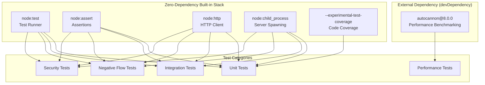

# Technical Specification

# 0. Agent Action Plan

## 0.1 Intent Clarification

### 0.1.1 Core Testing Objective

Based on the provided requirements, the Blitzy platform understands that the testing objective is to **introduce a comprehensive, multi-layered testing suite from scratch** for the `hao-backprop-test` project — a minimal, zero-dependency Node.js HTTP server (`server.js`, 14 lines) that currently has absolutely no testing infrastructure, no test files, no test framework, and no `package.json`.

**Request Categorization:** Add new tests

The user's requirements translate to the following testing mandates:

- **Functional Coverage:** Add tests that verify all current project functionality — specifically the four features implemented by `server.js`: HTTP server creation (F-001), static HTTP response serving (F-002), loopback network binding (F-003), and startup logging (F-004)
- **Integration Testing:** Validate end-to-end HTTP request-response behavior across various HTTP methods, URL paths, and client scenarios, confirming the server behaves deterministically as a black-box integration fixture
- **Negative Flow Testing:** Cover failure modes, error conditions, and edge cases — including port conflicts (`EADDRINUSE`), malformed HTTP requests, oversized payloads, abrupt client disconnections, and boundary conditions
- **Performance Testing:** Measure and baseline server throughput, response latency, and concurrent connection handling capacity under load
- **Security Testing (Added Advantage):** Validate the server's resilience against common HTTP attack vectors including header injection, path traversal, HTTP request smuggling patterns, and resource exhaustion attempts

**Implicit Testing Needs Surfaced:**

- The server has no `module.exports` — all tests must use a **black-box process testing pattern** (spawn child process → send HTTP requests → assert responses → cleanup)
- A `package.json` must be created to support `npm test` scripts and to install `autocannon` for performance benchmarking
- A shared test helper module is needed to encapsulate server lifecycle management (spawn, wait-for-ready, cleanup) across all test files
- Test port isolation strategy is required to avoid `EADDRINUSE` conflicts when running multiple test suites

### 0.1.2 Special Instructions and Constraints

**User Implementation Rule — "Ajit_AddTesting_Rule":**

The user has specified a mandatory implementation rule requiring the testing plan to follow a Senior QA Architect approach with the following structured sections:

- **TESTING SCOPE & OBJECTIVES** — Define what needs to be tested, key functionalities, testing goals, risks covered, and success criteria
- **SYSTEM BOUNDARIES** — Describe what is in scope and out of scope, including components, integrations, dependencies, data sources, assumptions, and constraints
- **TECHNICAL IMPLEMENTATION** — Explain the system architecture, technologies used, integrations, environments, and testing tools or automation frameworks
- **TEST COVERAGE STRATEGY** — Outline how testing will ensure coverage including functional, edge cases, negative testing, security, performance, UI, and risk-based testing
- **TESTING INTEGRATION & WORKFLOW** — Describe how testing integrates with development, CI/CD, automation, defect management, reporting, and release validation

**Critical Constraints Identified:**

- The server binds to a hardcoded `127.0.0.1:3000` — tests must manage port availability or use dynamic port allocation strategies
- `server.js` is a self-executing script with no exports — cannot be `require()`-ed without side effects
- Zero external dependencies exist today — introducing `package.json` is necessary for `autocannon` (performance testing) but all other tests can use Node.js built-in `node:test` + `node:assert`
- No CI/CD pipeline exists — test commands must be documented for manual execution

### 0.1.3 Technical Interpretation

These testing requirements translate to the following technical test implementation strategy:

- To **test core HTTP response functionality**, we will **create** `test/unit/server.test.js` using `node:test` and `node:assert`, spawning `server.js` as a child process and asserting response status code (200), Content-Type header (`text/plain`), and body (`Hello, World!\n`)
- To **test integration behavior across HTTP methods and paths**, we will **create** `test/integration/server.integration.test.js` that validates identical responses for GET, POST, PUT, DELETE, PATCH, HEAD, and OPTIONS requests across various URL paths
- To **test negative flows and error handling**, we will **create** `test/negative/server.negative.test.js` that verifies port conflict behavior (`EADDRINUSE`), oversized request headers, malformed HTTP data, and rapid connection cycling
- To **test performance baselines**, we will **create** `test/performance/server.performance.test.js` using `autocannon` programmatic API to benchmark throughput, latency percentiles, and concurrent connection handling
- To **test security resilience**, we will **create** `test/security/server.security.test.js` that validates the server's handling of HTTP header injection attempts, path traversal payloads, extremely large request bodies, and slowloris-style connection patterns
- To **provide shared test utilities**, we will **create** `test/helpers/server-helper.js` containing reusable functions for spawning the server, waiting for startup readiness, making HTTP requests, and performing teardown/cleanup

### 0.1.4 Coverage Requirements Interpretation

**Explicit Coverage Targets:**

The user has not specified numeric coverage percentage targets. Based on the project's nature and the user's emphasis on integration, negative, performance, and security testing, coverage expectations are interpreted holistically.

**Implicit Coverage Expectations:**

- **Industry Standard for Node.js HTTP Servers:** 80-90% code coverage for application logic; however, since `server.js` is a 14-line self-executing script with zero branching logic, behavioral coverage (all features exercised) is more meaningful than line coverage
- **Existing Repository Patterns:** No existing test patterns to follow — this is a greenfield testing effort
- **Critical Path Analysis:** All four features (F-001 through F-004) are critical and must have test coverage. The static response handler (F-002) is the core functionality and should have the highest test density

To achieve comprehensive testing, coverage should include:

- 100% of defined features (F-001 through F-004) exercised through black-box tests
- All HTTP methods verified for route-agnostic behavior (GET, POST, PUT, DELETE, PATCH, HEAD, OPTIONS)
- All three startup failure modes tested (port conflict, loopback unavailability, version incompatibility)
- Latency, throughput, and concurrency metrics baselined under performance testing
- At least 5 security attack vector categories validated

## 0.2 Test Discovery and Analysis

### 0.2.1 Existing Test Infrastructure Assessment

A comprehensive repository search confirms the **complete absence of any testing infrastructure**. The repository consists of exactly two files in a flat directory structure with no subdirectories:

| Artifact Searched | Pattern | Result |
|---|---|---|
| Test files | `*test*`, `*spec*`, `test_*`, `*_test.*`, `*_spec.*` | None found |
| Test directories | `test/`, `__tests__/`, `tests/`, `spec/` | None exist |
| Test framework config | `jest.config.*`, `pytest.ini`, `.mocharc.*`, `vitest.config.*` | None found |
| Package manifest | `package.json`, `package-lock.json` | None exist |
| Coverage config | `.nycrc`, `.c8rc.json`, `.coveragerc` | None found |
| CI/CD config | `.github/workflows/`, `.gitlab-ci.yml`, `Jenkinsfile` | None found |
| Test fixtures/data | `fixtures/`, `__fixtures__/`, `mock*/` | None found |
| Git hooks | `.husky/`, `.git/hooks/pre-commit` | None configured |

Repository analysis reveals **no testing setup of any kind** — the project has zero test files, zero testing frameworks, zero coverage tooling, and no package management. This is a deliberate architectural decision documented in the tech spec as the "zero-dependency minimalism principle."

**Current Testing Framework:** None — no testing framework is installed or configured

**Test Runner Configuration:** None — no test runner exists

**Coverage Tools in Use:** None — no coverage tooling

**Mock/Stub Libraries:** None — no mocking libraries present

**Test Data Fixtures or Factories:** None — no test data infrastructure

**Key Technical Constraint — No Module Exports:**

The most significant constraint affecting the testing approach is that `server.js` does not export any objects. It is a self-executing script that immediately starts an HTTP server when run via `node server.js`. This eliminates traditional unit testing patterns where modules are imported and exported functions tested in isolation.

```
// server.js — NO module.exports
const server = http.createServer((req, res) => { ... });
server.listen(port, hostname, () => { ... });
// File ends — no exports
```

This means any testing approach must treat the server as a **black-box process** — starting it as a child process, making HTTP requests to the bound address, and asserting response properties.

### 0.2.2 Web Search Research Conducted

The following research was conducted to validate testing tool compatibility and best practices:

- **Node.js `node:test` Built-in Test Runner:** Confirmed stable in Node.js v20 (the installed version is v20.20.2). Supports `describe`, `it/test`, hooks (`before`, `after`, `beforeEach`, `afterEach`), built-in mocking, watch mode, parallel execution, and code coverage via `--experimental-test-coverage` flag. Zero external dependencies required.

- **`autocannon` HTTP Benchmarking Tool:** Confirmed latest version is 8.0.0 on npm. Provides programmatic API for Node.js-based HTTP load testing with histogram statistics for request latency, throughput, and error rates. Supports concurrent connections, pipelining, and worker threads for high-load generation. Compatible with Node.js 20.

- **Black-Box Testing Pattern for Node.js HTTP Servers:** Best practice for testing self-executing server scripts is to spawn the server as a child process using `child_process.spawn()`, monitor stdout for readiness signals, issue HTTP requests via the built-in `http` module, and terminate the process after assertions. This is the recommended approach when module exports are unavailable.

- **Security Testing for Minimal HTTP Servers:** Common test vectors include HTTP header injection, oversized headers/payloads, path traversal payloads, HTTP method abuse, and connection exhaustion. All can be tested using Node.js built-in `http` module without external security testing tools.

## 0.3 Testing Scope Analysis

### 0.3.1 Test Target Identification

**Primary Code to Be Tested:**

- Module: `server.js` at `/server.js` — requires unit, integration, negative, performance, and security tests via black-box process pattern (no module exports available)

**Functions and Behaviors Requiring Test Coverage:**

| Behavior | Source Lines | Test Categories Needed |
|---|---|---|
| HTTP module loading (`require('http')`) | Line 1 | Unit |
| Hostname/port constant assignment | Lines 3-4 | Unit |
| HTTP server creation with request handler | Line 6 | Unit, Integration |
| Response status code (200) | Line 7 | Unit, Integration, Security |
| Response Content-Type header (`text/plain`) | Line 8 | Unit, Integration, Security |
| Response body (`Hello, World!\n`) | Line 9 | Unit, Integration, Performance |
| Server listening on 127.0.0.1:3000 | Line 12 | Unit, Integration, Negative |
| Startup console.log message | Line 13 | Unit |
| Route-agnostic request handling (all methods/paths) | Lines 6-9 | Integration |
| Port conflict behavior (EADDRINUSE) | Lines 12-14 | Negative |

**Existing Test File Mapping:**

| Source File | Existing Test File | Test Categories Present |
|---|---|---|
| `server.js` | None — no test files exist | None |
| `README.md` | N/A (documentation only) | N/A |

**Dependencies Requiring Mocking:**

- **External services to mock:** None — zero outbound connections
- **Database interactions to stub:** None — no data persistence
- **File system operations to virtualize:** None — no file I/O
- **Network module:** Not mocked — tested directly via black-box HTTP requests to the loopback interface
- **Port availability:** Simulated by pre-occupying port 3000 for negative flow tests

### 0.3.2 Version Compatibility Research

Based on the current Node.js v20.20.2 runtime, the recommended testing stack is:

| Tool | Name | Version | Compatibility Rationale |
|---|---|---|---|
| **Testing Framework** | `node:test` (built-in) | Bundled with Node.js 20.20.2 | Stable since Node.js 20.0.0; zero-dependency; provides `test()`, `describe()`, hooks, mocking |
| **Assertion Library** | `node:assert` (built-in) | Bundled with Node.js 20.20.2 | Available since Node.js 0.1.x; provides `strictEqual`, `deepStrictEqual`, `match`, `rejects` |
| **HTTP Client** | `node:http` (built-in) | Bundled with Node.js 20.20.2 | Same module the server uses; provides `http.get()` and `http.request()` for test requests |
| **Process Management** | `node:child_process` (built-in) | Bundled with Node.js 20.20.2 | Provides `spawn()` for launching server as child process during tests |
| **Performance Benchmarking** | `autocannon` (npm) | 8.0.0 | Latest stable; compatible with Node.js 20; provides programmatic API for load testing |
| **Coverage Tool** | `--experimental-test-coverage` (built-in) | Bundled with Node.js 20.20.2 | Built-in V8 coverage; no external tools needed |

**Version Conflicts to Resolve:** None identified. All built-in modules are inherently compatible with Node.js 20.20.2. The sole external dependency (`autocannon@8.0.0`) supports Node.js 20.x.



## 0.4 Test Implementation Design

### 0.4.1 Test Strategy Selection

**Test Types to Implement:**

- **Unit Tests (Black-Box):** Focus on isolated verification of each of the four server features (F-001 through F-004) — server startup, response status, response headers, response body, and startup logging. Due to the no-exports constraint, "unit" tests operate as fine-grained black-box process tests targeting one feature per test case.

- **Integration Tests:** Cover multi-method HTTP protocol interactions — verifying that GET, POST, PUT, DELETE, PATCH, HEAD, and OPTIONS requests all produce identical responses. Validate server behavior with various URL paths, query strings, and request headers. Confirm that multiple sequential requests receive consistent responses.

- **Negative Flow Tests:** Address boundary conditions and failure scenarios including `EADDRINUSE` port conflict when port 3000 is already occupied, oversized HTTP headers, extremely long URL paths, malformed HTTP request data, abrupt client disconnections, and server process termination behavior.

- **Performance Tests:** Benchmark server throughput (requests/second), response latency (p50, p95, p99 percentiles), concurrent connection handling capacity, and error rate under load using `autocannon` programmatic API.

- **Security Tests:** Verify server resilience against HTTP header injection attempts (CRLF injection), path traversal payloads (`../`), extremely large request bodies designed to exhaust memory, HTTP request smuggling patterns, and connection-based attacks (rapid open/close cycling).

### 0.4.2 Test Case Blueprint

**Component: HTTP Server Creation (F-001)**

```
Component: F-001 — HTTP Server Creation
Test Categories:
- Happy path: Server starts successfully when port 3000 is available
- Happy path: Server binds to 127.0.0.1 loopback interface
- Edge cases: Server startup time remains under reasonable threshold
- Error cases: EADDRINUSE when port 3000 is occupied by another process
```

**Component: Static HTTP Response Serving (F-002)**

```
Component: F-002 — Static HTTP Response Serving
Test Categories:
- Happy path: GET request returns status code 200
- Happy path: Response Content-Type is text/plain
- Happy path: Response body is exactly "Hello, World!\n"
- Happy path: POST, PUT, DELETE, PATCH return identical responses
- Edge cases: Request with very long URL path returns same response
- Edge cases: Request with query parameters returns same response
- Edge cases: HEAD request returns correct headers without body
- Error cases: Response remains consistent under concurrent requests
```

**Component: Loopback Network Binding (F-003)**

```
Component: F-003 — Loopback Network Binding
Test Categories:
- Happy path: Server accepts connections on 127.0.0.1
- Happy path: Server responds on port 3000
- Edge cases: Multiple rapid connections handled correctly
- Error cases: Connection to non-bound address fails appropriately
```

**Component: Startup Logging (F-004)**

```
Component: F-004 — Startup Logging
Test Categories:
- Happy path: Stdout contains "Server running at http://127.0.0.1:3000/"
- Happy path: Log message emitted exactly once
- Edge cases: No additional log output during normal operation
- Error cases: No log emitted when startup fails (port conflict)
```

**Component: Performance Baseline**

```
Component: Performance Benchmarking
Test Categories:
- Happy path: Average latency under 10ms for 10 concurrent connections
- Happy path: Throughput exceeds 1000 req/sec baseline
- Edge cases: Zero errors under moderate 100-connection load
- Performance boundaries: Measure p99 latency under sustained load
```

**Component: Security Resilience**

```
Component: Security Testing
Test Categories:
- Happy path: Normal requests pass through securely
- Edge cases: CRLF injection in headers does not alter response behavior
- Edge cases: Path traversal payloads do not expose file system
- Error cases: Oversized headers do not crash the server
- Error cases: Large request bodies do not exhaust process memory
```

### 0.4.3 Existing Test Extension Strategy

Since no test files exist in the repository, there are no tests to extend, refactor, or fix. This is a **purely greenfield testing effort**. All test files listed in the transformation mapping (Section 0.5) are newly created.

- Tests to extend: None — no existing test files
- Tests to refactor: None — no existing test patterns to modernize
- Tests to fix: None — no broken tests to repair

### 0.4.4 Test Data and Fixtures Design

**Required Test Data Structures:**

No complex test data fixtures are required. The server processes no input and returns a static response. All test assertions compare against hardcoded expected values derived directly from `server.js` source constants:

| Expected Value | Source | Used In |
|---|---|---|
| `"Server running at http://127.0.0.1:3000/"` | `server.js` line 13 | Startup log verification |
| `200` | `server.js` line 7 | Response status code assertions |
| `"text/plain"` | `server.js` line 8 | Content-Type header assertions |
| `"Hello, World!\n"` | `server.js` line 9 | Response body assertions |
| `"127.0.0.1"` | `server.js` line 3 | Loopback binding verification |
| `3000` | `server.js` line 4 | Port binding verification |

**Fixture Organization Strategy:**

Expected values are defined as constants within the shared helper module (`test/helpers/server-helper.js`) and imported by all test files, ensuring a single source of truth. If `server.js` values change, only the helper constants need updating.

**Mock Object Specifications:**

No mock objects are required. The black-box testing pattern tests the actual server process, making real HTTP requests to the live loopback endpoint. The only simulation needed is occupying port 3000 with a temporary TCP server for negative flow tests (port conflict scenario).

**Test Database/State Management:**

Not applicable — the server has zero persistent state, no database, and no in-memory data stores.

## 0.5 Test File Transformation Mapping

### 0.5.1 File-by-File Test Plan

| Target Test File | Transformation | Source File/Reference | Purpose/Changes |
|---|---|---|---|
| `test/helpers/server-helper.js` | CREATE | `server.js` | Shared test utility: server spawn/wait/cleanup lifecycle management, expected value constants, HTTP request helpers |
| `test/unit/server.test.js` | CREATE | `server.js` | Unit-level black-box tests for all four features (F-001 through F-004): startup, response status, headers, body, logging |
| `test/integration/server.integration.test.js` | CREATE | `server.js` | Integration tests: HTTP method coverage (GET/POST/PUT/DELETE/PATCH/HEAD/OPTIONS), URL path variations, query strings, multi-request consistency |
| `test/negative/server.negative.test.js` | CREATE | `server.js` | Negative flow tests: EADDRINUSE port conflict, oversized headers, long URL paths, malformed requests, abrupt disconnections, server kill behavior |
| `test/performance/server.performance.test.js` | CREATE | `server.js` | Performance benchmarks using autocannon: throughput, latency percentiles (p50/p95/p99), concurrent connections, error rate under load |
| `test/security/server.security.test.js` | CREATE | `server.js` | Security tests: CRLF header injection, path traversal payloads, large body payloads, HTTP method abuse, rapid connection cycling |
| `package.json` | CREATE | N/A | Initialize project manifest with test scripts and devDependencies (autocannon) |

### 0.5.2 New Test Files Detail

**`test/helpers/server-helper.js`** — Shared Test Lifecycle Utility

- **Purpose:** Encapsulate server process management for all test files
- **Key exports:**
  - `spawnServer(port?)` — Spawns `server.js` as a child process, returns process handle and stdout/stderr streams
  - `waitForReady(serverProcess)` — Returns a Promise that resolves when stdout emits the startup log message
  - `stopServer(serverProcess)` — Sends SIGTERM to the child process and waits for exit
  - `makeRequest(options)` — Wrapper around `http.request()` that returns a Promise with `{ statusCode, headers, body }`
  - `EXPECTED_STATUS`, `EXPECTED_CONTENT_TYPE`, `EXPECTED_BODY`, `EXPECTED_LOG_MESSAGE` — Constants derived from `server.js`
- **Mock dependencies:** None
- **Assertions focus:** N/A (utility module)

**`test/unit/server.test.js`** — Unit Tests for Core Features

- **Test categories:** Happy path response verification, startup behavior, logging output
- **Key test cases:**
  - `should start server and emit startup log message` (F-004)
  - `should return status code 200 on HTTP GET` (F-002)
  - `should return Content-Type text/plain header` (F-002)
  - `should return "Hello, World!\n" response body` (F-002)
  - `should bind to 127.0.0.1 loopback address` (F-003)
  - `should listen on port 3000` (F-003)
- **Mock dependencies:** None — black-box testing pattern
- **Assertions focus:** `assert.strictEqual` for exact value matching, `assert.match` for startup log pattern

**`test/integration/server.integration.test.js`** — Integration Tests

- **Integration points:** HTTP protocol methods, URL routing behavior, concurrent request handling
- **Key test cases:**
  - `should return identical response for GET request`
  - `should return identical response for POST request`
  - `should return identical response for PUT request`
  - `should return identical response for DELETE request`
  - `should return identical response for PATCH request`
  - `should return correct headers for HEAD request`
  - `should respond to OPTIONS request`
  - `should return same response for /any/path URL`
  - `should return same response for URL with query parameters`
  - `should handle multiple sequential requests consistently`
  - `should handle request with custom headers`
- **Test data requirements:** HTTP method strings, URL path strings, custom header objects

**`test/negative/server.negative.test.js`** — Negative Flow Tests

- **Key test cases:**
  - `should fail with EADDRINUSE when port 3000 is occupied`
  - `should handle request with extremely long URL path`
  - `should handle request with oversized headers`
  - `should handle request with large body payload`
  - `should handle abrupt client disconnection gracefully`
  - `should terminate cleanly on SIGTERM signal`
  - `should terminate on SIGINT signal`
  - `should handle rapid sequential connection open/close`
- **Mock dependencies:** Temporary TCP server to occupy port 3000 for conflict tests
- **Assertions focus:** `assert.strictEqual` for exit codes, `assert.match` for error messages

**`test/performance/server.performance.test.js`** — Performance Benchmarks

- **Key test cases:**
  - `should handle 10 concurrent connections with average latency under 10ms`
  - `should achieve minimum throughput of 1000 req/sec`
  - `should produce zero errors under 100-connection load`
  - `should maintain p99 latency under 50ms at moderate load`
  - `should handle sustained 10-second benchmark without degradation`
- **Test data requirements:** autocannon configuration objects (connections, duration, pipelining)
- **Assertions focus:** Numeric threshold comparisons on latency/throughput histograms

**`test/security/server.security.test.js`** — Security Tests

- **Key test cases:**
  - `should not be vulnerable to CRLF header injection`
  - `should handle path traversal attempts without exposing file system`
  - `should survive large request body without crashing`
  - `should handle oversized Content-Length header gracefully`
  - `should respond consistently to all HTTP methods including TRACE and CONNECT`
  - `should survive rapid connection open/close cycling (slowloris pattern)`
  - `should not leak server internals in response headers`
- **Assertions focus:** Server process remains alive after attacks, response integrity maintained

### 0.5.3 Test Files to Modify Detail

No existing test files require modification. All test files are newly created (see Section 0.5.2).

### 0.5.4 Test Configuration Updates

**`package.json`** (CREATE) — New project manifest:

- Add `"scripts": { "test": "node --test", "test:unit": "node --test test/unit/", "test:integration": "node --test test/integration/", "test:negative": "node --test test/negative/", "test:performance": "node --test test/performance/", "test:security": "node --test test/security/", "test:coverage": "node --test --experimental-test-coverage", "test:all": "node --test test/" }`
- Add `"devDependencies": { "autocannon": "^8.0.0" }`
- Set `"name": "hao-backprop-test"`, `"version": "1.0.0"`

**Directory structure to be created:**

```
test/
├── helpers/
│   └── server-helper.js
├── unit/
│   └── server.test.js
├── integration/
│   └── server.integration.test.js
├── negative/
│   └── server.negative.test.js
├── performance/
│   └── server.performance.test.js
└── security/
    └── server.security.test.js
```

### 0.5.5 Cross-File Test Dependencies

**Shared Fixtures:**

- `test/helpers/server-helper.js` — Used by ALL test files (`test/unit/`, `test/integration/`, `test/negative/`, `test/performance/`, `test/security/`). Provides `spawnServer()`, `waitForReady()`, `stopServer()`, `makeRequest()`, and expected value constants.

**Mock Objects:**

- Port-blocking TCP server (inline in `test/negative/server.negative.test.js`) — A temporary `net.createServer()` that occupies port 3000 to simulate `EADDRINUSE` conditions. Not shared across files.

**Test Utilities:**

- `spawnServer()` — Spawns `node server.js` as child process using `child_process.spawn()`
- `waitForReady()` — Monitors stdout for the startup confirmation message
- `stopServer()` — Kills child process and waits for clean exit
- `makeRequest()` — Promise-based HTTP request utility using built-in `http` module

**Import Updates Required:**

All test files import from the same shared helper:

```
const { spawnServer, waitForReady, stopServer, makeRequest } = require('../helpers/server-helper');
```

The performance test file additionally imports `autocannon`:

```
const autocannon = require('autocannon');
```

## 0.6 Dependency Inventory

### 0.6.1 Testing Dependencies

**Built-in Dependencies (Zero Installation Required):**

| Registry | Package Name | Version | Purpose |
|---|---|---|---|
| Node.js built-in | `node:test` | Bundled (Node.js 20.20.2) | Test runner — provides `test()`, `describe()`, `it()`, lifecycle hooks (`before`, `after`, `beforeEach`, `afterEach`), and built-in mocking |
| Node.js built-in | `node:assert` | Bundled (Node.js 20.20.2) | Assertion library — provides `strictEqual`, `deepStrictEqual`, `match`, `ok`, `rejects`, `throws` |
| Node.js built-in | `node:http` | Bundled (Node.js 20.20.2) | HTTP client for test requests — `http.get()`, `http.request()` for sending requests to the server under test |
| Node.js built-in | `node:child_process` | Bundled (Node.js 20.20.2) | Process management — `spawn()` for launching `server.js` as a child process during tests |
| Node.js built-in | `node:net` | Bundled (Node.js 20.20.2) | TCP server creation — used in negative tests to occupy port 3000 for EADDRINUSE simulation |

**External Dependencies (devDependencies — Requires `package.json`):**

| Registry | Package Name | Version | Purpose |
|---|---|---|---|
| npm | `autocannon` | 8.0.0 | HTTP/1.1 benchmarking tool for performance tests — provides programmatic API for load generation with latency histograms, throughput metrics, and error counting |

**Dependency Rationale:**

- `autocannon@8.0.0` is the only external dependency required. It is categorized as a `devDependency` and does not affect the production server. Its selection is based on: compatibility with Node.js 20, native Node.js implementation (no native binaries), comprehensive HTTP benchmarking metrics (latency percentiles, throughput, error rate), and programmatic API that integrates with `node:test` assertions.

### 0.6.2 Import Updates

**Test files requiring import statements:**

- `test/helpers/server-helper.js` — Imports from built-in modules:
  - `const { spawn } = require('node:child_process');`
  - `const http = require('node:http');`

- `test/unit/server.test.js` — Imports:
  - `const { describe, it, before, after } = require('node:test');`
  - `const assert = require('node:assert');`
  - `const { spawnServer, waitForReady, stopServer, makeRequest, EXPECTED_STATUS, EXPECTED_CONTENT_TYPE, EXPECTED_BODY, EXPECTED_LOG_MESSAGE } = require('../helpers/server-helper');`

- `test/integration/server.integration.test.js` — Same imports as unit tests

- `test/negative/server.negative.test.js` — Same as unit tests, plus:
  - `const net = require('node:net');`

- `test/performance/server.performance.test.js` — Imports:
  - `const { describe, it, before, after } = require('node:test');`
  - `const assert = require('node:assert');`
  - `const autocannon = require('autocannon');`
  - `const { spawnServer, waitForReady, stopServer } = require('../helpers/server-helper');`

- `test/security/server.security.test.js` — Same imports as unit tests, plus:
  - `const net = require('node:net');` (for raw socket tests)

**Import Transformation Rules:**

No import transformations are needed since no existing test files exist. All imports are new and follow CommonJS `require()` syntax consistent with the project's existing module system (`server.js` uses `require('http')`).

## 0.7 Coverage and Quality Targets

### 0.7.1 Coverage Metrics

**Current Coverage:** 0% — No test files or coverage tooling exist in the repository.

**Target Coverage:** 100% behavioral coverage of all four defined features (F-001 through F-004). Due to the black-box testing pattern (server runs as a child process), traditional line-coverage instrumentation via `--experimental-test-coverage` measures coverage within the test process, not within the spawned `server.js` process. Therefore, behavioral/feature coverage is the primary metric.

**Coverage Gaps to Address:**

| Component/Feature | Current | Target | Focus Areas |
|---|---|---|---|
| F-001: HTTP Server Creation | 0% | 100% | Verify server starts, binds port, creates HTTP listener |
| F-002: Static HTTP Response | 0% | 100% | Verify status 200, Content-Type, body for all HTTP methods |
| F-003: Loopback Binding | 0% | 100% | Verify 127.0.0.1 binding, port 3000 |
| F-004: Startup Logging | 0% | 100% | Verify stdout log message content and timing |
| Negative Flows | 0% | 100% | Port conflict, oversized requests, disconnections, signals |
| Performance Baseline | 0% | Baselined | Throughput, latency percentiles, error rate under load |
| Security Resilience | 0% | 100% | Header injection, path traversal, payload attacks |

**Per-File Coverage Targets:**

| Test File | Test Case Count Target | Feature Coverage |
|---|---|---|
| `test/unit/server.test.js` | 6-8 test cases | F-001, F-002, F-003, F-004 |
| `test/integration/server.integration.test.js` | 10-12 test cases | F-002 (all HTTP methods), F-003 |
| `test/negative/server.negative.test.js` | 6-8 test cases | Error handling, failure modes |
| `test/performance/server.performance.test.js` | 4-5 test cases | Throughput, latency, concurrency |
| `test/security/server.security.test.js` | 6-8 test cases | Attack vector resilience |

### 0.7.2 Test Quality Criteria

**Assertion Density Expectations:**

- Minimum 2 assertions per test case (e.g., verify both status code AND body)
- Integration tests should assert status code, Content-Type header, and body in each HTTP method test
- Performance tests should assert against numeric thresholds for latency and throughput

**Test Isolation Requirements:**

- Each test file spawns its own server process instance in `before()` hooks and terminates it in `after()` hooks
- Tests must not depend on execution order within a file
- Port usage must be managed to prevent `EADDRINUSE` conflicts between test suites running in parallel — use sequential execution mode (`--test-concurrency=1`) for suites that bind port 3000

**Performance Constraints for Test Execution:**

- Unit tests should complete in under 5 seconds
- Integration tests should complete in under 10 seconds
- Negative flow tests should complete in under 15 seconds (includes process spawn/kill cycles)
- Performance tests may take 30-60 seconds (includes `autocannon` benchmark duration)
- Security tests should complete in under 15 seconds
- Total test suite execution should not exceed 2 minutes

**Maintainability Standards:**

- All expected values defined as constants in the shared helper module — single source of truth
- Consistent test naming convention: `should [expected behavior] when [condition]`
- Test files organized by testing category in separate directories
- CommonJS `require()` syntax used consistently, matching `server.js` module style

**Repository Test Patterns and Conventions:**

Since no test patterns exist in the repository, the following conventions are established:

- Test file naming: `*.test.js` suffix
- Test directory: `test/` at repository root, with subdirectories by category
- Test grouping: `describe()` blocks per feature/concern, `it()` per test case
- Lifecycle management: `before()`/`after()` hooks for server spawn/cleanup
- Assertion style: `node:assert` strict methods (`strictEqual`, `deepStrictEqual`)

## 0.8 Scope Boundaries

### 0.8.1 Exhaustively In Scope

**New Test Files:**

- `test/unit/server.test.js` — Unit-level black-box tests for all four server features
- `test/integration/server.integration.test.js` — HTTP protocol integration tests across methods and paths
- `test/negative/server.negative.test.js` — Negative flow and error condition tests
- `test/performance/server.performance.test.js` — Performance benchmarking with autocannon
- `test/security/server.security.test.js` — Security resilience tests against common attack vectors
- `test/helpers/server-helper.js` — Shared test utility module for server lifecycle management

**Test Configuration:**

- `package.json` — New project manifest with test scripts and devDependencies

**Test Utilities and Helpers:**

- `test/helpers/server-helper.js` — Reusable functions for spawning server, waiting for readiness, making HTTP requests, and cleanup

**Documentation Updates:**

- `README.md` — Update with testing section documenting how to run tests, available test commands, and test structure

**Testing Categories Covered:**

| Category | Files | Description |
|---|---|---|
| Unit Testing | `test/unit/server.test.js` | Feature-by-feature verification via black-box pattern |
| Integration Testing | `test/integration/server.integration.test.js` | HTTP method and path coverage, multi-request flows |
| Negative Flow Testing | `test/negative/server.negative.test.js` | Error conditions, port conflicts, malformed inputs |
| Performance Testing | `test/performance/server.performance.test.js` | Throughput, latency, concurrent connection benchmarks |
| Security Testing | `test/security/server.security.test.js` | Attack vector resilience, header injection, payload abuse |

### 0.8.2 Explicitly Out of Scope

**Source Code Modifications:**

- `server.js` will NOT be modified — all tests use the black-box process pattern against the unmodified server. No `module.exports` will be added, no port configuration will be made dynamic, and no error handlers will be introduced.

**Infrastructure Beyond Testing:**

- CI/CD pipeline setup (no GitHub Actions, GitLab CI, or Jenkins configuration)
- Docker containerization for test environments
- Pre-commit or pre-push Git hooks for automated test execution
- Production deployment scripts or configurations

**Testing Categories Not Included:**

- End-to-end (E2E) UI testing — no user interface exists
- Cross-browser testing — no browser-rendered content
- Database testing — no database connectivity
- API contract/schema testing — no formal API specification (OpenAPI/Swagger)
- Accessibility testing — no UI components
- Mobile testing — no mobile interface

**Refactoring and Feature Additions:**

- Refactoring `server.js` to support module exports or configurable ports
- Adding routing, middleware, or error handling to the server
- Adding structured logging framework
- Adding HTTPS/TLS support
- Implementing health check endpoints

**Unrelated Files:**

- No changes to any files outside the `test/` directory, `package.json`, and `README.md`
- No modifications to `.git/` configuration

**Items Excluded Per Project Constraints:**

- External network-facing tests (server is loopback-only at 127.0.0.1)
- Multi-machine distributed testing
- Long-running soak tests exceeding 60 seconds per benchmark
- Formal SLA validation (no SLAs are defined for this test fixture)

## 0.9 Execution Parameters

### 0.9.1 Testing-Specific Instructions

**Environment Setup Requirements:**

- Node.js v20.20.2 (or any Node.js ≥ 20 for stable `node:test` support)
- TCP port 3000 must be available (not occupied by another process)
- Loopback interface `127.0.0.1` must be operational
- Run `npm install` to install `autocannon` devDependency before performance tests

**Test Execution Commands:**

| Command | Purpose |
|---|---|
| `npm test` | Run all tests in `test/` directory using `node --test` |
| `npm run test:unit` | Run only unit tests from `test/unit/` |
| `npm run test:integration` | Run only integration tests from `test/integration/` |
| `npm run test:negative` | Run only negative flow tests from `test/negative/` |
| `npm run test:performance` | Run only performance benchmarks from `test/performance/` |
| `npm run test:security` | Run only security tests from `test/security/` |
| `npm run test:coverage` | Run all tests with V8 code coverage reporting |
| `npm run test:all` | Run the complete test suite across all categories |

**Direct Node.js Execution (without npm scripts):**

| Command | Purpose |
|---|---|
| `node --test test/` | Run all test files discovered under `test/` |
| `node --test test/unit/server.test.js` | Run a single specific test file |
| `node --test --experimental-test-coverage test/` | Run all tests with built-in V8 coverage |
| `node --test --test-reporter spec test/` | Run tests with spec-style output |
| `node --test --test-reporter tap test/` | Run tests with TAP output format |
| `node --test --test-concurrency=1 test/` | Run tests sequentially (prevents port conflicts) |

**Coverage Measurement Command:**

```
node --test --experimental-test-coverage test/unit/ test/integration/
```

**Single Test Execution Pattern:**

```
node --test test/unit/server.test.js
```

**Debug Mode Execution:**

```
node --inspect --test test/unit/server.test.js
```

**Test Patterns to Follow:**

- Use `--test-concurrency=1` when running the full suite to avoid port 3000 conflicts between tests that spawn server processes
- Performance tests (`test/performance/`) should be run separately from other test categories to avoid resource contention affecting benchmark accuracy
- Security tests should be run individually to monitor for process crashes

**Excluded Test Categories Per User Instruction:**

- None — the user has not excluded any test categories

**Pre-Test Verification:**

Before running tests, verify that port 3000 is available:

```
lsof -i :3000 || echo "Port 3000 is available"
```

## 0.10 Special Instructions for Testing

### 0.10.1 Testing-Specific Requirements

The following directives govern test implementation based on the user's explicit requirements and the project's architectural constraints:

- **DO NOT modify `server.js`** — All tests must operate against the unmodified source file using the black-box process testing pattern. No `module.exports`, no dynamic port configuration, and no error handler additions.

- **Follow the Senior QA Architect structure** per the user's `Ajit_AddTesting_Rule` implementation rule. The test suite must address: Testing Scope & Objectives, System Boundaries, Technical Implementation, Test Coverage Strategy, and Testing Integration & Workflow.

- **Maintain zero-dependency principle for core tests** — Unit, integration, negative, and security tests must use only Node.js built-in modules (`node:test`, `node:assert`, `node:http`, `node:child_process`, `node:net`). Only performance tests may depend on the external `autocannon` package.

- **Use CommonJS module syntax** — All test files must use `require()` and `module.exports` consistent with the existing `server.js` module system. Do not use ES Module `import` syntax.

- **Implement consistent server lifecycle management** — All test files must use the shared `test/helpers/server-helper.js` module for spawning, readying, and terminating the server process. This ensures reliable cleanup and prevents orphaned processes.

- **Ensure all tests can run independently** — Each test file must be executable in isolation via `node --test test/<category>/<file>.test.js`. No test should depend on another test file having run first.

- **Use sequential test execution for port-dependent tests** — Since `server.js` binds to a hardcoded port (3000), test suites that spawn the server must run with `--test-concurrency=1` to prevent `EADDRINUSE` conflicts.

- **Match the existing code style** — Use `const` declarations, arrow functions, and template literals consistent with `server.js` ES6+ style. Use descriptive test names following the `should [behavior] when [condition]` convention.

- **Performance test thresholds are baselines, not SLAs** — The performance benchmarks establish initial measurements. Threshold values in assertions (e.g., latency < 10ms, throughput > 1000 req/sec) serve as sanity checks, not contractual performance guarantees.

- **Document all test commands in README.md** — Update the project README with a testing section that includes setup instructions (`npm install`), available test scripts, and how to run individual test categories.

### 0.10.2 Risk Mitigation in Testing

| Risk | Mitigation Strategy |
|---|---|
| Port 3000 conflict during tests | Use `--test-concurrency=1` and pre-check port availability in `before()` hooks |
| Orphaned server processes | `after()` hooks call `stopServer()` with forced kill timeout; process exit handler as safety net |
| Performance test variability | Run benchmarks multiple times; use conservative assertion thresholds; document environment specs |
| Black-box coverage limitations | Cannot measure line-level code coverage of `server.js`; use behavioral feature coverage as primary metric |
| Test flakiness from timing | Use startup-readiness detection (wait for stdout message) rather than fixed timeouts |

### 0.10.3 Implementation Rule Alignment

The following maps the user's `Ajit_AddTesting_Rule` structure to the test implementation:

| Rule Section | Implementation Coverage |
|---|---|
| **1. TESTING SCOPE & OBJECTIVES** | Covered in Section 0.1 (Intent Clarification) — defines what is tested, goals, risks, and success criteria |
| **2. SYSTEM BOUNDARIES** | Covered in Section 0.8 (Scope Boundaries) — in scope/out of scope with components, dependencies, assumptions |
| **3. TECHNICAL IMPLEMENTATION** | Covered in Section 0.3 (Testing Scope Analysis) and Section 0.4 (Test Implementation Design) — architecture, tools, frameworks |
| **4. TEST COVERAGE STRATEGY** | Covered in Section 0.7 (Coverage and Quality Targets) — functional, edge cases, negative, security, performance coverage |
| **5. TESTING INTEGRATION & WORKFLOW** | Covered in Section 0.9 (Execution Parameters) — test commands, execution workflow, reporting |

