# Technical Specification

# 1. Introduction

## 1.1 Executive Summary

### 1.1.1 Project Overview

**hao-backprop-test** is a lightweight, single-purpose Node.js HTTP server designed to serve as a test fixture for validating integration with an external system referred to as "backprop." As stated in the project's `README.md`, the repository is a *"test project for backprop integration."* The system provides a minimal, deterministic HTTP endpoint bound to the local loopback interface, returning a static plain-text response for every inbound request. This design ensures a reliable, predictable target for automated integration verification workflows.

The repository was authored by **Ajitkumar Bhangale** and hosted on GitHub at `github.com/ajitblitzy/Ajit_GH_Repo-12-Mar-26`, with an initial commit on the `main` branch dated March 12, 2026.

### 1.1.2 Core Business Problem

Integration testing against external platforms and services requires stable, predictable HTTP endpoints that behave deterministically under all conditions. Without a controlled test target, integration verification becomes fragile and dependent on the availability and state of production or staging environments. **hao-backprop-test** addresses this by providing a zero-dependency, always-available local HTTP server that returns a consistent `200 OK` response — making it an ideal fixture for confirming that an external "backprop" system can correctly discover, connect to, and communicate with an HTTP endpoint.

> **Note:** The term "backprop" within this repository is not formally defined. It may refer to an external AI/ML platform, cloud service, or internal tool. The repository itself does not contain documentation or configuration that identifies the specific backprop system being targeted.

### 1.1.3 Key Stakeholders and Users

| Stakeholder | Role | Interaction |
|---|---|---|
| Ajitkumar Bhangale | Sole Author & Maintainer | Develops and maintains the test server |
| Integration Engineers | Primary Users | Execute integration tests against the endpoint |
| QA / Validation Teams | Consumers | Verify backprop connectivity using the test server |

### 1.1.4 Value Proposition

| Dimension | Value Delivered |
|---|---|
| **Simplicity** | Two-file repository with zero external dependencies — no build steps, no configuration management |
| **Determinism** | Identical `200 OK` / `Hello, World!` response for every request, regardless of method, path, or headers |
| **Zero Setup Cost** | Requires only a Node.js runtime; no `package.json`, no dependency installation |
| **Isolation** | Loopback-only binding (`127.0.0.1`) ensures no unintended network exposure |
| **Fast Startup** | Single-command launch via `node server.js` with immediate availability |

---

## 1.2 System Overview

### 1.2.1 Project Context

#### Business Context and Positioning

The project exists within the development and testing lifecycle of a broader integration effort with a "backprop" system. The repository itself serves exclusively as a **test scaffold** — it is not a production application, API gateway, or microservice. Its value is derived entirely from its role as a controlled, stable HTTP endpoint against which external systems can validate their HTTP client implementations, connectivity logic, or integration pipelines.

Several external platforms use the "Backprop" name in the AI/ML ecosystem. The exact target system for this integration is not specified within the repository's codebase or documentation, and no configuration files (such as `.env`, API keys, or platform-specific SDKs) are present that would identify a specific vendor.

#### Current System Context

This project is a **net-new creation** — it does not replace, upgrade, or refactor any prior system. The repository consists of a single commit ("Add files via upload"), indicating it was established as a fresh starting point rather than an evolution of existing infrastructure.

#### Integration with Existing Landscape

The server is designed to be consumed by an external backprop system, not to initiate outbound connections. The integration model is strictly **inbound**: the test server passively listens on `127.0.0.1:3000` and responds to any HTTP request it receives. There are no outbound API calls, webhook registrations, database connections, or message queue interactions.

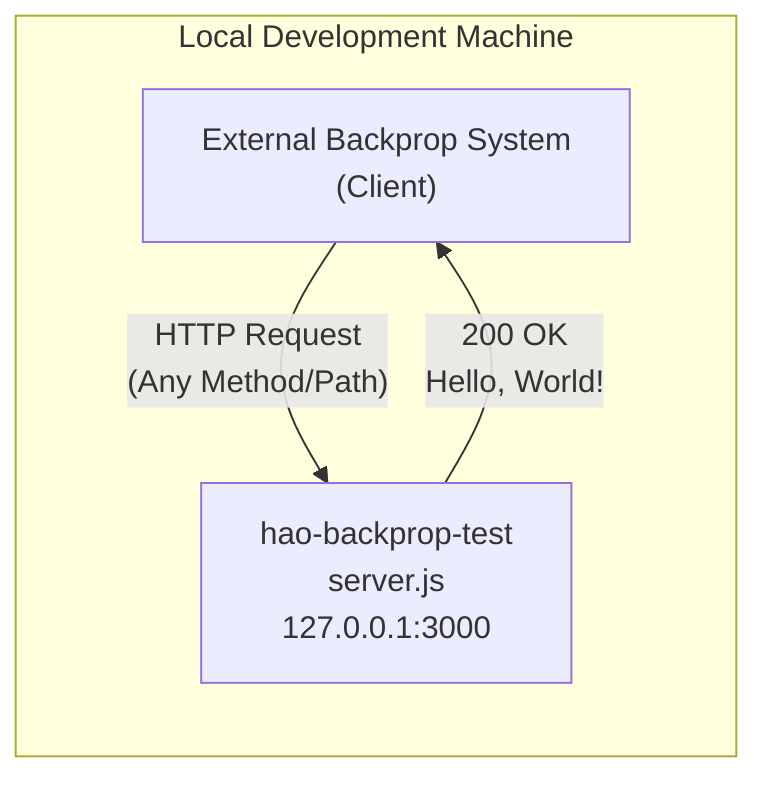

### 1.2.2 High-Level Description

#### Primary System Capabilities

The system provides a single, focused capability:

| Capability | Description |
|---|---|
| **Static HTTP Response** | Accepts any inbound HTTP request on `127.0.0.1:3000` and responds with `200 OK`, `Content-Type: text/plain`, and body `Hello, World!\n` |

The server is deliberately route-agnostic — it does not differentiate between HTTP methods (GET, POST, PUT, DELETE, etc.), URL paths, query parameters, or request headers. Every request receives an identical response.

#### Major System Components

The system architecture is intentionally minimal, consisting of exactly two files with no subdirectory structure:

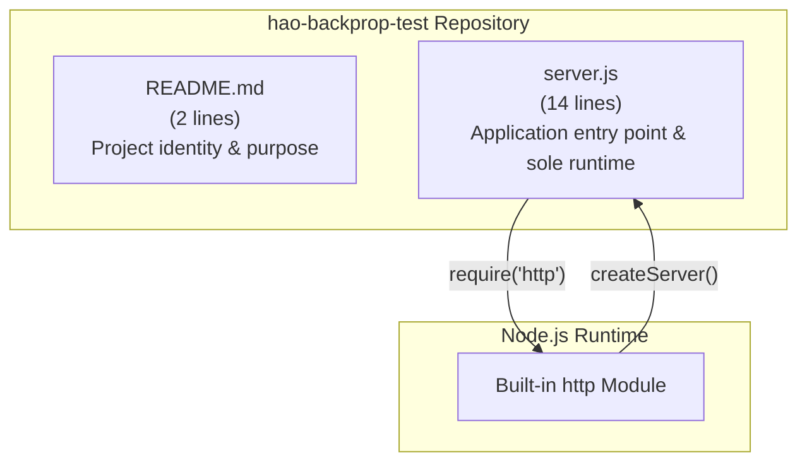

| Component | File | Lines | Responsibility |
|---|---|---|---|
| **Project Documentation** | `README.md` | 2 | States project name and purpose |
| **HTTP Server** | `server.js` | 14 | Creates and starts the HTTP server, defines request handler, binds to network interface |

#### Core Technical Approach

The implementation follows a **zero-dependency, built-in-only** technical strategy:

- **Runtime:** Node.js with CommonJS module system (`require()` syntax)
- **HTTP Layer:** Node.js built-in `http` module — no Express, Koa, Fastify, or other framework
- **Configuration:** All values hardcoded directly in `server.js` (hostname: `127.0.0.1`, port: `3000`)
- **Execution Model:** Direct script execution (`node server.js`) — the file does not export any modules
- **Request Processing:** Single inline callback function passed to `http.createServer()`, setting status code, headers, and body in sequence

### 1.2.3 Success Criteria

> **Note:** No formal success criteria, SLAs, or KPIs are defined within the repository's documentation or codebase. The following criteria are inferred from the system's design characteristics and stated purpose.

#### Measurable Objectives

| Objective | Metric | Target |
|---|---|---|
| Server Availability | Successful bind to `127.0.0.1:3000` | 100% on startup |
| Response Correctness | HTTP status code returned | `200` for all requests |
| Response Determinism | Body content consistency | `Hello, World!\n` for every request |
| Startup Confirmation | Console log output | `Server running at http://127.0.0.1:3000/` printed on launch |

#### Critical Success Factors

1. **Node.js Runtime Availability:** The server requires a functioning Node.js installation on the host machine. No version constraint is specified; however, the use of basic `http` module APIs ensures broad compatibility.
2. **Port Availability:** Port `3000` must be available and not bound by another process at startup time.
3. **Loopback Interface Accessibility:** The `127.0.0.1` loopback address must be operational on the host system.

#### Key Performance Indicators

| KPI | Expected Behavior |
|---|---|
| **Time to First Response** | Near-instantaneous after server bind completes |
| **Response Consistency** | 100% identical responses across all requests |
| **Dependency Footprint** | Zero external packages required |

---

## 1.3 Scope

### 1.3.1 In-Scope

#### Core Features and Functionalities

The following capabilities are implemented and verified within the `server.js` source file:

| Feature | Implementation Detail |
|---|---|
| **HTTP Server Creation** | Uses `http.createServer()` with an inline request handler callback |
| **Static Response Serving** | Returns `200 OK` with `Content-Type: text/plain` and body `Hello, World!\n` |
| **Loopback Network Binding** | Listens exclusively on `127.0.0.1:3000` |
| **Startup Logging** | Outputs server URL to console upon successful binding |

#### Primary User Workflow

The expected usage workflow is a single, linear sequence:

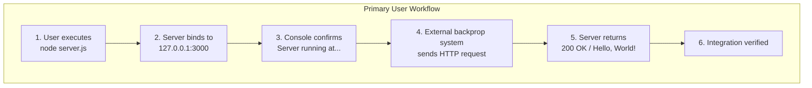

#### Implementation Boundaries

| Boundary | Scope |
|---|---|
| **System Boundary** | Single Node.js process on localhost |
| **User Groups** | Developers and integration engineers with local machine access |
| **Geographic Coverage** | Local machine only (loopback interface) |
| **Data Domain** | Static response payload only — no dynamic data, no external data sources |
| **Protocol** | HTTP (plaintext) exclusively |

#### Key Technical Requirements

| Requirement | Detail |
|---|---|
| **Runtime** | Node.js (any version supporting the `http` built-in module) |
| **Network** | Loopback interface (`127.0.0.1`) available |
| **Port** | TCP port `3000` unoccupied |
| **File System** | Read access to `server.js` |

### 1.3.2 Out-of-Scope

The following capabilities are **explicitly absent** from the current codebase, as confirmed by a complete examination of all repository files:

#### Excluded Features and Capabilities

| Category | Excluded Items |
|---|---|
| **Routing** | No URL path matching, no route definitions, no parameterized routes |
| **HTTP Method Handling** | No distinction between GET, POST, PUT, DELETE, PATCH, or other methods |
| **Middleware** | No request/response pipeline, no middleware chain |
| **Error Handling** | No try/catch blocks, no error event listeners, no graceful shutdown |
| **Request Parsing** | No body parsing, no query string extraction, no header inspection |
| **Authentication / Authorization** | No auth mechanisms of any kind |
| **Security** | No HTTPS/TLS, no CORS headers, no input validation, no rate limiting |
| **Logging** | No structured logging framework (only a single `console.log` at startup) |
| **Configuration Management** | No environment variable support, no config files, no `.env` |
| **Package Management** | No `package.json`, no `package-lock.json`, no `node_modules` |

#### Future Phase Considerations

| Consideration | Status |
|---|---|
| Production deployment infrastructure | Not present — no Dockerfile, CI/CD, or deployment scripts |
| Multi-environment support | Not present — configuration is hardcoded |
| Containerization | Not present — no Docker or container-related files |
| Monitoring and observability | Not present — no health checks, metrics, or tracing |
| API versioning | Not present — single undifferentiated endpoint |
| External network binding | Not present — server is restricted to loopback interface |

#### Integration Points Not Covered

| Integration | Status |
|---|---|
| Database connectivity | Not implemented |
| Message queues / event streams | Not implemented |
| External API consumption | Not implemented |
| Service discovery / registration | Not implemented |
| Load balancing | Not implemented |

#### Unsupported Use Cases

- **Production traffic serving** — The loopback binding and lack of security, error handling, and scalability features make this unsuitable for production use.
- **Multi-user concurrent testing** — No session management, connection pooling, or resource isolation exists.
- **Dynamic content generation** — All responses are static; no templating, data transformation, or business logic is present.
- **Networked (non-local) integration testing** — The `127.0.0.1` binding prevents access from other machines on the network.

---

## 1.4 References

- `README.md` — Project name (`hao-backprop-test`) and stated purpose ("test project for backprop integration")
- `server.js` — Complete application source: HTTP server creation, network binding configuration, request handler implementation, and startup logging
- Repository root directory (`/`) — Verified complete file inventory (2 files, 0 subdirectories) and confirmed absence of configuration files, dependency manifests, and build tooling
- Web search: "backprop integration platform" — Contextual research on potential external backprop systems referenced by the project name

# 2. Product Requirements

## 2.1 Feature Catalog

This section defines the complete set of discrete, testable features implemented by the **hao-backprop-test** system. The feature inventory is derived exclusively from analysis of the two repository files (`server.js` and `README.md`) and cross-referenced against the Technical Specification Sections 1.1 through 1.4. Exactly four features exist in the system — no additional features are present or implied.

### 2.1.1 Feature Summary

| Feature ID | Feature Name | Category | Priority |
|---|---|---|---|
| F-001 | HTTP Server Creation | Core Infrastructure | Critical |
| F-002 | Static HTTP Response Serving | Core Functionality | Critical |
| F-003 | Loopback Network Binding | Network Configuration | Critical |
| F-004 | Startup Logging | Operational Observability | High |

All features carry a status of **Completed**, as verified through full examination of `server.js` (14 lines) — the sole runtime artifact in the repository.

---

### 2.1.2 Feature Definitions

#### F-001 — HTTP Server Creation

| Attribute | Detail |
|---|---|
| **Feature ID** | F-001 |
| **Feature Name** | HTTP Server Creation |
| **Category** | Core Infrastructure |
| **Priority** | Critical |

**Overview:**
The system instantiates an HTTP server instance using the Node.js built-in `http` module via the CommonJS `require('http')` pattern. The `http.createServer()` method is invoked with an inline request handler callback, establishing the foundational server object upon which all other features depend. This is implemented in `server.js`, line 1 (`require('http')`) and line 6 (`http.createServer(...)`).

**Business Value:**
Provides the essential runtime infrastructure required for integration testing against the backprop system. Without this feature, no HTTP endpoint exists for external systems to target.

**User Benefits:**
Integration engineers gain a locally executable HTTP server with zero setup overhead — no package installation, no framework configuration, and no build steps are required. As documented in Section 1.1.4, the system requires only a Node.js runtime.

**Technical Context:**
The implementation uses the Node.js built-in `http` module exclusively. As specified in Section 1.2.2, no Express, Koa, Fastify, or other framework is used. The server object is assigned to a `const server` variable and serves as the shared artifact consumed by both the request handler (F-002) and network binding (F-003) features.

**Dependencies:**

| Dependency Type | Detail |
|---|---|
| Prerequisite Features | None — F-001 is the root feature |
| System Dependencies | Node.js runtime (any version supporting `http` built-in) |
| External Dependencies | None |
| Integration Requirements | None |

---

#### F-002 — Static HTTP Response Serving

| Attribute | Detail |
|---|---|
| **Feature ID** | F-002 |
| **Feature Name** | Static HTTP Response Serving |
| **Category** | Core Functionality |
| **Priority** | Critical |

**Overview:**
The server's inline request handler produces an identical HTTP response for every inbound request: status code `200`, `Content-Type: text/plain` header, and body `Hello, World!\n`. This behavior is route-agnostic — the handler does not inspect the HTTP method, URL path, query parameters, or request headers. This is implemented in `server.js`, lines 7–9.

**Business Value:**
Deterministic responses enable reliable, repeatable integration verification. As described in Section 1.1.2, integration testing requires stable HTTP endpoints that behave deterministically under all conditions. This feature directly fulfills that requirement by guaranteeing response consistency.

**User Benefits:**
QA and validation teams can confirm backprop connectivity with certainty: if the response body matches `Hello, World!\n` and the status code is `200`, the integration path is verified. No conditional logic or request-specific behavior introduces ambiguity.

**Technical Context:**
The response is constructed through three sequential calls within the `http.createServer()` callback: `res.statusCode = 200`, `res.setHeader('Content-Type', 'text/plain')`, and `res.end('Hello, World!\n')`. As noted in Section 1.2.2, this is a single inline callback function — no middleware pipeline or route matching exists.

**Dependencies:**

| Dependency Type | Detail |
|---|---|
| Prerequisite Features | F-001 (HTTP Server Creation) |
| System Dependencies | Node.js `http` module (response object API) |
| External Dependencies | None |
| Integration Requirements | Inbound HTTP requests from backprop client |

---

#### F-003 — Loopback Network Binding

| Attribute | Detail |
|---|---|
| **Feature ID** | F-003 |
| **Feature Name** | Loopback Network Binding |
| **Category** | Network Configuration |
| **Priority** | Critical |

**Overview:**
The server binds exclusively to the loopback interface at `127.0.0.1` on TCP port `3000` via the `server.listen(port, hostname, callback)` invocation. Both the hostname and port are hardcoded as constants in `server.js` (lines 3–4). This restricts the server's accessibility to the local machine only.

**Business Value:**
Loopback-only binding ensures the test server cannot be accessed from external networks, providing inherent isolation for the testing environment. As documented in Section 1.1.4, this isolation is a core value proposition.

**User Benefits:**
Developers can run the test server without concern for unintended network exposure. The binding guarantees that only local processes (including the backprop client running on the same machine) can reach the endpoint.

**Technical Context:**
The binding configuration uses hardcoded constants (`const hostname = '127.0.0.1'` and `const port = 3000`) with no environment variable support or configuration file override capability. As stated in Section 1.3.1, port `3000` must be unoccupied and the loopback interface must be operational on the host system.

**Dependencies:**

| Dependency Type | Detail |
|---|---|
| Prerequisite Features | F-001 (HTTP Server Creation) |
| System Dependencies | Loopback interface (`127.0.0.1`), TCP port `3000` available |
| External Dependencies | None |
| Integration Requirements | None |

---

#### F-004 — Startup Logging

| Attribute | Detail |
|---|---|
| **Feature ID** | F-004 |
| **Feature Name** | Startup Logging |
| **Category** | Operational Observability |
| **Priority** | High |

**Overview:**
Upon successful network binding, the server emits a single `console.log()` message: `Server running at http://127.0.0.1:3000/`. This is implemented in `server.js`, line 13, within the `server.listen()` callback function. It serves as the sole operational feedback mechanism in the entire system.

**Business Value:**
Provides immediate confirmation that the test server has started successfully and is ready to receive requests. This is the only runtime indicator of system health — no other monitoring, health checks, or observability mechanisms exist (as confirmed in Section 1.3.2).

**User Benefits:**
Integration engineers can visually confirm server readiness before initiating backprop integration tests. The message includes the full URL, removing ambiguity about where to direct HTTP requests.

**Technical Context:**
The log message is constructed using a JavaScript template literal that interpolates the `hostname` and `port` constants. It fires exactly once — in the `server.listen()` success callback — and only upon successful TCP port binding. No structured logging framework is used; only the native `console.log` API is invoked.

**Dependencies:**

| Dependency Type | Detail |
|---|---|
| Prerequisite Features | F-003 (Loopback Network Binding) |
| System Dependencies | Standard output (stdout) stream |
| External Dependencies | None |
| Integration Requirements | None |

---

## 2.2 Functional Requirements

This section defines the detailed, testable requirements for each feature. Requirements follow the `F-XXX-RQ-YYY` identifier format and include acceptance criteria, priority classification, and technical specifications derived from `server.js`.

### 2.2.1 F-001 — HTTP Server Creation Requirements

#### Requirement Details

| Requirement ID | Description |
|---|---|
| F-001-RQ-001 | The system shall import the `http` module using CommonJS `require('http')` syntax |
| F-001-RQ-002 | The system shall create an HTTP server instance via `http.createServer()` |
| F-001-RQ-003 | The server shall register an inline request handler callback at creation time |

| Requirement ID | Acceptance Criteria |
|---|---|
| F-001-RQ-001 | The `http` module is successfully loaded at runtime without errors |
| F-001-RQ-002 | A valid `http.Server` object is returned and assigned to a constant |
| F-001-RQ-003 | The callback function accepts `req` and `res` parameters and is invoked on each inbound request |

| Requirement ID | Priority | Complexity |
|---|---|---|
| F-001-RQ-001 | Must-Have | Low |
| F-001-RQ-002 | Must-Have | Low |
| F-001-RQ-003 | Must-Have | Low |

#### Technical Specifications

| Specification | Detail |
|---|---|
| **Input Parameters** | None — server creation requires no external input |
| **Output / Response** | `http.Server` instance with registered handler |
| **Performance Criteria** | Server instantiation completes synchronously |
| **Data Requirements** | None |

#### Validation Rules

| Rule Category | Detail |
|---|---|
| **Business Rules** | Server object must be created before any listening or response handling occurs |
| **Data Validation** | Not applicable — no user data is processed |
| **Security Requirements** | None at this layer |
| **Compliance Requirements** | None |

---

### 2.2.2 F-002 — Static HTTP Response Serving Requirements

#### Requirement Details

| Requirement ID | Description |
|---|---|
| F-002-RQ-001 | The server shall return HTTP status code `200` for every inbound request |
| F-002-RQ-002 | The server shall set the `Content-Type` response header to `text/plain` |
| F-002-RQ-003 | The server shall return the string `Hello, World!\n` as the response body |
| F-002-RQ-004 | The server shall produce identical responses regardless of HTTP method, URL path, query parameters, or request headers |

| Requirement ID | Acceptance Criteria |
|---|---|
| F-002-RQ-001 | HTTP response status code is `200` for GET, POST, PUT, DELETE, and any other method |
| F-002-RQ-002 | Response includes header `Content-Type: text/plain` |
| F-002-RQ-003 | Response body is exactly `Hello, World!\n` (13 bytes including newline) |
| F-002-RQ-004 | Requests to `/`, `/foo`, `/bar?baz=1` all return the same response |

| Requirement ID | Priority | Complexity |
|---|---|---|
| F-002-RQ-001 | Must-Have | Low |
| F-002-RQ-002 | Must-Have | Low |
| F-002-RQ-003 | Must-Have | Low |
| F-002-RQ-004 | Must-Have | Low |

#### Technical Specifications

| Specification | Detail |
|---|---|
| **Input Parameters** | `req` (IncomingMessage) — received but not inspected |
| **Output / Response** | `200 OK`, `Content-Type: text/plain`, body: `Hello, World!\n` |
| **Performance Criteria** | Near-instantaneous — synchronous inline handler with no I/O operations |
| **Data Requirements** | Static string constant only |

#### Validation Rules

| Rule Category | Detail |
|---|---|
| **Business Rules** | Response must be deterministic — 100% identical across all requests (Section 1.2.3) |
| **Data Validation** | Not applicable — no request data is read or parsed |
| **Security Requirements** | No input validation needed (request content is ignored) |
| **Compliance Requirements** | None |

---

### 2.2.3 F-003 — Loopback Network Binding Requirements

#### Requirement Details

| Requirement ID | Description |
|---|---|
| F-003-RQ-001 | The server shall bind to hostname `127.0.0.1` (loopback interface) |
| F-003-RQ-002 | The server shall listen on TCP port `3000` |
| F-003-RQ-003 | The server shall not accept connections from external network interfaces |

| Requirement ID | Acceptance Criteria |
|---|---|
| F-003-RQ-001 | Server is reachable at `http://127.0.0.1:3000/` from the local machine |
| F-003-RQ-002 | Port `3000` is occupied by the server process after startup |
| F-003-RQ-003 | Connection attempts from non-loopback addresses are refused by the OS network stack |

| Requirement ID | Priority | Complexity |
|---|---|---|
| F-003-RQ-001 | Must-Have | Low |
| F-003-RQ-002 | Must-Have | Low |
| F-003-RQ-003 | Must-Have | Low |

#### Technical Specifications

| Specification | Detail |
|---|---|
| **Input Parameters** | Hardcoded: `hostname = '127.0.0.1'`, `port = 3000` |
| **Output / Response** | Server process listening on `127.0.0.1:3000` |
| **Performance Criteria** | Binding completes within Node.js event loop initialization |
| **Data Requirements** | TCP port `3000` must be unoccupied (Section 1.3.1) |

#### Validation Rules

| Rule Category | Detail |
|---|---|
| **Business Rules** | Binding must complete before requests can be processed or startup logging occurs |
| **Data Validation** | Not applicable — configuration values are hardcoded constants |
| **Security Requirements** | Loopback-only binding prevents external network access (Section 1.1.4) |
| **Compliance Requirements** | None |

---

### 2.2.4 F-004 — Startup Logging Requirements

#### Requirement Details

| Requirement ID | Description |
|---|---|
| F-004-RQ-001 | The server shall output a startup confirmation message to the console |
| F-004-RQ-002 | The message shall contain the full server URL: `http://127.0.0.1:3000/` |
| F-004-RQ-003 | The message shall be emitted exactly once, upon successful port binding |

| Requirement ID | Acceptance Criteria |
|---|---|
| F-004-RQ-001 | Running `node server.js` produces visible output on stdout |
| F-004-RQ-002 | Console output matches: `Server running at http://127.0.0.1:3000/` |
| F-004-RQ-003 | No log message appears if the port binding fails; the message does not repeat during the server's lifetime |

| Requirement ID | Priority | Complexity |
|---|---|---|
| F-004-RQ-001 | Should-Have | Low |
| F-004-RQ-002 | Should-Have | Low |
| F-004-RQ-003 | Should-Have | Low |

#### Technical Specifications

| Specification | Detail |
|---|---|
| **Input Parameters** | `hostname` and `port` constants (interpolated via template literal) |
| **Output / Response** | `Server running at http://${hostname}:${port}/` on stdout |
| **Performance Criteria** | Log emitted immediately upon callback invocation |
| **Data Requirements** | None beyond shared constants |

#### Validation Rules

| Rule Category | Detail |
|---|---|
| **Business Rules** | Log confirms server readiness — sole operational feedback mechanism |
| **Data Validation** | Not applicable |
| **Security Requirements** | None — no sensitive data in log output |
| **Compliance Requirements** | None |

---

## 2.3 Feature Relationships

### 2.3.1 Feature Dependency Map

The four features form a strictly linear dependency graph rooted in the HTTP server creation feature. No circular dependencies exist, and no optional or conditional relationships are present.

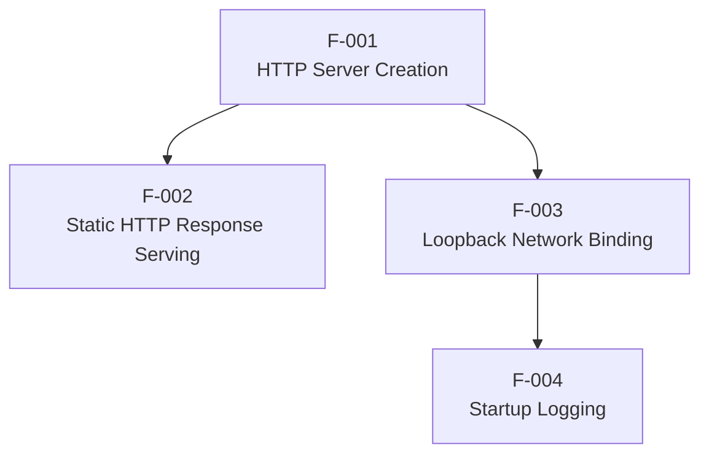

| Source Feature | Target Feature | Relationship |
|---|---|---|
| F-001 | F-002 | F-002 requires the server object created by F-001 to register the request handler |
| F-001 | F-003 | F-003 requires the server object created by F-001 to invoke `server.listen()` |
| F-003 | F-004 | F-004 executes within the `server.listen()` success callback established by F-003 |

### 2.3.2 Integration Points

The system exposes a single external integration point, as documented in Section 1.2.1:

| Integration Point | Direction | Protocol | Endpoint |
|---|---|---|---|
| HTTP Endpoint | Inbound only | HTTP (plaintext) | `http://127.0.0.1:3000/` |

The external backprop system acts as the HTTP client. The server does not initiate any outbound connections, webhook registrations, database calls, or message queue interactions.

### 2.3.3 Shared Components

All four features share a minimal set of components defined in `server.js`:

| Shared Component | Consuming Features | Source |
|---|---|---|
| `http` built-in module | F-001, F-002 | `server.js`, line 1 |
| `server` constant | F-002, F-003 | `server.js`, line 6 |
| `hostname` constant | F-003, F-004 | `server.js`, line 3 |
| `port` constant | F-003, F-004 | `server.js`, line 4 |

### 2.3.4 Common Services

No common services, middleware layers, or shared utility modules exist. The entire system operates within a single 14-line file with no module exports, no service abstractions, and no shared libraries beyond the Node.js built-in `http` module.

---

## 2.4 Implementation Considerations

### 2.4.1 Technical Constraints

| Constraint | Detail | Affected Features |
|---|---|---|
| Hardcoded configuration | Hostname and port values are constants in source code — no environment variables or config files exist | F-003, F-004 |
| No error handling | No `try/catch`, no `server.on('error')` listener — if port `3000` is occupied, the process crashes with an unhandled error | F-001, F-003 |
| No graceful shutdown | No `SIGTERM`/`SIGINT` handler — the process must be terminated externally (e.g., `Ctrl+C` or `kill`) | All |
| Single-threaded execution | Node.js single-threaded event loop — no clustering or worker threads | F-002 |
| No module exports | `server.js` does not export any objects — it cannot be imported as a module for programmatic testing | F-001 |

### 2.4.2 Performance Requirements

As inferred from the system's design (Section 1.2.3), the following performance characteristics are expected:

| Requirement | Target | Rationale |
|---|---|---|
| Time to first response | Near-instantaneous after bind | Synchronous inline handler with no I/O |
| Response consistency | 100% identical responses | Static string, no conditional logic |
| Startup time | Sub-second | Single `require()` call and `listen()` invocation |
| Dependency footprint | Zero external packages | Built-in `http` module only |

### 2.4.3 Scalability Considerations

| Consideration | Assessment |
|---|---|
| **Horizontal scaling** | Not supported — single process, loopback-only binding, no load balancer integration |
| **Vertical scaling** | Not applicable — the handler performs no computation or I/O that would benefit from additional resources |
| **Connection concurrency** | Limited by Node.js default `http.Server` settings (no explicit `maxConnections` configured) |
| **Multi-environment deployment** | Not supported — hardcoded configuration prevents environment-specific binding |

This system is explicitly scoped for local, single-user testing scenarios and is not designed for production scalability (Section 1.3.2).

### 2.4.4 Security Implications

| Aspect | Status | Detail |
|---|---|---|
| **Network isolation** | Implemented | `127.0.0.1` binding restricts access to local machine only |
| **Transport encryption** | Not implemented | HTTP plaintext only — no HTTPS/TLS support |
| **Authentication** | Not implemented | No auth mechanisms of any kind |
| **Authorization** | Not implemented | All requests receive identical treatment |
| **Input validation** | Not applicable | Request content is never read or parsed |
| **Rate limiting** | Not implemented | No connection throttling or request limits |
| **CORS** | Not implemented | No cross-origin headers are set |

The loopback-only binding serves as the primary (and only) security boundary. As confirmed in Section 1.3.2, all security features beyond network isolation are explicitly out of scope.

### 2.4.5 Maintenance Requirements

| Aspect | Detail |
|---|---|
| **Dependency updates** | None required — zero external dependencies |
| **Build process** | None — no compilation, transpilation, or bundling |
| **Configuration management** | Source code modification required for any configuration change |
| **Testing infrastructure** | Not present — no test files, test scripts, or test frameworks exist |
| **Documentation** | `README.md` provides project name and purpose (2 lines); no additional documentation exists |

---

## 2.5 Requirements Traceability Matrix

The following matrix maps each functional requirement to its parent feature, source code evidence, and corresponding Technical Specification section.

| Requirement ID | Feature | Source Evidence | Tech Spec Section |
|---|---|---|---|
| F-001-RQ-001 | F-001 | `server.js`, line 1 | 1.2.2, 1.3.1 |
| F-001-RQ-002 | F-001 | `server.js`, line 6 | 1.2.2, 1.3.1 |
| F-001-RQ-003 | F-001 | `server.js`, line 6 | 1.2.2 |
| F-002-RQ-001 | F-002 | `server.js`, line 7 | 1.2.2, 1.2.3 |
| F-002-RQ-002 | F-002 | `server.js`, line 8 | 1.2.2, 1.3.1 |
| F-002-RQ-003 | F-002 | `server.js`, line 9 | 1.2.2, 1.2.3 |
| F-002-RQ-004 | F-002 | `server.js`, lines 6–9 | 1.2.2, 1.3.2 |
| F-003-RQ-001 | F-003 | `server.js`, line 3, 12 | 1.3.1 |
| F-003-RQ-002 | F-003 | `server.js`, line 4, 12 | 1.3.1 |
| F-003-RQ-003 | F-003 | `server.js`, line 3 | 1.1.4, 1.3.1 |
| F-004-RQ-001 | F-004 | `server.js`, line 13 | 1.3.1 |
| F-004-RQ-002 | F-004 | `server.js`, line 13 | 1.3.1 |
| F-004-RQ-003 | F-004 | `server.js`, lines 12–13 | 1.3.1 |

---

## 2.6 Assumptions and Constraints

### 2.6.1 Assumptions

| ID | Assumption | Impact |
|---|---|---|
| A-001 | Node.js runtime is pre-installed on the host machine | Required for all features (F-001 through F-004) |
| A-002 | TCP port `3000` is available at startup time | Required for F-003; no fallback port logic exists |
| A-003 | The backprop client runs on the same local machine | Required for F-003; loopback binding prevents remote access |
| A-004 | The "backprop" system communicates via standard HTTP | Required for F-002; no protocol detection or negotiation exists |

### 2.6.2 Constraints

| ID | Constraint | Rationale |
|---|---|---|
| C-001 | All configuration values are hardcoded | No config files, environment variables, or CLI arguments are supported (Section 1.3.2) |
| C-002 | No `package.json` exists | The project cannot leverage npm scripts, dependency management, or metadata conventions |
| C-003 | Single-commit repository | Indicates a fresh starting point with no iterative history (Section 1.2.1) |
| C-004 | No formal success criteria defined | Performance targets and KPIs are inferred, not explicitly documented (Section 1.2.3) |

---

## 2.7 References

#### Source Files

- `server.js` — Sole runtime artifact: HTTP server creation (line 1, 6), request handler (lines 7–9), network binding configuration (lines 3–4, 12), startup logging (line 13)
- `README.md` — Project identity: name (`hao-backprop-test`) and purpose ("test project for backprop integration")

#### Repository Structure

- Root directory (`/`) — Complete file inventory: 2 files, 0 subdirectories; confirmed absence of configuration files, dependency manifests, test suites, and build tooling

#### Technical Specification Sections

- Section 1.1 (Executive Summary) — Project overview, business context, stakeholders, value proposition
- Section 1.2 (System Overview) — System capabilities, component architecture, technical approach, success criteria, KPIs
- Section 1.3 (Scope) — In-scope features, primary user workflow, implementation boundaries, technical requirements, out-of-scope items
- Section 1.4 (References) — Source file reference listing

# 3. Technology Stack

## 3.1 Overview

The **hao-backprop-test** system employs an intentionally minimal technology stack, consisting exclusively of the Node.js runtime and its built-in standard library. This zero-dependency architecture is not an omission — it is a deliberate design decision that constitutes the system's core value proposition, as documented in Section 1.1.4: a two-file repository with no build steps, no configuration management, and no external dependencies. Every technology choice in this section is grounded in evidence from the repository's two source files (`server.js` and `README.md`) and cross-referenced against the Technical Specification Sections 1.1–2.7.

> **Important Note on Default Technology Stack:** The default technology stack template (AWS, Docker, Terraform, GitHub Actions, Python/Flask, Auth0, MongoDB, Langchain, React/TypeScript, TailwindCSS, React Native, Swift, Kotlin, Objective-C, ElectronJS) is **not applicable** to this system. None of these technologies are present in, referenced by, or required by the repository. This section documents only the technologies that are actually implemented and verifiable in the codebase.

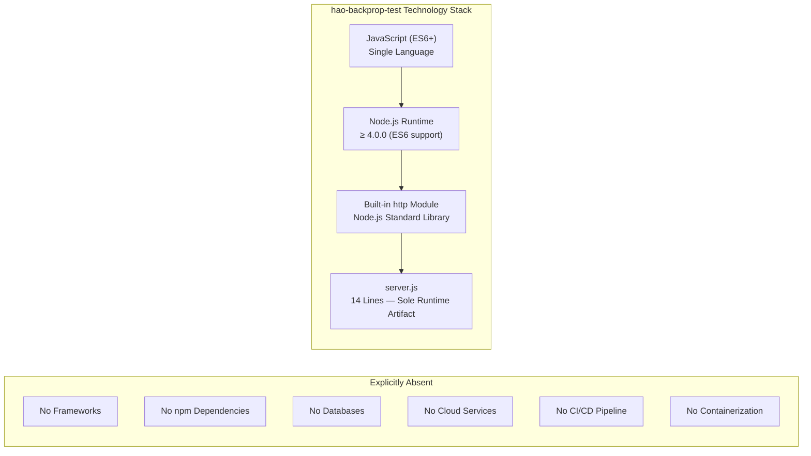

## 3.2 Programming Languages

### 3.2.1 JavaScript (ES6+ / ECMAScript 2015+)

JavaScript is the sole programming language used in the **hao-backprop-test** system. No other languages — including TypeScript, Python, HTML, CSS, or shell scripts — are present anywhere in the repository. The selection of JavaScript is intrinsically tied to the choice of Node.js as the runtime environment, as documented in Section 1.2.2 ("Runtime: Node.js with CommonJS module system").

| Attribute | Detail |
|---|---|
| **Language** | JavaScript |
| **Standard** | ECMAScript 2015 (ES6) or later |
| **Module System** | CommonJS (`require()` syntax) — not ES Modules (`import`) |
| **Source Files** | `server.js` (14 lines) — the sole code file |
| **Other Languages** | None present in the repository |

#### ES6+ Features Utilized

The source code in `server.js` uses the following ES6+ language features, all of which determine the minimum runtime compatibility:

| ES6 Feature | Usage in `server.js` | Lines |
|---|---|---|
| **`const` declarations** | `const http`, `const hostname`, `const port`, `const server` | 1, 3, 4, 6 |
| **Arrow functions** | `http.createServer((req, res) => { ... })`, `server.listen(..., () => { ... })` | 6, 12 |
| **Template literals** | `` `Server running at http://${hostname}:${port}/` `` | 13 |

These features establish the minimum compatible Node.js version at **4.0.0**, as arrow functions and template literals gained stable support in that release. Notably, `const` was also fully supported starting in Node.js 4.0.0 without requiring harmony flags.

#### Selection Justification

| Criterion | Rationale |
|---|---|
| **Runtime alignment** | JavaScript is the native language of the Node.js runtime, eliminating any transpilation or compilation step (Section 2.4.5) |
| **Zero tooling overhead** | No TypeScript compiler, Babel transpiler, or build pipeline is required — the source executes directly |
| **Broad compatibility** | ES6 features used have been stable across all maintained Node.js versions for over a decade |
| **Simplicity** | A single-language stack minimizes cognitive load and aligns with the project's test-fixture purpose (Section 1.1.2) |

### 3.2.2 Runtime Environment: Node.js

Node.js serves as the sole runtime environment for executing the JavaScript source code. As documented in Section 1.3.1, the system requires "Node.js (any version supporting the `http` built-in module)," and Assumption A-001 (Section 2.6.1) states that "Node.js runtime is pre-installed on the host machine."

| Attribute | Detail |
|---|---|
| **Runtime** | Node.js |
| **Minimum Version** | 4.0.0 (for ES6 `const`, arrow functions, and template literals) |
| **Recommended Version** | Current LTS release (Node.js 24.x LTS "Krypton" or 22.x LTS "Jod" as of March 2026) |
| **Version Constraint in Repo** | None specified — no `package.json`, `.nvmrc`, `.node-version`, or `engines` field exists |
| **Execution Command** | `node server.js` |
| **V8 Engine** | Bundled with Node.js (version varies by Node.js release) |

#### Version Compatibility Analysis

The system's compatibility range is unusually broad because it relies exclusively on long-stable APIs:

| API / Feature | Available Since | Status |
|---|---|---|
| `http` built-in module | Node.js 0.1.x | Stable since initial release |
| `http.createServer()` | Node.js 0.1.x | Stable core API |
| `res.statusCode` | Node.js 0.1.x | Stable core API |
| `res.setHeader()` | Node.js 0.1.x | Stable core API |
| `res.end()` | Node.js 0.1.x | Stable core API |
| `server.listen()` | Node.js 0.1.x | Stable core API |
| `console.log()` | Node.js 0.1.x | Stable core API |
| `const` keyword | Node.js 4.0.0 | ES6 — stable without flags |
| Arrow functions (`=>`) | Node.js 4.0.0 | ES6 — stable without flags |
| Template literals (`` ` ` ``) | Node.js 4.0.0 | ES6 — stable without flags |

**Effective minimum: Node.js ≥ 4.0.0.** However, for security and maintainability, the recommended approach is to use a currently supported LTS version. As of March 2026, the actively supported Node.js LTS versions are 22.x ("Jod", Maintenance LTS until April 2027) and 24.x ("Krypton", Active LTS until October 2026). Node.js 20.x ("Iron") support ends April 30, 2026.

#### Platform Support

Node.js provides cross-platform compatibility, and because this system uses only built-in modules with no native add-ons, it runs on all Node.js-supported platforms without modification:

| Platform | Support Level |
|---|---|
| **Linux** | Officially supported |
| **macOS** | Officially supported |
| **Windows** | Officially supported (8.1+ / Server 2012+) |
| **SmartOS / IBM AIX** | Tier 2 support |
| **FreeBSD** | Experimental support |

## 3.3 Frameworks & Libraries

### 3.3.1 Framework Assessment

**No external frameworks are used in this system.** This is an explicit, documented architectural decision — not an oversight. Section 1.2.2 of the Technical Specification confirms: "HTTP Layer: Node.js built-in `http` module — no Express, Koa, Fastify, or other framework." Section 2.1.2 (Feature F-001) further reinforces: "No Express, Koa, Fastify, or other framework is used."

| Framework Category | Status | Evidence |
|---|---|---|
| **HTTP Frameworks** (Express, Koa, Fastify, Hapi, Nest) | Not used | Section 1.2.2, Section 2.1.2 |
| **Frontend Frameworks** (React, Vue, Angular) | Not applicable | No frontend exists (Section 1.3.2) |
| **CSS Frameworks** (TailwindCSS, Bootstrap) | Not applicable | No frontend exists |
| **Testing Frameworks** (Jest, Mocha, Vitest) | Not used | Section 2.4.5: "no test files, test scripts, or test frameworks exist" |
| **Logging Frameworks** (Winston, Pino, Bunyan) | Not used | Section 1.3.2: "No structured logging framework" |
| **ORM / Database Frameworks** (Mongoose, Sequelize, Prisma) | Not applicable | No database exists (Section 1.3.2) |

#### Justification for Frameworkless Design

| Factor | Explanation |
|---|---|
| **Scope alignment** | The system serves a single purpose — returning a static HTTP response — which does not require routing, middleware, or request parsing capabilities (Section 1.2.2) |
| **Zero-dependency value** | Eliminating frameworks fulfills the core value proposition of zero external dependencies (Section 1.1.4) |
| **Minimal attack surface** | No third-party code means no exposure to supply chain vulnerabilities or framework-specific CVEs |
| **Instant startup** | No framework initialization overhead — the server binds and becomes available immediately (Section 2.4.2) |
| **No maintenance burden** | Section 2.4.5 confirms: "Dependency updates: None required — zero external dependencies" |

### 3.3.2 Standard Library Usage

The **only** library consumed by the system is the Node.js built-in `http` module, which is part of the Node.js standard library and requires no installation:

| Module | Type | Import Statement | Used APIs | Source Location |
|---|---|---|---|---|
| `http` | Node.js built-in (standard library) | `const http = require('http');` | `http.createServer()` | `server.js`, line 1 |

#### `http` Module API Surface Used

The system's total API consumption from the `http` module is limited to the following methods and properties, as traced in the Requirements Traceability Matrix (Section 2.5):

| API | Purpose | Source Line |
|---|---|---|
| `http.createServer(callback)` | Instantiates the HTTP server with an inline request handler | Line 6 |
| `res.statusCode = 200` | Sets the HTTP response status code | Line 7 |
| `res.setHeader('Content-Type', 'text/plain')` | Sets the response content type header | Line 8 |
| `res.end('Hello, World!\n')` | Sends the response body and terminates the response | Line 9 |
| `server.listen(port, hostname, callback)` | Binds the server to the network interface and port | Line 12 |

This minimal API surface ensures maximum stability and backward compatibility across Node.js versions.

## 3.4 Open Source Dependencies

### 3.4.1 Dependency Inventory

**The system has zero open-source dependencies.** This is verified through multiple independent observations:

| Verification Point | Finding |
|---|---|
| **`package.json`** | Does not exist — confirmed by Constraint C-002 (Section 2.6.2) |
| **`package-lock.json`** | Does not exist (Section 1.3.2) |
| **`yarn.lock`** | Does not exist |
| **`node_modules/`** | Does not exist (Section 1.3.2) |
| **Repository contents** | Exactly two files: `server.js` and `README.md` — no dependency manifests of any kind |
| **`require()` statements** | Single `require('http')` call, referencing a built-in module — not an npm package |

### 3.4.2 Package Management

No package management infrastructure exists. Section 1.3.2 explicitly places "Package Management" in the out-of-scope category: "No `package.json`, no `package-lock.json`, no `node_modules`." Constraint C-002 (Section 2.6.2) states: "The project cannot leverage npm scripts, dependency management, or metadata conventions."

| Package Manager | Status |
|---|---|
| **npm** | Not used — no `package.json` or `package-lock.json` |
| **yarn** | Not used — no `yarn.lock` |
| **pnpm** | Not used — no `pnpm-lock.yaml` |

### 3.4.3 Supply Chain Security Implications

The absence of external dependencies carries significant security advantages:

| Security Aspect | Assessment |
|---|---|
| **Supply chain attacks** | Zero risk — no third-party packages to compromise |
| **Transitive dependency vulnerabilities** | Zero risk — no dependency tree exists |
| **Registry availability** | Not a concern — no packages to download at runtime or install time |
| **License compliance** | Simplified — only the Node.js runtime license (MIT) applies |
| **Audit requirements** | Minimal — no `npm audit` or dependency scanning needed |

## 3.5 Third-Party Services

### 3.5.1 External Service Assessment

**No third-party services are integrated with or consumed by this system.** Section 1.2.1 explicitly states: "There are no outbound API calls, webhook registrations, database connections, or message queue interactions." Section 1.3.2 further confirms each category of third-party services as absent:

| Service Category | Status | Evidence |
|---|---|---|
| **Authentication Services** (Auth0, OAuth providers) | Not applicable | Section 1.3.2: "No auth mechanisms of any kind" |
| **Cloud Platforms** (AWS, GCP, Azure) | Not applicable | No cloud configuration, SDK, or deployment scripts |
| **Monitoring / Observability** (Datadog, New Relic, Prometheus) | Not applicable | Section 1.3.2: "No health checks, metrics, or tracing" |
| **External APIs** | Not applicable | Section 1.3.2: "External API consumption — Not implemented" |
| **Service Discovery / Registration** | Not applicable | Section 1.3.2: "Service discovery / registration — Not implemented" |
| **Load Balancers** | Not applicable | Section 1.3.2: "Load balancing — Not implemented" |
| **Message Queues** (RabbitMQ, Kafka, SQS) | Not applicable | Section 1.3.2: "Message queues / event streams — Not implemented" |
| **CDN / Content Delivery** | Not applicable | Static string response; no assets served |

### 3.5.2 Integration Model

The system operates in a strictly **inbound-only** integration pattern. As described in Section 1.2.1, "the test server passively listens on `127.0.0.1:3000` and responds to any HTTP request it receives." The external "backprop" system acts as an HTTP client connecting to this server — not the other way around.

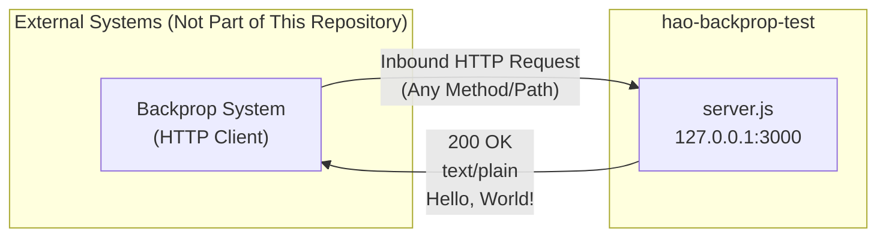

No outbound network connections are initiated by the system under any circumstance.

## 3.6 Databases & Storage

### 3.6.1 Data Persistence Assessment

**No databases, caching layers, or storage services are used by this system.** All data is a static string literal (`'Hello, World!\n'`) hardcoded directly within `server.js` at line 9. Section 1.3.1 defines the data domain as "Static response payload only — no dynamic data, no external data sources."

| Storage Category | Status | Evidence |
|---|---|---|
| **Relational Databases** (PostgreSQL, MySQL, SQLite) | Not applicable | Section 1.3.2: "Database connectivity — Not implemented" |
| **Document Databases** (MongoDB) | Not applicable | No database drivers or connection strings |
| **Key-Value Stores** (Redis, Memcached) | Not applicable | No caching infrastructure |
| **Object Storage** (S3, GCS) | Not applicable | No file storage requirements |
| **In-Memory Caching** | Not applicable | Single static response; caching provides no benefit |
| **File System Storage** | Read-only access to `server.js` for execution; no runtime file I/O |
| **Session Storage** | Not applicable | Section 1.3.2: "No session management" |

### 3.6.2 Data Flow Characteristics

The system's data architecture is stateless and fully deterministic:

| Characteristic | Description |
|---|---|
| **State** | Completely stateless — no request state is retained between invocations |
| **Data Source** | Inline string literal in source code |
| **Data Transformation** | None — response body is a fixed constant |
| **Persistence** | None — no data is written to disk, database, or external store |
| **Volatility** | Response content changes only through source code modification (Section 2.4.5) |

## 3.7 Development & Deployment

### 3.7.1 Development Tools

The development toolchain is minimal to the point of requiring only a text editor and a Node.js installation. No specialized development tools, IDE configurations, or editor integrations are present in the repository.

| Tool Category | Status | Evidence |
|---|---|---|
| **Build System** (Webpack, Vite, esbuild, Rollup) | Not used | Section 2.4.5: "No compilation, transpilation, or bundling" |
| **Linting** (ESLint, Standard) | Not configured | No `.eslintrc`, `.eslintrc.json`, or equivalent config files |
| **Formatting** (Prettier) | Not configured | No `.prettierrc` or equivalent config files |
| **Type Checking** (TypeScript) | Not used | No `.tsconfig.json`; pure JavaScript only |
| **Testing** (Jest, Mocha, Vitest) | Not present | Section 2.4.5: "No test files, test scripts, or test frameworks exist" |
| **Version Management** (nvm, volta) | Not configured | No `.nvmrc`, `.node-version`, or `.volta` configuration |
| **Editor Configuration** | Not present | No `.editorconfig` file |

#### Minimal Development Workflow

The complete development workflow requires only two tools:

1. **Text editor** — Any editor capable of modifying `server.js`
2. **Node.js runtime** — Installed on the developer's machine

No `npm install`, no build commands, and no environment setup steps are required (Section 1.1.4).

### 3.7.2 Build System

**No build system exists.** Section 2.4.5 confirms: "Build process: None — no compilation, transpilation, or bundling." The source code in `server.js` is executed directly by the Node.js interpreter without any intermediate processing step:

| Build Aspect | Status |
|---|---|
| **Compilation** | Not required — JavaScript is interpreted |
| **Transpilation** | Not required — ES6 features are natively supported |
| **Bundling** | Not required — single source file |
| **Minification** | Not required — not a production-deployed asset |
| **Asset Pipeline** | Not applicable — no static assets |

### 3.7.3 Execution Model

The system follows a direct script execution model, as documented in Section 1.2.2:

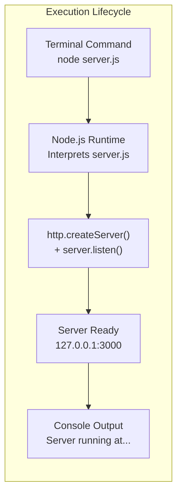

| Execution Attribute | Detail |
|---|---|
| **Start command** | `node server.js` |
| **Startup time** | Sub-second (Section 2.4.2) |
| **Process model** | Single Node.js process, single-threaded event loop (Section 2.4.1) |
| **Shutdown** | External termination required (`Ctrl+C` or `kill`) — no graceful shutdown handler (Section 2.4.1) |
| **Module exports** | None — `server.js` does not export any objects (Constraint in Section 2.4.1) |

### 3.7.4 Containerization

**No containerization infrastructure exists.** Section 1.3.2 confirms: "Containerization — Not present — no Docker or container-related files." No `Dockerfile`, `docker-compose.yml`, `.dockerignore`, or container orchestration manifests (Kubernetes YAML, Helm charts) are present in the repository.

### 3.7.5 CI/CD Pipeline

**No CI/CD pipeline is configured.** Section 1.3.2 states: "Production deployment infrastructure — Not present — no Dockerfile, CI/CD, or deployment scripts." The following CI/CD configurations are confirmed absent:

| CI/CD Platform | Configuration File | Status |
|---|---|---|
| GitHub Actions | `.github/workflows/*.yml` | Not present |
| GitLab CI | `.gitlab-ci.yml` | Not present |
| Jenkins | `Jenkinsfile` | Not present |
| Travis CI | `.travis.yml` | Not present |
| CircleCI | `.circleci/config.yml` | Not present |
| Make | `Makefile` | Not present |

### 3.7.6 Infrastructure as Code

**No Infrastructure as Code (IaC) tooling is present.** No Terraform, CloudFormation, Pulumi, or Ansible configurations exist. All infrastructure configuration is limited to two hardcoded constants in `server.js`:

| Configuration | Value | Location |
|---|---|---|
| **Hostname** | `127.0.0.1` | `server.js`, line 3 |
| **Port** | `3000` | `server.js`, line 4 |

Section 2.4.1 notes: "Hardcoded configuration — Hostname and port values are constants in source code — no environment variables or config files exist." Any configuration change requires direct source code modification (Section 2.4.5).

## 3.8 Security Posture

### 3.8.1 Security Architecture

The system's security profile is defined primarily by what it excludes. As documented in Section 2.4.4, network isolation via loopback binding is the sole implemented security measure:

| Security Layer | Status | Detail |
|---|---|---|
| **Network isolation** | ✅ Implemented | `127.0.0.1` binding restricts access to localhost only (Section 2.4.4) |
| **Transport encryption (HTTPS/TLS)** | ❌ Not implemented | HTTP plaintext only (Section 1.3.2) |
| **Authentication** | ❌ Not implemented | No auth mechanisms of any kind (Section 1.3.2) |
| **Authorization** | ❌ Not implemented | All requests receive identical treatment (Section 2.4.4) |
| **Input validation** | ❌ Not applicable | Request content is never read or parsed (Section 2.4.4) |
| **Rate limiting** | ❌ Not implemented | No connection throttling or request limits (Section 2.4.4) |
| **CORS** | ❌ Not implemented | No cross-origin headers are set (Section 2.4.4) |
| **Dependency vulnerabilities** | ✅ Zero risk | No external dependencies exist |

### 3.8.2 Security Implications of Technology Choices

| Technology Choice | Security Impact |
|---|---|
| **Zero dependencies** | Eliminates supply chain attack vectors entirely |
| **Loopback binding (`127.0.0.1`)** | Prevents remote access from other machines on the network |
| **No input parsing** | Eliminates injection attack vectors (SQL injection, command injection, XSS) — the system never reads request bodies, headers, or parameters |
| **Plaintext HTTP** | Acceptable for localhost-only testing; would be a vulnerability if exposed to a network |
| **Single static response** | No information leakage risk — response content is public and deterministic |

## 3.9 Technology Stack Summary

### 3.9.1 Complete Stack Matrix

The following matrix provides a consolidated view of every technology component in the system:

| Layer | Technology | Version | Type | Source |
|---|---|---|---|---|
| **Language** | JavaScript (ES6+) | ECMAScript 2015+ | Core | `server.js` |
| **Runtime** | Node.js | ≥ 4.0.0 (recommended: current LTS) | Core | Section 2.6.1 (A-001) |
| **Standard Library** | `http` module | Bundled with Node.js | Built-in | `server.js`, line 1 |
| **Frameworks** | None | — | — | Section 1.2.2 |
| **npm Packages** | None | — | — | Section 2.6.2 (C-002) |
| **Databases** | None | — | — | Section 1.3.2 |
| **Cloud Services** | None | — | — | Section 1.3.2 |
| **CI/CD** | None | — | — | Section 1.3.2 |
| **Containers** | None | — | — | Section 1.3.2 |
| **IaC** | None | — | — | Section 1.3.2 |

### 3.9.2 Stack Comparison: Implemented vs. Default Template

For transparency, the following table maps the default technology stack template against the actual system implementation, with justification for each deviation:

| Default Template Item | Implemented? | Justification |
|---|---|---|
| **AWS** (Cloud Platform) | No | System runs on localhost only; no cloud deployment (Section 1.3.2) |
| **Docker** (Containerization) | No | Single-command execution model; containerization adds no value for a loopback test fixture |
| **Terraform** (IaC) | No | No infrastructure to manage; two hardcoded constants suffice (Section 2.4.1) |
| **GitHub Actions** (CI/CD) | No | No test suite, build process, or deployment target exists (Section 2.4.5) |
| **Python / Flask** (Backend) | No | Node.js + built-in `http` module satisfies all requirements with zero dependencies |
| **Auth0** (Authentication) | No | No authentication required; system accepts all requests identically (Section 1.3.2) |
| **MongoDB** (Database) | No | No data persistence; response is a static string literal (Section 1.3.1) |
| **Langchain** (AI Framework) | No | No AI/ML processing; system is a deterministic HTTP echo fixture |
| **React / TypeScript** (Frontend) | No | No frontend; server returns plaintext only (Section 1.3.2) |
| **TailwindCSS** (CSS Framework) | No | No UI or HTML content exists |
| **React Native** (Mobile) | No | No mobile application component |
| **Swift / Kotlin** (Native Mobile) | No | No native mobile application component |
| **Objective-C / ElectronJS** (Desktop) | No | No desktop application component |

### 3.9.3 Architecture Decision Record: Zero-Dependency Strategy

The technology stack decisions for this system are governed by a single overarching architectural principle: **zero-dependency minimalism**. This principle, documented across Sections 1.1.4, 1.2.2, and 2.4.5, dictates that:

1. **Only built-in Node.js APIs are permitted** — eliminating install steps, version conflicts, and supply chain risks
2. **No build toolchain is required** — the source file is the deployable artifact
3. **No configuration infrastructure exists** — reducing operational complexity to a single command (`node server.js`)
4. **The system is scoped exclusively as a local test fixture** — production-grade concerns (scalability, monitoring, security hardening) are intentionally deferred (Section 1.3.2)

This strategy is justified by the system's purpose: providing a deterministic, instantly available HTTP endpoint for validating backprop integration on a local machine (Section 1.1.2).

## 3.10 References

#### Files Examined

- `server.js` — Sole runtime artifact (14 lines); source of all technology stack evidence including language features, module imports, and API usage
- `README.md` — Project identity and purpose declaration (2 lines)

#### Technical Specification Sections Referenced

- `Section 1.1 Executive Summary` — Project overview, value proposition, zero-dependency architecture
- `Section 1.2 System Overview` — Technical approach, component architecture, execution model, core technical strategy
- `Section 1.3 Scope` — In-scope features, comprehensive out-of-scope exclusion list (frameworks, databases, CI/CD, containerization, cloud services)
- `Section 2.1 Feature Catalog` — Feature definitions confirming built-in `http` module as sole dependency
- `Section 2.4 Implementation Considerations` — Technical constraints, performance characteristics, security implications, maintenance requirements
- `Section 2.5 Requirements Traceability Matrix` — Line-by-line code-to-requirement mapping
- `Section 2.6 Assumptions and Constraints` — Node.js runtime assumption (A-001), no `package.json` constraint (C-002)

#### External Sources

- Node.js Official Releases (https://nodejs.org/en/about/previous-releases) — LTS version schedule and support policy
- Node.js Release Working Group (https://github.com/nodejs/Release) — Active LTS and Maintenance LTS status for versions 20.x, 22.x, and 24.x
- endoflife.date/nodejs (https://endoflife.date/nodejs) — Node.js end-of-life tracking
- SitePoint ES6 Template Literals (https://www.sitepoint.com/es6-template-literals-techniques-and-tools/) — Template literal support confirmation (Node.js 4.0.0+)
- Node.js Wikipedia (https://en.wikipedia.org/wiki/Node.js) — Platform support matrix and runtime architecture overview

# 4. Process Flowchart

This section defines the complete set of process flows, state transitions, error handling paths, and integration workflows for the **hao-backprop-test** system. All flowcharts and diagrams are derived exclusively from the 14-line `server.js` source file — the sole runtime artifact in the repository — and cross-referenced against the Technical Specification Sections 1.1 through 3.10.

> **Scope Note:** The hao-backprop-test system is a deliberately minimal, single-purpose HTTP test server. The process flows documented here reflect this intentional simplicity. As confirmed in Section 1.1.2, the system exists to provide a zero-dependency, deterministic HTTP endpoint for validating integration with an external "backprop" system. No artificial complexity has been introduced into these diagrams; they faithfully represent the actual system behavior as implemented.

---

## 4.1 High-Level System Workflow

### 4.1.1 End-to-End Process Overview

The high-level system workflow captures the complete lifecycle of the hao-backprop-test server, from initial user invocation through integration testing to process termination. As documented in Section 1.3.1, the expected usage follows a single, linear sequence with one critical decision point: TCP port availability at startup.

The entire workflow operates within a single local machine (loopback interface only, per Section 2.4.4) and involves three actors: the integration engineer, the server process, and the external backprop client.

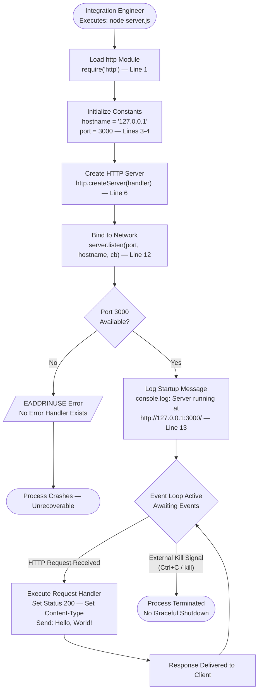

**Workflow Characteristics:**

- **Synchronous Initialization:** The sequence from module loading through server creation executes synchronously (Section 2.2.1 — server instantiation completes synchronously).
- **Single Decision Point:** Port 3000 availability is the only branching condition in the entire system lifecycle, and this check is performed by the operating system's network stack, not by application-level code.
- **Event-Driven Runtime:** After startup, the server enters the Node.js event loop, passively awaiting inbound HTTP connections or external termination signals.
- **Deterministic Responses:** Every HTTP request produces a 100% identical response — `200 OK` with `Content-Type: text/plain` and body `Hello, World!\n` (Section 1.2.3, Section 2.2.2 — F-002-RQ-004).

### 4.1.2 Actor and System Boundary Identification

All process flows in this system involve exactly three actors operating within a single machine boundary. As confirmed in Section 2.3.2, the system exposes a single inbound-only integration point on the loopback interface, and no outbound connections of any kind exist.

| Actor | Role | Boundary | Touchpoints |
|---|---|---|---|
| **Integration Engineer** | Initiates and terminates the server process | Local terminal / shell | Executes `node server.js`, observes console output, issues `Ctrl+C` |
| **server.js Process** | Passive HTTP endpoint | Node.js runtime on localhost | Binds to `127.0.0.1:3000`, handles requests, emits startup log |
| **Backprop Client** | External system under integration test | Local process on same machine | Sends HTTP requests, receives `200 OK` responses |

### 4.1.3 Workflow Phase Summary

The system lifecycle is organized into four distinct phases, each with well-defined entry and exit conditions:

| Phase | Duration | Nature | Entry Condition | Exit Condition |
|---|---|---|---|---|
| **Initialization** | Sub-second (Section 2.4.2) | Synchronous | `node server.js` executed | `server.listen()` invoked |
| **Binding** | Milliseconds (OS-level) | Asynchronous | `server.listen()` called | Port bound or error thrown |
| **Listening** | Indefinite (until termination) | Event-driven | Startup log emitted | External kill signal received |
| **Termination** | Immediate | Abrupt (no graceful shutdown) | `SIGINT`/`SIGTERM` received | Process exits |

---

## 4.2 Core Process Flows

### 4.2.1 Server Startup Process

The server startup process is the primary initialization workflow, covering all steps from command execution to the server entering its listening state. This flow maps directly to the four features defined in Section 2.1: F-001 (HTTP Server Creation), F-003 (Loopback Network Binding), and F-004 (Startup Logging), with F-002 (Static Response Handler) registered during F-001 but not invoked until runtime.

Three potential failure modes exist during startup — all result in process termination with no recovery path, as the system implements no error handling of any kind (Section 2.4.1).

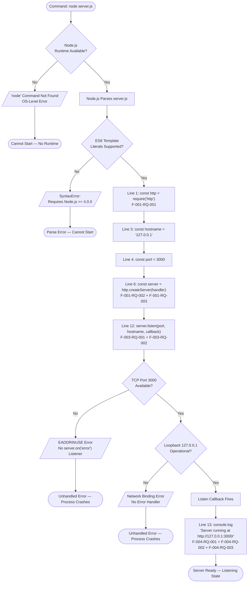

#### Step-by-Step Process Description

1. **Command Execution:** The integration engineer executes `node server.js` from a terminal. This requires Node.js to be pre-installed (Assumption A-001 from Section 2.6.1).
2. **Script Parsing:** Node.js parses the source file. The ES6 template literal on line 13 requires Node.js version 4.0.0 or higher (Section 3.1).
3. **Module Loading (Line 1):** The built-in `http` module is loaded via CommonJS `require('http')` — no external packages are involved (Section 2.2.1 — F-001-RQ-001).
4. **Constant Initialization (Lines 3–4):** `hostname` and `port` are set to hardcoded values. No environment variable support or configuration file exists (Constraint C-001 from Section 2.6.2).
5. **Server Creation (Line 6):** `http.createServer()` is called with an inline request handler callback, returning an `http.Server` object assigned to `const server` (Section 2.2.1 — F-001-RQ-002, F-001-RQ-003).
6. **Network Binding (Line 12):** `server.listen(port, hostname, callback)` initiates an asynchronous TCP bind operation. The OS network stack validates port availability and loopback interface accessibility.
7. **Startup Logging (Line 13):** Upon successful binding, the listen callback fires and `console.log()` emits the startup confirmation message (Section 2.2.4 — F-004-RQ-001 through F-004-RQ-003). This is the sole runtime feedback mechanism in the entire system.

### 4.2.2 HTTP Request-Response Cycle

The HTTP request-response cycle is the core runtime process, executed once per inbound HTTP request. As defined in Section 2.2.2, the handler produces identical responses regardless of HTTP method, URL path, query parameters, or request headers (F-002-RQ-004). The `req` (IncomingMessage) object is received by the callback but is never read, parsed, or inspected.

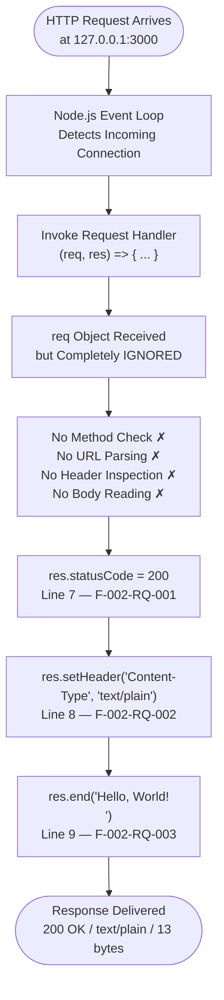

#### Request Processing Characteristics

| Characteristic | Detail | Evidence |
|---|---|---|
| **Route Handling** | Route-agnostic — no URL matching | F-002-RQ-004 (Section 2.2.2) |
| **Method Handling** | Method-agnostic — GET, POST, DELETE all identical | F-002-RQ-001 acceptance criteria |
| **Middleware Pipeline** | None — single inline callback function | Section 1.2.2, Section 1.3.2 |
| **Request Parsing** | None — `req` object never accessed | Section 2.2.2 input parameters |
| **Response Construction** | Three synchronous steps: status, header, body | `server.js` lines 7–9 |
| **Error Handling** | None within handler — no try/catch | Section 2.4.1 |
| **Performance** | Near-instantaneous — synchronous handler with no I/O operations | Section 2.4.2 |
| **Determinism** | 100% identical responses across all requests | Section 1.2.3 |

#### What the Handler Does NOT Do

As confirmed in Section 1.3.2, the following capabilities are explicitly absent from request processing:

- No URL path matching or parameterized route definitions
- No HTTP method distinction or method-based dispatch
- No request body parsing (JSON, form-data, or raw)
- No query string extraction or processing
- No header inspection or content negotiation
- No authentication or authorization checks
- No input validation or sanitization
- No response caching or conditional responses
- No error responses (no 4xx or 5xx status codes are ever returned)

### 4.2.3 Server Shutdown Process

The server shutdown process is strictly external — no graceful shutdown mechanism is implemented. As documented in Section 2.4.1, no `SIGTERM` or `SIGINT` handler exists, and the process must be terminated externally (e.g., `Ctrl+C` or `kill`).

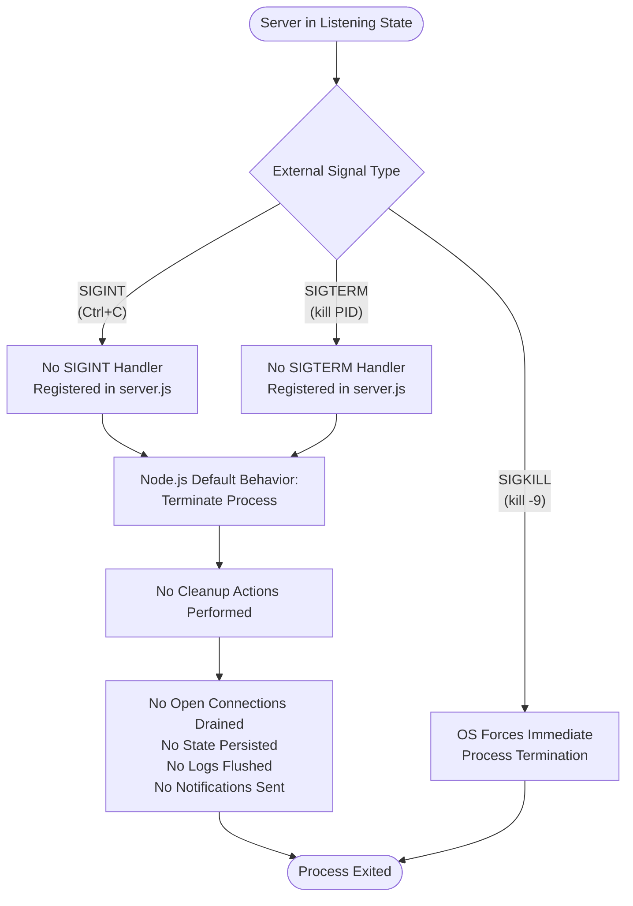

#### Shutdown Characteristics

| Aspect | Behavior | Evidence |
|---|---|---|
| **Graceful Shutdown** | Not implemented | Section 2.4.1 — "No SIGTERM/SIGINT handler" |
| **Connection Draining** | Not implemented | Section 1.3.2 — no middleware pipeline |
| **State Persistence** | Not applicable — no state to persist | Section 2.3.4 — no common services |
| **Exit Logging** | Not implemented — no shutdown log message | Only startup log exists (F-004) |
| **Resource Cleanup** | Not required — no file handles, DB connections, or caches | Section 1.3.2 |

---

## 4.3 State Management

### 4.3.1 Server Lifecycle State Transitions

The server process transitions through six distinct states during its lifecycle. These states are inferred from the execution behavior of `server.js`, as no formal state machine is implemented in the codebase. State transitions are deterministic and unidirectional, with the sole exception of the bidirectional `Listening ↔ Processing` cycle during request handling.

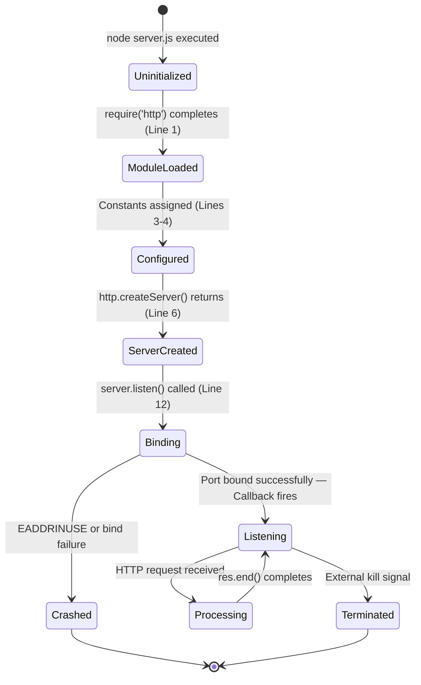

#### State Definitions

| State | Description | Duration | Triggers Exit |
|---|---|---|---|
| **Uninitialized** | Process started, no code executed yet | Microseconds | Automatic — first line executes |
| **ModuleLoaded** | `http` module loaded into memory | Microseconds | Automatic — next line executes |
| **Configured** | `hostname` and `port` constants assigned | Microseconds | Automatic — next line executes |
| **ServerCreated** | `http.Server` instance exists with registered handler | Microseconds | Automatic — `listen()` invoked |
| **Binding** | OS-level TCP port binding in progress | Milliseconds | Port bound successfully or error |
| **Listening** | Server actively accepting HTTP connections | Indefinite | Incoming request or kill signal |
| **Processing** | Request handler executing for a single request | Near-instantaneous | `res.end()` completes |
| **Crashed** | Unhandled error during binding — terminal state | Instantaneous | N/A — process exits |
| **Terminated** | External kill signal received — terminal state | Instantaneous | N/A — process exits |

#### State Transition Rules

- **Forward-only initialization:** States `Uninitialized` through `ServerCreated` are traversed exactly once, in strict sequential order, with no branching or looping. This reflects the synchronous, top-to-bottom execution of `server.js` lines 1 through 6.
- **Asynchronous binding:** The `Binding → Listening` transition is the only asynchronous state change, dependent on OS-level TCP socket allocation.
- **Crash path:** The `Binding → Crashed` transition occurs when port 3000 is occupied or the loopback interface is unavailable. No recovery path exists from the `Crashed` state (Section 2.4.1).
- **Request cycle:** The `Listening ↔ Processing` loop repeats indefinitely for each incoming HTTP request. Given the synchronous nature of the handler, this transition is near-instantaneous (Section 2.4.2).
- **Terminal states:** Both `Crashed` and `Terminated` are final states from which no recovery is possible within the same process instance.

### 4.3.2 Data Persistence and Transaction Boundaries

The hao-backprop-test system maintains **zero persistent state**. This characteristic is fundamental to the system's design as a stateless test fixture.

| Persistence Category | Status | Evidence |
|---|---|---|
| **Database storage** | Not implemented | Section 1.3.2 — database connectivity not implemented |
| **File system writes** | Not implemented | Only `console.log` to stdout; no file I/O |
| **In-memory state** | No mutable state between requests | Response is a static string literal |
| **Session storage** | Not implemented | Section 1.3.2 — no session management |
| **Transaction boundaries** | Not applicable | Each request is fully independent and stateless |

### 4.3.3 Caching Assessment

No caching mechanisms exist at any layer of the system. The server does not set cache-control headers, ETags, or Last-Modified timestamps in its responses. No in-memory cache, Redis integration, or CDN layer is present (Section 1.3.2). Given that the response is a static 13-byte string constructed synchronously on each request, caching would provide no measurable benefit for this system's use case.

---

## 4.4 Error Handling Flows

### 4.4.1 Startup Error Scenarios

The system contains **no application-level error handling**. As explicitly documented in Section 2.4.1: no `try/catch` blocks, no `server.on('error')` listener, and no graceful shutdown handlers exist. All error scenarios result in unrecoverable process termination.

The following flowchart documents the three known startup failure modes and their outcomes:

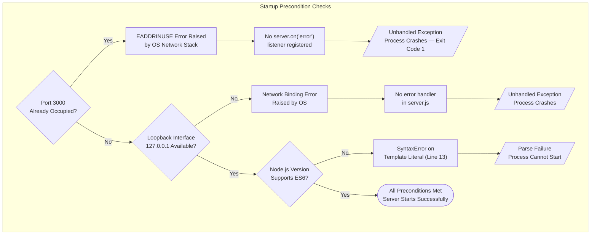

#### Error Scenario Details

| Error Scenario | Trigger | Error Type | Handler Present? | Outcome | Recovery |
|---|---|---|---|---|---|
| **Port Conflict** | Port 3000 occupied by another process | `EADDRINUSE` | No — no `server.on('error')` | Process crashes | Manual: free port, restart |
| **Loopback Unavailable** | `127.0.0.1` interface not operational | Binding error | No — no error listener | Process crashes | Manual: fix network, restart |
| **Syntax Incompatibility** | Node.js < 4.0.0 (no ES6 template literals) | `SyntaxError` | No — parse-time failure | Process cannot start | Manual: upgrade Node.js |

### 4.4.2 Runtime Error Assessment

Once the server enters the `Listening` state, no runtime errors can occur through normal operation. This is a direct consequence of the system's design: the request handler performs no operations that could fail.

| Error Category | Possibility | Rationale |
|---|---|---|
| Request parsing errors | **Impossible** | The `req` object is never read or parsed (Section 2.2.2) |
| Authentication failures | **Impossible** | No authentication mechanism exists (Section 1.3.2) |
| Authorization failures | **Impossible** | No authorization logic exists (Section 2.4.4) |
| Database connection errors | **Impossible** | No database connectivity exists (Section 1.3.2) |
| Timeout errors | **Impossible** | No timeouts are configured (Section 1.3.2) |
| Validation errors | **Impossible** | No input validation is performed (Section 2.4.4) |
| External API failures | **Impossible** | No outbound API calls exist (Section 2.3.2) |
| File I/O errors | **Impossible** | No file operations are performed post-startup |

> **Note:** While Node.js-level events such as operating system resource exhaustion or unexpected socket errors could theoretically affect the process, no application-level handling exists for any such scenarios. The server relies entirely on Node.js default behavior for any unhandled runtime events.

### 4.4.3 Recovery Procedures Assessment

No automated recovery procedures, retry mechanisms, fallback processes, or error notification flows are implemented. As documented across Sections 2.4.1 and 1.3.2, all error handling capabilities are explicitly out of scope.

| Recovery Mechanism | Status | Detail |
|---|---|---|
| **Automatic retries** | Not implemented | No retry logic for port binding or any other operation |
| **Fallback ports** | Not implemented | Port 3000 is hardcoded with no alternative (Constraint C-001) |
| **Health checks** | Not implemented | No endpoint or mechanism for health monitoring (Section 1.3.2) |
| **Process supervisors** | Not included | No PM2, systemd, or Docker restart configuration exists |
| **Error logging** | Not implemented | No structured logging framework (Section 1.3.2) |
| **Alert notifications** | Not implemented | No monitoring or alerting integration |

**Manual Recovery Workflow:** In all error scenarios, the recovery procedure is identical — the integration engineer must manually diagnose the issue (e.g., identify the process occupying port 3000), resolve the root cause, and re-execute `node server.js`.

---

## 4.5 Integration Workflows

### 4.5.1 Backprop Integration Sequence

The following sequence diagram documents the complete end-to-end interaction between all system actors, from server launch through integration testing to shutdown. This represents the primary user workflow defined in Section 1.3.1, expanded with timing and technical detail.

As documented in Section 2.3.2, the system exposes exactly one integration point: an inbound-only HTTP endpoint at `http://127.0.0.1:3000/` over plaintext HTTP. The backprop client is the sole expected consumer.

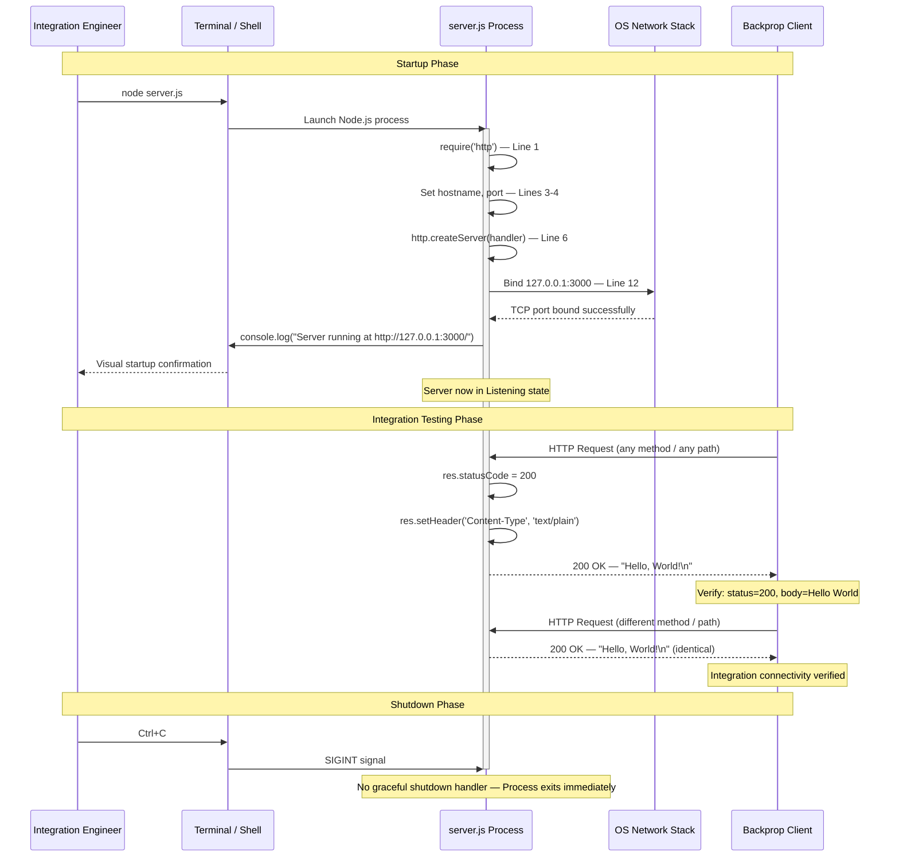

#### Integration Point Specification

| Attribute | Value | Evidence |
|---|---|---|
| **Direction** | Inbound only | Section 2.3.2 |
| **Protocol** | HTTP (plaintext) | Section 1.3.1 |
| **Endpoint** | `http://127.0.0.1:3000/` | `server.js` lines 3–4, 12 |
| **Network Scope** | Loopback only (localhost) | F-003-RQ-003 (Section 2.2.3) |
| **Expected Client** | External backprop system | Section 1.2.1 |
| **Response Contract** | `200 OK`, `text/plain`, `Hello, World!\n` | F-002-RQ-001 through F-002-RQ-003 |
| **Outbound Calls** | None | Section 2.3.2 — no outbound connections |

### 4.5.2 Feature Dependency Execution Flow

The four system features (Section 2.1) execute across distinct lifecycle phases. The following diagram extends the dependency map from Section 2.3.1 by showing the temporal execution order and the phase boundaries within which each feature operates.

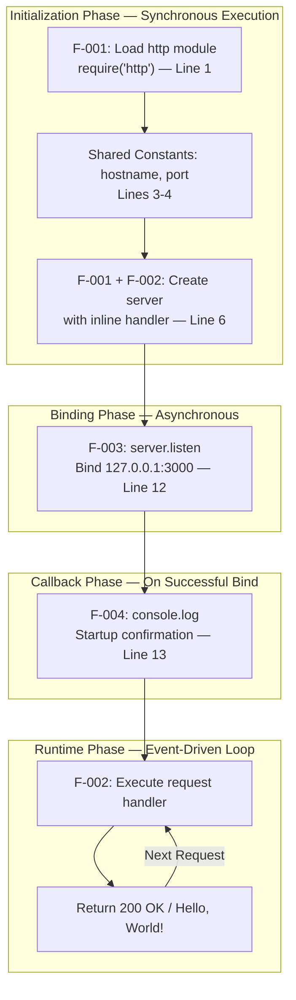

#### Shared Component Consumption by Phase

As documented in Section 2.3.3, the four features share a minimal set of components:

| Shared Component | Defined At | Consumed By | Phase |
|---|---|---|---|
| `http` module | Line 1 | F-001, F-002 | Initialization |
| `server` constant | Line 6 | F-002 (handler), F-003 (listen) | Initialization, Binding |
| `hostname` constant | Line 3 | F-003, F-004 | Binding, Callback |
| `port` constant | Line 4 | F-003, F-004 | Binding, Callback |

### 4.5.3 Integration Verification Workflow

The complete integration verification workflow, as inferred from Section 1.3.1 and Section 1.1.2, follows a strict linear sequence. No branching, retry logic, or conditional verification steps exist.

| Step | Actor | Action | Success Criterion |
|---|---|---|---|
| 1 | Engineer | Verify Node.js is installed | `node --version` returns valid version |
| 2 | Engineer | Verify port 3000 is available | No process listening on port 3000 |
| 3 | Engineer | Execute `node server.js` | No error output |
| 4 | Engineer | Observe console output | Message: `Server running at http://127.0.0.1:3000/` |
| 5 | Backprop Client | Send HTTP request to `127.0.0.1:3000` | Request completes without connection error |
| 6 | Backprop Client | Validate response status code | `200` |
| 7 | Backprop Client | Validate response body | `Hello, World!\n` (exact match, 13 bytes) |
| 8 | Engineer | Confirm integration success | All criteria met |
| 9 | Engineer | Terminate server (`Ctrl+C`) | Process exits |

---

## 4.6 Validation and Decision Points

### 4.6.1 System Decision Points Summary

The hao-backprop-test system contains a minimal number of decision points, consistent with its role as a deterministic test fixture. The following table catalogs every decision point in the system, whether implemented in application code or delegated to the runtime or operating system.

| Decision Point | Location | Decision Maker | Outcomes | In Application Code? |
|---|---|---|---|---|
| Port 3000 availability | `server.listen()` — Line 12 | Operating System | Available → Bind succeeds; Occupied → `EADDRINUSE` | No — OS-level |
| Loopback interface availability | `server.listen()` — Line 12 | Operating System | Available → Bind succeeds; Unavailable → Error | No — OS-level |
| ES6 syntax support | Script parsing | Node.js runtime | Supported → Parse succeeds; Unsupported → `SyntaxError` | No — runtime-level |
| Incoming connection routing | Event loop | Node.js `http` module | All connections → Same handler | No — framework default |

> **Critical Observation:** There are **zero application-level decision points** in `server.js`. The code contains no `if` statements, no `switch` statements, no ternary operators, and no conditional logic of any kind. Every request follows the identical code path through lines 7–9.

### 4.6.2 Validation Rules by Phase

As documented in the validation rules for each feature (Sections 2.2.1 through 2.2.4), the system enforces minimal validation — and all of it is structural rather than data-driven.

| Phase | Validation Rule | Type | Enforced By |
|---|---|---|---|
| **Startup** | `http` module must be loadable | Runtime prerequisite | Node.js `require()` |
| **Startup** | Source file must be valid JavaScript | Syntax validation | Node.js parser |
| **Binding** | Port 3000 must be unoccupied | Resource availability | OS network stack |
| **Binding** | Loopback interface must be operational | Network availability | OS network stack |
| **Binding** | Binding must complete before requests are processed | Ordering rule | `server.listen()` callback pattern |
| **Runtime** | Response must be deterministic | Business rule | Hardcoded values in handler |

### 4.6.3 Authorization and Compliance Checkpoints

No authorization checkpoints, regulatory compliance checks, or security validation gates exist anywhere in the system's process flows. As confirmed in Section 3.8.1:

- **Authentication:** Not implemented — no auth mechanisms of any kind exist.
- **Authorization:** Not implemented — all requests receive identical treatment regardless of origin, headers, or credentials.
- **Input Validation:** Not applicable — request content is never read or parsed, eliminating injection attack vectors entirely.
- **Compliance:** No regulatory requirements apply — the system is a local test fixture not designed for production use (Section 1.3.2).
- **CORS:** No cross-origin headers are set (Section 2.4.4).

The loopback-only binding (`127.0.0.1`) documented in Section 3.8.1 serves as the sole security boundary, preventing access from external network interfaces at the OS level.

---

## 4.7 Timing and Performance Considerations

### 4.7.1 Inferred Timing Characteristics

No formal SLAs, KPIs, or performance benchmarks are defined within the repository (Section 1.2.3 notes: "No formal success criteria, SLAs, or KPIs are defined"). The following timing characteristics are inferred from the system's design and the performance criteria documented in Section 2.4.2.

| Metric | Expected Value | Rationale | Evidence |
|---|---|---|---|
| **Startup time** | Sub-second | Single `require()` and `listen()` call; no dependency loading | Section 2.4.2 |
| **Time to first response** | Near-instantaneous after bind | Synchronous handler with no I/O | Section 2.4.2 |
| **Per-request latency** | Sub-millisecond (handler only) | Three synchronous property/method calls on `res` | Section 2.2.2 technical specifications |
| **Response consistency** | 100% identical | Static string, no conditional logic | Section 1.2.3 |
| **Shutdown time** | Immediate | No cleanup, no connection draining | Section 2.4.1 |

### 4.7.2 Concurrency Model

The server operates on Node.js's single-threaded event loop model (Section 2.4.1 — Constraint: "Single-threaded execution"). No clustering, worker threads, or connection pooling mechanisms are implemented. As stated in Section 2.4.3, horizontal scaling is not supported and vertical scaling is not applicable given the handler performs no computation or I/O that would benefit from additional resources. Connection concurrency is limited by Node.js default `http.Server` settings, with no explicit `maxConnections` configured.

### 4.7.3 SLA Assessment

No Service Level Agreements are defined or applicable for this system. As a local test fixture (Section 1.1.2), the server's availability is entirely dependent on manual human action to start and stop. The system is not designed for production traffic, multi-user concurrent testing, or continuous availability (Section 1.3.2).

---

## 4.8 References

#### Source Files Examined

- `server.js` — The sole runtime artifact (14 lines). Provided complete implementation details for all process flows, including server creation (line 1, 6), request handling (lines 7–9), network binding (lines 3–4, 12), and startup logging (line 13).
- `README.md` — Project identity file (2 lines). Confirmed project name ("hao-backprop-test") and purpose ("test project for backprop integration").

#### Technical Specification Sections Referenced

- `Section 1.1` — Executive Summary: project overview, business problem, stakeholders, value proposition
- `Section 1.2` — System Overview: system context, high-level description, success criteria
- `Section 1.3` — Scope: in-scope features, primary user workflow, out-of-scope exclusions, implementation boundaries
- `Section 2.1` — Feature Catalog: feature definitions F-001 through F-004
- `Section 2.2` — Functional Requirements: detailed requirements with acceptance criteria for all features
- `Section 2.3` — Feature Relationships: dependency map, integration points, shared components
- `Section 2.4` — Implementation Considerations: technical constraints, performance requirements, scalability, security
- `Section 2.5` — Requirements Traceability Matrix: requirement-to-source-code mapping
- `Section 2.6` — Assumptions and Constraints: runtime assumptions (A-001 through A-004), configuration constraints (C-001 through C-004)
- `Section 3.1` — Technology Stack Overview: Node.js and built-in http module confirmation
- `Section 3.8` — Security Posture: security architecture, loopback-only binding as sole security measure

# 5. System Architecture

## 5.1 High-Level Architecture

### 5.1.1 System Overview

#### Architecture Style and Rationale

The hao-backprop-test system follows a **zero-dependency monolithic single-process server** architecture. The entire system consists of a single 14-line JavaScript file (`server.js`) that leverages exclusively the Node.js built-in `http` module to create, configure, and run an HTTP server. No frameworks, external packages, build toolchains, or configuration management infrastructure exist.

This architecture style is governed by the overarching principle of **zero-dependency minimalism**, which dictates four foundational rules:

1. **Only built-in Node.js APIs are permitted** — eliminating install steps, version conflicts, and supply chain risks.
2. **No build toolchain is required** — the source file is the deployable artifact.
3. **No configuration infrastructure exists** — reducing operational complexity to a single command (`node server.js`).
4. **The system is scoped exclusively as a local test fixture** — production-grade concerns such as scalability, monitoring, and security hardening are intentionally deferred.

This strategy is justified by the system's sole purpose: providing a deterministic, instantly available HTTP endpoint for validating backprop integration on a local development machine. The repository is explicitly described as a "test project for backprop integration" (`README.md`) and serves as a controlled, stable HTTP endpoint against which external systems can validate their HTTP client implementations and connectivity logic.

#### Key Architectural Principles

| Principle | Description |
|---|---|
| **Route-Agnostic Processing** | The request handler does not inspect HTTP method, URL path, query parameters, or headers — every request receives an identical response |
| **Stateless Design** | No mutable state exists between requests; the response is a static string literal hardcoded in source code |
| **Loopback Isolation** | The server binds exclusively to `127.0.0.1`, preventing any external network access |
| **Deterministic Behavior** | 100% identical responses for every request under all conditions |

#### System Boundaries and Major Interfaces

The system operates within tightly defined boundaries. A single Node.js process runs on the local machine, accepting inbound HTTP connections on the loopback interface at `127.0.0.1:3000`. The server never initiates outbound connections — there are no outbound API calls, webhook registrations, database connections, or message queue interactions.

- **Network boundary:** Loopback interface only (`127.0.0.1`); no external network exposure
- **Protocol boundary:** HTTP plaintext only; no HTTPS/TLS
- **Process boundary:** Single Node.js process; no child processes, clustering, or worker threads
- **Data boundary:** Static response payload only — no dynamic data, no external data sources

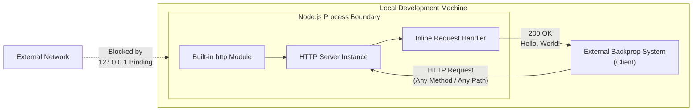

### 5.1.2 Core Components

The system architecture is intentionally minimal. The entire repository consists of exactly two files with no subdirectory structure. The following table enumerates every component in the system, with their responsibilities, dependencies, and integration points.

| Component | Responsibility | Key Dependencies |
|---|---|---|
| **README.md** (2 lines) | States project name ("hao-backprop-test") and purpose ("test project for backprop integration") | None |
| **HTTP Module Loader** (`server.js`, line 1) | Loads Node.js built-in `http` module via CommonJS `require('http')` | Node.js runtime |
| **Configuration Constants** (`server.js`, lines 3–4) | Defines hardcoded `hostname = '127.0.0.1'` and `port = 3000` | None |
| **HTTP Server Instance** (`server.js`, line 6) | Creates server via `http.createServer()` with inline request handler | `http` module |
| **Request Handler** (`server.js`, lines 6–10) | Sets status 200, Content-Type text/plain, body "Hello, World!\n" for every request | Server instance, `res` object |
| **Network Binding + Startup Log** (`server.js`, lines 12–14) | Binds to 127.0.0.1:3000 and logs startup URL to console | `server` constant, `hostname`, `port` |

#### Feature-to-Component Mapping

Each component maps directly to one or more of the system's four features, as defined in the Feature Catalog:

| Feature ID | Feature Name | Source Lines |
|---|---|---|
| F-001 | HTTP Server Creation | Line 1, Line 6 |
| F-002 | Static HTTP Response Serving | Lines 7–9 |
| F-003 | Loopback Network Binding | Lines 3–4, Line 12 |
| F-004 | Startup Logging | Line 13 |

#### Shared Component Consumption

Four components are shared across multiple features, creating a minimal but critical dependency graph:

| Shared Component | Consuming Features |
|---|---|
| `http` built-in module | F-001, F-002 |
| `server` constant | F-002, F-003 |
| `hostname` constant | F-003, F-004 |
| `port` constant | F-003, F-004 |

### 5.1.3 Data Flow

#### Primary Data Flow — Request-Response Cycle

The system's data flow is strictly linear and synchronous. All data movement occurs within a single request-response cycle, with no branching, buffering, or asynchronous processing.

1. An external backprop client sends an HTTP request to `127.0.0.1:3000`.
2. The Node.js event loop detects the incoming connection and dispatches it.
3. The inline request handler callback `(req, res) => { ... }` is invoked.
4. The `req` (IncomingMessage) object is received but **completely ignored** — no parsing, no method check, no URL inspection, no header reading, no body consumption.
5. Three synchronous operations execute in strict sequence on the `res` (ServerResponse) object:
   - Status code assignment (`200`)
   - Header setting (`Content-Type: text/plain`)
   - Body transmission and response finalization (`Hello, World!\n`)
6. The 13-byte response is delivered to the client: `200 OK`, `text/plain`, `Hello, World!\n`.

#### Data Transformation Points

**None.** The response body is a static string literal hardcoded directly in source code. No data is read from external sources, computed dynamically, or transformed in any way. The system's data domain is limited to "static response payload only — no dynamic data, no external data sources."

#### Key Data Stores and Caches

**None.** The system maintains zero persistent state. No databases, file system writes, in-memory caches, session stores, or transaction boundaries exist. Each request is fully independent and stateless. The server does not set cache-control headers, ETags, or Last-Modified timestamps in its responses. Given the static 13-byte response constructed synchronously on each request, caching would provide no measurable benefit.

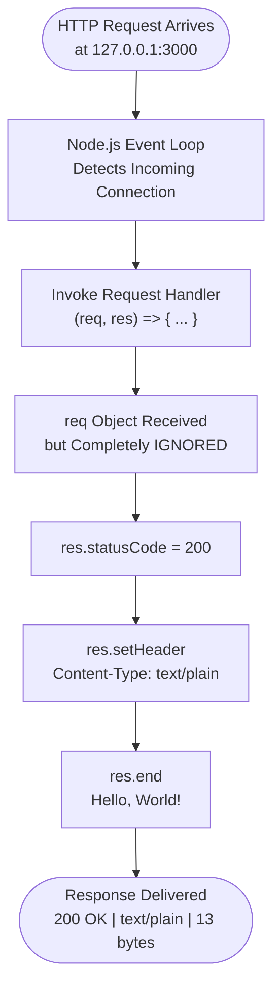

### 5.1.4 External Integration Points

The system exposes exactly one integration point: an inbound-only HTTP endpoint at `http://127.0.0.1:3000/` over plaintext HTTP. The backprop client is the sole expected consumer.

| Attribute | Value |
|---|---|
| **System Name** | External Backprop System (client) |
| **Integration Type** | Inbound HTTP only |
| **Data Exchange Pattern** | Synchronous request-response |
| **Protocol / Format** | HTTP plaintext / text/plain |

#### Integration Contract

| Contract Element | Specification |
|---|---|
| **Endpoint** | `http://127.0.0.1:3000/` (any path, any HTTP method accepted) |
| **Response Status** | `200 OK` |
| **Response Content-Type** | `text/plain` |
| **Response Body** | `Hello, World!\n` (13 bytes, exact) |
| **SLA Requirements** | None defined — local test fixture with manual start/stop |

**Critical constraint:** No outbound connections exist. The integration model is strictly passive — the server listens and responds but never initiates communication with any external system.

---

## 5.2 Component Details

### 5.2.1 HTTP Server Runtime — server.js

#### Purpose and Responsibilities

The `server.js` file is the sole runtime artifact in the entire system. It fulfills four distinct responsibilities that map directly to the four features defined in the Feature Catalog:

- **HTTP Server Creation (F-001):** Loads the built-in `http` module and instantiates an HTTP server with an inline request handler callback.
- **Static HTTP Response Serving (F-002):** Produces an identical `200 OK` / `text/plain` / `Hello, World!\n` response for every inbound HTTP request, regardless of method, path, query, or headers.
- **Loopback Network Binding (F-003):** Binds the server exclusively to the loopback address `127.0.0.1` on TCP port `3000`, preventing external network access.
- **Startup Logging (F-004):** Emits a single `console.log()` message upon successful binding — the sole runtime feedback mechanism in the entire system.

#### Technologies and Frameworks

| Layer | Technology | Notes |
|---|---|---|
| **Language** | JavaScript (ES6+ / ECMAScript 2015+) | Uses `const` declarations, arrow functions, template literals |
| **Runtime** | Node.js (minimum 4.0.0, recommended current LTS) | CommonJS module system (`require()` syntax) |
| **HTTP Layer** | Node.js built-in `http` module | No Express, Koa, Fastify, or any other framework |
| **Frameworks** | None | Explicitly confirmed frameworkless design |

#### Key Interfaces and APIs Used

The server interacts exclusively with Node.js built-in APIs. No third-party or custom interfaces are involved.

| API | Purpose |
|---|---|
| `require('http')` | Loads built-in HTTP module (CommonJS) |
| `http.createServer(callback)` | Instantiates HTTP server with request handler |
| `res.statusCode = 200` | Sets HTTP response status code |
| `res.setHeader(name, value)` | Sets response header (Content-Type) |
| `res.end(data)` | Transmits body and finalizes response |
| `server.listen(port, hostname, callback)` | Binds server to network interface |
| `console.log(message)` | Emits startup confirmation to stdout |

#### Data Persistence Requirements

**None.** The system has zero persistent state — no databases, no file system writes, no in-memory state between requests, no session storage. The response is a static string literal. Each request is fully independent and stateless with no transaction boundaries.

#### Scaling Considerations

| Dimension | Assessment |
|---|---|
| **Horizontal scaling** | Not supported — single process, loopback-only binding |
| **Vertical scaling** | Not applicable — no computation or I/O to benefit from additional resources |
| **Connection concurrency** | Limited by Node.js default `http.Server` settings; no `maxConnections` configured |
| **Thread model** | Single-threaded event loop; no clustering or worker threads |

### 5.2.2 Server Lifecycle States

The server process transitions through nine distinct states during its lifecycle. These states are inferred from the execution behavior of `server.js`, as no formal state machine is implemented in the codebase. State transitions are deterministic and unidirectional, with the sole exception of the bidirectional `Listening ↔ Processing` cycle during request handling.

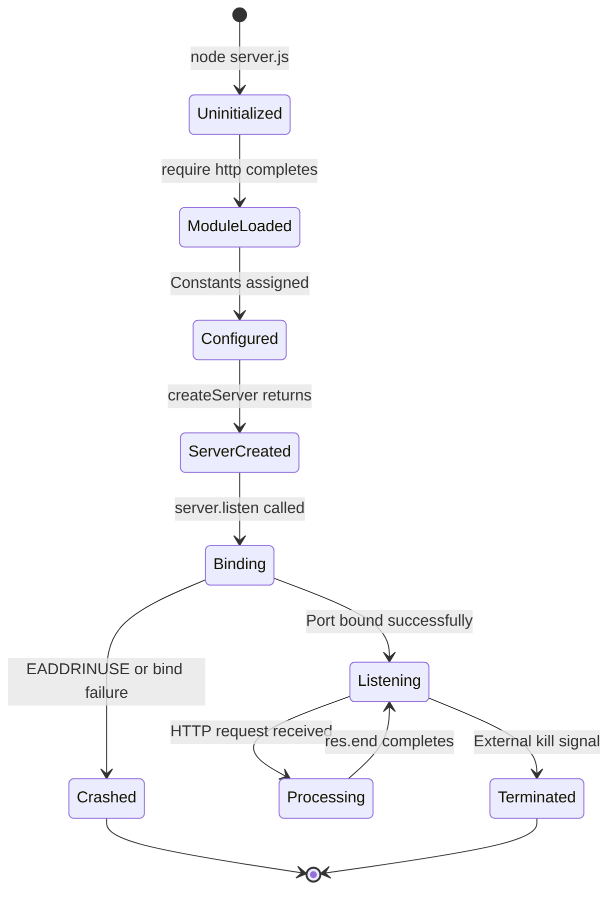

#### State Definitions and Characteristics

| State | Duration | Nature |
|---|---|---|
| **Uninitialized** | Microseconds | Process started, no code executed yet |
| **ModuleLoaded** | Microseconds | `http` module loaded into memory |
| **Configured** | Microseconds | `hostname` and `port` constants assigned |
| **ServerCreated** | Microseconds | `http.Server` instance exists with registered handler |
| **Binding** | Milliseconds | OS-level TCP port binding in progress (asynchronous) |
| **Listening** | Indefinite | Server actively accepting HTTP connections |
| **Processing** | Near-instantaneous | Request handler executing for a single request |
| **Crashed** | Terminal | Unrecoverable error during binding — process exits |
| **Terminated** | Terminal | External kill signal received — process exits |

#### State Transition Rules

- **Forward-only initialization:** States `Uninitialized` through `ServerCreated` are traversed exactly once in strict sequential order with no branching or looping. This reflects the synchronous, top-to-bottom execution of `server.js` lines 1 through 6.
- **Asynchronous binding:** The `Binding → Listening` transition is the only asynchronous state change, dependent on OS-level TCP socket allocation.
- **Crash path:** The `Binding → Crashed` transition occurs when port 3000 is occupied or the loopback interface is unavailable. No recovery path exists from the `Crashed` state.
- **Request cycle:** The `Listening ↔ Processing` loop repeats indefinitely for each incoming HTTP request. Given the synchronous nature of the handler, this transition is near-instantaneous.
- **Terminal states:** Both `Crashed` and `Terminated` are final states from which no recovery is possible within the same process instance.

### 5.2.3 Request-Response Processing

The following sequence diagram documents the complete end-to-end interaction between all system actors, from server launch through integration testing to shutdown. This represents the primary operational workflow of the entire system.

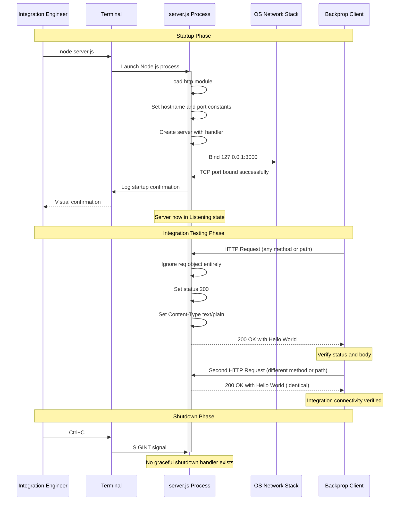

#### Request Processing Characteristics

The handler produces identical responses regardless of HTTP method, URL path, query parameters, or request headers. The `req` (IncomingMessage) object is received by the callback but is never read, parsed, or inspected. As a direct consequence, the following capabilities are explicitly absent from request processing:

- No URL path matching or parameterized route definitions
- No HTTP method distinction or method-based dispatch
- No request body parsing (JSON, form-data, or raw)
- No query string extraction or processing
- No header inspection or content negotiation
- No authentication or authorization checks
- No input validation or sanitization
- No response caching or conditional responses
- No error responses (no 4xx or 5xx status codes are ever returned)

---

## 5.3 Technical Decisions

### 5.3.1 Architecture Style Selection

#### Decision: Zero-Dependency Minimalism

The system adopts a zero-dependency architecture where only built-in Node.js APIs are permitted. The source file itself serves as the deployable artifact — no build toolchain, transpilation, bundling, or compilation step exists.

#### Tradeoff Analysis

| Gained | Sacrificed |
|---|---|
| Zero setup cost — single command execution | No routing capability |
| No supply chain vulnerabilities | No middleware pipeline |
| Instant startup | No structured logging |
| Maximum Node.js version compatibility | No application-level error handling |
| Minimal attack surface | No configuration flexibility |

#### Rationale

The system's sole purpose is to serve as a deterministic local test endpoint for backprop integration verification. A zero-dependency approach eliminates the installation overhead, version conflicts, and security audit burden that would accompany any external packages. Given that the entire functional requirement is "return a static string for any HTTP request," the additional capabilities offered by frameworks like Express or Fastify would provide zero functional benefit while introducing unnecessary complexity.

### 5.3.2 Communication Pattern Selection

#### Decision: Passive Inbound HTTP

The server operates as a passive listener — it accepts inbound HTTP connections and responds, but never initiates outbound connections of any kind. There are no outbound API calls, webhook registrations, database connections, or message queue interactions.

#### Rationale

The integration model is strictly inbound: the server is consumed by the external backprop system, not the reverse. The backprop client is the active agent that discovers and connects to the test endpoint. This passive architecture eliminates the need for connection management, retry logic, circuit breakers, or any form of outbound connectivity infrastructure.

### 5.3.3 Data Storage Selection

#### Decision: No Persistence

No databases, caching layers, file system writes, in-memory stores, or storage services are used.

#### Rationale

The response is a static 13-byte string literal. No dynamic data, session state, user data, or computed results exist in the system. Data persistence would serve no purpose for a stateless test fixture that produces identical output for every request.

### 5.3.4 Configuration Strategy Selection

#### Decision: Hardcoded Constants

Both the hostname (`127.0.0.1`) and port (`3000`) are defined as `const` declarations directly in the source code. No environment variable support, configuration files, CLI arguments, or dynamic configuration mechanisms exist (Constraint C-001).

#### Rationale

For a test fixture with exactly two configuration values, external configuration management infrastructure would add complexity disproportionate to its benefit. Changing the hostname or port requires source code modification — an acceptable tradeoff for a system designed as a local development utility.

### 5.3.5 Security Mechanism Selection

#### Decision: Loopback-Only Binding as Sole Security Measure

The binding to `127.0.0.1` is the only security mechanism implemented. This restricts all access to the local machine.

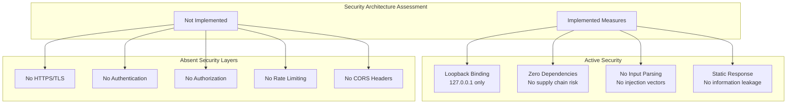

#### Security Justification

| Security Choice | Impact |
|---|---|
| Zero dependencies | Eliminates supply chain attack vectors entirely |
| Loopback binding (`127.0.0.1`) | Prevents remote access from any other machine on the network |
| No input parsing | Eliminates injection attack vectors — the system never reads request bodies, headers, or parameters |
| Plaintext HTTP | Acceptable for localhost-only testing; would be a vulnerability if exposed to a network |
| Single static response | No information leakage risk — response content is public and deterministic |

The absence of HTTPS/TLS, authentication, authorization, rate limiting, and CORS is an intentional architectural decision. For a loopback-only test fixture that accepts all requests identically and returns a static public string, these security layers would add operational complexity without providing meaningful protection.

---

## 5.4 Cross-Cutting Concerns

### 5.4.1 Observability and Logging

#### Current Observability State

The system provides minimal observability through a single mechanism:

| Observability Aspect | Status |
|---|---|
| **Startup logging** | Single `console.log()` message on successful bind: `"Server running at http://127.0.0.1:3000/"` |
| **Per-request logging** | Not implemented |
| **Shutdown logging** | Not implemented |
| **Health checks** | Not implemented — no health endpoint or mechanism |
| **Metrics collection** | Not implemented — no metrics export |
| **Distributed tracing** | Not implemented |
| **Structured logging** | Not implemented — no Winston, Pino, or Bunyan |

The startup log message (Feature F-004) is the sole runtime feedback mechanism in the entire system. It is constructed using a JavaScript template literal that interpolates the `hostname` and `port` constants, fires exactly once in the `server.listen()` success callback, and is emitted only upon successful TCP port binding.

### 5.4.2 Error Handling

#### Error Handling Architecture

The system contains **no application-level error handling**. No `try/catch` blocks exist anywhere in the code. No `server.on('error')` listener is registered. No graceful shutdown handlers (`SIGTERM`/`SIGINT`) are implemented. All error scenarios result in unrecoverable process termination, relying entirely on Node.js default behavior.

#### Startup Error Scenarios

Three known failure modes exist, all occurring exclusively during the startup phase:

| Error Scenario | Trigger | Outcome |
|---|---|---|
| **Port Conflict** | Port 3000 occupied by another process | `EADDRINUSE` — process crashes |
| **Loopback Unavailable** | `127.0.0.1` interface not operational | Binding error — process crashes |
| **Syntax Incompatibility** | Node.js < 4.0.0 (no ES6 support) | `SyntaxError` — process cannot start |

#### Runtime Error Assessment

Once the server enters the `Listening` state, **no runtime errors can occur through normal operation.** This is a direct and verifiable consequence of the system's design:

- The `req` object is never read or parsed — eliminating request parsing errors
- No authentication mechanism exists — eliminating authentication failures
- No authorization logic exists — eliminating authorization failures
- No database connectivity exists — eliminating database connection errors
- No timeouts are configured — eliminating timeout errors
- No input validation is performed — eliminating validation errors
- No outbound API calls exist — eliminating external API failures
- No file operations are performed post-startup — eliminating file I/O errors

```mermaid
flowchart TD
    subgraph ErrorHandlingFlow["Error Handling Assessment"]
        StartupPhase{{"Startup Phase\nErrors Possible?"}}
        StartupPhase -->|Yes| PortCheck{"Port 3000\nOccupied?"}
        PortCheck -->|Yes| EADDRINUSE["EADDRINUSE Error\nNo Handler"]
        PortCheck -->|No| LoopbackCheck{"Loopback\nAvailable?"}
        LoopbackCheck -->|No| BindError["Binding Error\nNo Handler"]
        LoopbackCheck -->|Yes| VersionCheck{"Node.js >= 4.0?"}
        VersionCheck -->|No| SyntaxError["SyntaxError\nParse Failure"]
        VersionCheck -->|Yes| ServerStarts["Server Starts\nSuccessfully"]

        EADDRINUSE --> Crash(["Process Crashes"])
        BindError --> Crash
        SyntaxError --> Crash

        ServerStarts --> RuntimePhase{{"Runtime Phase\nErrors Possible?"}}
        RuntimePhase -->|"No — by design"| SafeOperation["All operations are\nsynchronous static assignments\non response object"]
    end
```

#### Recovery Procedures

No automated recovery procedures, retry mechanisms, fallback processes, or error notification flows are implemented. No process supervisors (PM2, systemd, Docker restart policies) are configured. In all error scenarios, recovery is manual: the integration engineer must diagnose the issue, resolve the root cause, and re-execute `node server.js`.

### 5.4.3 Performance Characteristics

#### Timing Profile

No formal SLAs, KPIs, or performance benchmarks are defined within the repository. The following characteristics are inferred from the system's design.

| Metric | Expected Value |
|---|---|
| **Startup time** | Sub-second — single `require()` and `listen()` call with no dependency loading |
| **Time to first response** | Near-instantaneous after bind completes |
| **Per-request latency** | Sub-millisecond (handler only) — three synchronous property/method calls on `res` |
| **Response consistency** | 100% identical across all requests — static string, no conditional logic |
| **Shutdown time** | Immediate — no cleanup, no connection draining, no state persistence |

#### Concurrency Model

The server operates on Node.js's single-threaded event loop model. No clustering, worker threads, or connection pooling mechanisms are implemented. Connection concurrency is limited by Node.js default `http.Server` settings, with no explicit `maxConnections` configured. Horizontal scaling is not supported due to the loopback-only binding, and vertical scaling is not applicable given the handler performs no computation or I/O that would benefit from additional resources.

#### SLA Assessment

No Service Level Agreements are defined or applicable. As a local test fixture, the server's availability is entirely dependent on manual human action to start and stop. The system is not designed for production traffic, multi-user concurrent testing, or continuous availability.

### 5.4.4 Assumptions and Constraints

#### Operating Assumptions

| ID | Assumption | Impact |
|---|---|---|
| A-001 | Node.js runtime is pre-installed on the host machine | Required for all features (F-001 through F-004) |
| A-002 | TCP port 3000 is available at startup time | Required for F-003; no fallback port logic exists |
| A-003 | The backprop client runs on the same local machine | Required for F-003; loopback binding prevents remote access |
| A-004 | The backprop system communicates via standard HTTP | Required for F-002; no protocol detection or negotiation exists |

#### System Constraints

| ID | Constraint | Rationale |
|---|---|---|
| C-001 | All configuration values are hardcoded | No config files, environment variables, or CLI arguments supported |
| C-002 | No `package.json` exists | Cannot leverage npm scripts, dependency management, or metadata conventions |
| C-003 | Single-commit repository | Fresh starting point with no iterative development history |
| C-004 | No formal success criteria defined | Performance targets and KPIs are inferred, not documented |

#### Confirmed Absent Capabilities

The following capabilities have been verified as absent from the system, representing intentional architectural decisions aligned with the test fixture scope:

- **No routing** — URL path matching, route definitions, or parameterized routes
- **No HTTP method handling** — GET/POST/PUT/DELETE are not distinguished
- **No middleware pipeline** — single inline callback, no chain of handlers
- **No error handling** — no `try/catch`, no error listeners, no graceful shutdown
- **No request parsing** — no body, query string, or header parsing
- **No authentication or authorization** — all requests treated identically
- **No HTTPS/TLS** — plaintext HTTP only
- **No configuration management** — no `.env` files, no config modules
- **No package management** — no `package.json`, no `node_modules`
- **No databases or storage** — zero persistence of any kind
- **No CI/CD pipeline** — no build, test, or deployment automation
- **No containerization** — no Dockerfile or container orchestration
- **No monitoring or health checks** — no observability infrastructure
- **No cloud services or IaC** — no infrastructure provisioning

---

#### References

- `server.js` — Sole runtime artifact; 14-line HTTP server implementing all four system features (F-001 through F-004)
- `README.md` — 2-line project documentation establishing project identity and purpose
- Tech Spec Section 1.1 (Executive Summary) — Project overview, business problem, stakeholders, value proposition
- Tech Spec Section 1.2 (System Overview) — Project context, high-level description, capabilities, success criteria
- Tech Spec Section 1.3 (Scope) — In-scope features, out-of-scope exclusions, system boundaries
- Tech Spec Section 2.1 (Feature Catalog) — Feature definitions F-001 through F-004 with full specifications
- Tech Spec Section 2.3 (Feature Relationships) — Dependency map, integration points, shared components
- Tech Spec Section 2.6 (Assumptions and Constraints) — Operating assumptions A-001 through A-004 and constraints C-001 through C-004
- Tech Spec Section 3.8 (Security Posture) — Security architecture assessment and technology choice implications
- Tech Spec Section 3.9 (Technology Stack Summary) — Complete stack matrix, default template comparison, architecture decision record
- Tech Spec Section 4.2 (Core Process Flows) — Startup, request-response, and shutdown process flows
- Tech Spec Section 4.3 (State Management) — Server lifecycle states, data persistence, caching assessment
- Tech Spec Section 4.4 (Error Handling Flows) — Startup error scenarios, runtime error assessment, recovery procedures
- Tech Spec Section 4.5 (Integration Workflows) — Backprop integration sequence, feature dependency flow, verification workflow
- Tech Spec Section 4.7 (Timing and Performance) — Timing characteristics, concurrency model, SLA assessment

# 6. SYSTEM COMPONENTS DESIGN

## 6.1 Core Services Architecture

### 6.1.1 Applicability Assessment

**Core Services Architecture is not applicable for this system.** The hao-backprop-test repository is a single-purpose, single-process, zero-dependency Node.js HTTP server implemented in a single 14-line JavaScript file (`server.js`). It does not employ microservices, distributed architecture, or distinct service components of any kind. This determination is grounded in a comprehensive analysis of the entire codebase, which consists of exactly two files — `server.js` and `README.md` — with no subdirectory structure, no frameworks, no external packages, and no infrastructure definitions.

The following subsections provide a rigorous, evidence-based justification for this non-applicability determination, organized around each domain that a Core Services Architecture section would typically address.

---

### 6.1.2 Architectural Classification

#### 6.1.2.1 System Architecture Style

The system is classified as a **zero-dependency monolithic single-process server** (Section 5.1). The entire runtime consists of a single JavaScript file (`server.js`) that leverages exclusively the Node.js built-in `http` module. No frameworks, external packages, build toolchains, or configuration management infrastructure exist. The source file itself is the deployable artifact — no build, transpilation, or bundling step is required.

This architecture style is governed by the principle of **zero-dependency minimalism**, which imposes four foundational rules (Section 3.9):

| Rule | Description |
|---|---|
| Built-in APIs only | Only Node.js standard library modules are permitted |
| No build toolchain | The source file is the deployable artifact |
| No configuration infrastructure | Operational complexity is reduced to `node server.js` |
| Local test fixture scope | Production-grade concerns are intentionally deferred |

#### 6.1.2.2 System Purpose and Context

As documented in `README.md`, the repository is a *"test project for backprop integration."* The system provides a single, focused capability: accepting any inbound HTTP request on `127.0.0.1:3000` and responding with `200 OK`, `Content-Type: text/plain`, and the body `Hello, World!\n` (Section 1.2). It serves exclusively as a **test scaffold** — it is not a production application, API gateway, or microservice (Section 1.2).

#### 6.1.2.3 Boundary Definition

The system operates within tightly constrained boundaries that preclude any form of distributed or multi-service architecture (Section 5.1):

| Boundary | Constraint |
|---|---|
| **Network** | Loopback interface only (`127.0.0.1`) — no external network exposure |
| **Protocol** | HTTP plaintext only — no HTTPS/TLS |
| **Process** | Single Node.js process — no child processes, clustering, or worker threads |
| **Data** | Static response payload only — no dynamic data or external data sources |

```mermaid
flowchart TD
    subgraph ArchitecturalProfile["Architectural Classification"]
        direction TB
        Style["Architecture Style:<br/>Zero-Dependency Monolithic<br/>Single-Process Server"]
        Files["Repository Footprint:<br/>2 files, 0 directories"]
        Runtime["Runtime Artifact:<br/>server.js (14 lines)"]
        Deps["External Dependencies:<br/>None"]
        Style --> Files
        Files --> Runtime
        Runtime --> Deps
    end

    subgraph Boundaries["System Boundaries"]
        direction TB
        Net["Network: 127.0.0.1 only"]
        Proto["Protocol: HTTP plaintext"]
        Proc["Process: Single Node.js"]
        Data["Data: Static string literal"]
    end

    ArchitecturalProfile --> Boundaries
```

---

### 6.1.3 Service Components — Non-Applicability Justification

#### 6.1.3.1 Absence of Service Boundaries

The entire system is implemented as a single inline request handler callback passed to `http.createServer()` in `server.js`. There are no separable service components, no module boundaries beyond a single file, and no logical services to decompose (Section 5.2). All "components" are individual lines or small line groups within a single 14-line file:

| Component | Location | Responsibility |
|---|---|---|
| HTTP Module Loader | `server.js`, line 1 | Loads Node.js built-in `http` module |
| Configuration Constants | `server.js`, lines 3–4 | Defines hardcoded `hostname` and `port` |
| HTTP Server Instance | `server.js`, line 6 | Creates server with inline handler |
| Request Handler | `server.js`, lines 6–10 | Returns static `200 OK` response |
| Network Binding + Log | `server.js`, lines 12–14 | Binds to loopback and logs startup |

There are no service boundaries to define because the system contains a single entry point, a single handler, and a single behavioral path — every request receives an identical response regardless of HTTP method, URL path, query parameters, or headers (Section 5.1).

#### 6.1.3.2 Absence of Inter-Service Communication

The server operates as a **passive listener** — it accepts inbound HTTP connections and responds, but never initiates outbound connections of any kind (Section 5.3). As explicitly documented:

| Communication Type | Status |
|---|---|
| Outbound API calls | Not implemented |
| Webhook registrations | Not implemented |
| Database connections | Not implemented |
| Message queue interactions | Not implemented |
| Service-to-service calls | Not applicable — only one process exists |

The integration model is strictly **inbound**: the test server passively listens on `127.0.0.1:3000` and responds to any HTTP request it receives (Section 1.2). There is exactly one integration point — the inbound HTTP endpoint consumed by the external backprop system.

#### 6.1.3.3 Absence of Service Discovery and Load Balancing

Service discovery and load balancing are both explicitly listed as **not implemented** in the system's out-of-scope definition (Section 1.3). The server binds to a hardcoded address (`127.0.0.1:3000`) with no dynamic registration, no health check endpoints, and no DNS-based or registry-based discovery mechanisms.

| Infrastructure Concern | Status | Rationale |
|---|---|---|
| Service discovery / registration | Not implemented | Single process, hardcoded address |
| Load balancing | Not implemented | Single process, loopback-only binding |
| Circuit breaker patterns | Not applicable | No outbound connections exist |
| Retry / fallback mechanisms | Not implemented | No outbound operations to retry |

#### 6.1.3.4 Absence of Resilience Patterns

The system contains **no application-level error handling** (Section 5.4). No `try/catch` blocks exist. No `server.on('error')` listener is registered. No graceful shutdown handlers (`SIGTERM`/`SIGINT`) are implemented. No automated recovery procedures, retry mechanisms, fallback processes, or error notification flows exist. No process supervisors (PM2, systemd, Docker restart policies) are configured.

```mermaid
flowchart LR
    subgraph ServiceArchitectureAssessment["Core Services Architecture Assessment"]
        direction TB
        Q1{{"Multiple services<br/>or processes?"}}
        Q1 -->|"No — single 14-line file"| A1["Not Applicable"]

        Q2{{"Inter-service<br/>communication?"}}
        Q2 -->|"No — zero outbound connections"| A2["Not Applicable"]

        Q3{{"Service discovery<br/>or load balancing?"}}
        Q3 -->|"No — hardcoded loopback address"| A3["Not Applicable"]

        Q4{{"Distributed resilience<br/>patterns?"}}
        Q4 -->|"No — no error handling exists"| A4["Not Applicable"]

        Q5{{"Scalability<br/>requirements?"}}
        Q5 -->|"No — loopback test fixture"| A5["Not Applicable"]
    end
```

---

### 6.1.4 Scalability Design — Non-Applicability Justification

#### 6.1.4.1 Scaling Assessment

Neither horizontal nor vertical scaling is applicable to this system. The following assessment is drawn directly from the component scaling analysis in Section 5.2 and the concurrency model documented in Section 5.4:

| Scaling Dimension | Assessment | Evidence |
|---|---|---|
| **Horizontal scaling** | Not supported | Single process with loopback-only binding; no clustering or multi-instance capability |
| **Vertical scaling** | Not applicable | Handler performs no computation or I/O that would benefit from additional resources |
| **Connection concurrency** | Default only | Limited by Node.js default `http.Server` settings; no `maxConnections` configured |
| **Thread model** | Single-threaded | Node.js event loop; no clustering or worker threads implemented |

#### 6.1.4.2 Rationale for Absence

The system's response handler consists of three synchronous property/method calls on the `res` object — setting a status code, setting a header, and ending the response with a 13-byte static string (Section 5.2). Per-request latency is sub-millisecond (Section 5.4). The server is bound exclusively to `127.0.0.1`, which physically prevents distribution across multiple machines. There are no databases, caches, or external services that would introduce bottlenecks warranting a scalability strategy.

#### 6.1.4.3 Absent Scalability Infrastructure

The following infrastructure components, which would typically support scalability in a production system, are confirmed absent (Sections 1.3, 3.9):

| Infrastructure | Status |
|---|---|
| Container orchestration (Docker/Kubernetes) | Not implemented |
| Auto-scaling triggers or rules | Not applicable |
| Cloud services (AWS, GCP, Azure) | Not implemented |
| CI/CD pipeline | Not implemented |
| Infrastructure as Code (Terraform) | Not implemented |
| Resource allocation configuration | Not applicable |

---

### 6.1.5 Resilience Patterns — Non-Applicability Justification

#### 6.1.5.1 Fault Tolerance Assessment

Once the server enters the `Listening` state, **no runtime errors can occur through normal operation** (Section 5.4). This is a direct consequence of the system's design: the `req` object is never read or parsed, no authentication or authorization logic exists, no database connectivity is present, no timeouts are configured, and no outbound API calls are made. The three synchronous operations in the handler (`statusCode` assignment, `setHeader`, `res.end`) are deterministic and infallible under normal Node.js operation.

#### 6.1.5.2 Known Failure Modes

The only failure modes are confined to the **startup phase** and result in immediate, unrecoverable process termination (Section 5.4):

| Error Scenario | Trigger | Outcome |
|---|---|---|
| Port Conflict | Port 3000 occupied | `EADDRINUSE` — process crashes |
| Loopback Unavailable | `127.0.0.1` not operational | Binding error — process crashes |
| Syntax Incompatibility | Node.js < 4.0.0 | `SyntaxError` — process cannot start |

#### 6.1.5.3 Absent Resilience Infrastructure

No resilience patterns are implemented because the system's design eliminates the conditions that would necessitate them. The following table summarizes the complete absence of resilience infrastructure:

| Resilience Concern | Status | Rationale |
|---|---|---|
| Circuit breakers | Not applicable | No outbound connections to protect |
| Retry mechanisms | Not implemented | No operations that can be retried |
| Fallback strategies | Not implemented | No degraded-mode behavior defined |
| Health check endpoints | Not implemented | No monitoring infrastructure |
| Graceful shutdown | Not implemented | No `SIGTERM`/`SIGINT` handlers |
| Disaster recovery | Not applicable | No persistent state to recover |
| Data redundancy | Not applicable | No data storage exists |
| Failover configuration | Not applicable | Single process, loopback-only |
| Process supervision | Not configured | No PM2, systemd, or Docker restart policies |

Recovery from any failure is manual: the integration engineer must diagnose the issue, resolve the root cause, and re-execute `node server.js` (Section 5.4).

---

### 6.1.6 Technology Stack Confirmation

#### 6.1.6.1 Complete Stack Evidence

The technology stack confirms that no infrastructure exists to support a distributed services architecture (Section 3.9):

| Stack Layer | Implementation |
|---|---|
| Language | JavaScript (ES6+) |
| Runtime | Node.js ≥ 4.0.0 |
| Standard Library | `http` module (built-in) |
| Frameworks | **None** |
| npm Packages | **None** |
| Databases | **None** |
| Cloud Services | **None** |
| CI/CD | **None** |
| Containers | **None** |
| IaC | **None** |

#### 6.1.6.2 Architectural Decision Rationale

The zero-dependency minimalism is a **deliberate architectural decision**, not an oversight (Section 5.3). The tradeoff analysis explicitly documents what was gained and sacrificed:

| Gained | Sacrificed |
|---|---|
| Zero setup cost | No routing capability |
| No supply chain vulnerabilities | No middleware pipeline |
| Instant startup | No structured logging |
| Maximum Node.js version compatibility | No application-level error handling |
| Minimal attack surface | No configuration flexibility |

The rationale is clear: *"The system's sole purpose is to serve as a deterministic local test endpoint for backprop integration verification"* (Section 5.3). A zero-dependency approach eliminates installation overhead, version conflicts, and security audit burden. Given that the entire functional requirement is to return a static string for any HTTP request, framework capabilities would provide zero functional benefit.

---

### 6.1.7 Summary

The following diagram provides a consolidated view of why Core Services Architecture is not applicable across all evaluated dimensions:

```mermaid
flowchart TD
    subgraph SystemReality["hao-backprop-test: Actual Architecture"]
        SingleFile["Single Runtime File<br/>server.js (14 lines)"]
        SingleProcess["Single Node.js Process"]
        LoopbackOnly["Loopback Binding<br/>127.0.0.1:3000"]
        StaticResponse["Static Response<br/>Hello, World!"]
        ZeroDeps["Zero Dependencies"]

        SingleFile --> SingleProcess
        SingleProcess --> LoopbackOnly
        LoopbackOnly --> StaticResponse
        SingleFile --> ZeroDeps
    end

    subgraph NotApplicable["Core Services Architecture Domains — Not Applicable"]
        SvcComponents["Service Components:<br/>No separable services exist"]
        InterSvc["Inter-Service Communication:<br/>Zero outbound connections"]
        Scalability["Scalability Design:<br/>Loopback-only, no computation"]
        Resilience["Resilience Patterns:<br/>No error handling, no state"]
    end

    SystemReality -->|"Architectural scope<br/>precludes"| NotApplicable
```

The hao-backprop-test system is intentionally designed as a minimal, deterministic test fixture. Introducing service decomposition, distributed communication patterns, scalability infrastructure, or resilience mechanisms would contradict the system's core architectural principle of zero-dependency minimalism and add complexity disproportionate to its single-purpose function: returning a static `Hello, World!` response for backprop integration verification.

---

#### References

- `server.js` — Sole runtime artifact; 14-line HTTP server implementing all system features. Source of evidence for all component, communication, and processing claims.
- `README.md` — 2-line project documentation establishing project name ("hao-backprop-test") and purpose ("test project for backprop integration").
- Tech Spec Section 1.1 (Executive Summary) — Project overview, business problem, stakeholders, and value proposition confirming test fixture nature.
- Tech Spec Section 1.2 (System Overview) — Project context, system description, and capabilities establishing inbound-only integration model.
- Tech Spec Section 1.3 (Scope) — In-scope features and out-of-scope exclusions explicitly listing service discovery, load balancing, databases, and message queues as not implemented.
- Tech Spec Section 3.9 (Technology Stack Summary) — Complete stack matrix confirming zero frameworks, packages, databases, cloud services, CI/CD, containers, and IaC.
- Tech Spec Section 5.1 (High-Level Architecture) — Architecture classification as zero-dependency monolithic single-process server; system boundaries and integration points.
- Tech Spec Section 5.2 (Component Details) — All component definitions, lifecycle states, scaling assessment confirming no horizontal or vertical scaling support.
- Tech Spec Section 5.3 (Technical Decisions) — Architecture style rationale, communication pattern selection, and zero-dependency tradeoff analysis.
- Tech Spec Section 5.4 (Cross-Cutting Concerns) — Observability, error handling, performance characteristics, and concurrency model confirming absence of all resilience and scalability infrastructure.

## 6.2 Database Design

### 6.2.1 Applicability Assessment

**Database Design is not applicable to this system.** The hao-backprop-test repository is a minimal, single-purpose, stateless Node.js HTTP server implemented entirely within a 14-line JavaScript file (`server.js`). The system contains no databases, no persistent storage, no caching layers, no file system writes, no in-memory state, and no data management infrastructure of any kind. This determination is not an oversight — it is a deliberate, documented architectural decision grounded in the system's purpose as a local test fixture for backprop integration verification.

The following subsections provide a rigorous, evidence-based justification for this non-applicability determination, systematically addressing every domain that a Database Design section would typically cover.

---

#### 6.2.1.1 Architectural Basis for Non-Applicability

The entire repository consists of exactly two files — `server.js` (14 lines) and `README.md` (2 lines) — with no subdirectory structure, no configuration files, no `package.json`, and zero external dependencies. The sole runtime artifact, `server.js`, uses only the Node.js built-in `http` module to serve a hardcoded static string (`'Hello, World!\n'`) in response to every inbound HTTP request on `127.0.0.1:3000`. No `require()` statements reference any database driver, ORM, connection library, or storage SDK.

The following table summarizes the storage technology assessment drawn from the complete codebase analysis documented in Tech Spec Section 3.6.1:

| Storage Category | Status | Evidence |
|---|---|---|
| Relational Databases (PostgreSQL, MySQL, SQLite) | Not applicable | No database drivers; database connectivity explicitly out-of-scope (Section 1.3.2) |
| Document Databases (MongoDB) | Not applicable | No database drivers or connection strings in `server.js` |
| Key-Value Stores (Redis, Memcached) | Not applicable | No caching infrastructure; single static response |
| Object Storage (S3, GCS) | Not applicable | No file storage requirements or cloud SDKs |
| In-Memory Caching | Not applicable | Static 13-byte response renders caching purposeless |
| File System Storage | Read-only access to `server.js` for execution; no runtime file I/O |
| Session Storage | Not applicable | No session management (Section 1.3.2) |

#### 6.2.1.2 Formal No-Persistence Decision

Tech Spec Section 5.3.3 documents the explicit architectural decision regarding data storage:

| Decision Attribute | Detail |
|---|---|
| **Decision** | No Persistence |
| **Scope** | All forms of storage — databases, caching layers, file system writes, and in-memory stores |
| **Rationale** | The response is a static 13-byte string literal; no dynamic data, session state, user data, or computed results exist; persistence serves no purpose for a stateless test fixture producing identical output for every request |

This decision is further reinforced by the system's core architectural principle of **zero-dependency minimalism** (Section 5.1.1), which permits only built-in Node.js APIs and intentionally defers all production-grade concerns, including data persistence.

#### 6.2.1.3 Data Flow Characteristics

The system's data architecture is entirely stateless and deterministic. Tech Spec Section 3.6.2 documents the complete data flow profile:

| Characteristic | Description |
|---|---|
| **State** | Completely stateless — no request state is retained between invocations |
| **Data Source** | Inline string literal in source code |
| **Data Transformation** | None — response body is a fixed constant |
| **Persistence** | None — no data is written to disk, database, or external store |
| **Volatility** | Response content changes only through source code modification |

The following diagram illustrates the system's complete data flow, confirming the absence of any storage interaction:

```mermaid
flowchart LR
    subgraph DataFlowAssessment["Data Flow — No Storage Interaction"]
        direction LR
        Request(["HTTP Request<br/>Any Method / Any Path"])
        Handler["Request Handler<br/>(req, res) => { ... }"]
        StaticString["Static String Literal<br/>'Hello, World!\\n'<br/>(13 bytes, hardcoded)"]
        Response(["HTTP Response<br/>200 OK | text/plain"])
        Request --> Handler
        Handler --> StaticString
        StaticString --> Response
    end

    subgraph AbsentLayers["Storage Layers — All Absent"]
        direction TB
        NoDB["No Database<br/>Connections"]
        NoCache["No Cache<br/>Layer"]
        NoFS["No File System<br/>Writes"]
        NoSession["No Session<br/>Storage"]
    end

    Handler -. "No interaction" .-> AbsentLayers
```

---

### 6.2.2 Schema Design — Non-Applicability Justification

#### 6.2.2.1 Entity Relationships

No entity relationships exist within this system. The system defines zero data entities, zero domain models, and zero object definitions. The only "data" in the entire codebase is a single hardcoded string literal (`'Hello, World!\n'`) embedded directly in the request handler at `server.js` line 9. No entities, attributes, keys, or relational mappings are present anywhere in the repository.

#### 6.2.2.2 Data Models and Structures

No data models or structures are implemented. The system does not define any classes, interfaces, schemas, type definitions, or structured data formats. The `req` (IncomingMessage) object received by the handler is completely ignored — no parsing, no method check, no URL inspection, no header reading, and no body consumption occurs (Section 5.1.3). The `res` (ServerResponse) object is used exclusively for three synchronous property/method calls to construct a static response.

#### 6.2.2.3 Indexing, Partitioning, and Replication

These database infrastructure concerns are entirely non-applicable:

| Concern | Status | Rationale |
|---|---|---|
| **Indexing Strategy** | Not applicable | No data collections or queryable datasets exist |
| **Partitioning Approach** | Not applicable | No data volumes to distribute |
| **Replication Configuration** | Not applicable | No data to replicate; single-process loopback server |
| **Backup Architecture** | Not applicable | No persistent state to back up |

The following diagram provides a consolidated entity-relationship assessment:

```mermaid
flowchart TD
    subgraph ERDAssessment["Entity-Relationship Assessment"]
        direction TB
        Q1{{"Any data entities<br/>defined?"}}
        Q1 -->|"No — zero domain models"| R1["No ERD Applicable"]

        Q2{{"Any database schemas<br/>or tables?"}}
        Q2 -->|"No — zero database drivers"| R2["No Schema Design"]

        Q3{{"Any structured data<br/>storage?"}}
        Q3 -->|"No — static string literal only"| R3["No Data Structures"]
    end

    subgraph Result["Determination"]
        Final["Schema Design:<br/>Not Applicable"]
    end

    ERDAssessment --> Result
```

---

### 6.2.3 Data Management — Non-Applicability Justification

#### 6.2.3.1 Migration Procedures

No database migration procedures exist or are required. The system contains no schema definitions, no migration files, no migration tooling (such as Knex, Sequelize CLI, Flyway, or Alembic), and no versioned data definition scripts. With zero database tables and zero persistent data structures, there is nothing to migrate.

#### 6.2.3.2 Versioning Strategy

No data versioning strategy is applicable. The system's sole data artifact — the static response string — is embedded directly in the source code. Any change to this string constitutes a source code modification, not a data migration. No schema version tracking, no backward compatibility concerns, and no data format evolution mechanisms are present.

#### 6.2.3.3 Archival Policies

No archival policies are applicable. The system generates no persistent data, accumulates no historical records, and produces no logs beyond a single `console.log` statement at startup (Section 1.3.1). There is no data lifecycle to manage and no storage growth to control.

#### 6.2.3.4 Data Storage and Retrieval Mechanisms

The complete absence of storage and retrieval is confirmed across multiple sections of the technical specification:

| Specification Section | Relevant Statement |
|---|---|
| Section 3.6.1 | No databases, caching layers, or storage services are used |
| Section 5.1.3 | Zero persistent state — no databases, file system writes, in-memory caches, or session stores |
| Section 5.2 | Zero persistent state; each request is fully independent and stateless |
| Section 5.3.3 | No Persistence decision — data persistence serves no purpose |

#### 6.2.3.5 Caching Policies

No caching policies are implemented or warranted. The system does not set `Cache-Control` headers, `ETag` values, or `Last-Modified` timestamps in its responses (Section 5.1.3). Given that the response is a synchronously constructed 13-byte static string, caching would provide no measurable performance benefit. No external caching layers (Redis, Memcached, CDN) are deployed.

---

### 6.2.4 Compliance Considerations — Non-Applicability Justification

#### 6.2.4.1 Data Retention Rules

No data retention rules apply. The system retains zero data between requests — no user data, no transaction records, no access logs, and no audit trails are persisted. The server is completely stateless; each request is processed independently with no side effects (Section 5.1.1).

#### 6.2.4.2 Backup and Fault Tolerance Policies

No backup or fault tolerance policies are required for data. The system has no persistent state to protect, no data recovery requirements, and no replication needs. The only recoverable artifacts are the two source files (`server.js` and `README.md`), which are version-controlled within the repository itself. Recovery from any server failure is accomplished by re-executing `node server.js` (Section 6.1.5).

#### 6.2.4.3 Privacy Controls

No privacy controls are applicable. The system does not collect, process, or store any personally identifiable information (PII), user data, or sensitive information. The server does not inspect incoming requests — the `req` object is completely ignored (Section 5.1.3). No data flows to external systems, and the loopback binding (`127.0.0.1`) restricts all access to the local machine (Section 5.3.5).

| Privacy Concern | Status | Evidence |
|---|---|---|
| PII Collection | Not applicable | Request body/headers are never read |
| Data Processing Records | Not applicable | No data processing occurs |
| Consent Management | Not applicable | No user data is handled |
| Data Subject Requests | Not applicable | No personal data is stored |

#### 6.2.4.4 Audit Mechanisms

No audit mechanisms are implemented. The system has no data access events to audit, no user actions to trace, and no state mutations to record. The only operational output is a single `console.log` at startup confirming the server address (Section 1.3.1). No structured logging framework is present (Section 1.3.2).

#### 6.2.4.5 Access Controls

No database access controls exist because no database resources exist. The system's sole access restriction is its loopback network binding to `127.0.0.1`, which prevents remote connections (Section 5.3.5). No authentication, authorization, role-based access control, or data-level permissions are implemented.

---

### 6.2.5 Performance Optimization — Non-Applicability Justification

#### 6.2.5.1 Query Optimization Patterns

No query optimization is applicable. The system executes zero database queries, zero file system reads at runtime, and zero external API calls. The request handler performs three synchronous, deterministic operations on the `res` object — setting a status code, setting a header, and ending the response with a static string — all of which execute in sub-millisecond time (Section 6.1.4).

#### 6.2.5.2 Caching Strategy

No caching strategy is warranted. The system's response payload is a 13-byte static string constructed synchronously on each request. The cost of regenerating this response is negligible, making any caching layer (in-memory, distributed, or CDN-based) unnecessary.

#### 6.2.5.3 Connection Pooling

No connection pooling is applicable. The system maintains zero outbound connections — no database connections, no external API connections, and no message queue connections (Section 5.3.2). The server operates as a passive listener that accepts inbound HTTP connections and responds but never initiates outbound communication.

#### 6.2.5.4 Read/Write Splitting

No read/write splitting is applicable. The system performs no read operations against any data store and no write operations to any persistent medium. The complete absence of storage interactions eliminates the need for any read/write optimization strategy.

#### 6.2.5.5 Batch Processing Approach

No batch processing is applicable. The system handles each HTTP request individually and independently, returning an identical static response each time. No data aggregation, no bulk operations, and no scheduled processing exist.

The following diagram provides a consolidated performance optimization assessment:

```mermaid
flowchart TD
    subgraph PerfAssessment["Performance Optimization Assessment"]
        direction TB
        QueryOpt{{"Database queries<br/>to optimize?"}}
        QueryOpt -->|"No — zero queries"| NA1["Not Applicable"]

        CacheNeed{{"Dynamic data<br/>to cache?"}}
        CacheNeed -->|"No — static 13-byte string"| NA2["Not Applicable"]

        ConnPool{{"Outbound connections<br/>to pool?"}}
        ConnPool -->|"No — zero outbound connections"| NA3["Not Applicable"]

        RWSplit{{"Read/write operations<br/>to split?"}}
        RWSplit -->|"No — zero storage interactions"| NA4["Not Applicable"]

        Batch{{"Batch data<br/>processing?"}}
        Batch -->|"No — stateless request/response"| NA5["Not Applicable"]
    end

    subgraph Conclusion["Conclusion"]
        Result["All Database Performance<br/>Optimization Domains:<br/>Not Applicable"]
    end

    PerfAssessment --> Conclusion
```

---

### 6.2.6 Summary

The hao-backprop-test system requires no database design because its architecture is fundamentally stateless by deliberate choice. The complete non-applicability determination is supported by unanimous evidence from every source examined — the codebase, the repository structure, and all relevant technical specification sections confirm the total absence of any database, storage, caching, or data persistence mechanism.

The following table provides a final consolidated assessment across all database design domains:

| Database Design Domain | Applicability | Key Evidence |
|---|---|---|
| Schema Design | Not applicable | Zero data entities; no database drivers in `server.js` |
| Data Management | Not applicable | No migrations, no versioning, no archival — zero persistent data |
| Compliance | Not applicable | No PII, no data retention, no audit targets — stateless system |
| Performance Optimization | Not applicable | No queries, no connections, no storage I/O to optimize |

The absence of persistence is a **documented architectural decision** (Section 5.3.3), not an implementation gap. The system's entire data domain consists of a single 13-byte static string literal, and its purpose as a local test fixture for backprop integration verification does not warrant any form of data persistence infrastructure.

---

#### References

- `server.js` — Sole runtime artifact; 14-line HTTP server confirming zero database imports, zero storage operations, and only the built-in `http` module used
- `README.md` — 2-line project documentation establishing the project as "hao-backprop-test" — a "test project for backprop integration"
- Tech Spec Section 1.3 (Scope) — Explicitly lists "Database connectivity — Not implemented" under integration points not covered; defines data domain as "Static response payload only"
- Tech Spec Section 3.6 (Databases & Storage) — Primary evidence for non-applicability; documents complete storage category assessment and stateless data flow characteristics
- Tech Spec Section 5.1 (High-Level Architecture) — Confirms zero persistent state, zero outbound connections, and stateless design principles
- Tech Spec Section 5.3 (Technical Decisions) — Documents formal "No Persistence" architectural decision with rationale in Section 5.3.3
- Tech Spec Section 6.1 (Core Services Architecture) — Confirms single-process, zero-dependency architecture with no database connections or message queue interactions

## 6.3 Integration Architecture

### 6.3.1 Applicability Assessment

**Integration Architecture, in the traditional enterprise sense, is not applicable for this system.** The hao-backprop-test repository is a minimal, single-purpose, zero-dependency Node.js HTTP server implemented entirely within a single 14-line JavaScript file (`server.js`). It does not integrate with external APIs, message brokers, databases, cloud services, or any third-party system. The system has **zero outbound connections** of any kind and exposes exactly **one passive, inbound-only HTTP endpoint** at `http://127.0.0.1:3000/`.

This determination is grounded in a comprehensive analysis of the entire codebase — which consists of exactly two files (`server.js` and `README.md`) with no subdirectory structure — and corroborated by evidence from all related technical specification sections. The repository is explicitly described in `README.md` as a *"test project for backprop integration"*, confirming its purpose as a local test fixture rather than a production integration component.

The following subsections provide a rigorous, evidence-based assessment of each integration architecture domain, documenting the single integration point that does exist and systematically justifying the non-applicability of all standard integration architecture concerns.

---

#### 6.3.1.1 Integration Architecture Determination

The system's architectural classification as a **zero-dependency monolithic single-process server** (Section 5.1) fundamentally precludes the need for a traditional integration architecture. The entire runtime consists of a single JavaScript file that leverages exclusively the Node.js built-in `http` module and never initiates any outbound communication.

The following assessment evaluates each standard integration architecture domain against the actual system implementation:

| Integration Domain | Applicability | Evidence |
|---|---|---|
| API Design Patterns | Not applicable | No routing, no versioning, no auth |
| Message Processing | Not applicable | Zero message queues or event streams |
| External System Integration | Not applicable | Zero third-party services consumed |
| Sole Integration Point | **Documented below** | Inbound-only HTTP endpoint |

```mermaid
flowchart TD
    subgraph IntegrationAssessment["Integration Architecture Applicability"]
        direction TB
        Q1{{"Outbound API calls<br/>or webhooks?"}}
        Q1 -->|"No — zero outbound connections"| NA1["Not Applicable"]

        Q2{{"Message queues<br/>or event streams?"}}
        Q2 -->|"No — zero messaging infrastructure"| NA2["Not Applicable"]

        Q3{{"Third-party service<br/>consumption?"}}
        Q3 -->|"No — zero external dependencies"| NA3["Not Applicable"]

        Q4{{"API design patterns<br/>(routing, auth, versioning)?"}}
        Q4 -->|"No — route-agnostic static response"| NA4["Not Applicable"]

        Q5{{"Inbound integration<br/>endpoints?"}}
        Q5 -->|"Yes — one passive HTTP endpoint"| A1["Documented in Section 6.3.1.2"]
    end
```

#### 6.3.1.2 Sole Integration Point

The system exposes exactly one integration point: a passive, inbound-only HTTP endpoint at `http://127.0.0.1:3000/`. This endpoint is consumed by the external backprop system, which acts as an HTTP client connecting to this server. The server never initiates outbound connections under any circumstance (Section 5.3).

The integration model is strictly **inbound and passive**: the server listens on the loopback interface and returns an identical response for every request, regardless of HTTP method, URL path, query parameters, headers, or request body. The `req` (IncomingMessage) object is received by the handler but is completely ignored — no parsing, no method check, no URL inspection, no header reading, and no body consumption occurs (Section 5.1).

| Integration Attribute | Specification |
|---|---|
| **Direction** | Inbound only — server never initiates outbound |
| **System Name** | External Backprop System (HTTP client) |
| **Protocol** | HTTP plaintext (no HTTPS/TLS) |
| **Endpoint** | `http://127.0.0.1:3000/` (any path accepted) |

```mermaid
flowchart LR
    subgraph ExternalSystems["External Systems (Not Part of Repository)"]
        BackpropClient["Backprop System<br/>(HTTP Client)"]
    end

    subgraph ThisSystem["hao-backprop-test"]
        HTTPServer["server.js<br/>127.0.0.1:3000"]
    end

    BackpropClient -- "Inbound HTTP Request<br/>(Any Method / Any Path)" --> HTTPServer
    HTTPServer -- "200 OK<br/>text/plain<br/>Hello, World!" --> BackpropClient

    ExternalNetwork["External Network"]
    ExternalNetwork -. "Blocked by<br/>127.0.0.1 Binding" .-> ThisSystem
```

#### 6.3.1.3 Integration Contract Specification

The integration contract defines the deterministic behavior that the backprop client can expect from the server. This contract is immutable at runtime — the response is a hardcoded string literal in `server.js` line 9 and cannot change without source code modification (Constraint C-001, Section 5.3).

| Contract Element | Specification |
|---|---|
| **Endpoint** | `http://127.0.0.1:3000/` (any path, any method) |
| **Response Status** | `200 OK` |
| **Response Content-Type** | `text/plain` |
| **Response Body** | `Hello, World!\n` (13 bytes, exact) |

| Contract Element | Specification |
|---|---|
| **SLA Requirements** | None defined — local test fixture |
| **Network Scope** | Loopback only (localhost) |
| **Data Exchange Pattern** | Synchronous request-response |
| **Outbound Calls** | None — zero outbound connections |

#### Behavioral Guarantees

The integration contract provides the following deterministic behavioral guarantees, all derived from the system's stateless, route-agnostic design (Section 5.1):

- **Idempotency**: Every request produces an identical response. There are no side effects, no state mutations, and no conditional logic.
- **Method Agnosticism**: GET, POST, PUT, DELETE, PATCH, HEAD, OPTIONS, and all other HTTP methods receive the same `200 OK` / `Hello, World!\n` response.
- **Path Agnosticism**: All URL paths (`/`, `/api/v1/test`, `/anything/else`) receive the same response.
- **Header Agnosticism**: No request headers are inspected or used for response determination.
- **Body Agnosticism**: Request bodies are neither read nor parsed, regardless of `Content-Type`.

---

### 6.3.2 API Design Assessment

#### 6.3.2.1 Protocol Specifications

The system implements the most minimal possible HTTP server using the Node.js built-in `http` module. While the endpoint technically conforms to the HTTP/1.1 protocol (as implemented by Node.js), no API design patterns are employed. The following table assesses each standard API protocol concern:

| Protocol Concern | Status | Evidence |
|---|---|---|
| HTTP/HTTPS | HTTP only (plaintext) | `server.js` uses `http.createServer()` |
| TLS/SSL | Not implemented | No `https` module usage (Section 3.8) |
| REST conventions | Not applicable | No resource-based routing |
| GraphQL | Not implemented | No schema or resolver definitions |

| Protocol Concern | Status | Evidence |
|---|---|---|
| WebSocket | Not implemented | No upgrade handling in `server.js` |
| gRPC | Not implemented | No Protocol Buffer definitions |
| URL routing | Not implemented | All paths return identical response |
| HTTP method handling | Not implemented | All methods return identical response |

The server binds exclusively to the loopback interface (`127.0.0.1`) on port `3000`, both defined as hardcoded `const` declarations in `server.js` lines 3–4. No dynamic host resolution, port negotiation, or protocol detection exists (Section 5.3).

#### 6.3.2.2 Authentication and Authorization Framework

**Neither authentication nor authorization is implemented.** All requests are treated identically regardless of any credentials, tokens, headers, or client identity. This is a documented architectural decision aligned with the system's purpose as a local test fixture (Section 3.8).

| Security Mechanism | Status | Rationale |
|---|---|---|
| Authentication (any type) | Not implemented | Section 1.3.2 confirms absence |
| Authorization (any type) | Not implemented | All requests receive identical treatment |
| API keys | Not implemented | No request header inspection occurs |
| OAuth 2.0 / OpenID Connect | Not implemented | No token validation logic |

| Security Mechanism | Status | Rationale |
|---|---|---|
| JWT verification | Not implemented | No cryptographic libraries imported |
| Session management | Not implemented | No session state tracked |
| CORS | Not implemented | No cross-origin headers set |
| IP allowlisting | Implicit only | Loopback binding restricts to localhost |

The loopback binding to `127.0.0.1` serves as the system's **sole security measure**, preventing any remote machine from connecting (Section 5.3). Combined with the system's zero-dependency design, the attack surface is inherently minimal: no input parsing eliminates injection vectors, no dependencies eliminate supply chain risk, and the static response eliminates information leakage (Section 3.8).

#### 6.3.2.3 Rate Limiting, Versioning, and Documentation Standards

All remaining API design concerns are non-applicable for this system:

| API Design Concern | Status | Evidence |
|---|---|---|
| Rate limiting | Not implemented | No throttling or connection limits |
| API versioning | Not applicable | Single undifferentiated endpoint |
| OpenAPI / Swagger | Not present | No API documentation files |
| Documentation standards | Minimal | `README.md` (2 lines) only |

**Rate Limiting**: No connection throttling, request rate limits, or backpressure mechanisms exist. Connection concurrency is limited only by Node.js default `http.Server` settings, with no explicit `maxConnections` configured (Section 5.4).

**Versioning**: With a single endpoint that serves an identical response for all requests, API versioning has no functional purpose. No version prefixes (e.g., `/v1/`), header-based versioning, or content negotiation are present (Section 1.3.2).

**Documentation**: The only project documentation is `README.md`, which contains two lines: the project title and a brief purpose statement. No OpenAPI specifications, Swagger definitions, Postman collections, or endpoint documentation exist.

---

### 6.3.3 Message Processing Assessment

#### 6.3.3.1 Event and Stream Processing

**Event processing and stream processing are not implemented.** The system uses a simple synchronous request-response model within the Node.js event loop. No application-level event patterns, publish-subscribe mechanisms, event sourcing, or streaming data pipelines exist.

| Processing Pattern | Status | Evidence |
|---|---|---|
| Event-driven processing | Not applicable | No custom events emitted or consumed |
| Publish-subscribe | Not implemented | No event bus or topic subscriptions |
| Event sourcing | Not applicable | No state to reconstruct from events |
| Stream processing | Not implemented | No streaming data pipelines |

The request handler executes three synchronous, deterministic operations on the `res` object (status code assignment, header setting, and body transmission) and completes within sub-millisecond latency (Section 5.4). No asynchronous operations, promises, callbacks (beyond the server's listen callback), or streaming transformations are present in the handler.

#### 6.3.3.2 Message Queue Architecture

**No message queue architecture exists.** The system has zero integration with any message broker, event streaming platform, or asynchronous communication infrastructure. This is explicitly confirmed by multiple specification sections:

| Messaging Technology | Status | Evidence |
|---|---|---|
| RabbitMQ | Not implemented | Section 1.3.2: explicitly out of scope |
| Apache Kafka | Not implemented | No streaming platform dependencies |
| Amazon SQS / SNS | Not implemented | No AWS SDK or cloud service usage |
| Redis Pub/Sub | Not implemented | No Redis client library |

| Messaging Concern | Status | Evidence |
|---|---|---|
| Message serialization | Not applicable | No messages to serialize |
| Dead letter queues | Not applicable | No queue infrastructure |
| Message ordering | Not applicable | No message processing |
| Batch processing flows | Not applicable | Each request handled independently |

The system's communication model is exclusively synchronous HTTP request-response. No asynchronous message passing, deferred processing, or background job execution exists (Section 3.5, Section 6.1).

#### 6.3.3.3 Error Handling Strategy

**No integration-level error handling exists.** The system contains no application-level error handling of any kind — no `try/catch` blocks, no `server.on('error')` listeners, and no graceful shutdown handlers (Section 4.4, Section 5.4).

| Error Handling Concern | Status | Evidence |
|---|---|---|
| Retry mechanisms | Not implemented | No operations to retry |
| Circuit breakers | Not applicable | No outbound connections to protect |
| Fallback strategies | Not implemented | No degraded-mode behavior |
| Dead letter processing | Not applicable | No message queue infrastructure |

#### Startup Failure Modes

The only failure modes in the system are confined to the startup phase and result in immediate, unrecoverable process termination:

| Error Scenario | Trigger | Outcome |
|---|---|---|
| Port Conflict | Port 3000 occupied | `EADDRINUSE` — process crashes |
| Loopback Unavailable | `127.0.0.1` not operational | Binding error — process crashes |
| Syntax Incompatibility | Node.js < 4.0.0 | `SyntaxError` — process cannot start |

#### Runtime Error Impossibility

Once the server enters the `Listening` state, **no runtime errors can occur through normal operation** (Section 5.4). The handler performs only three synchronous, deterministic property/method calls on the `res` object. Since the `req` object is never parsed, no authentication exists, no database is connected, and no outbound calls are made, every category of runtime failure is architecturally eliminated.

---

### 6.3.4 External Systems Assessment

#### 6.3.4.1 Third-Party Integration Patterns

**Zero third-party integrations are present.** The system consumes no external services, connects to no external APIs, and has no dependencies beyond the Node.js built-in `http` module (Section 3.5). The following comprehensive assessment confirms the absence of all standard third-party integration categories:

| Service Category | Status | Evidence |
|---|---|---|
| Authentication providers | Not applicable | No auth mechanisms (Section 1.3.2) |
| Cloud platforms (AWS/GCP/Azure) | Not applicable | No cloud SDK or configuration |
| Monitoring / Observability | Not applicable | No health checks or metrics |
| External APIs consumed | Not applicable | Zero outbound connections |

| Service Category | Status | Evidence |
|---|---|---|
| Service discovery / registration | Not implemented | Hardcoded loopback address |
| Load balancers | Not implemented | Single-process, loopback binding |
| CDN / Content delivery | Not applicable | Static string, no assets |
| Message brokers | Not implemented | No async communication |

#### 6.3.4.2 API Gateway and Service Infrastructure

**No API gateway, reverse proxy, or service mesh infrastructure is applicable.** The system is the endpoint itself — it does not sit behind any intermediary layer and does not participate in any service discovery or orchestration framework.

| Infrastructure Concern | Status | Rationale |
|---|---|---|
| API gateway | Not applicable | System IS the endpoint |
| Reverse proxy | Not configured | No Nginx, HAProxy, or Traefik |
| Service mesh | Not applicable | Single process, no sidecar |
| Service registry | Not implemented | Hardcoded `127.0.0.1:3000` |

| Infrastructure Concern | Status | Rationale |
|---|---|---|
| Load balancer | Not applicable | Loopback prevents distribution |
| Container orchestration | Not implemented | No Docker or Kubernetes |
| DNS-based routing | Not applicable | Loopback interface only |
| Traffic management | Not implemented | No connection management |

#### 6.3.4.3 External Service Contracts

The system maintains exactly **one external integration contract** — the inbound HTTP endpoint consumed by the backprop system. No other service contracts, SLAs, or interface agreements exist.

| Contract Aspect | Detail |
|---|---|
| **Consumer** | External backprop system (HTTP client) |
| **Provider** | `server.js` at `127.0.0.1:3000` |
| **Direction** | Inbound only (consumer → provider) |
| **Contract Type** | Implicit (no formal specification document) |

| Contract Aspect | Detail |
|---|---|
| **Response Guarantee** | Deterministic `200 OK` for every request |
| **Availability SLA** | None — manual start/stop lifecycle |
| **Versioning** | None — single static behavior |
| **Breaking Change Risk** | None — contract changes only via source edit |

The backprop client is expected to run on the same local machine (Assumption A-003, Section 5.4), communicate via standard HTTP (Assumption A-004), and validate that the response status is `200` and the body is `Hello, World!\n`. The exact identity and implementation of the consuming backprop system is not specified within this repository.

---

### 6.3.5 Integration Flow Diagrams

#### 6.3.5.1 System Integration Overview

The following diagram illustrates the complete integration architecture of the system, showing the singular inbound data flow path and all absent integration layers:

```mermaid
flowchart TD
    subgraph IntegrationLandscape["Integration Architecture Overview"]
        direction TB

        subgraph ActiveIntegration["Active Integration — Single Endpoint"]
            BackpropClient["Backprop System<br/>(HTTP Client)"]
            ServerEndpoint["server.js<br/>127.0.0.1:3000"]
            BackpropClient -- "HTTP Request<br/>(Any Method/Path)" --> ServerEndpoint
            ServerEndpoint -- "200 OK<br/>Hello, World!" --> BackpropClient
        end

        subgraph AbsentLayers["Absent Integration Layers"]
            direction TB
            NoGateway["No API Gateway"]
            NoMQ["No Message Queues"]
            NoExtAPI["No External APIs"]
            NoDB["No Database Connections"]
            NoAuth["No Auth Services"]
            NoMonitor["No Monitoring Services"]
        end
    end

    ActiveIntegration -. "No outbound<br/>connections" .-> AbsentLayers
```

#### 6.3.5.2 Request-Response Integration Sequence

The following sequence diagram documents the complete end-to-end interaction between the backprop client and the server, representing the sole integration workflow in the system (Section 4.5):

```mermaid
sequenceDiagram
    participant Engineer as Integration Engineer
    participant Server as server.js Process
    participant OS as OS Network Stack
    participant Client as Backprop Client

    Note over Engineer,Client: Startup Phase

    Engineer->>Server: node server.js
    activate Server
    Server->>Server: require('http') — Load built-in module
    Server->>Server: Set hostname=127.0.0.1, port=3000
    Server->>Server: http.createServer(handler)
    Server->>OS: Bind 127.0.0.1:3000
    OS-->>Server: TCP port bound successfully
    Server->>Engineer: console.log("Server running...")

    Note over Server: Server now in Listening state

    Note over Engineer,Client: Integration Testing Phase

    Client->>Server: HTTP Request (any method / any path)
    Server->>Server: res.statusCode = 200
    Server->>Server: res.setHeader('Content-Type', 'text/plain')
    Server-->>Client: 200 OK — "Hello, World!\n"

    Note over Client: Verify: status=200, body=Hello World

    Client->>Server: Repeat request (any variation)
    Server-->>Client: 200 OK — "Hello, World!\n" (identical)

    Note over Client: Integration connectivity verified

    Note over Engineer,Client: Shutdown Phase

    Engineer->>Server: Ctrl+C (SIGINT)
    deactivate Server
    Note over Server: No graceful shutdown — Process exits immediately
```

#### 6.3.5.3 Integration Verification Workflow

The complete integration verification workflow follows a strict linear sequence with no branching, retry logic, or conditional verification steps (Section 4.5):

| Step | Actor | Action |
|---|---|---|
| 1 | Engineer | Verify Node.js is installed (`node --version`) |
| 2 | Engineer | Verify port 3000 is available |
| 3 | Engineer | Execute `node server.js` |
| 4 | Engineer | Observe console: "Server running at..." |

| Step | Actor | Action |
|---|---|---|
| 5 | Backprop Client | Send HTTP request to `127.0.0.1:3000` |
| 6 | Backprop Client | Validate response status = `200` |
| 7 | Backprop Client | Validate body = `Hello, World!\n` |
| 8 | Engineer | Confirm integration success |
| 9 | Engineer | Terminate server with `Ctrl+C` |

---

### 6.3.6 Architectural Decision Rationale

The absence of traditional integration architecture is a **deliberate architectural decision**, not an implementation gap. The zero-dependency minimalism principle (Section 5.3) governs all design choices, and the resulting tradeoffs are explicitly documented:

| Capability Gained | Integration Capability Sacrificed |
|---|---|
| Zero setup cost | No routing or API design patterns |
| No supply chain vulnerabilities | No middleware or auth pipeline |
| Instant startup | No structured logging or observability |
| Maximum Node.js compatibility | No error handling or retry logic |

| Capability Gained | Integration Capability Sacrificed |
|---|---|
| Minimal attack surface | No HTTPS/TLS transport security |
| Deterministic behavior | No dynamic content or configuration |
| Single-command operation | No service discovery or registration |
| Zero operational complexity | No message queue or event processing |

The system's sole purpose — serving as a deterministic local test endpoint for backprop integration verification — requires none of the standard integration architecture components. Introducing API design patterns, message processing infrastructure, or external service integrations would contradict the core architectural principle and add complexity disproportionate to the system's single-purpose function.

---

### 6.3.7 Summary

The hao-backprop-test system's integration architecture consists of exactly one component: a passive, inbound-only HTTP endpoint at `http://127.0.0.1:3000/` that returns a deterministic `200 OK` / `text/plain` / `Hello, World!\n` response for every request. All standard integration architecture domains — API design, message processing, and external system integration — are not applicable due to the system's intentional design as a minimal, zero-dependency local test fixture.

The following table provides the final consolidated assessment across all integration architecture domains:

| Integration Domain | Applicability | Key Evidence |
|---|---|---|
| Inbound HTTP Endpoint | **Active** | Single passive endpoint at `127.0.0.1:3000` |
| API Design Patterns | Not applicable | No routing, auth, versioning, or rate limiting |
| Message Processing | Not applicable | Zero queues, events, or streaming |
| External Systems | Not applicable | Zero outbound connections or third-party services |

```mermaid
flowchart TD
    subgraph SystemReality["hao-backprop-test: Integration Reality"]
        SingleFile["Single Runtime File<br/>server.js (14 lines)"]
        SingleEndpoint["Single HTTP Endpoint<br/>127.0.0.1:3000"]
        InboundOnly["Inbound-Only Model<br/>Zero Outbound Connections"]
        StaticResponse["Deterministic Response<br/>200 OK / Hello, World!"]

        SingleFile --> SingleEndpoint
        SingleEndpoint --> InboundOnly
        InboundOnly --> StaticResponse
    end

    subgraph NotApplicable["Standard Integration Domains — Not Applicable"]
        APIDesign["API Design:<br/>No routing, auth, or versioning"]
        MsgProcessing["Message Processing:<br/>No queues or event streams"]
        ExtSystems["External Systems:<br/>No third-party integrations"]
        Gateway["API Gateway:<br/>No intermediary infrastructure"]
    end

    SystemReality -->|"Architectural scope<br/>precludes"| NotApplicable
```

---

#### References

- `server.js` — Sole runtime artifact; 14-line HTTP server implementing the single inbound HTTP endpoint. Source of evidence for all integration contract, protocol, and behavioral claims. Confirms zero outbound connections, zero imports beyond built-in `http`, and route-agnostic request handling.
- `README.md` — 2-line project documentation establishing project name ("hao-backprop-test") and purpose ("test project for backprop integration"), confirming the system's role as an integration test fixture.
- Tech Spec Section 1.3 (Scope) — Defines in-scope features and out-of-scope exclusions, explicitly listing database connectivity, message queues, external API consumption, service discovery, and load balancing as not implemented.
- Tech Spec Section 3.5 (Third-Party Services) — Confirms zero third-party service integrations across all categories (authentication, cloud, monitoring, APIs, messaging, CDN) and documents the inbound-only integration model.
- Tech Spec Section 3.8 (Security Posture) — Documents the security architecture assessment confirming loopback binding as sole security measure, with absence of TLS, authentication, authorization, rate limiting, and CORS.
- Tech Spec Section 4.4 (Error Handling Flows) — Documents startup failure modes and runtime error impossibility, confirming absence of all integration-level error handling.
- Tech Spec Section 4.5 (Integration Workflows) — Provides the backprop integration sequence diagram, integration point specification table, and verification workflow steps.
- Tech Spec Section 5.1 (High-Level Architecture) — Establishes system boundaries, architecture classification, and the single external integration point specification.
- Tech Spec Section 5.3 (Technical Decisions) — Documents the zero-dependency minimalism rationale, passive inbound HTTP communication pattern selection, and security mechanism decisions.
- Tech Spec Section 5.4 (Cross-Cutting Concerns) — Confirms absence of observability infrastructure, error handling, and all capabilities typically associated with integration architecture.
- Tech Spec Section 6.1 (Core Services Architecture) — Provides precedent for non-applicability assessment methodology and confirms absence of inter-service communication and service discovery.
- Tech Spec Section 6.2 (Database Design) — Confirms absence of all data persistence, reinforcing that no database integration exists.

## 6.4 Security Architecture

### 6.4.1 Applicability Assessment

#### 6.4.1.1 Non-Applicability Determination

**Detailed Security Architecture is not applicable for this system.** The hao-backprop-test repository is a minimal, 14-line, zero-dependency Node.js HTTP server (`server.js`) that functions as a local test fixture for backprop integration verification. The system's entire runtime consists of a single JavaScript file that leverages exclusively the Node.js built-in `http` module, binds to the loopback interface (`127.0.0.1`), and returns an identical static response for every inbound request regardless of method, path, headers, or body content.

Every security domain typically covered in a formal Security Architecture section — authentication, authorization, encryption, data protection, and compliance — is **explicitly absent by intentional architectural design**. This determination is grounded in a comprehensive analysis of the entire codebase (two files: `server.js` and `README.md`) and corroborated by the established architectural decisions documented across multiple specification sections. The repository is described in `README.md` as a *"test project for backprop integration"*, confirming its role as a controlled local fixture rather than a production security-sensitive component.

Instead of traditional security architecture, this section documents the **inherent security properties** that arise naturally from the system's architectural simplicity, the **standard security practices** that are followed by design, and a rigorous **domain-by-domain assessment** of each security concern.

#### 6.4.1.2 Architectural Rationale for Security Scope

The absence of formal security mechanisms is a **deliberate architectural decision**, not an implementation gap. The zero-dependency minimalism principle — documented in Section 5.3 and Section 3.9 — governs all design choices, including security scope. The following conditions collectively justify the non-applicability determination:

| Justification Factor | Evidence |
|---|---|
| **Loopback-only binding** | `server.js` binds to `127.0.0.1`, restricting access to localhost |
| **No sensitive data** | Response is a static, public string literal (`Hello, World!\n`) |
| **No user concept** | No identity, credentials, sessions, or user-specific behavior |
| **No data storage** | Zero persistence — no databases, file writes, or caches |
| **Zero external dependencies** | Only the Node.js built-in `http` module is imported |
| **Test fixture purpose** | Scoped as a local development utility, not production software |

As documented in Section 5.3.5, the absence of HTTPS/TLS, authentication, authorization, rate limiting, and CORS is an intentional architectural decision. For a loopback-only test fixture that accepts all requests identically and returns a static public string, these security layers would add operational complexity without providing meaningful protection.

#### 6.4.1.3 Decision Record: Security Mechanism Selection

The following decision record summarizes the formal security mechanism evaluation performed during architecture design, as captured in Section 5.3.5 and Section 3.9.2:

| Security Mechanism Evaluated | Decision | Rationale |
|---|---|---|
| Auth0 authentication | **Rejected** | No authentication required; system accepts all requests identically (Section 3.9.2) |
| HTTPS / TLS transport encryption | **Deferred** | HTTP plaintext acceptable for localhost-only testing; no network traversal (Section 3.8) |
| CORS headers | **Deferred** | No cross-origin browser consumption expected (Section 1.3.2) |
| Rate limiting | **Deferred** | No production traffic; local single-user testing only (Section 2.4.4) |
| Input validation | **Not applicable** | Request content is never read or parsed (Section 2.4.4) |

---

### 6.4.2 Inherent Security Properties

Although no traditional security mechanisms are implemented, the system possesses several inherent security properties that emerge naturally from its architectural simplicity. These passive security characteristics provide a meaningful security posture appropriate for the system's scope and purpose.

#### 6.4.2.1 Network Isolation via Loopback Binding

The system's sole active security measure is network isolation through loopback binding. In `server.js`, the hostname is defined as a hardcoded constant (`const hostname = '127.0.0.1'`) and passed to `server.listen(port, hostname, ...)`. This binding physically restricts all TCP connections to the local machine — no remote host on the network can establish a connection to the server, regardless of firewall configuration or network topology.

| Property | Specification |
|---|---|
| **Binding Address** | `127.0.0.1` (IPv4 loopback) |
| **Port** | `3000` (TCP) |
| **Remote Access** | Blocked at the OS network stack level |
| **Configuration** | Hardcoded constant; not configurable at runtime |

This single mechanism serves as the system's entire security perimeter. As documented in Section 5.3.5, loopback binding prevents remote access from any other machine on the network. Combined with the system's zero-dependency design, the attack surface is inherently minimal.

#### 6.4.2.2 Zero Supply Chain Risk

The system imports exactly one module: `require('http')`, which is a built-in Node.js standard library module bundled with the runtime. No `package.json`, `package-lock.json`, or `node_modules` directory exists in the repository (Section 3.9.1). This architecture eliminates supply chain attack vectors entirely — there are no third-party packages that could introduce malicious code, vulnerable transitive dependencies, or compromised package registries.

| Supply Chain Metric | Value |
|---|---|
| **External npm packages** | 0 |
| **Transitive dependencies** | 0 |
| **`node_modules` footprint** | Non-existent |
| **Package registry exposure** | None |

As documented in Section 3.8.2, this zero-dependency approach eliminates supply chain attack vectors entirely, and Section 2.4.5 confirms that no dependency updates are required.

#### 6.4.2.3 Injection Vector Elimination

The request handler in `server.js` receives the `req` (IncomingMessage) object but **completely ignores it** — no parsing, no method check, no URL inspection, no header reading, and no body consumption occurs (Section 5.1.3). This architectural characteristic eliminates every category of injection attack:

| Injection Category | Mitigation |
|---|---|
| SQL injection | No database; no query construction from input |
| Command injection | No shell execution; no system calls from input |
| Cross-site scripting (XSS) | No HTML rendering; no user input reflected in response |
| Path traversal | No file system access from request parameters |
| Header injection | No response headers derived from request data |

As confirmed in Section 3.8.2, the absence of input parsing eliminates injection attack vectors — the system never reads request bodies, headers, or parameters.

#### 6.4.2.4 Static Response — No Information Leakage

The server responds to every request with an identical, hardcoded string literal: `res.end('Hello, World!\n')`. This 13-byte response is deterministic and public — it contains no system information, no user data, no error details, no stack traces, and no environment-specific content. As documented in Section 3.8.2, the single static response carries no information leakage risk because the response content is public and deterministic.

| Leakage Category | Risk Level | Rationale |
|---|---|---|
| Server version disclosure | **None** | No custom headers revealing runtime version |
| Error stack traces | **None** | No error handling paths that expose internals |
| Environment variables | **None** | No dynamic content from environment |
| User/session data | **None** | No user concept or session state exists |

---

### 6.4.3 Security Domain Assessment

This section provides a rigorous, evidence-based assessment of each traditional security architecture domain against the actual system implementation. Each domain is evaluated systematically to document the specific reasons for non-applicability and the inherent protections provided.

#### 6.4.3.1 Authentication Framework Assessment

**No authentication framework is implemented.** The system has no concept of user identity, credentials, sessions, or tokens. Every inbound request is processed identically regardless of any authentication artifacts present in the request (Section 3.8.1, Section 6.3.2.2).

| Authentication Domain | Status | Evidence |
|---|---|---|
| Identity management | Not implemented | No user model, no identity provider |
| Multi-factor authentication | Not implemented | No authentication of any kind |
| Session management | Not implemented | No session state tracked; stateless design |
| Token handling (JWT, OAuth) | Not implemented | No cryptographic libraries imported |

| Authentication Domain | Status | Evidence |
|---|---|---|
| Password policies | Not implemented | No user credentials concept |
| API key validation | Not implemented | No request header inspection occurs |
| OAuth 2.0 / OpenID Connect | Not implemented | No token validation logic |
| Certificate-based auth | Not implemented | No TLS; HTTP plaintext only |

The `req` object received by the request handler is completely ignored (Section 5.1.3). No headers — including `Authorization`, `Cookie`, or custom authentication headers — are read, validated, or processed. Auth0 was explicitly evaluated during technology selection and rejected because no authentication is required for a system that accepts all requests identically (Section 3.9.2).

```mermaid
flowchart TD
    subgraph AuthAssessment["Authentication Framework Assessment"]
        IncomingReq["Incoming HTTP Request<br/>(Any credentials/tokens/headers)"]
        ReqIgnored["req Object Received<br/>but COMPLETELY IGNORED"]
        StaticRes["Static Response<br/>200 OK / Hello, World!"]

        IncomingReq --> ReqIgnored
        ReqIgnored --> StaticRes
    end

    subgraph AbsentAuthLayers["Absent Authentication Layers"]
        NoIdentity["No Identity Management"]
        NoMFA["No Multi-Factor Auth"]
        NoSession["No Session Management"]
        NoToken["No Token Handling"]
        NoPassword["No Password Policies"]
        NoAPIKey["No API Key Validation"]
    end

    AuthAssessment -->|"No authentication<br/>path exists"| AbsentAuthLayers
```

#### 6.4.3.2 Authorization System Assessment

**No authorization system is implemented.** With no authenticated identity, there are no roles, permissions, or policies to enforce. Every request — regardless of origin, intent, or claimed privilege — receives the same `200 OK` / `Hello, World!\n` response (Section 3.8.1, Section 2.4.4).

| Authorization Domain | Status | Evidence |
|---|---|---|
| Role-based access control (RBAC) | Not implemented | No roles or user classifications |
| Permission management | Not implemented | No permission model or registry |
| Resource authorization | Not implemented | Single undifferentiated endpoint |
| Policy enforcement points | Not implemented | No policies to enforce |

| Authorization Domain | Status | Evidence |
|---|---|---|
| Attribute-based access control | Not implemented | No attributes inspected |
| Scope-based access control | Not implemented | No OAuth scopes |
| Resource ownership model | Not applicable | No resources with ownership semantics |
| Audit logging | Not implemented | Only one `console.log` at startup |

The system's route-agnostic design (Section 5.1.1) means that all URL paths, all HTTP methods, and all request patterns receive identical treatment. There is no concept of protected versus public resources because the entire system exposes a single, undifferentiated response. Per-request logging does not exist (Section 5.4.1), so no audit trail is maintained for any request activity.

```mermaid
flowchart TD
    subgraph AuthzAssessment["Authorization System Assessment"]
        AnyRequest["Any HTTP Request<br/>(Any method, path, identity)"]
        NoCheck["No Authorization Check<br/>No Role Verification<br/>No Permission Evaluation"]
        IdenticalResponse["Identical Response<br/>200 OK / Hello, World!"]

        AnyRequest --> NoCheck
        NoCheck --> IdenticalResponse
    end

    subgraph AbsentAuthzLayers["Absent Authorization Layers"]
        NoRBAC["No RBAC"]
        NoPermissions["No Permission Management"]
        NoPolicies["No Policy Enforcement"]
        NoAudit["No Audit Logging"]
    end

    AuthzAssessment -->|"All requests<br/>treated identically"| AbsentAuthzLayers
```

#### 6.4.3.3 Data Protection Assessment

**No data protection mechanisms are implemented.** The system operates over plaintext HTTP, stores no data, processes no sensitive information, and handles no personally identifiable information (PII). These absences are architecturally inherent — the system has no data to protect (Section 3.8.1, Section 5.1.3).

| Data Protection Domain | Status | Evidence |
|---|---|---|
| Encryption at rest | Not applicable | No data storage of any kind |
| Encryption in transit (TLS) | Not implemented | `http.createServer()`, not `https.createServer()` |
| Key management | Not applicable | No cryptographic operations |
| Data masking rules | Not applicable | No user data or sensitive data |

| Data Protection Domain | Status | Evidence |
|---|---|---|
| Secure communication | Not implemented | HTTP plaintext only |
| Data classification | Not applicable | Response is a public string literal |
| Compliance controls (GDPR, etc.) | Not applicable | No PII collection or processing |
| Data retention policies | Not applicable | No data retained between requests |

**Justification for plaintext HTTP:** The use of unencrypted HTTP is acceptable because (1) the server is bound exclusively to the loopback interface, meaning data never traverses a physical or wireless network; (2) the response content (`Hello, World!\n`) is a public, non-sensitive string; and (3) no request data is read, so no inbound information is at risk of interception (Section 3.8.2, Section 5.3.5).

---

### 6.4.4 Security Zone Architecture

#### 6.4.4.1 Security Perimeter Definition

The system's security architecture is defined by a single security perimeter: the **loopback network boundary**. This perimeter is enforced at the operating system's network stack level through the `127.0.0.1` binding in `server.js`. All components exist within a single trust zone on the local machine — there are no DMZs, no external-facing interfaces, no network segments to separate, and no inter-zone communication to secure.

| Security Zone | Scope | Trust Level |
|---|---|---|
| **Local Machine (Loopback)** | `127.0.0.1:3000` — server process and all clients | Full trust — only local processes can connect |
| **External Network** | Any non-loopback address | Blocked — connection refused at OS level |

#### 6.4.4.2 Security Zone Diagram

The following diagram illustrates the system's security zone architecture, showing the loopback boundary as the sole security perimeter and the blocked external network access:

```mermaid
flowchart TB
    subgraph ExternalZone["External Zone — UNTRUSTED"]
        RemoteClient["Remote Machine<br/>(Any Network Host)"]
        Internet["Internet / LAN<br/>Traffic"]
    end

    subgraph SecurityPerimeter["Security Perimeter — Loopback Boundary (127.0.0.1)"]
        subgraph TrustedZone["Trusted Zone — Local Machine Only"]
            ServerProcess["server.js Process<br/>127.0.0.1:3000"]
            BackpropClient["Backprop Client<br/>(Local Process)"]
            BackpropClient -- "HTTP Request<br/>(Loopback)" --> ServerProcess
            ServerProcess -- "200 OK<br/>Hello, World!" --> BackpropClient
        end
    end

    RemoteClient -. "CONNECTION BLOCKED<br/>by 127.0.0.1 Binding" .-> SecurityPerimeter
    Internet -. "CONNECTION BLOCKED<br/>by OS Network Stack" .-> SecurityPerimeter
```

#### 6.4.4.3 Threat Boundary Analysis

The loopback binding creates a clear and enforceable threat boundary. The following analysis maps each boundary characteristic to its security implication:

| Boundary Characteristic | Security Implication |
|---|---|
| OS-level enforcement | Cannot be bypassed by application-layer manipulation |
| IPv4 loopback (`127.0.0.1`) | Restricts to local processes; no broadcast or multicast |
| Hardcoded constant | Cannot be changed at runtime; requires source edit |
| No `0.0.0.0` binding | Server does not listen on all interfaces |

**Residual risk:** Processes running on the same local machine can connect to the server. This is an accepted risk for a test fixture — the threat model assumes that the local development machine is a trusted environment controlled by the integration engineer (Assumption A-003, Section 5.4.4).

---

### 6.4.5 Security Control Matrix

#### 6.4.5.1 Comprehensive Security Layer Assessment

The following control matrix provides a consolidated view of every evaluated security layer, its implementation status, and the classification of its absence:

| Security Layer | Status | Classification |
|---|---|---|
| Network isolation (loopback) | ✅ Implemented | Active security measure |
| Zero dependencies | ✅ Implemented | Passive supply chain protection |
| No input parsing | ✅ Inherent | Passive injection elimination |
| Static response | ✅ Inherent | Passive leakage prevention |

| Security Layer | Status | Classification |
|---|---|---|
| Transport encryption (TLS) | ❌ Not implemented | Intentionally deferred |
| Authentication | ❌ Not implemented | Intentionally excluded |
| Authorization | ❌ Not implemented | Intentionally excluded |
| Rate limiting | ❌ Not implemented | Intentionally deferred |

| Security Layer | Status | Classification |
|---|---|---|
| CORS | ❌ Not implemented | Intentionally deferred |
| Audit logging | ❌ Not implemented | Intentionally deferred |
| Input validation | ❌ Not applicable | No input to validate |
| Data encryption at rest | ❌ Not applicable | No data to encrypt |

#### 6.4.5.2 Security Implications of Technology Choices

Each technology choice made in the system's architecture carries a specific security impact. The following matrix maps technology decisions to their security consequences, as established in Section 3.8.2:

| Technology Choice | Security Impact | Risk Reduction |
|---|---|---|
| Zero external dependencies | Eliminates supply chain attack vectors entirely | High — removes entire attack category |
| Loopback binding (`127.0.0.1`) | Prevents remote access from other machines | High — OS-enforced network isolation |
| No input parsing | Eliminates all injection attack vectors | High — removes entire attack category |
| Plaintext HTTP (localhost only) | Acceptable for loopback; no network exposure | Low residual risk — local processes only |

| Technology Choice | Security Impact | Risk Reduction |
|---|---|---|
| Single static response | No information leakage risk | High — deterministic public content |
| No data storage | No data breach risk | High — no data exists to exfiltrate |
| Hardcoded configuration | No configuration injection risk | Medium — requires source code modification |
| Built-in `http` module only | Security maintained by Node.js core team | High — peer-reviewed standard library |

---

### 6.4.6 Standard Security Practices

#### 6.4.6.1 Practices Followed by Architectural Design

While the system does not implement traditional security mechanisms, the following standard security practices are inherently followed through the system's architectural choices:

| Practice | How It Is Followed |
|---|---|
| **Principle of least privilege (network)** | Server binds only to `127.0.0.1`; no broader network interface exposure |
| **Minimal attack surface** | 14 lines of code; 2 files; zero external dependencies; single endpoint |
| **Supply chain security** | Zero third-party dependencies eliminates package-based attack vectors |
| **Defense in depth (structural)** | Multiple passive layers: loopback binding + no input parsing + static response + no data storage |
| **Secure by default** | Default behavior is to reject all remote connections via loopback binding |

#### 6.4.6.2 Practices Intentionally Deferred

The following standard security practices are intentionally deferred as they are not applicable to a loopback-only test fixture. Each deferral is documented as a conscious architectural decision, not an oversight (Section 5.3.5, Section 1.3.2):

| Deferred Practice | Deferral Rationale |
|---|---|
| **TLS/HTTPS encryption** | Data never traverses a network; loopback traffic is local-only |
| **Authentication framework** | No user identity concept; all requests are equivalent |
| **Authorization framework** | No resources requiring access control differentiation |
| **Rate limiting / throttling** | Local single-user test fixture; no abuse scenario |
| **CORS policy configuration** | No browser-based cross-origin consumption expected |
| **Security headers (CSP, HSTS, etc.)** | No browser rendering; plaintext response only |
| **Audit logging** | No security events to audit; no user actions to track |
| **Penetration testing** | Attack surface is architecturally minimal; no external exposure |
| **Compliance certification** | No PII, no regulated data, no production deployment |

#### 6.4.6.3 Upgrade Path for Production Security

Should the system evolve beyond its current test fixture scope into a production or network-facing service, the following security mechanisms would need to be implemented. These are documented here for forward-looking architectural awareness:

| Security Requirement | Implementation Approach |
|---|---|
| Network exposure (non-loopback) | Replace `127.0.0.1` with `0.0.0.0` behind a reverse proxy with TLS termination |
| Transport encryption | Migrate from `http.createServer()` to `https.createServer()` with certificates |
| Authentication | Integrate token-based authentication (e.g., JWT, OAuth 2.0) via middleware |
| Authorization | Implement RBAC or policy-based access control at the request handler level |
| Input validation | Add request parsing with schema validation (e.g., Joi, Zod) |
| Rate limiting | Deploy connection throttling via middleware or reverse proxy |
| Audit logging | Integrate structured logging (e.g., Winston, Pino) with per-request audit trails |

---

### 6.4.7 Summary

The hao-backprop-test system's security architecture is defined by **architectural simplicity** rather than traditional security mechanisms. The system's sole active security measure — loopback binding to `127.0.0.1` — is complemented by three inherent passive security properties: zero supply chain risk from the absence of external dependencies, injection vector elimination from the absence of input parsing, and information leakage prevention from the static, deterministic response.

All traditional security domains — authentication, authorization, data protection, and compliance — are explicitly not applicable due to the system's intentional scope as a minimal local test fixture. These absences are documented as deliberate architectural decisions aligned with the zero-dependency minimalism principle, not as implementation gaps requiring remediation.

```mermaid
flowchart TD
    subgraph SecurityReality["hao-backprop-test: Security Architecture Reality"]
        ActiveMeasure["Active Security Measure<br/>Loopback Binding (127.0.0.1)"]
        PassiveProps["Passive Security Properties"]

        ZeroDeps["Zero Dependencies<br/>No supply chain risk"]
        NoInput["No Input Parsing<br/>No injection vectors"]
        StaticResp["Static Response<br/>No information leakage"]
        NoStorage["No Data Storage<br/>No breach risk"]

        ActiveMeasure --> PassiveProps
        PassiveProps --> ZeroDeps
        PassiveProps --> NoInput
        PassiveProps --> StaticResp
        PassiveProps --> NoStorage
    end

    subgraph NotApplicableDomains["Traditional Security Domains — Not Applicable"]
        AuthN["Authentication:<br/>No user identity concept"]
        AuthZ["Authorization:<br/>No access control needed"]
        DataProt["Data Protection:<br/>No sensitive data exists"]
        Compliance["Compliance:<br/>No regulatory scope"]
    end

    SecurityReality -->|"Architectural scope<br/>precludes"| NotApplicableDomains
```

---

#### References

- `server.js` — Sole runtime artifact (14 lines). Source of all security-relevant code evidence: loopback binding (`127.0.0.1`), HTTP plaintext via `http.createServer()`, ignored `req` object, static `Hello, World!\n` response, and zero imports beyond the built-in `http` module.
- `README.md` — 2-line project documentation establishing project name ("hao-backprop-test") and purpose ("test project for backprop integration"), confirming the system's role as a local test fixture.
- Tech Spec Section 1.3 (Scope) — Defines in-scope features and out-of-scope exclusions; explicitly lists authentication, authorization, HTTPS/TLS, CORS, input validation, and rate limiting as excluded capabilities.
- Tech Spec Section 2.4 (Implementation Considerations) — Documents security implications table (Section 2.4.4) confirming loopback binding as the only security boundary, with all other security features out of scope.
- Tech Spec Section 3.8 (Security Posture) — Provides the comprehensive security layer assessment (Section 3.8.1) and security implications of technology choices (Section 3.8.2) used as primary evidence throughout this section.
- Tech Spec Section 3.9 (Technology Stack Summary) — Documents the complete stack matrix confirming zero external dependencies, and the Auth0 authentication rejection rationale (Section 3.9.2).
- Tech Spec Section 5.1 (High-Level Architecture) — Establishes system boundaries (network, protocol, process, data), architectural principles including loopback isolation and stateless design, and confirms that the `req` object is completely ignored in the data flow.
- Tech Spec Section 5.3 (Technical Decisions) — Documents the security mechanism selection decision (Section 5.3.5), including the loopback-only binding rationale, security justification table, and explicit statement that absent security layers are intentional architectural decisions.
- Tech Spec Section 5.4 (Cross-Cutting Concerns) — Confirms absence of per-request logging, structured logging, health checks, metrics collection, and all application-level error handling; documents operating assumptions A-001 through A-004 and system constraints C-001 through C-004.
- Tech Spec Section 6.3 (Integration Architecture) — Documents the authentication and authorization framework absence (Section 6.3.2.2), confirming that all requests are treated identically regardless of credentials, tokens, headers, or client identity.

## 6.5 Monitoring and Observability

### 6.5.1 Applicability Assessment

#### 6.5.1.1 Non-Applicability Determination

**Detailed Monitoring Architecture is not applicable for this system.** The hao-backprop-test repository is a minimal, 14-line, zero-dependency Node.js HTTP server (`server.js`) that functions as a local test fixture for backprop integration verification. The system's entire runtime feedback mechanism consists of a single `console.log()` statement that fires once upon successful TCP port binding — no health check endpoints, no metrics exports, no structured logging, no distributed tracing, no alert infrastructure, and no dashboard integrations exist anywhere in the codebase.

This determination is grounded in a comprehensive analysis of the entire repository — which consists of exactly two files (`server.js` and `README.md`) with no subdirectory structure — and corroborated by evidence from all related technical specification sections. The repository is explicitly described in `README.md` as a *"test project for backprop integration"*, confirming its role as a local development fixture rather than a production-grade monitored service. Monitoring and observability is explicitly listed as a **Future Phase Consideration** in the scope definition (Section 1.3.2), confirming that the absence is a deliberate, documented architectural decision.

Instead of traditional monitoring architecture, this section documents the **basic monitoring practices** that are inherently followed through the system's minimal design, provides a rigorous **domain-by-domain assessment** of each monitoring and observability concern, and defines a forward-looking **upgrade path** for production monitoring should the system evolve beyond its current scope.

#### 6.5.1.2 Architectural Rationale for Monitoring Scope

The absence of formal monitoring infrastructure is a **deliberate architectural decision** governed by the zero-dependency minimalism principle (Section 5.3, Section 3.9). This principle restricts the system to built-in Node.js APIs exclusively, which categorically excludes all monitoring libraries, agents, and frameworks. The following conditions collectively justify the non-applicability determination:

| Justification Factor | Evidence |
|---|---|
| **Zero external dependencies** | Only `require('http')` — no monitoring libraries possible |
| **No `package.json`** | Cannot install Winston, Pino, prom-client, or OpenTelemetry |
| **Loopback-only binding** | `127.0.0.1` restricts access to localhost; no remote monitoring |
| **Test fixture purpose** | Local development utility, not production software |

| Justification Factor | Evidence |
|---|---|
| **14-line codebase** | Insufficient surface area to warrant monitoring overhead |
| **Stateless design** | No state to track, no data to observe |
| **No error handling** | No error events to capture or alert on |
| **Explicit scope exclusion** | Section 1.3.2 lists monitoring as out-of-scope |

As documented in Section 5.4.4, "No monitoring or health checks — no observability infrastructure" is confirmed as an absent capability, representing an intentional architectural decision aligned with the test fixture scope. The zero-dependency minimalism principle (Section 5.3) imposes four foundational rules that directly preclude monitoring infrastructure:

| Rule | Monitoring Implication |
|---|---|
| Built-in APIs only | Excludes all monitoring libraries and agents |
| No build toolchain | Excludes instrumentation or telemetry build steps |
| No configuration infrastructure | Excludes monitoring configuration files |
| Local test fixture scope | Defers production-grade monitoring concerns |

#### 6.5.1.3 Decision Record: Monitoring Technology Evaluation

The following decision record captures the monitoring technology evaluation based on the system's architectural constraints and the explicit technology assessments documented in Section 3.5.1 and Section 3.9:

| Monitoring Technology | Decision | Rationale |
|---|---|---|
| Datadog | **Not applicable** | No cloud deployment; zero dependencies policy (Section 3.5.1) |
| New Relic | **Not applicable** | No APM agent; zero dependencies policy (Section 3.5.1) |
| Prometheus / Grafana | **Not applicable** | No metrics endpoint; zero dependencies policy (Section 3.5.1) |

| Monitoring Technology | Decision | Rationale |
|---|---|---|
| OpenTelemetry | **Not applicable** | No tracing SDK; zero dependencies policy |
| Winston / Pino / Bunyan | **Not applicable** | No logging framework; zero dependencies policy (Section 5.4.1) |
| PM2 / systemd | **Not configured** | No process supervisor or restart policies (Section 6.1.5) |
| ELK Stack | **Not applicable** | No log aggregation infrastructure |

---

### 6.5.2 Current Observability State

#### 6.5.2.1 Sole Observability Mechanism

The system's entire observability footprint is a single `console.log()` statement in `server.js` at line 13. This statement executes within the `server.listen()` success callback and outputs the following message to standard output:

```
Server running at http://127.0.0.1:3000/
```

This mechanism has the following operational characteristics:

| Characteristic | Detail |
|---|---|
| **Trigger** | Successful TCP port binding on `127.0.0.1:3000` |
| **Frequency** | Fires exactly once per server lifecycle |
| **Output destination** | Standard output (`stdout`) via `console.log()` |
| **Content** | Template literal interpolating `hostname` and `port` constants |

| Characteristic | Detail |
|---|---|
| **Format** | Unstructured plaintext — no JSON, no log levels |
| **Absence indicator** | If the message does not appear, startup has failed |
| **Persistence** | Not persisted — lost when terminal session ends |
| **Machine readability** | Not designed for machine parsing or aggregation |

This `console.log()` serves as the system's **sole positive signal** — its presence confirms successful server startup, and its absence implies a startup failure. It is documented as Feature F-004 in the feature catalog (Section 2.1) and is the only runtime feedback mechanism in the entire system (Section 5.4.1).

#### 6.5.2.2 Observability State Matrix

The following matrix documents the complete observability state across all standard domains, as established in Section 5.4.1:

| Observability Domain | Status | Evidence |
|---|---|---|
| **Startup logging** | Implemented (minimal) | Single `console.log()` on successful bind |
| **Per-request logging** | Not implemented | `req` object is completely ignored |
| **Shutdown logging** | Not implemented | No `SIGTERM`/`SIGINT` handlers |
| **Error logging** | Not implemented | No `try/catch` or error event listeners |

| Observability Domain | Status | Evidence |
|---|---|---|
| **Health checks** | Not implemented | No health endpoint exists |
| **Metrics collection** | Not implemented | No metrics library or export |
| **Distributed tracing** | Not implemented | No tracing SDK or context propagation |
| **Structured logging** | Not implemented | No Winston, Pino, or Bunyan |

#### 6.5.2.3 Current Observability Flow

The following diagram illustrates the system's complete observability architecture — a single `console.log()` as the only feedback mechanism, with all standard monitoring domains confirmed absent:

```mermaid
flowchart TD
    subgraph ObservabilityReality["Current Observability Architecture"]
        direction TB
        ServerStart["server.js Execution<br/>node server.js"]
        BindAttempt["TCP Port Binding<br/>127.0.0.1:3000"]
        BindResult{{"Binding<br/>Successful?"}}

        ServerStart --> BindAttempt
        BindAttempt --> BindResult

        BindResult -->|"Yes"| ConsoleLog["console.log()<br/>'Server running at<br/>http://127.0.0.1:3000/'"]
        BindResult -->|"No"| SilentCrash["Process Crashes<br/>No Error Logging<br/>No Alert Fired"]

        ConsoleLog --> Listening["Server Listening<br/>No Further Observability"]
    end

    subgraph AbsentMonitoring["Absent Monitoring Layers"]
        direction TB
        NoMetrics["No Metrics Collection"]
        NoTracing["No Distributed Tracing"]
        NoAlerts["No Alert Management"]
        NoDashboards["No Dashboards"]
        NoHealthCheck["No Health Checks"]
        NoLogAggregation["No Log Aggregation"]
    end

    Listening -. "No monitoring<br/>data emitted" .-> AbsentMonitoring
```

---

### 6.5.3 Monitoring Infrastructure Assessment

This section systematically evaluates each monitoring infrastructure domain against the actual system implementation, documenting the specific reasons for non-applicability with evidence from the codebase and specification.

#### 6.5.3.1 Metrics Collection

**No metrics collection is implemented.** The system does not export any metrics, expose any metrics endpoint, or integrate with any metrics collection platform. No instrumentation libraries (such as `prom-client` for Prometheus or `dd-trace` for Datadog) are imported — the only `require()` statement in `server.js` is `require('http')`, a built-in Node.js module (Section 3.4.1).

| Metrics Category | Status | Rationale |
|---|---|---|
| Request count | Not collected | No per-request instrumentation |
| Response latency | Not collected | No timing measurement in handler |
| Error rate | Not collected | No error handling exists |
| Active connections | Not collected | No connection tracking |

| Metrics Category | Status | Rationale |
|---|---|---|
| CPU utilization | Not collected | No process metrics exported |
| Memory usage | Not collected | No heap monitoring |
| Event loop lag | Not collected | No performance hooks |
| Custom business metrics | Not applicable | No business logic exists |

#### 6.5.3.2 Log Aggregation

**No log aggregation is implemented.** The system produces a single unstructured `console.log()` message at startup, which is emitted to standard output and not persisted, forwarded, or aggregated by any infrastructure (Section 5.4.1). No log shipping agents (Fluentd, Logstash, Filebeat), no centralized log storage (Elasticsearch, CloudWatch Logs), and no log analysis platforms are present.

| Log Aggregation Concern | Status | Evidence |
|---|---|---|
| Structured log format | Not implemented | Plaintext `console.log()` only |
| Log shipping | Not configured | No agent or forwarder |
| Centralized storage | Not present | No Elasticsearch, Loki, or CloudWatch |
| Log retention policies | Not applicable | No persistent logs exist |

#### 6.5.3.3 Distributed Tracing

**Distributed tracing is not implemented and is not applicable.** The system operates as a single-process, single-file server with no outbound connections, no inter-service communication, and no asynchronous processing chains (Section 6.1.3). There is no distributed system to trace.

| Tracing Concern | Status | Rationale |
|---|---|---|
| Trace context propagation | Not applicable | Single process; no downstream calls |
| Span generation | Not implemented | No tracing SDK imported |
| Trace storage and visualization | Not applicable | No tracing backend (Jaeger, Zipkin) |
| Correlation IDs | Not implemented | No request identification mechanism |

#### 6.5.3.4 Alert Management

**No alert management is implemented.** The system generates no alerts, fires no notifications, and integrates with no alerting platforms (PagerDuty, OpsGenie, Slack webhooks). Error conditions result in silent process termination — the only indication of failure is the absence of the startup `console.log()` message or the cessation of the Node.js process (Section 5.4.2).

| Alert Management Concern | Status | Evidence |
|---|---|---|
| Alert rules and thresholds | Not defined | No metrics to threshold against |
| Notification channels | Not configured | No email, SMS, Slack, or PagerDuty |
| Alert escalation | Not implemented | No escalation policies exist |
| Alert suppression | Not applicable | No alerts to suppress |

The following diagram illustrates the alert flow assessment, showing that all alert pathways are absent:

```mermaid
flowchart TD
    subgraph AlertFlowAssessment["Alert Flow Assessment"]
        direction TB
        Q1{{"Metrics collected<br/>for alerting?"}}
        Q1 -->|"No — zero metrics"| NoAlertRules["No Alert Rules<br/>Can Be Defined"]

        Q2{{"Error events<br/>captured?"}}
        Q2 -->|"No — no error listeners"| NoErrorAlerts["No Error Alerts<br/>Can Be Fired"]

        Q3{{"Health check<br/>endpoints?"}}
        Q3 -->|"No — no health endpoint"| NoHealthAlerts["No Health Alerts<br/>Can Be Generated"]

        Q4{{"Notification channels<br/>configured?"}}
        Q4 -->|"No — no integrations"| NoNotifications["No Notifications<br/>Can Be Sent"]
    end

    subgraph AlertResult["Determination"]
        AllAbsent["Alert Management:<br/>Not Applicable"]
    end

    AlertFlowAssessment --> AlertResult
```

#### 6.5.3.5 Dashboard Design

**No monitoring dashboards exist.** The system does not generate any telemetry data that could be visualized on a dashboard. No Grafana dashboards, Datadog monitors, CloudWatch dashboards, or custom visualization tools are configured. The following assessment confirms that no dashboard data sources are available:

| Dashboard Data Source | Status | Evidence |
|---|---|---|
| Application metrics | Not available | No metrics exported |
| Request/response logs | Not available | No per-request logging |
| Infrastructure metrics | Not available | No container or host monitoring |
| Business KPIs | Not applicable | No business logic or transactions |

The following diagram represents the conceptual dashboard layout assessment — confirming that all panels would show "No Data" due to the complete absence of telemetry:

```mermaid
flowchart TD
    subgraph DashboardAssessment["Dashboard Layout Assessment"]
        direction TB
        subgraph RequestPanel["Request Metrics Panel"]
            ReqData["Data Source: None<br/>No per-request logging<br/>No request counter"]
        end

        subgraph HealthPanel["Health Status Panel"]
            HealthData["Data Source: None<br/>No health check endpoint<br/>No heartbeat mechanism"]
        end

        subgraph ErrorPanel["Error Rate Panel"]
            ErrorData["Data Source: None<br/>No error handling<br/>No error counter"]
        end

        subgraph InfraPanel["Infrastructure Panel"]
            InfraData["Data Source: None<br/>No container metrics<br/>No host monitoring"]
        end
    end

    subgraph DashResult["Determination"]
        NoDash["Dashboard Design:<br/>Not Applicable —<br/>No Telemetry Data Available"]
    end

    DashboardAssessment --> DashResult
```

---

### 6.5.4 Observability Patterns Assessment

This section evaluates each standard observability pattern against the system's implementation, confirming non-applicability across all domains.

#### 6.5.4.1 Health Checks

**No health check mechanism is implemented.** The system does not expose a `/health`, `/healthz`, `/ready`, or any dedicated health check endpoint. No liveness probes, readiness probes, or startup probes exist. The only indicator of system health is the initial `console.log()` message — once emitted, no further health signals are produced (Section 5.4.1, Section 6.1.3.3).

| Health Check Type | Status | Rationale |
|---|---|---|
| HTTP health endpoint | Not implemented | No route differentiation exists |
| TCP liveness probe | Not configured | No orchestration to consume probes |
| Readiness probe | Not applicable | No staged initialization process |
| Startup probe | Not applicable | Sub-second startup time |

The system's route-agnostic design means that even if a health check client sent a request to `/health`, it would receive the same `200 OK` / `Hello, World!\n` response as any other path — providing no meaningful health signal beyond confirming the process is listening (Section 5.1.1).

#### 6.5.4.2 Performance Metrics

**No performance metrics are collected.** The following table documents inferred performance characteristics (Section 5.4.3), but these are design-time estimates, not runtime-measured metrics:

| Performance Metric | Inferred Value | Collection Status |
|---|---|---|
| Startup time | Sub-second | Not measured at runtime |
| Time to first response | Near-instantaneous | Not measured at runtime |
| Per-request latency | Sub-millisecond (handler only) | Not measured at runtime |
| Response consistency | 100% identical | Not verified programmatically |

| Performance Metric | Inferred Value | Collection Status |
|---|---|---|
| Shutdown time | Immediate | Not measured at runtime |
| Memory footprint | Minimal (Node.js baseline) | Not monitored |
| CPU utilization | Negligible per request | Not monitored |
| Event loop utilization | Near-zero | Not monitored |

No performance monitoring hooks (`perf_hooks`), no application performance management (APM) agents, and no timing instrumentation exist in the codebase.

#### 6.5.4.3 Business Metrics

**No business metrics are applicable.** The system contains no business logic, no transactions, no user interactions, and no revenue-generating operations. The sole function is to return a static `Hello, World!\n` string for backprop integration verification (Section 1.2.2). There are no conversion rates, no throughput KPIs, and no business-domain events to track.

| Business Metric Category | Status | Rationale |
|---|---|---|
| Transaction volume | Not applicable | No business transactions |
| User engagement | Not applicable | No user concept exists |
| Revenue metrics | Not applicable | No commercial function |
| Feature adoption | Not applicable | Single, static behavior |

#### 6.5.4.4 SLA Monitoring

**No SLA monitoring is implemented.** As documented in Section 5.4.3, "No Service Level Agreements are defined or applicable." The system is a local test fixture whose availability is entirely dependent on manual human action to start and stop. It is not designed for production traffic, multi-user concurrent testing, or continuous availability (Section 1.2.3).

| SLA Domain | Status | Evidence |
|---|---|---|
| Availability SLA | Not defined | Manual start/stop lifecycle |
| Latency SLA | Not defined | No performance benchmarks formalized |
| Error rate SLA | Not defined | No error handling or measurement |
| Throughput SLA | Not defined | No capacity requirements specified |

The absence of SLAs is a documented characteristic of the system's test fixture scope. Without defined SLAs, no SLA monitoring, reporting, or breach alerting can exist.

#### 6.5.4.5 Capacity Tracking

**No capacity tracking is implemented.** The system operates on Node.js's single-threaded event loop model with no clustering, worker threads, or connection pooling mechanisms (Section 5.4.3). Connection concurrency is limited by Node.js default `http.Server` settings, with no explicit `maxConnections` configured. No capacity planning, resource utilization tracking, or auto-scaling triggers exist.

| Capacity Dimension | Status | Evidence |
|---|---|---|
| Connection concurrency | Default (unmonitored) | No `maxConnections` configured |
| Memory utilization | Unmonitored | No heap size tracking |
| CPU utilization | Unmonitored | No process metrics |
| Storage utilization | Not applicable | No data persistence |

---

### 6.5.5 Incident Response Assessment

This section evaluates each incident response domain against the system's operational model, documenting the absence of formal incident response infrastructure and the manual recovery model that applies.

#### 6.5.5.1 Alert Routing

**No alert routing is configured.** The system generates no alerts and integrates with no notification platforms. In all failure scenarios, the system either fails to start (with no startup `console.log()` appearing) or terminates silently. The integration engineer must manually observe the terminal to detect failures (Section 5.4.2).

| Alert Routing Concern | Status | Rationale |
|---|---|---|
| Routing rules | Not defined | No alerts to route |
| On-call schedules | Not applicable | Local development tool |
| Notification channels | Not configured | No integrations exist |
| Priority classification | Not applicable | No alert taxonomy |

#### 6.5.5.2 Escalation Procedures

**No escalation procedures are defined.** As a local test fixture operated by a single integration engineer, there is no organizational escalation path, no tiered support structure, and no incident commander role. Recovery from any failure is performed by the same engineer who started the server (Section 5.4.2).

#### 6.5.5.3 Runbooks

**No formal runbooks exist.** The system's operational model is sufficiently simple that the complete operational procedure is documented in a single linear workflow (Section 1.3.1):

| Step | Action | Expected Outcome |
|---|---|---|
| 1 | Execute `node server.js` | Console displays startup message |
| 2 | Observe console output | "Server running at http://127.0.0.1:3000/" |
| 3 | Send HTTP request to `127.0.0.1:3000` | Receive `200 OK` / `Hello, World!\n` |
| 4 | Terminate with `Ctrl+C` | Process exits immediately |

For failure scenarios, the following recovery actions apply (Section 5.4.2):

| Error Scenario | Diagnosis | Recovery Action |
|---|---|---|
| Port conflict (`EADDRINUSE`) | Port 3000 occupied | Terminate conflicting process; restart |
| Loopback unavailable | `127.0.0.1` not operational | Diagnose network stack; restart |
| Syntax error | Node.js < 4.0.0 | Upgrade Node.js runtime |

#### 6.5.5.4 Post-Mortem Processes

**No post-mortem processes are defined.** The system's failure modes are limited to three startup-phase scenarios (Section 5.4.2), all of which are deterministic, immediately diagnosable, and recoverable through a single corrective action. Once the server enters the `Listening` state, no runtime errors can occur through normal operation (Section 5.4.2), eliminating the conditions that would necessitate post-incident analysis.

#### 6.5.5.5 Improvement Tracking

**No improvement tracking is implemented.** The repository consists of a single commit ("Add files via upload"), with no issue tracker, no backlog, no change management process, and no feedback loop infrastructure configured (Section 1.2.1).

---

### 6.5.6 Basic Monitoring Practices

While formal monitoring architecture is not applicable, the system inherently follows three basic monitoring practices through its minimal design. These represent the complete set of observability capabilities available for this system.

#### 6.5.6.1 Startup Confirmation Logging

The single `console.log()` statement serves as a **binary startup health signal**. Its presence in the terminal confirms that the server has successfully completed all startup operations — module loading, server creation, handler registration, and TCP port binding. Its absence indicates a startup failure.

| Practice | Implementation |
|---|---|
| **Mechanism** | `console.log()` in `server.listen()` callback |
| **Signal type** | Binary — present (success) or absent (failure) |
| **Content** | `Server running at http://127.0.0.1:3000/` |
| **Consumption** | Visual observation by integration engineer |

#### 6.5.6.2 Process-Level Termination Signals

Node.js default behavior provides process-level crash signals when startup failures occur. These are not application-level error handling but rather runtime-level termination events that produce stderr output visible to the operator:

| Failure Type | Runtime Signal | Visibility |
|---|---|---|
| `EADDRINUSE` (port conflict) | Unhandled error event — process exits | Error message on stderr |
| Binding failure | Unhandled error event — process exits | Error message on stderr |
| `SyntaxError` (version) | Parse-time exception — process exits | Error message on stderr |

These signals are provided by the Node.js runtime itself, not by any application-level observability code. They are the only failure-mode indicators available in the system.

#### 6.5.6.3 Manual Observation Model

The system operates under a **fully manual observation model** where the integration engineer serves as the sole monitoring agent. All monitoring functions — startup verification, request validation, error detection, and shutdown confirmation — are performed through direct human observation of terminal output and HTTP response inspection.

```mermaid
flowchart LR
    subgraph ManualModel["Manual Observation Model"]
        direction LR
        Engineer["Integration Engineer<br/>(Sole Observer)"]
        Terminal["Terminal Output<br/>stdout / stderr"]
        HTTPClient["HTTP Client<br/>(curl, browser, backprop)"]
        ServerProc["server.js Process<br/>127.0.0.1:3000"]

        Engineer -- "Executes<br/>node server.js" --> ServerProc
        ServerProc -- "console.log()<br/>startup message" --> Terminal
        Terminal -- "Visual<br/>observation" --> Engineer
        Engineer -- "Sends<br/>test request" --> HTTPClient
        HTTPClient -- "HTTP Request" --> ServerProc
        ServerProc -- "200 OK" --> HTTPClient
        HTTPClient -- "Response<br/>verification" --> Engineer
    end
```

---

### 6.5.7 Alert Threshold Matrix

As no metrics are collected and no alert infrastructure exists, no alert thresholds can be defined. The following matrix documents the **conceptual alert thresholds** that would apply to the system's known failure modes, presented for architectural completeness:

| Alert Condition | Threshold | Severity | Current Status |
|---|---|---|---|
| Startup failure | `console.log()` absent after 5 seconds | Critical | Not automated — manual observation only |
| Port conflict | `EADDRINUSE` error emitted | Critical | Not automated — stderr observation only |
| Process termination | Node.js process exit code ≠ 0 | Critical | Not automated — no process supervisor |

| Alert Condition | Threshold | Severity | Current Status |
|---|---|---|---|
| Response deviation | Body ≠ `Hello, World!\n` | High | Not automated — manual HTTP verification |
| Status code deviation | Status ≠ 200 | High | Not monitored — all requests return 200 |
| Loopback unavailable | `127.0.0.1` binding failure | Critical | Not automated — stderr observation only |

All alert conditions in this matrix are detectable only through manual observation. No automated alert firing, routing, or notification exists.

---

### 6.5.8 SLA Requirements

**No Service Level Agreements are defined or applicable** for this system (Section 5.4.3). The following table documents the SLA assessment across all standard dimensions:

| SLA Dimension | Requirement | Rationale |
|---|---|---|
| **Availability** | Not defined | Manual start/stop; not a continuously running service |
| **Latency (P50/P95/P99)** | Not defined | No performance benchmarks formalized |
| **Error rate** | Not defined | No errors possible during normal runtime operation |

| SLA Dimension | Requirement | Rationale |
|---|---|---|
| **Throughput** | Not defined | No capacity requirements specified |
| **Recovery time (RTO)** | Not defined | Manual recovery only; depends on engineer response time |
| **Data durability (RPO)** | Not applicable | No persistent data exists |

As a local test fixture, the server's availability is entirely dependent on manual human action. The system is not designed for production traffic, multi-user concurrent testing, or continuous availability (Section 5.4.3). Any future SLA definition would first require the implementation of the monitoring infrastructure documented in Section 6.5.9.

---

### 6.5.9 Upgrade Path for Production Monitoring

Should the system evolve beyond its current test fixture scope into a production or network-facing service, the following monitoring and observability capabilities would need to be implemented. These are documented for forward-looking architectural awareness, consistent with the upgrade path approach established in Section 6.4.6.3.

| Monitoring Requirement | Implementation Approach |
|---|---|
| **Structured logging** | Integrate logging framework (e.g., Winston, Pino) with JSON output, log levels, and per-request correlation |
| **Health check endpoint** | Implement `/health` or `/healthz` route returning system status for monitoring infrastructure consumption |
| **Metrics collection** | Integrate with monitoring platform (e.g., Prometheus via `prom-client`) exporting request count, latency, and error rate |

| Monitoring Requirement | Implementation Approach |
|---|---|
| **Distributed tracing** | Integrate OpenTelemetry SDK for trace context propagation and span generation |
| **Alert management** | Configure alert rules in monitoring platform with notification routing to PagerDuty, Slack, or email |
| **Dashboard design** | Create Grafana or Datadog dashboards visualizing request metrics, health status, and error rates |

| Monitoring Requirement | Implementation Approach |
|---|---|
| **Process supervision** | Configure PM2, systemd, or Docker restart policies for automatic recovery |
| **Log aggregation** | Deploy Fluentd or Filebeat to ship structured logs to centralized storage (Elasticsearch, Loki) |
| **Audit logging** | Implement per-request audit trails with structured logging (Section 6.4.6.3) |

Each of these capabilities would require adding external dependencies, introducing a `package.json`, and expanding the codebase significantly — fundamentally changing the system's architectural classification from a zero-dependency test fixture to a production-grade service.

---

### 6.5.10 Summary

The hao-backprop-test system's monitoring and observability architecture is defined by **deliberate minimalism** — a single `console.log()` statement represents the system's entire observability footprint. This is an intentional architectural decision governed by the zero-dependency minimalism principle, the test fixture scope, and the explicit out-of-scope designation for monitoring and observability in the project scope definition.

The following table provides the final consolidated assessment across all monitoring and observability domains:

| Monitoring Domain | Applicability | Key Evidence |
|---|---|---|
| Metrics collection | Not applicable | Zero metrics libraries; no instrumentation |
| Log aggregation | Not applicable | Single unstructured `console.log()` only |
| Distributed tracing | Not applicable | Single process; no outbound connections |
| Alert management | Not applicable | No alerts; no notification channels |

| Monitoring Domain | Applicability | Key Evidence |
|---|---|---|
| Health checks | Not applicable | No health endpoint; route-agnostic design |
| Performance metrics | Not applicable | No runtime measurement; inferred only |
| Business metrics | Not applicable | No business logic or transactions |
| SLA monitoring | Not applicable | No SLAs defined for test fixture |

| Monitoring Domain | Applicability | Key Evidence |
|---|---|---|
| Incident response | Not applicable | Manual recovery model; no automation |
| Dashboard design | Not applicable | No telemetry data sources available |
| Capacity tracking | Not applicable | Default Node.js settings; unmonitored |
| Basic monitoring practices | **Active** | Startup `console.log()`, process signals, manual observation |

The system's three basic monitoring practices — startup confirmation logging, process-level termination signals, and manual observation — provide sufficient operational visibility for a 14-line local test fixture. All production-grade monitoring concerns are documented in the upgrade path (Section 6.5.9) for implementation should the system's scope evolve.

```mermaid
flowchart TD
    subgraph SystemReality["hao-backprop-test: Monitoring Reality"]
        SingleLog["Sole Observability Mechanism<br/>console.log() at Startup"]
        ProcessSignals["Process-Level Signals<br/>Node.js Default Crash Behavior"]
        ManualObs["Manual Observation<br/>Engineer Visual Verification"]

        SingleLog --> ManualObs
        ProcessSignals --> ManualObs
    end

    subgraph NotApplicable["Standard Monitoring Domains — Not Applicable"]
        Metrics["Metrics Collection:<br/>No instrumentation"]
        Logging["Log Aggregation:<br/>No structured logging"]
        Tracing["Distributed Tracing:<br/>Single process only"]
        Alerting["Alert Management:<br/>No notification channels"]
        HealthChecks["Health Checks:<br/>No health endpoints"]
        Dashboards["Dashboards:<br/>No telemetry data"]
        Incidents["Incident Response:<br/>Manual recovery only"]
        SLAs["SLA Monitoring:<br/>No SLAs defined"]
    end

    SystemReality -->|"Architectural scope<br/>precludes"| NotApplicable
```

---

#### References

- `server.js` — Sole runtime artifact; 14-line HTTP server containing the single `console.log()` observability mechanism at line 13. Source of all evidence for absent monitoring infrastructure: zero imports beyond built-in `http`, no logging framework, no metrics library, no tracing SDK, no health endpoint, and no error event listeners.
- `README.md` — 2-line project documentation establishing project name ("hao-backprop-test") and purpose ("test project for backprop integration"), confirming the system's role as a local test fixture for which production monitoring is not applicable.
- Tech Spec Section 1.2 (System Overview) — Project context as a net-new test scaffold, inbound-only integration model, and success criteria confirming no formal SLAs or KPIs are defined within the repository.
- Tech Spec Section 1.3 (Scope) — Explicitly lists "Monitoring and observability — Not present — no health checks, metrics, or tracing" under Future Phase Considerations; categorizes structured logging as absent under Excluded Features.
- Tech Spec Section 3.4 (Open Source Dependencies) — Confirms zero external dependencies, eliminating the possibility of monitoring library integration without architectural change.
- Tech Spec Section 3.5 (Third-Party Services) — Confirms Datadog, New Relic, and Prometheus as "Not applicable" in the external service assessment; documents zero third-party service integrations.
- Tech Spec Section 3.9 (Technology Stack Summary) — Documents zero-dependency minimalism principle with four foundational rules that preclude monitoring infrastructure.
- Tech Spec Section 5.1 (High-Level Architecture) — Architecture classification as zero-dependency monolithic single-process server; system boundaries confirming loopback-only, single-process operation.
- Tech Spec Section 5.3 (Technical Decisions) — Documents the zero-dependency minimalism rationale and the explicit tradeoff of sacrificing structured logging for instant startup and minimal complexity.
- Tech Spec Section 5.4 (Cross-Cutting Concerns) — Primary source for observability state matrix (Section 5.4.1), error handling absence (Section 5.4.2), inferred performance characteristics (Section 5.4.3), and confirmed absent capabilities including "No monitoring or health checks" (Section 5.4.4).
- Tech Spec Section 6.1 (Core Services Architecture) — Confirms absence of health check endpoints, process supervision, and all resilience infrastructure; establishes precedent for non-applicability assessment methodology.
- Tech Spec Section 6.3 (Integration Architecture) — Confirms zero outbound connections and absence of monitoring services in external system assessment; documents single-endpoint integration model.
- Tech Spec Section 6.4 (Security Architecture) — Provides precedent for upgrade path documentation (Section 6.4.6.3) referencing audit logging and monitoring as future requirements; confirms absence of audit trail and per-request logging.

## 6.6 Testing Strategy

### 6.6.1 Applicability Assessment

#### 6.6.1.1 Non-Applicability Determination

**Detailed Testing Strategy is not applicable for this system.** The hao-backprop-test repository is a minimal, 14-line, zero-dependency Node.js HTTP server (`server.js`) that functions as a local test fixture for backprop integration verification. The system's entire codebase consists of exactly two files — `server.js` and `README.md` — with no subdirectory structure, no test files, no test scripts, no test frameworks, and no testing infrastructure of any kind.

This determination is grounded in a comprehensive analysis of the entire repository and corroborated by evidence from all related technical specification sections. The repository is described in `README.md` as a *"test project for backprop integration"*, confirming its role as a **test fixture itself** — it is the test infrastructure, not software requiring comprehensive testing of its own. Testing infrastructure is explicitly listed as absent in Section 2.4.5: "Testing infrastructure — Not present — no test files, test scripts, or test frameworks exist."

Instead of traditional testing architecture, this section documents the **basic unit testing approach** that could be applied consistent with the system's architectural constraints, provides a rigorous **domain-by-domain assessment** of each testing concern, and defines a forward-looking **upgrade path** for comprehensive testing should the system evolve beyond its current scope.

#### 6.6.1.2 Architectural Rationale for Testing Scope

The absence of formal testing infrastructure is a **deliberate architectural decision**, not an implementation gap. The zero-dependency minimalism principle — documented in Section 5.3 and Section 3.9 — governs all design choices, including testing scope. The following conditions collectively justify the non-applicability determination:

| Justification Factor | Evidence |
|---|---|
| **Zero external dependencies** | Only `require('http')` — no testing libraries possible without adding `package.json` |
| **No `package.json`** | Cannot install Jest, Mocha, Vitest, or any test framework |
| **14-line codebase** | Insufficient surface area to warrant formal testing overhead |
| **Test fixture purpose** | System IS the test infrastructure for backprop integration |

| Justification Factor | Evidence |
|---|---|
| **No module exports** | `server.js` does not export objects — cannot be imported for programmatic unit testing (Section 2.4.1) |
| **Deterministic behavior** | Static response with zero conditional logic — behavior is verifiable by inspection |
| **No CI/CD pipeline** | No GitHub Actions, GitLab CI, Jenkins, or any automation platform (Section 3.7.5) |
| **Explicit scope exclusion** | Package management excluded from scope (Section 1.3.2) |

As documented in Section 5.3.1, the system's sole purpose is to serve as a deterministic local test endpoint for backprop integration verification. Introducing a testing framework would require breaking the zero-dependency constraint by adding a `package.json` and installing npm packages — fundamentally changing the system's architectural classification.

#### 6.6.1.3 Decision Record: Testing Technology Evaluation

The following decision record captures the testing technology evaluation based on the system's architectural constraints and the explicit technology assessments documented in Section 3.3 and Section 3.7.1:

| Testing Technology | Decision | Rationale |
|---|---|---|
| Jest | **Not applicable** | Requires `package.json` and npm install; violates zero-dependency principle (Section 3.3) |
| Mocha + Chai | **Not applicable** | Requires `package.json` and npm install; violates zero-dependency principle (Section 3.3) |
| Vitest | **Not applicable** | Requires `package.json` and npm install; violates zero-dependency principle (Section 3.3) |

| Testing Technology | Decision | Rationale |
|---|---|---|
| Node.js `node:test` | **Viable (Node.js ≥ 20)** | Built-in module; zero external dependencies; aligns with architectural principle |
| Node.js `node:assert` | **Viable (all versions)** | Built-in module; zero external dependencies; available since early Node.js |
| supertest | **Not applicable** | Requires npm install; violates zero-dependency principle |

```mermaid
flowchart TD
    subgraph TestingDecisionTree["Testing Technology Decision Tree"]
        direction TB
        Q1{{"Requires npm<br/>dependency?"}}
        Q1 -->|"Yes"| Rejected["REJECTED<br/>Violates zero-dependency<br/>principle"]
        Q1 -->|"No"| Q2{{"Built-in to<br/>Node.js?"}}
        Q2 -->|"Yes"| Q3{{"Available in<br/>target Node.js<br/>version?"}}
        Q2 -->|"No"| Rejected
        Q3 -->|"Yes (≥ v20)"| Viable["VIABLE<br/>node:test + node:assert"]
        Q3 -->|"No (< v18)"| NotAvailable["NOT AVAILABLE<br/>Manual verification only"]
    end

    subgraph RejectedTools["Rejected Testing Tools"]
        Jest["Jest — npm dependency"]
        Mocha["Mocha — npm dependency"]
        Vitest["Vitest — npm dependency"]
        Supertest["supertest — npm dependency"]
    end

    Rejected --> RejectedTools
```

---

### 6.6.2 Current Testing State

#### 6.6.2.1 Codebase Testing Assessment

The repository contains **zero testing artifacts**. A comprehensive examination of the entire repository — which consists of exactly two files in a flat directory structure with no subdirectories — confirms the complete absence of testing infrastructure:

| Testing Artifact | Status | Evidence |
|---|---|---|
| Test files (`*.test.js`, `*.spec.js`) | Not present | No files matching test patterns in repository |
| Test directory (`test/`, `__tests__/`) | Not present | No subdirectories exist in repository |
| Test scripts in `package.json` | Not present | No `package.json` exists (Section 1.3.2) |

| Testing Artifact | Status | Evidence |
|---|---|---|
| Test framework configuration | Not present | No `jest.config.js`, `.mocharc.yml`, or equivalent |
| Code coverage configuration | Not present | No `nyc`, `c8`, or coverage tool configuration |
| Test fixtures or mock data | Not present | No test data files in repository |

This assessment is confirmed by Section 3.7.1, which documents: "Testing (Jest, Mocha, Vitest) — Not present," and Section 2.4.5, which states: "Testing infrastructure — Not present — no test files, test scripts, or test frameworks exist."

#### 6.6.2.2 Testing State Matrix

The following matrix documents the complete testing state across all standard testing domains:

| Testing Domain | Status | Evidence |
|---|---|---|
| **Unit testing** | Not implemented | No test files, no test framework |
| **Integration testing** | Not implemented | No integration test suite |
| **End-to-end testing** | Not implemented | No E2E framework or scenarios |
| **Performance testing** | Not implemented | No benchmarks or load tests |

| Testing Domain | Status | Evidence |
|---|---|---|
| **Security testing** | Not implemented | No security scanning tools |
| **Regression testing** | Not applicable | Single commit; no change history |
| **Smoke testing** | Manual only | `node server.js` + HTTP request verification |
| **Acceptance testing** | Manual only | Visual confirmation of `Hello, World!` response |

#### 6.6.2.3 Key Technical Constraint: No Module Exports

A critical constraint affecting any testing approach is documented in Section 2.4.1: **`server.js` does not export any objects — it cannot be imported as a module for programmatic testing.** The file is a self-executing script that immediately starts an HTTP server when run. This eliminates the possibility of traditional unit testing patterns where modules are imported and their exported functions are tested in isolation.

| Import Constraint | Impact on Testing |
|---|---|
| No `module.exports` | Cannot `require('./server.js')` in a test file |
| No named exports | Cannot selectively test individual functions |
| Self-executing script | Importing the file starts the server as a side effect |
| Hardcoded constants | Cannot override hostname or port for test isolation |

This constraint means that **any testing approach must treat the server as a black-box process** — starting it as a child process, making HTTP requests to the bound address, and asserting response properties.

---

### 6.6.3 Testing Domain Assessment

This section systematically evaluates each testing domain against the actual system implementation, documenting the specific reasons for non-applicability with evidence from the codebase and specification.

#### 6.6.3.1 Unit Testing Assessment

**Traditional unit testing is not applicable.** Unit testing requires testable units — exported functions, classes, or modules that can be imported and invoked in isolation. The system's single file (`server.js`) does not export any objects (Section 2.4.1) and contains no separable logic units. The entire "business logic" consists of three synchronous property/method calls on the `res` object: setting a status code, setting a header, and ending the response with a static string.

| Unit Testing Concern | Assessment | Rationale |
|---|---|---|
| Testable functions | None available | No exported functions or classes |
| Logic branches | None exist | No conditionals, no routing, no error handling |
| Input variations | None processed | `req` object is completely ignored |
| State mutations | None occur | Stateless; no data stored between requests |

#### 6.6.3.2 Integration Testing Assessment

**Formal integration testing is not applicable.** The system has exactly one integration point: the inbound HTTP endpoint consumed by the external backprop system (Section 5.2). There are no outbound API calls, no database connections, no message queue interactions, and no service-to-service communication to test (Section 6.1.3.2).

| Integration Testing Concern | Assessment | Rationale |
|---|---|---|
| Service integration | Not applicable | Single process; no downstream services |
| API testing | Minimal scope | One endpoint, one response, route-agnostic |
| Database integration | Not applicable | No database exists (Section 5.3.3) |
| External service mocking | Not applicable | No outbound connections (Section 5.3.2) |

The ironic context is that the system **itself IS an integration test fixture** — it exists to be consumed by the backprop system during integration testing. The integration testing of the backprop system is the system's raison d'être.

#### 6.6.3.3 End-to-End Testing Assessment

**End-to-end testing is not applicable.** The system has no user interface, no multi-step workflows, no data transformations, and no state transitions beyond the initial startup (Section 4.3). The complete user journey is a single linear sequence: execute `node server.js`, observe startup log, send HTTP request, receive static response (Section 1.3.1).

| E2E Testing Concern | Assessment | Rationale |
|---|---|---|
| UI automation | Not applicable | No user interface exists |
| Multi-step workflows | Not applicable | Single request-response interaction |
| Cross-browser testing | Not applicable | No browser-rendered content |
| Test data setup/teardown | Not applicable | No data persistence |

#### 6.6.3.4 Security Testing Assessment

**Dedicated security testing is not applicable.** The system's security posture is inherently minimal and verified through architectural inspection rather than dynamic testing (Section 6.4). The loopback binding (`127.0.0.1`) is enforced at the OS network stack level, zero dependencies eliminate supply chain risk, the ignored `req` object eliminates injection vectors, and the static response prevents information leakage (Section 6.4.2).

| Security Testing Concern | Assessment | Rationale |
|---|---|---|
| Penetration testing | Not applicable | Loopback-only; no external network exposure |
| Dependency vulnerability scanning | Not applicable | Zero external dependencies |
| Input validation testing | Not applicable | No input is parsed or processed |
| Authentication testing | Not applicable | No authentication mechanism exists |

#### 6.6.3.5 Performance Testing Assessment

**Formal performance testing is not applicable.** Performance characteristics are design-time estimates rather than runtime-measured metrics (Section 5.4.3). The handler performs three synchronous, deterministic operations with sub-millisecond latency. No formal SLAs, performance benchmarks, or throughput requirements are defined (Section 6.5.8).

| Performance Testing Concern | Assessment | Rationale |
|---|---|---|
| Load testing | Not applicable | Local single-user test fixture |
| Stress testing | Not applicable | No production traffic scenario |
| Latency benchmarking | Not applicable | Sub-millisecond by design |
| Resource profiling | Not applicable | Negligible resource consumption |

```mermaid
flowchart TD
    subgraph TestingDomainAssessment["Testing Domain Assessment"]
        direction TB
        UQ{{"Unit Testing<br/>Applicable?"}}
        UQ -->|"No — no exported functions,<br/>no logic branches"| UA["Not Applicable"]

        IQ{{"Integration Testing<br/>Applicable?"}}
        IQ -->|"No — system IS the<br/>integration fixture"| IA["Not Applicable"]

        EQ{{"E2E Testing<br/>Applicable?"}}
        EQ -->|"No — no UI, no workflows,<br/>no data flow"| EA["Not Applicable"]

        SQ{{"Security Testing<br/>Applicable?"}}
        SQ -->|"No — loopback-only,<br/>zero dependencies"| SA["Not Applicable"]

        PQ{{"Performance Testing<br/>Applicable?"}}
        PQ -->|"No — no SLAs, sub-ms<br/>by design"| PA["Not Applicable"]
    end

    subgraph BasicApproach["What IS Applicable"]
        ManualSmoke["Manual Smoke Testing<br/>node server.js + curl"]
        BlackBox["Black-Box Process Testing<br/>via node:test (Node.js ≥ 20)"]
    end

    TestingDomainAssessment --> BasicApproach
```

---

### 6.6.4 Basic Unit Testing Approach

While comprehensive testing is not applicable, the following basic testing approach is documented for scenarios where verification beyond manual observation is desired. This approach is designed to respect the system's zero-dependency architectural principle.

#### 6.6.4.1 Recommended Framework: Node.js Built-in Test Runner

The recommended testing framework is the **Node.js built-in `node:test` module**, which aligns with the zero-dependency minimalism principle by requiring no external packages. Node.js released an experimental test runner in version 18 and made that test runner stable in version 20. The intent behind the Node.js test runner is to provide a limited set of testing functionality that can be used to test projects without requiring a third-party dependency.

| Framework Attribute | Detail |
|---|---|
| **Module** | `node:test` (built-in) |
| **Assertion Library** | `node:assert` (built-in) |
| **Minimum Node.js Version** | v18 (experimental), v20 (stable) |
| **External Dependencies Required** | None |

| Framework Attribute | Detail |
|---|---|
| **Execution Command** | `node --test` |
| **Report Formats** | TAP, spec, dot (built-in) |
| **Code Coverage** | Via `--experimental-test-coverage` flag |
| **Compatibility with Zero-Dependency Principle** | Full — no `package.json` required |

The `node:test` module is Node.js's built-in test runner that provides a zero-dependency testing framework. It supports `test()` functions, lifecycle hooks (before, after), and assertions. This makes it the only viable testing solution that does not violate the system's foundational architectural constraint.

> **Version Compatibility Note:** The current system targets Node.js ≥ 4.0.0 (Section 3.2). The `node:test` module requires Node.js ≥ 18.x. Therefore, this testing approach is only applicable when the test execution environment runs Node.js 18 or later, even though the server itself can operate on earlier versions.

#### 6.6.4.2 Test Organization Structure

If tests were introduced, the following minimal directory structure would be used, maintaining the flat repository layout while separating test files from source:

```
hao-backprop-test/
├── server.js            # Sole runtime artifact (14 lines)
├── README.md            # Project documentation (2 lines)
└── test/
    └── server.test.js   # Black-box integration tests
```

| Convention | Specification |
|---|---|
| **Test file location** | `test/` directory at repository root |
| **Test file naming** | `*.test.js` suffix convention |
| **Test naming** | Descriptive — `should [expected behavior] when [condition]` |
| **Test grouping** | By feature ID (F-001 through F-004) |

#### 6.6.4.3 Black-Box Testing Pattern

Due to the no-module-exports constraint (Section 2.4.1), all tests must follow a **black-box process testing pattern**. This pattern treats `server.js` as an opaque process and verifies behavior exclusively through its external interfaces:

```mermaid
flowchart LR
    subgraph TestExecutionPattern["Black-Box Testing Pattern"]
        direction LR
        SpawnStep["1. Spawn<br/>child_process.spawn<br/>'node', ['server.js']"]
        WaitStep["2. Wait<br/>for startup<br/>console.log output"]
        RequestStep["3. Send<br/>HTTP request to<br/>127.0.0.1:3000"]
        AssertStep["4. Assert<br/>response status,<br/>headers, body"]
        CleanupStep["5. Cleanup<br/>Kill child process<br/>cleanup resources"]

        SpawnStep --> WaitStep
        WaitStep --> RequestStep
        RequestStep --> AssertStep
        AssertStep --> CleanupStep
    end
```

The testing pattern operates through five sequential phases:

1. **Spawn**: Launch `server.js` as a child process using Node.js built-in `child_process.spawn()`, capturing stdout and stderr streams
2. **Wait**: Monitor stdout for the startup confirmation message (`Server running at http://127.0.0.1:3000/`) to confirm the server is ready to accept requests
3. **Request**: Issue HTTP requests to `127.0.0.1:3000` using the built-in `http` module's `http.request()` or `http.get()` methods
4. **Assert**: Verify response properties (status code, headers, body) against expected values using `node:assert`
5. **Cleanup**: Terminate the child process via `process.kill()` and release all resources

#### 6.6.4.4 Test Cases for System Features

The following test case matrix maps each system feature (Section 2.1) to its testable assertions:

| Test Case ID | Feature | Test Description | Expected Result |
|---|---|---|---|
| T-001 | F-004 | Server starts and emits startup log | stdout contains `Server running at http://127.0.0.1:3000/` |
| T-002 | F-002 | HTTP GET returns correct status | Response status code is `200` |
| T-003 | F-002 | HTTP GET returns correct content type | `Content-Type` header is `text/plain` |
| T-004 | F-002 | HTTP GET returns correct body | Response body is `Hello, World!\n` |

| Test Case ID | Feature | Test Description | Expected Result |
|---|---|---|---|
| T-005 | F-002 | HTTP POST returns identical response | Same response as GET (route-agnostic) |
| T-006 | F-002 | Arbitrary URL path returns same response | Same response regardless of path |
| T-007 | F-003 | Server binds to loopback only | Connection from `127.0.0.1` succeeds |
| T-008 | F-001 | Port conflict causes startup failure | Process exits with non-zero code when port 3000 is occupied |

#### 6.6.4.5 Test Data Management

**No test data management is required.** The system processes no input data, stores no state, and returns a static response. All test assertions compare against hardcoded expected values derived from the source code constants in `server.js`:

| Expected Value | Source | Usage |
|---|---|---|
| `Server running at http://127.0.0.1:3000/` | `server.js`, line 13 | Startup log verification |
| `200` | `server.js`, line 7 | Response status code assertion |
| `text/plain` | `server.js`, line 8 | Content-Type header assertion |
| `Hello, World!\n` | `server.js`, line 9 | Response body assertion |

#### 6.6.4.6 Mocking Strategy

**No mocking is required.** The system has zero external dependencies, no database connections, no outbound API calls, and no injected services. The built-in `http` module is the only dependency, and it is exercised directly through the black-box testing pattern — no mocking of Node.js internals is necessary or desirable.

| Mocking Concern | Assessment |
|---|---|
| External services | None to mock — zero outbound connections |
| Database access | None to mock — no data persistence |
| File system operations | None to mock — no file I/O |
| Network requests | Tested directly — server runs on loopback |

#### 6.6.4.7 Code Coverage Considerations

If tests were implemented using `node:test` on Node.js ≥ 18, code coverage could be collected using the built-in `--experimental-test-coverage` flag without installing external tools. However, due to the black-box testing pattern (the server runs as a child process), **code coverage instrumentation of `server.js` is not directly supported** — the coverage flag tracks code executed within the test process, not in spawned child processes.

| Coverage Concern | Assessment |
|---|---|
| Built-in coverage tool | `node --test --experimental-test-coverage` |
| Coverage of `server.js` | Not directly measurable via black-box testing |
| Formal coverage target | Not defined — not applicable for 14-line test fixture |
| Alternative verification | Manual code inspection (100% of 14 lines are reachable) |

---

### 6.6.5 Test Automation Assessment

#### 6.6.5.1 CI/CD Integration

**No CI/CD pipeline exists.** Section 3.7.5 confirms the absence of all automation platforms:

| CI/CD Platform | Configuration File | Status |
|---|---|---|
| GitHub Actions | `.github/workflows/*.yml` | Not present |
| GitLab CI | `.gitlab-ci.yml` | Not present |
| Jenkins | `Jenkinsfile` | Not present |
| Travis CI | `.travis.yml` | Not present |
| CircleCI | `.circleci/config.yml` | Not present |
| Make | `Makefile` | Not present |

Without a CI/CD pipeline, no automated test triggers, parallel test execution, test reporting pipelines, or failed test handling workflows can exist.

#### 6.6.5.2 Automated Test Triggers

**No automated test triggers are configured.** The complete development and verification workflow is manual (Section 3.7.1). The following table documents the absent automation infrastructure:

| Automation Concern | Status | Rationale |
|---|---|---|
| Pre-commit hooks | Not configured | No `.husky/`, no `lint-staged` |
| Pre-push hooks | Not configured | No Git hook configuration |
| Pull request checks | Not configured | No CI/CD pipeline |
| Scheduled test runs | Not configured | No cron or scheduled workflows |

#### 6.6.5.3 Test Reporting

**No test reporting infrastructure exists.** If the `node:test` module were used, it would natively support TAP, spec, and dot report formats, but no reporting pipeline is configured to consume, store, or visualize test results.

---

### 6.6.6 Quality Metrics Assessment

#### 6.6.6.1 Code Coverage Targets

**No formal code coverage targets are defined.** The system has no code coverage requirements, no coverage enforcement tools, and no quality gates that reference coverage metrics (Section 1.2.3). The 14-line codebase is fully verifiable through manual inspection.

| Quality Metric | Status | Rationale |
|---|---|---|
| Code coverage target | Not defined | No testing framework or coverage tool |
| Test success rate | Not defined | No automated test suite exists |
| Performance thresholds | Not defined | No formal SLAs (Section 6.5.8) |
| Quality gates | Not configured | No CI/CD pipeline to enforce gates |

#### 6.6.6.2 Quality Gates

**No quality gates are configured.** The absence of CI/CD infrastructure (Section 3.7.5), test automation, and formal quality metrics means no automated enforcement of code quality standards exists. The following gates would typically be evaluated but are confirmed absent:

| Quality Gate | Status | Evidence |
|---|---|---|
| Minimum code coverage | Not enforced | No coverage tool configured |
| All tests passing | Not enforced | No automated test suite |
| No critical vulnerabilities | Not enforced | No dependency scanning (zero deps) |
| Linting compliance | Not enforced | No ESLint or linting tool (Section 3.7.1) |

---

### 6.6.7 Test Environment Architecture

#### 6.6.7.1 Test Environment Requirements

The test environment is identical to the runtime environment — no separate test infrastructure is required. The following diagram illustrates the complete test environment architecture for the basic testing approach:

```mermaid
flowchart TD
    subgraph TestEnvironment["Test Environment Architecture"]
        direction TB
        subgraph Prerequisites["Prerequisites"]
            NodeJS["Node.js Runtime<br/>≥ v20 (for node:test)"]
            Port["TCP Port 3000<br/>Available"]
            Loopback["Loopback Interface<br/>127.0.0.1 Operational"]
        end

        subgraph TestProcess["Test Process"]
            TestRunner["node --test<br/>test/server.test.js"]
            ChildProc["Child Process<br/>node server.js"]
            HTTPClient["Built-in http.get()<br/>HTTP Client"]
            Assertions["node:assert<br/>Verification"]
        end

        subgraph ServerUnderTest["Server Under Test"]
            ServerProc["server.js Process<br/>127.0.0.1:3000"]
        end
    end

    NodeJS --> TestRunner
    Port --> ChildProc
    Loopback --> ServerProc
    TestRunner -->|"spawns"| ChildProc
    ChildProc -->|"starts"| ServerProc
    TestRunner --> HTTPClient
    HTTPClient -->|"HTTP Request"| ServerProc
    ServerProc -->|"200 OK<br/>Hello, World!"| HTTPClient
    HTTPClient --> Assertions
    Assertions -->|"pass/fail"| TestRunner
```

#### 6.6.7.2 Test Data Flow

The following diagram illustrates the complete test data flow for the basic testing approach, showing how test assertions are derived from the static response properties:

```mermaid
flowchart LR
    subgraph InputData["Test Input Data"]
        NoInput["No Test Data Required<br/>Server ignores all request content"]
    end

    subgraph RequestPhase["Request Phase"]
        HTTPReq["HTTP Request<br/>Any method, any path"]
    end

    subgraph ResponseData["Response Data Under Test"]
        StatusCode["Status Code: 200"]
        ContentType["Header: text/plain"]
        Body["Body: Hello, World!\n"]
        StartupLog["Stdout: Server running at..."]
    end

    subgraph Assertions["Assertion Phase"]
        AssertStatus["assert.strictEqual<br/>statusCode, 200"]
        AssertHeader["assert.strictEqual<br/>content-type, text/plain"]
        AssertBody["assert.strictEqual<br/>body, Hello, World!\n"]
        AssertLog["assert.match<br/>stdout, /Server running/"]
    end

    NoInput --> HTTPReq
    HTTPReq --> ResponseData
    StatusCode --> AssertStatus
    ContentType --> AssertHeader
    Body --> AssertBody
    StartupLog --> AssertLog
```

---

### 6.6.8 Upgrade Path for Production Testing

Should the system evolve beyond its current test fixture scope into a production or network-facing service, the following testing capabilities would need to be implemented. These are documented for forward-looking architectural awareness, consistent with the upgrade path approach established in Section 6.4.6.3 and Section 6.5.9.

| Testing Requirement | Implementation Approach |
|---|---|
| **Module exports** | Refactor `server.js` to export the server instance via `module.exports`, enabling programmatic import for testing |
| **Package management** | Introduce `package.json` with `devDependencies` for testing tools |
| **Unit testing framework** | Integrate `node:test` (built-in) or install Jest/Vitest for enhanced testing capabilities |

| Testing Requirement | Implementation Approach |
|---|---|
| **Integration testing** | Implement supertest or similar HTTP testing library for API contract verification |
| **CI/CD pipeline** | Configure GitHub Actions or equivalent to execute tests on push and pull request events |
| **Code coverage enforcement** | Define minimum coverage thresholds (e.g., 80%) and enforce via quality gates in CI/CD |

| Testing Requirement | Implementation Approach |
|---|---|
| **Performance testing** | Implement load testing with tools like autocannon or k6 for throughput and latency benchmarks |
| **Security testing** | Integrate dependency vulnerability scanning (e.g., `npm audit`) and SAST tools |
| **Test data management** | Implement test fixture factories and teardown utilities for dynamic test scenarios |

Each of these capabilities would require expanding the repository structure, adding external dependencies, and introducing build and automation infrastructure — fundamentally changing the system's architectural classification from a zero-dependency test fixture to a production-grade service.

---

### 6.6.9 Summary

The hao-backprop-test system's testing strategy is defined by **deliberate minimalism** — no test files, test frameworks, CI/CD pipelines, or quality gates exist in the repository. This is an intentional architectural decision governed by the zero-dependency minimalism principle, the test fixture scope, and the explicit exclusion of package management from the project scope.

The following table provides the final consolidated assessment across all testing domains:

| Testing Domain | Applicability | Key Evidence |
|---|---|---|
| Unit testing | Not applicable | No module exports; no testable units |
| Integration testing | Not applicable | System IS the integration fixture |
| End-to-end testing | Not applicable | No UI; no multi-step workflows |
| Security testing | Not applicable | Loopback-only; zero dependencies |

| Testing Domain | Applicability | Key Evidence |
|---|---|---|
| Performance testing | Not applicable | No SLAs; sub-millisecond by design |
| Test automation | Not applicable | No CI/CD pipeline configured |
| Quality metrics | Not defined | No coverage targets or quality gates |
| Basic verification | **Manual** | `node server.js` + `curl http://127.0.0.1:3000` |

The system's basic verification model — manual process execution and HTTP response inspection — provides sufficient validation for a 14-line local test fixture. Should the system evolve, the upgrade path (Section 6.6.8) provides a comprehensive roadmap for implementing production-grade testing infrastructure.

```mermaid
flowchart TD
    subgraph SystemReality["hao-backprop-test: Testing Reality"]
        NoTests["Zero Test Files<br/>Zero Test Frameworks"]
        NoCI["No CI/CD Pipeline<br/>No Automation"]
        NoExports["No Module Exports<br/>Black-Box Only"]
        ManualVerify["Manual Verification<br/>node server.js + curl"]

        NoTests --> ManualVerify
        NoCI --> ManualVerify
        NoExports --> ManualVerify
    end

    subgraph NotApplicable["Formal Testing Domains — Not Applicable"]
        UnitT["Unit Testing:<br/>No testable units"]
        IntegrationT["Integration Testing:<br/>System IS the fixture"]
        E2ET["E2E Testing:<br/>No UI or workflows"]
        SecurityT["Security Testing:<br/>Minimal attack surface"]
        PerfT["Performance Testing:<br/>No SLAs defined"]
        AutoT["Test Automation:<br/>No CI/CD exists"]
    end

    subgraph BasicApplicable["Basic Approach — Available If Needed"]
        NodeTest["node:test (Node.js ≥ 20)<br/>Zero-dependency built-in runner"]
        BlackBoxPattern["Black-Box Process Testing<br/>Spawn → Request → Assert → Cleanup"]
    end

    SystemReality -->|"Architectural scope<br/>precludes"| NotApplicable
    SystemReality -->|"If verification<br/>desired"| BasicApplicable
```

---

#### References

- `server.js` — Sole runtime artifact (14 lines). Source of all testable code evidence: HTTP server creation via `http.createServer()`, static response handler (status 200, `text/plain`, `Hello, World!\n`), loopback binding to `127.0.0.1:3000`, startup `console.log()`, and critically, the absence of `module.exports` which necessitates black-box testing.
- `README.md` — 2-line project documentation establishing project name ("hao-backprop-test") and purpose ("test project for backprop integration"), confirming the system's role as a test fixture — the test infrastructure itself.
- Tech Spec Section 1.3 (Scope) — Defines in-scope features and out-of-scope exclusions; explicitly excludes package management (`package.json`), CI/CD, and production deployment infrastructure — all prerequisites for formal testing.
- Tech Spec Section 2.1 (Feature Catalog) — Complete feature inventory (F-001 through F-004) with specifications; defines the four discrete testable behaviors and their expected outcomes used to construct the test case matrix.
- Tech Spec Section 2.4 (Implementation Considerations) — Documents the critical "No module exports" constraint (Section 2.4.1) that necessitates black-box testing, and confirms "Testing infrastructure — Not present" (Section 2.4.5).
- Tech Spec Section 3.3 (Frameworks & Libraries) — Confirms testing frameworks (Jest, Mocha, Vitest) are "Not used" with explicit justification for the frameworkless design.
- Tech Spec Section 3.7 (Development & Deployment) — Documents absence of all development tools including testing (Section 3.7.1), absence of build system (Section 3.7.2), absence of CI/CD pipeline (Section 3.7.5), and the minimal two-tool development workflow.
- Tech Spec Section 5.3 (Technical Decisions) — Documents zero-dependency minimalism rationale (Section 5.3.1), including the tradeoff analysis showing structured logging and error handling sacrificed for zero setup cost and minimal attack surface.
- Tech Spec Section 5.4 (Cross-Cutting Concerns) — Confirms absence of error handling, performance characteristics as design-time estimates only, and the complete list of absent capabilities.
- Tech Spec Section 6.1 (Core Services Architecture) — Establishes non-applicability assessment methodology and precedent followed by this section.
- Tech Spec Section 6.4 (Security Architecture) — Confirms all security properties are architectural (loopback binding, zero dependencies, no input parsing), eliminating the need for security testing; provides upgrade path template (Section 6.4.6.3).
- Tech Spec Section 6.5 (Monitoring and Observability) — Confirms absence of all monitoring infrastructure and SLAs; provides upgrade path template (Section 6.5.9) referenced by this section's upgrade path.
- Node.js Official Documentation (`nodejs.org/api/test.html`) — Reference for the built-in `node:test` module capabilities, availability (v18 experimental, v20 stable), and built-in code coverage support.

# 7. User Interface Design

## 7.1 Overview

No user interface required.

The **hao-backprop-test** system does not define, implement, or require any user interface. This determination is conclusive and confirmed by exhaustive examination of every file in the repository, every feature in the system's catalog, and every technology in its stack. The following subsections document the evidence and rationale behind this assessment.

## 7.2 Justification

### 7.2.1 Absence of UI Technologies

The project employs zero frontend technologies. The complete technology stack consists exclusively of the Node.js built-in `http` module, loaded via `require('http')` in `server.js` (line 1). No frontend framework, templating engine, CSS library, or client-side asset pipeline exists anywhere in the repository.

| UI Technology Category | Status | Evidence |
|---|---|---|
| **Frontend Frameworks** (React, Vue, Angular) | Not present | Section 3.3.1 — "Not applicable — No frontend exists" |
| **CSS Frameworks** (TailwindCSS, Bootstrap) | Not present | Section 3.3.1 — "Not applicable — No frontend exists" |
| **Templating Engines** (EJS, Pug, Handlebars) | Not present | No template files or rendering logic in `server.js` |
| **Static Asset Serving** | Not present | No `public/`, `static/`, or `assets/` directories |
| **Client-Side JavaScript** | Not present | No bundled scripts, no `<script>` tags, no frontend build tools |
| **HTML Rendering** | Not present | Response `Content-Type` is `text/plain`, not `text/html` |

### 7.2.2 Absence of UI-Related Repository Artifacts

The entire repository consists of exactly two files at the root level with no subdirectories:

| File | Lines | Content | UI Relevance |
|---|---|---|---|
| `server.js` | 14 | Node.js HTTP server returning plain-text responses | None — no HTML, no templates, no view logic |
| `README.md` | 2 | Project name and purpose statement | None — no mention of UI or frontend |

No directories exist in the repository. Specifically, none of the following conventional UI-related directories are present:

- No `public/` or `static/` (static asset serving)
- No `views/` or `templates/` (server-side rendering)
- No `client/` or `frontend/` (client-side application)
- No `src/components/` (component-based UI)
- No `styles/` or `css/` (stylesheets)

### 7.2.3 System Purpose Excludes UI

The system is explicitly scoped as a **local test scaffold** for backprop integration verification, not as a user-facing application. As documented in Section 1.2.1, the repository "serves exclusively as a test scaffold — it is not a production application, API gateway, or microservice." The only intended consumers are developers and integration engineers interacting programmatically via HTTP clients.

The sole interaction model is:

```mermaid
flowchart LR
    subgraph Interaction["System Interaction Model"]
        Dev["Developer / Engineer"]
        CLI["Terminal: node server.js"]
        HTTPClient["HTTP Client<br/>(curl, Postman, Backprop System)"]
        Server["server.js<br/>127.0.0.1:3000"]
    end

    Dev -- "Executes" --> CLI
    CLI -- "Starts" --> Server
    HTTPClient -- "HTTP Request<br/>(Any Method / Any Path)" --> Server
    Server -- "200 OK<br/>text/plain<br/>Hello, World!" --> HTTPClient
```

All user interaction occurs through:

1. **Command-line execution** — Running `node server.js` to start the server
2. **Programmatic HTTP requests** — Sending requests via CLI tools (e.g., `curl`), API clients, or the external backprop system
3. **Console output observation** — Reading the startup log message (`Server running at http://127.0.0.1:3000/`)

No graphical interface, web page, form, dashboard, or visual component is involved at any stage.

## 7.3 Feature Coverage Analysis

### 7.3.1 Complete Feature Inventory

The system's entire feature catalog (Section 2.1) comprises four features, none of which involve a user interface:

| Feature ID | Feature Name | Category | UI Component |
|---|---|---|---|
| F-001 | HTTP Server Creation | Core Infrastructure | None |
| F-002 | Static HTTP Response Serving | Core Functionality | None |
| F-003 | Loopback Network Binding | Network Configuration | None |
| F-004 | Startup Logging | Operational Observability | None |

### 7.3.2 Response Format Confirmation

The server's only output is a plain-text HTTP response — it does not produce HTML, JSON for frontend consumption, or any renderable content:

| Response Attribute | Value | UI Implication |
|---|---|---|
| **Status Code** | `200 OK` | No conditional UI rendering |
| **Content-Type** | `text/plain` | Not renderable as a web page |
| **Body** | `Hello, World!\n` (13 bytes) | Static string literal — no structured data for UI binding |

### 7.3.3 Out-of-Scope Confirmation

Section 1.3.2 explicitly lists the following UI-adjacent capabilities as out-of-scope:

- **Dynamic content generation** — "All responses are static; no templating, data transformation, or business logic is present"
- **Routing** — "No URL path matching, no route definitions, no parameterized routes"
- **Request parsing** — "No body parsing, no query string extraction, no header inspection"
- **Authentication / Authorization** — "No auth mechanisms of any kind"

These exclusions eliminate all prerequisites for a user interface layer.

## 7.4 Summary

The hao-backprop-test system is a minimal, 14-line Node.js HTTP server with zero frontend dependencies, zero visual components, and zero browser-facing output. Its `text/plain` response format, loopback-only network binding, and exclusive role as a local test fixture categorically preclude the need for any user interface design. All human interaction with the system occurs through the command line and programmatic HTTP requests.

#### References

- `server.js` — Sole runtime artifact (14 lines); confirmed zero UI content — no HTML rendering, no template logic, no static file serving, plain-text `Content-Type` response only
- `README.md` — Project description (2 lines); confirmed zero mention of UI, frontend, or visual interface
- `""` (root directory) — Repository root; confirmed no subdirectories exist (no `public/`, `static/`, `views/`, `templates/`, `client/`, `frontend/`, or `src/`)
- Section 1.2 (System Overview) — Confirms test scaffold purpose, single HTTP endpoint, no frontend layer
- Section 1.3 (Scope) — Explicitly lists frontend/UI as out-of-scope; no dynamic content generation
- Section 2.1 (Feature Catalog) — All four features are backend server features; zero UI features present
- Section 3.3 (Frameworks & Libraries) — Explicitly states "No frontend exists" for Frontend and CSS Framework categories
- Section 5.1 (High-Level Architecture) — Describes zero-dependency monolithic server architecture with no UI layer

# 8. Infrastructure

## 8.1 APPLICABILITY ASSESSMENT

### 8.1.1 Non-Applicability Determination

**Detailed Infrastructure Architecture is not applicable for this system.** The `hao-backprop-test` repository is a minimal, 14-line, zero-dependency Node.js HTTP server (`server.js`) that functions exclusively as a local test fixture for backprop integration verification. The entire repository consists of exactly two files — `server.js` and `README.md` — with no subdirectory structure, no deployment configurations, no cloud services, no containerization, no orchestration, no CI/CD pipelines, no Infrastructure as Code tooling, and no monitoring infrastructure.

As established in Section 1.1 (Executive Summary), the system's purpose is to provide a "test project for backprop integration" (`README.md`), serving as a deterministic HTTP endpoint bound to the local loopback interface (`127.0.0.1:3000`) that returns a static `200 OK` / `Hello, World!\n` response for every inbound request. This scope categorically precludes the need for production-grade infrastructure.

Instead of traditional infrastructure architecture, this section documents the **architectural rationale for infrastructure non-applicability**, the **minimal build and distribution requirements** needed to execute the system, a **domain-by-domain infrastructure assessment**, and a forward-looking **upgrade path** for infrastructure provisioning should the system evolve beyond its current scope.

### 8.1.2 Architectural Rationale

The absence of infrastructure is a **deliberate architectural decision** governed by the zero-dependency minimalism principle documented in Section 5.3.1 and Section 3.9.3. This principle imposes four foundational rules that collectively eliminate infrastructure requirements:

| Rule | Infrastructure Implication |
|---|---|
| Only built-in Node.js APIs permitted | Excludes all infrastructure libraries, agents, and SDKs |
| No build toolchain required | Source file is the deployable artifact — no build infrastructure needed |
| No configuration infrastructure | Two hardcoded constants suffice — no config management systems required |
| Local test fixture scope | Production-grade infrastructure concerns are intentionally deferred |

Section 1.3.2 (Out-of-Scope) explicitly lists the following as excluded from the current system:

| Excluded Infrastructure Domain | Status |
|---|---|
| Production deployment infrastructure | Not present — no Dockerfile, CI/CD, or deployment scripts |
| Multi-environment support | Not present — configuration is hardcoded |
| Containerization | Not present — no Docker or container-related files |
| Monitoring and observability | Not present — no health checks, metrics, or tracing |

### 8.1.3 System Characteristics Justifying Non-Applicability

The following system characteristics, verified across all repository files and technical specification sections, collectively justify the infrastructure non-applicability determination:

| Characteristic | Evidence | Infrastructure Impact |
|---|---|---|
| Two-file repository | Root folder scan: `server.js`, `README.md` only | No infrastructure files exist |
| 14-line codebase | `server.js` lines 1–14 | Insufficient complexity for infrastructure |
| Zero external dependencies | Only `require('http')` — built-in module | No dependency management infrastructure |
| Loopback-only binding | `hostname = '127.0.0.1'` (`server.js`, line 3) | Network infrastructure unnecessary |
| Hardcoded configuration | `hostname` and `port` as `const` declarations | Configuration management unnecessary |
| No `package.json` | Confirmed absent in repository scan | npm ecosystem infrastructure inapplicable |
| Single-commit repository | Initial commit "Add files via upload" on `main` branch | No iterative deployment history |
| Net-new creation | Section 1.2.1: does not replace or upgrade prior system | No migration infrastructure needed |

```mermaid
flowchart TD
    subgraph InfraAssessment["Infrastructure Applicability Assessment"]
        direction TB
        SystemType{{"System Type?"}}
        SystemType -->|"Local test fixture<br/>14-line server"| MinimalScope["Minimal Scope Confirmed"]
        
        MinimalScope --> Q1{{"Cloud deployment<br/>required?"}}
        Q1 -->|"No — localhost only"| NoCloud["Cloud Services: N/A"]
        
        MinimalScope --> Q2{{"Container<br/>required?"}}
        Q2 -->|"No — direct execution"| NoContainer["Containerization: N/A"]
        
        MinimalScope --> Q3{{"Orchestration<br/>required?"}}
        Q3 -->|"No — single process"| NoOrch["Orchestration: N/A"]
        
        MinimalScope --> Q4{{"CI/CD<br/>required?"}}
        Q4 -->|"No — no build, no tests"| NoCICD["CI/CD Pipeline: N/A"]
        
        MinimalScope --> Q5{{"Monitoring<br/>required?"}}
        Q5 -->|"No — manual observation"| NoMon["Monitoring: N/A"]
    end

    subgraph Determination["Final Determination"]
        Result["Detailed Infrastructure Architecture<br/>Is Not Applicable"]
    end

    NoCloud --> Determination
    NoContainer --> Determination
    NoOrch --> Determination
    NoCICD --> Determination
    NoMon --> Determination
```

---

## 8.2 DEPLOYMENT ENVIRONMENT

### 8.2.1 Target Environment Assessment

#### Environment Type

The system operates exclusively on the **local development machine** with no cloud, on-premises server, hybrid, or multi-cloud deployment. The server binds to the loopback interface (`127.0.0.1`) as defined by the hardcoded `hostname` constant in `server.js` at line 3, which categorically restricts access to localhost. As confirmed in Section 5.1.1, the network boundary is "Loopback interface only (`127.0.0.1`); no external network exposure."

| Environment Attribute | Value | Evidence |
|---|---|---|
| Environment type | Local development machine | `server.js`, line 3: `hostname = '127.0.0.1'` |
| Geographic distribution | None — single local machine | Loopback binding prevents remote access |
| Network exposure | Loopback only | Section 5.1.1: "no external network exposure" |
| Target audience | Integration engineers on localhost | Section 1.1.3: Stakeholder matrix |

#### Resource Requirements

Resource requirements are negligible, bounded by the Node.js runtime baseline for a 14-line script with no external dependencies:

| Resource | Requirement | Rationale |
|---|---|---|
| Compute (CPU) | Negligible per request | Static string response; no computation |
| Memory (RAM) | Node.js baseline (~30–50 MB) | No data caching, no session state |
| Storage | < 1 KB (two files) | `server.js` (14 lines) + `README.md` (2 lines) |
| Network | Loopback interface only | Single TCP port 3000 on `127.0.0.1` |

#### Compliance and Regulatory Requirements

No compliance or regulatory requirements apply. The system is a local test fixture that processes no user data, stores no persistent information, handles no PII, and is not exposed to any network beyond the local loopback interface. As documented in Section 3.8.1, the security architecture consists solely of loopback binding and zero-dependency isolation.

### 8.2.2 Environment Management

#### Infrastructure as Code

**No Infrastructure as Code (IaC) tooling is present.** As confirmed in Section 3.7.6, no Terraform, CloudFormation, Pulumi, or Ansible configurations exist anywhere in the repository. The system's entire "infrastructure configuration" is limited to two hardcoded JavaScript constants:

| Configuration Parameter | Value | Location |
|---|---|---|
| `hostname` | `'127.0.0.1'` | `server.js`, line 3 |
| `port` | `3000` | `server.js`, line 4 |

Any change to these values requires direct source code modification, as documented in Constraint C-001 (Section 2.6.2): "All configuration values are hardcoded — no config files, environment variables, or CLI arguments are supported."

#### Configuration Management Strategy

No configuration management strategy exists or is required. The system has no environment variables, no `.env` files, no configuration files, no CLI argument parsing, and no dynamic configuration mechanisms. Section 5.3.4 documents this as an intentional decision: "For a test fixture with exactly two configuration values, external configuration management infrastructure would add complexity disproportionate to its benefit."

#### Environment Promotion Strategy

**Not applicable.** No dev/staging/production environment separation exists. The system operates in a single context — the local development machine — with no concept of environment promotion, feature flags, or staged rollout. Section 1.3.2 confirms: "Multi-environment support — Not present — configuration is hardcoded."

#### Backup and Disaster Recovery

**Not applicable.** The system maintains zero persistent state (Section 5.3.3), stores no data, and generates no artifacts that require backup. Disaster recovery consists of re-cloning the repository and executing `node server.js`. The single-commit Git repository on GitHub serves as the sole backup mechanism.

---

## 8.3 CLOUD SERVICES

### 8.3.1 Non-Applicability Statement

**Cloud services are not used and are not applicable for this system.** The server binds exclusively to the loopback interface (`127.0.0.1`), operates as a local test fixture, and has no cloud deployment target, no cloud SDK integrations, and no cloud-managed service dependencies.

Section 3.9.2 provides the definitive assessment, evaluating the default cloud platform template item against the actual system implementation:

| Cloud Platform | Status | Justification |
|---|---|---|
| AWS | Not used | System runs on localhost only; no cloud deployment |
| GCP | Not used | No cloud SDK, configuration, or deployment scripts |
| Azure | Not used | No cloud SDK, configuration, or deployment scripts |

Section 3.5 (Third-Party Services) confirms zero third-party service integrations across all categories, including monitoring platforms (Datadog, New Relic), authentication providers (Auth0), and database services (MongoDB Atlas). The zero-dependency minimalism principle (Section 3.9.3) categorically excludes cloud SDKs and service clients.

---

## 8.4 CONTAINERIZATION

### 8.4.1 Non-Applicability Statement

**Containerization is not used and is not applicable for this system.** Section 3.7.4 explicitly confirms: "No containerization infrastructure exists." Section 1.3.2 corroborates: "Containerization — Not present — no Docker or container-related files."

The following container-related files are confirmed absent from the repository:

| Container Artifact | Status |
|---|---|
| `Dockerfile` | Not present |
| `docker-compose.yml` | Not present |
| `.dockerignore` | Not present |
| Kubernetes YAML manifests | Not present |
| Helm charts | Not present |
| Container registry configuration | Not present |

#### Rationale

The system's single-command execution model (`node server.js`) provides immediate local execution without any setup, making containerization an unnecessary layer of abstraction. The entire deployable artifact is a single 14-line JavaScript file with zero dependencies — there are no system dependencies, no native modules, and no environment-specific configurations that containerization would help manage. As documented in Section 3.9.2, "Single-command execution model; containerization adds no value for a loopback test fixture."

---

## 8.5 ORCHESTRATION

### 8.5.1 Non-Applicability Statement

**Container orchestration is not used and is not applicable for this system.** The system operates as a single Node.js process on the local loopback interface with no clustering, no worker threads, no child processes, and no replicas. Section 5.1.1 confirms the process boundary: "Single Node.js process; no child processes, clustering, or worker threads."

| Orchestration Aspect | Status | Evidence |
|---|---|---|
| Kubernetes | Not used | No YAML manifests or Helm charts |
| Docker Swarm | Not used | No Docker infrastructure |
| AWS ECS/EKS | Not used | No cloud deployment |
| Load balancing | Not implemented | Section 1.3.2 |
| Service discovery | Not implemented | Section 1.3.2 |
| Auto-scaling | Not applicable | Single-process local fixture |
| Process supervision | Not configured | No PM2, systemd, or restart policies |

---

## 8.6 CI/CD PIPELINE

### 8.6.1 Non-Applicability Assessment

**No CI/CD pipeline is configured.** Section 3.7.5 explicitly confirms this determination. Section 1.3.2 further corroborates: "Production deployment infrastructure — Not present — no Dockerfile, CI/CD, or deployment scripts."

The following CI/CD platform configurations are confirmed absent from the repository:

| CI/CD Platform | Configuration File | Status |
|---|---|---|
| GitHub Actions | `.github/workflows/*.yml` | Not present |
| GitLab CI | `.gitlab-ci.yml` | Not present |
| Jenkins | `Jenkinsfile` | Not present |
| Travis CI | `.travis.yml` | Not present |
| CircleCI | `.circleci/config.yml` | Not present |
| Make | `Makefile` | Not present |

#### Rationale for Absence

The CI/CD pipeline non-applicability stems from the absence of all pipeline prerequisites:

| CI/CD Prerequisite | Status | Impact |
|---|---|---|
| Build step | None — JavaScript is interpreted directly | No build pipeline needed |
| Test suite | None — no test files or frameworks | No test stage possible |
| Dependency installation | None — no `package.json` or `node_modules` | No dependency stage needed |
| Deployment target | None — localhost only | No deployment stage needed |
| Artifact generation | None — source file is the artifact | No artifact pipeline needed |

### 8.6.2 Current Deployment Workflow

In the absence of a CI/CD pipeline, the system follows a fully manual, single-command deployment model. The complete workflow from source to running service involves no intermediate steps, no build processes, and no deployment automation.

```mermaid
flowchart TD
    subgraph DeploymentWorkflow["Manual Deployment Workflow"]
        direction TB
        Clone["1. Clone Repository<br/>git clone ..."]
        Navigate["2. Navigate to Directory<br/>cd Ajit_GH_Repo-12-Mar-26"]
        Execute["3. Execute Server<br/>node server.js"]
        Verify["4. Verify Startup<br/>Observe console.log() output"]
        Ready["5. Server Ready<br/>127.0.0.1:3000 accepting requests"]
    end

    Clone --> Navigate --> Execute --> Verify --> Ready

    subgraph Prerequisites["Prerequisites"]
        NodeJS["Node.js Runtime<br/>≥ 4.0.0 installed"]
        Port["TCP Port 3000<br/>available"]
        Loopback["Loopback Interface<br/>127.0.0.1 operational"]
    end

    Prerequisites --> Clone

    subgraph Shutdown["Shutdown Procedure"]
        CtrlC["Ctrl+C or kill command"]
        ProcessExit["Process terminates immediately"]
    end

    Ready -->|"Manual termination"| CtrlC --> ProcessExit
```

| Workflow Step | Command | Expected Outcome |
|---|---|---|
| Clone repository | `git clone <repo-url>` | Repository files downloaded |
| Navigate to directory | `cd Ajit_GH_Repo-12-Mar-26` | Working directory set |
| Start server | `node server.js` | Console: `Server running at http://127.0.0.1:3000/` |
| Verify operation | `curl http://127.0.0.1:3000/` | Response: `Hello, World!` |
| Terminate server | `Ctrl+C` | Process exits immediately |

### 8.6.3 Build Pipeline Assessment

**No build pipeline exists.** As documented in Section 3.7.2, "No build system exists." The source file IS the deployable artifact — no compilation, transpilation, bundling, minification, or asset pipeline steps are required.

| Build Aspect | Status | Rationale |
|---|---|---|
| Compilation | Not required | JavaScript is interpreted by Node.js |
| Transpilation | Not required | ES6 features natively supported in Node.js ≥ 4.0.0 |
| Bundling | Not required | Single source file |
| Minification | Not required | Not a production-deployed web asset |
| Asset pipeline | Not applicable | No static assets exist |
| Quality gates | Not configured | No linting, type checking, or test automation |

### 8.6.4 Artifact Management

The system produces no build artifacts. The source file (`server.js`) is directly executable by the Node.js runtime without any intermediate processing. No artifact repositories (npm registry, Docker registry, S3 buckets), no versioning schemes, and no artifact signing or validation mechanisms exist.

| Artifact Concern | Status |
|---|---|
| Source artifact | `server.js` (directly executable) |
| Build artifacts | None generated |
| Container images | None built |
| npm packages | Not published |
| Versioning | Single Git commit; no semantic versioning |
| Artifact storage | Git repository only |

---

## 8.7 INFRASTRUCTURE MONITORING

### 8.7.1 Non-Applicability Assessment

**No infrastructure monitoring exists.** As comprehensively documented in Section 6.5, the system's entire observability footprint consists of a single `console.log()` statement at startup (`server.js`, line 13). No metrics collection, log aggregation, distributed tracing, alerting, dashboarding, or health check infrastructure is implemented.

| Monitoring Domain | Status | Evidence |
|---|---|---|
| Resource monitoring | Not implemented | No CPU, memory, or disk metrics collection |
| Performance metrics | Not implemented | No request latency or throughput measurement |
| Cost monitoring | Not applicable | No cloud resources to track costs for |
| Security monitoring | Not implemented | No audit logs, intrusion detection, or vulnerability scanning |
| Compliance auditing | Not applicable | No compliance requirements exist |

### 8.7.2 Sole Observability Mechanism

The system's only observability signal is the startup confirmation log emitted by `console.log()` in the `server.listen()` callback:

| Attribute | Detail |
|---|---|
| Mechanism | `console.log()` at `server.js`, line 13 |
| Trigger | Successful TCP port binding on `127.0.0.1:3000` |
| Frequency | Fires exactly once per server lifecycle |
| Output | `Server running at http://127.0.0.1:3000/` |
| Destination | Standard output (`stdout`) |
| Format | Unstructured plaintext |
| Persistence | Not persisted — lost when terminal session ends |

### 8.7.3 Manual Observation Model

The system operates under a fully manual observation model where the integration engineer serves as the sole monitoring agent. All monitoring functions — startup verification, request validation, error detection, and shutdown confirmation — are performed through direct human observation.

```mermaid
flowchart LR
    subgraph ManualMonitoring["Manual Monitoring Model"]
        direction LR
        Engineer["Integration<br/>Engineer"]
        Terminal["Terminal<br/>stdout / stderr"]
        Server["server.js<br/>127.0.0.1:3000"]

        Engineer -- "Executes<br/>node server.js" --> Server
        Server -- "console.log()<br/>startup message" --> Terminal
        Terminal -- "Visual<br/>observation" --> Engineer
    end

    subgraph AbsentInfraMonitoring["Absent Infrastructure Monitoring"]
        NoPrometheus["No Prometheus /<br/>Grafana"]
        NoDatadog["No Datadog /<br/>New Relic"]
        NoELK["No ELK Stack /<br/>Log Aggregation"]
        NoOpenTel["No OpenTelemetry /<br/>Tracing"]
    end

    ManualMonitoring -. "No telemetry<br/>data emitted" .-> AbsentInfraMonitoring
```

### 8.7.4 Error Detection

Error conditions are detectable only through manual observation of terminal output. The Node.js runtime provides process-level crash signals for startup failures, which are the only failure-mode indicators available:

| Error Scenario | Signal | Detection Method |
|---|---|---|
| Port conflict (`EADDRINUSE`) | Unhandled error event — process exits | Stderr message visible in terminal |
| Loopback binding failure | Unhandled error event — process exits | Stderr message visible in terminal |
| Syntax error (Node.js < 4.0.0) | Parse-time exception — process exits | Stderr message visible in terminal |
| Successful startup | `console.log()` output | Stdout message visible in terminal |

---

## 8.8 MINIMAL BUILD AND DISTRIBUTION REQUIREMENTS

### 8.8.1 Runtime Prerequisites

The following prerequisites represent the complete set of requirements needed to execute the system, as documented in Section 2.6.1 (Assumptions) and Section 1.3.1 (In-Scope):

| Prerequisite | Requirement | Constraint ID |
|---|---|---|
| Node.js runtime | Any version ≥ 4.0.0 (recommended: current LTS) | A-001 |
| TCP port 3000 | Must be available and unoccupied | A-002 |
| Loopback interface | `127.0.0.1` must be operational | A-003 |
| File system access | Read access to `server.js` | Implicit |

### 8.8.2 Execution Model

The system follows a direct script execution model with no intermediate processing steps:

| Execution Attribute | Detail |
|---|---|
| Start command | `node server.js` |
| Startup time | Sub-second (Section 1.2.3) |
| Process model | Single Node.js process, single-threaded event loop |
| Shutdown mechanism | External termination (`Ctrl+C` or `kill`) — no graceful shutdown handler |
| Module exports | None — `server.js` does not export any objects |
| Process supervision | None — no PM2, systemd, or Docker restart policies |

### 8.8.3 Distribution Model

The system follows a minimal distribution model with no package management, no build steps, and no artifact publication:

| Distribution Aspect | Status | Detail |
|---|---|---|
| Package manager | Not available | No `package.json` exists (Constraint C-002) |
| npm install | Not required | Zero external dependencies |
| npm start | Not available | No scripts defined |
| npm publish | Not applicable | Not designed as a distributable package |
| Build step | Not required | Source file is directly executable |
| Distribution channel | Git repository only | Clone and execute |

#### Complete Distribution Workflow

The entire distribution and execution workflow is a three-command process:

```
git clone <repository-url>
cd Ajit_GH_Repo-12-Mar-26
node server.js
```

No dependency installation, no environment configuration, no build compilation, and no deployment scripting is required at any stage.

---

## 8.9 SECURITY POSTURE RELEVANT TO INFRASTRUCTURE

### 8.9.1 Implemented Security Measures

As documented in Section 3.8.1 and Section 5.3.5, the system's security profile is defined primarily by exclusion. Only two security measures are inherently active:

| Security Measure | Status | Impact |
|---|---|---|
| Loopback binding (`127.0.0.1`) | ✅ Implemented | Prevents all remote network access |
| Zero external dependencies | ✅ Implemented | Eliminates supply chain attack vectors |

### 8.9.2 Absent Security Infrastructure

| Security Infrastructure | Status | Rationale |
|---|---|---|
| HTTPS/TLS certificates | Not implemented | Acceptable for localhost-only test traffic |
| WAF / DDoS protection | Not applicable | Loopback interface not exposed to network |
| Secret management | Not applicable | No secrets, API keys, or credentials exist |
| Vulnerability scanning | Not configured | Zero dependencies — no supply chain to scan |
| Network security groups | Not applicable | No cloud or server deployment |
| Access control lists | Not applicable | No multi-user or remote access |

---

## 8.10 INFRASTRUCTURE UPGRADE PATH

### 8.10.1 Evolution Triggers

Should the system evolve beyond its current test fixture scope into a production or network-facing service, infrastructure provisioning would become necessary. The following conditions would trigger infrastructure requirements:

| Trigger Condition | Infrastructure Requirement |
|---|---|
| External network binding (beyond `127.0.0.1`) | Network security, TLS, firewall rules |
| Multi-user access | Authentication, authorization, rate limiting |
| Continuous availability requirement | Process supervision, health checks, auto-restart |
| Team-based development | CI/CD pipeline, automated testing, code review |
| Production deployment target | Containerization, cloud services, IaC |
| SLA requirements | Monitoring, alerting, dashboarding |

### 8.10.2 Recommended Infrastructure Additions

The following infrastructure components would be needed for a production evolution, organized by implementation priority. These are documented for forward-looking architectural awareness, consistent with the upgrade paths defined in Section 6.5.9.

| Priority | Infrastructure Component | Implementation Approach |
|---|---|---|
| 1 — Foundation | `package.json` with dependencies | Initialize npm project, define scripts and metadata |
| 1 — Foundation | Process supervision | PM2, systemd, or Docker restart policies |
| 2 — Build & Deploy | CI/CD pipeline | GitHub Actions workflows for test, lint, build, deploy |
| 2 — Build & Deploy | Containerization | Dockerfile with Node.js LTS base image |
| 3 — Observability | Structured logging | Winston or Pino with JSON output |
| 3 — Observability | Health check endpoint | `/health` route returning system status |
| 3 — Observability | Metrics collection | Prometheus via `prom-client` |
| 4 — Production | Infrastructure as Code | Terraform or CloudFormation for cloud resources |
| 4 — Production | Cloud deployment | Container registry, orchestration platform |
| 4 — Production | Monitoring dashboards | Grafana or Datadog |

### 8.10.3 Production Infrastructure Architecture (Conceptual)

The following diagram illustrates the conceptual infrastructure architecture that would be required if the system evolved into a production service. This is provided for architectural planning purposes only — none of these components currently exist.

```mermaid
flowchart TD
    subgraph ConceptualInfra["Conceptual Production Infrastructure (Not Implemented)"]
        direction TB
        subgraph SourceControl["Source Control"]
            GitRepo["GitHub Repository<br/>with branch protection"]
        end

        subgraph CICDPipeline["CI/CD Pipeline"]
            Lint["Lint & Format"]
            Test["Automated Tests"]
            Build["Container Build"]
            Scan["Security Scan"]
            Deploy["Deployment"]
        end

        subgraph CloudEnv["Cloud Environment"]
            Registry["Container Registry"]
            Orchestrator["Container Orchestrator"]
            Service["Application Service"]
            LB["Load Balancer"]
        end

        subgraph Observability["Monitoring Stack"]
            Metrics["Metrics Collection"]
            Logging["Log Aggregation"]
            Alerting["Alert Management"]
        end

        GitRepo --> Lint --> Test --> Build --> Scan --> Deploy
        Deploy --> Registry --> Orchestrator --> Service
        LB --> Service
        Service --> Metrics
        Service --> Logging
        Metrics --> Alerting
    end

    subgraph CurrentState["Current State: None Implemented"]
        CurrentReality["server.js + README.md<br/>node server.js<br/>Manual execution only"]
    end

    CurrentState -. "Evolution<br/>required" .-> ConceptualInfra
```

---

## 8.11 INFRASTRUCTURE COST ANALYSIS

### 8.11.1 Current Infrastructure Costs

The system incurs **zero infrastructure costs** due to the complete absence of cloud services, hosting, containerization, CI/CD platforms, monitoring tools, and all other paid infrastructure components.

| Cost Category | Current Cost | Rationale |
|---|---|---|
| Cloud compute | $0 | No cloud deployment |
| Cloud storage | $0 | No cloud storage used |
| Container registry | $0 | No container images |
| CI/CD platform | $0 | No pipeline configured |
| Monitoring / APM | $0 | No monitoring tools |
| Domain / DNS | $0 | No domain registered |
| SSL certificates | $0 | No TLS configured |
| **Total monthly cost** | **$0** | Local-only test fixture |

### 8.11.2 Resource Sizing Guidelines

Given the system's minimal footprint, no special resource sizing is required. The following represents the complete resource profile:

| Resource Dimension | Size | Notes |
|---|---|---|
| Disk space | < 1 KB | Two text files totaling ~350 bytes |
| Runtime memory | ~30–50 MB | Node.js baseline process overhead |
| CPU | Negligible | Static response; no computation |
| Network bandwidth | Negligible | 13-byte response per request on loopback |

---

## 8.12 CONSTRAINTS AND ASSUMPTIONS

### 8.12.1 Infrastructure Constraints

As documented in Section 2.6.2, the following constraints directly impact infrastructure decisions:

| ID | Constraint | Infrastructure Impact |
|---|---|---|
| C-001 | All configuration values hardcoded | No configuration management infrastructure possible |
| C-002 | No `package.json` exists | Cannot leverage npm scripts, dependency management, or metadata |
| C-003 | Single-commit repository | No iterative deployment history or version management |

### 8.12.2 Infrastructure Assumptions

As documented in Section 2.6.1, the following assumptions underpin the system's infrastructure requirements:

| ID | Assumption | Infrastructure Impact |
|---|---|---|
| A-001 | Node.js runtime pre-installed on host | Sole runtime prerequisite |
| A-002 | TCP port 3000 available at startup | No fallback port logic; conflict requires manual resolution |
| A-003 | Backprop client on same local machine | Loopback prevents remote access; no network infrastructure needed |
| A-004 | Backprop system uses standard HTTP | No protocol negotiation or TLS infrastructure required |

---

## 8.13 SUMMARY

The hao-backprop-test system's infrastructure profile is defined by **intentional absence** — a deliberate architectural decision governed by the zero-dependency minimalism principle and the system's scope as a local test fixture. The following consolidated matrix provides the final infrastructure assessment across all standard domains:

| Infrastructure Domain | Applicability | Key Evidence |
|---|---|---|
| Cloud services | Not applicable | Localhost only; zero cloud SDK integrations |
| Containerization | Not applicable | No Dockerfile; single-command execution suffices |
| Orchestration | Not applicable | Single process; no clustering or replication |
| CI/CD pipeline | Not applicable | No build, test, or deploy automation |
| Infrastructure as Code | Not applicable | Two hardcoded constants; no managed infrastructure |
| Infrastructure monitoring | Not applicable | Single `console.log()`; no telemetry emitted |
| Configuration management | Not applicable | No environment variables or config files |
| Backup / disaster recovery | Not applicable | No persistent state; Git repo is sole backup |
| Security infrastructure | Not applicable | Loopback binding is sole security measure |
| Cost management | Not applicable | Zero infrastructure costs |

The system's minimal requirements — a Node.js runtime, an available TCP port 3000, and an operational loopback interface — are the sole prerequisites for full system operation. The complete deployment workflow is a single command: `node server.js`.

---

#### References

- `server.js` — Sole runtime artifact; 14-line HTTP server. Source for all infrastructure-related evidence including hardcoded configuration constants (`hostname = '127.0.0.1'` at line 3, `port = 3000` at line 4), zero-dependency architecture (`require('http')` as sole import at line 1), single `console.log()` observability mechanism at line 13, and absence of all infrastructure-related code.
- `README.md` — 2-line project documentation establishing project name ("hao-backprop-test") and purpose ("test project for backprop integration"), confirming the system's role as a local test fixture for which production infrastructure is not applicable.
- Tech Spec Section 1.1 (Executive Summary) — Project overview, stakeholder matrix, and value proposition confirming zero setup cost, zero dependencies, and local-only operation.
- Tech Spec Section 1.2 (System Overview) — System context as a net-new test scaffold, inbound-only integration model, and success criteria confirming no formal SLAs or infrastructure KPIs.
- Tech Spec Section 1.3 (Scope) — Definitive out-of-scope list explicitly excluding production deployment infrastructure, multi-environment support, containerization, monitoring, load balancing, and service discovery.
- Tech Spec Section 2.6 (Assumptions and Constraints) — Runtime prerequisites (A-001 through A-004) and configuration constraints (C-001 through C-003) defining the minimal infrastructure requirements.
- Tech Spec Section 3.7 (Development & Deployment) — Comprehensive assessment of all infrastructure domains confirming absence of build system, containerization, CI/CD pipeline, and Infrastructure as Code.
- Tech Spec Section 3.8 (Security Posture) — Security architecture assessment confirming loopback binding as sole security measure and zero supply chain risk.
- Tech Spec Section 3.9 (Technology Stack Summary) — Complete stack matrix confirming zero cloud services, containers, CI/CD, and IaC; zero-dependency minimalism architecture decision record.
- Tech Spec Section 5.1 (High-Level Architecture) — Architecture classification as zero-dependency monolithic single-process server; system boundaries confirming loopback-only, single-process operation with no outbound connections.
- Tech Spec Section 5.3 (Technical Decisions) — Zero-dependency minimalism rationale, tradeoff analysis, and configuration strategy selection documenting intentional absence of infrastructure.
- Tech Spec Section 6.5 (Monitoring and Observability) — Comprehensive non-applicability assessment across all monitoring domains; upgrade path for production monitoring infrastructure.

# 9. Appendices

This section provides supplementary reference material that consolidates technical details dispersed throughout the document into centralized, easily navigable registries. It includes a complete repository inventory, identifier registries for features and requirements, consolidated compatibility and error matrices, a comprehensive glossary of domain-specific terminology, and a full acronym expansion table. These appendices are designed to serve as quick-reference resources for any stakeholder working with the **hao-backprop-test** system.

---

## 9.1 ADDITIONAL TECHNICAL INFORMATION

### 9.1.1 Repository Metadata

The following table consolidates all project-level metadata for the hao-backprop-test repository, as established in Section 1.1 and verified through repository examination.

| Attribute | Value |
|---|---|
| **Project Name** | hao-backprop-test |
| **Author** | Ajitkumar Bhangale |
| **Repository URL** | `github.com/ajitblitzy/Ajit_GH_Repo-12-Mar-26` |
| **Primary Branch** | `main` |
| **Initial Commit Date** | March 12, 2026 |
| **Commit Message** | "Add files via upload" |
| **Commit History** | Single-commit repository — no iterative development history |
| **Repository Purpose** | Test project for backprop integration (per `README.md`) |

### 9.1.2 Complete File Inventory

The repository contains exactly two files in a flat directory structure with no subdirectories. This inventory has been verified through exhaustive repository exploration and is corroborated by Sections 1.2, 1.3, and 5.1.

| File | Lines | Size Category | Role |
|---|---|---|---|
| `server.js` | 14 | Sole runtime artifact | HTTP server creation, request handling, network binding, startup logging |
| `README.md` | 2 | Project documentation | States project name and purpose |

**Total:** 2 files, 0 subdirectories, 16 lines of content.

The following files have been confirmed absent through explicit verification:

| Absent File / Directory | Implication |
|---|---|
| `package.json` | No npm dependency management, no scripts, no metadata (Constraint C-002) |
| `package-lock.json` | No locked dependency tree |
| `node_modules/` | No installed packages |
| `.env` | No environment-based configuration |
| `Dockerfile` | No containerization |
| `.github/workflows/` | No CI/CD pipeline |
| `test/` or `__tests__/` | No test files or test infrastructure |
| `.nvmrc` / `.node-version` | No Node.js version pinning |

### 9.1.3 Complete HTTP API Contract

This table provides the definitive HTTP API contract for the sole endpoint exposed by the system, consolidating details from Sections 1.2, 2.1 (Feature F-002), and 5.1.

| Contract Element | Specification |
|---|---|
| **Endpoint URL** | `http://127.0.0.1:3000/` |
| **Accepted Paths** | Any (route-agnostic) |
| **Accepted Methods** | All — GET, POST, PUT, DELETE, PATCH, OPTIONS, HEAD, etc. |
| **Request Body Handling** | Completely ignored — `req` object is never read |
| **Request Header Handling** | Completely ignored |
| **Query Parameter Handling** | Completely ignored |
| **Response Status Code** | `200 OK` |
| **Response Content-Type** | `text/plain` |
| **Response Body** | `Hello, World!\n` (13 bytes exact) |
| **Authentication** | None — all requests accepted identically |
| **Transport Security** | None — plaintext HTTP only |

### 9.1.4 Feature Identifier Registry

The complete feature inventory is defined in Section 2.1 (Feature Catalog). The following registry provides a consolidated quick-reference for all feature identifiers used throughout this document.

| Feature ID | Feature Name | Category | Priority | Status |
|---|---|---|---|---|
| F-001 | HTTP Server Creation | Core Infrastructure | Critical | Completed |
| F-002 | Static HTTP Response Serving | Core Functionality | Critical | Completed |
| F-003 | Loopback Network Binding | Network Configuration | Critical | Completed |
| F-004 | Startup Logging | Operational Observability | High | Completed |

#### Feature-to-Source Mapping

| Feature ID | Source Lines in `server.js` |
|---|---|
| F-001 | Line 1 (`require('http')`), Line 6 (`http.createServer(...)`) |
| F-002 | Lines 7–9 (status code, header, body) |
| F-003 | Lines 3–4 (constants), Line 12 (`server.listen(...)`) |
| F-004 | Line 13 (`console.log(...)`) |

### 9.1.5 Requirement Identifier Registry

All 13 functional requirements are mapped to their parent features and source code evidence, as detailed in Section 2.5 (Requirements Traceability Matrix).

| Requirement ID | Parent Feature | Source Evidence |
|---|---|---|
| F-001-RQ-001 | F-001 — HTTP Server Creation | `server.js`, line 1 |
| F-001-RQ-002 | F-001 — HTTP Server Creation | `server.js`, line 6 |
| F-001-RQ-003 | F-001 — HTTP Server Creation | `server.js`, line 6 |
| F-002-RQ-001 | F-002 — Static HTTP Response | `server.js`, line 7 |
| F-002-RQ-002 | F-002 — Static HTTP Response | `server.js`, line 8 |
| F-002-RQ-003 | F-002 — Static HTTP Response | `server.js`, line 9 |
| F-002-RQ-004 | F-002 — Static HTTP Response | `server.js`, lines 6–9 |
| F-003-RQ-001 | F-003 — Loopback Binding | `server.js`, lines 3, 12 |
| F-003-RQ-002 | F-003 — Loopback Binding | `server.js`, lines 4, 12 |
| F-003-RQ-003 | F-003 — Loopback Binding | `server.js`, line 3 |
| F-004-RQ-001 | F-004 — Startup Logging | `server.js`, line 13 |
| F-004-RQ-002 | F-004 — Startup Logging | `server.js`, line 13 |
| F-004-RQ-003 | F-004 — Startup Logging | `server.js`, lines 12–13 |

### 9.1.6 Assumption and Constraint Registry

All assumptions and constraints governing the system are defined in Section 2.6 and reiterated in Section 5.4. This registry provides a consolidated quick-reference.

#### Assumptions

| ID | Assumption | Impacted Features |
|---|---|---|
| A-001 | Node.js runtime is pre-installed on the host machine | F-001 through F-004 |
| A-002 | TCP port 3000 is available at startup time | F-003 |
| A-003 | Backprop client runs on the same local machine | F-003 |
| A-004 | Backprop system communicates via standard HTTP | F-002 |

#### Constraints

| ID | Constraint | Rationale |
|---|---|---|
| C-001 | All configuration values are hardcoded | No config files, environment variables, or CLI arguments supported |
| C-002 | No `package.json` exists | Cannot leverage npm scripts, dependency management, or metadata conventions |
| C-003 | Single-commit repository | Fresh starting point with no iterative development history |
| C-004 | No formal success criteria defined | Performance targets and KPIs are inferred, not explicitly documented |

### 9.1.7 Node.js Version Compatibility Matrix

The system's compatibility range is determined by the ES6+ features used in `server.js`, as analyzed in Section 3.2.

| API / Feature | Available Since | Constraining Factor |
|---|---|---|
| `http` built-in module | Node.js 0.1.x | Not a constraint |
| `http.createServer()` | Node.js 0.1.x | Not a constraint |
| `res.statusCode` | Node.js 0.1.x | Not a constraint |
| `res.setHeader()` | Node.js 0.1.x | Not a constraint |
| `res.end()` | Node.js 0.1.x | Not a constraint |
| `server.listen()` | Node.js 0.1.x | Not a constraint |
| `console.log()` | Node.js 0.1.x | Not a constraint |
| `const` keyword | Node.js 4.0.0 | **ES6 constraint** |
| Arrow functions (`=>`) | Node.js 4.0.0 | **ES6 constraint** |
| Template literals (`` ` ``) | Node.js 4.0.0 | **ES6 constraint** |

**Effective Minimum Version:** Node.js ≥ 4.0.0

| Purpose | Minimum Version | Notes |
|---|---|---|
| Running `server.js` | 4.0.0 | ES6 `const`, arrow functions, template literals |
| Using `node:test` for testing | 18.x (experimental), 20.x (stable) | Built-in test runner |
| Recommended runtime | 22.x LTS "Jod" or 24.x LTS "Krypton" | As of March 2026 |

#### Platform Support

| Platform | Support Level |
|---|---|
| Linux | Officially supported |
| macOS | Officially supported |
| Windows (8.1+ / Server 2012+) | Officially supported |
| SmartOS / IBM AIX | Tier 2 support |
| FreeBSD | Experimental support |

### 9.1.8 Known Error Codes and Failure Modes

All failure modes are confined to the startup phase. Once the server enters the Listening state, no runtime errors can occur through normal operation, as documented in Sections 4.4 and 5.4.

| Error Code / Type | Trigger Condition | Phase | Outcome | Recovery |
|---|---|---|---|---|
| `EADDRINUSE` | Port 3000 occupied by another process | Startup | Process crashes (unrecoverable) | Free port, re-execute `node server.js` |
| Binding Error | `127.0.0.1` loopback interface not operational | Startup | Process crashes (unrecoverable) | Fix network configuration, restart |
| `SyntaxError` | Node.js version < 4.0.0 (no ES6 support) | Parse-time | Process cannot start | Upgrade Node.js to ≥ 4.0.0 |

### 9.1.9 Server Lifecycle Phase Summary

The server lifecycle is organized into four distinct phases, as documented in Section 4.1.

| Phase | Duration | Nature | Entry Condition | Exit Condition |
|---|---|---|---|---|
| **Initialization** | Sub-second | Synchronous | `node server.js` executed | `server.listen()` invoked |
| **Binding** | Milliseconds (OS-level) | Asynchronous | `server.listen()` called | Port bound or error thrown |
| **Listening** | Indefinite | Event-driven | Startup log emitted | External kill signal received |
| **Termination** | Immediate | Abrupt (no graceful shutdown) | `SIGINT`/`SIGTERM` received | Process exits |

```mermaid
flowchart LR
    Init["Initialization<br/>Sub-second<br/>Synchronous"]
    Bind["Binding<br/>Milliseconds<br/>Asynchronous"]
    Listen["Listening<br/>Indefinite<br/>Event-driven"]
    Term["Termination<br/>Immediate<br/>Abrupt"]

    Init -->|"server.listen()"| Bind
    Bind -->|"Success: Log emitted"| Listen
    Bind -->|"Failure: EADDRINUSE"| Crash(["Process Crash"])
    Listen -->|"SIGINT / SIGTERM"| Term
    Listen -->|"HTTP Request"| Listen
```

### 9.1.10 Test Case Matrix

The following test cases are documented for reference but are **not implemented** in the current repository. They represent the verification surface defined in Section 6.6 using the black-box testing pattern with the `node:test` built-in module (Node.js ≥ 20).

| Test Case ID | Feature | Description | Expected Result |
|---|---|---|---|
| T-001 | F-004 | Server starts and emits startup log | stdout contains `Server running at http://127.0.0.1:3000/` |
| T-002 | F-002 | HTTP GET returns correct status | Response status code is `200` |
| T-003 | F-002 | HTTP GET returns correct content type | `Content-Type` header is `text/plain` |
| T-004 | F-002 | HTTP GET returns correct body | Response body is `Hello, World!\n` |
| T-005 | F-002 | HTTP POST returns identical response | Same response as GET (route-agnostic) |
| T-006 | F-002 | Arbitrary URL path returns same response | Same response regardless of path |
| T-007 | F-003 | Server binds to loopback only | Connection from `127.0.0.1` succeeds |
| T-008 | F-001 | Port conflict causes startup failure | Process exits with non-zero code when port 3000 occupied |

### 9.1.11 Complete Technology Stack

This matrix consolidates the full technology stack as detailed in Section 3.9, contrasting implemented technologies against the standard template categories.

| Layer | Technology | Version / Status |
|---|---|---|
| **Language** | JavaScript (ES6+) | ECMAScript 2015+ |
| **Runtime** | Node.js | ≥ 4.0.0 (recommended: current LTS) |
| **Standard Library** | `http` module | Bundled with Node.js |
| **Frameworks** | None | Not applicable |
| **npm Packages** | None | Not applicable |
| **Databases** | None | Not applicable |
| **Cloud Services** | None | Not applicable |
| **CI/CD** | None | Not applicable |
| **Containers** | None | Not applicable |
| **IaC** | None | Not applicable |
| **Monitoring** | None | Not applicable |
| **Authentication** | None | Not applicable |
| **Frontend** | None | Not applicable |

---

## 9.2 GLOSSARY

### 9.2.1 Domain-Specific Terms

The following glossary defines all technical and domain-specific terms used throughout this document, organized alphabetically. Definitions are grounded in the system's specific usage context.

| Term | Definition |
|---|---|
| **Arrow Function** | An ES6+ JavaScript shorthand function syntax using `=>` notation that provides a concise way to define function expressions. Used in `server.js` for the request handler `(req, res) => { ... }` and the `server.listen()` callback. |
| **Backprop** | An unspecified external system — potentially an AI/ML platform, cloud service, or internal tool — against which this test server validates HTTP integration. The term is referenced in `README.md` but is not formally defined in the repository. |
| **Black-Box Testing** | A testing approach that treats the system under test as an opaque process, verifying behavior exclusively through external interfaces (HTTP requests and responses) without knowledge of internal implementation details. The only viable testing pattern for this system due to the absence of module exports. |
| **Circuit Breaker** | A distributed systems resilience pattern that prevents repeated attempts at operations likely to fail by "breaking" the circuit after a failure threshold is reached. Not applicable to this system as no outbound connections exist. |
| **CommonJS** | A module system specification used in Node.js that employs `require()` for importing and `module.exports` for exporting modules. Used in `server.js` via the `require('http')` statement at line 1. |
| **Deployable Artifact** | The file or package that is executed in a runtime environment. In this system, `server.js` itself is the sole deployable artifact — no build, transpilation, or bundling step is required. |
| **Deterministic** | A system property guaranteeing that identical inputs always produce identical outputs, with no randomness or variability. This server produces a 100% identical response for every request regardless of method, path, headers, or body. |
| **ES Modules** | The ECMAScript standard module system using `import`/`export` syntax. Not used in this project; CommonJS (`require()`) is used instead. |
| **Event Loop** | Node.js's single-threaded asynchronous execution model that processes I/O operations by dispatching callbacks when events (such as incoming HTTP connections) are detected by the underlying libuv library. The server enters the event loop after successful port binding. |
| **Graceful Shutdown** | A process termination procedure that allows in-flight requests to complete, drains connections, and releases resources in an orderly fashion before the process exits. Not implemented in this system — termination is immediate and abrupt. |
| **Inline Callback** | A function defined directly as an argument to another function call, rather than being defined separately and referenced by name. The request handler in `server.js` is an inline arrow function callback passed to `http.createServer()`. |
| **Loopback Interface** | A virtual network interface (`127.0.0.1` / `localhost`) that routes traffic back to the local machine, preventing external network access. The server binds exclusively to this interface, ensuring only local processes can reach the endpoint. |
| **Middleware** | Software components arranged in a sequential pipeline that process HTTP requests and responses (e.g., Express middleware layers for logging, authentication, parsing). Not implemented in this system — a single inline callback handles all requests directly. |
| **Monolithic Architecture** | A software architecture style where all components run within a single process, as opposed to distributed microservices. This system is classified as a "zero-dependency monolithic single-process server." |
| **Process Supervisor** | A tool (e.g., PM2, systemd, Docker restart policies) that monitors running processes and automatically restarts them upon failure. Not configured for this system. |
| **Quality Gate** | An automated check in a CI/CD pipeline that enforces minimum quality thresholds (e.g., code coverage percentage, test pass rate) before code can be merged or deployed. Not configured for this system. |
| **Request Handler** | The callback function passed to `http.createServer()` that is invoked for every incoming HTTP request. In this system, it is an inline arrow function at `server.js` line 6 that sets the response status, header, and body. |
| **Route-Agnostic** | A design pattern where an HTTP server treats all requests identically regardless of URL path, HTTP method, query parameters, or headers. The core behavioral characteristic of this server. |
| **Service Discovery** | A mechanism by which services in a distributed system locate each other dynamically at runtime. Not implemented in this system — the endpoint address is hardcoded as `127.0.0.1:3000`. |
| **Stateless** | A design property where no mutable state is maintained between requests. Each request is processed independently with no memory of previous interactions. All response data is a static string literal in source code. |
| **Supply Chain Attack** | A security vulnerability introduced through compromised third-party software dependencies. Completely eliminated in this system due to zero external dependencies — only the Node.js built-in `http` module is used. |
| **Template Literal** | An ES6+ JavaScript feature using backtick (`` ` ``) syntax that allows embedded expressions via `${expression}` interpolation within strings. Used in `server.js` line 13 for the startup log message. |
| **Test Fixture** | A controlled, stable component used to establish a known, repeatable environment for testing purposes. The entire hao-backprop-test server functions as a test fixture for the external backprop system. |
| **Transpilation** | The process of converting source code from one programming language or version to another (e.g., TypeScript to JavaScript, or modern JavaScript to older JavaScript syntax). Not used in this system — source code executes directly. |
| **V8 Engine** | Google's open-source, high-performance JavaScript and WebAssembly engine, bundled with Node.js, that compiles and executes JavaScript code using just-in-time (JIT) compilation. The V8 version varies by Node.js release. |
| **Zero-Dependency Minimalism** | The overarching architectural principle governing this system, dictating that only built-in Node.js APIs are permitted, no build toolchain is required, no configuration infrastructure exists, and the system is scoped exclusively as a local test fixture. |

### 9.2.2 Infrastructure and Operations Terms

| Term | Definition |
|---|---|
| **Hardcoded Constants** | Configuration values defined directly in source code as `const` declarations, with no mechanism for external override via environment variables, configuration files, or CLI arguments. Both `hostname` and `port` in `server.js` are hardcoded constants. |
| **Loopback-Only Binding** | A network configuration pattern where a server is bound to the `127.0.0.1` address, restricting all connections to processes running on the same machine. This is the sole security mechanism implemented in the system. |
| **Single-Command Execution** | The operational model where the complete deployment and startup workflow is reduced to a single terminal command — `node server.js` — with no prerequisite build, install, or configuration steps. |
| **Net-New Creation** | A project established as a fresh starting point rather than an evolution, refactoring, or upgrade of any prior system. Evidenced by the single-commit repository history. |

---

## 9.3 ACRONYMS

### 9.3.1 Protocol and Networking Acronyms

| Acronym | Expansion | Context of Use |
|---|---|---|
| **HTTP** | Hypertext Transfer Protocol | Core protocol used by the server for all communication |
| **HTTPS** | Hypertext Transfer Protocol Secure | Referenced as absent — no TLS encryption implemented |
| **TLS** | Transport Layer Security | Not implemented; noted in security posture assessments |
| **TCP** | Transmission Control Protocol | Port 3000 binding on the transport layer |
| **IP** | Internet Protocol | Network addressing (loopback: `127.0.0.1`) |
| **URL** | Uniform Resource Locator | Server address in startup log message |
| **DNS** | Domain Name System | Referenced in service discovery context (not applicable) |
| **CORS** | Cross-Origin Resource Sharing | Not implemented; no cross-origin headers are set |

### 9.3.2 Security Acronyms

| Acronym | Expansion | Context of Use |
|---|---|---|
| **XSS** | Cross-Site Scripting | Referenced as eliminated — no input parsing occurs |
| **SQL** | Structured Query Language | Injection risk eliminated — no database exists |
| **CVE** | Common Vulnerabilities and Exposures | Zero risk — no external dependencies to scan |
| **SAST** | Static Application Security Testing | Referenced in testing upgrade path |

### 9.3.3 Development and Runtime Acronyms

| Acronym | Expansion | Context of Use |
|---|---|---|
| **ES6** | ECMAScript 2015 (6th Edition) | JavaScript language standard version used in `server.js` |
| **LTS** | Long-Term Support | Node.js recommended version policy (22.x, 24.x) |
| **npm** | Node Package Manager | Not used — no `package.json` exists |
| **CLI** | Command Line Interface | Execution context (`node server.js`) |
| **IDE** | Integrated Development Environment | Not configured for this project |
| **I/O** | Input/Output | Node.js asynchronous I/O model |
| **OS** | Operating System | Host system running the Node.js runtime |
| **SDK** | Software Development Kit | Not present in the repository |
| **ORM** | Object-Relational Mapping | Not used — no database or data persistence |
| **API** | Application Programming Interface | The `http` module API surface; general references |
| **TAP** | Test Anything Protocol | Report format for `node:test` built-in runner |

### 9.3.4 Infrastructure and Operations Acronyms

| Acronym | Expansion | Context of Use |
|---|---|---|
| **CI/CD** | Continuous Integration / Continuous Delivery | Absent from system; referenced as out-of-scope |
| **IaC** | Infrastructure as Code | Terraform, CloudFormation; not implemented |
| **AWS** | Amazon Web Services | Not used — local loopback-only system |
| **GCP** | Google Cloud Platform | Not used |
| **SLA** | Service Level Agreement | Not defined for this system |
| **KPI** | Key Performance Indicator | Not formally defined; success criteria are inferred |
| **E2E** | End-to-End | Testing category; not applicable to this system |
| **QA** | Quality Assurance | Stakeholder role (validation teams) |

### 9.3.5 Process Signal Acronyms

| Acronym | Expansion | Context of Use |
|---|---|---|
| **SIGTERM** | Signal Terminate | Unix process termination signal; no handler registered |
| **SIGINT** | Signal Interrupt | Unix interrupt signal (Ctrl+C); no handler registered |

### 9.3.6 AI/ML Acronyms

| Acronym | Expansion | Context of Use |
|---|---|---|
| **AI/ML** | Artificial Intelligence / Machine Learning | Possible domain context of the "backprop" external system |

### 9.3.7 Data Format Acronyms

| Acronym | Expansion | Context of Use |
|---|---|---|
| **YAML** | YAML Ain't Markup Language | Configuration format; not used in this repository |

---

## 9.4 DOCUMENT CROSS-REFERENCE INDEX

### 9.4.1 Concept-to-Section Mapping

The following index maps key architectural concepts and topics to their primary documentation locations within this Technical Specification for rapid navigation.

| Concept | Primary Section(s) |
|---|---|
| Project purpose and context | 1.1, 1.2 |
| Scope definition (in-scope / out-of-scope) | 1.3 |
| Feature definitions and catalog | 2.1 |
| Functional requirements | 2.2 |
| Feature relationships and dependencies | 2.3 |
| Requirements traceability | 2.5 |
| Assumptions and constraints | 2.6 |
| Programming language (JavaScript ES6+) | 3.2 |
| Frameworks assessment (none used) | 3.3 |
| Dependency analysis (zero dependencies) | 3.4 |
| Development and deployment tooling | 3.7 |
| Security posture | 3.8 |
| Technology stack summary | 3.9 |
| System workflow and lifecycle | 4.1, 4.2 |
| State management | 4.3 |
| Error handling flows | 4.4 |
| High-level architecture | 5.1 |
| Component details | 5.2 |
| Technical decisions and tradeoffs | 5.3 |
| Cross-cutting concerns | 5.4 |
| Core services assessment | 6.1 |
| Security architecture | 6.4 |
| Monitoring and observability | 6.5 |
| Testing strategy | 6.6 |
| User interface (not applicable) | 7.1 |
| Infrastructure assessment | 8.1, 8.13 |

### 9.4.2 Identifier Cross-Reference

This mapping relates the various identifier systems used across the document.

```mermaid
flowchart TD
    subgraph IdentifierHierarchy["Identifier Hierarchy"]
        direction TB
        F["Feature IDs<br/>F-001 through F-004<br/>(Section 2.1)"]
        R["Requirement IDs<br/>F-00x-RQ-00y<br/>(Section 2.5)"]
        A["Assumption IDs<br/>A-001 through A-004<br/>(Section 2.6)"]
        C["Constraint IDs<br/>C-001 through C-004<br/>(Section 2.6)"]
        T["Test Case IDs<br/>T-001 through T-008<br/>(Section 6.6)"]

        F -->|"decomposed into"| R
        F -->|"validated by"| T
        A -->|"governs"| F
        C -->|"constrains"| F
    end
```

| Identifier Type | Range | Total Count | Defined In |
|---|---|---|---|
| Feature IDs | F-001 – F-004 | 4 | Section 2.1 |
| Requirement IDs | F-001-RQ-001 – F-004-RQ-003 | 13 | Section 2.5 |
| Assumption IDs | A-001 – A-004 | 4 | Section 2.6 |
| Constraint IDs | C-001 – C-004 | 4 | Section 2.6 |
| Test Case IDs | T-001 – T-008 | 8 | Section 6.6 |

---

## 9.5 QUICK-START COMMAND REFERENCE

### 9.5.1 Operational Commands

The complete set of commands needed to operate the system, reflecting the single-command execution model documented in Section 1.2.

| Operation | Command | Prerequisites |
|---|---|---|
| **Start server** | `node server.js` | Node.js ≥ 4.0.0 installed; port 3000 available |
| **Verify server** | `curl http://127.0.0.1:3000/` | Server running |
| **Stop server** | `Ctrl+C` (SIGINT) | Server process in foreground |
| **Kill server (background)** | `kill <PID>` | Server PID known |

### 9.5.2 Verification Commands

| Verification Target | Command | Expected Output |
|---|---|---|
| Startup confirmation | Observe terminal after `node server.js` | `Server running at http://127.0.0.1:3000/` |
| Response status code | `curl -o /dev/null -s -w "%{http_code}" http://127.0.0.1:3000/` | `200` |
| Response body | `curl http://127.0.0.1:3000/` | `Hello, World!` |
| Port availability check | `lsof -i :3000` (macOS/Linux) | No output if port is free |

---

#### References

- `server.js` — Sole runtime artifact (14 lines). Primary source for HTTP API contract details (lines 7–9), network binding configuration (lines 3–4, 12), startup logging behavior (line 13), and all feature-to-source mappings. Verified absence of module exports, error handlers, and graceful shutdown logic.
- `README.md` — 2-line project documentation establishing project name ("hao-backprop-test") and purpose ("test project for backprop integration"), confirming the system's role as a test fixture.
- Repository root directory (`/`) — Verified complete file inventory (2 files, 0 subdirectories) and confirmed absence of `package.json`, configuration files, test directories, Dockerfiles, CI/CD workflow files, and all other infrastructure artifacts.
- Tech Spec Section 1.1 (Executive Summary) — Project metadata, author, repository URL, stakeholder matrix, and value proposition.
- Tech Spec Section 1.2 (System Overview) — Project context, system capabilities, HTTP API contract, component inventory, and success criteria.
- Tech Spec Section 1.3 (Scope) — In-scope features, out-of-scope exclusions, implementation boundaries, and unsupported use cases.
- Tech Spec Section 2.1 (Feature Catalog) — Complete feature definitions F-001 through F-004 with IDs, categories, priorities, and source line mappings.
- Tech Spec Section 2.5 (Requirements Traceability Matrix) — All 13 requirement-to-feature-to-source mappings.
- Tech Spec Section 2.6 (Assumptions and Constraints) — Assumption IDs A-001 through A-004 and Constraint IDs C-001 through C-004.
- Tech Spec Section 3.2 (Programming Languages) — JavaScript ES6+ features, Node.js version compatibility analysis, platform support matrix.
- Tech Spec Section 3.4 (Open Source Dependencies) — Zero-dependency verification, supply chain security implications.
- Tech Spec Section 3.8 (Security Posture) — Security architecture assessment and technology choice security implications.
- Tech Spec Section 3.9 (Technology Stack Summary) — Complete stack matrix, default template comparison, zero-dependency ADR.
- Tech Spec Section 4.1 (High-Level System Workflow) — Server lifecycle phases, actor identification, workflow characteristics.
- Tech Spec Section 4.4 (Error Handling Flows) — Startup error scenarios, runtime error assessment, recovery procedures.
- Tech Spec Section 5.1 (High-Level Architecture) — Architecture style classification, system boundaries, data flow, integration contract.
- Tech Spec Section 5.3 (Technical Decisions) — Zero-dependency rationale, tradeoff analysis, configuration strategy.
- Tech Spec Section 5.4 (Cross-Cutting Concerns) — Observability, error handling, performance characteristics, concurrency model, absent capabilities inventory.
- Tech Spec Section 6.1 (Core Services Architecture) — Non-applicability assessment across all service architecture domains.
- Tech Spec Section 6.6 (Testing Strategy) — Test case matrix T-001 through T-008, black-box testing pattern, `node:test` framework recommendation.
- Tech Spec Section 7.1 (Overview) — User interface non-applicability determination.
- Tech Spec Section 8.13 (Summary) — Consolidated infrastructure non-applicability assessment.