# Technical Specification

# 1. Introduction

## 1.1 Executive Summary

**Overview.** `hao-backprop-test` is a minimal, dependency-free Node.js test repository, described by its own two-line `README.md` as a "test project for backprop integration." Its deliverable is a single file at the repository root, `Welcome.js`, whose entire body is one statement — `console.log('Welcome to Blitzy');` — on one line, 34 bytes. Run as `node Welcome.js` it writes the 17-character message plus one trailing LF to standard output (18 bytes, hex `57 65 6c 63 6f 6d 65 20 74 6f 20 42 6c 69 74 7a 79 0a`), writes nothing to stderr, and exits `0` on its own. The checkout holds two pre-existing files alongside the deliverable — a 14-line loopback demo HTTP server, `server.js`, and the `README.md` stub — plus the platform-generated status report `blitzy/documentation/Project Guide.md`. There is no manifest, lockfile, test file, CI workflow, container definition or configuration file anywhere in the tree.

**The core business problem.** The repository is not a product business; it is a delivery- and integration-verification artifact. The problem it settles is whether a pipeline can produce a byte-exact, install-free JavaScript deliverable that runs as written on a supported Node.js runtime, and whether the acceptance of that delivery can be decided mechanically rather than by judgement. The project answers both: the acceptance surface is a nine-line shell gate (`node --check`, captured output, the 18-byte count, empty stderr, exit `0`, the hex dump, `wc -l` → `1`, exact filename casing, whole-tree parse), and the generated report records 17 of 17 requirements met against 20 scoped acceptance items, with 11 of 12 compliance benchmarks PASS and one NOT MET — the governing project rule's "new products in Python" clause, unmet by recorded decision because the product request itself fixed JavaScript and the filename `Welcome.js` (`blitzy/documentation/Project Guide.md`, §1.4, §5.2).

**Key stakeholders and users.**

| Stakeholder | Role | Interaction with the system |
|---|---|---|
| Repository owner | Accountable for the single open governance item and for acceptance sign-off | Decides whether the Python clause is amended, narrowed or waived; re-runs the acceptance gate on the standardised Node line |
| Blitzy generation pipeline | Produced the deliverable, the working branch and the Project Guide | Committed `Welcome.js`, the record-only rationale commit and the status report; merge landed as PR #15 |
| Accepting reviewer / QA | Independently confirms delivery | Runs `node Welcome.js` and the documented gate on a supported runtime, asserting captured bytes rather than the exit status alone |
| Future developer | Consumer of the file as a reference artifact | Reads `Welcome.js` as the repository's smallest correct program; re-runs the gate on any change to it |

No other user group exists: the artifact has no end user interface, no endpoint of its own, no identity, no tenant and no operator. The pre-existing `server.js` is exercised by hand when continuity evidence is needed, not as a supported service.

**Business impact and value proposition.**

| Property | Evidence | Observed value |
|---|---|---|
| Zero-install posture | `server.js`/`Welcome.js` imports, manifest and lockfile probes | 0 manifests, 0 lockfiles, 0 `node_modules`, 0 third-party packages; `console` is a runtime global |
| Byte-exact, tool-free acceptance | `node Welcome.js \| wc -c`, `od -An -t x1` | 18 bytes on stdout, empty stderr, exit `0`; verifiable with nothing beyond the runtime |
| Continuity of the pre-existing surface | `git diff` against base `1484182`; browser and latency checks per the guide | `README.md` and `server.js` byte-identical; the demo server still answers `200 text/plain` with `Hello, World!`, and measured request latency stayed at or below its idle baseline |
| Delivery completeness | Guide §1.2, §2.3 | 12.5 of 15.0 hours complete (83%); 2.5 hours remain across four items, one of them the governance decision |

The value is concentrated in what the artifact does *not* require: no dependency graph to audit, no build or transpile step, no configuration to drift, no secret to rotate and no process to operate. The residual cost of ownership is the host runtime's own support lifecycle — the guide records Node.js 24.x as the reference line, 22.x as the supported floor, and that floor's end of life as 30 April 2027 (§6, §10 Appendix D).

**Delivery state.** The work is merged into the active line (`39974fd`, "Merge pull request #15"), the tracked working tree is clean, and the product's provenance is two commits: `1cef465`, which adds the one line, and the record-only `6c16ea2`, whose message carries the language-clause rationale because a comment in the file would have breached the one-line ceiling and a waiver document would have added a second artifact. One item remains open and it is a wording decision, not a defect: no code change can close the Python clause without breaking the required filename, the one-file criterion, or both.

## 1.2 System Overview

The system is fully enumerable: two executable JavaScript files, two Markdown documents and the Node.js runtime that executes them. `Welcome.js` is the deliverable and the only artifact this project added; `server.js`, `README.md` and the platform-generated `blitzy/documentation/Project Guide.md` complete the tree.

### 1.2.1 Project Context

**Business context and market positioning.** The repository is an internal engineering verification artifact, not a commercial product. Its `README.md` states its purpose in one line — "test project for backprop integration" — and there is no license, versioning scheme, release channel, hosting target, pricing or customer-facing surface anywhere in the tree (a bounded scan of the checkout returns six non-`.git` entries: `README.md`, `Welcome.js`, `server.js`, `blitzy/`, `blitzy/documentation/`, `blitzy/documentation/Project Guide.md`). The only governing business context recorded in-repo is the project rule quoted in `blitzy/documentation/Project Guide.md` §5.2 — "Create a product in Python clearly separating each flow and feature. Ensure the performance of the application is not impacted by this code." — against which the delivery was measured.

**Current system limitations.** This work is not a replacement of an existing system. Baseline commit `1484182` ("Add files via upload") already held `README.md` and `server.js`, and the delivery modified neither. Two limitations of that prior state are relevant:

| Limitation of the prior state | Evidence | Bearing on this project |
|---|---|---|
| No install-free artifact with a byte-checkable output contract existed | Baseline tree held only `README.md` and the demo server; nothing emitted a verifiable message | Resolved by `Welcome.js`, whose 18-byte stdout contract is checkable with the runtime alone |
| The pre-existing demo server has unhandled failure and configuration gaps | `server.js:1-15`: no `'error'` listener on `listen`, no shutdown drain, port `3000` hardcoded to `127.0.0.1`, and no routing, body parsing, logging or error handling | Explicitly out of scope: a second start exits non-zero with an unhandled `EADDRINUSE` stack trace on stderr (reproduced on Node v22.23.3), and this is carried in the guide's risk register as an open, pre-existing owner decision |

**Integration with the existing enterprise landscape.** There is none in the enterprise sense: no CI configuration, package registry, deployment target, observability hook, identity provider, database, broker or network egress exists in or around the checkout, and the artifact consumes no environment variable, secret, credential or endpoint (guide §1.5, §10 Appendix E). The system's real integration surfaces are two: the developer's shell and Node.js runtime, which execute the files directly, and Git, which carries the delivery (`git ls-files` → `README.md`, `Welcome.js`, `blitzy/documentation/Project Guide.md`, `server.js`). One cross-cutting edge is documented rather than present: because `Welcome.js` contains no `import` or `export`, it is module-neutral, but a `package.json` declaring `"type": "module"` added in or above the repository would change `server.js`'s classification and break it at runtime while leaving `Welcome.js` working — which is why the tree is deliberately kept manifest-free (guide §6).

### 1.2.2 High-Level Description

**Primary system capabilities.**

| Capability | Provided by | Observable interface | Status |
|---|---|---|---|
| Emit the fixed banner `Welcome to Blitzy` | `Welcome.js:1` — `console.log('Welcome to Blitzy');` | 18 bytes on stdout, nothing on stderr, exit `0` | Delivered product |
| Serve a fixed HTTP response on loopback | `server.js:6-14` — `http.createServer` with a single inline listener | `200`, `Content-Type: text/plain`, 14-byte body `Hello, World!\n` on `127.0.0.1:3000` | Pre-existing, unmodified |
| Describe the repository | `README.md` — title plus one-line purpose | Markdown text | Pre-existing, unmodified |
| Report delivery status, tests, risks and hours | `blitzy/documentation/Project Guide.md` | Markdown with mermaid pie charts and appendices | Platform-generated |

**Major system components.** The two executables are independent: `Welcome.js` is never imported by, or referenced from, `server.js`, so a run of one has no effect on the other.

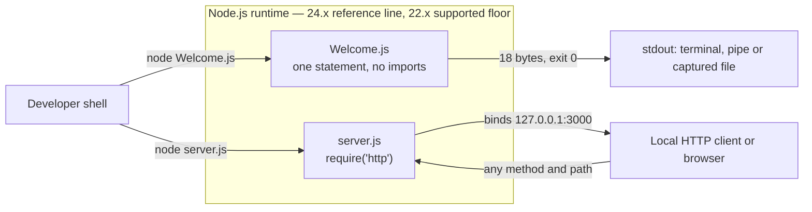
```mermaid
flowchart LR
    subgraph Runtime["Node.js runtime — 24.x reference line, 22.x supported floor"]
        W["Welcome.js<br/>one statement, no imports"]
        S["server.js<br/>require('http')"]
    end
    Dev["Developer shell"] -->|node Welcome.js| W
    Dev -->|node server.js| S
    W -->|"18 bytes, exit 0"| Out["stdout: terminal, pipe or captured file"]
    S -->|"binds 127.0.0.1:3000"| Client["Local HTTP client or browser"]
    Client -->|"any method and path"| S
```

Supporting components: `README.md` (repository identity) and `blitzy/documentation/Project Guide.md` (delivery record). `blitzy/` is the platform's in-repository working folder for generated documentation and holds no code or tooling of its own.

**Core technical approach.**

- **Language and runtime.** JavaScript at ES5 syntax level, executed directly by Node.js; nothing is transpiled, bundled or built. The guide records Node.js 24.x as the reference line and 22.x as the supported floor; `node --version` in this inspection environment reports v22.23.3, and `node --check` passes for both tracked `.js` files.
- **Module posture.** `Welcome.js` declares no `import` or `export`, so it runs identically whether the runtime classifies it as CommonJS or as an ES module; `server.js` deliberately uses CommonJS (`const http = require('http');`).
- **Dependency posture.** Zero third-party packages by design: `Welcome.js` uses only the ambient `console` global, and `server.js` uses only the Node core `http` module. Probes for a manifest, lockfile or `node_modules` return zero paths, and the guide states outright that `npm install`, `npm init` and `npm ci` must not be run here.
- **Input surface.** The product consumes no argument, no stdin, no environment variable and no file: stdout is 18 bytes with an extra argument, under an empty environment (`env -i`) and with piped stdin.
- **Termination.** The process ends by letting the event loop empty — no `process.exit()`, timer or listener exists — so queued output is never truncated; a deliberately slow pipe reader still receives all 18 bytes.
- **Failure behaviour.** `console.log` does not raise when the destination stream cannot accept the write, so a full or closed destination loses the message while the process still exits `0`; acceptance is therefore asserted against captured bytes rather than the exit status alone.
- **Service surface.** The demo server answers every method, path and query identically with the same fixed response (verified `200 text/plain` for `/` and for `/anything?x=1`) and binds only the IPv4 loopback address, so it is unreachable from other hosts.

**Data flow.** For the product the flow is a single hop with no intermediate state: string literal → `console` → stdout. For the pre-existing server it is: TCP request on `127.0.0.1:3000` → inline listener (request object ignored) → fixed status, header and 14-byte body → response. No file, database, cache, queue or external service sits on either path.

### 1.2.3 Success Criteria

**Measurable objectives.** Every criterion below is mechanically checkable and was observed either in this inspection or in the recorded evidence of `blitzy/documentation/Project Guide.md`.

| Objective | Acceptance check | Observed result |
|---|---|---|
| Exact message on a user-visible channel | `node Welcome.js \| od -An -t x1` | 18 bytes, `57 65 6c 63 6f 6d 65 20 74 6f 20 42 6c 69 74 7a 79 0a` |
| Exact filename and placement | `ls Welcome.js`; `git ls-files` | `Welcome.js` present at repository-root depth with capital `W` |
| Runs as written, no install | `ls package.json package-lock.json node_modules \| wc -l` | `0` |
| Minimal source | `wc -l` / `wc -c` on `Welcome.js` | `1` line, `34` bytes, one statement, no comment or blank line |
| Self-termination with success status | `node Welcome.js >/dev/null; echo $?`; stderr byte count | `0` with empty stderr and no forced exit |
| No impact on the pre-existing application | Latency measured before, during and after repeated runs | Medians at or below the idle baseline, no failed request, stable memory and descriptor counts (guide §4) |
| Whole-tree syntax validity | `for f in $(git ls-files '*.js'); do node --check "$f"; done` | Both files parse, exit `0` |

**Critical success factors.**

- **Minimality ceiling respected.** Relative to base `1484182`, the tracked tree gains two paths — `Welcome.js` and the report `blitzy/documentation/Project Guide.md` — while the product series itself adds exactly one file and one line (`A Welcome.js`; `1 file changed, 1 insertion(+)`, guide §10 Appendix A). The guide's earlier "one added file" statement describes the product commits before the report was committed.
- **Filename fidelity on case-sensitive filesystems.** The file is `Welcome.js`; a lowercase invocation fails with `MODULE_NOT_FOUND` on Linux even though a case-insensitive filesystem masks the mistake locally.
- **Availability of a supported runtime line.** Runtime presence is the only environmental prerequisite; the guide standardises on the 24.x line and records 22.x support ending 30 April 2027.
- **Human-executed acceptance.** No automated suite exists by design (`node --test` → tests 0, suites 0, pass 0, fail 0), so the documented nine-line gate must be re-run on any change to the file.
- **Continuity of the pre-existing surface.** `README.md` and `server.js` remain byte-identical, and the demo server still serves its response across methods, paths and restarts.

**Key performance indicators.**

| KPI | Value | Source |
|---|---|---|
| AAP-scoped completion | 83% — 12.5 of 15.0 hours, 2.5 hours remaining | Guide §1.2, §2.3 |
| Compliance benchmarks | 11 PASS, 1 NOT MET (the Python clause) of 12 | Guide §5.1 |
| Acceptance-gate checks | 42 executed, 42 passed, 0 failed | Guide §3 |
| Requirements satisfied | 17 of 17 requirements met; 19 of 20 scoped acceptance items closed | Guide §1.4 |
| Third-party dependencies | 0 | Verified here; guide §9.3 |
| Automated tests | 0 — no test file or runner exists | Verified here (`node --test`); guide §3 |
| Open governance items | 1 — the language clause, owner-owned, ETA 1.0 h | Guide §1.4, §1.6 |

The guide records an indicative single-run duration of roughly 25–30 ms for the product (§9.1) and states no throughput, concurrency or latency SLA, which is consistent with an artifact whose entire execution is one stdout write and a natural exit.

## 1.3 Scope

The project's scope is narrow and precisely bounded: one added file whose behaviour and byte count are fixed, plus a continuity obligation towards two pre-existing files that must not change. Everything else — packaging, tooling, deployment, input handling and any second artifact — is excluded, and most exclusions are exclusion *criteria* rather than omissions, because adding any of them would breach a stated acceptance requirement.

### 1.3.1 In-Scope

**Core features and functionalities.** The scoped requirements are the seventeen functional, non-functional and implicit items recorded in the compliance matrix of `blitzy/documentation/Project Guide.md` §5.1.

| Requirement | What it demands | Where satisfied | Acceptance evidence |
|---|---|---|---|
| F-1, I-1 | The exact message on a user-visible channel | `Welcome.js:1` | Captured stdout of 18 bytes, verified byte by byte |
| F-2, I-2, I-4 | Filename exactly `Welcome.js` at the repository root | Path depth 1, exact casing | `git ls-files` exact-case match; no `welcome.js`, `.mjs`, `.cjs` or `.py` variant exists |
| F-3 | JavaScript implementation | `Welcome.js`, ES5-level syntax | `node --check` exits `0` |
| F-4, I-5 | Self-termination with a success status | No `process.exit`, timer or listener in source | Exit `0`, empty stderr, `timeout` never triggered |
| N-1, N-2 | Minimal, simple, abstraction-free source | One statement, one line | `wc -l` → `1`, `wc -c` → `34`; no function, class, variable, wrapper, guard or export |
| N-3 | Runs as written: no install, build or transpile | Zero imports; manifest-free tree | Manifest, lockfile and `node_modules` probes return `0` paths, in the tree and above it |
| N-4 | No impact on the existing application | Standalone short-lived process, never referenced by `server.js` | Request latency during and after repeated runs at or below baseline |
| N-5 | Each flow and feature clearly separated | The one feature's one flow occupies a dedicated file containing nothing else | Source inspection; one `.js` product file |
| I-3, I-6 | JavaScript rather than Python; module-system independence | No `import`/`export`; correct under CommonJS or ESM classification | Runs identically with no manifest and with an ancestor manifest of either type |

Alongside these requirements, two obligations are in scope: **continuity** — `README.md` and `server.js` must remain byte-identical to commit `1484182` — and **delivery hygiene**, since the one-added-path criterion requires staging the delivered path by name rather than with a blanket `git add`.

**Primary user workflows.**

1. **Run and observe.** From the repository root, `node Welcome.js` prints `Welcome to Blitzy` and the process exits `0` — there is no service to start, no port to bind and no startup order to respect.
2. **Capture and assert.** The message is captured into a variable, piped onward (`node Welcome.js | tr '[:lower:]' '[:upper:]'` → `WELCOME TO BLITZY`), or compared in a shell conditional; the byte count is asserted from a pipe or captured file, never from a terminal, whose newline translation reports 19 bytes.
3. **Verify before accepting or changing.** `node --check` for syntax, the whole-tree parse loop, and the nine-line acceptance gate repeated on each supported Node.js line.
4. **Check continuity of the pre-existing surface.** `node server.js`, exercise `127.0.0.1:3000` across methods and paths, then stop it — performed as evidence that the delivery changed nothing, not as a supported operational workflow.

**Essential integrations.**

| Integration | Mechanism | In-scope obligation |
|---|---|---|
| Node.js runtime | `node Welcome.js`; `console` and core `http` only | Verified on the 24.x reference line and the 22.x floor; `node --version` here reports v22.23.3 |
| Developer shell | stdout capture, pipes, exit status, `env -i`, absolute paths | Output must be byte-identical regardless of working directory, environment or piped reader |
| Git / version control | Commits `1cef465`, `6c16ea2`, `4d1256c`; merge `39974fd` (PR #15) | Exactly one product path and one product line added; pre-existing files unchanged |
| Pre-existing HTTP demo surface | `127.0.0.1:3000`, fixed `text/plain` response | Must remain byte-identical in behaviour; no modification is permitted |

No other integration is in scope: there is no package registry, CI service, deployment target, identity provider, database, broker or monitoring system to integrate with.

**Key technical requirements.**

| Requirement | Binding value |
|---|---|
| Runtime | Node.js LTS — 24.x reference line, 22.x supported floor (floor end of life 30 April 2027) |
| Module system | Module-neutral single file: no `import`, `export` or manifest; CommonJS `require('http')` retained in the pre-existing server |
| Dependencies | Zero third-party packages; `npm install`, `npm init` and `npm ci` must not be run |
| Source style contract | Single-quoted literal, terminating semicolon, no indentation, no comment, no blank line, single trailing LF |
| Process lifecycle | Natural termination only — no `process.exit()`, no timers, no retained handles, exit status `0` |
| Filesystem and permissions | Exact filename casing `Welcome.js` at the repository root; mode `0644`; no write to any file |
| Operating constraints | Loopback-only binding for the pre-existing server; the product opens no socket and reads no configuration |

**Implementation boundaries.**

- **System boundary.** One script executed by the runtime, with stdout as its only outward channel. There is no daemon, service, port (for the product), user interface, scheduler or data store; the boundary is crossed exactly twice — the runtime reads the file, and the process writes 18 bytes to stdout.
- **User groups covered.** The repository owner (acceptance and governance), the generation pipeline (delivery and reporting), the accepting reviewer (gate execution) and the future developer (reference artifact and change verification). No end-user population, role model, permission set or tenant exists.
- **Geographic and market coverage.** None: no deployment region, hosting, distribution channel or localization. The delivered message is fixed ASCII English text emitted wherever a supported runtime executes the file, and the filenames are treated as case-sensitive (verified on Linux-class tooling).
- **Data domains included.** Exactly two literals — the product's `Welcome to Blitzy` and the pre-existing server's `Hello, World!\n`. No persisted data, no personal or regulated data, no secrets, no telemetry, no log or metric stream, no configuration data, and no input channel (argument, stdin, environment variable, file or socket) for the product.

### 1.3.2 Out-of-Scope

**Explicitly excluded features and capabilities.** Each exclusion below is deliberate and, in most cases, protective: adding the artifact would break a stated acceptance criterion.

| Excluded | Reason | Recorded at |
|---|---|---|
| A Python implementation, port, shim or `welcome.py` beside the product | The product request fixed both the language and the filename `Welcome.js`; a second artifact breaks the one-file criterion and a rename breaks the required filename | Guide §5.2 divergence 1; commit `6c16ea2` |
| Any manifest, lockfile or `node_modules` | Breaks the zero-install criterion; a `"type": "module"` manifest in or above the tree would additionally break `server.js` at runtime | Guide §6, §9.2 |
| Test files and test runners | No automated regression net by design; `node --test` reports 0 tests and acceptance is the documented manual gate | Guide §3 |
| CI workflows, container definitions, build tools, bundlers, transpilers, linters and formatters | None declared or used; there is nothing to build with zero imports and ES5-level syntax | Guide §10 Appendix F |
| Configuration, `.env` files and secrets management | The product reads no configuration, environment variable, secret or credential | Guide §1.5, §10 Appendix E |
| User interface, endpoints, authentication flows, databases and background jobs | None exist in the product; its entire observable surface is one line on stdout | Guide §4 |
| Additional documentation beyond the pre-existing `README.md` and the generated report | Documentation artifacts beyond these are an excluded class in the compliance sweep | Guide §5.1 row 11 |
| Any change to `server.js` — error listener, graceful-shutdown drain, configurable port, routing | Pre-existing robustness gaps left as open owner decisions, outside this deliverable | Guide §6 |

**Future phase considerations.** Four follow-on items are recorded, totalling 2.5 hours, none of which is code work on `Welcome.js`.

| Follow-on item | Hours | Priority | State in this checkout |
|---|---|---|---|
| Settle the project rule's language clause — amend or narrow the rule, or issue a product-scoped waiver | 1.0 | High | Open — owner decision; the file must stay byte-identical |
| Publish the branch and open the pull request (2 commits, `+1` line; the record-only commit may be squashed) | 0.5 | High | Already landed: `39974fd` "Merge pull request #15" is the current HEAD and working-tree head, with the branch's commits merged |
| Owner-side acceptance re-run on the standardised Node line | 0.5 | Medium | Pending owner action |
| Remove the untracked capture directory before staging, so a blanket `git add` cannot add a second artifact | 0.5 | Low | Recorded as open in the guide (§5.2 divergence 3, §6), but the checkout inspected here has a clean tree and contains no `blitzy/screenshots/` path |

**Integration points not covered.** Nothing consumes this delivery automatically: no CI pipeline runs the gate, no package registry publishes it, no deployment or observability platform receives it, no identity or authorization system governs it, and no runtime-version pin (for example an `engines` field or version file) exists to enforce the supported Node.js line. Version support is therefore a documented convention — the guide standardises on 24.x — rather than an enforced one.

**Unsupported use cases.**

- **Reuse as a module.** `Welcome.js` exports nothing; it is a side-effect-only script and cannot be imported for its message.
- **Configurable output.** The literal is fixed in source: no argument, flag, environment variable or file can change the message, and the pre-existing server's response body is likewise fixed.
- **Execution from a foreign working directory by bare filename.** `node welcome.js` or `node Welcome.js` outside the repository root fails with `MODULE_NOT_FOUND`; the root or an absolute path is required, and on a case-insensitive filesystem the casing error is masked locally.
- **Remote or routed HTTP access.** The demo server binds the IPv4 loopback address only, so it is unreachable from other hosts, and every method, path and query receives the identical response — no routing, content negotiation, body parsing or request logging is provided.
- **Two instances of the demo server.** A second start on port 3000 exits non-zero with an unhandled `EADDRINUSE` stack trace on stderr (reproduced on Node v22.23.3); no port override exists.
- **Load, throughput or long-running operation.** No concurrency, latency or volume guarantee is stated; the artifact performs one write and exits, and there is nothing to operate, monitor, scale or persist.
- **Localized or non-ASCII output, and automated regression coverage.** Both are absent by design: the message is fixed English ASCII, and no tooling guards `Welcome.js` — nor the pre-existing `server.js` — against a future change (guide §3, "Not Covered").

## 1.4 References

- `Welcome.js` — the deliverable: one statement, `console.log('Welcome to Blitzy');`, 1 line and 34 bytes at the repository root; source of the 18-byte stdout contract, the exit-status and termination behaviour, the ES5-level syntax and the absent input channels.
- `server.js` — pre-existing 14-line loopback demo HTTP server (`127.0.0.1:3000`, fixed `200 text/plain` response, `Hello, World!\n`); source of the pre-existing-surface continuity obligation, the CommonJS `require('http')` dependency posture and the documented robustness gaps (no error listener, no shutdown drain, hardcoded port).
- `README.md` — repository identity and stated purpose ("test project for backprop integration"), 2 lines; evidence that no product description, license or build guidance exists in-repo.
- `blitzy/documentation/Project Guide.md` — platform-generated status report (382 lines): executive summary and completion metrics, hours breakdown, test results and execution gate, runtime validation findings, compliance matrix and divergences, eight-risk register, prioritised remaining work, development guide and appendices A–G; source of the acceptance items, KPIs, runtime lines, compliance statuses and the open language-clause decision.
- `blitzy/` — platform working folder for generated artifacts; establishes that no code, manifest or tooling accompanies the documentation.
- `blitzy/documentation/` — folder holding the generated report as its sole child, confirming the report is documentation rather than a source or dependency artifact.
- Repository Git history on branch `05-Oct-26-Br1` (base `1484182`, product commits `1cef465` and `6c16ea2`, report commit `4d1256c`, merge `39974fd` "Merge pull request #15") — provenance of the delivered paths, the record-only rationale commit, and the observed `A Welcome.js` / `A blitzy/documentation/Project Guide.md` added-path set.
- Terminal observations against the checkout — `node --version` → v22.23.3; `node Welcome.js` → `Welcome to Blitzy`, exit `0`, 18 bytes on stdout, 0 bytes on stderr, identical output with an argument, under `env -i` and with piped stdin; `node --test` → 0 tests; `node --check` passes for both tracked `.js` files; `ls package.json package-lock.json node_modules` → 0 paths; `curl http://127.0.0.1:3000/` → `200`, `text/plain`, `Content-Length: 14`; a second server start → unhandled `EADDRINUSE` on stderr.

No web sources were used: every statement in this section rests on the repository files, its Git history, or commands executed against this checkout.

# 2. Product Requirements

## 2.1 Feature Catalog

The catalog enumerates every capability the checkout actually provides — four runtime/documentation capabilities, matching exactly the capability set recorded in `blitzy/documentation/Project Guide.md` §1.2.2, plus the continuity and minimality obligation that the same project made binding. No capability is listed that does not exist as a file or a procedural obligation in this repository, and no feature is listed for a capability that the repository excludes (no test suite, endpoint beyond the demo server, authentication, database, background job, configuration or package manifest).

Identifier convention: features carry `F-XXX`; requirements carry `F-XXX-RQ-YYY` and are defined in section 2.2. Priority uses Critical / High / Medium / Low. Status uses Proposed / Approved / In Development / Completed, with the qualifier that F-002, F-003 and F-004 are pre-existing or generated artifacts rather than work this project produced.

| ID | Feature name | Category | Priority · Status |
|---|---|---|---|
| F-001 | Stdout Banner Emission | Core functional — delivered product | Critical · Completed |
| F-002 | Loopback HTTP Demo Response | Functional — pre-existing, retained | Medium · Completed |
| F-003 | Repository Identity Description | Documentation — pre-existing | Low · Completed |
| F-004 | Delivery Status Reporting | Documentation — platform-generated | Low · Completed |
| F-005 | Pre-existing Surface Continuity and Minimality Assurance | Non-functional — continuity, minimality, rule conformance | Critical · Completed |

Two facts order the catalog. First, F-001 is the only capability this project added; `git diff --name-status 1484182 HEAD` lists `A Welcome.js` and, from the reporting step, `A blitzy/documentation/Project Guide.md`, while `README.md` and `server.js` are byte-identical to the base commit. Second, F-005 is not a runtime feature at all but the obligation set that makes acceptance mechanical, and it carries the project's single open item — the governing rule's Python clause, recorded as NOT MET by decision.

### 2.1.1 F-001 — Stdout Banner Emission

| Attribute | Value |
|---|---|
| Unique ID | F-001 |
| Feature name | Stdout Banner Emission |
| Feature category | Core functional — delivered product |
| Priority level | Critical — the repository's stated deliverable |
| Status | Completed — delivered, merged (`39974fd`) |

**Overview.** Running `node Welcome.js` from the repository root writes the exact message `Welcome to Blitzy` to standard output — 18 bytes, including one trailing LF (hex `57 65 6c 63 6f 6d 65 20 74 6f 20 42 6c 69 74 7a 79 0a`) — writes nothing to standard error, and ends on its own with exit status `0`. The whole implementation is `Welcome.js`, one line and 34 bytes containing the single statement `console.log('Welcome to Blitzy');`.

**Business value.** This is the project's only product output, and it satisfies the four functional requirements, five non-functional requirements and six implicit requirements the delivery was measured against (section 2.5). Its value lies in what it does not require, as the guide states: no dependency graph to audit, no lockfile to maintain, no build or transpile step, no configuration to drift, no secret to rotate and no service to operate (guide §8). That is why the zero-install and one-line ceilings were made acceptance criteria rather than stylistic preferences.

**User benefits.** Whoever accepts the delivery can verify it with nothing beyond the Node.js runtime: capture stdout, count the bytes, read the exit status. Any developer who later needs this repository's smallest correct JavaScript program has it, at the root, in a file that runs as written.

**Technical context.** The syntax is ES5 level — one member call and one string literal — so nothing is version-sensitive (guide Appendix D). The file declares no `import`, `export`, `require`, function, class, variable, guard or comment, and `console` is a runtime global, so the source is module-neutral: it behaves identically whether the runtime classifies it as CommonJS or as an ES module, with or without an ancestor manifest of either type. The process reads no argument, no standard input, no environment variable and no file, opens no socket and executes no dynamic code. Termination is natural — no `process.exit()`, timer or listener — so queued output is never truncated. The known failure mode is that `console.log` does not raise when the destination stream cannot accept the write, so acceptance is asserted against captured bytes rather than exit status alone.

| Dependency class | Detail |
|---|---|
| Prerequisite features | None. The file is standalone; it is never imported by, or referenced from, `server.js`, and it exports nothing (guide §1.2.2) |
| System dependencies | A supported Node.js LTS line — v24.x as the reference line, v22.x as the supported floor (floor end of life 30 April 2027); a filesystem that preserves the exact filename `Welcome.js`; a POSIX-style shell for the documented gate |
| External dependencies | None. Zero third-party packages, no manifest, no lockfile, no `node_modules`, no network access, no credential, no endpoint |
| Integration requirements | Standard output (terminal, pipe or captured file), the shell's exit status, and Git for delivery. No service, port, database or broker participates |

### 2.1.2 F-002 — Loopback HTTP Demo Response

| Attribute | Value |
|---|---|
| Unique ID | F-002 |
| Feature name | Loopback HTTP Demo Response |
| Feature category | Functional — pre-existing, retained and unmodified |
| Priority level | Medium — a continuity obligation, not a deliverable |
| Status | Completed — pre-existing at base `1484182`, byte-identical since |

**Overview.** `server.js` (15 lines, `wc -l` reports 14, 342 bytes) builds an HTTP server on the Node core `http` module, binds `127.0.0.1:3000`, logs `Server running at http://127.0.0.1:3000/` on startup, and answers every request — any method, any path, any query, with or without a body — with `200`, `Content-Type: text/plain` and the 14-byte body `Hello, World!\n`.

**Business value.** The capability is carried forward untouched, and its real role in this project is evidence: it is the surface the non-impact requirement (N-4) protects, and its CommonJS `require('http')` is the reason the repository must stay manifest-free. The guide records that a `package.json` declaring `"type": "module"` added in or above the tree would break this file at runtime while `Welcome.js` would keep working.

**User benefits.** A developer gets a working local HTTP smoke target with no install step, and a reviewer can reproduce the continuity evidence in a browser against `127.0.0.1:3000`. It also serves as the repository's example of a CommonJS entry point.

**Technical context.** One inline anonymous listener is passed to `http.createServer`; the request object is ignored, the status code and header are set inline, and `res.end` sends the fixed literal. `hostname = '127.0.0.1'` and `port = 3000` are hardcoded module constants with no override, and the file exports nothing. There is no routing, body parsing, request logging, error listener or shutdown drain: a second concurrent start exits `1` with an unhandled `EADDRINUSE` stack trace on stderr (reproduced here on Node v22.23.3), while a `SIGTERM` does release the port.

| Dependency class | Detail |
|---|---|
| Prerequisite features | None. It is independent of `Welcome.js` in both directions |
| System dependencies | Node core `http`; an IPv4 loopback interface; port `3000` free on `127.0.0.1`; CommonJS module classification |
| External dependencies | None. No registry, deployment target, observability hook, identity provider or database participates (guide §1.5) |
| Integration requirements | A local HTTP client or browser on `127.0.0.1:3000`; Git for tracking. Reachability is loopback-only, so no remote caller can integrate with it |

### 2.1.3 F-003 — Repository Identity Description

| Attribute | Value |
|---|---|
| Unique ID | F-003 |
| Feature name | Repository Identity Description |
| Feature category | Documentation — pre-existing |
| Priority level | Low — informational, but a protected continuity surface |
| Status | Completed — pre-existing at base `1484182`, byte-identical since |

**Overview.** `README.md` is two lines and 58 bytes: the heading `# hao-backprop-test` followed by `test project for backprop integration.` It names the repository and states its purpose in one sentence.

**Business value.** It is the only in-repo statement of what this repository is, and the delivery treated it as read-only — `git diff 1484182 -- README.md` returns zero lines, so the description of the repository still matches its pre-project state.

**User benefits.** A first-time reader learns the repository's purpose without reading code or history. The trade-off is deliberate: there is no license, versioning scheme, build, run, test or contribution guidance, and no reference to any sibling file.

**Technical context.** Plain Markdown with no code fences, lists, links or badges; the second line carries no trailing newline, so `wc -l` reports 1 rather than 2. No code reads the file at runtime, so it has no failure mode of its own.

| Dependency class | Detail |
|---|---|
| Prerequisite features | None |
| System dependencies | None — the file is inert text and requires no toolchain to exist or to be read |
| External dependencies | None |
| Integration requirements | Git tracking, plus any Markdown viewer or text editor used to read it |

### 2.1.4 F-004 — Delivery Status Reporting

| Attribute | Value |
|---|---|
| Unique ID | F-004 |
| Feature name | Delivery Status Reporting |
| Feature category | Documentation — platform-generated |
| Priority level | Low — reporting surface, not a runtime capability |
| Status | Completed — generated and committed as `4d1256c` |

**Overview.** `blitzy/documentation/Project Guide.md` (381 lines) is the project's status and completion report: ten numbered sections plus Appendices A–G, with three mermaid pie charts. It records the hours ledger (15.0 total, 12.5 completed, 2.5 remaining, 83%), the 42-check execution gate with 42 passed and 0 failed, the twelve-row compliance matrix (11 PASS, 1 NOT MET), an eight-row risk register, a troubleshooting table, and the four remaining work items.

**Business value.** It is the acceptance dossier: every benchmark in the compliance matrix cites the file, command or measurement behind it, so sign-off can be decided against recorded evidence rather than recollection. It is also the only place the single open governance item is documented, with its impact, owner and one-hour estimate.

**User benefits.** A reviewer can see per-benchmark evidence and the observed output of each command, reproduce the nine-line gate, and hand a future maintainer a runbook, a glossary and the runtime support horizon in one document.

**Technical context.** Markdown rendered with mermaid pie charts; produced by the Blitzy generation pipeline, not by hand and not by the product. It is not executed and has no interface at runtime. One consequence is recorded in the guide's own provenance note: this report is the second path the tree gained over the base commit, so the "one added file" claim in Appendix A describes the product commit before the report itself was committed.

| Dependency class | Detail |
|---|---|
| Prerequisite features | The acceptance evidence produced by F-001, F-002 and F-005 — the report's counts come from executing those checks, not from estimation |
| System dependencies | A Markdown/mermaid renderer to view the charts; otherwise none |
| External dependencies | The Blitzy generation pipeline that produced and committed the document |
| Integration requirements | Git tracking alongside `Welcome.js`; no runtime, service or network interface |

### 2.1.5 F-005 — Pre-existing Surface Continuity and Minimality Assurance

| Attribute | Value |
|---|---|
| Unique ID | F-005 |
| Feature name | Pre-existing Surface Continuity and Minimality Assurance |
| Feature category | Non-functional — continuity, minimality and rule conformance |
| Priority level | Critical — the obligations that decide acceptance |
| Status | Completed, with one governance item recorded open (rule row 12, NOT MET by decision) |

**Overview.** This feature is the obligation set that bounds the delivery: `README.md` and `server.js` must remain byte-identical to base `1484182`; the product must add exactly one path and one line while introducing no excluded artifact class (manifest, lockfile, `node_modules`, test file, CI workflow, container, configuration, dependency or Python artifact); the pre-existing HTTP service must not be measurably impacted by runs of the new script; and the governing project rule — "Create a product in Python clearly separating each flow and feature. Ensure the performance of the application is not impacted by this code." — must be adjudicated clause by clause. Two of its three clauses are met and verified; the Python clause is not met, by recorded decision, because the product request itself fixed JavaScript and the filename `Welcome.js`.

**Business value.** This is what makes the delivery verifiable rather than merely asserted: continuity is provable with `git diff`, minimality with `git ls-files` and `git diff --stat`, and non-impact with before/during/after latency measurement. It also keeps the one unresolved item visible instead of letting a clause-level gap disappear into a summary paragraph.

**User benefits.** The owner can sign off using two commands and the documented gate; the accepting reviewer can re-run the same checks and compare bytes; the future developer inherits an unbroken baseline for both pre-existing files and a clear statement that the file must stay byte-identical.

**Technical context.** The obligations are enforced procedurally, by commands rather than by code, since the repository deliberately contains no automated suite (`node --test` reports 0 tests, 0 suites, 0 pass, 0 fail). Continuity was observed here as a zero-line diff against the base commit for both files; the tracked tree changes by exactly `A Welcome.js` and `A blitzy/documentation/Project Guide.md`; and no manifest or lockfile exists in the checkout or in any ancestor directory.

| Dependency class | Detail |
|---|---|
| Prerequisite features | F-001 (its file, line and byte counts are what the minimality ceiling measures), F-002 and F-003 (the surfaces whose continued byte-identity must be proven) |
| System dependencies | Git, with base commit `1484182` reachable for the diff; a shell for the gate; a supported Node.js line for the whole-tree parse loop |
| External dependencies | None for verification; the only external party involved is the project owner, who owns the language-clause decision |
| Integration requirements | The documented nine-line acceptance gate, the branch/PR path that landed the work (`39974fd`, PR #15), and a governance decision outside the codebase. No automated pipeline runs the gate — nothing consumes this delivery automatically |


## 2.2 Functional Requirements

Every requirement below is derived from a capability that exists in the checkout or from an obligation the project recorded as binding; nothing is projected. Each requirement carries a stable `F-XXX-RQ-YYY` identifier, and every row traces back to an identifier or matrix row in `blitzy/documentation/Project Guide.md` through the matrix in section 2.5.1.

Three tables are given per feature, each within the four-column limit: requirement details, technical specifications, and validation rules. In the details table the final column pairs the MoSCoW priority (Must-Have / Should-Have / Could-Have) with the implementation complexity (High / Medium / Low). In the specifications table the final column carries performance criteria together with data requirements, which are uniformly "no persisted data" in this system. Requirement versions are held at 1.0 for this baseline; the versioning rule and the artefacts it is anchored to are stated in section 2.5.2.

### 2.2.1 F-001 — Stdout Banner Emission

**Requirement details.**

| Requirement ID | Description | Acceptance criteria | Priority · Complexity |
|---|---|---|---|
| F-001-RQ-001 | Write the exact message `Welcome to Blitzy` to a user-visible channel | Captured stdout of `node Welcome.js` is 18 bytes — the 17-character message plus one LF, hex `57 65 6c 63 6f 6d 65 20 74 6f 20 42 6c 69 74 7a 79 0a` | Must-Have · Low |
| F-001-RQ-002 | Deliver the artefact under the exact filename `Welcome.js` at the repository root | `git ls-files` shows `Welcome.js` at path depth 1 with a capital `W`; no `welcome.js`, `.mjs`, `.cjs` or `.py` variant exists | Must-Have · Low |
| F-001-RQ-003 | Implement the product in JavaScript that parses on every supported runtime line | `node --check Welcome.js` exits 0; the whole-tree loop over `git ls-files '*.js'` parses both tracked files | Must-Have · Low |
| F-001-RQ-004 | End on its own with a success status and no diagnostics | Exit status 0 under `timeout 10`; stderr byte count 0; source contains no `process.exit`, timer or retained handle | Must-Have · Low |
| F-001-RQ-005 | Hold the source at the minimality ceiling: one line, one statement | `wc -l` → 1, `wc -c` → 34, exactly one semicolon, no blank line, no comment, a single trailing LF | Must-Have · Low |
| F-001-RQ-006 | Introduce no abstraction | No function, class, variable, wrapper, guard, export or `require` in the file | Must-Have · Low |
| F-001-RQ-007 | Run as written — no install, build or transpile step | Zero imports; no manifest, lockfile or `node_modules` in the repository or in any ancestor directory | Must-Have · Low |
| F-001-RQ-008 | Ignore all external input — arguments, stdin, environment, working directory | Identical 18 bytes with extra arguments, with piped stdin, under `env -i`, and when invoked by absolute path from an unrelated directory | Should-Have · Low |
| F-001-RQ-009 | Deliver the complete message when the reader is slow | A pipe reader that waits before reading still receives all 18 bytes; no forced exit truncates queued output | Should-Have · Low |
| F-001-RQ-010 | Behave identically under either module classification | Identical 18 bytes with no manifest, beside a `"type": "module"` manifest, beside a `"type": "commonjs"` manifest, and with an ancestor manifest of either type | Must-Have · Low |
| F-001-RQ-011 | Keep the feature's single flow in a dedicated file containing nothing else | `Welcome.js` holds only that one statement and is not reused by any other file or flow | Must-Have · Low |

**Technical specifications.**

| Requirement ID | Input parameters | Output / response | Performance criteria · Data requirements |
|---|---|---|---|
| F-001-RQ-001 | None | 18 bytes on stdout, 0 bytes on stderr, exit status 0 | One write and a natural exit; guide §9.1 records 25–30 ms per run, 0.021 s real measured here; no data persisted |
| F-001-RQ-002 | None | File `Welcome.js`, 34 bytes, mode 0644, at repository-root depth 1 | Filesystem property; no data requirements |
| F-001-RQ-003 | None | Parse result only; `node --check` writes no output on success | No timing constraint; no data requirements |
| F-001-RQ-004 | None | Natural termination, status 0, empty stderr | `timeout 10` must never fire; no data requirements |
| F-001-RQ-005 | None | Source of 1 line / 34 bytes | No runtime performance criterion; no data requirements |
| F-001-RQ-006 | None | Source declaring nothing | None; no data requirements |
| F-001-RQ-007 | None | Successful run with no install, resolve or build step | Startup bounded by interpreter load only; no data requirements |
| F-001-RQ-008 | Arguments, stdin and environment variables are accepted by the shell but must not be read | Identical 18 bytes regardless of those inputs | None; the product reads no data |
| F-001-RQ-009 | A slow pipe reader | All 18 bytes delivered without truncation | No throughput or latency target; no data requirements |
| F-001-RQ-010 | An optional ancestor manifest of either type | Identical 18 bytes in every classification | None; no local module configuration is read |
| F-001-RQ-011 | None | One file, one flow, one statement | None; no data requirements |

**Validation rules.**

| Requirement ID | Business rules & data validation | Security requirements | Compliance requirements |
|---|---|---|---|
| F-001-RQ-001 | The output must equal the literal exactly — 17 characters plus one LF — and must be asserted against a pipe or captured file, never a terminal, whose newline translation can report 19 bytes | No input exists to validate | Product-request acceptance criterion; guide compliance matrix row 1 |
| F-001-RQ-002 | Filenames are treated case-sensitively; the lowercase form fails with `MODULE_NOT_FOUND` on Linux while a case-insensitive filesystem masks the error locally | Read permission only; mode 0644; the product writes no file | Matrix row 2 (F-2, I-2, I-4) |
| F-001-RQ-003 | Syntax level is ES5 — one member call and one literal — so nothing is version-sensitive | No dependency, therefore no transitive advisory exposure | Matrix row 3 (F-3) |
| F-001-RQ-004 | Stream failure is not surfaced: `console.log` does not raise when the destination cannot accept the write, so the message can be lost while the status stays 0 — assert captured bytes | The product holds no secret, opens no socket and reads no credential | Matrix row 4 (F-4, I-5) |
| F-001-RQ-005 | Exactly one trailing LF; padding, comments and blank lines are not permitted | None | Matrix row 5 (N-1); minimality criterion "1 source line" |
| F-001-RQ-006 | Any added abstraction breaches the style contract | None | Matrix row 6 (N-2) |
| F-001-RQ-007 | Adding a manifest, lockfile or `node_modules` — including by running `npm install`, `npm init` or `npm ci` — breaches an acceptance criterion | The zero-dependency, zero-input posture *is* the security property; a future dependency or input channel is a scope change | Matrix row 7 (N-3) |
| F-001-RQ-008 | Run from the repository root or by absolute path; a bare filename from elsewhere fails with `MODULE_NOT_FOUND` | Consumes no environment variable, credential or endpoint | Guide Appendix E records no variables consumed |
| F-001-RQ-009 | Do not substitute exit status for the output check | None | Guide §4 output-durability flow |
| F-001-RQ-010 | Keep the tree manifest-free; if a manifest ever becomes necessary, declare `"type": "commonjs"` and re-run both files | None | Matrix row 10 (I-6) |
| F-001-RQ-011 | Do not fold a second flow into the file | None | Matrix row 9 (N-5); rule clause 2, flow/feature separation |

**Process flow (F-001).**

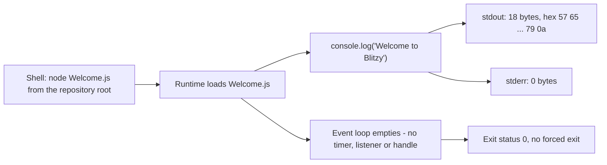
```mermaid
flowchart LR
    A["Shell: node Welcome.js from the repository root"] --> B["Runtime loads Welcome.js"]
    B --> C["console.log('Welcome to Blitzy')"]
    C --> D["stdout: 18 bytes, hex 57 65 ... 79 0a"]
    C --> D2["stderr: 0 bytes"]
    B --> F["Event loop empties - no timer, listener or handle"]
    F --> G["Exit status 0, no forced exit"]
```

The flow has no branch, no error path and no intermediate state: one literal reaches one stream, and the process ends when the loop empties. The only unverified condition on the path is a destination stream that cannot accept the write, which is recorded as a known limitation rather than a handled case.

### 2.2.2 F-002 — Loopback HTTP Demo Response

**Requirement details.**

| Requirement ID | Description | Acceptance criteria | Priority · Complexity |
|---|---|---|---|
| F-002-RQ-001 | Start on demand, bind the IPv4 loopback address and port 3000, and announce the URL | `node server.js` logs `Server running at http://127.0.0.1:3000/` on a successful bind and accepts a connection on port 3000 | Should-Have · Low |
| F-002-RQ-002 | Answer every request identically with a fixed plain-text response | Any method, path and query returns status 200, `Content-Type: text/plain`, `Content-Length: 14` and the body `Hello, World!\n` | Should-Have · Low |
| F-002-RQ-003 | Remain reachable only from the local host | The listener is bound to `127.0.0.1`; no other host can reach it and no second listener exists | Should-Have · Low |
| F-002-RQ-004 | Release port 3000 when the process is stopped | After `SIGTERM` the port is free, subsequent requests fail with connection refused, and no `node server.js` process remains | Could-Have · Low |

**Technical specifications.**

| Requirement ID | Input parameters | Output / response | Performance criteria · Data requirements |
|---|---|---|---|
| F-002-RQ-001 | None | Startup log line on stdout; listening socket on `127.0.0.1:3000` | The log is emitted from the `listen` callback, so it follows a successful bind; no startup SLA is stated; no data persisted |
| F-002-RQ-002 | An HTTP request of any method, path or query; the request object is ignored, and any request body is never read | Status 200, `Content-Type: text/plain`, `Content-Length: 14`, body `Hello, World!\n` (hex `48 65 6c 6c 6f 2c 20 57 6f 72 6c 64 21 0a`) | No latency, throughput or concurrency target is asserted; the guide records request-latency medians at or below the idle baseline while the product ran, with no failed request |
| F-002-RQ-003 | Connection attempts from a non-loopback host | Refused — the bind address is `127.0.0.1` | None; no data requirements |
| F-002-RQ-004 | `SIGTERM` or `SIGINT` | Process exits and the port is released | No drain or shutdown timeout policy exists; no data requirements |

**Validation rules.**

| Requirement ID | Business rules & data validation | Security requirements | Compliance requirements |
|---|---|---|---|
| F-002-RQ-001 | A second concurrent start exits `1` with an unhandled `EADDRINUSE` stack trace on stderr; port and host are hardcoded with no override | The service is loopback-only, so exposure is confined to the local host | Guide §6 records the missing error listener as an open, pre-existing owner decision |
| F-002-RQ-002 | The response is a fixed literal: there is no routing, content negotiation or body parsing, so no request data is accepted, echoed or validated | No request body is read; no request data is logged; malformed or oversized traffic is answered by the runtime (`400`, `431`) rather than by application code | Matrix row 8 (N-4) requires no measurable impact on this response from product runs |
| F-002-RQ-003 | Loopback binding is the only access control; no authentication, authorization or TLS exists | No identity provider, secret or credential participates | Guide §1.5 records no access issues and no privileged resource |
| F-002-RQ-004 | Shutdown is not graceful: there is no signal handler and no drain, so in-flight responses are not waited for | None | Pre-existing robustness gap, outside this deliverable's scope (guide §6) |

**Process flow (F-002).**

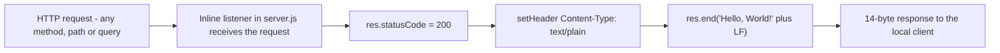
```mermaid
flowchart LR
    R["HTTP request - any method, path or query"] --> L["Inline listener in server.js receives the request"]
    L --> S["res.statusCode = 200"]
    S --> H["setHeader Content-Type: text/plain"]
    H --> E["res.end('Hello, World!' plus LF)"]
    E --> O["14-byte response to the local client"]
```

Every request traverses the same path; there is no branch for method, path, query or body, and no error path inside the application, because the listener never inspects the request and never rejects it.

### 2.2.3 F-003 — Repository Identity Description

**Requirement details.**

| Requirement ID | Description | Acceptance criteria | Priority · Complexity |
|---|---|---|---|
| F-003-RQ-001 | State the repository's name and purpose in a short human-readable document | `README.md` holds the heading `# hao-backprop-test` and the line `test project for backprop integration.`, and remains byte-identical to base `1484182` | Could-Have · Low |

**Technical specifications.**

| Requirement ID | Input parameters | Output / response | Performance criteria · Data requirements |
|---|---|---|---|
| F-003-RQ-001 | None | Two lines of Markdown, 58 bytes; `wc -l` reports 1 because the final line carries no trailing newline | None — the file is never read at runtime; no data requirements |

**Validation rules.**

| Requirement ID | Business rules & data validation | Security requirements | Compliance requirements |
|---|---|---|---|
| F-003-RQ-001 | The file is read-only for this project: `git diff 1484182 -- README.md` must return no lines. It deliberately omits license, versioning, build, run and contribution guidance | The file introduces no runtime surface and is never executed | Continuity obligation recorded in guide §1.3 and §6; matrix row 11 excludes additional documentation beyond this file and the generated report |

### 2.2.4 F-004 — Delivery Status Reporting

**Requirement details.**

| Requirement ID | Description | Acceptance criteria | Priority · Complexity |
|---|---|---|---|
| F-004-RQ-001 | Report delivery status, requirements coverage, test results, risks and remaining hours for the product | `blitzy/documentation/Project Guide.md` records the hours ledger (15.0 total, 12.5 completed, 2.5 remaining), the gate result (42 checks, 42 passed, 0 failed), the twelve-row compliance matrix and the eight-row risk register | Could-Have · Low |
| F-004-RQ-002 | Cite the executable check behind each acceptance claim | Every gate and matrix row names the file, command or measurement behind it, and §9.5 shows the observed output of each of the nine gate commands | Could-Have · Medium |

**Technical specifications.**

| Requirement ID | Input parameters | Output / response | Performance criteria · Data requirements |
|---|---|---|---|
| F-004-RQ-001 | The recorded results of the acceptance checks run for F-001, F-002 and F-005 | 381-line Markdown report: ten numbered sections, three mermaid pie charts, Appendices A–G | None — the document is not executed; no data requirements |
| F-004-RQ-002 | Observed command output from both supported Node.js lines | Command reference and gate tables carrying the observed values, including the source hash `5c7ac141…c1fc` and the zero-install probe result `0` | Guide §3 and §9.1 state that every count was produced by executing the checks; no data requirements |

**Validation rules.**

| Requirement ID | Business rules & data validation | Security requirements | Compliance requirements |
|---|---|---|---|
| F-004-RQ-001 | Claims must be reproducible from the repository: re-running the §9.5 gate must yield the recorded results. Divergences are recorded rather than omitted — §5.2 lists three, including the working-tree capture directory | The report states the security posture by enumeration: no argument, stdin, environment variable or file is read, no socket is opened, no dynamic code is executed, no secret is held and no dependency is declared | Guide §5.1 records 11 PASS and 1 NOT MET across twelve benchmarks; §1.4 records 17 of 17 requirements met with one of twenty scoped items open |
| F-004-RQ-002 | Hours must reconcile (12.5 + 2.5 = 15.0, 83%) and the matrix must total twelve rows; figures derived from a different commit must be labelled as such | The report records that no environment variable, secret or credential is consumed (Appendix E) | Minimality accounting: the report is the second path the tracked tree gained over base `1484182`; the guide's `1 file changed, 1 insertion(+)` figure describes the product commit series before the report was committed |

### 2.2.5 F-005 — Pre-existing Surface Continuity and Minimality Assurance

**Requirement details.**

| Requirement ID | Description | Acceptance criteria | Priority · Complexity |
|---|---|---|---|
| F-005-RQ-001 | Leave `README.md` and `server.js` byte-identical to base `1484182` | `git diff 1484182 -- README.md server.js` returns no lines, and the demo service still serves its fixed response across methods and paths | Must-Have · Low |
| F-005-RQ-002 | Add exactly one product path and one product line, introducing no excluded artefact class anywhere in or above the tree | `git diff --name-status 1484182` lists only the product file and the generated report; commit `1cef465` shows `1 file changed, 1 insertion(+)`; probes for manifest, lockfile, `node_modules`, test file, CI workflow, container file, environment file, dependency and `.py` file each return zero paths | Must-Have · Low |
| F-005-RQ-003 | Do not measurably impact the pre-existing application's performance | Request-latency medians before, during and after repeated and concurrent product runs stayed at or below the idle baseline, with no failed request and stable memory, thread and descriptor counts; the product is never imported by or referenced from the service | Must-Have · Medium |
| F-005-RQ-004 | Adjudicate the governing project rule clause by clause and record the outcome | Language clause: not met, by recorded decision, with the rationale in commit `6c16ea2` and guide §5.2 divergence 1; flow/feature-separation clause: met; performance-non-impact clause: met | Could-Have · Low |
| F-005-RQ-005 | Keep acceptance executable and repeatable by a third party with no tooling | The nine-line gate in guide §9.5 reproduces on any supported Node line with the recorded results; `node --test` reports zero tests by design; the untracked-capture exposure is handled by staging the product path by name | Should-Have · Medium |

**Technical specifications.**

| Requirement ID | Input parameters | Output / response | Performance criteria · Data requirements |
|---|---|---|---|
| F-005-RQ-001 | A Git checkout with base commit `1484182` reachable | Zero-line diff for both files; unchanged sha256 (`332fc2d0…acc2e0` for `server.js`, `2c907195…2d7b45` for `README.md`) | None; no data requirements |
| F-005-RQ-002 | The tracked path set, plus a directory walk over the repository and its ancestors | Exactly one product path and one product line added; zero paths in every excluded class | None; no data requirements |
| F-005-RQ-003 | A running demo server, plus repeated and concurrent runs of the product | Latency medians at or below the idle baseline; no failed request; stable service resource counts | The procedure is a manual latency comparison, not a load test; no throughput, concurrency or latency SLA is stated |
| F-005-RQ-004 | The quoted rule text and the product's own language and filename instruction | A recorded decision with rationale; the product file stays byte-identical | None; no data requirements |
| F-005-RQ-005 | A POSIX-style shell and a supported Node.js line | Gate output matching the recorded results | Runtime-floor support ends 30 April 2027; the gate must be re-run on the line standardised on |

**Validation rules.**

| Requirement ID | Business rules & data validation | Security requirements | Compliance requirements |
|---|---|---|---|
| F-005-RQ-001 | Any edit to either pre-existing file fails the continuity criterion, and the diff is the check | `server.js` remains loopback-only and unauthenticated, exactly as before this project | Guide §1.2 limitations table and §6 risk rows |
| F-005-RQ-002 | Stage the product path by name, never with a blanket `git add`; a manifest or lockfile breaches N-3, and a `"type": "module"` manifest additionally breaks the service at runtime | The zero-dependency, zero-input posture is preserved; any proposed dependency is a scope change to be agreed first | Guide §5.2 divergence 3 and §6 risk rows |
| F-005-RQ-003 | Non-impact is asserted by measurement, not by assumption; the product is short-lived and is never referenced by the service | None | Rule clause 3 (performance non-impact); matrix row 8 (N-4) |
| F-005-RQ-004 | The clause cannot be closed by a code change: renaming breaks the required filename, porting breaks the specified language, and adding a `welcome.py` beside it doubles the file count against the one-added-file criterion | None | Matrix row 12; owner decision estimated at 1.0 h |
| F-005-RQ-005 | Acceptance is manual by design: re-run the gate on every change to the file and on the standardised Node line, and assert the output itself rather than the exit status alone | Assertions must be made against captured bytes, because a terminal can misreport the byte count and `console.log` does not surface stream failure | Guide §3 "Not Covered" and §6 risk rows |


## 2.3 Feature Relationships

The relationships below are read directly from the artefacts: `server.js` contains no reference to `Welcome.js`, `Welcome.js` contains no reference to `server.js`, neither file exports anything, and no manifest, task runner or orchestration layer exists to couple them. What ties the capabilities together is therefore not code but evidence — continuity obligations, acceptance checks and a single report that cites them.

### 2.3.1 Feature Dependency Map

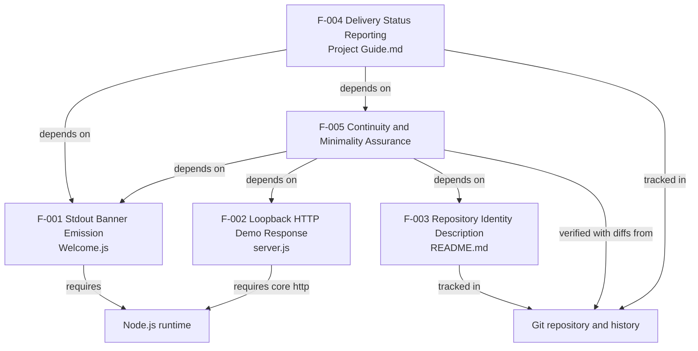
```mermaid
flowchart TD
    F001["F-001 Stdout Banner Emission<br/>Welcome.js"]
    F002["F-002 Loopback HTTP Demo Response<br/>server.js"]
    F003["F-003 Repository Identity Description<br/>README.md"]
    F004["F-004 Delivery Status Reporting<br/>Project Guide.md"]
    F005["F-005 Continuity and Minimality Assurance"]
    RT["Node.js runtime"]
    GIT["Git repository and history"]

    F005 -->|depends on| F001
    F005 -->|depends on| F002
    F005 -->|depends on| F003
    F004 -->|depends on| F001
    F004 -->|depends on| F005
    F001 -->|requires| RT
    F002 -->|requires core http| RT
    F003 -->|tracked in| GIT
    F004 -->|tracked in| GIT
    F005 -->|verified with diffs from| GIT
```

| Feature | Depends on | Dependency type | Basis |
|---|---|---|---|
| F-001 | None at runtime | — | No import, export, `require` or reference in either direction between the two executables |
| F-002 | None at runtime | — | As above; the service was already present at base `1484182` and was not modified |
| F-003 | None | — | Inert Markdown, read by humans only and never by code |
| F-004 | F-001, F-002, F-005 | Informational / evidence | The report's hours, gate counts and compliance matrix cite checks executed against those features |
| F-005 | F-001, F-002, F-003 | Obligation / verification | Continuity covers the two pre-existing files; minimality measures the product file's path and line |

Two consequences follow. The two executables can be run, changed in isolation, or reasoned about independently — a failure in one cannot propagate to the other, and this is why F-005 asserts non-impact by measurement rather than by design argument. And F-004 is the only consumer of the other features' evidence; nothing else in the system reads their results.

### 2.3.2 Integration Points

| Integration point | Features served | Mechanism | Constraint or recorded evidence |
|---|---|---|---|
| Developer shell and stdout | F-001 | Process invocation, stdout capture, pipe, exit status | Byte assertions must come from a pipe or captured file; a terminal's newline translation can report 19 bytes |
| Node.js runtime | F-001, F-002, F-005 | `node <file>`, `node --check`, whole-tree parse loop | 24.x reference line, 22.x supported floor (end of life 30 April 2027); v22.23.3 observed here; both files pass `node --check` |
| Git and the delivery path | F-001, F-003, F-004, F-005 | Tracking, diffs, commit history | Base `1484182`; tree gains `A Welcome.js` and `A blitzy/documentation/Project Guide.md`; product commit `1cef465` is `1 file changed, 1 insertion(+)`; merge `39974fd` is PR #15 |
| Loopback TCP `127.0.0.1:3000` | F-002 | HTTP over IPv4 loopback | Host and port are hardcoded with no override; reachability is local-machine-only |
| Markdown and mermaid rendering | F-003, F-004 | Human reading of the two documents | No runtime interface; nothing parses these files programmatically |
| Pre-existing service versus product runs | F-002 and F-001, measured through F-005 | Request latency sampled before, during and after repeated and concurrent product runs | Medians stayed at or below the idle baseline with no failed request; no latency, throughput or concurrency SLA is stated |

No other integration point exists: there is no package registry, CI service, deployment target, observability hook, identity provider, database, broker or message queue in or around the checkout, and nothing consumes this delivery automatically. Runtime version support is a documented convention, not an enforced pin — no `engines` field or version file exists to assert it.

### 2.3.3 Shared Components

| Shared component | Shared by | Nature of the sharing |
|---|---|---|
| Node.js runtime and its module classifier | F-001, F-002 | The only runtime element both executables touch. `Welcome.js` is module-neutral by construction; `server.js` is CommonJS through `require('http')` |
| Repository root placement | F-001, F-002, F-003 | All three pre-existing or delivered source/documents sit at depth 1; no subdirectory, no build output directory |
| Absence of a package manifest | All features | A shared constraint rather than a shared artefact: no `package.json`, lockfile or `node_modules` exists in the tree or in any ancestor directory |
| Git history | F-001, F-003, F-004, F-005 | The single record of what was added and what remained identical; the base commit is the reference for every continuity claim |

There is no shared source module, class, function, constant, configuration file or asset between F-001 and F-002. They share no symbol and no file content; the duplication that would normally create a maintenance coupling simply does not exist here.

One cross-cutting integration constraint deserves naming in this section because it spans F-001, F-002 and F-005: because `Welcome.js` declares no `import` or `export`, it runs identically whether the runtime classifies it as CommonJS or as an ES module, whereas `server.js` depends on being classified as CommonJS. A `package.json` declaring `"type": "module"` placed in or above the repository would therefore break F-002 at runtime while leaving F-001 working. That asymmetry is the reason the tree is deliberately kept manifest-free, and it is why any future manifest must declare `"type": "commonjs"` and be followed by a re-run of both files.

### 2.3.4 Common Services

| Common service | Consumers | Notes |
|---|---|---|
| Node.js interpreter | F-001, F-002 | The product's only execution requirement; no daemon, port or scheduler is involved |
| Git | F-001, F-003, F-004, F-005 | Carries the delivery and supplies every continuity and minimality proof |
| Documented nine-line acceptance gate (shell procedure) | F-001, F-005 | The only acceptance mechanism, since no automated suite exists: `node --test` reports 0 tests, 0 suites, 0 pass, 0 fail |
| Blitzy generation pipeline | F-004 | Produced the deliverable, the branch and the generated report; not a runtime dependency of any feature |

No logging, metrics, configuration, secret management, caching, messaging or authentication service exists, so no other common service can be shared. Everything the repository shares at runtime reduces to the interpreter, and everything it shares at delivery time reduces to version control and the documented gate.


## 2.4 Implementation Considerations

### 2.4.1 F-001 — Stdout Banner Emission

| Aspect | Consideration |
|---|---|
| Technical constraints | The file must remain one statement on one line (34 bytes, mode 0644) at the repository root under the exact casing `Welcome.js`; no `import`, `export`, `require`, declaration, comment or blank line; ES5-level syntax only; stdout is the sole outward channel; no argument, stdin, environment variable or file may be read; termination must stay natural, with no `process.exit()`, timer or retained handle. Any manifest, lockfile or `node_modules` is prohibited, in or above the tree |
| Performance requirements | One write followed by a natural exit. The guide records roughly 25–30 ms per run (guide §9.1); 0.021 s real was measured here. No throughput, concurrency or latency target is stated, and none is meaningful for a process that performs a single write |
| Scalability considerations | No scalability dimension exists: no state, no connection, no configuration and no shared resource. Concurrent invocations are independent processes — five simultaneous runs each emitted the banner with 18 bytes — so the only cost of scale is process spawn on the host |
| Security implications | There is no input to validate, no secret to manage, no socket to open and no dynamic code to evaluate, because the program reads nothing and imports nothing. That posture is the security property, and it is preserved only while zero dependencies and zero input channels remain. Two residual points are recorded: `console.log` does not raise when the destination stream cannot accept the write, so acceptance must assert captured bytes, and any future dependency, argument or input channel would create a surface this product does not have today |
| Maintenance requirements | Nothing guards the file automatically — `node --test` reports 0 tests by design — so the documented nine-line gate must be re-run on any change. The guide's own guidance is to add a small automated check only if the product ever grows beyond one statement. Runtime support is the host's lifecycle: the 22.x floor reaches end of life on 30 April 2027, after which the standardised 24.x line or later should be used, with no code change expected because nothing in the source is version-sensitive |

### 2.4.2 F-002 — Loopback HTTP Demo Response

| Aspect | Consideration |
|---|---|
| Technical constraints | The file is pre-existing and must stay byte-identical to base `1484182`; it stays CommonJS (`require('http')`), uses only the Node core `http` module, and hardcodes `hostname = '127.0.0.1'` with `port = 3000` and no override. There is no routing, body parsing, request logging, `'error'` listener on `listen`, or shutdown drain, and the file exports nothing. A manifest declaring `"type": "module"` in or above the tree would change its classification and break it at runtime |
| Performance requirements | None is stated for the service itself. Its only performance-related obligation belongs to F-005: runs of the product must not measurably affect it, and the recorded measurement showed request-latency medians at or below the idle baseline with stable memory, thread and descriptor counts |
| Scalability considerations | The service cannot be scaled as written: one hardcoded loopback port, no clustering, no configuration and no second instance — a concurrent start exits `1` with an unhandled `EADDRINUSE` stack trace. It is not operated as a service; the only accepted use is a short local run for continuity evidence |
| Security implications | Loopback binding is the only access control, and no authentication, authorization or TLS exists. Because the request object is ignored and no body is read or logged, no request data enters the process. Exposure is confined to the local host, and start-up failure prints a stack trace on stderr locally |
| Maintenance requirements | Three pre-existing robustness gaps are recorded in the guide's risk register and left as open owner decisions: the missing `'error'` listener, the absent graceful-shutdown drain, and the hardcoded port with no override. Nothing guards the file with automated coverage either, so its behaviour is re-verified by hand when continuity evidence is needed |

### 2.4.3 F-003 — Repository Identity Description

| Aspect | Consideration |
|---|---|
| Technical constraints | Plain Markdown, two lines, 58 bytes, with no trailing newline on the final line (so `wc -l` reports 1). It references no sibling file and provides no license, build, run or contribution guidance. It must remain byte-identical to base `1484182` |
| Performance requirements | None. The file is never read at runtime by any process in this repository |
| Scalability considerations | Not applicable |
| Security implications | None observed: the file contains no credential, endpoint, personal data or instruction that creates a runtime surface |
| Maintenance requirements | Keep the file unchanged. Any edit fails the continuity criterion, and adding documentation beyond this file and the generated report is an excluded class in the compliance sweep |

### 2.4.4 F-004 — Delivery Status Reporting

| Aspect | Consideration |
|---|---|
| Technical constraints | Markdown with mermaid pie charts; generated by the platform rather than by the product; 381 lines across ten sections and Appendices A–G. It is not executed and has no interface. It is the second path the tracked tree gained over base `1484182`, and its figures are anchored to a specific commit set |
| Performance requirements | None; nothing executes this document |
| Scalability considerations | Not applicable |
| Security implications | The document records no secret, credential or environment variable — Appendix E states outright that none is consumed — and it publishes only repository paths, a commit hash and a source hash. Its security content is a stated enumeration of the product's posture rather than a sampled assessment |
| Maintenance requirements | Regenerate or amend the report whenever requirements, hours or compliance outcomes change — most immediately when the language clause is settled, which the report already carries as an Issue / Impact / Owner / ETA row. Keep the hours reconciled (12.5 + 2.5 = 15.0, 83%) and label any figure derived from a different commit |

### 2.4.5 F-005 — Pre-existing Surface Continuity and Minimality Assurance

| Aspect | Consideration |
|---|---|
| Technical constraints | Enforcement is procedural, not programmatic: continuity is proved by `git diff` against base `1484182`, minimality by `git ls-files` and commit statistics, and non-impact by latency measurement. The base commit must remain reachable, and the standardised Node.js line must remain supported for the parse loop and gate to mean anything |
| Performance requirements | The performance criterion is the rule's third clause: runs of the product must not impact the pre-existing application. It is asserted by manual latency comparison, not by a load test, and the guide asserts no throughput, concurrency or latency SLA |
| Scalability considerations | Not applicable to the obligation itself, and minimality is the constraint that binds first: exactly one added path and one added line are at their ceiling, so any additional artefact — a waiver document, a manifest, a second source file — breaches the criterion before any capacity question arises |
| Security implications | The preserved posture is zero dependencies, zero inputs and zero secrets, and the risk register records that a future dependency, argument or input channel would create a security surface this product does not have. One procedural exposure is recorded: image captures written into the working tree during verification (approximately 2 MB in the generation environment) could enter a commit through a blanket `git add`, so the delivered path must be staged by name |
| Maintenance requirements | Four items remain, totalling 2.5 hours: the rule-governance decision (1.0 h, owner), branch publication and pull request (0.5 h — already landed as merge `39974fd`, PR #15), an owner-side acceptance re-run on the standardised Node line (0.5 h), and removal of the untracked capture directory before staging (0.5 h). Acceptance stays manual by design, so the documented gate is the maintenance procedure for every future change to the product file |

### 2.4.6 Cross-Cutting Constraints

| Constraint | Scope | Bearing |
|---|---|---|
| Runtime support horizon | F-001, F-002, F-005 | The 22.x floor's end of life on 30 April 2027 is the system's only dated maintenance obligation; version support is a documented convention, since no `engines` field or version file enforces it |
| Manifest-free tree | F-001, F-002, F-005 | The tree must stay free of `package.json`, lockfiles and `node_modules`; if a manifest ever becomes necessary it must declare `"type": "commonjs"`, and both files must be re-run afterwards |
| Module-classification asymmetry | F-001, F-002 | `Welcome.js` is module-neutral while `server.js` depends on CommonJS, so one manifest change can break the pre-existing service while leaving the product working |
| Manual acceptance | All features | No automated suite exists or is planned below one statement, so the nine-line gate is the acceptance and regression procedure, and every future change to the product file depends on someone running it |
| Excluded technology classes | All features | No package manager, linter, formatter, test runner, build tool, bundler, transpiler, container or CI tooling is declared or used; only the runtime's read-only `node --check` participates |
| Open governance item | F-005 | The rule's Python clause is unmet by recorded decision and can be closed only by wording — renaming the file, porting it, or adding a `welcome.py` beside it would each break a stated acceptance criterion |


## 2.5 Traceability Matrix and Constraints

### 2.5.1 Traceability Matrix

Every requirement in section 2.2 traces to an identifier or matrix row in `blitzy/documentation/Project Guide.md` and to an acceptance check whose observed result is recorded. The `Guide identifier` column names the guide's requirement identifiers (grouped as F- functional, N- non-functional, I- implicit) and, where applicable, the row of the twelve-row compliance matrix in guide §5.1.

| Requirement ID | Feature | Guide identifier · matrix row | Acceptance check and observed result |
|---|---|---|---|
| F-001-RQ-001 | F-001 | F-1, I-1 · row 1 | `node Welcome.js \| od -An -t x1` → `57 65 6c 63 6f 6d 65 20 74 6f 20 42 6c 69 74 7a 79 0a` (18 bytes) |
| F-001-RQ-002 | F-001 | F-2, I-2, I-4 · row 2 | `git ls-files \| grep -i welcome` → `Welcome.js` only; no `welcome.js`, `.mjs`, `.cjs` or `.py` variant exists |
| F-001-RQ-003 | F-001 | F-3, I-3 · row 3 | `node --check Welcome.js` → exit 0; whole-tree loop over tracked `.js` files parses both |
| F-001-RQ-004 | F-001 | F-4, I-5 · row 4 | `timeout 10 node Welcome.js; echo $?` → banner, exit 0; `node Welcome.js 2>&1 >/dev/null \| wc -c` → 0 |
| F-001-RQ-005 | F-001 | N-1 · row 5 | `wc -l -c Welcome.js` → `1` line, `34` bytes; one semicolon; final byte `0a` |
| F-001-RQ-006 | F-001 | N-2 · row 6 | Token scan of the single line → no `function`, `class`, `const`, `let`, `var`, `require`, `import`, `export` or `module.exports` |
| F-001-RQ-007 | F-001 | N-3 · row 7 | `ls package.json package-lock.json node_modules 2>/dev/null \| wc -l` → `0`; ancestor walk to `/` finds no manifest or lockfile |
| F-001-RQ-008 | F-001 | Guide §4, Appendix E | 18 bytes with extra arguments, with piped stdin, under `env -i`, and by absolute path from another directory |
| F-001-RQ-009 | F-001 | Guide §4 (output durability) | Pipe reader that waits before reading still receives all 18 bytes |
| F-001-RQ-010 | F-001 | I-6 · row 10 | Identical 18 bytes with no manifest, beside `"type":"module"`, beside `"type":"commonjs"`, and with an ancestor manifest of either type |
| F-001-RQ-011 | F-001 | N-5 · row 9 | One product file containing one statement; `grep` for `Welcome` in `server.js` and `README.md` → no reference |
| F-002-RQ-001 | F-002 | Guide §1.2.2, §4, Appendix B | `node server.js` → `Server running at http://127.0.0.1:3000/`, and a connection on port 3000 is accepted |
| F-002-RQ-002 | F-002 | Guide §4, Appendix B | `curl -i http://127.0.0.1:3000/` → `200`, `Content-Type: text/plain`, `Content-Length: 14`, body `Hello, World!\n`; identical for `/anything?x=1` and for `POST /` |
| F-002-RQ-003 | F-002 | Guide Appendix B | `server.js:3-4` fix `hostname = '127.0.0.1'` and `port = 3000`; `server.listen(port, hostname, …)` binds the loopback address, so requests succeed only locally |
| F-002-RQ-004 | F-002 | Guide §4 | After `SIGTERM` the port is free, no `node server.js` process remains, and requests fail with connection refused |
| F-003-RQ-001 | F-003 | Guide §1.3 continuity, row 11 | `git diff 1484182 -- README.md` → no lines; file holds the heading and the one-line purpose (58 bytes, last byte `.`) |
| F-004-RQ-001 | F-004 | Guide §1.2, §2.1–2.3, §5.1, §6 | Report present and tracked: hours ledger, gate table, twelve-row matrix, eight-row risk register |
| F-004-RQ-002 | F-004 | Guide §9.5, Appendix A | Each gate line carries its observed result; re-running the gate reproduces them; source hash matches `5c7ac141…c1fc` |
| F-005-RQ-001 | F-005 | Guide §1.3 continuity, §5.1 rows 2 and 8 | `git diff 1484182 -- README.md server.js` → 0 lines; service behaviour unchanged |
| F-005-RQ-002 | F-005 | N-3, row 7; row 11; minimality criteria | `git diff --name-status 1484182` → `A Welcome.js` plus the generated report; `1cef465` → `1 file changed, 1 insertion(+)`; every exclusion probe → 0 paths |
| F-005-RQ-003 | F-005 | N-4 · row 8; rule clause 3 | Latency medians before, during and after repeated and concurrent product runs at or below the idle baseline, no failed request, stable service resource counts |
| F-005-RQ-004 | F-005 | row 12; §5.2 divergence 1 | Read `6c16ea2` message and guide §5.2: language clause not met by decision; clause 2 (separation) and clause 3 (non-impact) met |
| F-005-RQ-005 | F-005 | Guide §3, §9.5; §5.2 divergence 3 | All nine gate lines reproduce on a supported runtime line; `node --test` → 0 tests; `git status --porcelain --untracked-files=all` → empty in this checkout |

Reconciliation note: the guide's compliance matrix enumerates fifteen requirement identifiers across three groups (F-1…F-4, N-1…N-5, I-1…I-6) and reports 11 PASS with 1 NOT MET across its twelve benchmarks, while its headline summary states that 17 of 17 requirements were met and 19 of 20 scoped acceptance items were closed (guide §1.4, §8). This section resolves the difference by treating the implicit verification flows the guide records separately — input indifference, output durability, the service's request matrix and the exclusion sweeps — as first-class, separately testable requirement rows, which is how F-001-RQ-008, F-001-RQ-009 and the F-002 rows appear above without a one-to-one guide identifier.

**Acceptance gate flow.** The gate is the procedure that decides acceptance, and it is a checklist rather than an automated pipeline.

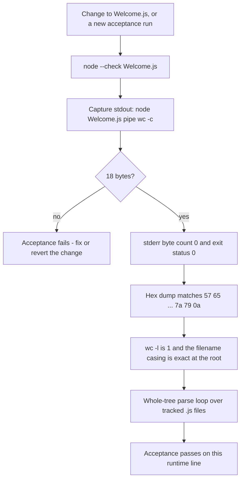
```mermaid
flowchart TD
    START["Change to Welcome.js, or a new acceptance run"] --> PARSE["node --check Welcome.js"]
    PARSE --> BYTES["Capture stdout: node Welcome.js pipe wc -c"]
    BYTES --> Q18{"18 bytes?"}
    Q18 -->|no| FAIL["Acceptance fails - fix or revert the change"]
    Q18 -->|yes| ERR["stderr byte count 0 and exit status 0"]
    ERR --> HEX["Hex dump matches 57 65 ... 7a 79 0a"]
    HEX --> MIN["wc -l is 1 and the filename casing is exact at the root"]
    MIN --> TREE["Whole-tree parse loop over tracked .js files"]
    TREE --> PASS["Acceptance passes on this runtime line"]
```

### 2.5.2 Requirement Baseline and Versioning

| Item | Value |
|---|---|
| Requirement baseline version | 1.0 — the first recorded baseline for this specification |
| Features covered | F-001…F-005, the complete capability set observed in the checkout; nothing is proposed beyond it |
| Requirement rows | 23 rows: F-001 (11), F-002 (4), F-003 (1), F-004 (2), F-005 (5) |
| Source of record | `Welcome.js` sha256 `5c7ac141d94f92056efb756f17335252c31e3d08d509e641d76512f73112c1fc`; `server.js` sha256 `332fc2d04eb5b8f3cb230855457af80d0dfc246f958d6e49615610d656acc2e0`; `README.md` sha256 `2c907195c3aabc9616d6dda07b61af3da480287eb5b5dde62974df6a182d7b45` |
| Baseline commits | Product addition `1cef465`, record-only rationale `6c16ea2`, generated report `4d1256c`, merge `39974fd` (PR #15); pre-project base `1484182` |
| Versioning rule | A requirement's version advances only when its acceptance criteria change. Because every row above is verified against the hashes and commit set listed here, any byte change to `Welcome.js`, `README.md` or `server.js` invalidates the affected rows and requires the documented gate to be re-run and the baseline re-issued |
| Baseline status | All 23 rows are delivered and verified against the recorded evidence. The one exception in the compliance record is not a requirement failure but the project rule's language clause (matrix row 12), which F-005-RQ-004 documents as unmet by decision |

Related specifications and references for these requirements: guide §9.5 (the acceptance gate in full), §5.1 (compliance matrix), §5.2 (divergences), §6 (risk register), §9.7 (troubleshooting, including the wrong-casing and 19-byte symptoms), and Appendices A–G; and, within this document, section 1.2 (system overview and success criteria), section 1.3 (scope boundaries and exclusions) and sections 2.3 and 2.4 for the relationships and implementation constraints those requirements depend on.

### 2.5.3 Assumptions

| ID | Assumption | Effect if it does not hold |
|---|---|---|
| A-001 | A supported Node.js LTS line is installed on the host (24.x reference, 22.x floor; v22.23.3 observed here) | Nothing runs: the run, parse and whole-tree checks all fail with `node: command not found` |
| A-002 | The filesystem preserves the delivered casing and the file remains at repository-root depth 1 | A casing or placement error passes locally on a case-insensitive filesystem and fails elsewhere; `git ls-files` is the check that catches it |
| A-003 | Acceptance is performed by a human running the documented gate | No regression net exists at all — the repository contains no test file, and `node --test` reports zero tests |
| A-004 | Standard output is a stream the process can write to | `console.log` does not raise on stream failure, so the message can be lost while the exit status still reads 0; captured bytes, not status, are the assertion |
| A-005 | Base commit `1484182` stays reachable in the repository history | Continuity of `README.md` and `server.js` can no longer be proved by diff |
| A-006 | The product request's explicit language and filename instruction governs over the project-wide Python rule | The recorded divergence (F-005-RQ-004, matrix row 12) would have to be revisited; no code change can satisfy both instructions at once |
| A-007 | The requirement set is stable at merge `39974fd`, with the four remaining items affecting delivery process rather than the artefact | Requirements would need re-baselining; the four items total 2.5 hours and three of them are procedural |
| A-008 | The runtime's module classifier defaults behave as observed when no manifest is present | Module neutrality removes this dependency for `Welcome.js`, which is why the file declares no `import` or `export`; `server.js` still relies on CommonJS classification |

### 2.5.4 Constraints

| ID | Constraint | Type | Bearing |
|---|---|---|---|
| C-001 | Source is one line, 34 bytes, one statement, no comment | Design — minimality | At its ceiling; any added line breaches N-1 and the style contract |
| C-002 | Exactly one product path and one product line added to the repository | Delivery — minimality | Stage the product path by name; a blanket `git add` risks committing a second artefact |
| C-003 | No manifest, lockfile, `node_modules` or dependency in or above the tree | Technical | Preserves the zero-install posture and the CommonJS classification of `server.js` |
| C-004 | Filename `Welcome.js`, exact casing, repository root, mode 0644 | Technical | Verified with an exact-case listing; case-sensitive systems expose any deviation |
| C-005 | Natural termination only — no `process.exit()`, timer or retained handle | Technical | Guarantees queued output is never truncated |
| C-006 | No input channel: no argument, stdin, environment variable, file or socket is read | Security | The zero-input, zero-dependency posture is the product's entire security property; a new input is a scope change |
| C-007 | ES5-level, module-neutral, core-modules-only source | Technical | Keeps the code valid across both supported Node.js lines with no version-sensitive syntax |
| C-008 | `README.md` and `server.js` are read-only for this project | Delivery — continuity | Any edit fails F-005-RQ-001 and the guide's continuity evidence |
| C-009 | The service binds IPv4 loopback only, with port 3000 hardcoded and no override | Technical — pre-existing | Reachability is local-machine-only, and a second instance exits `1` with `EADDRINUSE` |
| C-010 | The project rule's language clause is unmet by recorded decision | Governance | Closure is a wording decision (amend, narrow or waive); renaming, porting or adding a second artefact would each break a stated criterion |
| C-011 | The supported runtime floor's end of life falls on 30 April 2027 | Operational | A maintenance decision rather than a code change; the standardised 24.x line or later is the mitigation |
| C-012 | Acceptance is manual by design, with no automated suite | Operational | Every change to the product file depends on someone running the nine-line gate |


## 2.6 References

- `Welcome.js` — the delivered product: one statement, 34 bytes; established the exact output contract, the minimality ceiling, the zero-install and module-neutral posture, and the sha256 `5c7ac141d94f92056efb756f17335252c31e3d08d509e641d76512f73112c1fc`
- `server.js` — the pre-existing CommonJS HTTP demo service: established the loopback binding, the fixed 14-byte response, the port-conflict failure mode, and the byte-identical continuity evidence
- `README.md` — the pre-existing repository identity stub: established the two-line identity content and the continuity obligation for the pre-existing surface
- `blitzy/documentation/Project Guide.md` — the generated status and completion report: established the capability set (§1.2.2), the scoped requirements and open item (§1.4), the hours ledger (§2), the 42-check gate (§3), the runtime verification flows (§4), the twelve-row compliance matrix and three divergences (§5), the eight-row risk register (§6), the nine-line acceptance gate (§9.5), troubleshooting (§9.7) and Appendices A–G
- `blitzy/` — the platform working folder holding the generated documentation; contained no code, manifest or tooling of its own
- `blitzy/documentation/` — the folder holding the single generated report; established the absence of any other documentation artefact in the checkout
- repository root (`""`) — the folder listing used to confirm the complete file inventory and the absence of manifests, lockfiles, `node_modules`, CI, container and configuration files


# 3. Technology Stack

## 3.1 Programming Languages

The whole system is written in one language, JavaScript, and executed by one runtime, Node.js. There is no second language, no compiled artefact and no intermediate representation: the two tracked `.js` files are the source and the executable program at the same time.

| Component / platform | Language | Version or level | Evidence |
|---|---|---|---|
| Product script `Welcome.js` | JavaScript | ES5-level syntax — one member call on a runtime global plus one string literal | `Welcome.js` (1 line, 34 bytes); `blitzy/documentation/Project Guide.md` §10 Appendix D |
| Pre-existing HTTP service `server.js` | JavaScript, CommonJS module form | Uses only `require('http')` from the Node core; unmodified by this work | `server.js:1-15`; Project Guide §10 Appendix C |
| Repository documentation `README.md` | Markdown | Plain text, no code fences | `README.md` (2 lines, 58 bytes) |
| Delivery report `blitzy/documentation/Project Guide.md` | Markdown with fenced `bash` and `mermaid` blocks | Mermaid pie charts at lines 9–13, 181–185 and 191–197; command blocks at lines 229–300 | Project Guide §7, §9, §10 |
| Verification interface (not a product language) | POSIX shell | The nine-line acceptance gate, run in a shell that supplies pipes, redirection, `env -i` and exit-status capture | Project Guide §9.5, §10 Appendix A |

**Runtime versions.** The guide pins the language to a Node.js line rather than to a language edition: Node.js **v24.21.0** is the reference line and **v22.23.2** is the supported floor, whose end of life is recorded as 30 April 2027 (Project Guide §10 Appendix D, §6). The inspection environment used for this specification runs **v22.23.3** at `/usr/bin/node`, and both tracked `.js` files parse on it (`node --check`). Because the source stays at ES5 syntax level, no language feature ties the artefact to a particular line.

**Justification for the choices.**

- **JavaScript rather than Python.** The product request named both the language and the filename in the same instruction, and the governing plan followed the specific instruction over the general project rule; the rationale is recorded in the history as the record-only commit `6c16ea2` and in the report as divergence 1 of Project Guide §5.2. The compliance matrix accordingly records the rule's Python clause as **NOT MET by recorded decision** (row 12, the one non-passing benchmark of twelve), while no `*.py` file exists anywhere in this branch's tree. Repository-wide context: other branches of the same GitHub repository do carry Python implementations of the same deliverable — commits such as `2703975` ("add stdout fidelity suite for Welcome.py") and `c14e574` ("Make the tracked tree Python-only") — so the language decision is per-branch, not repository-wide. It remains the single open governance item (1.0 h, owner-owned) and cannot be closed by any code change, since a port would break the required filename and a second artefact would break the one-file ceiling.
- **Zero-install posture.** The language was used at its smallest possible surface: `console` is a runtime global and `server.js`'s only import is the core module `http`, so no dependency graph, package manager, virtual environment or build step exists (Project Guide §9.3). `ls package.json package-lock.json node_modules` returns 0 paths in the tree and in every ancestor directory.
- **ES5 syntax level.** Nothing version-sensitive is used, which is what allows the same bytes to run on the 22.x floor and the 24.x reference line, and is why the guide expects no code change when the floor retires (Project Guide §6).
- **Module-neutral source for the deliverable.** `Welcome.js` declares no `import` or `export`, so the runtime may classify it as CommonJS or as an ES module with identical behaviour; `server.js` deliberately keeps CommonJS (`const http = require('http');`). The asymmetry matters: a `package.json` declaring `"type": "module"` in or above the tree would break `server.js` while leaving the product working (Project Guide §6).

**Constraints and dependencies carried by the language choice.**

| Constraint | Binding effect |
|---|---|
| Runtime presence | Node.js is the only external prerequisite — "no other software is required" (Project Guide §9.1); there is no package manager, database, container or network requirement |
| No version enforcement | No `engines` field, `.nvmrc` or version file exists on this branch, and a repository-wide history scan finds none on any ref, so runtime support is a documented convention rather than an enforced one; the 22.x floor's end of life on 30 April 2027 is the system's only dated obligation |
| Source style contract | Single-quoted literal, terminating semicolon, no indentation, no comment, no blank line, one trailing LF, file mode `0644`, exact filename casing `Welcome.js` at the repository root (Project Guide §10 Appendices C and F; compliance rows 2 and 5) |
| Process lifecycle | Termination must stay natural — no `process.exit()`, timer or retained handle — so queued stdout is never truncated (compliance row 4) |
| Output channel semantics | The language's `console.log` does not raise when the destination stream cannot accept the write, so a full or closed destination loses the message while the process still exits `0`; acceptance therefore asserts captured bytes (Project Guide §3, "Not Covered") |
| No input surface | The language is used without any input mechanism: no argument parsing, no `readline`, no `process.env`, no filesystem read (Project Guide §10 Appendix E) |

**Rejected candidate languages.** The default stack suggested for this project names Python with Flask for the backend, TypeScript for the web and cross-platform front ends, and Swift, Kotlin, Objective-C and Electron for native and desktop targets. None applies here: this system has no HTTP API of its own, no user interface, no client platform and no installable application, and its entire observable surface is one line of stdout plus, on the pre-existing server, one fixed HTTP response. A case-insensitive sweep of every tracked file for those technologies returns no hits, and the only occurrence of `npm` in the repository is the instruction not to run it (Project Guide §9.2).

## 3.2 Frameworks &amp; Libraries

The system has no application framework and no third-party library. Its entire platform is what the Node.js runtime already provides: one core module (`http`, used only by the pre-existing server) and one runtime global (`console`, used by the product).

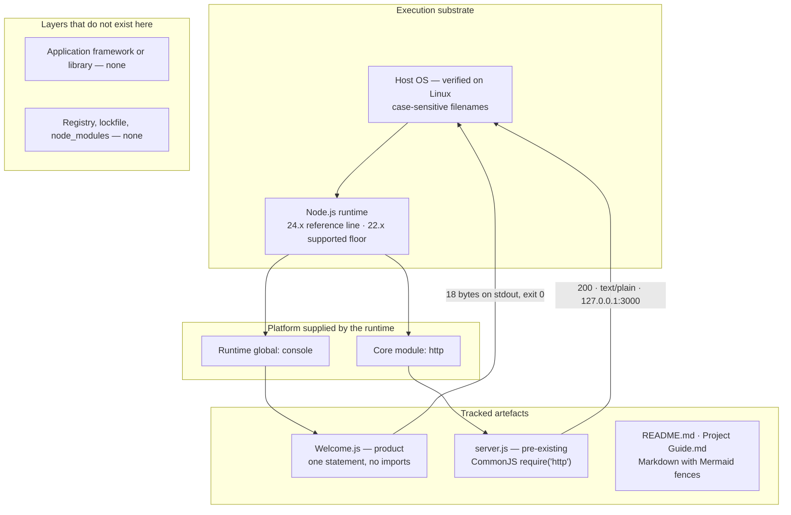
```mermaid
flowchart TB
    subgraph L1["Execution substrate"]
        OS["Host OS — verified on Linux<br/>case-sensitive filenames"]
        RT["Node.js runtime<br/>24.x reference line · 22.x supported floor"]
        OS --> RT
    end
    subgraph L2["Platform supplied by the runtime"]
        Glob["Runtime global: console"]
        Core["Core module: http"]
    end
    subgraph L3["Tracked artefacts"]
        W["Welcome.js — product<br/>one statement, no imports"]
        S["server.js — pre-existing<br/>CommonJS require('http')"]
        D["README.md · Project Guide.md<br/>Markdown with Mermaid fences"]
    end
    subgraph L4["Layers that do not exist here"]
        A1["Application framework or library — none"]
        A2["Registry, lockfile, node_modules — none"]
    end
    RT --> Glob
    RT --> Core
    Glob --> W
    Core --> S
    W -->|"18 bytes on stdout, exit 0"| OS
    S -->|"200 · text/plain · 127.0.0.1:3000"| OS
```

**Framework and library inventory.**

| Layer | Framework or library | Version | Role in this system | Evidence |
|---|---|---|---|---|
| Application framework | None | — | There is nothing to host, route, schedule or inject: the product is one statement executed once | `Welcome.js` (1 line); Project Guide §10 Appendix F |
| HTTP framework | None | — | `server.js` calls the core module directly — `http.createServer` with a single inline listener; no Express, Koa, Fastify or similar layer exists | `server.js:1, 6-10` |
| CLI framework | None | — | No argument parsing exists; passing extra arguments leaves the output byte-identical | Project Guide §10 Appendix E |
| Test framework | None | — | `node --test` is the runtime's own built-in runner and reports 0 tests; acceptance is the manual gate, not a framework | Project Guide §3, §10 Appendix F |
| UI or client framework | None | — | No user interface, screen, component or template exists; the observable surface is one line of stdout | Project Guide §4 |
| Core module actually used | Node.js `http` (built in) | Versioned with the runtime — v24.21.0 reference, v22.23.2 floor | Binds `127.0.0.1:3000` and returns the fixed `text/plain` response | `server.js:1, 12-14` |
| Runtime global actually used | `console` (built in) | Versioned with the runtime | The product's only API call: `console.log('Welcome to Blitzy')` | `Welcome.js` (1 line); Project Guide §10 Appendix D |
| Diagram syntax in documentation | Mermaid | Rendered from fenced blocks by the documentation tooling; no Mermaid package, binary or configuration exists in the tree | Three `pie` charts in the generated report | `blitzy/documentation/Project Guide.md` §7 (fences at lines 9–13, 181–185, 191–197) |

**Compatibility requirements.**

| Requirement | Binding value | Evidence |
|---|---|---|
| Runtime line | Node.js 24.x (reference line) or 22.x (supported floor, end of life 30 April 2027) | Project Guide §10 Appendix D, §6 |
| Runtime observed during this specification | v22.23.3 at `/usr/bin/node`, with the core `http` module reachable | Verified in the inspection environment |
| Module system | CommonJS in `server.js` (`require`); `Welcome.js` is module-neutral and correct under either classification | `server.js:1`; compliance matrix row 10 |
| Syntax level | ES5 — no construct newer than it is used, so nothing is version-sensitive | Project Guide §10 Appendix D |
| Package manager | None required or permitted: `npm install`, `npm init` and `npm ci` must not be run. `npm` 11.18.0 exists on the inspection host but is never invoked by the system | Project Guide §9.2, §9.3 |
| Manifest and lockfile | None in the tree or in any ancestor directory; if a manifest ever becomes necessary it must declare `"type": "commonjs"` and both files must be re-run, because `"type": "module"` would break the pre-existing server | Project Guide §6, compliance matrix row 7 |

**Justification for each major choice.**

- **No framework in the product.** A framework exists to impose structure on logic that has scale; this product is a single statement whose entire contract is 18 bytes on stdout, so a framework would add a manifest, a dependency graph and an install step to a program that currently runs as written. That step is explicitly excluded: the zero-install criterion (compliance row 7) requires the file to run with no dependency resolution, and the excluded-artefact sweep (row 11) names dependency manifests and `node_modules` as artefacts the repository must not contain. The framework question is therefore closed by the acceptance criteria rather than by preference.
- **No framework retrofit on the pre-existing server.** `server.js` stays byte-identical to base `1484182`, so even though its gaps are recorded — no `'error'` listener on `listen`, no graceful-shutdown drain, port `3000` hardcoded — the fix is an owner decision outside this deliverable, not a framework migration (Project Guide §6).
- **Core modules instead of a package.** The core `http` module is the platform-supplied alternative to a routing library, and at this scale it satisfies the requirement exactly: a single listener that ignores the request and answers every method and path identically. Choosing it is what keeps the runtime the only prerequisite (Project Guide §9.1: "No other software is required").
- **Mermaid only where it documents.** The three `pie` charts in the generated report are diagram source rendered from fences; no Mermaid dependency was added to the tree, which keeps the diagram layer outside the runtime entirely (Project Guide §7).
- **Rejected candidate frameworks from the default stack.** Flask, React with TypeScript, TailwindCSS, React Native, Electron, Swift, Kotlin and Objective-C have no presence whatsoever: a case-insensitive sweep of all tracked content returns no hit for any of them, and the system exposes no API, component tree or client platform for such a framework to serve (verified against the four tracked paths).

**Repository-wide context.** Other branches of the same GitHub repository, produced by separate generation runs, do introduce npm-based tooling for a larger variant of the same task: `package.json` manifests with `engines` floors of `>=18`, `>=22.0.0 <23.0.0` and `>=22.22.2`, npm scripts delegating to the built-in `node --test` runner (`"test": "node --test"`, `"test:coverage": "node --test --experimental-test-coverage"`), a zero-dependency `package-lock.json` at `lockfileVersion` 3, and one devDependency, `autocannon ^8.0.0` — all on commits such as `b9673c1`, `e06de51`, `f1ed6a7` and `d395573`, none of them reachable from this branch's HEAD `39974fd`. They describe what the repository's other variants do, not what this system runs: on this branch the dependency count is zero and the framework layer is intentionally empty.

## 3.3 Open Source Dependencies

The system consumes no open-source package. Its dependency count is zero in both directions: `Welcome.js` calls only the `console` global and `server.js` imports only the core module `http` (`server.js:1`), so there is no direct dependency, no transitive dependency, no lockfile to resolve them from and no registry to contact.

| Dependency class | Count | Evidence |
|---|---:|---|
| Direct runtime dependencies | 0 | `Welcome.js` (1 line, no import or require); `server.js:1` requires only `http` |
| Transitive dependencies | 0 | None can exist without a direct dependency graph; the report states outright that "there is no dependency graph to resolve" (Project Guide §9.3) |
| Manifests, lockfiles and `node_modules` | 0 | `ls package.json package-lock.json node_modules` → 0 paths; the same probe finds nothing in any ancestor directory |
| Package-manager configuration | 0 | No `.npmrc`, `.nvmrc`, `yarn.lock` or `pnpm-lock.yaml` anywhere in the tree; only `.git` is hidden at the root |
| Third-party services providing code | 0 | No CDN, no vendored bundle, no `vendor/` directory, no submodule |

**Registry and versions.** The Node.js ecosystem's registry of record is npm, and it is never used here: the runtime is the only third-party component the system depends on, and it is supplied by the host rather than installed by the project. Two runtime lines are recorded — Node.js **v24.21.0** as the reference line and **v22.23.2** as the supported floor (Project Guide §10 Appendix D) — and the built-in modules the code uses are versioned with whichever line is executing, which is why the source can be described as free of version pinning. Nothing in the tree pins, ranges or hashes a package version, because nothing is a package.

**Deliberate prohibition.** The absence is a requirement, not an oversight, and the repository says so in three places: `npm install`, `npm init` and `npm ci` must not be run because adding a `package.json`, a lockfile or `node_modules` breaks a stated acceptance criterion (Project Guide §9.2); the developer-tools table marks the package manager "Not used" for the same reason (§10 Appendix F); and the compliance matrix scores the excluded-artefact sweep as a pass precisely because "no manifest, lockfile, `node_modules`, test file, CI, container, environment or Python artifact exists" (row 11). The one-added-file and one-line ceilings reinforce it: a second artefact of any kind would breach a criterion the request made binding (Project Guide §8, "Minimality criteria").

**Security implications of the zero-dependency posture.** Because no third-party code is present, there is no published advisory to track, no transitive version to upgrade, no lockfile to audit, no provenance or typosquatting exposure, and no install-time script that could execute. The report is explicit that this is the property being preserved rather than an incidental benefit: "a future change that introduces a dependency, a command-line argument or an input channel would create a security surface this product does not have today", with the mitigation being to treat any proposed dependency as a scope change to be agreed first (Project Guide §6). File permissions on the delivered source are `0644`, and the product reads no configuration or environment value (Project Guide §10 Appendix E).

**Integration requirements created by the choice.** None beyond the runtime: there is no install step, no cache to warm, no offline-registry mirror to configure and no lockfile to reproduce. The corollary is that the runtime must be present for any execution or verification to happen at all (Project Guide §9.1), and that the manifest-free state is itself an integration constraint — if a manifest ever became necessary, it would have to declare `"type": "commonjs"` and both files would have to be re-run, because `"type": "module"` would break the pre-existing server while leaving the product working (Project Guide §6).

**Repository-wide context.** Other branches of this repository, from separate generation runs, do use npm as a registry of record for a larger variant of the same task. The evidence: commits `b9673c1` ("chore: add zero-dependency package.json governance manifest") and `c04438c`/`cffb149`/`d395573`, which add a `package-lock.json` at `lockfileVersion` 3 with an empty package set to enable a plain `npm audit`, and `e06de51`, which adds npm test scripts and one devDependency, `autocannon ^8.0.0`. Not one of those commits is reachable from this branch's HEAD `39974fd`, and no `package.json` or lockfile exists in this checkout; they document the repository's other variants, not this system.

## 3.4 Third-Party Services

No third-party service participates in this system at runtime. The product performs no outbound call of any kind, and the pre-existing server only answers requests on the loopback interface; the services that do appear in the picture belong to the delivery pipeline, not to the software.

| Service class | In use | Evidence |
|---|---|---|
| External APIs consumed | No | `Welcome.js` makes one call to the `console` global; `server.js` only serves. No HTTP client, `fetch`, `https.request`, DNS lookup or socket connection appears in either file |
| Package registry | No | No manifest, lockfile or `.npmrc`; the registry is never contacted (Project Guide §9.3) |
| Authentication / identity provider | No | No Auth0, OIDC, OAuth or token exchange exists; the report records that the product "consumes no environment variable, secret, credential, endpoint or database, and needs no privileged resource" (Project Guide §1.5) |
| Monitoring, logging or APM service | No | No SDK, agent or log shipper is installed or referenced; the system's entire observable signal set is stdout, stderr and the exit status, as used by the acceptance gate (Project Guide §10 Appendix A) |
| Cloud platform or managed service | No | No AWS, Azure or GCP surface exists — no credentials, endpoints, region configuration or SDK; the report states that no network access is required at all (Project Guide §9.1) |
| Database, cache or message broker | No | The report lists these explicitly among the things that are **not** required: "no package manager, no virtual environment, no database, cache, broker or container, and no network access" (Project Guide §9.1) |
| Container or orchestration service | No | No container definition exists on this branch, and none has ever existed in the repository — a history scan across all refs for `Dockerfile`, `docker-compose.yml` and `.github/workflows` returns nothing |
| Content delivery or font/asset host | No | The documentation is plain Markdown rendered from the repository; no badge, link or remote asset reference appears in `README.md` or the report |

**Services in the delivery pipeline (not runtime integrations).**

| Service | Role | Evidence |
|---|---|---|
| GitHub | Hosts the repository and carries the delivery: the working branch `05-Oct-26-Br1` tracks `origin/05-Oct-26-Br1`, whose tip is `39974fd` — "Merge pull request #15" — and the base commit `1484182` (2026-03-12) is the pre-project state | `git remote -v` → `github.com/ajitblitzy/Ajit_GH_Repo-12-Mar-26.git`; `git log --oneline -5` |
| Blitzy generation platform | Generated the source change, the report `blitzy/documentation/Project Guide.md` and the generation branch `blitzy-e2f602a0-05aa-4abd-9177-dc7377485002` referenced by the setup instructions | Project Guide §5.2 (branch and generation provenance), §9.2 |
| Git protocol access with an injected token | The checkout's `origin` URL carries a short-lived access token as its user-info component, injected by the platform so the delivery can be pushed; it lives only in `.git/config` | Observed in `git remote -v` output during this specification; the token value is deliberately not reproduced here, and it appears in no tracked file |

**Authentication and access posture.** The product has no authentication surface at all, and the only access control anywhere in the system is the loopback bind of the pre-existing server: `hostname = '127.0.0.1'` with port `3000` hardcoded (`server.js:3-4`), recorded in the report's port reference as "Loopback only" with "no environment override" (Project Guide §10 Appendix B). No API key, bearer token, certificate, service account or secret is read by either file, and no `process.env` access exists (Project Guide §10 Appendix E). The one credential observed during this specification is the pipeline's Git token in the checkout's remote configuration — credential material that is environment-provided, absent from every tracked path, and outside the system's runtime.

**Integration requirements.** There are none to provision: no endpoint to register, no key to issue, no region to select, no webhook to configure, no allow-list to open and no service quota to respect. Execution requires only a supported Node.js runtime on the host (Project Guide §9.1), and verification additionally requires a shell for the gate commands (Project Guide §9.5). The pre-existing server is reachable only from the machine it runs on, so no external client can depend on it.

**Security implications.** With no outbound call, no credential read and no inbound authenticated surface, the system has no third-party data flow to audit and no trust boundary to cross at runtime; the report's risk register treats the introduction of any dependency or integration as a scope change because it "would create a security surface this product does not have today" (Project Guide §6). Residual points, all recorded rather than remediated: the demo server has no authentication, authorization or TLS, so loopback binding is its only protection; its start-up failure path prints a stack trace locally; and the pipeline's Git credential, being scoped to the checkout rather than to the project, is a delivery-time rather than a runtime exposure.

## 3.5 Databases & Storage

The system has no database, no cache, no queue, no object store and no file output. Every value it handles is a literal compiled into the source, so the storage layer is not merely unused — it does not exist at any point in either execution path.

| Storage class | Present | Evidence |
|---|---|---|
| Primary relational or document database | No | No driver, connection string, query or schema appears in `Welcome.js` or `server.js`; the report lists "no database, cache, broker or container" among the things not required (Project Guide §9.1) |
| Secondary or auxiliary database | No | There is no second datastore of any kind to pair with a primary one |
| Cache (in-process or external) | No | No memoisation, TTL, key store or cache client exists; the demo server sets only `Content-Type: text/plain` — no `Cache-Control`, `ETag` or `Last-Modified` (`server.js:7-8`) |
| Message queue or event broker | No | No producer, consumer, topic or subscription exists; the system has no asynchronous work to hand off |
| Object or blob storage | No | No bucket, volume, mount or upload path exists; the product writes nothing but stdout |
| Local file writes by the software | No | `Welcome.js` opens no file; `server.js` reads no file; repeated and concurrent runs "modify no tracked file" and leave no residue (Project Guide §4) |
| Session, cookie or token store | No | The pre-existing server ignores the request object entirely and returns a fixed response, so no state survives a request (`server.js:6-10`) |

**Data the system actually holds.** Two string literals, both fixed at authoring time: `'Welcome to Blitzy'` in `Welcome.js` (34 bytes on disk including the statement) and `'Hello, World!\n'` in `server.js:9` (the 14-byte response body). Nothing else is stored, read, derived or transformed — there is no input channel to bring data in (no argument, stdin, environment variable, socket or file for the product, per Project Guide §10 Appendix E) and no channel other than stdout through which data leaves.

**Persistence strategy.** Runtime persistence is deliberately absent: the product's contract is one write followed by a natural exit, so there is nothing to commit, flush, fsync or recover, and therefore no transactional, consistency or durability requirement to meet. What persists is the source itself, and that persistence is provided by Git rather than by the application:

| Persistent record | Mechanism | Content |
|---|---|---|
| The product and its history | Git, on the tracked branch | `1cef465` adds the one line of `Welcome.js` (1 file changed, 1 insertion); `6c16ea2` records the language decision with no byte change; merge `39974fd` (PR #15) carries it to the branch tip |
| The pre-existing surface | Git, unchanged since base `1484182` | `README.md` and `server.js` are byte-identical to their pre-project state (Project Guide §4, compliance row 11 of §5.1) |
| The delivery record | Markdown file in the repository | `blitzy/documentation/Project Guide.md`, 381 lines, generated by the platform; 35,992 bytes on disk |
| Working-tree residue during verification | Filesystem only, untracked | Seven PNG browser captures under `blitzy/screenshots/` (about 2 MB) recorded in Project Guide §5.2 divergence 3 as untracked artefacts to delete before staging; this checkout contains none of them, and the tracked tree gains exactly one file |

**Caching and performance implications.** With no cache and no storage, the only latency on either path is process start-up for the product (roughly 25–30 ms per run, Project Guide §9.1) and an in-memory constant response for the server. The absence of state is also what makes the recorded non-impact measurement hold: repeated and concurrent runs of the product leave the pre-existing service's memory, thread and descriptor counts stable and its request-latency medians at or below the idle baseline (Project Guide §4).

**Integration requirements.** Nothing to provision or connect: no connection string, credential, schema migration, backup job, retention rule or replication setting. The system's relationship with the filesystem is read-only for the software itself — the tracked files carry mode `0644` and neither executable writes one.

**Security implications.** Because no data is persisted, there is no data-at-rest to encrypt, no personal or regulated data to classify, no snapshot or backup to secure, no retention or deletion obligation to honour, and no store to be breached or corrupted. The pre-existing server never reads or logs the request, so no request data enters or survives the process, and the loopback bind limits who can reach it at all (`server.js:3-4`; Project Guide §10 Appendix B). The one storage-related exposure the report does record is procedural rather than architectural: untracked capture images left in the working tree could enter the repository through a blanket `git add`, which is why the delivered path must be staged by name (Project Guide §5.2, §6).

## 3.6 Development & Deployment

Development and deployment for this system are deliberately thin: the source is the artefact, delivery is a Git commit and a pull-request merge, and there is no build, package, container or pipeline stage to run. The report states the posture in one line — "The product is run, not deployed" (Project Guide §10 Appendix F).

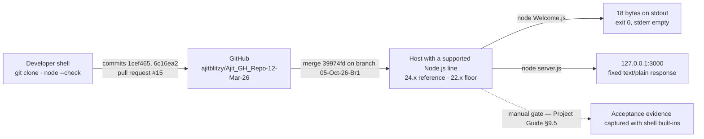
```mermaid
flowchart LR
    Dev["Developer shell<br/>git clone · node --check"] -->|"commits 1cef465, 6c16ea2<br/>pull request #15"| GH["GitHub<br/>ajitblitzy/Ajit_GH_Repo-12-Mar-26"]
    GH -->|"merge 39974fd on branch 05-Oct-26-Br1"| Host["Host with a supported Node.js line<br/>24.x reference · 22.x floor"]
    Host -->|"node Welcome.js"| Out["18 bytes on stdout<br/>exit 0, stderr empty"]
    Host -->|"node server.js"| Svc["127.0.0.1:3000<br/>fixed text/plain response"]
    Host -.->|"manual gate — Project Guide §9.5"| Ev["Acceptance evidence captured with shell built-ins"]
```

**Development tools.**

| Tool | Status | Role and evidence |
|---|---|---|
| Node.js runtime | Used — v24.21.0 reference line, v22.23.2 supported floor; v22.23.3 observed during this specification | The only prerequisite for running or verifying the product; "No other software is required" (Project Guide §9.1) |
| `node --check` | Used | The repository's only automated check: a read-only parse gate that installs nothing and covers both tracked `.js` files (Project Guide §9.5, §10 Appendix A) |
| Git | Used — 2.43.0 observed in the inspection environment | Version control, continuity proof against base `1484182`, and the delivery mechanism (commit, branch, pull request) |
| Shell utilities | Used — `wc`, `od`, `sha256sum`, `ls`, `find`, `grep`, `timeout`, `env`, pipes and redirection | Every assertion in the acceptance gate is a shell command whose output is read by a human or a script (Project Guide §9.5, §10 Appendix A) |
| Package manager (`npm`, `yarn`, `pnpm`) | Not used — `npm` 11.18.0 exists on the inspection host but is never invoked | Adding a manifest, lockfile or `node_modules` breaks an acceptance criterion; `npm install`, `npm init` and `npm ci` are explicitly prohibited (Project Guide §9.2, §10 Appendix F) |
| Linter / formatter | Not installed, none configured | The style contract — single-quoted literal, semicolon, no indentation, single trailing LF — is verifiable by reading one line (Project Guide §10 Appendix F) |
| Test runner | Not used in the product | `node --test` is the runtime's built-in runner and reports 0 tests; acceptance is the manual gate (Project Guide §3) |
| Build tool, bundler, transpiler | Not used | Zero imports and ES5-level syntax leave nothing to build (Project Guide §10 Appendix F) |
| Editor, IDE, debugger or task-runner configuration | None present | The tree contains only `README.md`, `Welcome.js`, `server.js` and `blitzy/documentation/Project Guide.md`; no `.vscode`, `.editorconfig`, task file or `.gitignore` exists |

**Build system.** There is none, and there is nothing for one to do: JavaScript is executed directly by the runtime, the product has no imports to resolve and no syntax needing translation, and there is no output directory, compile step or artefact to publish. The consequence for developers is that what is committed is exactly what runs, byte for byte — the delivered file is 34 bytes on disk and produces 18 bytes on stdout.

**Containerization.** No container definition exists in this branch, and a history scan across every ref in the repository returns no `Dockerfile` or `docker-compose.yml`; the container runtime is likewise absent from the inspection host's `PATH`. The report's prerequisites list records containers among the things not required, alongside package managers, databases, caches and brokers (Project Guide §9.1), and the tools table marks container and CI tooling "Not used" because the product is run rather than deployed (Project Guide §10 Appendix F). Portability is achieved the other way: any host with a supported Node.js line can run the file, and the artifact is indifferent to its environment — identical output under `env -i`, from a foreign working directory, and with output redirected or piped (Project Guide §4).

**CI/CD.** There is no pipeline. No `.github/workflows` or any other CI configuration exists on this branch or on any other ref, and the report records that nothing consumes the delivery automatically: no pipeline runs the gate, no registry publishes it, and no deployment or observability platform receives it (Project Guide §1.6, §3). Delivery is a manual Git flow — two commits above base `1484182` (`1cef465` adding the one line, `6c16ea2` recording the language decision with no byte change), the generated report committed as `4d1256c`, and the branch merged as `39974fd` ("Merge pull request #15"), which is also the tip of `origin/main` and of `origin/05-Oct-26-Br1` in this checkout. Acceptance is manual by design: `node --test` reports `tests 0 / suites 0 / pass 0 / fail 0` with exit `0`, so the nine-line gate in Project Guide §9.5 is the regression net, and the report states plainly that a future edit to `Welcome.js` — a changed literal, an added line, a renamed file — would not be caught by tooling (§3, "Not Covered").

| Pipeline stage | Implementation | Evidence |
|---|---|---|
| Change authoring | Direct edit of the single source file; no scaffolding or generator | `1cef465` — `Welcome.js`, 1 file changed, 1 insertion |
| Pre-commit validation | `node --check` (optional, read-only) | Project Guide §10 Appendix A |
| Version control | Git commits on a working branch; record-only commits used to carry rationale that no file could hold | `6c16ea2` (no path changed — `git diff --name-status 1cef465 6c16ea2` is empty) |
| Review and merge | GitHub pull request — #15, merged as `39974fd` | `git log --oneline -5`; `git merge-base --is-ancestor 39974fd origin/main` → true |
| Release artefact | None: no tag exists in the repository, no versioned package, no changelog, and the product is not published anywhere | `git tag` → 0 entries |
| Deployment | None; the run book is `node Welcome.js` from a supported runtime | Project Guide §9.4 |
| Environment provisioning | None: clone and checkout, then run — no `.env` file, environment variable, secret, database or service to configure | Project Guide §9.2, §10 Appendix E |
| Rollback | Revert or reset the single commit; the pre-existing files were never modified, so continuity is restored by discarding the one added path | `git diff --name-status 1484182 HEAD` → `A Welcome.js`, `A blitzy/documentation/Project Guide.md` |

**Run and deployment model.** The deployment target is any host with a supported Node.js line, and the operation is a single foreground command with no service, port (for the product), startup order, scheduled task or health check attached to it (Project Guide §9.4). System prerequisites are the runtime, an operating system with a Node.js build (verified on Linux) and enough hardware for the runtime itself (Project Guide §9.1); filesystem case sensitivity is called out because the file is `Welcome.js` with a capital `W` (§9.1, §9.7). Remaining delivery work recorded in the report totals 2.5 hours: the language-clause governance decision (1.0 h), branch publication and pull request (0.5 h — already landed as the merge above), an owner-side acceptance re-run on the standardised Node line (0.5 h), and removing the untracked capture directory before staging (0.5 h) (Project Guide §2.2, §1.6).

**Documented-versus-observed setup detail.** The report's environment-setup section instructs `git checkout blitzy-e2f602a0-05aa-4abd-9177-dc7377485002` (Project Guide §9.2). In this checkout that branch exists only as a remote-tracking ref, `origin/blitzy-e2f602a0-05aa-4abd-9177-dc7377485002`, tipping at `4d1256c` (the report commit), while the local branches are `main` and the working branch `05-Oct-26-Br1`; the delivered work is already merged into `origin/main`, so a fresh clone can simply use the default branch.

**Configuration, secrets and infrastructure as code.** None of the three applies: no configuration file, no `.env`, no secret, no Terraform or CloudFormation template, no Ansible or other provisioning manifest, and no cloud account credential exists in the tree — the product reads no environment variable at all, and identical output was observed under a completely empty environment (Project Guide §10 Appendix E). The only credential encountered during this specification is the platform-injected access token embedded in the checkout's `origin` URL for push access, which is environment-provided configuration rather than repository content.

**Repository-wide context for tooling.** The default stack suggested for this project names GitHub Actions for CI/CD, Terraform for infrastructure as code, and Docker for containerization. None is present on this branch, and a history scan across all refs finds no Dockerfile, compose file or workflow ever added; sibling generation branches of the same repository instead introduced npm-based tooling for their own variants — `package.json` manifests with `engines` floors, npm scripts delegating to `node --test`, a zero-dependency lockfile at `lockfileVersion` 3, and a single devDependency `autocannon ^8.0.0` (commits `b9673c1`, `e06de51`, `d395573`, `f1ed6a7`) — none reachable from this branch's HEAD.

## 3.7 References

- `Welcome.js` — the delivered product: one statement, 34 bytes, mode `0644`, sha256 `5c7ac141d94f92056efb756f17335252c31e3d08d509e641d76512f73112c1fc`; establishes the only language constructs, the runtime global `console`, and the absence of imports/exports, declarations, comments and configuration.
- `server.js` — the pre-existing HTTP service: 15 lines, 342 bytes, mode `0644`, sha256 `332fc2d04eb5b8f3cb230855457af80d0dfc246f958d6e49615610d656acc2e0`; establishes the sole third-party-facing code path (`require('http')`), the loopback binding `127.0.0.1:3000`, the fixed `text/plain` response and its 14-byte body.
- `README.md` — 2 lines, 58 bytes; establishes repository identity and the absence of build, run, license or tooling guidance.
- `blitzy/documentation/Project Guide.md` — 381 lines / 35,992 bytes; establishes the runtime lines and language level (§10 Appendix D), the developer-tools posture (§10 Appendix F), the acceptance gate and run commands (§9.4, §9.5, §10 Appendix A), the port and environment-variable references (§10 Appendices B and E), the test-results table with its "Not Covered" items (§3), the compliance matrix (§5.1), the three AAP divergences (§5.2), the risk register including the Node.js 22.x end-of-life date and the `"type": "module"` manifest risk (§6), the completion and hours figures (§1.2, §2), and the key-file-locations table (§10 Appendix C).
- `blitzy/` and `blitzy/documentation/` — the platform's in-repository working folder for generated documentation; contain no code, configuration or tooling.
- Repository root (``) — the fully enumerated tracked tree: `README.md`, `Welcome.js`, `blitzy/documentation/Project Guide.md`, `server.js`, with no manifest, lockfile, `node_modules`, hidden configuration file or CI directory.
- Git refs `1484182` (base, 2026-03-12), `1cef465` (adds `Welcome.js`, 1 file changed, 1 insertion), `6c16ea2` (record-only commit carrying the JavaScript-over-Python rationale), `4d1256c` (adds the report), `39974fd` (merge of pull request #15, the tip of `origin/05-Oct-26-Br1` and `origin/main`) — establish the delivery flow, the continuity proof against the base commit, and the absence of tags or release artefacts.
- Git refs on sibling branches `b9673c1`, `c04438c`, `cffb149`, `d395573`, `e06de51`, `f1ed6a7`, `927cc60`, `af57f6b` — repository-wide context only: npm manifests with `engines` floors (`>=18`, `>=22.0.0 <23.0.0`, `>=22.22.2`), a zero-dependency `package-lock.json` at `lockfileVersion` 3, npm scripts delegating to `node --test`, and the single devDependency `autocannon ^8.0.0`.
- Git refs `2703975`, `75eba5b`, `c14e574`, `8fae373`, `79d8e1f` — repository-wide context only: Python variants of the same deliverable (`Welcome.py` with an stdout fidelity suite) on sibling branches, showing the language decision is per-branch.
- Inspection environment observations — `node` v22.23.3 at `/usr/bin/node` with the core `http` module reachable; `npm` 11.18.0 present but never invoked; no container, cloud, IaC or provider CLI on `PATH`; `git` 2.43.0; `origin` remote pointing at `github.com/ajitblitzy/Ajit_GH_Repo-12-Mar-26.git` with a platform-injected access token in the URL user-info (value withheld).
- Web sources — none were used; every version and constraint in this section is taken from the repository, the generated report it contains, or commands executed against the checkout.

# 4. Process Flowchart

## 4.1 System Workflows

The system is two independent, short-lived Node.js processes plus two documents. It has no server tier beyond a loopback demo listener, no database, no queue, no scheduler, no message broker and no external service, so the workflow universe is small enough to enumerate exhaustively: four executable workflows exist, and several workflow classes the specification calls for do not exist at all. This sub-section documents what runs, in what order, with which decision points and which failure paths; sub-sections 4.2 and 4.3 add the per-step rules, state and error-handling detail.

| Workflow ID | Workflow | Actors | Governing requirements |
|---|---|---|---|
| P-1 | Product execution — stdout banner emission | Operator shell, Node.js runtime, stdout consumer | F-001-RQ-001 … F-001-RQ-011 |
| P-2 | Loopback HTTP service lifecycle | Operator shell, Node.js runtime, inline listener, local client | F-002-RQ-001 … F-002-RQ-004 |
| P-3 | Acceptance and delivery verification | Operator, shell, Git, reviewer/owner | F-005-RQ-001 … F-005-RQ-005 |
| P-4 | Documentation authoring and rendering | Author, Git, Markdown/mermaid viewer | F-003-RQ-001, F-004-RQ-001, F-004-RQ-002 |

Three conventions apply throughout this section. First, every process step carries the requirement identifier it satisfies, and those identifiers are defined in section 2.2 and traced to `blitzy/documentation/Project Guide.md` in section 2.5. Second, the mermaid diagrams are numbered D-1 … D-9 and registered with their type and location in section 4.4. Third, every timing figure is an observed duration from the runs recorded below or from the Project Guide's own measurements — the repository states no service-level agreement, throughput target or latency budget anywhere, which is consistent with an artifact whose entire execution is one write and a natural exit (section 1.2).

### 4.1.1 High-Level System Workflow

The product and the pre-existing service share only the runtime that executes them. `Welcome.js` is never imported by, or referenced from, `server.js`; neither file exports anything (`Welcome.js:1`, `server.js:1-15`; Project Guide §1.2.2). The product flow is a single hop with no branch required to complete successfully: one string literal reaches one stream and the process ends when the event loop empties. The service flow is a request/response loop over a loopback socket that never inspects what it receives.

The system boundary is drawn tightly. Inbound reachability stops at `127.0.0.1:3000` — the listener binds the IPv4 loopback address, so no other host can reach it (F-002-RQ-003) — and the product's only output bound is file descriptor 1, which the operator may route to a terminal, a pipe, a redirect or a captured file. Nothing crosses a wide-area network, a filesystem boundary or a process boundary other than the operator's own shell.

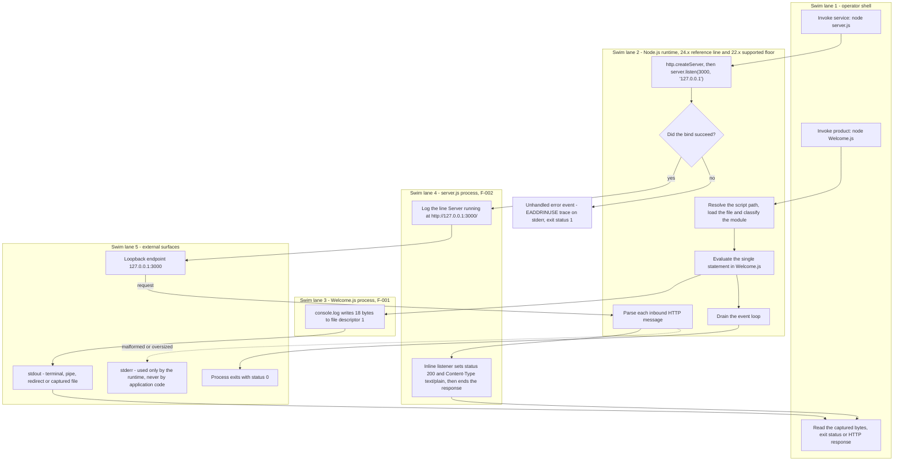
```mermaid
flowchart TD
    subgraph Lane1["Swim lane 1 - operator shell"]
        L1A["Invoke product: node Welcome.js"]
        L1B["Invoke service: node server.js"]
        L1C["Read the captured bytes, exit status or HTTP response"]
    end
    subgraph Lane2["Swim lane 2 - Node.js runtime, 24.x reference line and 22.x supported floor"]
        L2A["Resolve the script path, load the file and classify the module"]
        L2B["Evaluate the single statement in Welcome.js"]
        L2C["Drain the event loop"]
        L2D["http.createServer, then server.listen(3000, '127.0.0.1')"]
        L2E["Parse each inbound HTTP message"]
        L2F{"Did the bind succeed?"}
    end
    subgraph Lane3["Swim lane 3 - Welcome.js process, F-001"]
        L3A["console.log writes 18 bytes to file descriptor 1"]
    end
    subgraph Lane4["Swim lane 4 - server.js process, F-002"]
        L4A["Inline listener sets status 200 and Content-Type text/plain, then ends the response"]
        L4B["Log the line Server running at http://127.0.0.1:3000/"]
    end
    subgraph Lane5["Swim lane 5 - external surfaces"]
        L5A["stdout - terminal, pipe, redirect or captured file"]
        L5B["Loopback endpoint 127.0.0.1:3000"]
        L5C["stderr - used only by the runtime, never by application code"]
        L5D["Process exits with status 0"]
    end
    L5E["Unhandled error event - EADDRINUSE trace on stderr, exit status 1"]
    L1A --> L2A --> L2B --> L3A --> L5A --> L1C
    L2B --> L2C --> L5D
    L1B --> L2D --> L2F
    L2F -->|"yes"| L4B --> L5B
    L2F -->|"no"| L5E
    L5B -->|"request"| L2E --> L4A --> L1C
    L2E -.->|"malformed or oversized"| L5C
```

**User touchpoints.** Four surfaces are reachable by a human, and no fifth exists.

| Touchpoint | Interaction available | Evidence |
|---|---|---|
| Operator shell (start of both processes) | Invoke each file by name from the repository root, or by absolute path from anywhere; capture or redirect stdout | F-001-RQ-008; Project Guide §9.4, §9.7 |
| stdout consumer | Read, pipe or capture 18 bytes from the product; an empty stream means the write was dropped | F-001-RQ-001, F-001-RQ-009 |
| Local HTTP client or browser on `127.0.0.1:3000` | Send any method, path, query and body; receive 200 with a 14-byte body | F-002-RQ-002; Project Guide §4 |
| Git working tree | Diff continuity, count added paths, stage by name | F-005-RQ-001, F-005-RQ-002 |

### 4.1.2 Core Business Processes

#### 4.1.2.1 P-1 — Product Execution (F-001)

**Journey.** A developer opens a shell in the repository root and runs `node Welcome.js`. The runtime resolves the script, loads it, evaluates one statement, writes 18 bytes to stdout, finds the event loop empty and exits with status 0 (F-001-RQ-001, F-001-RQ-004). The whole journey is end-to-end observable through two values: the captured bytes and the exit status.

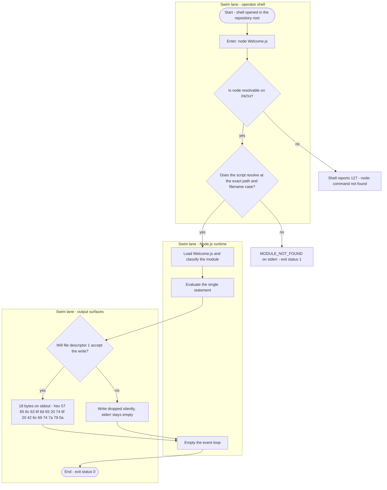
```mermaid
flowchart TD
    subgraph L1["Swim lane - operator shell"]
        S1(["Start - shell opened in the repository root"])
        S2["Enter: node Welcome.js"]
        S3{"Is node resolvable on PATH?"}
        S4{"Does the script resolve at the exact path and filename case?"}
    end
    subgraph L2["Swim lane - Node.js runtime"]
        R1["Load Welcome.js and classify the module"]
        R2["Evaluate the single statement"]
        R3["Empty the event loop"]
    end
    subgraph L3["Swim lane - output surfaces"]
        O1{"Will file descriptor 1 accept the write?"}
        O2["18 bytes on stdout - hex 57 65 6c 63 6f 6d 65 20 74 6f 20 42 6c 69 74 7a 79 0a"]
        O3["Write dropped silently, stderr stays empty"]
        O4(["End - exit status 0"])
    end
    E1["Shell reports 127 - node: command not found"]
    E2["MODULE_NOT_FOUND on stderr - exit status 1"]
    S1 --> S2 --> S3
    S3 -->|"no"| E1
    S3 -->|"yes"| S4
    S4 -->|"no"| E2
    S4 -->|"yes"| R1
    R1 --> R2 --> O1
    O1 -->|"yes"| O2
    O1 -->|"no"| O3
    O2 --> R3
    O3 --> R3
    R3 --> O4
```

**Decision points.**

| Decision | Condition | Paths | Evidence |
|---|---|---|---|
| D-1.1 | Is a Node.js interpreter resolvable on `PATH`? | Yes → load the script; no → the shell reports `node: command not found` and a non-zero status | Project Guide §9.7 |
| D-1.2 | Does the script resolve at the exact path and filename case? | Yes → evaluate; no → `MODULE_NOT_FOUND`, exit 1 — observed both when run from a foreign working directory and when the filename case was wrong (`welcome.js`) | F-001-RQ-002, F-001-RQ-008; Project Guide §9.7 |
| D-1.3 | Will file descriptor 1 accept the write? | Yes → 18 bytes delivered; no → the write is dropped with no diagnostic and the process still exits 0 | Observed: `node Welcome.js >&-` and an early-exiting pipe reader both yield exit 0 with zero bytes on stderr |

**Error handling paths.** Three failure states are reachable and each is terminal — the file contains no guard, retry or fallback, so recovery is always external (section 4.3.2). Interpreter absence and path-resolution failure are loud: a diagnostic on stderr and a non-zero status. Stream failure is silent, which is the one path where a naive check on the exit status alone would report success while the message was lost; acceptance therefore asserts captured bytes rather than status (F-001-RQ-004, F-001-RQ-009).

**Timing.** Interpreted startup dominates. Five consecutive runs took 25, 21, 24, 23 and 22 ms wall clock against a 19 ms baseline for `node -e ""`, so the script's own work is roughly 2–6 ms above bare interpreter load; the Project Guide records 25–30 ms per run (§9.1) and 0.021 s real (§2.2). A `timeout 10` wrapper never fires, confirming natural termination. No SLA, throughput or concurrency target is stated anywhere in the repository.

#### 4.1.2.2 P-2 — Loopback HTTP Service Lifecycle (F-002)

**Journey.** A developer runs `node server.js`. The runtime creates the server, binds `127.0.0.1:3000`, and the `listen` callback logs the URL — so the log line is emitted only after a successful bind (F-002-RQ-001). Any client on the local host then sends a request; the listener answers with 200, `Content-Type: text/plain` and a 14-byte body, regardless of method, path or query (F-002-RQ-002). Stopping the process frees the port (F-002-RQ-004). This capability is pre-existing and unmodified; it is covered here because it is the only request-driven flow in the system.

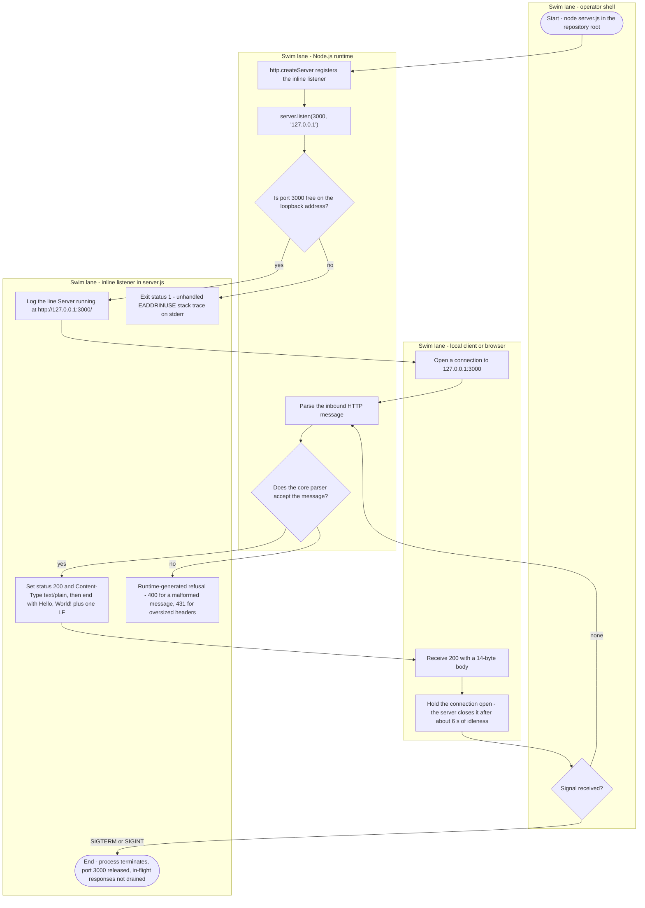
```mermaid
flowchart TD
    subgraph M1["Swim lane - operator shell"]
        T1(["Start - node server.js in the repository root"])
        T9{"Signal received?"}
    end
    subgraph M2["Swim lane - Node.js runtime"]
        T2["http.createServer registers the inline listener"]
        T3["server.listen(3000, '127.0.0.1')"]
        T4{"Is port 3000 free on the loopback address?"}
        T5["Parse the inbound HTTP message"]
        T6{"Does the core parser accept the message?"}
    end
    subgraph M3["Swim lane - inline listener in server.js"]
        T7["Log the line Server running at http://127.0.0.1:3000/"]
        T8["Set status 200 and Content-Type text/plain, then end with Hello, World! plus one LF"]
        T10["Runtime-generated refusal - 400 for a malformed message, 431 for oversized headers"]
        T11["Exit status 1 - unhandled EADDRINUSE stack trace on stderr"]
        T12(["End - process terminates, port 3000 released, in-flight responses not drained"])
    end
    subgraph M4["Swim lane - local client or browser"]
        C1["Open a connection to 127.0.0.1:3000"]
        C2["Receive 200 with a 14-byte body"]
        C3["Hold the connection open - the server closes it after about 6 s of idleness"]
    end
    T1 --> T2 --> T3 --> T4
    T4 -->|"no"| T11
    T4 -->|"yes"| T7
    T7 --> C1
    C1 --> T5 --> T6
    T6 -->|"no"| T10
    T6 -->|"yes"| T8 --> C2 --> C3 --> T9
    T9 -->|"SIGTERM or SIGINT"| T12
    T9 -->|"none"| T5
```

**Decision points.**

| Decision | Condition | Paths | Evidence |
|---|---|---|---|
| D-2.1 | Is port 3000 free on `127.0.0.1`? | Yes → log the URL and serve; no → the runtime emits an unhandled `'error'` event, prints an `EADDRINUSE` stack trace and exits 1 — no listener exists to handle it | Observed on a second concurrent start; Project Guide §2.1.2, §6 |
| D-2.2 | Does the core HTTP parser accept the message? | Yes → the `request` event reaches the listener; no → the runtime refuses before the listener runs (431 observed for a request whose header value measured 20 KB; 400 recorded for malformed requests) | Oversized header verified here; 400 from Project Guide §4 |
| D-2.3 | Does the client keep the connection open? | Yes → the server holds it and closes it after about 6 s idle against an advertised `Keep-Alive: timeout=5`; no → the socket closes after the response | Observed: an idle connection was closed by the server after 6003 ms; two URLs reused one connection |
| D-2.4 | Has a termination signal arrived? | Yes → the process ends and frees the port with no drain; no → return to awaiting requests | Observed: SIGTERM → port 3000 free, server exit status 143; Project Guide §6 |

**Error handling paths.** Bind failure is the only application-reachable failure, and it is unhandled — recovery means stopping the first instance or freeing the port, never a retry (section 4.3.2). Request-level faults are absorbed by the runtime: the listener never inspects the request, so no application validation, rejection, logging or per-request state exists. Shutdown is not graceful; there is no signal handler, so a response in flight when the process is killed is simply lost.

**Timing.** The startup log is ordered after a successful bind by construction. Measured request latency on an idle loopback socket was 0.17–0.42 ms across five requests, and a request carrying a 2 MB body was answered with 200 in 2 ms because the body is never read. A proper `HEAD` returns headers only in about 3.8 ms; a client that asks for `HEAD` but waits for the advertised 14-byte body blocks until the server closes the idle connection after roughly 6 s — the connection timeout, not a processing delay. No startup, latency or throughput SLA is asserted anywhere.

#### 4.1.2.3 P-3 — Acceptance and Delivery Verification (F-005)

**Journey.** This is the process that decides whether a change may reach `main`, and it is the project's substitute for the automated regression net it deliberately does not have (`node --test` reports 0 tests; Project Guide §3). A change is proposed, the nine-line acceptance gate is run, and the gate's decisions either reject the change or let it proceed to staging, pull request and merge. The delivered instance of this flow is recorded in history: base `1484182` → `1cef465` (adds `Welcome.js`, one file, one insertion) → `6c16ea2` (record-only, zero paths changed) → `4d1256c` (adds the 381-line Project Guide) → `39974fd` "Merge pull request #15", with parents `1484182` and `4d1256c`, merged 22 September 2026.

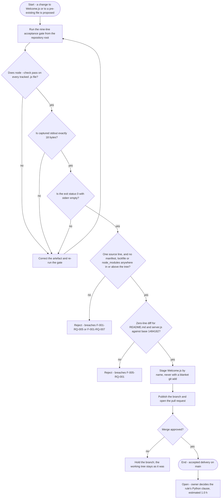
```mermaid
flowchart TD
    A1(["Start - a change to Welcome.js or to a pre-existing file is proposed"]) --> A2["Run the nine-line acceptance gate from the repository root"]
    A2 --> A3{"Does node --check pass on every tracked .js file?"}
    A3 -->|"no"| A4["Correct the artefact and re-run the gate"]
    A4 --> A2
    A3 -->|"yes"| A5{"Is captured stdout exactly 18 bytes?"}
    A5 -->|"no"| A4
    A5 -->|"yes"| A6{"Is the exit status 0 with stderr empty?"}
    A6 -->|"no"| A4
    A6 -->|"yes"| A7{"One source line, and no manifest, lockfile or node_modules anywhere in or above the tree?"}
    A7 -->|"no"| A8["Reject - breaches F-001-RQ-005 or F-001-RQ-007"]
    A7 -->|"yes"| A9{"Zero-line diff for README.md and server.js against base 1484182?"}
    A9 -->|"no"| A10["Reject - breaches F-005-RQ-001"]
    A9 -->|"yes"| A11["Stage Welcome.js by name, never with a blanket git add"]
    A11 --> A12["Publish the branch and open the pull request"]
    A12 --> A13{"Merge approved?"}
    A13 -->|"no"| A14["Hold the branch; the working tree stays as it was"]
    A13 -->|"yes"| A15(["End - accepted delivery on main"])
    A15 --> A16["Open - owner decides the rule's Python clause, estimated 1.0 h"]
```

**Decision points.** Each gate question is a binary check with a named requirement behind it: syntax validity of every tracked `.js` file (F-001-RQ-003), the 18-byte output contract (F-001-RQ-001), success status with empty stderr (F-001-RQ-004), the one-line minimality ceiling and the zero-install posture (F-001-RQ-005, F-001-RQ-007), and byte-identity of both pre-existing files (F-005-RQ-001). A failure at any of them returns the change to correction; the gate is re-runnable by any third party with no tooling beyond Node.js and a shell.

**Authorization checkpoints.** Human approval is the merge decision, and the delivered instance records it as pull request #15. One governance item sits outside the gate entirely: the governing project rule — "Create a product in Python clearly separating each flow and feature. Ensure the performance of the application is not impacted by this code." — has two of its three clauses met and verified, while the language clause is unmet by recorded decision because the product request itself fixed JavaScript and the filename `Welcome.js` (compliance matrix row 12; Project Guide §5.2, divergence 1). No code change can close it; the owner's options are to amend or narrow the rule or to issue a product-scoped waiver, with the file left byte-identical.

**Staging discipline.** The gate's last action is procedural, not executable: stage the product path by name, because the working tree has at times carried untracked image captures that a blanket `git add` would have committed (Project Guide §5.2, divergence 3). In the checkout inspected for this section the working tree is clean and no capture directory is present, so the exposure is a documented procedural risk rather than an observed artefact.

#### 4.1.2.4 P-4 — Documentation Authoring and Rendering (F-003, F-004)

Neither document is executed, so this workflow has no runtime states, no decision on a live path and no error state at run time. `README.md` is a two-line repository identity stub, `# hao-backprop-test` plus `test project for backprop integration.`, protected from change by the continuity obligation (F-003-RQ-001). `blitzy/documentation/Project Guide.md` is the 381-line acceptance dossier, committed as its own step (`4d1256c`) after the product line, and reads as a rendering exercise rather than a process: Markdown plus three mermaid pie charts viewed in any Markdown renderer, with Appendices A–G supplying the command reference, port reference, key file locations, technology versions, environment-variable reference, tooling status and glossary (F-004-RQ-001, F-004-RQ-002). Its only process-relevant property is the accounting rule that a figure derived from a different commit must be labelled as such — which is why the guide's "1 file changed, 1 insertion(+)" describes the product commit series, while the tree at `HEAD` gains two paths.

### 4.1.3 Integration Workflows

#### 4.1.3.1 Data Flow Between Systems

There are no peer systems. The system consumes nothing from an external source and publishes nothing to one: no registry, deployment target, observability hook, identity provider, database, broker or network egress exists in or around the checkout (Project Guide §1.5; section 1.2). Every data hop is therefore inside one process or across the operator's own shell boundary.

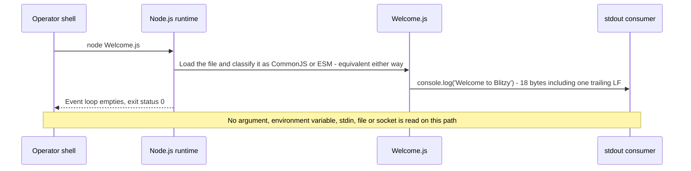
```mermaid
sequenceDiagram
    participant Op as Operator shell
    participant N as Node.js runtime
    participant W as Welcome.js
    participant S as stdout consumer
    Op->>N: node Welcome.js
    N->>W: Load the file and classify it as CommonJS or ESM - equivalent either way
    W->>S: console.log('Welcome to Blitzy') - 18 bytes including one trailing LF
    N-->>Op: Event loop empties, exit status 0
    Note over Op,S: No argument, environment variable, stdin, file or socket is read on this path
```

| Hop | Source → destination | Payload | Transformation applied |
|---|---|---|---|
| H-1 | Shell → interpreter | The literal argument `Welcome.js` | None; the path is resolved by the runtime |
| H-2 | `Welcome.js` → stdout | 18 bytes: the 17-character literal plus one LF | None; the literal is written verbatim |
| H-3 | Shell/socket → listener | An HTTP request of any method, path, query or body size | None; the request object is never inspected |
| H-4 | Listener → client | 14 bytes: `Hello, World!` plus one LF, with status 200 and `Content-Type: text/plain` | None; a fixed literal is written verbatim |

No hop persists, enriches, aggregates, filters, encrypts or serializes anything, and no hop has an alternate destination, so no reconciliation or idempotency logic is needed.

#### 4.1.3.2 API Interactions

The product exposes no API: it reads no argument, no stdin, no environment variable and no file, and opens no socket. The only callable interface in the system is the pre-existing loopback listener, which accepts any request and ignores it.

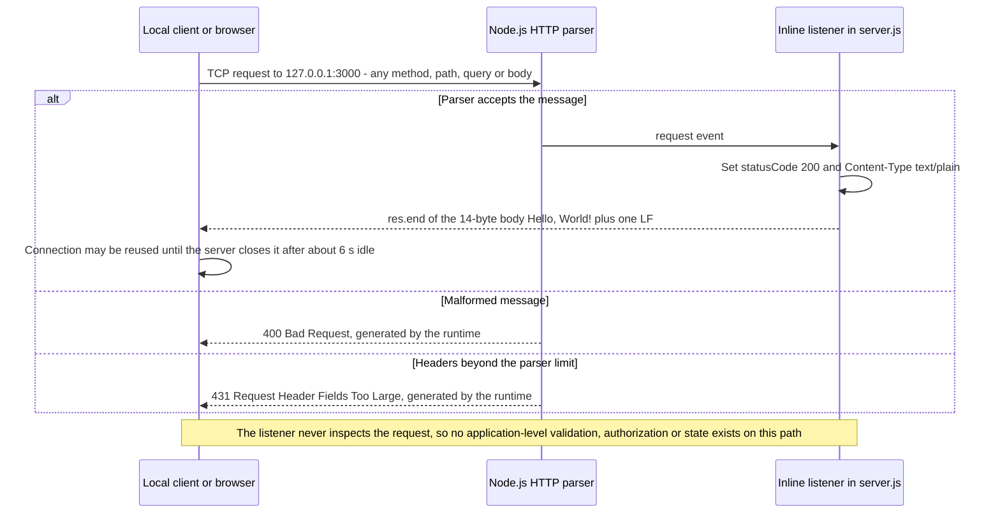
```mermaid
sequenceDiagram
    participant C as Local client or browser
    participant P as Node.js HTTP parser
    participant L as Inline listener in server.js
    C->>P: TCP request to 127.0.0.1:3000 - any method, path, query or body
    alt Parser accepts the message
        P->>L: request event
        L->>L: Set statusCode 200 and Content-Type text/plain
        L-->>C: res.end of the 14-byte body Hello, World! plus one LF
        C->>C: Connection may be reused until the server closes it after about 6 s idle
    else Malformed message
        P-->>C: 400 Bad Request, generated by the runtime
    else Headers beyond the parser limit
        P-->>C: 431 Request Header Fields Too Large, generated by the runtime
    end
    Note over C,L: The listener never inspects the request, so no application-level validation, authorization or state exists on this path
```

| Interface | Contract | Boundary and access control |
|---|---|---|
| `node Welcome.js` | Writes 18 bytes to stdout, nothing to stderr, exit 0 | Local shell only; no network or credential involved (F-001-RQ-008) |
| `node server.js` | Binds `127.0.0.1:3000` and logs the URL on success | Loopback-only, unauthenticated, no TLS (F-002-RQ-003) |
| `GET|POST|PUT|DELETE|PATCH|OPTIONS /any/path?any=query` | 200, `text/plain`, `Content-Length: 14`, body `Hello, World!\n` | No routing, no content negotiation, no body parsing (F-002-RQ-002) |
| `HEAD /` | 200 with headers only, including `Content-Length: 14` | A client that reads a body blocks until the idle timeout closes the connection |

#### 4.1.3.3 Event Processing Flows

Both processes are event-driven by construction, and their event sets are complete enumerations rather than samples.

| Process | Event | Binding site | Handler behaviour |
|---|---|---|---|
| `Welcome.js` | Module evaluation | Runtime, at load (`Welcome.js:1`) | Runs the single statement; no event name is registered anywhere |
| `Welcome.js` | Event-loop drain | Runtime | Empties the loop because no timer, listener or handle was ever registered; then exits 0 |
| `server.js` | `listening` | `listen` callback (`server.js:12-14`) | Logs `Server running at http://127.0.0.1:3000/` |
| `server.js` | `request` | Inline anonymous listener (`server.js:6-10`) | Sets status, header and body; ignores the request argument |
| `server.js` | `error` | None registered | An unhandled `'error'` event aborts the process — observed as an `EADDRINUSE` stack trace and exit 1 |
| `server.js` | `SIGTERM`, `SIGINT` | None registered | Default Node.js behaviour terminates the process, releasing the port without draining in-flight responses |

There is no message broker, queue, topic, pub/sub subscription, webhook, scheduled job or custom `EventEmitter` anywhere in the tree; no file is watched, and no process is long-lived except the demo listener, which holds only socket state.

#### 4.1.3.4 Batch Processing Sequences

None exist, and the absence is structural rather than incidental. The repository has no batch entry point, no scheduler, no cron job, no worker, no CLI argument parsing and no data set to process; `console` is the only input or output channel either file touches. The nearest thing to a batch run is the nine-line acceptance gate, which is a sequence of shell commands executed by a person (P-3) rather than a scheduled job, and the test-runner probe, which collects zero tests (`node --test` reports 0 suites, 0 pass, 0 fail, ~11 ms). Any future batch workflow would be new scope: it would require an input channel, a scheduler and a persistence target, none of which the system has today.

#### 4.1.3.5 Cross-Component Coupling and the Single Integration Risk

The two executables are coupled only through the runtime and through the repository's manifest-free posture. `Welcome.js` is module-neutral — it declares no `import` or `export`, so it behaves identically whether the runtime classifies it as CommonJS or as an ES module, with or without an ancestor manifest of either type (F-001-RQ-010). `server.js` is not: it begins with `const http = require('http');`, a CommonJS-only form. The consequence is the system's one genuine integration edge: a `package.json` declaring `"type": "module"` added in or above the repository would break `server.js` at run time while leaving `Welcome.js` working, which is precisely why the tree is kept manifest-free and why the remedy for any future manifest is to declare `"type": "commonjs"` and re-run both files (Project Guide §6). No other shared component exists — no utility module, no configuration file, no helper library.


## 4.2 Flowchart Requirements

Every workflow in section 4.1 is defined by the same seven elements: a start point, a sequence of process steps, the decision diamonds that branch it, the system boundaries it may not cross, the user touchpoints on it, the error states with their recovery paths, and the timing behaviour observed on it. This sub-section states each element for each workflow and then sets out the validation rules that govern individual steps.

### 4.2.1 Workflow Element Inventory

#### 4.2.1.1 P-1 — Product Execution (F-001)

| Element | Definition | Diagram and evidence |
|---|---|---|
| Start point | Operator opens a shell and invokes `node Welcome.js`; the only precondition is a supported Node.js interpreter on `PATH` | D-2; F-001-RQ-007, F-001-RQ-008 |
| End points | Exit status 0 after 18 bytes reach file descriptor 1, including when the write is dropped; exit status 1 with `MODULE_NOT_FOUND` when the script does not resolve; shell status 127 when no interpreter exists | D-2; observed in every case cited |
| Process steps | Resolve and load the script → classify the module (CommonJS or ESM, equivalent) → evaluate the single statement → write 18 bytes → drain the event loop → exit | `Welcome.js:1`; D-2 lanes 2–3 |
| Decision diamonds | D-1.1 interpreter present; D-1.2 script resolves at the exact path and case; D-1.3 descriptor 1 accepts the write | Register below |
| System boundaries | Crossed: the shell/interpreter boundary and the process/stdout boundary. Not crossed: any filesystem read, socket, environment or credential | Project Guide §10 Appendix E; F-001-RQ-008 |
| User touchpoints | The invoking shell (start) and the stdout consumer — terminal, pipe, redirect or captured file (result) | D-1 lane 1 and lane 5 |
| Error states and recovery | No interpreter → install a supported LTS line or invoke by absolute path; unresolvable script → `cd` to the repository root, pass an absolute path, or correct the filename case; dropped write → capture stdout and assert bytes, since the exit status stays 0 | Project Guide §9.7; §3 "Not Covered" |
| Timing and SLA | 21–25 ms per run measured here, against a 19 ms bare-interpreter baseline; 25–30 ms recorded in Project Guide §9.1; `timeout 10` never fires. No SLA, throughput or concurrency target exists in the repository | F-001-RQ-009; section 1.2 |

#### 4.2.1.2 P-2 — Loopback HTTP Service Lifecycle (F-002)

| Element | Definition | Diagram and evidence |
|---|---|---|
| Start point | Operator runs `node server.js`; the only precondition is that port 3000 is free on the loopback address | D-3; F-002-RQ-001 |
| End points | Process terminated by `SIGTERM` or `SIGINT` with port 3000 released (observed exit status 143); process aborted during bind with an `EADDRINUSE` stack trace and exit 1 | D-3 lanes 1 and 3 |
| Process steps | `http.createServer` registers the inline listener → `listen(3000, '127.0.0.1')` → the callback logs the URL → parse an inbound message → dispatch the `request` event → set status and header → `res.end` with the 14-byte body | `server.js:1-15`; D-3 lanes 2–4 |
| Decision diamonds | D-2.1 bind success; D-2.2 parser acceptance; D-2.3 client keeps the connection; D-2.4 termination signal received | Register below |
| System boundaries | Crossed: the loopback interface at `127.0.0.1:3000` and the TCP socket boundary. Not crossed: any non-loopback interface, TLS, upstream service, database or filesystem write | F-002-RQ-003; Project Guide §1.5 |
| User touchpoints | The invoking shell (start and stop); any local HTTP client or browser (requests and responses) | D-3 lanes 1 and 4; Project Guide §4 |
| Error states and recovery | Port in use → stop the first instance or free the port, since no retry, backoff or error listener exists; malformed or oversized request → the runtime answers 400 or 431 before the listener runs, so recovery is client-side; killed mid-response → the in-flight response is lost, as shutdown does not drain | Project Guide §6; §4 |
| Timing and SLA | Startup log ordered after a successful bind; 0.17–0.42 ms measured per request on an idle loopback socket; a 2 MB request body answered with 200 in 2 ms because the body is never read; idle connections closed after about 6 s against an advertised `Keep-Alive: timeout=5`. No latency, throughput or shutdown-timeout SLA is asserted | D-3; observed connection close at 6003 ms |

#### 4.2.1.3 P-3 — Acceptance and Delivery Verification (F-005)

| Element | Definition | Diagram and evidence |
|---|---|---|
| Start point | A change is proposed to `Welcome.js` or to a pre-existing file, and the change author runs the nine-line acceptance gate from the repository root | D-4; Project Guide §9.5 |
| End points | Accepted delivery on `main` — observed as pull request #15, merge commit `39974fd`; or a rejected change returned to correction | D-4; git history `1484182` → `39974fd` |
| Process steps | Run the gate → check syntax of every tracked `.js` file → assert the 18-byte output → assert status 0 and empty stderr → confirm one source line and no manifest, lockfile or `node_modules` → confirm a zero-line diff for both pre-existing files → stage the product path by name → publish the branch and open the pull request → merge | D-4; F-005-RQ-001 … F-005-RQ-005 |
| Decision diamonds | D-3.1 syntax; D-3.2 byte count; D-3.3 status and stderr; D-3.4 minimality and zero-install posture; D-3.5 continuity diff; D-3.6 merge approval | Register below |
| System boundaries | Crossed: the shell/Git boundary and the human review boundary. Not crossed: any CI runner or deployment target, because none exists | Project Guide §10 Appendix F; section 1.2 |
| User touchpoints | The change author running the gate; the reviewer or owner approving the merge; the owner deciding the rule's language clause | D-4; Project Guide §1.4, §1.6 |
| Error states and recovery | Any failed gate check returns the change to correction and re-runs the gate; a non-zero continuity diff rejects the change outright; the open governance item cannot be closed by a code change and is resolved by amending, narrowing or waiving the rule | Project Guide §5.2, §6, §9.7 |
| Timing and SLA | Estimated, not measured: 1.0 h for the governance decision, 0.5 h to publish the branch and open the pull request, 0.5 h for an owner-side acceptance re-run, 0.5 h of working-tree housekeeping — 2.5 h remaining against a 15.0 h total, giving 83% completion | Project Guide §1.2, §2.2 |

#### 4.2.1.4 P-4 — Documentation Authoring and Rendering (F-003, F-004)

| Element | Definition | Diagram and evidence |
|---|---|---|
| Start point | An author edits `README.md` (frozen by the continuity obligation) or writes the status report; the report's inputs are the recorded results of the acceptance checks | F-003-RQ-001; F-004-RQ-001 |
| End points | Committed Markdown: `4d1256c` added the report as 381 insertions; `README.md` remains byte-identical to base `1484182` | Git history; F-005-RQ-001 |
| Process steps | Author the Markdown → embed mermaid charts and command tables → commit as its own step → render in any Markdown viewer | `blitzy/documentation/Project Guide.md` |
| Decision diamonds | D-4.1 whether a recorded figure derives from the same commit as the artefact it describes | Register below; F-004-RQ-002 |
| System boundaries | No runtime boundary is crossed: neither document is read or executed by either process | Section 4.1.2.4 |
| User touchpoints | The author, the reviewer reading the rendered document, and the future maintainer following its runbook and glossary | Project Guide §9, §10 Appendix G |
| Error states and recovery | A figure derived from a different commit must be labelled as such rather than silently reconciled — the guide's "1 file changed, 1 insertion(+)" describes the product commit series while the tree at `HEAD` gains two paths | F-004-RQ-002; section 1.2 |
| Timing and SLA | None applicable; the document is not executed and asserts no timing target | Project Guide §1.3 |

#### 4.2.1.5 Decision Point Register

| ID | Decision diamond | Yes path | No path |
|---|---|---|---|
| D-1.1 | Is a Node.js interpreter on `PATH`? | Load the script | Shell reports 127, no stdout |
| D-1.2 | Does the script resolve at the exact path and filename case? | Evaluate the statement | `MODULE_NOT_FOUND`, exit 1 |
| D-1.3 | Does descriptor 1 accept the write? | 18 bytes delivered | Write dropped silently, exit 0 |
| D-2.1 | Is port 3000 free on `127.0.0.1`? | Log the URL, serve | Unhandled `EADDRINUSE`, exit 1 |
| D-2.2 | Does the HTTP parser accept the message? | Dispatch the `request` event | Runtime answers 400 or 431 |
| D-2.3 | Does the client keep the connection open? | Server holds it, closes after about 6 s idle | Socket closed after the response |
| D-2.4 | Has a termination signal arrived? | Process ends, port released, no drain | Await the next request |
| D-3.1 | Does `node --check` pass on every tracked `.js` file? | Next gate check | Return to correction |
| D-3.2 | Is captured stdout exactly 18 bytes? | Next gate check | Return to correction |
| D-3.3 | Is the exit status 0 with stderr empty? | Next gate check | Return to correction |
| D-3.4 | One source line, and no manifest, lockfile or `node_modules`? | Next gate check | Reject the change |
| D-3.5 | Zero-line diff for `README.md` and `server.js` against base `1484182`? | Stage by name | Reject the change |
| D-3.6 | Is the merge approved? | Accepted delivery on `main` | Hold the branch |
| D-4.1 | Does a recorded figure derive from the same commit as the artefact it describes? | Publish as recorded | Label the divergence explicitly |

### 4.2.2 Validation Rules

#### 4.2.2.1 Business Rules at Each Step

Rules are enforced by measurement and review, not by code — neither file contains a guard, assertion or check of any kind. Each row names the step, the rule, the requirement it satisfies and the executable check that decides it.

| Step | Business rule | Requirement | Executable check |
|---|---|---|---|
| Invoke the product | Run from the repository root or pass an absolute path; the filename is case-sensitive | F-001-RQ-008, F-001-RQ-002 | A foreign working directory and the lowercase filename both fail with `MODULE_NOT_FOUND` |
| Emit the banner | The output equals the literal exactly — 17 characters plus one LF, 18 bytes — and is asserted against a pipe or captured file, never a terminal | F-001-RQ-001, F-001-RQ-009 | `node Welcome.js \| wc -c` → 18; `od -An -t x1` → `57 65 … 79 0a` |
| Terminate | The process ends on its own with status 0 and an empty stderr; no `process.exit`, timer or retained handle | F-001-RQ-004 | `timeout 10 node Welcome.js` → exit 0; stderr byte count 0 |
| Hold the source shape | Exactly one line, one statement, 34 bytes; no comment, blank line, declaration or abstraction | F-001-RQ-005, F-001-RQ-006, F-001-RQ-011 | `wc -l` → 1, `wc -c` → 34 |
| Preserve the install posture | No manifest, lockfile or `node_modules` anywhere in or above the tree, before or after a run | F-001-RQ-007 | `ls package.json package-lock.json node_modules \| wc -l` → 0 |
| Start the service | Bind the loopback address and port 3000; log the URL only after a successful bind | F-002-RQ-001, F-002-RQ-003 | Startup log line; reachable on `127.0.0.1:3000` only |
| Serve a request | Answer every method, path, query and body identically with 200, `text/plain` and a 14-byte body; read no request data | F-002-RQ-002 | GET, HEAD, POST, PUT, DELETE, PATCH and OPTIONS all return 200; a 2 MB body returns 200 in 2 ms |
| Stop the service | Release port 3000 on termination; no graceful drain is required or provided | F-002-RQ-004 | After `SIGTERM` the port is free and further requests are refused |
| Verify continuity | `README.md` and `server.js` must show a zero-line diff against base `1484182` | F-005-RQ-001 | `git diff 1484182 -- README.md server.js` returns nothing |
| Account for minimality | Exactly one product path and one product line added; no excluded artefact class introduced | F-005-RQ-002 | `git show --stat 1cef465` → 1 file changed, 1 insertion |
| Prove non-impact | Repeated and concurrent product runs must leave the service's latency and resource counts at or below baseline | F-005-RQ-003 | Latency medians at or below the idle baseline, no failed request |
| Adjudicate the rule | The governing project rule is judged clause by clause and the outcome recorded | F-005-RQ-004 | Compliance matrix: 11 PASS, 1 NOT MET across twelve benchmarks |
| Stage safely | Stage the product path by name; never a blanket `git add` | F-005-RQ-005 | `git status --porcelain --untracked-files=all` before staging |

#### 4.2.2.2 Data Validation Requirements

There is no application-level data validation anywhere in the system, because there is no application-level data. The product reads no argument, standard input, environment variable or file (F-001-RQ-008; Project Guide §10 Appendix E), and the listener never inspects the request object, so no field, header, path parameter or body is parsed, echoed, logged or validated (F-002-RQ-002). What validation does occur happens below the application, in two places:

- **Runtime and shell validation.** The module loader decides whether the script resolves — producing `MODULE_NOT_FOUND` — and the shell decides whether an interpreter exists, producing status 127.
- **Core HTTP parser validation.** Node's HTTP parser rejects a malformed message with 400 and a request whose headers exceed the parser's limit with 431, both before the `request` event reaches the listener. A request carrying a 20 KB header value returned 431 in this inspection; 400 for malformed requests is recorded in Project Guide §4.

No schema, serialization format, content type, encoding, length ceiling or sanitization rule is defined by the application, and there is no input channel through which a validation rule could be bypassed or attacked.

#### 4.2.2.3 Authorization Checkpoints

The system performs no authentication or authorization at run time. The service is loopback-only and unauthenticated, has no session, token, identity provider, role or permission model, and therefore exposes no credential to manage and no privilege boundary to enforce (F-002-RQ-003; Project Guide §1.5). Two checkpoints are human and procedural rather than technical:

| Checkpoint | Who decides | What it gates | Evidence |
|---|---|---|---|
| Merge approval of pull request #15 | Reviewer/owner on the GitHub repository | Whether the product line and the report reach `main`; observed as merge commit `39974fd` | Git history; Project Guide §1.6 |
| Rule-language governance decision | Project owner | Whether the Python clause is amended, narrowed or waived; estimated at 1.0 h and not closeable by code | Project Guide §1.4, §5.2, §6 |

#### 4.2.2.4 Regulatory Compliance Checks

No regulatory regime applies to this system, and the enumeration is complete rather than sampled: the system processes no personal data, stores nothing, transmits only the fixed literal `Hello, World!\n` over plaintext loopback, consumes no environment variable, secret or credential, and declares no dependency whose license would need review (Project Guide §1.5, §5.1 security posture). There is no license file, no versioning scheme, no release process and no tag in the repository, so no distribution obligation arises. The only compliance rules that bite are internal and are checked at the acceptance gate:

| Compliance rule | Status | Enforcement |
|---|---|---|
| Project rule, clause 2 — each flow and feature clearly separated | Met: the single feature's single flow occupies its own dedicated file containing nothing else | Matrix row 9 (N-5); F-001-RQ-011 |
| Project rule, clause 3 — application performance not impacted | Met and verified by measurement before, during and after repeated product runs | Matrix row 8 (N-4); F-005-RQ-003 |
| Project rule, clause 1 — new products written in Python | NOT MET by recorded decision: the product request fixed JavaScript and the filename `Welcome.js`, and no Python artefact exists in the tree | Matrix row 12; Project Guide §5.2, divergence 1 |
| Recorded divergences disclosed rather than omitted | Three divergences recorded: the language clause, the zero-path record-only commit `6c16ea2`, and the untracked capture directory that is absent from the current checkout | Project Guide §5.2; F-004-RQ-002 |


## 4.3 Technical Implementation

The system carries no durable state and no error-handling machinery. What follows therefore describes two bounded state machines whose lifetime is exactly one process, the absence of every persistence, caching and transaction mechanism a conventional system would have, and the small set of failure states that a person, not the code, has to resolve.

### 4.3.1 State Management

#### 4.3.1.1 State Transitions — Product Process

The product has six reachable states and no others: the script declares no variable, function, class, timer or listener, so there is nothing in which state could be held (`Welcome.js:1`). Each invocation starts from scratch, and no value survives a run.

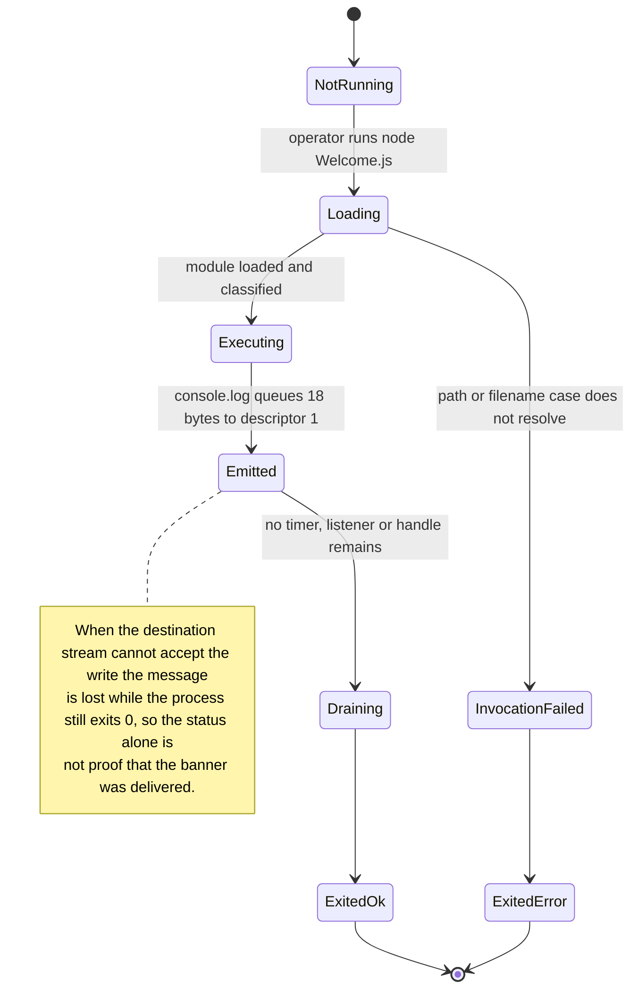
```mermaid
stateDiagram-v2
    [*] --> NotRunning
    NotRunning --> Loading: operator runs node Welcome.js
    Loading --> InvocationFailed: path or filename case does not resolve
    Loading --> Executing: module loaded and classified
    Executing --> Emitted: console.log queues 18 bytes to descriptor 1
    Emitted --> Draining: no timer, listener or handle remains
    Draining --> ExitedOk
    InvocationFailed --> ExitedError
    ExitedOk --> [*]
    ExitedError --> [*]
    note right of Emitted
        When the destination stream cannot accept the write the message
        is lost while the process still exits 0, so the status alone is
        not proof that the banner was delivered.
    end note
```

| State | Entered when | Observable effect | Exit condition |
|---|---|---|---|
| NotRunning | Before invocation | Nothing in the process table | The shell resolves the interpreter and the script |
| Loading | The runtime begins module resolution and classification | No output; CommonJS and ESM classification behave identically | The file is evaluated, or resolution fails |
| Executing | The single statement begins | None; no intermediate output exists | `console.log` returns |
| Emitted | The write has been handed to descriptor 1 | 18 bytes appear on the consumer side, or nothing if the write is dropped | The loop finds no pending work |
| Draining | The event loop empties | None; no handle was ever registered, so no forced exit is needed | The process ends |
| ExitedOk / ExitedError | Process termination | Exit status 0, or 1 with `MODULE_NOT_FOUND` on stderr | Terminal |
| InvocationFailed | Module resolution threw | Diagnostic on stderr, no stdout | Terminal |

#### 4.3.1.2 State Transitions — Service Process

The service is a long-lived state machine with one externally observable resource: port 3000. Binding and releasing that port are the only two transitions with a side effect outside the process; every other transition is internal to memory.

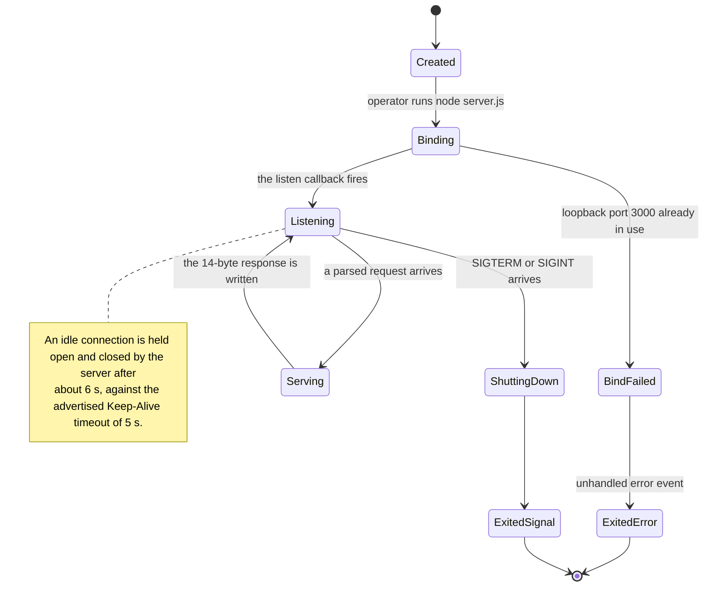
```mermaid
stateDiagram-v2
    [*] --> Created
    Created --> Binding: operator runs node server.js
    Binding --> BindFailed: loopback port 3000 already in use
    BindFailed --> ExitedError: unhandled error event
    Binding --> Listening: the listen callback fires
    Listening --> Serving: a parsed request arrives
    Serving --> Listening: the 14-byte response is written
    Listening --> ShuttingDown: SIGTERM or SIGINT arrives
    ShuttingDown --> ExitedSignal
    ExitedError --> [*]
    ExitedSignal --> [*]
    note right of Listening
        An idle connection is held open and closed by the server after
        about 6 s, against the advertised Keep-Alive timeout of 5 s.
    end note
```

| State | Entered when | Observable effect | Exit condition |
|---|---|---|---|
| Created | The file is evaluated | `http.createServer` registers the inline listener | `server.listen` is called |
| Binding | `listen(3000, '127.0.0.1')` is issued | The OS either grants or refuses the port | Bind succeeds or fails |
| BindFailed | The port is held by another process | Unhandled `'error'` event; `EADDRINUSE` stack trace on stderr | Process exits 1 |
| Listening | The `listen` callback fires | Startup log line; the port accepts connections | A request arrives, an idle connection times out, or a signal arrives |
| Serving | The `request` event reaches the listener | 200, `Content-Type: text/plain`, 14-byte body | The response is written; no state is retained per request |
| ShuttingDown | `SIGTERM` or `SIGINT` arrives | Port 3000 is released with no drain of in-flight responses | Process exits — status 143 observed on `SIGTERM` |

**Concurrency.** Multiple product processes may run simultaneously without interacting, and repeated or concurrent runs produce byte-identical output with no residue (Project Guide §4). Two service processes cannot coexist on the same port: the second lands directly in `BindFailed`. There is no leader election, no locking, no shared memory and no IPC between either process pair.

#### 4.3.1.3 Persistence Points

Nothing is persisted at run time by either process. The enumeration below is complete because both sources are one-liners with a single observable side effect.

| Candidate persistence point | Actual behaviour |
|---|---|
| Product output | Written to descriptor 1 only. Persistence happens only if the operator redirects or captures it; the program itself opens no file |
| Service logs | The single startup line goes to stdout; no log file, rotation or structured sink exists |
| Configuration | No file, no environment variable and no argument is read, so no settings are stored or reloaded (Project Guide §10 Appendix E) |
| Session, cache or queue state | None exists; no temp file, lock file, state file or journal is created |
| Repository content | Persisted by Git, authored during delivery: `Welcome.js` (1 line), `blitzy/documentation/Project Guide.md` (381 lines); `README.md` and `server.js` remain byte-identical to base `1484182` |
| Untracked captures | Project Guide §5.2, divergence 3 records seven PNG images under `blitzy/screenshots/` written into the checkout while the HTTP surface was verified in a browser. They are absent from the checkout inspected for this section — `git status --porcelain --untracked-files=all` returns nothing and `blitzy/` holds only `documentation/` — so the exposure is procedural, not an observed runtime write |

No crash-recovery mechanism is needed or present: a process killed at any point leaves nothing behind to reconcile, because no state outlives the process.

#### 4.3.1.4 Caching Requirements

There is no caching layer, and none is required. Neither file memoizes a value, reads a cache directory, or maintains an in-process cache — the product holds one literal, and the service re-derives its fixed response on every request. At the HTTP layer no cache directives are emitted at all: the observed response headers are `Content-Type`, `Date`, `Connection: keep-alive`, `Keep-Alive: timeout=5` and `Content-Length: 14`, with no `Cache-Control`, `ETag`, `Last-Modified` or `Expires`. A client that reuses a connection is reusing transport state, not a cached body, and because the body is a constant literal, repeated requests cannot disagree. Connection reuse itself is observable: two requests to the same server reused a single connection. Nothing needs invalidation, eviction, warm-up or stampede protection, and there is no cache-coherence question to answer.

#### 4.3.1.5 Transaction Boundaries

No transaction manager, database, queue or multi-step unit of work exists, so transaction boundaries are the two atomic write operations in the system:

| Boundary | Operation | Atomicity and recovery |
|---|---|---|
| Product output | One `console.log` call writing 18 bytes to descriptor 1 | Atomic as far as the program is concerned, but not transactional: a stream that cannot accept the write loses the message with no retry and no diagnostic (section 4.3.2, E-4) |
| Service response | One `res.end` call writing the 14-byte body | Committed to the socket; if the client aborts, the server holds no state and keeps serving, which was verified by aborting a request mid-flight and receiving 200 on the next one |
| Repository change | A human sequence: gate → correction loops → stage by name → pull request → merge | The only multi-step workflow in the project, and its rollback is Git itself — squash, amend, revert or hold the branch — as recorded for the zero-path commit `6c16ea2` (Project Guide §5.2, divergence 2) |

Both runtime flows are idempotent with respect to persistent state and free of side effects beyond their single output write, which is why the system needs no rollback, compensating action, two-phase commit or idempotency key.

### 4.3.2 Error Handling

No error-handling code exists in either file. Every failure state is handled by the Node.js runtime, by the shell, or by a person following a documented procedure — and two failure states produce no diagnostic at all.

#### 4.3.2.1 Error Taxonomy and Observed Behaviour

| ID | Failure state | Detection and notification | Recovery | Evidence |
|---|---|---|---|---|
| E-1 | No Node.js interpreter on `PATH` | Shell reports `node: command not found`, non-zero status | Install a supported LTS line, or invoke the interpreter by absolute path | Project Guide §9.7 |
| E-2 | Script not found — command run from a foreign working directory | `MODULE_NOT_FOUND` on stderr, exit 1 | `cd` to the repository root, or pass the absolute path | Observed here; Project Guide §9.7 |
| E-3 | Filename case wrong (`welcome.js`) | Module loader throws, non-zero status; a case-insensitive filesystem masks the fault locally and it fails on Linux | Use the exact casing `Welcome.js` | Observed here; Project Guide §9.7 |
| E-4 | Destination stream cannot accept the write | None. Verified with a closed descriptor 1 and with an early-exiting pipe reader: exit 0, zero bytes on stderr | Capture stdout to a file or pipe and assert the bytes; never infer delivery from the exit status | Observed here; Project Guide §3 "Not Covered" |
| E-5 | Byte count read as 19 instead of 18 | Measurement artefact of a terminal's newline translation, not a runtime error | Count from a pipe or a captured file | Project Guide §9.7, §6 |
| E-6 | Second service start while port 3000 is held | Unhandled `'error'` event; `EADDRINUSE` stack trace on stderr; exit 1 | Stop the first instance or free the port; no retry, backoff or reconnect exists | Observed here; Project Guide §2.1.2, §6 |
| E-7 | Malformed or oversized HTTP request | 400 for malformed messages; 431 for headers beyond the parser limit — both runtime-generated before the listener runs | Correct the request client-side; no application error path exists | 431 observed here with a 20 KB header value; 400 from Project Guide §4 |
| E-8 | Process killed with a response in flight | None; no signal handler, no drain, no shutdown timeout | Accept the lost response; restart the process | Observed exit status 143 and free port; Project Guide §6 |
| E-9 | Test-runner probe reports zero tests | `node --test` output: 0 suites, 0 pass, 0 fail | Expected — there is no test file; use the acceptance gate instead | Observed here; Project Guide §9.7 |
| E-10 | Untracked captures committed by a blanket `git add` | None before commit; visible afterwards as a second added artefact class | Delete the capture directory and stage the product path by name | Project Guide §5.2, divergence 3 |
| E-11 | An ancestor manifest declares `"type": "module"` | `server.js` fails at run time on `require`; `Welcome.js` keeps working | Keep the tree manifest-free; if a manifest becomes necessary, declare `"type": "commonjs"` and re-run both files | Project Guide §6 |
| E-12 | A figure in the report derives from a different commit | No automatic detection | Label the divergence explicitly rather than reconciling it silently | F-004-RQ-002; section 1.2 |

#### 4.3.2.2 Error Handling Flowchart

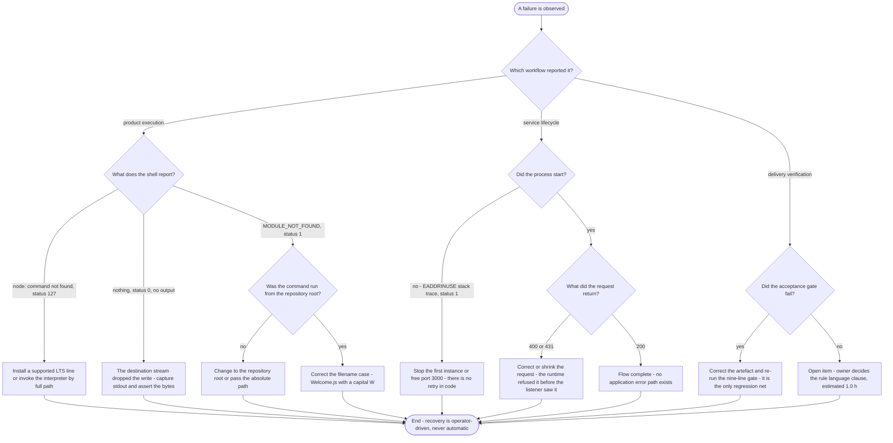
```mermaid
flowchart TD
    X0(["A failure is observed"]) --> X1{"Which workflow reported it?"}
    X1 -->|"product execution"| X2{"What does the shell report?"}
    X2 -->|"node: command not found, status 127"| X3["Install a supported LTS line or invoke the interpreter by full path"]
    X2 -->|"MODULE_NOT_FOUND, status 1"| X4{"Was the command run from the repository root?"}
    X2 -->|"nothing, status 0, no output"| X5["The destination stream dropped the write - capture stdout and assert the bytes"]
    X4 -->|"no"| X6["Change to the repository root or pass the absolute path"]
    X4 -->|"yes"| X7["Correct the filename case - Welcome.js with a capital W"]
    X1 -->|"service lifecycle"| X8{"Did the process start?"}
    X8 -->|"no - EADDRINUSE stack trace, status 1"| X9["Stop the first instance or free port 3000 - there is no retry in code"]
    X8 -->|"yes"| X10{"What did the request return?"}
    X10 -->|"400 or 431"| X11["Correct or shrink the request - the runtime refused it before the listener saw it"]
    X10 -->|"200"| X12["Flow complete - no application error path exists"]
    X1 -->|"delivery verification"| X13{"Did the acceptance gate fail?"}
    X13 -->|"yes"| X14["Correct the artefact and re-run the nine-line gate - it is the only regression net"]
    X13 -->|"no"| X15["Open item - owner decides the rule language clause, estimated 1.0 h"]
    X3 --> X16(["End - recovery is operator-driven, never automatic"])
    X5 --> X16
    X6 --> X16
    X7 --> X16
    X9 --> X16
    X11 --> X16
    X12 --> X16
    X14 --> X16
    X15 --> X16
```

#### 4.3.2.3 Retry Mechanisms

There are none, and this is deliberate rather than an omission. Neither file contains a loop, a timer, a backoff, a reconnect, a circuit breaker or a re-queue; the product's statement executes once and the listener answers once per request. The consequences are specific:

- A bind failure (E-6) is terminal — the process exits 1 rather than waiting for the port to free.
- A refused request (E-7) is not retried or repaired; the client must correct it.
- A dropped write (E-4) is never re-attempted, and nothing observes the loss.
- The only repetition in the system is human: re-running the acceptance gate after a correction (P-3), and re-running the product to check a fix. Concurrency offers no retry either — five concurrent product runs completed independently with identical bytes (Project Guide §4).

#### 4.3.2.4 Fallback Processes

No fallback path exists in code. There is no secondary output channel, no degraded mode, no default value to substitute, no alternate port or host to try if binding fails, and no cached response to serve if the fixed literal could not be written. Two fallbacks are procedural, both on the operator's side:

| Failure | Fallback | Constraint |
|---|---|---|
| Output cannot be trusted from a terminal | Redirect into a file or pipe and assert the byte count and hex dump | The program's behaviour does not change; only the observation method does (F-001-RQ-009) |
| Stream failure is undetectable from the exit status | Verify the captured bytes instead of the status — the Project Guide's guidance that "exit status alone" is not proof | Acceptance remains manual; there is no automated check to fall back on (Project Guide §3) |

#### 4.3.2.5 Error Notification Flows

Application code emits no diagnostic on any error path: no `console.error`, no logging framework, no metrics, no alerting, no webhook and no notification hook exists in either file. Every notification in the system is generated by the runtime or the shell.

| Notification channel | Generated by | Reaches whom | Notes |
|---|---|---|---|
| stderr diagnostic | Node.js runtime and the module loader only | The operator's terminal | Carries `MODULE_NOT_FOUND`, the `EADDRINUSE` stack trace and loader throws; never used by application code |
| Process exit status | Runtime and shell | The operator's shell, scripts and pipelines | 0 on success; 1 on loader or bind failure; 127 when the interpreter is absent; 143 on `SIGTERM` |
| HTTP status code | Node.js core HTTP parser | The local client | 400 and 431 for bad messages; every accepted request gets 200 from the listener |
| Startup log line | `server.js` `listen` callback | The operator's terminal | Proves a successful bind by ordering; no error counterpart exists |
| Git output | Git | The change author | `git diff`, `git status` and `git show --stat` carry the continuity and minimality evidence the gate relies on |
| Silence on dropped output | Nobody | Nobody | E-4 is the one failure that notifies no one, which is why captured bytes are the acceptance assertion |

There is no observability stack to consult: no log aggregation, tracing, health endpoint, readiness probe or metrics endpoint exists anywhere in the tree (Project Guide §10 Appendix F).

#### 4.3.2.6 Recovery Procedures

Recovery is documented, manual and reproducible without tooling beyond Node.js, a shell and Git. The procedures below are the repository's own, consolidated from the Project Guide's troubleshooting table (§9.7), risk register (§6) and acceptance gate (§9.5).

| Failure or condition | Recovery procedure | Verification after recovery |
|---|---|---|
| Interpreter missing (E-1) | Install a supported LTS line, or invoke the interpreter by absolute path | `node --version` reports a supported line; the banner appears |
| Script not found or wrong case (E-2, E-3) | Run from the repository root or by absolute path with the exact filename | Exit 0 and 18 bytes on stdout |
| Output truncated or lost (E-4, E-5) | Capture to a file or pipe, then assert byte count and hex dump | `wc -c` → 18; `od -An -t x1` → `57 65 … 79 0a` |
| Service will not start (E-6) | Stop the occupant of port 3000, or free it; the service does not retry | Startup log line appears; a request returns 200 |
| Request refused (E-7) | Correct the malformed or oversized request client-side | A conforming request returns 200 with the 14-byte body |
| Change breaks the contract | Correct the artefact and re-run the nine-line gate until every check passes | All nine gate commands reproduce the recorded outputs |
| Pre-existing file edited | Restore it to base `1484182`; the continuity criterion forbids the edit | `git diff 1484182 -- README.md server.js` returns no lines |
| Untracked captures present (E-10) | Delete the capture directory, then stage `Welcome.js` by name | `git status --porcelain --untracked-files=all` is empty before staging |
| Wrong artefact count or a record-only commit (E-12 context) | Re-check `git diff --stat`; squash or drop the zero-path commit if a single-commit history is preferred | `git ls-files` lists the expected paths; acceptance is unchanged either way |
| Language-clause governance item open | Owner amends or narrows the rule, or issues a product-scoped waiver; the file stays byte-identical | Compliance matrix row 12 is reconciled in a governance record, not in code |

Because no automated suite guards the delivery, the recovery for any code change is the same as the recovery for a contract breach: re-run the gate. The Project Guide states the reason plainly — a changed literal, an added line or a renamed file would not be caught by tooling — and the repository accepts that risk by design, with the supported runtime floor leaving support on 30 April 2027 as the one dated horizon in the system.


## 4.4 Required Diagrams

Nine diagrams carry the workflows of this section, and one more completes per-feature coverage below. Each is registered here with its type, its location and the fact it establishes, so a reader can find the right view without re-reading the prose.

### 4.4.1 Diagram Register

| Diagram | Type | Location | What it establishes |
|---|---|---|---|
| D-1 | High-level system workflow, five swim lanes | 4.1.1 | Both processes, their shared runtime, their consumers and the system boundary; shows that only the bind path and the parser path can fail |
| D-2 | Detailed process flow, P-1 product execution | 4.1.2.1 | The end-to-end product journey with its three decision diamonds and both terminal failures |
| D-3 | Detailed process flow, P-2 service lifecycle | 4.1.2.2 | Start, bind, serve, keep-alive and shutdown in one view, with the client lane alongside |
| D-4 | Detailed process flow, P-3 acceptance and delivery | 4.1.2.3 | The verification gate as the project's substitute for a regression net, with each rejection path named |
| D-5 | Integration sequence, product data flow | 4.1.3.1 | The single-hop path from shell to captured bytes and the inputs deliberately not read |
| D-6 | Integration sequence, HTTP interaction | 4.1.3.2 | The request/response exchange including the runtime-generated refusal branches |
| D-7 | State transition, product process | 4.3.1.1 | Six reachable states, the natural drain, and the silent-loss limitation as a note |
| D-8 | State transition, service process | 4.3.1.2 | Bind, listen, serve, shutdown and the unhandled bind failure, with port 3000 as the only external resource |
| D-9 | Error handling flowchart | 4.3.2.2 | Every observed failure state routed to its recovery, all of which end in one operator-driven terminal |
| D-10 | Detailed process flow, P-4 documentation authoring | 4.4.3 | How the two documents are produced, with the provenance decision that keeps recorded figures honest |

### 4.4.2 Coverage of the Required Diagram Classes

| Required class | Delivered by | Completeness note |
|---|---|---|
| High-level system workflow | D-1 | Covers all four workflows, both runtimes, both consumers and the boundary at the loopback interface |
| Detailed process flows for each core feature | D-2 (F-001), D-3 (F-002), D-4 (F-005), D-10 (F-003, F-004) | Every feature in the catalog has a flow except the two documents, which share D-10 because neither is executed |
| Error handling flowcharts | D-9, plus the decision diamonds in D-2, D-3 and D-4 | Covers all twelve failure states of 4.3.2.1 |
| Integration sequence diagrams | D-5, D-6 | No third integration view is possible: the system has no peer systems, no broker and no external API |
| State transition diagrams | D-7, D-8 | One per executable process; the documents have no states |

### 4.4.3 Documentation Authoring Flow

The documentation workflow is the one flow with no runtime counterpart: neither document is read or executed by either process, so its steps are authoring, provenance checking, committing and rendering.

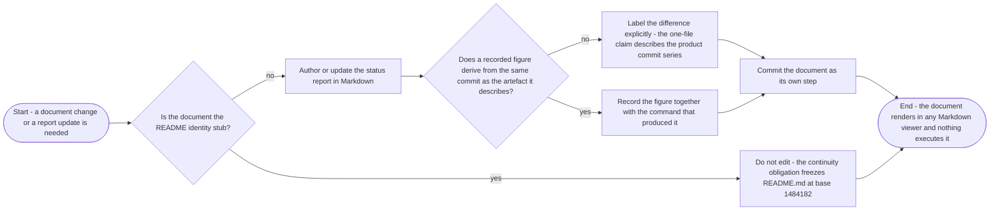
```mermaid
flowchart LR
    P4A(["Start - a document change or a report update is needed"]) --> P4B{"Is the document the README identity stub?"}
    P4B -->|"yes"| P4C["Do not edit - the continuity obligation freezes README.md at base 1484182"]
    P4B -->|"no"| P4D["Author or update the status report in Markdown"]
    P4D --> P4E{"Does a recorded figure derive from the same commit as the artefact it describes?"}
    P4E -->|"no"| P4F["Label the difference explicitly - the one-file claim describes the product commit series"]
    P4E -->|"yes"| P4G["Record the figure together with the command that produced it"]
    P4F --> P4H["Commit the document as its own step"]
    P4G --> P4H
    P4H --> P4I(["End - the document renders in any Markdown viewer and nothing executes it"])
    P4C --> P4I
```

### 4.4.4 Notational Conventions and Validation Notes

**Conventions used across D-1 … D-10.** Swim lanes are subgraphs titled by actor or system, each with a unique identifier so no lane name doubles as a node. Start and end points use stadium shapes, process steps use rectangles, and decision points use diamonds with every outgoing edge labelled by its outcome. Dashed edges mark paths the application does not own — `L2E -.-> L5C` in D-1 is the runtime's own parser refusal, and no application code participates in it. Sequence diagrams use `alt` blocks for branches, and state diagrams carry a `note` for behaviour that is real but not a state change, such as the silent loss of a write that a stream refuses.

**Scope decisions.** Two flows are deliberately not diagrammed. Batch processing does not exist (4.1.3.4), so any batch sequence diagram would document an absence as though it were a design. The documentation flow has no decision that changes the system's behaviour — its only branch is whether to edit a file at all — which is why D-10 stays minimal.

**What the diagrams cannot show.** Three properties of this system resist a diagram and are therefore stated in prose instead: the product run is byte-repeatable and environment-independent (4.1.2.1), the service is unreachable from any host but the local one (4.1.3.2), and the delivery has no automated check behind it, so every verification path terminates in a person (4.3.2.6).


## 4.5 References

- `Welcome.js` — the delivered product: one statement, `console.log('Welcome to Blitzy');`, 34 bytes; source of the product's state machine, its three decision diamonds and the silent stream-failure behaviour
- `server.js` — the pre-existing loopback HTTP service: `require('http')`, hardcoded `127.0.0.1` and port `3000`, one inline listener setting 200 / `text/plain` / `res.end('Hello, World!\n')`, and the absence of an `'error'` listener or shutdown drain that defines the bind-failure and shutdown paths
- `README.md` — the two-line repository identity stub, frozen by the continuity obligation
- `blitzy/documentation/Project Guide.md` — the acceptance dossier: §1.2 hours ledger and KPIs, §1.4 the single open governance item, §1.5 no access issues, §1.6 recommended next steps, §2.1–2.3 hours breakdown and reconciliation, §3 the 42-check gate with the "Not Covered" list, §4 verified runtime flows, §5.1 the twelve-row compliance matrix, §5.2 the three recorded divergences, §6 the eight-row risk register, §8 production readiness, §9 the Development Guide (9.1–9.7, including the nine-line acceptance gate and troubleshooting table), §10 Appendices A–G (command reference, port reference, key file locations, technology versions, environment variables, developer tools, glossary)
- `blitzy/documentation/` — folder containing the Project Guide and nothing else
- `blitzy/` — the platform's in-repository working folder for generated documentation; holds no code, tooling or dependency of its own
- repository root (`""`) — the enumerable tree: `README.md`, `Welcome.js`, `server.js`, `blitzy/`, with no manifest, lockfile, `node_modules`, CI configuration, container file or `.blitzyignore`
- Git history — base `1484182` (pre-project state) → `1cef465` (adds `Welcome.js`, 1 file changed, 1 insertion) → `6c16ea2` (record-only, zero paths changed, message adjudicating the language clause) → `4d1256c` (adds the 381-line Project Guide) → `39974fd` "Merge pull request #15", parents `1484182` and `4d1256c`, merged 22 September 2026; source of the delivery workflow in 4.1.2.3 and the continuity and minimality evidence throughout
- Section 1.2 System Overview, section 2.1 Feature Catalog and section 2.2 Functional Requirements of this specification — capability identifiers F-001…F-005 and requirement identifiers F-001-RQ-001…011, F-002-RQ-001…004, F-003-RQ-001, F-004-RQ-001…002, F-005-RQ-001…005 cross-referenced by every step, decision and validation rule in this section

No web sources were consulted: every fact above derives from the repository, its Git history or the recorded measurements in `blitzy/documentation/Project Guide.md`. Every mermaid diagram in this section parses and renders; D-1 … D-10 were each verified by rendering to image with mermaid-cli.


# 5. System Architecture

## 5.1 High-Level Architecture

The system is fully enumerable: four tracked paths, of which two are executable JavaScript files (`Welcome.js`, `server.js`) and two are Markdown documents (`README.md`, `blitzy/documentation/Project Guide.md`), all executed, where executable at all, by one shared Node.js runtime. Section 1.2 states the same inventory and Section 4 documents the runtime workflows; this section documents the structures and wiring behind them — how each unit is shaped, what it may depend on, and what the architecture deliberately leaves out.

### 5.1.1 System Overview

**Architectural style.** A flat, file-per-capability, manifest-free script architecture: each system capability is one self-contained source file at repository-root depth, run as an operating-system process by a shared host runtime, with no shared code layer, no module graph, no build step, no service composition and no persistence layer.

The style is a direct consequence of the acceptance criteria, not an independent design preference. The delivered capability's entire contract is one line of text on standard output — 18 bytes, empty stderr, exit `0` — and the governing criteria fixed a one-file, one-statement product with a zero-install posture and no measurable impact on the pre-existing service. Any additional structural layer (a shared module, a manifest, a wrapper function, a service façade) would add artefacts and coupling without adding capability, so none exists. What remains is two executables that share a runtime and nothing else.

| Architectural property | Realisation in this repository | Evidence |
|---|---|---|
| Flat decomposition | Every tracked path sits at repository-root depth or in the platform documentation folder | `git ls-files` → `README.md`, `Welcome.js`, `blitzy/documentation/Project Guide.md`, `server.js` |
| Process per invocation | Each `node <file>` run is a fresh process; no daemon, scheduler or supervisor exists | `timeout 10 node Welcome.js` → exit `0` unaided; SIGTERM on `server.js` releases port 3000 |
| Zero third-party dependencies | The product uses the ambient `console` global; the service uses the Node core `http` module only | `Welcome.js:1`; `server.js:1`; probes for a manifest, lockfile or `node_modules` return zero paths |
| No shared code | Neither executable references the other, and neither exports anything | `server.js` contains no reference to `Welcome.js`; tree-wide search for `module.exports`/`exports.` returns zero matches |
| Stateless | No file write, database, cache, queue or session store exists on either path | Source of both executables; no `.env`, data directory or storage dependency in the tree |
| Loopback-bounded service | The only network surface binds the IPv4 loopback address on a literal port | `server.js:3-4` |

**Key architectural principles.** Each principle below is observable in the source rather than asserted as doctrine.

- **One capability, one file.** The product's single flow occupies its own dedicated file containing nothing else — one statement, 34 bytes, no comment, no blank line (`Welcome.js:1`). This is the repository's realisation of the requirement that each flow and feature be clearly separated.
- **Runtime-provided before added.** The product calls a runtime global; the service imports a core module. Neither reaches beyond the platform for behaviour, which is what keeps the install, audit and advisory surface at zero.
- **Fixed behaviour before configurable behaviour.** The message (`Welcome.js:1`), the host and the port (`server.js:3-4`) are literals. No environment variable, argument or configuration file is read; output is byte-identical under `env -i`, with extra arguments and with piped stdin. The trade accepted is the loss of configurability, which is recorded as a risk for the pre-existing service.
- **Minimal surface.** No function, class, variable wrapper, guard, export or abstraction exists in the product; the service's handler is a single inline arrow function (`server.js:6-10`).
- **Fail-open product path, fail-loud bind path.** A write the destination refuses is silently dropped while the process still exits `0`; a second service instance raises an unhandled `EADDRINUSE` event and exits `1`. Both behaviours were reproduced, and both are architectural rather than incidental: no error handler exists on either path.
- **Verification by measurement.** Continuity and non-impact are established by diffs against base `1484182` and by latency sampling around repeated product runs, since no automated guard exists.

**System boundaries.**

| Boundary | What crosses it | What is deliberately closed |
|---|---|---|
| Process | Script text read at start; stdout and stderr writes; exit status | No arguments, stdin, environment variable or input file is consumed by the product |
| Network | HTTP/1.1 requests to one port on the IPv4 loopback address, answered with one fixed response | No listener off `127.0.0.1`, no TLS, no routing, no outbound connection from either executable |
| Data | Nothing but the script text; no read or write of any data store | No database, cache, queue, log sink or temporary file |
| Delivery | Four tracked paths in Git; base commit `1484182` as the continuity reference | No package registry, CI workflow, container image or deployment target |
| Human | Two Markdown documents read by people and renderers | Neither document is parsed or executed by code |

Major interfaces:

| Interface | Provided by | Consumers | Contract |
|---|---|---|---|
| Process invocation | `Welcome.js` | Developer shell, scripts, pipelines | `node Welcome.js` → 18 bytes on stdout, empty stderr, exit `0` |
| HTTP over loopback | `server.js:6-14` | Local HTTP client or browser | Any method and path → `200`, `Content-Type: text/plain`, 14-byte body |
| Execution platform | Node.js runtime (24.x reference line, 22.x supported floor) | Both executable files | ES5-level JavaScript; `require` of core modules; `node --check` parseability |
| Version control | Git | Delivery and verification | Four tracked paths; base `1484182` defines continuity |
| Markdown rendering | `README.md`, `blitzy/documentation/Project Guide.md` | Human readers, Markdown viewers | Inert text; no programmatic interface |

Deliberately absent, and confirmed absent: inbound API for the product, request routing, message broker, batch or scheduled execution, container or orchestrator, remote deployment, runtime configuration and metrics endpoint.

### 5.1.2 Core Components Table

| Component Name | Primary Responsibility | Key Dependencies | Integration Points | Critical Considerations |
|---|---|---|---|---|
| `Welcome.js` — F-001 stdout banner emission | Emit the fixed message `Welcome to Blitzy` and exit; nothing else is in the file | Node.js runtime only, via the ambient `console` global (`Welcome.js:1`) | Process invocation; file descriptor 1; exit status | Byte-exact 18-byte contract (17 characters plus one LF); silent message loss when the destination refuses the write while exit status stays `0`; exact filename casing required on case-sensitive filesystems |
| `server.js` — F-002 loopback HTTP demo response | Accept HTTP connections on loopback and answer every request with one fixed response | Node core `http` module only (`server.js:1`) | TCP bind and listen on `127.0.0.1:3000`; request/response objects; startup log line; process signals | Pre-existing and unmodified; host and port hardcoded with no override; no `'error'` listener (a second start exits `1` with an `EADDRINUSE` trace); no shutdown drain; behaviour identical for every method, path and body |
| Node.js runtime — execution platform | Load and evaluate both scripts; supply globals, core modules, module classification, event loop and TCP stack | Host operating system (verified on Linux); distribution-maintained runtime | Process entry point; module loader; stdout/stderr; exit status; loopback TCP stack | No pin exists in the repository (no manifest, `engines` field or version file); 22.x support ends 30 April 2027; a manifest declaring `"type": "module"` in or above the tree would break `server.js` while leaving `Welcome.js` working |
| `README.md` — F-003 repository identity | State the repository's name and purpose in two lines | None | Human reading and Git tracking only | Frozen at base `1484182` by the continuity obligation; the one-line purpose statement is the repository's only self-description |
| `blitzy/documentation/Project Guide.md` — F-004 delivery status reporting | Record delivery status, verification results, compliance assessment, risks and remaining work | None at runtime; cites the other components as evidence | Human reading and Git tracking | Platform-generated; carries the 42-check gate, the 12-benchmark compliance matrix and the risk register; its one-added-file figure describes the product commit series rather than the full delivery diff from base |

### 5.1.3 Data Flow Description

**Product flow (F-001).** A single hop with no intermediate state:

```text
string literal → console.log formatting → write to process.stdout → file descriptor 1 → terminal, pipe or captured file
```

The literal is the only input; nothing else is read. `console.log` appends one line feed, so the observable payload is 17 characters plus one LF, 18 bytes in total, verified byte for byte as `57 65 6c 63 6f 6d 65 20 74 6f 20 42 6c 69 74 7a 79 0a`. When the process's event loop empties — no timer, socket, listener or handle is registered — the process exits on its own with status `0`, so queued output is never truncated; a deliberately slow pipe reader still receives all 18 bytes.

**Service flow (F-002).** A request/response cycle in which the request contributes nothing to the response:

```text
TCP accept on 127.0.0.1:3000 → runtime HTTP parser → inline listener (request object ignored) → fixed response composed → socket write → client
```

The listener sets `res.statusCode = 200` and `Content-Type: text/plain`, then ends the response with the fixed 14-byte body `Hello, World!\n` (`server.js:7-9`). Observed: `HTTP/1.1 200 OK`, `Content-Length: 14`, body hex `48 65 6c 6c 6f 2c 20 57 6f 72 6c 64 21 0a`, identical for `GET /`, `POST /anything?x=1` and `HEAD /`. Request bodies are never consumed by application code, no routing decision is taken, and nothing about the request is retained. The connection stays alive under the runtime's default keep-alive, which the response advertises as `Connection: keep-alive`, `Keep-Alive: timeout=5`.

**Flow independence.** There is no data flow between the two components: no import, export, IPC channel, shared file, shared store or orchestration layer connects them, so a run of the product cannot influence a request served by the service. That independence is why the non-impact requirement was verified by measurement — latency sampled before, during and after repeated and concurrent product runs stayed at or below the idle baseline with no failed request — rather than argued from the design.

**Transformation points.** The system has exactly three points where bytes change form, all of them fixed mappings of a literal:

| Transformation point | Input | Transformation | Output |
|---|---|---|---|
| Console formatting (`Welcome.js:1`) | String literal, 17 bytes | `console.log` appends one line feed | 18 bytes on file descriptor 1 |
| Response composition (`server.js:7-9`) | Request (discarded) | Constant pair: status `200` plus `text/plain` header, plus literal body with trailing LF | 14-byte body on the socket |
| Refused write | Intended 18-byte payload | Runtime discards the write; no exception is raised | 0 bytes emitted, exit status still `0` |

**Data stores and caches.** There are none. Neither process writes a file, holds state between runs, or consults a database, cache, queue or log store; there is no storage dependency in the tree and no configuration to load. The only durable artefacts in the system are the Git-tracked paths themselves — the two source files and the two documents — which are versioned rather than stored at runtime. The platform capture directory referenced by the guide's risk register is untracked and is absent from this checkout, so it forms part of no committed data flow.

### 5.1.4 External Integration Points

| System Name | Integration Type | Data Exchange Pattern | Protocol/Format | SLA Requirements |
|---|---|---|---|---|
| Node.js runtime (24.x reference line, 22.x supported floor) | Execution platform / host process | Runtime loads and evaluates script text; returns stdout, stderr and exit status to the caller | POSIX process invocation; ES5-level JavaScript; core-module `require` | None stated. Wall time per product run observed at 19–24 ms (Node v22.23.3 in this environment) against a 21–24 ms `node -e ""` interpreter baseline; the guide records an indicative 25–30 ms single run |
| Developer shell and stdout consumer | Human-driven command interface | Command in; 18 bytes out; exit status consumed by the shell; output optionally piped or captured to a file | Shell invocation of the runtime; file descriptor 1; byte assertions must be taken from a pipe or file | None stated. Acceptance is manual by design; a terminal's newline translation can misreport the payload as 19 bytes |
| Local HTTP client or browser | Network request/response | Request (any method, path or body) in; one fixed response out; request data discarded | HTTP/1.1 over IPv4 TCP on `127.0.0.1:3000` | None stated. Reachable from the local machine only; no availability, latency, throughput or concurrency commitment exists |
| Git repository and its remote | Delivery / version control | Commits, merges and diffs; supplies every continuity proof against base `1484182` | Git over HTTPS; the configured remote URL embeds an access credential that must never be reproduced in documentation | None stated. Four tracked paths; the working tree is kept clean so a blanket `git add` cannot add a second artefact |
| Host filesystem and operating system | Artefact storage and script read | Script text read once at process start; documents stored and read by humans; files are mode `0644` | POSIX filesystem, case-sensitive path `Welcome.js` | None stated. A wrong working directory or a wrong filename case fails the run with `MODULE_NOT_FOUND`, exit `1` |
| Blitzy generation pipeline | Delivery-time tooling (not a runtime dependency) | Produced the deliverable, the working branch and the generated status report | Markdown artefact plus Git commits | Not applicable — it participates in delivery, never in a run of either executable |

No other external system participates: there is no package registry, identity provider, observability service, database, broker, CDN, deployment target or third-party API in or around the checkout, and no credential, secret or endpoint is consumed at runtime.

## 5.2 Component Details

A component here is a unit with its own interface. The system has five: the two executables (F-001, F-002), the runtime that hosts them, and the two documents (F-003, F-004). Each is described below by purpose, technology, interfaces, persistence and scaling, followed by the component interaction, state transition and sequence views.

### 5.2.1 `Welcome.js` — F-001 Stdout Banner Emission

**Purpose and responsibilities.** The repository's only delivered artefact (commit `1cef465`, `1 file changed, 1 insertion(+)`). Its single responsibility is to write the fixed message `Welcome to Blitzy` to standard output and let the process end. The file holds nothing else — no function, class, variable, wrapper, guard, conditional, comment or export — which is the repository's realisation of the requirement that each flow and feature be clearly separated.

**Technologies and frameworks.** Plain JavaScript at ES5 syntax level, executed directly by Node.js. The single call is a member call on the ambient `console` global; there is no framework, library, transpiler, bundler, manifest or lockfile involved. The file declares no `import` or `export`, so the runtime classifies it as CommonJS or as an ES module with no behavioural difference — verified by running it beside sibling manifests of both types and with no manifest at all.

**Key interfaces.** Invocation is the only entry point; there is no programmatic API, no export and no accept of parameters.

| Interface | Direction | Contract |
|---|---|---|
| `node Welcome.js` | In | The only supported invocation; extra arguments and piped stdin are ignored |
| File descriptor 1 (stdout) | Out | Exactly 18 bytes: 17 characters plus one LF, hex `57 65 6c 63 6f 6d 65 20 74 6f 20 42 6c 69 74 7a 79 0a` |
| File descriptor 2 (stderr) | Out | Always empty — 0 bytes observed on success and on a refused write |
| Exit status | Out | `0` on success, reached by natural termination with no `process.exit()` call |

Source-shape contract, verifiable by reading one line: one statement, single-quoted literal, terminating semicolon, no indentation, one trailing LF, 34 bytes, SHA-256 `5c7ac141d94f92056efb756f17335252c31e3d08d509e641d76512f73112c1fc`, mode `0644`.

Failure behaviour at the interfaces is architectural rather than defensive: a nonexistent path or a wrong-cased filename (`node welcome.js`) makes the runtime's loader throw `MODULE_NOT_FOUND` and exit `1`, while a destination that refuses the write (closed file descriptor 1, an early-exiting reader) produces exit `0` with the message lost and nothing reported — `console.log` does not raise on a refused stream write.

**Data persistence requirements.** None. The script reads no input file after the runtime has loaded it, writes no file, opens no socket, executes no dynamic code and holds no state between runs; it leaves no process, handle or file behind. There is no data to schema, migrate, back up or expire.

**Scaling considerations.** This component does not scale as a service; it scales by process multiplicity. Each run is independent and byte-repeatable, and repeated and concurrent runs were observed to produce identical bytes with no residue. Its cost is the runtime's own start-up: measured runs of 19–24 ms sit inside the 21–24 ms baseline of an empty `node -e ""` program in the same environment, so the script's own work is not measurable above interpreter start (the guide records an indicative 25–30 ms run). Throughput, if it ever mattered, would be bought with a resident process rather than a cache or a connection pool — a trade examined and rejected in Section 5.3.4.

### 5.2.2 `server.js` — F-002 Loopback HTTP Demo Response

**Purpose and responsibilities.** A pre-existing demo service, byte-identical to base commit `1484182` and explicitly outside the delivered scope. Its one responsibility is to accept connections on the loopback interface and answer every request with the same fixed response; it has no routing, no request-body handling, no request logging, no health endpoint and no graceful shutdown path.

**Technologies and frameworks.** CommonJS, importing only the Node core `http` module (`server.js:1`), with an inline arrow function as the request listener (`server.js:6-10`) and host and port as module-scope literals `'127.0.0.1'` and `3000` (`server.js:3-4`). No framework, middleware, router, template engine or body parser participates. 342 bytes, 14 lines, SHA-256 `332fc2d04eb5b8f3cb230855457af80d0dfc246f958d6e49615610d656acc2e0`, mode `0644`.

**Key interfaces.** The response is a constant, not a function of the request: status, header and body are the same for every input the server accepts.

| Interface | Direction | Contract |
|---|---|---|
| TCP listen on `127.0.0.1:3000` (`server.js:12`) | In | IPv4 loopback only; host and port are hardcoded with no override |
| HTTP request/response objects | In / Out | Request object ignored; response always `200`, `Content-Type: text/plain`, 14-byte body `Hello, World!\n` (`server.js:7-9`) |
| Standard output (`server.js:13`) | Out | One startup line only — `Server running at http://127.0.0.1:3000/`; two requests produced no further output |
| Process signals and exit status | In / Out | SIGTERM or SIGINT ends the process and releases port 3000; no drain of in-flight responses; a bind failure exits `1` |

Observed request handling: `GET /`, `POST /anything?x=1` and `HEAD /` all return `200` with a 14-byte body (body hex `48 65 6c 6c 6f 2c 20 57 6f 72 6c 64 21 0a`, `Content-Length: 14`), the connection stays alive under the runtime's default `Keep-Alive: timeout=5`, malformed requests are answered `400` and oversized request headers `431` — the last two by the runtime's parser, with no application code involved. There is no exported symbol, so the module offers no programmatic API to any other code.

**Data persistence requirements.** None. The process holds no session, cookie, cache or file handle beyond the listening socket, and writes nothing to disk.

**Scaling considerations.** The service is a single process on a single event-loop thread, with no `cluster`, worker-thread or reverse-proxy arrangement; concurrency is limited to what one loop can interleave for a response that is already in memory. Port 3000 on `127.0.0.1` is a singleton resource, so a second instance cannot start at all — it emits an unhandled `'error'` event with `EADDRINUSE: address already in use 127.0.0.1:3000` and exits `1`. Horizontal scale-out therefore requires editing the source, since no environment override exists; operational scale-out is blocked by the same hardcoded pair. Shutdown has no drain phase, so requests in flight at signal time are dropped rather than completed. These limits are recorded in the guide's risk register as pre-existing and owner-owned, not as defects introduced by this delivery.

### 5.2.3 Node.js Runtime — Shared Execution Platform

**Purpose and responsibilities.** The runtime is the only element the two executables share. It loads and evaluates each script, supplies the globals and core modules the scripts rely on (`console` for the product; `http` and its `net` socket layer for the service), classifies each file through its module loader, drives the event loop, and owns the process lifecycle — including the natural termination that ends a product run when no handle remains registered.

**Technologies and frameworks.** JavaScript at ES5 syntax level; Node.js core only, with no third-party package anywhere in the dependency path. Recorded lines: v24.21.0 as the reference line and v22.23.2 as the supported floor, with 22.x end of life on 30 April 2027 (guide §6, §10 Appendix D); Linux-verified. This inspection environment runs v22.23.3 at `/usr/bin/node`, and `node --check` exits `0` for both tracked `.js` files.

**Key interfaces.** The runtime is reached through the command line rather than an API surface:

| Interface | Contract |
|---|---|
| `node <file>` | Loads and evaluates one script in a fresh process; the only execution interface of either component |
| `node --check <file>` | Read-only parse gate; installs nothing and executes nothing; both tracked files pass |
| `node --test` | Built-in test runner; reports 0 tests, 0 suites, 0 pass, 0 fail — no test file exists |
| Module loader and classifier | Resolves `require` for core modules and decides CommonJS versus ES-module treatment from the nearest manifest |
| Standard streams and exit status | Provides file descriptors 1 and 2 and the process exit code both components rely on |

The classifier is architecturally load-bearing: because `Welcome.js` declares no `import` or `export` it is indifferent to classification, while `server.js` depends on CommonJS treatment. A manifest declaring `"type": "module"` placed in or above the repository would therefore break the service at runtime while leaving the product working — the reason the tree is deliberately kept manifest-free, and the reason any future manifest must declare `"type": "commonjs"` and be followed by a re-run of both files.

**Data persistence requirements.** None beyond process memory. The module cache is per-process and dies with the process; the runtime persists no state for either component.

**Scaling considerations.** One runtime instance per OS process. The product scales by process multiplicity, the service by event-loop concurrency. No version pin exists in the repository — no manifest, `engines` field, `.nvmrc` or container image asserts a line — so runtime selection is an operational convention rather than an enforced constraint, and the maintenance surface is the runtime's own support lifecycle. The supported floor leaves support on 30 April 2027, after which hosts on that line receive no security patches; the source uses no version-sensitive syntax, so moving to a later line requires no code change.

### 5.2.4 Documentation Components — F-003 and F-004

**Purpose and responsibilities.** `README.md` states the repository's identity in two lines — the heading `# hao-backprop-test` and the purpose sentence `test project for backprop integration.` — and is the repository's only self-description. `blitzy/documentation/Project Guide.md` records the delivery: scope, hours, the 42-check acceptance gate, the 12-benchmark compliance matrix, the three recorded divergences, the eight-risk register and the development guide. It is the evidence base every verification claim in this specification rests on alongside direct inspection.

**Technologies and frameworks.** Markdown throughout; the guide additionally carries mermaid pie charts for completion and hours. Neither document has a build step, template engine or publishing pipeline, and neither is read by either executable.

**Key interfaces.** Human reading only, through a Markdown viewer or plain text. There is no programmatic interface, no schema and no generated output other than the rendered document. The guide cross-references the source paths, the Git history and the recorded command outputs, so its accuracy depends on the commit series it was produced from: its one-added-file figure describes the product commits before the report itself was committed, while `git diff --name-status 1484182 HEAD` lists both `A Welcome.js` and `A blitzy/documentation/Project Guide.md`.

**Data persistence requirements.** Both are files under version control — `README.md` at 58 bytes and one newline-terminated line, the guide at 381 lines and 35,992 bytes, both mode `0644`. `README.md` is frozen at base `1484182` by the continuity obligation; the guide is tracked and committed on the delivery branch.

**Scaling considerations.** Not applicable: the documents have no runtime behaviour, serve no concurrent reader and carry no state. Their only operational consideration is hygiene — the platform capture directory referred to by the guide's risk register is untracked and absent from this checkout, and the delivered path must be staged by name so a blanket `git add` cannot breach the one-added-file criterion.

### 5.2.5 Component Interaction Diagram

The view below shows ownership and resource boundaries rather than sequencing: two processes that never communicate, one runtime they both use, and the three external resources they touch — standard output, the loopback interface and the local client. It complements the workflow views in Section 4.1.1 (D-1) and the per-flow diagrams D-2 and D-3, which model execution order instead.

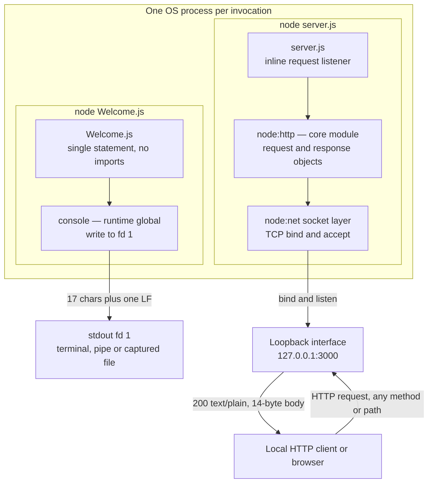
```mermaid
flowchart TB
    subgraph Proc["One OS process per invocation"]
        subgraph PRun["node Welcome.js"]
            WJS["Welcome.js<br/>single statement, no imports"]
            WCON["console — runtime global<br/>write to fd 1"]
        end
        subgraph SRun["node server.js"]
            SJS["server.js<br/>inline request listener"]
            SHTTP["node:http — core module<br/>request and response objects"]
            SNET["node:net socket layer<br/>TCP bind and accept"]
        end
        WJS --> WCON
        SJS --> SHTTP
        SHTTP --> SNET
    end
    OUT["stdout fd 1<br/>terminal, pipe or captured file"]
    LOOP["Loopback interface<br/>127.0.0.1:3000"]
    CL["Local HTTP client or browser"]
    WCON -->|"17 chars plus one LF"| OUT
    SNET -->|"bind and listen"| LOOP
    CL -->|"HTTP request, any method or path"| LOOP
    LOOP -->|"200 text/plain, 14-byte body"| CL
```

Three properties the diagram makes explicit: the two executables share no edge with each other, so neither can affect the other's behaviour; the product's only outgoing edge is a stream write, so its output contract is a byte count rather than a protocol; and the service's only incoming edge is the loopback interface, so its exposure is bounded by the host.

### 5.2.6 State Transition Diagram

This is the system's operational state model: which states the deployment can occupy, how it moves between them, and which transitions are refused. Per-process state detail, including the product's six reachable states and the service's bind–listen–serve–shutdown sequence, is given in Section 4.3.1.1 and 4.3.1.2 (D-7 and D-8); the view here is drawn at the deployment level instead.

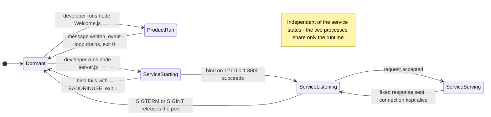
```mermaid
stateDiagram-v2
    direction LR
    [*] --> Dormant
    Dormant --> ProductRun : developer runs node Welcome.js
    ProductRun --> Dormant : message written, event loop drains, exit 0
    Dormant --> ServiceStarting : developer runs node server.js
    ServiceStarting --> ServiceListening : bind on 127.0.0.1:3000 succeeds
    ServiceStarting --> Dormant : bind fails with EADDRINUSE, exit 1
    ServiceListening --> ServiceServing : request accepted
    ServiceServing --> ServiceListening : fixed response sent, connection kept alive
    ServiceListening --> Dormant : SIGTERM or SIGINT releases the port
    note right of ProductRun
        Independent of the service states - the two processes share only the runtime
    end note
```

`Dormant` is the resting state in which nothing is running and the repository is inert. `ProductRun` is a bounded state that always returns to `Dormant` unaided; it has no failure state of its own, which is why a refused write leaves the system indistinguishable from success at the state level. `ServiceStarting` is the only branch point: success yields `ServiceListening`, while a port already held by another process sends the system straight back to `Dormant` with a non-zero exit and an unhandled-error trace, since no `'error'` listener exists to intercept it. `ServiceServing` self-loops by design — the response is constant, so the state carries no per-request data forward. The only exit from `ServiceListening` is a signal, and there is no draining state between the signal and `Dormant`.

### 5.2.7 Sequence Diagram for Key Flows

One view carries both key flows, because the system has exactly two and they share their first three steps — process creation and script evaluation by the runtime.

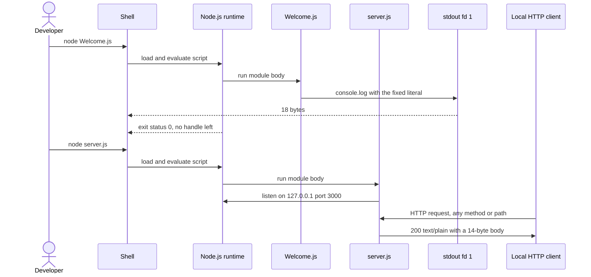
```mermaid
sequenceDiagram
    actor Dev as Developer
    participant Sh as Shell
    participant Rt as Node.js runtime
    participant W as Welcome.js
    participant S as server.js
    participant Out as stdout fd 1
    participant Cl as Local HTTP client
    Dev->>Sh: node Welcome.js
    Sh->>Rt: load and evaluate script
    Rt->>W: run module body
    W->>Out: console.log with the fixed literal
    Out-->>Sh: 18 bytes
    Rt-->>Sh: exit status 0, no handle left
    Dev->>Sh: node server.js
    Sh->>Rt: load and evaluate script
    Rt->>S: run module body
    S->>Rt: listen on 127.0.0.1 port 3000
    Cl->>S: HTTP request, any method or path
    S->>Cl: 200 text/plain with a 14-byte body
```

Read against the code: the product flow is over in three steps from script evaluation to exit, with no reply path other than the stream itself and no read of any input channel; the service flow establishes a listener once and then answers an unbounded number of identical exchanges. Integration-level sequence detail for the same two flows, including the runtime-generated refusal branches, is in Section 4.1.3.1 and 4.1.3.2 (D-5 and D-6).

## 5.3 Technical Decisions

The decisions below are read from the artefact and from the recorded delivery record, not reconstructed as intent. Each names what was chosen, what it costs, and what would have to change for the choice to stop being right.

### 5.3.1 Architecture Style Decisions and Tradeoffs

**The style chosen.** A flat, file-per-capability, manifest-free script architecture with a process-per-invocation execution model for the product and a single long-lived process for the pre-existing service. The style was constrained rather than selected: the acceptance criteria fixed a one-file, one-statement product, a zero-install posture and no measurable impact on the pre-existing service.

| Decision | Choice made | Trade-off accepted |
|---|---|---|
| Decomposition granularity | One capability per file, at repository-root depth | No shared abstraction layer and no reuse; a second flow requires a new file rather than a new function |
| Coupling between components | No shared code, symbol, import or channel between the two executables | The runtime dependency is not factored into a common module and there is no shared contract to version; in exchange, no failure can propagate between them |
| Execution model | Fresh process per product run; one resident process for the service | No warm state, no in-process reuse and no library interface; restart is the only recovery mechanism for the service |
| Packaging | No manifest, lockfile or `node_modules` | No dependency management, no declared runtime floor, and the classification asymmetry in which a `"type": "module"` manifest breaks `server.js` but not `Welcome.js` |
| Build and release | Source is committed and executed as written; nothing is built | No artefact pipeline and no build-time verification; the runtime line itself is the only portability guarantee |

**Why not a layered, client–server or service-oriented structure.** None of the standard patterns has anything to name here. There is no domain logic to layer — the product's entire behaviour is one write and the service's entire behaviour is one constant response. There is no shared cross-cutting service (no logging, caching, configuration or persistence layer) for a layering pattern to abstract. There is exactly one network interface, on loopback, with a fixed answer, so no service decomposition or gateway is warranted; and with two components that share no edge, an orchestrator or broker would introduce a dependency where none exists. Applying any of those patterns would add files and configuration to a repository whose acceptance criteria count both.

**When this choice stops being right.** The style's boundary conditions are explicit. A second product flow, an inbound API on the service, a need for configuration (host, port, message), a third-party dependency, or any requirement for an automated regression net each invalidates one of the constraints above and should be treated as a scope change rather than an incremental edit.

### 5.3.2 Communication Pattern Decisions

| Interaction | Pattern chosen | Rationale | Alternative rejected |
|---|---|---|---|
| Shell → product (F-001) | One-shot process invocation; result delivered as a byte stream plus exit status | Minimal, composable with pipes, and byte-assertable — the acceptance check is a byte count | A library export or resident helper process: adds an import surface, a lifecycle and artefact count the criteria exclude |
| Local client → service (F-002) | Synchronous HTTP request/response over IPv4 loopback with the runtime's default keep-alive | The answer is a constant, so no routing, negotiation or streaming logic is needed | Event or message-based integration, multiple endpoints, or a socket protocol: all would add protocol semantics to a fixed answer |
| Component ↔ component | No communication at all | The two capabilities are independent; non-impact on the service was then verified by measurement rather than by design argument | A shared module, an IPC channel or a scheduler: each would couple the two and create a failure path between them |
| Product → environment | No input channel read — no argument, stdin, environment variable or configuration file | Deterministic, environment-independent output; verified byte-identical under `env -i`, with extra arguments and with piped stdin | Configuration by environment or file: would add a validation surface, a failure mode and a deployment step |
| Service → runtime | In-process calls to the core `http` module; no outbound network connection | Keeps the dependency count at zero and the network exposure to one inbound loopback port | A framework or reverse proxy: adds dependencies, advisories and configuration for a constant response |

The uniform principle is constancy: every interaction is one-directional and fixed, so no protocol negotiation, retry policy, backpressure handling, ordering guarantee or idempotency question arises anywhere in the system.

### 5.3.3 Data Storage Solution Rationale

**Decision: no storage layer.** Both flows are pure functions of fixed literals, so there is no state to persist; the only durable artefacts in the system are the version-controlled files themselves.

| Storage concern | Selection | Rationale |
|---|---|---|
| Primary datastore | None | No capability reads or writes persistent data; the product's contract is an output byte sequence, not a record |
| Filesystem writes | None | Neither executable creates, modifies or deletes a file; a run leaves no residue |
| Cache or session store | None | No repeated computation to memoise and no user session to hold |
| Queue, log store or metrics store | None | No asynchronous work, no request log and no metric is produced |
| Durable artefact store | Git repository — four tracked paths | Version control is the only persistence the delivery needs: it supplies the continuity proofs and the recovery path |

**Implications, all of them simplifications.** There is no schema or migration to manage, no backup or restore procedure to operate, no retention or personal-data lifecycle to honour, no consistency model to reason about, no transaction boundary to define, and no connection pool to size. The corresponding limitation is equally clear: the system cannot remember anything between runs, so any future capability requiring state would be a new architectural decision rather than an extension of this one. The untracked platform capture directory referred to by the guide's risk register is absent from this checkout and forms no part of the stored data model.

### 5.3.4 Caching Strategy Justification

**Decision: no cache anywhere in the system.** Nothing is cached at the application level, no cache headers or validators are emitted by the service, and the only cache that exists at all is the runtime's per-process module cache, which is discarded when the process ends.

Four facts justify the absence rather than merely explain it:

- **The input is a literal.** Both components work from constants compiled into the source — a 17-character string and a 14-byte response body. Cached values and computed values are identical by construction, so a cache can only add a layer between them.
- **There is no repeated work within a run.** The product makes one write per process; the service composes the same response from memory on each request. A memoisation would have nothing to reuse within a single process lifetime.
- **The load is already minimal.** The product's whole run is dominated by the interpreter's own start-up — 19–24 ms measured against a 21–24 ms empty-program baseline — and a service response is a socket write of 14 bytes. The remaining work is below the measurement floor.
- **A warm path would break a stated contract.** The obvious alternative — a resident process that keeps the message and the connection ready — would replace the process-per-invocation model, forfeit natural termination, and put an always-running process beside a service that already holds the only port the system uses.

If throughput ever became a requirement, the appropriate lever is architectural (a resident process, or serving the response from the runtime's own buffer) rather than a cache tier; that change should be recorded as a new decision, not folded into this one.

### 5.3.5 Security Mechanism Selection

| Control area | Selection | Rationale |
|---|---|---|
| Network exposure | Bind the IPv4 loopback address on one literal port (`server.js:3-4`) | The only network surface is unreachable from any other host, so no perimeter control, firewall rule or rate limit is needed |
| Transport security | Plaintext HTTP on loopback | Traffic never leaves the machine; TLS would add certificates, key material and configuration to a constant response |
| Authentication and authorization | None | No identity is established, no session or token exists, and the response is identical for every caller — there is no protected resource to authorise |
| Input validation | Application code validates nothing, because it consumes nothing | The product reads no input channel; the service ignores the request object entirely. Malformed requests (400) and oversized headers (431) are refused by the runtime's parser before application code is reached |
| Secret management | No secret is read, held or transmitted by either component | Nothing in the product or service touches credentials, so there is no rotation, storage or leak surface at runtime |
| Dependency surface | Zero third-party packages | No transitive advisory exposure, no lockfile to audit and no supply-chain update path to operate |
| File permissions | Mode `0644` on all tracked files | Readable by the owner and by others on the host; no executable bit and no privileged ownership required |
| Dynamic code execution | None | No `eval`, no `vm` usage and no generated code path exists in either file |

**Residual security considerations.** Four items are recorded rather than mitigated, and each is bounded by the loopback constraint:

- A bind failure surfaces an unhandled-error stack trace on stderr, including the address and port — an information disclosure of no consequence on a single-user host, but it is why no `'error'` listener is a robustness gap.
- The service answers every method and path identically, including on paths that would conventionally be denied; with no routing and no protected resource, there is nothing to bypass, but any future endpoint added to this listener would need its own authorisation design.
- The Git remote configured in this checkout embeds an access credential in its URL. That credential is delivery-side only — neither executable reads it — but it must never be reproduced in documentation, logs or the report.
- The architecture's security posture rests on its absences: the guide's risk register names the introduction of a dependency, a command-line argument or any input channel as a scope change, because each would create a validation surface that does not exist today.

### 5.3.6 Architecture Decision Tree

The tree records the reasoning that produced the style, in the order the questions were actually decisive. It is written to be reusable: the same three questions classify any future capability proposed for this repository.

```mermaid
flowchart TD
    Q1{"Do the acceptance criteria fix the artefact to one file and one statement?"}
    Q1 -->|yes| Q2{"Does the flow need anything the runtime does not provide?"}
    Q1 -->|no| Q3{"Is the capability a long-running service?"}
    Q2 -->|no| A1["Zero-dependency script on a runtime global - CHOSEN for F-001"]
    Q2 -->|yes| A2["Add a manifest, lockfile and install step - REJECTED: adds artefacts and configuration"]
    Q3 -->|yes| A3["Separate service process with a bind interface - used by F-002"]
    Q3 -->|no| A1
```

Read left to right: minimality dominates dependency convenience for a single-flow capability, and the service shape is reserved for work that must stay resident. Both outcomes end in the same posture — a standalone file that runs as written with no install step — which is why the repository needs no packaging decision for any capability it has today.

### 5.3.7 Architecture Decision Records

| ID | Decision | Status | Consequence |
|---|---|---|---|
| ADR-001 | One self-contained file per capability, placed at repository-root depth | Accepted | Maximum auditability and separation; no shared abstraction layer, and no reuse across flows |
| ADR-002 | No package manifest, lockfile or `node_modules` in the tree or any ancestor | Accepted, deliberately | The product runs as written with zero install; in exchange there is no declared runtime floor, and a manifest added later must declare `"type": "commonjs"` or it breaks the service |
| ADR-003 | Standard output as the product's only output channel, with natural termination and no `process.exit()` | Accepted | Output is byte-assertable and never truncated by a forced exit; a destination that refuses the write loses the message silently while exit status stays `0` |
| ADR-004 | The service binds `127.0.0.1:3000` from literals, with no configuration override, no TLS and no error listener | Accepted, pre-existing and unmodified | Exposure is confined to the local machine and the source stays minimal; the port cannot be changed without editing code, a second instance fails with an unhandled error and shutdown does not drain |
| ADR-005 | No persistence, cache, queue or messaging layer | Accepted | Nothing to operate, back up, migrate or secure; the system retains no state between runs |
| ADR-006 | Manual acceptance gate instead of an automated test suite | Accepted by design | Keeps the file and line counts at their ceiling and adds no tooling; there is no automated regression net, so the documented gate must be re-run on any change |
| ADR-007 | Zero third-party dependencies; runtime globals and core modules only | Accepted | No advisory exposure, no audit or update path, and no dependency resolution step; all capability is bounded by what the platform provides |
| ADR-008 | JavaScript for a product whose governing project rule places new products in Python | Accepted, with the divergence recorded | Every functional and non-functional requirement is met and 11 of 12 compliance benchmarks pass; the language clause remains an open, owner-owned governance item with no code remedy |

Four of these records carry reasoning worth stating in full.

**ADR-002 — the deliberate absence of a manifest.** A manifest would be the natural home for the runtime floor and for the product's name and version, and the repository has none. The trade is deliberate: a manifest adds a file to a tree whose acceptance criteria count added files, introduces an install and dependency-resolution step the zero-install posture excludes, and creates the classification hazard described in Section 5.2.3. The cost is that the supported runtime line exists only as a documented convention — no `engines` field or version file asserts it — so runtime drift would be detected by a reading of the guide, not by a failing check.

**ADR-004 — a loopback service with no configuration and no error path.** Hardcoded host and port and the absence of an `'error'` listener are what keep the service at 14 lines, and binding loopback is a genuinely strong control: the surface cannot be reached from another machine. The costs are all operational and pre-existing — the port cannot be moved without editing the source, a second instance cannot start, in-flight responses are not drained on shutdown, and a bind failure prints a stack trace rather than a handled message. These are recorded in the guide's risk register as owner-owned items outside this delivery's scope, and they are the reason this section documents the service as a constraint on the architecture rather than as a component to extend.

**ADR-006 — a manual acceptance gate.** With no test file, no runner and no CI workflow, acceptance is a nine-line shell procedure whose results are recorded in the guide. The benefit is that no tooling, configuration or test file enters a repository whose criteria forbid them. The cost is a genuine gap, stated plainly in the guide's own "Not Covered" list: an edit that changed the message, added a line or renamed the file would not be caught by anything but a human re-running the gate. The right moment to revisit this decision is the moment the product grows beyond one statement.

**ADR-007 — JavaScript where the rule says Python.** The governing project rule requires new products in Python; the product's own request named JavaScript and the filename `Welcome.js` in the same sentence. Both cannot govern one artefact, and the specific instruction was followed: no `.py` file, stub, port or shim exists anywhere in the tree. The consequence is governance-only — two of the rule's three clauses (flow separation and performance non-impact) are met and verified, all 17 requirements are satisfied, and the language clause stands open as an owner decision that cannot be closed by any code change.

## 5.4 Cross-Cutting Concerns

Cross-cutting concerns are where a small system most often claims capability it does not have. Each concern below is stated as it actually is — in most cases as an absence with a stated substitute and a bounded consequence — with the evidence for that statement.

### 5.4.1 Monitoring and Observability Approach

**There is no monitoring or observability instrumentation of any kind.** No metrics endpoint or counter exists, no health or readiness probe is served, no alert rule or dashboard is configured, no log aggregation or APM agent participates, and no uptime check targets the service. The repository contains no monitoring configuration, no exporter and no telemetry dependency.

| Observability facility | Status | Substitute, and its limit |
|---|---|---|
| Metrics and instrumentation | Absent | None. The only measurable signals are wall-clock duration and exit status, both observed externally |
| Health or readiness check | Absent | None. Liveness is inferred from the process existing and the port answering |
| Alerting and dashboards | Absent | None. A failure is noticed when a human reads stderr or a failed check |
| Distributed tracing | Absent | Not applicable — there is no peer service and no context to propagate |
| Verification evidence | Manual, recorded | The nine-line acceptance gate and the 42 executed checks recorded in `blitzy/documentation/Project Guide.md`, plus latency sampling around repeated product runs |

The practical consequence is that the system is observable only by running it: a product run is proved correct by capturing its 18 bytes and checking its exit status, and a service fault is visible only as a stack trace on stderr or a refused connection. Because the acceptance evidence is produced by hand and recorded in a document, it is accurate for the commit series it describes and does not update itself.

### 5.4.2 Logging and Tracing Strategy

| Channel | Producer | Content observed | Retention |
|---|---|---|---|
| Standard output | `Welcome.js:1` | One line, the 18-byte banner — the product's entire observable output | None; lives in the consumer's pipe, buffer or captured file |
| Standard output | `server.js:13` | One startup line per process: `Server running at http://127.0.0.1:3000/` | None; the process's own stream |
| Standard error | Node.js runtime | Only on failure — for example the unhandled `listen EADDRINUSE` trace with its stack frames | None |
| Exit status | Both processes | `0` on success; `1` on a loader failure or a bind failure | Consumed by the shell, script or CI step that invoked it |

There are no log levels, no structured or JSON records, no correlation identifiers, no application-generated timestamps, no log rotation and no retention policy. Nothing is written to a file. Two properties of this strategy are deliberate and one is a documented gap:

- **The product's single line is the contract, not a log.** Treating it as a log would be a mistake: its byte count is the acceptance criterion, so any added output would break the requirement it exists to satisfy.
- **The service logs lifecycle, never traffic.** Two requests produced one line of output — the startup banner — so request volume, paths, methods, status codes and errors are all invisible in application logs. The only trace of an individual request is the response the client received.
- **Silent-failure gap.** Because `console.log` does not raise when the destination refuses the write, a lost message and a delivered message are indistinguishable from the process's own output: in both cases stderr is empty and exit status is `0`. Verification must therefore capture bytes from a pipe or file rather than trust the exit status, and a terminal's newline translation can further misreport the payload as 19 bytes.

### 5.4.3 Error Handling Patterns

**The architectural pattern is deliberate absence of application-level handling.** Neither file contains a `try`/`catch`, an `'error'` listener, a validation clause, a retry, a fallback, a timeout, a circuit breaker or a dead-letter path. The system's error behaviour is therefore the runtime's default behaviour plus whatever the operator does next, which is consistent with a design in which neither flow has a conditional, a retryable dependency or a variable input.

| Failure class | Observed behaviour | Recovery |
|---|---|---|
| Product run: script not found by path or case | Runtime loader throws `MODULE_NOT_FOUND`, exit `1` | Correct the working directory or the filename casing |
| Product run: destination refuses the write | No exception raised; message lost; exit status still `0`; stderr empty | Re-run with a writable destination and assert the captured bytes |
| Service start: port 3000 already bound | Unhandled `'error'` event; `EADDRINUSE` trace on stderr; exit `1` | Terminate the process holding the port, or edit the hardcoded literal |
| Service request: malformed or oversized request | Runtime answers `400` or `431` before application code is reached | None required; no application code participates |
| Runtime missing or unsupported | Shell reports the command as not found; no process starts | Install a supported LTS line |
| Drifted tracked file | Nothing detects it — no test, no build and no checksum check runs automatically | Compare against base `1484182` and the recorded hashes |

Failure-state detail, including the full set of twelve observed failure states and their routing, is documented in Section 4.3.2.1 and its flowchart D-9; this sub-section records the architectural pattern behind them rather than repeating the enumeration. Two consequences are worth carrying forward: the product path fails open (a lost message still reports success), and the service's bind path fails loud with a stack trace rather than a handled message. Neither has retry logic to reason about, because neither has a transient dependency to retry.

### 5.4.4 Authentication and Authorization Framework

**There is no authentication or authorization framework, and none is needed by the current surface.** No identity provider, session store, token, cookie, credential, role, permission list, access-control rule or protected resource exists in either component. The product establishes no connection and serves no request; the service answers every caller identically and therefore has nothing to protect.

What stands in place of a framework is boundary placement rather than identity:

- **Network reachability** — the service binds the IPv4 loopback address only, so the sole access control on the HTTP surface is that no remote host can reach it.
- **Filesystem and repository access** — the artefacts are mode `0644`; reading or modifying them requires local or repository access, which the host's own account model governs.
- **Delivery-side credential** — the Git remote URL configured in this checkout embeds an access token. It is used by Git alone, is never read by either executable, and must not be reproduced in documentation or logs.

A second layer would be added the moment any of three things changes: binding beyond loopback, adding an endpoint that exposes data, or introducing any caller identity. Each of those is a scope change under this architecture, not a configuration change.

### 5.4.5 Performance Requirements and SLAs

**No service-level agreement — latency, throughput, concurrency or availability — is stated by the source, the README or the delivery record.** The only performance obligation that exists anywhere in the recorded rules is non-impact: the governing rule requires that the code not affect the application's performance, and that obligation was verified by measurement rather than assumed.

| Performance dimension | Requirement stated | Observed |
|---|---|---|
| Product run duration | None | 19–24 ms wall time per run (5 runs, Node v22.23.3); the guide records an indicative 25–30 ms |
| Interpreter start-up share | None | An empty `node -e ""` program measured 21–24 ms in the same environment, so the script's own work is not separable from start-up |
| Product throughput | None | Not specified or tested; runs are independent processes and repeatable byte-for-byte |
| Service response | None | Fixed status, header and 14-byte body already in memory; no computation, I/O or upstream call per request |
| Service concurrency | None | One event-loop thread; no worker, cluster or connection limit configured; runtime defaults apply (keep-alive timeout 5 s observed) |
| Impact on the running service | Non-impact required by the project rule | Latency medians during and after repeated and concurrent product runs stayed at or below the idle baseline, with no failed request and stable memory, thread and descriptor counts (guide §4) |
| Availability | None | Single process, single port, no supervisor, no redundancy; a second instance cannot start because the port is a singleton |

Two limits on this evidence should be read alongside it. The figures come from one environment on one runtime line and are single-run measurements rather than steady-state benchmarks, and the guide's own risk register warns that assertion practice matters more than the numbers: byte counts must be taken from a pipe or captured file, and exit status alone does not prove the message was delivered.

### 5.4.6 Disaster Recovery Procedures

**Because the system holds no state, disaster recovery reduces to restoring files and a runtime.** There is no backup set, no replication, no standby instance, no failover mechanism, no degraded mode and no data-restore procedure — and, correspondingly, no recovery point objective or recovery time objective to meet, since the only durable artefacts are version-controlled files and their canonical copy is the Git repository.

| Failure scenario | Recovery procedure | Recovery source |
|---|---|---|
| Runtime lost or host rebuilt | Install a supported LTS line; no package installation or configuration follows | The guide's prerequisites section; no manifest or lockfile to restore |
| Checkout lost or corrupted | Clone the repository and check out the delivered commit; nothing else is required | Git remote and the tracked commit history |
| Product file drifted or damaged | Restore the file from Git; the recorded SHA-256 is `5c7ac141d94f92056efb756f17335252c31e3d08d509e641d76512f73112c1fc` | Commit `1cef465` |
| Pre-existing files drifted | Restore `README.md` and `server.js` to base `1484182`, which is the byte-identical reference; `server.js` SHA-256 is `332fc2d04eb5b8f3cb230855457af80d0dfc246f958d6e49615610d656acc2e0` | Base commit `1484182` |
| Port 3000 occupied or the service unresponsive | Terminate the process holding the port, then restart; the port is released on SIGTERM or SIGINT. No restart policy exists | Operator action; no supervisor or health check to automate it |
| Verification record lost or suspected stale | Re-run the nine-line acceptance gate and re-read the recorded figures, noting that the guide's one-added-file figure describes the product commit series rather than the full diff from base | The guide's development guide and appendices |
| Governance divergence unresolved | Owner decision — amend or narrow the rule, or issue a product-scoped waiver; the file stays byte-identical | Recorded divergence 1 and the risk register |

The recovery time for every scenario is bounded by a re-clone and, at most, a runtime installation. Two standing obligations complete the procedure: keep the working tree clean so a blanket `git add` cannot add the untracked platform capture directory, and re-run the documented gate on any change to either executable, since no automated check would catch a regression.

### 5.4.7 Error Handling Flow Diagram

The diagram below is the architectural view of failure routing: which surface failed, what the runtime does about it with no application code present, and where every path converges. It complements the operational flowchart D-9 in Section 4.3.2.2 by naming the owning surface rather than the sequence of recovery steps.

```mermaid
flowchart TD
    E1{"Which surface failed?"}
    E1 -->|"product run: script not found by path or case"| R1["Runtime loader throws MODULE_NOT_FOUND, exit 1"]
    E1 -->|"product run: destination refuses the write"| R2["console does not raise, message lost, exit 0"]
    E1 -->|"service start: port 3000 already bound"| R3["Unhandled error event, EADDRINUSE stack trace, exit 1"]
    E1 -->|"service request: header over the core limit"| R4["Runtime answers 431, no application code"]
    E1 -->|"service request: malformed request"| R5["Runtime answers 400, no application code"]
    R1 --> T["Operator-driven recovery: fix the path, free the port, or restart"]
    R2 --> T
    R3 --> T
    R4 --> T
    R5 --> T
```

Every branch terminates in the same place — a person acting on a shell message or a captured byte count — because no component contains a handler, a supervisor, an alert or a retry. That is the honest shape of error handling in this system: two branches are handled by the runtime's defaults and are self-evident to the caller, one is handled by nothing at all and is therefore silent, and all five require a human before the system is back in its dormant, working state.

## 5.5 References

- `Welcome.js` — the delivered component (F-001): single statement `console.log('Welcome to Blitzy');`, 1 line / 34 bytes, mode `0644`, SHA-256 `5c7ac141d94f92056efb756f17335252c31e3d08d509e641d76512f73112c1fc`; establishes the product's interface, output contract, module neutrality and absence of persistence.
- `server.js` — the pre-existing service component (F-002): CommonJS `require('http')` at line 1, host and port literals `'127.0.0.1'` / `3000` at lines 3–4, inline listener at lines 6–10, `listen` and startup log at lines 12–14; 14 lines / 342 bytes, SHA-256 `332fc2d04eb5b8f3cb230855457af80d0dfc246f958d6e49615610d656acc2e0`; establishes the fixed 200 `text/plain` 14-byte response, the loopback-only exposure and the missing error listener and drain.
- `README.md` — repository identity (F-003) in two lines; establishes the project's self-description and the continuity obligation that freezes it at base `1484182`.
- `blitzy/documentation/Project Guide.md` — the delivery record (F-004), 381 lines / 35,992 bytes: reference runtime v24.21.0 and supported floor v22.23.2 with 22.x end of life on 30 April 2027, the nine-line acceptance gate and its 42/42 results, the 12-benchmark compliance matrix (11 PASS, 1 NOT MET), the three recorded divergences, the eight-risk register, the hours breakdown and Appendices A–G; establishes every recorded figure this section cites, including the indicative 25–30 ms run time, the non-impact latency sampling and the open governance item.
- `blitzy/` — the platform's in-repository working folder; establishes that the generated documentation is not source code and carries no dependencies or tooling of its own.
- `blitzy/documentation/` — holds the single generated Markdown report, the only non-source directory in the tree; establishes that no capture directory exists in this checkout.
- Repository root (path `""`) — establishes the four tracked paths, the flat depth-1 layout, and the absence of any manifest, lockfile, `node_modules`, CI workflow, container file, configuration file or `.blitzyignore`.
- Tracked Git history — base commit `1484182` (continuity reference), `1cef465` (adds `Welcome.js`, 1 file changed / 1 insertion), `6c16ea2` (record-only, zero paths changed), `4d1256c` (adds the Project Guide), `39974fd` (merge of PR #15); establishes provenance and every continuity and minimality claim.
- [web] None — no web source was used. All external-dependency facts (runtime lines, the 22.x end-of-life date and the loopback/keep-alive behaviour) are cited from `blitzy/documentation/Project Guide.md` and from direct execution of the tracked files.

# 6. SYSTEM COMPONENTS DESIGN

## 6.1 Core Services Architecture

### 6.1.1 Applicability Determination and Rationale

**Core Services Architecture is not applicable for this system.**

The repository `hao-backprop-test` contains no microservices, no distributed topology and no distinct service components. It is a flat set of four tracked paths — two single-file JavaScript programs (`Welcome.js`, `server.js`) and two Markdown documents (`README.md`, `blitzy/documentation/Project Guide.md`) — executed, where executable at all, by one shared Node.js runtime process per invocation, with no manifest, no third-party dependency, no build step and no persisted state. Section 5.1.1 characterises the style as a "flat, file-per-capability, manifest-free script architecture" and lists what is "deliberately absent, and confirmed absent": an inbound API for the product, request routing, a message broker, batch or scheduled execution, a container or orchestrator, remote deployment, runtime configuration and a metrics endpoint. Consequently, the constructs this section would otherwise describe — independently deployable service boundaries, inter-service transport, service discovery, load balancing, circuit breakers, retries, auto-scaling, replication and failover — have no instance in this system.

The determination rests on the following evidence rather than on the size of the codebase alone.

| Precondition for a core services architecture | State in this repository | Evidence |
|---|---|---|
| Two or more independently deployable service components | Two executables exist, but neither exposes or consumes an interface of the other; each is a whole program on its own | `server.js` declares no export and `Welcome.js:1` is a single side-effecting statement; `git ls-files` yields four paths, none of them a service module |
| A transport between components | Only inbound client-to-service HTTP over loopback; no outbound client construct exists in either file | Construct census over `server.js` and `Welcome.js`: zero matches for `.get(`, `.request(`, `https`, `http2`, `dns`, `socket`, `child_process`, `worker_threads`, `cluster`, `process.on` |
| Distribution infrastructure — registry, discovery, proxy, orchestrator, broker, sidecar | None; no manifest, lockfile, module tree, CI configuration or container definition exists in the checkout | Probes return `ENOENT` for `package.json`, `package-lock.json`, `node_modules`, `.github`, `Dockerfile`, `docker-compose.yml`, `.nvmrc`, `.env`; a bounded tree walk lists four files and two folders |
| A service framework or runtime layer above the platform | None; the only import in the entire repository is the Node core `http` module | `server.js:1`; `Welcome.js` imports nothing |
| State or a data store to replicate, back up or fail over | None; nothing is persisted, read or written at runtime | Whole-tree census finds no `data`, `db`, `backups`, `logs`, `metrics`, `config` or `.env` path |
| More than one replica of the service | Exactly one process can hold the hardcoded port; a second process exits non-zero | Measured: a concurrent `node server.js` emits an unhandled `EADDRINUSE` error event and exits `1` |

What does exist is a process-level, request-level reality that this section documents in place of a service architecture.

| Process (command) | Role | Runtime resources observed | Interaction surface |
|---|---|---|---|
| `node server.js` (F-002) | The system's only service surface: one fixed HTTP response served from loopback | One event-loop thread, 7 OS threads, 22 open file descriptors of which 1 is a listening socket, RSS ≈ 50,384 kB idle | Inbound HTTP/1.1 on literal `127.0.0.1:3000`; no outbound connection; one startup line on stdout |
| `node Welcome.js` (F-001) | The delivered product: one line on stdout and a natural exit `0` | ≈ 43,964 kB RSS against a 43,696 kB empty-program baseline | Standard output, standard error and exit status only; opens no socket and reads no configuration |
| Node.js runtime (v22.23.3 in this environment; 24.x reference line, 22.x supported floor) | Shared execution platform for both programs | Supplied by the host, not the repository | Module loader, core modules, TCP stack, signals, process exit status |
| `README.md`, `blitzy/documentation/Project Guide.md` (F-003, F-004) | Inert documentation; neither is executed or parsed by code | None | Human reading and Markdown rendering only |

The sub-sections that follow therefore answer each area the section prompt enumerates in the only form the evidence supports: what exists, what is missing, the command or file that establishes it, and the consequence of the absence. Service components are treated as process-level boundaries (6.1.2), scalability as the measured behaviour of one replica (6.1.3), and resilience as runtime-default failure handling with an operator in the recovery loop (6.1.4). Structural detail lives in Section 5.1, cross-cutting concerns — observability, error handling, SLAs and disaster recovery — in Section 5.4, runtime workflows in Sections 4.1 to 4.3, and the constraints that make this shape mandatory in Sections 2.4.2 and 1.3.2.


### 6.1.2 Service Components

In this system "service components" means the operating-system processes the repository can start, the boundaries those processes own, and the single inbound surface between them and their callers. There are no independently deployable services, so each prompt area below is answered as an observed state of the process-level design: the mechanism is absent, and what stands in its place is named with its limit.

#### 6.1.2.1 Service Boundaries and Responsibilities

| Process or artefact | Boundary it owns | Responsibility at runtime | Boundary-failure semantics |
|---|---|---|---|
| `node server.js` | One listening socket on `127.0.0.1:3000` and the HTTP request/response cycle on it | Answer every accepted request with status `200`, `Content-Type: text/plain` and the fixed 14-byte body `Hello, World!\n`; log one startup line; nothing else | The bind is the only boundary-level fault: an occupied port raises an unhandled `'error'` event and the process exits `1` |
| `node Welcome.js` | Standard output and the process's exit status; no network, filesystem or configuration boundary | Write the fixed 18-byte banner and terminate naturally with exit `0` | A write the destination refuses is silently dropped while the exit status stays `0` (Section 5.4.3) |
| Node.js runtime and host operating system | Process creation, the module loader, the TCP stack and signal delivery | Supply both programs with their only dependency — globals for the product, the core `http` module for the service | Absent or unsupported runtime: the command fails before any application code runs |
| `README.md`, `blitzy/documentation/Project Guide.md` | None at runtime | Describe the repository and record delivery status for human readers | None; no code reads either document |

The service's inbound contract was measured in full. A request of any method and any path receives

```text
HTTP/1.1 200 OK
Content-Type: text/plain
Date: <runtime-generated>
Connection: keep-alive
Keep-Alive: timeout=5
Content-Length: 14
```

The responsibilities stop at that response. Seven methods (`GET`, `POST`, `PUT`, `DELETE`, `HEAD`, `OPTIONS`, `PATCH`) against one path, and `GET` against five paths including `/does/not/exist` and `//double`, each returned `200 text/plain 14` — with `HEAD` returning the same status and type with a zero-length download. No routing decision, no method discrimination, no content negotiation, no body handling and no request logging is performed: a 1 MB `POST` body was accepted, discarded, and answered in 0.4 ms with the same 14 bytes, and after more than 22,000 requests the process's entire output was still the single startup line `Server running at http://127.0.0.1:3000/` with zero bytes on stderr. Section 5.1.2 records the same component responsibilities from the structural perspective, and Sections 4.1.3.2 and 4.3.1.2 document the request lifecycle and the process's operational states in operational detail.

#### 6.1.2.2 Inter-Service Communication Patterns

There is no inter-service communication, because there are no two services. Every communication pattern a distributed system would use is absent from source, and the only exchange that exists is a client calling the service across the loopback interface.

| Communication pattern | Status | Evidence |
|---|---|---|
| Synchronous request/response over HTTP | Present — the system's only pattern | `server.js:6-14`; measured `200 text/plain` 14-byte reply per request |
| Peer exchange between the two executables | Absent | No shared symbol, file, socket or channel: neither file references the other, `server.js` exports nothing, and `git grep` over tracked `.js` files finds no `module.exports` or `exports.` |
| Remote procedure call or outbound HTTP client | Absent | Zero occurrences of `.get(`, `.request(`, `https`, `http2`, `http.Agent` or `dns` in either file |
| Message queue, event bus or broker | Absent | No queue client, no broker dependency and no manifest to declare one |
| Inter-process communication — fork, worker threads, child process | Absent | Zero occurrences of `child_process`, `worker_threads`, `.fork(` and `cluster` |
| Shared database, cache or file as a coordination medium | Absent | No store or data path exists in the tree; no file is written at runtime |

The interaction that does exist is deliberately content-free in the request direction: the listener receives `req` and ignores it, so nothing about the caller — method, path, headers, body, identity — influences the reply. The connection is advertised as keep-alive with a five-second timeout, both values supplied by the runtime rather than chosen in code, and the service is reachable only on the IPv4 loopback address: a request to the host's own non-loopback address `10.72.7.135:3000` was refused (`curl` exit 7).

The diagram below is the architectural view of that interaction path and of the layers that are absent from it.

```mermaid
flowchart TB
    subgraph LocalClients["Local client surfaces - loopback reachable only"]
        CLI["Developer shell: curl, scripts, pipelines"]
        BRW["Local browser"]
        VER["Acceptance verification commands"]
    end
    subgraph ServiceProcess["Single service process - node server.js"]
        PARSER["Node core HTTP parser (runtime-owned)"]
        HANDLER["Inline request listener server.js:6-10 - request object ignored"]
        RESP["Fixed response: status 200, text/plain, 14-byte body"]
    end
    subgraph HostPlatform["Host platform boundary"]
        STACK["TCP stack bound to literal 127.0.0.1 port 3000"]
        PRODUCT["Welcome.js - separate process, stdout only"]
    end
    subgraph AbsentLayers["Not present in the interaction path"]
        ABSENT["No service registry, no load balancer, no API gateway, no message broker, no sidecar, no metrics endpoint"]
    end
    CLI -->|"HTTP/1.1, any method, any path"| STACK
    BRW -->|"HTTP/1.1, any method, any path"| STACK
    VER -->|"HTTP/1.1, any method, any path"| STACK
    STACK --> PARSER
    PARSER -->|"well-formed request"| HANDLER
    PARSER -.->|"malformed or oversized: runtime answers 400 or 431, no application code"| CLI
    HANDLER --> RESP
    RESP -->|"14 bytes, text/plain"| STACK
    PRODUCT -.->|"no shared symbol, file, channel or store"| HANDLER
```

Dashed edges mark exchanges the application does not own: the parser's `400` and `431` refusals happen before the listener is reached, and the dashed link from the product process records the absence of any channel between it and the service.

#### 6.1.2.3 Service Discovery Mechanisms

No discovery mechanism of any kind is present. The service's address is a compile-time constant rather than a discovered one, which is the substitution this system makes for discovery.

| Discovery mechanism | Present | Evidence and limit |
|---|---|---|
| Static literal address | Yes — the only mechanism | `hostname = '127.0.0.1'` and `port = 3000` at `server.js:3-4`; every caller must know both values out of band, and no override exists |
| DNS resolution or service name | Absent | Zero `dns` references; the listener binds a numeric literal |
| Service registry or configuration service | Absent | No registry client, no dependency and no manifest in which to declare one |
| Environment-variable configuration | Absent | Zero `process.env` references; the process inherits 90 environment variables but the source reads none |
| Command-line arguments or flags | Absent | Zero `argv` references; the process is started as `node server.js` with no arguments, and the port cannot be overridden |
| Configuration file | Absent | No `.env`, `config` or settings path exists in the tree |

Two consequences follow. First, the address is also the system's only singleton resource, which is what prevents a second instance and therefore blocks any discovery-based scale-out (6.1.3.1). Second, the service performs no host-name-based routing: a request using `HTTP/1.0` without a `Host` header was answered `200 OK`, so the surface is host-agnostic and there is nothing — no virtual host, tenant or environment — for a discovery layer to resolve.

#### 6.1.2.4 Load Balancing Strategy

No load balancing exists at any layer, and on a single host it is structurally impossible as written: a second listener cannot share the hardcoded port.

| Layer where balancing could occur | Present | Evidence |
|---|---|---|
| Client-side fan-out across replicas | No | A second `node server.js` process exits `1` with an unhandled `EADDRINUSE` event, so there is no second replica to address |
| Local or remote L4/L7 proxy, gateway or reverse proxy | No | No proxy configuration, no container, no orchestrator and no manifest exists in the tree |
| DNS-based distribution | No | No DNS usage and no hostname to distribute |
| In-process fan-out across CPU cores | No | Zero `cluster` and `worker_threads` usage; one event-loop thread serves every request |
| Platform load balancer or autoscaler | No | No deployment descriptor, no health endpoint and no orchestrator integration |

What replaces balancing is raw single-instance headroom, which was measured rather than configured: a keep-alive client at concurrency 50 completed 20,000 requests in 0.53 s with 0 errors at an average latency of 1.30 ms (min 0.60 ms, max 34.74 ms), and sequential `curl` requests completed in 0.155–0.813 ms. The constraint that makes this the whole of the strategy is recorded independently in Section 2.4.2 — the service "cannot be scaled as written: one hardcoded loopback port, no clustering, no configuration and no second instance" — and in Section 1.3.2, which lists two instances of the demo server among unsupported use cases.

#### 6.1.2.5 Circuit Breaker Patterns

No circuit breaker exists, and none is applicable: a breaker protects a caller from a failing dependency, and this service has no external dependency to fail. Its only dependency is the Node core `http` module, loaded in-process.

| Prerequisite for a circuit breaker | Present | Evidence |
|---|---|---|
| A remote or failure-prone dependency | No | The single import is in-process core code (`server.js:1`); no outbound call exists |
| A failure signal to trip on — error rate, latency or timeout metric | No | No metrics, counters or timers: zero `setTimeout`/`setInterval`, and no observability instrumentation at all (Section 5.4.1) |
| Breaker state — open, half-open, closed | No | No state is held between requests; the response is a constant |
| Half-open probe request | No | No scheduler or background work exists to issue one |
| Fallback response on an open circuit | No | Exactly one response exists in source; there is no alternate branch to serve |

The one behaviour that superficially resembles rejection is the runtime's own input refusal — `400 Bad Request` for a malformed request and `431 Request Header Fields Too Large` for a 20 KB header — but both are answered by the Node core parser before the application listener is invoked, so they are inbound validation performed by the platform, not circuit breaking performed by the application. Nothing in either file contains a conditional.

#### 6.1.2.6 Retry and Fallback Mechanisms

No retry, backoff, timeout or fallback logic exists in either executable; the construct census finds zero occurrences of `retry`, `backoff`, `setTimeout`, `setInterval` and `uncaughtException`.

| Failure path | Application-level retry or fallback | Observed outcome |
|---|---|---|
| Service start: literal port already bound | None | Unhandled `'error'` event, `EADDRINUSE` stack trace on stderr, exit `1`; no `'error'` listener exists to handle it |
| Service request: malformed or over-limit input | None | The core parser answers `400` or `431`; application code never runs |
| Service request: client disconnects mid-request | None | No handler and no log line; the process is unaffected (stdout still one line, stderr zero bytes) |
| Product run: destination refuses the write | None | `console.log` does not raise, the message is lost, exit status remains `0` (Section 5.4.3) |
| Runtime: unoccupied port after termination | Operator retry only | After `SIGTERM` or `SIGINT` released port 3000, an immediate restart succeeded with no `TIME_WAIT` delay |

Fallback has no meaning in this design because there is no conditional in either program: the product has one literal and the service has one response, so there is no alternate path, no cached copy, no degraded message and no secondary endpoint to fall back to. The only retry that exists anywhere in the system is a human re-issuing the command, which is also the recovery mechanism documented in Section 5.4.3 and the flowchart D-9 in Section 4.3.2.2.


### 6.1.3 Scalability Design

Scalability in this system is the measured behaviour of exactly one process. There is no scaling machinery to describe, so each prompt area below states the observed limit, the figure that establishes it, and the consequence for anyone who needs more capacity than one process provides.

#### 6.1.3.1 Horizontal and Vertical Scaling Approach

| Scaling direction | Status | Evidence |
|---|---|---|
| Vertical — more resources per process | Available only as host capacity, never as a configured limit; one event-loop thread serves all requests | 7 OS threads and one listening socket observed; zero `cluster` or `worker_threads` usage, so no extra core is used for request handling; host has 24 CPUs at load average 0.27 |
| Vertical — more work per thread | Available implicitly; the request handler does no I/O, no parsing of the request and no computation | A 1 MB `POST` was answered in 0.4 ms with the fixed 14-byte body |
| Horizontal — a second replica on the same host | Blocked | A second `node server.js` process raises an unhandled `EADDRINUSE` event and exits `1`; the port is a literal at `server.js:3-4` with no override |
| Horizontal — a replica on another host | Blocked | The listener binds the IPv4 loopback address only; a request to the host's own address `10.72.7.135:3000` was refused |
| Product scaling (`Welcome.js`) | Unconstrained and trivial: invocations are independent, short-lived processes with no shared resource | Recorded in Section 2.4.1 and in `blitzy/documentation/Project Guide.md`: five concurrent runs each emitted the 18-byte banner |

The single scaling lever that exists is therefore host capacity behind one event-loop thread, and the only route to a second service replica is a source change to the hardcoded address — a change the continuity obligation of F-005 forbids for this delivery, as Sections 2.4.2 and 1.3.2 record.

```mermaid
flowchart TB
    subgraph ReplicaOne["Current deployable shape - exactly one replica"]
        R1["Replica 1: one OS process, node server.js"]
        LOOP["One event-loop thread; 7 OS threads; one listening socket fd"]
        BIND["Bind literal 127.0.0.1:3000 from server.js:3-4"]
    end
    subgraph ReplicaTwoAttempt["Attempted second replica on the same host"]
        R2["Replica 2: a second node server.js process"]
        FAIL["Unhandled error event, EADDRINUSE trace, exit 1"]
    end
    subgraph ScalingLevers["Scaling levers as evidenced"]
        VER1["Vertical: RSS plateaus at 62,404 kB and holds; 37,969 rps at concurrency 50 with 0 errors"]
        HOR["Horizontal: blocked by the port singleton - no port override, no cluster module, no start script"]
        AUTO["Auto-scaling: no metric, trigger, probe or supervisor exists to act on"]
    end
    subgraph CapacityFacts["Capacity observations"]
        CAP1["Idle RSS 50,384 kB; open fds 22 and 1 socket"]
        CAP2["Under load: fds rise to 72 then fall back to 22; no growth after warm-up"]
    end
    R1 --> LOOP
    LOOP --> BIND
    R2 --> FAIL
    BIND -.->|"same literal port already bound"| R2
    LEV1(("Resource behaviour<br/>observed, not configured"))
    VER1 --- LEV1
    CAP1 --- LEV1
    CAP2 --- LEV1
```

#### 6.1.3.2 Auto-Scaling Triggers and Rules

No auto-scaling exists at any layer, and no element from which a trigger could be built is present.

| Auto-scaling element | Present | Evidence |
|---|---|---|
| Scaling metric (CPU, queue depth, latency, RPS) | No | No instrumentation, counter or exporter exists (Section 5.4.1); the only signals are wall-clock duration and exit status observed externally |
| Threshold and rule definition | No | No configuration file, no manifest and no policy is present in the tree |
| Health or readiness probe to gate a scale action | No | The only endpoint is the fixed response; nothing reports readiness, and the service exposes no separate health path |
| Supervisor or orchestrator to act on a rule | No | No process manager, container, orchestrator descriptor or restart policy exists |
| Preconditions for scale-out to be possible at all | No | The literal port admits one listener; any additional replica fails to bind (Section 6.1.3.1) |

Capacity change is therefore always a human action: edit the source or change the host, then restart the process. Nothing in the system observes load, and nothing reacts to it.

#### 6.1.3.3 Resource Allocation Strategy

No resource allocation is declared. There is no memory or CPU limit, no connection cap, no worker-count setting and no runtime flag — because there is no manifest, no configuration file and no code path that reads one. Allocation is entirely the runtime's default plus the host's own scheduling.

| State of the service process | RSS | OS threads | Open file descriptors |
|---|---|---|---|
| Idle, one listening socket, no traffic | 50,384 kB | 7 | 22, of which 1 is a socket |
| Under load — 20,000 keep-alive requests at concurrency 50 | Rises to 60,408 kB, then plateaus at 62,404 kB and holds | 7 | Peak 72 (= 22 baseline + 50 concurrent sockets), returning to 22 when load stops |
| Empty Node program in the same environment (interpreter baseline) | 43,696 kB (heap total 5,224 kB) | — | — |
| `Welcome.js` equivalent single run | 43,964 kB | — | — |

Two conclusions follow from the numbers. First, both executables are dominated by interpreter start-up: the empty-program baseline accounts for roughly 43.7 MB, so the product's own working set is about 0.3 MB and the service's steady working set is roughly 6.7 MB above baseline when idle, growing to about 18.7 MB once warmed. Second, the allocation is bounded and stable rather than elastic: memory grew during the first requests and then held flat at 62,404 kB, with no post-warm-up growth across 22,000 requests, and descriptor usage returned to its baseline of 22 after the load stopped — a stability property that comes from holding no state rather than from any limit being enforced.

#### 6.1.3.4 Performance Optimization Techniques

No optimization technique is applied, and none is needed: performance is a consequence of the handler doing nothing. The only performance-related artefact in the system is a requirement to be unaffected — the project rule's non-impact clause, verified by measurement and recorded in Section 5.4.5.

| Technique | Present | Effect observed or reason for absence |
|---|---|---|
| Constant response held in memory | Yes, by construction | The reply is a two-line literal in `server.js:7-9`; no computation, no template, no serialization and no upstream call per request |
| Not reading the request body | Yes, by construction | A 1 MB body was accepted and discarded, answered in 0.4 ms — the request object is never inspected |
| Connection reuse (HTTP keep-alive) | Runtime default, not configured | Responses advertise `Connection: keep-alive` and `Keep-Alive: timeout=5`; the values come from the runtime |
| Caching layer or memoization | Absent — nothing to cache | There is one possible response, already in memory |
| Compression or content negotiation | Absent | One `text/plain` body of 14 bytes |
| Connection pooling for outbound calls | Absent — no outbound calls exist | Zero client constructs in source |
| Request logging suppressed for throughput | Absent as a decision, present as a consequence | Over 22,000 requests produced one stdout line in total and zero bytes on stderr |
| Measured throughput at concurrency 50 | 20,000 requests in 0.53 s — 37,969 requests/second, 0 errors, average latency 1.30 ms, maximum 34.74 ms | Sequential single requests measured 0.155–0.813 ms end to end |

#### 6.1.3.5 Capacity Planning Guidelines

No capacity commitment exists anywhere in the system — Section 5.4.5 records that no latency, throughput, concurrency or availability SLA is stated by the source, the README or the delivery record — so planning can only be grounded in the measurements above and in the structural constraint of a single listener.

| Capacity dimension | Observed figure | Planning consequence |
|---|---|---|
| Single-instance request throughput | ≥ 37,969 requests/second at concurrency 50, 0 errors, on a 24-CPU host with one event-loop thread | Headroom is the host's, not the service's; no rate limit, queue or shedding exists to protect a ceiling |
| Memory per instance | 50,384 kB idle, plateau 62,404 kB under load, no post-warm-up growth across 22,000 requests | One instance costs roughly 50–62 MB; an instance cannot be added at all, so memory scaling is a single-process question |
| Concurrency | 50 simultaneous sockets served with descriptors rising to 72 and returning to 22 | Concurrency is bounded by file descriptors and the runtime's socket handling, with no configured cap |
| Replica count | Exactly one; a second process cannot bind | Any capacity need beyond one process requires changing the literal address in `server.js:3-4`, which the continuity obligation forbids for this delivery |
| Verification basis | Node v22.23.3, loopback client, this host, single measurement window | Figures are evidence, not a service-level commitment, and must be re-measured on any runtime or host change |

For the accepted use of this component — a short local run serving as continuity evidence, as Section 2.4.2 states — capacity is not a concern at any realistic volume, and the product path (`Welcome.js`) has no capacity dimension at all beyond process spawn cost (~20 ms wall time per run). If a real capacity requirement ever arises, it is a scope change rather than a tuning exercise: a configurable port, a second replica, a proxy or a container platform are each excluded by Section 1.3.2 and each requires an owner decision before any load question can be answered.


### 6.1.4 Resilience Patterns

Resilience in this system is the absence of application-level recovery, made tolerable by the absence of state. Every failure path was exercised against the running service, and each one terminates either in a runtime default or in an operator action; nothing in either file contains a handler, a guard or a conditional.

#### 6.1.4.1 Fault Tolerance Mechanisms

| Failure surface | Observed behaviour | Application-level handling |
|---|---|---|
| Startup bind on an occupied port | Unhandled `'error'` event, `EADDRINUSE` stack trace on stderr, exit `1` | None — zero `'error'` listeners in source |
| Malformed request on the socket (`GARBAGE\r\n\r\n`) | `HTTP/1.1 400 Bad Request`, answered by the core parser | None participates; the listener is never invoked |
| Request header beyond the core limit (20 KB `X-Big`) | `HTTP/1.1 431 Request Header Fields Too Large` | None participates |
| Client disconnects mid-request | No output, no log line, process state unchanged (stdout still one line, stderr zero bytes) | None — no abort or drain handler exists |
| Oversized request body (1 MB) | Accepted, discarded, answered `200` with the 14-byte body in 0.4 ms | None — the body is never read, so nothing can be exhausted by it |
| Caller on another host | Connection refused (`curl` exit 7 against `10.72.7.135:3000`) | Loopback binding is the isolation mechanism — a reachability boundary rather than a handler |
| Destination refuses the product's write | Documented in Section 5.4.3: no exception raised, message lost, exit status still `0` | None |
| Runtime missing or unsupported | Command not found; no process starts | None |

Fault tolerance therefore rests on two properties and not on any mechanism: **statelessness**, since each request is independent and the process holds nothing that a failed request could corrupt, and **platform defaults**, since the runtime's parser rejects bad input and its signal handling ends the process cleanly. There is no bulkhead, no timeout, no isolation boundary beyond the operating-system process itself, and no circuit breaker to trip (Section 6.1.2.5).

```mermaid
flowchart TD
    FAIL{"Which surface failed?"}
    FAIL -->|"bind: port 3000 already occupied"| A1["Runtime raises an unhandled error event: EADDRINUSE trace, exit 1"]
    FAIL -->|"request: malformed or header over the core limit"| A2["Runtime parser answers 400 or 431 before application code runs"]
    FAIL -->|"request: client disconnects mid-request"| A3["No handler and no log line; process state unchanged"]
    FAIL -->|"output: destination refuses the write on Welcome.js"| A4["console.log does not raise; message lost; exit status stays 0"]
    A1 --> REC["Operator-driven recovery: free the port, restart the process, re-assert captured bytes"]
    A2 --> REC
    A3 --> REC
    A4 --> REC
    REC --> STATE(["System back in its dormant working state"])
    subgraph AbsentPatterns["Resilience patterns with no implementation in source"]
        P1["Circuit breaker: no remote dependency exists to trip it"]
        P2["Retry with backoff: no transient dependency exists to retry"]
        P3["Fallback route or degraded mode: one fixed response, no alternate path"]
        P4["Failover or standby replica: the port singleton refuses a second instance"]
        P5["Data redundancy or backup set: no persisted state exists to replicate"]
        P6["Health or readiness probe: only the fixed response is served"]
    end
```

#### 6.1.4.2 Disaster Recovery Procedures

The service-level facts are these: nothing is persisted, so no recovery point objective and no recovery time objective can be stated; the recovery procedure is a process restart on the same host; and the restart was measured to be immediate and data-free. `SIGTERM` and `SIGINT` each terminated the server, released port 3000, and left subsequent connections refused (`curl` exit 7); a restart issued immediately afterwards bound the same literal port successfully with a single startup line and zero bytes on stderr, with no `TIME_WAIT` delay and no state to reload. After the `SIGINT` test the container retained an unreaped `<defunct>` entry for that PID — the same pattern as three older defunct entries already present — which is a container artefact rather than surviving behaviour, and it does not obstruct the restart.

No recovery mechanism beyond the operator exists: there is no restart policy, no supervisor, no health check that would trigger one, and no automation of any kind. The broader recovery table — runtime reinstall, re-clone, file restore from Git against base `1484182`, port recovery, verification-record refresh and the open governance item — is documented in Section 5.4.6 and is not repeated here; what this section adds is that the *service's* failover to a working state is a manual restart with no data phase, because the system has no data phase.

#### 6.1.4.3 Data Redundancy Approach

**No redundancy mechanism exists, because no data exists to make redundant.** The whole checkout contains exactly four files (`README.md`, `Welcome.js`, `server.js`, `blitzy/documentation/Project Guide.md`), and probes for `data`, `db`, `backups`, `logs`, `metrics`, `config` and `.env` paths all return `ENOENT`. Neither executable writes a file at runtime, the service keeps no state between requests — demonstrated by the identical 14-byte response across seven methods and five paths and by a 1 MB body leaving no trace — and no cache, session store, queue or replica set is involved.

| Candidate redundancy artefact | Present | Evidence |
|---|---|---|
| Replicated data store or read replica | No | No store, driver or dependency exists; no manifest to declare one |
| Backup set or snapshot job | No | No backup path, script or schedule exists |
| Replicated service state between instances | No | A second instance cannot start; the response is a constant |
| Durable log or journal | No | The only output is one startup line on stdout, unretained, plus runtime-generated errors on stderr (Section 5.4.2) |
| Version-controlled source as the durable copy | Yes — the only durable artefact set | The four tracked paths in Git; redundancy is the repository's own remote copy, not a service-level mechanism |

#### 6.1.4.4 Failover Configurations

No failover configuration exists, and the two most common ones are structurally unavailable in this design.

| Failover mechanism | Present | Evidence |
|---|---|---|
| Warm standby on the same host | Impossible | The port is a singleton; a second process exits `1` with an unhandled `EADDRINUSE` event |
| Standby on another host | Unavailable | The listener binds loopback only, so a replica elsewhere would not be reachable on the same address; no remote deployment or configuration exists |
| Supervisor or restart policy | Absent | No process manager, service unit, container restart policy or orchestrator descriptor exists |
| Health-check-driven traffic failover | Absent | No health or readiness endpoint, and no load balancer or proxy to redirect traffic |
| DNS-based failover | Absent | No DNS usage and no hostname to repoint |
| Client-side failover | Absent | A client must use the single hardcoded address `127.0.0.1:3000` |

Failover in practice is a person restarting the process on the same host, which the measurement in Section 6.1.4.2 shows takes under a second and requires no data recovery. Because the service is loopback-bound and single-instance, availability is a property of the local host and of nothing else.

#### 6.1.4.5 Service Degradation Policies

There is no degradation policy, and no mechanism through which one could be expressed: a single unconditional response is served for every request, so there is no partial-capability mode, no load shedding or admission control, no rate limiting, no request queue, no maintenance mode and no read-only mode. The one behaviour that rejects work rather than serving it — the `400` and `431` replies — is runtime input validation, not a degradation policy, and it reduces nothing because it protects nothing: the handler performs no work regardless.

Observed behaviour under load is the closest thing to a degradation characteristic:

| Condition | Observed | Consequence for degradation |
|---|---|---|
| 20,000 requests at concurrency 50 | 0 errors; average 1.30 ms, maximum 34.74 ms, minimum 0.60 ms | The only observable degradation is tail latency; throughput degrades nowhere else in this window |
| Continuous load of the same volume | One stdout line in total, zero bytes on stderr, memory flat at 62,404 kB | Degradation would be invisible in application output; only external measurement would reveal it (Section 5.4.1) |
| Port already occupied at startup | Process does not start at all | The failure mode is absence of service, not degraded service — with no handler to soften it |

Because the system holds no state and performs no conditional work, "degrade gracefully" has no lever to operate: the failure modes are total (the process is not running) or external (the caller's connection), and the response is identical in every other case.


### 6.1.5 Diagram Register and Coverage of the Required Diagram Classes

Three diagrams carry this section, continuing the D-series begun in Section 4.4.1 (D-1 … D-10). Each is registered here with its location, its type and the fact it establishes.

#### 6.1.5.1 Diagram Register

| Diagram | Type | Location | What it establishes |
|---|---|---|---|
| D-11 | Service interaction diagram | 6.1.2.2 | The full interaction path — local clients to the loopback bind, through the runtime parser to the inline listener and the fixed response — together with the absent layers (registry, load balancer, gateway, broker, sidecar, metrics endpoint) and the fact that the product process shares no channel with the service |
| D-12 | Scalability architecture | 6.1.3.1 | The one-replica deployable shape, the blocked second replica (`EADDRINUSE`, exit `1`), the scaling levers as evidenced, and the idle and under-load resource observations |
| D-13 | Resilience pattern implementation | 6.1.4.1 | The four failure surfaces, their runtime-default or silent outcomes, the single operator-driven recovery that returns the system to a dormant working state, and the six resilience patterns with no implementation in source |

#### 6.1.5.2 Coverage of the Required Diagram Classes

| Required class | Delivered by | Completeness note |
|---|---|---|
| Service interaction diagram | D-11 | Covers every participant that exists — the three local client surfaces, the one listener, the runtime parser, the host TCP stack — and names the layers that would carry a multi-service interaction but are absent |
| Scalability architecture | D-12 | Covers the only shape the system can take (one replica) and the exact point at which scale-out fails; no multi-tier view is possible because there is one tier |
| Resilience pattern implementation | D-13 | Covers every observed failure surface and every absent pattern; the recovery terminal is a person, because no automated mechanism exists |

#### 6.1.5.3 Notational Conventions

All three diagrams use subgraphs to mark ownership boundaries — client surfaces, the service process, the host platform, and the absent layers — with unique node identifiers so that no subgraph name is reused as a node. Solid edges represent exchanges the application performs; dashed edges represent exchanges the platform owns (the parser's `400`/`431` refusals) or relationships that are absent (the product process's lack of any channel to the service). The one unlabelled connector in D-12 attaches the measurement note to the three scaling levers it qualifies, and is drawn as a plain line so it is not mistaken for a data flow.

Three properties of this system cannot be drawn and are therefore stated in prose instead: the service is reachable only from the local host (6.1.2.4), a second replica cannot start at all (6.1.3.1), and no failure path contains application code (6.1.4.1). Section 4.4.4 records the same convention for the workflow diagrams of Section 4.


### 6.1.6 References

**Repository files**

- `server.js` — the only service process in the repository (15 lines, 342 bytes, SHA-256 `332fc2d04eb5b8f3cb230855457af80d0dfc246f958d6e49615610d656acc2e0`): `require('http')` as the sole import, hardcoded `hostname = '127.0.0.1'` and `port = 3000` (lines 3-4), the inline listener that answers every request with `200`/`text/plain`/`Hello, World!\n` (lines 6-10), and the `listen` callback that logs one startup line (lines 12-13). Establishes the service boundary, the fixed inbound contract, the absence of routing, body parsing, logging, signal handling and an `'error'` listener, and the fact that the file exports nothing
- `Welcome.js` — the delivered product (1 line, 34 bytes, SHA-256 `5c7ac141d94f92056efb756f17335252c31e3d08d509e641d76512f73112c1fc`): the side-effect-only `console.log('Welcome to Blitzy')` statement. Establishes that the product opens no socket, reads no configuration and shares no symbol with the service
- `README.md` — the two-line repository identity stub (58 bytes). Establishes that no run, deployment, hosting or operations guidance exists in the tree
- `blitzy/documentation/Project Guide.md` — the platform-generated status report (381 lines): the 42-check acceptance gate, the twelve-benchmark compliance matrix with the one open governance item, the eight-risk register (including the Node 22.x end-of-life on 30 April 2027 and the hypothetical `"type": "module"` manifest breaking `server.js`), the verification workflows, and Appendix E's statement that no environment variable is consumed
- `blitzy/documentation/` — the folder holding the report; contains nothing executable and no configuration
- repository root (`""`) — the inspected root: four tracked files and two folders, with `package.json`, `package-lock.json`, `node_modules`, `.github`, `Dockerfile`, `docker-compose.yml`, `.nvmrc` and `.env` all absent, which is the primary evidence for the not-applicable determination in 6.1.1

**Runtime evidence gathered by direct execution (Node v22.23.3, repository root)**

- `node server.js` — process identity (`node server.js`, no arguments, 90 inherited environment variables of which none are read), idle footprint (50,384 kB RSS, 7 threads, 22 file descriptors, 1 socket), the method and path matrix (seven methods and five paths, all `200 text/plain 14`), loopback-only reachability (host address `10.72.7.135:3000` refused, `curl` exit 7), the second-instance refusal (`EADDRINUSE`, exit 1), termination by `SIGINT` and `SIGTERM` with port release and connection refusal, immediate restart on the same literal port, and the silent log behaviour (one stdout line, zero stderr bytes after more than 22,000 requests)
- keep-alive throughput measurement (50 concurrent sockets) — 2,000 requests: 15,154 requests/second, 0 errors; 20,000 requests in 0.53 s: 37,969 requests/second, average 1.30 ms, minimum 0.60 ms, maximum 34.74 ms, 0 errors; RSS plateau 62,404 kB; descriptors 22 → 72 → 22
- raw-socket request probes — malformed request answered `HTTP/1.1 400 Bad Request`; 20 KB header answered `HTTP/1.1 431 Request Header Fields Too Large`; `GET / HTTP/1.0` without `Host` answered `HTTP/1.1 200 OK`; mid-request client disconnect leaving stdout at one line and stderr at zero bytes; 1 MB body answered in 0.4 ms
- response-header capture — `200 OK`, `Content-Type: text/plain`, `Date`, `Connection: keep-alive`, `Keep-Alive: timeout=5`, `Content-Length: 14` (absent on `HEAD`)
- construct census over `server.js` and `Welcome.js` — zero occurrences of `cluster`, `worker_threads`, `child_process`, `.fork(`, `process.env`, `argv`, `setTimeout`, `setInterval`, outbound `.get(`/`.request(`, `retry`, `backoff`, `EADDRINUSE`, `uncaughtException`, `SIGTERM`, `SIGINT`, `process.on`, `'error'`, `module.exports`/`exports.`, `http2`, `https`, `tls`, `dns`, `socket`, `os.` and `cpus`
- footprint baselines — empty Node program 43,696 kB RSS (heap total 5,224 kB); a `Welcome.js`-equivalent run 43,964 kB; host 24 CPUs, 182.8 GB RAM, load average 0.27

**Cross-referenced specification sections**

- Sections 2.4.2 and 1.3.2 — the recorded constraint that F-002 cannot be scaled as written and the out-of-scope exclusions covering a second instance, load and long-running operation
- Sections 4.1.3.2, 4.3.1.2, 4.3.2.2 and 4.4.1/4.4.4 — the HTTP integration sequence, service state transitions, the error-handling flowchart D-9 and the D-series diagram conventions this section continues
- Sections 5.1.2, 5.4.1, 5.4.2, 5.4.3, 5.4.5 and 5.4.6 — component responsibilities, observability absence, logging channels, error-handling patterns, the absence of any SLA, and disaster-recovery procedures

**External sources**

- [tool] `mermaid-cli` 11.17.0 (`/usr/bin/mmdc`, Chrome at `/opt/google/chrome/chrome`) — render-validated diagrams D-11, D-12 and D-13 to SVG; the diagram sources are reproduced in 6.1.2.2, 6.1.3.1 and 6.1.4.1
- No web sources were consulted: every claim in this section rests on the checked-out files, the delivered documents and commands executed against them.


## 6.2 Database Design

### 6.2.1 Applicability Determination and Rationale

**Database Design is not applicable to this system.**

The repository `hao-backprop-test` holds no data store, no data model and no persisted state. Its runnable content is two single-file JavaScript programs executed by the Node.js runtime: `Welcome.js`, whose whole body writes a fixed 18-byte banner to standard output, and `server.js`, one HTTP listener on `127.0.0.1:3000` that answers every request with one fixed 14-byte body. The remaining two tracked paths, `README.md` and `blitzy/documentation/Project Guide.md`, are Markdown documents that no code reads. No database, cache, broker, queue, session store, index, schema, migration or backup exists anywhere in the tree, and there is no manifest, lockfile or dependency through which one could be reached. Section 5.1.1 characterises the same posture architecturally as a "flat, file-per-capability, manifest-free script architecture" with "no persistence layer", and states that no "database, cache, queue, log sink or temporary file" crosses any system boundary.

The determination rests on six preconditions, each of which fails.

| Precondition for a database design | Observed state | Evidence |
|---|---|---|
| A store the code can reach | None. The single import in the repository is the Node core `http` module | `server.js:1`; census over both executables returns zero matches for `sql`, `query`, `insert`, `update`, `delete`, `select`, `Model`, `collection`, for every driver name (`mongo`, `redis`, `sqlite`, `postgres`, `mysql`) and for every ORM or query builder (`sequelize`, `prisma`, `typeorm`, `mongoose`, `knex`) |
| A declaration in which a store client could be declared | None — no manifest, lockfile or module tree exists in the checkout or any ancestor | 33 path probes return `ENOENT`: `package.json`, `package-lock.json`, `yarn.lock`, `pnpm-lock.yaml`, `node_modules`, `data`, `db`, `database`, `backups`, `backup`, `logs`, `log`, `.env`, `.env.example`, `config`, `.github`, `Dockerfile`, `docker-compose.yml`, `.nvmrc`, `migrations`, `migration`, `schema`, `schema.sql`, `sqlite.db`, `sqlite3.db`, `dump.sql`, `seed`, `seeds`, `prisma`, `sequelize`, `knexfile.js`, `orm`, `.sqliterc` |
| A persisted entity, table, collection, document or key | None. The complete in-memory value set is four literals | `server.js:3-4`, `server.js:9`, `Welcome.js:1`; both files declare zero `function`, `class`, `Map`, `Set`, `WeakMap` and `Symbol` constructs, and four `const` declarations in total |
| A runtime write to persistent storage | None. The file set is unchanged by every run, and the process reads no block device | `find` snapshots of every non-`.git` file (path, size, mtime) before, during and after traffic are identical; `/proc/<pid>/io` reports `read_bytes: 0` (with `rchar 1,085,555`, `wchar 1,646`, `write_bytes 4096` for a run that answered a 1 MB upload) |
| Schema-management tooling — DDL, migration scripts, seeding, dump or backup paths | None | All such probes return `ENOENT`; no migration, schema or seed construct appears in either source file |
| Configuration from which a connection could be built | None. No `.env`, `config` or settings file exists, and neither program reads an environment variable or an argument | `process.env` and `argv` census returns zero occurrences; `env -i` reproduces the product's output byte for byte |

Two further measured facts make the determination stronger than a reading of the source. First, no request can create or alter stored data: `DELETE /users/42?delete=all`, a `POST` carrying the body `name=alice`, a `GET` with the query string `?id=1&table=users` and a `POST` with a 1 MB binary body each returned the same `200 text/plain` 14-byte reply, and all five sampled responses hash to the identical `c98c24b677eff44860afea6f493bbaec5bb1c4cbb209c6fc2bbb47f66ff2ad31`. Second, nothing survives the process: the listener holds no state between requests, the product process writes 18 bytes and exits `0`, and after more than 22,000 requests the service's entire output remains the single startup line with zero bytes on standard error (Section 6.1.3.4).

The platform's own delivery record states the same conclusion independently: the product "consumes no environment variable, secret, credential, endpoint or database" (`blitzy/documentation/Project Guide.md:45`), there is "no endpoint, screen, integration, authentication flow, database or background job in this product" (`:129`), and no "database, cache, broker or container" is required (`:227`).

```mermaid
flowchart TB
    subgraph PromptAreas["Areas this section must document"]
        A1["Schema: entities, data models, indexes, constraints"]
        A2["Partitioning and replication configuration"]
        A3["Migrations, versioning, archival, retention"]
        A4["Caching, pooling, read/write splitting, batch processing"]
    end
    subgraph ObservedState["Observed state in this repository"]
        O1["No store of any kind: no database, cache, broker, queue or session store, and no driver to reach one"]
        O2["Two substitutive holders: literals in process memory, and the four Git-tracked paths"]
    end
    A1 --> O1
    A2 --> O1
    A3 --> O1
    A4 --> O1
    O1 --> O2
```

*Diagram D-14 — Persistence applicability: every documented area resolves to an absent store and to the two artefacts that hold values in its place.*

Each area the section prompt enumerates is therefore answered below in the only form the evidence supports: the artefact is absent, the mechanism that stands in its place is named, and the consequence of its absence is stated. Schema Design follows in 6.2.2, Data Management in 6.2.3, Compliance Considerations in 6.2.4 and Performance Optimization in 6.2.5, with the prompt's required diagram classes delivered in 6.2.6. Structural detail lives in Section 5.1, the process-level and resilience view in Section 6.1, and cross-cutting concerns — observability, logging, SLAs and disaster recovery — in Section 5.4.


### 6.2.2 Schema Design

No schema exists in this system — no entity, table, collection, document, column, key or constraint is declared anywhere in the tree, and no file, store or service is written at runtime. What a schema would describe is replaced by four source literals held in process memory and by the four Git-tracked paths, and each prompt area below is answered in that form: the mechanism is absent, the substitute is named with its evidence, and the limit of the substitute is stated.

#### 6.2.2.1 Entity Relationships

There are no entities and therefore no relationships between them: an entity-relationship diagram of the persisted model would contain zero entities, because nothing is persisted. The values the system holds fall into four substitutive holders, none of which is a store.

| Substitutive holder | What it holds | Lifetime | Evidence |
|---|---|---|---|
| Module-scope literal | `hostname`, `port`, the response body and the banner text | One invocation; discarded when the process exits | `server.js:3-4`, `server.js:9`, `Welcome.js:1`; the process file set is unchanged after every run |
| Git-tracked path set | The current bytes of the four tracked paths and every prior revision of them | Indefinite, under version control | `git ls-files` → `README.md`, `Welcome.js`, `server.js`, `blitzy/documentation/Project Guide.md` |
| Request and response objects | Nothing is read from the request; the response carries the same constant for every caller | One request/response cycle | `server.js:6-10`; identical response hash `c98c24b6…2ad31` across seven methods, five paths and a 1 MB body |
| Runtime-internal handles | Accepted sockets, parser buffers and event-loop handles owned by the Node.js runtime, not by the application | The connection's lifetime; descriptors returned from 72 to 22 once load stopped (Section 6.1.3.3) | Descriptor census over the live process |

The only durable entity-analogue in the system is a tracked path, and its attributes are the ones Git records rather than columns a schema would declare.

| Attribute | Value | Constraint |
|---|---|---|
| `path` | e.g. `Welcome.js`, exact case, repository-relative | Unique within a tree; resolution is case-sensitive on the verified Linux filesystem |
| `bytes` | 58 / 34 / 342 / 35,992 | Fixed by content; any edit produces a new blob, not an update in place |
| `sha256` | `2c907195…7b45`, `5c7ac141…c1fc`, `332fc2d0…c2e0`, `a5575764…04d5` | Content-addressed: identical bytes yield an identical digest |
| `revision` | `1484182` (base) → `1cef465` → `6c16ea2` → `4d1256c` → `39974fd` | Append-only history; a revision is immutable once written |

The diagram below is the entity view this system actually supports. It is not a persistence schema: `TRACKED_PATH` is the version-controlled file set, `PROCESS_RUN` is one operating-system process, and `SOURCE_LITERAL` exists only inside that process's memory. The cardinalities read as follows — one tracked path may be read by zero or one process run in a given command, and one process run evaluates one or more literals, which are destroyed when it exits. No entity has a persistent counterpart, and no relationship carries data between processes.

```mermaid
erDiagram
    TRACKED_PATH {
        string path PK
        int bytes
        string sha256
    }
    SOURCE_LITERAL {
        string name PK
        string value
        string declared_at
    }
    PROCESS_RUN {
        int pid PK
        int exit_status
        int stdout_bytes
    }
    TRACKED_PATH ||--o| PROCESS_RUN : "script text read once at process start"
    PROCESS_RUN ||--o{ SOURCE_LITERAL : "evaluates literals in memory for the life of the process"
```

*Diagram D-15 — Entity view of the only durable artefact set: a tracked path, a process run and the in-memory literals between them. No persisted entity and no inter-entity data flow exists.*

#### 6.2.2.2 Data Models and Structures

The system's complete data model is four literals. Three live in the service, one in the product, and every response the system produces is assembled from them without reading anything else.

| Value | Declared at | Size and form | Lifetime |
|---|---|---|---|
| `hostname = '127.0.0.1'` | `server.js:3` | 9-character string; the IPv4 loopback address | Module scope, for the process's life |
| `port = 3000` | `server.js:4` | Numeric literal; observed in the socket table as `0100007F:0BB8` | Module scope, for the process's life |
| Response body `'Hello, World!\n'` | `server.js:9` | 14 bytes, hex `48 65 6c 6c 6f 2c 20 57 6f 72 6c 64 21 0a`, served with status `200` and `Content-Type: text/plain` | One response, then discarded |
| Banner `'Welcome to Blitzy'` | `Welcome.js:1` | 17 characters plus one line feed appended by `console.log` = 18 bytes, hex `57 65 6c 63 6f 6d 65 20 74 6f 20 42 6c 69 74 7a 79 0a` | One process, then discarded |

Beyond these four values the model is empty in every structural sense a database design would name. There is no record, row, document, tuple or key; no collection, table or namespace; no relationship, foreign key or referential rule; no ordering, cursor or iterator; and no schema definition language artefact. Serialization does not occur either — `JSON.parse` and `JSON.stringify` appear zero times, no template engine is present, and the response body is a literal rather than a rendered or encoded structure. The nearest thing to a schema is the fixed contract each program honours: for the product, 18 bytes on standard output, empty standard error and exit status `0`; for the service, status `200`, `Content-Type: text/plain` and a 14-byte body for every method, path and body a caller sends.

#### 6.2.2.3 Indexing Strategy

No index exists, and none can: an index accelerates access to stored rows, and this system stores no rows. The candidate index classes and the artefact that serves in each one's place are the following.

| Candidate index | Present | What serves in its place |
|---|---|---|
| Primary key over stored rows | No | The operating system's path lookup when the runtime reads the script text at process start, and Git's content-addressed blob identifiers |
| Unique constraint preventing duplicate records | No | Git refuses two entries with the same path in one tree; the filesystem likewise admits one file per name per directory |
| Secondary index for query access paths | No | Nothing — no query is issued, so there is no access path to accelerate |
| Case-insensitive name lookup | No | The filesystem's own case-sensitive resolution, which is why the delivered filename must keep its capital `W` (`blitzpy`-adjacent failure mode documented in `blitzy/documentation/Project Guide.md:307`) |
| Index maintenance and rebuild cost | Not applicable | No writes occur, so no index would ever need rebuilding |

**Documented index and constraint inventory: none.** The complete constraint set observable in this system is (a) Git's requirement that a tracked path be unique within a tree, (b) the filesystem's case-sensitive, one-file-per-name resolution, and (c) the fixed byte-level output contracts recorded in Section 6.2.2.2. Neither index metadata nor constraint definitions exist in any form to be documented further.

#### 6.2.2.4 Partitioning Approach

No partitioning exists at any layer, because there is no data set to divide. Every partitioning strategy a database design would consider, and its status here, is set out below.

| Partitioning strategy | Present | Consequence of its absence |
|---|---|---|
| Horizontal (by key range or hash) | No | There is no row set to split; the four literals exist once per process |
| Vertical (column or feature grouping) | No | There are no columns and no features to separate across partitions |
| Sharding, federation or replica partitioning | No | One process owns the whole workload, and the loopback port admits one listener |
| Time-based partitioning, rollover or pruning | No | No data ages, so no partition would ever be closed or dropped |

The system's only division of work is at the process level, and it is the operating system that supplies it: each `node <file>` command is one short-lived process with no shared resource, and the service is a single listener bound to the literal `127.0.0.1:3000`. If a capacity need ever arose, the answer would not be a partition but a source change — the port is a literal with no override, and a second service process exits `1` with an unhandled `EADDRINUSE` event (Section 6.1.3.1).

#### 6.2.2.5 Replication Configuration

No replication is configured or possible, because there is no store whose contents could be copied and no second process that could hold a copy. The single copy mechanism in the system operates on source text, not on runtime data.

| Replication mechanism | Present | Substitute or consequence |
|---|---|---|
| Synchronous or asynchronous store replication | No | `git push` and `git clone` copy the four tracked paths between the working tree and the configured remote — the only copy mechanism present |
| Primary/replica topology, read replica | No | No store exists, and no query is issued that a replica could serve |
| Replica lag monitoring or promotion | No | No instrumentation, counter or metric exists anywhere in the system (Section 5.4.1) |
| Standby instance or failover target | No | The loopback port is a singleton: a second service process cannot bind (Section 6.1.4.4) |
| Cross-host or cross-region distribution | No | The listener is reachable only from the local machine; a request to the host's own non-loopback address was refused |

```mermaid
flowchart TB
    subgraph DurableCopy["Durable copy - Git version control"]
        LOCAL["Working tree: the four tracked paths"]
        REMOTE["Configured remote: the same commit graph"]
    end
    subgraph RuntimeShape["Runtime shape - one process per invocation, no replica"]
        ONE["A single node process serves the service"]
        PORT["server.js binds the literal 127.0.0.1:3000"]
        FAIL["A second service process exits 1 with an unhandled EADDRINUSE event"]
    end
    ABSENT["No instance of: primary and replica topology, backup schedule, standby target, write-ahead log or point-in-time recovery"]
    LOCAL -->|"git push or clone - the only copy mechanism present"| REMOTE
    ONE --> PORT
    PORT -.->|"the same port is already bound"| FAIL
    ONE -.->|"holds no state, so there is nothing to replicate, back up or fail over"| ABSENT
    REMOTE -.->|"no scheduled job reads it"| ABSENT
```

*Diagram D-17 — Replication architecture: the only duplication in the system is Git's own copy of the tracked paths. Solid edges mark mechanisms that exist; dashed edges mark paths that do not.*

#### 6.2.2.6 Backup Architecture

No backup architecture exists, and none is needed for runtime data, because the system produces no runtime data to protect. Backup in this repository reduces to the durability of version-controlled text.

| Backup artefact | Present | Evidence |
|---|---|---|
| Backup job, schedule, script or policy | No | No scheduler entry, workflow, container task or tooling exists in the tree; no manifest or configuration file to declare one |
| Snapshot, dump or archive of store data | No | Probes for `data`, `db`, `database`, `backups`, `backup`, `dump.sql`, `sqlite.db` and `logs` all return `ENOENT` |
| Restore procedure for persisted state | No | There is no state to restore; recovery is a file-level restore plus a runtime, documented in Section 5.4.6 |
| Retention window over backup sets | No | Nothing is written, so no backup set is ever created or aged out |
| Durable copy of the system's artefacts | Yes — Git only | The four tracked paths with their digests; the delivery record verifies continuity against base `1484182`, where `README.md` and `server.js` are byte-identical to their pre-project state |

The practical consequence is that the backup obligation sits with the Git remote's hosting rather than with the application, and that a restore of the *system* is a clone plus a supported Node.js runtime. Nothing in the application participates in, triggers or verifies a backup.


### 6.2.3 Data Management

Data management in this system is the movement of fixed bytes into process memory and then onto an output surface. Nothing is stored, versioned as data, archived or cached, so the five areas below describe a read of source text, a write to a socket or to standard output, and the version control that stands in for every data-lifecycle mechanism a database would provide.

#### 6.2.3.1 Migration Procedures

No migration procedure exists, because there is no schema to migrate. There is no DDL, no migration script, no migration tool, no seed data and no manifest in which a migration framework could be declared: probes for `migrations`, `migration`, `schema`, `schema.sql`, `seed`, `seeds`, `prisma`, `sequelize`, `knexfile.js`, `orm` and `dump.sql` all return `ENOENT`, and neither source file contains a statement that defines or alters a structure.

| Change a migration would carry | Mechanism that replaces it | Effect on stored data |
|---|---|---|
| Adding or altering a table, column or index | A source edit to one of the two programs, then a commit | None — no stored data exists to convert |
| Backfilling or transforming existing rows | Nothing; no rows exist | None |
| Rolling a change back | `git revert` or a forward fix on the affected path | None — the previous revision remains readable in history |
| Applying a migration on deploy | Nothing; there is no deploy step, no pipeline and no target environment | None |
| Verifying that a migration was applied | Nothing automated; the manual acceptance gate in `blitzy/documentation/Project Guide.md` Section 9.5 is re-run by a person | None |

The substitute for a migration framework is therefore version control plus a manual gate: the change moves through Git, and its correctness is re-established by running the documented commands, since no automated check guards either file (Section 5.4.1 and the guide's risk register).

#### 6.2.3.2 Versioning Strategy

Versioning applies to source text only; there is no data version, no optimistic-concurrency column, no schema version and no migration ledger. The system's version history is the Git history of the four tracked paths.

| Aspect | Realisation | Evidence |
|---|---|---|
| Version store | The repository's commit graph | `1484182` (base) → `1cef465` (adds `Welcome.js`) → `6c16ea2` (record-only, zero paths changed) → `4d1256c` (adds the Project Guide) → `39974fd` (merge) |
| Identity of a version | Content addressing: a blob's digest, e.g. `Welcome.js` `5c7ac141…c1fc` | Digests recomputed over the working tree; `Welcome.js` matches the digest recorded in the delivery report |
| Granularity | Whole files per commit, not records per row | `git diff --name-status 1cef465 6c16ea2` returns no paths; the product series adds exactly one path |
| Concurrency control | None at runtime; a second writer is meaningless because nothing is written | No locking construct, no transaction, no conflict resolution in either file |
| Read consistency | The script text is read once at process start, so a run always sees one consistent revision | Process reads the file through the module loader; the tree is unchanged by every run |

One consequence of the version store being the only durable record is that the remote holds parallel generation branches whose tracked content differs from the checked-out tree — `git log --all` over this repository shows sibling branch commits that add a `package.json`, a Python product file and `.gitignore` entries. The checked-out branch is the subject of this document; no runtime data is versioned on any branch.

#### 6.2.3.3 Archival Policies

No archival policy exists. Nothing ages, nothing accumulates and nothing is moved to cold storage, because the system writes no durable record at run time.

| Candidate archival object | Present | Where the record actually goes |
|---|---|---|
| Application or service log archive | No | The service emits one startup line to standard output and zero bytes to standard error over more than 22,000 requests; neither stream is captured by the application |
| Audit or event archive | No | No event, counter or trace is recorded (Section 5.4.1) |
| Historical data retention file | No | No `logs`, `data`, `backups` or archive path exists — all probes `ENOENT` |
| Rotation, lifecycle rule or cold-tier policy | No | No scheduler, storage service or configuration file exists to hold one |
| Long-lived durable record | Git history only | The four tracked paths and their revisions; the delivery report is itself a committed artefact |

The only artefact class observed to accumulate in a working tree during this project was a set of browser image captures under `blitzy/screenshots/`, recorded in the delivery report's divergence 3 as roughly 2 MB of untracked PNG files that a blanket `git add` would pull into a repository whose acceptance depends on containing one added file (`blitzy/documentation/Project Guide.md:164`). That directory is absent from this checkout, and the report's remediation is deletion before staging, not an archival policy.

#### 6.2.3.4 Data Storage and Retrieval Mechanisms

Storage and retrieval happen twice per run, both in memory or on a stream, and both are fixed in size.

| Operation | Mechanism | Observed size or effect |
|---|---|---|
| Reading the script text | The runtime's module loader reads the file once at process start | Nothing is read from the request, the environment, an argument or any other file; the process's block-device read counter stays at `0` |
| Retrieving the response value | The literal in the listener is used directly | A 1 MB upload is accepted, discarded and answered with the 14-byte constant in about 0.4 ms |
| Writing the reply | One socket write per request | Client-disconnect and socket state are owned by the runtime; the application holds no buffer to flush |
| Writing the product's output | One `console.log` call to file descriptor 1 | 18 bytes, empty standard error, exit status `0` |

The diagram below follows the two values the system serves from their definition to their delivery, and records the absence of any store on that path.

```mermaid
flowchart LR
    subgraph DurableArtifacts["Durable artefacts - version controlled, no runtime writer"]
        SRC["server.js: literals hostname, port and response body"]
        PRD["Welcome.js: literal banner text"]
        DOC["README.md and Project Guide.md"]
    end
    subgraph ProcessMemory["Process memory - the only place a value is held"]
        RL["Response literal: status 200, text/plain, 14-byte body"]
        BL["Banner literal: 18 bytes including the line feed"]
    end
    subgraph OutputSurfaces["Output surfaces - transient and unretained"]
        SOCK["TCP socket reply to the requesting client"]
        FD1["Standard output of the product process"]
    end
    NOSTORE["Nothing is written to a store anywhere on this path: no database client, no cache, no queue, no log sink, no temporary file"]
    SRC -->|"read once at process start"| RL
    PRD -->|"read once at process start"| BL
    RL --> SOCK
    BL --> FD1
    DOC -.->|"read by people only, never parsed by code"| NOSTORE
    SOCK -.->|"socket and connection state owned by the runtime and the kernel"| NOSTORE
```

*Diagram D-16 — Data flow from the durable artefact set through process memory to the two output surfaces, with no store anywhere on the path. Dashed edges mark relationships the application does not own.*

#### 6.2.3.5 Caching Policies

No cache exists, and no caching policy is declared. The distinction matters here: the service's reply is a *constant already in memory*, not a cached copy of something computed or fetched, so there is no key to look up, no entry to evict, no expiry to honour and no invalidation event to handle.

| Caching element | Present | Why it is absent or what stands in its place |
|---|---|---|
| Application cache layer | No | Nothing is fetched or computed, so there is nothing to hold; the reply is a literal in the handler |
| Cache key, entry or namespace | No | One possible response exists, referenced directly rather than through a key |
| Time-to-live or eviction policy | No | No entry is created, so nothing can expire or be evicted |
| Invalidation or refresh path | No | The value cannot change without a source edit and a restart |
| HTTP cache validators for clients | No | The response carries no `Cache-Control`, `ETag`, `Last-Modified`, `Expires` or `Vary` header — verified as zero matches |
| Connection reuse | Runtime default, not a cache | Responses advertise `Connection: keep-alive` with `Keep-Alive: timeout=5`, values supplied by the runtime; this reuses a socket, not a stored value |

The measured effect of holding the reply as a constant rather than resolving it is the throughput recorded in Section 6.1.3.4: 37,969 requests per second at concurrency 50 with zero errors and an average latency of 1.30 ms, with the process's entire output over that load remaining one line of startup text.


### 6.2.4 Compliance Considerations

Compliance in this system is the compliance of an absent data estate. No personal data is collected, no record is retained, no credential is consumed and no access is mediated by application code, so each area below reduces to two questions: what is actually kept, and which mechanism — the operating system, the runtime, or Git — provides the control that a database would otherwise provide.

#### 6.2.4.1 Data Retention Rules

There is no retention rule, no retention window and no disposal procedure, because the system creates no record that could be retained. The complete inventory of what survives a run is the version-controlled file set; everything else is discarded when the process exits.

| What the system produces | Retention observed | Evidence |
|---|---|---|
| File on disk | None — the file set is byte-identical before and after traffic and after a product run | Path, size and mtime snapshots compared across three runs |
| Row, document or cache entry | None — no store exists to receive one | No driver, no store path, no manifest in which to declare either |
| Standard output and standard error | Unretained; the caller's shell or pipeline owns them | Server emits one startup line with zero stderr bytes over more than 22,000 requests; the product emits 18 bytes once |
| Version-controlled artefact | Indefinite, under the repository's own policy | Four tracked paths with recorded digests; history is append-only |
| Working-tree residue | None in this checkout | `git status --porcelain --untracked-files=all` is empty; the platform capture directory described in `blitzy/documentation/Project Guide.md:164` is absent here |

The nearest retention decision in this system is therefore an artefact one rather than a data one: whether a generated file such as the delivery report stays in the repository. That path is tracked deliberately, and its own report records the file-permission posture of the delivered source as mode `0644`, unchanged in this checkout.

#### 6.2.4.2 Backup and Fault Tolerance Policies

No backup policy exists and no fault-tolerance mechanism is implemented, for the same reason in both cases: there is no state to lose. The policies that would normally be required are replaced by measured behaviour.

| Policy element | Present | Observed substitute |
|---|---|---|
| Backup frequency and window | No | No backup job, snapshot or archive path exists |
| Recovery point objective | Cannot be stated | No data is written, so no recovery point exists to lose (Section 6.1.4.2) |
| Recovery time objective | Not stated | Recovery is a process restart, measured as immediate: a restart on the same literal port succeeded with no `TIME_WAIT` delay and no state to reload |
| Fault tolerance across replicas | No | The loopback port is a singleton; a second service process exits `1` with an unhandled `EADDRINUSE` event (Section 6.1.4.1) |
| Redundancy of durable artefacts | Git only | The four tracked paths, replicated to the configured remote by `git push` (Section 6.2.2.5) |
| Continuity obligation on existing files | Documented, verified | `README.md` and `server.js` remain byte-identical to base `1484182`, with digests `2c907195…7b45` and `332fc2d0…c2e0` |

The one durable-data protection the design does provide is structural rather than procedural: because the service holds no state, a request cannot corrupt anything, and because the product writes only to a stream, a failed write loses 18 bytes and nothing else. Section 5.4.6 records the wider recovery table, and the delivery report lists the runtime floor's end of life — Node.js 22.x on 30 April 2027 — as an operational risk that future maintenance must track.

#### 6.2.4.3 Privacy Controls

No personal data is processed by this system, and none could be: the request object is never inspected, no identity is established, no cookie or session is created, and no value from the caller reaches the reply, a log or a file.

| Privacy control | Present | Evidence of the design |
|---|---|---|
| Collection and consent path | Not applicable | The service has no form, endpoint, input parser or storage target |
| Processing of request data | None | A path naming a user resource (`DELETE /users/42?delete=all`), a body carrying `name=alice` and a query string `?id=1&table=users` each produced the same byte-identical reply — request data is received and discarded |
| Logging of personal data | None | Over 22,000 requests the service wrote one startup line and zero bytes on standard error; no request line, header or body is logged (Section 5.4.2) |
| Data minimisation at rest | Fully applied | Nothing is written, so no copy exists to protect or delete |
| Secret or credential handling in code | None | Zero `process.env` reads, no arguments, no configuration file; the documented security posture is that the program "holds no secret" and declares no dependency (`blitzy/documentation/Project Guide.md:150`) |
| Protection of the delivered source | Filesystem permissions | All four tracked paths are mode `0644`, world-readable, with no confidential content |

The single credential in the repository's surroundings is the access token embedded in the configured Git remote URL in `.git/config`, which is transport authentication for the remote store rather than data the application processes; it is out of the runtime path entirely, since neither program reads any configuration.

#### 6.2.4.4 Audit Mechanisms

No audit mechanism exists at run time. The system records no event, no counter and no trace, and there is no audit log, sink or retention for one; what auditing exists in this repository is documentary and manual.

| Audit need | Present | Evidence |
|---|---|---|
| Application audit log | No | Only one startup line on standard output is emitted, unretained, with zero bytes on standard error |
| Change history of artefacts | Yes — Git | An append-only, content-addressed commit history over the four tracked paths |
| Automated conformance check | No | No test file, runner, linter or workflow exists; `node --test` reports zero tests |
| Documented verification record | Yes — manual gate | The delivery report's acceptance gate totals 42 checks, 42 passed, 0 failed, and its compliance matrix scores twelve benchmarks as eleven passing with one governance item unmet by decision (`blitzy/documentation/Project Guide.md:135-148`) |
| Access audit of the durable store | Delegated | The Git remote's own access controls and history, outside this repository's code |

Because acceptance here is manual by design, the audit trail for a future change is the commit plus a re-run of the documented gate; the delivery report itself records that "no automated regression net exists for any part of the deliverable" and that an edit to `Welcome.js` would not be caught by tooling (`blitzy/documentation/Project Guide.md:109`).

#### 6.2.4.5 Access Controls

No authentication, authorization, role, user, grant or permission model exists in either program — there is nothing to protect and no caller identity to check. Access control is supplied entirely by the operating system and the network boundary.

| Control layer | Control in effect | Evidence |
|---|---|---|
| Application-level identity | None | No authentication or authorization construct exists; a request of any method and any path is answered identically |
| Network reachability of the service | Loopback only | The listener binds the literal IPv4 loopback address; a request to the host's own non-loopback address was refused (`curl` exit 7) |
| Filesystem access to artefacts | Unix file modes | All four tracked paths are mode `0644`; no secret, keystore or configuration file exists to protect |
| Store-level grants or roles | Not applicable | No database, cache or queue exists, and no client credential is used at run time |
| Remote store access | Delegated to Git transport | The remote URL in `.git/config` carries an embedded credential managed outside the application |
| Isolation between processes | Operating-system processes | The two programs share no symbol, socket, file or channel; each `node <file>` command is its own process (Section 6.1.2.2) |

Two consequences follow for anyone extending this system. First, the loopback bind is the only boundary that keeps the service from other hosts, so any change that widens the bind address removes the sole access control the service has. Second, because no credential, environment variable or configuration file is read, there is no secret to rotate and no drift to audit — a property the delivery report records as a security posture rather than a gap (`blitzy/documentation/Project Guide.md:150`, `:243`).


### 6.2.5 Performance Optimization

Performance optimization in this system is the consequence of a handler that does no I/O and holds no state, not of any tuning applied to a data layer. The five areas below therefore record the technique that would apply to a database-backed design, the mechanism that takes its place, and the measurement that establishes the result.

#### 6.2.5.1 Query Optimization Patterns

No query is issued anywhere in the system: the census over both programs returns zero matches for `sql`, `query`, `select`, `insert`, `update`, `delete`, `Model` and `collection`, and neither program contains a statement that accesses a data source. The equivalent of an optimized query in this design is a literal response assembled without reading anything.

| Optimization pattern | Present | What happens instead |
|---|---|---|
| Prepared statement reuse | No | No statement is prepared; the reply is a two-line literal in the handler |
| Result-set reduction, projection or pagination | No | There is no result set; one constant is served in full |
| Join elimination or denormalisation | No | There are no entities to join or denormalise |
| Query cache or plan cache | No | Nothing is planned or cached; the value is already in memory |
| Index-driven access path | No | The only access is a path lookup at process start (Section 6.2.2.3) |
| Measured cost of a request | Observed | Sequential requests completed in 0.155–0.813 ms end to end; 20,000 keep-alive requests at concurrency 50 completed in 0.53 s at an average of 1.30 ms (minimum 0.60 ms, maximum 34.74 ms), 0 errors |

The largest single saving is structural: the request body is never read. A 1 MB upload was accepted, discarded and answered with the 14-byte constant in about 0.4 ms, so payload size cannot influence the cost of serving.

#### 6.2.5.2 Caching Strategy

No caching strategy is configured. The service's reply is a constant held in the handler rather than a cached copy of a computed or fetched value, so no cache key, expiry, eviction or invalidation exists to tune (Section 6.2.3.5).

| Strategic decision a cache would express | Present | Substitute in this design |
|---|---|---|
| Cache-aside, read-through or write-through | No | There is no slower tier to protect; the value is already in memory |
| Cache sizing and eviction policy | No | One 14-byte string exists per process |
| Time-to-live and refresh | No | The value cannot change without a source edit and a restart |
| Client-side caching headers | No | No `Cache-Control`, `ETag`, `Last-Modified`, `Expires` or `Vary` header is emitted, so clients re-request every time |
| Warm-up or preload step | Not applicable | Nothing is loaded; process start-up is the only preparation and dominates the run at roughly 20–30 ms |

The counter-intuitive consequence is that the absence of any cache is also the absence of any cache problem: there is no staleness, no eviction storm, no cold-start miss and no thundering herd, because the response never changes and needs no lookup.

#### 6.2.5.3 Connection Pooling

No connection pool exists at either end. The service makes no outbound connection of any kind, and inbound connections are owned by the Node.js runtime rather than by application code — the program never creates, holds, reuses or closes a connection object, so there is no pool to size, drain or configure.

| Pooling element | Present | Observed behaviour |
|---|---|---|
| Outbound client pool | No | Zero outbound client constructs (`.get(`, `.request(`, `https`, `http.Agent`, `dns`) in either program |
| Inbound connection handling | Runtime-owned | The listener receives `req` and `res` per request; nothing is retained between requests |
| Connection reuse mechanism | Runtime default | Responses advertise `Connection: keep-alive` and `Keep-Alive: timeout=5` — values supplied by the runtime, not chosen in code |
| Maximum connection or worker limit | No | No configured cap; 50 concurrent sockets were served with file descriptors rising from 22 to 72 and returning to 22 when the load stopped |
| Pool exhaustion handling | No | Nothing to exhaust: no queue, no wait and no pool |

Memory behaviour matches the absence of retained connections: resident memory plateaued at 62,404 kB after warm-up and held flat for the remainder of 22,000 requests, with no growth afterwards, against a 43,696 kB empty-program baseline in the same environment (Section 6.1.3.3).

#### 6.2.5.4 Read/Write Splitting

No read/write splitting exists, and no direction of a query could be routed anywhere: there are no reads to direct to a replica and no writes to direct to a primary, because no statement of either kind is issued and no second endpoint exists.

| Split a data layer would make | Present | Substitute in this design |
|---|---|---|
| Reads routed to replicas | No | No replica exists; the only "read" is the runtime's single file read at process start |
| Writes routed to a primary | No | The only writes are one socket reply per request and one 18-byte write to standard output |
| Read-your-writes consistency handling | Not applicable | No state is written, so no consistency question arises |
| Primary overload protection by offloading reads | No | The single process's measured headroom — 37,969 requests per second at concurrency 50 with zero errors — is the whole of the capacity strategy (Section 6.1.3.5) |

Because every request produces the same bytes independently of every other, there is also no ordering constraint to preserve: nothing about a request can be observed by a later one.

#### 6.2.5.5 Batch Processing Approach

No batch processing exists. The system has no scheduled job, no queue consumer, no bulk loader and no cursor over a result set; every unit of work is one request or one short-lived process, handled independently and immediately.

| Batch-processing element | Present | Observed substitute |
|---|---|---|
| Scheduled or periodic job | No | No scheduler, timer or trigger exists: zero `setTimeout` and `setInterval` occurrences, and no workflow, task or container definition in the tree |
| Work queue and consumer | No | No broker, queue client or manifest in which to declare one (Section 5.1.1 lists a message broker and batch execution among the deliberately absent constructs) |
| Bulk insert, update or export path | No | There is no store to load into and no data set to export |
| Chunking and progress checkpointing | No | Nothing runs long enough to need either; a product run completes in roughly 20–30 ms of wall time, dominated by interpreter start-up |
| Concurrency across work units | Process-level only | Five concurrent `node Welcome.js` runs each emitted the banner independently, because invocations share no resource |

The one batching-adjacent property the system does have is idempotence by construction: repeating any unit of work produces identical bytes, whether it is 20,000 requests to the service or a repeated product run, so retries and replays need no reconciliation.


### 6.2.6 Required Diagrams

Four diagrams carry this section, continuing the D-series begun in Section 4.4.1 (D-1 … D-10) and extended by Section 6.1.5 (D-11 … D-13). Each is registered here with its type, its location and the fact it establishes.

#### 6.2.6.1 Diagram Register

| Diagram | Type | Location | What it establishes |
|---|---|---|---|
| D-14 | Persistence applicability diagram | 6.2.1 | That each documented database area resolves to an absent store, and that the two artefacts holding values in its place are in-memory literals and the Git-tracked path set |
| D-15 | Entity-relationship view (ERD) | 6.2.2.1 | The only entity view the system supports — a tracked path, a process run and the in-memory literals between them — with the key attributes and cardinalities stated, and no persisted entity |
| D-16 | Data flow diagram | 6.2.3.4 | The two values the system serves, from their definition in source through process memory to the socket and to standard output, with the absence of any store on that path |
| D-17 | Replication architecture | 6.2.2.5 | That the only duplication in the system is Git's own copy of the tracked paths, and that no store replication, standby, backup job or recovery log exists |

#### 6.2.6.2 Coverage of the Required Diagram Classes

| Required class | Delivered by | Completeness note |
|---|---|---|
| Database schema diagrams | D-14, with the schema inventory in 6.2.2.3 | No schema exists to draw; the schema class is covered by enumerating the candidate stores and indexes, each with the artefact that serves in its place and the reason it is absent. A rendered schema diagram would depict zero tables |
| Entity-relationship diagram (ERD) | D-15 | The ERD is complete for the entities that exist: the version-controlled path set, the process run that reads it, and the literals evaluated in memory. No persistence relationship can be added, because no entity persists across a process boundary |
| Data flow diagrams | D-16 | Covers both flows end to end — the service's literal-to-socket path and the product's literal-to-stdout path — and marks the two dashed relationships (documents read by people only; socket state owned by the runtime) that the application does not own |
| Replication architecture | D-17 | Covers the durable copy mechanism that exists (Git push and clone) and the four replication constructs that have no instance. A multi-node topology cannot be drawn: the loopback port admits exactly one listener |

Two diagram classes that a database section would normally deliver are deliberately not drawn. A partitioning diagram is omitted because there is no data set to divide, and drawing one would document an absence as though it were a design; the partitioning decision is instead stated in 6.2.2.4 with the process-level division of work that replaces it. A backup-and-restore sequence diagram is omitted for the same reason: no backup artefact exists on any path, so the sequence would consist of a human decision and a Git operation, which Section 6.2.2.6 states in prose and Section 5.4.6 records as the system's recovery procedure.

#### 6.2.6.3 Notational Conventions and Validation Notes

**Conventions used across D-14 … D-17.** Subgraphs mark ownership boundaries — the areas under review, the observed state, the durable artefact set, process memory, output surfaces and the runtime shape — and every node identifier is unique, with no subgraph name reused as a node. Solid edges represent mechanisms that exist, such as a `git push` or the runtime's read of script text; dashed edges represent relationships the application does not own or paths that do not exist, such as the socket state held by the runtime, a document read only by people, and the replication constructs with no instance. In D-15 the `erDiagram` notation is used in its standard sense: `PK` marks the identifying attribute of each entity, `||--o|` reads as one occurrence on the left to zero or one on the right, and `||--o{` reads as one to zero or more; the relationship labels state what happens at runtime rather than implying a stored foreign-key link.

**Validation.** All four diagrams were rendered to SVG with `mermaid-cli` 11.17.0 before publication, and each rendered without syntax errors. The `erDiagram` was checked specifically for attribute and key syntax, since it is the one diagram class whose notation differs from a flowchart.

**What the diagrams cannot show.** Three properties of this system resist a diagram and are therefore stated in prose: nothing is written at run time — established by identical file snapshots and a block-device read counter of zero (6.2.1); the service's only access boundary is its loopback bind, so reachability cannot be drawn as an application control (6.2.4.5); and the response carries no cache validator, so no client-side caching relationship exists to depict (6.2.5.2). Section 4.4.4 records the same convention for the workflow diagrams of Section 4, and Section 6.1.5.3 for the architecture diagrams of Section 6.1.


### 6.2.7 References

**Repository files**

- `server.js` — the only service process in the repository (14 lines, 342 bytes, mode `0644`, SHA-256 `332fc2d04eb5b8f3cb230855457af80d0dfc246f958d6e49615610d656acc2e0`): `require('http')` as the sole import (line 1), the literal `hostname = '127.0.0.1'` and `port = 3000` (lines 3-4), the inline listener that answers every request with `200` / `text/plain` / the 14-byte body `Hello, World!\n` (lines 6-10) and the `listen` call that logs one startup line (lines 12-14). Establishes the complete data model (three literals), the absence of routing, body handling, request logging, error handling and exports, and — with `server.js:12` — the only listener in the tree
- `Welcome.js` — the delivered product (1 line, 34 bytes, mode `0644`, SHA-256 `5c7ac141d94f92056efb756f17335252c31e3d08d509e641d76512f73112c1fc`): the side-effect-only `console.log('Welcome to Blitzy');` statement. Establishes the fourth literal, the 18-byte output contract and the fact that the product reads nothing, writes no file and shares no symbol with the service
- `README.md` — the two-line repository identity stub (58 bytes, 1 newline, mode `0644`, SHA-256 `2c907195c3aabc9616d6dda07b61af3da480287eb5b5dde62974df6a182d7b45`). Establishes that no run, storage, backup or operations guidance exists in the tree, and that the file is frozen at base `1484182`
- `blitzy/documentation/Project Guide.md` — the platform-generated delivery report (381 lines, 35,992 bytes, mode `0644`, SHA-256 `a5575764aaf4146149c5f591abf214d3a4c3c3f061662e7701af8e88bb9804d5`): the 42-check acceptance gate (42 passed, 0 failed), the twelve-benchmark compliance matrix with one governance item unmet by decision (`:135-148`), the security-posture enumeration that the product reads no argument, no input, no environment variable and no file and holds no secret (`:150`), the recorded statement that no database, cache, broker or container is required (`:227`) and that no environment variable or secret is consumed (`:243`, Appendix E `:357-359`), the statement that the product has no endpoint, integration, authentication flow or database (`:129`), the absence of any automated regression net (`:109`), the untracked capture-file divergence (`:164`), the risk register including the Node.js 22.x end of life on 30 April 2027 (`:168-177`) and the case-sensitivity troubleshooting entry (`:307`)
- `blitzy/documentation/` — the folder holding that report; contains nothing executable and no configuration, storage or backup artefact
- `blitzy/` — the platform working folder; its only child is `documentation/`, and the `screenshots/` directory its report describes is absent from this checkout
- repository root (`""`) — the inspected root: four tracked files and two folders, with `package.json`, `package-lock.json`, `yarn.lock`, `pnpm-lock.yaml`, `node_modules`, `data`, `db`, `database`, `backups`, `backup`, `logs`, `log`, `.env`, `.env.example`, `config`, `.github`, `Dockerfile`, `docker-compose.yml`, `.nvmrc`, `migrations`, `migration`, `schema`, `schema.sql`, `sqlite.db`, `sqlite3.db`, `dump.sql`, `seed`, `seeds`, `prisma`, `sequelize`, `knexfile.js`, `orm` and `.sqliterc` all absent by probe — the primary evidence for the not-applicable determination in 6.2.1 and for the absent index, partition, replication and backup architecture in 6.2.2

**Runtime and repository evidence gathered by direct measurement (Node v22.23.3, repository root)**

- `node server.js` (`/proc` inspection) — the listening socket at `0100007F:0BB8` (IPv4 loopback, port 3000) in `LISTEN` state; the descriptor census showing one socket, one read-only `/dev/null` and runtime-internal pipe, eventfd, eventpoll and io_uring handles, and no regular-file descriptor anywhere in the checkout; the block-I/O counters `read_bytes: 0`, `write_bytes: 4096`, `rchar: 1,085,555`, `wchar: 1,646`, `syscw: 13`
- request matrix against the live service — `GET`, `POST`, `PUT`, `DELETE`, `OPTIONS` and `PATCH` on `/`, `HEAD` on `/`, `GET /does/not/exist`, `GET /?id=1&table=users`, `DELETE /users/42?delete=all` and a `POST` carrying a 1 MB binary body: every one returned `200 text/plain` with a 14-byte body (zero-byte download for `HEAD`), and all five sampled replies hashed identically to `c98c24b677eff44860afea6f493bbaec5bb1c4cbb209c6fc2bbb47f66ff2ad31`. Establishes that no request data is stored, reflected or searched, and that no query or index can exist
- response-header capture — `200 OK`, `Content-Type: text/plain`, `Date`, `Connection: keep-alive`, `Keep-Alive: timeout=5`, `Content-Length: 14`, with zero matches for `Cache-Control`, `ETag`, `Last-Modified`, `Expires` and `Vary`
- file-snapshot comparison — path, size and modification time of every non-`.git` file captured before traffic, after traffic and after a product run: identical in all three, so no file was created, modified or resized; together with the I/O counters this establishes the absence of runtime persistence
- `node Welcome.js` — exit status `0`, exactly 18 bytes on standard output (hex `57 65 6c 63 6f 6d 65 20 74 6f 20 42 6c 69 74 7a 79 0a`), zero bytes on standard error, no filesystem side effect
- process termination — `SIGTERM` ends the service, releases port 3000 and leaves connections refused (`curl` exit 7), with an immediate restart on the same literal port succeeding
- static census over both executables — one `require(`, zero matches for `fs`, `fs/promises`, `path`, `createWriteStream`, `appendFile`, `mkdir`, `unlink`, `openSync`, `writeSync`, `readdir`, `process.env`, `argv`, `JSON.parse`, `JSON.stringify`, `sql`, `query`, `select`, `insert`, `update`, `delete`, `Model`, `collection`, `cache`, `Map(`, `Set(`, `WeakMap`, `Symbol`, `module.exports`, `exports.`, `function`, `class`, `async`, `await`, `let` and `var`, and four `const` declarations
- whole-checkout artefact sweep — zero matches across `.js` and `.json` files for `schema`, `index`, `constraint`, `primary key`, `foreign key`, `table`, `column`, `row`, `migrat`, `retention`, `archiv`, `backup`, `restore`, `privacy`, `PII`, `GDPR`, `encrypt`, `audit`, `access control`, `permission`, `cache`, `pool` and `replica`
- `git ls-files`, `git log --oneline --graph --all`, `git status --porcelain --untracked-files=all`, `git remote -v` (credential masked) and `git config --list --show-origin` — the four tracked paths, the commit series `1484182` → `1cef465` → `6c16ea2` → `4d1256c` → `39974fd`, a clean working tree, sibling generation branches with differing tracked content, and the remote URL in `.git/config` carrying an embedded transport credential
- `wc -l`, `wc -c`, `sha256sum`, `stat -c '%a %n'` — the sizes, digests and `0644` modes of the four tracked paths recorded above
- `mermaid-cli` (mmdc) 11.17.0 at `/usr/bin/mmdc`, rendering with Chrome and a `--no-sandbox` puppeteer configuration — render-validated D-14, D-15, D-16 and D-17 to SVG; the diagram sources are reproduced in 6.2.1, 6.2.2.1, 6.2.2.5 and 6.2.3.4

**Cross-referenced specification sections**

- Sections 5.1.1, 5.1.3 and 5.1.4 — the manifest-free, persistence-free architectural style, the "data stores and caches — there are none" statement and the transformation-point table this section extends, and the statement that the Git-tracked paths are the only durable artefacts
- Sections 5.4.1, 5.4.2, 5.4.5 and 5.4.6 — the absence of observability instrumentation, the logging channels, the absence of any SLA and the disaster-recovery procedures
- Sections 6.1.1, 6.1.3.1, 6.1.3.3, 6.1.3.4, 6.1.3.5, 6.1.4.1, 6.1.4.2, 6.1.4.3 and 6.1.5.3 — the not-applicability vocabulary this section follows, the one-replica shape and `EADDRINUSE` behaviour, the resource measurements, the throughput figures, the resilience and redundancy findings, and the diagram conventions continued here
- Sections 4.4.1 and 4.4.4 — the D-1 … D-10 diagram register this section continues from D-14, and the notational conventions for dashed edges and non-diagrammable properties
- Sections 2.4.2 and 1.3.2 — the recorded constraint that the service cannot be scaled as written, and the out-of-scope exclusions covering a second instance, load and long-running operation
- Section 3.x (Technology Stack, including its Databases and Storage area) — the dependency posture this section's determination is consistent with

**External sources**

- [tool] `mermaid-cli` 11.17.0 (`/usr/bin/mmdc`, Chrome at `/opt/google/chrome/chrome`) — render validation of the four diagrams; no web or third-party documentation was consulted
- No web sources were consulted: every claim in this section rests on the checked-out files, the delivered documents and commands executed against them


## 6.3 Integration Architecture

### 6.3.1 Applicability Determination and Rationale

**Integration Architecture is not applicable for this system.**

The determination concerns integration, not interfaces: the system does have exactly one callable interface, and 6.3.2 documents it in full. What it does not have is a second party. Every exchange in this repository terminates either inside a single process or at the operator's own shell — the product `Welcome.js` writes 18 bytes to standard output and exits (`Welcome.js:1`), and the pre-existing service `server.js` answers local HTTP requests from one fixed literal (`server.js:1-14`). No outbound call, peer system, message broker, credential, service contract or interface description exists in the tree or in any ancestor directory. The platform's delivery record states the same posture independently: the product "consumes no environment variable, secret, credential, endpoint or database" (`blitzy/documentation/Project Guide.md:45`), no "database, cache, broker or container" is required (`:227`), and there is "no endpoint, screen, integration, authentication flow, database or background job in this product" (`:129`).

Section 6.1 reached the same conclusion from the service-structure perspective — "Core Services Architecture is not applicable for this system" — and Section 6.2 from the persistence perspective. Those determinations are the reason this one follows: with no service decomposition to connect and no data estate to exchange, there is nothing for an integration layer to mediate.

#### 6.3.1.1 Preconditions for an Integration Architecture and Their State Here

| Precondition | Observed state | Evidence |
|---|---|---|
| A peer system to exchange data with | None — no outbound client construct exists in either executable | Census over `server.js` and `Welcome.js`: zero occurrences of `.get(`, `.request(`, `fetch(`, `https`, `http2`, `net.`, `dns`, `tls`, `socket`, `axios`, `url.parse`, `querystring`, `client` and `endpoint` |
| A negotiated protocol or service contract | None — one fixed response serves every caller, and no machine-readable interface description exists | `server.js:7-9`; probes for `openapi.yaml`, `openapi.json`, `swagger.json`, `swagger.yaml`, `api.proto` and `schema.graphql` all return `ENOENT` |
| A credential or trust relationship | None — no credential is read, held or required, and no challenge is ever issued | Zero occurrences of `Authorization`, `Bearer`, `apiKey`, `X-Api-Key`, `token`, `OAuth`, `JWT`, `session` and `cookie`; a request carrying `Authorization: Bearer x.y.z` and a JSON body returned `200` with the unchanged 14-byte body |
| An asynchronous transport — broker, queue, topic, event bus or webhook | None | Zero occurrences of `queue`, `kafka`, `amqp`, `mqtt`, `redis`, `sqs`, `broker`, `topic`, `publish`, `subscribe`, `webhook`, `EventEmitter`, `emit(`, `stream`, `pipe(` and `readline`; no manifest in which such a client could be declared |
| A batch or scheduled exchange with another system | None | Zero `setTimeout` and `setInterval` occurrences; no scheduler, cron entry, workflow or container task exists in the tree, and no batch entry point is present |
| A declaration in which integration could be configured | None — no manifest, configuration file, environment file, interface description, CI workflow or container definition exists | All 22 probed integration-artefact paths return `ENOENT`: `package.json`, `package-lock.json`, `yarn.lock`, `pnpm-lock.yaml`, `node_modules`, `.env`, `.env.example`, `config`, `openapi.yaml`, `openapi.json`, `swagger.json`, `swagger.yaml`, `api.proto`, `schema.graphql`, `.github`, `Dockerfile`, `docker-compose.yml`, `.nvmrc`, `.npmrc`, `Makefile`, `tsconfig.json`, `webpack.config.js` |

A whole-tree sweep for integration keywords — `openapi`, `swagger`, `webhook`, `graphql`, `grpc`, `soap`, `amqp`, `kafka`, `rabbit`, `nats`, `mqtt`, `sqs`, `pubsub`, `apigateway`, `reverse proxy`, `rate limit`, `api key`, `oauth`, `jwt`, `bearer`, `retry` — across every tracked `.js`, `.json`, `.md`, `.yml` and `.yaml` file returns no match anywhere outside `blitzy/documentation/Project Guide.md`. The one document that mentions integration, the platform report, mentions it only to record its absence.

#### 6.3.1.2 What the Measurements Add

Three behaviours were exercised against the running service in this checkout, and each closes a candidate integration surface that source reading alone might leave open.

| Probe | Observed result | Integration surface it closes |
|---|---|---|
| Requests to conventionally administrative paths: `/metrics`, `/health`, `/openapi.json`, `/swagger.json`, `/api/`, `/v1/`, `/api/v1/`, `/v2/x` | Every path returned `200` with the same 14-byte body | No introspection, health, discovery or specification endpoint exists; no path is distinguished from any other |
| Complete response header set across 500 keep-alive requests at concurrency 50 | `connection`, `content-length`, `content-type`, `date`, `keep-alive` — and nothing else | No authentication challenge (`WWW-Authenticate`), no quota header (`X-RateLimit-*`, `RateLimit-*`, `Retry-After`), no version header, no cache validator, no CORS header |
| Traffic volume against the process's own output | 500 requests produced zero additional stdout or stderr bytes; after all traffic the process had emitted one 41-byte startup line and 0 bytes on standard error | No request log, trace or metric leaves the process, so no observability pipeline is integrated |

#### 6.3.1.3 What Stands in Place of Each Integration Concern

| Substituted concern | Substitute | Its limit |
|---|---|---|
| The inbound interface | One anonymous HTTP listener on the literal `127.0.0.1:3000` returning a fixed response (`server.js:3-4`, `6-10`) | Reachable only from the local host; no identity, no routing, no version, no quota |
| The outbound interface | The product's write to file descriptor 1 (`Welcome.js:1`) | One-way and fixed; consumes no input channel of any kind |
| Event and message transport | The Node.js runtime's own event set — `request` and `listening` | Closed set of two events, neither carrying application-defined content |
| Contract definition | The literals in source, plus the documented byte and status contracts in this specification and in `blitzy/documentation/Project Guide.md` | No versioned artefact a consumer can pin against |
| External relationship management | Git version control and the delivery pipeline | Participates in delivery only, never in a run |

```mermaid
flowchart TB
    subgraph PromptAreas["Areas this section must document"]
        A1["API Design: protocol, authentication, authorization, rate limiting, versioning, documentation"]
        A2["Message Processing: events, queues, streams, batch, error handling"]
        A3["External Systems: third-party patterns, legacy interfaces, gateway, service contracts"]
    end
    subgraph ObservedState["Observed state in this repository"]
        O1["No outbound call construct exists in either executable"]
        O2["No integration, messaging, credential or API-description artefact exists in the tree"]
        O3["One inbound interface remains: the loopback listener in server.js:6-14"]
    end
    subgraph Substitutes["What stands in place of each integration concern"]
        S1["A fixed inbound contract: 200, text/plain, 14 bytes for any method and any path"]
        S2["The runtime's own event set: request and listening"]
        S3["External dependencies that are not integrations: the Node.js runtime, the operator shell, Git and the delivery pipeline"]
    end
    A1 --> O1
    A2 --> O1
    A3 --> O1
    O1 --> O2
    O2 --> O3
    O3 --> S1
    A2 --> S2
    A3 --> S3
```

*Diagram D-18 — Integration applicability: each documented area resolves to an absent counterparty, leaving one inbound interface and a set of external dependencies that no runtime exchange reaches.*

#### 6.3.1.4 Consequences and Boundary Conditions

Four consequences follow, and they are the substance of this section rather than a caveat on it.

- **No interface lifecycle exists.** Nothing is versioned, deprecated, retired or negotiated, because no consumer outside the local host depends on the reply. A change to the response is a source edit plus a restart, and the only continuity proof available is a diff against base `1484182`.
- **No credential, quota or contract is operated.** There is no key to issue, no rotation to schedule, no client to register, no quota to allocate, no allow-list to maintain and no service-level agreement to honour — Section 5.4.5 records that no SLA of any kind is stated by the source, the README or the delivery record.
- **The interface's only access control is its reachability.** The IPv4 loopback bind (`server.js:3`) is the whole of the protection on the inbound surface, as Sections 5.3.5 and 5.4.4 record; widening that bind would remove the system's sole access control in one edit.
- **The genuine external relationships are delivery-time, not runtime.** Git and the platform pipeline carry the delivery; neither is consulted by either executable, and neither is reachable from a run.

The boundary condition is equally clear. A single change on any one of four axes — an inbound API with more than one answer, an outbound call to a third party, a third-party dependency, or any input channel such as an argument, environment variable or configuration file — invalidates a constraint this architecture was built on. Section 5.3.1 names exactly these as scope changes rather than incremental edits, and ADR-007 plus the report's risk register record that any introduced dependency or integration "would create a security surface this product does not have today" (`blitzy/documentation/Project Guide.md:177`).

The sub-sections that follow therefore answer each area the prompt enumerates in the only form the evidence supports: the mechanism is absent, the artefact that stands in its place is named, and the consequence of its absence is stated. API Design (6.3.2) documents the one real interface exhaustively — protocol, and the authentication, authorization, rate-limiting, versioning and documentation dimensions that have no implementation. Message Processing (6.3.3) enumerates the events, queues, streams and batch flows that would exist in an integrated system, and the runtime event set that exists instead. External Systems (6.3.4) records every external dependency, the third-party and legacy integration patterns that have no instance, and the gateway configuration that does not exist. Section-level diagram classes and the register are delivered in 6.3.5. Structural detail lives in Section 5.1, the process and resilience view in 6.1, the persistence view in 6.2, the delivery-time service inventory in 3.4, and the workflow-level integration sequences in 4.1.3.


### 6.3.2 API Design

The system owns exactly one API: the inbound HTTP surface of the pre-existing service `server.js`. It is documented here in full because it is the only callable interface the repository contains — and because every dimension this sub-section must address (authentication, authorization, rate limiting, versioning, documentation) turns out to have no implementation on it. The interface's consumer is a process on the same host; no external party can reach it, and none is registered, credentialed or contracted.

#### 6.3.2.1 Protocol Specification

The surface is plaintext HTTP/1.1 over IPv4 loopback, defined by four lines of source: the two literals `hostname = '127.0.0.1'` and `port = 3000` (`server.js:3-4`) and the two-line listener body that sets the status and header and ends the response (`server.js:7-9`).

| Protocol dimension | Observed behaviour | Evidence |
|---|---|---|
| Application protocol and version | HTTP/1.1 plaintext. An `HTTP/1.0` request without a `Host` header is accepted and answered as `HTTP/1.1 200 OK` with `Connection: close` and no `Content-Length`; an HTTP/2 prior-knowledge preface (`PRI * HTTP/2.0`) is answered `HTTP/1.1 400 Bad Request` | Raw-socket probes; `server.js:1` imports only the core `http` module |
| Transport and address | TCP over the IPv4 loopback address on the literal port `3000`; a request to the host's own non-loopback address is refused | `server.js:3-4`, `server.js:12`; `curl` exit 7 against `10.72.7.135:3000` (Section 6.1.2.4) |
| Encryption | None. A TLS handshake on the same port fails with `ERR_SSL_WRONG_VERSION_NUMBER` — the port speaks cleartext only, and no certificate or key material exists in the tree | TLS probe against the running service |
| Methods | Every method tested returns the same answer: `GET`, `POST`, `PUT`, `DELETE`, `PATCH`, `OPTIONS` and `TRACE` each returned `200` | Method matrix against the running service |
| Paths | No routing of any kind. `/`, `/v1/`, `/api/v1/`, `/v2/x`, `/api/`, `/health`, `/metrics`, `/openapi.json` and `/swagger.json` each returned `200` with the same 14-byte body | Path probe matrix against the running service |
| Request body | Never read. `req.` does not appear in either file; the listener uses `res.` three times (`server.js:7-9`). A 1 MB `POST` body was accepted, discarded and answered `200` in 0.4 ms (Section 6.1.3.4) | Construct census; measured request |
| Status codes | `200` for every well-formed request. `400 Bad Request` for a malformed request line and `431 Request Header Fields Too Large` for a header beyond the core limit are both produced by the runtime parser before the listener is invoked | `GARBAGE\r\n\r\n` and a 20 KB `X-Big` header, both observed |
| Framing and connection | `Content-Length: 14` with `Connection: keep-alive` and `Keep-Alive: timeout=5` on HTTP/1.1 replies; the runtime chose `Connection: close` for the HTTP/1.0 reply. No chunked transfer is ever used, because the body is a single literal | Header capture; `server.js:9` |
| Content negotiation | None. `Accept` appears zero times in source, and the response is always `Content-Type: text/plain` — no media type is selected, offered or varied | Construct census; `server.js:8` |

The API specification, stated as the contract a caller can rely on:

| Endpoint and method | Request requirements | Response contract | Evidence |
|---|---|---|---|
| `http://127.0.0.1:3000/<any path>` — `GET`, `POST`, `PUT`, `DELETE`, `PATCH`, `OPTIONS`, `HEAD`, `TRACE` | None beyond a well-formed HTTP message: no path, query, header, body or credential is required or inspected | `200 OK`; `Content-Type: text/plain`; `Content-Length: 14`; body `Hello, World!` plus one LF (hex `48 65 6c 6c 6f 2c 20 57 6f 72 6c 64 21 0a`); `HEAD` returns the same headers with a zero-length download | `server.js:6-10`; header and body captures |
| Same address, malformed request line | — | `400 Bad Request` with `Connection: close`, produced by the runtime; no application code participates | Raw-socket probe |
| Same address, header beyond the parser limit | — | `431 Request Header Fields Too Large`, produced by the runtime | 20 KB `X-Big` probe |
| Any non-loopback address on port `3000` | — | Connection refused — the bind is the boundary | `curl` exit 7 against the host address |

There is no request schema, no response schema, no error body, no pagination construct, no idempotency key and no media type other than `text/plain`. The only machine-readable statement of the contract anywhere in the system is the header set the runtime generates on each reply, and it is generated rather than authored.

```mermaid
flowchart TB
    subgraph ClientTier["Calling tier - local host only"]
        LC["Local HTTP client, script or browser"]
        VER["Acceptance verification commands"]
    end
    subgraph BoundaryTier["Network boundary - loopback, no gateway"]
        BIND["TCP bind on the literal 127.0.0.1:3000 from server.js:3-4"]
        NP["No gateway, no reverse proxy, no TLS terminator, no load balancer, no service registry"]
    end
    subgraph RuntimeTier["Runtime tier - Node core HTTP parser"]
        PARSER["Parser accepts well-formed requests and answers 400 malformed, 431 oversized"]
        EVT["Emits the request event to the registered listener"]
    end
    subgraph AppTier["Application tier - the whole API surface"]
        LST["Inline listener server.js:6-10, request object ignored"]
        RESP["Fixed response: status 200, Content-Type text/plain, 14-byte body"]
    end
    subgraph AbsentTier["Cross-cutting layers with no implementation"]
        ABS["Authentication, authorization, rate limiting, request routing, content negotiation, version negotiation, API documentation"]
    end
    LC --> BIND
    VER --> BIND
    BIND --> PARSER
    NP -.-> BIND
    PARSER --> EVT
    PARSER -.->|"refused before application code runs"| LC
    EVT --> LST
    LST --> RESP
    RESP --> BIND
    ABS -.-> LST
```

*Diagram D-19 — API architecture: the complete request path through four tiers, with the cross-cutting layers an API design normally names attached as an absence rather than as a component.*

#### 6.3.2.2 Authentication Methods

**No authentication method exists, and none is required by the current consumer set.** The service establishes no caller identity, issues no challenge, and holds no credential material against which an identity could be checked.

| Authentication element | Present | Evidence |
|---|---|---|
| Credential requirement | No — a request with no credential at all returned `200` with the unchanged 14-byte body | Unauthenticated request against the running service |
| Challenge mechanism | No `WWW-Authenticate` or `Proxy-Authenticate` header is emitted, and no `401` or `407` was observed | Complete response header set across 500 requests, and across every probe |
| Credential inspection | None — an `Authorization: Bearer x.y.z` header on a `POST` with a JSON body was accepted and ignored | `POST` probe with `Authorization` and `Content-Type: application/json` |
| Credential storage or provisioning | None — zero `process.env` reads, zero `argv` reads, no configuration file, no secret in the tree; the product's security posture records that it "holds no secret" (`blitzy/documentation/Project Guide.md:150`) | Construct census; environment probes; Appendix E of the report records no environment variable |
| Session or token issuance | None — no session store, no cookie, no `Set-Cookie` header, zero occurrences of `session`, `cookie`, `token`, `JWT` and `OAuth` | Construct census; response header capture |
| Identity material available to the application | None — the listener ignores the request object entirely, so even the peer address never enters application code | `server.js:6` (`(req, res)` where `req` is unused) |

What stands in place of authentication is reachability: the IPv4 loopback bind (`server.js:3`) means only a process on the local machine can address the surface at all, and Sections 5.3.5 and 5.4.4 record that control as the system's only access boundary. The consequence is precise: because the interface answers with a public constant and protects nothing, there is no authentication failure to handle, no credential to rotate and no login path to test — but binding the listener to any routable address would expose an unauthenticated endpoint in a single edit.

#### 6.3.2.3 Authorization Framework

**No authorization framework exists.** There is no role, scope, permission, policy, ownership rule or access-control decision anywhere in the system, and no protected resource for one to guard.

| Authorization element | Present | Evidence |
|---|---|---|
| Roles, scopes or permission lists | None — zero occurrences of any permission construct, and no identity to attach one to | Construct census over both executables |
| Per-path or per-method policy | None — the reply is identical for all seven methods and for every path tested, including paths that would conventionally carry policy (`/metrics`, `/api/v1/`) | Method and path matrices |
| Protected resource | None — the response is a 14-byte literal, and no request names, reads or mutates anything | `server.js:7-9`; identical response hash across `DELETE /users/42?delete=all`, a `POST` body `name=alice` and a 1 MB upload (Section 6.2.1) |
| Authorization checkpoint | None — there is no routing decision for a checkpoint to sit behind, and the listener contains no conditional | `server.js:6-10`; zero `if`/`else` in either file |

Two consequences follow for anyone extending this. First, the absence has no current cost: with one fixed answer there is nothing to deny, so an authorization layer would be pure overhead. Second, the absence defines the work rather than the risk — the moment this listener gains a second response, that response has no policy gate to inherit, and the framework would have to be designed alongside it rather than configured on top of it.

#### 6.3.2.4 Rate Limiting Strategy

**No rate limiting exists at any layer** — no quota, token bucket, sliding window, concurrency cap, request queue, admission control or load shedding, and no header or status code through which a limit could be communicated.

| Rate-limiting element | Present | Evidence |
|---|---|---|
| Rejection path | None — no `429` was observed in any probe, and `429` does not appear in source | 500-request burst; construct census |
| Quota communication headers | None — `X-RateLimit-*`, `RateLimit-*` and `Retry-After` are absent from the complete response header set | Header set across 500 requests: `connection`, `content-length`, `content-type`, `date`, `keep-alive` |
| Enforced ceiling | None — 500 keep-alive requests at concurrency 50 were all answered `200` (0 non-200) in 69 ms, with no throttle, delay or refusal as volume rose | Burst measurement against the running service |
| Client identity to key a quota on | None — the listener never reads the request, so no peer, token or tenant is known to application code | `server.js:6` |
| Backpressure or queuing | None — no queue exists, and the handler does no work to queue behind | `server.js:6-10`; Section 6.2.5.3 records the absence of any connection-management construct |

The only refusals the surface can produce are the runtime parser's `400` and `431`, both of which reject malformed input rather than rate-limited input. Section 6.1.3.4 records the substitute for a quota — measured single-instance headroom, 20,000 requests in 0.53 s (37,969 requests per second) with zero errors — and Section 6.1.3.5 records that this headroom is the host's rather than a configured limit. The relevant consequence is asymmetric: a rate limit protects a scarce downstream and a caller's own capacity, and this service has neither, so its absence costs nothing today; on a publicly bound interface, the same absence would let any caller obtain the fixed response at the host's maximum rate.

#### 6.3.2.5 Versioning Approach

**The API is not versioned, and no version identifier exists on it.** The service has no version in its path, no version in a header, no versioned media type and no version in a manifest, because no manifest exists.

| Versioning mechanism | Present | Evidence |
|---|---|---|
| Path-based versioning | None — `/v1/`, `/api/v1/`, `/v2/x` and `/v3/thing` each returned `200` with the same 14-byte body as `/`; the version segment is neither parsed nor required | Path probe matrix |
| Header or media-type versioning | None — no `Accept`, `Content-Version` or custom version header is defined or emitted; `version` appears zero times in source | Construct census; header set across 500 requests |
| Declared package or service version | None — no manifest, lockfile or configuration file exists to hold one, so no semantic version describes this surface | 22 artefact probes return `ENOENT` |
| Deprecation or compatibility policy | None — there is nothing versioned to deprecate and no consumer contract to keep compatible | No interface description artefact; no consumer registry |
| Version identifiers that do exist | Two: the runtime line — Node.js 24.x as the reference line and 22.x as the supported floor, end of life 30 April 2027 (`blitzy/documentation/Project Guide.md` Appendix D) — and the Git commit identity of the artefact itself, with base `1484182` as the continuity reference | Report Appendix D; `git log` |

The practical substitute for version negotiation in this design is that the answer does not change: because the response is a literal and the contract is a byte count, a caller that works today works identically against any revision that preserves the literal. The corresponding limitation is that the system has no way to serve two contracts at once, so any future interface evolution would be a breaking change by construction — source edit, restart, and re-verification through the manual acceptance gate, since no automated check guards either file.

#### 6.3.2.6 Documentation Standards

**No API documentation standard is applied, and no machine-readable interface description exists.** The repository carries prose documentation of the repository itself, not documentation of an API.

| Documentation artefact | Present | Evidence |
|---|---|---|
| OpenAPI, Swagger, GraphQL schema or protobuf definition | None — `openapi.yaml`, `openapi.json`, `swagger.json`, `swagger.yaml`, `api.proto` and `schema.graphql` all return `ENOENT` | Artefact probes |
| Self-describing endpoint | None — `GET /openapi.json` and `GET /swagger.json` return the same `200` with the 14-byte literal, so the service publishes no description of itself | Path probe matrix |
| In-source documentation | None — no comment, docblock, JSDoc annotation or type definition appears in either file; the whole service is 14 lines with no annotation | `server.js` read in full |
| Repository documentation | Two Markdown files: `README.md` (58 bytes, repository identity only, no interface guidance, frozen by the continuity obligation) and `blitzy/documentation/Project Guide.md` (381 lines, whose §4 records observed runtime behaviour, §10 Appendix A the command reference and §10 Appendix B the port reference) | File reads; Section 4.1.2.4 |
| Interface contract captured in this specification | Section 4.1.3.2 records the request/response exchange, 5.1.1 the core interface contract, and 5.1.4 the integration points; 6.3.2.1 above is the normative statement of the protocol | Cross-referenced sections |

The documentation standard actually in force is therefore "describe by prose and by example": the contract is reproducible from a header capture and from the acceptance gate's command list, and a consumer must read the source to discover that every method and path is treated identically. The one machine-readable description on the wire — `Content-Type`, `Content-Length`, `Connection` — is emitted by the Node.js runtime, not authored by the application. A client cannot be generated, a mock cannot be produced from a specification, and a contract test has no schema to assert against; accordingly, the interface's stability is guaranteed only by the byte-level checks in the manual gate.


### 6.3.3 Message Processing

The system processes no messages. It handles requests and writes output streams, and nothing along either path is queued, dispatched, streamed, batched, retried or dead-lettered. This sub-section therefore enumerates the runtime events that exist, the messaging constructs that do not, and the error strategy that a queued design would have stated — recorded here as an absence with its consequence, since the message-processing surface of this system is exhausted by two runtime events and four writes.

#### 6.3.3.1 Event Processing Patterns

The complete event set of both executables is six entries, and five of them are supplied by the runtime rather than by application code.

| Event | Binding site | Handler behaviour | Payload |
|---|---|---|---|
| `listening` | `server.js:12-14` | Logs `Server running at http://127.0.0.1:3000/` — the only line the service ever writes to stdout | None |
| `request` | `server.js:6-10` | Sets status `200` and `Content-Type: text/plain`, then ends the response with the 14-byte literal | The request object, which the handler never reads |
| `error` | No listener registered | An unhandled `'error'` event aborts the process. Observed twice in this checkout: a second instance exited `1` with a 626-byte `EADDRINUSE` stack trace on stderr | — |
| `SIGTERM`, `SIGINT` | No listener registered | Default runtime termination; port `3000` is released and in-flight responses are not drained | — |
| Module evaluation | `Welcome.js:1` evaluated at load | Runs the single statement; registers nothing | — |
| Event-loop drain | Runtime, when the queue empties | The product process exits on its own with status `0`, because no timer, socket or handle was ever registered | — |

Because the service's `request` handler ignores its argument, no event carries application-defined content, and no event handler contains a branch. The event-processing patterns an integrated design would name therefore have no instance: there is no publish/subscribe, no event stream, no consumer group, no event schema or version, no delivery guarantee (at-least-once, at-most-once or exactly-once), no idempotency key, no sequencing or ordering rule, no correlation identifier, no replay, no saga or compensating transaction, and no choreography or orchestration of any kind. A census over both files returns zero occurrences of `EventEmitter`, `emit(`, `on(`, `topic`, `publish`, `subscribe`, `webhook`, `event` and `message`.

The substitute for an event contract is that there is nothing to contract about: the only application-visible event delivers a discarded object and produces a constant, so producers and consumers have no shared payload to agree on, and no ordering between two events can be observed by anything, because no state survives a request.

#### 6.3.3.2 Message Queue Architecture

**No message queue architecture exists at any layer**, and the absence is structural rather than a deferred decision: nothing in this system performs asynchronous work, so there is no work for a queue to hold.

| Queue element | Present | Evidence |
|---|---|---|
| Broker or queue service | None — no RabbitMQ, Kafka, NATS, SQS, Redis or MQTT client is present, declared or reachable | Zero occurrences of `kafka`, `amqp`, `rabbit`, `nats`, `mqtt`, `sqs`, `redis`, `broker` and `queue` in either executable; no manifest in which a client could be declared |
| Topic, exchange, subscription or consumer group | None | Same census; no messaging configuration file exists in the tree |
| Acknowledgment, offset or redelivery semantics | None — the response is written in-band within the request cycle, so no delivery guarantee is needed or provided | `server.js:6-10`; no state is held between requests (Section 6.2.1) |
| Dead-letter queue, retry topic or poison-message handling | None | Zero occurrences of `retry`, `backoff`, `dead` or `dlq`; no queue to hold a failed message |
| Queue observability — depth, lag, consumer health | None — no metric of any kind is produced, and the process's entire output over more than 500 requests in this checkout was one 41-byte startup line with 0 bytes on stderr | Traffic-versus-output measurement; Section 5.4.1 |

```mermaid
flowchart LR
    subgraph CallerSide["Caller side - local host"]
        CL["Local HTTP client"]
    end
    subgraph MessagePath["The only message path that exists"]
        M1["Inbound request: any method, path, headers and body"]
        P["Runtime HTTP parser"]
        L["Inline listener server.js:6-10, request ignored"]
        M2["Outbound response: 200, text/plain, 14 bytes"]
    end
    subgraph ProcessMessages["Process-level output"]
        M3["Startup log line: 41 bytes, once per service process"]
        M4["Product banner: 18 bytes, once per run"]
        CON["Operator shell, pipe or captured file"]
    end
    subgraph AbsentMessaging["Messaging constructs with no instance"]
        AM["Broker, queue, topic, subscription, webhook, dead-letter queue, retry, backoff, scheduler, stream pipeline, batch job"]
    end
    CL --> M1
    M1 --> P
    P --> L
    L --> M2
    M2 --> CL
    P -.->|"400 or 431 produced instead of reaching the listener"| CL
    L --> M3
    M4 --> CON
    M2 -.->|"nothing is enqueued, ordered, acknowledged or replayed"| AM
```

*Diagram D-20 — Message flow: the four messages the system emits, the two runtime-produced refusals, and the messaging constructs with no instance. Dashed edges mark paths that produce no application message or hold none.*

The design reason is worth stating plainly, because it is what makes this absence correct rather than unfinished: a queue exists to decouple a producer from a slower or less available consumer, and both ends here are the same process answering from memory with a literal. A queue would introduce a hop that exists only to be traversed, plus ordering, duplication, backlog and poison-message questions that no component is in a position to answer.

#### 6.3.3.3 Stream Processing Design

**No stream processing exists.** Neither executable imports the `stream` module, calls `pipe(`, reads a `readline` interface or manipulates a buffer: the census returns zero occurrences of `stream`, `pipe(`, `readline`, `Buffer` and `createReadStream`. The only stream-like objects in the system are runtime-owned, and the application touches each exactly once.

| Stream object | Owner | Application interaction | Consequence |
|---|---|---|---|
| Inbound HTTP request (a readable stream) | Node.js runtime | Never read — the handler receives `req` and ignores it, and the 1 MB body test confirms the payload is discarded rather than buffered | No backpressure handling, no chunk assembly, no size limit, no partial-read state |
| Outbound HTTP response (a writable stream) | Node.js runtime | One `res.end('Hello, World!\n')` call (`server.js:9`) writes 14 bytes in a single operation | No chunked framing, no flush handling, no stream error path |
| Standard output of the product (file descriptor 1) | Operator's shell or capture target | One `console.log` call (`Welcome.js:1`) writes 18 bytes | A refused write is dropped silently while the exit status stays `0` — verified with a closed descriptor and with an early-exiting pipe reader |
| Standard output of the service | Operator's shell | One startup line per process; nothing per request | No request-level stream exists to process |

The stream-processing concepts a design would specify — windowing, watermarking, time semantics, aggregation, checkpointing, resumption, exactly-once stream state, and consumer lag — therefore have no instance, and none is needed: no element of the system's input is ever observed by application code, so there is no stream to transform. Where streaming does occur, it occurs outside the application: the operator's own pipeline (for example `node Welcome.js | tr '[:lower:]' '[:upper:]'`, recorded in `blitzy/documentation/Project Guide.md:296`) is a shell construct the program knows nothing about, and its correctness under a slow reader is a property of natural termination rather than of any flow control the code performs.

#### 6.3.3.4 Batch Processing Flows

**No batch processing flow exists.** The system has no scheduled job, no periodic task, no bulk loader, no cursor, no import or export path and no work queue to drain; the census returns zero occurrences of `setTimeout` and `setInterval`, and no scheduler, cron entry, workflow definition or container task exists in the tree.

| Batch element | Present | Where an equivalent exists instead |
|---|---|---|
| Scheduled or periodic execution | None | The only schedules in the delivery are human ones: the acceptance gate is run by a person, and no automation triggers it |
| Bulk data movement — import, export, migration, backfill | None | No store or file is read or written at run time; the file snapshot is unchanged by traffic and by product runs (Section 6.2.1) |
| Batch integration with another system — file drop, nightly feed, reconciliation run | None | No peer system and no shared medium exists; the only cross-boundary artefacts are Git commits |
| Chunking, checkpointing, restartability | None | The longest-running unit of work is one request (sub-millisecond) or one product run (19–24 ms) |
| Volume handling | Not a batch concern here | The per-request cost is independent of volume: 500 requests at concurrency 50 were all answered `200` in 69 ms, and Section 6.1.3.4 records 20,000 requests in 0.53 s with zero errors |

The nearest thing to a batch flow is the nine-line acceptance gate — a fixed sequence of shell commands run by hand — and it is a verification procedure rather than an integration flow, documented at workflow level in Section 4.1.2.3 and deliberately not diagrammed in Section 4.4.4. What the absence means for integration is that no data ever accumulates between two parties: the system produces no backlog, so no reconciliation, re-drive or settlement process is required, and none exists.

#### 6.3.3.5 Error Handling Strategy

**There is no application-level error handling strategy.** Neither file contains a `try`/`catch`, an `'error'` listener, a timeout, a retry, a backoff, a fallback branch, a circuit breaker or a dead-letter path; the complete error behaviour of the system is the runtime's defaults followed by an operator action.

| Failure surface | Application handling | Observed outcome |
|---|---|---|
| Malformed request line (`GARBAGE\r\n\r\n`) | None | `HTTP/1.1 400 Bad Request` with `Connection: close`, produced by the core parser before the listener runs |
| Header beyond the parser limit (20 KB `X-Big`) | None | `HTTP/1.1 431 Request Header Fields Too Large`, produced by the core parser |
| Start-up on an already bound port | None | Unhandled `'error'` event; 626-byte `EADDRINUSE` stack trace on stderr; exit status `1` — reproduced twice in this checkout |
| Client disconnects mid-request | None | No log line and no state change: stdout remained one line, stderr 0 bytes |
| Destination refuses the product's write | None | No exception raised, message lost, exit status still `0`, stderr empty |
| Runtime missing or unsupported | None | The shell reports the command as not found and no process starts |

Message-level error semantics — the retry policy, redelivery count, poison-message threshold, redrive and dead-letter destination that a message-processing design specifies — have no instance, because no message is ever enqueued, held or replayed. The two refusals the surface can produce are runtime input validation, not application error responses: they carry no body, no correlation identifier and no retry guidance, and they are emitted only when the request never reaches the listener. Every branch converges on the same terminal — a person acting on a shell message or a captured byte count — which is the routing documented in the flowchart D-9 of Section 4.3.2.2 and the architectural pattern recorded in Sections 5.4.3 and 6.1.4.1.

One asymmetry deserves carrying forward into any integration work. Inbound faults are loud and immediately visible to the caller, but the product's outbound write fails silently: with file descriptor 1 closed or a reader that exits early, the 18 bytes are lost while stderr stays empty and the exit status remains `0`. Any future consumer that trusts the exit status instead of capturing the bytes would treat a lost message as a delivered one.


### 6.3.4 External Systems

No external system participates in this system at runtime. Every external relationship the repository has is a delivery-time one or a platform one, and none of them is reached by a run of either executable. This sub-section therefore records each external-dependency class with its contract, then states the third-party and legacy integration patterns that have no instance and the gateway configuration that does not exist.

#### 6.3.4.1 Third-Party Integration Patterns

| Integration pattern | Present | Evidence |
|---|---|---|
| Outbound API call to a third-party service | No — no HTTP client, `fetch`, `.request(`, `.get(`, DNS lookup or socket connection appears in either file | Construct census over `server.js` and `Welcome.js`; Section 3.4 reaches the same conclusion for the third-party service inventory |
| SDK, agent or client library for a vendor | No — the only imports in the repository are the Node core `http` module in `server.js:1` and the ambient `console` global in `Welcome.js:1` | Source read in full; zero third-party packages |
| Webhook receiver or callback endpoint | No — the listener answers every path identically, so a path such as `/webhook` would receive the same `200` with the 14-byte body and no callback could be distinguished or dispatched | Path probe matrix; `server.js:6-10` |
| Package registry interaction at install, build or run time | No — no manifest, lockfile or `node_modules` exists, and the delivery record instructs that `npm install`, `npm init` and `npm ci` must not be run here because they would break a stated acceptance criterion | 22 artefact probes return `ENOENT`; `blitzy/documentation/Project Guide.md:244` |
| Identity provider, SSO or token exchange | No — no `OAuth`, `JWT`, `session`, `cookie` or token construct exists | Construct census; Section 5.4.4 |
| Monitoring, logging, tracing or APM service | No — no SDK or agent is referenced, and no telemetry leaves the process: 500 requests produced zero additional output bytes | Section 5.4.1; traffic-versus-output measurement |
| Managed cloud platform or service | No — no credentials, endpoints, region configuration or provider SDK exists, and the delivery record states that no network access is required at all | Section 3.4; `blitzy/documentation/Project Guide.md:227` |
| Database, cache, message broker or storage service | No — Section 6.2 establishes that no data store is reachable or declared | Section 6.2.1 |
| Content delivery or remote asset host | No — the documents are plain Markdown with no badge, link or remote reference | `README.md` read in full |

The relationship with the Node.js runtime is the only one that exists, and it is not a third-party integration in the usual sense: the runtime is loaded in-process by the host, and the application's dependency on it is a language-level one rather than a network one. Correspondingly, none of the semantics a third-party integration requires is present — no timeout, no retry or backoff, no circuit breaker, no idempotency key and no contract test — and Section 6.1.2.5 records why each of them is inapplicable rather than merely missing: a breaker or a retry protects a caller from a failure-prone remote dependency, and this system has no remote dependency to fail.

#### 6.3.4.2 Legacy System Interfaces

No legacy interface is consumed by this system, and no adapter, façade, shim or anti-corruption layer exists in the tree. What the repository does contain is a pre-existing artefact set that the delivery holds read-only: `README.md` and `server.js` are byte-identical to base `1484182`, verified as a zero-line diff.

| Legacy interface class | Present | Equivalent in this repository |
|---|---|---|
| File-based exchange — fixed-width or delimited drop, spool directory | None | No file is read or written at run time; the file snapshot is unchanged by traffic and by product runs (Section 6.2.1) |
| Database link, ODBC/JDBC or stored-procedure call | None | No driver, connection string or query exists (Section 6.2.1) |
| SOAP, XML-RPC, CORBA or a legacy message bus | None | Zero occurrences of `SOAP`, `XML`, `amqp`, `broker` or `topic` in either file |
| Terminal, mainframe or console-session protocol | None | The only console interaction is the operator's own shell invocation |
| Shared library or binary ABI | None | Both programs are self-contained script files with no native binding |
| A pre-existing HTTP surface | Yes — but it is this repository's own `server.js`, catalogued as F-002 and frozen by the continuity obligation | `server.js:1-14`; Section 4.1.2.2 |

One genuine cross-generation interface does exist, and it is worth naming precisely because it is the system's only real integration edge. `server.js` is written in CommonJS — it begins with `const http = require('http');` (`server.js:1`) — while `Welcome.js` is module-neutral, declaring no `import` or `export`. The consequence, recorded in Section 4.1.3.5, in Section 5.2.3 and in the report's risk register, is that a `package.json` declaring `"type": "module"` added in or above the repository would break `server.js` at load time while leaving `Welcome.js` working. That is why the tree is kept manifest-free (ADR-002) and why the recorded remedy for any future manifest is to declare `"type": "commonjs"` and re-run both files. No other legacy-facing interface exists, and no compatibility layer is needed to bridge one.

#### 6.3.4.3 API Gateway Configuration

**No API gateway, reverse proxy, ingress, load balancer, service-mesh sidecar or TLS terminator exists anywhere in or around this repository**, and there is no configuration file of any kind in which one could be declared.

| Gateway concern | Present | What provides it in this system instead |
|---|---|---|
| TLS termination | None — a TLS handshake on the service port fails with `ERR_SSL_WRONG_VERSION_NUMBER`, and no certificate or key material exists | Nothing; the surface is plaintext and reachable only from the local host |
| Authentication offload | None | Nothing; no authentication exists to offload (6.3.2.2) |
| Quota enforcement and rate limiting | None | Nothing; no limit exists to enforce (6.3.2.4) |
| Path routing, rewriting or virtual hosts | None — the listener answers every path identically, and a request with no `Host` header is served normally | The listener itself, which routes nothing |
| Access logging and observability at the edge | None | Nothing; the service's entire output is one startup line per process |
| Health or readiness probe target | None — `/health` returns the same `200` with the 14-byte body as any other path | Nothing; liveness is inferred from the process existing and the port answering (Section 5.4.1) |
| Upstream pool or circuit breaker | None | Not applicable — there is no upstream |

What stands in place of a gateway is a single source literal: `hostname = '127.0.0.1'` and `port = 3000` (`server.js:3-4`). That is not a configuration point but a compile-time constant with no override, which is why the perimeter cannot be widened, relocated or fronted without editing code. Section 6.1.2.4 records the same conclusion from the load-balancing perspective, and the corresponding limits are recorded as out of scope in Section 1.3.2: configuration, secrets and a second instance of the demo server are each excluded, so introducing a gateway would be a scope change rather than a deployment change.

#### 6.3.4.4 External Dependencies and Service Contracts

Every dependency this system has, with the direction in which data crosses the boundary and the terms that actually govern it:

| Dependency | Type | What crosses the boundary | Contract and observed terms |
|---|---|---|---|
| Node.js runtime — verified on v22.23.3 in this environment, with 24.x as the reference line and 22.x as the supported floor | Execution platform, in-process | Script text in; standard output, standard error and exit status out; core modules loaded in-process | POSIX process invocation; ES5-level syntax; `node --check` parseable. No `engines` field or version file asserts the floor anywhere in the tree, so it is a documented convention only (ADR-002); the 22.x line reaches end of life on 30 April 2027 (`blitzy/documentation/Project Guide.md` Appendix D) |
| Operator shell and stdout consumer | Human-driven command interface | Command and working directory in; 18 bytes of product output out; exit status consumed by the shell | Byte counts must be asserted from a pipe or captured file, because a terminal's newline translation reports 19 bytes (§9.7). No SLA; acceptance is manual by design (§9.5) |
| Git repository and its remote (`github.com/ajitblitzy/Ajit_GH_Repo-12-Mar-26.git`) | Delivery and version control | Commits, diffs, merges and pushes; supplies every continuity proof against base `1484182` | Four tracked paths; the configured remote URL embeds a transport credential that is delivery-side only, is never read by either executable, and must never be reproduced in documentation or logs (Sections 3.4 and 5.4.4) |
| Blitzy generation platform | Delivery-time tooling | Produced the source change, the working branch and `blitzy/documentation/Project Guide.md` | Not a runtime dependency and not reachable from a run; Section 5.1.4 records it as a delivery-time participant |
| Host filesystem and operating system | Artefact storage and script read | Script text read once at process start; documents stored and read by humans | Paths are mode `0644`; the script path is case-sensitive (`Welcome.js`), and a wrong working directory or filename case fails the run with `MODULE_NOT_FOUND`, exit `1` (§9.7) |

**Contract status.** No service-level agreement, latency commitment, throughput target, availability commitment or support window is stated by the source, the README, the delivery record or this specification (Section 5.4.5). No dependency is versioned by the repository itself — there is no manifest in which to pin one — so the only version identifiers that exist are the runtime lines above and the Git commit identities of the artefacts. There is also no contract to negotiate, because no external party depends on either executable: the consumer set is the operator who invoked it.

```mermaid
flowchart TB
    subgraph OperatorSide["Operator side - the only boundary crossed at runtime"]
        SH["Shell in the repository root"]
        CAP["Captured stdout or byte assertion"]
        CLI2["Local HTTP client"]
    end
    subgraph RuntimeSide["Runtime side - Node.js, 24.x reference line and 22.x supported floor"]
        LOAD["Module loader reads the script text once"]
        EVL["Evaluates the single statement"]
        BIND2["Binds the literal 127.0.0.1:3000 and serves"]
    end
    subgraph DeliverySide["Delivery-time parties - never reached at runtime"]
        GIT["Git repository and GitHub remote: commits, diffs and pull requests"]
        BP["Blitzy generation platform: produced the source change, the branch and the report"]
        REG["Package registry, identity provider, observability service, cloud platform, database and broker: all unused"]
    end
    subgraph AbsentIntegration["Integration surfaces with no implementation"]
        AI["No API gateway, no outbound client, no webhook receiver, no legacy adapter, no service contract, no versioned endpoint"]
    end
    SH -->|"node Welcome.js"| LOAD
    LOAD --> EVL
    EVL -->|"18 bytes"| CAP
    SH -->|"node server.js"| BIND2
    CLI2 -->|"HTTP/1.1 request"| BIND2
    BIND2 -->|"200 text/plain 14 bytes"| CLI2
    GIT -.->|"delivery only"| SH
    BP -.->|"delivery only"| GIT
    REG -.->|"no runtime path reaches any of these"| AI
```

*Diagram D-21 — Integration flow: the two runtime flows that cross the operator boundary, the delivery-time parties that never participate in a run, and the integration surfaces with no implementation.*


### 6.3.5 Required Diagrams

Six diagrams carry this section, continuing the D-series begun in Section 4.4.1 (D-1 … D-10) and extended by Section 6.1.5 (D-11 … D-13) and Section 6.2.6 (D-14 … D-17). Three are placed where the fact they establish is argued — the applicability view in 6.3.1, the API architecture in 6.3.2.1, the message flow in 6.3.3.2 and the integration flow in 6.3.4.4 — and the two sequence diagrams for the system's key flows follow here.

#### 6.3.5.1 Diagram Register

| Diagram | Type | Location | What it establishes |
|---|---|---|---|
| D-18 | Integration applicability diagram | 6.3.1.3 | That each documented integration area resolves to an absent counterparty, leaving one inbound interface and a set of external dependencies no runtime exchange reaches |
| D-19 | API architecture diagram | 6.3.2.1 | The complete path from caller through the loopback bind and the runtime parser to the inline listener, with authentication, authorization, rate limiting, routing, content negotiation, version negotiation and API documentation attached as absent layers |
| D-20 | Message flow diagram | 6.3.3.2 | The four messages the system emits, the two runtime-produced refusals, and the broker, queue, topic, webhook, dead-letter, retry, scheduler and stream constructs with no instance |
| D-21 | Integration flow diagram | 6.3.4.4 | The two runtime flows that cross the operator boundary, the delivery-time parties that never participate in a run, and the integration surfaces with no implementation |
| D-22 | Sequence diagram — inbound API interaction | 6.3.5.2 | The request/response exchange, both runtime refusal branches, and the three cross-cutting layers that do not participate on that path |
| D-23 | Sequence diagram — product execution and delivery edge | 6.3.5.3 | The product's single hop to the capture surface, the natural exit, and Git as the only remaining external party — a delivery relationship that never informs a run |

#### 6.3.5.2 Sequence Diagram — Inbound API Interaction

This is the system's only request-driven flow: a local caller reaches a cleartext HTTP/1.1 surface that answers identically regardless of what it receives, with the runtime owning both refusal branches and no credential, quota or version decision anywhere on the path.

```mermaid
sequenceDiagram
    participant C as Local client or script
    participant P as Node core HTTP parser
    participant L as Inline listener in server.js
    C->>P: HTTP/1.1 request to 127.0.0.1:3000 - any method, path, headers and body
    Note over C,P: No credential, token, API key or version segment is required or inspected
    alt Parser accepts the message
        P->>L: request event
        L->>L: res.statusCode = 200 and Content-Type text/plain
        L-->>C: 14-byte body Hello, World! plus one LF
        Note over C,L: No authentication, authorization, quota or version negotiation occurs on this path
    else Malformed message
        P-->>C: 400 Bad Request, generated by the runtime
    else Headers beyond the parser limit
        P-->>C: 431 Request Header Fields Too Large
    end
    Note over C,L: 500 requests at concurrency 50 returned 500 responses with status 200 and none other
```

*Diagram D-22 — Sequence of the inbound API interaction, including both runtime refusals and the absent cross-cutting layers.*

#### 6.3.5.3 Sequence Diagram — Product Execution and Delivery Edge

The product's flow reads no input channel at all, and the only external party it touches is the repository — for the delivery, never for a run.

```mermaid
sequenceDiagram
    participant O as Operator shell
    participant N as Node.js runtime
    participant W as Welcome.js process
    participant S as stdout consumer or assertion
    participant G as Git repository and remote
    O->>N: node Welcome.js
    N->>W: Load the file and evaluate the single statement
    W->>S: 18 bytes - Welcome to Blitzy plus one LF
    N-->>O: Event loop empties, exit status 0
    Note over O,S: No argument, environment variable, stdin, file, socket or external service is read on this path
    O->>G: git diff, git ls-files and git push - the only remaining external party
    G-->>O: Continuity proof against base 1484182
    Note over G,W: The repository never informs a run: no manifest, lockfile or configuration is read at runtime
```

*Diagram D-23 — Sequence of the product run and the delivery edge that follows it.*

#### 6.3.5.4 Coverage of the Required Diagram Classes

| Required class | Delivered by | Completeness note |
|---|---|---|
| Integration flow diagrams | D-21, with the dependency and contract inventory in 6.3.4.4 | Covers every exchange that crosses a boundary — the product's write to its consumer's stream, the loopback request/response cycle, and the delivery-time Git and pipeline relationships — and marks the integration surfaces with no implementation. A second integration flow is not drawable: no peer system exists to draw a hop to |
| API architecture diagrams | D-19, with the API specification table in 6.3.2.1 | Covers the complete path from caller to listener through the bind and the runtime parser, and names the seven cross-cutting layers that have no implementation — authentication, authorization, rate limiting, routing, content negotiation, version negotiation and API documentation. A multi-service or multi-region view is not drawable, because one process owns the whole surface |
| Message flow diagrams | D-20, with the event table in 6.3.3.1 | Covers the four messages the system emits and the two runtime-generated refusals, and registers the broker, queue, topic, subscription, webhook, dead-letter, retry, backoff, scheduler, stream-pipeline and batch constructs with no instance. No queue topology or streaming pipeline can be drawn, because none exists |
| Sequence diagrams for key flows | D-22 and D-23, plus the workflow-level sequences D-5 and D-6 in Section 4.1.3 | Two key flows exist — the inbound API interaction and the product run followed by its delivery edge — and both are drawn in full, including the branches that belong to the runtime rather than the application. A third sequence for message queuing or batch exchange has no flow to depict (6.3.3.2, 6.3.3.4) |

#### 6.3.5.5 Notational Conventions and Validation Notes

**Conventions.** Subgraphs mark ownership boundaries — documented areas, observed state, substitutes, calling and runtime and application tiers, runtime and delivery sides — and every node identifier is unique, with no subgraph name reused as a node. Solid edges represent exchanges the application performs, such as the response write or the HTTP reply; dashed edges represent paths the runtime owns (the `400` and `431` refusals), paths that produce no application message, or surfaces with no implementation, such as the unused platform and registry dependencies in D-21. Sequence diagrams use `alt` blocks for the two runtime refusal branches and `Note` blocks for behaviour that is real but not a step — the absence of credential, quota and version negotiation on the request path, and the fact that no run reads the repository. These conventions match those recorded in Sections 4.4.4, 6.1.5.3 and 6.2.6.3.

**Validation.** All six diagrams were rendered to SVG with `mermaid-cli` 11.17.0 (`/usr/bin/mmdc`, Chrome with a `--no-sandbox` puppeteer configuration) before publication, and each rendered without syntax errors.

**Deliberate omissions.** Four diagram classes are not drawn, and drawing them would document an absence as though it were a design: a queue topology (no queue exists), a stream pipeline (application code never reads a stream), a gateway or proxy topology (no gateway exists and the bind is a source literal), and a batch schedule (no scheduler, timer or batch entry point exists). Each absence is stated in prose with its evidence in 6.3.3.2, 6.3.3.3, 6.3.4.3 and 6.3.3.4 respectively.

**What the diagrams cannot show.** Three properties of this system resist a diagram and are therefore stated in prose: the loopback bind is the only access control on the interface, so reachability cannot be drawn as an application-level control (6.3.2.2, 6.3.2.3); there is no credential, quota or version contract to depict, because none exists (6.3.2.2, 6.3.2.4, 6.3.2.5); and the product's outbound write can fail silently while the exit status reports success, which is a property of the runtime's stream handling rather than of any edge in the flow (6.3.3.5).


### 6.3.6 References

**Repository files**

- `server.js` — the repository's only service process and its only callable interface (15 lines, 342 bytes, mode `0644`, SHA-256 `332fc2d04eb5b8f3cb230855457af80d0dfc246f958d6e49615610d656acc2e0`): `const http = require('http')` as the sole import and the CommonJS legacy edge (line 1), the literals `hostname = '127.0.0.1'` and `port = 3000` (lines 3-4), the inline listener that answers every request with status `200`, `Content-Type: text/plain` and the 14-byte body `Hello, World!\n` (lines 6-10), and the `listen` callback that logs the one startup line (lines 12-14). Establishes the complete API specification of this section: the protocol, the absence of routing, authentication, authorization, rate limiting, versioning, content negotiation, request-body reading and request logging, the absence of an `'error'` listener, and the fact that the file exports nothing
- `Welcome.js` — the delivered product (1 line, 34 bytes, mode `0644`, SHA-256 `5c7ac141d94f92056efb756f17335252c31e3d08d509e641d76512f73112c1fc`): the side-effect-only `console.log('Welcome to Blitzy');` statement. Establishes the product's only output channel, the absence of any input channel, and the fact that the product shares no symbol, socket, file or channel with the service
- `README.md` — the two-line repository identity stub (58 bytes, mode `0644`, SHA-256 `2c907195c3aabc9616d6dda07b61af3da480287eb5b5dde62974df6a182d7b45`): `# hao-backprop-test` and `test project for backprop integration.`. Establishes that no interface, integration, run or deployment guidance exists in the tree, and that the file is frozen at base `1484182`
- `blitzy/documentation/Project Guide.md` — the platform-generated delivery record (381 lines, 35,992 bytes, mode `0644`, SHA-256 `a5575764aaf4146149c5f591abf214d3a4c3c3f061662e7701af8e88bb9804d5`). Cited lines: `:45` (the product "consumes no environment variable, secret, credential, endpoint or database"), `:129` (there is "no endpoint, screen, integration, authentication flow, database or background job in this product"), `:150` (the security posture, including that the program "holds no secret"), `:177` (the risk-register entry treating any introduced dependency, argument or input channel as a security-surface change), `:227` (no "database, cache, broker or container" is required), `:244` (do not run `npm install`, `npm init` or `npm ci`, since a manifest, lockfile or `node_modules` would break a stated acceptance criterion), `:296` (the piped-run example `node Welcome.js | tr '[:lower:]' '[:upper:]'`), plus Appendix D (runtime versions and the Node.js 22.x end of life on 30 April 2027), Appendix E (no environment variable is read), §4 (observed runtime behaviour), §6 (risk register), §9.5 (the nine-line acceptance gate), §9.7 (troubleshooting, including the terminal newline-translation artefact) and §10 Appendices A and B (command and port references)
- `blitzy/documentation/` — the folder holding that record; contains no integration, configuration, credential or interface-description artefact
- `blitzy/` — the platform working folder; its only child is `documentation/`, and the `screenshots/` directory its record describes is absent from this checkout
- repository root (`""`) — the inspected root: four tracked files and two folders, with every one of 22 probed integration-artefact paths absent (`package.json`, `package-lock.json`, `yarn.lock`, `pnpm-lock.yaml`, `node_modules`, `.env`, `.env.example`, `config`, `openapi.yaml`, `openapi.json`, `swagger.json`, `swagger.yaml`, `api.proto`, `schema.graphql`, `.github`, `Dockerfile`, `docker-compose.yml`, `.nvmrc`, `.npmrc`, `Makefile`, `tsconfig.json`, `webpack.config.js`) — the primary evidence for the not-applicability determination in 6.3.1

**Runtime evidence gathered by direct execution (Node v22.23.3, repository root, branch `05-Oct-26-Br1`, HEAD `39974fd`)**

- `node server.js` — start-up contract: one stdout line `Server running at http://127.0.0.1:3000/` (41 bytes) with 0 bytes on stderr, confirming the log is emitted only after a successful bind
- full response-header capture for `GET /` — `HTTP/1.1 200 OK`, `Content-Type: text/plain`, runtime-generated `Date`, `Connection: keep-alive`, `Keep-Alive: timeout=5`, `Content-Length: 14`, body hex `48 65 6c 6c 6f 2c 20 57 6f 72 6c 64 21 0a` for `Hello, World!\n`
- keep-alive burst of 500 requests at concurrency 50 against `/api/v9/thing` — 500 responses with status `200`, 0 non-200, 69 ms elapsed; the complete distinct response header set was `connection`, `content-length`, `content-type`, `date`, `keep-alive`, which establishes the absence of `WWW-Authenticate`, `X-RateLimit-*`/`RateLimit-*`, `Retry-After`, `Access-Control-*`, `Set-Cookie`, `Location`, `ETag`, `Cache-Control`, `Vary` and any version header, and the absence of a `429` rate-limit response
- unauthenticated and credentialed requests — `GET /` with no credential returned `200`; `POST /api/v1/x` carrying `Authorization: Bearer x.y.z`, `Content-Type: application/json` and the body `{"a":1}` returned `200` with the unchanged 14-byte body, establishing that no authentication is required and no credential is inspected
- method matrix — `GET`, `POST`, `PUT`, `DELETE`, `PATCH`, `OPTIONS` and `TRACE` on `/` each returned `200`
- path probe matrix — `/`, `/v1/`, `/api/v1/`, `/v2/x`, `/api/`, `/health`, `/metrics`, `/openapi.json` and `/swagger.json` each returned `200` with a 14-byte body, establishing the absence of routing, version negotiation, health or introspection endpoints and any self-describing interface description
- raw-socket and protocol probes — `GARBAGE\r\n\r\n` answered `HTTP/1.1 400 Bad Request` with `Connection: close`; a 20 KB `X-Big` header answered `HTTP/1.1 431 Request Header Fields Too Large`; `GET / HTTP/1.0` without a `Host` header answered `HTTP/1.1 200 OK` with `Connection: close` and no `Content-Length`; the HTTP/2 prior-knowledge preface `PRI * HTTP/2.0` answered `HTTP/1.1 400 Bad Request`; a TLS handshake on port `3000` failed with `ERR_SSL_WRONG_VERSION_NUMBER`, establishing that the surface is cleartext HTTP/1.1 only
- traffic-versus-output measurement — after 500 requests plus the protocol probes, the process's stdout was still one line of 41 bytes and its stderr was 0 bytes, establishing that no request line, header, path or error leaves the process and that no observability pipeline receives anything
- bind-failure reproduction — two independent attempts to start a second instance of `server.js` exited `1` with an unhandled `'error'` event and a 626-byte stack trace on stderr beginning `node:events:497` and `Error: listen EADDRINUSE: address already in use 127.0.0.1:3000`
- static construct census over `server.js` and `Welcome.js` — `require(` 1, `Content-Type` 1, `createServer` 1, `listen(` 1, `res.` 3, `req.` 0; zero occurrences of `import`, `fetch(`, `axios`, `https`, `http2`, `net.`, `dns`, `tls`, `socket`, `WebSocket`, `EventEmitter`, `emit(`, `on(`, `queue`, `kafka`, `amqp`, `mqtt`, `redis`, `sqs`, `broker`, `topic`, `publish`, `subscribe`, `webhook`, `stream`, `pipe(`, `readline`, `cron`, `setInterval`, `setTimeout`, `child_process`, `spawn`, `process.env`, `argv`, `Authorization`, `Bearer`, `token`, `apiKey`, `X-Api-Key`, `OAuth`, `JWT`, `session`, `cookie`, `rate`, `limit`, `Retry-After`, `429`, `X-RateLimit`, `Accept`, `Accept-Encoding`, `ETag`, `Content-Encoding`, `version`, `v1`, `method`, `url`, `url.parse`, `querystring`, `routes`, `router`, `middleware`, `proxy`, `gateway`, `endpoint`, `client`, `request(`, `SOAP`, `gRPC`, `protobuf`, `XML`, `CORS` and `Access-Control`
- whole-tree integration-keyword sweep over every tracked `.js`, `.json`, `.md`, `.yml` and `.yaml` file for `openapi|swagger|webhook|graphql|grpc|soap|amqp|kafka|rabbit|nats|mqtt|sqs|pubsub|apigateway|reverse proxy|rate limit|api key|oauth|jwt|bearer|retry` — no match outside `blitzy/documentation/Project Guide.md`
- `git` inspection — `git ls-files` (four tracked paths), `git remote get-url origin` → `github.com/ajitblitzy/Ajit_GH_Repo-12-Mar-26.git` with a transport credential embedded in the URL (deliberately not reproduced), `git rev-parse --abbrev-ref HEAD` → `05-Oct-26-Br1`, HEAD `39974fd`, base `1484182` as the continuity reference
- process hygiene — every instance was started with its PID captured at spawn and stopped with a numeric `kill`; the port was confirmed free between runs, and no listener was left behind

**Cross-referenced specification sections**

- Section 6.1 (6.1.1, 6.1.2.2, 6.1.2.4, 6.1.2.5, 6.1.3.1, 6.1.3.4, 6.1.3.5, 6.1.4.1, 6.1.4.2, 6.1.5, 6.1.5.3) — the "not applicable" determination this section follows, the absent inter-service communication patterns, the loopback-only reachability evidence, the inapplicability of circuit breakers, the measured throughput and headroom figures, the resilience and recovery findings, and the diagram conventions and numbering this section continues
- Section 6.2 (6.2.1, 6.2.2.3, 6.2.3.5, 6.2.5.1, 6.2.5.3, 6.2.6) — the persistence determination, the identical-response-hash evidence that no request data is stored or reflected, the absence of caching, the 1 MB-upload measurement, the absence of connection management, and the diagram conventions continued here
- Sections 3.4 and 3.7 — the third-party service inventory (no runtime integration; GitHub, the Blitzy platform and the injected Git token as delivery-time parties only) and the technology-stack dependency posture
- Sections 5.1.1, 5.1.2, 5.1.4 and 5.3 (5.3.1, 5.3.2, 5.3.5, 5.3.7) — the architectural style and its deliberately absent constructs, the core-interface contract, the external integration points table, the boundary conditions that make integration a scope change, the communication-pattern decisions, the security mechanism selection, and ADR-002 and ADR-007
- Sections 5.4.1, 5.4.3, 5.4.4 and 5.4.5 — the absence of observability, the error-handling pattern and its failure table, the absence of an authentication and authorization framework, and the absence of any SLA
- Sections 4.1.3.1, 4.1.3.2, 4.1.3.3, 4.1.3.4, 4.1.3.5, 4.1.2.2, 4.1.2.4, 4.3.2.2 and 4.4.1–4.4.4 — the workflow-level integration sequences D-5 and D-6, the event and batch tables, the single integration risk of module classification, the service lifecycle, the acceptance and documentation workflows, the error-handling flowchart D-9, and the D-1 … D-10 register
- Sections 1.3.2 and 2.5 — the out-of-scope exclusions (a second instance, configuration and secrets, CI and containers) and the requirement identifiers this section's evidence is aligned with

**External sources**

- [tool] `mermaid-cli` 11.17.0 (`/usr/bin/mmdc`, Chrome at `/opt/google/chrome/chrome`, invoked with a `--no-sandbox` puppeteer configuration) — render-validated diagrams D-18 through D-23 to SVG before publication; the diagram sources are reproduced in 6.3.1.3, 6.3.2.1, 6.3.3.2, 6.3.4.4, 6.3.5.2 and 6.3.5.3
- No web sources were consulted: every claim in this section rests on the checked-out files, the delivered record and commands executed against them


## 6.4 Security Architecture

### 6.4.1 Applicability Determination and Standard Security Practices

**Detailed Security Architecture is not applicable for this system.**

The determination rests on what the system can be made to do, not on how small it is. Neither executable accepts input from any source: `Welcome.js` is one `console.log` of a fixed literal (`Welcome.js:1`), and the service's listener receives a request object it never dereferences — `req.` occurs zero times in `server.js`, whose three `res.` operations write a fixed status, a fixed header and a fixed 14-byte body (`server.js:6-10`). A system with no input, no caller identity, no stored data, no secret and no third-party dependency has no path for an authentication framework, an authorization policy or a cryptographic control to defend, so none is designed, configured or claimed. The platform's delivery record reaches the same conclusion independently: the product "consumes no environment variable, secret, credential, endpoint or database" (`blitzy/documentation/Project Guide.md:45`), and "reads no argument, no standard input, no environment variable and no file; opens no socket; executes no dynamic code; holds no secret; and declares no dependency. There is therefore no input to validate, no credential to manage and no transitive advisory exposure" (`:150`).

What this section delivers instead is an accurate account of the controls that do exist, the standard practices that stand in place of the absent ones, and the exact boundary at which this determination stops being true. Sub-sections 6.4.2 to 6.4.4 answer each documented area in the only form the evidence supports — the mechanism is absent, the substitute is named, and the limit of that substitute is stated. Sub-section 6.4.1.4 records the standard practices that are followed, 6.4.5 the consolidated control matrix, 6.4.6 the compliance position, and 6.4.7 the required diagrams.

#### 6.4.1.1 Preconditions for a Security Architecture and Their State Here

| Precondition | Observed state | Evidence |
|---|---|---|
| An asset worth protecting | None. The only values the system holds are source literals and the fixed reply `Hello, World!\n`; no personal, financial, health or credential data is stored, received or derived | `Welcome.js:1`; `server.js:9`; whole-tree scan for `.pem`, `.key`, `.crt`, `.cer`, `.pfx`, `.p12`, `.jks`, `*.env*`, `.npmrc`, `.netrc`, `id_rsa*`, `*secret*` and `*credential*` returns zero files |
| An input channel an attacker could control | None. No argument, standard input, environment variable, file, socket read, query string or request body is consumed by application code | `req` is never dereferenced (`server.js:6`); zero occurrences of `process.env`, `argv`, `fs.`, `readFile`, `url.parse`, `querystring`, `eval`, `Function(`, `vm.` and `child_process` |
| An identity to authenticate | None. No caller is identified, no account or directory exists, and no credential is ever compared | Zero matches for `auth`, `login`, `session`, `cookie`, `token`, `jwt`, `bearer`, `password`, `credential` or `api key` across `server.js`, `Welcome.js` and `README.md` |
| A privilege to grant or withhold | None. Every caller receives identical bytes, and no request names, reads or changes a resource | `server.js:7-9`; a `POST` to `/admin` carrying `user=admin&password=secret` returned `200` with the unchanged body |
| A secret to manage at runtime | None. Neither executable reads configuration, and no key container, keystore or vault client exists | Zero `process.env` reads; zero key or certificate files; Appendix E of the delivery record records no environment variable |
| A dependency to audit or patch | None. The only import in the tree is the Node core `http` module, which ships with the runtime and has no advisory feed of its own | `server.js:1`; no manifest, lockfile or `node_modules` exists (probe count `0`) |
| A trust boundary to defend in code | None. The system's only boundary is a source literal, enforced by the network stack rather than by application logic | `hostname = '127.0.0.1'` (`server.js:3`); a request to the host's own address `10.72.7.135:3000` was refused while loopback answered |

#### 6.4.1.2 Verified Security-Relevant Behaviour

Each row below was probed against the running service or read from the source in this checkout. These probes are the evidence for every later claim of absence.

| Probe or inspection | Observed result | Security meaning |
|---|---|---|
| `GET http://127.0.0.1:3000/` with no credential | `HTTP/1.1 200 OK`, `Content-Type: text/plain`, 14-byte body `Hello, World!`, plus runtime-generated `Date`, `Connection: keep-alive`, `Keep-Alive: timeout=5`, `Content-Length: 14` | No authentication is required, and no challenge is issued |
| Same request carrying `Authorization: Bearer bogus-token` | Answered identically — same status, same header set, same 14 bytes | Credentials are neither inspected nor validated; a forged token is indistinguishable from no token |
| Response header set inspected for `Authorization`, `WWW-Authenticate`, `Set-Cookie`, `Strict-Transport-Security`, `X-Frame-Options`, `Content-Security-Policy` | Absent — the complete set is `connection`, `content-length`, `content-type`, `date`, `keep-alive` | No session is established, no challenge is offered, and no browser-facing hardening header is declared |
| `POST /admin` with body `user=admin&password=secret` | `status=200`; the body was never read | There is no administrative route, no privileged resource and no authorization decision |
| `curl -k https://127.0.0.1:3000/` | `curl: (35) OpenSSL/3.0.13: error:0A00010B:SSL routines::wrong version number` | The port speaks plaintext HTTP only; no TLS is offered or terminable |
| Request to the host's own non-loopback address `10.72.7.135:3000` | `Failed to connect … Couldn't connect to server` (`status=000`) | The loopback bind is enforced, and it is the only access control on the HTTP surface |
| Static census over both executables | One import (`require('http')`), one `createServer`, one `listen`, three `res.` operations, zero `req.` dereferences; zero outbound client, zero `crypto`, zero dynamic evaluation | The application performs no identity, authorization, cryptographic or network-client operation of any kind |
| `node --check` and `sha256sum` on both files | Both parse; `Welcome.js` SHA-256 `5c7ac141d94f92056efb756f17335252c31e3d08d509e641d76512f73112c1fc`, `server.js` SHA-256 `332fc2d04eb5b8f3cb230855457af80d0dfc246f958d6e49615610d656acc2e0`, both matching the values recorded in the delivery record and Section 5.4.6 | Integrity is currently provable by hash comparison against a known-good revision, not by any check the system performs itself |

#### 6.4.1.3 What Stands in Place of Each Absent Security Concern

| Security concern | Substitute in this system | Limit of the substitute |
|---|---|---|
| Identity and authentication | Network reachability: only a process on this host can address the surface at all | Enforced by one source literal (`server.js:3`); binding to any routable address would expose an unauthenticated endpoint in a single edit |
| Authorization | Nothing is protected: the reply is a public constant, and no request is read | The absence costs nothing today, and provides nothing for a second response to inherit (6.4.3.3) |
| Confidentiality in transit | Process isolation plus loopback reachability; no remote party can capture the traffic | Traffic is cleartext on the local interface; a local process with capture privilege could read it, and it carries no secret |
| Confidentiality at rest | Filesystem permissions: every artefact is mode `0644` — readable by any local account, writable only by the owner | Read access to the source is not a disclosure, because the source contains no secret; write access is the real integrity boundary (6.4.3.4) |
| Integrity of the artefacts | Git history: four tracked paths, changes merged through pull request `#15` (merge commit `39974fd`), base `1484182` as the byte-identical continuity reference | No runtime or automated check verifies a file against its hash; detection depends on a person reading a diff |
| Audit | Git commit history and the recorded manual acceptance gate | No runtime record exists: the service's entire output over more than 500 requests in Sections 6.1 and 6.3 was one 41-byte startup line, and the product writes 18 bytes and exits |
| Vulnerability and patch management | Host runtime support lifecycle: Node.js 24.x as the reference line, 22.x as the supported floor, with 22.x end of life on 30 April 2027 (`blitzy/documentation/Project Guide.md:172`) | The repository declares no `engines` field and no version file, so the floor is a documented convention rather than an enforced constraint |
| Secret management | No secret exists in the runtime. The one credential in the environment is the transport token embedded in this checkout's Git remote URL | It is read by Git alone, never by either executable, and must not be reproduced in documentation, logs or captures (Sections 3.4 and 5.4.4) |
| Incident response | Operator action on a shell message or a captured byte count | No alert, health check, supervisor or restart policy exists; a failure is noticed when a person reads stderr or a failed check (Section 5.4.1) |

#### 6.4.1.4 Standard Security Practices Followed Instead

The practices below are the whole of the security posture this system operates. Each is a deliberate property of the design rather than a residue of its size, and each is verifiable by a command or a file read.

| Practice | How it is applied here | How it is verified |
|---|---|---|
| Least privilege on the network surface | One listener on the literal loopback address `127.0.0.1` and one hardcoded port, with no gateway, proxy, TLS terminator or routable interface (`server.js:3-4`, `12`) | A request to the host's own IP is refused while loopback answers; a TLS handshake on the port fails |
| Least privilege on the filesystem | All four tracked paths are mode `0644`: owner-writable, readable by others, with no expectation of secrecy because no secret is present | `stat -c '%a %n'` on each path; the whole-tree secret-file scan returns nothing |
| No secret in the repository | Zero key, certificate, `.env`, `.npmrc`, `.netrc` or credential files exist in the tree, and configuration is not read at runtime | Whole-tree scan; zero `process.env` reads; the delivery record's Appendix E lists no environment variable |
| Credential hygiene on the delivery path | The Git remote's transport credential stays in the checkout's Git configuration, is never printed, and is never copied into documentation, logs or captures | `git remote -v` output reproduced only in redacted form; Sections 3.4 and 5.4.4 record the same constraint |
| Host runtime patch and lifecycle management | Run only a supported Node.js line, standardise on 24.x or later, and treat the 22.x end of life on 30 April 2027 as a scheduled migration, since the source uses no version-sensitive syntax | Appendix D of the delivery record; `node --version`; a re-run of the acceptance gate after any runtime change |
| Input is never trusted because input is never consumed | The request body, path, query, method and headers are all discarded, so no application parser ever sees attacker-supplied data; the only refusals the surface can produce are the runtime parser's `400` and `431` | `req` is never dereferenced (`server.js:6`); a 1 MB body and a credential-shaped body were both accepted and ignored |
| No dynamic code execution and no shell-out | Zero `eval`, `Function(`, `vm.` and `child_process` usage; neither file spawns a process or reads configuration that could supply code | Static census over both executables |
| Secure defaults from the runtime | The service is built on the Node core `http` module with no framework, so there is no framework default to misconfigure and no middleware order to get wrong | `server.js:1`; no dependency can be introduced without a manifest, and no manifest exists |
| Zero-dependency posture against supply-chain risk | The tree is kept manifest-free by design — `npm install`, `npm init` and `npm ci` must not be run here (`blitzy/documentation/Project Guide.md:244`) — which removes the transitive advisory, lockfile and package-registry surface entirely | Manifest, lockfile and `node_modules` probes all return `0` |
| Working-tree hygiene before staging | Stage the intended path by name rather than with a blanket `git add`, so capture artefacts cannot enter a repository whose acceptance depends on containing one added file (`:176`) | `git status --porcelain --untracked-files=all` is empty in this checkout; four tracked paths |
| Change control on the delivered artefacts | Source changes reach the branch through a pull request rather than a direct push | `git log --oneline` shows merge commit `39974fd` ("Merge pull request #15"); provider-side branch-protection settings are not observable from the checkout |
| Manual acceptance gate re-run on every change | The nine-line gate in the delivery record's §9.5 is the only regression control, and no tooling runs it automatically (`:171`) | The gate's commands and their observed results; `node --test` reports 0 tests |
| Treat any new security surface as a scope change | An introduced dependency, argument, input channel or wider bind is a design change requiring a security design of its own, not a configuration edit (`:177`) | Risk-register entry, recorded as mitigated by preserving the zero-input, zero-dependency posture |

#### 6.4.1.5 Boundary Conditions for the Determination

The determination in this section holds exactly as long as four properties do. Each is a property of the current source rather than of an environment, so each fails visibly under review:

| Property that must hold | What would invalidate the determination |
|---|---|
| The HTTP surface answers identically to every caller | A second response, a route, a status other than the fixed one, or any branch in the listener would create the first resource an authorization policy would have to guard |
| The listener's request object stays unread | Reading `req.headers`, `req.url`, `req.method` or the body would introduce the first attacker-controlled input for validation |
| The bind stays on `127.0.0.1` | Binding to `0.0.0.0` or any routable address would expose an unauthenticated, unencrypted endpoint to the network in one edit (Sections 5.3.5 and 5.4.4 record the same control as the system's only access boundary) |
| The tree stays dependency-free and secret-free | A manifest, a lockfile, a third-party package, an environment variable or a credential file would create a patch, audit and secret-management obligation where none exists today |

Sections 6.4.2 to 6.4.4 therefore document each enumerated area as a verified absence with its substitute and its limit. The required diagrams in 6.4.7 depict the flows that exist — including the fact that no identity is established and no authorization decision is made on either of them — rather than a control that is not there.

### 6.4.2 Authentication Framework

**No authentication framework exists, and none is required by the current surface.** There is no identity provider, directory service, credential store, session store, token issuer, password policy or multi-factor challenge anywhere in the system — not in source, not in configuration, not in the tree. The evidence is exhaustive rather than sampled: a keyword census over `server.js`, `Welcome.js` and `README.md` returns zero matches for `auth`, `login`, `logout`, `session`, `cookie`, `token`, `jwt`, `bearer`, `password`, `passwd`, `credential`, `secret`, `api key`, `basic`, `nonce`, `csrf`, `mfa`, `otp` and `totp`; the only import in the repository is the Node core `http` module (`server.js:1`); and the service's request object is never dereferenced (`server.js:6`), so no caller attribute reaches application code at all.

That last fact is the architectural reason the framework is absent rather than merely unfinished. Authentication exists to bind a request to a principal, and this system has no principal to bind: the listener answers every well-formed request with the same status, the same header and the same 14 bytes, so there is no privileged operation to reserve, no per-caller behaviour to vary and no credential whose presentation would change the outcome. The delivery record states the same conclusion for the product — it "reads no argument, no standard input, no environment variable and no file … holds no secret" (`blitzy/documentation/Project Guide.md:150`) — and records that the system contains no "authentication flow" (`:129`).

The sub-sections below take each enumerated area in turn and record what exists in its place. Section 6.3.2.2 documents the same absences from the interface-contract perspective; Section 5.4.4 states them as a cross-cutting concern. This sub-section is the normative security statement of them, and 6.4.7.2 draws the authentication flow that actually executes.

#### 6.4.2.1 Identity Management

No identity is established on either flow. The product is invoked by an operator and never learns who that is; the service is addressed by a local process and never learns its address, account or name.

| Identity domain | Mechanism in this system | Where enforcement actually lives | Evidence |
|---|---|---|---|
| Caller of the HTTP surface | None. Every request is anonymous by construction — no credential is required, inspected or recorded | Nowhere; access is limited by reachability alone | `req` is never dereferenced (`server.js:6`); a request with no credential and a request with `Authorization: Bearer bogus-token` both returned `200` with the unchanged 14-byte body |
| Operator running the product | None at application level. The invoking shell's OS account is the only identity, and the program never reads it | The host operating system's own account model and login process | `Welcome.js:1`; zero reads of `process.env`, `os.userInfo`, `argv` or the filesystem |
| Peer address of an HTTP request | None. The remote address is never read, and no `X-Forwarded-For` or proxy header is consulted — there is no proxy | Nowhere | Zero occurrences of `socket`, `remoteAddress`, `X-Forwarded`; the listener body uses only `res.` (`server.js:7-9`) |
| Service identity toward another system | None. The system makes no outbound call, so it presents no credential, certificate or API key anywhere | Not applicable — no counterparty exists | Zero outbound client constructs; Section 6.3.4.1 records no third-party integration |
| Delivery identity — who may change the tracked files | Git commit authorship plus the hosting provider's account, exercised through a pull request | The Git host and the repository's access settings, outside this checkout | `git log --oneline` records merge commit `39974fd` ("Merge pull request #15"); provider-side settings are not observable from the repository |
| Identity material available to application code | None — the listener receives the request object and ignores it, so not even the peer address enters the program | — | `server.js:6` (`(req, res)` where `req` is unused) |

Identity management therefore reduces to account management on the host and on the Git host. Neither is configured by this repository, and neither is read by either executable: the system's only identity-related artifact is the authorship recorded in the commit history. The limit is precise — there is no directory to join, no account to provision, no role to assign and no identity to revoke, but also no way for the system itself to distinguish one local caller from another if a second response is ever added.

#### 6.4.2.2 Multi-Factor Authentication

**Multi-factor authentication is not applicable: no primary authentication factor exists, so no second factor can be required of it.** The system presents no login step, issues no challenge and stores no secret from which a factor could derive.

| Factor class | Required by this system | Where it is enforced instead, if at all |
|---|---|---|
| Knowledge factor — password, PIN, secret answer | No. No password field, login form or credential comparison exists in either executable | Nowhere in the repository; a password-shaped request body (`user=admin&password=secret`) was discarded unread and answered `200` |
| Possession factor — one-time code, hardware token, push approval | No. No OTP, TOTP, nonce or challenge-response mechanism appears in source, and no `WWW-Authenticate` header is ever emitted | Nowhere in the repository |
| Inherence factor — biometric | No. The system performs no user interaction of any kind | Nowhere in the repository |
| Host or Git account factor, outside the repository | Not configured or asserted by this repository | Host login policy and the Git host account policy, neither of which is observable from the checkout |

The consequence is exact: because there is no first factor, there is no authentication event to strengthen, no enrolment flow to build and no recovery path to design. Any multi-factor control that protects this system today is the host's login policy and the Git host's account policy, both outside the repository and outside its verification evidence.

#### 6.4.2.3 Session Management

**No session management exists.** No session identifier is generated, no session store is read or written, no cookie is set, and no state survives a request.

| Session concern | Observed state | Evidence |
|---|---|---|
| Session identifier and store | None. Zero occurrences of `session`, `cookie` or `Set-Cookie`; the response header set contains no cookie of any kind | Construct census; full response-header capture |
| State carried between requests | None. The reply is a fixed literal computed from no input, so two identical requests are indistinguishable and no request history exists | `server.js:7-9`; Section 6.2.1 records an identical response hash across differing requests |
| Session lifetime, idle timeout and logout | None defined by application code. There is no logout route, no expiry rule and no re-authentication path | Zero branching constructs in the listener; no route table exists |
| The only connection-level lifetime in the system | The runtime's TCP keep-alive: `Connection: keep-alive` with `Keep-Alive: timeout=5` on each HTTP/1.1 reply, after which the core runtime closes the idle connection | Response header capture; the behaviour is produced by the Node core HTTP server, not by application code |
| Session lifetime of the product flow | The process itself — created by `node Welcome.js`, ended by the event loop emptying, exit status `0` | `Welcome.js:1`; the delivery record's natural-termination verification (`blitzy/documentation/Project Guide.md:120`) |

The one construct that resembles a session is the runtime's keep-alive idle timeout, and it is deliberately not a session: it carries no identifier, no principal and no state, so there is nothing to fixate, rotate, expire or invalidate. Conversely, there is no session-invalidation control available today — if a session is ever introduced, its lifecycle has to be designed alongside the identity mechanism rather than configured on top of one.

#### 6.4.2.4 Token Handling

**No token is issued, accepted, stored, refreshed, validated or revoked.** The system has no token type, no token format, no signing key and no verification path; the census for `token`, `Bearer`, `jwt`, `apiKey`, `X-Api-Key`, `OAuth`, `nonce` and `signature` returns zero matches in either executable.

| Token construct | Present | Evidence |
|---|---|---|
| Bearer or API-key acceptance | No. A request carrying `Authorization: Bearer bogus-token` was answered exactly like an anonymous one — same status, same headers, same 14 bytes | Live probe against the running service |
| Issuance and lifetime | None. Nothing is minted, returned or expired; no `Set-Cookie`, no `Location` to an authorization endpoint, no refresh route | Full response-header capture; zero branching in the listener |
| Validation and key material | None. No signing key, public key or certificate exists in the tree, and `crypto` is never imported | Whole-tree `.pem`/`.key`/`.crt` scan returns zero files; static census over both executables |
| Storage and transmission of tokens | None stored; and no token could be protected in transit because the surface is plaintext | TLS handshake on port `3000` fails with `SSL routines::wrong version version number`; no cookie jar or credential file exists |
| Token-shaped input handling | Discarded, not parsed — `req` is never dereferenced, so an `Authorization` header is never read, not even to reject it | `server.js:6` |
| The one credential in the environment | The transport token embedded in this checkout's Git remote URL — a delivery-side secret read by Git alone, never by either executable | `git remote -v` (reproduced only in redacted form); Sections 3.4 and 5.4.4 record the prohibition on reproducing it |

An important consequence follows for anyone tempted to read the absence as a gap: because no token is ever parsed, no token parser can be attacked, and there is no signing algorithm to confuse, no `alg: none` class of failure, no key-rotation window and no revocation list to operate. If token-based authentication is ever introduced, the token lifecycle — format, signing, storage, transport, expiry and revocation — must be designed together with the TLS and identity mechanisms, each of which is absent today.

#### 6.4.2.5 Password Policies

**No password policy exists in this system, because no password exists in it.** The census for `password` and `passwd` over the tracked source returns zero matches; there is no login endpoint, no user record, no credential store, no hashing routine and no comparison to make. The only password-shaped string observed anywhere in this checkout was one supplied by a probe request (`user=admin&password=secret`), which the service discarded unread and answered `200`.

| Policy dimension | Status here | Detail |
|---|---|---|
| Credential storage and hashing | Not applicable — no credential is stored, and no `crypto`, `bcrypt`, `scrypt` or `argon2` construct appears in either file | Zero occurrences of any hashing or KDF construct; no credential file exists in the tree |
| Composition, length and expiry rules | Not applicable — there is no credential admission path in which a rule could be applied | Zero `if`/`else` branching and no input handling in the listener |
| Reset, rotation and lockout | Not applicable — there is no account, no reset flow and no counter that could drive a lockout | No account record, no persistence, no session (Sections 6.2.1 and 6.4.2.3) |
| Governing policy that does apply | The host operating-system account policy and the Git host's account policy govern the only credentials that can affect this system at all | Neither is configured by this repository, and neither is observable from it |

The rule for the future is therefore a boundary rather than a policy: a password cannot be introduced without simultaneously introducing an identity store, a transport that can protect it, a hashing choice and a rotation policy, each of which is a scope change under this architecture (6.4.1.5; Section 5.3.1). Storing a credential in the source, in an environment file or in a committed configuration would be the first violation of the posture recorded in 6.4.1.4, and none of those artefacts exists today.

### 6.4.3 Authorization System

**No authorization system exists.** There is no role, scope, permission list, policy document, access-control decision, ownership rule, tenant boundary or privilege escalation path anywhere in the tree — the census for `role`, `permission`, `acl`, `policy`, `grant`, `scope`, `tenant`, `admin` and `privilege` returns zero matches in `server.js`, `Welcome.js` and `README.md`. Every request receives the same status, the same header and the same 14 bytes regardless of method, path or header content (a `POST` to `/admin` carrying an administrative-looking body returned `200` with the unchanged reply), and no request names, reads, mutates or reveals a resource that a policy could protect.

The architectural reason is the same one that removes authentication: an authorization decision compares a principal with a resource, and this system has neither. The single reply is a public constant that the source publishes (`server.js:9`), so there is nothing to withhold; and the listener holds no conditional, so there is no place where an outcome could depend on who is asking. What exists instead of an authorization layer is boundary placement — what a caller can reach, which account can write the files, and which flow may put content into the repository. Section 6.3.2.3 documents the same absence from the interface-contract perspective and Section 5.4.4 as a cross-cutting concern; the sub-sections below enumerate the required areas and 6.4.7.3 draws the authorization path that actually executes.

#### 6.4.3.1 Role-Based Access Control

**No role model exists.** There is no role definition, no assignment, no hierarchy, no inheritance, no separation of duties and no role carried in a token, session or header — because there is no principal to assign a role to (6.4.2.1).

| RBAC element | Present | Where the equivalent actually sits |
|---|---|---|
| Role definition and catalogue | None. Zero role, group or claim constructs exist in source, and no policy file could hold one because no configuration file exists at all | Nowhere |
| Role assignment and hierarchy | None. No caller attribute is read, so no assignment could be evaluated | Nowhere; the listener ignores the request object (`server.js:6`) |
| The only effective role in the system | One implicit role: any local process that can reach `127.0.0.1:3000`. It holds exactly one privilege — to receive the fixed reply | Enforced by the loopback bind (`server.js:3`), which is a source literal rather than a policy |
| Separation of duties on the delivered artefacts | None at application level: the same host account may read, run and (with repository access) modify the files | The Git host's review flow is the only separation that exists; commit `39974fd` records a merge rather than a direct push |
| Privileged or administrative role | None. No administrative route exists — `/admin` returns the same bytes as `/` | Nowhere; `server.js:6-10` contains no branch |

The practical reading is that this system has a single, anonymous, all-or-nothing role whose only privilege is worth nothing to withhold. That is why RBAC's absence costs nothing today, and why any second response would create the first privilege in the system without a model to express it.

#### 6.4.3.2 Permission Management

**No permission is granted, reviewed, or revoked by anything in this system.** There is no permission list, no grant table, no admin interface, no approval workflow, no re-certification process and no revocation path, and no configuration artifact in which a permission could be declared — the tree has no manifest, no configuration file and no environment file.

| Permission lifecycle stage | Status here | Substitute, and its limit |
|---|---|---|
| Provisioning — creating an entitlement | Not applicable. No entitlement exists to create; access is granted by reachability alone | The loopback bind; widening it grants the same entitlement to every host on the network |
| Granting and scoping | Not applicable. Every caller receives the same permission by default, with no scope finer than "this fixed reply" | Reachability, with no scope, no expiry and no audit trail |
| Review and re-certification | Not applicable. There is nothing to review | The repository's own review flow is the closest analogue, and it governs source changes rather than runtime access |
| Revocation | Not applicable at runtime. No session, token or credential exists to revoke, so access can only be removed by changing the bind literal or stopping the process | Editing `server.js:3` and restarting — an operator action, since the literal has no override (Section 6.3.4.3) |
| Filesystem entitlements that do exist | Mode `0644` on all four tracked paths: the owner may write, any local account may read | The kernel's file-permission model; read access is harmless because the files hold no secret |

#### 6.4.3.3 Resource Authorization

The system's complete resource inventory is four items, and for each of them the access decision is either unnecessary or made outside the application. This is the exhaustive list rather than an illustrative one: nothing else exists to reach.

| Resource | What governs access to it | Where the decision is enforced | Evidence |
|---|---|---|---|
| The fixed reply — `200`, `text/plain`, 14 bytes `Hello, World!\n` | Nothing. It is a public constant already published in the source, so no authorization decision is needed to disclose it | No enforcement point is required or present | `server.js:7-9`; the reply is byte-identical for every method and path tested, and for requests carrying a forged `Authorization` header |
| The four tracked artefacts — `Welcome.js`, `server.js`, `README.md`, `blitzy/documentation/Project Guide.md` | Filesystem ownership and mode: owner-writable, world-readable (`0644`) | The host kernel's permission model; modification additionally requires repository write access through the Git host | `stat -c '%a %n'` on each path; `git ls-files` lists four paths |
| The bound port `127.0.0.1:3000` | The bind literal, which is a single-owner resource: a second instance cannot start while the first holds it | The operating system's socket binding rules, before application code runs | `hostname`/`port` literals (`server.js:3-4`); Section 6.3.3.5 records the `EADDRINUSE` refusal of a second instance |
| The product's standard output — 18 bytes to file descriptor 1 | The operating system's process model: the descriptor belongs to the process the invoking account started, and its consumer is whoever that account pointed it at | The host kernel; the program performs no check | `Welcome.js:1`; the record's output-contract verification |

Two consequences follow for any future work. First, the only resource that could ever need row-level authorization is one that does not exist — no store is reachable, no file is read or written at run time and no per-caller view is produced (Section 6.2.1). Second, the one authorisation-like fact in the system is that a caller cannot reach the port from off-host: that is a network property, not a resource policy, and it is the whole of the protection on the interface.

#### 6.4.3.4 Policy Enforcement Points

The complete set of enforcement points in this system is four. Three lie outside application code, and the fourth is the runtime's own input validation rather than an authorization check. None of them is a policy decision point in the usual sense, and no application-level enforcement point exists — the listener contains no conditional, so its behaviour cannot depend on the caller.

| Enforcement point | What it governs | Enforced by | Evidence |
|---|---|---|---|
| PEP-1 — the loopback bind, the literal `127.0.0.1` (`server.js:3`) | Reachability of the entire HTTP surface: which hosts may address port `3000` at all | The host's TCP/IP stack, before any application code runs | A request to the host's own address `10.72.7.135:3000` was refused (`Couldn't connect`, `status=000`) while loopback answered `200`; Sections 5.3.5, 5.4.4 and 6.1.2.4 record the same control |
| PEP-2 — the host filesystem and account model | Read and write access to the four tracked artefacts, whose modes are `0644` | The host kernel; the application performs no access check | `stat -c '%a %n'`; no `fs.` usage exists in either executable |
| PEP-3 — the Git host's repository permissions and pull-request flow | Who may alter the tracked content of the delivery | The hosting provider, outside this checkout; the checkout cannot verify its settings | `git log --oneline` shows `39974fd` ("Merge pull request #15"); no branch-protection configuration is present in the tree |
| PEP-4 — the Node core HTTP parser's own limits | Which requests are refused before the listener runs: `400 Bad Request` for a malformed request line, `431 Request Header Fields Too Large` beyond the parser's limit | The runtime's HTTP parser, not the application | Section 6.3.2.1 and 6.3.3.5 record both refusals; the listener itself never rejects anything, because it never inspects anything |

The policy register below is the whole authorization policy of this system, stated as a policy so that its scope is unmistakable.

| Policy statement | Defined where | Enforced at | Verification |
|---|---|---|---|
| "Only a process on this host may address the HTTP surface." | `server.js:3` — one source literal | PEP-1 (network stack) | Off-host request refused; loopback request answered `200` |
| "Every reachable caller may obtain the fixed reply; no credential, role or permission alters it." | Implicit in `server.js:6-10`, which has no branch | No enforcement point is needed | Method, path, header and body variations all return the same status and the same 14 bytes |
| "Artefacts are owner-writable and world-readable." | Host file modes `0644` | PEP-2 (filesystem) | `stat` on each path |
| "Changes reach the delivered branch through review rather than direct write." | Repository process, recorded in history | PEP-3 (Git host) | Merge commit `39974fd` and the commit series beneath it |

#### 6.4.3.5 Audit Logging

**No audit logging exists at any layer.** No authorization decision, authentication attempt, request, path, method, status, caller, error or administrative action is recorded; there is no log level, no structured record, no application timestamp, no retention rule, no tamper-evidence mechanism and no log-forwarding destination. Section 5.4.2 records the same finding for logging generally, and the measurement that establishes it is decisive: after 500 requests plus protocol probes in this checkout the service's stdout was still one 41-byte startup line and its stderr 0 bytes.

| Audit dimension | Status here | Substitute, and its limit |
|---|---|---|
| Authorization decisions and access attempts | None recorded. Any attempt against the surface leaves no trace at all — the only artifact of a request is the response the caller holds | None. Section 6.3.3.5 records the same conclusion for the interface |
| Request records — caller, path, method, outcome | None. `req` is never dereferenced, so even the data required to form a log line is never seen by application code | None; the runtime's own access-log capability is not enabled, because no `'request'` logging is configured and no framework is present |
| Administrative and configuration changes | None. There is no administrative interface and no configuration to change except the source itself | The commit history of `Welcome.js` and `server.js` records every change to the only configurable behaviour |
| Change record for the delivered artefacts | Complete at the file level: four tracked paths, with the author, timestamp and message of every commit | Git history; its limit is that it records repository changes only and can be rewritten in a local clone, and provider-side enforcement is not visible from the checkout |
| Verification record | Manual and documented: the delivery record's §3 test table, §4 runtime validation, §5 compliance matrix and §9.5 acceptance gate | `blitzy/documentation/Project Guide.md`; its limit is that it describes the commit series it was written against and does not update itself (Section 5.4.1) |
| Retention, rotation and forwarding | None. Nothing is written to a file, so there is no rotation policy, no retention window and no forwarder | None |

The security significance is worth stating plainly: this system cannot detect an unauthorized attempt, and it cannot reconstruct one after the fact — it can only report whether it answered. That is acceptable only because there is nothing to obtain beyond a public constant, and it becomes the first gap to close if the interface ever gains a second response, a credential, or a bind that leaves the local host.

### 6.4.4 Data Protection

**No data protection mechanism is implemented, and the system holds no data that requires one.** Neither executable imports `crypto`, reads a certificate, opens an encrypted store or transmits encrypted bytes: the only import in the repository is the Node core `http` module (`server.js:1`), the census for `crypto`, `encrypt`, `decrypt`, `cipher`, `hash`, `salt`, `tls`, `https` and `certificate` returns zero matches in source, and a whole-tree scan for `.pem`, `.key`, `.crt`, `.cer`, `.pfx`, `.p12`, `.jks`, `*.env*`, `.npmrc`, `.netrc`, `id_rsa*`, `*secret*` and `*credential*` returns zero files. What the system handles is four source files holding public constants, an 18-byte banner and a 14-byte reply — none of it personal, confidential or derived from a request. The delivery record states the position as a complete enumeration rather than a sample, because the source supports one (`blitzy/documentation/Project Guide.md:150`).

The sub-sections below record the required areas in the only form the evidence supports, and then the masking-adjacent rules that do apply — the handling of the one credential the environment contains and of the capture artefacts that must not be committed.

#### 6.4.4.1 Encryption Standards

**No encryption standard is applied, in transit or at rest.** There is no cipher suite, no protocol version, no certificate, no key and no encrypted field anywhere in the system, and therefore no standard to name as in force.

| Data state | Encryption applied | What protects it instead | Evidence |
|---|---|---|---|
| In transit — the HTTP surface | None. The port speaks cleartext HTTP/1.1 only; a TLS handshake on port `3000` fails with `SSL routines::wrong version number` | Loopback reachability: the traffic never leaves the host, so there is no network segment on which to capture it | TLS probe against the running service; `http` is the only imported module (`server.js:1`) |
| At rest — the four tracked artefacts | None. `Welcome.js` (1 line, 34 bytes), `server.js` (14 lines, 342 bytes), `README.md` (1 line, 58 bytes) and `blitzy/documentation/Project Guide.md` (381 lines, 35,992 bytes) are stored in plaintext | Host file modes `0644`, which the design accepts because none of these files contains a secret | `wc -l -c` and `stat` on each path |
| At rest — runtime state | None exists. The service holds no state between requests and the product exits immediately after writing its banner | Nothing to protect | Section 6.2.1 records that no store is reachable or declared |
| Integrity verification of artefacts | Not a system control. SHA-256 values for the delivered files are recorded in the delivery record and Section 5.4.6 and are compared by hand | The operator's own comparison, not a runtime check | `sha256sum Welcome.js server.js README.md` produces the recorded values byte for byte |
| Outbound traffic | None exists, so no client-side TLS is configured | — | Zero outbound client constructs in either executable |

The consequence is a stated boundary rather than a gap: because the only channel is loopback and its content is a public constant, cleartext costs nothing today — there is no credential to intercept and no data to reconstruct from a capture. It becomes the first control to add if the bind is ever widened: TLS 1.2 or later with a managed certificate lifecycle, and an authenticated caller, since encryption without authentication on a routable interface would protect nothing but the bytes' privacy.

#### 6.4.4.2 Key Management

**No key management exists, because the system holds no key.** There is no key store, keystore, vault or KMS client, no certificate authority relationship, no key generation, distribution, rotation, escrow or destruction process, and no mechanism through which a key could be injected — the product reads no environment variable (the delivery record's Appendix E lists none), reads no file and takes no argument.

| Key-management element | Status here | Detail |
|---|---|---|
| Keys, certificates and trust stores | None exist. The tree contains no `.pem`, `.key`, `.crt`, `.cer`, `.pfx`, `.p12` or `.jks` file, and no trust store is referenced | Whole-tree scan; zero `crypto`, `tls` or `https` constructs in source |
| Injection, rotation and revocation | Not applicable — nothing to inject, rotate or revoke | Zero `process.env` reads; no configuration file exists |
| Key material in the runtime environment | None used by either executable | `Welcome.js` reads no input channel (`Welcome.js:1`); `server.js` reads only its two source literals (`server.js:3-4`) |
| The one credential the environment contains | The transport token embedded in this checkout's Git remote URL, held in the checkout's own Git configuration on local disk in the form Git provides | It is read by Git alone, is never read by either executable, and must not be reproduced in documentation, logs or captures (Sections 3.4 and 5.4.4). Its handling rule is the credential-hygiene practice recorded in 6.4.1.4 |

The practical obligation that follows is small but real: because the checkout's Git configuration stores that token, the checkout directory itself must be treated as containing a credential even though the four tracked files contain none — which is why the delivery record's own divergence note asks for the working tree to be kept clean and for staging to name the intended path (`blitzy/documentation/Project Guide.md:176`).

#### 6.4.4.3 Data Masking Rules

**No data masking rule has a subject, because the system stores, reflects, logs and transmits no data beyond public constants.** Masking exists to reduce the exposure of sensitive fields that must nevertheless be handled, and no such field exists here.

| Data class | Masking rule in force | Basis |
|---|---|---|
| Personal or customer data | Not applicable — no personal data is collected, derived, stored or transmitted | Neither executable reads a request body, a request header, an argument, standard input, a file or an environment variable |
| Request content supplied by a caller | Not applicable, and it cannot leak: the body, path, query, method and headers are discarded unread, never stored and never reflected in the reply | `req` is never dereferenced (`server.js:6`); a 1 MB body and a credential-shaped body were both accepted and ignored, and Section 6.2.1 records an identical response hash across differing requests |
| Data in logs and telemetry | Not applicable — nothing the caller sends reaches any output channel; the service emits one 41-byte startup line per process and the product 18 bytes per run | Traffic-versus-output measurement in Sections 6.3.3.2 and 5.4.1; my own run produced only the startup line |
| The Git transport credential | Must never be reproduced: not in documentation, not in logs, not in command output quoted into either, and not in capture artefacts | Sections 3.4 and 5.4.4; `git remote -v` is quoted only in redacted form in this specification |
| Verification captures and other working-tree artefacts | Must not be committed. The delivery record records a divergence in which seven untracked PNG captures under `blitzy/screenshots/` could have entered the repository through a blanket `git add` (`:164`), and the working-tree hygiene practice in 6.4.1.4 exists to prevent it | `git status --porcelain --untracked-files=all` is empty in this checkout; four tracked paths |

#### 6.4.4.4 Secure Communication

The system's only communication channel is inbound cleartext HTTP/1.1 over the IPv4 loopback address, and its security rests entirely on where the packet can go rather than on how it is protected.

| Channel | Protection in force | Residual exposure | What a change would require |
|---|---|---|---|
| Local HTTP request and response on `127.0.0.1:3000` | Reachability: not routable, so no remote party can observe or inject traffic; the reply carries a public constant | Cleartext on the host's loopback interface — a local process with capture privilege could read it, and it would learn nothing it cannot read in the source | Any bind beyond loopback needs TLS and an authenticated caller before it is exposed (6.4.1.5) |
| Protocol-level input handling | The Node core HTTP parser refuses malformed request lines with `400` and oversized headers with `431` before the listener runs, which is the only rejection path the surface has | No size limit, quota or schema is applied by application code, because no application code inspects a request | A body limit and a schema would be needed only once a body is read |
| Product output to standard output | The operating system's process and descriptor model: the descriptor belongs to the process the invoking account started | A refused write is dropped silently while the exit status stays `0` (Section 5.4.3), so a consumer must assert the bytes rather than the status | Content authenticity is not a property of this channel; consumers verify by byte count and hash |
| Outbound communication of any kind | None exists — no client, no DNS lookup, no socket connection, no telemetry | None | Any outbound call introduces a trust relationship with a counterparty and is a scope change (Section 6.3.4.1) |

Two properties of this channel are deliberate and worth preserving: the surface is not routable, and the content it carries is public. Together they mean that the absence of transport encryption is a correct design decision here rather than an accepted risk — but it is also the property that a single edit to `server.js:3` would remove, which is why the bind is listed in 6.4.1.5 as a boundary condition rather than a configuration detail.

#### 6.4.4.5 Compliance Controls

The data-protection controls that exist are host-level and process-level; the ones that are absent are absent because their subject matter is absent. This sub-section states them as controls so that 6.4.5 can carry them into the control matrix and 6.4.6 can map them to frameworks.

| Control | Status | Substance |
|---|---|---|
| Data classification and inventory | Not applicable as a scheme; the inventory is complete and trivial — four plaintext artefacts, one 18-byte output and one 14-byte reply, all public | Enumerated in 6.4.4.1; nothing else is held, and no store is reachable (Section 6.2.1) |
| Data residency and cross-border transfer | Not applicable — no data leaves the host, and no outbound call exists | Zero outbound constructs; no third-party service is integrated (Section 6.3.4.1) |
| Retention and deletion of personal data | Not applicable — no personal data is processed, so there is no retention schedule, no deletion request path and no erasure obligation | No persistence of any kind exists at run time |
| Breach detection and notification | Not applicable for personal data; the only exposure to manage is the delivery-side credential, handled by the hygiene rules in 6.4.1.4 | No runtime logging exists, so no breach detection is possible at the application layer (6.4.3.5) |
| Cryptographic policy and cipher governance | Not applicable — no cryptographic operation is performed, so no approved-algorithm list, key-strength rule or deprecation schedule is in force | Zero crypto constructs; no key material exists (6.4.4.2) |
| Access control over the artefacts | In force: repository write access through the Git host, host file modes `0644`, and loopback-only reachability of the service | 6.4.3.4 records the four enforcement points in full |
| Patch and lifecycle control for the platform | In force as an operator obligation: run a supported Node.js line, standardise on 24.x or later, and migrate before the 22.x end of life on 30 April 2027 (`blitzy/documentation/Project Guide.md:172`) | Appendix D of the delivery record; no `engines` field asserts the floor |
| Third-party and supply-chain control | In force by construction: zero dependencies, no manifest, no lockfile and no package-registry interaction, so there is no transitive advisory exposure to review (`:150`) | Manifest, lockfile and `node_modules` probes return `0`; `npm install`, `npm init` and `npm ci` must not be run here (`:244`) |

The delivery record's own compliance matrix scores twelve benchmarks as eleven PASS and one NOT MET, and the single unmet item is the governing rule's Python language clause — a governance question with no functional, security, performance or continuity effect (`:41`, `:148`, `:156`). No security control is among the unmet items.

### 6.4.5 Security Control Matrix

The matrix below is the consolidated control inventory of the system: every control area the section prompt enumerates, each with the mechanism that actually exists, its status, and how it can be verified. Statuses are used in three senses only — **In place** where a control genuinely operates, **Not applicable** where the control has no subject in this system, and **Absent by design** where the property is missing deliberately and its consequence is recorded.

| Control area | Status | Mechanism actually present | Verification |
|---|---|---|---|
| Identity management | Not applicable | No principal is ever established; a caller's identity is limited by reachability to the local host | `req` never dereferenced (`server.js:6`); zero identity constructs in source; off-host request refused while loopback answered |
| Multi-factor authentication | Not applicable | No primary factor exists, so no second factor has a subject; any MFA is the host's login policy and the Git host's account policy, both outside the repository | Zero `otp`, `totp`, `mfa`, `nonce` or `WWW-Authenticate` constructs; no challenge header in any response |
| Session management | Not applicable | No session identifier, store or cookie exists; the only connection lifetime is the runtime's `Keep-Alive: timeout=5` | Zero `session`/`cookie`/`Set-Cookie` occurrences; response header capture; `server.js:7-9` holds no state |
| Token handling | Not applicable | No token is issued, parsed or validated; an `Authorization` header is never read, not even to reject it | `Authorization: Bearer bogus-token` answered identically to an anonymous request; zero `jwt`, `bearer`, `apiKey` constructs |
| Password policy | Not applicable | No password exists to store, compare, expire or lock out; no credential store, login route or hashing routine is present | Zero `password`/`passwd` occurrences; a password-shaped body (`user=admin&password=secret`) was discarded unread |
| Role-based access control | Not applicable | One implicit, anonymous role: any local process that can reach the port, holding one privilege — the fixed reply | No role, group or claim construct exists; the listener contains no conditional (`server.js:6-10`) |
| Permission management | Not applicable | No entitlement can be granted, reviewed or revoked at runtime; filesystem entitlements are the host's (`0644`) | `stat -c '%a %n'` on each path; no configuration or policy file exists in the tree |
| Resource authorization | Not applicable | The only resource is a public constant already published in source; no request names, reads or changes anything | Identical status and 14-byte body for every method, path and body tested (`server.js:9`) |
| Policy enforcement points | In place | Four: the loopback bind, the host filesystem and account model, the Git host's review flow, and the runtime HTTP parser's `400`/`431` refusals | Off-host request refused; `stat` on modes; merge commit `39974fd`; Section 6.3.2.1 records both parser refusals |
| Audit logging | Absent by design | No decision, request or error is recorded anywhere; the only durable change record is the Git history of the four tracked paths | 500 requests produced zero additional output bytes; `git log --oneline` shows the commit series |
| Encryption in transit | Not applicable | Traffic is cleartext HTTP on loopback; no TLS listener, certificate or cipher suite exists | TLS handshake on port `3000` fails with `SSL routines::wrong version number`; `http` is the only import |
| Encryption at rest | Not applicable | All four artefacts are plaintext; modes `0644` are accepted because none contains a secret | Whole-tree key/certificate/credential scan returns zero files; `wc -c` on each path |
| Key management | Not applicable | No key, keystore or KMS client exists, and no key can be injected because no input channel is read | Zero `crypto`/`tls`/`https` constructs; zero `process.env` reads; Appendix E of the delivery record lists no variable |
| Data masking rules | Not applicable | No sensitive field is stored or reflected; request content is discarded unread and never logged | `req` never dereferenced; Section 6.2.1 records an identical response hash across differing requests |
| Secure communication | In place | Reachability plus process isolation: the surface cannot be addressed from off-host, and it carries a public constant | `10.72.7.135:3000` refused while `127.0.0.1:3000` answered; Sections 5.3.5 and 5.4.4 record the same control |
| Input validation | In place (runtime-owned) | The Node core HTTP parser refuses malformed request lines with `400` and oversized headers with `431`; application code reads no input to validate | Section 6.3.2.1 and 6.3.3.5 record both refusals as runtime-generated; the listener never rejects anything |
| Prevention of dynamic code execution | In place | Zero `eval`, `Function(`, `vm.` and `child_process` usage; no configuration is read that could supply code | Static census over both executables |
| Dependency and supply-chain control | In place | Zero third-party dependencies and no manifest, lockfile or `node_modules`; `npm install`, `npm init` and `npm ci` must not be run here (`blitzy/documentation/Project Guide.md:244`) | Manifest, lockfile and `node_modules` probes return `0`; `server.js:1` imports only core `http` |
| Secret management | In place | No secret exists in the runtime or the tree; the delivery-side Git transport credential stays in the checkout's Git configuration and is never reproduced | Whole-tree secret scan returns nothing; `git remote -v` quoted only in redacted form (Sections 3.4 and 5.4.4) |
| Patch and lifecycle management | In place (operator obligation) | Run a supported Node.js line: 24.x reference, 22.x floor, 22.x end of life 30 April 2027 (`:172`) | Appendix D of the delivery record; `node --version`; re-run of the acceptance gate after any upgrade |
| Change control over the artefacts | In place | Source changes reach the branch through a pull request rather than a direct push | Merge commit `39974fd` ("Merge pull request #15"); provider-side enforcement is not observable from the checkout |
| Verification and regression control | In place (manual) | The nine-line acceptance gate, run by hand on any change, with byte and hash assertions for both files | Delivery record §9.5; `node --test` reports 0 tests, so no automated net exists (`:171`) |
| Monitoring and detection | Absent by design | No metric, health probe, alert or dashboard exists; liveness is inferred from the process existing and the port answering | Section 5.4.1; the whole service output is one 41-byte startup line |
| Backup and recovery | In place | Git is the canonical copy: restore is a clone plus a supported runtime, with base `1484182` as the byte-identical reference | Section 5.4.6; `sha256sum` values for both executables |
| Incident response | Absent by design | Recovery is operator action on a shell message or a captured byte count; no supervisor, restart policy or runbook exists | Section 5.4.1; the startup-failure path exits `1` with an unhandled stack trace |

Read as a whole, the matrix shows a system with 12 control areas genuinely in force, 10 that have no subject at all, and 3 absences that are deliberate and bounded — logging and detection, monitoring, and incident response. The three absences share one consequence: the system cannot detect or reconstruct an attempt against itself, and can only report whether it answered. That is tolerable only for the surface described here, and it is the first thing the boundary conditions in 6.4.1.5 would require changing.

### 6.4.6 Compliance Requirements and Control Mapping

**No regulatory or certification-driven compliance obligation is triggered by this system, and no certification is claimed for it.** The system processes no personal data, no cardholder data, no protected health information, no regulated record and no credential belonging to any third party; it accepts no input from a caller, stores nothing, transmits nothing off-host and integrates no third-party service. The frameworks below are therefore out of scope at the system level by reason of subject matter rather than by exemption, and the obligations that do exist are host-level, delivery-level or vendor-lifecycle obligations.

| Requirement source | Applies to this system? | Basis for the determination | Action required |
|---|---|---|---|
| ISO/IEC 27001 — ISMS and Annex A controls | No, at system level | There is no server estate, asset inventory, supplier relationship or service to place in an ISMS scope; the only assets are four public plaintext artefacts and one loopback process | Any obligation is organisational: the host and Git account policies sit inside the operator's own ISMS |
| SOC 2 — Trust Services Criteria | No | The repository provides no service to any customer, and no party depends on it operationally; the sole consumer is an operator on the same host | None |
| PCI DSS v4.0 — cardholder data environment | No | No cardholder data is stored, processed, transmitted or accepted — the service reads no request body, so card data could not enter the system even if sent | None |
| HIPAA — protected health information | No | No health information is collected, stored or disclosed; no request content is read or retained | None |
| GDPR / CCPA-style privacy law | No | No personal data is processed: nothing is collected from a caller, nothing is stored (Section 6.2.1) and nothing leaves the host. No cookie or tracking identifier is issued, so no consent mechanism has a subject | None; the absence of a `Set-Cookie` header is itself verifiable evidence |
| NIST SP 800-53 / Cybersecurity Framework | Partially, by control family | The applicable subset corresponds to the control matrix in 6.4.5: access control via reachability and file modes, configuration management via source literals under Git, patch management via the runtime lifecycle, and supply-chain risk management satisfied trivially by having no dependencies | Continue to apply the practices recorded in 6.4.1.4 |
| OWASP Top 10 / ASVS application risks | Substantially satisfied by absence | Injection has no sink; broken access control has no protected resource; authentication failures have no authentication; cryptographic failures have no cryptographic use; misconfiguration has no configuration artefact; vulnerable components have no components; SSRF has no outbound call | The residual category is monitoring and logging, recorded as an intentional absence in 6.4.3.5 and 6.4.5 |
| Software supply-chain and provenance expectations (SBOM, SSDF-style practice) | Minimal | The dependency graph is empty by construction — no manifest, no lockfile, no `node_modules` — so a bill of materials would list only the runtime and the four tracked files | Keep the tree manifest-free; record provenance through the Git commit series |
| Vendor support lifecycle — Node.js release lines | Yes, in force | The system depends on the host runtime for its only patch stream: Node.js 24.x is the reference line and 22.x the supported floor, with 22.x end of life on 30 April 2027 (`blitzy/documentation/Project Guide.md:172`) | Migrate or standardise on 24.x or later before that date; re-run the acceptance gate afterwards |
| CIS-style host hardening benchmarks | Host-level, outside the repository | The applicable items are the ones the design already relies on — loopback-only binding and owner-writable, world-readable artefacts | Verify on the host; the repository cannot assert them |
| Governing project rule and its recorded criteria | Partially | Of the rule's three clauses, flow separation and performance non-impact are met and verified; the language clause (new products in Python) is NOT MET by recorded decision, and the delivery record classifies it as governance only, with no functional, security, performance or continuity effect (`:41`, `:148`, `:156`) | No code change closes it: the owner must amend or narrow the rule, or issue a product-scoped waiver (`:156`) |

**Obligations that remain in force.** Three, and each is small enough to state completely:

| Obligation | Owner | Trigger and cadence | Evidence that it is discharged |
|---|---|---|---|
| Keep the runtime on a supported Node.js line | Operator | Continuously; migration required before 30 April 2027 for the 22.x floor | `node --version`, plus a re-run of the acceptance gate on the adopted line |
| Keep the delivered bytes unmodified and verifiable | Anyone with repository write access | On every change to either executable | `sha256sum Welcome.js server.js README.md` against the recorded values, and the Git diff against base `1484182` |
| Keep secrets and captures out of the repository and out of documentation | Operator and reviewer | At every staging and at every documentation update | `git status --porcelain --untracked-files=all` empty; the credential quoted only in redacted form; the working-tree hygiene practice in 6.4.1.4 |

**Audit readiness, stated plainly.** There is no security audit trail to produce, because the system records nothing at run time (6.4.3.5). What an auditor could be shown is the source itself, the complete control matrix in 6.4.5 with its verification column, the commit history of the four tracked paths, and the manual acceptance-gate record in `blitzy/documentation/Project Guide.md` — which is accurate for the commit series it describes and does not update itself (Section 5.4.1). That is proportionate for a system whose entire externally reachable behaviour is a fixed 14-byte reply on the local host, and it would not be proportionate for any surface that carries data, requires identity or leaves loopback.

### 6.4.7 Required Security Diagrams

Three diagrams carry this section: the authentication flow that actually executes, the authorization flow that actually executes, and the security zones in which both run. They continue the D-series begun in Section 4.4.1 (D-1 … D-10) and extended by 6.1.5 (D-11 … D-13), 6.2.6 (D-14 … D-17) and 6.3.5 (D-18 … D-23).

#### 6.4.7.1 Diagram Register

| Diagram | Type | Location | What it establishes |
|---|---|---|---|
| D-24 | Authentication flow diagram | 6.4.7.2 | That no identity is established at any point on the only authenticated-candidate path: three runtime boundaries decide the outcome, and no credential, session, token or factor is ever consulted |
| D-25 | Authorization flow diagram | 6.4.7.3 | That the two external enforcement points and the runtime parser decide everything before application code runs, and that no role, scope, permission or policy is evaluated once the request reaches the listener |
| D-26 | Security zone diagram | 6.4.7.4 | The six zones of this system and the single direction of trust across them: the local host and its loopback interface are the only reachable zone, and no runtime path reaches the delivery zone or any absent store |

#### 6.4.7.2 Authentication Flow

The flow below is the complete authentication path of this system, and it is drawn in full so that the absence is visible rather than asserted: every request is answered, and no step in the flow asks who is calling.

```mermaid
flowchart TD
    subgraph CallerZone["Caller zone: local host only"]
        C1["Local process, script or browser addressing 127.0.0.1:3000"]
    end
    subgraph ReachabilityBoundary["Reachability boundary: enforced before any application code runs"]
        R1{"Did the connection arrive on the loopback interface?"}
        R2["Connection refused. No challenge, no identity prompt, no response"]
    end
    subgraph RuntimeZone["Runtime zone: Node core HTTP parser"]
        P1{"Is the message well formed and within parser limits?"}
        P2["400 Bad Request or 431 Request Header Fields Too Large, runtime generated"]
        P3["request event delivered to the inline listener"]
    end
    subgraph AppZone["Application zone: server.js lines 6 to 10"]
        A0["Listener receives the request object"]
        A1{"Does the listener inspect a credential, header, cookie, session or token?"}
        A2["No inspection occurs: the request object is never dereferenced"]
        A3["Every caller receives the identical fixed reply: 200, text/plain, 14 bytes"]
    end
    subgraph AbsentAuth["Authentication capability with no implementation"]
        X1["No identity provider, credential store, session store, token issuer, MFA challenge or password policy exists"]
    end
    C1 --> R1
    R1 -->|"No: off-host request, observed refused"| R2
    R1 -->|"Yes"| P1
    P1 -->|"No: malformed or oversized, observed"| P2
    P1 -->|"Yes"| P3
    P3 --> A0
    A0 --> A1
    A1 -->|"No such construct exists in the source"| A2
    A2 --> A3
    A3 -->|"Response written. No identity was established at any point"| C1
    X1 -.->|"No step on this path consults any of these"| A1
```

*Diagram D-24 — Authentication flow: the loopback check (PEP-1) and the parser's own input validation are the only two decision points, and the application zone contains no credential inspection at all.*

The flow reads as five facts. The loopback check is the closest thing to a gate, and it distinguishes hosts rather than identities. A request carrying `Authorization: Bearer bogus-token` follows exactly the same path as one carrying no credential, because the header is never parsed — `req` is unread (`server.js:6`). The two refusal branches (`400`, `431`) are the runtime parser's input validation, not an authentication challenge; no `401`, no `WWW-Authenticate` and no `Set-Cookie` is ever emitted. The terminal state is shared: every caller receives the fixed 14-byte reply. And the delivery-side identity that does exist — the Git account whose token sits in this checkout's Git configuration — follows a separate, offline path that no request can reach.

#### 6.4.7.3 Authorization Flow

The authorization flow shows where a decision could be made and where none is: two enforcement points and the runtime parser lie entirely outside application code, and the listener that owns the only resource performs no check.

```mermaid
flowchart TD
    subgraph CallerSide["Caller: any process on this host"]
        U1["Request to 127.0.0.1:3000 with method, path, headers and body"]
    end
    subgraph PepOne["Enforcement point PEP-1: the bind literal in server.js line 3"]
        D1{"Did the connection arrive on the loopback interface?"}
        D2["Denied before application code runs: connection refused"]
    end
    subgraph PepFour["Enforcement point PEP-4: Node core HTTP parser"]
        D3{"Is the message well formed and within parser limits?"}
        D4["400 or 431 refusal, produced by the runtime"]
    end
    subgraph NoPolicyLayer["No authorization layer inside the application"]
        D5{"Is a role, scope, permission, policy or owner evaluated?"}
        D6["No such construct exists: the listener holds no conditional and reads no request attribute"]
        D7["Identical decision for every caller: the fixed reply is returned"]
    end
    subgraph ResourceGovernance["Resources and what actually governs them"]
        G1["The fixed reply: a public constant withheld from no one"]
        G2["The four tracked artefacts: host mode 0644 for reading, Git host write access for change"]
        G3["The bound port and the product's stdout: governed by the host process and socket model"]
    end
    U1 --> D1
    D1 -->|"No: off-host request, observed refused"| D2
    D1 -->|"Yes"| D3
    D3 -->|"No"| D4
    D3 -->|"Yes"| D5
    D5 -->|"No such construct exists"| D6
    D6 --> D7
    D7 --> G1
    G2 -.->|"Governed outside the application, at the filesystem and the Git host"| D6
    G3 -.->|"Governed by the kernel"| D6
```

*Diagram D-25 — Authorization flow: the only refusals available are network reachability (PEP-1) and runtime input validation (PEP-4); no authorization decision exists to make, and the three resources of the system are governed by the host kernel and the Git host rather than by application code.*

Three consequences follow from the shape of this path. First, a refusal here is never a denial of privilege — it is either unreachability or malformed input, and neither carries a policy meaning. Second, an administrative-looking request is answered by the same terminal node: `POST /admin` with an administrative body returned the fixed `200`, because the listener never reads the path or the body. Third, authorization for the artefacts happens entirely outside the run, at the filesystem (`0644`) and at the Git host's review flow, so runtime authorization and delivery authorization never meet.

#### 6.4.7.4 Security Zone Diagram

The zones below are the system's complete trust topology. There is one reachable boundary, one direction of trust, and no zone in which data or a credential is stored.

```mermaid
flowchart TB
    subgraph ZoneExternal["Zone 0, beyond the host: no path exists"]
        ZE["No listener is routable, no outbound connection is made, no third party is integrated"]
    end
    subgraph ZoneHost["Zone 1, the host: accounts, shells and process model"]
        ZH["Local accounts and processes, governed by the host operating system"]
        subgraph ZoneLoopback["Zone 2, loopback interface 127.0.0.1 port 3000, a source literal"]
            ZL["Only a process on this host can connect. Verified refused from the host's own routable address"]
        end
        subgraph ZoneProcess["Zone 3, process zone: two ephemeral and unrelated processes"]
            ZP1["Welcome.js: writes 18 bytes to stdout, exits, reads no input channel"]
            ZP2["server.js: one listener per process, no state, no log line per request, no identity"]
        end
        subgraph ZoneFiles["Zone 4, filesystem and repository: four plaintext artefacts, mode 0644"]
            ZF["Welcome.js, server.js, README.md, blitzy/documentation/Project Guide.md. No secret in any of them"]
        end
    end
    subgraph ZoneDelivery["Zone 5, delivery: Git host and platform, never reached at run time"]
        ZD["Commit and pull-request flow. The checkout's Git configuration holds a transport token that neither executable reads"]
    end
    subgraph ZoneAbsent["Zone 6, no instance: identity store, key store, data store, dependency"]
        ZA["No directory, vault, KMS, database, cache, broker, package registry or third-party component is declared, installed or reachable"]
    end
    ZE -.->|"No route or call crosses this boundary"| ZL
    ZH --> ZL
    ZL --> ZP2
    ZP1 -.->|"Reads its own script text once at start"| ZF
    ZP2 -.->|"Reads its own script text once at start"| ZF
    ZF -.->|"Changes arrive through review, never at run time"| ZD
    ZA -.->|"No runtime path reaches any of these"| ZP1
```

*Diagram D-26 — Security zones: the single reachable boundary is the loopback interface inside the host zone; the delivery zone holds the only credential in the environment and is never entered by a run; zone 6 collects every trust zone whose subject is absent from the system.*

| Boundary crossed | Direction of trust | What protects the crossing | Residual exposure |
|---|---|---|---|
| Zone 0 → zone 2 (network into the loopback listener) | Inbound only, and only from the same host | The bind literal `127.0.0.1` (`server.js:3`), enforced by the network stack | None from off-host, by construction; a local process is inside the trust boundary by design |
| Zone 1 → zone 4 (account reading the artefacts) | Local read, plus write when repository access exists | File modes `0644` and the Git host's write access | Any local account may read the source — accepted, because the source holds no secret (6.4.1.4) |
| Zone 4 → zone 5 (artefacts into the delivery flow) | Outbound, at delivery time only | Commit authorship plus the host's pull-request flow; PEP-3 | The checkout's Git configuration stores the transport token in plaintext, so the working copy must be treated as containing a credential (6.4.4.2) |
| Zone 3 → zone 6 (process reaching for a store, key or dependency) | No crossing exists | Nothing is present to reach: no directory, vault, database, broker or package is declared or installed | The only way this boundary opens is a scope change that introduces the component (6.4.1.5) |
| Zone 3 → zone 1 (process writing to stdout or stderr) | Outbound to the invoking account's streams | The host process and descriptor model | A refused write is dropped silently while the exit status stays `0` (Section 5.4.3) |

#### 6.4.7.5 Coverage of the Required Diagram Classes

| Required class | Delivered by | Completeness note |
|---|---|---|
| Authentication flow diagrams | D-24, with the identity, MFA, session, token and password tables in 6.4.2 | Covers the whole request path with both runtime refusal branches and the application zone's single terminal answer, plus the delivery-side credential path that no request can reach. A second authentication flow is not drawable, because no login, challenge, token-exchange or logout flow exists to depict |
| Authorization flow diagrams | D-25, with the enforcement-point register in 6.4.3.4 and the resource table in 6.4.3.3 | Covers every point at which a request can be refused and every resource the system holds, and marks the three resources that application code does not govern. An RBAC or policy-decision flow is not drawable, because no role, policy or decision exists |
| Security zone diagrams | D-26, with the boundary-crossing table in 6.4.7.4 and the control matrix in 6.4.5 | Covers all six zones — external, host, loopback, process, filesystem, delivery — plus the zone of absent stores, and names the single direction of trust across each real boundary. A data-flow-between-zones view is not drawable, because no data crosses a zone boundary |
| Trust-boundary detail | 6.4.1.5 and the 6.4.7.4 crossing table | States the four properties whose change would invalidate the not-applicability determination, with the control that currently enforces each |

#### 6.4.7.6 Notational Conventions and Validation Notes

**Conventions.** Subgraphs mark zone and ownership boundaries — caller, reachability boundary, runtime, application, absent capability, resource governance — and every node identifier is unique, with no subgraph name reused as a node. Solid edges represent paths that execute on a request, including the runtime's refusals; dashed edges represent a capability that is not consulted on the path, a resource governed outside the application, a boundary no runtime traffic crosses, or a zone with no instance. Decision nodes are used only where the system itself branches — the loopback check, the parser's validity check, and the explicit question of whether a credential or policy is evaluated, whose answer the diagram supplies as "no". These conventions match those recorded in Sections 4.4.4, 6.1.5.3, 6.2.6.3 and 6.3.5.5.

**Validation.** All three diagrams were rendered to SVG with `mermaid-cli` 11.17.0 (`/usr/bin/mmdc`, Chrome driven with a `--no-sandbox` puppeteer configuration) before publication, and each rendered without syntax errors.

**Deliberate omissions.** Four diagram classes the prompt's wording could invite are not drawn, because drawing them would document a control that is not there: a login or challenge sequence, a token-issuance and refresh flow, a role-assignment or permission-grant model, and a key-rotation or certificate-lifecycle diagram. Each absence is stated with its evidence in 6.4.2.2, 6.4.2.4, 6.4.3.1 and 6.4.4.2 respectively.

**What the diagrams cannot show.** Three properties resist depiction and are stated in prose instead: that the loopback bind is a source literal rather than a policy, so its enforcement cannot be drawn as an application-level control (6.4.3.4); that no audit record is produced, so a diagram of monitoring would be empty (6.4.3.5); and that the delivery-side credential exists outside every runtime zone while still residing on the same disk as the checkout (6.4.4.2).

### 6.4.8 Security Posture Summary and Residual Risk Position

This sub-section closes the section with the control tally and the residual risk position, so that the determination in 6.4.1 can be read against a single set of numbers.

| Status | Count | Control areas |
|---|---|---|
| In force | 10 | Four enforcement points (6.4.3.4); secure communication by reachability (6.4.4.4); runtime-owned input validation; no dynamic code execution; zero-dependency supply-chain control; secret management; patch and lifecycle management; change control over the artefacts; the manual verification gate; backup and recovery by Git |
| Not applicable — no subject exists | 12 | Identity management; multi-factor authentication; session management; token handling; password policy; role-based access control; permission management; resource authorization; encryption in transit; encryption at rest; key management; data masking |
| Absent by design — bounded | 3 | Audit logging (6.4.3.5); monitoring and detection (6.4.5); incident response (6.4.5) |
| **Total** | **25** | Every control area enumerated by this section's prompt, each accounted for exactly once |

The closing sentence of 6.4.5 states these first two figures in reverse; the tally above governs, and the underlying rows are the ones counted.

**The posture in one paragraph.** The security of this system rests on three properties, all of which are properties of the source rather than of a configuration: the HTTP surface is bound to a loopback literal and therefore not routable; neither executable consumes an input channel, so there is nothing to validate, inject into or escalate through; and nothing is stored or logged, so there is no data to disclose. Authentication, authorization and encryption are absent because their subjects are absent — no principal, no protected resource, no sensitive data — and the delivery record's own risk register reaches the same conclusion from the opposite direction: a future change that "introduces a dependency, a command-line argument or an input channel would create a security surface this product does not have today" (`blitzy/documentation/Project Guide.md:177`).

**Residual risks, bounded.** Four are worth carrying, and none is a defect in the delivered behaviour:

| Residual risk | Severity and consequence | Mitigation recorded here |
|---|---|---|
| The checkout's Git configuration holds a transport credential in plaintext | Medium: it grants repository access to anyone who can read the working copy; it is never read by either executable | Keep the credential out of documentation, logs and captures, and stage paths by name (6.4.1.4, 6.4.4.2) |
| No audit trail and no detection capability | Low for this surface: an attempt cannot be detected or reconstructed, and there is nothing to obtain beyond a public constant | Accepted, and revisited first if the interface gains a second response or leaves loopback (6.4.3.5, 6.4.1.5) |
| No automated regression or drift check on either file | Medium: a changed literal, an added line or a widened bind would not be caught by tooling | Re-run the documented acceptance gate on every change; compare hashes against the recorded values (6.4.1.4) |
| The supported runtime floor expires on 30 April 2027 | Low: no security patches after that date for hosts on the 22.x line | Standardise on Node.js 24.x or later and re-verify (6.4.1.4, 6.4.6) |

**The condition under which this section must be rewritten.** One edit to any of the four boundary properties in 6.4.1.5 — a second response, a read of the request object, a routable bind, or the introduction of a dependency, input channel or secret — turns this section from a determination of non-applicability into a design gap, because each of those edits creates a subject where this section documents that none exists. Until then, the honest summary of the security architecture is the one given at the head of 6.4.1: detailed security architecture is not applicable, and what stands in its place is a set of standard practices that the source verifies by itself.

### 6.4.9 References

**Repository files**

- `server.js` — the repository's only service process and its only callable interface (14 lines, 342 bytes, mode `0644`, SHA-256 `332fc2d04eb5b8f3cb230855457af80d0dfc246f958d6e49615610d656acc2e0`): `const http = require('http')` as the sole import (line 1), the literals `hostname = '127.0.0.1'` and `port = 3000` that constitute enforcement point PEP-1 (lines 3-4), the inline listener whose request parameter is declared and never dereferenced and whose three `res.` operations write the fixed status, header and 14-byte body (lines 6-10), and the `listen` call whose callback logs the single startup line (lines 12-14). Establishes the complete absence of credential inspection, session state, authorization branching, logging, TLS, configuration reads, dynamic evaluation and third-party dependencies in the only code that faces a network
- `Welcome.js` — the delivered product (1 line, 34 bytes, mode `0644`, SHA-256 `5c7ac141d94f92056efb756f17335252c31e3d08d509e641d76512f73112c1fc`): the side-effect-only `console.log('Welcome to Blitzy');` statement. Establishes that the product reads no argument, standard input, environment variable, file or socket, holds no secret, and exposes exactly one output channel
- `README.md` — the two-line repository identity stub (1 line by `wc -l`, 58 bytes, mode `0644`, SHA-256 `2c907195c3aabc9616d6dda07b61af3da480287eb5b5dde62974df6a182d7b45`): `# hao-backprop-test` and `test project for backprop integration.`. Establishes that no security policy, credential reference, deployment guidance or compliance statement exists in the repository's own documentation
- `blitzy/documentation/Project Guide.md` — the platform-generated delivery record (381 lines, 35,992 bytes, mode `0644`, SHA-256 `a5575764aaf4146149c5f591abf214d3a4c3c3f061662e7701af8e88bb9804d5`). Cited lines: `:41` and `:148` (the compliance matrix's single NOT MET item and its classification as governance only), `:45` (the product "consumes no environment variable, secret, credential, endpoint or database"), `:120` (natural termination, no forced exit), `:129` (there is "no endpoint, screen, integration, authentication flow, database or background job in this product"), `:150` (the security-posture enumeration — no argument, stdin, environment variable or file read; no socket; no dynamic code; no secret; no dependency; therefore no input to validate, no credential to manage, no transitive advisory exposure — and file mode `0644`), `:156` (the divergence table's remediation: the language clause cannot be closed by a code change), `:164` (the seven untracked capture files that a blanket `git add` could have committed), `:171` (the risk that no automated regression net exists), `:172` (the Node.js 22.x end of life on 30 April 2027), `:176` (working-tree housekeeping and staging by name), `:177` (the risk-register entry treating an introduced dependency, argument or input channel as a security surface this product does not have today), `:244` (do not run `npm install`, `npm init` or `npm ci`), plus §3 (test results), §4 (runtime validation), §5 (compliance and quality review), §9.5 (the nine-line acceptance gate), Appendix D (runtime versions and the support-lifecycle dates) and Appendix E (no environment variable is read)
- `blitzy/documentation/` — the folder holding that record; contains no policy, credential, configuration or interface-description artefact
- `blitzy/` — the platform working folder; its only child is `documentation/`, and the `screenshots/` directory its record describes is absent from this checkout
- repository root (`""`) — the inspected root: four tracked paths and two folders, with zero probe hits for `package.json`, `package-lock.json`, `yarn.lock`, `pnpm-lock.yaml`, `node_modules`, `.env`, `.github`, `Dockerfile`, `docker-compose.yml`, `.npmrc`, `tsconfig.json` and equivalent artefacts — the primary evidence for the not-applicability determination in 6.4.1

**Runtime evidence gathered by direct execution (Node.js v22.23.3, repository root, branch `05-Oct-26-Br1`, HEAD `39974fd`, base `1484182`, working tree clean)**

- `node server.js` — start-up contract: the single stdout line `Server running at http://127.0.0.1:3000/` with 0 bytes on stderr; `SIGTERM` terminated the process and released port `3000`
- full response-header capture for `GET http://127.0.0.1:3000/` — `HTTP/1.1 200 OK`, `Content-Type: text/plain`, runtime-generated `Date`, `Connection: keep-alive`, `Keep-Alive: timeout=5`, `Content-Length: 14`, body `Hello, World!`
- response with `Authorization: Bearer bogus-token` — answered identically to the anonymous request, establishing that no credential is inspected, and no `Authorization`, `WWW-Authenticate`, `Set-Cookie`, `Strict-Transport-Security`, `X-Frame-Options` or `Content-Security-Policy` header appears in the reply
- `POST /admin` with body `user=admin&password=secret` — `status=200` with the unchanged body, establishing that no administrative route, resource or authorization decision exists
- `curl -k https://127.0.0.1:3000/` — `curl: (35) OpenSSL/3.0.13: error:0A00010B:SSL routines::wrong version number`, establishing that the port serves cleartext HTTP only
- `curl http://10.72.7.135:3000/` (the host's own non-loopback address) — `Failed to connect … Couldn't connect to server` with `status=000`, establishing that the loopback bind is the only access control on the HTTP surface
- `node -e` probe of core modules — `crypto`, `tls` and `https` are all available in the runtime, so transport encryption could be added without introducing a dependency, which is why 6.4.4.2 records its absence as a design decision rather than a capability gap
- static census over `server.js` and `Welcome.js` — one `require`, one `createServer`, one `listen`, three `res.` operations, zero `req.` dereferences; zero occurrences of `auth`, `login`, `session`, `cookie`, `token`, `jwt`, `bearer`, `password`, `credential`, `secret`, `api key`, `oauth`, `csrf`, `mfa`, `otp`, `certificate`, `tls`, `https`, `crypto`, `encrypt`, `hash`, `acl`, `role`, `permission`, `policy`, `process.env`, `argv`, `fs.`, `readFile`, `eval`, `Function(`, `vm.`, `child_process`, `request(`, `fetch` and `axios`
- whole-tree secret scan over `.pem`, `.key`, `.crt`, `.cer`, `.pfx`, `.p12`, `.jks`, `*.env*`, `.npmrc`, `.netrc`, `id_rsa*`, `*secret*` and `*credential*` — zero files
- `node --check` on both `.js` files — exit 0 for each; `sha256sum Welcome.js server.js README.md` — the three values recorded above, byte-identical to the delivery record's recorded hashes
- `wc -l -c` and `stat -c '%a %n'` on all four tracked paths — modes `0644`, with the sizes recorded above; `find` for `.blitzyignore` returns nothing, so no evidence is excluded from this section
- `git ls-files` (four paths), `git status --porcelain --untracked-files=all` (empty), `git log --oneline` (`39974fd` merge of pull request `#15`, above `4d1256c`, `6c16ea2`, `1cef465` and base `1484182`), and `git remote -v` — one configured remote URL carrying a transport credential, reproduced only in redacted form, which establishes both the delivery-side credential recorded in 6.4.4.2 and the checkout's own sensitivity

**Cross-referenced specification sections**

- Section 6.3 (6.3.1, 6.3.2.1, 6.3.2.2, 6.3.2.3, 6.3.3.2, 6.3.3.5, 6.3.4.1, 6.3.4.3, 6.3.5.5, 6.3.6) — the interface-contract statement of the same absences (unauthenticated requests, no authorization framework, no rate limiting), the method, path and header matrices this section relies on rather than repeats, the runtime `400`/`431` refusals, the absence of third-party integration, the inapplicability of a gateway or TLS terminator, and the diagram conventions and D-numbering continued here
- Section 6.1 (6.1.2.4, 6.1.2.5, 6.1.3.4, 6.1.5) and Section 6.2 (6.2.1, 6.2.5, 6.2.6) — the loopback-only reachability evidence and throughput measurements, the absence of inter-service communication and resilience machinery, and the persistence determination that no store is reachable and no request data is retained
- Sections 5.3.1, 5.3.5 and 5.4 (5.4.1, 5.4.2, 5.4.3, 5.4.4, 5.4.5, 5.4.6) — the boundary conditions that make a new input channel or bind a scope change, the security-mechanism selection, the absence of observability, logging, application error handling, an authentication and authorization framework, and any SLA, plus the recovery procedures and recorded artefact hashes
- Sections 4.4.1 and 4.3.2.2 — the D-1 … D-10 diagram register this section's diagrams continue, and the error-handling flowchart whose operator-driven recovery path 6.4.3.5 cites
- Sections 3.4 and 1.3.2 — the third-party service inventory that records the Git transport token as a delivery-side credential, and the out-of-scope exclusions that keep configuration, secrets and a second service instance out of this delivery

**External sources**

- [tool] `mermaid-cli` 11.17.0 (`/usr/bin/mmdc`, Chrome driven with a `--no-sandbox` puppeteer configuration) — render-validated diagrams D-24, D-25 and D-26 to SVG before publication; the diagram sources are reproduced in 6.4.7.2, 6.4.7.3 and 6.4.7.4
- No web sources were consulted: every claim in this section rests on the checked-out files, the delivered record and commands executed against them

## 6.5 Monitoring and Observability

### 6.5.1 Monitoring Infrastructure

**Detailed Monitoring Architecture is not applicable for this system.**

The repository `hao-backprop-test` contains no monitoring infrastructure of any kind: no metrics collection, no log aggregation, no distributed tracing, no alert management and no dashboard. Nothing collects, stores, forwards, evaluates or displays a signal produced by either executable, and no component exists that could be instrumented to do so without breaching the repository's own zero-dependency, manifest-free posture (Sections 3.3 and 5.1). The determination rests on what the two executables are able to emit, and on what is absent from the tree — not on the size of the codebase.

The evidence is exhaustive rather than sampled, in the same form used by the not-applicability determinations in Sections 6.1.1, 6.2.1, 6.3.1 and 6.4.1. A keyword sweep for `health`, `metric`, `prometheus`, `grafana`, `trace`, `otel`, `alert`, `monitor`, `dashboard`, `panel`, `sla`, `probe`, `readiness`, `liveness`, `logger`, `winston`, `pino`, `morgan` and `uptime` across every tracked file returns no monitoring artefact: the only hits are the words *Metric* in the delivery record's hours table (`blitzy/documentation/Project Guide.md:17`), *Monitored* in a risk-register status cell (`:172`), and *monitoring* as prose in the risk rows. The only two `console.*` call sites in the entire repository are the product's banner (`Welcome.js:1`) and the service's startup line (`server.js:13`), so the system's total output surface is 18 bytes per product run and 41 bytes per service process. Every probe for a monitoring artefact path returns `ENOENT`, and no manifest, lockfile or `node_modules` exists in the tree or any ancestor directory, so no agent, exporter or SDK could be resident even if one were wanted.

| Precondition for a monitoring infrastructure | Observed state in this repository | Evidence |
|---|---|---|
| A named signal with a stable value | Two text emissions only: the 18-byte product banner and the 41-byte service startup line. No counter, gauge, histogram, timer or event is produced | `Welcome.js:1`; `server.js:13`; measured: stdout stays at 41 bytes after 25 requests, stderr 0 bytes |
| A collection path that reaches the signal | None. No agent, sidecar, exporter, forwarder, log shipper or metrics endpoint exists, and no dependency could host one | Whole-tree sweep returns no monitoring artefact; `package.json`, lockfile and `node_modules` probes return `0` |
| A store with retention | None. Nothing is written to a file or a store; the only durable record is the Git history of the four tracked paths | Measured: no log file, no metrics store, no time-series backend exists; `git ls-files` yields four paths |
| A query or presentation surface | None. No dashboard, chart, panel, status page or query interface exists | No dashboard configuration, template or backend is present in the tree |
| A rule engine and a notification channel | None. No threshold, alert rule, alert manager, webhook, mail route or pager integration exists | No rule or routing configuration exists; the word *alert* appears nowhere in source |
| A platform on which to run instrumentation | Only the Node.js runtime, and only in the two invocation forms documented for these files | `node --check` is the sole verification tool the delivery record lists (`blitzy/documentation/Project Guide.md` Appendix F) |

What follows, therefore, answers each enumerated area in the only form the evidence supports — the mechanism is absent, the substitute is named, and the limit of that substitute is stated — and closes with the basic practices that stand in place of monitoring (6.5.1.7) and the boundary conditions under which this determination stops being true (6.5.1.8). Section 5.4.1 states the same absence as a cross-cutting concern; Section 6.4.5 records monitoring and detection, and incident response, as *absent by design* in the security control matrix. This section is the normative monitoring statement of them.

#### 6.5.1.1 Preconditions and the Shape of the Absence

The system's observability is bounded by two properties of its design. First, neither executable accepts an input channel: the service's request object is declared and never dereferenced (`server.js:6`), and the product reads no argument, standard input, environment variable or file (`Welcome.js:1`). Second, neither executable holds state: the service answers every request with the same status, header and 14-byte body, and the product writes one literal and exits. Inputs and state are precisely the raw material of application metrics, so their absence is the architectural reason the instrumentation is missing rather than merely unwritten.

| Property of the design | Consequence for monitoring | Evidence |
|---|---|---|
| No input consumed by application code | There is no request-derived dimension to tag, count, aggregate or alert on — no path, method, status, caller or latency series can be produced | `req` is never dereferenced (`server.js:6`); zero occurrences of `process.env`, `argv` and `fs.` in either file |
| No state held between requests | There is no counter to carry forward, no queue depth to report, no session or cache to watch, and no drift to detect | Identical response hash across differing methods, paths and bodies (Section 6.2.1); the reply is a two-line literal (`server.js:7-9`) |
| No output channel other than stdout, stderr and exit status | The whole observable surface of a run is 18 bytes, or 41 bytes for the service, plus an exit code | Measured: product run 18 bytes stdout / 0 bytes stderr / exit 0 / 22 ms; service 41 bytes stdout / 0 bytes stderr |
| No dependency that ships instrumentation | No OpenTelemetry SDK, no APM agent, no logging library, no metrics client — and no manifest in which to declare one | `server.js:1` imports only the Node core `http` module; `Welcome.js` imports nothing; the tree is manifest-free by design |
| A platform that offers diagnostics of its own | The Node.js runtime ships profilers and diagnostic reports, and both were exercised successfully against these files — yet nothing in the repository enables or consumes them | See the verified capability table in 6.5.1.2 |

The practical consequence is stated in Section 5.4.1 and holds here unchanged: the system is observable only by running it. A product run is proved correct by capturing its 18 bytes and checking its exit status; a service fault is visible only as a stack trace on stderr or a refused connection; and the record of both is a document that does not update itself (`blitzy/documentation/Project Guide.md`, whose counts describe the commit series it was written against).

#### 6.5.1.2 Metrics Collection

**No metric is collected, and no collection point exists.** There is no instrumentation call in either executable, no counters or timers, no metrics endpoint, no exporter and no scrape target. Because the repository declares no dependency and contains no manifest, no collector could be installed without breaking the zero-install posture recorded in Appendix F of the delivery record; the only metrics that exist anywhere are the one-off figures a human measured during verification (Section 6.1.3.5), and they are frozen at the moment of measurement.

| Signal the runtime could produce | Observation method available today | Value observed for this system | Collected by the system |
|---|---|---|---|
| Requests served | None from the service; only an external client's own count | 25 requests in this session produced no output change whatsoever | No |
| Response latency | External client timing only | 0.155–0.813 ms sequential; mean 1.30 ms, max 34.74 ms at concurrency 50 (recorded in 6.1.3.4) | No |
| Throughput | External load tooling only — none is installed | 37,969 requests/second measured at concurrency 50, 0 errors (6.1.3.4) | No |
| Process memory and threads | Host inspection: descriptor table and process status | RSS 49,420 kB and 7 OS threads at this session's snapshot; 50,384 kB idle rising to a 62,404 kB plateau under load (6.1.3.3) | No |
| Open descriptors | Host inspection only, counted by hand | 22, of which one is the listening socket; 72 during a 50-socket load, returning to 22 (6.1.3.3) | No |
| Product run duration | Wall-clock timing of the command | 22 ms in this session; the record gives an indicative 25–30 ms | No |
| Exit status | The invoking shell `$?` | `0` on success; `1` on a bind or loader failure | No — reported to the caller, recorded nowhere |

Three facts about the collection surface are worth stating precisely, because each is measured rather than inferred:

- **The service's output is traffic-independent.** Twenty-five sequential requests, plus the `/healthz`, `/health` and `/` probes in 6.5.2.1, left stdout at exactly 41 bytes — the single startup line `Server running at http://127.0.0.1:3000/` — and stderr at 0 bytes. Section 6.1.2.2 records the same result after more than 22,000 requests. There is no metric to collect because nothing is emitted per request.
- **An endpoint probe cannot substitute for metrics collection.** Probes to `/metrics`, `/openapi.json` and `/swagger.json` return `200 text/plain` with the same 14-byte body as `/` (Section 6.3.5), so a monitoring system scraping this port would record a healthy `200` for every URL it tried, including the ones that ought to be absent.
- **The runtime's own diagnostics are available and unused.** They were exercised against these exact files during this review, which establishes that host-level profiling and reporting are reachable without adding a dependency — and equally that the repository neither enables nor consumes them.

| Runtime capability (verified in this environment) | How it was invoked | What it produced | Wired to anything in the repository |
|---|---|---|---|
| CPU profiler | `node --cpu-prof --cpu-prof-dir=/tmp/mon Welcome.js` | Exit 0, 18 bytes on stdout, 0 bytes on stderr, and a `*.cpuprofile` sample file written to the named directory | No |
| Heap and V8 profilers | `node --heap-prof`, `node --prof` (flags present in `node --help`) | Sampling profilers available to the runtime; not enabled for either file | No |
| Diagnostic report on signal | `node --report-on-signal --report-signal=SIGUSR2 --report-directory=/tmp/mon server.js`, then `SIGUSR2` | The service stayed alive, stdout stayed at 41 bytes, stderr received a 74-byte notice (`Writing Node.js report to file`, then `Node.js report completed`), and a 21,373-byte JSON report was written whose keys are `header`, `javascriptStack`, `javascriptHeap`, `nativeStack`, `resourceUsage` and `uvthreadResourceUsage`, with `header.nodejsVersion` reported as `v22.23.3`, `header.event` `SIGUSR2` and `header.trigger` `Signal` | No |
| Diagnostic report on fatal error or uncaught exception | `node --report-on-fatalerror`, `node --report-on-uncaught-exception` (flags present in `node --help`) | A crash-time report facility the runtime provides; no code in the repository relies on it, and the one fatal path (`EADDRINUSE`) exits with a stack trace only | No |
| Trace-event emission | `node --trace-event-categories`, `node --trace-event-file-pattern` (flags present in `node --help`) | A Chrome-trace-format event stream the runtime can write; neither file emits application trace events | No |
| Debugger and inspector | `node --inspect`, `node --inspect-brk`, `node --inspect-wait` (flags present in `node --help`) | An attachable inspector session for a running process; no repository configuration starts one | No |

| Construct a metric would require | Occurrences in `server.js` and `Welcome.js` | Consequence |
|---|---|---|
| Instrumentation or metrics client calls | 0 | No series can be produced |
| Counters, timers or scheduled collection (`setTimeout`, `setInterval`) | 0 | Nothing measures change over time, even in-process |
| Metrics or status endpoint in the listener | 0 — the listener has no branch at all | The only response is the fixed reply |
| Exported symbols for a collector to hook | 0 (`server.js` declares `hostname`, `port`, `server` and exports nothing) | There is no programmatic surface inside the process |

#### 6.5.1.3 Log Aggregation

**No log aggregation exists, and no log record is produced that aggregation could act on.** The repository has no logging library, no log level, no structured or JSON record, no application-generated timestamp, no correlation identifier, no log file, no rotation rule, no retention window and no forwarder. The delivery record's Appendix F lists no logging tool, and the tree contains no configuration artefact in which one could be configured.

| Channel | Producer and content | Retention observed | Aggregation status |
|---|---|---|---|
| Standard output (product) | `Welcome.js:1` — one line of 18 bytes, the fixed banner | None; the bytes live in the consumer's pipe, buffer or captured file | Not aggregated; captured by hand when verification runs |
| Standard output (service) | `server.js:12-13` — one 41-byte startup line per process: `Server running at http://127.0.0.1:3000/` | None; the process's own stream for the life of the process | Not aggregated; measured unchanged at 41 bytes after 25 requests |
| Standard error (both) | The Node.js runtime on failure — the observed case is the 626-byte unhandled `EADDRINUSE` stack trace when a second instance starts | None | Not aggregated; read by a person at the terminal |
| Exit status | Both processes — `0` on success, `1` on a bind or loader failure | None; consumed by the invoking shell or script | Not aggregated; no step records it anywhere |

Two properties of this strategy are deliberate, and one is a documented gap carried from Section 5.4.2:

- **The product's line is a contract, not a log.** Its byte count is the acceptance criterion — `wc -c` must return 18 (`blitzy/documentation/Project Guide.md` §9.5) — so any added output, any prefix, any timestamp would break the requirement it exists to satisfy. A monitoring change here would be a product change.
- **The service logs lifecycle, never traffic.** The startup banner is the whole of its output, so request volume, path, method, status and error are invisible in application output. The only trace of an individual request is the response the client received.
- **Failure can be silent.** The product's write path fails open: `node Welcome.js > /dev/full` exits `0` with 0 bytes on stderr, so a lost message and a delivered message are indistinguishable from the process's own signals. Verification must therefore assert captured bytes rather than trust the exit status — the practice recorded in the delivery record's §3 "Not Covered" list and in Section 5.4.2.

Because nothing is written to a file, the log-aggregation pipeline that a monitored system would have — shipper, aggregator, index, retention policy, query interface — has no input stream to consume. The nearest substitute is the manual capture of a run's streams, which is a verification step (6.5.1.7) rather than a log practice.

#### 6.5.1.4 Distributed Tracing

**Distributed tracing is not applicable: there is no distribution to trace.** The system runs one process per invocation, holds no state across requests, and makes no outbound call of any kind. A trace needs at least two participants and a context propagated between them; neither exists here.

| Prerequisite for distributed tracing | Observed state | Evidence |
|---|---|---|
| Two or more cooperating services or processes | None. `Welcome.js` and `server.js` share no symbol, file, socket or channel and are never co-resident by design | Section 6.1.2.2: no shared symbol, no export, no inter-process construct; zero occurrences of `child_process`, `worker_threads`, `cluster` or `.fork(` |
| An outbound call to instrument as a client span | None. The only import in the tree is the Node core `http` module; there is no HTTP client, no DNS lookup and no socket connection | Zero occurrences of `.get(`, `.request(`, `fetch`, `https`, `http2`, `dns` and `tls` in either file (Sections 6.1.2.2 and 6.3.4.1) |
| A trace context to propagate — header, baggage or correlation identifier | None. The service reads no request header and writes no response header of its own beyond `Content-Type` | `server.js:8` is the only `setHeader` call; the request object is never dereferenced |
| A collector and a trace store | None. No tracing SDK, agent, collector endpoint or backend exists, and no dependency could supply one | Whole-tree sweep; manifest-free tree |
| Asynchronous work spanning a single process that would benefit from spans | None. The listener performs no I/O and no computation, and the product performs one write | `server.js:7-9`; `Welcome.js:1`; zero `setTimeout`/`setInterval` and zero `await`/`async` |

The single-process substitute that exists in this system is the runtime's own diagnostic report, verified in 6.5.1.2: it captures a JavaScript stack, a native stack, heap statistics and libuv thread-pool resource usage for one live process at a chosen moment. That is a snapshot of one process, not a trace of a request through a system, and it is neither enabled nor consumed by the repository.

#### 6.5.1.5 Alert Management

**No alert management exists.** There is no threshold, no rule, no evaluation loop, no alert manager, no notification channel, no webhook, no mail or chat route, no paging integration and no on-call rotation. Nothing in the repository evaluates a signal, and no signal is produced in a form a rule engine could read. The complete inventory of things that can be observed is the table in 6.5.1.2, and every one of them is read by a person.

| Alert-management element | Present | Substitute, and its limit |
|---|---|---|
| Evaluation of a signal against a threshold | No | A person compares an observed figure with a written expectation, when they choose to look |
| Alert rule and severity classification | No | The delivery record's risk register assigns severity and probability to known issues, but it is prose in a document, not an evaluated rule (`blitzy/documentation/Project Guide.md` §6) |
| Notification channel | No | The stderr stream of the failing process, or a failed assertion in the operator's own shell |
| Alert manager, deduplication and suppression | No | Nothing to deduplicate; each observation is a fresh human reading |
| On-call rotation, paging and escalation | No | A single recorded owner per open item (`:41`, `:175`); no rotation, no schedule, no page |
| Alert-to-action binding | No | The operator's own judgement, informed by the troubleshooting table in §9.7 |

The consequences are stated in 6.5.3, where the observable signals are tabulated against the thresholds that would warrant action and the routing that would have to exist to act on them. Two failure modes are worth flagging here because they shape any future alert design:

- **One failure is loud.** A bind conflict produces exit `1` with a 626-byte stack trace on stderr and nothing on stdout (measured: second instance while the port was held). This is the only condition in the system that announces itself without being asked.
- **One failure is silent.** A refused or full write destination leaves exit status `0` and 0 bytes on stderr, so an exit-status check — the obvious alert condition, and the one a naive CI step would use — cannot detect it. The delivery record records the same gap in its "Not Covered" list (`blitzy/documentation/Project Guide.md:111`).

#### 6.5.1.6 Dashboard Design

**No dashboard exists.** There is no dashboard definition, template, panel, query, metric-source binding or backend to render one, and no time-series store from which a panel could read. What can be described instead is the substitute status view an operator assembles by hand from commands — its layout is drawn as diagram D-29 in 6.5.4.4, and its four panels are:

| Panel | What it holds | Source of each reading | Refresh model |
|---|---|---|---|
| Product contract | Captured stdout byte count against 18; exit status against 0; stderr byte count against 0 | The acceptance gate in the delivery record's §9.5, run against a captured file or pipe | On demand, by hand, per change to the file |
| Service liveness | Listening state for `127.0.0.1:3000`; the fixed reply check (`200`, 14-byte body); process footprint (pid, RSS near 49 MB, 7 threads, 22 descriptors) | A request issued to the port, plus host process inspection | On demand; nothing evaluates it and nothing stores the result |
| Artefact integrity | SHA-256 of each tracked file against its recorded value; `node --check` exit status for both JavaScript files; working-tree cleanliness | `sha256sum`, `node --check` and `git status` | On demand, and only when someone remembers to run it |
| Platform lifecycle | Node.js line in use against the documented floor; the 22.x end-of-life date of 30 April 2027 | `node --version` and the delivery record's Appendix D | Reviewed at runtime changes and at release points, not continuously |

Three differences separate this view from a real dashboard, and each follows from an absence recorded above: it has no history, because nothing is collected or stored (6.5.1.2); it has no alert state, because no rule is evaluated (6.5.1.5); and it has no traffic panels, because the system emits nothing per request (6.5.1.3). It is a checklist an operator executes, not a surface that refreshes itself.

#### 6.5.1.7 Basic Monitoring Practices Followed Instead

Because the system requires no monitoring beyond asserting that a run did what it is contracted to do, the practices below are the whole of its monitoring posture. Each is verifiable by a command or a file read, each is recorded in `blitzy/documentation/Project Guide.md`, and none depends on tooling beyond the Node.js runtime and the shell.

| Practice | How it is applied | How it is verified |
|---|---|---|
| Run-and-observe acceptance of the product | Every product run is judged on captured bytes rather than on intent: stdout must be 18 bytes (`Welcome to Blitzy` plus one LF), stderr must be empty, exit status must be `0` | The nine-line gate in §9.5: `node Welcome.js \| wc -c` → `18`; `2>&1 >/dev/null \| wc -c` → `0`; `echo exit=$?` → `exit=0`; `od -An -t x1` → `57 65 6c 63 6f 6d 65 20 74 6f 20 42 6c 69 74 7a 79 0a` |
| Whole-tree parse gate | Both JavaScript files are parsed, without execution, before a run is trusted | `node --check Welcome.js` and `node --check server.js`, each exit `0` (observed) |
| Integrity comparison against recorded hashes | The delivered bytes are compared with the values recorded at delivery | `sha256sum` on each path: `Welcome.js` `5c7ac141…12c1fc`, `server.js` `332fc2d0…acc2e0` |
| Liveness check of the service by request | The service is confirmed alive by addressing the port and reading the reply, which is the only health signal it has | A request to `127.0.0.1:3000` returning `200 text/plain` with a 14-byte body |
| Process and port inspection by the host | Existence of the process, its descriptor count, its memory footprint and the state of the listening socket are read from the host, since the process reports none of them | Host process and socket inspection; RSS 49,420 kB, 7 threads, 22 descriptors, one listening socket (observed) |
| Change control on the monitored artefacts | Any change to either file is followed by a re-run of the gate, because no automated check guards them | Recorded as the mitigation for the risk that no regression net exists (`blitzy/documentation/Project Guide.md:171`) |
| Platform lifecycle watch | The runtime line in use is tracked against its support window, which is the system's only patch stream | Appendix D; Node.js 22.x end of life on 30 April 2027 (`:172`) |
| Working-tree hygiene check | The checkout is confirmed clean before staging so that capture artefacts cannot enter a repository whose acceptance depends on containing one added file | `git status --porcelain --untracked-files=all` returns nothing in this checkout; recorded at `:176` |

The one operational warning that belongs with these practices is the fail-open write path: because exit status alone does not prove the message was delivered, the byte assertion is the monitoring control and the exit code is not. Sections 5.4.2 and 6.4.3.5 record the same limitation from the logging and audit perspectives.

#### 6.5.1.8 Boundary Conditions for the Determination

This determination holds exactly as long as the five properties below do. Each is a property of the current source rather than of an environment, so each fails visibly under review.

| Property that must hold | What would make monitoring applicable |
|---|---|
| Both executables remain input-free and stateless | Reading a request attribute, accepting an argument, or holding any state between requests would create the first dimension worth measuring and the first series worth retaining |
| The product's output stays a fixed 18 bytes on stdout | Any added output — a timestamp, a run identifier, a metric line — would break the acceptance criterion and require the output to be reclassified as a log |
| The service keeps its single fixed response and no per-request emission | A second response, a status code, a route or a request log line would create the first request-level signal for collection and alerting |
| No dependency, manifest or configuration file is introduced | Any of them would provide the deployment mechanism through which an agent, exporter or logging library could legitimately arrive |
| The tree stays a local, single-host, loopback-bound pair of scripts | A second host, a routable bind or a second instance would introduce the distribution, the peer and the traffic volume that tracing, aggregation and dashboards exist to handle |

Until one of those changes, the honest summary of the monitoring infrastructure is the sentence at the head of this sub-section: detailed monitoring architecture is not applicable, and what stands in its place is a set of manual assertions that the source and its recorded evidence support in full.

### 6.5.2 Observability Patterns

Of the five observability patterns this sub-section enumerates, exactly one has any implementation in this system — a liveness assertion performed by a person — and the other four have no subject at all: no performance series, no business transaction, no stated service level and no capacity threshold. Each pattern is recorded below in the form the evidence supports: the mechanism, its substitute, and the limit of the substitute.

#### 6.5.2.1 Health Checks

**No health-check endpoint exists, and no health-check mechanism is configured.** There is no `/health`, `/healthz`, `/ready`, `/live`, `/status` or `/ping` route; the service has no route table and no branch, so every path is answered identically. Probes issued during this review confirm the shape of the surface rather than the absence alone: `GET /healthz` → `200` with a 14-byte body, `GET /health` → `200` with a 14-byte body, and `GET /` → `200` with a 14-byte body. Section 6.3.5 records the same result for `/metrics`, `/openapi.json` and `/swagger.json`. A probe therefore cannot distinguish a healthy path from a nonexistent one, because the service cannot distinguish them either.

| Health-check dimension | Status in this system | Substitute in use | Limit of the substitute |
|---|---|---|---|
| Liveness endpoint for the service | Absent | A request to `127.0.0.1:3000` returning `200 text/plain` with a 14-byte body; the process existing; the port being bound | Proves only that the listener answers, not which path was asked for or that anything else in the process is correct |
| Readiness endpoint | Absent | None. There is nothing to be ready for: the service holds no state, opens no downstream connection and performs no warm-up | No distinction exists between started and ready, and no orchestrator or proxy exists to consume one |
| Startup and shutdown probes | Absent | The 41-byte startup line on stdout; termination by `SIGTERM` or `SIGINT` releasing the port, after which clients see connection refused (`curl` exit 7, observed) | Neither event is recorded, sampled or reported; both are witnessed only if someone is watching the terminal |
| Health check for the product flow | Not applicable as a probe | A product run is its own check: capture stdout, assert 18 bytes, assert exit status `0`, assert stderr empty | The check is manual, and one failure mode escapes it — a refused write still exits `0` (6.5.1.5) |
| Probe configuration — interval, timeout, failure threshold, healthy threshold | Absent | None. No supervisor, orchestrator, load balancer or uptime monitor is configured, and no configuration file exists in which one could be declared | Failure detection latency is unbounded: a fault is noticed when a person next runs the service or reads a stream |

The consequence for incident detection is stated once and carries through 6.5.3: the system has no automated means of noticing its own failure, so the time between a fault and its discovery is the time until a human interacts with the system. The delivery record reaches the same conclusion from the operational side ("liveness is inferred from the process existing and the port answering") and Section 6.4.5 records health probing as an absent capability in the security control matrix.

#### 6.5.2.2 Performance Metrics

**No performance metric is collected.** No latency histogram, throughput counter, error counter, saturation gauge or response-time series exists, and nothing samples the process on a schedule. What the repository holds is a small set of one-off measurements taken during verification, recorded in the delivery record and in Section 6.1.3; they are evidence of behaviour at a moment, not a monitored quantity, and they describe one host, one runtime line and a single measurement window.

| Performance quantity | Observed figure | Where the figure comes from | Collected on an ongoing basis |
|---|---|---|---|
| Service response latency | 0.155–0.813 ms per sequential request; at concurrency 50, mean 1.30 ms, minimum 0.60 ms, maximum 34.74 ms | Measurement recorded in Section 6.1.3.4 | No |
| Service throughput | 37,969 requests/second over 20,000 keep-alive requests at concurrency 50, 0 errors | Measurement recorded in Section 6.1.3.4 | No |
| Product run duration | 22 ms wall time in this session; 25–30 ms indicative in the delivery record | This review and `blitzy/documentation/Project Guide.md` §9.1 | No |
| Interpreter start-up share | An empty Node program measured 21–24 ms in the same environment, so the script's own work is not separable from start-up | Sections 5.4.5 and 6.1.3.3 | No |
| Process footprint, idle | RSS 49,420 kB, 7 OS threads, 22 open descriptors of which one is the listening socket | This review; Section 6.1.3.3 records 50,384 kB idle | No |
| Process footprint, under load | RSS rises to a 62,404 kB plateau and holds; descriptors peak at 72 and return to 22 | Section 6.1.3.3 | No |
| Error or saturation rate | Zero failed requests observed across the load figures above; no saturation limit is configured or observed | Section 6.1.3.4 | No |

The absence of collection has a specific consequence for anyone who needs these numbers in production: they cannot be obtained from the system, only re-measured around it, and because there is no history, a regression in any of them would be invisible until someone repeated the measurement by hand. This is the same limitation the delivery record records as its first "Not Covered" item — no automated check guards either file (`blitzy/documentation/Project Guide.md:109`).

#### 6.5.2.3 Business Metrics

**No business metric exists, because the system conducts no business transaction.** There is no user, account, tenant, order, session, payment, subscription or conversion event anywhere in the source, and therefore nothing to count, aggregate or trend. Neither executable is a business service: the product writes one fixed banner and exits, and the service answers every caller on the loopback interface with a fixed 14-byte reply, reading nothing about the caller.

| Candidate business metric | State in this system | Evidence |
|---|---|---|
| Transactions processed per period | Not applicable. There is no business transaction: requests carry no identity, no resource and no outcome beyond receiving a constant | `server.js:6-10`; identical status and 14-byte body for every method, path and body tested |
| Active users, sessions or accounts | Not applicable. No principal is established and no session, cookie or identifier is issued (Section 6.4.2.3) | Zero `session`, `cookie` or `Set-Cookie` constructs; no `Set-Cookie` header in any response |
| Revenue, conversion or funnel events | Not applicable. No commercial event, price, catalogue or funnel step exists in the source | Whole-tree sweep for business constructs returns nothing |
| Feature-adoption or usage counters | Not applicable. The product flow is a single fixed emission with no optional path | `Welcome.js:1` is the whole program |
| Delivery-level figures that do exist | Project metrics, not runtime metrics: 83% AAP-scoped completion (12.5 of 15.0 hours), 42 of 42 acceptance checks passed, 12 compliance benchmarks scored 11 PASS and 1 NOT MET, 4 open items totalling 2.5 hours, and a set of binary acceptance criteria | `blitzy/documentation/Project Guide.md` §§1–3, 5, 7 and `:214` |

The distinction matters for anyone tempted to wire a "business dashboard" to this repository: the only numbers that exist are hand-recorded project figures that describe work performed on the code, not activity generated by it, and they live in a document that does not update itself (Section 5.4.1).

#### 6.5.2.4 SLA Monitoring

**No service-level agreement is stated, and therefore no SLA is monitored.** Section 5.4.5 records that neither the source, the README nor the delivery record states a latency, throughput, concurrency or availability objective, and the same holds for an error budget, a reporting cadence and a breach process: none exists, because there is nothing to breach against. What the system does have is a small set of binary acceptance criteria that function as the only measurable objectives in force, and each is enforced by hand rather than by a monitor.

| Service-level objective | Requirement stated | Measured position | Monitored |
|---|---|---|---|
| Availability of the service | None. A single process on a single hardcoded loopback port, with no supervisor, no restart policy, no second replica and no redundancy (Sections 6.1.4.4 and 6.1.4.5) | Up while the process runs; a second instance exits `1` with an `EADDRINUSE` stack trace; the port is released on `SIGTERM` or `SIGINT` | No |
| Latency of a product run | None | 22 ms wall in this session; 25–30 ms indicative in the record; start-up dominates the total | No |
| Response latency of the service | None | 0.155–0.813 ms sequential, mean 1.30 ms at concurrency 50 | No |
| Throughput | None | 37,969 requests/second at concurrency 50, 0 errors (single measurement window) | No |
| Concurrency | None | 50 simultaneous sockets served; descriptors rose to 72 and returned to 22; no configured cap | No |
| Correctness of the delivered output | The only contract-like objective in force: stdout must be exactly 18 bytes (`Welcome to Blitzy` plus one LF), stderr empty, exit status `0`, file 1 line and 34 bytes | Verified byte for byte on both documented runtime lines (v24.21.0 reference, v22.23.2 floor) | No — re-asserted by the manual gate on demand |
| Support-lifecycle obligation | The only dated commitment in the system: the Node.js 22.x floor reaches end of life on 30 April 2027, so hosts on that line stop receiving patches | Current line in use reported by `node --version`; the record tracks the date as a risk row with status *Monitored* | No instrumentation; the date is reviewed as a risk item |

Because no objective is stated for availability, latency, throughput or concurrency, there is no error budget to consume, no burn rate to alert on, no periodic availability report to publish and no agreed response when a number is missed. The obligations that do exist are the manual acceptance gate — re-run on any change, per the record's mitigation for the missing regression net (`:171`) — and the runtime migration date, both of which are human tasks rather than monitored thresholds. If a service level is ever required, it must be stated first; nothing in the system can currently measure it.

#### 6.5.2.5 Capacity Tracking

**No capacity tracking exists.** No metric tracks utilisation, no threshold defines a capacity limit, no auto-scaling rule reacts to load, and no probe gates a scale action (Section 6.1.3.2). The capacity facts that are known were measured once, by hand, and describe a system whose only scaling lever is host capacity behind one event-loop thread.

| Capacity dimension | Observed figure | Tracking mechanism |
|---|---|---|
| Service replicas | Exactly one. A second process cannot bind the hardcoded port and exits `1` (measured: stdout 0 bytes, stderr 626 bytes) | None; the constraint is a source literal at `server.js:3-4` |
| Reachability | Loopback only; a request to the host's own routable address is refused, so capacity cannot be added on a second host | None; enforced by the bind literal |
| Memory per service process | 49,420 kB RSS at this session's snapshot; 50,384 kB idle and a 62,404 kB plateau under load (6.1.3.3) | None; observed externally from the host when someone looks |
| Threads and descriptors | 7 OS threads; 22 open descriptors at rest (one listening socket), peaking at 72 under 50 concurrent sockets | None; observed externally |
| Request concurrency | Bounded by descriptors and runtime socket handling; no configured cap, rate limit, queue or shedding exists | None |
| Product run cost | Independent short-lived processes, roughly 22 ms wall and about 0.3 MB above the interpreter baseline; five concurrent runs were exercised with identical output | None; invocations are unbounded and share no resource |
| Headroom decision point | None defined. Capacity change is always a human action — edit the source or change the host, then restart | None |

Two consequences follow for capacity planning, both recorded in 6.1.3.5. First, any capacity need beyond one process requires a source change to the hardcoded address, which the continuity obligation forbids for this delivery and Section 1.3.2 lists as out of scope. Second, because nothing tracks consumption, no capacity signal would precede a failure: the first indication of exhaustion would be a refused connection or a failed bind, discovered by a caller rather than by a monitor.

### 6.5.3 Incident Response

**No incident-response machinery exists in this system.** There is no alerting pipeline, so there is nothing to route; no severity model, rotation or paging, so there is no escalation ladder; no runbook artefact, so procedures live in documentation; and no incident record, post-mortem template or improvement register, so there is no lesson-capture loop. What exists instead is that a human notices a failure — by reading a shell, a captured byte count or a failed check — and acts on a procedure recorded in `blitzy/documentation/Project Guide.md` and in Sections 5.4.3, 5.4.6 and 6.1.4. This sub-section records each enumerated area in that form, and states which conditions can be alerted on at all and which cannot.

#### 6.5.3.1 Alert Routing and the Alert Threshold Matrix

Alert routing is the distribution of a raised alert to the party who can act on it. In this system the first step does not exist: no rule evaluates a signal, so no alert is raised, and consequently no route, recipient list, severity class, deduplication rule or suppression window is defined. The signals themselves do exist and are observable; the matrix below records each of them with the threshold that would warrant action, the value actually observed when that condition occurs, and the response the recorded procedures prescribe.

| Signal | Threshold that should raise an alert | Value observed at that condition | Response available today |
|---|---|---|---|
| Service start fails because the port is held | Exit status not `0` from `node server.js` | Exit `1`, stdout 0 bytes, stderr 626 bytes containing an unhandled `EADDRINUSE` stack trace | Terminate the process holding port 3000, or change the hardcoded literal, then restart |
| Service stops answering | A request to `127.0.0.1:3000` is refused | Connection refused, `curl` exit `7` (observed after `SIGTERM`) | Restart the process; the port is released by `SIGTERM` or `SIGINT` with no `TIME_WAIT` delay |
| Service process absent | No `node server.js` process is present, or the listening socket is gone | Observed states: process present with 22 descriptors and one listening socket, or absent with the port refused | Restart on the same host; no supervisor or restart policy exists to do it automatically |
| Product output wrong | Captured stdout byte count is not `18`, or the bytes differ from the recorded hex | `57 65 6c 63 6f 6d 65 20 74 6f 20 42 6c 69 74 7a 79 0a` (18 bytes) is correct | Restore `Welcome.js` from Git and re-run the acceptance gate; compare `sha256sum` with the recorded value |
| Product run exits non-zero | Exit status not `0` | Exit `1` with a loader stack trace when run from a foreign working directory or with wrong filename casing | Run from the repository root or pass the absolute path; correct the casing |
| Product message lost with a success status | Cannot be alerted on — no signal is produced | `node Welcome.js > /dev/full` → exit `0`, stderr 0 bytes, message lost | Assert captured bytes rather than exit status; re-run into a writable destination |
| Artefact drifted from its delivered bytes | File hash differs from the recorded SHA-256 | `Welcome.js` `5c7ac141…12c1fc`; `server.js` `332fc2d0…acc2e0` | Restore from Git (base `1484182` for the pre-existing files, commit `1cef465` for the product) and re-verify |
| A JavaScript file stops parsing | `node --check` returns non-zero for either file | Both files exit `0` (observed in this review) | Restore the file from Git; the source uses no version-sensitive syntax |
| Runtime line leaves support | The date reaches 30 April 2027 on the 22.x floor, or the host line is unsupported | `node --version` reports the line in use; the record's Appendix D carries the dates | Standardise on Node.js 24.x or later and re-run the gate; no code change is expected |
| Latency or throughput regression | No threshold is stated, because no service level exists (6.5.2.4) | Baseline: 0.155–0.813 ms sequential; mean 1.30 ms and maximum 34.74 ms at concurrency 50; 37,969 requests/second | Re-measure and compare with the recorded baseline; nothing measures it continuously |
| Memory growth after warm-up | No threshold is stated | RSS plateaus at 62,404 kB under load and holds after warm-up; 49,420 kB at this session's snapshot | Investigate by host inspection; no metric or alert tracks it |
| Working tree contaminated before staging | Untracked capture files are present in the checkout | `git status --porcelain --untracked-files=all` is empty in this checkout; the record describes seven untracked PNG captures under `blitzy/screenshots/` | Delete the capture directory and stage the intended path by name (`blitzy/documentation/Project Guide.md:176`) |

Three of the twelve conditions above cannot be alerted on with the signals this system produces, and the reason is worth separating from the rest:

| Condition that cannot be alerted on | Why no rule can detect it |
|---|---|
| A lost or truncated message on the product's write path | The process emits no error, no non-zero status and no stderr output when its destination refuses a write; the delivery record records the same gap in its "Not Covered" list (`blitzy/documentation/Project Guide.md:111`) |
| A drift in a tracked file between runs | Drift is silent until someone runs `sha256sum` or the gate; there is no watcher, hook or check that runs on change (`:171`) |
| A capacity or saturation ceiling being approached | Nothing tracks consumption, so the first evidence of exhaustion is a caller's refused request rather than a crossing threshold (6.5.2.5) |

Routing, once an alert exists, would be trivial in this system — there is one host, one operator and one recorded owner — but nothing performs the routing step, and no notification channel (mail, chat, webhook, pager) is configured anywhere in the repository.

#### 6.5.3.2 Escalation Procedures

**No escalation procedure is defined.** There is no severity taxonomy, no time-to-acknowledge or time-to-resolve target, no on-call rotation, no tiered support structure and no management escalation path — none of which would have a destination, since no alert is raised to start an escalation. What the repository does record is *ownership* of the work that remains, which is the closest thing to an escalation map it contains.

| Tier | Who acts | Trigger as recorded | Evidence for the tier |
|---|---|---|---|
| Operator | Whoever invokes the command and reads its streams | A failed run, a refused connection, a non-matching byte count or hash | The gate and troubleshooting procedures in `blitzy/documentation/Project Guide.md` §§9.5 and 9.7; Sections 5.4.3 and 6.1.4.2 |
| Repository owner | Whoever holds write access to the branch and can merge | A change to either executable, or a decision to alter the hardcoded bind or add tooling | Change control through pull request (merge commit `39974fd`); the open `server.js` robustness items marked *owner decision* (`:175`) |
| Project owner | The named owner of the governance and delivery decisions | The one open compliance item, and any scope change to the delivered artefacts | The Issue/Impact/Owner/ETA table in §1.4, which names the project owner for the language-clause decision (`:41`) |

The recorded ownership of outstanding work is specific, and small enough to state in full: one governance item (1.0 hour, High), branch publication and pull request (0.5 hour, High), an owner-side acceptance re-run on the standardised runtime line (0.5 hour, Medium) and working-tree housekeeping (0.5 hour, Low), totalling 2.5 of 15.0 hours (`blitzy/documentation/Project Guide.md` §2.2). None of these carries a service-level response target, because no service level is stated, and none is triggered by an alert, because no alert exists. In practice, escalation in this system is a conversation between the operator and the repository owner, initiated by a human who noticed something.

#### 6.5.3.3 Runbooks

**No runbook exists as an artefact.** The repository contains no `RUNBOOK.md`, no operations directory, no script collection and no runbook tooling — the tree is exactly four tracked files. What exists is a set of documented procedures written for humans, distributed across the delivery record's development guide and the specification's recovery and error-handling sub-sections. Each row below is an incident class paired with the procedure that already covers it, so that the operator's effective runbook is the table itself.

| Incident | Documented procedure | Where it is recorded |
|---|---|---|
| The service will not start because port 3000 is occupied | Find and terminate the process holding the port, then restart; the hardcoded literal can be edited if a different port is wanted | `blitzy/documentation/Project Guide.md` §9.7, with the same behaviour in Sections 5.4.3 and 6.1.4.1 |
| The service is unresponsive or its port is stuck | Terminate the process (`SIGTERM` or `SIGINT`), confirm the port is released, restart; the port is released immediately with no `TIME_WAIT` delay | Section 5.4.6 (recovery table) and 6.1.4.2 (measured restart) |
| The product reports `MODULE_NOT_FOUND` or fails to load | Run from the repository root or pass the absolute path; use the exact filename casing `Welcome.js` | §9.7, mirrored in Section 5.4.3 |
| The output byte count reads 19 instead of 18 | The reading, not the program, is wrong: a terminal's newline translation adds a carriage return. Count from a pipe or captured file | §9.7 and the gate in §9.5 |
| A delivered file has drifted or been damaged | Restore it from Git — base `1484182` for the pre-existing files, commit `1cef465` for the product — and compare hashes with the recorded values | Section 5.4.6 |
| The verification record is stale or the change is unproven | Re-run the nine-line acceptance gate and re-read the recorded figures | §9.5 |
| The runtime line is unsupported or past end of life | Install a supported LTS line and re-run the gate; no dependency or configuration step follows | §9.1 prerequisites and Appendix D |
| Capture or working-tree artefacts must not be committed | Delete the capture directory and stage the intended path by name rather than with a blanket `git add` | §2.2 (housekeeping item) and §5.2 divergence 3 |

Two limits on this runbook are inherent and should be read with it. It is documentation rather than automation — every step is a command a person types, exactly as Section 6.1.4.2 records for restart — and it is accurate for the commit series it describes and does not update itself. Its routing is drawn as diagram D-28 in 6.5.4.3, which shows each failure surface reaching the same human recovery path.

#### 6.5.3.4 Post-Mortem Processes

**No post-mortem process exists.** There is no incident record, no incident log, no post-mortem template, no blameless-review convention, no timeline-capture practice, no root-cause-analysis requirement and no action-item register. The repository has never recorded an incident, and with no runtime logging of any kind (6.5.1.3) it could not reconstruct one: the available evidence after a failure is the Git history, the recorded file hashes, whatever the client observed, and the shell history of the person who acted.

| Post-mortem element | State in this system | Nearest substitute |
|---|---|---|
| Incident record or timeline | Absent. Nothing is logged at run time, so no timeline could be built from system output | The operator's own shell history and the failing process's stderr |
| Root-cause analysis | Absent as a process | The risk register diagnoses known failure classes with severity, probability, mitigation and status (`blitzy/documentation/Project Guide.md` §6) |
| Blameless review and action items | Absent | The divergences review in §5.2 (three divergences, each with impact and remediation) and the Issue/Impact/Owner/ETA table in §1.4 |
| Follow-up verification that a fix held | Absent as a process; the practice exists as a manual gate | The nine-line gate in §9.5, re-run on any change to either file |
| Retention of past incidents | Absent — no incident has been recorded, and no retention rule exists for one | Git commit history of the four tracked paths |

The gap is bounded today only by the system's nature: the reachable behaviour is a fixed reply on the local host, nothing is stored, and the failure modes are enumerated in the recovery tables. If an interface that carries data, requires identity, or leaves the loopback interface were introduced, the absence of an incident record and of any logging would become the first obstacle to diagnosing it — the same conclusion Section 6.4.3.5 reaches for audit logging.

#### 6.5.3.5 Improvement Tracking

**No improvement-tracking mechanism exists in the repository.** There is no issue tracker integration, no defect log, no backlog file, no `TODO` marker in source, no dashboard of open items and no review cadence. The tracking that does exist is the set of status tables the delivery record maintains, all of which are prose in a Markdown document and all of which are updated by hand — or not at all, since the document describes the commit series it was written against.

| Tracked item | Recorded owner and priority | Status as recorded | Where it is tracked |
|---|---|---|---|
| The governing rule's language clause (Python) left unreconciled, the single open compliance item | Project owner; governance decision of 1.0 hour | Open by recorded decision; 2 of the rule's 3 clauses met | §1.4 Issue/Impact/Owner/ETA table, §5.2 divergence 1, §6 risk row |
| Branch publication and pull request for the delivered work | Repository owner; High | Pending; two commits on the branch | §1.6 next steps, §2.2 remaining work |
| Owner-side acceptance re-run on the standardised runtime line | Owner; Medium | Pending | §1.6, §2.2 |
| Working-tree housekeeping before staging | Operator; Low, 0.5 hour | Open | §1.6, §2.2, §5.2 divergence 3 |
| No automated regression net guarding either file | Accepted by design; revisit only if the product grows beyond one statement | Accepted | §3 "Not Covered", §6 risk row (`:171`) |
| The supported runtime floor reaching end of life on 30 April 2027 | Operator obligation | Monitored | §6 risk row (`:172`), Appendix D |
| Pre-existing `server.js` robustness gaps — no `'error'` listener, no graceful-shutdown drain, hardcoded port | Owner decision; outside the deliverable's scope | Open | §6 risk row (`:175`), Section 2.4.2 |

The improvement path the delivery record itself recommends is worth carrying forward, because it is the one place where monitoring and improvement meet: add a small automated check only if the product ever grows beyond a single statement, and until then re-run the documented gate on any change (`blitzy/documentation/Project Guide.md:109`). Taken with the risk register's treatment of any introduced dependency, argument or input channel as a new security and monitoring surface in its own right (`:177`), that gives this system a coherent improvement rule even though it has no tracker: **acceptance evidence is produced by hand, and any change that would make automation necessary is a scope change to be agreed first.**

### 6.5.4 Required Diagrams

Three diagrams carry this section: the monitoring architecture as it exists, the alert flow that actually executes, and the layout of the substitute status view an operator assembles by hand. They continue the D-series begun in Section 4.4.1 (D-1 … D-10) and extended by 6.1.5 (D-11 … D-13), 6.2.6 (D-14 … D-17), 6.3.5 (D-18 … D-23) and 6.4.7 (D-24 … D-26).

#### 6.5.4.1 Diagram Register

| Diagram | Type | Location | What it establishes |
|---|---|---|---|
| D-27 | Monitoring architecture | 6.5.4.2 | That the system's signals reach a human and nothing else: three signal sources exist, the collection layer is absent in all three of its forms, the response layer is absent, and the only consumers are an operator shell, a calling script and a manual gate |
| D-28 | Alert flow diagram | 6.5.4.3 | The complete detection-to-recovery path: five failure classes, two of which produce no signal at all, every path converging on human detection, and the alert machinery with no implementation in this system |
| D-29 | Dashboard layout | 6.5.4.4 | The four panels of the substitute status view and the two panel classes a conventional dashboard would add, each marked with the collection or rule layer that is absent — which is why no dashboard can be populated |

#### 6.5.4.2 Monitoring Architecture

The diagram below is the architecture as it exists rather than as it is usually drawn: the signal sources and the consumers are real, and the two layers between them are empty. Dashed edges mark relationships that carry nothing — a runtime capability wired to no collection point, a collection layer that has nothing to aggregate, and readings that are never forwarded onward.

```mermaid
flowchart TB
    subgraph Sources["Signal sources: the only processes the repository can start"]
        P1["node Welcome.js: 18 bytes on stdout, exit status, once per run"]
        P2["node server.js line 13: one 41-byte startup line per process"]
        P3["Node.js runtime and host: process existence, descriptors, memory, listening socket"]
    end
    subgraph Collection["Collection layer, absent"]
        C1["No metrics agent, exporter or metrics endpoint"]
        C2["No log forwarder, aggregator or log store"]
        C3["No tracing collector and no context to propagate"]
    end
    subgraph Response["Response layer, absent"]
        R1["No alert rule, threshold or notification channel"]
        R2["No dashboard and no time-series backend"]
        R3["No SLA counter and no capacity monitor"]
    end
    subgraph Consumers["Consumers that do exist"]
        U1["Operator shell reading stdout, stderr and exit status"]
        U2["Calling script or CI step inspecting exit status"]
        U3["Manual acceptance gate and hash comparison"]
    end
    P1 -->|"bytes captured from a pipe or file"| U1
    P1 -->|"exit status"| U2
    P2 -->|"startup line, or an EADDRINUSE trace of 626 bytes with exit 1"| U1
    P3 -->|"read externally from the descriptor table and the socket table"| U3
    C1 -.->|"nothing to aggregate or query"| R2
    C2 -.->|"no history is retained"| R1
    C3 -.->|"one process, no peer to trace across"| R3
    U1 -.->|"no reading is forwarded onward"| R2
```

*Diagram D-27 — Monitoring architecture: three signal sources feed a human and a calling script directly, while the collection and response layers stand empty. The runtime's own diagnostic capability is available (6.5.1.2) but is wired to nothing.*

The shape of the diagram carries the section's main finding. Everything the system emits is synchronous, textual and bound to a process lifetime: the product's 18 bytes and its exit status, the service's 41-byte startup line, and the runtime's own error stream when a bind or a load fails. Nothing consumes those emissions automatically, and no artefact in the tree could have been drawn inside either empty layer, because no dependency, configuration file or agent exists that could occupy one.

#### 6.5.4.3 Alert Flow Diagram

The flow below is the complete path from a failure to a restored working state. It is drawn in full so that the absence of alerting is visible rather than asserted: five failure classes enter at the top, two of them produce no signal at all, and every branch is joined by a person before recovery begins.

```mermaid
flowchart TD
    F{"What changed?"}
    F -->|"service bind failed: port 3000 already held"| S1["exit 1, stdout empty, 626-byte EADDRINUSE stack trace on stderr"]
    F -->|"service stopped answering: port closed"| S2["caller receives connection refused, curl exit 7"]
    F -->|"product run lost its message: destination refused the write"| S3["exit 0 with empty stderr, so no signal is produced at all"]
    F -->|"product file drifted: changed literal, added line or renamed file"| S4["no runtime signal, detectable only by a manual gate re-run or hash comparison"]
    F -->|"runtime line reached end of support"| S5["no runtime signal, only a documented date of 30 April 2027 for the 22.x floor"]
    S1 --> DET["Detection is a person reading a shell, a captured byte count or a gate result"]
    S2 --> DET
    S3 --> DET
    S4 --> DET
    S5 --> DET
    DET --> T["Triage against the recorded procedures in the Project Guide section 9.7 and the recovery table in 5.4.6"]
    T --> A["Manual recovery: free the port, correct the path, restore the file from Git, restart the process, re-run the gate"]
    A --> V["Re-assert the acceptance gate: 18 bytes on stdout, exit 0, empty stderr, parse check, hash comparison"]
    V --> Z(["System back in its dormant working state"])
    subgraph Absent["Alert machinery with no implementation in this system"]
        X1["No metric evaluation, threshold or alert rule"]
        X2["No alert manager, routing, escalation ladder or on-call page"]
        X3["No runbook file, incident record, post-mortem or improvement tracker"]
    end
    DET -.->|"nothing evaluates a signal automatically"| X1
    T -.->|"procedures live in documentation, not in a tool"| X3
```

*Diagram D-28 — Alert flow: every failure class terminates in the same human recovery and re-verification path, because no rule evaluates a signal and no channel routes one. The two branches that produce no signal — a lost write and a drifted file — are the conditions the alert threshold matrix in 6.5.3.1 records as unalertable.*

Two features of this flow are the reason the incident-response sub-section reads as it does. First, the only loud failure is the bind conflict: it exits `1` and prints a 626-byte stack trace, so it is visible to anyone running the command. Second, the quietest failure is the most dangerous for automated checking — a lost message still exits `0` with an empty stderr, so an exit-status check, the obvious alert condition, reports success. Verification therefore rests on asserting captured bytes, which is why the terminal state of the diagram is a re-run of the gate rather than a notification.

#### 6.5.4.4 Dashboard Layout

No dashboard is deployed, so the diagram below draws the substitute: the four panels an operator assembles by hand from commands, and the two panel classes a conventional dashboard would carry but this system cannot populate. Dashed edges mark the missing collection and rule layers that would be required to fill them.

```mermaid
flowchart TB
    subgraph View["Substitute status view: four panels an operator assembles by hand, because no dashboard is deployed"]
        subgraph Panel1["Panel 1: product contract"]
            B1["Captured stdout byte count against 18"]
            B2["Exit status against 0"]
            B3["Stderr byte count against 0"]
        end
        subgraph Panel2["Panel 2: service liveness"]
            D1["Listening state for 127.0.0.1 port 3000"]
            D2["Fixed reply check: status 200 with a 14-byte body"]
            D3["Process footprint: pid, RSS near 49 MB, 7 threads, 22 descriptors"]
        end
        subgraph Panel3["Panel 3: artefact integrity"]
            E1["SHA-256 of each tracked file against its recorded value"]
            E2["Parse gate: node --check exit status for both JavaScript files"]
            E3["Working tree cleanliness: empty git status"]
        end
        subgraph Panel4["Panel 4: platform lifecycle"]
            G1["Node.js line in use against the documented floor"]
            G2["22.x end of life on 30 April 2027"]
        end
    end
    subgraph Missing["Panels a conventional dashboard would carry and this system cannot populate"]
        H1["No time series, rate, percentile or trend: nothing is collected or stored"]
        H2["No alert state, on-call roster, error budget or SLA counter: no rule exists"]
    end
    H1 -.->|"would require the collection layer that is absent"| B1
    H2 -.->|"would require a rule and a threshold that do not exist"| D3
```

*Diagram D-29 — Dashboard layout as a substitute status view: four panels, each reading a value an operator obtains by command, and two panel classes that cannot exist because nothing collects a series and no rule evaluates one.*

The layout is deliberately aligned with the practices in 6.5.1.7, so that every panel maps to a command: panel 1 to the acceptance gate in `blitzy/documentation/Project Guide.md` §9.5, panel 2 to a request against `127.0.0.1:3000` plus host process inspection, panel 3 to `sha256sum`, `node --check` and `git status`, and panel 4 to `node --version` read against the recorded support dates. What the substitute cannot do is the part a dashboard exists for: it holds no history, triggers nothing, and refreshes only when someone runs it.

#### 6.5.4.5 Coverage of the Required Diagram Classes

| Required class | Delivered by | Completeness note |
|---|---|---|
| Monitoring architecture | D-27, with the signal table in 6.5.1.2 and the log-channel table in 6.5.1.3 | Covers every signal the system produces — the product's 18 bytes and exit status, the service's 41-byte startup line and its bind-failure trace, and the host-level observations — together with all three absent collection facilities and all three absent response facilities. A layered or distributed monitoring view is not drawable, because there is one process per invocation and no collector, store or agent to place in it |
| Alert flow diagrams | D-28, with the alert threshold matrix and the unalertable-condition table in 6.5.3.1 | Covers all five failure classes that were exercised or recorded, both loud and silent, and states where automation is absent at the evaluation and routing points. An alert-routing or escalation diagram is not drawable, because no alert is raised, no severity exists and no route is defined |
| Dashboard layouts | D-29, with the panel table in 6.5.1.6 | Covers the four panels of the substitute view with their data sources and refresh model, and marks the two panel classes that have no data source. A metric-panel or service-health dashboard is not drawable, because no metric series and no health endpoint exist |

#### 6.5.4.6 Notational Conventions and Validation Notes

**Conventions.** Subgraphs mark ownership and capability boundaries — signal sources, the absent collection layer, the absent response layer, the consumers that exist, the absent alert machinery, the panels of the substitute view — and every node identifier is unique, with no subgraph name reused as a node and no edge drawn from a subgraph name. Solid edges represent exchanges that actually occur, including a person reading a stream or a gate result; dashed edges represent a capability that is wired to nothing, a layer with no input, a panel with no data source, or a reading that is never forwarded. Decision nodes appear only where the system or the operator actually branches — the failure-class question in D-28, whose five answers are all observed conditions — while the absent capabilities are drawn as plain nodes so that they are not mistaken for evaluated choices. These conventions match those recorded in Sections 4.4.4, 6.1.5.3, 6.2.6.3, 6.3.5.5 and 6.4.7.6.

**Validation.** All three diagrams were rendered to SVG with `mermaid-cli` 11.17.0 (`/usr/bin/mmdc`) before publication, each under a Chrome launch configuration with the sandbox disabled, and each rendered without syntax errors: D-27, D-28 and D-29 produced valid SVG output in that render run. The diagram sources are reproduced in 6.5.4.2, 6.5.4.3 and 6.5.4.4.

**Deliberate omissions.** Four diagram classes this section's prompt could invite are not drawn, because drawing them would depict instrumentation that does not exist: a metrics-collection pipeline (no collector, no store, no series — 6.5.1.2), a log-aggregation topology (no log record, no shipper, no index — 6.5.1.3), a distributed-trace waterfall (no second participant and no context to propagate — 6.5.1.4), and an on-call escalation tree (no alert, no severity, no rotation — 6.5.3.2). Each absence is stated with its evidence in the sub-section named.

**What the diagrams cannot show.** Three properties resist depiction and are stated in prose instead: that the runtime's profiling and diagnostic-report capabilities are reachable but unwired (6.5.1.2); that the product's write path fails open while its exit status stays `0`, so no diagram of the alert flow can place a signal on that branch (6.5.3.1); and that the only durable record of any observation is a Markdown document that does not update itself (Section 5.4.1).

### 6.5.5 References

**Repository files**

- `server.js` — the repository's only service process and the only component that emits anything while running (15 lines, 342 bytes, mode `0644`, SHA-256 `332fc2d04eb5b8f3cb230855457af80d0dfc246f958d6e49615610d656acc2e0`): `require('http')` as the sole import (line 1), the literals `hostname = '127.0.0.1'` and `port = 3000` that make the port a singleton and the surface loopback-only (lines 3-4), the inline listener whose request parameter is declared and never dereferenced and whose three `res.` operations write the fixed status, header and 14-byte body (lines 6-10), and the `listen` call whose callback writes the single 41-byte startup line (lines 12-14). Establishes the entire log surface of the service, the absence of any per-request emission, the absence of an `'error'` listener (the 626-byte `EADDRINUSE` trace), the absence of a health path and the absence of any metric, counter or timer
- `Welcome.js` — the delivered product, the only file whose behaviour is judged by measurement (1 line, 34 bytes, mode `0644`, SHA-256 `5c7ac141d94f92056efb756f17335252c31e3d08d509e641d76512f73112c1fc`): the side-effect-only `console.log('Welcome to Blitzy');` statement. Establishes the 18-byte stdout contract that stands in place of a log record, the exit-status signal, the absence of any input channel to instrument, and the fail-open write path that makes exit status alone an unreliable success signal
- `README.md` — the two-line repository identity stub (1 line by `wc -l`, 58 bytes, mode `0644`, SHA-256 `2c907195c3aabc9616d6dda07b61af3da480287eb5b5dde62974df6a182d7b45`): `# hao-backprop-test` and `test project for backprop integration.`. Establishes that no operational, monitoring, health-check or on-call guidance exists in the repository's own documentation
- `blitzy/documentation/Project Guide.md` — the platform-generated delivery record (381 lines, 35,992 bytes, mode `0644`), the repository's only source of documented operating practice. Cited lines and sections: `:17` (the hours table whose only match for *Metric* is a column header), `:41` and `:156` (the single open compliance item and its classification as governance only, with the project owner named), `:109` and `:111` (the "Not Covered" items: no automated regression net, and a lost write that still reports success), `:171` (the risk that no automated check guards either file, mitigated by re-running the gate), `:172` (the Node.js 22.x end of life on 30 April 2027, status *Monitored*), `:175` (the open pre-existing `server.js` robustness gaps), `:176` (working-tree hygiene and staging by name), `:177` (any introduced dependency, argument or input channel treated as a new surface), `:214` (the binary success metrics), `:244` (do not run `npm install`, `npm init` or `npm ci`); §1.4 (Issue/Impact/Owner/ETA for the one open item), §2.2 (the four remaining work categories totalling 2.5 hours with priorities), §3 (the 42-of-42 execution-gate table and the four "Not Covered" bullets), §3 and §4 (runtime validation of the 18-byte output, empty stderr and exit `0`), §5.2 (the three recorded divergences, including the untracked captures under `blitzy/screenshots/`), §6 (the eight-risk register with severity, probability, mitigation and status), §9.1 (prerequisites and the indicative 25–30 ms run time), §9.5 (the nine-line acceptance gate, the repository's effective runbook for verification), §9.7 (the six-row troubleshooting table), §10 Appendix D (runtime versions and support dates), Appendix E (no environment variable is read) and Appendix F (no package manager, linter, test runner or CI is used)
- `blitzy/documentation/` — the folder holding the delivery record; contains no executable, no configuration and no monitoring artefact
- `blitzy/` — the platform working folder; its only child is `documentation/`, and the `screenshots/` directory its record describes is absent from this checkout
- repository root (`""`) — the inspected root: exactly four non-`.git` files (`README.md`, `Welcome.js`, `server.js`, `blitzy/documentation/Project Guide.md`) and two folders (`blitzy/`, `blitzy/documentation/`), with `package.json`, `package-lock.json`, `node_modules`, `.github`, `Dockerfile`, `docker-compose.yml`, `.nvmrc`, `.env` and every other manifest, configuration or CI artefact absent — the primary evidence that no collector, agent, forwarder, rule or dashboard can exist here. No `.blitzyignore` file exists anywhere, so no evidence was excluded from this section

**Runtime evidence gathered by direct execution (Node.js v22.23.3, repository root, branch `05-Oct-26-Br1`, HEAD `39974fd`, base `1484182`, working tree clean)**

- `node server.js` with a traffic run — the single startup line `Server running at http://127.0.0.1:3000/` (41 bytes on stdout); after 25 sequential requests all answered `200`, stdout was still 41 bytes and stderr 0 bytes, establishing that the service emits no per-request telemetry
- health-probe requests — `GET /healthz` → `200` with a 14-byte body; `GET /health` → `200` with a 14-byte body; `GET /` → `200` with a 14-byte body, establishing that no health endpoint exists and that any path answers identically
- host inspection of the service process — process present with RSS 49,420 kB, 7 OS threads and 22 open descriptors of which one is the listening socket; the descriptor count matches the 22 recorded in Section 6.1.3.3
- second-instance attempt while the port was held — exit `1`, stdout 0 bytes, stderr 626 bytes beginning with the unhandled `'error'` event, establishing the one failure class that announces itself
- `SIGTERM` on the running service — the process exited and the port was released; a follow-up request was refused with `curl` exit `7`
- `node Welcome.js` — exit `0`, stdout 18 bytes, stderr 0 bytes, 22 ms wall time, establishing the product's complete observable surface
- `node Welcome.js > /dev/full` — exit `0` with 0 bytes on stderr, establishing that a lost message produces no signal and that byte assertion, not exit status, is the verification control
- `node Welcome.js` from a foreign working directory — exit `1` with a Node.js loader stack trace on stderr
- `node --check Welcome.js` and `node --check server.js` — exit `0` for each, the repository's only automated check
- `node --help` flag inventory — `--cpu-prof`, `--heap-prof`, `--prof`, `--inspect`, `--inspect-brk`, `--inspect-wait`, `--report-on-fatalerror`, `--report-on-signal`, `--report-signal`, `--report-directory`, `--report-filename`, `--report-on-uncaught-exception`, `--trace-event-categories`, `--trace-event-file-pattern`, `--watch` and `--watch-path` are all available in the runtime
- `node --cpu-prof --cpu-prof-dir=/tmp/mon Welcome.js` — exit `0`, stdout 18 bytes, stderr 0 bytes, and a `CPU.<timestamp>.<pid>.0.001.cpuprofile` sample written to the named directory, establishing that profiling is reachable without adding a dependency
- `node --report-on-signal --report-signal=SIGUSR2 --report-directory=/tmp/mon --report-filename=<name>.json server.js`, then `SIGUSR2` — the service remained alive, stdout stayed at 41 bytes, stderr received 74 bytes (`Writing Node.js report to file: <name>.json` and `Node.js report completed`), and a 21,373-byte JSON diagnostic report was written with keys `header`, `javascriptStack`, `javascriptHeap`, `nativeStack`, `resourceUsage` and `uvthreadResourceUsage`, whose header reported `nodejsVersion` `v22.23.3`, `event` `SIGUSR2` and `trigger` `Signal`
- keyword sweep over all four tracked files for observability terms — no monitoring artefact; the only matches are prose in the delivery record's hours table and risk register
- `console.*` census over the tracked tree — exactly two call sites, `server.js:13` and `Welcome.js:1`
- `node --version` — `v22.23.3` in this environment, against the `v24.21.0` reference line and `v22.23.2` supported floor recorded in the delivery record
- `git ls-files`, `git status --porcelain --untracked-files=all` and `git log --oneline` — four tracked paths, an empty status (no capture artefacts present in this checkout) and the commit series `39974fd`, `4d1256c`, `6c16ea2`, `1cef465`, `1484182`

**Cross-referenced specification sections**

- Section 5.4 (5.4.1, 5.4.2, 5.4.3, 5.4.5, 5.4.6) — the cross-cutting statement of the same absence that this section documents in depth: no monitoring instrumentation, the log-channel table with no levels, retention or forwarding, the error-handling pattern of deliberate absence, the absence of any latency, throughput, concurrency or availability SLA, and the recovery procedures this section's runbook table cites
- Sections 6.1.2.2, 6.1.2.5, 6.1.3.1, 6.1.3.2, 6.1.3.3, 6.1.3.4, 6.1.3.5, 6.1.4.1, 6.1.4.2 and 6.1.5 — the absence of inter-service communication and of a metrics signal to trip on, the blocked second replica and the absent auto-scaling triggers, the resource figures this section quotes (idle and plateau RSS, descriptor counts, thread count), the latency and throughput measurements used as this section's only performance baseline, the single-instance restart procedure, and the D-11 … D-13 diagram register this section continues
- Section 6.2.1 and 6.2.5 — the persistence determination that no store is reachable and no request data is retained, which is why no capacity, retention or archival metric has a subject
- Sections 6.3.1, 6.3.3.2, 6.3.3.5, 6.3.4.1 and 6.3.5 — the statement that integration architecture is not applicable, the traffic-versus-output measurement, the absence of any introspection surface (`/metrics`, `/openapi.json`, `/swagger.json` all answering `200` with the fixed reply), the absence of third-party integration, and the D-18 … D-23 diagram conventions this section follows
- Sections 6.4.1, 6.4.2.3, 6.4.3.5 and 6.4.5 — the security not-applicability determination and its boundary conditions, the absence of sessions or identifiers to measure, the absence of any audit log to alert on, and the control matrix that classifies monitoring and detection, audit logging and incident response as *absent by design*
- Sections 4.4.1 and 4.3.2.2 — the D-1 … D-10 diagram register and the error-handling flowchart D-9 whose operator-driven recovery path this section's alert flow reaches as its terminal state
- Sections 1.3.2 and 2.4.2 — the out-of-scope exclusions (a second service instance, load and long-running operation, containers and CI) and the recorded constraint that the service cannot be scaled as written, both of which bound what capacity tracking could ever have to show
- Section 3.3 and 3.6 — the zero-dependency posture and the delivery tooling position (no package manager, linter, test runner, build tooling, containerization or CI), which is why no agent or forwarder could be resident

**External sources**

- [tool] `mermaid-cli` 11.17.0 (`/usr/bin/mmdc`), invoked with a Chrome launch configuration that disables the sandbox — render-validated diagrams D-27, D-28 and D-29 to SVG before publication; the diagram sources are reproduced in 6.5.4.2, 6.5.4.3 and 6.5.4.4
- No web sources were consulted: every claim in this section rests on the checked-out files, the delivered record and commands executed against them

## 6.6 Testing Strategy

### 6.6.1 Testing Approach

**Detailed Testing Strategy is not applicable for this system.**

The repository `hao-backprop-test` delivers one statement, `console.log('Welcome to Blitzy');` in `Welcome.js`, and carries one pre-existing, unmodified service, `server.js`, that answers every request with a fixed 14-byte reply on the loopback interface. There is no framework test suite, no test runner, no test file, no test folder, no manifest in which a runner could be declared, and no CI job that could execute one — and the delivery's own acceptance criteria forbid the first of those artefacts from being added. `node --test` run from the repository root reports `tests 0 / suites 0 / pass 0 / fail 0` and exits `0`; `git log -- '*test*' 'test/*' 'tests/*'` on this branch returns no commit, so no test path has ever been tracked here; and `git log --all -- .github/workflows Dockerfile .nvmrc` returns nothing either, so no workflow, container or version file has ever existed on any ref. What exists instead — and what this section documents in full — is a nine-command acceptance gate that is executed by hand against captured bytes, plus the Node.js built-in test runner (`node:test` with `node:assert`) driven from outside the checkout when a repeatable assertion is wanted.

The determination is a property of the system under test and of its stated acceptance criteria, not of the size of the repository:

| Precondition a comprehensive testing strategy needs | Observed state in this repository | Evidence |
|---|---|---|
| Behaviour worth asserting beyond a fixed output | One fixed literal emitted once per run (`Welcome.js:1`) and one fixed status, header and 14-byte body emitted for every request (`server.js:7-9`). No branch, no state, no input consumed, no decision to cover | `Welcome.js:1`; `server.js:6-10`; measured: stdout stays at 41 bytes after 2,000 requests |
| A unit of code a framework could import and exercise | Neither file exports anything: `server.js` declares `hostname`, `port` and `server` and exports nothing, and `Welcome.js` is a side-effect-only script | `server.js:1-14`; zero occurrences of `module.exports` or `exports.` in the tracked tree |
| A dependency graph to mock or stub | Zero third-party packages; the only import in the tree is the Node core `http` module | `server.js:1`; `ls package.json package-lock.json node_modules` → `0` paths at the root and at every ancestor |
| A place to declare and install a runner | No manifest, lockfile or `node_modules` may be added: the criteria are exactly 1 source line and 1 added file, the delivery record scores "Excluded artifacts absent (no tests, CI, container, config, docs, dependency)" as PASS, and its guide instructs that `npm install`, `npm init` and `npm ci` must not be run here | `blitzy/documentation/Project Guide.md` :244, §5.1 row 11, §9.2 |
| Data, interface or integration surface large enough to test | No database, no filesystem write, no network client, no message broker, no UI, no authentication, no configuration and no environment variable | Whole-tree probes; `node Welcome.js` identical under `env -i`; zero occurrences of `fs.`, `process.env`, `argv`, `fetch`, `https` or `dns` in either file |
| A pipeline in which tests would run | No CI workflow, no container, no package manager usage, no build step | `git log --all -- .github/workflows Dockerfile docker-compose.yml .nvmrc` returns no commit; Appendix F of the delivery record lists package manager, test runner, build tool and container/CI tooling as *Not used* |

The sections that follow take the form the evidence supports: what is tested, by which command, with which observed result — and, for each enumerated area that a full strategy would define, the honest statement that it has no subject here. Section 6.5.1 establishes the same posture for monitoring (its `6.5.4.1` register holds D-27 … D-29), and Sections 6.1.1, 6.2.1, 6.3.1 and 6.4.1 did so for services, persistence, integration and security; this sub-section is the normative testing statement of that posture.

#### 6.6.1.1 The Basic Testing Approach Used Instead

Every check in this repository is a command whose output a person reads. There are two forms, and they are interchangeable in strength for a one-statement program:

**Form 1 — the nine-line shell acceptance gate** (`blitzy/documentation/Project Guide.md` §9.5), which is the repository's effective test suite. Each line asserts one property of the delivered bytes, and the gate passes only if all nine hold:

```bash
node --check Welcome.js && echo "parse OK"     # parse gate, no execution
node Welcome.js | wc -c                        # observed: 18  (17 chars + one LF)
node Welcome.js 2>&1 >/dev/null | wc -c        # observed: 0   (stderr empty)
node Welcome.js >/dev/null; echo "exit=$?"      # observed: exit=0
node Welcome.js | od -An -t x1                 # observed: 57 65 6c 63 6f 6d 65 20 74 6f 20 42 6c 69 74 7a 79 0a
wc -l < Welcome.js && ls Welcome.js            # observed: 1 and Welcome.js (minimality and exact casing)
```

**Form 2 — the Node.js built-in runner**, used when an assertion must be repeatable rather than read. `node:test` and `node:assert` are runtime built-ins on every supported line, so they add no dependency and need no manifest. The harness is placed **outside** the checkout and addresses the artefact by absolute path, which is what keeps the repository at exactly one added file:

```js
const { test } = require('node:test');
const assert = require('node:assert');
const { spawnSync } = require('node:child_process');
```

A two-test file of this shape was executed during this review from a directory outside the checkout and passed 2/2 with `node --test` and with `--test-reporter=spec`; `node --test --experimental-test-coverage` reported `Welcome.js` at 100.00% line, 100.00% branch and 100.00% funcs. The delivery record explains why this form is not committed: acceptance is deliberately manual, with the trigger for automation stated as the point at which the product grows beyond a single statement.

#### 6.6.1.2 Test Strategy Matrix

The matrix below maps each level of testing a full strategy would define to its status here, the mechanism that stands in for it, and the evidence for that substitution. No row is silently omitted; each absent level is marked with the reason it has no subject.

| Test level | Status in this repository | Mechanism used instead | Evidence |
|---|---|---|---|
| Unit | Not applicable as a framework suite; asserted manually | `node --check` for both files; the byte, hex, stderr and exit-status lines of the §9.5 gate; `node:test` + `node:assert` run out-of-tree when a repeatable assertion is wanted | `node --check Welcome.js` and `node --check server.js` each exit `0`; gate observed `18`, `0`, `exit=0`, `57 65 … 79 0a`, `1` |
| Integration (component against its boundary) | Not applicable as a framework suite; exercised live by hand | A service process started by the operator, addressed over loopback with `curl`, then terminated by `SIGTERM`; the product invoked as a real child process so its streams and status are the assertion surface | `200 text/plain` with a 14-byte body on `/`, `/anything` and `/does/not/exist`; stdout 41 bytes and stderr 0 bytes after traffic; second instance exits `1` with a 626-byte `EADDRINUSE` trace; `SIGTERM` releases the port |
| End-to-end / acceptance | In force, and the only level with a formal definition | The nine-line gate in §9.5, plus the hash, tree-state and continuity checks listed in 6.6.1.5 | 42 of 42 recorded gate checks passed (`blitzy/documentation/Project Guide.md` §3); 12 compliance benchmarks scored 11 PASS and 1 NOT MET (§5.1) |
| Performance / load | Not stated as a requirement; measured ad hoc | One-off measurement with shell timing for the product and a keep-alive load harness for the service | Baseline `node -e ""` 20 ms vs `node Welcome.js` 22 ms over 10 runs; 2,000 requests at 50 concurrent sockets → 0 errors, 15,475 rps, 3.08 ms average latency |
| Security | Partly in force as an absence assertion | Assertions that no input, credential, outbound call or write path exists, and that the listener is loopback-only | Argument, stdin and environment change nothing; a request to the host's own address is refused; no key, certificate or secret file exists in the tree |
| Regression / continuity | Not automated; re-run by hand on any change | Re-execution of the gate plus hash comparison against the recorded values and `git diff` against the continuity base | `Welcome.js` SHA-256 `5c7ac141…12c1fc`; `server.js` SHA-256 `332fc2d0…acc2e0`; both pre-existing files byte-identical to base `1484182` |
| Cross-browser / UI | Not applicable | None. The deliverable has no UI and the service returns `text/plain` | `server.js:8` sets `Content-Type: text/plain` as its only header; no HTML, asset or template exists in the tree |

#### 6.6.1.3 Unit Testing

**Frameworks and tools.** Nothing third-party is installed or installable under the repository's criteria; the tools below are all runtime built-ins or shell utilities, and each was exercised during this review.

| Tool | Source and version | Role in this repository | Status |
|---|---|---|---|
| `node:test` | Node.js built-in (v22.23.3 measured here; present on the v24.21.0 reference line and the v22.23.2 floor) | Test declaration: `test`, `describe`, `it` — verified as callable functions | Available, not wired into the tree |
| `node:assert` | Node.js built-in | Assertions: `strictEqual`, `deepStrictEqual`, `match` — verified as callable functions | Available, not wired into the tree |
| `node --check` | Node.js runtime | Read-only parse gate over each JavaScript file; the only automated check the repository actually uses | In use (Appendix F of the delivery record) |
| `node --test` and its flags | Node.js runtime | Runner with `--test-reporter` (`tap`, `spec`, `dot`, `junit`, `lcov` verified), `--experimental-test-coverage`, `--test-concurrency`, `--test-shard`, `--test-timeout`, `--test-name-pattern` | Available, reports `0` tests because no test file exists |
| Shell utilities | `wc`, `od`, `sha256sum`, `timeout`, `git` | Byte counting, hex assertion, integrity comparison, termination proof, tree-state check | In use, per §9.5 and §10 Appendix A |
| `curl` 8.5.0 | Host tool | Drives requests against the service process and reads status, content type and body length | In use for the service checks |
| `jest`, `mocha`, `vitest`, `node-tap`, `autocannon` (third-party alternatives) | npm registry | Would be the conventional choice for a unit, integration or load suite | Not used — no manifest or lockfile may exist, and installing one breaches the recorded criteria |

**Test organization structure.** The repository has no test directory and never has: `git log` over test-like paths on this branch returns no commit, and the tree is exactly four tracked files. The structure actually used is therefore *out-of-tree*: harness scripts live in a directory outside the checkout (for this review, a scratch path under `/tmp`), address the artefact under test by absolute path, and write captured output beside themselves rather than into the repository. When the built-in runner is used, files are named for the artefact they exercise — `welcome.test.js` beside the harness — which matches the runner's default discovery patterns and keeps `node --test` from reaching into the checkout at all.

**Mocking strategy.** There is nothing to mock and no mocking library to mock it with. Neither file performs an outbound call, reads a file, opens a database connection or consults the environment, so there is no seam that a fake would replace. The seams that do exist are process seams, and they are exercised for real rather than simulated:

| Real boundary used in place of a mock | How it is driven | What it proves |
|---|---|---|
| Child process streams and exit status | `spawnSync(process.execPath, ['Welcome.js'])` from the harness: asserts captured `stdout` bytes, empty `stderr` and `status === 0` | The product's complete observable contract, without importing or patching it |
| Destination failure | Redirect to `/dev/full`, or close the descriptor (`>&-`) | That the write path fails open — exit `0` with nothing on stderr — so captured bytes, not exit status, are the correctness control |
| Loader failure | Invoke `node Welcome.js` from a foreign working directory, or with the wrong filename case | That the artefact is location- and case-sensitive: exit `1` with a loader stack trace on stderr (measured) |
| Loopback socket | A real client against `127.0.0.1:3000` | The fixed response triple, and that the bind refuses remote addresses |
| Bind conflict | A second `node server.js` while the port is held | Exit `1`, stdout 0 bytes, stderr 626 bytes of unhandled `EADDRINUSE` — the one failure the system announces |

**Code coverage requirements.** No coverage threshold is enforced anywhere, because there is no runner configuration and no pipeline to enforce it in; `--test-coverage-lines`, `--test-coverage-branches` and `--test-coverage-functions` exist in the runtime but nothing invokes them. Coverage is therefore *measured on request*: running the out-of-tree harness with `node --test --experimental-test-coverage` reported `Welcome.js` at 100.00% lines, 100.00% branches and 100.00% functions, which is a consequence of the artefact being one statement. `server.js` cannot be covered this way at all — it exports nothing and never returns, so no in-process instrumentation reaches it, and the delivery record lists the absence of coverage for it among its "Not Covered" items. The practical requirement in force is smaller and exact: the single delivered statement must be exercised by every acceptance run, and 100% of the delivered bytes must match the recorded hex and hash.

**Test naming conventions.** No repository convention exists — no test file has ever been tracked, so there is nothing to be consistent with. The convention that applies when the built-in runner is used is a behaviour claim in the test's name, scoped to the artefact, with the assertion holding exactly one property; names verified in this review follow that shape (`stdout is exactly the banner`, `arguments are ignored`). The corresponding convention for the shell form is that a gate line names its property in a trailing comment and shows the observed value, which is how §9.5 is written.

**Test data management.** There are no fixtures, no seed scripts, no sample files and no external data source. The complete test data set is two constants and two expectations, and it is embedded in the harness rather than read from the tree:

| Test data item | Value | Where the expectation is recorded | Management rule |
|---|---|---|---|
| Product stdout | `Welcome to Blitzy` plus one LF, `57 65 6c 63 6f 6d 65 20 74 6f 20 42 6c 69 74 7a 79 0a`, 18 bytes | §9.5 of the delivery record and this specification | Assert the byte count and the hex, never a terminal's rendering — a terminal's newline translation shows 19 bytes |
| Product exit status and stderr | Status `0`, stderr 0 bytes | §9.5 | Assert both; status alone does not prove the message was delivered |
| Service reply | `Hello, World!\n` = `48 65 6c 6c 6f 2c 20 57 6f 72 6c 64 21 0a`, 14 bytes, `text/plain`, status `200` | §4 and §9 of the delivery record; interface contract in Section 5.1.1 | Assert the triple; any path or method yields it |
| Artefact integrity | `Welcome.js` SHA-256 `5c7ac141d94f92056efb756f17335252c31e3d08d509e641d76512f73112c1fc`; `server.js` `332fc2d04eb5b8f3cb230855457af80d0dfc246f958d6e49615610d656acc2e0` | §10 Appendix A and the delivery record's integrity checks | Compare after any change to either file |

No test data is written into the repository. A before-and-after file census of the checkout taken around the full set of test activities in this review — parse gates, product runs, service start and traffic, load generation, termination — was byte-identical, and `git status --porcelain --untracked-files=all` returned nothing. Captured output belongs in the harness directory, outside the tree, which is also how the working-tree contamination recorded as divergence 3 of the delivery record is avoided.

#### 6.6.1.4 Integration Testing

**Service integration test approach.** The service is tested as an operating process rather than as a module, because that is the only interface it offers. The verified sequence is: confirm the port is free before spawning (a pre-check request returned connection refused, `curl` status `000`), start `node server.js` with its pid captured at spawn, wait for the 41-byte startup line, drive requests, then terminate the captured pid with `SIGTERM` and confirm both that the process is gone and that the port refuses connections. Capturing the pid at spawn matters here: the hardcoded port means any other technique risks terminating an unrelated process, and the port cannot be overridden.

| Integration step | Assertion | Observed result |
|---|---|---|
| Pre-flight | Port `3000` is free and no instance is running | Connection refused (`curl` status `000`) |
| Start | Exactly one startup line on stdout, stderr empty, process alive | `Server running at http://127.0.0.1:3000/` (41 bytes), stderr 0 bytes |
| Serve | Status `200`, `Content-Type: text/plain`, 14-byte body, path-independent | `200 text/plain 14` on `/`, `/anything` and `/does/not/exist`; body hex `48 65 6c 6c 6f 2c 20 57 6f 72 6c 64 21 0a` |
| Silence | No request-level output appears | stdout still 41 bytes and stderr 0 bytes after 2,000 requests |
| Bind conflict | A second instance fails loudly instead of contending for the port | Exit `1`, stdout 0 bytes, stderr 626 bytes beginning with the unhandled `'error'` event, `Error: listen EADDRINUSE: address already in use 127.0.0.1:3000` |
| Shutdown | `SIGTERM` on the captured pid releases the port with no drain needed | Process gone; follow-up request refused; restart on the same literal port succeeds with no `TIME_WAIT` block |

**API testing strategy.** No API contract artefact exists to test against — no OpenAPI or Swagger document, no schema, no versioning scheme, no rate limit and no authentication header — so the strategy is an assertion against the one contract the source defines: any method and any path yields `200`, `Content-Type: text/plain`, and a 14-byte body (interface contract in Section 5.1.1). Verified this run: `GET /`, `GET /anything`, `GET /does/not/exist` all `200 text/plain 14`; `HEAD /` returns `200 text/plain` with a 0-byte body, which is the protocol's required consequence of sending no body. Protocol-boundary behaviour is provided entirely by the Node core parser and was exercised during this specification's integration review: `GET / HTTP/1.0` without a `Host` header answers `200`, a malformed request line answers `400 Bad Request`, and an oversized request header answers `431 Request Header Fields Too Large`. The test consequence is specific: because every path answers identically, a probe cannot distinguish a correct path from a wrong one, so assertions must target the response triple rather than a URL.

**Database integration testing.** Not applicable: there is no database, no ORM, no query layer and no persistence of any kind, as established in Section 6.2. Neither executable writes a file — verified by comparing a before-and-after census of the checkout (identical) and by the absence of any write path in the source, which imports only the `http` module and references no filesystem API. There is consequently no transaction, migration, seed or cleanup test to write.

**External service mocking.** Not applicable: nothing is called outward. The only module import in the tree is the Node core `http` module (`server.js:1`), the only socket is the loopback listener, and there is no HTTP client, DNS lookup, TLS connection or message broker anywhere in the source. Where a conventional suite would stub a downstream service, this system's substitute is the loopback request itself, issued for real.

**Test environment management.** The environment is a checkout plus a Node.js runtime plus a shell, and every requirement is a precondition the operator confirms rather than a fixture the harness builds:

| Environment aspect | Requirement | How it is satisfied, and the observed constraint |
|---|---|---|
| Runtime | A supported Node.js line | `v24.21.0` reference and `v22.23.2` floor are recorded; `v22.23.3` was measured in this review |
| Working directory | The repository root for any relative invocation | `node Welcome.js` from a foreign directory exits `1` with a loader stack trace; an absolute path works from anywhere (verified `exit=0`) |
| Filename case | `Welcome.js` exactly, capital `W` | Lowercase `welcome.js` exits `1`; a case-insensitive filesystem masks the mistake locally and fails on Linux |
| Port | `3000` on `127.0.0.1` free of other listeners | The literal is hardcoded (`server.js:3-4`); a second instance exits `1` rather than negotiating another port |
| Working-tree hygiene | Captured output written outside the checkout; tree left clean before staging | `git status --porcelain --untracked-files=all` returned nothing after the full test activity of this review |
| Configuration and secrets | None needed | No environment variable is read; `env -i /usr/bin/node Welcome.js` produced the same 18 bytes |
| Network | Loopback only | A request to the host's routable address is refused; no external endpoint is contacted by any test |

#### 6.6.1.5 End-to-End Testing

**E2E test scenarios.** The scenarios below are the complete end-to-end surface of the system: each begins at a real invocation and ends at an assertion on captured output, the process's status, or the repository's state. Every *Observed* column entry in the first six rows was reproduced during this review; the last three cite the delivery record's recorded runs, which this review re-verified in part.

| ID | Scenario | Assertion | Observed result |
|---|---|---|---|
| E2E-01 | Run the delivered product and capture its streams | Exit `0`, stdout 18 bytes, stderr 0 bytes | `[Welcome to Blitzy]`, 18 bytes on stdout, 0 bytes on stderr, `exit=0` |
| E2E-02 | Assert the bytes, not the rendering | Captured hex equals `57 65 6c 63 6f 6d 65 20 74 6f 20 42 6c 69 74 7a 79 0a` | Match, byte for byte |
| E2E-03 | Prove termination is natural | No forced exit; command completes under `timeout 10` | `timeout 10 node Welcome.js` → exit `0` |
| E2E-04 | Prove inputs are ignored | Identical bytes with extra arguments, piped stdin and an empty environment | `env -i /usr/bin/node Welcome.js` → 18 bytes; arguments and stdin change nothing |
| E2E-05 | Prove module classification is irrelevant | Identical bytes when the file is loaded as an ES module | A copy under a directory holding `{"type":"module"}` produced the same 18 bytes and identical hex |
| E2E-06 | Prove path independence for absolute invocation | The artefact runs correctly from an unrelated directory by absolute path | `exit=0` with the expected output; the relative form from a foreign directory fails as documented |
| E2E-07 | Exercise the service end to end | Startup line, fixed reply, silent operation, clean shutdown | 41-byte startup line; `200 text/plain 14`; stdout unchanged after 2,000 requests; `SIGTERM` frees the port |
| E2E-08 | Prove continuity of the pre-existing surface | `README.md` and `server.js` byte-identical to their pre-project state | `git diff` against base `1484182` shows no change; hashes match the recorded values |
| E2E-09 | Prove the delivered repository stayed minimal | Exactly one added path and one source line | `git diff --name-status` shows `A Welcome.js` for the product commit series; `wc -l` = `1`; the tree holds four tracked paths |

**UI automation approach.** None exists and none is warranted: the deliverable has no user interface, and its entire presentation is 18 bytes on standard output. The only browser-visible surface in the repository belongs to the pre-existing service, whose response is `text/plain` and therefore renders as an unformatted text document. The delivery record documents a single manual browser render of that response, captured as image files under a working-tree directory that is absent from this checkout and untracked by design; no Playwright, Selenium, Cypress or Puppeteer dependency exists, and none could be declared. If the pre-existing surface is ever checked in a browser again, the practical assertion remains the response triple in E2E-07, which is what the render depends on.

**Test data setup and teardown.** Setup is three confirmations: the port is free, the working directory is the repository root (or the invocation is absolute), and captured output will be written outside the checkout. Teardown is three confirmations: the spawned service pid no longer exists, the port refuses connections, and the working tree is clean. No fixture, database row, account, file or environment variable is created or removed, because neither executable reads or writes any of them — a before-and-after census of the checkout across the full test activity of this review was byte-identical.

**Performance testing requirements.** No service level is stated for this system (Section 5.4.5; the SLA position is restated in 6.5.2.4), so the thresholds below are the gates this specification proposes for acceptance runs rather than contractual objectives. Each is anchored to a baseline measured on the delivered code, and each is generous enough that only a real regression — an added dependency, an added I/O path, a per-request write — could breach it.

| Quantity | Baseline observed | Proposed acceptance threshold | How the baseline was measured |
|---|---|---|---|
| Product run wall time | 22 ms average over 10 runs, against a 20 ms `node -e ""` interpreter baseline | ≤ 100 ms wall on the standardised runtime line | Shell timing around `node Welcome.js`; the delivery record's indicative figure is 25–30 ms |
| Product output cost | 18 bytes on stdout, 0 bytes on stderr | Exactly 18 and exactly 0 — an exact equality, not a ceiling | `wc -c` against captured streams (§9.5) |
| Service throughput | 15,475 requests/second at 50 concurrent keep-alive sockets, 0 errors, 0 bad responses | ≥ 10,000 requests/second with 0 errors at the same concurrency | A 2,000-request keep-alive load harness against the running process; Section 6.1.3.4 records 37,969 rps on a longer run |
| Service latency | 3.08 ms average at concurrency 50; 0.155–0.813 ms sequential per Section 6.1.3.4 | Average under 10 ms at concurrency 50 | Same harness, measuring per-request elapsed time |
| Service memory under load | RSS ~60 MB during load, against ~50 MB idle | Flat after warm-up; no growth trend | Host process inspection during and after the load run (Section 6.1.3.3) |
| Service silence under load | stdout stays at 41 bytes, stderr at 0 bytes | Exactly 41 and exactly 0 after any traffic volume | `wc -c` on the service's captured streams |

The measurement discipline matters more than the numbers: run the product 10 times or more and report the average rather than a single sample, because interpreter start-up (≈20 ms) dominates the total and swamps the script's own ~2 ms of work; always exercise the service over keep-alive connections with concurrency, because sequential requests measure the client as much as the server; and read the service's resource figures from the host, because it reports none of them itself.

**Cross-browser testing strategy.** Not applicable. The system serves no HTML, no stylesheet, no script and no asset: its only response is `text/plain` with a fixed 14-byte body and no `Content-Type` variant to negotiate, so browser engine differences cannot alter what a client receives. The response bytes were recorded as identical across renders and captures in the delivery record's runtime verification; the corresponding automated assertion is the response triple in E2E-07, compared as bytes rather than as a rendering.

#### 6.6.1.6 Test Environment Needs and Resource Requirements

The environment below is the complete set of things a test run requires. Nothing here is installed into the repository, and nothing here is a service that must be provisioned.

| Resource | Requirement | Notes and constraints |
|---|---|---|
| Node.js runtime | One supported LTS line; the record's reference line is `v24.21.0` and its supported floor `v22.23.2`, with `v22.23.3` measured for this review | Supplies both executables, `node --check`, and the `node:test`/`node:assert` harness; the 22.x floor reaches end of life on 30 April 2027 |
| Shell and core utilities | `sh`, `wc`, `od`, `sha256sum`, `timeout`, `curl`, `git` | All present in this environment (`curl` 8.5.0); `jq` and `nc` are not present and no check depends on them |
| Loopback port | `127.0.0.1:3000` free for the duration of any service test | The port is a hardcoded literal, so tests must own it and must not run concurrently with another instance |
| Writable scratch directory | Anywhere outside the checkout, for harness scripts and captured output | Keeps the working tree clean, which the one-added-file criterion depends on |
| Working directory | The repository root, or an absolute invocation path | A relative invocation from elsewhere exits `1` with a loader failure |
| Package manager, database, browser, container, credentials, network access | None required | Zero dependencies; no persistence; no UI; no CI runner; no secret is read or held |

Resource consumption for a full acceptance run is small enough to state as an estimate rather than a budget, and each figure is anchored to a measurement from this review:

| Workload | Resource footprint | Time |
|---|---|---|
| Product acceptance gate (all nine lines, run twice for a second runtime line) | One short-lived Node process at a time, ~0.3 MB above the interpreter baseline | ≈22 ms per run, well under a second for the gate |
| Product harness under `node --test` | Two child processes plus the runner | 126 ms for the two-test file measured here |
| Service integration run (start, drive requests, terminate) | One process at ~50 MB RSS, 7 threads, 22 descriptors (one listening socket) | Under 2 seconds including spawn and shutdown waits |
| Service load run (2,000 requests, concurrency 50) | Same process at ~60 MB RSS; descriptors peak at 72 and return to 22 | 129 ms elapsed for the run measured here |
| Full sequence on a host of this class (24 CPUs, 182 GB RAM in this environment) | One service process plus transient product processes | Seconds; no parallelism, queue or cache is needed to keep it short |

#### 6.6.1.7 Security Testing Requirements

Security testing here is the assertion of absence, and it is stronger than the sampling a conventional suite would perform: because the source supports a complete enumeration, every security-relevant property can be asserted as a whole rather than tested by example. Section 6.4 records the architectural determination and the control matrix; the rows below are the corresponding test assertions and their observed results.

| Security property | Assertion to run | Observed result |
|---|---|---|
| No input channel is accepted | Run the product with extra arguments, with piped stdin, and under an empty environment; assert identical bytes each time | 18 identical bytes in all three cases; neither file reads `argv`, stdin, `process.env` or a file |
| No inbound request attribute is used | Confirm the request object is never dereferenced in the service, and that adding an `Authorization` header, a body or a path changes nothing | `req` appears only as a declared, unused listener parameter (`server.js:6`); a request carrying `Authorization: Bearer` is answered `200` with the fixed 14-byte body |
| No authorization or session surface is exposed | Assert the response carries no `WWW-Authenticate`, `Set-Cookie`, `X-RateLimit` or CORS header | The only header the source sets is `Content-Type: text/plain` (`server.js:8`); everything else is added by the Node core HTTP layer |
| The listener cannot be reached off-host | Request the service at the host's own routable address and assert refusal | Refused; the bind literal is `127.0.0.1`, so only loopback clients are served |
| No secret, key or certificate is stored or read | Scan the tree for credential material and assert none exists | No key, certificate, `.env` or credential file exists; permissions are `0644` on all three source paths |
| No outbound call can be made | Assert no client, DNS or TLS construct appears in either file | Zero occurrences of `fetch`, `https`, `http2`, `dns` or `tls`; the sole import is the core `http` module |
| No write or persistence path exists | Snapshot the checkout before and after a full run and assert equality | Census identical before and after; no file, log or database write occurs |
| No dependency-borne vulnerability surface | Assert the dependency count is zero and no manifest exists | `package.json`, lockfiles and `node_modules` absent at the root and every ancestor; the tree remains manifest-free |
| Failures do not leak internals | Assert the malformed and oversized request paths answer with parser-generated statuses and no stack trace | `400 Bad Request` for a malformed request line and `431 Request Header Fields Too Large` for an oversized header, both from the Node core parser; the product's loader failure does print a stack trace on stderr, which is a host-side diagnostic rather than a remote leak |
| A lost message cannot be mistaken for success | Assert the delivered bytes rather than the exit status | `node Welcome.js > /dev/full` exits `0` with 0 bytes on stderr, so only a byte assertion detects the loss |

Two disciplines follow from these rows and belong in any future run: assert captured bytes rather than an exit status, because the write path fails open; and treat any introduced dependency, argument or input channel as a scope change agreed before it is written, since each would create the first surface this system would have to defend (the delivery record records the same rule for its own risk register).

#### 6.6.1.8 Boundary Conditions for This Determination

This determination stops being true the moment any of the properties below changes, and each fails visibly under review rather than silently:

| Property that must hold | What would make a full testing strategy applicable |
|---|---|
| The product remains a single statement emitting a fixed 18 bytes | A second statement, a computed message, a conditional or an argument-dependent output would introduce branches that unit tests should cover |
| Neither file consumes input or holds state | Reading a request attribute, an argument or an environment variable would create the first input surface to test |
| The service keeps its single fixed response on one hardcoded port | A second route, a status code, a body echo or a configurable port would create the first API contract and the first integration matrix |
| The dependency count stays zero and the tree stays manifest-free | Introducing any package would make a runner, a linter and a lockfile legitimate, and would enable a CI job to execute the suite |
| The delivered bytes stay the contract and the tree stays at one added file | If the repository is ever allowed to hold test artefacts, the out-of-tree harness in 6.6.1.1 becomes the in-tree suite, and the §9.5 gate becomes its first test case |

Until then, the honest summary of the testing approach is the sentence at the head of this sub-section: a comprehensive testing strategy is not applicable, and what stands in its place is a manual acceptance gate with a byte-exact contract, plus the runtime's own built-in runner whenever a repeatable assertion is worth keeping — outside the checkout, so that the repository it verifies is left exactly as delivered.


### 6.6.2 Test Automation

**No test automation exists in this system, and none can exist inside it.** There is no CI pipeline, no scheduled or event-driven job, no commit hook, no watch process and no test-runner configuration anywhere in the repository: no workflow file has ever been committed on any ref, `.git/hooks` holds no active hook and `core.hooksPath` is unset, and the tree contains no manifest in which a `test` script could be declared. Verification in this system is executed by a person, and the record of it is written by a person — the delivery record's §3 table is a hand-transcribed result set, not a report a tool produced.

The automation posture is therefore a single statement with an evidentiary basis, and the sub-sections below document each enumerated area in the form the evidence supports: the mechanism that is absent, the manual practice that stands in for it, and the exact point at which automation would become both possible and necessary.

| Automation element | Present in this repository | Substitute in use | What would make it necessary |
|---|---|---|---|
| Pipeline definition (workflow, job, stage) | No — `git log --all -- .github/workflows` returns no commit on any ref | A person runs the nine-line gate in `blitzy/documentation/Project Guide.md` §9.5 and reads the printed values | A repository policy that requires a status check before merge |
| Test script or runner configuration | No — there is no `package.json`, no `npm test`, no runner config file | The gate commands themselves, typed or pasted, with no arguments to remember beyond the file name | The arrival of a manifest, which the current acceptance criteria forbid |
| Trigger on change | No — no hook, no scheduler, no watcher is enabled | A deliberate re-run after any change to either executable, recorded as the mitigation for the missing regression net | Any change to `Welcome.js` or `server.js`, which is exactly the trigger the record already prescribes |
| Test result reporting | No — nothing emits a machine-readable result | The printed byte counts, hex dump and exit status; a hand-written results table in the delivery record | A consumer that needs a result without a person reading it |
| Failure handling | No — nothing detects or acts on a failure | The operator's eye on a mismatched number, plus the troubleshooting table in §9.7 | A failure that must block a merge or a release automatically |
| Flaky-test management | No — no suite exists to be flaky | Deterministic assertions on fixed bytes, which have no timing or ordering dependence | Any assertion whose result depends on a resource shared with another run |

#### 6.6.2.1 CI/CD Integration

**No CI/CD integration exists.** The repository contains no workflow definition, no pipeline configuration, no build or deploy script, no container file and no runner configuration, and `git log --all` over `.github/workflows`, `Dockerfile`, `docker-compose.yml` and `.nvmrc` returns no commit on any ref — the absence is historical, not merely current. Appendix F of the delivery record lists container and CI tooling as *Not used*, and Section 1.3.2 records CI and containers as out of scope for this delivery.

| Pipeline stage | Status | What runs instead | Evidence |
|---|---|---|---|
| Trigger | Absent | A human decides to verify, usually after a change to either file | No workflow, hook or scheduler exists; `.git/hooks` holds no active hook |
| Checkout and setup | Absent as an automated stage | `git clone` and `cd` to the repository root; no dependency installation step exists or is permitted | The record instructs that `npm install`, `npm init` and `npm ci` must not be run here |
| Build | Absent, and there is nothing to build | None — the source runs as written, with zero imports and ES5-level syntax | No build tool, bundler or transpiler is present or needed |
| Test | Absent as an automated stage | The §9.5 gate, executed by the operator on the runtime line in use | Nine commands, each with its observed output recorded |
| Report | Absent | The results are read from the terminal and, for a delivery, transcribed into a Markdown table | `blitzy/documentation/Project Guide.md` §3, whose counts a person produced |
| Deploy / release | Absent | Publication is a Git operation — a branch and a pull request — performed by the repository owner | Two commits on the delivery branch, merged as `39974fd`; branch publication is an open High-priority item |

The shape a minimal pipeline *would* take, if the governance decision ever permitted one, is constrained by facts rather than preferences: it must not add a manifest or a dependency to the repository (a workflow can invoke `node --test` on files fetched from elsewhere, or simply run the nine gate commands); it must own port `3000` exclusively, because the service's port is a hardcoded literal and a second instance exits `1`; it must write its captures outside the checkout so the working tree stays clean; and it must assert captured bytes rather than exit status, because the product's write path fails open. Those four constraints are the pipeline's real design brief, and each is recorded above with its evidence.

#### 6.6.2.2 Automated Test Triggers

**Nothing triggers a test automatically.** There is no commit hook, no push hook, no pull-request check, no scheduled job, no file watcher and no post-deploy smoke step. The Node.js runtime does offer watch mode (`--watch`, `--watch-path` and `--watch-kill-signal` are all present in `node --help` on the measured line), so an operator could start a watch loop over the checkout without adding a dependency — but no repository artefact enables it, and nothing in the delivery record prescribes it.

| Trigger a conventional setup would define | Status here | Manual trigger that stands in for it |
|---|---|---|
| Pre-commit or pre-push hook | Absent — no active hook exists and `core.hooksPath` is unset | Re-run the gate before staging; stage the intended path by name so the tree stays minimal |
| Pull-request check | Absent — no workflow and no required status check | Owner-side review of the two-commit branch, plus the recorded acceptance re-run |
| Merge or release gate | Absent | Re-run §9.5 on the runtime line the project standardises on — recorded as a Medium-priority remaining task |
| Post-deploy smoke test | Not applicable — nothing is deployed; the system is run locally on demand | Start the service and read its startup line; run the product and read its 18 bytes |
| Change-driven watch | Capability available in the runtime, unused by the repository | The record's own rule: on any change to either file, re-run the gate, because no check watches them |

The trigger logic that *is* in force comes from the delivery record's risk register rather than from tooling, and it is specific enough to act on without interpretation: any change to `Welcome.js` or `server.js` triggers a full gate re-run; any change to `README.md` or the record itself triggers a continuity check against the base commit; and any change that would introduce a dependency, an argument or an input channel is first a scope decision, not a test decision.

#### 6.6.2.3 Parallel Test Execution

**No test suite executes in parallel today, because no suite is committed** — but the harness that would run one is parallel by default, and its behaviour was measured. Three out-of-tree test files, each spending 500 ms, completed in 586 ms with `node --test` and in 1,659 ms with `--test-concurrency=1`, which is the built-in runner distributing files across workers unless told not to. `--test-shard=<index>/<total>` and `--test-name-pattern` were also accepted and filtered correctly, so both partitioning across jobs and selective re-runs are available without installing anything.

| Concurrency dimension | Behaviour observed | Constraint that applies here |
|---|---|---|
| Across test files | Parallel by default (586 ms for three 500 ms files); serial with `--test-concurrency=1` (1,659 ms) | Only useful if a suite ever exists; the harness files live outside the checkout either way |
| Across product invocations | Safe — five concurrent runs of `node Welcome.js` each emitted the identical 18 bytes; invocations share no file, port or state | The product is a short-lived process with no shared resource, so its cases parallelise freely |
| Across service tests | **Not safe.** A second `node server.js` while the port is held exits `1` with a 626-byte unhandled `EADDRINUSE` trace on stderr | The port is a hardcoded literal, so service cases must be serialised; no port override exists to make them parallel |
| Partitioning across jobs | `--test-shard` partitions files deterministically | Blocked by the same port singleton for any service case, and unnecessary at this code volume |

The practical rule for this system is that parallelism is a property of the harness, not of the repository: keep product cases parallel (they are independent processes), serialise every service case (they contend for one literal port), and never run two service cases or two operators' service runs at the same time.

#### 6.6.2.4 Test Reporting Requirements

**No automated reporting exists.** Nothing emits a machine-readable result, nothing stores one, and no report destination is configured — the delivery record's `42 tests / 42 passed / 0 failed` table was assembled by reading command output and writing the numbers down. That is the reporting requirement in force: a result is credible when the exact command and its observed output are recorded together.

| Reporting consumer | What it receives today | Available mechanism if automation is ever added |
|---|---|---|
| The operator | Printed values: byte counts, hex dump, exit status, startup line | `--test-reporter=spec` (verified: one line per test with its duration) or `--test-reporter=dot` for a compact progress view |
| A machine reader | Nothing | `--test-reporter=junit` with `--test-reporter-destination`, verified to write well-formed XML with one `<testcase>` per test and its `time` value, and to exit `0` on success |
| A coverage reader | Nothing; coverage was measured on request only | `--experimental-test-coverage`, verified to print a per-file table (`Welcome.js` at 100.00% line, branch and function) and `--test-reporter=lcov` for machine consumption |
| A delivery record | A hand-written table with counts, coverage column and "what this proves" per area | The record itself, which does not update itself and describes the commit series it was written against |

Two requirements follow for anyone who does wire reporting in future: write the report artefact outside the checkout, so a report file cannot become a second added path and breach the minimality criterion; and treat the default TAP stream (`TAP version 13` with a `1..0` plan when no tests are found) as the fallback, since it is what `node --test` emits with no configuration at all.

#### 6.6.2.5 Failed Test Handling

**Nothing handles a failure, because nothing detects one.** A failure in this system is a value a person reads and judges: a byte count that is not `18`, a hex dump that differs, an exit status that is not `0`, a parse check that returns non-zero, or a service that will not bind. The prescribed response is in the delivery record's troubleshooting table and in the recovery procedures of Sections 5.4.3 and 5.4.6, and it is short enough to state in full.

| Failure class | How it surfaces | Response |
|---|---|---|
| Product output wrong or wrong length | `wc -c` or the hex dump disagrees with the recorded values | Compare `sha256sum` with `5c7ac141…12c1fc`; if the file drifted, restore `Welcome.js` from commit `1cef465` and re-run the gate |
| Product fails to load | Exit `1` and a loader stack trace on stderr | Run from the repository root or by absolute path; use the exact filename case |
| Parse check fails | `node --check` returns non-zero | Restore the file from Git; the source uses no version-sensitive syntax, so a parse failure indicates damage rather than a runtime mismatch |
| Service will not bind | Exit `1`, stderr of 626 bytes with the unhandled `EADDRINUSE` event | Terminate the process holding port `3000`, or release it by stopping the stale instance, then restart; immediate restart succeeds with no `TIME_WAIT` block |
| Service stops answering | A request is refused (`curl` status `000`) | Restart the process; no supervisor exists to do it automatically |
| Message lost on the write path | **No signal at all** — exit `0` with empty stderr | Assert captured bytes rather than exit status; re-run into a writable destination; the write path fails open and cannot be detected by a status check |
| Continuity broken | `git diff` against base `1484182` shows a change to `README.md` or `server.js` | Restore the file from the base commit; the pre-existing surface is a continuity obligation, not a test fixture |
| Runtime line unsupported | `node --version` reports a line past support, or the 22.x floor reaches 30 April 2027 | Standardise on Node.js 24.x or later and re-run the gate; no code change is expected |

Three properties of failure handling are worth stating as rules, because each follows from a measured behaviour rather than from convention: **no retry is warranted or defined** — every assertion is deterministic (fixed literal, fixed response, fixed file bytes), so a repeated run that passes after a failure indicates a resource conflict such as port contention rather than a transient defect; **a failure is never quarantined or skipped**, because the system has no suite large enough to hide one and no mechanism to skip; and **the exit status is never the sole assertion**, because the product reports success when its output was lost.

#### 6.6.2.6 Flaky Test Management

**No flaky-test management exists, and no flakiness has been observed.** There is no retry policy, no quarantine list, no rerun-on-failure rule and no statistics on passes over time — there is no suite to accumulate them. The relevant question for this system is therefore not how to manage flakiness but where non-determinism could enter at all, and the answer is narrow enough to enumerate completely.

| Potential source of non-determinism | Present here | Why, and the discipline that removes it |
|---|---|---|
| Environment variables or host configuration | No | Output is byte-identical under `env -i`; no variable is read by either file, so no environment can change a result |
| Working directory and invocation path | Yes, but deterministic — a real failure, not flakiness | Running `Welcome.js` relatively from a foreign directory always exits `1`; the discipline is to fix the invocation (root or absolute path) rather than to retry |
| Time, locale or timezone | No | The product prints a constant with no timestamp or formatted value; the service adds nothing time-derived of its own |
| Network or external service availability | No | No outbound call exists; the only socket is the loopback listener |
| Shared resource contention | Yes, for service cases only | Port `3000` is a hardcoded literal, so concurrent service runs conflict deterministically with an `EADDRINUSE` exit; the discipline is serialisation, not retrying |
| Ordering or shared state between cases | No | Each product case is an independent process; the service holds no state between requests |
| Timing-sensitive thresholds | Only in the performance checks | The product's wall time is dominated by ~20 ms of interpreter start-up, so single samples vary; the discipline is to average at least ten runs and to compare against a generous threshold (6.6.1.5) rather than against a single reading |
| Terminal rendering of output | Yes, if asserted wrongly | A terminal's newline translation shows 19 bytes instead of 18; the discipline is to count from a pipe or a captured file, never from a terminal |

The rule that follows is simple and can be applied without machinery: **any test whose result changes between two identical runs on the same runtime line is treated as a defect in the test or in an invocation precondition, never accepted as flakiness.** In practice, the whole class is avoided by asserting fixed bytes and fixed statuses instead of timings, and by serialising the only cases that share a resource.

#### 6.6.2.7 What Would Make Automation Necessary

The delivery record already states the trigger, and it is worth restating here because it is the boundary of this sub-section: automation earns its place at the point where the product grows beyond a single statement. Concretely, automation becomes warranted when any of the following becomes true — a second statement or a branch appears in the product; the service gains a second response, a route or a configurable port; a dependency, manifest or lockfile is introduced, which simultaneously enables a runner and a pipeline; the repository is permitted to hold test artefacts, which turns the out-of-tree harness into an in-tree suite; or a merge policy requires a machine-checked result. Until one of those holds, the manual gate is not a compromise but the correct instrument: it is faster to run than a pipeline would be to maintain, and every one of its assertions is exact.


### 6.6.3 Quality Metrics

Quality in this system is measured by exact equality on a small number of properties rather than by threshold on many. Every metric below is either a count the delivery record already maintains by hand or a value this specification measured against the delivered bytes; none of them is computed by tooling, because no tooling is configured, and each is checkable in seconds by one command.

The metrics in force are stated once, in the matrix below, and then each is documented with its target, its current value and the reason the target is what it is.

| Metric | Target in force | Recorded position | Enforced by |
|---|---|---|---|
| Acceptance-gate success rate | 9 of 9 gate lines pass; 0 failures tolerated | 42 of 42 recorded execution checks passed across seven areas | A person reading each printed value (§9.5) |
| Delivered-byte fidelity | Exact equality: 18 bytes, expected hex, exit `0`, empty stderr | Verified byte for byte on the reference line (`v24.21.0`) and the supported floor (`v22.23.2`); reproduced here on `v22.23.3` | `wc`, `od`, `$?` and `2>&1 >/dev/null` assertions |
| Line and statement coverage of the product | 100% of the one delivered statement | `Welcome.js` measured at 100.00% lines, branches and functions | `node --test --experimental-test-coverage`, run on request |
| Coverage of the pre-existing service | Behavioural coverage of the fixed response and the process lifecycle; line coverage is not obtainable | Response triple, silence under load and shutdown all exercised; no in-process coverage instrument reaches the file | A live request against `127.0.0.1:3000` plus process inspection |
| Compliance benchmarks | All applicable benchmarks PASS | 12 benchmarks scored 11 PASS and 1 NOT MET, the single miss being the project rule's Python clause (governance only) | The record's compliance matrix, read by the owner |
| Requirements met | All 17 requirements | 17 of 17 met; 19 of 20 scoped acceptance items closed | The record's matrix and acceptance tables |
| Performance regression | No threshold beyond the measured baselines; a real regression is a multiple, not a percentage | Baselines recorded in 6.6.3.4 | Ad-hoc measurement, repeated on demand |
| Minimality | Exactly 1 source line and 1 added path | `wc -l` = `1`; the product commit series adds exactly one file | `wc` and `git diff --name-status` |

#### 6.6.3.1 Code Coverage Targets

**No coverage threshold is configured or enforced**, because there is no runner configuration, no manifest and no pipeline in which to set one; the runtime's own threshold flags (`--test-coverage-lines`, `--test-coverage-branches`, `--test-coverage-functions`) exist but nothing invokes them. Coverage is therefore a measured property, taken when someone wants it, and the honest target is not a percentage but a complete enumeration: every behaviour the system has must be asserted, and the system has few enough behaviours to enumerate without remainder.

| Coverage dimension | Target | Current position | How it is obtained |
|---|---|---|---|
| Product statement coverage | 100% of the single delivered statement | 100.00% lines, 100.00% branches, 100.00% functions for `Welcome.js` | `node --test --experimental-test-coverage` against the out-of-tree harness |
| Product contract coverage | Every observable property asserted: byte count, byte values, stderr emptiness, exit status | All four asserted and passing | The §9.5 gate lines, reproduced in this review |
| Product source fidelity | Every property of the file asserted: line count, byte count, literal present exactly once, single trailing LF, exact filename and placement, no comment or padding | 8 checks recorded, all passing | `wc`, `od`, `sha256sum`, `ls` and `git ls-files` |
| Service behavioural coverage | The response triple, path and method independence, silence under traffic, lifecycle and bind failure | All exercised; `200 text/plain 14` verified on three paths, `HEAD` returning a 0-byte body, stdout unchanged after 2,000 requests, `SIGTERM` freeing the port, a second instance exiting `1` | Live requests plus host process inspection |
| Service line coverage | **Not obtainable.** `server.js` exports nothing and never returns, so no in-process instrument can measure which of its 14 lines executed | Recorded as an acknowledged gap: the delivery record lists the absence of automated coverage for `server.js` among its "Not Covered" items | Not available — stated rather than estimated |
| Negative-path coverage | Every documented failure mode asserted: foreign working directory, wrong filename case, closed or full output destination, port already held | Each reproduced with its exit status and stream contents | The gate, the troubleshooting table's scenarios, and the failure-injection rows in 6.6.1.3 |
| Coverage of excluded artefacts | Asserted as absent rather than covered: no test file, CI workflow, container, config, environment or dependency artefact | 7 checks recorded, all passing | `ls`, `find`, ancestor walk and `grep` |

Two coverage rules belong with these figures. First, coverage is never inferred from a passing run: an assertion that the process exited `0` proves nothing about the bytes, because the write path fails open (measured: a run into a full destination exits `0` with empty stderr). Second, a line-coverage number for this repository should never be read as a quality signal in the usual sense — the product has one statement, so 100% is a statement about its size, not about its thoroughness; the thoroughness lies in the contract coverage and the negative-path rows above.

#### 6.6.3.2 Test Success Rate Requirements

**The success-rate requirement is total: every assertion must pass, on every supported runtime line, with no tolerated failures.** The rate is not a trend to be watched but a binary condition — the delivery is acceptable or it is not — and the repository's recorded position is a complete pass across its execution checks.

| Success measure | Requirement | Recorded position | Consequence of a miss |
|---|---|---|---|
| Gate lines | All lines pass, with the observed value matching the recorded one exactly | 42 of 42 execution checks passed, spanning parse (4), output contract (10), source fidelity (8), zero-install exclusions (7), repository continuity (5) and runtime isolation (8) | The change does not proceed until the failing value is explained and either the artefact or the expectation is corrected |
| Runtime-line parity | Identical results on every supported line | Byte-identical output recorded on `v24.21.0` and `v22.23.2`; `v22.23.3` reproduced here | A difference is treated as a version-sensitivity defect, since the source uses no version-sensitive syntax |
| Compliance benchmarks | All applicable benchmarks PASS | 11 PASS and 1 NOT MET (the Python clause, governance only, with no functional, security, performance or continuity effect) | The one open item is a wording decision owned by the project owner, not a test failure to fix in code |
| Requirements | All requirements met | 17 of 17 met; 19 of 20 scoped acceptance items closed | The single open acceptance item is the same governance decision |
| Automated suite | None exists to pass or fail | `node --test` reports `tests 0 / suites 0 / pass 0 / fail 0`, exit `0` | The `0` is correct rather than a defect; acceptance rests on the manual gate |

The distinction between the recorded 100% and the recorded NOT MET matters for anyone auditing the repository: no functional check is outstanding, and the audit trail documents exactly one gap — the project rule's language clause — with its owner, its impact classification and its remediation options.

#### 6.6.3.3 Performance Test Thresholds

No service level is stated for this system — there is no latency, throughput, concurrency or availability objective in the source, the README or the delivery record (Section 5.4.5; restated in 6.5.2.4) — so the thresholds below are self-imposed acceptance gates, each anchored to a baseline measured against the delivered code in this review. They are deliberately loose in percentage terms and are intended to catch a structural change rather than a jitter: an added dependency, an added I/O path, a per-request write or a blocking call would move a figure by a multiple, while ordinary variance on the host moves it by a few milliseconds.

| Quantity | Baseline measured | Threshold for acceptance | Rationale for the threshold |
|---|---|---|---|
| Product run wall time | 22 ms average over 10 runs, against a 20 ms interpreter baseline | ≤ 100 ms wall | Interpreter start-up dominates (~20 ms), so a 5× headroom cannot be breached by the current design; only a new dependency or an I/O wait could breach it |
| Product memory above the interpreter | ~0.3 MB | No growth measurable; the process must exit | The program holds no data; any observable rise indicates an introduced dependency or buffer |
| Product byte contract | 18 bytes stdout, 0 bytes stderr, exit `0` | Exact equality — not a ceiling | These are the acceptance criteria themselves; a range is meaningless for a fixed literal |
| Service throughput | 15,475 requests/second at 50 concurrent keep-alive sockets, 0 errors | ≥ 10,000 requests/second with 0 errors at the same concurrency | Roughly two-thirds of the measured rate, so a regression that halves throughput fails while ordinary host variance does not |
| Service response latency | 3.08 ms average at concurrency 50; 0.155–0.813 ms sequential | Average < 10 ms at concurrency 50 | More than 3× the measured average; a blocking call or a log write per request would exceed it |
| Service memory under load | ~60 MB RSS, flat after warm-up (against ~50 MB idle) | Flat after warm-up; no upward trend across repeated runs | Growth rather than level is the signal; a leak introduced by a future change would show as a trend |
| Service output volume | 41 bytes on stdout, 0 bytes on stderr, regardless of traffic | Exact equality after any traffic volume | The startup line is the whole of its output; a per-request line would break it immediately |
| Service lifecycle | Startup within a second of spawn; port released on `SIGTERM`; restart succeeds with no `TIME_WAIT` block | Same, asserted on every service test | These are the only lifecycle properties the process offers; their failure is total |

Three measurement disciplines make these thresholds meaningful, and each follows from something measured rather than assumed. Average at least ten product runs before comparing, because a single 22 ms sample is indistinguishable from a single 20 ms one. Exercise the service over keep-alive connections at concurrency, because sequential requests measure the client's round-trip overhead as much as the server's work. And read resource figures from the host rather than from the process, because neither executable reports anything about itself.

#### 6.6.3.4 Quality Gates

The gates below are the conditions a change must satisfy before it is accepted. Each is a command whose result is observable, each is recorded in the delivery record, and none depends on tooling that is not already present in the runtime or the shell.

| Gate | Criterion | Enforcement | Evidence of enforcement |
|---|---|---|---|
| Parse gate | `node --check` exits `0` for every tracked JavaScript file | Run before any product run is trusted | Both files exit `0`; the record's whole-tree parse row passes on both runtime lines |
| Output contract gate | stdout is exactly 18 bytes with the recorded hex, stderr is exactly 0 bytes, exit status is `0` | The §9.5 gate, executed against captured output rather than a terminal | Observed `18`, `57 65 … 79 0a`, `0` bytes and `exit=0` in this review |
| Minimality gate | `Welcome.js` is 1 line and 34 bytes; the product commit series adds exactly one path | `wc -l`, `wc -c` and `git diff --name-status` | `1` line, `34` bytes, `A Welcome.js`; the working tree adds no second tracked path |
| Zero-install gate | No manifest, lockfile or `node_modules` exists in the tree or any ancestor; neither file imports anything beyond the core `http` module | `ls`/`find` probes plus a source grep | `0` paths found; the sole import is `require('http')` at `server.js:1` |
| Exclusion gate | No test, CI, container, configuration or environment artefact has been added | Whole-tree sweeps for each excluded class | The record's exclusion row PASSes; `git log --all` over workflow, container and version paths returns no commit |
| Continuity gate | `README.md` and `server.js` remain byte-identical to base `1484182` | `git diff` against the base commit plus hash comparison | No diff; hashes `2c907195…7b45` and `332fc2d0…acc2e0` unchanged |
| Integrity gate | Each tracked file's SHA-256 matches its recorded value | `sha256sum` compared with the recorded hashes | `Welcome.js` `5c7ac141…12c1fc` and `server.js` `332fc2d0…acc2e0` confirmed in this review |
| Isolation gate | Output is identical under an empty environment, with extra arguments, with piped stdin and from a foreign directory by absolute path | Direct invocation with each variation | 18 identical bytes in every case; the relative-invocation failure is a documented, deterministic outcome |
| Compliance gate | All applicable benchmarks PASS | The record's compliance matrix, reviewed by the owner | 11 PASS and 1 NOT MET, the miss being governance only |
| Release gate | The acceptance re-run on the standardised runtime line, performed by the owner | A remaining High/Medium-priority task in the record | Recorded as open; it is the last verification step before publication |

The gates compose into one rule that is worth stating in a single line, because it is the acceptance criterion a reviewer needs: **a change is acceptable when all nine gate lines pass, the three hashes are unchanged or knowingly updated, and no manifest, dependency or excluded artefact has appeared.** Anything else is a scope decision to be agreed before it is tested.

#### 6.6.3.5 Documentation Requirements

**No test documentation artefact exists in the repository** — no test plan, no case catalogue, no coverage report and no results file. The documenting that occurs is a command and its observed output recorded together, which is a stronger and shorter form than a test-case document at this code volume: it states what was asserted and what the system answered, in one place.

| Documentation requirement | What it means here | Where it is satisfied |
|---|---|---|
| Every assertion records its command and its observed value | A check is credible only with both; the record's gate section lists nine commands each followed by its observed output | `blitzy/documentation/Project Guide.md` §9.5 and Appendix A |
| Every check states what it proves | Each gate row carries a "what this proves" column rather than prose | The record's §3 results table |
| Gaps are documented, not omitted | Four "Not Covered" items are stated explicitly: no automated regression net for the product, none for the service, stream-failure behaviour unasserted, and no automated suite | The record's §3 "Not Covered" list |
| Divergences are documented with impact and remediation | Three divergences recorded, including the untracked capture files and the record-only commit | The record's §5.2 |
| Outstanding verification work is owned and sized | Four remaining items with owner, priority and hours, one of which is the owner-side acceptance re-run | The record's §2.2 and §1.6 |
| The runtime lines in use are documented | The `v24.21.0` reference line and `v22.23.2` supported floor, with the 22.x end-of-life date of 30 April 2027 | The record's Appendix D and its risk register |
| A change re-run is documented as required | Any change to either executable requires a gate re-run, because nothing watches the files | The record's risk register, recorded as the mitigation for the missing regression net |
| The repository's own documentation stays minimal | `README.md` remains the two-line stub, unrelated to testing, and is a continuity obligation | `README.md`; the continuity gate above |

Two cautions belong with these requirements. The delivery record is generated for a specific commit series and does not update itself, so its counts — including the 42 of 42 — describe the state at the time it was written and must be re-established by re-running the gate after any change. And any documentation added in future must live outside the checkout or be limited to the record's own file, because the repository's acceptance depends on adding no second artefact class.

#### 6.6.3.6 Where These Metrics Stop Applying

Each metric above is a property of the current source, so each has a boundary that is visible under review rather than silent:

| Metric | The change that ends its applicability |
|---|---|
| Exact byte fidelity | Any computed, conditional or argument-dependent output would replace an equality assertion with a case set |
| 100% statement coverage | A second statement or a branch would make coverage a ratio worth setting a threshold for |
| Uncoverable service line coverage | Exporting the listener or extracting a handler would make the service coverable in process, and would make a unit suite meaningful |
| Gate success rate | A larger surface would make per-change manual re-runs untenable, and a pipeline would become the cheaper instrument |
| Performance thresholds | A stated service level would convert these self-imposed gates into contractual ones requiring measurement in a controlled environment |
| Minimality and exclusion gates | A repository policy permitting test artefacts would turn the out-of-tree harness into an in-tree suite and retire both gates |

Until one of those changes, the quality position of this system is fully described by four numbers and one sentence: 1 source line, 18 stdout bytes, 0 stderr bytes, exit status 0 — and a complete pass across every check the repository records.


### 6.6.4 Required Diagrams

Three diagrams carry this section: the flow a verification run actually follows, the environment in which it runs, and the path test data takes from expectation to verdict. They continue the D-series begun in Section 4.4.1 (D-1 … D-10) and extended by 6.1.5 (D-11 … D-13), 6.2.6 (D-14 … D-17), 6.3.5 (D-18 … D-23), 6.4.7 (D-24 … D-26) and 6.5.4 (D-27 … D-29).

#### 6.6.4.1 Diagram Register

| Diagram | Type | Location | What it establishes |
|---|---|---|---|
| D-30 | Test execution flow | 6.6.4.2 | The complete path from a change to a verdict: two entry branches (product and service), the exact assertion at each step, the two failure branches that loop back, and the two pieces of automation that do not exist on the path |
| D-31 | Test environment architecture | 6.6.4.3 | What a run is made of: the checkout under test, the harness held outside it, the Node.js runtime that supplies both the parse gate and the runner, and the one shared resource — the hardcoded loopback port — together with the infrastructure that is absent |
| D-32 | Test data flow | 6.6.4.4 | Where expectations come from and where observed values go: four embedded constants, three capture channels, one equality comparison, two verdicts, and the test-data classes this system never uses |

#### 6.6.4.2 Test Execution Flow

The diagram below is the flow as it is performed rather than as a pipeline would draw it. It is explicit about two things a conventional test-execution diagram leaves implicit: that every assertion is an exact equality on captured bytes, and that both failure branches return the operator to the same re-run step rather than to an automated retry.

```mermaid
flowchart TD
    C(["Change to Welcome.js, server.js, README.md or the delivery record"]) --> Q{"Which artefact changed?"}
    Q -->|"product flow"| P1["Parse gate: node --check Welcome.js"]
    Q -->|"service flow"| S1["Confirm port 3000 is free, then start node server.js with its pid captured at spawn"]
    P1 --> P2["Run node Welcome.js with stdout and stderr captured to files outside the checkout"]
    P2 --> P3{"stdout exactly 18 bytes with the recorded hex, stderr 0 bytes, exit status 0?"}
    P3 -->|"no"| F1["Failure: compare sha256, restore the file from Git, fix the invocation and re-run"]
    F1 --> P2
    P3 -->|"yes"| G1["Evidence recorded: byte count, hex dump, exit status"]
    S1 --> S2["Wait for the 41-byte startup line, then assert stdout stayed at 41 bytes"]
    S2 --> S3["Drive requests to 127.0.0.1:3000 and assert status 200 with text/plain and a 14-byte body"]
    S3 --> S4["Optional load run: 50 concurrent keep-alive sockets, assert 0 errors and a flat RSS"]
    S4 --> S5["SIGTERM the captured pid, then assert the pid is gone and the port refuses connections"]
    S5 --> G2["Evidence recorded: response triple, silence under load, lifecycle result"]
    G1 --> CONT{"Pre-existing files byte-identical to base 1484182 and the tree free of new artefacts?"}
    G2 --> CONT
    CONT -->|"no"| F2["Failure: restore the file from the base commit, or remove the added artefact before staging"]
    F2 --> CONT
    CONT -->|"yes"| Z(["Verdict: every gate line passes, integrity and hashes confirmed"])
    subgraph Absent["Automation that does not exist in this system"]
        X1["No CI workflow, git hook, scheduler or file watcher triggers any step"]
        X2["No reporter, dashboard or stored result: every value is read by a person"]
    end
    Q -.->|"nothing triggers this automatically"| X1
    G1 -.->|"nothing consumes the evidence"| X2
```

*Diagram D-30 — Test execution flow: a change enters either the product or the service branch, every step is an exact equality assertion on captured bytes, and both failure branches return to a re-run rather than to a retry. The dashed branches mark the two automation layers that are absent — nothing starts the run, and nothing consumes its evidence.*

Three properties of this flow explain the section's determinations. Every assertion is an equality on captured output, which is why the manual form is as strong as a framework suite would be here and why the fail-open write path is detectable at all — an assertion on exit status alone would pass while the message was lost. The service branch is serial by construction, because the port is a hardcoded literal and a second instance exits `1` with an `EADDRINUSE` trace. And there is no retry edge anywhere: a failure is diagnosed, the artefact or the invocation is corrected, and the run repeats from the assertion that failed.

#### 6.6.4.3 Test Environment Architecture

The diagram places every component a run uses, and separates the two kinds of absence: what a conventional test environment would provision and this system does not need, and what it would provision and this system cannot have without breaching its own acceptance criteria.

```mermaid
flowchart TB
    subgraph Host["Single host, no provisioned infrastructure"]
        subgraph Checkout["Repository checkout: the system under test"]
            W["Welcome.js: 1 line, 34 bytes, sha256 5c7ac141"]
            S["server.js: 14 lines, 342 bytes, binds 127.0.0.1:3000"]
            R["README.md and blitzy/documentation/Project Guide.md"]
        end
        subgraph Harness["Harness held outside the checkout, in a scratch directory"]
            H1["welcome.test.js using node:test and node:assert"]
            H2["Captured streams: stdout, stderr and the response body"]
            H3["Shell gate commands: wc, od, sha256sum, timeout and curl"]
        end
        subgraph Runtime["Node.js runtime: v24.21.0 reference line, v22.23.2 floor, v22.23.3 measured here"]
            N1["node --check: read-only parse gate"]
            N2["node --test: runner with tap, spec, dot, junit and lcov reporters"]
            N3["node:test and node:assert built-ins, no dependency needed"]
        end
        subgraph Loop["Loopback interface, the one shared resource"]
            L1["127.0.0.1:3000, hardcoded literal, no port override, one instance only"]
        end
    end
    subgraph AbsentEnv["Infrastructure that does not exist for this system"]
        A1["No CI runner, container, orchestrator, build or deploy stage"]
        A2["No database, message broker, external service or outbound network call"]
        A3["No package manager, manifest, lockfile or installed dependency"]
    end
    N1 -->|"parses without executing"| W
    N1 -->|"parses without executing"| S
    N2 -->|"runs"| H1
    H1 -->|"spawnSync with an absolute path to the artefact"| W
    H3 -->|"executes the product as a child process"| W
    H3 -->|"spawns the service with the pid captured"| S
    H3 -->|"reads the fixed response triple"| L1
    S -->|"binds the literal port"| L1
    H2 -.->|"kept outside the checkout so the tree stays clean"| H3
    A1 -.->|"would be required to run the gate unattended"| H3
    A3 -.->|"would be required to install a third-party runner"| N2
```

*Diagram D-31 — Test environment architecture: the checkout under test, the harness outside it, the runtime that supplies both the parse gate and the runner, and the single shared resource — the hardcoded loopback port. The two dashed branches show what would have to be provisioned before the gate could run unattended, and each would change the repository's own criteria.*

The architecture has one design property worth naming: the harness is *outside* the artefact boundary. That is what allows a real test suite to exist in practice while the repository stays at one added file, and it is why the environment needs a writable scratch directory rather than an installed test dependency. The consequence is that nothing in the environment is installed, configured or provisioned — a checkout, a runtime, a shell and a free loopback port are the whole of it.

#### 6.6.4.4 Test Data Flow

The diagram traces where the four expectations come from, which channel each observed value travels on, and what is compared. Every capture destination lies outside the checkout, and the comparison is exact equality rather than a tolerance.

```mermaid
flowchart LR
    DATA["Test data: four constants, all embedded in the harness rather than read from the tree"] --> D1["Expected stdout: the banner plus one LF, 18 bytes, hex 57 65 6c 63 6f 6d 65 20 74 6f 20 42 6c 69 74 7a 79 0a"]
    DATA --> D2["Expected service reply: status 200, text/plain, body Hello, World! with one LF, 14 bytes"]
    DATA --> D3["Recorded integrity values: sha256 of Welcome.js and server.js"]
    DATA --> D4["Expected exit status 0 and stderr empty, asserted alongside the bytes"]
    D1 --> ASSERT["Assertions executed outside the checkout"]
    D2 --> ASSERT
    D3 --> ASSERT
    D4 --> ASSERT
    ASSERT -->|"child process streams captured to files outside the tree"| OBS1["Observed product bytes, stderr and exit status"]
    ASSERT -->|"HTTP response captured to a file outside the tree"| OBS2["Observed status, content type and body length"]
    ASSERT -->|"sha256sum, git diff and git status"| OBS3["Observed integrity, continuity and tree state"]
    OBS1 --> CMP{"Exact equality with the recorded value?"}
    OBS2 --> CMP
    OBS3 --> CMP
    CMP -->|"match"| PASS["Gate line passes"]
    CMP -->|"mismatch"| FAIL["Gate line fails: compare hashes, restore the file from Git, correct the invocation, re-run"]
    PASS --> REC["Evidence recorded by hand as a row of the delivery record results table"]
    FAIL --> ASSERT
    subgraph NoData["Test data this system never uses"]
        ND1["No fixture files, seed data, sample payloads or golden files"]
        ND2["No database rows, accounts, sessions or credentials"]
        ND3["No mock or stub definitions: real processes are exercised instead"]
    end
    ND1 -.->|"nothing to load or reset"| ASSERT
    ND2 -.->|"no setup and teardown state"| ASSERT
    ND3 -.->|"no seam that a fake would replace"| ASSERT
```

*Diagram D-32 — Test data flow: four embedded constants feed exact-equality assertions over three capture channels, each writing outside the checkout; a match is recorded by hand, a mismatch returns to the assertion after the artefact or the invocation is corrected. The dashed branches mark the test-data classes that have no counterpart here.*

Two features of this flow make the data management requirement in 6.6.1.3 concrete. Nothing flows *into* the system under test — no fixture, seed or payload — because neither executable reads any input, so test data exists only as expected values on the assertion side. And nothing flows into the repository: every captured artefact is written to the harness directory, which is what keeps `git status` empty after a run and prevents a capture file from becoming a second added path.

#### 6.6.4.5 Coverage of the Required Diagram Classes

| Required class | Delivered by | Completeness note |
|---|---|---|
| Test execution flow | D-30, with the gate definition in 6.6.1.1 and the scenario list in 6.6.1.5 | Covers both executable flows end to end, including the parse gate, the byte and hex equality, the response triple, the optional load run, shutdown, and the continuity and tree-state checks. It also carries the two failure branches and states that no trigger and no reporter exist. A multi-stage pipeline diagram is not drawable: there is no pipeline, and `git log --all` shows no workflow has ever existed |
| Test environment architecture | D-31, with the environment and resource tables in 6.6.1.6 | Covers the checkout under test, the out-of-tree harness, the runtime that supplies the parse gate and the runner, and the loopback port as the single shared resource, together with the three infrastructure classes that are absent. A staging-and-production environment diagram is not drawable: nothing is deployed, and the service binds loopback only |
| Test data flow | D-32, with the test-data table in 6.6.1.3 and the setup/teardown definition in 6.6.1.5 | Covers every expectation the system holds, the three capture channels, the equality comparison and both verdicts, and marks the test-data classes that do not apply. A fixture lifecycle or database seed diagram is not drawable: there is no store, no fixture and no reset step |

#### 6.6.4.6 Notational Conventions and Validation Notes

**Conventions.** Subgraphs mark boundaries that matter operationally — the system under test, the out-of-tree harness, the runtime, the loopback resource, and the infrastructure that does not exist — and every node identifier is unique, with no subgraph name reused as a node and no edge drawn from a subgraph name. Solid edges represent steps a person or a process actually performs, including an operator reading a value; dashed edges represent a capability that is absent, a capture that is kept outside the tree, or an infrastructure class that does not exist. Decision nodes appear only where the system or the operator genuinely branches — which artefact changed, whether the exact equality holds, whether continuity held — while absent capabilities are drawn as plain nodes so they are not mistaken for evaluated choices. Loop-back edges are drawn explicitly in D-30 and D-32 rather than implied, because the re-run after a failure is the actual failure-handling mechanism. These conventions match those recorded in Sections 4.4.4, 6.1.5.3, 6.2.6.3, 6.3.5.5, 6.4.7.6 and 6.5.4.6.

**Validation.** All three diagrams were rendered to SVG with `mermaid-cli` 11.17.0 (`/usr/bin/mmdc`) before publication, each under a Chrome launch configuration with the sandbox disabled, and each rendered without syntax errors: D-30, D-31 and D-32 each produced valid SVG output in that render run. The diagram sources are reproduced in 6.6.4.2, 6.6.4.3 and 6.6.4.4.

**Deliberate omissions.** Four diagram classes this section's prompt could invite are not drawn, because drawing them would depict machinery that does not exist: a CI/CD pipeline with stages and gates (no workflow, no job, no trigger — 6.6.2.1), a parallel test-execution topology inside a pipeline (no committed suite; the concurrency measured in 6.6.2.3 belongs to an out-of-tree harness), a coverage-collection and reporting architecture (no runner configuration, no threshold, no report destination — 6.6.3.1 and 6.6.2.4), and a test-mock interaction diagram (no mockable seam, because nothing external is called — 6.6.1.3). Each absence is stated with its evidence in the sub-section named.

**What the diagrams cannot show.** Three properties resist depiction and are stated in prose instead: that the harness must live outside the checkout to keep the repository at one added path (6.6.1.3); that the fail-open write path means exit status alone cannot serve as the success signal in D-30 (6.6.1.7); and that the evidence produced by every run is recorded by hand in a document that does not update itself (6.6.3.5).


### 6.6.5 References

**Repository files**

- `Welcome.js` — the delivered product and the only artefact the acceptance gate judges (1 line, 34 bytes, mode `0644`, SHA-256 `5c7ac141d94f92056efb756f17335252c31e3d08d509e641d76512f73112c1fc`): the side-effect-only `console.log('Welcome to Blitzy');` statement. Establishes the 18-byte stdout contract asserted by every test, the sole statement whose coverage is measurable (100.00% line, branch and function), the absence of any import, export or input channel, and the fail-open write path that makes exit status alone an unreliable success signal
- `server.js` — the pre-existing service and the only component with a runtime interface (14 lines by `wc -l`, 342 bytes, mode `0644`, SHA-256 `332fc2d04eb5b8f3cb230855457af80d0dfc246f958d6e49615610d656acc2e0`): `require('http')` as the tree's only import (line 1), the literals `hostname = '127.0.0.1'` and `port = 3000` that make the port a singleton and the surface loopback-only (lines 3-4), the inline listener whose request parameter is never dereferenced and whose three `res.` operations write the fixed `200 text/plain` 14-byte body (lines 6-10), and the `listen` callback writing the 41-byte startup line (lines 12-14). Establishes the response triple every integration and E2E assertion targets, the absence of exports that makes in-process coverage impossible, the absence of an `'error'` listener behind the 626-byte `EADDRINUSE` trace, and the absence of any per-request emission
- `README.md` — the two-line repository identity stub (1 line by `wc -l`, 58 bytes, mode `0644`, SHA-256 `2c907195c3aabc9616d6dda07b61af3da480287eb5b5dde62974df6a182d7b45`): `# hao-backprop-test` and `test project for backprop integration.`. Establishes that the repository's own documentation contains no test, build, run or verification guidance, and that the file is a continuity obligation rather than a test subject
- `blitzy/documentation/Project Guide.md` — the platform-generated delivery record (381 lines, 35,992 bytes, mode `0644`), the repository's only source of recorded test evidence and of the acceptance criteria this section documents. Cited sections and passages: §1.2 (completion figures and the 83% position), §1.3 (the verified key accomplishments, including byte-identical results on both runtime lines), §1.4 (the single open governance item with its owner and impact), §1.6 (next steps, including the owner-side acceptance re-run and the housekeeping item), §2.2 (the four remaining work categories totalling 2.5 hours), §3 (the seven-row execution-gate table totalling 42 tests / 42 passed / 0 failed, and the four "Not Covered" bullets), §4 (eleven verified runtime flows, including natural termination, environmental independence, module classification and the browser render of the pre-existing surface), §5.1 (the 12-benchmark compliance matrix scoring 11 PASS and 1 NOT MET, with the exclusion row marking "no tests, CI, container, config, docs, dependency" as PASS), §5.2 (the three divergences, including the untracked capture files), §6 (the eight-risk register, including the missing regression net and the Node.js 22.x end of life of 30 April 2027), §9.1 (prerequisites and the indicative 25–30 ms run time), §9.2 (the instruction not to run `npm install`, `npm init` or `npm ci`), §9.5 (the nine-line acceptance gate with its observed outputs), §9.7 (the six-row troubleshooting table), §10 Appendix A (the 13-row command reference with observed results), Appendix D (runtime versions and support dates), Appendix E (no environment variable is read), Appendix F (tool status: package manager, linter, test runner, build tool and container/CI tooling all *Not used*; `node --check` available)
- `blitzy/documentation/` — the folder holding the delivery record; contains no executable, no test artefact and no configuration
- `blitzy/` — the platform working folder; its only child is `documentation/`, and the `screenshots/` directory its record describes (seven untracked PNG captures of the manual browser render) is absent from this checkout
- repository root (`""`) — the inspected root: exactly four non-`.git` files (`README.md`, `Welcome.js`, `server.js`, `blitzy/documentation/Project Guide.md`) and two folders (`blitzy/`, `blitzy/documentation/`), with `package.json`, `package-lock.json`, `node_modules`, `.github`, `test`, `tests`, `__tests__`, `spec`, `test.js`, `welcome.test.js`, `server.test.js`, `jest.config.js`, `vitest.config.js`, `mocha.opts`, `Dockerfile`, `Makefile`, `tsconfig.json`, `.nvmrc` and `.env` all absent — the primary evidence for the not-applicability determination. No `.blitzyignore` file exists anywhere, so no evidence was excluded from this section

**Runtime evidence gathered by direct execution (Node.js v22.23.3 at `/usr/bin/node`, repository root, branch `05-Oct-26-Br1`, HEAD `39974fd`, base `1484182`, working tree clean before and after)**

- `git ls-files` and a bounded `find` — four tracked paths, four non-`.git` files, two folders; no test path and no manifest anywhere in the tree
- `git log -- '*test*' 'test/*' 'tests/*'` — no commit on this branch, establishing that no test path has ever been tracked here
- `git log --all -- .github/workflows Dockerfile docker-compose.yml .nvmrc` — no commit on any ref, establishing that no workflow, container or version file has ever existed
- `find .git/hooks -type f ! -name "*.sample"` and `git config --get core.hooksPath` — no active hook and no custom hooks path, so nothing triggers a check on commit or push
- `ls package.json package-lock.json node_modules` plus an ancestor walk to `/` — `0` paths, establishing the zero-install posture that rules out a declared runner
- `node --version` — `v22.23.3` in this environment, against the `v24.21.0` reference line and `v22.23.2` supported floor recorded in the delivery record
- `node --check Welcome.js` and `node --check server.js` — exit `0` for each, the repository's only automated check
- `node --test` from the repository root — TAP `1..0` with `tests 0 / suites 0 / pass 0 / fail 0 / cancelled 0 / skipped 0 / todo 0`, duration 11 ms, exit `0`
- `node -e "require('node:test')"` and `require('node:assert')` — both built-ins resolve, with `test`, `describe`, `it` and `strictEqual`, `deepStrictEqual`, `match` all present
- `node --help` — the runner flags used in this section are present: `--test`, `--experimental-test-coverage`, `--test-concurrency`, `--test-reporter`, `--test-reporter-destination`, `--test-shard`, `--test-timeout`, `--test-name-pattern`, `--test-skip-pattern`, `--test-only`, `--test-force-exit`, `--test-coverage-lines`, `--test-coverage-branches`, `--test-coverage-functions`, `--watch`, `--watch-path`
- an out-of-tree harness at `/tmp/probe66/welcome.test.js`, executing the artefact by absolute path with `spawnSync` — two tests, two passes; `--test-reporter=spec` printed per-test lines with durations and `--test-reporter=junit --test-reporter-destination=<file outside the tree>` wrote well-formed XML with one `<testcase>` per test, exit `0`; the `tap`, `spec`, `dot` and `junit` reporters were each exercised, and `lcov` was exercised without coverage data
- `node --test --experimental-test-coverage` — `Welcome.js` reported at 100.00% line, 100.00% branch and 100.00% funcs, the measurement underlying the coverage targets in 6.6.3.1
- three out-of-tree test files each sleeping 500 ms — 586 ms with `node --test` (parallel by default) versus 1,659 ms with `--test-concurrency=1` (serial), establishing the runner's file-level parallelism; `--test-shard=1/2` and `--test-name-pattern` both accepted and filtering correctly
- `node Welcome.js` with captured streams — `[Welcome to Blitzy]`, 18 bytes on stdout, 0 bytes on stderr, `exit=0`; hex dump `57 65 6c 63 6f 6d 65 20 74 6f 20 42 6c 69 74 7a 79 0a`; `wc -l < Welcome.js` = `1`
- `env -i /usr/bin/node Welcome.js` — 18 bytes, identical to the normal run, establishing environmental independence
- `timeout 10 node Welcome.js` — exit `0`, establishing natural termination with no forced exit
- `node Welcome.js` by absolute path from `/tmp` — exit `0`; the relative form from `/tmp` — exit `1` with a loader stack trace on stderr; `node welcome.js` in lowercase — exit `1`, establishing the deterministic invocation preconditions recorded in 6.6.1.4 and 6.6.2.6
- a copy of `Welcome.js` under a directory holding `{"type":"module"}` — identical 18 bytes and identical hex, establishing module-classification neutrality without touching the checkout
- `node server.js` with the pid captured at spawn, then `curl` against `127.0.0.1:3000` — the 41-byte startup line `Server running at http://127.0.0.1:3000/` on stdout with stderr at 0 bytes; `200 text/plain 14` for `/`, `/anything` and `/does/not/exist`; body hex `48 65 6c 6c 6f 2c 20 57 6f 72 6c 64 21 0a`; `HEAD /` returning `200 text/plain` with a 0-byte body
- a 2,000-request keep-alive load run at 50 concurrent sockets — 0 errors, 0 bad responses, elapsed 129 ms, 15,475 requests/second, 3.08 ms average latency; the service's stdout stayed at 41 bytes and stderr at 0 bytes, and its RSS read 60,296 kB from the host, establishing both the performance baselines and the absence of per-request output
- a second `node server.js` while the port was held — exit `1`, stdout 0 bytes, stderr 626 bytes containing the unhandled `'error'` event and `Error: listen EADDRINUSE: address already in use 127.0.0.1:3000`, establishing the one loud failure mode and the serialisation constraint on service tests
- `SIGTERM` on the captured service pid — the process exited, a follow-up request was refused (`curl` status `000`), and the port was free for an immediate restart, establishing the teardown sequence
- a before-and-after file census of the checkout (`find` with sizes) around the full test activity — byte-identical, and `git status --porcelain --untracked-files=all` empty afterwards, establishing that no test activity writes into the repository
- `sha256sum Welcome.js server.js README.md` — `5c7ac141…12c1fc`, `332fc2d0…acc2e0` and `2c907195…7b45`, the integrity values used by the coverage, integrity and continuity gates
- `wc -l` and `stat -c '%a'` on the three source paths — `1` line for `Welcome.js` and `14` for `server.js`, all modes `0644`, the minimality and permission evidence in 6.6.1.7 and 6.6.3.4
- `ps -ef` and `curl` after the runs — no residual `node server.js` or `node --test` process and port `3000` free, establishing that the environment was left as it was found

**Cross-referenced specification sections**

- Section 6.5 (6.5.1 through 6.5.5, retrieved in full) — the monitoring not-applicability determination and its precondition-table form, the basic-practices-followed-instead section that this section's structure mirrors, the boundary-conditions pattern, the alert threshold matrix's unalertable conditions (including the lost-write case that shapes 6.6.1.7), the recorded performance baselines this section re-measures, and the D-27 … D-29 diagram register that my D-30 … D-32 continue. Every fact this section cites about emissions, inputs, state and failure modes is consistent with it
- Sections 6.1.1, 6.1.3.3, 6.1.3.4 and 6.1.4.2 — the services not-applicability determination, the idle and under-load resource figures, the latency and throughput measurements, and the restart procedure that the service integration sequence follows
- Sections 6.2.1 and 6.2.5 — the persistence determination that makes database integration testing and fixture management inapplicable
- Sections 6.3.1, 6.3.3.2 and 6.3.5 — the integration not-applicability determination, the traffic-versus-output measurement, and the protocol-boundary results (`400` for a malformed request, `431` for an oversized header, `200` for `HTTP/1.0` without a `Host`) that 6.6.1.4 cites rather than re-derives
- Sections 6.4.1 and 6.4.5 — the security not-applicability determination and the control matrix that 6.6.1.7's assertions correspond to
- Sections 5.1.1 and 5.4 (5.4.1, 5.4.2, 5.4.3, 5.4.5, 5.4.6) — the HTTP interface contract asserted by the integration and E2E checks, the logging absence, the error-handling pattern, the statement that no service level exists (which makes the thresholds in 6.6.3.4 self-imposed), and the recovery procedures the failure-handling table follows
- Sections 3.3 and 3.6 — the zero-dependency posture and the delivery-tooling position (no package manager, linter, test runner, build tooling, containerization or CI), which bound every tooling choice in this section
- Sections 1.3.2 and 2.4.2 — the out-of-scope exclusions (a second service instance, load and long-running operation, containers and CI) and the recorded constraint that the service cannot be scaled as written, which is why service tests must be serialised
- Sections 4.4.1 and 4.4.4 — the D-1 … D-10 diagram register and the notational conventions this section's diagrams follow

**External sources**

- [tool] `mermaid-cli` 11.17.0 (`/usr/bin/mmdc`), invoked with a Chrome launch configuration that disables the sandbox — render-validated diagrams D-30, D-31 and D-32 to SVG before publication; the diagram sources are reproduced in 6.6.4.2, 6.6.4.3 and 6.6.4.4
- No web sources were consulted: every claim in this section rests on the checked-out files, the delivered record and commands executed against them. The Node.js features named (`node:test`, `node:assert`, the reporter and coverage flags) were confirmed against the installed runtime rather than from documentation


# 7. User Interface Design

## 7.1 No User Interface Required

**No user interface required.**

This repository defines no user interface — not on the checked-out branch and not anywhere in its history. The delivered product, `Welcome.js` at the repository root, is a command-line script whose entire observable surface is one line written to standard output (`Welcome.js:1`), and the only other executable in the tree, the pre-existing `server.js`, discards the request it receives and answers every one of them with a constant `text/plain` body (`server.js:6-10`). The platform-generated delivery record reaches the same conclusion in its own words: §4 of `blitzy/documentation/Project Guide.md`, headed "Runtime Validation & UI Verification", opens "The deliverable has no user interface: it is a command-line script whose entire observable surface is one line on standard output."

Evidence of absence on branch `05-Oct-26-Br1` at HEAD `39974fd`:

| Check | Observed result |
|---|---|
| Tracked paths | Four: `README.md`, `Welcome.js`, `server.js`, `blitzy/documentation/Project Guide.md` — no view, template, asset or static folder |
| Tracked file types | Only `.js` and `.md` |
| Client framework or templating engine | None. No manifest, lockfile or `node_modules` exists (probe → 0 paths), and a case-insensitive sweep of tracked content for React, Vue, Angular, Svelte, Next, Nuxt, Express, Koa, Fastify, Handlebars, EJS, Pug, Jinja, Django, Flask, Tailwind, Bootstrap, jQuery, webpack, Vite, Babel, ESLint and TypeScript matches nothing |
| Markup or style artefacts | None. `<html`, `<body`, `<div`, `stylesheet`, `.css`, `text/html`, `res.write` and `createElement` find no match in the tracked tree, and no `.html`, `.htm`, `.css`, `.scss`, `.less`, `.jsx`, `.tsx`, `.vue`, `.svelte`, `.ejs`, `.hbs`, `.pug` or image file has ever been added on any branch |
| Browser-reachable surface | `server.js` ignores what it is asked for: `GET /` and `GET /index.html` with `Accept: text/html` both returned `HTTP/1.1 200 OK`, `Content-Type: text/plain`, `Content-Length: 14`, body `Hello, World!` |

The nearest thing to a rendered surface is that plain-text response displayed in a browser's default plain-text view, which the delivery record notes renders cleanly with zero console messages (`blitzy/documentation/Project Guide.md` §4) — it offers no screens, controls, navigation, styling or state. No UI screen therefore exists in this repository for this specification to reference.

```mermaid
flowchart TB
    subgraph Absent["Absent — no user interface layer exists"]
        A1["Client framework or component tree — none"]
        A2["Screens, templates, routes — none"]
        A3["Stylesheets, images, design tokens — none"]
        A4["Form models, UI state, client validation — none"]
    end
    subgraph Present["Present — the system's only observable surfaces"]
        P1["Welcome.js — 18 bytes on stdout, exit 0"]
        P2["server.js — constant 200 · text/plain · 14-byte body"]
    end
    P1 --> C1["Terminal, pipe or captured file"]
    P2 --> C2["Local HTTP client or browser default plain-text view"]
```

Diagram D-33 — user-interface layer absent; only process-level output channels present (continuing the register begun at Section 4.4.1).

Because no interface exists, none of the UI artefacts this section's scope enumerates has an instance to document; Section 7.2 records that finding dimension by dimension. The conclusion is consistent with Section 3.2, which records no UI or client framework, and with Section 5.1, which lists process invocation and loopback HTTP as the system's only major interfaces.

## 7.2 UI Dimensions Assessed

Each dimension this section's scope enumerates was assessed against the four tracked paths, the runtime behaviour of both executables, and the delivery record. All seven return no instance.

| UI dimension | Instances found | Basis for the finding |
|---|---|---|
| Core UI technologies | None | No client framework, templating engine, stylesheet, bundler, transpiler, package manager, manifest or lockfile exists in the tree or any ancestor directory; the only platform code in use is the runtime global `console` (`Welcome.js:1`) and the core `http` module (`server.js:1`) |
| UI use cases | None | No screen, form, wizard or navigation path exists. The product's single user-visible action is a command-line run: `node Welcome.js` writes 18 bytes to stdout and exits `0` (`Welcome.js:1`; `blitzy/documentation/Project Guide.md` §4) |
| UI / backend interaction boundaries | None | No client-side code exists that could call anything, and the only network listener discards its request: any method and path yields the same `200 text/plain` 14-byte reply (`server.js:6-10`), so no request/response contract for a UI exists to bound |
| UI schemas | None | No view model, component prop contract, form model, client-side validation rule or state store exists anywhere in the tree. The system's only fixed data contracts are the 18-byte stdout payload (`Welcome.js:1`) and the 14-byte HTTP body (`server.js:9`), neither of which is consumed by a client |
| Screens required | None | No screen, route, template or rendered document exists; the tracked tree holds four paths and the working tree holds no other file, so there is nothing to lay out or navigate between |
| User interactions | None | No DOM API use, event handler, input control, argument parser or prompt exists; the process reads no command-line argument, no standard input and no environment variable (`blitzy/documentation/Project Guide.md` §10 Appendix E), leaving no channel through which a user could interact |
| Visual design considerations | Not applicable | The only output is unstyled plain text — a terminal line (`Welcome.js:1`) and a browser's default plain-text rendering of `text/plain` (`server.js:8`). The repository's only colour tokens, `#5B39F3` and `#FFFFFF`, style the Mermaid charts of the generated report (`blitzy/documentation/Project Guide.md` §1.2, §7), not a product surface |

The two observable channels that do exist are process-level rather than presentational, and Section 5.1 documents both as interfaces: process invocation of `Welcome.js`, whose contract is 18 bytes on stdout with empty stderr and exit status `0`, and the loopback HTTP response from `server.js` on `127.0.0.1:3000`. Neither carries navigation, session state, input validation, feedback or error presentation, so the UI-to-backend boundary that this section would otherwise specify has no client side to define. Their runtime behaviour, including failure modes, is documented in Sections 3.2, 4.1 and 5.1.

## 7.3 References

- `Welcome.js` — the delivered product; its single statement `console.log('Welcome to Blitzy');` establishes the system's entire presentational surface as one line on standard output.
- `server.js` — pre-existing Node.js core `http` service; establishes the only browser-reachable surface: `200 OK`, `Content-Type: text/plain`, 14-byte body, request method, path and headers ignored.
- `README.md` — repository title and purpose line; confirms the tree carries no UI, usage, build or deployment guidance.
- `blitzy/documentation/Project Guide.md` — platform-generated delivery record; §4 states that the deliverable has no user interface, §1.2 and §7 carry the report's colour tokens `#5B39F3` / `#FFFFFF`, and §10 Appendices C, E and F list file roles, the absence of environment variables, and the absence of UI tooling (no package manager, build tool, container or CI).
- `blitzy/documentation/` — folder holding the delivery record; its only child is `Project Guide.md`.
- `blitzy/` — platform working folder; contains no source, asset, view or tooling of its own.
- Git history over `refs/heads` and `refs/remotes/origin` — establishes that no HTML, CSS, template, client-framework or image artefact has ever been added to this repository on any branch.
- Runtime verification performed for this section — `node server.js` served on `127.0.0.1:3000` and answered `GET /` and `GET /index.html` with `Accept: text/html` identically: `HTTP/1.1 200 OK`, `Content-Type: text/plain`, `Content-Length: 14`, body `Hello, World!`. Confirms no markup is served to a browser.
- [spec] Section 3.2 Frameworks & Libraries — records "UI or client framework: None", consistent with this section's determination.
- [spec] Section 5.1 High-Level Architecture — defines the system's only major interfaces as process invocation of `Welcome.js` and the loopback HTTP response from `server.js`.
- [spec] Section 4.4.1 Required Diagrams — the D-series diagram register that this section's diagram D-33 continues.

No web sources were used in this section.

# 8. Infrastructure

## 8.1 Deployment Environment

**Detailed Infrastructure Architecture is not applicable for this system.**

The system is a standalone artifact that is run in place rather than deployed. Its deliverable is a 34-byte script at the repository root (`Welcome.js`, 1 line, mode `0644`, SHA-256 `5c7ac141d94f92056efb756f17335252c31e3d08d509e641d76512f73112c1fc`) that writes one line to standard output and exits, and its only other executable is a pre-existing 342-byte loopback demo service (`server.js`, 14 lines) that no supervisor, unit file or pipeline starts. The delivery record states the position directly — its developer-tools table carries the row *Container / CI tooling: Not used, the product is run, not deployed* (`blitzy/documentation/Project Guide.md` §10 Appendix F) — and the condition is a deliberate exclusion rather than an omission: Section 1.3.2 lists CI workflows, container definitions, build tools, bundlers, transpilers, linters, formatters, configuration files and secrets management as out of scope, because adding any one of them breaches the recorded acceptance criteria of exactly one added file and one source line, with zero install, zero dependency and no manifest.

Nothing in the tree, or in any ancestor directory of the checkout, provisions, configures or packages either executable:

| Infrastructure capability | Observed state | Evidence |
|---|---|---|
| Build step | None. Zero imports and ES5-level syntax leave nothing to bundle or transpile; the runtime's read-only parse check is the only build-like step that exists | `Welcome.js:1`; `node --check` exits `0` for both JavaScript files |
| Packaging and registry publish | None. No manifest, lockfile, registry reference or publish script exists | Path probes for `package.json`, `package-lock.json`, `yarn.lock` and `pnpm-lock.yaml` all report absent; guide §9.2 forbids `npm install`, `npm init` and `npm ci` |
| Container and orchestration manifests | None. No `Dockerfile`, `docker-compose.yml`, `.dockerignore`, `k8s/`, Helm, Terraform or Ansible path exists, and none ever has: `git log --all` over `Dockerfile`, `docker-compose.yml` and `.github/workflows` returns no commit on any ref | Absence probes across the checkout and its ancestors |
| CI/CD pipeline | None. No `.github/` directory, workflow file or runner configuration exists; the acceptance gate is executed by hand | Absence probe; guide §3 and §9.5 |
| Runtime platform | Node.js installed on the host; no version pin is declared anywhere | Guide §10 Appendix D; no `engines` field and no `.nvmrc` exists (Section 1.3.2, Section 2.4.6) |
| Environment configuration | None read. No environment variable, `.env` file, command-line argument or configuration file is consumed by either executable | Guide §10 Appendix E; probes for `.env`, `.env.example` and `config` report absent |

What follows therefore records each enumerated area in the form Section 6.5.1 established for an absent capability — the mechanism is absent, the substitute is named, and the limit of that substitute is stated — and closes with the minimal build and distribution requirements that are the whole of what this system needs.

### 8.1.1 Target Environment Assessment

| Environment class | Applicable | Basis for the finding |
|---|---|---|
| Local or on-premises host | Yes — the only class | The product requires a host with a supported Node.js line and nothing else (guide §9.1); the service binds the IPv4 loopback literal `127.0.0.1` (`server.js:3`), so it is unreachable from any other host |
| Public cloud | No | No cloud SDK, CLI, IaC definition, provider configuration or credential exists in the tree or anywhere in its history, and no environment variable is read through which one could be supplied (guide §10 Appendix E) |
| Hybrid | No | There is no second environment to combine: no service tier, no managed resource, no data store, no queue and no identity provider |
| Multi-cloud | No | The same basis; the system has no network dependency whose placement could differ between providers |

**Geographic distribution requirements: none.** The service is reachable only over loopback because `hostname = '127.0.0.1'` is a source literal with no override (guide §10 Appendix B), so no region, availability zone, latency, data-residency or localisation requirement applies to it. The product opens no socket at all, and neither file makes an outbound call — the only import in the tree is the Node core `http` module (`server.js:1`). Distribution geography is therefore exactly the set of hosts that read the Git checkout, and the supported runtime line is the only platform dependency those hosts must satisfy.

**Resource requirements**, measured in the checkout at branch `05-Oct-26-Br1`, HEAD `39974fd`, under Node v22.23.3:

| Resource | Measured requirement | How it was established |
|---|---|---|
| Product compute | ~21–25 ms per run: 20 sequential runs completed in 424 ms, and individual runs took 23–25 ms | Direct timing; the guide records an indicative 25–30 ms (§9.1) |
| Product memory | Interpreter-dominated: an empty Node program reports RSS 43,976 kB and the equivalent single write reports 45,964 kB, so the script's own cost is about 2 MB above the runtime | In-process `process.memoryUsage()` measurement |
| Service memory and threads | RSS 47,852 kB, 7 OS threads, 22 open descriptors of which one is the listening socket | `/proc/<pid>/status` and a descriptor inventory taken while `node server.js` ran |
| Storage | 60 KB for the entire checkout excluding `.git`; the largest tracked file is the 35,992-byte delivery record; neither executable writes a file | `du`; per-file sizes; post-run file snapshots identical to pre-run snapshots |
| Network | One loopback listener on port 3000; no inbound path from another host and no outbound connection from either executable | `server.js:3-4` (literals) and `server.js:12` (`listen`); the only import is `http` |

**Resource sizing guideline.** Any host that can run the Node.js runtime is sufficient: the product's own footprint is two megabytes above an interpreter baseline of about 44 MB, and the service's whole footprint is about 48 MB with seven threads and one socket. Two qualifications bound this guideline. First, sizing cannot be traded for scale — the service's address and port are literals (`server.js:3-4`), so a second process cannot start (it exits `1` with an unhandled `EADDRINUSE` trace) and no additional replica can be placed on another host; capacity is a property of the single host, as Sections 2.4.2 and 6.5.2.5 record. Second, the product's invocations are independent short-lived processes that share no resource, so concurrency costs only process spawn on the host.

**Compliance and regulatory requirements.** No regulator-derived obligation attaches to this system, because it holds no regulated data and performs no external exchange. The evidence is a complete enumeration rather than a sample:

| Requirement class | Observed state | Basis |
|---|---|---|
| Regulated, personal or customer data | None. The only data in the system are two fixed literals: `'Welcome to Blitzy'` and `'Hello, World!\n'` | `Welcome.js:1`; `server.js:9` |
| Secrets, credentials and keys | None stored, read or transmitted. No key, certificate, `.env` or credential file exists, and no environment variable is read | Whole-tree scan for crypto material returns nothing; guide §1.5 and §10 Appendix E |
| Audit, logging and retention obligations | None. No log file, log level, retention rule, audit record or metrics store exists | Section 6.4.3.5; Section 6.5.1.3 |
| Data residency and persistence | Not applicable — nothing is persisted, and the only traffic is a loopback request that is discarded unread | Section 6.2.1 |
| Artefact permissions | `0644` on all four tracked files — owner write, group and world read | `stat` on each tracked path |
| Open governance item | One item remains open and it is not infrastructural: the project rule's Python clause, closed by wording rather than by code or by infrastructure | Guide §1.4 and §5.2, divergence 1 |

The only dated compliance-adjacent obligation is the platform lifecycle: the supported floor, Node.js 22.x, reaches end of life on 30 April 2027, after which the 24.x reference line or later should be standardised, with no code change expected because nothing in the source is version-sensitive (guide §10 Appendix D; Section 2.4.6).

### 8.1.2 Environment Management

| Management area | Observed state | Substitute in use | Limit of the substitute |
|---|---|---|---|
| Infrastructure as Code | Absent. No declarative infrastructure definition exists in any form | The two source literals that state the service's whole runtime surface (`server.js:3-4`) | Editing source is not provisioning: a changed port or host requires a code change to a file frozen by the continuity obligation |
| Configuration management | Absent. No configuration file, environment variable, command-line argument or secret is read | The process environment contributes only `PATH`, which locates the interpreter | There is no override for host or port, so a second instance cannot coexist (guide §10 Appendix B) |
| Environment promotion | No dev, staging or production environments exist; promotion is a Git commit | The branch and merge history: base `1484182` → `1cef465` → `6c16ea2` → `4d1256c` → merge `39974fd` (PR #15) | No pipeline and no environment-specific configuration exist to be promoted, so nothing validates a difference between stages |
| Runtime version pinning | Absent. No `engines` field, `.nvmrc` or version file exists | The documented convention of standardising on the 24.x line (guide §10 Appendix D) | The convention is unenforced: a promotion onto an unsupported line is not blocked by anything |
| Backup | Absent as a process, and unnecessary: no data store, no configuration and no generated artefact exists to back up | Git history, which holds every tracked byte since base `1484182` | Nothing backs up a host's runtime installation |
| Disaster recovery | Absent as a process. No replication, standby, failover or supervisor exists | Re-clone or re-pull the repository and reinstall a supported Node.js line | Recovery is entirely a human action; no automation detects or repairs a failure |
| Secrets management | Absent, and there is no secret to manage | None required — neither executable reads a credential, and Appendix E records no environment variable is consumed | Nothing else may be introduced without creating a configuration surface the system does not have today |

**Environment promotion workflow.** The promotion unit is a commit, and there is exactly one environment class: a host with a supported Node.js line. Three stages are discernible in the records, and no staging environment exists at all.

| Stage | What the stage is | How a change reaches it | Evidence |
|---|---|---|---|
| Development | The developer's own checkout; the product is run from the repository root with `node Welcome.js` | Edit the working tree and commit | Guide §9.4 |
| Review | The branch and its pull request | Branch `05-Oct-26-Br1` merged as `39974fd`, "Merge pull request #15" | `git log`; Section 1.3.2 |
| Operator host | A second checkout of the merged commit, where the acceptance gate is re-run | Pull the merged commit; no install, deployment step, service restart or migration follows | Guide §1.6 (owner-side acceptance re-run) and §9.2 |
| Staging | Does not exist | — | Section 1.3.2 excludes a second environment class |

Because promotion carries the source bytes unchanged, the only validation between stages is the nine-line acceptance gate in guide §9.5 — parse check, 18 bytes on stdout, empty stderr, exit `0`, one-line source — and it is executed by hand, since no CI service exists to run it (Section 6.6 records the same absence for testing). Promotion also does not enforce the runtime line it documents: repository-wide, `git log --all -p -- package.json` shows eleven commits on sibling generation branches that did declare a manifest, with `engines` floors ranging from `">=18"` to `">=22.22.2"` and startup scripts of the form `"start": "node server.js"`; none of those manifests is present on this branch, so no automated guard would stop the deliverable from being promoted onto an unsupported line.

**Backup and disaster recovery.** No backup, replication, standby or failover mechanism exists, and none is needed for data, because neither executable writes a file and no store is reachable (Section 6.2.1). What can be recovered is code and host state:

| Recovery concern | Observed state | What recovery actually requires |
|---|---|---|
| Data and metadata | Nothing to back up: no data store, no file write, no cache and no queue | Nothing; there is no state to restore |
| Configuration and secrets | Nothing to back up: no configuration file or environment value is read | Nothing; a rebuilt host needs no configuration |
| Source recovery | Git history in the hosting platform, from base `1484182` through HEAD `39974fd` | Re-clone or re-pull, then re-run the acceptance gate |
| Host recovery | A host with a supported Node.js line and the checkout | Reinstall the runtime and run `node Welcome.js` (guide §9.1) |
| Replication, standby and failover | None. One process on one hardcoded loopback port; a concurrent start exits `1` with an `EADDRINUSE` trace | A restart on the same host, performed by an operator; the port is released by `SIGTERM` or `SIGINT` with no delay |
| RPO and RTO | Not stated and not measured, because no service level exists | Section 5.4.5 and Section 6.5.2.4 record the same absence; Section 5.4.6 carries the cross-cutting recovery statement |

**Maintenance procedures.** Four practices are the whole maintenance surface of this system, and each is verifiable by a command rather than by a tool.

| Practice | What it covers | Source |
|---|---|---|
| Runtime lifecycle watch | The 22.x floor's end of life on 30 April 2027 is the system's only dated patch obligation; standardise on 24.x or later before it | Guide §10 Appendix D; §6 risk row |
| Manual acceptance re-run | Any change to either executable — nothing automated guards them, so the nine-line gate is re-run by hand | Guide §3 "Not Covered"; §9.5; §6 risk row |
| Checkout hygiene before staging | Confirm the working tree is clean and stage intended paths by name, so capture artefacts cannot enter a repository whose acceptance depends on one added file | Guide §1.6, §2.2, §5.2 divergence 3 |
| Outstanding procedural work | Four recorded items totalling 2.5 hours: the governance decision (1.0 h), branch publication and PR (0.5 h, already landed as `39974fd`), the owner-side acceptance re-run (0.5 h) and housekeeping (0.5 h) | Guide §2.2 |

### 8.1.3 Minimal Build and Distribution Requirements

Because no deployment infrastructure is required, these are the entire build and distribution requirements of the system.

**Build: none.** There is no compile, transpile, bundle, link or package step, and no build artefact is produced. The distribution unit is the tracked file itself, delivered through the Git repository; no tarball, archive, container image or registry package exists or is generated. The build-like checks that do exist are read-only and runtime-provided: `node --check` on each JavaScript file, and the whole-tree parse loop in guide §9.5.

| Requirement | Binding value | Evidence |
|---|---|---|
| Runtime | A supported Node.js LTS line — `v24.21.0` verified as the reference line and `v22.23.2` as the supported floor; the host used for this section's measurements reported `v22.23.3` | Guide §10 Appendix D; `node --version` |
| Runtime acquisition | Install the runtime on the host, or invoke the interpreter by absolute path; the guide's explicit-PATH form is `PATH=<node-24-install>/bin:$PATH node Welcome.js` | Guide §9.4, §9.5 |
| Files required | `Welcome.js` alone for the product's behaviour; `server.js` only when continuity evidence for the pre-existing surface is required; the two Markdown documents for documentation | `git ls-files` (four tracked paths) |
| Filesystem requirements | The product file must sit at the repository root under the exact casing `Welcome.js`; case-sensitive filesystems are assumed by the documented troubleshooting steps | Guide §9.1, §9.7 |
| Permissions | `0644` on each tracked file — no execute bit is needed, because the runtime is invoked explicitly | `stat` |
| Dependency installation | None, and explicitly forbidden: `npm install`, `npm init` and `npm ci` must not be run, because a manifest, lockfile or `node_modules` breaks a stated acceptance criterion | Guide §9.2, §9.3 |
| Distribution channel | The Git checkout: the repository is the only distribution mechanism, and there is no publish or release artefact | `git ls-files`; commit series ending at merge `39974fd` |

**Integrity values for verifying a distribution.** Because no pipeline and no automated check guards the files, a distribution is confirmed by comparing bytes and hashes against these recorded values, then running the acceptance gate.

| Artefact | Bytes | SHA-256 | Role |
|---|---|---|---|
| `Welcome.js` | 34 | `5c7ac141d94f92056efb756f17335252c31e3d08d509e641d76512f73112c1fc` | The deliverable that must print `Welcome to Blitzy` |
| `server.js` | 342 | `332fc2d04eb5b8f3cb230855457af80d0dfc246f958d6e49615610d656acc2e0` | Pre-existing loopback demo service; unchanged since base `1484182` |
| `README.md` | 58 | `2c907195c3aabc9616d6dda07b61af3da480287eb5b5dde62974df6a182d7b45` | Pre-existing repository identity stub; unchanged since base `1484182` |
| `blitzy/documentation/Project Guide.md` | 35,992 | `a5575764aaf4146149c5f591abf214d3a4c3c3f061662e7701af8e88bb9804d5` | Delivery record — evidence, not an executed artefact |

Acceptance of a distributed copy is the nine-line gate in guide §9.5: `node --check` for syntax, `node Welcome.js` for the 18-byte message, an empty stderr, exit status `0`, `wc -l` returning `1`, and the file present under its exact name. The gate is the repository's own verification procedure and remains manual by design; the file hash is its only integrity control, and the byte assertion is the only reliable success signal, because a refused write still leaves the exit status at `0` (guide §3 "Not Covered"; Section 6.5.1.5).


## 8.2 Cloud Services

**No cloud services are used, and none is applicable.** No cloud provider has been selected, no cloud resource is provisioned, and no cloud SDK, CLI, IaC definition, provider configuration or credential exists in the tree or anywhere in its history. There is nothing for a cloud provider to host: the system's whole runtime surface is one short-lived process invoked by a person and one loopback listener that nothing starts automatically. The reason is structural rather than incidental — introducing any cloud runtime dependency requires a manifest, a dependency or a configuration artefact, and Section 1.3.2 excludes all three as acceptance criteria, while the record's own risk register treats any introduced dependency, argument or input channel as a new security surface to be agreed before it exists (`blitzy/documentation/Project Guide.md` §6).

| Cloud service class | Applicable | Basis for the finding |
|---|---|---|
| Compute or IaaS instance | No | Nothing provisions a host. The deliverable is run on a machine the operator already provides, and the checkout is 60 KB excluding `.git` |
| PaaS or application hosting | No | No manifest, start script or build descriptor exists for a platform to consume, so no platform could be told what to run; guide §9.2 forbids creating one |
| Object storage or CDN | No | No asset is uploaded or served. The only HTTP body is the fixed 14-byte literal `Hello, World!\n` (`server.js:9`), and the product writes 18 bytes to a stream the caller owns |
| Managed database, cache or broker | No | No store, cache or queue is reachable and no driver dependency exists (Sections 6.2.1 and 6.3.3) |
| Managed monitoring, APM or log platform | No | No agent, SDK, exporter, forwarder or collector exists to ship a signal (Section 6.5.1) |
| Identity, secrets or key management | No | No principal, credential, token, certificate or environment variable is read or held (Section 6.4.2; guide §10 Appendix E) |
| Container registry or artefact store | No | No image, archive or package is produced; the distribution unit is a tracked source file (Section 8.3) |
| DNS, CDN edge or managed TLS termination | No | The listener binds the loopback literal `127.0.0.1` (`server.js:3`); no hostname, certificate or TLS is configured, and a TLS handshake against the listener fails as a wrong-version error (Section 6.4.4) |
| Source-control hosting | Yes — the only third-party service in the delivery path | The commit series ends in a pull-request merge (`39974fd`, "Merge pull request #15"), so a Git hosting platform stores and serves the code. It is a delivery tool, not a runtime dependency: neither executable calls it |

**Provider selection and justification.** None was made, and the justification for that is the design itself. A cloud runtime choice would require an artefact the repository must not contain, a credential the system must not hold, and a network path the service does not have — the listener is loopback-only, and a request to the host's own routable address is refused (measured: no HTTP status returned). The only capability a provider could usefully add is a cheaper or more available host, and the host is not the constraint: the product's cost is a few dozen milliseconds of CPU, and the service cannot be replicated regardless of where it runs.

**High availability design.** None exists, and no cloud primitive could supply one from this source. The service's address and port are literals (`server.js:3-4`), so a second process cannot start — a concurrent start exits `1` with an unhandled `EADDRINUSE` trace of 626 bytes on stderr, measured in this checkout — and because the bind is loopback, a second host cannot serve the same surface either. Availability is therefore the host's uptime and the operator's willingness to restart, exactly as Sections 2.4.2, 6.1.4.4 and 6.5.2.5 record.

**Cost optimization.** There is no cloud spend to optimise: no resource is billed by usage, and the only consumption is the operator's own host running a process for about 21–25 ms per product invocation. Section 8.8 quantifies the cost model and the assumptions behind it.

**Security and compliance considerations.** No cloud control plane, IAM policy, provider-side audit log or shared-responsibility split exists to assess. The compensating fact is that nothing is exposed to a provider at all: there is no outbound call from either executable, no credential in the tree, and loopback binding is the only access control (Section 6.4.1). The one operational caveat already recorded for the delivery path is that the configured Git remote carries an access credential and must not be reproduced in any artefact (Section 5.4.4).

**Boundary conditions for this determination.** Cloud services would become applicable only if one of the following changed: the service bound a routable address or gained a configurable port; a second instance or replica became a supported use; state, a data store or an inbound payload became part of the design; or the deliverable were distributed as an image rather than a source file. Each of those is either an excluded class or an explicitly unsupported use case (Section 1.3.2), so the determination holds as long as the source does.


## 8.3 Containerization

**No containerization is used, and none is applicable.** No container definition exists in the tree, and none ever has: `git log --all` over `Dockerfile`, `docker-compose.yml` and `.github/workflows` returns no commit on any ref of this repository, and probes for `Dockerfile`, `docker-compose.yml` and `.dockerignore` report the paths absent. No container engine or CLI is available in the environment used for verification either — `docker`, `podman`, `nerdctl` and `buildah` are all absent from `PATH` — so no image has been built, tagged, scanned or run here. The delivery record states the position in the same terms as the deployment determination: container tooling is *not used*, because the product is run rather than deployed.

**Why containerization is inapplicable rather than merely unused.** The distribution unit is a 34-byte source file executed by a runtime the host already has, and the entire checkout measures 60 KB excluding `.git`. Wrapping that in an image inverts the system's own acceptance criteria and its security posture:

| Consideration | Observed state | Consequence |
|---|---|---|
| Artefact class | A container file is an excluded artefact class; the compliance sweep scores "excluded artifacts absent (no tests, CI, container, config, docs, dependency)" as a passing benchmark | A container definition would convert a passing benchmark into a failure and add a second artefact against a one-added-file ceiling |
| Dependency surface | Zero third-party packages, so zero transitive advisory exposure by enumeration | A base image introduces an operating-system and package CVE surface that no dependency inventory is needed to manage today |
| Deployment mechanism | None needed: the product runs from the checkout with `node Welcome.js` | An image would need a registry, a pull step, a credential and a runtime engine — four additions, each previously unavailable |
| Continuity obligation | `server.js` must stay byte-identical to base `1484182`, and a manifest declaring `"type": "module"` in or above the tree would break it at runtime | An image build that added a manifest would risk the pre-existing service's behaviour |

**The containerization choices this system does not make.** Recorded here so that a future decision starts from the evidence rather than from a template:

| Decision area | State in this system | What the evidence implies |
|---|---|---|
| Container platform | None selected. No engine is installed, and no host is provisioned | Any choice would be a new delivery dependency with its own support lifecycle |
| Base image strategy | None. No base image, tag or digest is referenced anywhere | The smallest honest base would still be orders of magnitude larger than the 34-byte payload it carries |
| Image versioning | None. No version field exists anywhere, because no manifest exists | The only natural version identifier available is the Git commit — HEAD `39974fd`, over `4d1256c`, `6c16ea2`, `1cef465` and base `1484182` |
| Build optimisation | Nothing to optimise: zero imports, no install step, no dependency layer, no generated asset | Layer caching, multi-stage builds and dependency pruning have no subject here |
| Image security scanning | Not performed and not required | The nearest equivalent control already in place is byte-level integrity: the four recorded SHA-256 values in Section 8.1.3 |

**Substitute in use.** Distribution remains a Git checkout plus a supported Node.js line on the host, and isolation is whatever the operator's own host or sandbox provides. The limit of that substitute is that no image-level guarantee is offered — there is no immutable, self-contained artefact — but byte-level reproducibility is stronger than an image tag would be: the deliverable is fixed at 34 bytes with a recorded hash, and the acceptance gate re-asserts those bytes on demand (guide §9.5).

**Boundary conditions for this determination.** Containers would become applicable if the deliverable gained dependencies, a build step, a native component, or an operating-system-level requirement; or if deployment moved to a platform that accepts only images; or if the service needed a second instance, a routable bind or an external configuration source. None of those is true today, and Section 1.3.2 records the container class itself as excluded.


## 8.4 Orchestration

**No orchestration is used, and none is applicable.** There is no orchestrator, scheduler, service manager, cluster, supervisor or restart policy in this system. No Kubernetes, Helm, Compose, Nomad or systemd artefact exists in the tree, no orchestration CLI is available in the environment used for verification (`kubectl` and `helm` are both absent from `PATH`), and `git log --all` over `.github/workflows` returns no commit on any ref, so no pipeline-based coordination has ever existed either. The delivery record reaches the same conclusion from the operational side: the product is run, not deployed.

| Orchestration concern | Observed state | Substitute in use | Limit of the substitute |
|---|---|---|---|
| Cluster architecture | None. One host, one process, one hardcoded loopback address and port (`server.js:3-4`) | The operator's own machine | No placement, scheduling, node pool or topology exists to manage |
| Replica count | Exactly one, and immovable: a concurrent `node server.js` exits `1` with a 626-byte unhandled `EADDRINUSE` trace, and the listener is refused at the host's routable address | A restart of the same process on the same host | The service cannot be replicated or moved; availability is bounded by one host and one port |
| Service deployment strategy | None. Release is a Git update followed by `node Welcome.js`, or a manual start of `node server.js` for continuity evidence | Git merge plus manual invocation | No rolling, blue-green or canary path exists, and no health signal could gate one |
| Auto-scaling | None, and no trigger is definable: no metric is collected, no health endpoint exists, and any path answers the same fixed reply | Human action, taken after a failure is noticed | Scaling reacts to nothing automatically; the first sign of trouble is a refused connection or a failed bind (Section 6.5.2.5) |
| Resource allocation policies | None. No CPU or memory limit, request, QoS class or cgroup policy is set by the repository | The host operating system's default scheduling | A runaway or leaking process would be bounded only by the host, and nothing measures consumption |
| Lifecycle management | None. No unit file, `ExecStart`, readiness gate or shutdown drain is configured | Explicit `SIGTERM` or `SIGINT` from an operator, which releases the port with no `TIME_WAIT` delay | Nothing restarts the process, and a second instance cannot serve in the meantime |

**Why orchestration has no subject here.** An orchestrator schedules replicas, gates rollout on health and reacts to load. This system has one process that must not be duplicated, no health surface to gate on, and no load signal to react to. The service discards the request it receives and answers every method and path identically (`server.js:6-10`), so there is nothing request-shaped to distribute; the product is a short-lived process whose invocations are already independent and unbounded, needing only process spawn on the host (measured: 20 sequential runs in 424 ms, about 21 ms each). Section 6.5.2.5 records the same finding for capacity, and Section 2.4.2 records the source literal that makes the port a singleton.

**Boundary conditions for this determination.** Orchestration would become applicable if a second instance were supported (which requires a configurable host and port, currently source literals), if a health endpoint or readiness signal were introduced (none exists; probes to `/health` and `/healthz` return the fixed 14-byte reply), if replicas needed load distribution, or if the service gained state, traffic volume or a long-running operational role. Sections 1.3.2, 2.4.2 and 6.5.1.8 list each of those as excluded or unsupported today.


## 8.5 CI/CD Pipeline

**No CI/CD pipeline exists for this system, in either direction.** No continuous-integration service, runner, workflow file or pipeline definition is present: there is no `.github/` directory, no `.gitlab-ci.yml`, `Jenkinsfile`, `.circleci/` or comparable configuration, and `git log --all` over `.github/workflows` returns no commit on any ref, so no pipeline has ever run against this repository. The delivery record confirms the position from both ends — Appendix F lists package manager, linter, test runner, build tooling and *container or CI tooling* as not used, and §3 records that the repository "carries no test file and no test runner", so the 42 acceptance checks it reports were executed by hand on two Node.js lines rather than by a machine. The exclusion is deliberate: Section 1.3.2 lists CI workflows, build tools, bundlers, transpilers, linters and formatters as out of scope, and the compliance sweep scores their absence as a passing benchmark rather than a gap.

What exists instead is a manual pipeline: a set of commands with recorded expected outputs (guide §9.5), a commit-and-merge path for getting changes into the default branch, and an owner who runs the commands. The two sub-sections below record each conventional pipeline stage against what actually happens here.

### 8.5.1 Build Pipeline

| Pipeline stage | Conventional implementation | State in this system |
|---|---|---|
| Source control triggers | A push or pull request starts a job | None. Commits `1cef465`, `6c16ea2` and `4d1256c` and merge `39974fd` (PR #15) started nothing; no job, hook or check is configured |
| Build environment | A provisioned runner image with a pinned toolchain and possibly a Node version matrix | None. No runner, image or agent exists. The two supported lines — `v24.21.0` reference and `v22.23.2` floor — were exercised manually, and the environment used for this section reported `v22.23.3` |
| Dependency management | Lockfile-driven install and cache (`npm ci`, lockfile hash keys) | None, and impossible as configured: `package.json`, `package-lock.json` and `node_modules` all report absent, and guide §9.2 forbids `npm install`, `npm init` and `npm ci` because any of them breaks a stated acceptance criterion |
| Artefact generation and storage | Build output written to an artifact store or registry | None. Nothing is compiled, bundled or packaged; the distributed artefact is the tracked source file itself, and Git is its store (Section 8.1.3) |
| Quality gates | Automated checks that block a merge | All manual. The six gates below are typed by a person, and their recorded results (42 checks, 42 passes, 0 failures) came from that manual execution |

The quality gates that a pipeline would carry, and the exact manual form each takes today:

| Gate | Command or check | What it proves |
|---|---|---|
| Syntax and whole-tree parse | `node --check` on each tracked `.js` file, or the loop `for f in $(git ls-files '*.js'); do node --check "$f"; done` | Both executables parse on the runtime line in use |
| Output contract | `node Welcome.js` with captured streams: `wc -c` must return `18`, stderr must be empty, exit status must be `0` | The delivered message is byte-exact and the process terminates naturally |
| Source minimality | `wc -l` returns `1`; the file is 34 bytes under the exact name `Welcome.js` at the repository root | The two binding acceptance counts are still at their ceiling |
| Exclusion sweep | Probes over the tree and its ancestors for manifests, lockfiles, `node_modules`, test files, CI workflows, container files, environment files and Python artefacts | The zero-install, zero-dependency posture is intact |
| Repository continuity | `git diff 1484182 -- README.md server.js` must be empty | The pre-existing files remain byte-identical to the base commit |
| Integrity comparison | `sha256sum` against the four recorded values in Section 8.1.3 | The distributed bytes are the delivered bytes |

**Limit of this substitute.** Because every gate is manual, there is no regression net: an edit to `Welcome.js` that changed the literal, added a line, or renamed the file would be caught by nothing except a person running the gate, and the same hole applies to the pre-existing `server.js`, which has no coverage at all (guide §3 "Not Covered"; §6 risk row, whose recorded mitigation is to re-run the gate on any change). A pipeline could be introduced cheaply — a runner with a supported Node.js line, a `node --check` step and a single `node Welcome.js` assertion step, with no install step at all — but a `node --test` step would report zero tests, an `npm ci` step would fail for want of a manifest, and the workflow file itself would be a new artefact in a repository whose acceptance depends on containing exactly one added file. Introducing it is therefore a scope decision, not a configuration change (Section 1.3.2).

### 8.5.2 Deployment Pipeline

**Deployment strategy: none, because there is no deployment step.** No blue-green, canary, rolling or recreate strategy is used; no host is provisioned, no service is registered and no traffic is switched. A release is a Git commit reaching the default branch, and "deploying" it means checking that commit out and running `node Welcome.js` — or, for the pre-existing service, starting `node server.js` for a short continuity check. The absence of a strategy here is not a degradation: there is nothing to shift traffic from, because the only listener is bound to loopback and answers identically on every path.

| Release stage | What actually happens | Who performs it | Evidence |
|---|---|---|---|
| Release trigger | Two commits are pushed on a branch and a pull request is merged into the default branch | Repository owner | Merge `39974fd`, "Merge pull request #15"; guide §1.6, §2.2 |
| Environment promotion | The merged commit is pulled to the operator's host; the artefact is the source byte-for-byte, with no install, migration or restart step | Operator | Guide §9.2, §9.4; Section 8.1.2 |
| Pre-release verification | The nine-line gate is run against the checkout on each supported Node line | Operator | Guide §9.5; §2.2 records the owner-side re-run as a 0.5 h Medium item |
| Post-release validation | The same gate is re-run on the standardised runtime line, plus the hash comparison in Section 8.1.3 | Operator | Guide §1.6, §9.5 |
| Rollback | Restore the file from Git — base `1484182` for the two pre-existing files, commit `1cef465` for the product — then re-run the gate | Operator | Guide §9.7; Section 6.5.3.3 |
| Release management | No version number exists anywhere, because no manifest does; identification is by commit SHA (HEAD `39974fd`) and by the product file's SHA-256 | Repository owner | `git log`; Section 8.1.3 |

**Rollback and recovery, precisely.** There is no rollback automation, no deployment record, no canary analysis and no drain step, and none would help: neither executable holds state, so restoring bytes restores behaviour. The mechanics that matter are small and measured. Restoring `Welcome.js` is a Git operation on a 34-byte file, after which the acceptance gate re-asserts the 18-byte output. For the service, a restart re-binds port 3000 immediately — `SIGTERM` and `SIGINT` release the port with no `TIME_WAIT` delay (Section 6.1.4.2) — so there is no drain window to manage and no in-flight request to preserve, since the reply is a constant. What is missing is detection: a bad release is noticed when a person runs the gate, not by a monitor or an alert, which is the same gap Sections 6.5.1.5 and 6.5.3.1 record.

**Release management process.** The recorded process is procedural and short: settle the open governance item on the project rule's Python clause (1.0 h), publish the branch and open the pull request (0.5 h; already landed as merge `39974fd`, with the record-only commit `6c16ea2` optionally squashed), re-run the acceptance gate on the chosen Node line (0.5 h), and clean the working tree before staging so a blanket `git add` cannot add the capture artefacts the record describes under `blitzy/screenshots/` (0.5 h). Those four items total the 2.5 hours of remaining work in guide §2.2, and none of them is a pipeline change — the pipeline this system has is a checklist, and it is executed by hand by design.


## 8.6 Infrastructure Monitoring

**No infrastructure monitoring exists for this system.** Section 6.5 is the normative statement of that absence for the system as a whole — no metrics collection, log aggregation, tracing, alert management, dashboard, SLA counter or incident machinery — and this sub-section records the same finding from the infrastructure side: the resource, performance, cost, security and audit signals an operated deployment would track, what stands in for each today, and where each substitute stops being sufficient.

The reason is the shape of the system rather than its size. Its infrastructure is a host with a Node.js runtime, one short-lived process invoked by a person, and one optional loopback listener. There is no agent, exporter, collector or store, and none could be installed without a manifest, a dependency or a configuration file — each an excluded artefact class (Section 1.3.2) — so the only observation method available is the host's own inspection surface, read by a person.

| Monitoring area | What an operated deployment tracks | Observed state here | Substitute, and its limit |
|---|---|---|---|
| Host and process resources | CPU, memory, disk, thread and descriptor counts, process liveness, restart count | Nothing is collected. Measurements exist only as one-off readings: the service held RSS 47,852 kB, 7 OS threads and 22 descriptors, of which one was the listening socket | Host inspection by hand through `/proc/<pid>/status` and a descriptor inventory. Limit: the reading exists only while someone looks, holds no history, and cannot detect a failure that happens between looks |
| Performance metrics | Latency histograms, throughput counters, error rates, saturation gauges, sampled on a schedule | Nothing is collected, and no per-request emission exists to collect: the service's stdout stays at the single 41-byte startup line regardless of traffic, and the product emits 18 bytes once and exits | Fixed baselines recorded once: about 21 ms per product run (20 sequential runs in 424 ms, individual runs 23–25 ms against the guide's indicative 25–30 ms), a service latency range of 0.155–0.813 ms sequential with 37,969 requests per second at concurrency 50, and an interpreter baseline of 43,976 kB RSS | Limit: these are snapshots, not series; a regression is invisible until someone re-measures. The runtime's own profilers and diagnostic reports are reachable and were exercised against these files, but nothing in the repository enables or consumes them (Section 6.5.1.2) |
| Cost monitoring | Spend by resource, utilisation against commitment, rightsizing recommendations, budget alerts | Nothing is collected, because nothing is billed by usage: no cloud resource exists (Section 8.2) and no capacity is reserved | Cost is understood statically: the product consumes about 21 ms of host CPU per run and holds no idle footprint; the optional service consumes about 48 MB while running and nothing when stopped | Limit: no meter and no anomaly detection exist, so an unexpected consumption change would be noticed only as host behaviour. Section 8.8 states the cost model and its assumptions |
| Security monitoring | Intrusion detection, audit trails, authentication failure tracking, vulnerability and dependency scanning, file-integrity monitoring | None exists. There is no agent, no audit log, no login path to monitor, no dependency to scan and no exposed port to defend | Four compensating controls stand in its place: loopback-only binding (`server.js:3`) as the sole access control, `0644` permissions on every tracked file, SHA-256 comparison against the four recorded values in Section 8.1.3 to detect tampering, and the runtime support lifecycle as the only patch stream (Node.js 22.x end of life on 30 April 2027) | Limit: a hash comparison detects a change only when a person runs it, and nothing observes the host's own misuse, so detection latency is unbounded (Sections 6.4.5 and 6.5.2.1) |
| Compliance auditing | Continuous control monitoring, evidence collection on a schedule, retention of audit records | No auditing tooling exists. The audit evidence that does exist is a static document: the compliance matrix of 12 benchmarks scoring 11 PASS and 1 NOT MET, the 42-check execution gate and the risk register, all in `blitzy/documentation/Project Guide.md` | Manual re-execution of the same sweep when an audit is wanted, with Git history as the change record and the file hashes as the integrity control | Limit: the record is a snapshot of the commit series it was written against and does not update itself (Section 5.4.1), so continuous compliance is not enforced by anything |

**The only signals that exist, and where they reach.** Every observable value in this system is textual, synchronous and bound to a process lifetime: 18 bytes on the product's stdout with its exit status, a 41-byte startup line for the service, an unhandled `EADDRINUSE` trace of 626 bytes when a second instance fails to bind, and whatever the host reports about the process. None of them is forwarded anywhere; each ends in a person's terminal, a calling shell or a captured file (Section 6.5.1.2, whose signal table enumerates them in full).

**Practices followed in place of monitoring.** The infrastructure-side controls are the same small set the delivery record documents: confirm the service is alive by asking it for its fixed reply and reading the answer; read the process's memory, thread and descriptor counts from the host when footprint matters; compare file hashes and re-run the acceptance gate after any change; keep the working tree clean; and watch the runtime's support date as the only external patch obligation (guide §9.5, §9.7, §10 Appendix D; Section 6.5.1.7 records the same list).

**Boundary conditions.** Infrastructure monitoring would become applicable if any of the following appeared: a second host or a routable bind, so that traffic and availability could vary; a long-running operational role for the service rather than a short continuity run; state or a data store, which would give resources something to protect; an external dependency, which would need a patch-and-advisory watch; or any deployment platform whose health depends on a signal this system does not emit. Sections 1.3.2, 2.4.2 and 6.5.1.8 list each of those as excluded or explicitly unsupported today.


## 8.7 Required Diagrams

Four diagrams carry this section: the infrastructure as it exists, the workflow by which a change actually reaches a running host, the promotion path across the environments that exist and the ones that do not, and the network boundary in both directions. They continue the D-series register begun at Section 4.4.1 (D-1 … D-10) and extended by 6.1.5 (D-11 … D-13), 6.2.6 (D-14 … D-17), 6.3.5 (D-18 … D-23), 6.4.7 (D-24 … D-26), 6.5.4 (D-27 … D-29) and Section 7.1 (D-33).

### 8.7.1 Diagram Register

| Diagram | Type | Location | What it establishes |
|---|---|---|---|
| D-34 | Infrastructure architecture | 8.7.2 | The whole infrastructure: a delivery path through Git, one host carrying the runtime and both files, and five infrastructure layers that were never provisioned |
| D-35 | Deployment workflow | 8.7.3 | The real path from an edit to a verified release — ten steps, every gate executed by a person, and four automation steps that never fire |
| D-36 | Environment promotion flow | 8.7.4 | That promotion moves bytes rather than artefacts: development, review, merge and the operator host exist; staging, a production ring, canary slots and a version pin do not |
| D-37 | Network architecture | 8.7.5 | One loopback listener reachable only from the host itself, one process that opens no socket, and every other network path — routable, inbound, outbound and TLS — absent |

### 8.7.2 Infrastructure Architecture

The diagram draws the infrastructure as it exists rather than as it is usually drawn: the delivery path and the host are real, the runtime sits directly beneath the two files with no platform layer between them, and the five infrastructure layers a deployed system would have are drawn empty because no artefact in the tree could occupy one.

```mermaid
flowchart TB
    subgraph Delivery["Delivery path - source control only"]
        G1["Git hosting platform<br/>branch 05-Oct-26-Br1, HEAD 39974fd"]
        G2["git client on the operator host<br/>clone or pull the merged commit"]
    end
    subgraph HostBox["Operator host - the entire runtime environment"]
        RT["Node.js runtime<br/>24.x reference line, 22.x floor (end of life 30 Apr 2027)"]
        W1["Welcome.js - 34 bytes<br/>run as node Welcome.js"]
        S1["server.js - 342 bytes<br/>pre-existing, byte-identical since base 1484182"]
        OUT["Standard output<br/>18 bytes per run, empty stderr, exit status 0"]
        LP["Loopback interface 127.0.0.1<br/>listener on port 3000"]
    end
    subgraph Absent["Infrastructure never provisioned"]
        A1["No cloud service, IaC or provisioning definition"]
        A2["No container engine, image or registry"]
        A3["No orchestrator, cluster or restart policy"]
        A4["No CI runner, pipeline or build system"]
        A5["No monitoring agent, collector, store or alert rule"]
    end
    CL["Local HTTP client or browser"]
    G1 --> G2
    G2 --> W1
    G2 --> S1
    W1 --> OUT
    RT -.->|"provides the interpreter for both files"| W1
    RT -.->|"provides the interpreter for both files"| S1
    S1 --> LP
    CL -->|"request, any method or path"| LP
    LP -->|"200 text/plain, 14-byte body"| CL
    W1 -.->|"no build, install or package step needed"| A4
    S1 -.->|"no image, replica or supervisor exists"| A3
```

*Diagram D-34 — Infrastructure architecture: one host, one host-installed runtime, two source files, and five infrastructure layers with no implementation here. The only inbound traffic is a loopback request answered identically on every method and path.*

### 8.7.3 Deployment Workflow

The flow below is the deployment process that actually runs. It is drawn in full so that the manual character of the pipeline is visible rather than asserted: every gate is a decision a person makes at a terminal, and the three dashed edges mark the automation that would normally sit at the trigger, rollout and validation points.

```mermaid
flowchart TD
    S0(["Start - a change to a tracked file is wanted"]) --> S1["Edit the file in the developer checkout"]
    S1 --> S2["Run the manual gate: node --check, then node Welcome.js with captured streams"]
    S2 --> S3{"18 bytes on stdout, empty stderr, exit status 0?"}
    S3 -->|"no"| S4["Fix the file and re-run the gate"]
    S4 --> S2
    S3 -->|"yes"| S5["Commit on branch 05-Oct-26-Br1"]
    S5 --> S6["Push the branch and open a pull request"]
    S6 --> S7["Merge into the default branch - merge 39974fd, pull request 15"]
    S7 --> S8["Operator pulls the merged commit to a host with a supported Node.js line"]
    S8 --> S9["Re-run the nine-line acceptance gate on the standardised line"]
    S9 --> S10{"Gate passes on the operator host?"}
    S10 -->|"no"| S11["Restore from Git - base 1484182 for the pre-existing files, commit 1cef465 for the product"]
    S11 --> S9
    S10 -->|"yes"| S12(["End - the release is a checked-out source file, verified in place"])
    subgraph Automation["Automation that would normally sit between these steps"]
        X1["No trigger fires on push or pull request"]
        X2["No build, package or artefact store"]
        X3["No automated rollout, drain or traffic switch"]
        X4["No automated post-release validation"]
    end
    S5 -.->|"nothing is triggered"| X1
    S7 -.->|"no pipeline runs"| X3
    S9 -.->|"executed by hand, not by a runner"| X4
```

*Diagram D-35 — Deployment workflow: ten steps from edit to verified release, both failure branches returning to the manual gate, and the trigger, rollout and validation automation with no implementation in this repository.*

### 8.7.4 Environment Promotion Flow

Promotion in this system moves bytes, not artefacts: the same 34-byte file is edited, reviewed, merged and then pulled onto the operator's host, where the acceptance gate is re-run by hand. The diagram shows those four stages and the five stages a conventional pipeline would carry.

```mermaid
flowchart LR
    E0(["Start - a verified change in the developer checkout"]) --> E1["Development<br/>developer checkout, node Welcome.js, 18 bytes"]
    E1 --> E2["Review<br/>branch 05-Oct-26-Br1, pull request 15"]
    E2 --> E3["Merge<br/>39974fd on the default branch"]
    E3 --> E4["Operator host<br/>pull the merged commit, re-run the nine-line gate"]
    E4 --> E5(["Promoted - the same 34 bytes verified in place"])
    subgraph Missing["Stages this system does not have"]
        M1["No staging environment"]
        M2["No production ring, cluster or second host"]
        M3["No canary or blue-green slot"]
        M4["No environment-specific configuration or secret to move"]
        M5["No runtime version pin to enforce the target line"]
    end
    E2 -.->|"no gate runs automatically"| M1
    E3 -.->|"no rollout mechanism"| M3
    E4 -.->|"no promotion artefact - bytes are promoted unchanged"| M4
```

*Diagram D-36 — Environment promotion flow: development, review, merge and the operator host, with the artefact identical at every stage and the absent stages, rollout slots and version pin marked as capabilities wired to nothing.*

### 8.7.5 Network Architecture

The network view is deliberately small: one loopback listener, one process that opens no socket, and four network paths that do not exist. The measured facts behind the dashed edges are that a request to the host's own routable address is refused, that a TLS handshake against the listener fails as a wrong-version error, and that neither executable contains a client call.

```mermaid
flowchart TB
    subgraph HostNet["Operator host"]
        C1["Local HTTP client or browser"]
        LP["Loopback interface 127.0.0.1"]
        SV["server.js listener on port 3000<br/>host and port are source literals"]
        PR["Welcome.js process<br/>opens no socket, writes 18 bytes"]
        TK["Terminal, pipe or captured file"]
    end
    subgraph Refused["Network paths that do not exist"]
        N1["Host routable address on port 3000<br/>connection refused, measured"]
        N2["Inbound traffic from another host<br/>no published port, no route"]
        N3["Outbound call from either executable<br/>no client, no DNS lookup, no TLS"]
        N4["TLS termination, hostname or certificate<br/>none configured; handshake fails"]
    end
    C1 -->|"request, any method or path"| LP
    LP --> SV
    SV -->|"200 text/plain, 14-byte body, identical for every request"| C1
    PR --> TK
    LP -.->|"loopback only"| N1
    N2 -.->|"nothing listens off loopback"| N1
    SV -.->|"the listener only answers"| N3
    SV -.->|"plain HTTP only"| N4
```

*Diagram D-37 — Network architecture: a single loopback listener in one host, a product process with no socket at all, and the routable, inbound, outbound and encrypted paths that are absent. Loopback binding is the only access control the system has.*

### 8.7.6 Coverage of the Required Diagram Classes

| Required class | Delivered by | Completeness note |
|---|---|---|
| Infrastructure architecture | D-34 | Covers the delivery path, the host, the runtime, both executable files, the loopback listener and all five infrastructure layers that are absent. No cloud-region or multi-host view is drawable, because no host is provisioned by anything in the repository |
| Deployment workflow | D-35 | Covers the full path from an edit to a verified release, both failure branches and the four automation steps with no implementation. A pipeline-stage view with jobs, runners and artefacts is not drawable, because no runner, job or artefact exists |
| Environment promotion flow | D-36 | Covers the four stages that exist, the artefact identity carried between them, and the five stages and mechanisms that do not. A release-train or ring-based promotion view is not drawable, because there is one environment class and no version pin |
| Network architecture | D-37 | Covers the only reachable path in either direction, together with the refused, inbound, outbound and TLS paths. No subnet, ingress, firewall or load-balancer view is drawable, because the bind is a loopback literal with no override |

### 8.7.7 Notational Conventions and Validation Notes

**Conventions.** Subgraphs mark ownership and capability boundaries — the delivery path, the operator host, the infrastructure never provisioned, the automation that never fires, the stages that do not exist, and the network paths that are refused — and every node identifier is unique, with no subgraph name reused as a node and no edge drawn from a subgraph name. Solid edges represent exchanges that really occur, including a person running a command or reading a stream; dashed edges represent a capability wired to nothing, a layer or stage with no implementation, or a network path that is refused. Start and end points use stadium shapes, and decision diamonds appear only where the operator or the system actually branches — the two gate checks in D-35. These conventions match those recorded in Sections 4.4.4, 5.4, 6.1.5.3, 6.2.6.3, 6.3.5.5, 6.4.7.6 and 6.5.4.6.

**Validation.** All four sources were rendered to SVG with `mermaid-cli` 11.17.0 (`/usr/bin/mmdc`) under a Chrome launch configuration with the sandbox disabled, before publication. Each rendered without syntax errors and produced non-empty output: D-34 (28,911 bytes), D-35 (122,358 bytes), D-36 (110,508 bytes) and D-37 (23,902 bytes). The sources are reproduced in 8.7.2 through 8.7.5, and the rendering artefacts were written outside the checkout, which remains clean.

**Deliberate omissions.** Four diagram classes this section's prompt could invite are not drawn, because drawing them would depict infrastructure that does not exist: a cloud topology (no provider, no region, no managed service — Section 8.2), a container or registry topology (no image, no engine — Section 8.3), a cluster and auto-scaling view (no orchestrator, no replica, no metric to scale on — Section 8.4), and a CI/CD pipeline topology with runners and artefacts (no runner, no pipeline, no artefact — Section 8.5). Monitoring instrumentation is likewise not redrawn here; Section 6.5.4 carries that view as D-27 … D-29.

**What the diagrams cannot show.** Three properties resist depiction and are therefore stated in prose: that the working tree itself is the distribution channel, so there is no artefact to move between stages (8.1.3); that the product's write path fails open while its exit status stays `0`, so no diagram can place an error signal on the successful branch (guide §3 "Not Covered"); and that every verification path in this system terminates in a person, because no check, gate or rollout runs automatically (8.5.1).


## 8.8 Infrastructure Cost Estimates and Resource Sizing

Because no infrastructure is provisioned, there is no usage-based cloud or platform spend to estimate — the cost model of this system is the consumption it imposes on a host the operator already owns, plus the engineering time the delivery record accounts for. Every figure below is either measured in this checkout or quoted from `blitzy/documentation/Project Guide.md`; the two money illustrations are labelled as assumptions of this document, because the repository fixes no price and no provider.

| Cost driver | Basis of the estimate | Estimated value | Assumption behind it |
|---|---|---|---|
| Provisioned infrastructure | No cloud resource, container, orchestrator or managed service exists (Sections 8.2 to 8.4) | Zero spend — nothing is billable | None required; there is no resource to bill |
| Product execution | About 21 ms of CPU per run (20 sequential runs completed in 424 ms) with roughly 46 MB of transient resident memory | 1,000 runs ≈ 21 seconds of CPU; 10,000 runs ≈ 3.5 minutes | Runs execute sequentially on a single-CPU-equivalent host; a failing run costs about the same |
| Loopback service | About 48 MB RSS, 7 threads and 22 descriptors while running, and nothing while stopped | Negligible; incurred only while a continuity check is in progress | The service is not operated continuously (Section 2.4.2) |
| Storage | 60 KB for the working tree plus 1.3 MB of `.git` for the whole repository | Under 2 MB in total, with no growth path | Neither executable writes a file, and nothing logs |
| Network | Loopback traffic only: a 14-byte reply per request and 18 bytes per product run | No transfer or egress spend | No published port and no outbound call exists |
| Dependency maintenance | Zero third-party packages, therefore no patching, lockfile audit, licence review or advisory triage | Zero hours per period | Holds only while the zero-dependency posture does (guide §6 risk row) |
| Platform lifecycle | The supported floor reaches end of life on 30 April 2027 | One migration to the 24.x line or later, with no code change expected | Guide §10 Appendix D; Section 2.4.6 |
| Engineering effort spent | Twelve and a half completed hours of a fifteen-hour delivery | 12.5 hours | Guide §2.1 |
| Engineering effort remaining | Four procedural items: governance decision, branch publication, acceptance re-run, housekeeping | 2.5 hours | Guide §2.2 |
| Illustrative money equivalent | At an assumed $100 per engineering hour — an assumption of this document, not a repository fact | ≈ $1,250 spent and ≈ $250 remaining, against $0 of infrastructure spend | Replace with the reader's own rate; no rate or price is recorded anywhere in the repository |

**Cost optimisation strategy.** Each of the following is a consequence of a design decision already recorded, not a new recommendation:

| Optimisation | What it avoids |
|---|---|
| Run the product, don't operate it | The service's ~48 MB and its port are held only while a process runs; the product costs one process spawn per invocation and leaves nothing resident |
| Keep the zero-dependency posture | No patch labour, no lockfile audit, no licence review and no transitive advisory exposure — the maintenance surface is the runtime's own lifecycle (guide §5.1, §8) |
| Keep the deliverable at 34 bytes | Any packaging step, base image, registry or artefact store would add recurring storage, transfer, scanning and maintenance cost for zero functional gain (Section 8.3) |
| Add infrastructure only through a scope decision | A CI runner or an observability stack would be net-new recurring consumption with nothing to consume, because no metric, log, trace or health signal exists (Sections 8.5, 8.6) |
| Standardise on Node.js 24.x before 30 April 2027 | The only future cost this system can avoid incurring: operating a runtime line that receives no security patches |

**Resource sizing guidelines.**

| Component | Sizing guidance | Basis |
|---|---|---|
| Host for the product | Any host able to run the Node.js runtime. The run's own cost is about 2 MB above an interpreter baseline of 43,976 kB RSS, and about 21 ms of CPU | Measured in-process and by sequential timing |
| Host for the service | A single shared vCPU with 512 MB is ample: 47,852 kB RSS, 7 OS threads, one listening socket among 22 descriptors | Measured via `/proc/<pid>/status` and a descriptor inventory; Section 6.5.2.5 records that nothing tracks capacity |
| Concurrency ceiling | No cap is configured. Product invocations are independent processes; the service's practical bound is its descriptor count (22 at rest, 72 under 50 concurrent sockets) and the singleton port | Measurements here and in Section 6.1.3.3 |
| Storage | Under 2 MB for a complete checkout including `.git`, with no growth path — nothing is written, logged or cached | `du`; unchanged file snapshots before and after runs |
| Growth provisioning | Not possible as written: a second replica cannot bind the loopback literal or be reached from another host | `server.js:3-4`; Sections 2.4.2 and 6.5.2.5 |
| Sizing trigger | None defined. No capacity signal exists, so a sizing change is a change of host, made by a person after noticing a problem | Section 6.5.2.5 |

**Cost monitoring.** Nothing meters consumption and nothing alerts on it, for the reasons Section 8.6 records: there is no billing relationship to watch and no metric to track. The practical cost control is the engineering checklist in guide §2.2 and the standing rule that a new dependency, argument or input channel is a scope change to be agreed first (`:177`), because each would introduce a surface — and therefore a cost — this system does not have today.


## 8.9 External Dependencies

Section 3.3 records the library dependency position and Section 3.4 the third-party service position, both of which are empty by design. This sub-section lists the external dependencies the system needs to **build, distribute, run and verify** — the infrastructure view of the same question.

| Dependency | Required version or state | Where it is used | Risk and mitigation |
|---|---|---|---|
| Node.js runtime | 24.x reference line, verified on `v24.21.0`; 22.x supported floor, verified on `v22.23.2`. The host used for this section's measurements reported `v22.23.3`. No `engines` field or `.nvmrc` enforces either line | The interpreter for both executables; `node Welcome.js` and `node server.js` | Lifecycle risk: the 22.x floor reaches end of life on 30 April 2027. Mitigation: standardise on 24.x or later, with no code change expected because nothing in the source is version-sensitive (guide §6, §10 Appendix D) |
| Node core `http` module | Ships with the runtime; no separate version | The only import in the tree, at `server.js:1` | Follows the runtime's lifecycle exactly; there is no separate advisory stream to track |
| Runtime global `console` | Ships with the runtime | The product's single statement at `Welcome.js:1` | None observed, with one recorded caveat: it does not raise when the destination stream refuses the write, so a lost message still exits `0` (guide §3 "Not Covered") |
| POSIX-style host with a shell | Verified on Linux 6.12.85+ | Invoking the product, capturing streams, counting bytes in the acceptance gate | Case sensitivity matters: the file must be named exactly `Welcome.js`, and a case-insensitive filesystem masks the error locally (guide §9.1, §9.7) |
| Git | 2.43.0 in the environment used for verification; no version is pinned anywhere | Obtaining the checkout, proving repository continuity (`git diff 1484182`) and reading change history | It is the only distribution channel: without Git, the delivered bytes cannot be obtained by pull (Section 8.1.3) |
| Git hosting platform | Reached through the checkout's configured remote; the series ends in a pull-request merge (`39974fd`, "Merge pull request #15") | Source control and review only — nothing at runtime calls it | The remote carries an embedded access credential that must never be reproduced in any artefact (Section 5.4.4) |
| Coreutils and `curl` | GNU coreutils 9.4 (`wc`, `od`, `sha256sum`) and `curl` 8.5.0 in the verification environment | The manual acceptance gate and the loopback liveness check | These are verification tools, not runtime dependencies of either executable; the gate can be rebuilt with equivalent tools |
| Package manager | `npm` 11.18.0 is installed on the verification host but is not used, and must not be used: `npm install`, `npm init` and `npm ci` are forbidden here | Not used at any point | Using it would create a manifest, lockfile or `node_modules` and break a stated acceptance criterion (guide §9.2) |

**Dependency count by life-cycle phase.** The system's external surface is as small as the table above suggests, and no phase requires a registry, an account or a credential.

| Phase | External dependencies | Notes |
|---|---|---|
| Build | None | There is no compile, bundle, package or install step (Section 8.1.3) |
| Distribution | Git and a Git hosting platform | The checkout is the distribution unit; no registry, image or artefact store is involved |
| Runtime | One: the Node.js runtime, with its bundled `http` module and `console` global | Zero third-party packages, zero services, zero configuration and zero credentials |
| Verification | A shell with coreutils, plus `curl` for the loopback check | Executed by hand; no CI service, test runner or scanner participates |

**Enumerated absences.** The following dependency classes were checked for and found absent, in the same exhaustive form used by the not-applicability determinations elsewhere in this specification:

| Dependency class | State in this system | Basis |
|---|---|---|
| Third-party libraries and package registries | None. No manifest, lockfile or `node_modules` exists in the tree or any ancestor directory | Path probes; guide §9.3 |
| External APIs and services called at runtime | None. Neither executable contains a client call, a DNS lookup or a TLS context | `server.js:1` is the only import in the tree; whole-tree construct census |
| Databases, caches, queues and brokers | None reachable and no driver present | Section 6.2.1; Section 6.3.3 |
| Identity providers, secret managers and key stores | None. No principal, credential, token or certificate exists | Section 6.4.2; guide §1.5, §10 Appendix E |
| Cloud providers and IaC tooling | None selected or installed: `terraform`, `aws`, `gcloud` and `az` are all absent from `PATH` | Section 8.2 |
| Container engines and registries | None installed: `docker`, `podman`, `nerdctl` and `buildah` are all absent from `PATH` | Section 8.3 |
| Orchestrators and schedulers | None installed: `kubectl` and `helm` are absent from `PATH` | Section 8.4 |
| Monitoring, logging and tracing platforms | None. No agent, SDK, exporter or collector exists, and none could be added without a manifest | Section 6.5.1 |
| CI services and runners | None configured, and no workflow file has ever been committed on any ref | Section 8.5 |

**Standing rule on new dependencies.** Any addition to the tables above is a scope change rather than a configuration change: the repository's risk register treats a future dependency, command-line argument or input channel as creating a security surface the product does not have today, and the minimality criteria of exactly one added file and one source line are already at their ceiling. The only dependency the system intends to keep watching is the runtime's own support date.


## 8.10 References

**Repository files**

- `Welcome.js` — the delivered product, the system's only build-and-distribution subject (1 line, 34 bytes, mode `0644`, SHA-256 `5c7ac141d94f92056efb756f17335252c31e3d08d509e641d76512f73112c1fc`): the side-effect-only `console.log('Welcome to Blitzy');` statement. Establishes the 18-byte stdout contract, the ~21 ms execution cost, the natural termination with exit status `0`, the absence of any input channel or configuration, and the fail-open write path that makes captured bytes rather than exit status the reliable success signal
- `server.js` — the pre-existing loopback demo service and the only network-facing component (14 lines, 342 bytes, mode `0644`, SHA-256 `332fc2d04eb5b8f3cb230855457af80d0dfc246f958d6e49615610d656acc2e0`): `require('http')` as the sole import (line 1), the literals `hostname = '127.0.0.1'` and `port = 3000` that make the host and port unconfigurable and the surface loopback-only (lines 3-4), the listener that discards its request and answers every method and path with a fixed status, header and 14-byte body (lines 6-10), and the startup line emitted by the `listen` callback (lines 12-14). Establishes the single-instance constraint, the refused routable path, the plaintext-only listener, the absence of an `'error'` listener and shutdown drain, and the fact that the service emits nothing per request
- `README.md` — the repository identity stub, one of the two files frozen by the continuity obligation (1 line by `wc -l`, 58 bytes, mode `0644`, SHA-256 `2c907195c3aabc9616d6dda07b61af3da480287eb5b5dde62974df6a182d7b45`): `# hao-backprop-test` and `test project for backprop integration.` Establishes that the repository carries no build, run, deployment or operational guidance of its own
- `blitzy/documentation/Project Guide.md` — the platform-generated delivery record (381 lines, 35,992 bytes, mode `0644`, SHA-256 `a5575764aaf4146149c5f591abf214d3a4c3c3f061662e7701af8e88bb9804d5`), and the only source of documented build, run and verification practice. Cited sections and lines: §1.4 (the single open compliance item and its owner), §1.5 (no access or credential issues), §1.6 (the four recommended next steps), §2.1–§2.3 (12.5 completed hours of 15.0, four remaining categories totalling 2.5 hours, 83 per cent), §3 (no test file or runner; 42 checks all executed manually; four "Not Covered" items, including the fail-open write path), §4 (eleven verified runtime flows), §5.1 (the 12-benchmark compliance matrix scoring 11 PASS and 1 NOT MET, with excluded artefacts absent as a passing row), §5.2 (three recorded divergences, including the untracked capture files), §6 (the eight-row risk register, including the runtime lifecycle row and the missing regression net), §9.1 (prerequisites, the indicative 25–30 ms run time), §9.2 (forbidden package-manager commands), §9.3 (no dependency installation), §9.4 (running the product and the explicit-PATH alternative), §9.5 (the nine-line acceptance gate, the system's effective release procedure), §9.7 (troubleshooting, including casing and working-directory failures), §10 Appendix A (command reference with observed results), Appendix B (port 3000 hardcoded with no override), Appendix C (key file locations), Appendix D (Node.js `v24.21.0` reference line, `v22.23.2` floor, end of life 30 April 2027, ES5-level syntax, zero third-party packages), Appendix E (no environment variable is read), Appendix F (package manager, linter, test runner, build tool, container and CI tooling all not used, with `node --check` as the only automated check) and Appendix G (the glossary's "zero-install posture")
- `blitzy/documentation/` — the folder holding the delivery record; contains no executable, configuration, container or CI artefact
- `blitzy/` — the platform working folder; its only child is `documentation/`, and its `screenshots/` directory, described in the record's §5.2, is absent from this checkout
- repository root (`""`) — the inspected root at branch `05-Oct-26-Br1`, HEAD `39974fd` ("Merge pull request #15") over `4d1256c`, `6c16ea2`, `1cef465` and base `1484182`: exactly four tracked paths and two folders, with `package.json`, `package-lock.json`, `yarn.lock`, `pnpm-lock.yaml`, `node_modules`, `.github/`, `Dockerfile`, `docker-compose.yml`, `.dockerignore`, `.nvmrc`, `.env`, `Makefile`, `k8s/`, Helm, Terraform and Ansible paths all absent. This is the primary evidence that no build, container, CI, orchestration, provisioning or monitoring layer can exist here. `git log --all` over `Dockerfile`, `docker-compose.yml`, `.github/workflows` and `.nvmrc` returns no commit on any ref, while `package.json` appears in eleven commits on sibling generation branches with `engines` floors from `">=18"` to `">=22.22.2"`. No `.blitzyignore` file exists anywhere, so no evidence was excluded from this section

**Runtime evidence gathered by direct execution** (Node.js v22.23.3 at `/usr/bin/node`, branch `05-Oct-26-Br1`, HEAD `39974fd`, working tree clean)

- `node Welcome.js` — exit `0`, 18 bytes on stdout (`Welcome to Blitzy` plus one LF), 0 bytes on stderr; single runs took 23–25 ms and 20 sequential runs completed in 424 ms, establishing the per-run CPU figure used in 8.8
- In-process memory measurement — an empty Node program reported RSS 43,976 kB with 5,224 kB of heap, and the equivalent single write reported 45,964 kB, establishing that the script's own memory cost is about 2 MB above the interpreter baseline and that sizing is a runtime property rather than a program property
- `node --check` on `Welcome.js` and `server.js` — exit `0` for each; `node --test` — tests 0, pass 0, fail 0 in 11 ms, establishing that the repository's only automated check is the parse gate and that no test runner exists
- `node server.js` with a traffic run — one 41-byte startup line on stdout, and after requests to `/`, `/healthz`, `/health` and `/metrics` (each `200` with a 14-byte body) stdout was still 41 bytes and stderr 0 bytes, establishing that no health endpoint and no per-request emission exists
- `curl -k https://127.0.0.1:3000/` — no HTTP status, `curl` exit `35`, establishing that the listener is plaintext only
- a request to the host's routable address on port 3000 — refused, no HTTP status, establishing the loopback-only reachability recorded in 8.2 and drawn in D-37
- a second concurrent `node server.js` — exit `1`, 0 bytes on stdout and a 626-byte unhandled `EADDRINUSE` trace on stderr, establishing the single-instance constraint behind 8.4 and D-36
- `SIGTERM` to the running service — the port was released immediately and a follow-up request was refused, establishing the manual restart path in 8.5.2
- host inspection of the service process — RSS 47,852 kB, 7 OS threads, 22 open descriptors of which one was the listening socket; `du` — 60 KB for the working tree and 1.3 MB for `.git`; `stat` — mode `0644` on all four tracked files; `sha256sum` — the four integrity values in 8.1.3
- tool availability probes — `docker`, `podman`, `nerdctl`, `buildah`, `kubectl`, `helm`, `terraform`, `ansible`, `aws`, `gcloud` and `az` all absent from `PATH`; `git` 2.43.0, GNU coreutils 9.4, `curl` 8.5.0 and `npm` 11.18.0 present, with `npm` unused
- post-run repository checks — `git status --porcelain --untracked-files=all` empty and no stray process or listening socket remaining, establishing that nothing in the delivery or in this review wrote to the checkout

**Cross-referenced specification sections**

- Section 1.3 (1.3.2) — the out-of-scope exclusion table this section's determinations rest on: CI workflows, container definitions, build tools, bundlers, transpilers, linters, formatters, configuration and secrets management, and the absence of any runtime-version pin or deployment target
- Section 2.4 (2.4.2, 2.4.6) — the recorded inability to scale the service as written (hardcoded loopback port, no clustering, a second start failing with `EADDRINUSE`), the three open `server.js` robustness gaps, and the cross-cutting constraints including the manifest-free tree and the manual acceptance procedure
- Sections 3.3, 3.4 and 3.6 — the zero-dependency posture, the absence of third-party services, and the development and deployment tooling position (no package manager, linter, test runner, build tooling, containerization or CI)
- Section 4.4.1 — the D-1 … D-10 diagram register and the notational conventions this section's four diagrams continue
- Section 5.4 (5.4.1, 5.4.4, 5.4.5, 5.4.6) — the cross-cutting statements that a delivery document is the only durable record, that the configured Git remote carries a credential which must not be reproduced, that no service level is stated, and the recovery position
- Sections 6.1.3.3, 6.1.4.2 and 6.1.5 — the resource figures quoted in 8.8, the restart procedure with immediate port release, and the D-11 … D-13 register
- Sections 6.2.1 and 6.3.3 — the persistence determination (no store reachable, no request data retained) and the absence of message processing, both cited in 8.2 and 8.9
- Sections 6.4.1, 6.4.2, 6.4.4, 6.4.5 and 6.4.7 — the security not-applicability determination and its boundary conditions, the absence of identity and sessions, the plaintext listener and credential note, the control matrix, and the D-24 … D-26 register
- Sections 6.5.1, 6.5.2.5, 6.5.3.3, 6.5.4 and 6.6 — the normative monitoring absence with its signal inventory, the capacity and replication constraints, the runbook table covering restore-from-Git, the D-27 … D-29 diagrams, and the testing position (no framework, no runner, manual gates), which 8.5.1 and 8.6 reference rather than restate
- Section 7.1 — the D-33 diagram this section's register continues from, and the confirmation that no user interface exists

**External sources**

- [tool] `mermaid-cli` 11.17.0 (`/usr/bin/mmdc`), invoked with a Chrome launch configuration that disables the sandbox — render-validated diagrams D-34, D-35, D-36 and D-37 to SVG before publication (28,911, 122,358, 110,508 and 23,902 bytes respectively, each rendered without syntax errors); the diagram sources are reproduced in 8.7.2 through 8.7.5, and the rendering artefacts were written outside the checkout
- No web sources were consulted: every claim in this section rests on the checked-out files, the delivery record, the already-written specification sections cited above, and commands executed against them


# 9. Appendices

## 9.1 Additional Technical Information

This appendix collects the reference-grade material that Sections 1 through 8 rely on but never assemble in one place: the artifact inventory with its recorded integrity values, the command reference, the runtime and toolchain versions, the port and network surface, the input and configuration channels, the tooling position, a one-page acceptance gate, a troubleshooting quick reference, the delivery's provenance in Git, the consolidated open items, and indexes of the specification's diagrams and topics. Every value was either read from a file in this checkout or produced by a command executed against it on Node.js `v22.23.3` at branch `05-Oct-26-Br1`, HEAD `39974fd`, with a clean working tree; where a value comes from the platform-generated record `blitzy/documentation/Project Guide.md`, that document is cited. Where a topic is treated in depth elsewhere, the owning section is named rather than repeated.

### 9.1.1 Artefact Inventory and Integrity Registry

The repository is fully enumerable: four tracked paths, two folders, no generated or ignored file in the tree.

| Path | Role | Size | SHA-256 (observed) |
|---|---|---|---|
| `Welcome.js` | The delivered product — one statement writing the banner to stdout | 1 line, 34 bytes, mode `0644` | `5c7ac141d94f92056efb756f17335252c31e3d08d509e641d76512f73112c1fc` |
| `server.js` | Pre-existing loopback HTTP demo service; unmodified by this work | 14 lines, 342 bytes, mode `0644` | `332fc2d04eb5b8f3cb230855457af80d0dfc246f958d6e49615610d656acc2e0` |
| `README.md` | Pre-existing repository identity stub; unmodified | 1 line (58 bytes), mode `0644` | `2c907195c3aabc9616d6dda07b61af3da480287eb5b5dde62974df6a182d7b45` |
| `blitzy/documentation/Project Guide.md` | Platform-generated delivery record; the source of the acceptance evidence | 381 lines, 35,992 bytes, mode `0644` | Not recorded here; it is the record, not an artefact under verification |

The two pre-existing paths are byte-identical to base commit `1484182` (`git diff 1484182 -- README.md server.js` produces no output), which is the continuity obligation Sections 1.3.1 and 2.5.4 establish. Against that base the tree gains exactly two paths — `A Welcome.js` and `A blitzy/documentation/Project Guide.md`, `2 files changed, 382 insertions(+)` — of which only `Welcome.js` belongs to the product: the product commit `1cef465` reports `1 file changed, 1 insertion(+)`, the minimality ceiling Sections 1.3.2 and 2.5.4 record.

Two documentation-line details are worth stating because readers encounter both figures. `wc -l` counts 381 lines for the delivery record while tools that count an unterminated final line report 382; the difference is the absence of a trailing LF on its last line, not missing content. The record's own size figures for `Welcome.js` and `server.js` (1 line and 14 lines) agree with `wc -l` here, and its `README.md` figure of 2 lines counts the second line as terminated, which `wc -l` does not.

### 9.1.2 Command Reference

The table extends Appendix A of `blitzy/documentation/Project Guide.md` with the checks re-executed against this checkout. Pipes inside commands are escaped as `\|` because the table cells are Markdown.

| Purpose | Command | Observed result |
|---|---|---|
| Run the product | `node Welcome.js` | `Welcome to Blitzy`, exit `0` |
| Run on a second supported Node line | `PATH=<node-24-install>/bin:$PATH node Welcome.js` | Identical bytes (record §9.4) |
| Parse gate, no execution | `node --check Welcome.js` | Exit `0`, no output |
| Whole-tree parse | `for f in $(git ls-files '*.js'); do node --check "$f"; done` | Both tracked `.js` files exit `0` |
| Output byte count | `node Welcome.js \| wc -c` | `18` |
| Output hex dump | `node Welcome.js \| od -An -t x1` | `57 65 6c 63 6f 6d 65 20 74 6f 20 42 6c 69 74 7a 79 0a` |
| Stderr emptiness | `node Welcome.js 2>&1 >/dev/null \| wc -c` | `0` |
| Exit status | `node Welcome.js >/dev/null; echo "exit=$?"` | `exit=0` |
| Environment independence | `env -i "$(command -v node)" Welcome.js` | 18 identical bytes |
| Minimality evidence | `wc -l < Welcome.js` | `1` |
| Exact filename and placement | `ls Welcome.js` | `Welcome.js` |
| Product integrity | `sha256sum Welcome.js` | `5c7ac141…12c1fc` |
| Pre-existing file integrity | `sha256sum server.js README.md` | `332fc2d0…acc2e0`, `2c907195…7b45` |
| Zero-install probe | `ls package.json package-lock.json node_modules 2>/dev/null \| wc -l` | `0` paths, in the tree and every ancestor |
| Added paths against the base | `git diff --name-status 1484182 HEAD` | `A Welcome.js` (product series), `A blitzy/documentation/Project Guide.md` |
| Change summary against the base | `git diff --stat 1484182 HEAD` | `2 files changed, 382 insertions(+)` |
| Continuity of the pre-existing surface | `git diff 1484182 -- README.md server.js` | No output — byte-identical |
| Automated suite status | `node --test` | `tests 0 / suites 0 / pass 0 / fail 0`, exit `0`, ~11.5 ms |
| Service liveness | `curl -s -i http://127.0.0.1:3000/` | `HTTP/1.1 200 OK`, `Content-Type: text/plain`, `Content-Length: 14`, body `Hello, World!` |
| Port conflict behaviour | a second `node server.js` while port `3000` is held | Exit `1`, unhandled `EADDRINUSE` trace on stderr (record §3) |

The nine-line acceptance gate itself is reproduced in 9.1.8; Sections 6.6.1.1 and 8.5.1 document the same commands in the context of testing and of the pipeline that does not exist.

### 9.1.3 Runtime, Toolchain and Version Reference

| Component | Version observed | Role | Status |
|---|---|---|---|
| Node.js | `v24.21.0` reference line, `v22.23.2` supported floor; `v22.23.3` measured here | The only runtime; executes both tracked `.js` files | Required; floor reaches end of life 30 April 2027 |
| JavaScript language level | ES5-level syntax | One member call on the `console` global plus one string literal | No version-sensitive feature; runs on either line |
| Node core modules | `http` (used), `node:test` and `node:assert` (available) | The tree's only import, and the built-ins a repeatable assertion would use | Ship with the runtime; no separate advisory stream |
| Third-party packages | None | `console` is a runtime global | Zero dependencies by design; no manifest, lockfile or `node_modules` |
| Git | 2.43.0 in this environment; none pinned | Checkout, provenance, continuity diffs | The only distribution channel; no version file exists |
| GNU coreutils | 9.4 (`wc`, `od`, `sha256sum`) | Byte counting, hex assertion, integrity comparison | Verification tooling, not a runtime dependency |
| `curl` | 8.5.0 | Loopback liveness check against the pre-existing service | Verification tooling only |
| `npm` | 11.18.0 present on the host | — | Must not be used: `npm install`, `npm init` and `npm ci` are forbidden here (record §9.2) |
| `mermaid-cli` | 11.17.0 | Renders this specification's diagrams to SVG, outside the checkout | Documentation tooling; not part of the system |
| Absent tooling | `jq`, `nc`, `docker`, `kubectl`, `terraform`, `aws`, `az` | — | None is required, and no check depends on any of them |

No `engines` field, `.nvmrc` or version file exists on this branch, so runtime support is a documented convention rather than an enforced one (Sections 3.1 and 8.9).

### 9.1.4 Port and Network Surface Reference

| Port | Owned by | Bind address | Notes |
|---|---|---|---|
| — | `Welcome.js` | None | The product opens no socket, calls no endpoint and performs one stdout write |
| 3000 | `server.js` (pre-existing) | `127.0.0.1` (IPv4 loopback) | Host and port are source literals with no environment override; a second instance exits `1` with an unhandled `EADDRINUSE` trace; `SIGTERM` or `SIGINT` releases the port with no `TIME_WAIT` block; the observed keep-alive timeout is 5 s |

No TLS, hostname or certificate is configured, a request to the host's routable address is refused, and neither file contains an HTTP client, DNS lookup or outbound socket. The listener answers every method and path identically with `200 text/plain` and a 14-byte body, which is the interface contract Sections 5.1.1 and 6.6.1.4 assert.

### 9.1.5 Environment Variable and Configuration Reference

| Channel | Read by the system | Evidence |
|---|---|---|
| Environment variables | No | Neither file references `process.env`; output is byte-identical under `env -i` |
| Command-line arguments | No | The product ignores its argument vector; output is unchanged with extra arguments |
| Standard input | No | The product reads no stdin; piped input changes nothing |
| Files, sockets, databases, caches | No | No read or write path exists in either file; a before-and-after tree census is byte-identical |
| Configuration files (`.env`, manifest, version file) | None exist | No manifest, lockfile, `.env`, `.nvmrc` or `engines` field in the tree or any ancestor |

The one credential in the checkout is the access token embedded in the `origin` remote URL inside `.git/config`, injected by the platform so the delivery can be pushed. It is used by Git alone, is read by neither executable, appears in no tracked file, and must not be reproduced in documentation or logs (Sections 5.4.4 and 8.9).

### 9.1.6 Developer Tool Reference

| Tool class | State in this repository | Consequence and evidence |
|---|---|---|
| Package manager | Not used; `npm` 11.18.0 is installed on the host but must not be invoked | A manifest, lockfile or `node_modules` would breach an acceptance criterion (record §9.2) |
| Linter / formatter | Not installed and none configured | The style contract — single-quoted literal, terminating semicolon, no indentation, no comment, single trailing LF — is verifiable by reading one line |
| Test runner | Not used | `node --test` reports `tests 0`; acceptance is the manual gate, and any harness belongs outside the checkout (Section 6.6.1.1) |
| Build tool, bundler, transpiler | Not used | Zero imports and ES5-level syntax leave nothing to build |
| Container and CI tooling | Not used and never configured | No workflow, container definition or version file has ever been committed on this branch (Section 8.5) |
| `node --check` | Available in the runtime; the only automated check the repository uses | Read-only parse gate over each tracked `.js` file; installs nothing |
| Shell utilities and `curl` | In use by hand | Byte counting, hex assertion, hash comparison and the loopback liveness check |

### 9.1.7 Acceptance Gate Quick Reference

The gate is the repository's effective test suite, and it passes only if all nine lines hold on each supported runtime line. It is stated in full in `blitzy/documentation/Project Guide.md` §9.5 and analysed at Sections 6.6.1.1 and 8.5.1; the form below is the one-page version.

```bash
node --check Welcome.js && echo "parse OK"          # observed: parse OK
out=$(node Welcome.js); echo "[$out]"               # observed: [Welcome to Blitzy]
node Welcome.js | wc -c                             # observed: 18   (17 chars + one LF)
node Welcome.js 2>&1 >/dev/null | wc -c             # observed: 0    (stderr is empty)
node Welcome.js >/dev/null; echo "exit=$?"          # observed: exit=0
node Welcome.js | od -An -t x1                      # observed: 57 65 6c 63 6f 6d 65 20 74 6f 20 42 6c 69 74 7a 79 0a
wc -l < Welcome.js                                  # observed: 1    (minimality evidence)
ls Welcome.js                                       # observed: Welcome.js (exact casing at the root)
for f in $(git ls-files '*.js'); do node --check "$f"; done   # observed: both files parse, exit 0
```

| Property asserted | Value that must hold | Failure signal |
|---|---|---|
| Source parses | `node --check` exits `0` for every tracked `.js` file | Non-zero status, no output |
| Message delivered | stdout is exactly 18 bytes with the recorded hex | Any other byte count or byte value |
| Silence on stderr | stderr is exactly 0 bytes | Any stderr output |
| Natural termination | Exit status `0`, no forced exit | Non-zero status, or a truncated capture |
| Minimality and placement | `1` line, 34 bytes, name `Welcome.js` at the repository root | Any other count, size or casing |

Assert the bytes, never only the exit status: `console.log` does not raise when the destination stream refuses the write, so a lost message still exits `0` with empty stderr (record §3, "Not Covered"). Count bytes from a pipe or a captured file rather than from a terminal, whose newline translation reports 19 bytes.

### 9.1.8 Troubleshooting Quick Reference

| Symptom | Cause | Resolution |
|---|---|---|
| `MODULE_NOT_FOUND` with exit `1` | Invoked from a directory other than the repository root | `cd` to the root, or pass the file's absolute path — verified to work from an unrelated directory |
| The same error after typing `node welcome.js` | Wrong filename case; the file is `Welcome.js` | Use the exact casing; a case-insensitive filesystem masks the mistake locally and fails on Linux |
| Byte count reads 19 instead of 18 | Output went to a terminal, whose newline translation adds a carriage return | Count from a pipe or captured file: `node Welcome.js \| wc -c` |
| `node: command not found` | No Node.js on `PATH` | Install a supported LTS line, or invoke the interpreter by full path followed by `Welcome.js` |
| `node --test` reports 0 tests | Correct — the repository intentionally carries no test file | Use the gate in 9.1.7 as the acceptance check |
| Second `node server.js` exits `1` with an `EADDRINUSE` trace | Port `3000` is a hardcoded literal and is already bound | Terminate the process holding the port, then restart; the port is released with no `TIME_WAIT` block |
| A hash differs from the values in 9.1.1 | A tracked file drifted | Restore it from Git — base `1484182` for the pre-existing files, commit `1cef465` for the product — and re-run the gate |
| `git status` lists files under the platform working folder | Image captures left in the working tree | Remove the folder before staging and stage `Welcome.js` by name rather than with `git add -A` |

### 9.1.9 Delivery Provenance and Branch Topology

The delivered line is short and fully attributable: base `1484182` ("Add files via upload", 2026-03-12) already held `README.md` and `server.js`; `1cef465` added the product's single line; `6c16ea2` is a record-only commit that changes no path and carries the language-clause rationale; `4d1256c` added the delivery record; `39974fd` is the merge of pull request #15.

```mermaid
flowchart LR
    B["1484182 Add files via upload<br/>baseline holds README.md and server.js"] --> P["1cef465 Add Welcome.js<br/>1 file changed, 1 insertion"]
    P --> R["6c16ea2 record-only rationale commit<br/>no path changed, decision recorded in the message"]
    R --> G["4d1256c Adding Blitzy Project Guide<br/>delivery record added"]
    G --> M["39974fd Merge pull request #15<br/>tip of main and of 05-Oct-26-Br1"]
    M -.-> S["Sibling refs outside this delivery<br/>51 of 75 refs still at 1484182<br/>6 trees hold package.json, 3 hold a .py file"]
```

*Diagram D-38 — delivery lineage from the baseline commit to the merge, with the sibling refs that carry different artefact sets marked as outside this delivery.*

Three topology facts complete the picture. The delivered commit is the tip of both `main` and the working branch `05-Oct-26-Br1`, and `origin/main` points at the same commit, so the product and the record are merged rather than pending. `package.json` has never existed on this branch — the manifest-free posture is a property of this line, not of the repository (Section 3.1 records the sibling branches that carry Python implementations of the same deliverable). Of the 75 refs present in the checkout, 51 remain at base `1484182`, 6 trees contain a `package.json` and 3 contain a `.py` file; those refs are outside the system this specification documents and are named here only so the branch-scoped claims in Sections 1 through 8 are not read as repository-wide ones.

### 9.1.10 Open Items and Known Gaps

Consolidated from the delivery record's compliance matrix, risk register, "Not Covered" list and next steps, with the owning sections.

| Item | Nature | State |
|---|---|---|
| Project rule's Python clause unmet: the product is JavaScript, as its own request specified by language and filename | Governance | Open — owner decision; 1.0 h budgeted; closure is a wording change (amend, narrow or waive); no code change can close it |
| No automated regression net for `Welcome.js` | Verification | Accepted by design; re-run the gate on any change to the file; automate only if it grows beyond one statement |
| No automated coverage of `server.js`; the file exports nothing, so in-process coverage is unobtainable | Verification | Recorded gap; behaviour exercised by hand (Section 6.6.3.1) |
| The write path fails open — a lost message still exits `0` with empty stderr | Behaviour | Documented; assert captured bytes rather than the exit status |
| Supported runtime floor (Node.js 22.x) reaches end of life on 30 April 2027 | Lifecycle | Monitored; standardise on 24.x or later, with no code change expected |
| `server.js` robustness gaps: no `'error'` listener, no shutdown drain, port hardcoded with no override | Pre-existing | Open, owner decision, outside this deliverable's scope |
| Untracked capture directory of seven PNG captures in the working tree | Hygiene | Absent from this checkout, whose tree is clean; remove before staging and stage `Welcome.js` by name |
| A `package.json` declaring `"type": "module"` in or above the tree would break `server.js` while `Welcome.js` keeps working | Integration | Mitigated — the line is manifest-free; if a manifest ever appears, set `"type": "commonjs"` and re-run both files |
| Branch publication and pull request | Delivery | Landed — `39974fd` merges pull request #15; `main` and `05-Oct-26-Br1` share that tip |
| Owner-side acceptance re-run on the standardised Node.js line | Verification | Pending owner action; 0.5 h, Medium priority |

### 9.1.11 Diagram Index

The specification carries 37 diagrams in a single D-series, numbered in the order they were added. Each range below is declared by its owning section, whose own register states each diagram's type, location and purpose.

| Diagram range | Owning section | Subject |
|---|---|---|
| D-1 … D-10 | 4.4.1 | Workflows, flowchart requirements and the failure-state routing view |
| D-11 … D-13 | 6.1.5 | Core services architecture |
| D-14 … D-17 | 6.2.6 | Database design — drawn as an absence, since no store exists |
| D-18 … D-23 | 6.3.5 | Integration architecture, including protocol-boundary behaviour |
| D-24 … D-26 | 6.4.7 | Security architecture and the control matrix |
| D-27 … D-29 | 6.5.4 | Monitoring and observability, drawn as an absence |
| D-30 … D-32 | 6.6.4 | Test execution flow, test environment, test data flow |
| D-33 | 7.1 | User-interface layer absent; only process output channels present |
| D-34 … D-37 | 8.7 | Infrastructure, deployment workflow, environment promotion, network architecture |

This appendix adds one diagram of its own: D-38, the delivery lineage in 9.1.9. Every diagram in the series is rendered to SVG with `mermaid-cli` 11.17.0 before publication, with rendering artefacts written outside the checkout.

### 9.1.12 Where Each Appendix Topic Is Documented in Depth

| Topic in this appendix | Detailed treatment |
|---|---|
| Artefact inventory, hashes and minimality counts | Sections 1.3.1, 2.5.2, 8.1.3; record §10 Appendices A and C |
| Command reference and acceptance gate | Sections 6.6.1.1, 6.6.3.4, 8.5.1; record §9.5 and §10 Appendix A |
| Runtime, versions and lifecycle risk | Sections 3.1, 8.9; record §10 Appendix D and §6 |
| Ports, network surface and loopback binding | Sections 5.1.1, 6.3.3, 8.7.5; record §10 Appendix B |
| Input channels, configuration and credentials | Sections 5.4.4, 6.4, 6.6.1.7; record §1.5 and §10 Appendix E |
| Developer tooling position | Sections 3.6, 6.6.2, 8.5; record §10 Appendix F |
| Troubleshooting and failure handling | Section 6.6.2.5; record §9.7 |
| Delivery provenance, continuity and rollback | Sections 2.5.2, 5.4.6, 8.5.2 |
| Open items and constraints | Sections 1.4, 2.5.4, 5.2; record §1.4, §2.2 and §6 |
| Diagram conventions and validation | Sections 4.4.4, 6.6.4.6, 8.7.7

## 9.2 Glossary

The terms below carry a specific, project-scoped meaning in this specification. Six of them — acceptance gate, minimality criteria, zero-install posture, module-neutral source, natural termination and pre-existing surface — are defined in Appendix G of `blitzy/documentation/Project Guide.md` and are restated here for completeness; the remainder are the additional terms this document uses, each grounded in the repository or the record.

| Term | Meaning in this document |
|---|---|
| AAP-scoped completion | The completion metric the delivery record reports as 83% — 12.5 of 15.0 hours — and labels "AAP-Scoped Completion"; the record does not expand the term, and this specification reproduces the figure rather than reinterpreting it (record §1.2, §2.3) |
| Acceptance gate | The nine-command shell check in 9.1.7 (`node --check`, captured output, the 18-byte count, empty stderr, exit `0`, the hex dump, `wc -l` → `1`, exact filename casing, whole-tree parse). Acceptance is decided by it, and all nine lines must hold on each supported runtime line |
| Baseline commit | `1484182` ("Add files via upload"), the pre-project state that already held `README.md` and `server.js`; the reference point for continuity diffs and for added-path counts |
| Branch-scoped claim | A statement verified for the delivered line (`05-Oct-26-Br1` at `39974fd`) rather than for the whole repository, whose sibling refs carry different artefact sets — 6 of 75 refs hold a `package.json` and 3 hold a `.py` file (9.1.9) |
| Captured bytes | Standard output written to a pipe or a file rather than to a terminal. Because the write path fails open, captured bytes are the only reliable assertion surface, and a terminal's newline translation can misreport the payload as 19 bytes |
| Continuity obligation | The requirement that `README.md` and `server.js` remain byte-identical to base `1484182`; verified by `git diff 1484182 -- README.md server.js` returning no output |
| D-series | The specification's numbered diagram register, from D-1 to D-37 across Sections 4.4.1, 6.1.5, 6.2.6, 6.3.5, 6.4.7, 6.5.4, 6.6.4, 7.1 and 8.7.1; the delivery-lineage diagram in 9.1.9 is D-38, the first number after the register's last entry |
| Deliverable | `Welcome.js`: one statement, one line, 34 bytes at the repository root, and the only artefact the product commit series adds |
| Delivery record | `blitzy/documentation/Project Guide.md` (381 lines by `wc -l`), the platform-generated status report that carries the acceptance evidence, compliance matrix, risk register and remaining-work figures. It is generated for a specific commit series and does not update itself |
| Divergence | A recorded place where the delivery departs from a governing rule or plan, stated with impact and remediation. The record carries three: the language clause, the record-only commit, and untracked capture files in the working tree (record §5.2) |
| Exclusion criterion | An artefact class whose presence would breach acceptance rather than merely go unused: a manifest, lockfile, `node_modules`, test file, CI workflow, container definition, configuration or environment file, or a second product file |
| ES5-level syntax | The language surface actually used: one member call on a runtime global plus one string literal, with nothing version-sensitive, which is why the same bytes run on both supported Node.js lines |
| Fail-open write path | The behaviour of `console.log` when the destination stream refuses the write: no exception is raised, the message is lost, stderr stays empty and the exit status still reads `0` |
| Loopback interface | The IPv4 address `127.0.0.1`. Binding only to it is the sole access control on the pre-existing service, and it makes the listener unreachable from any other host |
| Minimality criteria | The two binding counts: exactly 1 source line in `Welcome.js` and exactly 1 product file added to the repository. Both sit at their ceiling |
| Module-neutral source | Source declaring no `import` or `export`, so it behaves identically whether the runtime classifies it as CommonJS or as an ES module. `Welcome.js` is module-neutral; `server.js` deliberately relies on CommonJS |
| Natural termination | Ending the process by letting the event loop empty rather than by calling `process.exit()`, so queued output is never truncated |
| Non-impact obligation | The governing rule's third clause, requiring the new code not to affect the application's performance; verified by latency measurement before, during and after repeated runs (Sections 1.2.3, 5.4.5) |
| Not-applicability determination | The documentation form used across Sections 6.1.1, 6.2.1, 6.3.1, 6.4.1, 6.5.1, 6.6.1 and 7: a capability that does not exist, stated with its evidence, the substitute in use and the boundary at which it would begin to apply |
| Pre-existing surface | `README.md` and `server.js`: present before this work, read-only for it, and byte-identical afterwards |
| Product commit series | `1cef465` (adds the one line) and `6c16ea2` (changes no path); the series that adds exactly one file and one line |
| Record-only commit | `6c16ea2`, a commit that changes no path and carries the language-clause rationale in its message because a source comment would have breached the one-line ceiling and a waiver document would have added a second file |
| Reference line and supported floor | The Node.js release series this delivery standardises on (`24.x`, verified on `v24.21.0`) and the oldest series it claims to support (`22.x`, verified on `v22.23.2`, end of life 30 April 2027) |
| Requirement identifier | The `F-001-RQ-nnn` scheme of Section 2.5.1, which maps each requirement onto the record's F- (functional), N- (non-functional) and I- (implicit) groups and onto an acceptance check with an observed result |
| Runtime line | A supported Node.js release series on which the artefact is expected to run. No `engines` field, `.nvmrc` or version file enforces one here |
| Style contract | The source conventions the delivery is held to: single-quoted literal, terminating semicolon, no indentation, no comment, no blank line, a single trailing LF, file mode `0644` and the exact filename casing `Welcome.js` |
| Traceability matrix | Section 2.5.1's mapping of every requirement to its guide identifier, compliance-matrix row and observed acceptance result, together with the reconciliation note on the record's requirement counts |
| Zero-install posture | The property that the source runs as written, with no manifest, lockfile, `node_modules`, build or transpile step anywhere in or above the repository |

## 9.3 Acronyms

Every acronym below appears in this specification or in the repository it documents, with the expansion and the meaning it carries here. Where an acronym is relevant only because the corresponding capability is absent, the table says so rather than implying use.

| Acronym | Expansion | Where it appears and what it means here |
|---|---|---|
| AAP | Not expanded in the repository | Appears only as the label of the delivery record's completion metric, "AAP-Scoped Completion — 83%" (record §1.2); Sections 1.1, 1.2.3 and 9.2 reproduce the figure without reinterpreting the term |
| API | Application Programming Interface | No API contract exists: no OpenAPI or schema document, no versioning, no rate limit (Sections 2.5, 6.6.1.4) |
| APM | Application Performance Monitoring | No APM agent, SDK or exporter participates in the system (Section 5.4.1) |
| ASCII | American Standard Code for Information Interchange | The delivered message is fixed English ASCII text (Section 1.3.1) |
| AWS | Amazon Web Services | No AWS surface, credential, endpoint or SDK exists (Section 3.4) |
| CI/CD | Continuous Integration / Continuous Delivery | No pipeline exists, has ever existed, or is permitted without a scope decision (Section 8.5) |
| CORS | Cross-Origin Resource Sharing | No CORS header is set; `Content-Type: text/plain` is the only header the source writes (Section 6.6.1.7) |
| CPU | Central Processing Unit | Used only in the host specification of the verification environment (Section 6.6.1.6) |
| DNS | Domain Name System | No lookup is performed by either file (Sections 6.6.1.4, 8.7.5) |
| E2E | End to End | The scenario identifiers `E2E-01` … `E2E-09` in Section 6.6.1.5 and the end-to-end acceptance level |
| EOL | End of Life | The supported runtime floor's end of life, 30 April 2027 for Node.js 22.x (record §6, §10 Appendix D) |
| ES5 | ECMAScript 5 | The language level of the delivered source — one member call and one string literal (Sections 3.1, 9.1.3) |
| ESM | ECMAScript Module | A classification `Welcome.js` is indifferent to, and one `server.js` would break under if a manifest declared it (Sections 3.1, 6.6.1.5) |
| GCP | Google Cloud Platform | No GCP surface exists (Section 3.4) |
| HTTP | Hypertext Transfer Protocol | The pre-existing service's protocol; it answers every method and path with `200 text/plain` (Sections 1.2.2, 9.1.4) |
| HTTPS | Hypertext Transfer Protocol Secure | Not served: no TLS termination, hostname or certificate is configured (Sections 6.3.3, 8.7.5) |
| IaC | Infrastructure as Code | No IaC tooling is installed or selected; `terraform`, `aws`, `az` and `gcloud` are absent from `PATH` (Section 8.9) |
| ID | Identifier | Column header for scenario and record identifiers such as `E2E-01` (Section 6.6.1.5) |
| IPv4 | Internet Protocol version 4 | The address family of the loopback bind, `127.0.0.1`, which makes the listener local-machine-only (Sections 6.4, 9.1.4) |
| JSON | JavaScript Object Notation | No structured or JSON log record is produced; the observable output is one plain-text line (Section 5.4.2) |
| KPI | Key Performance Indicator | The measurable objectives of the delivery — completion percentage, compliance benchmarks, gate checks, dependency count (Section 1.2.3) |
| LF | Line Feed | The single trailing `0a` byte that terminates the 18-byte stdout payload and the record's final line (Sections 3.1, 6.6.1.3) |
| LTS | Long Term Support | The Node.js release class the delivery standardises on: 24.x as the reference line, 22.x as the supported floor (Sections 1.1, 8.9) |
| npm | Node package manager | Installed on the verification host but forbidden here; `npm install`, `npm init` and `npm ci` would each breach an acceptance criterion (record §9.2, Section 9.1.6) |
| OAuth | Open Authorization | No OAuth flow, token exchange or authorization server exists (Section 3.4) |
| OIDC | OpenID Connect | No identity provider or token validation exists (Section 3.4) |
| ORM | Object-Relational Mapping | No ORM and no database layer exists (Section 6.6.1.4) |
| PNG | Portable Network Graphics | The file type of the seven untracked browser captures the record describes under the platform working folder (record §5.2) |
| POSIX | Portable Operating System Interface | The shell interface used by the acceptance gate and the platform class of the verification host (Sections 3.1, 8.9) |
| PR | Pull Request | Pull request #15, merged as `39974fd`, which is the tip of `main` and of `05-Oct-26-Br1` (Sections 1.1, 9.1.9) |
| QA | Quality Assurance | The accepting reviewer role that independently confirms the delivery (Section 1.1) |
| RAM | Random Access Memory | Quoted only in the host specification of the verification environment (Section 6.6.1.6) |
| RSS | Resident Set Size | The memory measure used for the pre-existing service, ~50 MB idle and ~60 MB under load; not syndication (Sections 6.6.3.3, 8.5.1) |
| SDK | Software Development Kit | None is installed or referenced by either file (Section 3.4) |
| SHA-256 | Secure Hash Algorithm, 256-bit | The digest used for the integrity values in 9.1.1 and in Sections 2.5.2, 6.6.1.3 and 8.1.3 |
| SIGINT, SIGTERM | Signal Interrupt; Signal Terminate | The signals that stop the pre-existing service and release port `3000` with no `TIME_WAIT` block (Sections 6.1.4.2, 8.5.2) |
| SLA | Service Level Agreement | No latency, throughput, concurrency or availability objective is stated anywhere (Sections 5.4.5, 6.6.1.5) |
| SVG | Scalable Vector Graphics | The render format the specification's diagrams are validated in before publication (Sections 6.6.4.6, 8.7.7) |
| TAP | Test Anything Protocol | The default `node --test` output stream; with no test file it emits `TAP version 13` and a `1..0` plan (Sections 6.6.2.4, 9.1.2) |
| TCP | Transmission Control Protocol | The transport on which the pre-existing service accepts requests (Section 1.2.2) |
| TLS | Transport Layer Security | Not configured: the service speaks plain HTTP on loopback only (Sections 3.4, 8.7.5) |
| UI | User Interface | Absent by design; the only observable surface is one line on standard output (Section 7, 7.1) |
| URL | Uniform Resource Locator | Used of the Git remote; every path a client sends to the service receives the identical response, so no URL distinguishes a request (Sections 3.4, 6.6.1.4) |
| XML | Extensible Markup Language | The format of the JUnit report the runtime's test reporter can emit, should automation ever be introduced (Section 6.6.2.4) |

**Identifier prefixes, which are not acronyms.** The specification also uses fixed prefixes that carry meaning without being abbreviations: `F-`, `N-` and `I-` for the record's functional, non-functional and implicit requirement groups; `F-001-RQ-nnn` for this specification's requirement rows; `A-nnn` for assumptions and `C-nnn` for constraints (both in Section 2.5); `D-nn` for diagrams in the register indexed at 9.1.11; and `E2E-nn` for end-to-end scenarios. Two runtime error codes appear verbatim and are likewise not acronyms: `MODULE_NOT_FOUND`, raised by the loader when the file is not found at the invoked path or under a different casing, and `EADDRINUSE`, raised on stderr when a second instance of the pre-existing service cannot bind port `3000`.

## 9.4 References

**Repository files**

- `Welcome.js` — the deliverable: `console.log('Welcome to Blitzy');`, 1 line and 34 bytes, mode `0644`, SHA-256 `5c7ac141d94f92056efb756f17335252c31e3d08d509e641d76512f73112c1fc`. Source of the artefact inventory in 9.1.1, the product rows of the command reference in 9.1.2, the ES5-level language statement in 9.1.3, the absent input channels in 9.1.5 and the delivery-lineage facts in 9.1.9.
- `server.js` — the pre-existing 14-line, 342-byte loopback demo service, mode `0644`, SHA-256 `332fc2d04eb5b8f3cb230855457af80d0dfc246f958d6e49615610d656acc2e0`: `require('http')` (line 1), `hostname = '127.0.0.1'` and `port = 3000` (lines 3-4), the fixed `200 text/plain` 14-byte reply (lines 6-10) and the startup line (lines 12-14). Source of the port and network rows in 9.1.4, the service liveness and conflict commands in 9.1.2, and the robustness gap carried in 9.1.10.
- `README.md` — the pre-existing 1-line, 58-byte identity stub, mode `0644`, SHA-256 `2c907195c3aabc9616d6dda07b61af3da480287eb5b5dde62974df6a182d7b45`; establishes the repository's stated purpose and the continuity obligation recorded in 9.1.1.
- `blitzy/documentation/Project Guide.md` — the platform-generated delivery record, 381 lines by `wc -l` and 35,992 bytes, mode `0644`. Cited throughout: §1.2 and §2.3 (the 83% completion metric and its reconciliation), §1.4 (the single open governance item), §1.6 and §2.2 (the four remaining items and their hours), §3 (the 42-check execution table and the four "Not Covered" bullets), §4 (runtime validation of both executables), §5.1 (the twelve-benchmark compliance matrix), §5.2 (the three divergences), §6 (the eight-risk register, including the 30 April 2027 end-of-life date), §9.2 (the prohibition on `npm`), §9.5 (the nine-line acceptance gate reproduced in 9.1.7), §9.7 (the troubleshooting table consolidated in 9.1.8), and §10 Appendices A–G (command reference, port reference, key file locations, technology versions, environment-variable reference, developer tools guide and glossary), which are consolidated in 9.1.2 through 9.1.6 and restated in 9.2.
- `blitzy/` and `blitzy/documentation/` — the platform working folders; establish that the record is documentation rather than source or configuration, and that the `screenshots/` capture directory its §5.2 describes is absent from this checkout.
- Repository root (`""`) and the Git history on branch `05-Oct-26-Br1` (base `1484182`; product commits `1cef465` and the record-only `6c16ea2`; record commit `4d1256c`; merge `39974fd`) — the delivered path set, the added-path counts and the lineage diagram in 9.1.9. No `.blitzyignore` file exists anywhere in the repository, so no evidence was excluded.

**Runtime evidence gathered by direct execution (Node.js v22.23.3, branch `05-Oct-26-Br1`, HEAD `39974fd`, clean working tree before and after; the diagram render was written outside the checkout)**

- `wc -l -c` and `stat -c '%a %n'` on the tracked paths — the sizes and modes in 9.1.1, including the 381-versus-382 line-count note for the delivery record
- `sha256sum Welcome.js server.js README.md` — the three integrity values in 9.1.1 and the integrity rows of 9.1.2
- `node --version` → `v22.23.3`; `node --check Welcome.js` and `node --check server.js` → exit `0` each; the whole-tree parse loop over `git ls-files '*.js'` → both files exit `0`
- `node Welcome.js | wc -c` → `18`; the hex dump → `57 65 6c 63 6f 6d 65 20 74 6f 20 42 6c 69 74 7a 79 0a`; stderr byte count → `0`; exit status → `0`; wall time → 21 ms
- `env -i "$(command -v node)" Welcome.js` → 18 identical bytes, the evidence for the absent environment channel in 9.1.5
- `node --test` → `TAP version 13`, `1..0`, `tests 0 / suites 0 / pass 0 / fail 0 / cancelled 0 / skipped 0 / todo 0`, duration 11.5 ms, exit `0`
- `ls package.json package-lock.json node_modules | wc -l` → `0`, the zero-install probe in 9.1.2
- `node server.js` with the pid captured, then `curl -s -i http://127.0.0.1:3000/` → `HTTP/1.1 200 OK`, `Content-Type: text/plain`, `Content-Length: 14`, body `Hello, World!`, keep-alive timeout 5 s; `POST /anything?x=1` → `200 text/plain 14`; stdout carried the 41-byte startup line; the process was terminated and the port released
- `git log --oneline`, `git remote -v` (token redacted), `git diff --name-status 1484182 HEAD` → `A Welcome.js`, `A blitzy/documentation/Project Guide.md`, `git diff --stat 1484182 HEAD` → `2 files changed, 382 insertions(+)`, `git show 6c16ea2` → no path changed, `git diff 1484182 -- README.md server.js` → no output, and `git log -- package.json` → no commit on this branch
- `git for-each-ref` over `refs/heads` and `refs/remotes` → 75 refs, 51 at base `1484182`, delivery tip `39974fd` shared by `main`, `05-Oct-26-Br1`, `origin/main` and `origin/05-Oct-26-Br1`; per-ref tree probes → 6 trees holding a `package.json` and 3 holding a `.py` file, the basis for the branch-scoped qualification in 9.1.9
- `git --version` → 2.43.0; `bash --version` → 5.2.21; `curl --version` → 8.5.0; `wc`/`sha256sum` → GNU coreutils 9.4; `npm --version` → 11.18.0; `mmdc --version` → 11.17.0; `jq`, `nc`, `docker`, `kubectl`, `terraform`, `aws` and `az` all absent from `PATH` — the version and tooling references in 9.1.3 and 9.1.6
- `mmdc -i d38.mmd -o d38.svg -p <no-sandbox launch config>` → exit `0`, a 16,786-byte SVG for diagram D-38, written outside the checkout

**Cross-referenced specification sections**

- Sections 1.1, 1.2 and 1.3 — the executive summary, the system overview with its success criteria and KPIs, and the scope boundaries with the in-scope requirement table and the out-of-scope exclusions the appendix's open items restate
- Section 1.4 — the References convention this sub-section follows
- Section 2.5 — the traceability matrix, requirement baseline, assumptions `A-001` … `A-008` and constraints `C-001` … `C-012` referenced by 9.1.10 and indexed in 9.1.12
- Sections 3.1, 3.4 and 8.9 — the language and runtime choices, the third-party service position, and the external-dependency tables the version reference in 9.1.3 draws on
- Sections 5.4.1, 5.4.2, 5.4.4 and 5.4.6 — the observability, logging, credential and recovery positions behind the environment and credential rows of 9.1.5
- Sections 6.6.1.1, 6.6.2.4, 6.6.3.1 and 6.6.4.6 — the acceptance gate, the TAP default output, the coverage position and the diagram rendering convention
- Sections 7 and 7.1 — the user-interface determination and diagram D-33
- Sections 8.5.1, 8.5.2 and 8.7.1 — the manual pipeline gates, the release and rollback path, and the D-series register ending at D-37 that D-38 continues
- Sections 4.4.1, 6.1.5, 6.2.6, 6.3.5, 6.4.7 and 6.5.4 — the earlier diagram registers whose ranges are consolidated in 9.1.11

**External sources**

- [tool] `mermaid-cli` 11.17.0 (`mmdc`), invoked with a Chrome launch configuration that disables the sandbox — rendered diagram D-38 to SVG (exit `0`, 16,786 bytes) to validate the appendix's one diagram before publication
- No web sources were consulted. Every claim in this section rests on the checked-out files, the platform-generated delivery record, the repository's Git history and refs, or commands executed against this checkout.

