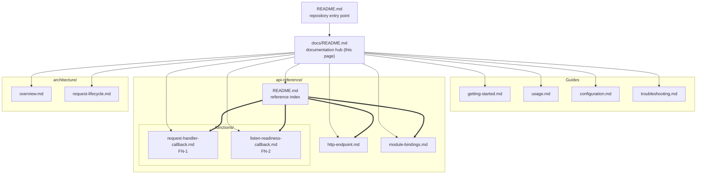

# Documentation hub

This is the index for the documentation of `hao-backprop-test`. Eleven
other pages sit beneath it, and this is the only page that lists all of
them: it routes readers to the right one by what they are trying to do,
publishes what share of the codebase is documented, and fixes the
conventions the whole set follows.

Two things this page deliberately is not. It is not a narrative — it
enumerates and routes, while each leaf page carries the substance. And it
does not propose changing anything: a number of the facts recorded across
this set are absences — no exported symbol, no routing, no configuration
mechanism, no graceful shutdown — and each is documented as a
characteristic of a deliberately minimal single-file service rather than
as a defect awaiting repair.

## Contents

- [What this project is](#what-this-project-is)
- [Where to start, by audience](#where-to-start-by-audience)
- [Complete page index](#complete-page-index)
- [Documentation coverage](#documentation-coverage)
- [Conventions for this documentation set](#conventions-for-this-documentation-set)
- [D7 - the documentation map](#d7---the-documentation-map)

## What this project is

`hao-backprop-test` is a test project for backprop integration
(`Source: README.md:L1-L2`). Within that integration this repository is
only the **target endpoint**: the integrating counterpart is hosted
outside this repository, and no backpropagation, machine-learning, or
external-system integration code, client, or credential exists here
(`Source: server.js:L1-L14`).

What the repository actually contains is a single-file Node.js HTTP
service — one process, one source file, one response. Every request
receives the same reply: status `200`, `Content-Type: text/plain`, and a
14-byte body, `Hello, World!\n` (`Source: server.js:L7-L9`). There is no
routing and no content negotiation, so every path and every HTTP method
is answered identically (`Source: server.js:L6-L10`).

It is an internal engineering fixture, and its shape follows from that. It
binds to the IPv4 loopback literal `127.0.0.1` on port `3000`, so it
answers only clients on the same host (`Source: server.js:L3-L4`). Its
single import is the Node.js built-in `http` module, so there is nothing
to install: the repository has no `package.json`, no lockfile, and no
third-party dependency (`Source: server.js:L1`).

## Where to start, by audience

Four kinds of reader arrive at this set, and each has a different first
question. Start at the page that answers yours.

| Audience       | You want to                    | Start here            |
| -------------- | ------------------------------ | --------------------- |
| **Operator**   | Launch it, verify it, stop it  | [Getting started][gs] |
| **Integrator** | Know exactly what it returns   | [Usage][usg]          |
| **Maintainer** | Understand every line of it    | [API reference][ari]  |
| **Reviewer**   | Judge the design and non-goals | [Architecture][ov]    |

Each of those is a starting point rather than the whole path:

- **Operator.** [Getting started][gs] covers the runtime prerequisite,
  the launch command, the one line the process prints, first verification
  with `curl`, and how to stop it. When something does not behave,
  [troubleshooting][ts] catalogues the failure modes that were actually
  reproduced against a running instance.
- **Integrator.** [Usage][usg] shows the service being called from
  `curl`, from a Node.js client, and from a browser, and states the
  method and path behavior you can rely on. Then read the
  [HTTP endpoint reference][ep] for the wire-level contract — every
  header with its provenance, and the byte-exact body.
- **Maintainer.** [The API reference index][ari] enumerates all nine
  documented units of the code surface and routes to the page that owns
  each. From there, [module bindings][mb] covers the four module-scope
  bindings and the two call sites, and the two function pages —
  [FN-1][fn1] and [FN-2][fn2] — cover the two callbacks one page each.
- **Reviewer.** [The architecture overview][ov] draws the boundary
  between application code, the Node core `http` module, and the OS
  socket, gives the bootstrap ordering, and lists the deliberate
  non-goals. [Request lifecycle][rl] follows a single request from the
  client socket to the response body and models the process states,
  including the bind-failure path.

### Quick start

```bash
node server.js                 # terminal 1: runs in the foreground
curl http://127.0.0.1:3000/    # terminal 2: prints the greeting
```

There is no `npm start`. The repository has no `package.json`, so
`node server.js` from the repository root is the only launch path. The
process prints exactly one line to stdout before it begins serving
(`Source: server.js:L12-L14`):

```text
Server running at http://127.0.0.1:3000/
```

[Getting started][gs] gives the same sequence with the prerequisite, the
expected response headers, and how to stop the process.

## Complete page index

Eleven pages make up this set, and each owns its topic outright. Nothing
below is a stub, and no two pages cover the same ground.

| Page                             | What it covers                           |
| -------------------------------- | ---------------------------------------- |
| [Getting started][gs]            | Prerequisites, launch, output, stopping  |
| [Usage][usg]                     | Client examples; method/path behavior    |
| [Configuration][cfg]             | The two hardcoded values; no env support |
| [Troubleshooting][ts]            | Verified failure modes and remedies      |
| [API reference index][ari]       | Reference index: nine units, coverage    |
| [HTTP endpoint][ep]              | Wire-level contract; header provenance   |
| [Module bindings][mb]            | `http`, `hostname`, `port`, `server`     |
| [Request Handler Callback][fn1]  | FN-1, on its own dedicated page          |
| [Listen Readiness Callback][fn2] | FN-2, on its own dedicated page          |
| [Architecture overview][ov]      | Component boundary; bootstrap ordering   |
| [Request lifecycle][rl]          | Request sequence; process state model    |

### Exact paths

The link labels above are short for the sake of the table. The paths they
resolve to are these, all of them relative to this file:

```text
docs/
├── README.md                                  <- this page
├── getting-started.md
├── usage.md
├── configuration.md
├── troubleshooting.md
├── api-reference/
│   ├── README.md
│   ├── http-endpoint.md
│   ├── module-bindings.md
│   └── functions/
│       ├── request-handler-callback.md
│       └── listen-readiness-callback.md
└── architecture/
    ├── overview.md
    └── request-lifecycle.md
```

This page is the repository-level table of contents, and that carries a
maintenance obligation: **it must be updated whenever a page is added to
the set.** A page nobody can reach from here is, for practical purposes,
a page that does not exist. Each multi-section page additionally carries
its own in-page contents list, so this index does not attempt to reach
individual sections.

### Why each function has its own page

The `api-reference/functions/` directory holds one file per function — no
exceptions, no grouping. That is the structural expression of the
requirement that each function carry its own unique documentation, and it
is what makes the coverage claim self-evident rather than asserted: a
reader counts the pages and counts the functions.

With two functions in this codebase the directory holds exactly two
files. The pair follow an identical section structure — Purpose,
Registration, Signature, Parameters, Returns, Behavior, Invariants, What
it deliberately ignores, Examples, Error behavior, and Source and
traceability — while carrying entirely distinct content in every one of
those sections, so the two can be diffed section by section to confirm
that nothing was copied between them.

## Documentation coverage

Nine units make up the complete code surface of this repository, and nine
are documented. Each has its entry on exactly one owning page; no unit is
folded into another's description. The **Locator** column names the
baseline `server.js` line or range on which the unit appears, and
**Owner** is the page that documents it (`Source: server.js:L1-L14`).

| Unit | Element                   | Locator   | Feature     | Owner          |
| ---- | ------------------------- | --------- | ----------- | -------------- |
| U-1  | `http` import             | `L1`      | F-001       | [bindings][mb] |
| U-2  | `hostname` `'127.0.0.1'`  | `L3`      | F-001,F-003 | [bindings][mb] |
| U-3  | `port` `3000`             | `L4`      | F-001,F-003 | [bindings][mb] |
| U-4  | `http.createServer(...)`  | `L6`      | F-001       | [bindings][mb] |
| U-5  | `server` binding          | `L6`      | F-001       | [bindings][mb] |
| U-6  | Request Handler Callback  | `L6-L10`  | F-002       | [FN-1][fn1]    |
| U-7  | `server.listen(...)`      | `L12`     | F-001       | [bindings][mb] |
| U-8  | Listen Readiness Callback | `L12-L14` | F-003       | [FN-2][fn2]    |
| U-9  | Module bootstrap sequence | `L1-L14`  | F-001–F-003 | [overview][ov] |

Three notes on that table.

By kind, the nine units are one core-module import (U-1), three
module-scope constants and bindings (U-2, U-3, U-5), two call sites (U-4,
U-7), two **anonymous functions** (U-6, U-8), and the executable module
body taken as a whole (U-9).

Three rows share the locator `L6`, because that one line does three
things: it calls `http.createServer(...)` (U-4), binds the returned
`http.Server` instance to `server` (U-5), and opens the anonymous
function that becomes the Request Handler Callback, whose body runs on to
`L10` (U-6). `Source: server.js:L6`.

The listen call site is abbreviated for width. As written it is
`server.listen(port, hostname, callback)` — the numeric port first, the
address string second, the Listen Readiness Callback third.
`Source: server.js:L12`.

### Coverage by dimension

These figures are documentation coverage: the number of units carrying a
dedicated documentation entry, divided by the number present in the
source. The target is 100% on every dimension, and it is met on every
dimension.

| Dimension                       | Coverage          |
| ------------------------------- | ----------------- |
| Functions (own dedicated page)  | **2 of 2 (100%)** |
| Module-scope bindings           | **4 of 4 (100%)** |
| Call sites                      | **2 of 2 (100%)** |
| Source files (modules)          | **1 of 1 (100%)** |
| HTTP interfaces                 | **1 of 1 (100%)** |
| Configuration options           | **2 of 2 (100%)** |
| Features                        | **3 of 3 (100%)** |
| Verified failure modes          | **4 of 4 (100%)** |
| Exported symbols                | **0 of 0 (n/a)**  |
| **Overall documentation units** | **9 of 9 (100%)** |

The unit categories reconcile to the inventory exactly: 2 functions (U-6,
U-8) plus 4 module-scope bindings (U-1 `http`, U-2 `hostname`, U-3
`port`, U-5 `server`) plus 2 call sites (U-4, U-7) plus 1 module body
(U-9) is 9. The single source file counted above is `server.js` itself,
whose bootstrap sequence is U-9.

The other rows count reader-facing surfaces rather than units. The one
HTTP interface is the single de-facto endpoint that answers the entire
URL space, specified on the [HTTP endpoint reference][ep]
(`Source: server.js:L6-L10`). The two configuration options are
`hostname` and `port`, both hardcoded, covered by
[configuration][cfg] (`Source: server.js:L3-L4`). The four verified
failure modes, each reproduced against a running instance and each
documented in [troubleshooting][ts], are:

- A port collision terminating the process, because no `'error'` listener
  is registered
  ([`EADDRINUSE`](./troubleshooting.md#error-listen-eaddrinuse)).
- Unreachability from any other host, caused by the loopback bind
  ([connection refused](./troubleshooting.md#connection-refused-from-another-machine-or-container)).
- The absence of a graceful-shutdown path, because no signal handler and
  no `server.close()` call exist
  ([immediate stop](./troubleshooting.md#the-process-died-instantly-on-stop)).
- The absence of any `404` or `405` response, because there is no routing
  and no method dispatch
  ([every URL answers](./troubleshooting.md#every-url-returns-hello-world)).

### Two documented zeros

Two counts above are zero, and each is a documented fact about the code
rather than a gap in the documentation.

- **Exported symbols: 0 of 0.** `server.js` declares no `module.exports`
  anywhere, so it exposes no importable symbol and the denominator is
  itself zero (`Source: server.js:L1-L14`). The absence is documented,
  not skipped: [usage][usg] covers the consequence — that
  [`require('./server')`](./usage.md#what-you-must-not-do-requireserver)
  hands back an empty object while starting a live server as a side
  effect of loading — and [the reference index][ari] records the
  mechanical check behind the count.
- **Classes: zero. Named functions: zero.** Both of this repository's
  functions are anonymous arrow functions passed directly as call
  arguments (`Source: server.js:L6`, `server.js:L12`). This is why they
  are documented under role names, described below.

### Feature traceability

The three features below are those defined for this system upstream,
reused here by their original identifiers so that the documentation and
the specification can be cross-checked against each other. No identifier
is invented.

| ID    | Feature                       | Priority |
| ----- | ----------------------------- | -------- |
| F-001 | HTTP Server Listener          | Critical |
| F-002 | Uniform HTTP Response Handler | Critical |
| F-003 | Startup Readiness Logging     | Medium   |

- **F-001 HTTP Server Listener** (Critical) — imports the core `http`
  module, declares the bind address and port, creates the server, and
  binds the listening socket. Units U-1 to U-5, U-7 and U-9.
  `Source: server.js:L1`, `server.js:L3-L4`, `server.js:L6`,
  `server.js:L12`.
- **F-002 Uniform HTTP Response Handler** (Critical) — answers every
  request identically, with status `200`, `Content-Type: text/plain`, and
  a fixed greeting body. Unit U-6, within the bootstrap sequence U-9.
  `Source: server.js:L6-L10`.
- **F-003 Startup Readiness Logging** (Medium) — emits one line to stdout
  naming the address the service was bound to, interpolating the same
  `hostname` and `port` constants that were passed to `listen`. Unit U-8,
  using U-2 and U-3, within the bootstrap sequence U-9.
  `Source: server.js:L12-L14`.

## Conventions for this documentation set

The repository had no documentation conventions to inherit. Before this
set, `README.md` consisted of an ATX heading and one sentence — no
sections, no code fences, no links, no table of contents
(`Source: README.md:L1-L2`). The conventions below are therefore
established here, and they apply to every page of the set.

### Source locators and the baseline commit

Every claim in this set carries an inline citation naming the source it
came from, of the form `Source: server.js:L7-L9`, so any statement can be
confirmed or refuted against the code in seconds. Two rules govern those
citations.

**They are anchored to baseline commit `1484182`.** `server.js` now
carries JSDoc documentation comments, and those comments shift the file's
physical line numbers. Locators throughout this set continue to describe
the baseline layout, because that is what makes one locator mean the same
thing on every page. The baseline layout is the following, with the blank
lines at `L2`, `L5` and `L11` omitted:

```text
L1  const http = require('http');
L3  const hostname = '127.0.0.1';
L4  const port = 3000;
L6  const server = http.createServer((req, res) => {
L7    res.statusCode = 200;
L8    res.setHeader('Content-Type', 'text/plain');
L9    res.end('Hello, World!\n');
L10 });
L12 server.listen(port, hostname, () => {
L13   console.log(`Server running at http://${hostname}:${port}/`);
L14 });
```

**They name single lines or ranges, never a total line count.** A claim
about one statement cites that statement, as `server.js:L7`. A claim
about a construct spanning several lines cites the range, as
`server.js:L6-L10`. A claim about something that appears nowhere in the
file cites the file as a whole, `server.js:L1-L14`, because the claim is
about the file rather than about any one line. Totals are avoided on
purpose: a count that includes the trailing newline and a count of
content lines disagree by one, and citing a range sidesteps that
discrepancy entirely.

This set records no author, no reviewer and no review date. Baseline
commit `1484182` is its provenance marker, because a commit is
verifiable where ownership metadata written from guesswork is not.

### Terminology: the two callback role names

Neither of this repository's two functions has an identifier in the
source, so there is no name in the code to index them under. This set
gives each a stable **role name** and uses it in every file without
exception:

- **Request Handler Callback** — `(req, res) => { ... }`, the sole
  argument to `http.createServer(...)`, documented on
  [its own page][fn1]. `Source: server.js:L6-L10`.
- **Listen Readiness Callback** — `() => { ... }`, the zero-arity third
  argument to `server.listen(...)`, documented on
  [its own page][fn2]. `Source: server.js:L12-L14`.

Consistent naming is what makes per-function documentation verifiable: a
reader who meets "Request Handler Callback" on any page of this set knows
precisely which range of source is meant. Terminology otherwise follows
the upstream specification's glossary rather than redefining terms
locally.

### Markdown and diagram conventions

- **GitHub-Flavored Markdown**, hand-authored. There is no documentation
  generator, no generator configuration and no build step; the Markdown
  is the deliverable.
- **ATX headings**, exactly one top-level heading per page, no skipped
  levels, and an in-page contents list on every multi-section page.
- **Every code fence is language-tagged** — `bash`, `text`, `js`, `http`
  or `mermaid` — so that it highlights correctly.
- **Tables carry contracts**: parameters, response headers, method and
  path matrices, coverage figures. Prose carries the explanation.
- **Diagrams are Mermaid source**, fenced inline in the page that
  describes them. GitHub renders `mermaid` fences natively, so the set
  needs no build step and contains no image or binary asset, and no
  diagram can drift out of sync with a separate file. Eight diagrams are
  distributed across the set, one per concern and none duplicated; the
  one on this page is D7.
- **No unverifiable claims.** The set quotes no performance, latency,
  throughput or availability figure and no service-level objective,
  because none is defined anywhere in the repository and there is no
  instrumentation from which one could be computed. It makes no
  production-readiness claim, and states no roadmap, because the
  repository declares none.

### Link topology and traceability

- **This page links to all eleven other pages**, and every one of them
  links back here — `./README.md` from the four guides, `../README.md`
  from `api-reference/` and `architecture/`, and `../../README.md` from
  `api-reference/functions/`. Within the reference tier,
  [the API reference index][ari] is the parent index for its four leaves.
- **The inbound edge is the root `README.md`**, which links to this hub,
  [getting started][gs] and [usage][usg].
- **All links are repository-relative**, for example
  `./api-reference/functions/request-handler-callback.md`. Absolute paths
  and links naming a repository host are not used, because they break on
  forks and in local Markdown previews.
- **The traceability loop is closed in both directions.** The JSDoc
  blocks in `server.js` carry `@see` references into this set — the file
  header points at this hub, the `hostname` and `port` blocks point at
  [configuration][cfg] (`port` at [troubleshooting][ts] as well), and
  the two `@callback` blocks point at [FN-1][fn1] and [FN-2][fn2] —
  while each page cites its `server.js` locator in return. A change on
  either side of that loop is detectable from the other.
- **Restated facts reuse their citation.** Plain Markdown has no include
  mechanism, so a fact needed on more than one page is restated rather
  than transcluded, always with the same locator, so that every copy
  stays checkable against the same line of source.

## D7 - the documentation map

D7 shows how this set is organized and navigated: the root `README.md` as
the inbound edge, this hub routing to all eleven pages, and the two
nested tiers — the reference tier with its own index and its per-function
pair, and the architecture pair.



Those return edges are real even though the diagram leaves them out: each
leaf page ends with a link back to this hub, which is what lets a reader
who arrived at one page from a search engine reach the rest of the set.

The other seven diagrams live on the pages that own the concerns they
describe — the component boundary and the bootstrap sequence on
[the architecture overview][ov], the request sequence and the process
state model on [request lifecycle][rl], the statement flow of each
callback on [FN-1][fn1] and [FN-2][fn2], and the diagnostic decision tree
on [troubleshooting][ts].

[gs]: ./getting-started.md
[usg]: ./usage.md
[cfg]: ./configuration.md
[ts]: ./troubleshooting.md
[ari]: ./api-reference/README.md
[ep]: ./api-reference/http-endpoint.md
[mb]: ./api-reference/module-bindings.md
[fn1]: ./api-reference/functions/request-handler-callback.md
[fn2]: ./api-reference/functions/listen-readiness-callback.md
[ov]: ./architecture/overview.md
[rl]: ./architecture/request-lifecycle.md
