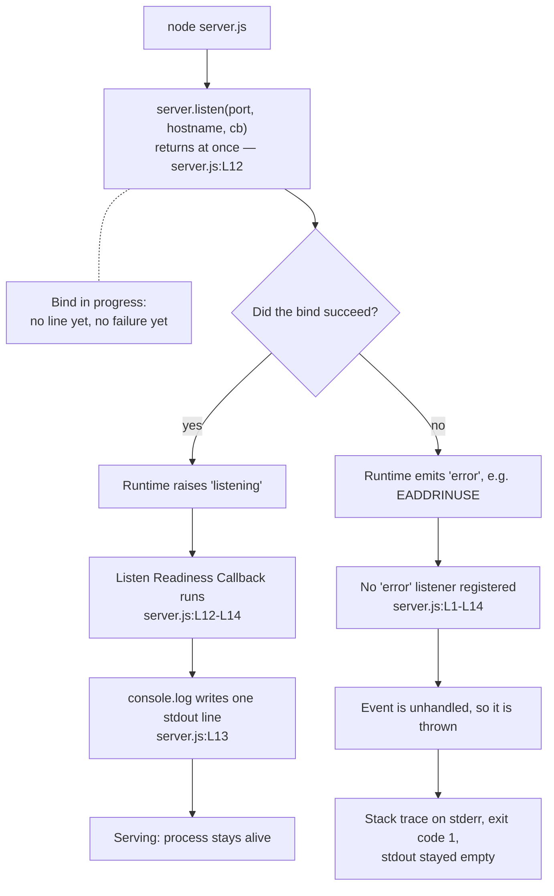

# Listen Readiness Callback

This page is the dedicated reference for the **Listen Readiness Callback** —
the anonymous, zero-arity arrow function declared at `server.js:L12-L14` and
handed to `server.listen(...)` as its third argument. It is one of the two
functions this repository contains; the other one, the
[Request Handler Callback](./request-handler-callback.md), has a page of its
own.

Claims below carry an inline `Source: server.js:L13` locator, read against
**baseline commit `1484182`**. That convention, and the role names this set
uses for two functions that have none of their own, are set out in full on
the [Request Handler Callback](./request-handler-callback.md) page and are
not repeated here.

A great deal of what follows is an absence: no parameters, no `'error'`
listener, no `server.close()`, no structured logging. Those absences are the
design of a fourteen-line service, and this page's job is to describe them
precisely rather than to argue with them — no change to the code is proposed
anywhere below.

## Contents

- [Purpose](#purpose)
- [Registration](#registration)
- [Signature](#signature)
- [Parameters](#parameters)
- [Returns](#returns)
- [Behavior](#behavior)
- [Invariants](#invariants)
- [What it deliberately ignores](#what-it-deliberately-ignores)
- [Examples](#examples)
- [Error behavior](#error-behavior)
- [Source and traceability](#source-and-traceability)
- [Related documentation](#related-documentation)

## Purpose

The Listen Readiness Callback exists to announce that the listening socket
is open. The runtime invokes it after the bind succeeds, and its entire
effect is one line on stdout naming the address the service was told to
listen on. `Source: server.js:L12-L14`. That line is this process's only
positive, application-authored readiness signal and its only observability
output of any kind — there is no health endpoint, no readiness probe, no
metrics and no second message. It implements **F-003 Startup Readiness
Logging** (Medium).

Everything else on this page follows from two properties of the function.
It is handed no arguments, so it can report nothing about the bind it
announces beyond the fact of having run — the line's presence is the whole
of the information it carries. And it runs only when that bind succeeded,
which makes the inference one-directional: seeing the line proves the socket
was bound and this callback ran, while *not* seeing it proves nothing on its
own. `server.listen(...)` is asynchronous, so before the `'listening'` event
fires the line has simply not been written yet, and output may equally be
uncaptured or unread. `Source: server.js:L12-L14`.
[Error behavior](#error-behavior) sets out what a genuinely failed startup
looks like and which signals settle it.

## Registration

| Aspect            | Detail                                        |
| ----------------- | --------------------------------------------- |
| Registered as     | Third argument to `server.listen(...)`        |
| Registration site | `server.js:L12`                               |
| Triggering event  | The server's `'listening'` event              |
| Invoked by        | The runtime's one-shot `'listening'` dispatch |
| Frequency         | At most once per process                      |
| Arity             | Zero — no argument is supplied                |

**The argument order is `(port, hostname, callback)` — the numeric port
first, the address string second, this callback third.** That order is the
detail most easily misremembered, so it is worth stating without hedging:
the call as written is `server.listen(port, hostname, () => {`.
`Source: server.js:L12`. [Module bindings](../module-bindings.md) is the
authoritative page for this call site and for the `port` and `hostname`
bindings it passes.

Passing a function in that position is not the same as adding a listener
that stays. The runtime turns the third argument into a **one-shot**
`'listening'` listener: registered as the bind is requested, invoked once
the socket is bound and accepting connections, and removed in the act of
being delivered. `Source: server.js:L12-L14`. Registration here is therefore
a subscription with an expiry built into it — which is the sharpest contrast
with the sibling callback, whose registration is fixed at server
construction and stays live for as long as the process runs.

Nothing in the file ever re-arms that subscription. There is no second
`listen` call, no `server.close()` and no `.on('listening', ...)` anywhere:
searching the executable source for `.close(` and for `.on(` yields zero
matches in each case. `Source: server.js:L1-L14`. The "at most once" in the
frequency row above is consequently a property of the file rather than of a
typical run. A second invocation would need a second bind, and there is no
statement anywhere that could ask for one — nor any name by which this
function could be invoked directly, for the reason the
[Request Handler Callback](./request-handler-callback.md#signature) page
gives for both functions.

## Signature

```js
server.listen(port, hostname, () => {
```

`Source: server.js:L12`.

The parentheses enclose nothing, and the emptiness is the contract rather
than an oversight. `()` declares no positional parameter, no default, no
rest element and no destructuring (`Source: server.js:L12`) — and, decisive
for everything downstream, no `err`. What the shape encodes is a
success-only notification: with no slot for a failure to arrive in, the fact
of execution rather than the content of any argument is the entire signal
this function carries. [Parameters](#parameters) draws out what follows from
that.

Zero arity also settles where the printed address comes from. With nothing
supplied by the caller, the only values the body can name are the two
module-scope constants it closes over, which is the subject of
[Behavior](#behavior). `Source: server.js:L13`.

This page writes **Listen Readiness Callback** for the role and
`ListenReadinessCallback` for the `@callback` type name; the reasoning
behind both, which applies to either function in the repository, is stated
under the
[Request Handler Callback's Signature](./request-handler-callback.md#signature).

## Parameters

**None — zero arity.** The callback declares no parameters and the runtime
supplies no arguments to it. `Source: server.js:L12`. There is no empty
parameter table below this paragraph because there is no row that could go
in one.

The consequences are the substance of this section:

- **No error argument.** The callback has nothing through which a problem
  could be reported to it, so it cannot inspect, log or react to the outcome
  of the bind it announces. Its execution *is* the outcome.
- **No server handle.** It is not passed the `http.Server` instance, so it
  reaches nothing about the listener through an argument. The address it
  prints comes from the module-scope constants instead, as
  [Behavior](#behavior) sets out.
- **This is not Node's error-first convention.** Node.js popularised the
  `(err, result)` callback shape, in which the first argument carries a
  failure and a caller checks it before doing anything else. The readiness
  callback of `listen` is not that shape: it is a success-only notification,
  invoked with nothing. `Source: server.js:L12-L14`.
- **So the failure path bypasses it rather than informing it.** Because
  there is no `err` parameter to receive, a bind failure cannot be delivered
  *into* this function; it surfaces elsewhere entirely, as
  [Error behavior](#error-behavior) describes.

## Returns

| Question                 | Answer                                       |
| ------------------------ | -------------------------------------------- |
| What value is produced?  | `undefined`, implicitly — no `return` exists |
| Who receives it?         | The one-shot `'listening'` dispatch          |
| What is the real output? | One line on the process-global stdout stream |

Searching the baseline source for `return` yields zero matches, so the
single invocation evaluates to `undefined`. `Source: server.js:L1-L14`.

This is the more extreme of the two cases in the repository. The sibling
callback is at least handed an object it can mutate, which makes its return
value redundant; this one is handed nothing whatsoever
(`Source: server.js:L12`), which leaves exactly one channel open to it —
`console.log` writing to a stream that belongs to the process rather than to
any caller. `Source: server.js:L13`.

There is consequently nothing useful it could hand back even if a caller
were listening. It knows no more about the bind than that it happened, and
the one API that could tell it more is never called: `server.address()`
appears nowhere in the file. `Source: server.js:L1-L14`.

## Behavior

### One statement, two distinct actions

The body is a single statement, but it does two things that are worth
separating:

| Step | Action                         | Locator         |
| ---- | ------------------------------ | --------------- |
| 1    | Template-literal interpolation | `server.js:L13` |
| 2    | `console.log(...)` to stdout   | `server.js:L13` |

- **Step 1** evaluates the backtick template
  `` `Server running at http://${hostname}:${port}/` ``, substituting the
  two module-scope constants into the message and producing one string.
  `Source: server.js:L13`.
- **Step 2** passes that string to `console.log`, which writes it to
  **stdout** followed by a newline. `Source: server.js:L13`.

There is no branching, no loop, no early exit and nothing asynchronous
inside the body. Both steps belong to the same line of source, and when the
second finishes the callback is done.

### The closure over `hostname` and `port`

The interesting property of this function is visible in the source text
itself rather than inferred. The template at `server.js:L13` names
`${hostname}` and `${port}` — the identifiers of the module-scope constants
declared at `server.js:L3` and `server.js:L4` — and those are the same two
bindings passed as the first two arguments of the `server.listen(...)` call
at `server.js:L12`. The callback closes over them; it holds no copy of its
own and, being zero-arity, receives no value to print either.

That is what makes the message trustworthy. The log line and the bind call
read from one source, so they cannot disagree about what was requested:
whatever the constants say, the bind was asked for it and the line reports
it. If either constant is edited the printed address follows automatically,
with no second place to update. `Source: server.js:L3-L4`,
`Source: server.js:L12-L13`. As the two values currently stand — a concrete
host literal and an explicit nonzero port — that also makes the line an
accurate statement of the address actually bound; which edits preserve that
and which do not is [configuration](../../configuration.md)'s subject, and
it owns the editing procedure.

### Exact output

As the constants currently stand, the process writes exactly one line:

```text
Server running at http://127.0.0.1:3000/
```

`Source: server.js:L13`, with the interpolated values from
`Source: server.js:L3-L4`. Observed on stdout it is 41 bytes: the 40
characters above plus the single trailing newline `console.log` appends.
Observed stderr over the same run is empty.

This one line is the whole of the process's output. Nothing else is ever
written — not on a request, not on a client disconnect, and not on
shutdown — so the readiness line is both the first and the last thing a
reader of the logs will see. `Source: server.js:L1-L14`.

### When it runs, relative to the `listen` call

The callback does not run as part of the `server.listen(...)` call. The bind
is carried out asynchronously, and the callback runs on a later turn of the
event loop, once the `listening` event is raised. The ordering is directly
observable: loading the module and printing immediately afterwards puts the
loader's own output *before* the readiness line, as
[Example C](#examples) shows. `Source: server.js:L12-L14`.

A practical consequence for anyone reading logs: the line's appearance is
what confirms the socket is bound. Reaching the statement after
`server.listen(...)` confirms nothing, because the bind may not have
completed — or succeeded — by then.

### Readiness signal flow



## Invariants

These hold for every run of this program, and they hold because of what the
single statement does rather than by convention:

- **It fires at most once per process.** It is registered as a one-shot
  `listening` listener, and nothing in the file re-binds the server, so
  there is no second `listening` event to answer.
  `Source: server.js:L1-L14`.
- **It reflects the same bind target the `listen` call was given.** It
  interpolates the very constants passed to `server.listen(...)` rather than
  repeating their values, so the message and the bind cannot disagree about
  what was requested; and with those constants as they currently stand —
  `'127.0.0.1'` and `3000` — that is the address that was bound.
  `Source: server.js:L3-L4`, `Source: server.js:L12`. It is not an
  unconditional guarantee for every possible edit of those two lines, and
  [configuration](../../configuration.md) owns which edits keep the printed
  URL authoritative.
- **It emits exactly one line**, identical on every run for a given host and
  port pair. There is no variable content whatsoever — no timestamp, no
  process id, no request data, no counter — so two runs produce
  byte-identical output. `Source: server.js:L13`.
- **It writes to stdout only.** `console.log` targets stdout, and nothing in
  this callback writes to stderr; the observed stderr of a successful run is
  empty. `Source: server.js:L13`.
- **Its appearance is the only positive confirmation of readiness the
  process offers.** Nothing else is written on success, and there is no
  application-authored failure message to look for either.
  `Source: server.js:L1-L14`. The converse does not follow: its absence
  means readiness has not been *observed* — the bind may still be in
  progress, or the output may not have been captured — rather than that
  startup failed. Settling that question takes the process's own state, its
  stderr and the state of the port, which
  [Error behavior](#error-behavior) works through.

## What it deliberately ignores

The Request Handler Callback ignores its inputs; this callback has no inputs
to ignore, so what it passes over is the set of things a reader might expect
a readiness signal to provide.

- **No health check and no readiness probe.** The line is a one-time log
  statement, not an endpoint, and the process exposes no readiness
  *interface* of any kind: no status route, no probe, nothing that answers
  the question a second time once the line has scrolled past.
  `Source: server.js:L12-L14`. What remains available belongs to the socket
  rather than to this callback — an ordinary TCP connection or HTTP request
  against `127.0.0.1:3000` still tests reachability at any moment, and the
  uniform `200` it receives comes from the
  [Request Handler Callback](./request-handler-callback.md).
- **No structured logging.** The output is a plain human-readable sentence,
  not JSON and not key-value pairs, so nothing downstream can parse a field
  out of it without string handling. `Source: server.js:L13`.
- **No timestamp and no log level.** There is no `INFO` or `WARN` prefix, no
  logger name and no clock reading — the template contains only the two
  interpolated constants and fixed text. `Source: server.js:L13`.
- **No error information.** Being zero-arity it has nothing to report; it
  cannot even state that the bind it is announcing succeeded, beyond the
  fact of having run at all. `Source: server.js:L12`.
- **No log destination configuration.** `console.log` writes to stdout
  unconditionally. There is no log file, no transport, no rotation and no
  verbosity switch to turn the line off or send it elsewhere.
  `Source: server.js:L13`.
- **No influence from the environment.** Nothing in the file reads
  `process.env` — searching the baseline source for `process.env` yields
  zero matches (`Source: server.js:L1-L14`) — so the host and port this line
  reports cannot be changed by an environment variable, a command-line flag
  or a configuration file. Editing the constants is the only mechanism, and
  [configuration](../../configuration.md) owns that procedure.

## Examples

All three runs below were performed under Node.js 24.19.0 (Active LTS
"Krypton") and every line quoted is what the process itself wrote — stdout
and stderr read straight off the run, with nothing reconstructed. The
supported-runtime table lives in
[getting started](../../getting-started.md).

### Example A — a successful start

Run from the repository root:

```bash
node server.js
```

Observed stdout:

```text
Server running at http://127.0.0.1:3000/
```

That is the complete output of the run: one line, written the moment the
socket was bound, with nothing on stderr. `Source: server.js:L13`. The
process then runs in the foreground indefinitely, because the open
listening socket keeps the event loop occupied; the shell does not come
back until the process is stopped.

That command is the only way to start the service: with no `package.json` in
the repository there is no npm script that could be run in its place.

### Example B — the callback never runs

This is the negative case, and it is the most valuable observation on the
page. With one instance already holding the port, a second one was started
the same way:

```bash
node server.js
```

Observed result:

| Channel   | Observation                                |
| --------- | ------------------------------------------ |
| Exit code | `1`                                        |
| stdout    | **Empty — zero bytes**                     |
| stderr    | The unhandled `'error'` output shown below |

Read the three channels together, because that combination is what makes
this run conclusive. An empty stdout on its own would be equally consistent
with a bind still in progress; what settles it is the stderr trace naming
`EADDRINUSE` and the exit code of `1`, which say that the process is gone
and why it went. Given a process that has already exited, the empty stdout
then does locate the failure before the callback rather than in the logging:
the readiness line is unconditional inside the callback, with no branch that
could suppress it. `Source: server.js:L12-L14`.

The stable part of the observed stderr:

```text
      throw er; // Unhandled 'error' event
      ^

Error: listen EADDRINUSE: address already in use 127.0.0.1:3000
Emitted 'error' event on Server instance at:
```

followed by the error's own fields:

```text
  code: 'EADDRINUSE',
  syscall: 'listen',
  address: '127.0.0.1',
  port: 3000
```

Three parts of that output are omitted above on purpose, because they are
not stable enough to publish as universal: the `node:events:<line>` header
that opens the trace, the `node:net` stack frames, and the numeric `errno`
field, which is platform-specific. The runtime also appends a line naming
its own version. [Troubleshooting](../../troubleshooting.md) records the
trace as it was observed, including which parts to match on.

### Example C — the readiness line appears on an accidental import

The module assigns nothing to `module.exports` — searching the baseline
source for `module.exports` yields zero matches
(`Source: server.js:L1-L14`) — so requiring the file hands the caller
nothing while still running the module body, bind included. Run from the
repository root:

```bash
node -e "const m = require('./server'); console.log('own keys:', Object.keys(m).length);"
```

Observed stdout, in this order:

```text
own keys: 0
Server running at http://127.0.0.1:3000/
```

Three things are visible there. The exported object has zero own keys, so
the import yields no handle on anything. The readiness line is printed
anyway, because loading the module binds the socket as a side effect and
this callback runs on the `listening` event exactly as it would under
`node server.js`. `Source: server.js:L12-L14`. And the line arrives *after*
the requiring code's own output — direct evidence that the callback runs on
a later event-loop turn than the `server.listen(...)` call returns.

The process then does not exit on its own, because the listening socket
keeps a handle registered with the event loop; it has to be stopped.
[Usage](../../usage.md) covers this from the caller's side and is the owner
of the reader-facing guidance about importing this file.

## Error behavior

The Listen Readiness Callback has no failure mode of its own: it takes no
input that could be invalid, performs one write to stdout, and contains no
`try`/`catch` — searching the baseline source for `try` yields zero matches,
and there is no `catch` and no `throw` either. `Source: server.js:L1-L14`.
Nothing inside it is guarded, and nothing inside it needs to be.

The important question is therefore not how it fails but **whether it runs
at all**, and the answer is settled before it by the bind.

### The bind-failure sequence

Observed by starting a second instance against an already-bound port:

1. The `server.listen(port, hostname, callback)` call fails to bind the
   socket. `Source: server.js:L12`.
2. The server emits an `'error'` event instead of `listening`.
3. **No `'error'` listener is registered anywhere in the file** — searching
   the baseline source for `.on(` yields zero matches, so nothing subscribes
   to that event. `Source: server.js:L1-L14`. The event is unhandled, and
   the runtime throws it.
4. The process terminates with **exit code 1**.
5. **This callback never executes**, so no readiness line is emitted and
   stdout stays empty. `Source: server.js:L12-L14`.

Step 3 is the mechanism behind step 5, and it is a fact of the current
design rather than a defect: the `'error'` event has no listener, so the
failure is fatal instead of reportable.

What step 5 does *not* license is the reverse reading. An empty stdout is
not by itself evidence that the socket was never bound: the same emptiness
is what a reader sees in the interval between `server.listen(...)` returning
and the `'listening'` event firing, and it is also what a reader sees when a
run's output is not being captured. The signals that settle the question are
the ones steps 3 and 4 produce — the unhandled-`'error'` stack trace on
stderr and the process's exit status — together with whether anything is
listening on the port at all. Observed under Node.js 24.19.0 on Windows,
the failing run above wrote the trace to stderr and exited with code `1`
while stdout stayed at zero bytes; it is those three facts together, and not
the empty stdout alone, that identify a bind failure.

The operational remedy — identifying what already holds the port, and what
follows from moving the service to another one — lives in
[troubleshooting](../../troubleshooting.md), which owns that diagnosis end
to end.

### Termination has no counterpart message

There is no graceful-shutdown path in this file: no signal handler is
installed and `server.close()` is never called — searching the baseline
source for `SIGTERM`, `SIGINT` and `.close(` yields zero matches in each
case. `Source: server.js:L1-L14`. A termination request ends the process at
once, with no connection draining.

This callback therefore has no counterpart on the way out. It announces the
start of the listening socket and nothing announces its end, which is why
the readiness line is the last thing in the log as well as the first.
[Request lifecycle](../../architecture/request-lifecycle.md) documents the
process states this produces.

## Source and traceability

| Attribute          | Value                                         |
| ------------------ | --------------------------------------------- |
| Source             | `server.js:L12-L14`                           |
| Locator baseline   | Commit `1484182`                              |
| Documented unit    | U-8                                           |
| Implements         | F-003 Startup Readiness Logging (Medium)      |
| Upstream section   | §2.1.3                                        |
| Kind               | Anonymous zero-arity arrow function           |
| Registration site  | `server.js:L12`                               |
| Constants read     | `server.js:L3`, `server.js:L4`                |
| Documentation type | `ListenReadinessCallback` (JSDoc `@callback`) |

The inline counterpart of this page is the
`@callback ListenReadinessCallback` block immediately above the definition
site, and this function's arity shapes what that block can contain. It holds
no `@param` tag at all, because there is no parameter to describe; its
`@returns {void}` entry does double duty, recording both the missing
`return` statement and the zero-argument invocation that separates this
callback from Node's error-first convention; and its `@see` anchor points at
this page's repository-relative path, which is the return leg of the loop
the `Source:` locators on this page open.

The two constants this callback closes over are documented in full on
[module bindings](../module-bindings.md): `hostname`, the IPv4 loopback
literal at `server.js:L3`, and `port`, the literal `3000` at
`server.js:L4`. That page is also the authoritative owner of the
`server.listen(...)` call site that registers this function.

The repository as a whole is the target endpoint for an externally hosted
integration whose counterpart is not part of this repository. Nothing in
this callback is specific to that caller: the line it writes is addressed to
whoever is reading the process's stdout, and it names only the host and port
taken from `server.js:L3-L4`.

## Related documentation

- [Getting started](../../getting-started.md) — prerequisites, the launch
  command, and waiting for this line as a first onboarding step.
- [Configuration](../../configuration.md) — editing the two constants this
  line interpolates, and what each edit changes.
- [Troubleshooting](../../troubleshooting.md) — the `EADDRINUSE`
  termination, and how to diagnose a readiness line that has not appeared.
- [Request lifecycle](../../architecture/request-lifecycle.md) — the
  process-state boundary that this callback's single write marks.
- [Module bindings](../module-bindings.md) — `hostname` and `port` in full,
  plus the `server.listen(...)` call that takes this function as its third
  argument.
- [Request Handler Callback](./request-handler-callback.md) — the other
  function in this repository, and the page that states the conventions both
  of these pages follow.
- [API reference index](../README.md) — the inventory of documented units,
  where this callback appears as U-8.
- [Documentation hub](../../README.md) — the top of the documentation set,
  from which every page below it is reachable.
