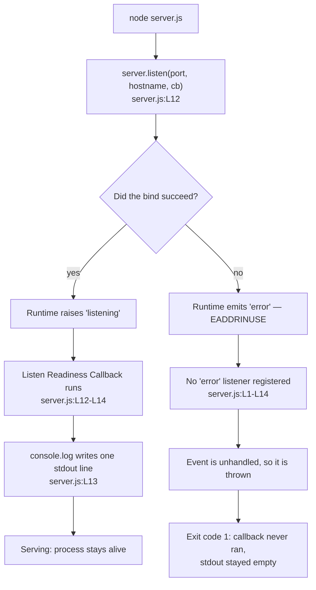

# Listen Readiness Callback

This page is the dedicated reference for the **Listen Readiness Callback** —
the anonymous, zero-arity arrow function declared at `server.js:L12-L14` and
handed to `server.listen(...)` as its third argument. It is one of the two
functions this repository contains; the other one, the
[Request Handler Callback](./request-handler-callback.md), has a page of its
own.

Two conventions govern the citations below. Every claim carries an inline
reference of the form `Source: server.js:L13`, and all such locators are
anchored to **baseline commit `1484182`** — the layout of `server.js` as it
stood before its JSDoc documentation comments were added. Those comments
shifted the file's physical line numbers, and the locators here continue to
describe the baseline layout, because the whole documentation set is
anchored to it and that is what makes citations comparable across pages. A
claim about something that appears *nowhere* in the file cites the file as a
whole, `server.js:L1-L14`, rather than any one line.

A great deal of what follows is an absence: no parameters, no `'error'`
listener, no `server.close()`, no structured logging. Each is recorded as a
characteristic of a deliberately minimal single-file service, not as a
defect awaiting repair. Nothing on this page proposes changing the code.

## Contents

- [Purpose](#purpose)
- [Registration](#registration)
- [Signature](#signature)
- [Parameters](#parameters)
- [Returns](#returns)
- [Behavior](#behavior)
- [Invariants](#invariants)
- [What it deliberately ignores](#what-it-deliberately-ignores)
- [Examples](#examples)
- [Error behavior](#error-behavior)
- [Source and traceability](#source-and-traceability)
- [Related documentation](#related-documentation)

## Purpose

The Listen Readiness Callback exists to announce that the listening socket
is open. The runtime invokes it after the bind succeeds, and its entire
effect is one line on stdout naming the address at which the service can be
reached. `Source: server.js:L12-L14`. That line is this process's only
readiness signal and its only observability output of any kind — there is no
health endpoint, no readiness probe, no metrics and no second message. It
implements **F-003 Startup Readiness Logging** (Medium). Everything else on
this page follows from two properties of the function: it is handed no
arguments, so it can report nothing about the bind it announces, and it runs
only when that bind succeeded, so its *absence* rather than any message it
could carry is how a failed startup is recognised.

## Registration

| Aspect            | Detail                                 |
| ----------------- | -------------------------------------- |
| Registered as     | Third argument to `server.listen(...)` |
| Registration site | `server.js:L12`                        |
| Triggering event  | The server's `listening` event         |
| Invoked by        | The Node core `http` module            |
| Frequency         | At most once per process               |
| Arity             | Zero — no argument is supplied         |

**The argument order is `(port, hostname, callback)` — the numeric port
first, the address string second, this callback third.** That order is the
detail most easily misremembered, so it is worth stating without hedging:
the call as written is `server.listen(port, hostname, () => {`.
`Source: server.js:L12`. [Module bindings](../module-bindings.md) is the
authoritative page for this call site and for the `port` and `hostname`
bindings it passes.

Passing the function in this position registers it as a one-shot listener
for the server's `listening` event. The runtime raises that event once the
socket has been bound and is accepting connections, and the callback runs
then. `Source: server.js:L12-L14`.

Registration is this callback's only relationship with the rest of the file.
Application code never invokes it, and could not: the function is anonymous
and is never assigned to a name, so there is no identifier through which a
call could be written. `Source: server.js:L12-L14`. Nor does anything in the
file re-bind the server — there is no second `listen` call and no
`server.close()` anywhere (`Source: server.js:L1-L14`) — so no second
invocation is possible either.

## Signature

```js
server.listen(port, hostname, () => {
```

`Source: server.js:L12`.

The parameter list is empty: `()`. There is no positional parameter, no
default value, no rest parameter and no destructuring — the two parentheses
enclose nothing at all. The function is an anonymous arrow function with no
identifier of its own anywhere in the source, which is why this
documentation set refers to it by the stable role name **Listen Readiness
Callback**; there is no name in the code to use instead.

The JSDoc `@callback` block that sits above the definition site contributes
the documentation-level type name `ListenReadinessCallback`. That is a name
for the callback's *type*, intended for tooling and for editor hovers, not a
name for the function; prose in this set uses the role name.

## Parameters

**None — zero arity.** The callback declares no parameters and the runtime
supplies no arguments to it. `Source: server.js:L12`. There is no empty
parameter table below this paragraph because there is no row that could go
in one.

The consequences are the substance of this section:

- **No error argument.** The callback has nothing through which a problem
  could be reported to it, so it cannot inspect, log or react to the outcome
  of the bind it announces. Its execution *is* the outcome.
- **No server handle.** It is not passed the `http.Server` instance, so it
  reaches nothing about the listener through an argument. The address it
  prints comes from the module-scope constants instead, as
  [Behavior](#behavior) sets out.
- **This is not Node's error-first convention.** Node.js popularised the
  `(err, result)` callback shape, in which the first argument carries a
  failure and a caller checks it before doing anything else. The readiness
  callback of `listen` is not that shape: it is a success-only notification,
  invoked with nothing. `Source: server.js:L12-L14`.
- **So the failure path bypasses it rather than informing it.** Because
  there is no `err` parameter to receive, a bind failure cannot be delivered
  *into* this function; it surfaces elsewhere entirely, as
  [Error behavior](#error-behavior) describes.

## Returns

| Returns     | Consumed by                 | Effect of the value |
| ----------- | --------------------------- | ------------------- |
| `undefined` | The Node core `http` module | None — discarded    |

The body contains no `return` statement; searching the baseline source for
`return` yields zero matches. `Source: server.js:L1-L14`. An arrow function
with a block body and no `return` evaluates to `undefined`, so that is what
the single invocation yields.

The caller is the runtime's event emitter dispatching the `listening` event,
and an event emitter makes no use of a listener's return value. This
callback's entire contribution is therefore a side effect — one write to
stdout — rather than anything handed back. `Source: server.js:L13`.

## Behavior

### Statement walkthrough

The body is a single statement, but it does two distinct things that are
worth separating:

| Step | Action                          | Locator         |
| ---- | ------------------------------- | --------------- |
| 1    | Template-literal interpolation  | `server.js:L13` |
| 2    | `console.log(...)` to stdout    | `server.js:L13` |

- **Step 1** evaluates the backtick template
  `` `Server running at http://${hostname}:${port}/` ``, substituting the
  two module-scope constants into the message and producing one string.
  `Source: server.js:L13`.
- **Step 2** passes that string to `console.log`, which writes it to
  **stdout** followed by a newline. `Source: server.js:L13`.

There is no branching, no loop, no early exit and nothing asynchronous
inside the body. Both steps belong to the same line of source, and when the
second finishes the callback is done.

### The closure over `hostname` and `port`

The interesting property of this function is visible in the source text
itself rather than inferred. The template at `server.js:L13` names
`${hostname}` and `${port}` — the identifiers of the module-scope constants
declared at `server.js:L3` and `server.js:L4` — and those are the same two
bindings passed as the first two arguments of the `server.listen(...)` call
at `server.js:L12`. The callback closes over them; it holds no copy of its
own and, being zero-arity, receives no value to print either.

That is what makes the message trustworthy. The log line and the socket read
from one source, so they cannot disagree: whatever the constants say, the
bind used it and the line reports it. If either constant is edited the
printed address follows automatically, with no second place to update.
`Source: server.js:L3-L4`, `Source: server.js:L12-L13`.
[Configuration](../../configuration.md) owns the editing procedure.

### Exact output

As the constants currently stand, the process writes exactly one line:

```text
Server running at http://127.0.0.1:3000/
```

`Source: server.js:L13`, with the interpolated values from
`Source: server.js:L3-L4`. Observed on stdout it is 41 bytes: the 40
characters above plus the single trailing newline `console.log` appends.
Observed stderr over the same run is empty.

This one line is the whole of the process's output. Nothing else is ever
written — not on a request, not on a client disconnect, and not on
shutdown — so the readiness line is both the first and the last thing a
reader of the logs will see. `Source: server.js:L1-L14`.

### When it runs, relative to the `listen` call

The callback does not run as part of the `server.listen(...)` call. The bind
is carried out asynchronously, and the callback runs on a later turn of the
event loop, once the `listening` event is raised. The ordering is directly
observable: loading the module and printing immediately afterwards puts the
loader's own output *before* the readiness line, as
[Example C](#examples) shows. `Source: server.js:L12-L14`.

A practical consequence for anyone reading logs: the line's appearance is
what confirms the socket is bound. Reaching the statement after
`server.listen(...)` confirms nothing, because the bind may not have
completed — or succeeded — by then.

### Readiness signal flow



## Invariants

These hold for every run of this program, and they hold because of what the
single statement does rather than by convention:

- **It fires at most once per process.** It is registered as a one-shot
  `listening` listener, and nothing in the file re-binds the server, so
  there is no second `listening` event to answer.
  `Source: server.js:L1-L14`.
- **It always reflects the real bind target.** It reads the same constants
  that were passed to `server.listen(...)`, so the address in the message is
  by construction the address that was bound.
  `Source: server.js:L3-L4`, `Source: server.js:L12`.
- **It emits exactly one line**, identical on every run for a given host and
  port pair. There is no variable content whatsoever — no timestamp, no
  process id, no request data, no counter — so two runs produce
  byte-identical output. `Source: server.js:L13`.
- **It writes to stdout only.** `console.log` targets stdout, and nothing in
  this callback writes to stderr; the observed stderr of a successful run is
  empty. `Source: server.js:L13`.
- **Its appearance is the only confirmation of readiness the process
  offers**, and conversely its absence is the only signal that startup
  failed. There is no exit code to inspect while the process is running and
  no other artifact to check. `Source: server.js:L1-L14`.

## What it deliberately ignores

The Request Handler Callback ignores its inputs; this callback has no inputs
to ignore, so what it passes over is the set of things a reader might expect
a readiness signal to provide.

- **No health check and no readiness probe.** The line is a one-time log
  statement, not an endpoint. Nothing can query readiness after the fact:
  once the line has scrolled past, the process offers no way to ask whether
  it is ready. `Source: server.js:L12-L14`.
- **No structured logging.** The output is a plain human-readable sentence,
  not JSON and not key-value pairs, so nothing downstream can parse a field
  out of it without string handling. `Source: server.js:L13`.
- **No timestamp and no log level.** There is no `INFO` or `WARN` prefix, no
  logger name and no clock reading — the template contains only the two
  interpolated constants and fixed text. `Source: server.js:L13`.
- **No error information.** Being zero-arity it has nothing to report; it
  cannot even state that the bind it is announcing succeeded, beyond the
  fact of having run at all. `Source: server.js:L12`.
- **No log destination configuration.** `console.log` writes to stdout
  unconditionally. There is no log file, no transport, no rotation and no
  verbosity switch to turn the line off or send it elsewhere.
  `Source: server.js:L13`.
- **No influence from the environment.** Nothing in the file reads
  `process.env` — searching the baseline source for `process.env` yields
  zero matches (`Source: server.js:L1-L14`) — so the host and port this line
  reports cannot be changed by an environment variable, a command-line flag
  or a configuration file. Editing the constants is the only mechanism, and
  [configuration](../../configuration.md) owns that procedure.

## Examples

Every output below was observed against a live instance under Node.js
24.19.0 (Active LTS "Krypton"), the documented baseline;
[getting started](../../getting-started.md) owns the full runtime support
table. Each output below was produced by running the service and reading
what it wrote, which is the only source any of them come from.

### Example A — a successful start

Run from the repository root:

```bash
node server.js
```

Observed stdout:

```text
Server running at http://127.0.0.1:3000/
```

That is the complete output of the run: one line, written the moment the
socket was bound, with nothing on stderr. `Source: server.js:L13`. The
process then runs in the foreground indefinitely, because the open
listening socket keeps the event loop occupied; the shell does not come
back until the process is stopped.

There is no `npm start` to reach for, because the repository has no
`package.json`. `node server.js` is the only launch path.

### Example B — the callback never runs

This is the negative case, and it is the most valuable observation on the
page. With one instance already holding the port, a second one was started
the same way:

```bash
node server.js
```

Observed result:

| Channel   | Observation                                    |
| --------- | ---------------------------------------------- |
| Exit code | `1`                                            |
| stdout    | **Empty — zero bytes**                         |
| stderr    | The unhandled `'error'` output shown below     |

The empty stdout is the point. The readiness line is unconditional within
the callback — there is no branch that could suppress it — so its absence
proves the callback itself never executed, rather than that the logging went
wrong. `Source: server.js:L12-L14`.

The stable part of the observed stderr:

```text
      throw er; // Unhandled 'error' event
      ^

Error: listen EADDRINUSE: address already in use 127.0.0.1:3000
Emitted 'error' event on Server instance at:
```

followed by the error's own fields:

```text
  code: 'EADDRINUSE',
  syscall: 'listen',
  address: '127.0.0.1',
  port: 3000
```

Three parts of that output are omitted above on purpose, because they are
not stable enough to publish as universal: the `node:events:<line>` header
that opens the trace, the `node:net` stack frames, and the numeric `errno`
field, which is platform-specific. The runtime also appends a line naming
its own version. [Troubleshooting](../../troubleshooting.md) records the
trace as it was observed, including which parts to match on.

### Example C — the readiness line appears on an accidental import

The module assigns nothing to `module.exports` — searching the baseline
source for `module.exports` yields zero matches
(`Source: server.js:L1-L14`) — so requiring the file hands the caller
nothing while still running the module body, bind included. Run from the
repository root:

```bash
node -e "const m = require('./server'); console.log('own keys:', Object.keys(m).length);"
```

Observed stdout, in this order:

```text
own keys: 0
Server running at http://127.0.0.1:3000/
```

Three things are visible there. The exported object has zero own keys, so
the import yields no handle on anything. The readiness line is printed
anyway, because loading the module binds the socket as a side effect and
this callback runs on the `listening` event exactly as it would under
`node server.js`. `Source: server.js:L12-L14`. And the line arrives *after*
the requiring code's own output — direct evidence that the callback runs on
a later event-loop turn than the `server.listen(...)` call returns.

The process then does not exit on its own, because the listening socket
keeps a handle registered with the event loop; it has to be stopped.
[Usage](../../usage.md) covers this from the caller's side and is the owner
of the reader-facing guidance about importing this file.

## Error behavior

The Listen Readiness Callback has no failure mode of its own: it takes no
input that could be invalid, performs one write to stdout, and contains no
`try`/`catch` — searching the baseline source for `try` yields zero matches,
and there is no `catch` and no `throw` either. `Source: server.js:L1-L14`.
Nothing inside it is guarded, and nothing inside it needs to be.

The important question is therefore not how it fails but **whether it runs
at all**, and the answer is settled before it by the bind.

### The bind-failure sequence

Observed by starting a second instance against an already-bound port:

1. The `server.listen(port, hostname, callback)` call fails to bind the
   socket. `Source: server.js:L12`.
2. The server emits an `'error'` event instead of `listening`.
3. **No `'error'` listener is registered anywhere in the file** — searching
   the baseline source for `.on(` yields zero matches, so nothing subscribes
   to that event. `Source: server.js:L1-L14`. The event is unhandled, and
   the runtime throws it.
4. The process terminates with **exit code 1**.
5. **This callback never executes**, so no readiness line is emitted and
   stdout stays empty. `Source: server.js:L12-L14`.

Step 3 is the mechanism behind step 5, and it is a fact of the current
design rather than a defect: the `'error'` event has no listener, so the
failure is fatal instead of reportable. Step 5 is its most useful
consequence — an empty stdout is a reliable indicator that the socket was
never bound.

The operational remedy — identifying what already holds the port, and what
follows from moving the service to another one — lives in
[troubleshooting](../../troubleshooting.md), which owns that diagnosis end
to end.

### Termination has no counterpart message

There is no graceful-shutdown path in this file: no signal handler is
installed and `server.close()` is never called — searching the baseline
source for `SIGTERM`, `SIGINT` and `.close(` yields zero matches in each
case. `Source: server.js:L1-L14`. A termination request ends the process at
once, with no connection draining.

This callback therefore has no counterpart on the way out. It announces the
start of the listening socket and nothing announces its end, which is why
the readiness line is the last thing in the log as well as the first.
[Request lifecycle](../../architecture/request-lifecycle.md) documents the
process states this produces.

## Source and traceability

| Attribute          | Value                                         |
| ------------------ | --------------------------------------------- |
| Source             | `server.js:L12-L14`                           |
| Baseline commit    | `1484182`                                     |
| Documented unit    | U-8                                           |
| Implements         | F-003 Startup Readiness Logging (Medium)      |
| Upstream section   | §2.1.3                                        |
| Kind               | Anonymous zero-arity arrow function           |
| Registration site  | `server.js:L12`                               |
| Constants read     | `server.js:L3`, `server.js:L4`                |
| Documentation type | `ListenReadinessCallback` (JSDoc `@callback`) |

The inline counterpart of this page is the JSDoc `@callback` block placed
immediately above the definition site in `server.js`, which carries an
`@see` link back here. Each side cites the other, so a change to either one
is detectable from the opposite direction.

The two constants this callback closes over are documented in full on
[module bindings](../module-bindings.md): `hostname`, the IPv4 loopback
literal at `server.js:L3`, and `port`, the literal `3000` at
`server.js:L4`. That page is also the authoritative owner of the
`server.listen(...)` call site that registers this function.

The repository as a whole is the target endpoint for an externally hosted
integration whose counterpart is not part of this repository. Nothing in
this callback is specific to that caller: the line it writes is addressed to
whoever is reading the process's stdout, and it names only the host and port
taken from `server.js:L3-L4`.

## Related documentation

- [Documentation hub](../../README.md) — the index for this documentation
  set.
- [API reference index](../README.md) — the parent index, with the full
  inventory of documented units.
- [Request Handler Callback](./request-handler-callback.md) — this
  repository's other function, documented on its own page.
- [Module bindings](../module-bindings.md) — `http`, `hostname`, `port`, and
  `server`, including the `server.listen(...)` call site that registers this
  callback.
- [Getting started](../../getting-started.md) — prerequisites, the launch
  command, and the readiness line as an onboarding step.
- [Configuration](../../configuration.md) — how to change the host and port
  this line reports, and what changes when you do.
- [Troubleshooting](../../troubleshooting.md) — the `EADDRINUSE`
  termination, the missing readiness line as a diagnostic, and the remedy.
- [Request lifecycle](../../architecture/request-lifecycle.md) — the process
  states this callback's execution marks the boundary of.
