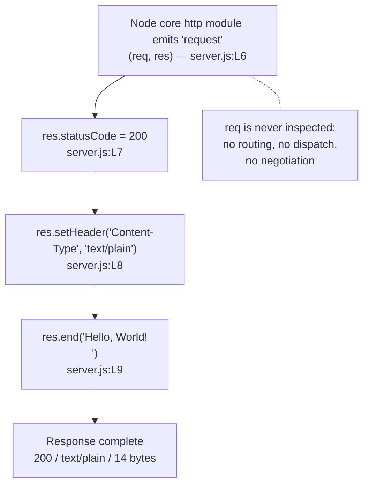

# Request Handler Callback

This page is the dedicated reference for the **Request Handler Callback** —
the anonymous arrow function declared at `server.js:L6-L10` and registered
as the request listener of this service's only HTTP server. It is one of
the two functions this repository contains; the other one, the
[Listen Readiness Callback](./listen-readiness-callback.md), has a page of
its own.

Two conventions govern the citations below. Every claim carries an inline
reference of the form `Source: server.js:L7`, and all such locators are
anchored to **baseline commit `1484182`** — the layout of `server.js` as it
stood before its JSDoc documentation comments were added. Those comments
shifted the file's physical line numbers, and the locators here continue to
describe the baseline layout, because the whole documentation set is
anchored to it and that is what makes citations comparable across pages. A
claim about something that appears *nowhere* in the file cites the file as a
whole, `server.js:L1-L14`, rather than any one line.

Several of the facts recorded below are absences: no routing, no
`try`/`catch`, no inspection of the request. Each is documented as a
characteristic of a deliberately minimal single-file service, not as a
defect awaiting repair. Nothing on this page proposes changing the code.

## Contents

- [Purpose](#purpose)
- [Registration](#registration)
- [Signature](#signature)
- [Parameters](#parameters)
- [Returns](#returns)
- [Behavior](#behavior)
- [Invariants](#invariants)
- [What it deliberately ignores](#what-it-deliberately-ignores)
- [Examples](#examples)
- [Error behavior](#error-behavior)
- [Source and traceability](#source-and-traceability)
- [Related documentation](#related-documentation)

## Purpose

The Request Handler Callback is the entire request-handling behaviour of
this service. The runtime invokes it once per inbound HTTP request and it
answers every one of them identically, in three unconditional statements:
it sets the status to `200`, sets `Content-Type` to `text/plain`, and ends
the response with the body `Hello, World!\n`. There is no second path
through it, because no part of the request is examined and so no request can
be treated differently from another. `Source: server.js:L6-L10`. It
implements **F-002 Uniform HTTP Response Handler** (Critical). The
repository as a whole is the target endpoint for an externally hosted
integration whose counterpart is not part of this repository, and this
callback holds nothing specific to that caller or to any other: every
client receives the same 14 bytes.

## Registration

| Aspect            | Detail                                          |
| ----------------- | ----------------------------------------------- |
| Registered as     | The sole argument to `http.createServer(...)`   |
| Registration site | `server.js:L6`                                  |
| Triggering event  | The server's `request` event                    |
| Invoked by        | The Node core `http` module                     |
| Frequency         | Once per inbound request, for the process' life |

The call that registers this callback is also the call that creates the
server: the `http.Server` instance returned by `http.createServer(...)` is
bound to `server` on the same line. `Source: server.js:L6`.
[Module bindings](../module-bindings.md) is the authoritative page for that
binding and for the call site itself.

Registration is this callback's only relationship with the rest of the file.
Application code never calls it, and could not: the function is anonymous
and is never assigned to a name, so there is no identifier through which a
call could be written. `Source: server.js:L6-L10`. Every invocation comes
from the runtime, which emits `request` once the socket is bound and an
inbound request has been parsed.

## Signature

```js
const server = http.createServer((req, res) => {
```

`Source: server.js:L6`.

The parameter list is exactly two positional parameters, `req` and `res`, in
that order. There is no default value, no rest parameter, and no
destructuring. The function is an anonymous arrow function with no
identifier of its own anywhere in the source, which is why this
documentation set refers to it by the stable role name **Request Handler
Callback** — there is no name in the code to use instead.

The JSDoc `@callback` block that sits above the definition site contributes
the documentation-level type name `RequestHandlerCallback`. That is a name
for the callback's *type*, intended for tooling and for editor hovers, not a
name for the function; prose in this set uses the role name.

## Parameters

| Name  | Type                   | Description                           |
| ----- | ---------------------- | ------------------------------------- |
| `req` | `http.IncomingMessage` | Inbound request. **Never read.**      |
| `res` | `http.ServerResponse`  | Outbound response. The only one used. |

The source carries no type annotations of any kind — it is plain CommonJS
JavaScript, and the baseline file contains neither JSDoc types nor
TypeScript. `Source: server.js:L1-L14`. The two types above are therefore
the documented Node.js types of the arguments the `request` event supplies,
not types declared in this file.

### `req`

The request object is present in the signature and unused in the body.
Nothing in the three statements touches `req.url`, `req.method`,
`req.headers`, or the request body; searching the executable source for
`req.` yields zero matches. `Source: server.js:L6-L10`. The parameter is
declared because `req` is the first argument the `request` event supplies
and `res` is the second, so the position has to be occupied in order to
reach `res` at all.

This one omission is the origin of every surprise the service holds, and
[What it deliberately ignores](#what-it-deliberately-ignores) sets out the
consequences in full.

### `res`

`res` receives all three statements: the status assignment, the header call,
and the `end()` that writes the body and terminates the response.
`Source: server.js:L7-L9`. It is also the only channel through which this
callback produces any effect at all, as [Returns](#returns) explains.

## Returns

| Returns     | Consumed by                 | Effect of the value |
| ----------- | --------------------------- | ------------------- |
| `undefined` | The Node core `http` module | None — discarded    |

The body contains no `return` statement; searching the executable source for
`return` yields zero matches. `Source: server.js:L6-L10`. An arrow function
with a block body and no `return` evaluates to `undefined`, so that is what
every invocation yields.

The caller is the runtime's event emitter dispatching the `request` event,
and an event emitter makes no use of a listener's return value. The response
is delivered entirely through side effects on `res` — the status assignment,
the header call, and `res.end()` — rather than through anything handed back
to the caller. `Source: server.js:L7-L9`.

## Behavior

### Statement walkthrough

The Request Handler Callback runs three statements, in this order, on every
invocation:

| Step | Statement                                      | Locator        |
| ---- | ---------------------------------------------- | -------------- |
| 1    | `res.statusCode = 200;`                        | `server.js:L7` |
| 2    | `res.setHeader('Content-Type', 'text/plain');` | `server.js:L8` |
| 3    | `res.end('Hello, World!\n');`                  | `server.js:L9` |

The three differ in mechanism, and the distinction is worth keeping sharp:

- Step 1 is a direct **property assignment** on the response object, not a
  method call. `statusCode` is a writable property that the runtime reads
  when it serialises the status line. `Source: server.js:L7`.
- Step 2 is a **method call** — `setHeader(name, value)` — setting exactly
  one response header, and it is the only header this code sets.
  `Source: server.js:L8`.
- Step 3 is a method call that does two things in one: it writes the
  response body and it terminates the response. Nothing follows it.
  `Source: server.js:L9`.

There is no branching, no loop, no early exit, and nothing asynchronous. The
three statements run in that order for every request, and the response is
finished by the time the callback returns. `Source: server.js:L6-L10`.

### Statement flow



### Resulting response contract

| Property         | Value                                | Source         |
| ---------------- | ------------------------------------ | -------------- |
| Status code      | `200`                                | `server.js:L7` |
| `Content-Type`   | `text/plain`, no `charset` parameter | `server.js:L8` |
| Response body    | `Hello, World!\n` (14 bytes)         | `server.js:L9` |
| `Content-Length` | `14`, derived by the runtime         | `server.js:L9` |

Those 14 bytes are 13 printable characters plus one trailing LF.
`Source: server.js:L9`. `Content-Length` is not declared anywhere in the
code: the runtime derives it from the `res.end()` payload.

The [HTTP endpoint reference](../http-endpoint.md) is the authoritative
owner of this contract, including the responses the service never produces.
It is restated here rather than transcluded because plain Markdown has no
include mechanism and no documentation generator is in use — the locators
are identical on both pages, so either copy can be verified against the same
source.

### Header provenance

Only one of the response headers comes from application code, and the
distinction materially affects what an integrator may rely on. Observed
header order places that single application-set header first:

| Header                     | Set by                                     |
| -------------------------- | ------------------------------------------ |
| `Content-Type: text/plain` | Application code, `server.js:L8`           |
| `Date`                     | Node runtime (injected)                    |
| `Connection: keep-alive`   | Node runtime (injected)                    |
| `Keep-Alive: timeout=5`    | Node runtime (injected)                    |
| `Content-Length: 14`       | Node runtime (derived from `res.end()`)    |

`Content-Type` is the only header this callback states
(`Source: server.js:L8`). The remaining four are runtime behaviour around
it: three are injected outright, and `Content-Length` is computed from the
body passed to `res.end()` (`Source: server.js:L9`). An integrator may hold
this repository to the first row; the other four describe the Node.js
version in use rather than anything written here.

## Invariants

These hold for every invocation of the Request Handler Callback, and they
hold because of what the three statements do rather than by convention:

- **Every invocation produces a byte-identical response**: status `200`,
  `Content-Type: text/plain`, and the same 14-byte body.
  `Source: server.js:L7-L9`.
- **The response is completed synchronously.** `res.end()` at `server.js:L9`
  is the callback's last statement, so no asynchronous continuation exists
  and nothing is left pending when the callback returns.
- **The response never depends on the request**, which makes it
  deterministic and independent of the order in which requests arrive.
  `Source: server.js:L6-L10`.
- **The callback holds no state between invocations**, so concurrent
  requests cannot interfere with one another;
  [request lifecycle](../../architecture/request-lifecycle.md) covers the
  concurrency characteristics that follow from this.
- **It is the only writer of the response.** No other statement in the file
  touches `res`, and no middleware, filter, or wrapper stands between the
  runtime and this callback. `Source: server.js:L1-L14`.

## What it deliberately ignores

A reader's default assumption for an HTTP server is that routing exists.
Here it does not, and the reason is a single omission: `req` is never read.
Searching the executable source for `req.` yields zero matches, so nothing
reaches `req.url`, `req.method`, `req.headers`, or the request body.
`Source: server.js:L6-L10`.

Everything in this section follows from that one fact:

- **No routing.** Every path returns the same response, because no path is
  examined.
- **No method dispatch.** Every method reaches the same three statements.
- **No `404` path, no `405` path, and no `5xx` originating in application
  code.** A response that reports a bad path or a refused method would
  require reading the request first.
- **No content negotiation.** A request sending
  `Accept: text/html,application/xhtml+xml` still receives `text/plain`,
  because negotiation would mean reading `req.headers`.
  [Usage](../../usage.md) covers this from the caller's side.
- **No validation, no authentication, no authorization, no CORS, and no
  rate limiting.** Each of those requires inspecting the request, and none
  of them appears in the file. `Source: server.js:L1-L14`.
- **The request body is never consumed or drained.** The callback never
  subscribes to `req`, so an inbound payload is simply never read.

### Path behavior

Observed against a live instance:

| Path              | Status | `Content-Type` | Body size |
| ----------------- | ------ | -------------- | --------- |
| `/`               | 200    | `text/plain`   | 14 bytes  |
| `/any/path`       | 200    | `text/plain`   | 14 bytes  |
| `/does/not/exist` | 200    | `text/plain`   | 14 bytes  |
| `/favicon.ico`    | 200    | `text/plain`   | 14 bytes  |
| `/x?q=1&a=2`      | 200    | `text/plain`   | 14 bytes  |

The `/favicon.ico` row deserves its own mention, because browsers request
that path on their own initiative without being asked to. It receives the
greeting rather than the `404` a reader would expect, for exactly the same
reason as every other path: the path is never examined.
`Source: server.js:L6-L10`.

### Method behavior

| Method                                 | Status | Body size   |
| -------------------------------------- | ------ | ----------- |
| GET, POST, PUT, PATCH, DELETE, OPTIONS | 200    | 14 bytes    |
| HEAD                                   | 200    | **0 bytes** |

`HEAD` is the only row that differs, and the difference is not written in
application code. The Node.js runtime suppresses response bodies for `HEAD`
requests; this callback cannot special-case the method, because it never
reads `req.method`. It runs identically and still calls
`res.end('Hello, World!\n')`, and the runtime drops the body on the way out.
`Source: server.js:L6-L10`. The observed `HEAD` response also carries no
`Content-Length` header at all — the runtime omits it, having no body to
measure.

## Examples

Every output below was observed against a live instance under Node.js
24.19.0 (Active LTS "Krypton"), the documented baseline;
[getting started](../../getting-started.md) owns the full runtime support
table. Start the service from the repository root before issuing any of
these requests:

```bash
node server.js
```

There is no `npm start` to reach for, because the repository has no
`package.json`. `node server.js` is the only launch path.

### Example A — the callback in its invocation context

```js
const server = http.createServer((req, res) => {
  res.statusCode = 200;
  res.setHeader('Content-Type', 'text/plain');
  res.end('Hello, World!\n');
});
```

`Source: server.js:L6-L10`. This is the registration site and the complete
function body, reproduced from the baseline layout. It is the whole of the
callback: two parameters, three statements, and no other code.

### Example B — the full response

```bash
curl -s -i http://127.0.0.1:3000/
```

Observed output:

```text
HTTP/1.1 200 OK
Content-Type: text/plain
Date: <RFC 1123 date>
Connection: keep-alive
Keep-Alive: timeout=5
Content-Length: 14

Hello, World!
```

The `Date` value is generated per request, so it is shown as a placeholder
rather than a fixed timestamp; everything else above is identical on every
request. `Source: server.js:L7-L9`.

### Example C — the body, byte for byte

A trailing newline is easy to lose in a terminal, so the body length is
worth confirming rather than trusting:

```bash
curl -s http://127.0.0.1:3000/ | od -c
```

Observed output:

```text
0000000   H   e   l   l   o   ,       W   o   r   l   d   !  \n
0000016
```

The dump terminates at octal offset `0000016`, which is 14 in decimal: 13
printable characters, then the LF written by the string literal, and then
nothing. `Source: server.js:L9`.

### Example D — the request is ignored

```bash
curl -s -i -X POST \
  -H 'Content-Type: application/json' \
  -d '{"a":1}' \
  'http://127.0.0.1:3000/api?q=1'
```

Observed output:

```text
HTTP/1.1 200 OK
Content-Type: text/plain
Date: <RFC 1123 date>
Connection: keep-alive
Keep-Alive: timeout=5
Content-Length: 14

Hello, World!
```

Four things were varied at once here — the method is `POST`, the path is
`/api`, a query string `q=1` is attached, and the request carries
`Content-Type: application/json` with the JSON body `{"a":1}` — and the
answer is the same one Example B produced. That is the most direct
demonstration that the method, the path, the query string, the request
headers, and the payload are all ignored together.
`Source: server.js:L6-L10`.

## Error behavior

There is no error path in application code, and no `5xx` response can
originate in the Request Handler Callback. The reasons are structural:

- **No `try`/`catch` anywhere in the file.** Searching the executable source
  for `try` yields zero matches, and there is no `catch` and no `throw`
  either. `Source: server.js:L1-L14`.
- **All three statements are non-throwing in normal operation**, and the
  response is completed synchronously within the callback, so there is no
  later point at which a failure could surface from it.
  `Source: server.js:L7-L9`.
- **No failure of its own to report.** Reporting a `4xx` would require
  reading the request and reporting a `5xx` would require detecting a
  failure; this callback does neither.
  `Source: server.js:L6-L10`.
- **No stream error reaches it.** The request body is never consumed or
  drained, so the callback never subscribes to `req` and never observes an
  error from that stream. `Source: server.js:L6-L10`.

Whether the Request Handler Callback runs at all is settled earlier than any
request: it is invoked only for requests that arrive after the socket has
been bound successfully. If the bind fails, the process is torn down before
any request can be accepted and this callback never executes — see the
[Listen Readiness Callback](./listen-readiness-callback.md) for the bind
path and [troubleshooting](../../troubleshooting.md) for that failure as it
is encountered in practice.

All of the above describes the current design as it stands.

## Source and traceability

| Attribute            | Value                                          |
| -------------------- | ---------------------------------------------- |
| Source               | `server.js:L6-L10`                             |
| Baseline commit      | `1484182`                                      |
| Documented unit      | U-6                                            |
| Implements           | F-002 Uniform HTTP Response Handler (Critical) |
| Upstream section     | §2.1.2                                         |
| Kind                 | Anonymous arrow function                       |
| Registration site    | `server.js:L6`                                 |
| Documentation type   | `RequestHandlerCallback` (JSDoc `@callback`)   |

The inline counterpart of this page is the JSDoc `@callback` block placed
immediately above the definition site in `server.js`, which carries an
`@see` link back here. Each side cites the other, so a change to either one
is detectable from the opposite direction.

The callback's two parameters come from the Node.js runtime rather than from
any package: the file's sole import is the built-in `http` module, bundled
with the runtime, and the repository has no third-party dependencies.
`Source: server.js:L1`.

## Related documentation

- [Documentation hub](../../README.md) — the index for this documentation
  set.
- [API reference index](../README.md) — the parent index, with the full
  inventory of documented units.
- [HTTP endpoint reference](../http-endpoint.md) — the wire-level contract
  this callback produces, and the responses the service never produces.
- [Listen Readiness Callback](./listen-readiness-callback.md) — this
  repository's other function, documented on its own page.
- [Module bindings](../module-bindings.md) — `http`, `hostname`, `port`, and
  `server`, including the `http.createServer(...)` call site that registers
  this callback.
- [Usage](../../usage.md) — client examples, the method and path matrices
  from the caller's side, and what not to do with this file.
- [Request lifecycle](../../architecture/request-lifecycle.md) — where this
  callback sits in the end-to-end request path.
- [Troubleshooting](../../troubleshooting.md) — the uniform response and the
  other behaviours that surprise readers first.
