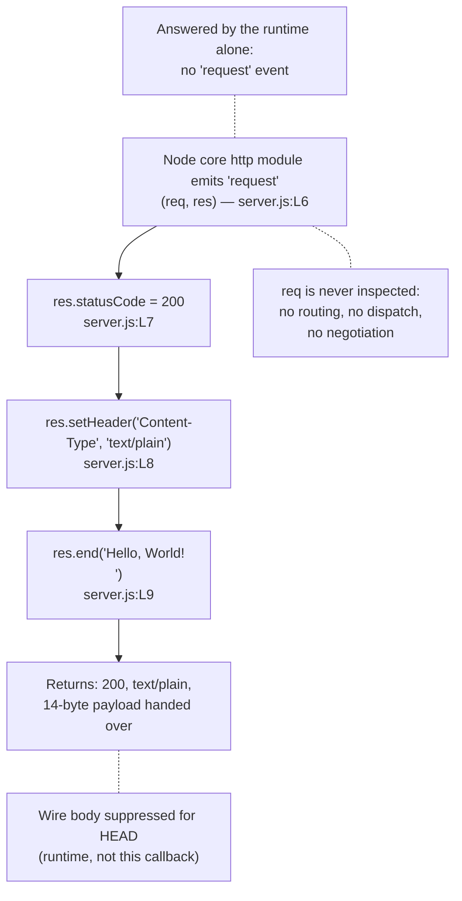

# Request Handler Callback

This page is the dedicated reference for the **Request Handler Callback** —
the anonymous arrow function declared at `server.js:L6-L10` and registered
as the request listener of this service's only HTTP server. It is one of
the two functions this repository contains; the other one, the
[Listen Readiness Callback](./listen-readiness-callback.md), has a page of
its own.

Two conventions govern the citations below. The first is what counts as
evidence. A claim about what the code *is* carries an inline reference of
the form `Source: server.js:L7`; a claim about what the running service
*does* is attributed in the prose around it to observation against a live
instance, and many claims carry both, because the code's contribution and
the runtime's are separable here. A source locator is never offered on its
own as evidence for runtime behaviour, because it cannot establish any —
the runs this page reports were made under Node.js 24.19.0.

The second convention is anchoring: every locator on this page refers to
**baseline commit `1484182`** — the layout of `server.js` as it stood
before its JSDoc documentation comments were added. Those comments shifted
the file's physical line numbers, and the locators here continue to
describe the baseline layout, because the whole documentation set is
anchored to it and that is what makes citations comparable across pages. A
claim about something that appears *nowhere* in the file cites the file as a
whole, `server.js:L1-L14`, rather than any one line.

Several of the facts recorded below are absences: no routing, no
`try`/`catch`, no inspection of the request. Each is documented as a
characteristic of a deliberately minimal single-file service, not as a
defect awaiting repair. Nothing on this page proposes changing the code.

## Contents

- [Purpose](#purpose)
- [Registration](#registration)
- [Signature](#signature)
- [Parameters](#parameters)
- [Returns](#returns)
- [Behavior](#behavior)
- [Invariants](#invariants)
- [What it deliberately ignores](#what-it-deliberately-ignores)
- [Examples](#examples)
- [Error behavior](#error-behavior)
- [Source and traceability](#source-and-traceability)
- [Related documentation](#related-documentation)

## Purpose

The Request Handler Callback is the entire request-handling behaviour of
this service. The runtime invokes it for every request it emits as a
`'request'` event, and each of those invocations runs the same three
unconditional statements: it sets the status to `200`, sets `Content-Type`
to `text/plain`, and ends the response with the payload `Hello, World!\n`.
There is no second path through it, because no part of the request is
examined and so no invocation can be treated differently from another.
`Source: server.js:L6-L10`. It implements **F-002 Uniform HTTP Response
Handler** (Critical).

Two qualifications belong in the same breath as that uniformity, and both
are the runtime's doing rather than this callback's. First, not every byte a
client sends becomes a `'request'` event: some input the runtime answers by
itself, and the callback is never reached for it —
[Input the runtime answers on its own](#input-the-runtime-answers-on-its-own)
lists the verified cases. Second, the payload handed to `res.end()` is
invariant at the application level, but the response on the wire is not:
`Date` is generated per response by the runtime, and a `HEAD` request is
answered with a zero-byte body and no `Content-Length` at all, which no
statement here decides. `Source: server.js:L7-L9`.

The repository as a whole is the target endpoint for an externally hosted
integration whose counterpart is not part of this repository, and this
callback holds nothing specific to that caller or to any other: the same
14-byte payload is written for all of them.

## Registration

| Aspect            | Detail                                            |
| ----------------- | ------------------------------------------------- |
| Registered as     | The sole argument to `http.createServer(...)`     |
| Registration site | `server.js:L6`                                    |
| Triggering event  | The server's `'request'` event                    |
| Invoked by        | The Node core `http` module                       |
| Frequency         | Once per `'request'` event, for the process' life |

The argument position is itself the construction of the server. One
expression does both things at once: `http.createServer(...)` returns the
`http.Server` instance that is bound to `server` on the same line, and the
function handed to it becomes that server's request behaviour in its
entirety. `Source: server.js:L6`.
[Module bindings](../module-bindings.md) is the authoritative page for that
binding and for the call site itself.

Because the behaviour is fixed at construction, there is nothing later that
could extend or displace it. No `server.on('request', ...)` call exists —
searching the executable source for `.on(` yields zero matches
(`Source: server.js:L1-L14`) — so this one argument is the only channel
through which request handling is ever attached, and it is attached before
the socket is bound at `server.js:L12`. A reader looking for middleware, a
router, or a second listener that might see the request first is looking for
something the shape of this single call rules out.

The frequency row above therefore has no exceptions on the application side:
for as long as the process lives, each `'request'` event the runtime emits
is delivered here and nowhere else. Which client input becomes such an event
is the runtime's decision rather than this file's, and
[Input the runtime answers on its own](#input-the-runtime-answers-on-its-own)
records the verified cases where it decides otherwise.

## Signature

```js
const server = http.createServer((req, res) => {
```

`Source: server.js:L6`.

Two positional parameters, `req` then `res`, and the order carries the whole
of the contract. The runtime supplies the request first and the response
second, so position one is occupied whether or not anything reads it:
declaring `req` is what makes `res` reachable at position two.
`Source: server.js:L6`. There is no default value, no rest parameter and no
destructuring, and there is no third parameter either — nothing resembling
Express's `next`, because no middleware chain exists for one to advance.

The same shape is why [Returns](#returns) has so little to say. Everything
this function produces, it produces by mutating the object it was handed at
position two, so its output channel is a parameter rather than a returned
value. A signature that returned the response instead would describe a
different design altogether.

**The role-name convention, stated here for both function pages.** Neither
function in this repository has an identifier of its own: each is an
anonymous arrow function passed directly as a call argument and never
assigned to a name. `Source: server.js:L1-L14`. Two consequences follow, and
they apply to the [Listen Readiness Callback](./listen-readiness-callback.md)
exactly as they do here. Application code cannot call either function —
there is no identifier through which a call could be written — so every
invocation of either one originates in the runtime. And prose needs stable
role names, **Request Handler Callback** and **Listen Readiness Callback**,
because the source offers no names to borrow. The JSDoc `@callback` block
above each definition site adds a documentation-level name for the
callback's *type* — `RequestHandlerCallback` in this one's case — which
serves tooling and editor hovers and is still not a name for the function.
The sibling page follows this convention rather than restating it.

## Parameters

| Name  | Type                   | Description                           |
| ----- | ---------------------- | ------------------------------------- |
| `req` | `http.IncomingMessage` | Inbound request. **Never read.**      |
| `res` | `http.ServerResponse`  | Outbound response. The only one used. |

The executable source carries no type annotations at all — it is plain
CommonJS JavaScript with no TypeScript anywhere, and at baseline commit
`1484182` the file carried no JSDoc either. `Source: server.js:L1-L14`. The
two types above are therefore the documented Node.js types of the arguments
the `'request'` event supplies rather than types the code declares. The
`@callback` block now above the definition site records the same pair as
JSDoc namepaths, `http.IncomingMessage` and `http.ServerResponse`, which is
a documentation-level statement about the two arguments and still not a
runtime check on them.

### `req`

The request object is present in the signature and unused in the body.
Nothing in the three statements touches `req.url`, `req.method`,
`req.headers`, or the request body; searching the executable source for
`req.` yields zero matches. `Source: server.js:L6-L10`. It is declared for
its position rather than for its contents, as [Signature](#signature)
explains, and an unread first parameter is the single most consequential
fact about this function.

This one omission is the origin of every surprise the service holds, and
[What it deliberately ignores](#what-it-deliberately-ignores) sets out the
consequences in full.

### `res`

`res` receives all three statements: the status assignment, the header call,
and the `end()` that writes the body and terminates the response.
`Source: server.js:L7-L9`. It is also the only channel through which this
callback produces any effect at all, as [Returns](#returns) explains.

## Returns

| Returns     | Goes back to                   | Effect |
| ----------- | ------------------------------ | ------ |
| `undefined` | The `'request'` event dispatch | None   |

No `return` statement appears in the body — searching the executable source
for `return` yields zero matches (`Source: server.js:L6-L10`) — so each
invocation evaluates to `undefined`.

The value is uninteresting, and the structural reason is what this section
is for: an `EventEmitter` dispatching `'request'` ignores whatever its
listeners evaluate to, and this listener has somewhere better to put its
output. All three statements write to `res` (`Source: server.js:L7-L9`), so
the response travels outward as side effects on a parameter while the
return value travels back into a dispatch loop that does not look at it.
Nothing in this file waits on a result from the callback either; the
`http.createServer(...)` expression that registered it had already finished
long before the first invocation. `Source: server.js:L6`.

## Behavior

### Statement walkthrough

The Request Handler Callback runs three statements, in this order, on every
invocation:

| Step | Statement                                      | Locator        |
| ---- | ---------------------------------------------- | -------------- |
| 1    | `res.statusCode = 200;`                        | `server.js:L7` |
| 2    | `res.setHeader('Content-Type', 'text/plain');` | `server.js:L8` |
| 3    | `res.end('Hello, World!\n');`                  | `server.js:L9` |

The three differ in mechanism, and the distinction is worth keeping sharp:

- Step 1 is a direct **property assignment** on the response object, not a
  method call. `statusCode` is a writable property that the runtime reads
  when it serialises the status line. `Source: server.js:L7`.
- Step 2 is a **method call** — `setHeader(name, value)` — setting exactly
  one response header, and it is the only header this code sets.
  `Source: server.js:L8`.
- Step 3 is a method call that does two things in one: it hands over the
  response body and it marks the outgoing message ended. No further
  statement follows it in the body. `Source: server.js:L9`.

There is no branching, no loop, no early exit, and nothing asynchronous
written here. The three statements run in that order on every invocation,
and step 3 is the last of them, so the callback returns with no continuation
of its own outstanding. `Source: server.js:L6-L10`. That is a statement
about application code and not about the wire: calling `res.end()` marks the
outgoing message ended, while flushing, the response's `'finish'` event and
the runtime's own cleanup happen afterwards and are not observed from here.
[Invariants](#invariants) states the distinction as the invariant it is.

### Statement flow



### Resulting response contract

| Property         | Value                                | Source         |
| ---------------- | ------------------------------------ | -------------- |
| Status code      | `200`                                | `server.js:L7` |
| `Content-Type`   | `text/plain`, no `charset` parameter | `server.js:L8` |
| Response body    | `Hello, World!\n` (14 bytes)         | `server.js:L9` |
| `Content-Length` | `14`, derived by the runtime         | `server.js:L9` |

Those 14 bytes are 13 printable characters plus one trailing LF.
`Source: server.js:L9`. `Content-Length` is not declared anywhere in the
code: the runtime derives it from the `res.end()` payload.

The table describes what one invocation produces for an ordinary request
other than `HEAD`. For a `HEAD` request the first two rows still hold and
the last two do not — the runtime suppresses the body and omits
`Content-Length` entirely, as [Method behavior](#method-behavior) records,
and the callback itself runs identically either way.
`Source: server.js:L6-L10`.

The [HTTP endpoint reference](../http-endpoint.md) is the authoritative
owner of this contract, including the responses the service never produces.
It is restated here rather than transcluded because plain Markdown has no
include mechanism and no documentation generator is in use — the locators
are identical on both pages, so either copy can be verified against the same
source.

### Header provenance

Only one of the response headers comes from application code, and the
distinction materially affects what an integrator may rely on. Observed
header order places that single application-set header first:

| Header                     | Set by                                  |
| -------------------------- | --------------------------------------- |
| `Content-Type: text/plain` | Application code, `server.js:L8`        |
| `Date`                     | Node runtime (injected)                 |
| `Connection: keep-alive`   | Node runtime (injected)                 |
| `Keep-Alive: timeout=5`    | Node runtime (injected)                 |
| `Content-Length: 14`       | Node runtime (derived from `res.end()`) |

`Content-Type` is the only header this callback states
(`Source: server.js:L8`). The remaining four are runtime behaviour around
it: three are injected outright, and `Content-Length` is computed from the
body passed to `res.end()` (`Source: server.js:L9`). An integrator may hold
this repository to the first row; the other four describe the Node.js
version in use rather than anything written here.

## Invariants

These hold for every invocation of the Request Handler Callback, and they
hold because of what the three statements do rather than by convention:

- **Every invocation performs the same three operations on `res`**: status
  `200`, `Content-Type: text/plain`, and the same 14-byte payload passed to
  `res.end()`. That payload is invariant at the application level, because
  the three statements are unconditional and read nothing.
  `Source: server.js:L7-L9`.
- **The complete wire response is not guaranteed to be byte-identical, and
  nothing here makes it so.** `Date` is generated per response by the
  runtime; its rendered value has one-second granularity, so responses are
  not guaranteed to differ either — eight concurrent `GET` requests measured
  under Node.js 24.19.0 all carried the same `Date` and the same complete
  response. And for a `HEAD` request the observed response carries zero body
  bytes and no `Content-Length` at all. The callback cannot distinguish any
  of these cases, because it never reads `req.method`.
  `Source: server.js:L6-L10`.
- **The callback schedules no further application work after `res.end()`.**
  `res.end()` at `server.js:L9` is its last statement, no completion
  callback is passed to it, and no `'finish'`, `'close'` or error listener
  is registered on `res` anywhere in the file. `Source: server.js:L1-L14`.
  What that does *not* claim is that the bytes have been delivered: stream
  finishing, socket transmission and the runtime's post-response cleanup
  remain asynchronous and unobserved, and the response's `'finish'` event
  fires only after this body has returned — observed under Node.js 24.19.0.
- **The response never depends on the request**, which makes it
  deterministic and independent of the order in which requests arrive.
  `Source: server.js:L6-L10`.
- **The callback holds no state between invocations**, so concurrent
  requests cannot interfere with one another;
  [request lifecycle](../../architecture/request-lifecycle.md) covers the
  concurrency characteristics that follow from this.
- **It is the only writer of the response.** No other statement in the file
  touches `res`, and no middleware, filter, or wrapper stands between the
  runtime and this callback. `Source: server.js:L1-L14`.

## What it deliberately ignores

A reader's default assumption for an HTTP server is that routing exists.
Here it does not, and the reason is a single omission: `req` is never read.
Searching the executable source for `req.` yields zero matches, so nothing
reaches `req.url`, `req.method`, `req.headers`, or the request body.
`Source: server.js:L6-L10`.

Everything in this section follows from that one fact:

- **No routing.** Every path returns the same response, because no path is
  examined.
- **No method dispatch.** Every invocation runs the same three statements
  whatever the method, because the method is never read. Which methods
  arrive as an invocation at all is a separate question, settled by the
  runtime rather than here, and
  [Input the runtime answers on its own](#input-the-runtime-answers-on-its-own)
  answers it.
- **No `404` path, no `405` path, and no `5xx` originating in application
  code.** A response that reports a bad path or a refused method would
  require reading the request first.
- **No content negotiation.** A request sending
  `Accept: text/html,application/xhtml+xml` still receives `text/plain`,
  because negotiation would mean reading `req.headers`.
  [Usage](../../usage.md) covers this from the caller's side.
- **No validation, no authentication, no authorization, no CORS, and no
  rate limiting.** Each of those requires inspecting the request, and none
  of them appears in the file. `Source: server.js:L1-L14`.
- **The request body is never read or observed here.** The callback
  subscribes to nothing on `req` and reads no property of it, so an inbound
  payload never reaches application code at all.
  `Source: server.js:L6-L10`. The bytes are not left on the wire for that
  reason: precisely *because* the application never consumed the request,
  the runtime drains and discards whatever was unread once the response has
  finished — observed under Node.js 24.19.0, where the request is still
  marked unconsumed and the server dumps it after finish. That draining is
  runtime work whose outcome this callback neither triggers nor sees.

### Path behavior

Observed against a live instance under Node.js 24.19.0:

| Path              | Status | `Content-Type` | Body size |
| ----------------- | ------ | -------------- | --------- |
| `/`               | 200    | `text/plain`   | 14 bytes  |
| `/any/path`       | 200    | `text/plain`   | 14 bytes  |
| `/does/not/exist` | 200    | `text/plain`   | 14 bytes  |
| `/favicon.ico`    | 200    | `text/plain`   | 14 bytes  |
| `/x?q=1&a=2`      | 200    | `text/plain`   | 14 bytes  |

The `/favicon.ico` row deserves its own mention, because browsers request
that path on their own initiative without being asked to. It receives the
greeting rather than the `404` a reader would expect, for exactly the same
reason as every other path: the path is never examined.
`Source: server.js:L6-L10`.

### Method behavior

Every row below was observed under Node.js 24.19.0, and every one of these
requests arrived as a `'request'` event, so each is an invocation of this
callback:

| Method                                 | Status | Body size   |
| -------------------------------------- | ------ | ----------- |
| GET, POST, PUT, PATCH, DELETE, OPTIONS | 200    | 14 bytes    |
| HEAD                                   | 200    | **0 bytes** |

`HEAD` is the only row that differs, and the difference is not written in
application code. The Node.js runtime suppresses response bodies for `HEAD`
requests; this callback cannot special-case the method, because it never
reads `req.method`. It runs identically and still calls
`res.end('Hello, World!\n')`, and the runtime drops the body on the way out.
`Source: server.js:L6-L10`. The observed `HEAD` response also carries no
`Content-Length` header at all — the runtime omits it, having no body to
measure.

### Input the runtime answers on its own

The uniformity above is a property of invocations, not of everything a
client can put on the socket. `http.createServer(...)` registers this
function as the listener for the `'request'` event and for nothing else
(`Source: server.js:L6`), and some input never becomes a `'request'` event,
so the callback is not reached and the answer — or the absence of one —
comes from the runtime. Observed against a live instance under Node.js
24.19.0:

| Client input                     | Result                                |
| -------------------------------- | ------------------------------------- |
| `CONNECT example.com:443`        | Socket closed, no HTTP response       |
| Unsupported `Expect` value       | `417 Expectation Failed`              |
| HTTP/1.1 with no `Host` header   | `400 Bad Request`                     |
| Unknown method (`FROBNICATE`)    | `400 Bad Request`                     |
| Headers over the runtime's limit | `431 Request Header Fields Too Large` |

None of those five reached this callback, and the `CONNECT` row is the
starkest of them: zero bytes came back, not even a status line. Each row is
the runtime's default in the absence of a listener this file never
registers: no `'connect'`, `'upgrade'`, `'checkContinue'` or `'clientError'`
listener appears anywhere in it, and searching the executable source for
`.on(` yields zero matches. `Source: server.js:L1-L14`.

Two cases that look as though they belong in that table do not, and the
distinction matters because both are commonly assumed to bypass a plain
request listener. `Expect: 100-continue` is answered by the runtime with
`100 Continue` on its own and then emitted as an ordinary `'request'`. An
upgrade request — `Connection: Upgrade` with `Upgrade: websocket` — is also
emitted as an ordinary `'request'`, precisely *because* no `'upgrade'`
listener is registered for the runtime to hand it to. Both therefore arrive
here and receive the ordinary `200` with the 14-byte payload, observed under
Node.js 24.19.0. `Source: server.js:L6-L10`.

## Examples

Every output below was observed under Node.js 24.19.0 (Active LTS
"Krypton"), the patch these observations came from rather than the version
to pin to; [getting started](../../getting-started.md) owns the full runtime
support table and the patch-currency requirement. Example A runs on its own
as a standalone script; Examples B to D are issued against a live instance,
so start the service from the repository root before making any of those
requests:

```bash
node server.js
```

There is no `npm start` to reach for, because the repository has no
`package.json`. `node server.js` is the only launch path.

### Example A — the callback in its invocation context

Registration and invocation are two different events, and this example
shows both, because the callback produces nothing until the second one
happens. The script is self-contained and runnable as written — it declares
its own `http` import and binds an ephemeral port, so it can be run while
the real service is up without competing for port `3000`:

```js
const http = require('http');

const server = http.createServer((req, res) => {
  res.statusCode = 200;
  res.setHeader('Content-Type', 'text/plain');
  res.end('Hello, World!\n');
});

server.listen(0, '127.0.0.1', () => {
  const { port } = server.address();
  http.get({ host: '127.0.0.1', port }, (res) => {
    let body = '';
    res.on('data', (chunk) => { body += chunk; });
    res.on('end', () => {
      console.log(res.statusCode, res.headers['content-type'],
        JSON.stringify(body));
      server.close();
    });
  });
});
```

Observed stdout:

```text
200 text/plain "Hello, World!\n"
```

That single line is the invocation's result read back from the wire: the
status the callback assigned at `server.js:L7`, the `Content-Type` it set at
`server.js:L8`, and the 14-byte payload it passed to `res.end()` at
`server.js:L9`, quoted so the trailing `\n` is visible.

The first half of the example is worth running on its own, because its
output is the informative part: cut the file down to the `http.createServer`
call and nothing else, and the process exits immediately having written
**zero bytes** to stdout and stderr. Registration creates a server and fixes
its request behaviour, but it invokes nothing — observed under Node.js
24.19.0 for both runs.

The import and the `http.createServer(...)` call reproduce `server.js:L1`
and `server.js:L6-L10`; everything after them is scaffolding this example
needs and the repository does not have. The
real file binds the fixed port at `server.js:L12`, never issues a request to
itself, and never calls `server.close()` — searching the executable source
for `.close(` yields zero matches. `Source: server.js:L1-L14`.

### Example B — the full response

```bash
curl -s -i http://127.0.0.1:3000/
```

Observed output:

```text
HTTP/1.1 200 OK
Content-Type: text/plain
Date: <RFC 1123 date>
Connection: keep-alive
Keep-Alive: timeout=5
Content-Length: 14

Hello, World!
```

Three of those lines are the callback's own work and repeat on every
invocation: the `200` status, the `Content-Type`, and the 14-byte body.
`Source: server.js:L7-L9`. The rest is the runtime's, and the rest is not
fixed. `Date` is generated per response, which is why it is shown as a
placeholder rather than a timestamp; the `Connection` and `Keep-Alive` pair
is what Node chose for this particular exchange — a default HTTP/1.1
keep-alive request under Node.js 24.19.0 — and `Content-Length` is derived
from the payload rather than declared. A `HEAD` request to the same URL is
answered with the same status line and `Content-Type`, no body at all and no
`Content-Length` header, as [Method behavior](#method-behavior) records.

### Example C — the body, byte for byte

A trailing newline is easy to lose in a terminal, so the body length is
worth confirming rather than trusting:

```bash
curl -s http://127.0.0.1:3000/ | od -c
```

Observed output:

```text
0000000   H   e   l   l   o   ,       W   o   r   l   d   !  \n
0000016
```

The dump terminates at octal offset `0000016`, which is 14 in decimal: 13
printable characters, then the LF written by the string literal, and then
nothing. `Source: server.js:L9`.

### Example D — the request is ignored

```bash
curl -s -i -X POST \
  -H 'Content-Type: application/json' \
  -d '{"a":1}' \
  'http://127.0.0.1:3000/api?q=1'
```

Observed output:

```text
HTTP/1.1 200 OK
Content-Type: text/plain
Date: <RFC 1123 date>
Connection: keep-alive
Keep-Alive: timeout=5
Content-Length: 14

Hello, World!
```

Four things were varied at once here — the method is `POST`, the path is
`/api`, a query string `q=1` is attached, and the request carries
`Content-Type: application/json` with the JSON body `{"a":1}` — and the
answer is the same one Example B produced. That is the most direct
demonstration that the method, the path, the query string, the request
headers, and the payload are all ignored together.
`Source: server.js:L6-L10`.

## Error behavior

There is no error path in application code, and no `5xx` response can
originate in the Request Handler Callback. The reasons are structural:

- **No `try`/`catch` anywhere in the file.** Searching the executable source
  for `try` yields zero matches, and there is no `catch` and no `throw`
  either. `Source: server.js:L1-L14`.
- **All three statements are non-throwing in normal operation**, and no
  application code runs after `res.end()`, so the callback has no later
  point *of its own* at which a failure could surface.
  `Source: server.js:L7-L9`. That is not a claim that nothing can go wrong
  afterwards. The stream still has to finish and the socket still has to
  transmit, and because no `'finish'`, `'close'` or `'error'` listener is
  registered on `res` anywhere in the file (`Source: server.js:L1-L14`), a
  failure in that later, runtime-owned phase is unobserved by application
  code rather than handled by it.
- **No failure of its own to report.** Reporting a `4xx` would require
  reading the request and reporting a `5xx` would require detecting a
  failure; this callback does neither.
  `Source: server.js:L6-L10`.
- **No stream error reaches it.** The callback never subscribes to `req`,
  so it cannot observe an error from the request stream at all
  (`Source: server.js:L6-L10`). The post-response draining of an unread
  body is the runtime's own work, and its outcome is not reported back into
  application code either.

Whether the Request Handler Callback runs at all is settled earlier than any
request: it is invoked only for requests that arrive after the socket has
been bound successfully. If the bind fails, the process is torn down before
any request can be accepted and this callback never executes — see the
[Listen Readiness Callback](./listen-readiness-callback.md) for the bind
path and [troubleshooting](../../troubleshooting.md) for that failure as it
is encountered in practice.

All of the above describes the current design as it stands.

## Source and traceability

| Attribute          | Value                                          |
| ------------------ | ---------------------------------------------- |
| Source             | `server.js:L6-L10`                             |
| Baseline commit    | `1484182`                                      |
| Documented unit    | U-6                                            |
| Implements         | F-002 Uniform HTTP Response Handler (Critical) |
| Upstream section   | §2.1.2                                         |
| Kind               | Anonymous arrow function                       |
| Registration site  | `server.js:L6`                                 |
| Documentation type | `RequestHandlerCallback` (JSDoc `@callback`)   |

The inline counterpart of this page is the `@callback RequestHandlerCallback`
block immediately above the definition site, and what it carries is specific
to a two-parameter function. It documents `req` and `res` as separate
`@param` entries typed with the namepaths `http.IncomingMessage` and
`http.ServerResponse`, records the absence of a `return` statement as
`@returns {void}`, and closes with an `@see` anchor whose target is this
page's repository-relative path. The `Source:` locators here point back into
that block's own file, which closes the loop: a change to either side is
detectable from the other.

The two parameters themselves come from the Node.js runtime rather than from
any package. The file's sole import is the built-in `http` module, bundled
with the runtime, so the types in the table above are supplied by Node and
the repository carries no third-party dependencies that could redefine them.
`Source: server.js:L1`.

## Related documentation

- [HTTP endpoint reference](../http-endpoint.md) — the wire-level contract
  these three statements produce, and the responses the service never
  produces.
- [Usage](../../usage.md) — the same behaviour seen from the caller's side,
  with client examples and what not to do with this file.
- [Request lifecycle](../../architecture/request-lifecycle.md) — where one
  invocation of this callback sits in the end-to-end request path.
- [Module bindings](../module-bindings.md) — the `http`, `hostname`, `port`
  and `server` bindings, including the `http.createServer(...)` call that
  takes this function as its sole argument.
- [Listen Readiness Callback](./listen-readiness-callback.md) — the other
  function in this repository: the zero-arity callback that announces the
  bound socket.
- [Troubleshooting](../../troubleshooting.md) — the uniform response as a
  reported symptom, alongside the other behaviours that surprise readers
  first.
- [API reference index](../README.md) — the reference tier's index, which
  lists this page among the documented units.
- [Documentation hub](../../README.md) — the entry point for the whole
  documentation set.
