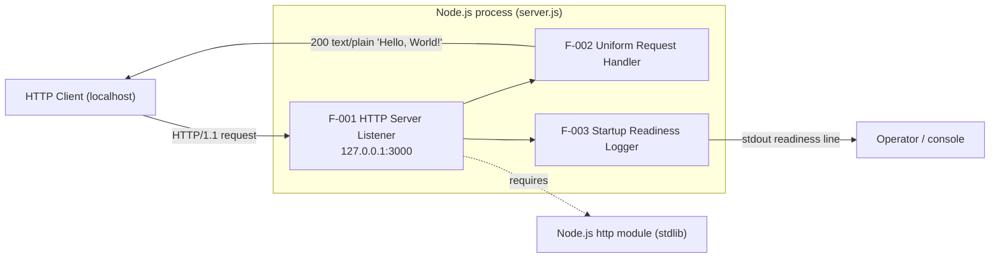
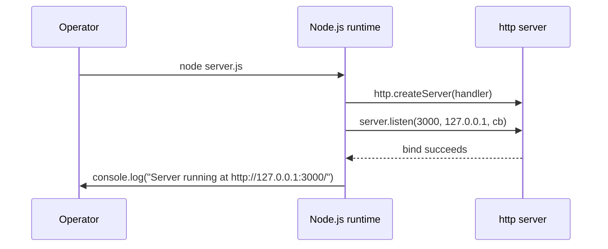
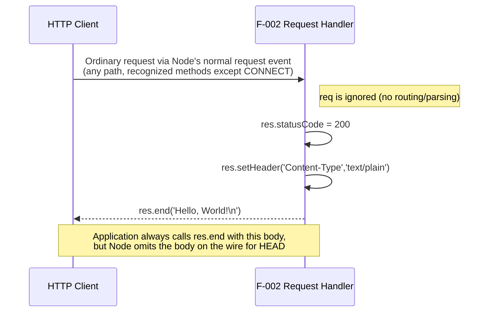

# Architecture

This document explains the runtime architecture of `hao-backprop-test`, a minimal Node.js HTTP service implemented entirely in `server.js` (`Source: server.js:L1-L14`). It is written for developers and engineers. Statements about the application's behavior cite the exact `server.js` lines they reflect; statements about what the repository does *not* contain are attributed to inspection of the complete repository; and a few runtime details are attributed to Node.js `http`-module semantics or to a scoped runtime observation rather than to a source line.

## Overview

The service exhibits the following architectural properties:

- **Single-process, single-tier.** The entire application is a single Node.js process defined in one file (`Source: server.js:L1-L14`); inspection of the repository shows no additional tiers, worker processes, or supporting modules.
- **Zero-dependency.** The application imports only the Node.js standard-library `http` module (`Source: server.js:L1`); inspection of the repository shows no third-party packages, no `package.json`, and no lockfile.
- **Stateless.** The request handler holds no state between requests and returns a fixed response on every invocation (`Source: server.js:L6-L10`).
- **Event-driven (reactor pattern).** The server is created with a single request-handler callback (`Source: server.js:L6`) and bound to its socket via a one-time `listen` (listening) callback (`Source: server.js:L12`). The Node.js event loop invokes the request-handler callback once per parsed HTTP request, while the listening callback runs exactly once after the socket is successfully bound (`Source: server.js:L12-L14`).

The process exposes exactly two interfaces:

1. An **inbound HTTP listener** bound to host `127.0.0.1` and port `3000` (`Source: server.js:L3-L4`, `Source: server.js:L12`).
2. An **outbound operator signal** written once to standard output after a successful bind (`Source: server.js:L13`).

The service has **no user interface**. Its explicit application outputs are the HTTP response returned to clients — status `200`, header `Content-Type: text/plain`, and the body `Hello, World!` plus a trailing line-feed byte (`Source: server.js:L7-L9`) — and a single stdout readiness line written once at startup (`Source: server.js:L13`). Node's `http` module and the runtime may emit further signals independently of the application code — for example, the generated response headers, or a stack trace written to stderr on a failed bind (see limitation **C-2** in [`./functionality.md`](./functionality.md)).

## Component overview

The diagram below shows the single Node.js process, its lone standard-library dependency, and its two interfaces — an inbound HTTP request from a localhost client and an outbound stdout signal to an operator.

**Legend.** The three components map to the source as follows: **F-001 HTTP Server Listener** binds the socket and accepts connections (`Source: server.js:L12`); **F-002 Uniform Request Handler** produces the fixed HTTP response (`Source: server.js:L6-L10`); **F-003 Startup Readiness Logger** emits the single stdout readiness line (`Source: server.js:L13`); and the `http` standard-library module is the sole dependency the process requires (`Source: server.js:L1`).

## Startup and bind flow (W-1)

Workflow **W-1** is the one-time startup path: the runtime creates the server, binds the listener socket, and — on success — emits the readiness line before the process settles into the event loop.

On a successful bind, the readiness line is emitted from within the `listen` callback (`Source: server.js:L12-L14`). The source attaches no `error` listener to the server or to the `listen` call (complete-source inspection, `Source: server.js:L1-L14`); under Node.js's unhandled-`error` semantics, a failed bind — for example, when port `3000` is already in use — therefore propagates as an uncaught exception that terminates the process. This behavior is an inference from the absent listener plus Node's `error`-event handling, not a value written in the source; it is documented and qualified as limitation **C-2** in [`./functionality.md`](./functionality.md).

## Request and response flow (W-2)

Workflow **W-2** is the per-request path; its defining characteristic is that the handler never inspects the `req` object, so no request routing or parsing occurs.

Because the handler never reads `req` (`Source: server.js:L6-L10`), it runs the same application code for every request delivered to it, regardless of method or path — a single catch-all endpoint with no routing. The observable wire response is not literally identical for every method, however: Node's `http` module suppresses the body for `HEAD`, routes `CONNECT` through a separate event that never reaches this handler, and rejects unrecognized method tokens with `400 Bad Request` before the handler runs — only method tokens Node's HTTP parser recognizes are dispatched to it. See [`./api-reference.md`](./api-reference.md) for the full response contract and these method/protocol exceptions.

## Runtime dependency

The only runtime dependency is the Node.js built-in `http` module, loaded via `require('http')` (`Source: server.js:L1`). Inspection of the repository shows no third-party dependencies, no package manifest, and no lockfile. Because `http` is part of the Node.js core standard library, it is provided by the Node.js runtime itself and requires no installation step.
