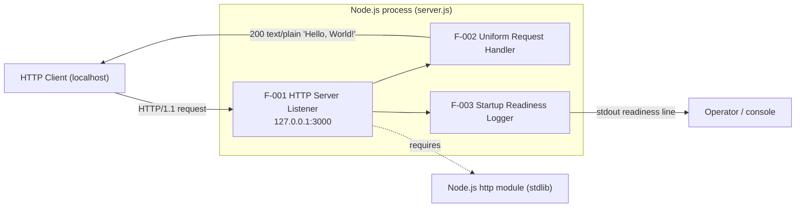
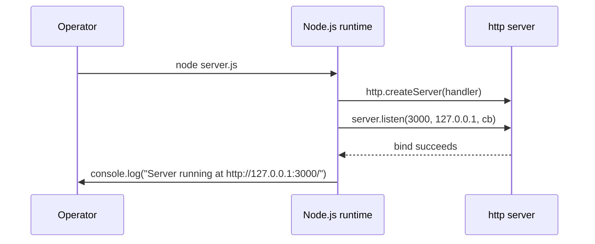
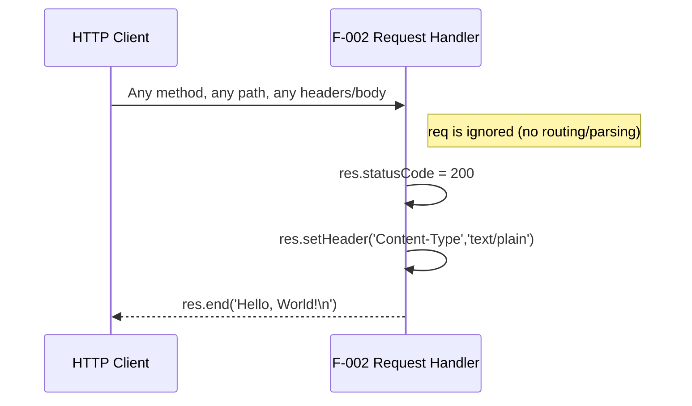

# Architecture

This document explains the runtime architecture of `hao-backprop-test`, a minimal Node.js HTTP service implemented entirely in `server.js` (`Source: server.js:L1-L14`). It is written for developers and engineers and derives exclusively from that source file; every technical statement below cites the exact source lines it reflects.

## Overview

The service exhibits the following architectural properties:

- **Single-process, single-tier.** The entire application is a single Node.js process defined in one file, with no additional tiers, worker processes, or supporting modules (`Source: server.js:L1-L14`).
- **Zero-dependency.** It uses only the Node.js standard-library `http` module; there are no third-party packages and no `package.json` (`Source: server.js:L1`).
- **Stateless.** The request handler holds no state between requests and returns a fixed response on every invocation (`Source: server.js:L6-L10`).
- **Event-driven (reactor pattern).** An HTTP server is created with a single request-handler callback (`Source: server.js:L6`) and is bound to its socket via an asynchronous `listen` callback (`Source: server.js:L12`); inbound connections are dispatched to that callback by the Node.js event loop.

The process exposes exactly two interfaces:

1. An **inbound HTTP listener** bound to host `127.0.0.1` and port `3000` (`Source: server.js:L3-L4`, `Source: server.js:L12`).
2. An **outbound operator signal** written once to standard output after a successful bind (`Source: server.js:L13`).

The service has **no user interface**; its only outputs are the fixed HTTP response body (`Source: server.js:L6-L10`) and the single stdout readiness line (`Source: server.js:L13`).

## Component overview

The diagram below shows the single Node.js process, its lone standard-library dependency, and its two interfaces — an inbound HTTP request from a localhost client and an outbound stdout signal to an operator.

**Legend.** The three components map to the source as follows: **F-001 HTTP Server Listener** binds the socket and accepts connections (`Source: server.js:L12`); **F-002 Uniform Request Handler** produces the fixed HTTP response (`Source: server.js:L6-L10`); **F-003 Startup Readiness Logger** emits the single stdout readiness line (`Source: server.js:L13`); and the `http` standard-library module is the sole dependency the process requires (`Source: server.js:L1`).

## Startup and bind flow (W-1)

Workflow **W-1** is the one-time startup path: the runtime creates the server, binds the listener socket, and — on success — emits the readiness line before the process settles into the event loop.

On a successful bind, the readiness line is emitted from within the `listen` callback (`Source: server.js:L12-L14`). The startup path has no error handling: a failed bind (for example, when port `3000` is already in use) is unhandled and terminates the process — documented as limitation **C-2** in [`./functionality.md`](./functionality.md) (`Source: server.js:L12`).

## Request and response flow (W-2)

Workflow **W-2** is the per-request path; its defining characteristic is that the handler never inspects the `req` object, so no request routing or parsing occurs.

Because the handler never reads `req`, every HTTP method and every path yields the identical response — the service therefore presents a single catch-all endpoint with no routing (`Source: server.js:L6-L10`). See [`./api-reference.md`](./api-reference.md) for the full response contract (status code, headers, and body).

## Runtime dependency

The only runtime dependency is the Node.js built-in `http` module, loaded via `require('http')` (`Source: server.js:L1`). There are no third-party dependencies, no package manifest, and no lockfile in the repository (`Source: server.js:L1`). Because `http` is part of the Node.js standard library, any maintained Node.js LTS release provides it with no installation step.
