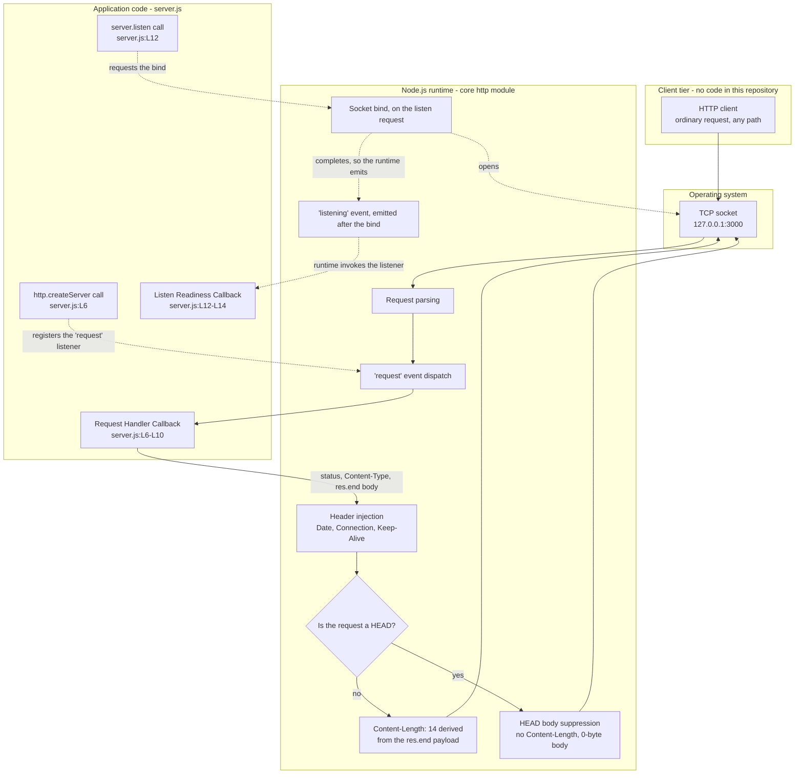
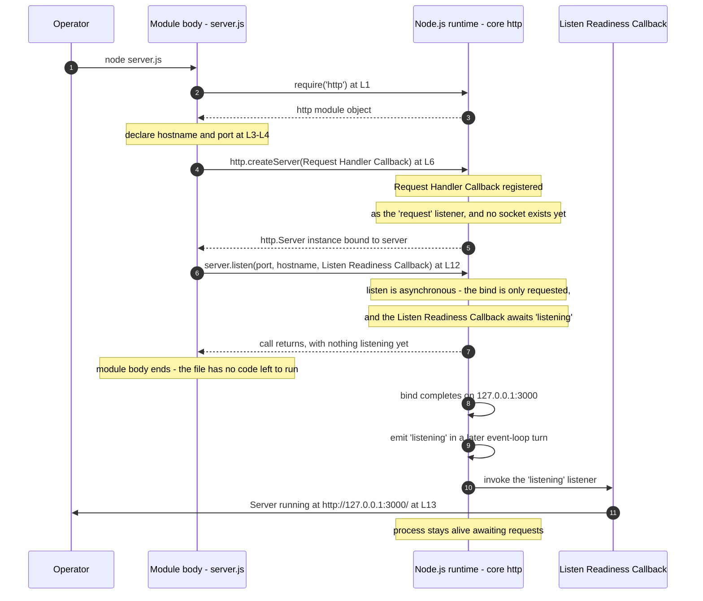

# Architecture Overview

`hao-backprop-test` is a single-process Node.js HTTP service whose entire
runtime behaviour is defined by one CommonJS file. This page documents two
things and deliberately no more: where the application code ends and the
Node.js runtime begins, and the ordered bootstrap sequence that brings the
listener up. It is written for the reviewer who has to judge the design and
the maintainer who has to change it.

Claims on this page are marked with the evidence that supports them, in one
of three forms: a `Source:` locator into `server.js` at baseline commit
`1484182` for what the application code does, an `Observed:` marker for
behaviour measured by running the service, and a `Reference:` marker for
published Node.js project documentation where the runtime's own contract, or
the project's own support status for a release line, is the thing being
stated. The three classes, and the provenance behind `Observed:`, are
defined under [Evidence and provenance](#evidence-and-provenance). A source
locator is never offered on its own as evidence for runtime behaviour,
because it cannot establish any.

The repeating, event-driven path an individual request takes is a separate
concern and lives in [Request lifecycle](./request-lifecycle.md). This page
owns the one-time, ordered startup path only.

## Contents

- [System in one paragraph](#system-in-one-paragraph)
- [Component boundary](#component-boundary)
- [What the runtime provides that the application
  does not](#what-the-runtime-provides-that-the-application-does-not)
- [Bootstrap ordering](#bootstrap-ordering)
- [Design characteristics](#design-characteristics)
- [Deliberate non-goals](#deliberate-non-goals)
- [Feature traceability](#feature-traceability)
- [Source and traceability](#source-and-traceability)

## System in one paragraph

One process runs one file and answers every request that reaches its request
listener with one response. The module loads the Node.js core `http` module,
declares a bind address and a port as constants, and creates a server whose
only `'request'` listener is the **Request Handler Callback**; it then asks
the runtime to bind that server to the IPv4 loopback interface, passing the
**Listen Readiness Callback** as `listen`'s third argument, which the
runtime registers as a listener for the server's `'listening'` event. Those
two are the only listeners the file installs. Once the bind completes the
**Listen Readiness Callback** writes a single line to stdout, and the
process stays alive serving requests until it is stopped.
`Source: server.js:L1-L14`,
`Reference: Node.js v24.x http - http.createServer()`,
`Reference: Node.js v24.x net - server.listen()`

The repository describes itself as a "test project for backprop integration"
(`Source: README.md:L1-L2`). In architectural terms it is the *target
endpoint* that such an integration points at, and the integrating counterpart
is hosted outside this repository: no backpropagation, machine-learning, or
external-system integration code, client, or credential exists here. The
service holds no knowledge of its caller at all, because the request is never
read. `Source: server.js:L6-L10`

## Component boundary

The system has three tiers below the client. The application tier is exactly
the content of `server.js` and nothing else; everything beneath it is either
the Node.js core `http` module or the operating system, and everything above
it is a client for which this repository contains no code.

| Tier                | What it owns                              |
| ------------------- | ----------------------------------------- |
| Client              | Issues a request; no client code is here  |
| Application code    | 11 statements in `server.js:L1-L14`       |
| Node.js core `http` | Bind request, parsing, dispatch, headers  |
| Operating system    | The TCP socket at `127.0.0.1:3000`        |

The two lower tiers are the runtime's work and the operating system's rather
than the file's: the runtime parses each request, dispatches the `'request'`
event and writes the headers it contributes, and the socket itself belongs to
the OS. What each side owns is itemised under [Responsibility
split](#responsibility-split). `Observed: v24.19.0`,
`Reference: Node.js v24.x http - http.createServer()`

### D1 - Component boundary



Read the solid edges as the path of a request and the dashed edges as the
wiring that bootstrap puts in place. D1 models four application behaviour
nodes - the `http.createServer` call, the **Request Handler Callback** it
registers as the server's only `'request'` listener, the `server.listen`
call, and the **Listen Readiness Callback** it passes as `listen`'s third
argument. Those four are what the diagram needs, not an inventory of the
application surface: the `http` import, the `hostname` and `port` constants
and the `server` binding are application code too, and the complete
nine-unit inventory is the
[API reference index](../api-reference/README.md).
`Source: server.js:L6`, `Source: server.js:L12`

Neither dashed edge that ends at a callback is a call this file makes. The
function passed to `http.createServer(...)` becomes the `'request'` listener
because the runtime adds it there
(`Reference: Node.js v24.x http - http.createServer()`), and the third
argument to `server.listen(...)` is reached only when the runtime emits
`'listening'` after the bind completes
(`Reference: Node.js v24.x net - server.listen()`). Nothing in `server.js`
invokes either callback directly, and the bind itself is the runtime's work
against an OS socket rather than something the application performs.
`Source: server.js:L1-L14`

The request path in D1 branches once, and the branch is the runtime's. On an
ordinary non-HEAD request the runtime derives `Content-Length: 14` and
writes the 14-byte body; on a `HEAD` request it suppresses the body and
omits `Content-Length` altogether, leaving a 0-byte body. The **Request
Handler Callback** runs the same three statements either way - it never
reads the method, so it cannot branch on it.
`Source: server.js:L6-L10`,
`Reference: Node.js v24.x http - response.end()`, `Observed: v24.19.0`

The boundary matters because it decides what an integrator may attribute to
this repository. The application sets one response header and writes one
body (`Source: server.js:L7-L9`); every other piece of observable response
metadata in the exchange came from the runtime (`Observed: v24.19.0`).

## What the runtime provides that the application does not

### Response header provenance

| Header                     | Set by                                   |
| -------------------------- | ---------------------------------------- |
| `Content-Type: text/plain` | Application code (`server.js:L8`)        |
| `Date`                     | Node.js runtime - injected               |
| `Connection: keep-alive`   | Node.js runtime - injected               |
| `Keep-Alive: timeout=5`    | Node.js runtime - injected               |
| `Content-Length: 14`       | Node.js runtime - derived from `res.end` |

`Content-Type` is the only header the application sets, and it carries no
`charset` parameter. `Source: server.js:L8`

The four runtime rows are the runtime's own behaviour rather than anything
the file states. `Date` is the automatic header the runtime writes per
response (`Reference: Node.js v24.x http - response.sendDate`), the
`timeout=5` in `Keep-Alive` is the runtime's default keep-alive timeout of
5000 ms (`Reference: Node.js v24.x http - server.keepAliveTimeout`), and
`Content-Length: 14` is derived by the runtime from the `res.end()` payload
rather than declared anywhere in the file (`Source: server.js:L9` for the
payload, `Observed: v24.19.0` for the derived header).

Observed header order in a live response puts the single application-set
header first, followed by the four the runtime contributes: `Content-Type`,
`Date`, `Connection`, `Keep-Alive`, `Content-Length`. `Observed: v24.19.0`

### Responsibility split

| Concern                             | Owner                        |
| ----------------------------------- | ---------------------------- |
| Request line and header parsing     | Node.js runtime              |
| `'request'` event dispatch          | Node.js runtime              |
| Status code                         | Application (`server.js:L7`) |
| `Content-Type` header               | Application (`server.js:L8`) |
| Response body and `res.end()`       | Application (`server.js:L9`) |
| Flush and wire completion           | Node.js runtime              |
| `Content-Length`                    | Node.js runtime - derived    |
| `Date`, `Connection`, `Keep-Alive`  | Node.js runtime - injected   |
| HEAD response body suppression      | Node.js runtime              |
| Socket bind and keep-alive timer    | Node.js runtime              |
| Routing, negotiation, authorization | Nobody - absent by design    |

Every row attributed to the runtime rests on runtime evidence rather than on
a source locator: `Observed: v24.19.0`,
`Reference: Node.js v24.x http - http.createServer()`,
`Reference: Node.js v24.x http - response.end()`,
`Reference: Node.js v24.x http - server.keepAliveTimeout`,
`Reference: Node.js v24.x net - server.listen()`. The application rows are
the three statements the **Request Handler Callback** runs, and the last row
spans the whole file (`Source: server.js:L1-L14`).

The `res.end()` row and the flush row are routinely read as one, and they
are not. `res.end('Hello, World!\n')` supplies the body content and marks the
response ended from the application's side - the state Node.js exposes as
`writableEnded`, which explicitly does not indicate that the data has been
flushed. The runtime then serializes the status line and headers, derives
`Content-Length`, and writes to the socket; completion is the runtime's
`writableFinished` state, reached immediately before `'finish'` and after
the **Request Handler Callback** has already returned.
`Source: server.js:L9`,
`Reference: Node.js v24.x http - response.writableEnded`,
`Reference: Node.js v24.x http - response.writableFinished`

Two runtime services are worth calling out, because both are routinely
mistaken for application behaviour:

- **Request parsing.** The runtime parses the request line and headers and
  hands the **Request Handler Callback** a ready-made `IncomingMessage`; that
  callback is reached because the function passed to `http.createServer(...)`
  is added to the `'request'` event by the runtime. The application parses
  nothing and reads nothing from it - `server.js` contains no parsing code
  of any kind. `Source: server.js:L6-L10`,
  `Reference: Node.js v24.x http - http.createServer()`
- **Automatic HEAD body suppression.** A `HEAD` request is answered with
  status `200` and a zero-byte body because the runtime omits the response
  body when the request is a `HEAD`. The application does not special-case
  the method; it cannot, because it never reads one.
  `Source: server.js:L6-L10`,
  `Reference: Node.js v24.x http - response.end()`, `Observed: v24.19.0`

The method-agnostic behaviour and the one method whose observable result
differs were confirmed against a running instance, one request per method
(`Observed: v24.19.0`):

```text
GET     -> 200 text/plain 14
POST    -> 200 text/plain 14
PUT     -> 200 text/plain 14
PATCH   -> 200 text/plain 14
DELETE  -> 200 text/plain 14
OPTIONS -> 200 text/plain 14
HEAD    -> 200 text/plain 0
```

On `HEAD` the runtime also omits `Content-Length` from the response
altogether, leaving `Content-Type`, `Date`, `Connection` and `Keep-Alive`.
`Observed: v24.19.0`. The wire-level contract is specified in full on the
[HTTP endpoint](../api-reference/http-endpoint.md) page.

Those seven methods are what was exercised on the tested baseline, not an
exhaustive method contract. `CONNECT` is not among them, and it would not
reach the **Request Handler Callback** at all; the bounded set of requests
the runtime answers before that callback is reached is listed next.
`Observed: v24.19.0`

### Requests the runtime answers before the Request Handler Callback

The uniform response applies to requests the runtime emits as `'request'`.
A small, bounded set of requests never gets that far, because the runtime
answers or closes them first, and this file registers no listener that would
change any of them. `Source: server.js:L1-L14`

| Request                            | What the runtime does instead   |
| ---------------------------------- | ------------------------------- |
| `CONNECT`                          | Closes the connection           |
| `Expect` other than `100-continue` | Answers `417` automatically     |
| `requestTimeout` reached           | Answers `408`, then closes      |
| `headersTimeout` reached           | Answers `408`, then closes      |
| Malformed request line or headers  | Closes the socket with `400`    |
| Header block over the size limit   | Closes the socket with `431`    |

`CONNECT` is dispatched through a separate `'connect'` event, and a client
requesting `CONNECT` has its connection closed when nothing listens for it
(`Reference: Node.js v24.x http - Event: 'connect'`). An `Expect` header
whose value is not `100-continue` triggers the automatic `417`, and the
`'request'` event is not emitted when that check is handled
(`Reference: Node.js v24.x http - Event: 'checkExpectation'`). On
`requestTimeout` or `headersTimeout` expiry the server responds `408`
without forwarding the request to the request listener and closes the
connection (`Reference: Node.js v24.x http - server.requestTimeout`,
`Reference: Node.js v24.x http - server.headersTimeout`). A client error in
the parser closes the socket with `400 Bad Request`, or with `431` when the
error is `HPE_HEADER_OVERFLOW`
(`Reference: Node.js v24.x http - Event: 'clientError'`).

This is a scope statement about which requests the documented uniform
response covers, and nothing more: none of these paths was exercised on the
tested baseline, the values above are the runtime's documented defaults, and
this page recommends no change to them.

## Bootstrap ordering

Bootstrap is documented unit **U-9**, the module bootstrap sequence. It is the
literal top-to-bottom execution of the module body: there is no bootstrap
framework, no lifecycle hook, and no configuration load step.
`Source: server.js:L1-L14`

### The module body at the baseline layout

```text
L1  const http = require('http');
L2
L3  const hostname = '127.0.0.1';
L4  const port = 3000;
L5
L6  const server = http.createServer((req, res) => {
L7    res.statusCode = 200;
L8    res.setHeader('Content-Type', 'text/plain');
L9    res.end('Hello, World!\n');
L10 });
L11
L12 server.listen(port, hostname, () => {
L13   console.log(`Server running at http://${hostname}:${port}/`);
L14 });
```

### The ordered sequence

1. `require('http')` loads the Node.js core `http` module and binds it to
   `http`. `Source: server.js:L1`
2. The bind address `'127.0.0.1'` and the port `3000` are declared as
   constants. `Source: server.js:L3-L4`
3. `http.createServer(...)` creates the server, and the runtime adds the
   **Request Handler Callback** passed to it as the listener for the server's
   `'request'` event; the returned `http.Server` is bound to `server`.
   `Source: server.js:L6`,
   `Reference: Node.js v24.x http - http.createServer()`
4. `server.listen(port, hostname, callback)` asks the runtime to bind the
   socket, and the runtime registers the **Listen Readiness Callback** passed
   as that third argument as a listener for the server's
   `'listening'` event. The argument order is port first, then hostname,
   then that callback. The call is asynchronous: it returns straight away,
   and the socket is not listening yet when it does.
   `Source: server.js:L12`,
   `Reference: Node.js v24.x net - server.listen()`
5. The module body ends. The file has no code left to run, and nothing in it
   has yet written anything to stdout. `Source: server.js:L1-L14`
6. The runtime completes the bind and emits `'listening'`, in a later turn of
   the event loop than the one the module body ran in.
   `Reference: Node.js v24.x net - server.listen()`
7. The runtime invokes the **Listen Readiness Callback** as the listener for
   that event, and it writes the single startup line to stdout.
   `Source: server.js:L13`,
   `Reference: Node.js v24.x net - server.listen()`

Three properties of this ordering are easy to misread and worth stating
outright:

- **The module body is synchronous; the bind is not.** Steps 1 to 4 run to
  completion in order as the module body executes, and the body then ends at
  step 5. Steps 6 and 7 happen afterwards, driven by the runtime, as does
  every request thereafter. `Source: server.js:L1-L14`,
  `Reference: Node.js v24.x net - server.listen()`
- **`listen` requests; the runtime binds.** Step 4 produces a listen request
  rather than a listening socket, which is why the readiness line cannot be
  used to time the end of the module body: the line is written after the
  body has already finished. `Source: server.js:L12`,
  `Reference: Node.js v24.x net - server.listen()`
- **`createServer` registers; it does not bind.** After step 3 a server
  object exists with its request listener attached, but no socket is open and
  nothing is listening. The socket appears through step 6 and not before.
  `Source: server.js:L6`, `Source: server.js:L12`

### What each step hands to the next

| Step      | Produces                          | Consumed by     |
| --------- | --------------------------------- | --------------- |
| `L1`      | the `http` module object          | `L6`            |
| `L3-L4`   | `hostname` and `port`             | `L12` and `L13` |
| `L6`      | an `http.Server` instance         | `L12`           |
| `L12`     | a listen request, not a socket    | the runtime     |
| `L12`     | a `'listening'` listener          | the runtime     |
| runtime   | the bound socket                  | client requests |
| runtime   | the `'listening'` event           | `L13`           |
| `L13`     | one line on stdout                | the operator    |

The four rows in the middle are the handoff this ordering makes easiest to
misread. `L12` hands the runtime a request, not a result: the socket and the
`'listening'` event that reaches `L13` are produced by the runtime after the
module body has ended. `Source: server.js:L12`,
`Reference: Node.js v24.x net - server.listen()`

The bindings themselves - their kind, type, literal value, mutability and
every consumption site - are documented on the
[module bindings](../api-reference/module-bindings.md) page. This page covers
only the order in which they come into existence and what each hands on.

### D2 - Bootstrap sequence



## Design characteristics

- **Stateless.** The **Request Handler Callback** reads nothing and writes
  nothing outside the per-request response object handed to it, and it
  carries no application data from one request to the next. No module-scope
  binding is reassigned anywhere in the file, and nothing in the file mutates
  one either. `const` is what prevents the reassignment, and it does no more
  than that: it does not make what a binding points at immutable.
  `hostname` and `port` hold primitive values, so those values cannot
  change; `server` references an `http.Server` whose listening state,
  connections, event registrations and timers are runtime state that changes
  as the process serves requests. None of that is application data, and the
  **Request Handler Callback** reads none of it. `Source: server.js:L1-L14`
- **Synchronous setup.** Module load performs the whole of the module body in
  order, as described above; the bind it requests completes afterwards.
  `Source: server.js:L1-L14`,
  `Reference: Node.js v24.x net - server.listen()`
- **Zero third-party dependencies.** The sole import is the Node.js built-in
  `http` module, bundled with the runtime rather than fetched from a
  registry, so its effective version is simply the version of the installed
  runtime. `Source: server.js:L1`. There is no `package.json` in the
  repository, and therefore no `npm start`: the only launch path is
  `node server.js`.
- **No exports.** Nothing in the file assigns to `module.exports`, so the
  module exposes no importable symbol. The absence is itself part of the
  design: `require('./server')` yields no handle on the server and starts a
  listener as a side effect of loading. `Source: server.js:L1-L14`
- **Single observability output.** The process writes exactly one line to
  stdout, `Server running at http://127.0.0.1:3000/`, and nothing else. There
  is no request log, no metric, and no health endpoint.
  `Source: server.js:L13`. On the tested baseline stdout carried that one
  line and stderr was empty. `Observed: v24.19.0`
- **Loopback-only bind.** The listener is bound to the IPv4 loopback literal
  `127.0.0.1`, which confines reachability to the machine the process runs
  on. `Source: server.js:L3`. A request to one of the host's non-loopback
  addresses does not fail as an HTTP error at all: the connection never
  establishes, which `curl` reports as exit code 7 with status `000`
  (`Observed: v24.19.0`). This is a structural consequence of the bind
  target; the [troubleshooting](../troubleshooting.md) page covers the
  operational symptom.
- **One uniform response.** Every request that reaches the **Request Handler
  Callback** receives the same reply, on any path and by any of the methods
  observed, produced by three unconditional statements with no branching.
  `Source: server.js:L7-L9`. Two qualifications sit beside that, both the
  runtime's: the requests the runtime answers first, listed under [Requests
  the runtime answers before the Request Handler
  Callback](#requests-the-runtime-answers-before-the-request-handler-callback),
  and the `HEAD` body suppression that changes what the client receives
  without changing what the **Request Handler Callback** does.

### The response contract

| Element          | Value                          | Source          |
| ---------------- | ------------------------------ | --------------- |
| Status           | `200`                          | `server.js:L7`  |
| `Content-Type`   | `text/plain`, no `charset`     | `server.js:L8`  |
| Body             | `Hello, World!\n`, 14 bytes    | `server.js:L9`  |
| `Content-Length` | `14`, derived by the runtime   | Node.js runtime |

The body is 14 bytes: 13 printable characters plus one trailing LF. The
first three rows follow from the statements themselves; the
`Content-Length` row is the runtime's derivation rather than a value the
file states (`Observed: v24.19.0`). The same contract is restated on several
pages of this set; each restatement carries these same citations, so every
copy stays verifiable against one source of truth. Plain Markdown has no
include mechanism and no documentation generator is in use here, so
restatement rather than transclusion is expected.

Observed from a running instance (`Observed: v24.19.0`):

```bash
node server.js
```

```text
Server running at http://127.0.0.1:3000/
```

```bash
curl -s -i http://127.0.0.1:3000/
```

```http
HTTP/1.1 200 OK
Content-Type: text/plain
Date: Fri, 11 Sep 2026 11:21:23 GMT
Connection: keep-alive
Keep-Alive: timeout=5
Content-Length: 14

Hello, World!
```

The `Date` value above is generated by the runtime for that particular
response, so it is time-dependent and may differ from one response to the
next. It is not guaranteed to: HTTP-date carries one-second resolution, and
two back-to-back requests on the tested baseline both came back with
`Date: Fri, 11 Sep 2026 15:51:31 GMT`. Everything else in the exchange is
fixed. `Observed: v24.19.0`,
`Reference: Node.js v24.x http - response.sendDate`

### Runtime baseline

The runtime is the only dependency the service has, so the release line it
runs on is the one version fact worth recording. The prerequisite is the
Node.js **24.x** Active LTS line named "Krypton", on its current patch
release; **24.19.0** is the patch every observation in this documentation
set was recorded under, which makes it the observation baseline rather than
the version to pin to. Node.js 22.x is a Maintenance LTS
line: workable, but it receives critical fixes only, so it is acceptable
rather than preferred. Node.js 26.x is a Current line rather than an LTS one.
Node.js 20.x reached end of life on 2026-04-30. Those four classifications
are support status published by the Node.js project rather than behaviour
observed here.
`Reference: Node.js Releases page - Release Working Group schedule`

What the baseline determines and what it does not divides cleanly, and the
division decides how far each statement on this page travels:

- **The source determines these, wherever the file runs.** Status `200`, the
  `Content-Type` value `text/plain` with no `charset`, the body
  `Hello, World!\n`, the bind target `127.0.0.1:3000`, the text of the
  readiness line, and every absence the page records. They follow from the
  statements themselves. `Source: server.js:L1-L14`
- **The runtime determines these, and they were observed on 24.19.0.** The
  injected `Date`, `Connection` and `Keep-Alive` headers, the derivation of
  `Content-Length`, `HEAD` body suppression, the advertised 5-second
  keep-alive timeout, and the timing that lets the module body end before
  the **Listen Readiness Callback** runs. `Observed: v24.19.0`
- **The runtime determines these, and only its documentation covers them.**
  The `417`, `408`, `400` and `431` paths under [Requests the runtime answers
  before the Request Handler
  Callback](#requests-the-runtime-answers-before-the-request-handler-callback),
  which no request exercised here.
  `Reference: Node.js v24.x http - Event: 'checkExpectation'`,
  `Reference: Node.js v24.x http - Event: 'clientError'`,
  `Reference: Node.js v24.x http - server.requestTimeout`

No other release line was exercised here. This page therefore makes no claim
that the runtime-determined behaviour reproduces on Node.js 22.x, 26.x or
any other line; those lines are recommendations about support status, not
statements about verified behaviour.

## Deliberate non-goals

The capabilities below are absent by design. They are permanent
characteristics of a service whose entire purpose is to answer every request
identically, not a list of gaps: several of the behaviours documented across
this set - the uniform response, the loopback confinement, the abrupt
termination on a port collision - are direct consequences of these choices,
and the documentation describes them as the design rather than as work
outstanding.

Taken together they place the service: this is an internal, non-production
engineering fixture. It binds to the IPv4 loopback literal, so nothing off
the host can reach it (`Source: server.js:L3`); it speaks plain HTTP with no
TLS and examines no credential (`Source: server.js:L1-L14`); and it reports
nothing about itself beyond one startup line (`Source: server.js:L13`).
Public or production deployment is an unsupported use case for it. The rows
below are the permanent shape of that fixture, not a checklist for turning
it into something deployable, and this page recommends no change to any of
them.

| Not part of the design      | How the system behaves instead     |
| --------------------------- | ---------------------------------- |
| Routing and path dispatch   | All paths reach the same listener  |
| Method dispatch and `405`   | Every method observed got `200`    |
| `404` for unknown paths     | Unknown paths get the same `200`   |
| Content negotiation         | Always `text/plain`                |
| Request validation          | The request is never read          |
| TLS                         | Plain HTTP on loopback only        |
| Authentication and sessions | No credential is ever examined     |
| Persistence and data model  | The only data is a constant string |
| Metrics and health checks   | One startup line and nothing more  |
| Graceful shutdown           | Stopping the process is immediate  |
| Environment configuration   | Host and port are literals         |
| An importable module API    | No `module.exports` is assigned    |

The behavioural rows - every method observed returning `200`, unknown paths
returning the same `200`, and stopping the process taking effect at once -
are what a running instance did on the tested baseline rather than anything
the file declares. `Observed: v24.19.0`

Several of those rows rest on absences that span the whole file rather than on
any single statement, and are cited accordingly. There is no signal handler
and no `server.close()` call anywhere in the file, so there is no
connection-drain path. There is no read of `process.env`, so the host and port
literals are the only values in play. And nothing assigns to `module.exports`,
so no importable surface exists to describe. `Source: server.js:L1-L14`

One of those absences has a runtime consequence the absence alone cannot
establish. No `'error'` listener is registered on the server, which the file
shows (`Source: server.js:L1-L14`); what follows from it is the runtime's
rule that an `EventEmitter` emitting `'error'` with no listener registered
throws the error, prints a stack trace and exits the process. That is why a
failed bind surfaces as an unhandled event rather than as something the file
reports on its own terms, and it is what a port collision did on the tested
baseline - exit code `1` with the unhandled-`'error'` trace on stderr.
`Reference: Node.js v24.x events - Error events`, `Observed: v24.19.0`

## Feature traceability

| ID      | Feature                       | Priority |
| ------- | ----------------------------- | -------- |
| `F-001` | HTTP Server Listener          | Critical |
| `F-002` | Uniform HTTP Response Handler | Critical |
| `F-003` | Startup Readiness Logging     | Medium   |

- **F-001** is implemented by the bootstrap path as a whole:
  `server.js:L1`, `server.js:L3-L4`, `server.js:L6` and `server.js:L12`.
- **F-002** is implemented by the **Request Handler Callback**,
  `server.js:L6-L10`, and documented in detail on its
  [own reference page](../api-reference/functions/request-handler-callback.md).
- **F-003** is implemented by the **Listen Readiness Callback**,
  `server.js:L12-L14`, and documented in detail on its
  [own reference page](../api-reference/functions/listen-readiness-callback.md).

These identifiers come from the upstream technical specification and appear in
no repository file of their own, so citing them here is what makes the
documentation and the specification mutually verifiable.

## Source and traceability

- **Baseline.** This page is anchored to commit `1484182`, the state of the
  repository at which every locator was read and every behaviour observed.
- **Citation form.** Source claims cite line ranges, as in
  `Source: server.js:L6-L10`, never a total line count. Claims about
  absences that span the whole file cite `Source: server.js:L1-L14`. Claims
  about what the runtime does carry an observation marker, a reference
  marker, or both, because a source locator cannot establish them.
- **Line numbers.** Locators refer to the baseline layout reproduced under
  [Bootstrap ordering](#bootstrap-ordering). JSDoc documentation comments
  added to `server.js` shift its physical line numbers; the whole
  documentation set stays anchored to the baseline layout so that citations
  agree with one another across pages.

### Evidence and provenance

Three classes of evidence appear on this page. Each has its own marker, and
no claim rests on a class that cannot establish it.

| Marker                                 | Class and what it can show    |
| -------------------------------------- | ----------------------------- |
| `Source: server.js:L7-L9`              | Source - the application code |
| `Observed: v24.19.0`                   | Runtime observation           |
| `Reference: Node.js ...`               | Official reference            |

- **Source.** A line range in `server.js` at baseline commit `1484182`. It
  establishes what the application code does and what is absent from it, and
  nothing at all about runtime behaviour.
- **Runtime observation.** Behaviour measured by running the service and
  inspecting the result. Provenance for every `Observed:` marker on this
  page: Node.js v24.19.0, Windows NT 10.0.26100.0, 2026-09-11, loopback
  `127.0.0.1:3000`. One release, one platform, one date - which is exactly
  the limit recorded under [Runtime baseline](#runtime-baseline).
- **Official reference.** Documentation published by the Node.js project:
  the v24.x API documentation for the named module and section, as in
  `Reference: Node.js v24.x net - server.listen()`, or the project's own
  releases page for release-line support status, as in
  `Reference: Node.js Releases page - Release Working Group schedule`.
  References are given as module or page plus section name rather than as a
  URL, because every link in this documentation set is repository-relative.

A statement about the runtime therefore carries an observation marker, a
reference marker, or both. Where a `Source:` locator appears beside one, it
shows which application statement provoked the runtime behaviour, not that
the source establishes it.

### Diagram ledger

This page carries diagrams D1 and D2. Each diagram in this documentation set
appears on exactly one page, so nothing is duplicated: D3 and D4 belong to
[Request lifecycle](./request-lifecycle.md), D5 and D6 to the two function
reference pages, D7 to the [documentation hub](../README.md), and D8 to
[troubleshooting](../troubleshooting.md).

Three diagram types are absent by decision rather than oversight. There is no
class diagram, because no class exists anywhere in `server.js:L1-L14`. There
is no entity-relationship diagram, because no data model, schema, or
persistence exists - the only data is the constant response string
(`Source: server.js:L9`). There is no deployment diagram, because the
repository contains no deployment, container, or orchestration
configuration.

### Where to read next

- [Request lifecycle](./request-lifecycle.md) - the repeating, event-driven
  path of a single request, which this page deliberately leaves to it.
- [HTTP endpoint](../api-reference/http-endpoint.md) - the wire-level
  response contract in full.
- [Module bindings](../api-reference/module-bindings.md) - `http`,
  `hostname`, `port` and `server` in detail.
- [Request Handler Callback][fn-request-handler] - the callback that produces
  the uniform response, statement by statement.
- [Listen Readiness Callback][fn-listen-readiness] - the callback that emits
  the startup line, and the case in which it never runs.
- [Configuration](../configuration.md) - the two hardcoded values and what
  changes when they change.
- [Troubleshooting](../troubleshooting.md) - the verified failure modes and
  their causes.
- [Documentation hub](../README.md) - the index for this set.

[fn-request-handler]: ../api-reference/functions/request-handler-callback.md
[fn-listen-readiness]: ../api-reference/functions/listen-readiness-callback.md
