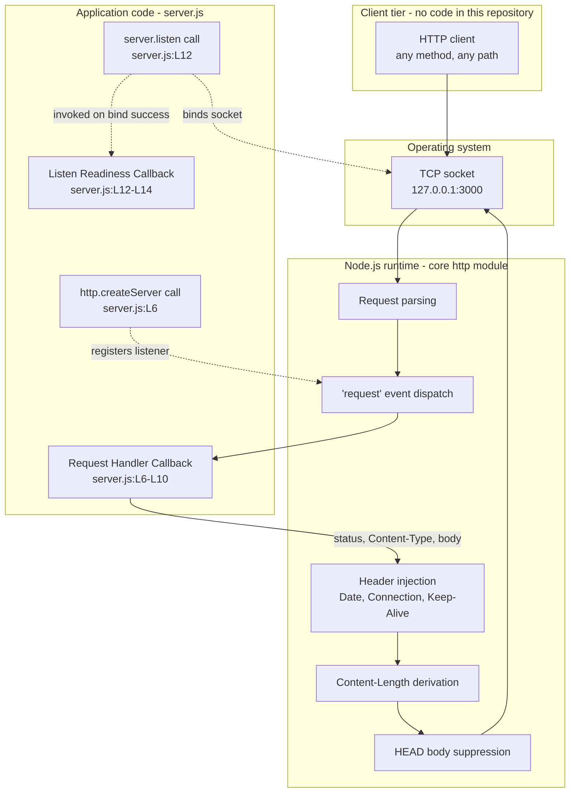
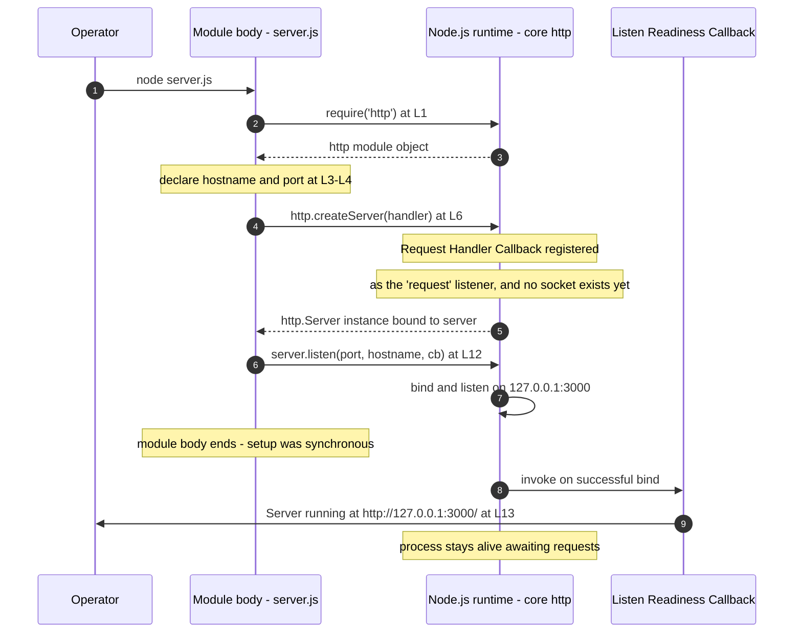

# Architecture Overview

`hao-backprop-test` is a single-process Node.js HTTP service whose entire
runtime behaviour is defined by one CommonJS file. This page documents two
things and deliberately no more: where the application code ends and the
Node.js runtime begins, and the ordered bootstrap sequence that brings the
listener up. It is written for the reviewer who has to judge the design and
the maintainer who has to change it.

Every claim carries an inline citation of the form
`Source: server.js:L6-L10`, anchored to baseline commit `1484182`, so any
statement on this page can be confirmed or refuted against the source in
seconds.

The repeating, event-driven path an individual request takes is a separate
concern and lives in [Request lifecycle](./request-lifecycle.md). This page
owns the one-time, ordered startup path only.

## Contents

- [System in one paragraph](#system-in-one-paragraph)
- [Component boundary](#component-boundary)
- [What the runtime provides that the application
  does not](#what-the-runtime-provides-that-the-application-does-not)
- [Bootstrap ordering](#bootstrap-ordering)
- [Design characteristics](#design-characteristics)
- [Deliberate non-goals](#deliberate-non-goals)
- [Feature traceability](#feature-traceability)
- [Source and traceability](#source-and-traceability)

## System in one paragraph

One process runs one file and answers every request with one response. The
module loads the Node.js core `http` module, declares a bind address and a
port as constants, creates a server whose only listener is the **Request
Handler Callback**, and binds that server to the IPv4 loopback interface;
the **Listen Readiness Callback** then writes a single line to stdout and the
process stays alive serving requests until it is stopped.
`Source: server.js:L1-L14`

The repository describes itself as a "test project for backprop integration"
(`Source: README.md:L1-L2`). In architectural terms it is the *target
endpoint* that such an integration points at, and the integrating counterpart
is hosted outside this repository: no backpropagation, machine-learning, or
external-system integration code, client, or credential exists here. The
service holds no knowledge of its caller at all, because the request is never
read. `Source: server.js:L6-L10`

## Component boundary

The system has three tiers below the client. The application tier is exactly
the content of `server.js` and nothing else; everything beneath it is either
the Node.js core `http` module or the operating system, and everything above
it is a client for which this repository contains no code.

| Tier                | What it owns                              |
| ------------------- | ----------------------------------------- |
| Client              | Issues a request; no client code is here  |
| Application code    | 11 statements in `server.js:L1-L14`       |
| Node.js core `http` | Parsing, dispatch, header injection       |
| Operating system    | The TCP socket at `127.0.0.1:3000`        |

### D1 - Component boundary



Read the solid edges as the path of a request and the dashed edges as the
wiring that bootstrap puts in place. The application tier contributes four
elements and no more: the `http.createServer` call, the **Request Handler
Callback** it registers, the `server.listen` call, and the **Listen Readiness
Callback** it passes.
`Source: server.js:L6`, `Source: server.js:L12`

The boundary matters because it decides what an integrator may attribute to
this repository. The application sets one response header and writes one
body; all remaining observable response metadata is produced by the runtime.
`Source: server.js:L7-L9`

## What the runtime provides that the application does not

### Response header provenance

| Header                     | Set by                                   |
| -------------------------- | ---------------------------------------- |
| `Content-Type: text/plain` | Application code (`server.js:L8`)        |
| `Date`                     | Node.js runtime - injected               |
| `Connection: keep-alive`   | Node.js runtime - injected               |
| `Keep-Alive: timeout=5`    | Node.js runtime - injected               |
| `Content-Length: 14`       | Node.js runtime - derived from `res.end` |

`Content-Type` is the only header the application sets, and it carries no
`charset` parameter. `Source: server.js:L8`

`Content-Length: 14` is derived by the runtime from the `res.end()` payload
rather than declared anywhere in the file. `Source: server.js:L9`

Observed header order in a live response puts the single application-set
header first, followed by the four the runtime contributes: `Content-Type`,
`Date`, `Connection`, `Keep-Alive`, `Content-Length`.

### Responsibility split

| Concern                             | Owner                        |
| ----------------------------------- | ---------------------------- |
| Request line and header parsing     | Node.js runtime              |
| `'request'` event dispatch          | Node.js runtime              |
| Status code                         | Application (`server.js:L7`) |
| `Content-Type` header               | Application (`server.js:L8`) |
| Response body and completion        | Application (`server.js:L9`) |
| `Content-Length`                    | Node.js runtime - derived    |
| `Date`, `Connection`, `Keep-Alive`  | Node.js runtime - injected   |
| HEAD response body suppression      | Node.js runtime              |
| Socket bind and keep-alive timer    | Node.js runtime              |
| Routing, negotiation, authorization | Nobody - absent by design    |

Two runtime services are worth calling out, because both are routinely
mistaken for application behaviour:

- **Request parsing.** The runtime parses the request line and headers and
  hands the **Request Handler Callback** a ready-made `IncomingMessage`. The
  application parses nothing and reads nothing from it.
  `Source: server.js:L6-L10`
- **Automatic HEAD body suppression.** A `HEAD` request is answered with
  status `200` and a zero-byte body because the runtime suppresses response
  bodies for `HEAD`. The application does not special-case the method; it
  cannot, because it never reads one. `Source: server.js:L6-L10`

The method-agnostic behaviour and the one method whose observable result
differs were confirmed against a running instance:

```text
GET     -> 200 text/plain 14
POST    -> 200 text/plain 14
PUT     -> 200 text/plain 14
PATCH   -> 200 text/plain 14
DELETE  -> 200 text/plain 14
OPTIONS -> 200 text/plain 14
HEAD    -> 200 text/plain 0
```

On `HEAD` the runtime also omits `Content-Length` from the response
altogether, leaving `Content-Type`, `Date`, `Connection` and `Keep-Alive`.
The wire-level contract is specified in full on the
[HTTP endpoint](../api-reference/http-endpoint.md) page.

## Bootstrap ordering

Bootstrap is documented unit **U-9**, the module bootstrap sequence. It is the
literal top-to-bottom execution of the module body: there is no bootstrap
framework, no lifecycle hook, and no configuration load step.
`Source: server.js:L1-L14`

### The module body at the baseline layout

```text
L1  const http = require('http');
L2
L3  const hostname = '127.0.0.1';
L4  const port = 3000;
L5
L6  const server = http.createServer((req, res) => {
L7    res.statusCode = 200;
L8    res.setHeader('Content-Type', 'text/plain');
L9    res.end('Hello, World!\n');
L10 });
L11
L12 server.listen(port, hostname, () => {
L13   console.log(`Server running at http://${hostname}:${port}/`);
L14 });
```

### The ordered sequence

1. `require('http')` loads the Node.js core `http` module and binds it to
   `http`. `Source: server.js:L1`
2. The bind address `'127.0.0.1'` and the port `3000` are declared as
   constants. `Source: server.js:L3-L4`
3. `http.createServer(...)` creates the server, registering the **Request
   Handler Callback** as the listener for the server's `'request'` event, and
   binds the returned `http.Server` to `server`. `Source: server.js:L6`
4. `server.listen(port, hostname, callback)` binds the socket. The argument
   order is port first, then hostname, then the callback.
   `Source: server.js:L12`
5. Once the bind succeeds the **Listen Readiness Callback** writes the single
   startup line to stdout. `Source: server.js:L13`

Two properties of this ordering are easy to misread and worth stating
outright:

- **Setup is synchronous.** Steps 1 to 4 run to completion in order as the
  module body executes, and the module body then ends. Only the bind
  completion that triggers step 5, and every request thereafter, are
  asynchronous. `Source: server.js:L1-L14`
- **`createServer` registers; it does not bind.** After step 3 a server
  object exists with its request listener attached, but no socket is open and
  nothing is listening. The socket appears at step 4 and not before.
  `Source: server.js:L6`, `Source: server.js:L12`

### What each step hands to the next

| Step    | Produces                  | Consumed by      |
| ------- | ------------------------- | ---------------- |
| `L1`    | the `http` module object  | `L6`             |
| `L3-L4` | `hostname` and `port`     | `L12` and `L13`  |
| `L6`    | an `http.Server` instance | `L12`            |
| `L12`   | a bound listening socket  | the runtime      |
| `L13`   | one line on stdout        | the operator     |

The bindings themselves - their kind, type, literal value, mutability and
every consumption site - are documented on the
[module bindings](../api-reference/module-bindings.md) page. This page covers
only the order in which they come into existence and what each hands on.

### D2 - Bootstrap sequence



## Design characteristics

- **Stateless.** The **Request Handler Callback** reads nothing and writes
  nothing outside the per-request response object handed to it, and no
  module-scope mutable state exists: every module-scope binding is a `const`.
  Nothing carries from one request to the next.
  `Source: server.js:L1-L14`
- **Synchronous setup.** Module load performs the whole of bootstrap in
  order, as described above. `Source: server.js:L1-L14`
- **Zero third-party dependencies.** The sole import is the Node.js built-in
  `http` module, bundled with the runtime rather than fetched from a
  registry, so its effective version is simply the version of the installed
  runtime. `Source: server.js:L1`. There is no `package.json` in the
  repository, and therefore no `npm start`: the only launch path is
  `node server.js`.
- **No exports.** Nothing in the file assigns to `module.exports`, so the
  module exposes no importable symbol. The absence is itself part of the
  design: `require('./server')` yields no handle on the server and starts a
  listener as a side effect of loading. `Source: server.js:L1-L14`
- **Single observability output.** The process writes exactly one line to
  stdout, `Server running at http://127.0.0.1:3000/`, and nothing else. There
  is no request log, no metric, and no health endpoint.
  `Source: server.js:L13`
- **Loopback-only bind.** The listener is bound to the IPv4 loopback literal
  `127.0.0.1`, which confines reachability to the machine the process runs
  on. `Source: server.js:L3`. A request to one of the host's non-loopback
  addresses does not fail as an HTTP error at all: the connection never
  establishes, which `curl` reports as exit code 7 with status `000`. This is
  a structural consequence of the bind target; the
  [troubleshooting](../troubleshooting.md) page covers the operational
  symptom.
- **One uniform response.** Every request on every path and every method
  receives the same reply, produced by three unconditional statements with no
  branching. `Source: server.js:L7-L9`

### The response contract

| Element          | Value                          | Source          |
| ---------------- | ------------------------------ | --------------- |
| Status           | `200`                          | `server.js:L7`  |
| `Content-Type`   | `text/plain`, no `charset`     | `server.js:L8`  |
| Body             | `Hello, World!\n`, 14 bytes    | `server.js:L9`  |
| `Content-Length` | `14`, derived by the runtime   | Node.js runtime |

The body is 14 bytes: 13 printable characters plus one trailing LF. The same
contract is restated on several pages of this set; each restatement carries
these same citations, so every copy stays verifiable against one source of
truth. Plain Markdown has no include mechanism and no documentation generator
is in use here, so restatement rather than transclusion is expected.

Observed from a running instance:

```bash
node server.js
```

```text
Server running at http://127.0.0.1:3000/
```

```bash
curl -s -i http://127.0.0.1:3000/
```

```http
HTTP/1.1 200 OK
Content-Type: text/plain
Date: Fri, 11 Sep 2026 11:21:23 GMT
Connection: keep-alive
Keep-Alive: timeout=5
Content-Length: 14

Hello, World!
```

The `Date` value above is the timestamp of that particular response and is
the one line of the exchange that differs every time.

### Runtime baseline

The runtime is the only dependency the service has, so the release line it
runs on is the one version fact worth recording. Node.js **24.19.0**, the
Active LTS line named "Krypton", is the recommended prerequisite and the
baseline this documentation set describes. Node.js 22.x is a Maintenance LTS
line: workable, but it receives critical fixes only, so it is acceptable
rather than preferred. Node.js 26.x is a Current line rather than an LTS one.
Node.js 20.x reached end of life on 2026-04-30. The behaviour documented
here is a property of the source rather than of any one release, and
reproduces across supported lines.

## Deliberate non-goals

The capabilities below are absent by design. They are permanent
characteristics of a service whose entire purpose is to answer every request
identically, not a list of gaps: several of the behaviours documented across
this set - the uniform response, the loopback confinement, the abrupt
termination on a port collision - are direct consequences of these choices,
and the documentation describes them as the design rather than as work
outstanding.

| Not part of the design      | How the system behaves instead     |
| --------------------------- | ---------------------------------- |
| Routing and path dispatch   | Every path reaches one callback    |
| Method dispatch and `405`   | Every method gets the same `200`   |
| `404` for unknown paths     | Unknown paths get the same `200`   |
| Content negotiation         | Always `text/plain`                |
| Request validation          | The request is never read          |
| TLS                         | Plain HTTP on loopback only        |
| Authentication and sessions | No credential is ever examined     |
| Persistence and data model  | The only data is a constant string |
| Metrics and health checks   | One startup line and nothing more  |
| Graceful shutdown           | Stopping the process is immediate  |
| Environment configuration   | Host and port are literals         |
| An importable module API    | No `module.exports` is assigned    |

Several of those rows rest on absences that span the whole file rather than on
any single statement, and are cited accordingly. There is no signal handler
and no `server.close()` call anywhere in the file, so there is no
connection-drain path. There is no `'error'` listener registered on the
server, which is why a failed bind surfaces as an unhandled event rather than
as something the file reports on its own terms. There is no read of
`process.env`, so the host and port literals are the only values in play. And
nothing assigns to `module.exports`, so no importable surface exists to
describe. `Source: server.js:L1-L14`

## Feature traceability

| ID      | Feature                       | Priority |
| ------- | ----------------------------- | -------- |
| `F-001` | HTTP Server Listener          | Critical |
| `F-002` | Uniform HTTP Response Handler | Critical |
| `F-003` | Startup Readiness Logging     | Medium   |

- **F-001** is implemented by the bootstrap path as a whole:
  `server.js:L1`, `server.js:L3-L4`, `server.js:L6` and `server.js:L12`.
- **F-002** is implemented by the **Request Handler Callback**,
  `server.js:L6-L10`, and documented in detail on its
  [own reference page](../api-reference/functions/request-handler-callback.md).
- **F-003** is implemented by the **Listen Readiness Callback**,
  `server.js:L12-L14`, and documented in detail on its
  [own reference page](../api-reference/functions/listen-readiness-callback.md).

These identifiers come from the upstream technical specification and appear in
no repository file of their own, so citing them here is what makes the
documentation and the specification mutually verifiable.

## Source and traceability

- **Baseline.** This page is anchored to commit `1484182`, the state of the
  repository at which every locator was read and every behaviour observed.
- **Citation form.** Claims cite line ranges, as in
  `Source: server.js:L6-L10`, never a total line count. Claims about
  absences that span the whole file cite `Source: server.js:L1-L14`.
- **Line numbers.** Locators refer to the baseline layout reproduced under
  [Bootstrap ordering](#bootstrap-ordering). JSDoc documentation comments
  added to `server.js` shift its physical line numbers; the whole
  documentation set stays anchored to the baseline layout so that citations
  agree with one another across pages.

### Diagram ledger

This page carries diagrams D1 and D2. Each diagram in this documentation set
appears on exactly one page, so nothing is duplicated: D3 and D4 belong to
[Request lifecycle](./request-lifecycle.md), D5 and D6 to the two function
reference pages, D7 to the [documentation hub](../README.md), and D8 to
[troubleshooting](../troubleshooting.md).

Three diagram types are absent by decision rather than oversight. There is no
class diagram, because no class exists anywhere in `server.js:L1-L14`. There
is no entity-relationship diagram, because no data model, schema, or
persistence exists - the only data is the constant response string
(`Source: server.js:L9`). There is no deployment diagram, because the
repository contains no deployment, container, or orchestration
configuration.

### Where to read next

- [Request lifecycle](./request-lifecycle.md) - the repeating, event-driven
  path of a single request, which this page deliberately leaves to it.
- [HTTP endpoint](../api-reference/http-endpoint.md) - the wire-level
  response contract in full.
- [Module bindings](../api-reference/module-bindings.md) - `http`,
  `hostname`, `port` and `server` in detail.
- [Request Handler Callback][fn-request-handler] - the callback that produces
  every response, statement by statement.
- [Listen Readiness Callback][fn-listen-readiness] - the callback that emits
  the startup line, and the case in which it never runs.
- [Configuration](../configuration.md) - the two hardcoded values and what
  changes when they change.
- [Troubleshooting](../troubleshooting.md) - the verified failure modes and
  their causes.
- [Documentation hub](../README.md) - the index for this set.

[fn-request-handler]: ../api-reference/functions/request-handler-callback.md
[fn-listen-readiness]: ../api-reference/functions/listen-readiness-callback.md
