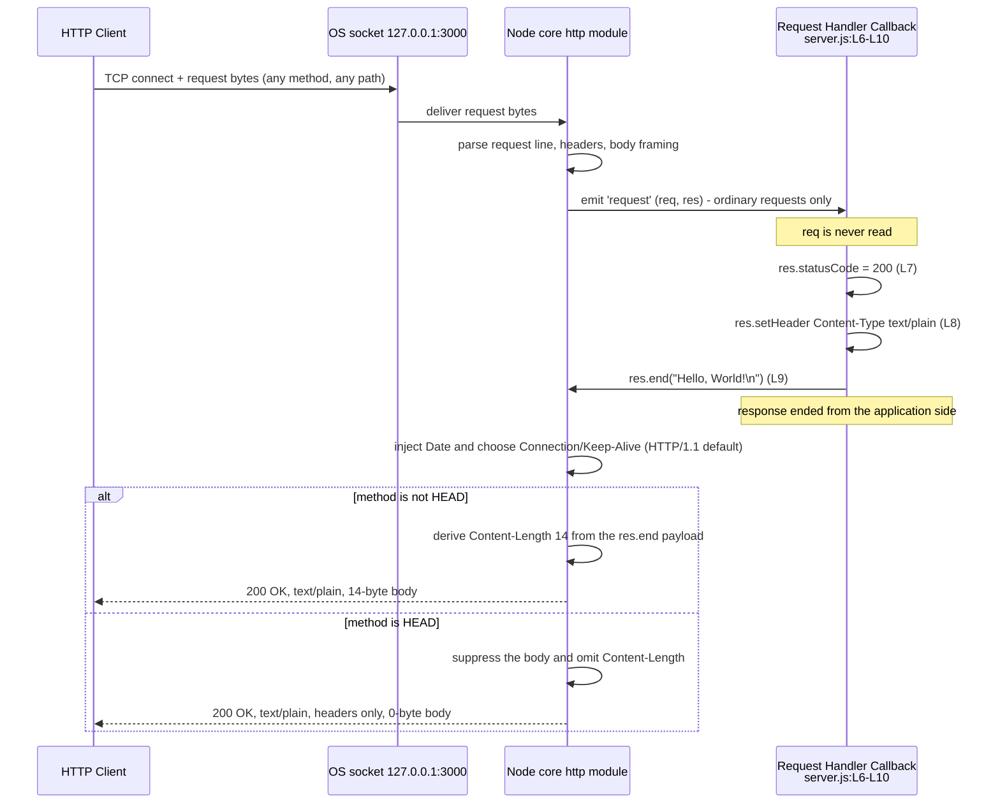
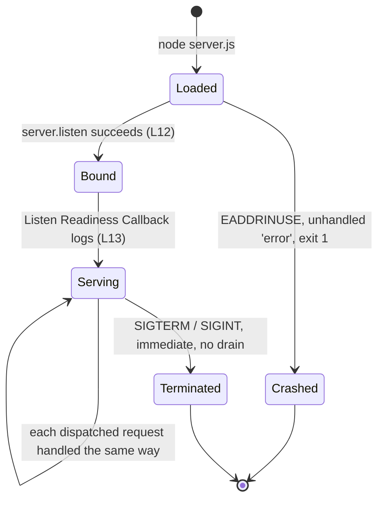

# Request Lifecycle

This page documents the repeating, event-driven path that a single request
takes through `hao-backprop-test`, and the state model of the process that
serves it. Its sibling [Architecture overview](./overview.md) owns the
one-time, ordered bootstrap path, the component boundary, and the
response-header provenance analysis that this page builds on. The split is
deliberate: startup happens once, a request happens every time, and the two
are read by different people for different reasons.

Claims on this page are marked with the evidence that supports them, in one
of three forms: a `Source:` locator into `server.js` at baseline commit
`1484182` for what the application code does, an `Observed:` marker for
behavior measured by running the service, and a `Reference:` marker for
published Node.js project documentation where the runtime's own contract, or
the project's own support status for a release line, is the thing being
stated. The three classes, and the provenance behind `Observed:`, are
defined under [Evidence and provenance](#evidence-and-provenance). Most of
this page is about what the runtime does, so most of it carries the second
and third markers: a source locator cannot establish runtime behavior and is
never offered here as though it could.

[Process states and transitions](#process-states-and-transitions) is written
to stand on its own. [Troubleshooting](../troubleshooting.md) links directly
into it, so a reader who arrives here mid-incident can start at that section
and get what they need without reading the rest of the page first.

## Contents

- [Lifecycle overview](#lifecycle-overview)
- [Request path, step by step](#request-path-step-by-step)
- [Process states and transitions](#process-states-and-transitions)
- [Event loop and why the process stays
  alive](#event-loop-and-why-the-process-stays-alive)
- [Keep-alive behavior](#keep-alive-behavior)
- [Concurrency characteristics](#concurrency-characteristics)
- [Source and traceability](#source-and-traceability)

## Lifecycle overview

The process runs exactly two paths, and telling them apart is the first step
to reading this service correctly.

| Path      | Runs                           | Documented on             |
| --------- | ------------------------------ | ------------------------- |
| Bootstrap | Once, as the module body loads | [Overview](./overview.md) |
| Request   | Once per inbound request       | this page                 |

The request path repeats for as long as the process lives, which is why the
two are documented apart.

Bootstrap ends when the module body finishes executing, and from that moment
the process has no code of its own left to run: it waits, and the runtime
calls into it. Two callbacks are the whole of the application-side surface of
that waiting, and nothing in the file ever calls either one directly.

- The **Listen Readiness Callback** is invoked once, by the runtime, when it
  emits `'listening'` after the socket bind succeeds.
  `Source: server.js:L12-L14`,
  `Reference: Node.js v24.x net - server.listen()`
- The **Request Handler Callback** is invoked once per request that reaches
  it, for as long as the process lives, because the runtime adds the function
  passed to `http.createServer(...)` to the server's `'request'` event.
  `Source: server.js:L6-L10`,
  `Reference: Node.js v24.x http - http.createServer()`

Nothing carries from one pass of the request path to the next. Every
module-scope binding is a `const` that is never reassigned, the **Request
Handler Callback** reads none of them, and it writes nothing outside the
response object handed to it for that one request.
`Source: server.js:L1-L14`

The reply the path produces is fixed at the application level:

| Element          | Value                       | Source         |
| ---------------- | --------------------------- | -------------- |
| Status           | `200`                       | `server.js:L7` |
| `Content-Type`   | `text/plain`, no `charset`  | `server.js:L8` |
| Payload          | `Hello, World!\n`, 14 bytes | `server.js:L9` |

Those three are what the callback does on every invocation, with no branch
that could vary them. What reaches the wire is not identical every time.
The 14 bytes are delivered on every ordinary request other than a `HEAD`
request, for which the runtime suppresses the body; and the headers the
runtime adds around `Content-Type` vary with the protocol version and the
state of the connection, as [Keep-alive
behavior](#keep-alive-behavior) records.

Those three values come from the statements themselves and never vary. What
the client receives varies in exactly one observable way, and the variation
is the runtime's: on a `HEAD` request the runtime withholds the body and
omits `Content-Length`, as the method table below records.
`Observed: v24.19.0`, `Reference: Node.js v24.x http - response.end()`

That contract is restated on several pages of this set, each time with these
same citations, so every copy stays verifiable against one source of truth.
Plain Markdown has no include mechanism and no documentation generator is in
use here, so restatement rather than transclusion is expected. The wire-level
specification in full, including the cases where no response exists at all,
is on the [HTTP endpoint](../api-reference/http-endpoint.md) page.

In feature terms, the request path is `F-002` Uniform HTTP Response Handler,
implemented by the **Request Handler Callback** (`Source: server.js:L6-L10`),
and the readiness signal in the state model below is `F-003` Startup
Readiness Logging, implemented by the **Listen Readiness Callback**
(`Source: server.js:L12-L14`). The full traceability table belongs to
[Overview](./overview.md).

## Request path, step by step

Each numbered step below is one observable stage between a client socket and
a response body, and each belongs to a named actor. Step 1 is the client's
work. Step 2 is the operating system's. Steps 3, 4 and 8 are the Node.js
runtime's - step 4 being the dispatch that hands control across the boundary
into this repository's code. Steps 5 to 7, the body of the **Request Handler
Callback**, are the entire contribution of this repository. Each step below
carries the evidence for its own actor.

This is the path of an ordinary request - one the runtime parses and emits as
a `'request'` event. The bounded set of requests that reach the socket but
are answered by the runtime before that event is listed under [Requests that
never reach the Request Handler
Callback](#requests-that-never-reach-the-request-handler-callback).
`Reference: Node.js v24.x http - http.createServer()`

1. A client opens a TCP connection to `127.0.0.1:3000` and sends the bytes of
   a request. Nothing in this repository constrains the method or the path it
   uses, and nothing in this repository reads either one
   (`Source: server.js:L6-L10`). The bind target comes from the two
   constants declared at module load. `Source: server.js:L3-L4`
2. The operating-system TCP stack accepts the connection and delivers the
   received bytes to the Node.js runtime. Nothing is parsed at this point:
   what crosses this boundary is bytes. Every exchange observed on the tested
   baseline crossed it. `Observed: v24.19.0`
3. The Node.js core `http` module parses those bytes - the request line, the
   headers and the body framing - and then emits the server's `'request'`
   event. The application parses nothing, because `server.js` contains no
   parsing code at all. `Source: server.js:L6-L10`,
   `Reference: Node.js v24.x http - http.createServer()`,
   `Observed: v24.19.0`
4. The runtime dispatches that event to the **Request Handler Callback**,
   which it registered as the `'request'` listener when the
   `http.createServer(...)` call passed the function to it. This step is the
   runtime's work, not the application's: it is the handoff at which control
   crosses into this repository's code. The callback is invoked with two
   arguments - `req`, an `http.IncomingMessage`, and `res`, an
   `http.ServerResponse` - and steps 5 to 7 are what its body then does.
   `Source: server.js:L6`,
   `Reference: Node.js v24.x http - http.createServer()`,
   `Observed: v24.19.0`
5. `req` is never read. Nothing in the file touches `req.url`, `req.method`,
   `req.headers`, or the request body: a search of the baseline source
   returns no occurrence of any of them. There is therefore no routing, no
   branching, no validation, no authentication and no content negotiation
   at this step, or at any other. `Source: server.js:L6-L10`. An unread
   body is not left on the wire as a result — draining it is the runtime's
   work, at step 8.
6. Three unconditional statements run, in order, with no branch of any kind
   between them: `res.statusCode = 200` (`Source: server.js:L7`),
   `res.setHeader('Content-Type', 'text/plain')` (`Source: server.js:L8`),
   and `res.end('Hello, World!\n')` (`Source: server.js:L9`).
7. The **Request Handler Callback** returns. It contains no `return`
   statement, so it returns `undefined`, and the emitter that invoked it
   discards the result. Its
   final application call, `res.end(...)`, was made synchronously at step 6,
   so the application has nothing left to do and schedules nothing further:
   there is no callback passed to `end()`, no `'finish'`, `'close'` or error
   listener on `res`, and no timer or promise anywhere in the file.
   What that call establishes is that the response is *ended from the
   application's side* - the state Node.js exposes as `writableEnded`, which
   explicitly does not indicate that the data has been flushed.
   `Source: server.js:L6-L10`,
   `Reference: Node.js v24.x http - response.writableEnded`
8. The runtime completes the response on the wire: it serializes the status
   line and headers, injects `Date`, derives `Content-Length: 14` from the
   `res.end()` payload, chooses `Connection` - `keep-alive`, with
   `Keep-Alive: timeout=5` alongside it, on the default HTTP/1.1 exchange -
   from the HTTP version and the request's connection state, and writes the
   bytes to the socket. Completion is the runtime's `writableFinished`
   state, reached immediately before `'finish'` and after the
   **Request Handler Callback** has already returned. Once the response has
   finished, the runtime also drains and discards any request body the
   application left unconsumed. The client receives `200 OK`, `text/plain`,
   and a 14-byte body - or, on a `HEAD` request, the same status and headers
   with no `Content-Length` and no body. `Observed: v24.19.0`,
   `Reference: Node.js v24.x http - response.writableFinished`,
   `Reference: Node.js v24.x http - response.end()`,
   `Reference: Node.js v24.x http - server.keepAliveTimeout`

### D3 - Request lifecycle



### What the application sets and what the runtime adds

The diagram draws that distinction explicitly, and it is the part of the
request path an integrator most often attributes to the wrong component: the
three `H` arrows are application behavior, while the parse step, every
`N->>N` arrow and both sides of the `HEAD` branch are the runtime's.
`Source: server.js:L7-L9`,
`Reference: Node.js v24.x http - http.createServer()`,
`Reference: Node.js v24.x http - response.end()`, `Observed: v24.19.0`

| Header                     | Set by                                     |
| -------------------------- | ------------------------------------------ |
| `Content-Type: text/plain` | Application code, `server.js:L8`           |
| `Date`                     | Node.js runtime, injected per response     |
| `Connection`               | Node.js runtime, chosen conditionally      |
| `Keep-Alive`               | Node.js runtime, chosen conditionally      |
| `Content-Length: 14`       | Node.js runtime, derived from `res.end()`  |

`Content-Type` is the only header this application sets, it carries no
`charset` parameter, and it is the only one of the five that is present
unconditionally. `Source: server.js:L8`. The other four are the runtime's:
those four rows were observed on the tested baseline, the `timeout=5`
advertised in `Keep-Alive` is the runtime's own default keep-alive timeout
of 5000 ms, and the values D3 shows for `Connection` and `Keep-Alive` are
its default HTTP/1.1 branch rather than fixed text - [Keep-alive
behavior](#keep-alive-behavior) records the branch an HTTP/1.0 request takes
instead. `Observed: v24.19.0`,
`Reference: Node.js v24.x http - response.sendDate`,
`Reference: Node.js v24.x http - server.keepAliveTimeout`. The table above is
restated here only as far as D3 needs it; the full provenance analysis,
including who owns parsing and dispatch, belongs to
[Overview](./overview.md).

### The exchange, as observed

```bash
curl -s -i http://127.0.0.1:3000/
```

```http
HTTP/1.1 200 OK
Content-Type: text/plain
Date: Fri, 11 Sep 2026 12:02:13 GMT
Connection: keep-alive
Keep-Alive: timeout=5
Content-Length: 14

Hello, World!
```

The observed header order puts the single application-set header first,
followed by the four the runtime contributes. The `Date` value is generated
by the runtime for that particular response, so it is time-dependent and may
differ from one response to the next. It is not guaranteed to: HTTP-date
carries one-second resolution, two back-to-back requests on the tested
baseline both came back with `Date: Fri, 11 Sep 2026 15:51:31 GMT`, and
eight concurrent requests were answered with the same `Date` and identical
complete responses. The runtime's `Connection` and `Keep-Alive` output
changes with the protocol version and the request's connection state, as
[Keep-alive behavior](#keep-alive-behavior) records; everything else in this
default HTTP/1.1 exchange is fixed. `Observed: v24.19.0`,
`Reference: Node.js v24.x http - response.sendDate`

The body is byte-exact:

```bash
curl -s http://127.0.0.1:3000/ | od -c
```

```text
0000000   H   e   l   l   o   ,       W   o   r   l   d   !  \n
0000016
```

The dump terminates at octal offset `0000016`, which is 14 in decimal:
thirteen printable characters plus one trailing LF, and no other byte.
`Source: server.js:L9`

### Why every request that arrives takes the same path

Because step 5 reads nothing, steps 6 to 8 cannot vary for any request that
reaches step 4. Every path observed reached the **Request Handler Callback**
and produced the same reply, `/favicon.ico` included, which browsers request
on their own without being asked to (`Observed: v24.19.0`):

```bash
curl -s -o /dev/null -w '%{http_code} %{content_type} %{size_download}\n' \
  http://127.0.0.1:3000/any/path
```

| Request target    | Observed result       |
| ----------------- | --------------------- |
| `/`               | `200 text/plain 14`   |
| `/any/path`       | `200 text/plain 14`   |
| `/does/not/exist` | `200 text/plain 14`   |
| `/index.html`     | `200 text/plain 14`   |
| `/favicon.ico`    | `200 text/plain 14`   |
| `/x?q=1&a=2`      | `200 text/plain 14`   |

Method makes no difference either, across the methods exercised on the
tested baseline, with one observable exception that is the runtime's doing
rather than the application's:

| Method                                             | Observed result     |
| -------------------------------------------------- | ------------------- |
| `GET`, `POST`, `PUT`, `PATCH`, `DELETE`, `OPTIONS` | `200 text/plain 14` |
| `HEAD`                                             | `200 text/plain 0`  |

Those seven methods are observations, not an exhaustive method contract.
`Observed: v24.19.0`. `CONNECT` is not among them: it is dispatched through a
separate runtime event and never reaches the **Request Handler Callback** at
all - a case the section below sets out on the runtime's published contract,
because no request exercised it here.
`Reference: Node.js v24.x http - Event: 'connect'`

`HEAD` is answered with status `200` and a zero-byte body because the runtime
omits the response body when the request is a `HEAD`. The application does
not special-case the method; it cannot, because it never reads one
(`Source: server.js:L6-L10`). On `HEAD` the runtime also omits
`Content-Length` from the response altogether, leaving `Content-Type`,
`Date`, `Connection` and `Keep-Alive`. `Observed: v24.19.0`,
`Reference: Node.js v24.x http - response.end()`

Two further observations complete the picture. A request sending
`Accept: text/html,application/xhtml+xml` still receives
`200 text/plain 14`, so no content negotiation occurs at any step. And a
`POST` carrying a JSON body and a query string also receives
`200 text/plain 14`, because neither the query string nor the body is ever
looked at. `Source: server.js:L6-L10`, `Observed: v24.19.0`. That unread
JSON body was drained and discarded by the runtime at step 8, once the
response had finished.

Three responses a reader might reasonably expect do not exist anywhere in
this system: there is no `404` for an unknown path, no `405` for an
unexpected method, and no `5xx` originating in application code, because
there is no branch that could select one and no `try` or `catch` in the file.
These are deliberate non-goals of a service whose purpose is to answer every
dispatched request with the same status, media type and payload, not gaps in
it; [Overview](./overview.md) lists them alongside the behavior that stands
in for each. `Source: server.js:L1-L14`

### Requests that never reach the Request Handler Callback

Two different kinds of input stop short of step 4, and they stop at
different places.

The first is reachability, which makes step 1 a precondition rather than a
certainty. The listener is bound to the IPv4 loopback literal, which
confines reachability to the machine the process runs on, so a client on
another host, in another container, or in another network namespace never
reaches step 1 at all. `Source: server.js:L3`

Observed against each of this host's non-loopback IPv4 addresses while the
server was running and answering on `127.0.0.1:3000`: `curl` reported status
`000` and exit code 7. That is a connection failure rather than an HTTP
error, so there is no status code to interpret and nothing server-side to
inspect - the request never became a request. `Observed: v24.19.0`. The
operational remedy belongs to [Troubleshooting](../troubleshooting.md).

The second is dispatch, and it accounts for a second, bounded set of
requests: they reach the socket, and the **Request Handler Callback** still
never sees them. `http.createServer(...)` registers that callback for the
server's `'request'` event and for nothing else (`Source: server.js:L6`), so
a request the runtime answers itself, or hands to an event that has no
listener, completes steps 1 to 3 and then stops there. These are runtime
defaults, and this file registers no listener that would change any of them
(`Source: server.js:L1-L14`).

No request on the tested baseline exercised any of these paths. Each case
below therefore carries one evidence class and one only - the runtime's own
published contract, cited per case underneath the table - and none of them
carries an observation marker. They scope what the lifecycle on this page
covers, and this page recommends no change to any of them.

| Client input                       | Runtime answer  | Evidence  |
| ---------------------------------- | --------------- | --------- |
| `CONNECT`                          | Closes, no HTTP | Reference |
| `Expect` other than `100-continue` | `417`           | Reference |
| Malformed request line or headers  | `400`, closes   | Reference |
| Header block over the size limit   | `431`, closes   | Reference |
| `requestTimeout` reached           | `408`, closes   | Reference |
| `headersTimeout` reached           | `408`, closes   | Reference |

`CONNECT` is dispatched through a separate `'connect'` event, and a client
requesting `CONNECT` has its connection closed when nothing listens for it.
It is the one row above with no HTTP response at all, because the socket is
closed with no status written (`Source: server.js:L1-L14`,
`Reference: Node.js v24.x http - Event: 'connect'`). An `Expect` header
whose value is not `100-continue` triggers the automatic `417`, and the
`'request'` event is not emitted when that check is handled
(`Reference: Node.js v24.x http - Event: 'checkExpectation'`). A client
error in the parser closes the socket with `400 Bad Request`, or with `431`
when the error is `HPE_HEADER_OVERFLOW`; an HTTP/1.1 request that sends no
`Host` header, and a request whose method token the parser does not
recognise, are both instances of that `400`
(`Reference: Node.js v24.x http - Event: 'clientError'`). On
`requestTimeout` or `headersTimeout` expiry the server responds `408`
without forwarding the request to the request listener and closes the
connection (`Reference: Node.js v24.x http - server.requestTimeout`,
`Reference: Node.js v24.x http - server.headersTimeout`).

The same set is listed on [Overview](./overview.md), which owns the
component boundary the distinction rests on.

Two cases that look as though they belong in that table do not.
`Expect: 100-continue` is answered by the runtime with `100 Continue` on its
own and is then dispatched as an ordinary `'request'`, and an upgrade
request is dispatched as an ordinary `'request'` as well, because no
`'upgrade'` listener is registered for the runtime to hand it to. Both were
observed taking the full path of steps 1 to 8 and receiving the ordinary
`200`, so both carry an observation marker where the table above carries a
reference. `Source: server.js:L1-L14`, `Observed: v24.19.0`

## Process states and transitions

This section is self-contained, because it is where
[Troubleshooting](../troubleshooting.md) sends a reader whose server has just
stopped behaving. If that is you, start with the table: it maps what you can
observe to the state the process actually reached.

| State        | What you observe                                             |
| ------------ | ------------------------------------------------------------ |
| `Loaded`     | the process started, and nothing is printed yet              |
| `Bound`      | the socket is open, the readiness line not yet written       |
| `Serving`    | the readiness line was printed, requests return `200`        |
| `Crashed`    | no readiness line, an `EADDRINUSE` report, exit code `1`     |
| `Terminated` | the process ended the instant it was stopped, with no drain  |

Every row is what a running instance showed on the tested baseline, the
`Crashed` row included: a port collision printed an `EADDRINUSE` report and
exited with code `1`. `Observed: v24.19.0`

Which state leads to which is set out under
[Transitions in full](#transitions-in-full) below.

The most useful diagnostic on this page follows from that table, and it is
worth being precise about what it does and does not establish. The readiness
line is written by the **Listen Readiness Callback**, which the runtime
invokes only when it emits `'listening'` after the bind has succeeded
(`Source: server.js:L12-L14`,
`Reference: Node.js v24.x net - server.listen()`). **Seeing the line
therefore confirms `Serving`.** Not seeing it confirms something weaker:
readiness is *unconfirmed*. On its own it cannot tell you which of these you
have - a process still in the middle of starting, which is the `Bound` state
above, where `server.listen(...)` has already opened the socket
asynchronously and the line has simply not been written yet; a process whose
stdout is redirected or buffered elsewhere; a bind that failed; some other
startup failure; or a process that has already exited.

Three checks separate those cases, and none of them needs the readiness line:

- **Read stderr.** A port collision reports
  `Error: listen EADDRINUSE: address already in use 127.0.0.1:3000` on
  stderr, never on stdout, and `EADDRINUSE` is the common failure of a
  listen attempt. `Observed: v24.19.0`,
  `Reference: Node.js v24.x net - server.listen()`
- **Check whether the process is still alive, and its exit status.** A
  process still running with nothing printed is a different situation from
  one that has exited; on the collision path the second instance exited with
  code `1`. `Observed: v24.19.0`
- **Check what holds the port.** Inspect which process is listening on
  `127.0.0.1:3000`: on the collision path it is the first instance, which is
  still serving normally.

The bind-failure path below covers the collision case in full - there it is
the unhandled `'error'` stack trace on stderr together with exit code `1`
that makes the diagnosis conclusive, not the empty stdout on its own - and
[Troubleshooting](../troubleshooting.md) covers the operational response.

### D4 - Process state



### Transitions in full

- `[*] -> Loaded` when `node server.js` starts the process. There is no
  `npm start` to use instead, because the repository has no `package.json`.
- `Loaded -> Bound` when the bind requested by
  `server.listen(port, hostname, callback)` completes successfully. The call
  asks; the runtime performs the bind and then emits `'listening'`. The
  argument order is port first, then hostname, then the **Listen Readiness
  Callback**.
  `Source: server.js:L12`,
  `Reference: Node.js v24.x net - server.listen()`
- `Loaded -> Crashed` when that bind fails with `EADDRINUSE` - the common
  error of a listen attempt: the `'error'` event goes unhandled and the
  process exits with code `1`. `Observed: v24.19.0`,
  `Reference: Node.js v24.x net - server.listen()`
- `Bound -> Serving` when the **Listen Readiness Callback** writes the
  readiness line to stdout, interpolating the same two constants the bind
  used. `Source: server.js:L13`
- `Serving -> Serving` for every request the runtime dispatches, each one
  taking the same path through the **Request Handler Callback**, which has
  no branch that could treat one differently. The state is unchanged by
  handling a request. `Source: server.js:L6-L10`
- `Serving -> Terminated` when the process is stopped: immediately, and with
  no drain.
- `Crashed -> [*]` and `Terminated -> [*]`: in both cases the process is
  gone, and nothing in the repository restarts it.

There is no state between `Serving` and `Terminated`. No connection-draining
state appears in D4 because none exists in the program: the file installs no
signal handler and never calls `server.close()`.
`Source: server.js:L1-L14`

### The bind-failure path

A port collision is the failure an operator is most likely to meet, and the
way this service meets it is a permanent characteristic of the file rather
than an incident to be explained away.

Observed by starting a second instance while a first one held
`127.0.0.1:3000` (`Observed: v24.19.0`):

- the second process printed nothing at all to stdout - no readiness line;
- it wrote an unhandled `'error'` report to stderr;
- it exited with code `1`.

The stderr excerpt below is abridged: the internal stack frames and the
numeric `errno` are left out, because those frame line numbers and that
value are specific to the platform and the release, while the lines shown
are the stable part of what was observed.

```text
      throw er; // Unhandled 'error' event

Error: listen EADDRINUSE: address already in use 127.0.0.1:3000
Emitted 'error' event on Server instance at:
  code: 'EADDRINUSE',
  syscall: 'listen',
  address: '127.0.0.1',
  port: 3000
```

The error is fatal rather than merely reported for a structural reason: the
file registers no `'error'` listener on the server, so the event has nowhere
to go and the runtime rethrows it (`Source: server.js:L1-L14` for the
absence, `Observed: v24.19.0` for the rethrow and the exit). There is no
retry, no fallback port, and no diagnostic of the file's own making. That
unhandled event is the documented cause of the crash, and this page records
the behavior as the system's own rather than prescribing a change to it.
[Troubleshooting](../troubleshooting.md) covers the operational response.

Read together with the state table, the consequence is worth stating
plainly: on this path the **Listen Readiness Callback** never runs at all, so
`Serving` is never reached and no request is ever handled by this process.
`Source: server.js:L12-L14`

### Termination

Stopping the process ends it at once. The file installs no handler for any
termination signal, so nothing in this repository intervenes on the way down:
on POSIX hosts that covers `SIGTERM` and `SIGINT`, and on Windows the
equivalent is `Ctrl+C` in the foreground or stopping the process by its pid.
`Source: server.js:L1-L14`

Stopping a running instance was measured on the tested baseline: the process
had already exited by the time the stop call returned, the listening socket
was released immediately, and a request issued straight afterwards failed to
connect - `curl` reported status `000` and exit code 7 - rather than returning
an HTTP error. `Observed: v24.19.0`

That measurement is from the Windows baseline recorded under [Evidence and
provenance](#evidence-and-provenance). No POSIX host was exercised here, so
the POSIX and Windows outcomes are equivalent by the absence of any handler
to distinguish them - a source-grounded inference, not a second measurement.
`Source: server.js:L1-L14`

Nothing drains. With no signal handler and no `server.close()` call anywhere
in the file, an in-flight response has no window in which to finish and a
keep-alive connection is given no chance to close politely - which is what
the measured stop above showed. `Source: server.js:L1-L14`,
`Observed: v24.19.0`. This is a permanent design fact of a service whose
only job is to answer every dispatched request with the same payload, and it
is listed among the deliberate non-goals on [Overview](./overview.md).

## Event loop and why the process stays alive

Bootstrap runs the module body to completion and then has nothing left to
execute, yet `node server.js` does not exit: it occupies the foreground
indefinitely. The reason is the listening socket. Binding it registers a
referenced handle with the event loop, and while at least one referenced
handle remains the loop still has work pending, so the process stays alive
waiting for connections. `Source: server.js:L12`,
`Reference: Node.js v24.x net - server.unref()`

Nothing in the file adds a reason of its own: there is no interval, no timer,
no unresolved promise and no blocking read anywhere in it.
`Source: server.js:L1-L14`. So while the process sits idle after bootstrap,
the listening socket is the referenced handle holding the loop open, which is
why the process ends once that socket goes away. It is not the only such
handle once traffic arrives: each accepted connection is a referenced handle
too, and an idle keep-alive connection stops being one as soon as either
side lets go of it - the client closing the connection, or the runtime's own
idle timeout destroying the socket, whichever happens first.

That timeout is worth stating precisely, because the number the response
advertises and the number the runtime arms are not the same one on this
release line. The advertised value is `Keep-Alive: timeout=5`, which is
`server.keepAliveTimeout` at its default of 5000 ms. The socket timeout the
runtime actually sets is that value plus `server.keepAliveTimeoutBuffer`,
whose default is 1000 ms, so 6000 ms in total - the buffer exists so that
the server does not close a socket slightly before a client that is trusting
the advertised five seconds. Both are runtime defaults of Node.js 24.19.0,
read and set nowhere in `server.js` (`Source: server.js:L1-L14`), and this
page claims neither number for any other release line.
`Reference: Node.js v24.x http - server.keepAliveTimeout`,
`Reference: Node.js v24.x http - server.keepAliveTimeoutBuffer`,
`Reference: Node.js v24.x net - server.unref()`, `Observed: v24.19.0`

The same mechanism produces the import trap. `require('./server')` - or
`require('./server.js')`, which resolves to the same file - executes the
module body, which binds the socket as a side effect of loading, and the
handle then keeps the *requiring* process alive too. Observed, running with
the module's own directory as the working directory:

```bash
timeout 5 node -e "const m = require('./server.js');
console.log(typeof m, Object.keys(m).length, JSON.stringify(m));"
```

```text
object 0 {}
Server running at http://127.0.0.1:3000/
```

The call returned an empty object with zero own keys, because nothing in the
file assigns to `module.exports` (`Source: server.js:L1-L14`), so there is no
handle with which to stop the server that was just started. The readiness
line then appeared, after the logged line, because the **Listen Readiness
Callback** runs only once the module body has already finished. The process
never exited on its own: the 5-second `timeout` wrapper had to end it, which
it reported as exit code `124`. `Observed: v24.19.0`. Requiring this file is
therefore never a way to consume it - [Usage](../usage.md) owns that warning
and covers it in full, and
[Troubleshooting](../troubleshooting.md) covers it as a symptom.

## Keep-alive behavior

Every default HTTP/1.1 response observed carried both
`Connection: keep-alive` and `Keep-Alive: timeout=5`, so a client may hold
the connection open rather than reconnecting for its next request. Each
request sent over such a connection takes exactly the path described above,
with no state shared between them. `Source: server.js:L6-L10`,
`Observed: v24.19.0`

That pair is conditional runtime output rather than a fixed part of the
response. The runtime chooses it from the HTTP version, the request's own
connection state and the response framing, and two further branches were
observed on the tested baseline. An HTTP/1.0 request to the same endpoint
was answered with `Connection: close`, no `Keep-Alive` header and no
`Content-Length` at all - on HTTP/1.0 the body is framed by the connection
close instead of by a length. An HTTP/1.1 request that itself sent
`Connection: close` was answered with `Connection: close` and no
`Keep-Alive`, while `Content-Length: 14` remained. `Observed: v24.19.0`

Both headers are set by the runtime, not by this application. The only header
the file sets is `Content-Type` (`Source: server.js:L8`), and the value
advertised in `Keep-Alive` is the runtime's own default keep-alive timeout of
5000 ms; `5` is the only timeout value that appears anywhere in the observed
exchange, which is not the same thing as the whole of an idle socket's
lifetime - [Event loop and why the process stays
alive](#event-loop-and-why-the-process-stays-alive) separates the advertised
value from the timeout the runtime arms.
`Reference: Node.js v24.x http - server.keepAliveTimeout`,
`Observed: v24.19.0`. Neither header is read from nor written by `server.js`,
so neither is configurable through anything in this repository, and no
environment variable influences them: the file contains no read of
`process.env` at all. `Source: server.js:L1-L14`

One interaction with the method table above is worth repeating here, because
it is the one case where the header set differs: on a `HEAD` request the
runtime omits `Content-Length` entirely, while `Connection` and `Keep-Alive`
are still present. `Observed: v24.19.0`,
`Reference: Node.js v24.x http - response.end()`

## Concurrency characteristics

The **Request Handler Callback** holds no shared state. It reads nothing
outside its own two parameters and writes nothing outside the per-request
`res` object handed to it (`Source: server.js:L6-L10`), and every
module-scope binding is a `const` that the **Request Handler Callback** never
touches (`Source: server.js:L1-L14`).

Three structural consequences follow, and nothing beyond them:

- **No contention.** There is no mutable state for two requests to compete
  over.
- **No locking.** Nothing needs guarding, so the file contains no
  synchronization of any kind.
- **No cross-request interference.** One request cannot influence the
  response to another, because the **Request Handler Callback** reads no
  request data at all and produces a reply that does not depend on its
  input. `Source: server.js:L6-L10`

That is where this section stops. This documentation states no request rate,
no concurrency ceiling and no scaling property, because the repository
defines no performance objective and contains no instrumentation from which
any such figure could be derived. The structural facts above are what the
source supports.

## Source and traceability

- **Baseline.** This page is anchored to commit `1484182`, the state of the
  repository at which every locator was read and every behavior observed.
- **Citation form.** Source claims cite line ranges, as in
  `Source: server.js:L6-L10`, never a total line count. Claims about
  absences that span the whole file cite `Source: server.js:L1-L14`. Claims
  about what the runtime does carry an observation marker, a reference
  marker, or both, because a source locator cannot establish them.
- **Line numbers.** Locators refer to the baseline layout of `server.js`,
  reproduced on [Overview](./overview.md) under its bootstrap section. JSDoc
  documentation comments added to `server.js` shift its physical line
  numbers; the whole documentation set stays anchored to the baseline layout
  so that citations agree with one another across pages.
- **Runtime.** The prerequisite is the Node.js 24.x Active LTS line named
  "Krypton", on its current patch release; 24.19.0 is the patch every
  observation on this page was recorded under rather than a version to pin
  to. Node.js 22.x is a Maintenance LTS line, which makes it acceptable
  rather than preferred;
  Node.js 26.x is a Current line rather than an LTS one; Node.js 20.x reached
  end of life on 2026-04-30. Those are support-status facts published by the
  Node.js project, not behavior observed here.
  `Reference: Node.js Releases page - Release Working Group schedule`
- **What the source determines, wherever the file runs.** The status code,
  the `Content-Type` value, the body string, the bind target and every
  absence this page records. They follow from the statements themselves.
  `Source: server.js:L1-L14`
- **What the runtime determines, observed on 24.19.0.** The injected `Date`,
  `Connection` and `Keep-Alive` headers, the derivation of `Content-Length`,
  `HEAD` body suppression, the advertised 5-second keep-alive timeout, the
  referenced handles that keep the loop alive, the timing that lets the
  module body finish before the **Listen Readiness Callback** runs, and the
  `EADDRINUSE` crash with exit code `1`. `Observed: v24.19.0`
- **What the runtime determines, on its documentation alone.** The `417`,
  `408`, `400` and `431` paths under [Requests that never reach the Request
  Handler Callback](#requests-that-never-reach-the-request-handler-callback),
  which no request exercised here; and the two keep-alive timeout defaults,
  5000 ms plus a 1000 ms buffer, that give the 6000 ms socket timeout
  reported under [Event loop and why the process stays
  alive](#event-loop-and-why-the-process-stays-alive).
  `Reference: Node.js v24.x http - Event: 'checkExpectation'`,
  `Reference: Node.js v24.x http - Event: 'clientError'`,
  `Reference: Node.js v24.x http - server.requestTimeout`,
  `Reference: Node.js v24.x http - server.keepAliveTimeoutBuffer`
- **Release lines.** No release line other than 24.19.0 was exercised here.
  This page therefore makes no claim that the runtime-determined behavior
  reproduces on Node.js 22.x, 26.x or any other line; the lines named above
  are statements about support status, not about verified behavior.

### Evidence and provenance

Three classes of evidence appear on this page. Each has its own marker, and
no claim rests on a class that cannot establish it.

| Marker                                 | Class and what it can show    |
| -------------------------------------- | ----------------------------- |
| `Source: server.js:L7-L9`              | Source - the application code |
| `Observed: v24.19.0`                   | Runtime observation           |
| `Reference: Node.js ...`               | Official reference            |

- **Source.** A line range in `server.js` at baseline commit `1484182`. It
  establishes what the application code does and what is absent from it, and
  nothing at all about runtime behavior.
- **Runtime observation.** Behavior measured by running the service and
  inspecting the result. Provenance for every `Observed:` marker on this
  page: Node.js v24.19.0, Windows NT 10.0.26100.0, 2026-09-11, loopback
  `127.0.0.1:3000`. One release, one platform, one date.
- **Official reference.** Documentation published by the Node.js project:
  the v24.x API documentation for the named module and section, as in
  `Reference: Node.js v24.x net - server.listen()`, or the project's own
  releases page for release-line support status, as in
  `Reference: Node.js Releases page - Release Working Group schedule`.
  References are given as module or page plus section name rather than as a
  URL, because every link in this documentation set is repository-relative.

A statement about the runtime therefore carries an observation marker, a
reference marker, or both. Where a `Source:` locator appears beside one, it
shows which application statement provoked the runtime behavior, not that
the source establishes it.

### Diagram ledger

This page carries diagrams D3 and D4. Each diagram in this documentation set
appears on exactly one page, so nothing is duplicated: D1 and D2 belong to
[Overview](./overview.md), D5 to the [Request Handler
Callback][fn-request-handler] page, D6 to the [Listen Readiness
Callback][fn-listen-readiness] page, D7 to the
[documentation hub](../README.md), and D8 to
[Troubleshooting](../troubleshooting.md).

Both diagrams on this page are Mermaid source stored inline in the Markdown
that describes them, so they render on GitHub with no build step and no
generated asset in version control - and they cannot drift out of sync with a
separate binary file. A diagram here that names a line locator has to be
revisited when that line changes, which is the counterpart obligation.

Three diagram types are absent by decision rather than oversight. There is no
class diagram, because no class exists anywhere in `server.js:L1-L14`. There
is no entity-relationship diagram, because no data model, schema, or
persistence exists - the only data is the constant response string
(`Source: server.js:L9`). There is no deployment diagram, because the
repository contains no deployment, container, or orchestration
configuration.

### Where to read next

- [Overview](./overview.md) - the component boundary and the one-time
  bootstrap path that precedes everything on this page.
- [Request Handler Callback][fn-request-handler] - the function whose body is
  steps 5 to 7 of the request path, statement by statement, entered by the
  runtime dispatch at step 4.
- [Listen Readiness Callback][fn-listen-readiness] - the readiness signal in
  the state model, and the case in which it never runs.
- [HTTP endpoint](../api-reference/http-endpoint.md) - the wire-level
  response contract in full.
- [Troubleshooting](../troubleshooting.md) - the verified failure modes,
  including the operational response to both of this page's failure paths.
- [Usage](../usage.md) - how to consume the service, and the import trap in
  full.
- [Documentation hub](../README.md) - the index for this set.

[fn-request-handler]: ../api-reference/functions/request-handler-callback.md
[fn-listen-readiness]: ../api-reference/functions/listen-readiness-callback.md
