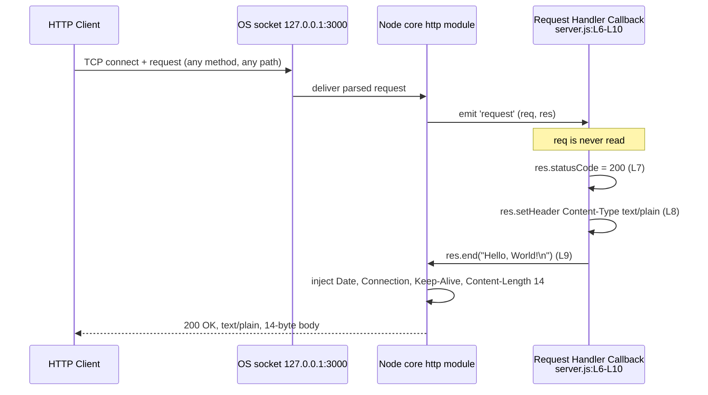
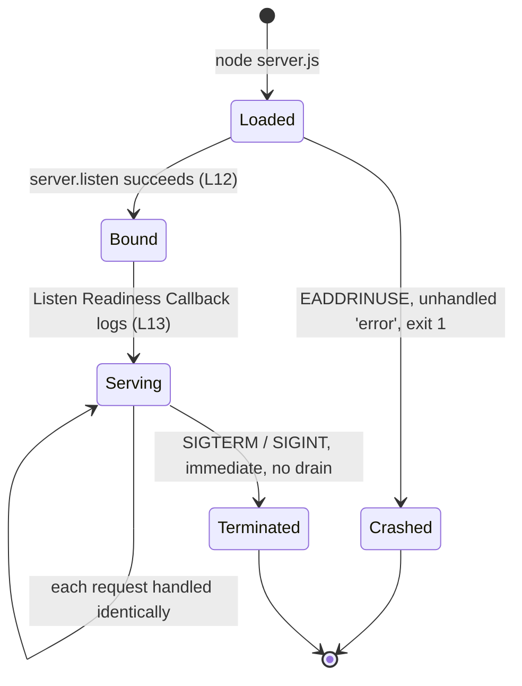

# Request Lifecycle

This page documents the repeating, event-driven path that a single request
takes through `hao-backprop-test`, and the state model of the process that
serves it. Its sibling [Architecture overview](./overview.md) owns the
one-time, ordered bootstrap path, the component boundary, and the
response-header provenance analysis that this page builds on. The split is
deliberate: startup happens once, a request happens every time, and the two
are read by different people for different reasons.

Every claim carries an inline citation of the form
`Source: server.js:L6-L10`, anchored to baseline commit `1484182`, so any
statement on this page can be confirmed or refuted against the source in
seconds.

[Process states and transitions](#process-states-and-transitions) is written
to stand on its own. [Troubleshooting](../troubleshooting.md) links directly
into it, so a reader who arrives here mid-incident can start at that section
and get what they need without reading the rest of the page first.

## Contents

- [Lifecycle overview](#lifecycle-overview)
- [Request path, step by step](#request-path-step-by-step)
- [Process states and transitions](#process-states-and-transitions)
- [Event loop and why the process stays
  alive](#event-loop-and-why-the-process-stays-alive)
- [Keep-alive behavior](#keep-alive-behavior)
- [Concurrency characteristics](#concurrency-characteristics)
- [Source and traceability](#source-and-traceability)

## Lifecycle overview

The process runs exactly two paths, and telling them apart is the first step
to reading this service correctly.

| Path      | Runs                           | Documented on             |
| --------- | ------------------------------ | ------------------------- |
| Bootstrap | Once, as the module body loads | [Overview](./overview.md) |
| Request   | Once per inbound request       | this page                 |

The request path repeats for as long as the process lives, which is why the
two are documented apart.

Bootstrap ends when the module body finishes executing, and from that moment
the process has no code of its own left to run: it waits, and the runtime
calls into it. Two callbacks are the whole of the application-side surface of
that waiting, and nothing in the file ever calls either one directly.

- The **Listen Readiness Callback** is invoked once, when the socket bind
  succeeds. `Source: server.js:L12-L14`
- The **Request Handler Callback** is invoked once per request, for as long
  as the process lives. `Source: server.js:L6-L10`

Nothing carries from one pass of the request path to the next. Every
module-scope binding is a `const`, the handler reads none of them, and it
writes nothing outside the response object handed to it for that one request.
`Source: server.js:L1-L14`

The reply the path produces is fixed:

| Element          | Value                       | Source         |
| ---------------- | --------------------------- | -------------- |
| Status           | `200`                       | `server.js:L7` |
| `Content-Type`   | `text/plain`, no `charset`  | `server.js:L8` |
| Body             | `Hello, World!\n`, 14 bytes | `server.js:L9` |

That contract is restated on several pages of this set, each time with these
same citations, so every copy stays verifiable against one source of truth.
Plain Markdown has no include mechanism and no documentation generator is in
use here, so restatement rather than transclusion is expected. The wire-level
specification in full, including the cases where no response exists at all,
is on the [HTTP endpoint](../api-reference/http-endpoint.md) page.

In feature terms, the request path is `F-002` Uniform HTTP Response Handler,
implemented by the **Request Handler Callback** (`Source: server.js:L6-L10`),
and the readiness signal in the state model below is `F-003` Startup
Readiness Logging, implemented by the **Listen Readiness Callback**
(`Source: server.js:L12-L14`). The full traceability table belongs to
[Overview](./overview.md).

## Request path, step by step

Each numbered step below is one observable stage between a client socket and
a response body. Steps 1 to 3 and step 8 are the runtime's work; steps 4 to 7
are the entire contribution of this repository.

1. A client opens a TCP connection to `127.0.0.1:3000` and sends a request,
   using any method and any path. The bind target comes from the two
   constants declared at module load. `Source: server.js:L3-L4`
2. The operating-system socket delivers the received bytes to the Node.js
   runtime.
3. The Node.js core `http` module parses the request line, the headers and
   the body framing, then emits the server's `'request'` event. The
   application parses nothing. `Source: server.js:L1`
4. The runtime invokes the **Request Handler Callback**, which was registered
   as the `'request'` listener by the `http.createServer(...)` call. It
   receives two arguments: `req`, an `http.IncomingMessage`, and `res`, an
   `http.ServerResponse`. `Source: server.js:L6`
5. `req` is never read. Nothing in the file touches `req.url`, `req.method`,
   `req.headers`, or the request body, which is never consumed or drained: a
   search of the baseline source returns no occurrence of any of them.
   There is therefore no routing, no branching, no validation, no
   authentication and no content negotiation at this step, or at any other.
   `Source: server.js:L6-L10`
6. Three unconditional statements run, in order, with no branch of any kind
   between them: `res.statusCode = 200` (`Source: server.js:L7`),
   `res.setHeader('Content-Type', 'text/plain')` (`Source: server.js:L8`),
   and `res.end('Hello, World!\n')` (`Source: server.js:L9`).
7. The callback returns. It contains no `return` statement, so it returns
   `undefined`, and the emitter that invoked it discards the result. The
   response was already completed synchronously at step 6, before the
   callback returned, so nothing is left pending and no further work is
   scheduled. `Source: server.js:L6-L10`
8. The runtime completes the response on the wire: it injects `Date`,
   `Connection: keep-alive` and `Keep-Alive: timeout=5`, and derives
   `Content-Length: 14` from the `res.end()` payload. The client receives
   `200 OK`, `text/plain`, and a 14-byte body.

### D3 - Request lifecycle



### What the application sets and what the runtime adds

The diagram draws that distinction explicitly, and it is the part of the
request path an integrator most often attributes to the wrong component: the
three `H` arrows are application behavior, while the `N->>N` arrow is not.

| Header                     | Set by                                     |
| -------------------------- | ------------------------------------------ |
| `Content-Type: text/plain` | Application code, `server.js:L8`           |
| `Date`                     | Node.js runtime, injected                  |
| `Connection: keep-alive`   | Node.js runtime, injected                  |
| `Keep-Alive: timeout=5`    | Node.js runtime, injected                  |
| `Content-Length: 14`       | Node.js runtime, derived from `res.end()`  |

`Content-Type` is the only header this application sets, and it carries no
`charset` parameter. `Source: server.js:L8`. The table above is restated here
only as far as D3 needs it; the full provenance analysis, including who owns
parsing and dispatch, belongs to [Overview](./overview.md).

### The exchange, as observed

```bash
curl -s -i http://127.0.0.1:3000/
```

```http
HTTP/1.1 200 OK
Content-Type: text/plain
Date: Fri, 11 Sep 2026 12:02:13 GMT
Connection: keep-alive
Keep-Alive: timeout=5
Content-Length: 14

Hello, World!
```

The observed header order puts the single application-set header first,
followed by the four the runtime contributes. The `Date` value is the
timestamp of that particular response and is the one part of the exchange
that differs between runs.

The body is byte-exact:

```bash
curl -s http://127.0.0.1:3000/ | od -c
```

```text
0000000   H   e   l   l   o   ,       W   o   r   l   d   !  \n
0000016
```

The dump terminates at octal offset `0000016`, which is 14 in decimal:
thirteen printable characters plus one trailing LF, and no other byte.
`Source: server.js:L9`

### Why every request takes the same path

Because step 5 reads nothing, steps 6 to 8 cannot vary. Every path observed
reaches the same handler and produces the same reply, `/favicon.ico`
included, which browsers request on their own without being asked to:

```bash
curl -s -o /dev/null -w '%{http_code} %{content_type} %{size_download}\n' \
  http://127.0.0.1:3000/any/path
```

| Request target    | Observed result       |
| ----------------- | --------------------- |
| `/`               | `200 text/plain 14`   |
| `/any/path`       | `200 text/plain 14`   |
| `/does/not/exist` | `200 text/plain 14`   |
| `/index.html`     | `200 text/plain 14`   |
| `/favicon.ico`    | `200 text/plain 14`   |
| `/x?q=1&a=2`      | `200 text/plain 14`   |

Method makes no difference either, with one observable exception that is the
runtime's doing rather than the application's:

| Method                                             | Observed result     |
| -------------------------------------------------- | ------------------- |
| `GET`, `POST`, `PUT`, `PATCH`, `DELETE`, `OPTIONS` | `200 text/plain 14` |
| `HEAD`                                             | `200 text/plain 0`  |

`HEAD` is answered with status `200` and a zero-byte body because the runtime
suppresses response bodies for `HEAD`. The application does not special-case
the method; it cannot, because it never reads one. `Source: server.js:L6-L10`.
On `HEAD` the runtime also omits `Content-Length` from the response
altogether, leaving `Content-Type`, `Date`, `Connection` and `Keep-Alive`.

Two further observations complete the picture. A request sending
`Accept: text/html,application/xhtml+xml` still receives
`200 text/plain 14`, so no content negotiation occurs at any step. And a
`POST` carrying a JSON body and a query string also receives
`200 text/plain 14`, because neither the query string nor the body is ever
looked at. `Source: server.js:L6-L10`

Three responses a reader might reasonably expect do not exist anywhere in
this system: there is no `404` for an unknown path, no `405` for an
unexpected method, and no `5xx` originating in application code, because
there is no branch that could select one and no `try` or `catch` in the file.
These are deliberate non-goals of a service whose purpose is to answer every
request identically, not gaps in it; [Overview](./overview.md) lists them
alongside the behavior that stands in for each. `Source: server.js:L1-L14`

### Requests that never reach the handler

Step 1 is a precondition rather than a certainty. The listener is bound to
the IPv4 loopback literal, which confines reachability to the machine the
process runs on, so a client on another host, in another container, or in
another network namespace never reaches step 1 at all.
`Source: server.js:L3`

Observed against each of this host's non-loopback IPv4 addresses while the
server was running and answering on `127.0.0.1:3000`: `curl` reported status
`000` and exit code 7. That is a connection failure rather than an HTTP
error, so there is no status code to interpret and nothing server-side to
inspect - the request never became a request. The operational remedy belongs
to [Troubleshooting](../troubleshooting.md).

## Process states and transitions

This section is self-contained, because it is where
[Troubleshooting](../troubleshooting.md) sends a reader whose server has just
stopped behaving. If that is you, start with the table: it maps what you can
observe to the state the process actually reached.

| State        | What you observe                                             |
| ------------ | ------------------------------------------------------------ |
| `Loaded`     | the process started, and nothing is printed yet              |
| `Bound`      | the socket is open, the readiness line not yet written       |
| `Serving`    | the readiness line was printed, requests return `200`        |
| `Crashed`    | no readiness line, an `EADDRINUSE` report, exit code `1`     |
| `Terminated` | the process ended the instant it was stopped, with no drain  |

Which state leads to which is set out under
[Transitions in full](#transitions-in-full) below.

The single most useful diagnostic on this page follows from that table. The
readiness line is written by the **Listen Readiness Callback**, which the
runtime invokes only once the bind has succeeded
(`Source: server.js:L12-L14`). If the line is absent, the process never
reached `Serving`: **the absence of the startup line is itself the
diagnostic**, and no separate error check is needed to establish it.

### D4 - Process state



### Transitions in full

- `[*] -> Loaded` when `node server.js` starts the process. There is no
  `npm start` to use instead, because the repository has no `package.json`.
- `Loaded -> Bound` when `server.listen(port, hostname, callback)` binds the
  socket successfully. The argument order is port first, then hostname, then
  the callback. `Source: server.js:L12`
- `Loaded -> Crashed` when the bind fails with `EADDRINUSE`: the `'error'`
  event goes unhandled and the process exits with code `1`.
- `Bound -> Serving` when the **Listen Readiness Callback** writes the
  readiness line to stdout, interpolating the same two constants the bind
  used. `Source: server.js:L13`
- `Serving -> Serving` for every request, each one handled identically by the
  **Request Handler Callback**. `Source: server.js:L6-L10`
- `Serving -> Terminated` when the process is stopped: immediately, and with
  no drain.
- `Crashed -> [*]` and `Terminated -> [*]`: in both cases the process is
  gone, and nothing in the repository restarts it.

There is no state between `Serving` and `Terminated`. No connection-draining
state appears in D4 because none exists in the program: the file installs no
signal handler and never calls `server.close()`.
`Source: server.js:L1-L14`

### The bind-failure path

A port collision is the failure an operator is most likely to meet, and the
way this service meets it is a permanent characteristic of the file rather
than an incident to be explained away.

Observed by starting a second instance while a first one held
`127.0.0.1:3000`:

- the second process printed nothing at all to stdout - no readiness line;
- it wrote an unhandled `'error'` report to stderr;
- it exited with code `1`.

The stderr excerpt below is abridged: the internal stack frames and the
numeric `errno` are left out, because those frame line numbers and that
value are specific to the platform and the release, while the lines shown
are the stable part of what was observed.

```text
      throw er; // Unhandled 'error' event

Error: listen EADDRINUSE: address already in use 127.0.0.1:3000
Emitted 'error' event on Server instance at:
  code: 'EADDRINUSE',
  syscall: 'listen',
  address: '127.0.0.1',
  port: 3000
```

The error is fatal rather than merely reported for a structural reason: the
file registers no `'error'` listener on the server, so the event has nowhere
to go and the runtime rethrows it. `Source: server.js:L1-L14`. There is no
retry, no fallback port, and no diagnostic of the file's own making. That
unhandled event is the documented cause of the crash, and this page records
the behavior as the system's own rather than prescribing a change to it.
[Troubleshooting](../troubleshooting.md) covers the operational response.

Read together with the state table, the consequence is worth stating
plainly: on this path the **Listen Readiness Callback** never runs at all, so
`Serving` is never reached and no request is ever handled by this process.
`Source: server.js:L12-L14`

### Termination

Stopping the process ends it at once. On POSIX hosts that means `SIGTERM` or
`SIGINT`; the outcome is the same either way, and the same again on Windows,
where the equivalent is `Ctrl+C` in the foreground or stopping the process by
its pid. It is the same because the file installs no handler for any of them.
`Source: server.js:L1-L14`

Observed on stopping a running instance: the process had already exited by
the time the stop call returned, the listening socket was released
immediately, and a request issued straight afterwards failed to connect -
`curl` reported status `000` and exit code 7 - rather than returning an HTTP
error.

Nothing drains. With no signal handler and no `server.close()` call anywhere
in the file, an in-flight response has no window in which to finish and a
keep-alive connection is given no chance to close politely.
`Source: server.js:L1-L14`. This is a permanent design fact of a service
whose only job is to answer every request identically, and it is listed among
the deliberate non-goals on [Overview](./overview.md).

## Event loop and why the process stays alive

Bootstrap runs the module body to completion and then has nothing left to
execute, yet `node server.js` does not exit: it occupies the foreground
indefinitely. The reason is the listening socket. Binding it registers a
handle with the event loop, and while at least one such handle is active the
loop still has pending work, so the process stays alive waiting for
connections. `Source: server.js:L12`

Nothing else in the file holds the process open. There is no interval, no
timer, no unresolved promise and no blocking read anywhere in it - the handle
created by the bind is the only thing keeping the loop awake, which is also
why the process disappears the moment that socket goes away.
`Source: server.js:L1-L14`

The same mechanism produces the import trap. `require('./server')` - or
`require('./server.js')`, which resolves to the same file - executes the
module body, which binds the socket as a side effect of loading, and the
handle then keeps the *requiring* process alive too. Observed, running with
the module's own directory as the working directory:

```bash
timeout 5 node -e "const m = require('./server.js');
console.log(typeof m, Object.keys(m).length, JSON.stringify(m));"
```

```text
object 0 {}
Server running at http://127.0.0.1:3000/
```

The call returned an empty object with zero own keys, because nothing in the
file assigns to `module.exports` (`Source: server.js:L1-L14`), so there is no
handle with which to stop the server that was just started. The readiness
line then appeared, after the logged line, because the bind callback fires
once the module body has already finished. The process never exited on its
own: the 5-second `timeout` wrapper had to end it, which it reported as exit
code `124`. Requiring this file is therefore never a way to consume it -
[Usage](../usage.md) owns that warning and covers it in full, and
[Troubleshooting](../troubleshooting.md) covers it as a symptom.

## Keep-alive behavior

Every response observed carried both `Connection: keep-alive` and
`Keep-Alive: timeout=5`, so a client may hold the connection open rather than
reconnecting for its next request. Each request sent over such a connection
takes exactly the path described above, with no state shared between them.
`Source: server.js:L6-L10`

Both headers are set by the runtime, not by this application. The only header
the file sets is `Content-Type` (`Source: server.js:L8`), and the value
advertised in `Keep-Alive` is the runtime's own; `5` is the only timeout value
that appears anywhere in the observed exchange. Neither header is read from
nor written by `server.js`, so neither is configurable through anything in
this repository, and no environment variable influences them: the file
contains no read of `process.env` at all. `Source: server.js:L1-L14`

One interaction with the method table above is worth repeating here, because
it is the one case where the header set differs: on a `HEAD` request the
runtime omits `Content-Length` entirely, while `Connection` and `Keep-Alive`
are still present.

## Concurrency characteristics

The **Request Handler Callback** holds no shared state. It reads nothing
outside its own two parameters and writes nothing outside the per-request
`res` object handed to it (`Source: server.js:L6-L10`), and every
module-scope binding is a `const` that the handler never touches
(`Source: server.js:L1-L14`).

Three structural consequences follow, and nothing beyond them:

- **No contention.** There is no mutable state for two requests to compete
  over.
- **No locking.** Nothing needs guarding, so the file contains no
  synchronization of any kind.
- **No cross-request interference.** One request cannot influence the
  response to another, because the handler reads no request data at all and
  produces a reply that does not depend on its input.
  `Source: server.js:L6-L10`

That is where this section stops. This documentation states no request rate,
no concurrency ceiling and no scaling property, because the repository
defines no performance objective and contains no instrumentation from which
any such figure could be derived. The structural facts above are what the
source supports.

## Source and traceability

- **Baseline.** This page is anchored to commit `1484182`, the state of the
  repository at which every locator was read and every behavior observed.
- **Citation form.** Claims cite line ranges, as in
  `Source: server.js:L6-L10`, never a total line count. Claims about
  absences that span the whole file cite `Source: server.js:L1-L14`.
- **Line numbers.** Locators refer to the baseline layout of `server.js`,
  reproduced on [Overview](./overview.md) under its bootstrap section. JSDoc
  documentation comments added to `server.js` shift its physical line
  numbers; the whole documentation set stays anchored to the baseline layout
  so that citations agree with one another across pages.
- **Runtime.** Node.js 24.19.0, the Active LTS line named "Krypton", is the
  recommended prerequisite and the baseline this set describes. Node.js 22.x
  is a Maintenance LTS line, which makes it acceptable rather than preferred;
  Node.js 26.x is a Current line rather than an LTS one; Node.js 20.x reached
  end of life on 2026-04-30. The behavior documented here is a property of
  the source rather than of any one release.

### Diagram ledger

This page carries diagrams D3 and D4. Each diagram in this documentation set
appears on exactly one page, so nothing is duplicated: D1 and D2 belong to
[Overview](./overview.md), D5 to the [Request Handler
Callback][fn-request-handler] page, D6 to the [Listen Readiness
Callback][fn-listen-readiness] page, D7 to the
[documentation hub](../README.md), and D8 to
[Troubleshooting](../troubleshooting.md).

Both diagrams on this page are Mermaid source stored inline in the Markdown
that describes them, so they render on GitHub with no build step and no
generated asset in version control - and they cannot drift out of sync with a
separate binary file. A diagram here that names a line locator has to be
revisited when that line changes, which is the counterpart obligation.

Three diagram types are absent by decision rather than oversight. There is no
class diagram, because no class exists anywhere in `server.js:L1-L14`. There
is no entity-relationship diagram, because no data model, schema, or
persistence exists - the only data is the constant response string
(`Source: server.js:L9`). There is no deployment diagram, because the
repository contains no deployment, container, or orchestration
configuration.

### Where to read next

- [Overview](./overview.md) - the component boundary and the one-time
  bootstrap path that precedes everything on this page.
- [Request Handler Callback][fn-request-handler] - the function that executes
  steps 4 to 7 of the request path, statement by statement.
- [Listen Readiness Callback][fn-listen-readiness] - the readiness signal in
  the state model, and the case in which it never runs.
- [HTTP endpoint](../api-reference/http-endpoint.md) - the wire-level
  response contract in full.
- [Troubleshooting](../troubleshooting.md) - the verified failure modes,
  including the operational response to both of this page's failure paths.
- [Usage](../usage.md) - how to consume the service, and the import trap in
  full.
- [Documentation hub](../README.md) - the index for this set.

[fn-request-handler]: ../api-reference/functions/request-handler-callback.md
[fn-listen-readiness]: ../api-reference/functions/listen-readiness-callback.md
