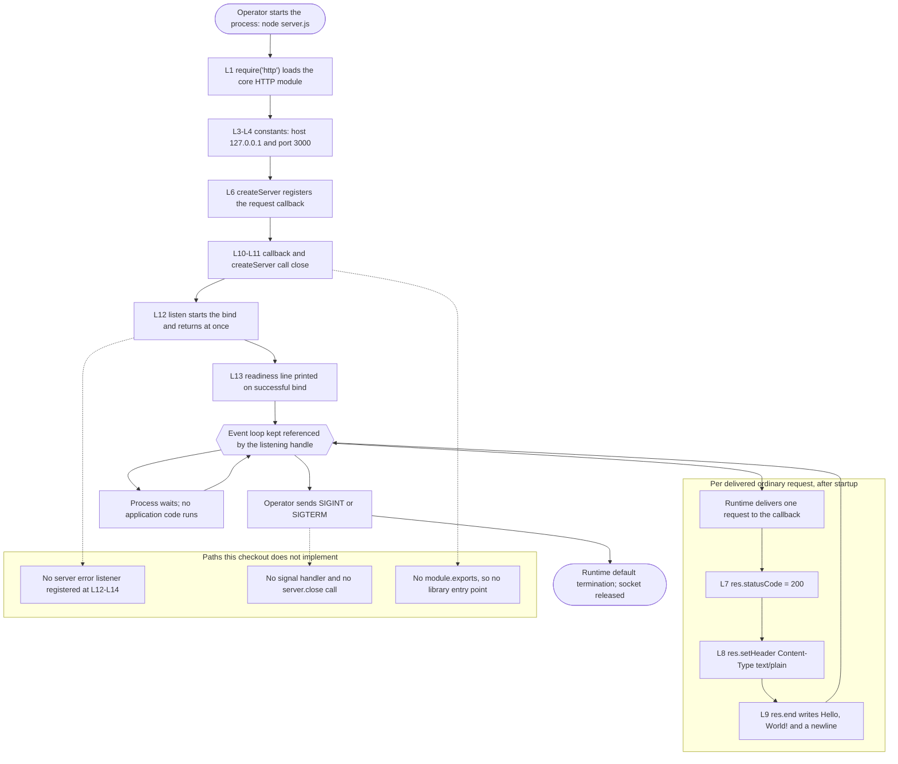

# Application and Runtime

This is the application and runtime area document for this repository. It
explains how the program is structured and what happens, step by step, when
you run it.

## Verification baseline

- **Documentation baseline branch** — `17-Aug-2026-Br1`, the branch this
  document was written against [.git/HEAD:ref].
- **Documentation baseline commit** — `1484182`, whose subject line is
  `Add files via upload` [.:git log -1 --oneline 1484182].
- **Files tracked at that commit** — `README.md` and `server.js`, nothing else
  [.:git ls-tree -r --name-only 1484182].
- **Program files, at that commit and now** — one, `server.js`
  [.:git ls-tree -r --name-only 1484182] [.:git ls-files].
- **Runtime used for every observation below** — Node.js 24.19.0 with the
  npm 11.17.0 it bundles, verified on August 17, 2026 (**Observed on Node.js
  24.19.0 on August 17, 2026**).
- **Runtime version declared by the repository** — none [.:git ls-files].

The repository contains no `package.json`, lockfile, `.nvmrc`,
`.node-version`, or `.tool-versions` file, so it pins no Node.js version
[.:git ls-files]. Node.js 24.19.0 is therefore an external selection made to
produce the observations below; it is **Absent in the current checkout** as a
declared requirement, and this document does not present it as one.

Every statement below carries exactly one evidence label:

- **Source-defined** — read directly from the code in this checkout.
- **Observed on Node.js 24.19.0 on August 17, 2026** — measured by running
  that code under that runtime on that date.
- **Absent in the current checkout** — verified to be missing from this
  checkout.
- **Recommendation** — a suggestion for future work, never a description of
  current behavior.

## Purpose and audience

Read this document if you are new to the repository and need to answer two
questions before you touch anything: how is the program structured, and what
happens when you run it. It is the architectural anchor for the other area
documents, so it also states which document owns each fact it hands off.

For prerequisites, the quick-start commands, troubleshooting, terminology,
and the map of every area document, start from
[the project README](../../README.md) instead; this document does not repeat
them.

## System boundary

- **Source-defined:** the whole system is one Node.js process running one
  script of 14 lines, which creates one HTTP server and listens on one
  address and port [server.js:1-14].
- **Source-defined:** `server.js` is the only executable module in the
  checkout; every other tracked path is Markdown documentation
  [.:git ls-files].
- **Source-defined:** there is no framework, no router, no middleware chain,
  no template engine, no database client, and no outbound network call. The
  script's only import is Node's own `http` module [server.js:1], and the
  request object handed to the callback is never read [server.js:6-10].
- **Absent in the current checkout:** there is no second module to load, no
  build step, and no packaging metadata; the baseline commit tracked only
  `server.js` and `README.md` [.:git ls-tree -r --name-only 1484182], and the
  documentation added since then adds no code [.:git ls-files].

Two terms are used throughout. A *module* is a single JavaScript file that
Node.js loads as a unit. An *ordinary request* is an HTTP request that the
runtime accepts and delivers to the application callback, as opposed to the
protocol cases — such as `HEAD`, `CONNECT`, upgrades, and malformed requests
— that the runtime answers or reshapes on its own; those cases belong to
[the networking area](./networking.md).

## CommonJS and the core module

*CommonJS* is Node.js's original module system: a file pulls in another
module by calling `require()`, which loads it synchronously and returns
whatever that module published on `module.exports`.

- **Source-defined:** the script's first statement is
  `const http = require('http');`, which loads the runtime's HTTP
  implementation and binds it to the constant `http` [server.js:1].
- **Source-defined:** `http` is a *core module*, meaning it ships inside the
  Node.js binary. There is nothing to download, install, or vendor for the
  import on line 1 to resolve [server.js:1].
- **Source-defined:** that single `require()` call is the only import in the
  file; nothing else is loaded at any point [server.js:1-14].
- **Absent in the current checkout:** the repository declares no application
  package dependencies — there is no manifest or lockfile to declare them in
  [.:git ls-files] — and the script imports no third-party package
  [server.js:1].
- **Source-defined:** the script publishes nothing on `module.exports`
  [server.js:1-14], so it is a program to run rather than a library to import.
  The runtime behavior that follows from this is in
  [Process lifecycle](#process-lifecycle) below.

Read the dependency position precisely. *No declared application package
dependencies* is not the same as *no dependencies*: the Node.js platform
itself remains a hard prerequisite, because line 1 resolves against the
runtime's own module registry and every later line is Node.js API surface
[server.js:1-14]. Which Node.js build you supply is your decision, not the
repository's [.:git ls-files].

## Configuration constants

This document is the primary owner of the program's configuration values.
**Source-defined:** there are five of them, and every one is a literal
written directly into the source [server.js:3-4,7-9].

| Value | Source | Current setting | To change |
| --- | --- | --- | --- |
| Bind address | [server.js:3] | `127.0.0.1` | Edit line 3 |
| TCP port | [server.js:4] | `3000` | Edit line 4 |
| Response status code | [server.js:7] | `200` | Edit line 7 |
| Response `Content-Type` | [server.js:8] | `text/plain` | Edit line 8 |
| Response body | [server.js:9] | `Hello, World!\n` | Edit line 9 |

- **Source-defined:** each of the five values is a literal. Two are assigned
  to named constants at the top of the file — the local address the listener
  attaches to and the TCP port it claims [server.js:3-4]; three are passed
  inline inside the request callback [server.js:7-9].
- **Absent in the current checkout:** there is no way to override any of them
  at launch. The 14 lines contain no `process.env`, no `process.argv`, and no
  file-system read, so no environment variable, command-line option, or
  configuration file is consulted [server.js:1-14].
- **Source-defined:** changing any value therefore means editing `server.js`
  and restarting the process, because the constants are evaluated once while
  the script loads [server.js:1-14]. This documentation change does not make that
  edit: it treats `server.js` as read-only evidence.
- What the bind address and port mean on the wire, and what the three
  response values mean to a client, belong to
  [the networking area](./networking.md). What to do when port `3000` is
  already taken belongs to [the project README](../../README.md) and
  [the DevOps area](./devops.md).

## Control flow: startup and request handling

**Source-defined:** the script declares no named function and exposes no
entry point to invoke, so loading it *is* running it. Node.js evaluates the
14 lines from top to bottom once, and the last thing that evaluation does is
leave a listener open [server.js:1-14].

1. **Source-defined:** line 1 loads the core `http` module and binds it to a
   constant [server.js:1].
2. **Source-defined:** lines 3 and 4 bind the host and port constants
   [server.js:3-4].
3. **Source-defined:** line 6 calls `http.createServer()` with an
   arrow-function callback — a function written inline as `(req, res) => {}`
   — and stores the resulting server object in the constant `server`. This
   *registers* the callback for later; it does not run it [server.js:6].
4. **Source-defined:** line 10 closes the callback body and the
   `createServer()` call, and line 11 is blank [server.js:10-11]. At this
   point a server object exists but nothing is listening.
5. **Source-defined:** line 12 calls `server.listen(port, hostname, cb)`,
   passing the two constants and a second arrow-function callback
   [server.js:12].
6. **Source-defined:** line 13 is that second callback's only statement: it
   prints one readiness line built from the same two constants
   [server.js:13]. Both callbacks are *closures* — a closure is a function that
   keeps access to the variables of the scope it was written in, even when it
   runs later and somewhere else. That is what lets line 13 read `hostname` and
   `port` from lines 3 and 4 without either value being passed to it as an
   argument [server.js:3-4,12-13], and it is also why the request callback on
   lines 6 to 10 needs no configuration of its own [server.js:6-10].
7. **Source-defined:** line 14 closes the `listen()` call. There is no code
   after it [server.js:14].

Two consequences are easy to miss.

- **Source-defined:** the callback body on lines 7 to 9 does not run during
  startup. It is registered on line 6 and runs once per delivered ordinary
  request, which is why nothing sets a status code or writes a body until a
  client actually connects [server.js:6-10].
- **Observed on Node.js 24.19.0 on August 17, 2026:** `server.listen()`
  starts the bind and returns immediately; the readiness callback on line 13
  runs on a later turn of the event loop. A probe that loaded the script and
  then logged a line the instant `require()` returned printed its own line
  first, and the readiness line `Server running at http://127.0.0.1:3000/`
  only afterwards [server.js:12-13].

Where the rest of each step is documented: the socket address and everything
that happens on the wire belong to [the networking area](./networking.md);
listener activation as an event in the runtime substrate belongs to
[the infrastructure area](./infrastructure.md); the readiness line as an
emitted signal belongs to [the observability area](./observability.md).

## Application control-flow diagram

The solid path is the one the source takes: load, construct, listen, print,
then wait and serve [server.js:1-14]. The `PERREQ` block is entered only when
the runtime delivers an ordinary request, and it contains exactly the three
statements the callback performs [server.js:7-9]. The dashed edges point at
the `GAPS` block, which names paths the checkout does **not** implement — no
listener is attached to the server's `error` event [server.js:12-14], no
signal handler or `server.close()` call exists [server.js:1-14], and nothing
is published on `module.exports` [server.js:1-14]. They are drawn so the
diagram cannot be misread as showing behavior that is absent.

## Line-by-line source map

Every line of `server.js` appears below, with the document that owns its
detailed explanation. Each entry names the line, its code, what the code does,
and the primary owning document, and every entry is **Source-defined**
[server.js:1-14].

- **Line 1** — `const http = require('http');`. Loads the core HTTP module and
  binds it to a constant. Owner: this document.
- **Line 2** — *(blank)*. Separates the import from the constants. Owner: this
  document.
- **Line 3** — `const hostname = '127.0.0.1';`. Binds the loopback bind
  address. Owner: [networking](./networking.md).
- **Line 4** — `const port = 3000;`. Binds the TCP port. Owner:
  [networking](./networking.md).
- **Line 5** — *(blank)*. Separates the constants from server construction.
  Owner: this document.
- **Line 6** — `const server = http.createServer((req, res) => {`. Creates the
  server and registers the ordinary request callback; `req` is declared but
  never read. Owner: this document.
- **Line 7** — `res.statusCode = 200;`. Sets the response status code. Owner:
  [networking](./networking.md).
- **Line 8** — `res.setHeader('Content-Type', 'text/plain');`. Sets the one
  application-defined response header. Owner:
  [networking](./networking.md).
- **Line 9** — `res.end('Hello, World!\n');`. Writes the response body and
  ends the response. Owner: [networking](./networking.md).
- **Lines 10-11** — `});` then a blank line. Closes the callback body and the
  `createServer()` call. Owner: this document.
- **Line 12** — `server.listen(port, hostname, () => {`. Starts the bind on
  the constants from lines 3 and 4 and registers the success callback. Owner:
  [infrastructure](./infrastructure.md).
- **Line 13** —
  ``console.log(`Server running at http://${hostname}:${port}/`);``. Prints the
  single readiness line after a successful bind. Owner:
  [observability](./observability.md).
- **Line 14** — `});`. Closes the `listen()` call; the script ends here.
  Owner: this document.

That is 14 of 14 lines with an owner, which is the coverage check for this
area document [server.js:1-14].

## Process lifecycle

An *event loop* is the single scheduler inside a Node.js process that runs
your JavaScript and then waits for events — an incoming connection, a signal,
a completed timer — before running more of it. A *listening handle* is the
operating-system socket the runtime holds open while a server accepts
connections; while such a handle is active the event loop is *referenced*,
meaning outstanding work exists and the process will not exit on its own.

- **Source-defined:** one operating-system process runs the whole program.
  The script contains no fork, no worker thread, no child process, and no
  clustering call [server.js:1-14].
- **Absent in the current checkout:** nothing supervises that process — the
  checkout has no service definition, wrapper script, or process-manager
  configuration [.:git ls-files]. The commands an operator uses to start,
  stop, and restart it belong to [the DevOps area](./devops.md).
- **Source-defined:** the script is evaluated once. There is no loop, no
  retry, and no re-entry point in the file [server.js:1-14].
- **Observed on Node.js 24.19.0 on August 17, 2026:** after that single
  evaluation finished, the process stayed alive with no traffic at all and
  kept its listener open on `127.0.0.1:3000` [server.js:12].
- **Observed on Node.js 24.19.0 on August 17, 2026:** the reason it stays
  alive is the listening handle. A probe that inspected the runtime's active
  resources found none related to the server before the bind completed, and
  found the TCP server handle among them once the readiness line had been
  printed [server.js:12-13].
- **Observed on Node.js 24.19.0 on August 17, 2026:** the callback runs once
  per delivered ordinary request. Ten concurrent requests on ten different
  paths produced ten responses that were identical on status code, content
  type, and body, which is consistent with the callback ignoring the request
  object entirely [server.js:6-10].
- **Source-defined:** the callback body is straight-line synchronous code —
  no `async`, no `await`, no promise, no timer — so each invocation runs to
  completion on the event loop before the next one starts [server.js:7-9].
- **Observed on Node.js 24.19.0 on August 17, 2026:** loading the file from
  another module returns an object with no own keys, and the load itself binds
  the port as a side effect: an in-process request to `127.0.0.1:3000` issued
  immediately after `require()` was answered by the listener that the load had
  just started [server.js:1-14]. The file cannot be reused as a library
  without also starting a listener.
- **Source-defined:** the process installs no signal handling and no shutdown
  path. The 14 lines contain no `process.on`, no reference to `SIGINT` or
  `SIGTERM`, no `server.close()`, and no listener on the server's `error`
  event [server.js:1-14].
- **Observed on Node.js 24.19.0 on August 17, 2026:** termination is therefore
  whatever the runtime does by default, and in every case the captured streams
  were unchanged — one readiness line on standard output, nothing on standard
  error — with port `3000` released immediately afterwards [server.js:1-14].
  In-flight requests are not drained, because no code exists to drain them
  [server.js:1-14].
- How that termination is *reported* depends on where you observe it, and the
  two views below must not be mixed. Both were measured under the runtime
  named in the verification baseline
  (**Observed on Node.js 24.19.0 on August 17, 2026**):
  - **A POSIX shell** reports a signal-terminated process through `wait` as 128
    plus the signal number: `130` for `SIGINT` and `143` for `SIGTERM`. Those are
    wait statuses the shell derives from the signal, not exit codes this program
    chose — it never returns one, because nothing runs on the way out
    [server.js:1-14].
  - **A Node.js parent process** that spawns this program and then signals it
    sees `code: null` together with the signal name, `SIGTERM` or `SIGINT`, in
    the child's exit metadata — the same event reported as ended by a
    signal rather than as a returned status.
- **Observed on Node.js 24.19.0 on August 17, 2026:** because no listener is
  attached to the server's `error` event [server.js:12-14], a failure inside
  `listen()` surfaces as an unhandled `error` event and the process exits
  non-zero instead of reporting the problem itself. The operator-facing
  procedure and the exact diagnostic text belong to
  [the DevOps area](./devops.md) and
  [the observability area](./observability.md).

Volatile values are deliberately not published here as fixed facts: process
identifiers differ on every launch, and so does the wall-clock time at which
the readiness line appears. The acceptance matrix that re-runs these checks
belongs to [the testing and quality area](./testing-and-quality.md).

## Application versus runtime boundary

The single most useful thing to understand about this program is how little
of the HTTP exchange it actually controls. **Source-defined:** the callback
sets a status code, one header, and a body, and does nothing else
[server.js:7-9]. Everything else that reaches the client is produced by the
runtime, as the two groups below record.

Set by the application callback, and therefore **Source-defined**:

- Status code `200` [server.js:7].
- `Content-Type: text/plain` [server.js:8].
- Body `Hello, World!\n` [server.js:9].

Added by the runtime, and therefore **Observed on Node.js 24.19.0 on August
17, 2026**:

- `Content-Length`, from the runtime's response serializer.
- `Date`, whose value differs on every response, from the same serializer.
- `Connection` and `Keep-Alive`, from the runtime's connection handling.

Four consequences of that split are worth stating explicitly:

- **Observed on Node.js 24.19.0 on August 17, 2026:** an ordinary `GET`
  returned status `200`, the body `Hello, World!` followed by a newline, and
  five response headers: `Content-Type`, `Date`, `Connection`, `Keep-Alive`,
  and `Content-Length`. Only the first of those five was set by the source
  [server.js:8]; the runtime added the other four on its own.
- **Source-defined:** the script sets no timeout, no header-size limit, no
  request-size limit, no keep-alive policy, and no socket option. None of
  those names appears anywhere in the 14 lines [server.js:1-14], so every such
  default is the runtime's, and every default is specific to the Node.js
  version you run.
- **Source-defined:** the callback is registered for ordinary requests only
  [server.js:6]. It is not a universal HTTP contract: request methods and
  malformed inputs that the runtime handles or rejects on its own never reach
  lines 7 to 9, and no code in this checkout influences them
  [server.js:1-14].
- The case-by-case matrix of methods, protocol versions, parser errors, and
  runtime defaults is owned by [the networking area](./networking.md). Treat
  this section as the boundary rule and that document as the evidence.

## Gaps and implications

Every entry below names something **Absent in the current checkout**, states
its consequence today, and attaches one **Recommendation**. The
recommendations are advisory only; nothing in them is implemented, and none of
them should be read as current behavior.

- **Module exports** — nothing is published on `module.exports`
  [server.js:1-14].
  - *Consequence today:* loading the file always starts a listener, so it
    cannot be imported for reuse or exercised without binding the port.
  - *Recommendation:* export a server factory so a caller decides when to
    listen.
- **Environment or file-based configuration** [server.js:1-14].
  - *Consequence today:* all five values are fixed at their literals; a
    different address, port, status, media type, or body requires a source edit
    and a restart.
  - *Recommendation:* read the address and port from the environment, keeping
    the current literals as defaults.
- **Error handling around request processing** — no `try`/`catch` in the
  callback [server.js:6-10].
  - *Consequence today:* a future handler that throws would fail with no
    application-defined response.
  - *Recommendation:* wrap handler work and answer with an explicit error
    status on failure.
- **A listener on the server's `error` event** [server.js:12-14].
  - *Consequence today:* a bind failure becomes an unhandled `error` event and
    the process exits non-zero without an application-authored message.
  - *Recommendation:* register an `error` handler that reports the cause and
    exits deliberately.
- **Graceful shutdown** — no signal handler and no `server.close()`
  [server.js:1-14].
  - *Consequence today:* a stop request ends the process under the runtime
    default, reported differently depending on where it is observed, as
    described above; in-flight requests are not drained.
  - *Recommendation:* handle both signals, stop accepting connections, then
    exit once work drains.
- **Startup validation beyond the readiness line** [server.js:13].
  - *Consequence today:* nothing checks the configuration before `listen()` is
    called, so the only startup evidence is one printed line.
  - *Recommendation:* validate the address and port before binding and fail
    with a clear message.
- **Any second module** [.:git ls-files].
  - *Consequence today:* configuration, request handling, and process startup
    all live in one 14-line file.
  - *Recommendation:* split configuration, handler, and bootstrap once the
    surface grows beyond a fixture.

- **Source-defined:** the repository presents itself as a test project for
  integration purposes [README.md:2], and the entries above are the limits of
  a 14-line fixture rather than latent defects in it [server.js:1-14].
- **Recommendation:** treat every recommendation listed above as prerequisite
  work before this program is used for anything beyond local integration
  testing.

## Source map and related areas

Lines cited by this document: [server.js:1] for module loading,
[server.js:3-4] for the host and port constants, [server.js:6] for server
construction and callback registration, [server.js:7-9] for the three
application-defined response values, [server.js:10-11] for the close of the
callback and constructor call, [server.js:12] for the listen call,
[server.js:13] for the readiness line, and [server.js:14] for the end of the
script. The repository's own purpose statement is cited as [README.md:2].
Claims about what the checkout contains today cite [.:git ls-files], and the
baseline commit and its file list cite [.:git log -1 --oneline 1484182] and
[.:git ls-tree -r --name-only 1484182]. The branch this document was written
against is cited as [.git/HEAD:ref], and every absence claim here is scoped to
it. Remote URLs and clone hooks are never cited, because they belong to an
individual clone rather than to tracked content — and a remote URL can carry an
access credential; [the project README](../../README.md#current-checkout)
explains all of that once for the whole set.

Continue reading:

- [The project README](../../README.md) — prerequisites, quick start,
  troubleshooting, terminology, and the map of all area documents.
- [Networking](./networking.md) — the wire behavior of the address, port, and
  the three response values this document owns as constants.
- [Data and state](./data-and-state.md) — what the program does and does not
  keep, given that the request object is never read [server.js:6-10].
- [Infrastructure](./infrastructure.md) — the substrate the single process
  needs in order to bind at all [server.js:12].
- [Observability](./observability.md) — the readiness line as a signal, and
  what the runtime writes when something fails [server.js:13].
- [DevOps](./devops.md) — the commands that start, verify, stop, and restart
  the process.
- [Testing and quality](./testing-and-quality.md) — the acceptance matrix
  that re-runs every observation in this document.
