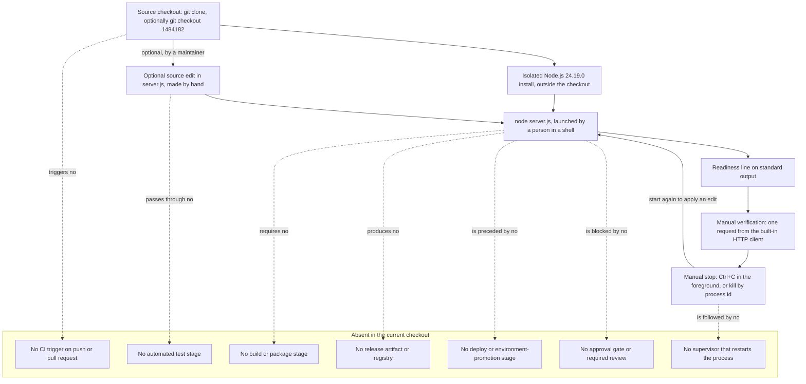

# DevOps

This is the DevOps area document for this repository. It answers one question:
what happens between a source file and a running process, and what does the
project not have in that space? Every step described here as working was
executed against this checkout under the runtime named below, and every
capability the project does not have is labelled as absent rather than
described as though it existed.

This document is also the complete operator command reference for the project.
The root [README](../../README.md) carries only the shortest successful first
run and links here for everything else, so the sections below are written to be
sufficient on their own.

## Verification baseline

<!-- markdownlint-disable MD013 -->

| Item | Value | Evidence |
| --- | --- | --- |
| Documentation baseline commit | `1484182` — `Add files via upload` | [.:git log -1 --oneline 1484182] |
| Commits reachable from that commit | Exactly one, itself; it is the root commit | [.:git log --oneline 1484182] |
| Files tracked at that commit | `README.md` and `server.js`, nothing else | [.:git ls-tree -r --name-only 1484182] |
| Files tracked once this documentation set landed | Those two, plus the eight `docs/areas/*.md` documents | [.:git ls-files] |
| Tags in the checkout | None | [.:git tag --list] |
| Runtime used for every command below | Node.js 24.19.0 with its bundled npm 11.17.0, verified on August 17, 2026 | Observed on Node.js 24.19.0 on August 17, 2026 |
| Host and shell the commands were executed in | A POSIX shell (`bash`) on Linux x86_64 (Ubuntu 24.04.4 LTS), reported by `uname -srm` as `Linux 6.18.33.2-microsoft-standard-WSL2 x86_64` | Observed on Node.js 24.19.0 on August 17, 2026 |
| Runtime version declared by the repository | None | [.:git ls-files] |

<!-- markdownlint-enable MD013 -->

The repository pins no runtime version. There is no `package.json`, lockfile,
`.nvmrc`, `.node-version`, or `.tool-versions` file to read one from
[.:git ls-files]. Node.js 24.19.0 was installed outside the checkout purely to
produce the results below: it is an external selection for this verification
run rather than repository policy, and nothing in the code demands that
particular build [server.js:1-14].

Every command in this document was executed as written on that one host, in a
POSIX shell, under that one runtime, and every output shown is what that run
produced. Commands are given in POSIX-shell form for the same reason; the
program itself contains no filesystem path, shell invocation, or
operating-system-specific call, so it imposes no platform requirement of its own
[server.js:1-14], but an operator on a different platform should expect the
shell syntax, the process-inspection commands, and the platform-specific fields
of any runtime diagnostic to differ from what is recorded here.

Every statement below carries exactly one evidence label:

- **Source-defined** — read directly from the code in this checkout.
- **Observed on Node.js 24.19.0 on August 17, 2026** — measured on the
  verification host on that date with that runtime installed. The same label
  covers host-level checks made during the same session, such as asking the
  operating system which process holds a port.
- **Absent in the current checkout** — verified to be missing from this
  checkout.
- **Recommendation** — a suggestion for future work, never a description of
  current behavior.

Values that differ from one run to the next are shown as variable fields
instead of being published as fixed facts. Process identifiers, response `Date`
headers, absolute temporary paths, and the internal frame line numbers inside a
runtime stack trace are all volatile, and none of them is a contract.

## Purpose and audience

Read this document when you need to *do* something to the program rather than
understand its internals. After working through it you can:

- acquire the source and confirm you have all of it;
- install a runtime able to execute it;
- start it, and prove from outside the process that it is serving;
- stop it, and start it again;
- recognise the three failures you are most likely to meet, and clear each one;
- follow the only workflow that exists for changing its behavior.

The boundary with the neighbouring document matters.
[The infrastructure area](./infrastructure.md) explains the *substrate*: what
must already exist on a machine before this process can start, and which
deployment tiers do not exist at all. This document explains the *workflow*:
the commands you type, in order, and what each one prints. If your question is
"what does this need?", read that document; if it is "what do I run?", you are
in the right place.

## Current-checkout scope

Everything below describes the program as it stands at commit `1484182`
[.:git log -1 --oneline 1484182], which is the root commit and the only one that
has ever contained the program [.:git log --oneline 1484182]. Documentation
commits made after it add Markdown and change no program behavior
[.:git ls-files]. Git facts are cited against that commit by hash rather than
against whatever `HEAD` your clone is on, so nothing here goes stale as history
grows.

Three properties of your own clone are deliberately never used as evidence in
this document, because none of them is tracked content
[.:git ls-tree -r --name-only 1484182]: the branch names it holds, the remote URL
it was created from, and the contents of its `.git/hooks` directory. Statements
below are therefore claims about the program and its commit, never about a
branch, a host, or a clone.

## Terms used in this document

These terms appear below and are defined here once, so that no reader has to
infer them from context:

- A *checkout* is a local copy of the repository produced by `git clone`,
  together with the `.git` directory that holds its history.
- A *working tree* is the set of ordinary files in that copy — the ones you can
  edit. `git ls-files` lists the tracked members of it.
- A *foreground process* runs attached to the terminal that launched it: it
  holds that terminal until it ends, and the keystrokes you type there reach
  it. A *detached* or *background* process has been released from that
  relationship, so the terminal accepts further commands while it runs.
- `SIGINT` and `SIGTERM` are two requests an operating system can deliver to a
  process asking it to stop. `SIGINT` is what pressing Ctrl+C in a terminal
  sends; `SIGTERM` is the polite stop request tools send by default. A program
  may install a handler to run its own shutdown code when either arrives, or
  install none, in which case the runtime's default applies.
- A *build step* is any transformation applied to source before it can run —
  compiling, bundling, transpiling, or minifying.
- A *release artifact* is the fixed, versioned output of such a step, for
  example a tarball, a container image, or a published package. It is the thing
  you deploy and the thing you can go back to.
- A *rollback* is returning a running system to an earlier known state. It
  needs an earlier state to exist and be identifiable.
- *CI*, continuous integration, is automation that runs on every change —
  typically build, test, and lint — before the change is merged. *CD*,
  continuous delivery or deployment, is automation that takes an accepted
  change and puts it into a running environment.
- A *quality gate* is a check that must pass before a change is allowed
  through: a required test run, a lint rule, a coverage threshold, a security
  scan, or a required review.

## 1. Acquire the source

Clone the repository and enter it. Put the clone URL your own access gives you
into a variable first and pass it as a quoted argument, so that nothing in it is
re-interpreted by the shell — a URL can legitimately contain characters a shell
treats as syntax, and `--` stops a URL that begins with a dash from being read as
an option:

```bash
REPOSITORY_URL='paste-your-clone-url-here'
git clone -- "$REPOSITORY_URL" hao-backprop-test
cd hao-backprop-test
git ls-files
```

No URL is printed anywhere in this document, for two reasons. The value is a
property of a clone rather than of the repository's tracked content
[.:git ls-tree -r --name-only 1484182], so it differs between copies and would be
wrong as often as right; and a Git remote URL can embed an access token, which
must never be copied into documentation. Run `git remote -v` inside an existing
clone when you need to know where that clone came from. `cd` is written rather
than a shell-specific alternative because it is the one directory-change form
every common shell accepts.

The last command lists the tracked working tree. What it prints depends on which
commit you have checked out, so read it against the baseline rather than as a
fixed expectation:

```console
README.md
docs/areas/application-runtime.md
docs/areas/data-and-state.md
docs/areas/devops.md
docs/areas/infrastructure.md
docs/areas/networking.md
docs/areas/observability.md
docs/areas/security.md
docs/areas/testing-and-quality.md
server.js
```

- **Observed on Node.js 24.19.0 on August 17, 2026:** that is the listing with
  this documentation set in place — ten tracked paths, nine of them Markdown and
  one the program [.:git ls-files].
- At the documentation baseline the same command printed two paths, `README.md`
  and `server.js`, and nothing else. To ask that question without touching your
  working tree, name the commit instead of relying on `HEAD`:
  `git ls-tree -r --name-only 1484182`
  [.:git ls-tree -r --name-only 1484182].
- **Source-defined:** `server.js` is the whole of the program — 14 lines, one
  file, no second module [server.js:1-14]. Every other tracked path is prose.
  There is nothing else to acquire.

You do **not** need to move your working tree to read this documentation or to
run the program: `server.js` is byte-identical at the baseline commit and on the
branch you are reading, so the program you run is the program this document
describes either way [server.js:1-14].

Checking the baseline out is therefore **optional**, and worth doing only when you
want a working tree that contains nothing but the program. Read the warning before
you do it:

> **This removes the documentation you are reading.** The baseline commit tracks
> only `README.md` and `server.js` [.:git ls-tree -r --name-only 1484182], so a
> detached checkout of it deletes every `docs/areas/*.md` file from your working
> tree until you come back. Commit or stash any uncommitted work first — a
> checkout refuses to discard changes, but stopping to sort them out mid-procedure
> is worse than doing it now.

```bash
git checkout 1484182        # go to the baseline; documentation disappears
git switch -                # come back to the branch you started on
```

```console
Note: switching to '1484182'.

You are in 'detached HEAD' state.
```

- **Observed on Node.js 24.19.0 on August 17, 2026:** the first command left the
  clone on a detached `HEAD` at the baseline commit, and `git ls-files` then
  returned exactly the two paths that commit tracks
  [.:git ls-tree -r --name-only 1484182] — the documentation was gone from the
  working tree, exactly as the warning says. The advisory text about detached
  `HEAD` continues for several more lines; only its first lines are quoted here.
- `git switch -` returns you to the branch you were on and restores the
  documentation. If you would rather name the branch than rely on `-`, run
  `git branch --show-current` **before** the checkout and keep the answer.
- The same detached checkout is the entire rollback mechanism this project has,
  which section 9 explains — including why it currently has no target.

If all you want is to ask a question about the baseline, do it without moving
anything. These commands read history directly and leave the working tree alone:

```bash
git ls-tree -r --name-only 1484182
git show --stat 1484182
git diff 1484182 -- server.js
```

- **Observed on Node.js 24.19.0 on August 17, 2026:** the first printed the two
  baseline paths [.:git ls-tree -r --name-only 1484182]; the third printed
  nothing at all, which is Git reporting that `server.js` has not changed since
  the baseline [server.js:1-14].

Two more commands are worth running immediately, because they tell you where
you are before anything else happens:

```bash
git log --oneline 1484182
git status --short
```

```console
1484182 Add files via upload
```

- **Observed on Node.js 24.19.0 on August 17, 2026:** naming the commit printed
  that single line and nothing more, because the baseline is the root commit and
  has no ancestors [.:git log --oneline 1484182]. Naming it is what makes the
  output stable: plain `git log --oneline` prints whatever your branch contains,
  which now includes the commits that added this documentation
  [.:git ls-files].
- **Observed on Node.js 24.19.0 on August 17, 2026:** `git status --short`
  printed nothing at all, which is how a clean working tree reports itself
  [.:git status].

## 2. Set up the runtime

- **Source-defined:** the only thing the program imports is Node's core `http`
  module [server.js:1], so exactly one piece of software has to be installed
  before it can run: a Node.js runtime.
- **Absent in the current checkout:** the repository does not say which version
  that should be. No `package.json`, lockfile, `.nvmrc`, `.node-version`, or
  `.tool-versions` file is tracked [.:git ls-files].

Node.js 24.19.0 is therefore an **external selection** made for this
verification run, not a repository requirement. Install it *outside* the
checkout so that the runtime can never be committed by accident, and prefer a
fresh install over whatever `node` already happens to be on your `PATH`: the
verification host carried an unrelated 22.x build that was deliberately not
used for any result in this document.

The substrate reasoning behind this prerequisite — why a runtime is the one
platform dependency, and what else the machine must provide — belongs to
[the infrastructure area](./infrastructure.md) and is not repeated here.

Download the archive to a file, **verify it against the checksums the Node.js
project publishes for that release, and only then extract it.** Extracting first
and checking later means you have already unpacked whatever you were given; a
release also publishes `SHASUMS256.txt` for exactly this purpose, and checking
it costs one command.

Confirm the two bootstrap utilities, fetch the archive and the checksum file,
verify, then unpack into a task-local directory and put it first on `PATH`:

```bash
curl --version | head -1 && tar --version | head -1
RUNTIME_DIR="${TMPDIR:-/tmp}/hao-backprop-node-v24.19.0-linux-x64"
STAGE_DIR="$(mktemp -d)"
ARCHIVE='node-v24.19.0-linux-x64.tar.gz'
BASE='https://nodejs.org/dist/v24.19.0'
curl -fsSL -o "$STAGE_DIR/$ARCHIVE" "$BASE/$ARCHIVE"
curl -fsSL -o "$STAGE_DIR/SHASUMS256.txt" "$BASE/SHASUMS256.txt"
( cd "$STAGE_DIR" \
  && grep " $ARCHIVE\$" SHASUMS256.txt | sha256sum -c - ) || exit 1
rm -rf "$RUNTIME_DIR" && mkdir -p "$RUNTIME_DIR"
tar -xzf "$STAGE_DIR/$ARCHIVE" --strip-components=1 -C "$RUNTIME_DIR"
rm -rf "$STAGE_DIR"
export PATH="$RUNTIME_DIR/bin:$PATH"
```

```console
curl 8.5.0 (x86_64-pc-linux-gnu) libcurl/8.5.0 ...
tar (GNU tar) 1.35
node-v24.19.0-linux-x64.tar.gz: OK
```

- **Observed on Node.js 24.19.0 on August 17, 2026:** those were the bootstrap
  versions on the verification host; the remainder of the `curl` banner lists
  optional libraries and differs between builds, so it is abbreviated above.
- **Observed on Node.js 24.19.0 on August 17, 2026:** the verification step
  behaves as shown — `grep` selects the one line for your archive,
  `sha256sum -c` prints `<archive>: OK` and exits zero on a match, and exits
  non-zero on a mismatch, which is why the `|| exit 1` is there rather than
  decorative. The download, the checksum file, and the extraction all stayed
  outside the checkout, in `$STAGE_DIR` and `$RUNTIME_DIR`.
- The archive name is platform-specific. `node-v24.19.0-linux-x64.tar.gz` is the
  build used for every result in this document; the official distribution
  publishes equivalents for other platforms, and an operator on one of those
  needs the matching archive, that platform's own unpack command, and its own
  way of checking the same published digest.
- **Recommendation:** for a production-grade bootstrap, verify the *signature*
  of the checksum file as well, not only the checksums. The release publishes
  `SHASUMS256.txt.sig` alongside it, and with the Node.js release keys imported
  into GnuPG the check is
  `gpg --verify SHASUMS256.txt.sig SHASUMS256.txt`. That step is not part of
  the procedure above because it needs those keys imported first; it is the
  difference between "this archive is the one the checksum file names" and
  "this checksum file is the one the Node.js releasers published".

That `PATH` assignment affects the current shell only. A new terminal starts
without it, and forgetting that is the usual cause of the failure in section 6.

Assert the identity of what you installed before going further:

```bash
node --version
npm --version
```

```console
v24.19.0
11.17.0
```

- **Observed on Node.js 24.19.0 on August 17, 2026:** the two commands reported
  exactly those two values after the install above, and every result in the
  rest of this document was produced with that pair in front of the `PATH`. If
  you see anything else, stop and fix the `PATH` first — a different runtime
  can behave differently, and the repository pins nothing that would tell you
  which one is correct [.:git ls-files].

## 3. No project-package install

There is no dependency-installation step in this project. Two commands
demonstrate it:

```bash
git ls-files "package.json" "package-lock.json" "*.lock"
git ls-files ".nvmrc" ".node-version" ".tool-versions"
```

- **Observed on Node.js 24.19.0 on August 17, 2026:** each command printed
  nothing and exited zero, which is `git ls-files` reporting that no tracked
  path matches [.:git ls-files].
- **Absent in the current checkout:** with no manifest and no lockfile there is
  nothing for a package manager to resolve, so `npm install`, `npm ci`, and
  their equivalents have no input and no purpose here [.:git ls-files].
- **Source-defined:** the single `require` in the program names a module that
  ships inside the runtime itself [server.js:1], which is why no install is
  needed rather than merely skipped.

Read the framing precisely. **No project-package install** is not the same
claim as "no dependencies": the Node.js runtime from section 2 is a
dependency, and it is a mandatory one [server.js:1]. What the platform
dependency implies for the machine belongs to
[the infrastructure area](./infrastructure.md).

## 4. No build step

There is nothing to compile, bundle, transpile, or package before running:

```bash
git ls-files "Makefile" "*.mk" "Dockerfile" "docker-compose.yml"
```

- **Observed on Node.js 24.19.0 on August 17, 2026:** the command printed
  nothing and exited zero [.:git ls-files].
- **Absent in the current checkout:** no build script, task runner, bundler,
  transpiler, or `Makefile` is tracked, and because there is no manifest there
  is no `npm run build` to invoke either [.:git ls-files].
- **Source-defined:** the file is plain CommonJS JavaScript that the runtime
  executes as written [server.js:1-14]. Consequently the start command in
  section 5 is the whole of "build and run" for this project, and a source edit
  becomes live behavior with nothing between the two but a restart.

## 5. Start, verify, stop, and restart

This is the run cycle in full. One command starts the program, one proves from
outside that it is answering, one stops it, and starting it again is the same
command as the first.

### Start it in the foreground

From the root of the checkout, with the runtime from section 2 on your `PATH`:

```bash
node server.js
```

```console
Server running at http://127.0.0.1:3000/
```

- **Source-defined:** that line is printed from the success callback of
  `server.listen`, so its appearance means the bind succeeded [server.js:12-13].
- **Observed on Node.js 24.19.0 on August 17, 2026:** the process then held the
  terminal and printed nothing further, no matter how many requests it served.
  Leave it running and open a second terminal for the next step.
- Which stream that line uses, what its presence does and does not prove, and
  what its absence means belong to
  [the observability area](./observability.md).

### Verify that it is serving

Use Node's own HTTP client, so that verifying needs nothing you have not
already installed.

```bash
node -e 'require("http").get("http://127.0.0.1:3000/", (res) => {
  let body = "";
  res.on("data", (chunk) => { body += chunk; });
  res.on("end", () => console.log(res.statusCode,
    res.headers["content-type"], JSON.stringify(body)));
})'
```

```console
200 text/plain "Hello, World!\n"
```

- **Observed on Node.js 24.19.0 on August 17, 2026:** the command printed
  exactly that and exited zero. The status code, content type, and body are the
  three things the request callback sets [server.js:7-9].
- The same probe written on a single line with double quotes — the form
  [the project README](../../README.md) uses for its quick start — printed the
  identical output in the same session (**Observed on Node.js 24.19.0 on
  August 17, 2026**). Keeping it on one line avoids the quoting differences
  between shells.
- Which response fields the application sets and which the runtime adds is a
  wire-level question owned by [the networking area](./networking.md), and what
  a `200` does and does not prove is owned by
  [the observability area](./observability.md).

You can also ask the operating system whether the socket exists, which is a
different question from whether the program answers.

```bash
ss -ltn '( sport = :3000 )'
```

```console
State  Recv-Q Send-Q Local Address:Port Peer Address:PortProcess
LISTEN 0      511        127.0.0.1:3000      0.0.0.0:*
```

- **Observed on Node.js 24.19.0 on August 17, 2026:** one listening socket on
  `127.0.0.1:3000` and no other [server.js:12]. Adding `-p` to the same command
  appends a `users:(...)` field naming the holding process, its identifier, and
  its file descriptor; the identifier is different on every launch, so it is
  shown as a variable field wherever it appears.
- `ss` is the socket-inspection tool of the verification host. Any equivalent
  that lists listening TCP sockets answers the same question, which is whether
  the socket exists rather than whether the program replies.

### An optional convenience check

If `curl` happens to be installed, this is a shorter liveness check. It is
**optional**: the built-in client above is the supported path because it
requires nothing beyond the runtime.

```bash
curl -sS -o /dev/null -w '%{http_code}\n' http://127.0.0.1:3000/
```

```console
200
```

- **Observed on Node.js 24.19.0 on August 17, 2026:** it printed `200` and
  exited zero, using the `curl 8.5.0` already present on the verification host.
  Dropping the two output options — `curl -sS http://127.0.0.1:3000/` — printed
  the response body `Hello, World!` instead, also exiting zero. Further `curl`
  examples that show whole responses live in
  [the networking area](./networking.md).

### Stop it

- **Source-defined:** the program installs no signal handler and no shutdown
  path. There is no `process.on`, no `server.close()`, and no `error` listener
  anywhere in the file [server.js:1-14]. Stopping is therefore entirely the
  runtime's default behavior, and no application code runs on the way out.

In the terminal holding a foreground process, press **Ctrl+C**. To stop a
detached process, address it by the identifier you captured when you started it:

```bash
kill "$SERVER_PID"
wait "$SERVER_PID"
echo "$?"
```

```console
143
```

- **Observed on Node.js 24.19.0 on August 17, 2026:** `kill` with no option
  sends `SIGTERM`, and `wait` reported `143`. Sending the signal Ctrl+C uses
  instead — `kill -INT "$SERVER_PID"` — reported `130`. Both are 128 plus
  the signal number, and in both cases the process ended, its listening socket
  disappeared, the port was released immediately, and nothing extra was printed
  on either stream — all consistent with there being no handler for anything
  to run [server.js:1-14].
- **Source-defined:** neither number is chosen by the program. It never calls
  `process.exit`, never sets `process.exitCode`, and registers no handler for
  either signal, so the status you see is the shell reporting which signal ended
  the process rather than a value the program returned [server.js:1-14]. A
  Node.js parent that spawns this program and signals it sees the same event
  reported differently again: `code: null` together with the signal name in the
  child's exit metadata. The canonical account of those two reporting views is
  owned by [the application and runtime area](./application-runtime.md).

Confirm the port is free again, and that nothing answers:

```bash
ss -ltn '( sport = :3000 )'
node -e 'require("http").get("http://127.0.0.1:3000/")
  .on("error", (err) => console.log("client error:", err.code));'
```

```console
client error: ECONNREFUSED
```

- **Observed on Node.js 24.19.0 on August 17, 2026:** `ss` printed its header
  row and no listener, and the probe failed with `ECONNREFUSED` — the negative
  result to expect from a stopped process [server.js:12]. Those two checks answer
  different questions, and both are worth making: the first says no socket is
  bound, the second says nothing accepts a connection.

### Restart it

There is no restart command, and nothing to clean up first: stop the process
and start it again with the command from the beginning of this section.

- **Observed on Node.js 24.19.0 on August 17, 2026:** after a stop, a fresh
  `node server.js` printed the readiness line again and rebound the same port
  with no intermediate step [server.js:12-13].
- **Source-defined:** there is nothing to clean up between runs, because the
  program writes no file and holds nothing outside its own memory
  [server.js:1-14]. A restart therefore begins from exactly the same position as
  a first start.

### Run it detached and capture its output

A foreground process occupies a terminal and its output disappears with that
terminal. For anything longer than a quick check, start it detached and send
both streams to files **outside the checkout**, so that nothing you capture can
ever be committed.

```bash
LOG_DIR="${TMPDIR:-/tmp}/hao-backprop-logs"
mkdir -p "$LOG_DIR"
node server.js > "$LOG_DIR/server.out" 2> "$LOG_DIR/server.err" &
SERVER_PID=$!
```

- **Observed on Node.js 24.19.0 on August 17, 2026:** the captured
  standard-output file held the single readiness line and nothing else — 41 bytes
  — and the captured standard-error file was 0 bytes for the whole life of a
  healthy process [server.js:13]. `$SERVER_PID` is the handle the stop commands
  above need, so capture it at launch.
- **Observed on Node.js 24.19.0 on August 17, 2026:** with the log directory
  outside the working tree, `git status --short` still reported nothing after
  the runs, meaning no captured output leaked into the repository
  [.:git status].

## 6. Failure paths

Three failures account for nearly every unsuccessful start. Each is recognised
by its output rather than by guesswork.

### The port is already in use

- **Observed on Node.js 24.19.0 on August 17, 2026:** launching a second copy
  while the first still held the port produced **no** readiness line and **no**
  standard output at all, a multi-line diagnostic on standard error, and exit
  status `1`. The first process was unaffected and kept answering `200`
  throughout [server.js:12].

```console
Error: listen EADDRINUSE: address already in use 127.0.0.1:3000
...
  code: 'EADDRINUSE',
  errno: -98,
  syscall: 'listen',
  address: '127.0.0.1',
  port: 3000
}

Node.js v24.19.0
```

- **Observed on Node.js 24.19.0 on August 17, 2026:** the captured standard error
  was 626 bytes and the `errno` field read `-98`. That number is the platform's
  code for the condition, not a value the program chooses [server.js:1-14], so
  match on the symbolic `code: 'EADDRINUSE'` rather than on the number; the frame
  line numbers in the omitted middle of the trace are positions inside the
  runtime build rather than in this repository's file.
- **Source-defined:** the runtime reports this rather than the program because
  no listener is attached to the server's `error` event [server.js:12-14]. The
  verbatim capture and the analysis of which emitter wrote which bytes belong to
  [the observability area](./observability.md); what follows here is the
  procedure.

Find out what holds the port:

```bash
ss -ltnp '( sport = :3000 )'
```

```console
State  Recv-Q Send-Q Local Address:Port Peer Address:PortProcess
LISTEN 0      511        127.0.0.1:3000      0.0.0.0:*    users:(("MainThread",pid=<pid>,fd=<fd>))
```

- **Observed on Node.js 24.19.0 on August 17, 2026:** the holder was the earlier
  `node` process. The `users:(...)` field the `-p` option adds carries the
  holder's thread name, its process identifier, and the file descriptor of the
  listening socket; the identifier and the descriptor differ on every launch and
  are shown as variable fields.
- Two follow-up questions are worth asking about that identifier, and each has
  its own command. **Observed on Node.js 24.19.0 on August 17, 2026:**
  `ps -o pid,command -p <pid>` printed `node server.js`, which is the launch
  command line, and `readlink /proc/<pid>/exe` printed the absolute path of the
  binary — the isolated runtime directory from section 2 — which is the one worth
  reading when several runtimes exist on one machine.

Then decide between two cases:

- It is your own earlier instance. Stop it with the commands in section 5 and
  start again; **Observed on Node.js 24.19.0 on August 17, 2026:** the next
  launch bound the port normally.
- It is a different program. This one cannot be moved out of its way, because
  the address and port are source literals with no launch-time override
  [server.js:3-4]; why they cannot be supplied at startup belongs to
  [the networking area](./networking.md). Either free the port or change the
  source, which section 7 describes.

### The runtime is not on your PATH

```bash
node --version
```

- **Observed on Node.js 24.19.0 on August 17, 2026:** with the runtime absent
  from `PATH`, the shell answered `node: command not found` — prefixed by the
  shell's own name and the line number it was reading — and returned status
  `127`, the conventional "command not found" status. Another shell words the
  same condition differently; the wording varies, the cause does not.
- The `PATH` assignment in section 2 applies only to the shell that ran it, so a
  new terminal needs it again. That is the most common reason for this message
  on a machine where the runtime is definitely installed.

### The command ran in the wrong directory

```bash
node server.js
```

```console
node:internal/modules/cjs/loader:1520
  throw err;
  ^

Error: Cannot find module '<current directory>/server.js'
```

- **Observed on Node.js 24.19.0 on August 17, 2026:** started from a directory
  that does not contain the file, the runtime exited with status `1` and named
  the absolute path it had tried. The path is shown as a variable field because
  it is whatever directory you happened to be in, and the `loader` line number
  is a position inside the runtime build rather than in this repository.
- Change into the root of the checkout and repeat: the file sits at the top level
  of the working tree [.:git ls-files].

## 7. Changing the code

The workflow for changing this program's behavior has three steps and no
shortcuts: **edit the source, stop the process, start it again.**

- **Source-defined:** every value that determines what the program does is a
  literal inside the file — the bind address and port [server.js:3-4] and the
  status code, content type, and response body [server.js:7-9]. The complete
  table of those literals is owned by
  [the application and runtime area](./application-runtime.md).
- **Source-defined:** the program reads no environment variable, no
  command-line option, and no configuration file, so none of those values can be
  supplied from outside [server.js:1-14]. Changing any of them means editing
  `server.js`.
- **Source-defined:** nothing in the file watches the filesystem, re-reads
  itself, or reloads configuration [server.js:1-14]. There is no hot reload, no
  watch mode, and no signal that makes a running process pick up a change; a
  running process therefore continues to serve the code it started with.
- **Absent in the current checkout:** there is no development-mode wrapper that
  would add reloading, because there is no manifest to declare one and no
  tooling is tracked [.:git ls-files].

The consequence is that the sequence is always the same:

1. Stop the running process — "Stop it" in section 5.
2. Edit `server.js`.
3. Start it again — "Start it in the foreground" in section 5.
4. Re-verify — "Verify that it is serving" in section 5, because nothing else
   will tell you whether the edit did what you intended
   [.:git ls-files].

**This documentation change makes no such edit.** `server.js` is read as evidence
here and is not modified [server.js:1-14]; the steps above describe the workflow
a maintainer would follow, not something performed while writing these documents.
The acceptance checks a change ought to satisfy belong to
[the testing and quality area](./testing-and-quality.md).

## 8. The program's source history

Everything in this section is scoped to the program, meaning `server.js` and the
one commit that has ever contained it [.:git log --oneline 1484182]. Branch
names are clone-local and are not used as evidence, so nothing here should be
read as a claim about any particular branch.

```bash
git log --oneline
git show --stat 1484182
git tag
```

```console
1484182 Add files via upload

 README.md |  2 ++
 server.js | 14 ++++++++++++++
 2 files changed, 16 insertions(+)
```

- **Observed on Node.js 24.19.0 on August 17, 2026:** the commit-qualified log
  printed exactly one line, because `1484182` is the root commit and has no
  ancestors [.:git log --oneline 1484182]. `git show --stat 1484182` reported
  that the commit added the two files listed in the baseline table and nothing
  else [.:git ls-tree -r --name-only 1484182]; its header lines, which carry the
  author and date, are omitted above because this document does not publish
  personal data. `git tag` printed nothing: the repository contains no tags at
  all [.:git tag --list].

What that means in practice: there is no development history of the program to
learn from. No earlier revision of `server.js` exists, no commit message explains
a decision, and no sequence of changes shows intent
[.:git log --oneline 1484182]. When you need to know why the program is shaped
the way it is, the code itself and these area documents are the only available
sources [server.js:1-14].

## 9. Release and rollback limits

- **Absent in the current checkout:** there is no version tag
  [.:git tag --list], no release artifact, no changelog, and no packaged build
  of any kind [.:git ls-files]. Nothing is published, so nothing can be
  downloaded and installed as a release.
- **Source-defined:** the unit of delivery is therefore the source checkout plus
  the separately installed runtime [server.js:1]. "Deploy" and "run" are the
  same action, described in section 5.
- **Observed on Node.js 24.19.0 on August 17, 2026:** the only rollback
  mechanism available is a source-level one: check out an earlier commit and
  start the process again. `git checkout 1484182` moved the working tree to the
  baseline and left a detached `HEAD`, after which `node server.js` served the
  code from that commit [.:git log -1 --oneline 1484182].
- **Observed on Node.js 24.19.0 on August 17, 2026:** that mechanism has no
  target for the program. Exactly one commit has ever contained it
  [.:git log --oneline 1484182], so there is no earlier state of the program to
  return to. This is a limit observed in the current checkout, not a
  recommendation.

An unwanted local edit is the one thing you can undo, and it is worth knowing
exactly what the command does before you run it.

> **`git restore` discards your changes permanently.** It overwrites the file
> from the commit and keeps no copy of what was there. Nothing is staged, nothing
> goes to the reflog, and there is no undo. Look before you overwrite.

```bash
git status --short server.js   # is it modified at all?
git diff -- server.js          # exactly what would be thrown away
git restore server.js          # overwrite it from the commit
```

- **Observed on Node.js 24.19.0 on August 17, 2026:** on an unmodified checkout
  the first two commands print nothing, which is Git reporting that there is no
  local change [.:git status]; `git restore server.js` then also prints nothing,
  because it succeeds silently whether or not it had anything to do.
- If the diff shows work you want to keep, do not restore. Commit it, or put it
  aside with `git stash push -- server.js`, which stores it and can bring it back
  with `git stash pop`.

Because no artifact exists, a rollback is always a source action followed by a
manual restart, and nothing brings the process back on its own. The substrate
reason for that last point — no supervisor and no restart policy — belongs to
[the infrastructure area](./infrastructure.md).

## 10. Absent CI/CD and quality gates

Every row below is **Absent in the current checkout**. The status column repeats
that label deliberately, so that no row can be skimmed as though it described
something that exists. Nothing in this table was created in order to be
documented; each row is a gap recorded as a gap.

<!-- markdownlint-disable MD013 -->

| Capability | Status | Evidence | Consequence today |
| --- | --- | --- | --- |
| Continuous integration workflow | Absent in the current checkout | There is no `.github` directory at all — not an empty one — and no other pipeline definition of any kind is tracked [.:git ls-files] | Nothing runs when a change is pushed or proposed. A change is checked only by the person making it, and only if they choose to |
| Continuous delivery or deployment automation | Absent in the current checkout | No workflow, deployment script, or environment target is tracked [.:git ls-files] | There is no automated path from a commit to a running process. Every run begins with a person typing the start command from section 5 |
| Automated build stage | Absent in the current checkout | No build script, manifest, or `Makefile` is tracked [.:git ls-files] | There is nothing to automate, as section 4 establishes; a build stage would have no input and no output |
| Automated test stage | Absent in the current checkout | No test file, test directory, or runner configuration is tracked [.:git ls-files] | No change is ever proven not to break the one response the program produces [server.js:6-10]. The manual checks in section 5 are the only verification that exists |
| Lint or formatting gate | Absent in the current checkout | No linter or formatter configuration is tracked [.:git ls-files] | Nothing enforces style or catches an obvious error in source before it runs |
| Dependency or security scanning | Absent in the current checkout | No scanner configuration is tracked, and there is no manifest for one to read [.:git ls-files] | Nothing watches for advisories affecting the one dependency the program has, which is the runtime itself [server.js:1] |
| Artifact registry or package publication | Absent in the current checkout | Nothing is packaged and no registry or publish configuration is tracked [.:git ls-files] | There is nothing to publish, promote, or retrieve by version, as section 9 states |
| Environment promotion, such as development to staging to production | Absent in the current checkout | No environment definition of any kind is tracked [.:git ls-files] | A change is tried in exactly one place: the machine in front of you |
| Release versioning and changelog | Absent in the current checkout | No tag exists [.:git tag --list] and no changelog file is tracked [.:git ls-files] | No revision of the program has any name other than its commit hash |
| Branch protection or required review | Absent in the current checkout | Nothing in the checkout expresses a branch rule; such settings live on the hosting service and are not visible from a clone [.:git ls-files] | This document makes no claim in either direction about server-side settings, because none is discoverable from the repository itself |
| Pull-request template or contribution guide | Absent in the current checkout | No `.github` directory and no contribution document is tracked [.:git ls-files] | The change process is undocumented anywhere except in this file |
| Project Git hooks enforcing checks | Absent in the current checkout | No hook is tracked by the repository [.:git ls-files], and Git cannot share one in any case: hooks live in each clone's own `.git/hooks` directory | Nothing blocks a commit locally, and a hook added by hand would stay in that one clone |

<!-- markdownlint-enable MD013 -->

## 11. Documentation validation

The documentation in this repository is validated by commands a maintainer runs
**ad hoc**, never by committed automation. No configuration file, manifest, or
lockfile exists for any of these tools, and none is added by running them
[.:git ls-files]; each is invoked at an exact version through `npx`, and every
cache and output path stays outside the checkout.

Lint every Markdown file in the documentation set:

```bash
npx --yes markdownlint-cli2@0.23.2 "README.md" "docs/areas/*.md"
```

```console
markdownlint-cli2 v0.23.2 (markdownlint v0.41.1)
Finding: README.md docs/areas/*.md
Linting: 9 files
Summary: 0 issues in 0 files
```

- **Observed on Node.js 24.19.0 on August 17, 2026:** run exactly as above across
  the whole set, the command found all nine files, reported `0 issues`, and
  exited `0`. That zero exit across the complete set — not one file at a time —
  is the pass criterion.
- **Observed on Node.js 24.19.0 on August 17, 2026:** it exits non-zero when it
  finds anything, and reports each finding as a file, a line, and a rule
  identifier such as `MD047/single-trailing-newline`. That non-zero exit is the
  signal to fix the file it names — a heading that is not surrounded by blank
  lines and a file that does not end in a single newline are both typical
  findings. Narrowing the glob to one path is the quicker loop while editing a
  single document.
- **Observed on Node.js 24.19.0 on August 17, 2026:** with the cache directory
  set outside the working tree, `git status --short` reported no change other
  than the documentation file being edited, so the tool wrote nothing of its own
  into the repository [.:git status].

Check every link in the documentation set. The tool takes one file at a time, so
the run is a loop over the set:

```bash
find README.md docs/areas -name '*.md' -print0 \
  | xargs -0 -n1 npx --yes markdown-link-check@3.15.0
```

- **Observed on Node.js 24.19.0 on August 17, 2026:** run exactly as above, the
  pipeline checked all nine files — printing a `FILE:` heading, one result line
  per link, and a per-file total for each — and marked **all 90 links in the set
  good**, exiting `0`. It exits non-zero if any link is dead.
- **Observed on Node.js 24.19.0 on August 17, 2026:** it resolves a link's
  target, not the heading fragment attached to it, so a passing run does not
  prove that a cross-document anchor lands anywhere. A relative link to an area
  document that has not yet been committed is reported as dead until that file
  lands, which makes the check useful while a documentation set is being
  assembled.
- A single file can be checked the same way, which is the quicker loop while
  editing one document:

```bash
npx --yes markdown-link-check@3.15.0 docs/areas/devops.md
```

Validate a Mermaid diagram without a browser preview by rendering its fenced body
to a temporary file outside the checkout. Do not use a fixed path such as
`/tmp/diagram.mmd`: on a shared or multi-user machine a predictable name in a
world-writable directory can already exist as another user's file or as a symlink
pointing somewhere you did not intend, and writing to it would then clobber that
target. Create a private directory with a name nobody can predict, work inside it,
and delete it when you are done.

```bash
WORK_DIR="$(mktemp -d)"
trap 'rm -rf "$WORK_DIR"' EXIT
# write one diagram's fenced body into "$WORK_DIR/diagram.mmd", then:
npx --yes @mermaid-js/mermaid-cli@11.16.0 \
  -i "$WORK_DIR/diagram.mmd" -o "$WORK_DIR/diagram.svg"
```

```console
Generating single mermaid chart
```

- **Observed on Node.js 24.19.0 on August 17, 2026:** `mktemp -d` created a
  directory owned by the caller with mode `700`, so no other account could read
  or replace its contents, and the `trap` removed it however the shell exited.
- **Observed on Node.js 24.19.0 on August 17, 2026:** run that way once per
  diagram, the renderer exited `0` and printed the line above for each of the
  seven diagrams in the documentation set in turn — the one in
  [the project README](../../README.md), one in
  [application and runtime](./application-runtime.md), two in
  [networking](./networking.md), one in
  [infrastructure](./infrastructure.md), the one in this document, and one in
  [observability](./observability.md). Seven renders, seven zero exits.
  `npx --yes @mermaid-js/mermaid-cli@11.16.0 --version` reported `11.16.0`,
  confirming that the pinned version was the one that ran.
- Work through the diagrams one at a time: write a fenced body into
  `diagram.mmd`, check the exit status, then overwrite it with the next diagram.
  The whole directory goes at the end, so nothing is left behind to be found or
  reused.

The renderer draws through a headless browser, and two environment
prerequisites have to be met before the command above can succeed. Both are
properties of the machine, not of the command, and neither is a repository
dependency:

- **Observed on Node.js 24.19.0 on August 17, 2026:** the browser has to be
  present in the package's browser cache. With the cache empty the command
  exited `1` and reported `Could not find chrome-headless-shell (ver. …)`,
  naming the cache directory it had searched. Installing the exact build the
  renderer asks for — `npx --yes @puppeteer/browsers install
  chrome-headless-shell@<version-it-named> --path "$HOME/.cache/puppeteer"` —
  put it where the command looks by default, so no extra option or environment
  variable was needed afterwards. Two failures are worth recognising while doing
  this: on a host with no unzip utility the install reports
  `Extraction failed: no zip archiver is available`, and a previously
  interrupted install leaves a version directory with no executable in it,
  which every later install rejects until that directory is deleted.
- **Observed on Node.js 24.19.0 on August 17, 2026:** the command has to run as
  an ordinary user. Run as `root` the browser refused to start with
  `Running as root without --no-sandbox is not supported`, and the renderer
  exited `1`; the identical command run as a normal user exited `0`. Running it
  unprivileged is preferable to disabling the browser sandbox.
- **Absent in the current checkout:** no rendered image and no diagram source
  file is tracked in this repository, and validating a diagram must not add one
  [.:git ls-files]. The browser cache and every temporary `.mmd` and `.svg` file
  stay outside the working tree for the same reason.

## 12. Recommendations

Everything in this section is advisory. Nothing in it is implemented, and no
sentence here describes current behavior. Sections 1 to 11 are the current
state; these are possible responses to it, ordered so that each is useful before
the next is attempted.

- **Recommendation:** declare a runtime version in the repository so that the
  baseline stops being an external selection and two engineers cannot silently
  run different builds [.:git ls-files].
- **Recommendation:** add a manifest with a `start` script, so the start command
  is discoverable from the repository itself rather than only from this document.
- **Recommendation:** add one automated check before adding any pipeline: start
  the process, send a single request, assert the status code and body, stop the
  process. It would cover the only behavior the program has [server.js:6-10],
  and it is the smallest thing that could ever gate a change.
- **Recommendation:** only then add a continuous-integration workflow that runs
  that check on every change. A pipeline with nothing to run is ceremony, and it
  would produce a green result that means nothing.
- **Recommendation:** attach a listener to the server's `error` event before
  automating any start, so that a failed bind is reported by the program with an
  intentional exit status rather than as a runtime stack trace [server.js:12-14].
  The signal reasoning belongs to [the observability area](./observability.md).
- **Recommendation:** make the bind address and port configurable before
  attempting a supervisor, a second instance, or any exposure beyond the local
  machine, because today both are source literals [server.js:3-4].
- **Recommendation:** introduce tags or another release identifier once more than
  one commit of the program exists, so that a rollback has a target with a name
  instead of only a hash [.:git tag --list].
- **Recommendation:** keep the table in section 10 as the checklist. Each row
  that becomes real should move out of it and into a current-state section above,
  with its own evidence and its own verification date.

## Manual change-to-run flow



Every solid edge in that diagram is a step someone performs by hand, and each
was executed for this document: the checkout produced the program plus its
documentation, and nothing else [.:git ls-files], the isolated runtime reported
`v24.19.0` and `11.17.0`, the
launch printed the readiness line from the `listen` success callback
[server.js:12-13], one request returned the callback's fixed response
[server.js:7-9], and a manual stop released the port
(**Observed on Node.js 24.19.0 on August 17, 2026**). The loop from `STOP` back
to `RUN` is the entire deployment mechanism for a change, because no build stage
stands between source and execution [server.js:1-14]. Every dashed edge leads
into the `ABSENT` block, which exists so the diagram cannot be misread as
showing a stage that merely happens to be conventional: none of those seven
components is defined anywhere in the repository, which has no `.github`
directory and no pipeline of any kind, and whose only tracked
non-documentation path is `server.js` [.:git ls-files].

## Source map and related areas

Lines this document cites: [server.js:1] for the single core-module import,
which is why there is a runtime to install but no package to install;
[server.js:3-4] for the address and port literals that make a port conflict
unavoidable rather than configurable; [server.js:7-9] for the response the
verification step asserts; [server.js:12-13] for the `listen` call whose success
callback prints the readiness line an operator waits for; and [server.js:12-14]
for the absent server `error` listener that makes a failed bind surface as a
runtime trace. Whole-file claims cite [server.js:1-14], absence claims about the
checkout as it stands cite [.:git ls-files], history claims cite
[.:git log -1 --oneline 1484182], [.:git log --oneline 1484182], and
[.:git tag --list], the baseline file list cites
[.:git ls-tree -r --name-only 1484182], and working-tree cleanliness cites
[.:git status]. Branch names, remote URLs, and the contents of a clone's
`.git/hooks` directory are never cited, because they belong to an individual
clone rather than to tracked content;
[the project README](../../README.md#current-checkout) explains that once for
the whole set.

Every absence claim above is scoped to the repository as it stands, every
history claim to the baseline commit, and every command result to Node.js
24.19.0 on the single host and shell named in the verification baseline. Re-run
the affected commands, and update the verification date, after any runtime
upgrade, any change to `server.js`, or any change to the tools in section 11.

Continue reading:

- [The project README](../../README.md) — prerequisites, the shortest first run,
  troubleshooting, terminology, and the map of all area documents.
- [Infrastructure](./infrastructure.md) — what a machine must provide before any
  command here can work, the single-process model, and the deployment tiers that
  do not exist.
- [Observability](./observability.md) — the readiness line these procedures wait
  for, the runtime output a failed bind produces, and what a successful request
  does and does not prove.
- [Testing and quality](./testing-and-quality.md) — the acceptance matrix that
  reuses these commands as checks, and the automated testing this project does
  not yet have.
