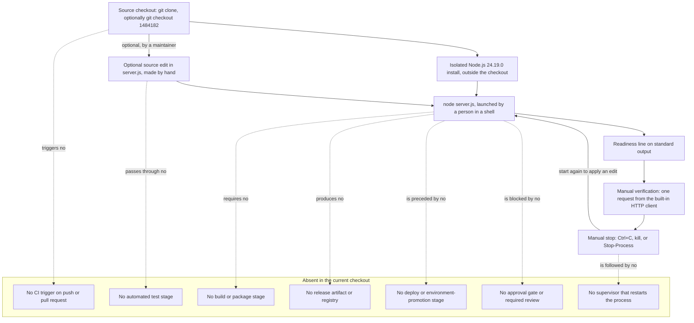

# DevOps

This is the DevOps area document for this repository. It answers one question:
what happens between a source file and a running process, and what does the
project not have in that space? Every step described here as working was
executed against this checkout under the runtime named below, and every
capability the project does not have is labelled as absent rather than
described as though it existed.

This document is also the complete operator command reference for the project.
The root [README](../../README.md) carries only the shortest successful first
run and links here for everything else, so the sections below are written to be
sufficient on their own.

## Verification baseline

<!-- markdownlint-disable MD013 -->

| Item | Value | Evidence |
| --- | --- | --- |
| Documentation baseline branch | `17-Aug-2026-Br1` | [.git/HEAD:ref] |
| Documentation baseline commit | `1484182` | [.:git rev-parse HEAD] |
| Commits reachable on that branch | Exactly one: `1484182 Add files via upload` | [.:git log] |
| Tracked files at that commit | `README.md` and `server.js`, nothing else | [.:git ls-files] |
| Tags in the checkout | None | [.:git for-each-ref] |
| Runtime used for every command below | Node.js 24.19.0 with its bundled npm 11.17.0, verified on August 17, 2026 | Observed on Node.js 24.19.0 on August 17, 2026 |
| Shells the commands were executed in | Windows PowerShell 5.1 on Windows Server 2025 Datacenter, version 10.0.26100, x64, and a GNU/Linux x86_64 shell on that same host | Observed on Node.js 24.19.0 on August 17, 2026 |
| Runtime version declared by the repository | None | [.:git ls-files] |

<!-- markdownlint-enable MD013 -->

The repository pins no runtime version. There is no `package.json`, lockfile,
`.nvmrc`, `.node-version`, or `.tool-versions` file to read one from
[.:git ls-files]. Node.js 24.19.0 was installed outside the checkout purely to
produce the results below: it is an external selection for this verification
run rather than repository policy, and nothing in the code demands that
particular build [server.js:1-14].

Every statement below carries exactly one evidence label:

- **Source-defined** — read directly from the code in this checkout.
- **Observed on Node.js 24.19.0 on August 17, 2026** — measured on the
  verification host on that date with that runtime installed. The same label
  covers host-level checks made during the same session, such as asking the
  operating system which process holds a port.
- **Absent in the current checkout** — verified to be missing from this
  checkout.
- **Recommendation** — a suggestion for future work, never a description of
  current behavior.

Values that differ from one run to the next are shown as variable fields
instead of being published as fixed facts. Process identifiers, response `Date`
headers, absolute temporary paths, and the internal frame line numbers inside a
runtime stack trace are all volatile, and none of them is a contract.

## Purpose and audience

Read this document when you need to *do* something to the program rather than
understand its internals. After working through it you can:

- acquire the source and confirm you have all of it;
- install a runtime able to execute it;
- start it, and prove from outside the process that it is serving;
- stop it, and start it again;
- recognise the three failures you are most likely to meet, and clear each one;
- follow the only workflow that exists for changing its behavior.

The boundary with the neighbouring document matters.
[The infrastructure area](./infrastructure.md) explains the *substrate*: what
must already exist on a machine before this process can start, and which
deployment tiers do not exist at all. This document explains the *workflow*:
the commands you type, in order, and what each one prints. If your question is
"what does this need?", read that document; if it is "what do I run?", you are
in the right place.

## Current-checkout scope

Everything below describes branch `17-Aug-2026-Br1` [.git/HEAD:ref] at commit
`1484182` [.:git rev-parse HEAD]. The remote is hosted on GitHub
[.git/config:remote "origin"] and other branches exist on it
[.:git for-each-ref]; none of them is described here, and no statement in this
document should be read as a claim about any branch other than this one.

## Terms used in this document

These terms appear below and are defined here once, so that no reader has to
infer them from context:

- A *checkout* is a local copy of the repository produced by `git clone`,
  together with the `.git` directory that holds its history.
- A *working tree* is the set of ordinary files in that copy — the ones you can
  edit. `git ls-files` lists the tracked members of it.
- A *foreground process* runs attached to the terminal that launched it: it
  holds that terminal until it ends, and the keystrokes you type there reach
  it. A *detached* or *background* process has been released from that
  relationship, so the terminal accepts further commands while it runs.
- `SIGINT` and `SIGTERM` are two requests an operating system can deliver to a
  process asking it to stop. `SIGINT` is what pressing Ctrl+C in a terminal
  sends; `SIGTERM` is the polite stop request tools send by default. A program
  may install a handler to run its own shutdown code when either arrives, or
  install none, in which case the runtime's default applies.
- A *build step* is any transformation applied to source before it can run —
  compiling, bundling, transpiling, or minifying.
- A *release artifact* is the fixed, versioned output of such a step, for
  example a tarball, a container image, or a published package. It is the thing
  you deploy and the thing you can go back to.
- A *rollback* is returning a running system to an earlier known state. It
  needs an earlier state to exist and be identifiable.
- *CI*, continuous integration, is automation that runs on every change —
  typically build, test, and lint — before the change is merged. *CD*,
  continuous delivery or deployment, is automation that takes an accepted
  change and puts it into a running environment.
- A *quality gate* is a check that must pass before a change is allowed
  through: a required test run, a lint rule, a coverage threshold, a security
  scan, or a required review.

## 1. Acquire the source

Clone the repository and enter it. Substitute the clone URL your own access
gives you for the placeholder:

```bash
git clone <repository-url> hao-backprop-test
cd hao-backprop-test
git ls-files
```

No URL is printed anywhere in this document on purpose. A Git remote URL can
embed an access token, and a credential must never be copied into
documentation; the remote for this project is hosted on GitHub
[.git/config:remote "origin"]. `cd` is written rather than a shell-specific
alternative because both shells in the verification baseline accept it.

The last command lists the tracked working tree, and at the documentation
baseline it is two files long:

```console
README.md
server.js
```

- **Observed on Node.js 24.19.0 on August 17, 2026:** cloning the repository
  and checking out commit `1484182` produced a working tree containing exactly
  those two tracked files, with `.git` as its only directory [.:git ls-files].
- **Source-defined:** `server.js` is the whole of the program — 14 lines, one
  file, no second module [server.js:1-14]. `README.md` is prose. There is
  nothing else to acquire.
- Documentation committed after that baseline commit appears as additional
  `docs/areas/*.md` paths in the same listing. The program itself is still
  those two files [server.js:1-14].

To pin your working tree to exactly the state this document describes, check
out the baseline commit by hash:

```bash
git checkout 1484182
```

```console
Note: switching to '1484182'.

You are in 'detached HEAD' state.
```

- **Observed on Node.js 24.19.0 on August 17, 2026:** that command left the
  clone on a detached `HEAD` at the baseline commit, and `git ls-files` then
  returned the same two files [.:git ls-files]. The advisory text about
  detached `HEAD` continues for several more lines; only its first lines are
  quoted here. The same command is the entire rollback mechanism this project
  has, which section 9 explains.

Two more commands are worth running immediately, because they tell you where
you are before anything else happens:

```bash
git log --oneline
git status --short
```

```console
1484182 Add files via upload
```

- **Observed on Node.js 24.19.0 on August 17, 2026:** on this branch
  `git log --oneline` printed that single line and nothing more [.:git log].
- **Observed on Node.js 24.19.0 on August 17, 2026:** `git status --short`
  printed nothing at all, which is how a clean working tree reports itself
  [.:git status].

## 2. Set up the runtime

- **Source-defined:** the only thing the program imports is Node's core `http`
  module [server.js:1], so exactly one piece of software has to be installed
  before it can run: a Node.js runtime.
- **Absent in the current checkout:** the repository does not say which version
  that should be. No `package.json`, lockfile, `.nvmrc`, `.node-version`, or
  `.tool-versions` file is tracked [.:git ls-files].

Node.js 24.19.0 is therefore an **external selection** made for this
verification run, not a repository requirement. Install it *outside* the
checkout so that the runtime can never be committed by accident, and prefer a
fresh install over whatever `node` already happens to be on your `PATH`: the
verification host carried an unrelated 22.x build that was deliberately not
used for any result in this document.

The substrate reasoning behind this prerequisite — why a runtime is the one
platform dependency, and what else the machine must provide — belongs to
[the infrastructure area](./infrastructure.md) and is not repeated here.

**POSIX shell.** Confirm the two bootstrap utilities, then unpack the runtime
into a task-local directory and put it first on `PATH`:

```bash
curl --version | head -1 && tar --version | head -1
RUNTIME_DIR="${TMPDIR:-/tmp}/hao-backprop-node-v24.19.0-linux-x64"
rm -rf "$RUNTIME_DIR" && mkdir -p "$RUNTIME_DIR"
curl -fsSL "https://nodejs.org/dist/v24.19.0/node-v24.19.0-linux-x64.tar.gz" \
  | tar -xz --strip-components=1 -C "$RUNTIME_DIR"
export PATH="$RUNTIME_DIR/bin:$PATH"
```

```console
curl 8.5.0 (x86_64-pc-linux-gnu) libcurl/8.5.0 ...
tar (GNU tar) 1.35
```

- **Observed on Node.js 24.19.0 on August 17, 2026:** those were the bootstrap
  versions on the Linux shell of the verification host; the remainder of the
  `curl` banner lists optional libraries and differs between builds, so it is
  abbreviated above. The download and extraction wrote only inside
  `$RUNTIME_DIR`, which is outside the checkout.

**Windows PowerShell.** The same idea with the Windows archive:

```powershell
$RuntimeDir = Join-Path $env:TEMP 'hao-backprop-node-v24.19.0-win-x64'
$Url = 'https://nodejs.org/dist/v24.19.0/node-v24.19.0-win-x64.zip'
if (Test-Path $RuntimeDir) { Remove-Item -Recurse -Force $RuntimeDir }
New-Item -ItemType Directory -Path $RuntimeDir | Out-Null
curl.exe -fsSL -o "$RuntimeDir\node.zip" $Url
tar.exe -xf "$RuntimeDir\node.zip" -C "$RuntimeDir" --strip-components=1
Remove-Item "$RuntimeDir\node.zip"
$env:PATH = "$RuntimeDir;$env:PATH"
```

- **Observed on Node.js 24.19.0 on August 17, 2026:** `curl.exe` must be
  written with its extension, because in Windows PowerShell the bare name
  `curl` is an alias for `Invoke-WebRequest` and does not accept these options.
  The utilities present on that host were `curl.exe` 8.16.0 and a
  libarchive-based `tar.exe`, not the GNU `tar` of the POSIX shell, which is
  why the two blocks differ.

Both `PATH` assignments affect the current shell only. A new terminal starts
without them, and forgetting that is the usual cause of the failure in
section 6.

Whichever block you used, assert the identity of what you installed before
going further:

```bash
node --version
npm --version
```

```console
v24.19.0
11.17.0
```

- **Observed on Node.js 24.19.0 on August 17, 2026:** both shells reported
  exactly those two values after the install above, and every result in the
  rest of this document was produced with that pair in front of the `PATH`. If
  you see anything else, stop and fix the `PATH` first — a different runtime
  can behave differently, and the repository pins nothing that would tell you
  which one is correct [.:git ls-files].

## 3. No project-package install

There is no dependency-installation step in this project. Two commands
demonstrate it:

```bash
git ls-files "package.json" "package-lock.json" "*.lock"
git ls-files ".nvmrc" ".node-version" ".tool-versions"
```

- **Observed on Node.js 24.19.0 on August 17, 2026:** each command printed
  nothing and exited zero, which is `git ls-files` reporting that no tracked
  path matches [.:git ls-files].
- **Absent in the current checkout:** with no manifest and no lockfile there is
  nothing for a package manager to resolve, so `npm install`, `npm ci`, and
  their equivalents have no input and no purpose here [.:git ls-files].
- **Source-defined:** the single `require` in the program names a module that
  ships inside the runtime itself [server.js:1], which is why no install is
  needed rather than merely skipped.

Read the framing precisely. **No project-package install** is not the same
claim as "no dependencies": the Node.js runtime from section 2 is a
dependency, and it is a mandatory one [server.js:1]. What the platform
dependency implies for the machine belongs to
[the infrastructure area](./infrastructure.md).

## 4. No build step

There is nothing to compile, bundle, transpile, or package before running:

```bash
git ls-files "Makefile" "*.mk" "Dockerfile" "docker-compose.yml"
```

- **Observed on Node.js 24.19.0 on August 17, 2026:** the command printed
  nothing and exited zero [.:git ls-files].
- **Absent in the current checkout:** no build script, task runner, bundler,
  transpiler, or `Makefile` is tracked, and because there is no manifest there
  is no `npm run build` to invoke either [.:git ls-files].
- **Source-defined:** the file is plain CommonJS JavaScript that the runtime
  executes as written [server.js:1-14]. Consequently the start command in
  section 5 is the whole of "build and run" for this project, and a source edit
  becomes live behavior with nothing between the two but a restart.

## 5. Start, verify, stop, and restart

This is the run cycle in full. One command starts the program, one proves from
outside that it is answering, one stops it, and starting it again is the same
command as the first.

### Start it in the foreground

From the root of the checkout, with the runtime from section 2 on your `PATH`:

```bash
node server.js
```

```console
Server running at http://127.0.0.1:3000/
```

- **Source-defined:** that line is printed from the success callback of
  `server.listen`, so its appearance means the bind succeeded [server.js:12-13].
- **Observed on Node.js 24.19.0 on August 17, 2026:** the process then held the
  terminal and printed nothing further, no matter how many requests it served.
  Leave it running and open a second terminal for the next step.
- Which stream that line uses, what its presence does and does not prove, and
  what its absence means belong to
  [the observability area](./observability.md).

### Verify that it is serving

Use Node's own HTTP client, so that verifying needs nothing you have not
already installed.

**POSIX shell.**

```bash
node -e 'require("http").get("http://127.0.0.1:3000/", (res) => {
  let body = "";
  res.on("data", (chunk) => { body += chunk; });
  res.on("end", () => console.log(res.statusCode,
    res.headers["content-type"], JSON.stringify(body)));
})'
```

**Windows PowerShell.** The same probe on one line, because PowerShell 5.1 does
not accept a multi-line single-quoted argument here — **Observed on Node.js
24.19.0 on August 17, 2026:** the multi-line form exited non-zero and printed
nothing, while the form below worked.

<!-- markdownlint-disable MD013 -->

```powershell
node -e "require('http').get('http://127.0.0.1:3000/', r => { let b = ''; r.on('data', c => b += c); r.on('end', () => console.log(r.statusCode, r.headers['content-type'], JSON.stringify(b))); })"
```

<!-- markdownlint-enable MD013 -->

```console
200 text/plain "Hello, World!\n"
```

- **Observed on Node.js 24.19.0 on August 17, 2026:** both shells printed
  exactly that. The status code, content type, and body are the three things
  the request callback sets [server.js:7-9].
- Which response fields the application sets and which the runtime adds is a
  wire-level question owned by [the networking area](./networking.md), and what
  a `200` does and does not prove is owned by
  [the observability area](./observability.md).

You can also ask the operating system whether the socket exists, which is a
different question from whether the program answers.

```bash
ss -ltn '( sport = :3000 )'
```

```console
State  Recv-Q Send-Q Local Address:Port Peer Address:PortProcess
LISTEN 0      511        127.0.0.1:3000      0.0.0.0:*
```

```powershell
Get-NetTCPConnection -LocalPort 3000 -State Listen |
  Select-Object LocalAddress, LocalPort, State, OwningProcess
```

```console
LocalAddress LocalPort  State OwningProcess
------------ ---------  ----- -------------
127.0.0.1         3000 Listen         <pid>
```

- **Observed on Node.js 24.19.0 on August 17, 2026:** one listening socket on
  `127.0.0.1:3000` and no other, in both shells [server.js:12]. The process
  identifier is different on every launch and is shown as a variable field.

### An optional convenience check

If `curl` happens to be installed, this is a shorter liveness check. It is
**optional**: the built-in client above is the supported path because it
requires nothing beyond the runtime.

```bash
curl -sS -o /dev/null -w '%{http_code}\n' http://127.0.0.1:3000/
```

```powershell
curl.exe -sS -o NUL -w "%{http_code}`n" http://127.0.0.1:3000/
```

```console
200
```

- **Observed on Node.js 24.19.0 on August 17, 2026:** both forms printed `200`.
  The PowerShell form needs the `.exe` suffix and a `NUL` device name, for the
  reasons given in section 2. Further `curl` examples that show whole responses
  live in [the networking area](./networking.md).

### Stop it

- **Source-defined:** the program installs no signal handler and no shutdown
  path. There is no `process.on`, no `server.close()`, and no `error` listener
  anywhere in the file [server.js:1-14]. Stopping is therefore entirely the
  runtime's default behavior, and no application code runs on the way out.

In the terminal holding a foreground process, press **Ctrl+C**. To stop a
detached process, address it by the identifier you captured when you started it:

```bash
kill "$SERVER_PID"
wait "$SERVER_PID"
echo "$?"
```

```console
143
```

- **Observed on Node.js 24.19.0 on August 17, 2026:** `kill` with no option
  sends `SIGTERM`, and the process ended with status `143`. Sending the signal
  Ctrl+C uses instead — `kill -INT "$SERVER_PID"` — ended it with status `130`.
  Both are the conventional 128-plus-signal-number results, and in both cases
  the port was released immediately with nothing extra printed [server.js:1-14].

```powershell
Stop-Process -Id $server.Id
```

- **Observed on Node.js 24.19.0 on August 17, 2026:** the process ended and its
  listening socket disappeared. Windows does not deliver these POSIX signals,
  so the process is terminated outright and reports no exit code of its own,
  which is consistent with there being no handler for one to run
  [server.js:1-14].

Confirm the port is free again, and that nothing answers:

```bash
ss -ltn '( sport = :3000 )'
node -e 'require("http").get("http://127.0.0.1:3000/")
  .on("error", (err) => console.log("client error:", err.code));'
```

```console
client error: ECONNREFUSED
```

- **Observed on Node.js 24.19.0 on August 17, 2026:** `ss` printed its header
  row and no listener, and the probe failed with `ECONNREFUSED` — the negative
  result to expect from a stopped process [server.js:12]. In PowerShell the
  equivalent check, `Get-NetTCPConnection -LocalPort 3000 -State Listen`,
  reports that no matching object was found by its CIM query, which is the same
  answer expressed as an error.

### Restart it

There is no restart command, and nothing to clean up first: stop the process
and start it again with the command from the beginning of this section.

- **Observed on Node.js 24.19.0 on August 17, 2026:** after a stop, a fresh
  `node server.js` printed the readiness line again and rebound the same port
  with no intermediate step [server.js:12-13].
- **Source-defined:** there is nothing to clean up between runs, because the
  program writes no file and holds nothing outside its own memory
  [server.js:1-14]. A restart therefore begins from exactly the same position as
  a first start.

### Run it detached and capture its output

A foreground process occupies a terminal and its output disappears with that
terminal. For anything longer than a quick check, start it detached and send
both streams to files **outside the checkout**, so that nothing you capture can
ever be committed.

```bash
LOG_DIR="${TMPDIR:-/tmp}/hao-backprop-logs"
mkdir -p "$LOG_DIR"
node server.js > "$LOG_DIR/server.out" 2> "$LOG_DIR/server.err" &
SERVER_PID=$!
```

```powershell
$LogDir = Join-Path $env:TEMP 'hao-backprop-logs'
New-Item -ItemType Directory -Force -Path $LogDir | Out-Null
$server = Start-Process -FilePath node -ArgumentList 'server.js' `
  -PassThru -NoNewWindow `
  -RedirectStandardOutput "$LogDir\server.out.log" `
  -RedirectStandardError "$LogDir\server.err.log"
```

- **Observed on Node.js 24.19.0 on August 17, 2026:** in both shells the
  captured standard-output file held the single readiness line and the captured
  standard-error file was empty for the whole life of a healthy process
  [server.js:13]. `$SERVER_PID` and `$server.Id` are the handles the stop
  commands above need, so capture them at launch.
- **Observed on Node.js 24.19.0 on August 17, 2026:** with the log directory
  outside the working tree, `git status --short` still reported nothing after
  the runs, meaning no captured output leaked into the repository
  [.:git status].

## 6. Failure paths

Three failures account for nearly every unsuccessful start. Each is recognised
by its output rather than by guesswork.

### The port is already in use

- **Observed on Node.js 24.19.0 on August 17, 2026:** launching a second copy
  while the first still held the port produced **no** readiness line and **no**
  standard output at all, a multi-line diagnostic on standard error, and exit
  status `1`. The first process was unaffected and kept answering `200`
  throughout [server.js:12].

```console
Error: listen EADDRINUSE: address already in use 127.0.0.1:3000
...
  code: 'EADDRINUSE',
  errno: <platform-specific negative number>,
  syscall: 'listen',
  address: '127.0.0.1',
  port: 3000
}

Node.js v24.19.0
```

- **Observed on Node.js 24.19.0 on August 17, 2026:** the captured standard
  error was 648 bytes in the Windows shell and 626 bytes in the Linux shell of
  the same host, and the `errno` field read `-4091` and `-98` respectively. That
  number is the platform's code for the condition, not a value the program
  chooses [server.js:1-14], and the frame line numbers in the omitted middle of
  the trace are positions inside the runtime build rather than in this
  repository's file.
- **Source-defined:** the runtime reports this rather than the program because
  no listener is attached to the server's `error` event [server.js:12-14]. The
  verbatim capture and the analysis of which emitter wrote which bytes belong to
  [the observability area](./observability.md); what follows here is the
  procedure.

Find out what holds the port:

```bash
ss -ltnp '( sport = :3000 )'
```

```powershell
$holder = Get-NetTCPConnection -LocalPort 3000 -State Listen
Get-Process -Id $holder.OwningProcess | Select-Object Id, ProcessName, Path |
  Format-List
```

```console
Id          : <pid>
ProcessName : node
Path        : <runtime directory>\node.exe
```

- **Observed on Node.js 24.19.0 on August 17, 2026:** the holder was the earlier
  `node` process, and its `Path` named the runtime installation executing it,
  which is worth reading when several runtimes exist on one machine. The POSIX
  command reports the same relationship by appending a `users:(...)` field that
  carries the holder's name, process identifier, and file descriptor.

Then decide between two cases:

- It is your own earlier instance. Stop it with the commands in section 5 and
  start again; **Observed on Node.js 24.19.0 on August 17, 2026:** the next
  launch bound the port normally.
- It is a different program. This one cannot be moved out of its way, because
  the address and port are source literals with no launch-time override
  [server.js:3-4]; why they cannot be supplied at startup belongs to
  [the networking area](./networking.md). Either free the port or change the
  source, which section 7 describes.

### The runtime is not on your PATH

```bash
node --version
```

- **Observed on Node.js 24.19.0 on August 17, 2026:** with the runtime absent
  from `PATH`, the POSIX shell answered `node: command not found` — prefixed by
  the shell's own name and the line number it was reading — and returned status
  `127`. PowerShell reports the same condition differently, as
  `The term 'node' is not recognized as the name of a cmdlet, function, script
  file, or operable program`. The wording varies by shell; the cause does not.
- The `PATH` assignment in section 2 applies only to the shell that ran it, so a
  new terminal needs it again. That is the most common reason for this message
  on a machine where the runtime is definitely installed.

### The command ran in the wrong directory

```bash
node server.js
```

```console
node:internal/modules/cjs/loader:1520
  throw err;
  ^

Error: Cannot find module '<current directory>/server.js'
```

- **Observed on Node.js 24.19.0 on August 17, 2026:** started from a directory
  that does not contain the file, the runtime exited with status `1` and named
  the absolute path it had tried. The path is shown as a variable field because
  it is whatever directory you happened to be in, and the `loader` line number
  is a position inside the runtime build rather than in this repository.
- Change into the root of the checkout and repeat: the file sits at the top level
  of the working tree [.:git ls-files].

## 7. Changing the code

The workflow for changing this program's behavior has three steps and no
shortcuts: **edit the source, stop the process, start it again.**

- **Source-defined:** every value that determines what the program does is a
  literal inside the file — the bind address and port [server.js:3-4] and the
  status code, content type, and response body [server.js:7-9]. The complete
  table of those literals is owned by
  [the application and runtime area](./application-runtime.md).
- **Source-defined:** the program reads no environment variable, no
  command-line option, and no configuration file, so none of those values can be
  supplied from outside [server.js:1-14]. Changing any of them means editing
  `server.js`.
- **Source-defined:** nothing in the file watches the filesystem, re-reads
  itself, or reloads configuration [server.js:1-14]. There is no hot reload, no
  watch mode, and no signal that makes a running process pick up a change; a
  running process therefore continues to serve the code it started with.
- **Absent in the current checkout:** there is no development-mode wrapper that
  would add reloading, because there is no manifest to declare one and no
  tooling is tracked [.:git ls-files].

The consequence is that the sequence is always the same:

1. Stop the running process — "Stop it" in section 5.
2. Edit `server.js`.
3. Start it again — "Start it in the foreground" in section 5.
4. Re-verify — "Verify that it is serving" in section 5, because nothing else
   will tell you whether the edit did what you intended
   [.:git ls-files].

**Making such an edit is out of scope for this documentation task.** `server.js`
is read as evidence here and is not modified by this work [server.js:1-14]; the
steps above describe the workflow a maintainer would follow, not something
performed while writing these documents. The acceptance checks a change ought
to satisfy belong to
[the testing and quality area](./testing-and-quality.md).

## 8. Source history on this branch

Everything in this section is scoped to branch `17-Aug-2026-Br1`
[.git/HEAD:ref]. The remote-tracking references in a clone show that other
branches exist [.:git for-each-ref]; nothing here describes any of them.

```bash
git log --oneline
git show --stat 1484182
git tag
```

```console
1484182 Add files via upload

 README.md |  2 ++
 server.js | 14 ++++++++++++++
 2 files changed, 16 insertions(+)
```

- **Observed on Node.js 24.19.0 on August 17, 2026:** `git log --oneline`
  printed exactly one line, so this branch has exactly one commit
  [.:git rev-parse HEAD]. `git show --stat 1484182` reported that the commit
  added both tracked files and nothing else; its header lines, which carry the
  author and date, are omitted above because this document does not publish
  personal data. `git tag` printed nothing: the checkout contains no tags at all
  [.:git for-each-ref].
- **Observed on Node.js 24.19.0 on August 17, 2026:** the references present for
  this branch at the baseline were the local branch and its `origin` tracking
  reference, both pointing at `1484182` [.:git for-each-ref].

What that means in practice: there is no development history to learn from on
this branch. No earlier revision of `server.js` exists, no commit message
explains a decision, and no sequence of changes shows intent [.:git log]. When
you need to know why the program is shaped the way it is, the code itself and
these area documents are the only available sources [server.js:1-14].

## 9. Release and rollback limits

- **Absent in the current checkout:** there is no version tag
  [.:git for-each-ref], no release artifact, no changelog, and no packaged build
  of any kind [.:git ls-files]. Nothing is published, so nothing can be
  downloaded and installed as a release.
- **Source-defined:** the unit of delivery is therefore the source checkout plus
  the separately installed runtime [server.js:1]. "Deploy" and "run" are the
  same action, described in section 5.
- **Observed on Node.js 24.19.0 on August 17, 2026:** the only rollback
  mechanism available is a source-level one: check out an earlier commit and
  start the process again. `git checkout 1484182` moved the working tree to the
  baseline and left a detached `HEAD`, after which `node server.js` served the
  code from that commit [.:git rev-parse HEAD].
- **Observed on Node.js 24.19.0 on August 17, 2026:** on this branch that
  mechanism has no target. There is exactly one commit [.:git log], so there is
  no earlier state of the program to return to; an unwanted local edit can be
  discarded with `git restore server.js`, which returns the file to that single
  commit and prints nothing when it succeeds, but there is no previous version
  of the program to fall back to. This is a limit observed in the current
  checkout, not a recommendation.

Because no artifact exists, a rollback is always a source action followed by a
manual restart, and nothing brings the process back on its own. The substrate
reason for that last point — no supervisor and no restart policy — belongs to
[the infrastructure area](./infrastructure.md).

## 10. Absent CI/CD and quality gates

Every row below is **Absent in the current checkout**. The status column repeats
that label deliberately, so that no row can be skimmed as though it described
something that exists. Nothing in this table was created in order to be
documented; each row is a gap recorded as a gap.

<!-- markdownlint-disable MD013 -->

| Capability | Status | Evidence | Consequence today |
| --- | --- | --- | --- |
| Continuous integration workflow | Absent in the current checkout | There is no `.github` directory at all — not an empty one — and no other pipeline definition of any kind is tracked [.:git ls-files] | Nothing runs when a change is pushed or proposed. A change is checked only by the person making it, and only if they choose to |
| Continuous delivery or deployment automation | Absent in the current checkout | No workflow, deployment script, or environment target is tracked [.:git ls-files] | There is no automated path from a commit to a running process. Every run begins with a person typing the start command from section 5 |
| Automated build stage | Absent in the current checkout | No build script, manifest, or `Makefile` is tracked [.:git ls-files] | There is nothing to automate, as section 4 establishes; a build stage would have no input and no output |
| Automated test stage | Absent in the current checkout | No test file, test directory, or runner configuration is tracked [.:git ls-files] | No change is ever proven not to break the one response the program produces [server.js:6-10]. The manual checks in section 5 are the only verification that exists |
| Lint or formatting gate | Absent in the current checkout | No linter or formatter configuration is tracked [.:git ls-files] | Nothing enforces style or catches an obvious error in source before it runs |
| Dependency or security scanning | Absent in the current checkout | No scanner configuration is tracked, and there is no manifest for one to read [.:git ls-files] | Nothing watches for advisories affecting the one dependency the program has, which is the runtime itself [server.js:1] |
| Artifact registry or package publication | Absent in the current checkout | Nothing is packaged and no registry or publish configuration is tracked [.:git ls-files] | There is nothing to publish, promote, or retrieve by version, as section 9 states |
| Environment promotion, such as development to staging to production | Absent in the current checkout | No environment definition of any kind is tracked [.:git ls-files] | A change is tried in exactly one place: the machine in front of you |
| Release versioning and changelog | Absent in the current checkout | No tag exists [.:git for-each-ref] and no changelog file is tracked [.:git ls-files] | No revision of the program has any name other than its commit hash |
| Branch protection or required review | Absent in the current checkout | Nothing in the checkout expresses a branch rule; such settings live on the hosting service and are not visible from a clone [.:git ls-files] | This document makes no claim in either direction about server-side settings, because none is discoverable from the repository itself |
| Pull-request template or contribution guide | Absent in the current checkout | No `.github` directory and no contribution document is tracked [.:git ls-files] | The change process is undocumented anywhere except in this file |
| Project Git hooks enforcing checks | Absent in the current checkout | The only hooks present in the clone are the Git LFS hooks that Git installs itself; no project hook is tracked or shared by the repository [.git/hooks] | Nothing blocks a commit locally, and hooks would not travel with the repository even if one were added by hand |

<!-- markdownlint-enable MD013 -->

## 11. Documentation validation

The documentation in this repository is validated by commands a maintainer runs
**ad hoc**, never by committed automation. No configuration file, manifest, or
lockfile exists for any of these tools, and none is added by running them
[.:git ls-files]; each is invoked at an exact version through `npx`, and every
cache and output path stays outside the checkout.

Lint every Markdown file in the documentation set:

```bash
npx --yes markdownlint-cli2@0.23.2 "README.md" "docs/areas/*.md"
```

- **Observed on Node.js 24.19.0 on August 17, 2026:** the command identified
  itself as `markdownlint-cli2 v0.23.2 (markdownlint v0.41.1)`, printed how many
  files it had found, and reported each finding as a file, a line, and a rule
  identifier. It exits non-zero when it finds anything, and that non-zero exit is
  the signal to fix the file it names — a heading that is not surrounded by blank
  lines and a file that does not end in a single newline are both typical
  findings.
- **Observed on Node.js 24.19.0 on August 17, 2026:** narrowed to this document
  alone, `npx --yes markdownlint-cli2@0.23.2 "docs/areas/devops.md"` reported
  `0 issues` and exited zero, which is the state every file in the set is
  expected to be kept in.
- **Observed on Node.js 24.19.0 on August 17, 2026:** with the cache directory
  set outside the working tree, `git status --short` reported no change other
  than the documentation file being edited, so the tool wrote nothing of its own
  into the repository [.:git status].

Check every link in the documentation set:

```bash
find README.md docs/areas -name '*.md' -print0 \
  | xargs -0 -n1 npx --yes markdown-link-check@3.15.0
```

- **Observed on Node.js 24.19.0 on August 17, 2026:** the tool prints one result
  line per link and exits non-zero if any link is dead. A relative link to an
  area document that has not yet been committed is reported as dead until that
  file lands, which makes the check useful while a documentation set is being
  assembled.
- A single file can be checked the same way, which is the quicker loop while
  editing one document:

```bash
npx --yes markdown-link-check@3.15.0 docs/areas/devops.md
```

Validate a Mermaid diagram without a browser preview, by rendering its fenced
body to a temporary file outside the checkout:

```bash
npx --yes @mermaid-js/mermaid-cli@11.16.0 \
  -i /tmp/diagram.mmd -o /tmp/diagram.svg
```

- **Observed on Node.js 24.19.0 on August 17, 2026:** the tool renders through a
  headless browser, so one has to be available to it. Run exactly as above, with
  no browser installed for it to use, it exited `1` and reported
  `Could not find chrome-headless-shell`.

Point it at a browser that already exists on the machine and it succeeds:

```powershell
$env:PUPPETEER_EXECUTABLE_PATH = '<path to an installed Chrome or Chromium>'
npx --yes @mermaid-js/mermaid-cli@11.16.0 `
  -i "$env:TEMP\diagram.mmd" -o "$env:TEMP\diagram.svg"
```

- **Observed on Node.js 24.19.0 on August 17, 2026:** with that variable set to
  the Chrome installed on the verification host — written as a placeholder above
  because the path is specific to a machine — the command exited `0`, printed
  `Generating single mermaid chart`, and wrote the SVG outside the checkout.
  `npx --yes @mermaid-js/mermaid-cli@11.16.0 --version` reported `11.16.0`,
  confirming that the pinned version was the one that ran.
- Copy each diagram's fenced body into the temporary `.mmd` file one at a time,
  check the exit status, then overwrite it with the next diagram, and delete both
  temporary files when you are done.
- **Absent in the current checkout:** no rendered image and no diagram source
  file is tracked in this repository, and validating a diagram must not add one
  [.:git ls-files].

## 12. Recommendations

Everything in this section is advisory. Nothing in it is implemented, and no
sentence here describes current behavior. Sections 1 to 11 are the current
state; these are possible responses to it, ordered so that each is useful before
the next is attempted.

- **Recommendation:** declare a runtime version in the repository so that the
  baseline stops being an external selection and two engineers cannot silently
  run different builds [.:git ls-files].
- **Recommendation:** add a manifest with a `start` script, so the start command
  is discoverable from the repository itself rather than only from this document.
- **Recommendation:** add one automated check before adding any pipeline: start
  the process, send a single request, assert the status code and body, stop the
  process. It would cover the only behavior the program has [server.js:6-10],
  and it is the smallest thing that could ever gate a change.
- **Recommendation:** only then add a continuous-integration workflow that runs
  that check on every change. A pipeline with nothing to run is ceremony, and it
  would produce a green result that means nothing.
- **Recommendation:** attach a listener to the server's `error` event before
  automating any start, so that a failed bind is reported by the program with an
  intentional exit status rather than as a runtime stack trace [server.js:12-14].
  The signal reasoning belongs to [the observability area](./observability.md).
- **Recommendation:** make the bind address and port configurable before
  attempting a supervisor, a second instance, or any exposure beyond the local
  machine, because today both are source literals [server.js:3-4].
- **Recommendation:** introduce tags or another release identifier once more than
  one commit of the program exists, so that a rollback has a target with a name
  instead of only a hash [.:git for-each-ref].
- **Recommendation:** keep the table in section 10 as the checklist. Each row
  that becomes real should move out of it and into a current-state section above,
  with its own evidence and its own verification date.

## Manual change-to-run flow



Every solid edge in that diagram is a step someone performs by hand, and each
was executed for this document: the checkout produced two tracked files
[.:git ls-files], the isolated runtime reported `v24.19.0` and `11.17.0`, the
launch printed the readiness line from the `listen` success callback
[server.js:12-13], one request returned the callback's fixed response
[server.js:7-9], and a manual stop released the port
(**Observed on Node.js 24.19.0 on August 17, 2026**). The loop from `STOP` back
to `RUN` is the entire deployment mechanism for a change, because no build stage
stands between source and execution [server.js:1-14]. Every dashed edge leads
into the `ABSENT` block, which exists so the diagram cannot be misread as
showing a stage that merely happens to be conventional: none of those seven
components is present, because the checkout tracks two files at the baseline
commit, has no `.github` directory, and defines no pipeline of any kind
[.:git ls-files].

## Source map and related areas

Lines this document cites: [server.js:1] for the single core-module import,
which is why there is a runtime to install but no package to install;
[server.js:3-4] for the address and port literals that make a port conflict
unavoidable rather than configurable; [server.js:7-9] for the response the
verification step asserts; [server.js:12-13] for the `listen` call whose success
callback prints the readiness line an operator waits for; and [server.js:12-14]
for the absent server `error` listener that makes a failed bind surface as a
runtime trace. Whole-file claims cite [server.js:1-14], checkout-wide absence
claims cite [.:git ls-files], history claims cite [.:git log],
[.:git rev-parse HEAD], and [.:git for-each-ref], working-tree cleanliness cites
[.:git status], the branch cites [.git/HEAD:ref], the hosting of the remote cites
[.git/config:remote "origin"], and the local-hook inventory cites [.git/hooks].

Every absence claim above is scoped to this checkout at the baseline commit, and
every command result is scoped to Node.js 24.19.0 in the two shells named in the
verification baseline. Re-run the affected commands, and update the verification
date, after any runtime upgrade, any change to `server.js`, or any change to the
tools in section 11.

Continue reading:

- [The project README](../../README.md) — prerequisites, the shortest first run,
  troubleshooting, terminology, and the map of all area documents.
- [Infrastructure](./infrastructure.md) — what a machine must provide before any
  command here can work, the single-process model, and the deployment tiers that
  do not exist.
- [Observability](./observability.md) — the readiness line these procedures wait
  for, the runtime output a failed bind produces, and what a successful request
  does and does not prove.
- [Testing and quality](./testing-and-quality.md) — the acceptance matrix that
  reuses these commands as checks, and the automated testing this project does
  not yet have.
