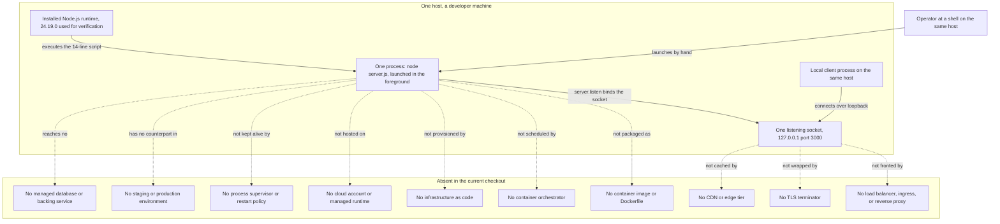

# Infrastructure

This is the infrastructure area document for this repository. It answers one
question: what must already exist on a machine before this program can run,
and what deployment substrate the project does not have. The honest answer to
the second half is "almost none of it", and every missing piece below is
labelled as missing rather than described as if it were present.

## Verification baseline

<!-- markdownlint-disable MD013 -->

| Item | Value | Evidence |
| --- | --- | --- |
| Documentation baseline commit | `1484182` — `Add files via upload` | [.:git log -1 --oneline 1484182] |
| Files tracked at that commit | `README.md` and `server.js`, nothing else | [.:git ls-tree -r --name-only 1484182] |
| Directories at that commit | None; no tracked path had a directory component | [.:git ls-tree -r --name-only 1484182] |
| Program files, at that commit and now | One: `server.js`; the directories added since then hold Markdown documents only | [.:git ls-tree -r --name-only 1484182] [.:git ls-files] |
| Runtime used for every observation below | Node.js 24.19.0, verified on August 17, 2026 | Observed on Node.js 24.19.0 on August 17, 2026 |
| Host the observations were made on | Linux x86_64 (Ubuntu 24.04.4 LTS), reported by `uname -srm` as `Linux 6.18.33.2-microsoft-standard-WSL2 x86_64` | Observed on Node.js 24.19.0 on August 17, 2026 |
| Runtime version declared by the repository | None | [.:git ls-files] |

<!-- markdownlint-enable MD013 -->

The repository contains no `package.json`, lockfile, `.nvmrc`,
`.node-version`, or `.tool-versions` file, so it pins no Node.js version
[.:git ls-files]. Node.js 24.19.0 was installed outside the checkout purely to
produce the observations below; this document does not present it as a
repository requirement, and a different Node.js build is not ruled out by
anything in the code [server.js:1-14].

The host named above is where the observations happened, not a requirement.
The 14 lines contain no filesystem path, no shell invocation, no signal
handling, and no operating-system-specific call, so the script itself imposes
no platform-specific requirement [server.js:1-14].

Every statement below carries exactly one evidence label:

- **Source-defined** — read directly from the code in this checkout.
- **Observed on Node.js 24.19.0 on August 17, 2026** — measured by running
  that code under that runtime on that date.
- **Absent in the current checkout** — verified to be missing from this
  checkout.
- **Recommendation** — a suggestion for future work, never a description of
  current behavior.

Process identifiers differ on every launch and are therefore not published
here as fixed facts.

## Purpose and audience

Read this document when you need to know what a machine has to provide before
`server.js` can start, and what the project would still need before it could
be deployed anywhere other than the machine you are sitting at.

This document covers the **substrate** — the things that must already exist
for the process to start, and the tiers that do not exist at all. The commands
you type to acquire, start, verify, stop, and change the program are a
different concern and are owned by [the DevOps area](./devops.md); if you came
here looking for a command to run, that is the document you want.

For the operator-facing prerequisite steps and the shortest successful first
run, start from [the project README](../../README.md); this document does not
repeat them.

## Terms used in this document

These terms are used below and are defined here once, because a new engineer
should not have to infer them from context:

- A *host* is one machine — physical or virtual — with its own operating
  system and its own network addresses.
- An *operating-system process* is one running instance of a program, with its
  own memory and its own process identifier assigned by the operating system.
- The *event loop* is the single scheduler inside a Node.js process that runs
  your JavaScript and then waits for events before running more of it. A
  Node.js process runs your JavaScript on exactly one such loop.
- A *TCP socket* is one endpoint of a network connection. A *listening socket*
  is a socket that has been attached to a local address and port and is
  accepting inbound connections.
- To *bind* is to claim a specific local address and port for a listening
  socket. Only one socket on a host may hold a given address-and-port pair at
  a time.
- A *port collision* is the failure that results when a program tries to bind
  an address and port that another program already holds.
- A *process supervisor* is a separate piece of software whose job is to start
  a program, notice when it exits, and start it again — `systemd`, `pm2`, a
  Windows service, and a container restart policy are all examples.
- *Orchestration* is the scheduling of containerised processes across a pool
  of hosts, with placement, health checking, and replacement handled for you;
  Kubernetes, Amazon ECS, and Nomad are examples.
- *Infrastructure as code*, abbreviated IaC, is the practice of declaring the
  hosts, networks, and managed services a system needs in version-controlled
  files that a tool applies — Terraform, CloudFormation, and Pulumi are
  examples.

## Actual local topology

"Infrastructure" for this project means a developer machine. The repository
provides none of its own: it tracks no environment definition, no provisioning
file, and no deployment target of any kind [.:git ls-files]. Nothing stops
somebody from running the program on a shared or hosted machine — it is a
14-line script with no platform-specific call in it [server.js:1-14] — but
nothing in the repository describes, provisions, or supports doing so, and this
document does not describe an environment the repository does not define.
Reading the word "infrastructure" as "the servers this runs on" would therefore
be misleading: there is one machine, and it is whichever machine an engineer
launches the program on.

- **Source-defined:** the whole program is one file that constructs one HTTP
  server and binds it to one hard-coded address and port [server.js:3-4,12].
- **Observed on Node.js 24.19.0 on August 17, 2026:** launching it produced
  exactly one operating-system process — the Node.js executable with
  `server.js` on its command line — and that process had zero child processes
  [server.js:1-14].
- **Observed on Node.js 24.19.0 on August 17, 2026:** that process held
  exactly one listening socket, on `127.0.0.1` port `3000`, and no other
  listening socket at all [server.js:12].
- **Absent in the current checkout:** there is no second tier. Nothing tracked
  in the repository describes a proxy, a queue, a database, a cache, or a
  second process — the baseline commit tracked only `server.js` and `README.md`
  [.:git ls-tree -r --name-only 1484182], and every path added since then is a
  Markdown document [.:git ls-files].

The complete inventory of the running system is therefore short enough to
tabulate:

<!-- markdownlint-disable MD013 -->

| Element of the topology | What it actually is here | Evidence |
| --- | --- | --- |
| Host | One machine, the one an engineer launches the program on | Observed on Node.js 24.19.0 on August 17, 2026 |
| Runtime | An installed Node.js build; 24.19.0 was used for verification and is not repository-pinned | [.:git ls-files] |
| Process | One `node server.js` process, started by hand, with zero children | Observed on Node.js 24.19.0 on August 17, 2026 |
| Listening socket | Exactly one, on `127.0.0.1` port `3000` | Observed on Node.js 24.19.0 on August 17, 2026 |
| Client | Any process on that same host; the loopback bind admits no other origin | Source-defined [server.js:3] |
| Everything else | Nothing | Absent in the current checkout [.:git ls-files] |

<!-- markdownlint-enable MD013 -->

## Prerequisites for running the program

There are exactly two prerequisites, and then nothing.

### A Node.js runtime must be installed

- **Source-defined:** the only thing the program imports is Node's core
  `http` module [server.js:1]. That makes a Node.js runtime the one hard
  platform dependency: without it there is nothing to execute the file.
- **Absent in the current checkout:** the repository states no supported
  version. There is no `package.json`, lockfile, `.nvmrc`, `.node-version`, or
  `.tool-versions` file to read one from [.:git ls-files].
- **Observed on Node.js 24.19.0 on August 17, 2026:** Node.js 24.19.0 ran the
  file successfully and is the baseline for every observation in this
  document. It was selected externally for that purpose, and this document
  does not claim the repository requires it [.:git ls-files].
- **Source-defined:** no particular operating system is required by the code.
  Its 14 lines reference no path, no shell, no signal, and no
  platform-specific API [server.js:1-14].

The commands that install a runtime and start the process belong to
[the DevOps area](./devops.md), and the shortest first-run path belongs to
[the project README](../../README.md).

### TCP port 3000 must be free on loopback

- **Source-defined:** the port is the literal `3000` [server.js:4] and the
  bind address is the literal `127.0.0.1` [server.js:3]. Neither can be
  supplied at launch, so the machine must have that exact pair available.
- **Observed on Node.js 24.19.0 on August 17, 2026:** with no listener on port
  `3000` beforehand, the bind succeeded and the operating system reported the
  new listening socket on `127.0.0.1:3000` [server.js:12].
- **Observed on Node.js 24.19.0 on August 17, 2026:** with the port already
  held, a second launch did not bind. It printed no readiness line and exited
  with a non-zero status, while the first process kept its socket and carried
  on [server.js:4,12].
- **Observed on Node.js 24.19.0 on August 17, 2026:** once the holding process
  ended, port `3000` had no listener again and the next launch bound normally
  [server.js:12].

The exact diagnostic text a port collision produces, and what an operator
should do about it, are not restated here: the procedure belongs to
[the DevOps area](./devops.md) and the runtime's error output belongs to
[the observability area](./observability.md). Why the address and port cannot
be changed at launch belongs to
[the networking area](./networking.md#why-the-address-and-port-cannot-be-changed-at-launch).

### Nothing else has to be installed

- **Absent in the current checkout:** there are **no declared application
  package dependencies**. The checkout tracks no manifest and no lockfile, so
  there is no dependency list to resolve and no install step before the first
  run [.:git ls-files].
- **Source-defined:** the single `require` in the file names a module that
  ships inside the runtime [server.js:1], which is why no install step is
  needed rather than merely skipped.

Read that precisely. "No declared application package dependencies" is not the
same as "no dependencies": the Node.js runtime itself is a dependency, and
because it supplies the HTTP implementation the program uses, it is the whole
of the platform surface this program stands on [server.js:1].

## Process and concurrency model

The substrate this program occupies is one process on one machine. That single
sentence has consequences a new engineer should understand before planning any
load against it.

- **Source-defined:** one operating-system process runs the whole program.
  Searching all 14 lines finds no `cluster`, no `worker_threads`, no
  `child_process`, and no `fork` call, so the program never creates a second
  process or a second thread of JavaScript execution [server.js:1-14].
- **Observed on Node.js 24.19.0 on August 17, 2026:** the launched process had
  zero child processes, and exactly one `node` process on the host had
  `server.js` on its command line [server.js:1-14].
- **Source-defined:** all inbound connections are therefore served by one
  event loop. Because the program creates no additional thread or process, the
  loop that runs the request callback is the only place application work can
  happen [server.js:1-14].
- **Observed on Node.js 24.19.0 on August 17, 2026:** the process held exactly
  one listening socket, on `127.0.0.1` port `3000`, so there is one entry
  point into that loop and no second one [server.js:12].
- **Absent in the current checkout:** the repository provides nothing that
  starts a second instance — no supervisor configuration, no clustering
  configuration, and no orchestration definition [.:git ls-files]. A person can
  of course run the start command twice, but two instances in the same network
  namespace collide on the fixed address and port, as the observation below
  records.

The practical readings for a new engineer are these:

- **Source-defined:** capacity is bounded by that one event loop on that one
  host. Adding load does not recruit more processes, because nothing in the
  program creates one [server.js:1-14] and nothing in the checkout can start
  one either [.:git ls-files].
- **Observed on Node.js 24.19.0 on August 17, 2026:** two instances cannot
  coexist in the same network namespace as written. Both claim the same address
  and port [server.js:3-4,12], and a second launch against a held port exited
  non-zero without binding.
- **Absent in the current checkout:** restarting is the only recovery action
  available, and it is a manual one, because no supervisor exists to perform it
  [.:git ls-files]. Its consequences are set out in the implications section
  below.

### Why no capacity numbers appear here

This document deliberately publishes no CPU, memory, thread-count, or
throughput figures. None were measured under conditions that would make them
meaningful, and a number attached to a 14-line fixture would be read as a
capacity guarantee it cannot support. What is documented instead is the
structure that any such number would have to be interpreted against: one host,
one process, one event loop, one listening socket
[server.js:1-14] [server.js:12].

## Listener activation

This document is the primary owner of one line of the program: the `listen`
call [server.js:12]. It is the boundary between a program that merely exists
in memory and a program the machine has committed a resource to.

- **Source-defined:** `http.createServer(...)` on line 6 builds a server
  object but claims nothing from the operating system; no port is held after
  that statement runs [server.js:6].
- **Source-defined:** `server.listen(port, hostname, () => { ... })` is the
  statement that turns that object into a bound listening socket, using the
  two constants declared on lines 3 and 4 [server.js:12].
- **Observed on Node.js 24.19.0 on August 17, 2026:** once that call had
  completed, the operating system reported one listening socket for the
  process, on `127.0.0.1` port `3000` — and reported none before it
  [server.js:12].
- **Source-defined:** this is the statement whose normal success depends
  specifically on the availability of an address and port: the machine must have
  `127.0.0.1:3000` free for it to bind [server.js:3-4,12]. It is not the only
  line with an environmental dependency — the runtime and its core `http` module
  must be present for line 1 to resolve [server.js:1], and line 13 needs a
  usable standard-output stream [server.js:13] — but it is the only one that
  competes for a machine resource another program can already be holding
  [server.js:1-14].
- **Absent in the current checkout:** no listener is attached to the server's
  `error` event, so the program does not handle a failed bind itself
  [server.js:12-14].

Three neighbouring concerns are deliberately not covered here:

- What the bound address means on the wire, and who can reach it, belongs to
  [the networking area](./networking.md).
- The readiness line the success callback prints belongs to
  [the observability area](./observability.md).
- The operator procedure for starting, verifying, and restarting the process
  belongs to [the DevOps area](./devops.md).

## Local deployment topology

Everything inside `HOST` was observed on a single machine: an installed runtime
executed the script as one foreground process, the `listen` call bound one
socket, and a client on the same host connected to it
(**Observed on Node.js 24.19.0 on August 17, 2026**) [server.js:12]. Every
dashed edge leads into the `ABSENT` block, which exists so the diagram cannot
be misread as showing a tier that is merely conventional: none of those ten
components is defined anywhere in the repository, whose only tracked
non-documentation path is `server.js` [.:git ls-files]. The operator
appears in the diagram on purpose — a human launching a command is the only
thing that starts this system, and nothing in the checkout replaces that role
[.:git ls-files].

## Absent infrastructure capabilities

Every row below is **Absent in the current checkout**. The status column
repeats that label deliberately, so that no row can be skimmed as though it
described something that exists. Nothing in this table was created in order to
be documented; each row is a gap recorded as a gap.

<!-- markdownlint-disable MD013 -->

| Capability | Status | Evidence | Implication today |
| --- | --- | --- | --- |
| Container image or `Dockerfile` | Absent in the current checkout | No `Dockerfile`, `docker-compose.yml`, `compose.yaml`, or `.dockerignore` is tracked [.:git ls-files] | The repository supplies no image definition, so an image would have to be authored outside it. The only unit of deployment the repository itself offers is the source checkout plus a separately installed runtime [server.js:1] |
| Container orchestration such as Kubernetes, Amazon ECS, or Nomad | Absent in the current checkout | No `k8s/`, `kubernetes/`, `helm/`, or `charts/` path is tracked; the only tracked directory holds Markdown documents [.:git ls-files] | Nothing schedules, health-checks, replaces, or scales the process. Its placement is simply whichever machine an engineer ran it on |
| Infrastructure as code such as Terraform, CloudFormation, or Pulumi | Absent in the current checkout | No `terraform/`, `infra/`, or `deploy/` path and no declarative infrastructure file of any kind is tracked [.:git ls-files] | No host, network, or managed service is declared anywhere, so the substrate cannot be recreated from the repository — only described, as here |
| Cloud provider account or managed runtime | Absent in the current checkout | Nothing in the checkout names a provider, region, project, or managed platform [.:git ls-files], and the program binds a loopback address [server.js:3] | The repository names no hosted target, so any hosting would have to be provided and configured outside it — and a loopback bind would make the result unreachable from off-host until that line changed [server.js:3]. As the repository stands, the machine an engineer launches it on is the entire environment |
| Load balancer or ingress | Absent in the current checkout | No such definition is tracked [.:git ls-files], and one process holds one socket [server.js:12] | No traffic distribution and no failover. The single process is the only thing that can answer. The wire-level consequence is covered by [networking](./networking.md) |
| TLS termination | Absent in the current checkout | No terminator, certificate store, or key material is tracked [.:git ls-files], and the program imports the plaintext `http` module rather than `https` [server.js:1] | The repository supplies no terminator and no key material, so encrypted transport would have to come from something placed in front of the process from outside it. The wire posture is covered by [networking](./networking.md) |
| Process supervisor or auto-restart, such as `systemd`, `pm2`, or a container restart policy | Absent in the current checkout | No service definition, unit file, or process-manager configuration is tracked [.:git ls-files]. **Observed on Node.js 24.19.0 on August 17, 2026:** no operating-system service and no scheduled task referenced the process or the checkout, and after the process was stopped nothing started it again | A crash, a closed shell, or a machine restart leaves nothing running until a person launches it again |
| Horizontal scaling or multi-instance deployment | Absent in the current checkout | The bind pair is two source literals [server.js:3-4]. **Observed on Node.js 24.19.0 on August 17, 2026:** a second launch against the held port exited non-zero without binding [server.js:12] | A second copy cannot start in the same network namespace without editing the source, so the repository offers no capacity beyond the single event loop |
| Environment separation for development, staging, and production | Absent in the current checkout | No environment definition, profile, or per-environment substrate of any kind is tracked, and the program selects no behavior by environment [.:git ls-files] [server.js:1-14] | The repository describes exactly one place for the program to run — the machine in front of you — so it offers nowhere to try a change before trying it there |
| Secret management | Absent in the current checkout | No secret store, vault reference, or injection mechanism is tracked by the repository [.:git ls-files], and the program takes no credential from its surroundings [server.js:1-14] | There is no credential to protect yet, and no mechanism ready if one were introduced. The mechanism would have to come first |
| Backup and disaster recovery | Absent in the current checkout | No backup, snapshot, or restore definition of any kind is tracked [.:git ls-files] | Recovery consists of launching the process again on some machine. No recovery objective, procedure, or target is defined |
| Monitoring agent or metrics collector installed alongside the process | Absent in the current checkout | Nothing in the checkout installs, configures, or references an agent, exporter, or collector [.:git ls-files] | The substrate reports nothing about the process, so liveness has to be established by hand. The signals the program itself emits are covered by [observability](./observability.md) |
| A repository-pinned runtime version | Absent in the current checkout | No `package.json`, lockfile, `.nvmrc`, `.node-version`, or `.tool-versions` file is tracked [.:git ls-files] | Two engineers can run two different Node.js builds and neither is wrong by the repository's own account, which is why every runtime observation in these documents names its version |

<!-- markdownlint-enable MD013 -->

## Implications

What the substrate above means in day-to-day terms:

- **Observed on Node.js 24.19.0 on August 17, 2026:** the service exists only
  while a launched process stays alive. After the process was stopped, port
  `3000` had no listener at all and nothing on the host started a replacement
  [server.js:12].
- **Observed on Node.js 24.19.0 on August 17, 2026:** the process ran as an
  ordinary foreground child of the shell that launched it, registered as no
  operating-system service and no scheduled task. Closing that shell or
  restarting the machine therefore ends the service, and nothing on that host
  brought it back [server.js:1-14].
- **Source-defined:** nothing is reachable from another host, because the
  program binds the loopback address [server.js:3]. The probe evidence for
  that boundary, and what it would take to change it, belong to
  [the networking area](./networking.md).
- **Observed on Node.js 24.19.0 on August 17, 2026:** there is no redundancy of
  any kind — one process, one socket, one host [server.js:12]. Any single
  failure is a total outage of the fixture.
- **Absent in the current checkout:** there is no rollback target other than
  the source checkout itself, because no build artifact, image, or release is
  produced [.:git ls-files]. How source history relates to what is running
  belongs to [the DevOps area](./devops.md).
- **Source-defined:** every prerequisite is a manual precondition. Somebody has
  to have installed a runtime [server.js:1] and to know that port `3000` is
  free [server.js:4]; nothing checks either on the program's behalf
  [server.js:1-14].

None of this is a defect in the program. The repository describes itself as a
test project for integration purposes [README.md:3], and a loopback fixture
that a person starts by hand is a reasonable shape for that. The gaps matter
only at the moment somebody wants it to keep running without being watched.

## Recommendations

Everything in this section is advisory. Nothing in it is implemented, and no
sentence here describes current behavior. The limitations above are the current
state; these are possible responses to them, listed in the order the
dependencies fall.

- **Recommendation:** decide the substrate before any exposure beyond
  loopback. Four questions have no answer in the checkout today — what runs
  the process, what keeps it alive, what terminates TLS, and which environment
  it belongs to [.:git ls-files]. Answering them is prerequisite to the rest of
  this list.
- **Recommendation:** make the bind address and port configurable before
  introducing a supervisor, a second instance, or a load balancer. While both
  values are source literals [server.js:3-4], none of those additions can be
  made without editing the program.
- **Recommendation:** declare a runtime version in the repository so that the
  substrate becomes reproducible and runtime observations no longer depend on
  an externally chosen baseline [.:git ls-files].
- **Recommendation:** add a process supervisor with a restart policy before
  anyone depends on the program being up. It is the smallest change that turns
  a manual launch into a service, and it addresses the auto-restart gap
  directly.
- **Recommendation:** treat container packaging, orchestration, and
  infrastructure as code as later steps that only pay off once a target
  environment actually exists. Adding them now would document a deployment the
  project does not have.
- **Recommendation:** keep this document's absent-capability table as the
  checklist. Each row that becomes real should move out of that table and into
  the current-state sections above, with its own evidence.

## Source map and related areas

Lines this document cites: [server.js:1] for the core `http` import that makes
the runtime the one platform dependency, [server.js:3] for the loopback bind
address as a substrate constraint, [server.js:4] for the TCP port that must be
free, [server.js:6] for the server construction that claims no port yet, and
[server.js:12] for the `listen` call this document owns as the moment the
machine commits a resource. The absent server `error` listener cites
[server.js:12-14]. Whole-file claims cite [server.js:1-14], absence claims
about the checkout as it stands cite [.:git ls-files], the repository's own
purpose statement cites [README.md:3], and the baseline commit and its file list
cite [.:git log -1 --oneline 1484182] and
[.:git ls-tree -r --name-only 1484182]. Branch names, remote URLs, and clone
hooks are never cited, because they belong to an individual clone rather than to
tracked content; [the project README](../../README.md#current-checkout) explains
that once for the whole set.

Every absence claim above is scoped to this checkout at the baseline commit,
and every observation is scoped to Node.js 24.19.0 on the host named in the
verification baseline. Re-run the checks before carrying any of it to a
different runtime or a different machine.

Continue reading:

- [The project README](../../README.md) — prerequisites, quick start,
  troubleshooting, terminology, and the map of all area documents.
- [Networking](./networking.md) — what the bound socket exposes, who can reach
  it, and why the address and port cannot be changed at launch
  [server.js:3-4,12].
- [DevOps](./devops.md) — the commands that acquire, start, verify, stop, and
  restart the process, and the release and rollback limits that follow from
  having no build artifact.
- [Observability](./observability.md) — the readiness line the `listen` success
  callback prints, and what the runtime writes when a bind fails
  [server.js:12-13].
- [Application and runtime](./application-runtime.md) — the process lifecycle
  in detail and the table of all five hard-coded values, including the two this
  document treats as substrate constraints [server.js:3-4].
