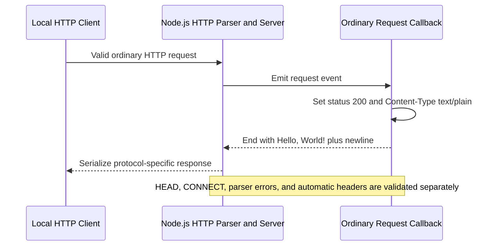
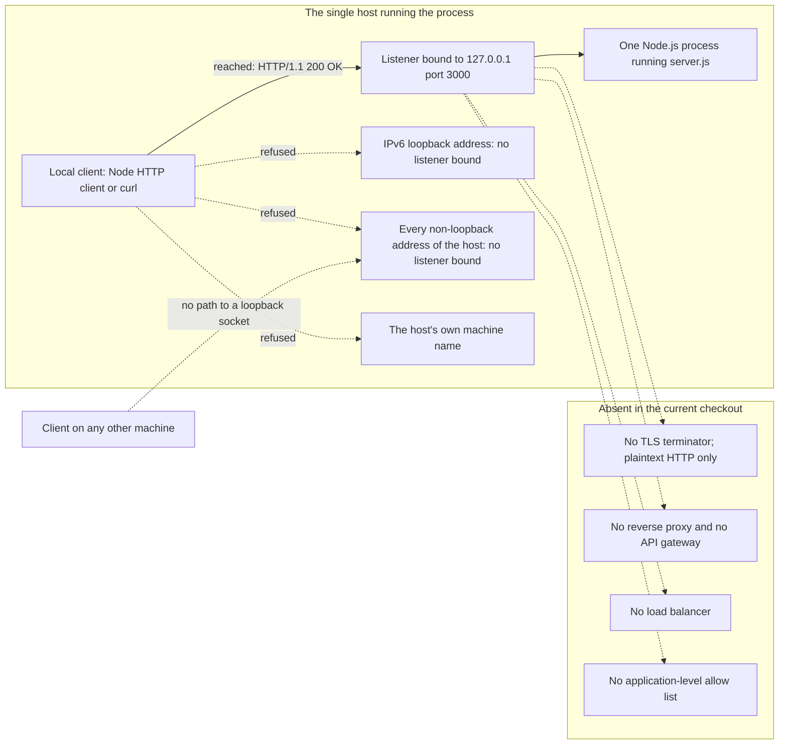

# Networking

This is the networking area document for this repository. It is the
authoritative account of what the program puts on the wire: what its listener
exposes, what an ordinary HTTP request receives, and which parts of that
exchange belong to the application rather than to the Node.js runtime
underneath it.

## Verification baseline

<!-- markdownlint-disable MD013 -->

| Item | Value | Evidence |
| --- | --- | --- |
| Documentation baseline commit | `1484182` — `Add files via upload` | [.:git log -1 --oneline 1484182] |
| Files tracked at that commit | `README.md` and `server.js`, nothing else | [.:git ls-tree -r --name-only 1484182] |
| Program files, at that commit and now | One: `server.js` | [.:git ls-tree -r --name-only 1484182] [.:git ls-files] |
| Runtime used for every observation below | Node.js 24.19.0, verified on August 17, 2026 | Observed on Node.js 24.19.0 on August 17, 2026 |
| HTTP parser inside that runtime | llhttp 9.4.3, as reported by `process.versions.llhttp` | Observed on Node.js 24.19.0 on August 17, 2026 |
| Host every observation below was made on | Linux x86_64 (Ubuntu 24.04.4 LTS), reported by `uname -srm` as `Linux 6.18.33.2-microsoft-standard-WSL2 x86_64` | Observed on Node.js 24.19.0 on August 17, 2026 |
| Runtime version declared by the repository | None | [.:git ls-files] |

<!-- markdownlint-enable MD013 -->

The repository contains no `package.json`, lockfile, `.nvmrc`,
`.node-version`, or `.tool-versions` file, so it pins no Node.js version
[.:git ls-files]. Node.js 24.19.0 was selected externally in order to produce
the observations below, and this document does not present it as a repository
requirement. Protocol behavior attributed to the runtime is specific to the
version named in its label; do not carry any of it forward to a different
Node.js build without re-running the checks. The host is named for the same
reason: the wire behavior recorded here did not vary with it, but the set of
addresses the reachability check found belongs to that one machine.

Every statement below carries exactly one evidence label:

- **Source-defined** — read directly from the code in this checkout.
- **Observed on Node.js 24.19.0 on August 17, 2026** — measured by running
  that code under that runtime on that date.
- **Absent in the current checkout** — verified to be missing from this
  checkout.
- **Recommendation** — a suggestion for future work, never a description of
  current behavior.

Values that differ on every run — the `Date` header, process identifiers, and
a client's ephemeral source port — appear as angle-bracketed placeholders such
as `<http-date>` rather than as a frozen value copied from one run.

## Purpose and audience

Read this document when you need to know what this program looks like from the
network. It answers three questions:

- What does the process expose, and who can reach it?
- What does an ordinary HTTP request get back, byte for byte?
- Which parts of that exchange did the application decide, and which did the
  Node.js runtime decide on its own?

The third question is the reason this document exists. The application layer of
this program is three statements long [server.js:7-9]; nearly everything else a
client observes is produced by the runtime. Sibling area documents deliberately
defer the protocol evidence to this file.

For prerequisites, the quick-start commands, and troubleshooting, start from
[the project README](../../README.md); this document does not repeat them.

Four terms describe the listening side, and are defined here once:

- A *TCP port* is a 16-bit number that distinguishes one network service from
  another on the same host.
- A *bind address* is the local IP address a server attaches itself to. A
  server accepts only connections that arrive at an address it is bound to.
- *Loopback* is the address range a host reserves for talking to itself;
  `127.0.0.1` is its usual IPv4 address, and traffic sent to it never leaves
  the host.
- A *listener* is a socket that has been bound to an address and port and is
  accepting inbound connections.

Three more describe the response side:

- The *status line* is a response's first line: protocol version, numeric
  status code, and a reason phrase, as in `HTTP/1.1 200 OK`.
- A *header* is one `Name: value` line following the status line; the *body*
  is the payload after the blank line that ends the headers.
- *Keep-alive* is HTTP/1.1's default of leaving the TCP connection open after
  a response so that the next request can reuse it.

Two runtime components are named repeatedly:

- The *HTTP parser* turns inbound bytes into a request the runtime can
  dispatch, and rejects bytes it cannot parse. In this runtime it is llhttp
  9.4.3 (**Observed on Node.js 24.19.0 on August 17, 2026**).
- The *serializer* turns the application's status code, headers, and body back
  into response bytes, adding whatever the protocol requires.

## Bind address and listener

- **Source-defined:** the bind address is the literal string `127.0.0.1`
  [server.js:3].
- **Source-defined:** the TCP port is the literal number `3000`
  [server.js:4].
- **Source-defined:** both are passed positionally to
  `server.listen(port, hostname, callback)`, so one listener is created for
  that single address-and-port pair [server.js:12].
- **Observed on Node.js 24.19.0 on August 17, 2026:** the resulting listener
  described itself as address `127.0.0.1`, family `IPv4`, port `3000`, and the
  operating system reported exactly one listening socket for the process, on
  `127.0.0.1:3000` [server.js:12].

### What the listener exposes

**Source-defined, and the one rule worth memorising:** this server answers on
exactly one address — the IPv4 loopback address it was bound to, `127.0.0.1`
[server.js:3] — and on no other. A listening socket has no presence on an
address it was not bound to, so no other address of the host, and no address of
any other host, offers a path to it [server.js:3,12].

Two consequences follow, and both matter more than any address list:

- A client that resolves `localhost` to the IPv6 loopback address `::1` and does
  not fall back to IPv4 will not reach this server. The bind is IPv4-only, and
  nothing in the code requests a second family [server.js:1-14].
- This is a *reachability boundary*, not authentication. Nothing in the code
  identifies, authenticates, or authorizes a caller [server.js:1-14], so any
  client whose connection does arrive is served identically. The posture that
  follows belongs to [the security area](./security.md).

The rule was measured rather than assumed. Every address the verification host
exposed was probed on port `3000`, and the results split exactly as the rule
predicts:

<!-- markdownlint-disable MD013 -->

| Target probed on port 3000 | Result | Label |
| --- | --- | --- |
| The bound address, `127.0.0.1` | Reached; answered `HTTP/1.1 200 OK` | Observed on Node.js 24.19.0 on August 17, 2026 |
| The name `localhost` | Reached; answered `HTTP/1.1 200 OK`, but only after the client fell back to the IPv4 entry of a two-entry lookup | Observed on Node.js 24.19.0 on August 17, 2026 |
| `[::1]`, the IPv6 loopback address | Not reached; the connection was refused | Observed on Node.js 24.19.0 on August 17, 2026 |
| Every non-loopback address of that host — both of the interface addresses it exposes | Not reached; every connection was refused with `ECONNREFUSED` | Observed on Node.js 24.19.0 on August 17, 2026 |
| The host's own machine name | Not reached; the connection was refused with `ECONNREFUSED` rather than timing out | Observed on Node.js 24.19.0 on August 17, 2026 |

<!-- markdownlint-enable MD013 -->

Read that table as confirmation, not as a specification. The exact addresses are
not published because they belong to one machine, and the interface counts are
recorded only to show that the sweep was exhaustive on the host it ran on; your
machine will have a different set. What carries forward is the durable rule
above: the bound loopback address answered and nothing else did
(**Observed on Node.js 24.19.0 on August 17, 2026**) [server.js:3,12].

### Why the address and port cannot be changed at launch

- **Absent in the current checkout:** there is no way to override the address
  or the port when starting the process. The 14 lines contain no
  `process.env`, no `process.argv`, and no configuration read of any kind
  [server.js:1-14].
- **Source-defined:** changing either value means editing the source and
  restarting [server.js:3-4]. The table of all five hard-coded values, and
  what changing each one costs, is owned by
  [the application and runtime area](./application-runtime.md#configuration-constants);
  this document covers only what the two network values mean on the wire.
- **Observed on Node.js 24.19.0 on August 17, 2026:** because the pair is
  fixed, a second copy of the program cannot start while the first holds the
  socket. The runtime reported `EADDRINUSE` for the `listen` call on
  `127.0.0.1:3000`, and the first listener continued to answer requests
  normally [server.js:12]. The operator procedure and the exact diagnostic
  text belong to [the DevOps area](./devops.md) and
  [the observability area](./observability.md).

## Ordinary request-handler contract

An *ordinary request* is an inbound HTTP request that the runtime parses
successfully and then dispatches to the application. The callback registered on
line 6 is what receives it [server.js:6].

**Source-defined:** that callback performs exactly three operations, in this
order, and nothing else [server.js:7-9]:

1. Sets the response status code to `200` [server.js:7].
2. Sets one response header, `Content-Type: text/plain` [server.js:8].
3. Ends the response with the body `Hello, World!\n`, meaning the text
   `Hello, World!` followed by a single newline [server.js:9].

- **Observed on Node.js 24.19.0 on August 17, 2026:** thirteen ordinary
  requests spanning `GET`, `POST`, `OPTIONS`, `PUT`, `DELETE`, `PATCH`, and
  `TRACE`, aimed at `/`, at `/anything/else`, and at `/?q=1&x=2`, each received
  status `200`, `Content-Type: text/plain`, and a 14-byte body that was
  byte-identical in every case [server.js:6-10].
- **Observed on Node.js 24.19.0 on August 17, 2026:** request bodies sent with
  `POST`, `PUT`, and `PATCH` changed nothing in the response, and an additional
  request header supplied by the probe changed nothing either
  [server.js:6-10].

This is the *ordinary request handler*, and it is deliberately not presented
here as an HTTP contract for all traffic. Several protocol cases never reach
lines 7 to 9, and one of them receives no HTTP response at all; they are
recorded in [the protocol and method matrix](#protocol-and-method-matrix)
below. The rule behind that split is stated in
[the application and runtime area](./application-runtime.md#application-versus-runtime-boundary),
and this document is the evidence for it.

## Request attributes the handler never reads

**Source-defined:** the callback declares a request parameter and never
dereferences it. The identifier `req` appears once, in the parameter list on
line 6, and nowhere else in the file [server.js:6-10].

Everything a client can put into a request is therefore ignored.

<!-- markdownlint-disable MD013 -->

| Request attribute | Read by the application? | Evidence |
| --- | --- | --- |
| Method, such as `GET` or `POST` | No | Source-defined [server.js:6-10] |
| URL path | No | Source-defined [server.js:6-10] |
| Query string | No | Source-defined [server.js:6-10] |
| Request headers | No | Source-defined [server.js:6-10] |
| Request body | No; the request stream is never read | Source-defined [server.js:6-10] |
| Cookies, credentials, or any authentication material | No | Source-defined [server.js:1-14] |

<!-- markdownlint-enable MD013 -->

- **Observed on Node.js 24.19.0 on August 17, 2026:** the practical
  consequence is that every ordinary request receives an identical answer
  regardless of what it asked for, which the thirteen-request sweep above
  demonstrates [server.js:6-10].
- There is no routing, so `/anything/else` is answered exactly as `/` is
  (**Observed on Node.js 24.19.0 on August 17, 2026**). What that means for
  data handling is covered in
  [the data and state area](./data-and-state.md); what it means for input
  validation and trust is covered in [the security area](./security.md).

## Source-set response fields

**Source-defined:** these three properties are the only parts of the response
the application decides [server.js:7-9].

| Response field | Value the application sets | Evidence |
| --- | --- | --- |
| Status code | `200` | Source-defined [server.js:7] |
| `Content-Type` header | `text/plain` | Source-defined [server.js:8] |
| Body | `Hello, World!\n`, 14 bytes | Source-defined [server.js:9] |

- **Observed on Node.js 24.19.0 on August 17, 2026:** the body arrived as the
  14 bytes `48 65 6c 6c 6f 2c 20 57 6f 72 6c 64 21 0a`, which is
  `Hello, World!` followed by one line feed and no carriage return
  [server.js:9].
- **Absent in the current checkout:** no character set is declared. The header
  value is exactly `text/plain`, with no `; charset=` parameter
  [server.js:8].

## Runtime-generated response fields

**Source-defined:** the application sets nothing in this section. None of the
header names below, and no response-framing or connection option, appears
anywhere in the 14 lines [server.js:1-14]. Every row was produced by the
runtime's serializer and its connection handling.

<!-- markdownlint-disable MD013 -->

| Response property | What the runtime produced | Label |
| --- | --- | --- |
| Response protocol version | `HTTP/1.1`, including in the answer to an HTTP/1.0 request | Observed on Node.js 24.19.0 on August 17, 2026 |
| Reason phrase in the status line | `OK`, appended to the application's numeric `200` | Observed on Node.js 24.19.0 on August 17, 2026 |
| `Date` | `<http-date>`, a fresh timestamp generated for each response | Observed on Node.js 24.19.0 on August 17, 2026 |
| `Content-Length` | `14` on ordinary HTTP/1.1 responses; absent from `HEAD` responses and from HTTP/1.0 responses | Observed on Node.js 24.19.0 on August 17, 2026 |
| `Connection` | `keep-alive` when the client allowed reuse; `close` when the client asked to close, on HTTP/1.0, and on runtime-generated errors | Observed on Node.js 24.19.0 on August 17, 2026 |
| `Keep-Alive` | `timeout=5`, sent only alongside `Connection: keep-alive` | Observed on Node.js 24.19.0 on August 17, 2026 |
| `Transfer-Encoding` | `chunked`, seen only on the runtime's missing-`Host` error response, which carried an empty chunked body | Observed on Node.js 24.19.0 on August 17, 2026 |
| Header order on an ordinary response | `Content-Type`, then `Date`, then `Connection`, then `Keep-Alive` when present, then `Content-Length` | Observed on Node.js 24.19.0 on August 17, 2026 |
| `Server` and `X-Powered-By` | Neither header was sent on any response | Observed on Node.js 24.19.0 on August 17, 2026 |
| Connection reuse | A keep-alive client issued two requests over a single connection; the client's source port was identical for both | Observed on Node.js 24.19.0 on August 17, 2026 |
| Request pipelining | Two HTTP/1.1 requests written back-to-back on one connection were both answered, in order | Observed on Node.js 24.19.0 on August 17, 2026 |

<!-- markdownlint-enable MD013 -->

A complete ordinary keep-alive response looked like the block below. `Date` is
shown as a placeholder because its value changes on every response:

```text
HTTP/1.1 200 OK
Content-Type: text/plain
Date: <http-date>
Connection: keep-alive
Keep-Alive: timeout=5
Content-Length: 14

Hello, World!
```

Only the `Content-Type` line and the body text were chosen by the application
[server.js:8-9]. The reason phrase, the `Date`, both connection headers, and
the `Content-Length` were added by the runtime (**Observed on Node.js 24.19.0
on August 17, 2026**).

## Ordinary request lifecycle

<!-- markdownlint-disable MD013 -->



<!-- markdownlint-enable MD013 -->

The three operations inside the callback are source-defined [server.js:6-10];
the parse that precedes them and the serialization that follows are the
runtime's. That is why the note is on the diagram: the arrow from the callback
back to the runtime carries a status code, one header, and a body, and the
arrow from the runtime to the client can carry considerably more than that, or
in some cases nothing at all. The next section records each of those cases.

## Protocol and method matrix

Each row was exercised against a running process under the isolated runtime.
Ordinary requests used Node's built-in HTTP client; the raw cases were written
byte by byte over a TCP socket so that no client library could normalize them.
The final column is the point of the table: it separates what the application
decided from what the runtime decided.

<!-- markdownlint-disable MD013 -->

| Case | How it was exercised | Observed result on Node.js 24.19.0 | Who defines it |
| --- | --- | --- | --- |
| HTTP/1.1 `GET`, `POST`, `OPTIONS` on `/` and on `/anything/else` | Built-in HTTP client, one request per method and path | Reached the callback. `200 OK`, `Content-Type: text/plain`, 14-byte body `Hello, World!` plus newline, identical for every method and path | Status, content type, and body: application callback [server.js:7-9]. Framing, `Date`, and connection headers: Node serializer |
| `HEAD` on `/` and on `/anything/else` | Built-in HTTP client, and separately `curl -I` | Reached the callback and returned `200 OK` with `Content-Type` and `Date`, but **no body** and **no `Content-Length`**, even though the callback calls `res.end('Hello, World!\n')` [server.js:9] | Body suppression and the dropped `Content-Length`: Node serializer. The callback ran unchanged [server.js:7-9] |
| `CONNECT` | Raw socket: `CONNECT 127.0.0.1:3000 HTTP/1.1` with a `Host` header | **Zero response bytes.** The runtime closed the connection about four milliseconds after the request, sending no status line at all. The case was re-run with a fifteen-second client budget to confirm that the server, not the client, ended the connection | Node runtime alone. `CONNECT` is dispatched to a separate event, and no such listener is registered [server.js:1-14], so the ordinary callback never ran |
| HTTP/1.1 `Upgrade` | Raw socket: `GET / HTTP/1.1` with `Connection: Upgrade`, `Upgrade: websocket`, and the WebSocket key and version headers | Routed to the **ordinary callback**: `200 OK`, `Content-Type: text/plain`, `Connection: keep-alive`, `Keep-Alive: timeout=5`, `Content-Length: 14`, and the usual body. No `101` and no protocol switch. The runtime then closed the idle connection after about six seconds | Routing decision: Node runtime, because no upgrade listener is registered [server.js:1-14]. Response content: application callback [server.js:7-9] |
| Unknown or malformed method token | Raw socket, three variants: the unrecognized token `FROBNICATE`, the invalid token `GE(T`, and a request line that was not HTTP at all | All three produced a byte-identical 47-byte reply, `HTTP/1.1 400 Bad Request` with `Connection: close`, **no `Date` and no `Content-Length`**, followed immediately by connection close | Node HTTP parser alone, before dispatch. The callback never ran, and no code in this checkout influences the result [server.js:1-14] |
| HTTP/1.1 without a `Host` header | Raw socket: `GET / HTTP/1.1` and an immediate blank line | A **different** 117-byte `400 Bad Request`: `Connection: close`, then a `Date` header, then `Transfer-Encoding: chunked` and an empty chunked body, then close | Node runtime alone, at a later stage than the parser-token rejection above. The callback never ran [server.js:1-14] |
| HTTP/1.0 `GET` | Raw socket, twice: once with no `Host`, once with `Host` and `Connection: keep-alive` | Both reached the callback and returned `200 OK` **answered as `HTTP/1.1`**, with `Content-Type`, `Date`, `Connection: close`, **no `Content-Length`** — the body was framed by the connection close instead — and no `Keep-Alive` header. The keep-alive request was not honored | Version negotiation, framing, and the connection decision: Node serializer. Status, content type, and body: application callback [server.js:7-9] |
| Header block larger than the runtime's limit | Raw socket: one 20 000-byte request header | `HTTP/1.1 431 Request Header Fields Too Large` with `Connection: close`, 67 bytes, then close. The callback never ran | Node runtime alone, enforcing `http.maxHeaderSize`. The application declares no request-size policy [server.js:1-14] |
| Second listener on port 3000 | Started a second copy of the program while the first held the socket | The second `listen` failed with `EADDRINUSE` for `127.0.0.1:3000`; the first listener kept answering requests, and the host still showed exactly one listening socket | Node runtime and the operating system. The address and port are fixed literals [server.js:3-4], and no listener is attached to the server's error event [server.js:12-14]. Operator handling belongs to [DevOps](./devops.md) and [observability](./observability.md) |
| Non-loopback address | Connected to every address the host exposed, plus its machine name — see [What the listener exposes](#what-the-listener-exposes) | Only `127.0.0.1` and a `localhost` name that fell back to IPv4 were reached. The IPv6 loopback address, both non-loopback interface addresses, and the machine name were all refused with `ECONNREFUSED` | The bind address [server.js:3] as passed to `listen` [server.js:12]. Nothing in the code widens it [server.js:1-14] |
| Termination | Terminated the process, then reconnected | The listening socket was released: the host showed no listener on `127.0.0.1:3000`, and a fresh connection was refused | Node runtime default. No signal handler and no graceful-close call exists [server.js:1-14]; the operator view belongs to [DevOps](./devops.md) and [testing and quality](./testing-and-quality.md) |

<!-- markdownlint-enable MD013 -->

### Two different 400 responses

The matrix contains two distinct `400 Bad Request` shapes, and telling them
apart is worth a moment because it tells you how far a request travelled before
it was rejected (**Observed on Node.js 24.19.0 on August 17, 2026**):

```text
HTTP/1.1 400 Bad Request
Connection: close

```

The 47-byte form above answers an unparseable request line — a bad or unknown
method token, or bytes that are not HTTP. It carries no `Date`, which is a
useful fingerprint: the runtime rejected the bytes before building a normal
response.

```text
HTTP/1.1 400 Bad Request
Connection: close
Date: <http-date>
Transfer-Encoding: chunked

0

```

The 117-byte form above answers a syntactically valid HTTP/1.1 request that
lacks the mandatory `Host` header. It does carry a `Date`, and it uses a
chunked body containing a single zero-length chunk.

Neither response involves the application. The callback sets one header and one
body and cannot produce either of these shapes [server.js:7-9], and there is no
error-handling code anywhere in the file [server.js:1-14].

### Optional convenience commands

The mandatory checks above used Node's own HTTP client, so reproducing them
needs no client beyond the runtime itself. The commands below are **optional
convenience commands** that were also run during verification, using the
`curl` build that happened to be present on the verification host; the
complete operator command reference belongs to
[the DevOps area](./devops.md).

```bash
curl -isS http://127.0.0.1:3000/
curl -isS -X POST http://127.0.0.1:3000/anything/else
curl -sS -I http://127.0.0.1:3000/
```

- **Observed on Node.js 24.19.0 on August 17, 2026:** the first two printed the
  same `200 OK` response as the built-in client, including
  `Connection: keep-alive` and `Keep-Alive: timeout=5`.
- **Observed on Node.js 24.19.0 on August 17, 2026:** the third, a `HEAD`
  request, printed `200 OK` with no `Content-Length` and no body, matching the
  matrix row above.
- **Observed on Node.js 24.19.0 on August 17, 2026:** the same command aimed at
  the host's routable IPv4 address failed to connect, which is the reachability
  boundary again [server.js:3,12].

## Timeouts and other runtime defaults

`server.js` sets no timeout, header-size, request-size, connection, or socket
policy of its own — none of these property names appears anywhere in the 14
lines [server.js:1-14]. That does not mean the limits are missing; it means
they belong to the runtime. Every value below was read off the live server
object that `server.js` created [server.js:6] once it was listening
[server.js:12], and each is a Node.js 24.19.0 default.

The table's inclusion criterion is deliberate rather than illustrative. It lists
every property and option the runtime exposes on that live server object which
governs how a request is accepted, framed, or limited, or how long a connection
lives, plus the one module-level value in the same category,
`http.maxHeaderSize`. Nineteen entries meet it. Properties carrying no policy —
the bound address, the `listening` flag, the internal connection bookkeeping —
are excluded, as is everything the application sets for itself, which
[Source-set response fields](#source-set-response-fields) owns. Read a "Live
value" of `null` or `undefined` as *this program set no override*, not as *no
limit exists*: several of those unset slots still have a runtime default behind
them, and the rows say so.

<!-- markdownlint-disable MD013 -->

| Runtime setting | Live value | What it governs | Label |
| --- | --- | --- | --- |
| `server.timeout` | `0` | Inactivity timeout on an accepted socket; `0` means the runtime applies no socket-inactivity limit of its own | Observed on Node.js 24.19.0 on August 17, 2026 |
| `server.headersTimeout` | `60000` ms | How long a client may take to finish sending the request headers | Observed on Node.js 24.19.0 on August 17, 2026 |
| `server.requestTimeout` | `300000` ms | How long a client may take to send an entire request | Observed on Node.js 24.19.0 on August 17, 2026 |
| `server.keepAliveTimeout` | `5000` ms | How long an idle keep-alive connection is retained after a response; this is the value advertised as `Keep-Alive: timeout=5` | Observed on Node.js 24.19.0 on August 17, 2026 |
| `server.keepAliveTimeoutBuffer` | `1000` ms | Grace period added on top of the keep-alive timeout. The runtime closes an idle keep-alive socket at `keepAliveTimeout + keepAliveTimeoutBuffer`, so the deadline in force here is 6000 ms rather than 5000 ms — which is exactly what the observed close below measures | Observed on Node.js 24.19.0 on August 17, 2026 |
| `server.connectionsCheckingInterval` | `30000` ms | How often the runtime sweeps connections to apply the headers and request timeouts. It is the sweep granularity for those two only, which is why a 60-second headers timeout surfaces later than 60 seconds; the keep-alive close above runs on its own per-socket timer and is not swept | Observed on Node.js 24.19.0 on August 17, 2026 |
| `server.maxHeadersCount` | `null` | Per-server override for the maximum number of request headers. `null` means this program sets no override — not that no count-based cap applies. Node's HTTP API documents a default of `2000` for this property, and the ceiling measured under this runtime was 1000 headers, because the runtime's internal counter counts each header's name and its value as separate entries. The measurement is below | Observed on Node.js 24.19.0 on August 17, 2026 |
| `server.maxRequestsPerSocket` | `0` | A cap on requests served per connection; `0` means the runtime applies no per-connection request cap | Observed on Node.js 24.19.0 on August 17, 2026 |
| `server.maxConnections` | `undefined` | A cap on concurrent connections; unset, so the runtime enforces no connection cap of its own | Observed on Node.js 24.19.0 on August 17, 2026 |
| `http.maxHeaderSize` | `16384` bytes | Maximum total size of a request's header block; exceeding it produced the `431` row in the matrix above. It is a size limit, and is enforced independently of the count ceiling in the row above | Observed on Node.js 24.19.0 on August 17, 2026 |
| `server.requireHostHeader` | `true` | Whether the runtime rejects an HTTP/1.1 request that carries no `Host` header before dispatching it. It is on, which is what produces the second, 117-byte `400` shape in the matrix above | Observed on Node.js 24.19.0 on August 17, 2026 |
| `server.shouldUpgradeCallback` | Present but unset (`undefined`) | An optional hook that decides whether a request carrying `Upgrade` is handled as a protocol upgrade. Unset, and with no `upgrade` listener registered, the runtime delivered such a request to the ordinary callback — the `Upgrade` row of the matrix above. Set to a function returning `true`, the same request produced zero response bytes instead | Observed on Node.js 24.19.0 on August 17, 2026 |
| `server.insecureHTTPParser` | `undefined` | Whether the lenient parser is used, which would accept invalid headers and non-conforming framing. Unset, so the strict parser is in force — the parser that rejects the malformed method tokens in the matrix above | Observed on Node.js 24.19.0 on August 17, 2026 |
| `server.joinDuplicateHeaders` | `undefined` | Whether repeated headers of the same name are joined into one comma-separated value. Unset, so the runtime's own default applies; either way the choice is invisible to a client here, because the callback reads no header at all [server.js:6-10] | Observed on Node.js 24.19.0 on August 17, 2026 |
| `server.rejectNonStandardBodyWrites` | `false` | Whether writing a body on a response that may not carry one raises an error. It is off, so the body the callback ends with [server.js:9] is dropped silently on a `HEAD` response instead of failing — the `HEAD` row of the matrix above. Switched on, the same request raised `ERR_HTTP_BODY_NOT_ALLOWED` and answered with nothing | Observed on Node.js 24.19.0 on August 17, 2026 |
| `server.noDelay` | `true` | Whether Nagle's algorithm is disabled on accepted sockets, so small responses are sent without waiting to coalesce | Observed on Node.js 24.19.0 on August 17, 2026 |
| `server.keepAlive` | `false` | Whether TCP-level keep-alive probes are enabled on accepted sockets; distinct from HTTP keep-alive, which is active | Observed on Node.js 24.19.0 on August 17, 2026 |
| `server.keepAliveInitialDelay` | `0` | Delay before the first TCP keep-alive probe, which is moot while the setting above is `false` | Observed on Node.js 24.19.0 on August 17, 2026 |
| `server.highWaterMark` | `65536` bytes | Internal buffering threshold for socket streams | Observed on Node.js 24.19.0 on August 17, 2026 |

<!-- markdownlint-enable MD013 -->

Two further facts about the live object make the ownership boundary concrete
(**Observed on Node.js 24.19.0 on August 17, 2026**): the server carried
exactly one request listener, and zero listeners for the error, upgrade,
connect, client-error, continue, and timeout events. The single request
listener is the callback on line 6 [server.js:6]; every empty slot is a place
where the runtime's default behavior is the only behavior, which is precisely
what the `CONNECT`, upgrade, and bind-conflict rows of the matrix show.

The runtime also recognizes a fixed set of 35 request method tokens. The
unrecognized token used in the matrix, `FROBNICATE`, is not among them, which
is why it was answered with a parser-generated `400` rather than being passed
to the callback (**Observed on Node.js 24.19.0 on August 17, 2026**).

### Which of those defaults were observed firing

Reading a value proves it is configured; watching it act proves it is enforced.
Three were exercised directly (**Observed on Node.js 24.19.0 on August 17,
2026**):

- After an ordinary keep-alive exchange, the client held the connection open
  and sent nothing more. The runtime closed it 6009 ms after the response — that
  is `keepAliveTimeout` plus `keepAliveTimeoutBuffer`, 5000 ms plus 1000 ms, and
  it is the reason the close lands at about six seconds rather than five. The
  30-second connection sweep is not involved in this case; an idle keep-alive
  socket carries its own timer. No application code participates in the decision
  [server.js:1-14].
- A client sent a header block and never sent the blank line that ends it.
  About 64 seconds later the runtime answered
  `HTTP/1.1 408 Request Timeout` with `Connection: close` and closed the
  connection. That is the `60000` ms headers timeout, and it surfaces at
  60 seconds *or later* because this limit is applied by the 30-second sweep
  rather than by a per-socket timer. The callback never ran, and the response is
  not one the application can produce [server.js:7-9].
- A request carrying 1000 headers, `Host` included, reached the callback and
  received the ordinary `200`. One more header — 1001 — was answered by the
  parser with `HTTP/1.1 431 Request Header Fields Too Large` and the callback
  never ran. The header block was about 5 KB in both cases, far below the
  16384-byte `http.maxHeaderSize`, so this ceiling is count-based and separate
  from the size limit. It is the runtime's default acting through an unset
  `server.maxHeadersCount`, not an application policy [server.js:1-14].

`server.requestTimeout` and `server.timeout` were read from the live object but
were not observed firing, and are therefore not described here as observed
behavior. Re-verifying them belongs to
[the testing and quality area](./testing-and-quality.md).

## Network boundary



The solid path is the only one that works: a client on the same host connecting
to the bound loopback address reaches the listener, which hands the request to
the one process [server.js:3,12]. Each dashed edge inside the host stands for an
address or name that exists on the machine but carries no listener on port
`3000`; every such attempt was refused with `ECONNREFUSED`
(**Observed on Node.js 24.19.0 on August 17, 2026**). The client on another
machine has no edge to the listener at all, because a loopback socket is not
addressable from off-host — its edge stops among the host's non-loopback
addresses, where nothing is listening. The `ABSENT` block names the network
components this checkout does not contain, so the diagram cannot be misread as
showing a tier that is only conventional [.:git ls-files].

## Missing network controls

The two left columns describe this checkout. The right column is advisory only;
nothing in it is implemented, and none of it should be read as current
behavior.

<!-- markdownlint-disable MD013 -->

| Absent in the current checkout | Consequence today | Recommendation |
| --- | --- | --- |
| TLS or HTTPS — the script imports only the plaintext `http` module [server.js:1], and neither `https` nor `tls` appears anywhere in the file [server.js:1-14] | All traffic is unencrypted and unauthenticated on the wire; the exchange is protected only by never leaving the host | Terminate TLS in front of the process before any non-loopback exposure |
| A reverse proxy or API gateway [.:git ls-files] | The process is the whole network surface; nothing normalizes, filters, buffers, or times out requests before they reach it | Front the process with a proxy that owns TLS, request limits, and access logging |
| A load balancer or any second instance [.:git ls-files] | One process on one fixed port serves everything, so there is no failover and no horizontal scale | Introduce a balancer only after the address and port become configurable |
| Virtual hosting or routing — the request path and `Host` header are never inspected [server.js:6-10] | Every path and every `Host` value receives the same response, so distinct endpoints cannot be added without code | Add a router before a second endpoint is needed |
| CORS response headers — the only header the application sets is `Content-Type` [server.js:8] | Browser code from another origin cannot read the response, and no origin policy is expressed | Set explicit CORS headers if a browser client is ever intended |
| Security response headers such as HSTS, CSP, or `X-Content-Type-Options` [server.js:1-14] | Responses carry no hardening headers. Observed alongside this: no `Server` or `X-Powered-By` header is sent either, so nothing is disclosed by them | Add the headers appropriate to the client type as part of the proxy work above |
| Rate limiting or connection throttling — the application configures no connection cap and no per-connection request cap [server.js:1-14] | Concurrency is bounded only by host resources and the runtime defaults tabulated above, not by an application policy | Impose limits in a proxy, or configure the runtime caps explicitly |
| A request-size policy of the application's own [server.js:1-14] | The `431` and `408` responses in the matrix come from runtime defaults, so the limits change when the Node.js version changes | Set the size and timeout properties explicitly so they are pinned by the code |
| A health endpoint distinct from the catch-all response [server.js:6-10] | A probe of any path returns `200` whether or not the program is healthy, so a `200` is limited liveness evidence — the connection was accepted, the callback ran, and a reply was serialized at that instant — and says nothing about health | Add a dedicated health route that reports something the response body can be checked against |
| IPv6 or any additional-interface binding — there is one `listen` call for one address [server.js:12] | The IPv6 loopback address was refused, so clients that resolve `localhost` to IPv6 without falling back cannot connect | Bind the families and interfaces intended, once the address is configurable |
| Content negotiation or compression — the `Accept` and `Accept-Encoding` headers are never read [server.js:6-10] | Every client receives uncompressed `text/plain` regardless of what it asked for | Negotiate only if a real client needs it; the fixture does not |

<!-- markdownlint-enable MD013 -->

- **Recommendation:** treat every entry in the right-hand column as
  prerequisite work before this listener is exposed beyond loopback. The
  repository describes itself as a test project for integration purposes
  [README.md:3], and the gaps above are the limits of a 14-line fixture rather
  than defects in it [server.js:1-14].
- Request logging is a related gap but a different concern; it is owned by
  [the observability area](./observability.md).

## Source map and related areas

Lines this document cites: [server.js:1] for the plaintext `http` import,
[server.js:3] for the loopback bind address, [server.js:4] for TCP port 3000,
[server.js:6] for the ordinary request callback's registration and the request
parameter it never reads, [server.js:7] for the status code, [server.js:8] for
the one application-set header, [server.js:9] for the response body, and
[server.js:12] for the `listen` call that turns the two constants into a
listener. Whole-file claims cite [server.js:1-14], claims about what the
checkout contains today cite [.:git ls-files], and the baseline commit and its
file list cite [.:git log -1 --oneline 1484182] and
[.:git ls-tree -r --name-only 1484182]. Branch names, remote URLs, and clone
hooks are never cited, because they belong to an individual clone rather than
to tracked content; [the project README](../../README.md#current-checkout)
explains that once for the whole set. The repository's own purpose statement is
cited as [README.md:3].

Continue reading:

- [The project README](../../README.md) — prerequisites, quick start,
  troubleshooting, terminology, and the map of all area documents.
- [Application and runtime](./application-runtime.md) — the source walkthrough,
  the table of all five hard-coded values, and the rule this document supplies
  evidence for.
- [Infrastructure](./infrastructure.md) — the host and free-port prerequisites
  behind the listener [server.js:12].
- [Security](./security.md) — the posture that follows from a loopback-only,
  plaintext listener that reads nothing from the request [server.js:3,6-10].
- [Data and state](./data-and-state.md) — the data consequence of a callback
  that never reads the request [server.js:6-10].
- [DevOps](./devops.md) — the operator command reference, and the handling of a
  port that is already in use.
- [Observability](./observability.md) — request logging, the readiness line, and
  what the runtime writes when a bind fails.
- [Testing and quality](./testing-and-quality.md) — the acceptance matrix that
  re-runs every case in this document against a new runtime.
