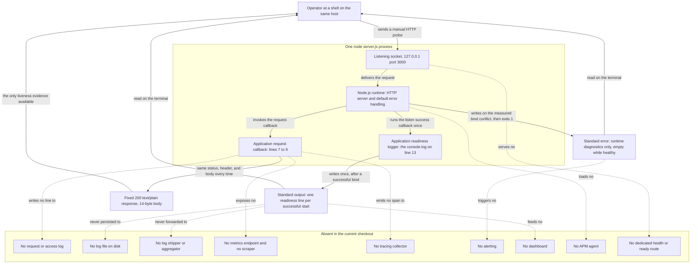

# Observability

This is the observability area document for this repository. It answers one
question: what does this program tell you while it runs, and what can you not
see? The short answer is that the application emits exactly one line of text to
standard output, once, at startup [server.js:13], and no other signal about
itself at any time. The response it sends a client is not such a signal: the
`res.end(...)` call on line 9 writes the fixed reply to that client's connection
[server.js:9], which is the program answering a request rather than reporting on
itself, and [the networking area](./networking.md) owns it. Anything else that
reaches your terminal is written by the Node.js runtime rather than by this
program, and the two emitters are kept visibly apart in every section, list,
and diagram node below.

## Verification baseline

- **Documentation baseline branch** — `17-Aug-2026-Br1`, the branch this
  document was written against [.git/HEAD:ref].
- **Documentation baseline commit** — `1484182`, whose subject line is
  `Add files via upload` [.:git log -1 --oneline 1484182].
- **Files tracked at that commit** — `README.md` and `server.js`, nothing else
  [.:git ls-tree -r --name-only 1484182].
- **Program files, at that commit and now** — one, `server.js`
  [.:git ls-tree -r --name-only 1484182] [.:git ls-files].
- **Runtime used for every observation below** — Node.js 24.19.0, verified on
  August 17, 2026 (**Observed on Node.js 24.19.0 on August 17, 2026**).
- **Host the observations were made on** — Linux x86_64 (Ubuntu 24.04.4 LTS),
  reported by `uname -srm` as
  `Linux 6.18.33.2-microsoft-standard-WSL2 x86_64` (**Observed on Node.js
  24.19.0 on August 17, 2026**).
- **Runtime version declared by the repository** — none [.:git ls-files].
- **Statements in the source that write to a process output stream** — exactly
  one, on line 13; the response write on line 9 goes to the client's connection
  instead, and belongs to [networking](./networking.md) [server.js:9,13].

The repository pins no runtime version. There is no `package.json`, lockfile,
`.nvmrc`, `.node-version`, or `.tool-versions` file to read one from
[.:git ls-files]. Node.js 24.19.0 was installed outside the checkout purely to
produce the observations below, and this document does not present it as a
repository requirement. The host is named for the same reason: some of the
runtime output quoted later is specific to that build and platform, so the
version and the date are part of every observed claim.

Every statement below carries exactly one evidence label:

- **Source-defined** — read directly from the code in this checkout.
- **Observed on Node.js 24.19.0 on August 17, 2026** — measured by running
  that code under that runtime on that date, with standard output and standard
  error captured into two separate files so that the emitter of each byte is
  known rather than assumed.
- **Absent in the current checkout** — verified to be missing from this
  checkout.
- **Recommendation** — a suggestion for future work, never a description of
  current behavior.

Values that differ on every run are shown as variable fields instead of being
published as fixed facts. Process identifiers, the `Date` header of a
response, and absolute filesystem paths are all volatile, and none of them is
quoted here as a contract.

## Purpose and audience

Read this document when you need to answer one of three questions about a
running copy of this program:

- What does the process tell me about itself?
- How do I establish that it is alive?
- What is happening that I have no way to see?

It is written for an engineer meeting the repository for the first time, and
it is deliberately narrow: it covers *signals* — output, probes, and the
absence of both. The commands you type to start, verify, stop, and restart the
process belong to [the DevOps area](./devops.md). The machine and the process
model those signals come out of belong to
[the infrastructure area](./infrastructure.md). If you are looking for the
shortest successful first run, start from [the project README](../../README.md).

## Terms used in this document

These terms are used below and are defined here once, so that no reader has to
infer them from context:

- *Standard output* (`stdout`) and *standard error* (`stderr`) are the two
  separate text streams every process is given by its operating system.
  Conventionally a program writes its normal output to the first and its
  diagnostics to the second. They can be redirected independently, which is
  what makes it possible to prove which one produced a given line.
- A *readiness signal* is any output a program produces to announce that it has
  finished starting and is able to serve.
- A *liveness check* is an action an outside party takes to establish that a
  process is still answering. It is a question asked from outside, not
  something the process volunteers.
- *Structured logging* is log output written as machine-parseable records —
  typically JSON with named fields — so that tools can filter and aggregate it
  without parsing prose.
- A *log level* is a severity label attached to each record, such as debug,
  info, warning, or error, so that consumers can select by importance.
- A *correlation ID*, also called a request ID, is an identifier attached to
  every record produced while handling one request, so that the records
  belonging to that request can be gathered together afterwards.
- A *metric* is a number sampled or accumulated over time: a count of requests
  served, a distribution of response latencies, or the memory a process is
  using.
- A *trace* is the recorded path of one request through a system. It is made of
  *spans*, each span being one timed unit of work within that path.
- A *telemetry sink* is wherever signals are sent to be kept or examined: a log
  file, a log aggregator, a metrics database, a tracing collector, a dashboard,
  or an alerting system.
- A *health endpoint* is an HTTP route whose only job is to report whether the
  process considers itself able to serve, conventionally at a path such as
  `/health` or `/ready`. A route that returns the same fixed body no matter
  what state the process is in is not a health endpoint, and this document
  never treats one as such.

## The one signal the application emits

This document is the primary owner of a single line of the program: the
`console.log` call on line 13 [server.js:13]. It is the entire application
telemetry surface.

- **Source-defined:** line 13 is the only statement in the program that writes
  to a process output stream, and the only one that reports anything about the
  program itself. Searching all 14 lines finds exactly one `console` call, no
  logging library, and no file write, no write to standard error, and no other
  process-level output of any kind [server.js:1-14].
- **Source-defined:** one other statement does perform a write, and it is
  deliberately excluded from this document's scope: `res.end('Hello, World!\n')`
  on line 9 writes the response body to the requesting client's connection
  [server.js:9]. That write is the program's answer to a request, not a signal
  about the program, so it is owned by
  [the networking area](./networking.md) — which is also where its status code,
  header, and runtime-added fields are documented. Treating it as telemetry
  would be a category error: nobody learns anything about this process from a
  reply whose content never changes [server.js:6-10].
- **Source-defined:** it writes to standard output, because `console.log` is
  the standard-output method of Node's console. The program never writes to
  standard error at all [server.js:1-14].
- **Source-defined:** the statement is a template literal that interpolates the
  two constants declared on lines 3 and 4, so the text it produces is fixed by
  the source rather than discovered at run time [server.js:3-4,13]. It renders
  as one line:

```text
Server running at http://127.0.0.1:3000/
```

- **Observed on Node.js 24.19.0 on August 17, 2026:** captured standard output
  was exactly 41 bytes — those 40 characters followed by a single line feed
  (`0x0A`), with no carriage return, on the Linux host named above
  [server.js:13].
- **Observed on Node.js 24.19.0 on August 17, 2026:** captured standard error
  was 0 bytes for the entire life of a healthy process, from start to
  termination [server.js:1-14].

### Its presence means the bind succeeded

The line is worth more than "the script ran", and the reason is where it sits
in the source.

- **Source-defined:** the call is inside the function passed as the third
  argument to `server.listen(...)`, which the runtime invokes only after the
  listener has been established [server.js:12-13].
- **Observed on Node.js 24.19.0 on August 17, 2026:** on a successful start the
  line appeared and the host reported exactly one listening socket, on
  `127.0.0.1` port `3000`; before the start it reported none [server.js:12-13].
- **Observed on Node.js 24.19.0 on August 17, 2026:** when a second copy was
  launched while port `3000` was already held, that second process printed
  **0 bytes** of standard output. No readiness line was produced at all
  [server.js:12-14].

The operational reading follows from that pair of observations, but it runs in one
direction only. **The line present means a socket was bound** — the runtime
invokes that callback only after the bind succeeded [server.js:12-13]. **The line
absent means nothing on its own.** A start still in progress, a stream redirected
to a file you are not reading, output captured by a supervisor or an editor
console, and a terminal nobody was watching all produce exactly the same silence,
and none of them is a failed bind.

So when the line is missing, establish the state instead of inferring it. Three
checks answer the question between them, and none of them depends on the
program's own output:

1. Is the process still running? A process that is gone did not merely fail to
   print.
2. Is anything listening on `127.0.0.1:3000`? The operating system answers this
   independently of the program [server.js:12].
3. What is on standard error? **Observed on Node.js 24.19.0 on August 17, 2026:**
   a failed bind wrote a diagnostic there and nothing to standard output, so a
   populated standard error identifies the failure and an empty one rules that
   particular failure out [server.js:12-14].

That is the whole of the startup signal, and it is the only thing in this system
that reports its own state without being asked. The commands for the first two
checks belong to [the DevOps area](./devops.md).

What the bound socket exposes on the wire is a different concern, owned by
[the networking area](./networking.md). The `listen` call as an event in the
runtime substrate is owned by
[the infrastructure area](./infrastructure.md).

### It is emitted once per process start, and never again

- **Source-defined:** the program calls `listen` exactly once, and the callback
  registered there runs on that single successful bind [server.js:12].
- **Observed on Node.js 24.19.0 on August 17, 2026:** across four separate
  successful starts, each process wrote exactly one line of 41 bytes, and the
  captured stream never grew afterwards — not while idle, and not while serving
  traffic [server.js:13].

### What the line does not contain

Read the rendered text again and notice what is missing from it. Each absence
below is visible in the single statement that produces the line:

- **Source-defined:** no timestamp [server.js:13], so the line itself cannot
  tell you when the process started. Only the surrounding capture — a terminal
  you were watching, or a file whose modification time you trust — can date it.
- **Source-defined:** no severity level [server.js:13], so there is nothing to
  filter on.
- **Source-defined:** no structure [server.js:13]. It is an English sentence,
  not JSON or key-value pairs, so any consumer would have to parse prose.
- **Source-defined:** no process identifier, host name, or version
  [server.js:13], so two processes started in two terminals produce output that
  is impossible to tell apart.
- **Source-defined:** no value read back from the socket. The address and port
  in the text are the source constants interpolated into the message
  [server.js:3-4,13]; the program never calls `server.address()` to report what
  was actually bound. The line is therefore trustworthy as confirmation *that* a
  bind succeeded, because the runtime only runs the callback after it did, but
  the address it displays is the code's intention rather than an independent
  readback.

## What the application never emits

Everything in this section is an absence in the program itself, verified
against the source rather than inferred from convention.

- **Source-defined:** there is no request or access log. The request callback is
  three statements long — it sets a status, sets one header, and ends the
  response — and none of them writes to standard output or standard error
  [server.js:6-10]. The third does write, but only the reply itself, back to the
  client that asked for it [server.js:9]; nothing about the request is recorded
  anywhere the operator can read it afterwards.
- **Source-defined:** there is no error log. No listener is attached to the
  server's `error` event, and the file contains no `try`/`catch` and no
  rejection handler, so the program has no code path in which it could report a
  failure [server.js:12-14].
- **Source-defined:** there is no shutdown or lifecycle log. The file registers
  no `process.on` handler, no signal handler, and no `server.close` call, so
  nothing runs on the way out [server.js:1-14].
- **Source-defined:** there is no metric of any kind. Nothing counts requests,
  times responses, or samples memory; the callback body holds no counter and no
  timer [server.js:6-10].
- **Source-defined:** there is no tracing. The single `require` in the file
  loads Node's core `http` module, and no instrumentation, agent, or exporter
  is imported anywhere [server.js:1].
- **Source-defined:** there is no dedicated health or readiness route. The
  callback never inspects the request, so it cannot distinguish one path from
  another [server.js:6-10].

### The request-logging comparison

The absence of request logging is the claim most worth proving rather than
asserting, so it was measured directly.

**Method:** standard output was captured to a file outside the checkout, that
file was snapshotted, eleven ordinary requests were issued with Node's
built-in HTTP client, and the file was snapshotted again.

Every snapshot below is **Observed on Node.js 24.19.0 on August 17, 2026**:

- **Immediately after a successful start** — standard output held 41 bytes,
  one line, the readiness line; standard error held 0 bytes [server.js:13].
- **After eleven requests had been served** — standard output held 41 bytes,
  one line, the same readiness line; standard error held 0 bytes
  [server.js:6-10].
- **Difference** — 0 bytes on standard output, 0 bytes on standard error
  [server.js:6-10].

- **Observed on Node.js 24.19.0 on August 17, 2026:** the eleven requests did
  reach the callback. Each returned status `200`, a content type of
  `text/plain`, and the same 14-byte body, so this is not a case of traffic
  failing to arrive — the traffic was served, and it added nothing at all to the
  application's own output [server.js:6-10].
- **Observed on Node.js 24.19.0 on August 17, 2026:** the running process also
  created no file anywhere in the checkout during those requests, so the
  records are not being written somewhere else in the checkout instead
  [server.js:1-14].

The consequence is worth stating plainly, and stating precisely. Those two checks
measure two things — the captured streams and the files in the checkout — and
after this process has served traffic neither of them holds any record that a
request was made. Method, path, status, response size, timing, and client go
unrecorded *by this program*, so no later investigation can recover them from its
output [server.js:6-10]. That is the whole of the claim. Anything captured
outside the program — by the operating system, by a packet capture, by a proxy or
tunnel an operator happens to have in the path — is neither measured by those two
checks nor prevented by any line of the code, is not described by this
documentation, and cannot be relied on to exist or to be absent
[server.js:1-14].

### Conventional health and metrics paths return the same fixed body

- **Observed on Node.js 24.19.0 on August 17, 2026:** `GET /health`,
  `/healthz`, `/ready`, `/live`, `/metrics`, and `/status` each returned status
  `200` with `Content-Type: text/plain` and the body `Hello, World!` followed
  by a newline — byte-identical to the response for `/` [server.js:6-10].
- **Source-defined:** that is not routing behavior, it is the absence of
  routing. The callback ignores the request object entirely and sets the same
  status, the same header, and the same body for every request it receives
  [server.js:6-10].

So a `200` from `/health` on this system is not a health check result. By the
definition given earlier it is not a health endpoint at all: the path is
answered by the same catch-all response as everything else, and a body of
`Hello, World!` reports nothing about the state of the process. Nowhere in
this document is that response called a health check.

## Runtime-generated output is a separate emitter

Output can still appear on your terminal when the application itself has
written nothing. It comes from the Node.js runtime, and keeping that emitter
distinct is the single most important idea in this document.

**Runtime standard error is not application telemetry.** It is diagnostic output
the runtime produces on its own account — in the case measured below, about a
failure the program declined to handle [server.js:12-14]. It is not a log the
program chose to write, its wording and formatting are not stable across Node.js
versions, and no part of it is under this repository's control. Nor is the case
below the only thing a runtime can report: a deprecation notice, a warning, or a
different fatal error would also arrive on this stream, and none of them was
exercised here, so none is documented as this program's behavior.

### The bind-conflict output, verbatim

**Method:** with port `3000` already held by a running first instance, a second
`node server.js` was launched with standard output and standard error captured
to two separate files.

- **Observed on Node.js 24.19.0 on August 17, 2026:** the second process wrote
  **0 bytes** to standard output — again, no readiness line — wrote 626 bytes
  to standard error, and exited with status `1` [server.js:12-14].

```text
node:events:487
      throw er; // Unhandled 'error' event
      ^

Error: listen EADDRINUSE: address already in use 127.0.0.1:3000
    at Server.setupListenHandle [as _listen2] (node:net:2167:16)
    at listenInCluster (node:net:2224:12)
    at node:net:2448:7
    at process.processTicksAndRejections (<internal-frame>)
Emitted 'error' event on Server instance at:
    at emitErrorNT (node:net:2203:8)
    at process.processTicksAndRejections (<internal-frame>) {
  code: 'EADDRINUSE',
  errno: -98,
  syscall: 'listen',
  address: '127.0.0.1',
  port: 3000
}

Node.js v24.19.0
```

That text is quoted as captured, with one substitution: the frame position that
appeared twice as `node:internal/process/task_queues:90:21` is shown as the
variable field `<internal-frame>`, because it is a position inside that
particular Node.js build rather than a stable fact. Everything else, including
every field of the error object, the byte count above, and the exit status, is
the capture itself. Parts of it are specific to the runtime and host in the
verification baseline rather than universal:

- **Observed on Node.js 24.19.0 on August 17, 2026:** the internal frame line
  numbers, such as `node:events:487` and `node:net:2167:16`, are positions
  inside that particular Node.js build and will move between versions. None of
  them is a position in this repository's own file [server.js:1-14].
- **Observed on Node.js 24.19.0 on August 17, 2026:** `errno: -98` is the
  platform's numeric code for this condition on the Linux host named above; a
  different operating system reports a different number for the same
  `EADDRINUSE` condition, which the program neither sets nor reads
  [server.js:1-14]. The symbolic `code: 'EADDRINUSE'` is the field to match on
  for that reason, and the 626-byte total moves with the same two variables:
  the length of that number and the line terminator the host uses.
- **Observed on Node.js 24.19.0 on August 17, 2026:** the trailing
  `Node.js v24.19.0` line is the runtime identifying itself, which is a useful
  confirmation that the output above it came from the runtime and not from the
  application's single output statement [server.js:13].

### Why the runtime is the one reporting it

- **Source-defined:** no listener is attached to the server's `error` event
  [server.js:12-14]. When the bind fails, the server emits `error` with nothing
  subscribed to it, and Node's documented default for an unhandled `error`
  event is to throw. The `throw er; // Unhandled 'error' event` line in the
  captured output is that default behavior, printed by the runtime.
- **Source-defined:** the program therefore has no opportunity to report the
  failure in its own words, because it never asked to be told about it
  [server.js:12-14]. Adding such a listener would be a change to the source and
  is listed under recommendations, not described here as if it existed.
- **Observed on Node.js 24.19.0 on August 17, 2026:** the *first* process said
  nothing about any of this. Its standard output was still 41 bytes and one
  line, its standard error still 0 bytes, and it still held the only listening
  socket [server.js:13]. An operator watching a healthy process learns nothing
  about a failed competing launch.

What an operator should *do* about an occupied port is a procedure, and
procedures belong to [the DevOps area](./devops.md). This document stops at
identifying which emitter produced which bytes.

### Reading the two emitters apart

- **The application, on standard output.**
  - *When it writes:* once, immediately after a successful bind.
  - *What it writes:* one 41-byte readiness line, unchanged for the life of the
    process.
  - *Evidence:* **Source-defined** [server.js:13].
- **The application, on standard error.**
  - *When it writes:* never.
  - *What it writes:* nothing; standard error stayed at 0 bytes for every
    healthy run.
  - *Evidence:* **Source-defined** [server.js:1-14].
- **The Node.js runtime, on standard error.**
  - *When it writes:* on the one failure measured here, a bind conflict during
    startup. Other runtime conditions can write there too; only this one was
    exercised.
  - *What it writes:* a multi-line diagnostic naming the error, its stack, and
    the runtime version, followed by exit status `1` in that case.
  - *Evidence:* **Observed on Node.js 24.19.0 on August 17, 2026**
    [server.js:12-14].
- **The Node.js runtime, on standard output.**
  - *When it writes:* never, in any run measured here.
  - *What it writes:* nothing; the failed launch produced 0 bytes on standard
    output, and a healthy run produced only the application's own line.
  - *Evidence:* **Observed on Node.js 24.19.0 on August 17, 2026**
    [server.js:12-14].

The practical rule for a new engineer: anything on standard output came from
line 13 of the source [server.js:13], and anything on standard error came from
the runtime [server.js:1-14]. Redirecting the two streams to different
destinations is therefore enough to separate application signal from runtime
diagnostics completely.

## Termination produces no application output

- **Source-defined:** the file registers no signal handler, no `process.on`
  listener, and no `server.close` call, so no application code runs when the
  process is asked to stop [server.js:1-14].
- **Observed on Node.js 24.19.0 on August 17, 2026:** a `SIGINT` request ended
  the process, which the launching shell reported as status `130`, and a
  `SIGTERM` request ended it as status `143` — the conventional
  128-plus-signal-number results for a process killed by a signal rather than
  one that chose its own exit code. In both cases the captured standard output
  contained only the readiness line, 41 bytes, and captured standard error was
  empty [server.js:1-14]. That is the observability fact: the end of the process
  adds nothing to either stream.
- **Observed on Node.js 24.19.0 on August 17, 2026:** afterwards the host
  reported no listener on port `3000`, and a fresh client attempt failed with a
  connection-refused error [server.js:12].
- How the termination itself is *reported* depends on where you observe it, and
  the two views below are two descriptions of the same event rather than two
  different behaviours:
  - **A POSIX shell** reports a signal-terminated process through `wait` as 128
    plus the signal number — the `130` and `143` above. Those are wait
    statuses the shell derives from the signal, not exit codes the program
    chose.
  - **A Node.js parent process** that spawns this program and then signals it
    sees `code: null` together with the signal name, `SIGTERM` or `SIGINT`, in
    the child's exit metadata — the same event reported as ended by a signal
    rather than as a returned status.
- **Source-defined:** neither report is a value the program produced. It never
  calls `process.exit`, never sets `process.exitCode`, and registers no handler
  for either signal, so nothing of its own runs on the way out and it
  contributes nothing to either report [server.js:1-14]. Neither is an
  application signal: both are produced by the shell or the parent process,
  never by this code [server.js:1-14]. The operator-facing stop and restart
  procedure is owned by [the DevOps area](./devops.md).

The reading for an operator is that a *deliberate stop* is invisible in this
process's own output. **Observed on Node.js 24.19.0 on August 17, 2026:** a
process ended with `SIGINT` or `SIGTERM` left exactly the streams a healthy run
leaves — one readiness line on standard output, nothing on standard error — so
nothing in its own output distinguishes a stopped process from one that is still
running, and confirming a stop takes evidence from outside it, such as the port
probe in [the DevOps area](./devops.md#5-start-verify-stop-and-restart).

A crash is a different case and has to be checked separately, not folded into
that sentence. An unhandled runtime failure does write to standard error: the
bind conflict recorded in
[Runtime-generated output is a separate emitter](#runtime-generated-output-is-a-separate-emitter)
produced 626 bytes and a stack trace before the process exited `1`
(**Observed on Node.js 24.19.0 on August 17, 2026**) [server.js:12-14]. So an
empty standard error is evidence about signal termination only — it is not a
general assurance that nothing failed — and a non-empty standard error is the
first place to look when a process is gone and nobody signalled it.

## Manual liveness check

Because the process volunteers nothing after startup, the only way to learn
that it is still alive is to ask it.

**Method:** one ordinary `GET /` was sent while the process was running, using
Node's built-in HTTP client in its plain form — `http.get` with no `agent`
option, so the request went through the client's default global agent, which
allows the connection to be reused. Naming the client form is part of the
method, not a detail: two of the headers below are the runtime's answer to what
this client asked for, so a client that opted out of connection reuse produces a
different capture that is equally correct. A capture whose method does not say
which client form produced it cannot be reproduced.

- **Observed on Node.js 24.19.0 on August 17, 2026:** the response produced by
  the request callback [server.js:6-10] was:

```text
statusCode     = 200
statusMessage  = OK
httpVersion    = 1.1
Content-Type   = text/plain
Date           = <RFC 7231 timestamp; a different value on every response>
Connection     = keep-alive
Keep-Alive     = timeout=5
Content-Length = 14
body           = "Hello, World!\n"
```

- **Observed on Node.js 24.19.0 on August 17, 2026:** the `Date` value is
  normalized above because it changes on every response and must not be read as
  a fixed field [server.js:6-10]. Which of those fields the application sets,
  which the runtime adds, and which of them change with the client's own
  connection choice is a wire-level question owned by
  [the networking area](./networking.md#runtime-generated-response-fields); this
  document uses the response only as liveness evidence.
- **Observed on Node.js 24.19.0 on August 17, 2026:** the same request against
  a stopped process failed with a connection-refused error instead, which is
  the negative result an operator should expect [server.js:12].

The exact commands for issuing such a request belong to
[the DevOps area](./devops.md).

### What a `200` proves, and what it does not

It proves three things, and each is genuinely useful:

- A process is alive and holding `127.0.0.1:3000`
  (**Observed on Node.js 24.19.0 on August 17, 2026**) [server.js:12].
- Its event loop is responsive enough to run the request callback to
  completion, because a response body arrived
  (**Observed on Node.js 24.19.0 on August 17, 2026**) [server.js:6-10].
- The socket is accepting connections at the moment you asked
  (**Observed on Node.js 24.19.0 on August 17, 2026**) [server.js:12].

It proves nothing about any of the following:

- **Source-defined:** that the request was understood. The handler never reads
  the request object, so an identical `200` comes back regardless of method,
  path, headers, or body [server.js:6-10].
- **Source-defined:** that anything downstream is healthy. The response is
  three fixed statements with no dependency behind them, so it cannot report on
  a database, cache, queue, or upstream service — there are none, and if there
  were, this response would still say `Hello, World!` [server.js:6-10].
- **Source-defined:** that the process is under acceptable load or memory
  pressure. Nothing in the program measures either [server.js:1-14].
- **Observed on Node.js 24.19.0 on August 17, 2026:** that it was still alive a
  moment later. The check is a single point in time and the process emits
  nothing between checks [server.js:1-14].

## Signal flow



The two pieces of application code are drawn as separate nodes on purpose,
because they behave completely differently as emitters. `READYLOG` is the
`console.log` on line 13, which the runtime invokes once from the `listen`
success callback and which writes the only line this program ever puts on either
standard stream [server.js:12-13]. `HANDLER` is the request callback on lines 7
to 9, which the runtime invokes once per delivered ordinary request and which
writes nothing to standard output or standard error — its own write on line 9
goes to the client's connection, so it produces a response, never a log record
[server.js:6-10]. Nothing joins the two: the readiness path and the request path
share no edge, which is exactly why serving traffic never changes what is on
standard output.

Three paths therefore carry every signal this system produces: the readiness line
to standard output after a successful bind [server.js:13]; the runtime's own
diagnostic to standard error on the failure measured here, the bind conflict shown
earlier [server.js:12-14]; and the operator's manual request, whose fixed response
is the only liveness evidence available [server.js:6-10]. Every dashed edge leads
into the `ABSENT` block, which exists so that the diagram cannot be misread as
showing a sink that merely happens to be conventional: none of those nine
components is defined anywhere in the repository, whose only tracked
non-documentation path is `server.js` [.:git ls-files], and the process itself was
observed holding one listening socket, no additional endpoint, and no outbound
connection while idle (**Observed on Node.js 24.19.0 on August 17, 2026**)
[server.js:1-14].

## Operator checks

Everything an operator can actually do today is in the list below. Each entry
states what the check establishes and what it leaves unknown, because a check
read as proving more than it does is worse than no check at all.

- **Read the readiness line on the launching terminal.**
  - *What it proves:* that a bind succeeded and the process reached line 13.
  - *What it does not prove:* that the process is still alive now, or that it
    has ever served a request.
  - *Evidence:* **Source-defined** [server.js:12-13].
- **Notice that no readiness line appeared.**
  - *What it proves:* nothing on its own — a slow start, a redirected stream,
    and an unwatched terminal look identical to a failed bind.
  - *What it does not prove:* neither that the bind failed nor that it
    succeeded; check the process, the listening socket, and standard error
    before concluding anything.
  - *Evidence:* **Observed on Node.js 24.19.0 on August 17, 2026**
    [server.js:12-14].
- **Send one ordinary HTTP request and read the status and body.**
  - *What it proves:* that the process is alive, bound, and running the callback
    right now.
  - *What it does not prove:* anything about correctness, dependencies, or load,
    since the handler ignores the request.
  - *Evidence:* **Observed on Node.js 24.19.0 on August 17, 2026**
    [server.js:6-10].
- **Inspect the process and its listening socket with operating-system tools.**
  - *What it proves:* that a process exists and holds `127.0.0.1:3000`.
  - *What it does not prove:* that it can still execute JavaScript; only a
    request shows that.
  - *Evidence:* **Observed on Node.js 24.19.0 on August 17, 2026**
    [server.js:12].
- **Read standard error after a failed start.**
  - *What it proves:* which runtime error prevented startup, including the
    address and port in conflict.
  - *What it does not prove:* nothing about a healthy process, whose standard
    error stays empty.
  - *Evidence:* **Observed on Node.js 24.19.0 on August 17, 2026**
    [server.js:12-14].
- **Compare captured standard output before and after traffic.**
  - *What it proves:* that no request logging exists, because the byte count
    does not change.
  - *What it does not prove:* nothing further; there is no per-request signal to
    find.
  - *Evidence:* **Observed on Node.js 24.19.0 on August 17, 2026**
    [server.js:6-10].

Note what is not in that list: there is no check an operator can run to learn
about past behavior. Every entry is a present-tense question, because the system
keeps no history of itself.

## Gaps

Every capability below is **Absent in the current checkout**, and each entry
repeats that label deliberately, so that no entry can be skimmed as though it
described something that exists. Nothing here was created in order to be
documented; each entry is a gap recorded as a gap.

- **Request or access logging** — **Absent in the current checkout.**
  - *Evidence:* the request callback writes to no stream [server.js:6-10], and
    captured standard output did not grow by a single byte across eleven served
    requests.
  - *Consequence today:* the application keeps no record that a request was ever
    made, so no traffic volume, error rate, or client can be established from
    its own output afterwards.
- **Structured or JSON log records** — **Absent in the current checkout.**
  - *Evidence:* the one output statement produces an English sentence
    [server.js:13].
  - *Consequence today:* any consumer would have to parse prose; no field can be
    queried or aggregated.
- **Log levels** — **Absent in the current checkout.**
  - *Evidence:* the single output statement carries no severity [server.js:13].
  - *Consequence today:* nothing can be filtered by importance, because there is
    exactly one message and it has no level.
- **Correlation or request identifiers** — **Absent in the current checkout.**
  - *Evidence:* no identifier is generated or read anywhere in the file
    [server.js:1-14].
  - *Consequence today:* even if logging were added later, records could not be
    grouped by request without introducing an identifier first.
- **Timestamps in output** — **Absent in the current checkout.**
  - *Evidence:* the rendered line contains no time field [server.js:13].
  - *Consequence today:* the start time of a process cannot be recovered from
    its own output; it must come from the surrounding capture.
- **Log persistence or rotation** — **Absent in the current checkout.**
  - *Evidence:* the program opens no file and writes only to standard output
    [server.js:1-14]. **Observed on Node.js 24.19.0 on August 17, 2026:** the
    running process created no file in the checkout.
  - *Consequence today:* output survives only as long as the terminal or
    redirect that captured it; nothing manages size or retention.
- **Metrics such as request counts, latency, or memory** — **Absent in the
  current checkout.**
  - *Evidence:* no counter, timer, or memory sample exists in the file
    [server.js:1-14].
  - *Consequence today:* capacity and performance questions cannot be answered
    from this system at all; they would require measurement from outside it.
- **A metrics endpoint or an exporter** — **Absent in the current checkout.**
  - *Evidence:* nothing in the file exposes or pushes measurements
    [server.js:1-14]. **Observed on Node.js 24.19.0 on August 17, 2026:** the
    process held exactly one listening socket, no additional endpoint, and no
    outbound connection while idle.
  - *Consequence today:* there is nothing for a monitoring system to scrape and
    nothing being sent anywhere.
- **Distributed tracing and spans** — **Absent in the current checkout.**
  - *Evidence:* the only import is Node's core `http` module; no instrumentation
    is loaded [server.js:1].
  - *Consequence today:* request paths cannot be followed, though with one
    process and no downstream call there is currently nothing to follow.
- **A dedicated health or readiness route** — **Absent in the current
  checkout.**
  - *Evidence:* the callback never inspects the request, so it cannot
    distinguish paths [server.js:6-10]. **Observed on Node.js 24.19.0 on
    August 17, 2026:** `/health`, `/healthz`, `/ready`, `/live`, `/metrics`, and
    `/status` returned the same fixed body as `/`.
  - *Consequence today:* no probe can ask this process for a self-assessment; a
    `200` reports only that the catch-all answered.
- **Error tracking or crash reporting** — **Absent in the current checkout.**
  - *Evidence:* no `error` listener and no reporting client exist
    [server.js:12-14].
  - *Consequence today:* a failure is visible only as runtime text on the
    terminal of whoever launched it, and is recorded nowhere.
- **Uptime or availability monitoring** — **Absent in the current checkout.**
  - *Evidence:* nothing in the checkout polls, records, or reports availability
    [.:git ls-files].
  - *Consequence today:* downtime is discovered only when a person happens to
    send a request.
- **Alerting** — **Absent in the current checkout.**
  - *Evidence:* no alert rule, destination, or integration is tracked
    [.:git ls-files].
  - *Consequence today:* nobody is notified of anything, including a process
    that failed to start or has stopped.
- **Dashboards** — **Absent in the current checkout.**
  - *Evidence:* no dashboard definition is tracked [.:git ls-files].
  - *Consequence today:* there is no view of the system; the terminal that
    launched it is the only display.
- **Telemetry export, such as OpenTelemetry, StatsD, or a vendor agent** —
  **Absent in the current checkout.**
  - *Evidence:* no exporter, agent, or collector configuration is tracked
    [.:git ls-files], and none is imported [server.js:1].
  - *Consequence today:* no signal leaves the host, so nothing can be correlated
    with any other system.
- **Process-level runtime statistics, such as resident memory or event-loop
  lag** — **Absent in the current checkout.**
  - *Evidence:* the program samples nothing about itself [server.js:1-14].
  - *Consequence today:* saturation and leaks would be invisible until the
    process failed outright.

None of this is a defect in the program. The repository describes itself as a
test project for integration purposes [README.md:2], and a fixture whose entire
output is one readiness line is a reasonable shape for that. The gaps matter at
exactly one moment: when somebody expects to know how this process is behaving
without watching the terminal it was started in.

## Recommendations

Everything in this section is advisory. Nothing in it is implemented, and no
sentence here describes current behavior. The sections above are the current
state; these are possible responses to it, ordered so that each one is useful
before the next is attempted. Each would require a change to `server.js`, which
this document does not make: the file is read here as evidence only
[server.js:1-14].

- **Recommendation:** attach a listener to the server's `error` event so that a
  failed bind is reported by the application in its own words, with an
  intentional exit status, instead of surfacing as a runtime stack trace
  [server.js:12-14]. It is the smallest change with the largest operational
  return, because the current failure output is the one message an operator is
  most likely to meet.
- **Recommendation:** log one line per delivered ordinary request, and choose
  its fields deliberately: the request method, a *normalized* route or pathname,
  the response status, and the duration. Do not log the raw request target.
  A target such as `/callback?token=<secret>&email=<address>` carries a
  credential and personal data in its query string, so writing it verbatim
  would copy both into a log that outlives the request and is read by more
  people than the request was — the classic shape of CWE-532, insertion of
  sensitive information into a log file. Three habits keep that from happening:
  strip the query string before the line is assembled rather than after; keep
  `Cookie`, `Authorization`, and every other credential-bearing header out of
  the record entirely; and decide the fields by an explicit allow-list, because
  a list of things to exclude silently fails the first time somebody adds a
  field nobody thought to exclude. Settle the log's retention period and who
  can read it in the same change that starts writing it, and cover the
  redaction with a test, so a later edit cannot quietly reintroduce a secret.
  Built that way, this one addition converts the request-logging gap above into
  the first real telemetry this system has [server.js:6-10].
- **Recommendation:** add a timestamp and a severity level to every line,
  including the readiness line, before adding any further messages. Doing it
  first means later output is consistent from the beginning rather than
  retrofitted [server.js:13].
- **Recommendation:** emit records as structured JSON once there is more than
  one message, so that output can be queried by field instead of parsed as
  prose.
- **Recommendation:** add a signal handler that logs the reason for shutdown and
  closes the listener, so that a deliberate stop is distinguishable from a
  crash in the output itself [server.js:1-14].
- **Recommendation:** add a route dedicated to reporting readiness, distinct
  from the catch-all response, before anything automated is asked to decide
  whether this process is healthy [server.js:6-10].
- **Recommendation:** treat metrics, tracing, dashboards, and alerting as later
  steps that only pay off once something is collecting the output. Adding an
  exporter while output is a single unstructured line would produce
  infrastructure with nothing to carry.
- **Recommendation:** keep the gap list above as the checklist. Each entry that
  becomes real should move out of it and into the current-state sections, with
  its own evidence and its own verification date.

## Source map and related areas

Lines this document cites: [server.js:13] for the single `console.log` call
that is the whole of the application's telemetry, and which this document owns;
[server.js:12-13] for the fact that the call sits in the `listen` success
callback, which is what makes its presence a bind-success indicator;
[server.js:3-4,13] for the two constants interpolated into the rendered text;
[server.js:6-10] for the request callback that writes no log line and inspects
no request; [server.js:12-14] for the absent server `error` listener that makes
the runtime the emitter of bind-failure output; and [server.js:1] for the
single core-module import, which is also the evidence that no instrumentation
is loaded. Whole-file claims cite [server.js:1-14], absence claims about the
checkout as it stands cite [.:git ls-files], the repository's own purpose
statement cites [README.md:2], and the baseline commit and its file list cite
[.:git log -1 --oneline 1484182] and [.:git ls-tree -r --name-only 1484182].
The branch this document was written against is cited as [.git/HEAD:ref], and
every absence claim here is scoped to it. Remote URLs and clone hooks are never
cited, because they belong to an individual clone rather than to tracked
content — and a remote URL can carry an access credential;
[the project README](../../README.md#current-checkout) explains all of that once
for the whole set.

Every absence claim above is scoped to this checkout at the baseline commit,
and every observation is scoped to Node.js 24.19.0 on the host named in the
verification baseline. The runtime output quoted in this document is the part
most likely to change: re-run the start, the bind conflict, the request
comparison, and the termination checks after any runtime upgrade, and update
the verification date when you do.

Continue reading:

- [The project README](../../README.md) — prerequisites, quick start,
  troubleshooting, terminology, and the map of all area documents.
- [Infrastructure](./infrastructure.md) — the host, the single process, and the
  listening socket that these signals come out of, and the absence of any
  monitoring agent alongside the process.
- [DevOps](./devops.md) — the commands that start, verify, stop, and restart the
  process, and the operator procedure for a port that is already in use.
- [Testing and quality](./testing-and-quality.md) — the acceptance matrix that
  reuses the observations above, including the request-logging comparison and
  the bind-conflict result.
- [Networking](./networking.md) — which response fields the application sets and
  which the runtime adds, and what the bound socket exposes on the wire
  [server.js:3-4,12].
