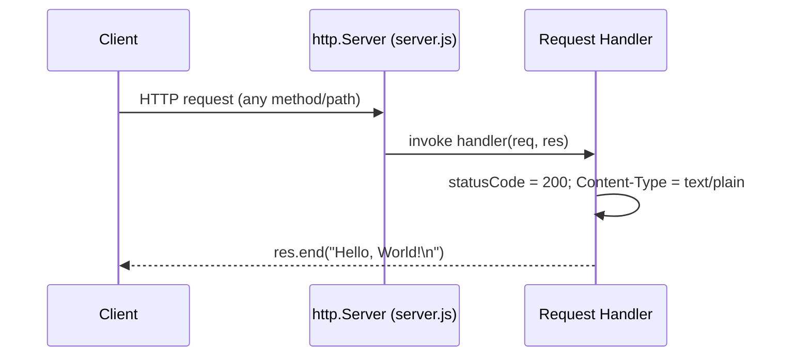
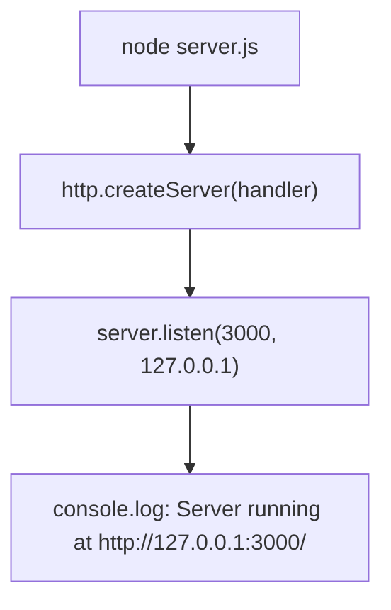

# Server Reference

This is the functional and behavioral reference for `server.js`, the sole runtime file and entry point of the `hao-backprop-test` project. It documents the source line by line — the module dependency, the configuration constants, the request handler, and the startup sequence — and records the server's empirically verified runtime behavior. Every claim below carries an inline `Source: server.js:L<line>` citation back to the authoritative source.

## Module dependency

The server depends on exactly one module: the Node.js built-in `http` module, loaded with a CommonJS `require` call. There are no third-party packages and no web framework (no Express, Fastify, Koa, or Nest). *Source: server.js:L1.*

```javascript
const http = require('http');
```

Because the only dependency ships with Node.js itself, the project is zero-dependency: it runs on a standard Node.js installation with nothing to install. *Source: server.js:L1.*

## Constants

Two hardcoded constants define where the server binds. *Source: server.js:L3-L4.*

```javascript
const hostname = '127.0.0.1';
const port = 3000;
```

- **`hostname`** — `127.0.0.1`, the IPv4 loopback address. The server is reachable only from the local machine. *Source: server.js:L3.*
- **`port`** — `3000`, the TCP port the server listens on. *Source: server.js:L4.*

These are plain constants in the source. There is no environment-variable support, no command-line flag, and no configuration file. See [Configuration](configuration.md) for how to change the host and port. *Source: server.js:L3-L4.*

## Request handler

The server is created with `http.createServer(...)`, which receives a single inline request handler `(req, res) => { ... }`. The handler is invoked once per incoming HTTP request and builds the response in three steps. *Source: server.js:L6-L10.*

```javascript
const server = http.createServer((req, res) => {
  res.statusCode = 200;
  res.setHeader('Content-Type', 'text/plain');
  res.end('Hello, World!\n');
});
```

1. Sets the HTTP status code to `200` (OK) via `res.statusCode = 200`. *Source: server.js:L7.*
2. Sets the response header `Content-Type: text/plain` via `res.setHeader('Content-Type', 'text/plain')`. *Source: server.js:L8.*
3. Writes the response body `Hello, World!\n` and ends the response via `res.end('Hello, World!\n')`. *Source: server.js:L9.*

The handler never inspects `req` — it reads neither the request method nor the URL — so it returns the same response for every request. The sequence diagram below shows the deterministic lifecycle of any request. *Source: server.js:L6-L10.*



## Startup

The server begins listening with `server.listen(port, hostname, callback)`. It binds the socket to the host and port from the constants — `127.0.0.1:3000` — and, once bound, invokes the callback, which logs the address to the console. *Source: server.js:L12-L14.*

```javascript
server.listen(port, hostname, () => {
  console.log(`Server running at http://${hostname}:${port}/`);
});
```

On a successful start the process prints exactly the following line. *Source: server.js:L13.*

```
Server running at http://127.0.0.1:3000/
```

The startup flow — from launching the process to logging the ready message — is shown below.



## Behavior notes

The following behaviors were empirically verified by running the server (`node server.js`) and issuing live HTTP requests. They are stated here as facts. *Source: server.js:L6-L10.*

- **Route-agnostic** — the handler performs no URL parsing, so every path returns the same response. `GET /` and `GET /any/other/path` produce identical output. *Source: server.js:L6-L10.*
- **Method-agnostic handler** — the handler performs no method branching, so the same handler code runs for every HTTP method. `GET /`, `POST /`, `PUT /`, and `DELETE /foo?x=1` all return the same response, including a `Content-Length: 14` header. A `HEAD /` request runs the same handler but, per standard HTTP semantics enforced by the Node.js `http` module, the response carries the same `200` status and `Content-Type: text/plain` with **no body** and **no `Content-Length`** header. *Source: server.js:L6-L10.*
- **Deterministic** — for every method that returns a body (`GET`, `POST`, `PUT`, `DELETE`, `PATCH`, `OPTIONS`), the response is `HTTP/1.1 200 OK`, `Content-Type: text/plain`, `Content-Length: 14`, with the body `Hello, World!\n`. The `Content-Length` of `14` is the byte length of `Hello, World!\n` — 13 visible characters plus a single trailing newline. (`HEAD` is the one exception: the same `200` status and `Content-Type: text/plain`, but no body and no `Content-Length` header, as noted above.) *Source: server.js:L7-L9.*
- **No exported API** — the file declares no `module.exports`; it is an entry-point script, not a reusable module. Its only public contract is its observable HTTP behavior. *Source: server.js:L1-L14.*

Concretely, the following live requests were each confirmed by running the server and issuing real HTTP requests. Every method that returns a body produces an identical `HTTP/1.1 200 OK` response with the body `Hello, World!\n`; `HEAD` returns the same status and content type with no body. *Source: server.js:L6-L10.*

| Request | Result |
|---------|--------|
| `GET /` | `200 OK`, `Content-Type: text/plain`, `Content-Length: 14`, body `Hello, World!\n` |
| `GET /any/other/path` | identical to `GET /` |
| `POST /` | identical to `GET /` |
| `DELETE /foo?x=1` | identical to `GET /` |
| `HEAD /` | `200 OK`, `Content-Type: text/plain`, **no body**, **no `Content-Length`** (standard HTTP HEAD semantics) |

## Related documentation

- [Architecture](architecture.md) — system overview, the two-component model, and the zero-dependency design rationale.
- [Configuration](configuration.md) — the `hostname` and `port` reference table and the procedure for changing the host and port.
