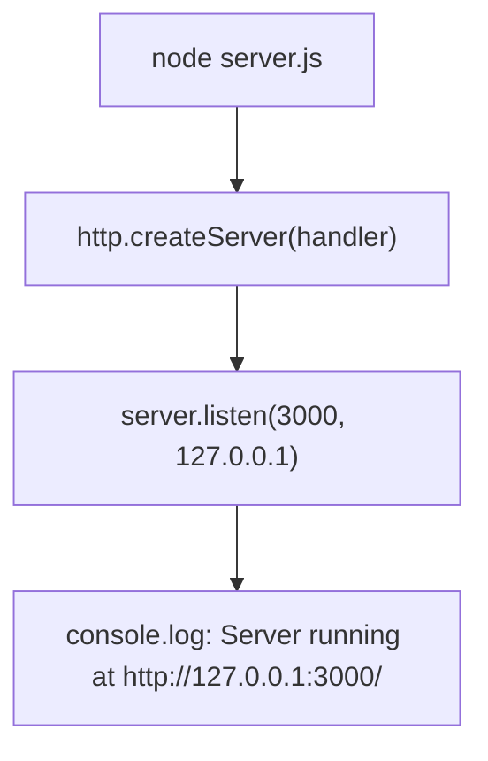

# Server Reference

This is the functional and behavioral reference for `server.js`, the sole runtime file of the `hao-backprop-test` project. Every claim below is taken directly from the source and is annotated with an inline `Source: server.js:L<line>` citation for traceability. `server.js` is a single-file, zero-dependency HTTP server built on the Node.js standard library; it exposes no JavaScript API (no `module.exports`), so its only public contract is the HTTP response it returns.

The complete source is 14 lines of content (plus a trailing newline); you can read it at [server.js](../../server.js) in the repository root. Each section below documents one functional element of that source, in source order.

## Module dependency

The server's only dependency is the Node.js **built-in `http` module**, imported with a CommonJS `require` call. There are no third-party packages, frameworks, or middleware — no Express, Fastify, Koa, or Nest. `Source: server.js:L1`.

```javascript
const http = require('http');
```

Because the `http` module ships with the Node.js runtime, the project needs no `package.json`, lockfile, or `npm install` step to run — only a Node.js installation. `Source: server.js:L1`.

## Constants

Two hardcoded, module-level constants configure where the server binds:

| Constant   | Value       | Meaning                            | Source         |
|------------|-------------|------------------------------------|----------------|
| `hostname` | `127.0.0.1` | Loopback host (local machine only) | `server.js:L3` |
| `port`     | `3000`      | TCP port the server listens on     | `server.js:L4` |

```javascript
const hostname = '127.0.0.1';
const port = 3000;
```

The loopback address `127.0.0.1` means the server accepts connections only from the local machine; it is not reachable from other hosts. The values are literals in the source, so changing them requires editing the file. `Source: server.js:L3-L4`.

See [Configuration](configuration.md) for how to change the host and port.

## Request handler

The server is created with `http.createServer()`, which receives a single inline request handler, `(req, res) => { ... }`. This handler is the entire request-processing logic of the application. `Source: server.js:L6-L10`.

```javascript
const server = http.createServer((req, res) => {
  res.statusCode = 200;
  res.setHeader('Content-Type', 'text/plain');
  res.end('Hello, World!\n');
});
```

For every incoming request, the request handler performs exactly three steps:

1. Sets the HTTP status code to `200` (OK) via `res.statusCode = 200`. `Source: server.js:L7`.
2. Sets the response header `Content-Type: text/plain` via `res.setHeader('Content-Type', 'text/plain')`. `Source: server.js:L8`.
3. Ends the response, writing the body `Hello, World!\n`, via `res.end('Hello, World!\n')`. `Source: server.js:L9`.

The handler never reads or branches on the request object (`req`): it inspects neither the HTTP method nor the URL path. Consequently, every request yields the same response. `Source: server.js:L6-L10`.

The sequence below shows the deterministic handling of any single request. `Source: server.js:L6-L10`.

```mermaid
sequenceDiagram
    participant C as Client
    participant S as http.Server (server.js)
    participant H as Request Handler
    C->>S: HTTP request (any method/path)
    S->>H: invoke handler(req, res)
    H->>H: statusCode = 200; Content-Type = text/plain
    H-->>C: res.end("Hello, World!\n")
```

## Startup

After the server object is created, `server.listen(port, hostname, callback)` binds the listening socket to `127.0.0.1:3000` and registers a startup callback. `Source: server.js:L12-L14`.

```javascript
server.listen(port, hostname, () => {
  console.log(`Server running at http://${hostname}:${port}/`);
});
```

Once the socket is bound, the callback logs a single line to the console. With the constants documented above, the startup message is exactly:

```text
Server running at http://127.0.0.1:3000/
```

`Source: server.js:L12-L14`.

The startup flow — from launching the process to printing the ready message — is:



## Behavior notes

The following behaviors are **empirically verified** against the running server and are stated here as facts:

- **Route-agnostic** — the request handler performs no URL parsing, so any path returns the same response. `Source: server.js:L6-L10`.
- **Method-agnostic** — the request handler performs no method branching, so `GET`, `POST`, `DELETE`, and every other HTTP method return the same response. `Source: server.js:L6-L10`.
- **Deterministic** — every response is identical: status `200`, header `Content-Type: text/plain`, and body `Hello, World!\n`. The body is 14 bytes (13 visible characters plus a trailing newline), so the response carries `Content-Length: 14`. `Source: server.js:L7-L9`.
- **No JavaScript API** — `server.js` defines no `module.exports`; its only public contract is the HTTP response described above. `Source: server.js:L1-L14`.

Live verification confirms this: `GET /`, `GET /any/other/path`, `POST /`, and `DELETE /foo?x=1` all return an identical `HTTP/1.1 200 OK` response with `Content-Type: text/plain` and the body `Hello, World!\n`. `Source: server.js:L6-L10`.

| Request                | Status   | Content-Type | Body             |
|------------------------|----------|--------------|------------------|
| `GET /`                | `200 OK` | `text/plain` | `Hello, World!\n` |
| `GET /any/other/path`  | `200 OK` | `text/plain` | `Hello, World!\n` |
| `POST /`               | `200 OK` | `text/plain` | `Hello, World!\n` |
| `DELETE /foo?x=1`      | `200 OK` | `text/plain` | `Hello, World!\n` |

`Source: server.js:L6-L10`.

## Related documentation

- [Architecture](architecture.md) — system overview and component model.
- [Configuration](configuration.md) — host/port reference and change procedure.
