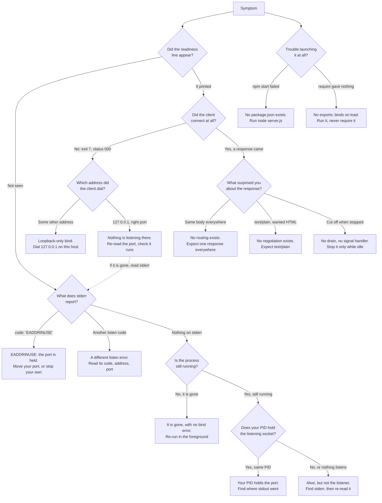

# Troubleshooting

This service has seven behaviours that reliably surprise people. Each one is
catalogued below with the symptom you actually see, the thing in the source
that produces it, and what to do about it.

Every symptom here was reproduced against a running instance of this
repository's `server.js` on **Friday, September 11, 2026**, under
**Node.js v24.19.0** (Active LTS) on **Windows**
(`Microsoft Windows NT 10.0.26100.0`). Every message, exit code, status and
byte count quoted on this page is one that was observed rather than
expected. Nothing on this page is a prediction.

Runtime and platform scope matter on a page made of observations, so the two
kinds of claim are kept apart throughout. A statement carrying
`Source: server.js:Lx` is a property of the source and holds wherever the
file runs; a quoted value is evidence from that one runtime on that one
platform. Three specifics are known to be version- or platform-bound rather
than universal: the stack-frame line numbers inside a Node.js trace move with
the runtime version, the numeric `errno` reported alongside `EADDRINUSE` is
platform-specific (`-4091` was the value observed on Windows), and Windows
has no POSIX signals at all. Every process-control command below is
therefore given twice, once for a POSIX shell and once for Windows
PowerShell, and labelled as such — the two are not interchangeable.

This guide documents the program as it is built. Several of these symptoms
have an obvious code-level fix, and where that is true the entry says so as a
fact about the design rather than as a recommendation: the uniform response,
the fatal port collision and the abrupt shutdown are characteristics of a
deliberately minimal single-file fixture, not defects awaiting repair. The
remedies given are operational — move this fixture to a port nothing else
holds, dial a different address, launch the file the way it expects to be
launched.

Source locators are anchored to baseline commit `1484182`, and line numbers
refer to that baseline layout of `server.js`. A claim about something that
exists nowhere in the file cites the whole file as
`Source: server.js:L1-L14`, because the claim is about the file rather than
about any one statement.

Each entry is laid out the same way: **Symptom**, then **Cause** with its
locator, then **Remedy**.

## Contents

- [How these findings were verified](#how-these-findings-were-verified)
- [Error: listen EADDRINUSE](#error-listen-eaddrinuse)
- [Connection refused from another machine or
  container](#connection-refused-from-another-machine-or-container)
- [The process died instantly on
  stop](#the-process-died-instantly-on-stop)
- [Every URL returns Hello, World!](#every-url-returns-hello-world)
- [There is no `npm start`](#there-is-no-npm-start)
- [`require('./server')` gave me
  nothing](#requireserver-gave-me-nothing)
- [I asked for HTML and got text](#i-asked-for-html-and-got-text)
- [D8 - Diagnostic decision tree](#d8---diagnostic-decision-tree)
- [Related documentation](#related-documentation)

## How these findings were verified

Most of this page rests on things the program does **not** do: it registers
no `'error'` listener, installs no signal handler, calls no `server.close()`,
reads no `process.env`, never touches `req.url`, `req.method` or
`req.headers`, and assigns nothing to `module.exports`. Those eight absences
are countable rather than a matter of opinion. `Source: server.js:L1-L14`.

One wrinkle makes the count worth stating carefully. `server.js` now carries
JSDoc comments that **name** several of those tokens in order to document
their absence, so a naive search matches comment prose. Removing the whole
comment spans is what gives the count that describes what executes —
excluding every line that begins with a comment marker would also discard
the two lines carrying the callbacks' arrow signatures:

```bash
node -e 'const src = require("node:fs").readFileSync("server.js", "utf8");
const code = src.replace(/\/\*[\s\S]*?\*\//g, "");
console.log((code.match(/process\.env/g) || []).length);'
```

Observed output, with exit status `0`, and the same output for each of the
other seven tokens as well:

```text
0
```

The rest of the page rests on direct observation of a live instance: the
status codes, headers and body sizes in the tables below, the stderr traces
quoted verbatim, the exit codes, and the behaviour of a process that loads
the module instead of running it.

## Error: listen EADDRINUSE

**Symptom.** The startup line never appears, and the process terminates at
once with a stack trace on stderr. Reproduced by starting a second instance
while the first still held the port. The trace opens:

```text
node:events:487
      throw er; // Unhandled 'error' event
      ^

Error: listen EADDRINUSE: address already in use 127.0.0.1:3000
    at Server.setupListenHandle [as _listen2] (node:net:2167:16)
    at listenInCluster (node:net:2224:12)
    at node:net:2448:7
Emitted 'error' event on Server instance at:
    at emitErrorNT (node:net:2203:8)
```

Two `process.processTicksAndRejections` frames belong to that output as
well, and are left out above only to keep the line width readable. After the
frames, the error's own fields are printed:

```text
  code: 'EADDRINUSE',
  errno: -4091,
  syscall: 'listen',
  address: '127.0.0.1',
  port: 3000
```

and the final line names the runtime, `Node.js v24.19.0`.

Match on the stable parts of that output: the
`Error: listen EADDRINUSE: address already in use 127.0.0.1:3000` line,
`code: 'EADDRINUSE'`, `syscall: 'listen'`, and the `address` and `port`
fields that identify exactly what could not be bound. The stack-frame line
numbers move with the Node.js version, and the numeric `errno` is
platform-specific — the value above was observed on Windows.

**Observed:** the process exited with status `1` and wrote nothing at all to
stdout.

**Cause.** The bind failed, and the `'error'` event the server emits in
response has no listener, so Node.js rethrows it and tears the process down.
No `'error'` listener is registered anywhere in the file
(`Source: server.js:L1-L14`), which is exactly what the
`throw er; // Unhandled 'error' event` frame in the observed output reports.
The failure happens at bind time, in the
`server.listen(port, hostname, callback)` call. `Source: server.js:L12`.

There is no retry, no fallback port, and no diagnostic of the program's own
making — the trace above comes entirely from the runtime.

**What the missing startup line does and does not tell you.** Because this
bind failed, the
[Listen Readiness Callback](./api-reference/functions/listen-readiness-callback.md)
never ran, so the line it would otherwise have printed is absent.
`Source: server.js:L12-L14`. That implication runs one way only. An absent
line is not itself proof of `EADDRINUSE`, of a failed bind, or even of a
process that has exited: the callback is invoked asynchronously, so the line
may not have been written yet, and stdout looks equally empty when the
output went somewhere you are not reading. Confirm this particular diagnosis
from the evidence specific to it — `code: 'EADDRINUSE'` on stderr, naming
the same `address` and `port` — and corroborate with whether the process is
still alive and whether anything is listening on that port. When the
readiness line is missing and stderr shows no bind error at all, the problem
is a different one; the [decision tree](#d8---diagnostic-decision-tree)
below branches on exactly that distinction.

A bind can fail for reasons other than a collision, and each of those takes
this same fatal route through the unhandled `'error'` event
(`Source: server.js:L1-L14`) while naming a different code on stderr, so
read the code before choosing a remedy.

**Remedy.** Two exist, and which of them applies to you was settled before
the collision happened — by whether you still hold the handle that launched
whatever now owns the port. Moving this fixture to a free port always works.
Stopping the occupant is sound only when it is a process you started and can
still name from that handle, and a port lookup is not such a name; the
reasons are set out below, after the lookup itself.

**Move this fixture — the remedy that always applies.** Editing the `port`
literal is the only mechanism that exists for changing it, since no
environment variable and no flag is read. `Source: server.js:L4`. That is
the whole remedy whenever the port's owner is anything other than a process
of your own that you can still name from its launch handle — which includes
every case where you are not certain. The edit procedure, and what else
follows from it, is in [Configuration](./configuration.md).

**Stop your own instance — only through the handle you kept.** A stop is
safe when its target is named by something the launch itself produced
rather than by a search performed afterwards, and the plainest such handle
is the terminal. Run the fixture in the foreground with `node server.js`, in
a terminal you keep for it, and stop it with `Ctrl+C` in that same terminal.
The keystroke reaches the process that terminal is running and nothing else:
no process id, no job number and no lookup are involved, which is why this
is the first choice on either platform.

If you background it instead — in an interactive shell, where job control
exists — take the identity the launch reports and assume nothing about job
numbers. `$!` holds the process id of the command just backgrounded, and
`jobs -l` prints the job number the shell paired with that same id:

```bash
node server.js &
server_pid=$!
jobs -l
```

Stop it by the id that launch gave you, never by a job number you assumed:

```bash
kill "$server_pid"
```

That id names the process this shell started, and it goes on naming it for
as long as `jobs -l` still shows the same pairing. Read that as a boundary,
because it is one: once the shell reports the job finished and reaps it, the
id is out of use and the system may reissue it, so a `server_pid` left over
from an earlier launch is not a handle, and neither is a job number carried
over from one. `%1` in particular is whichever job this shell numbered
first, which after any earlier background command is not this server at all.

Windows has no POSIX signal to send. In a foreground window `Ctrl+C` is
again the direct equivalent, and for a backgrounded launch the handle is the
process object `Start-Process -PassThru` returns, stopped by passing that
object rather than a number:

```powershell
$server = Start-Process node server.js -PassThru -NoNewWindow
Stop-Process -InputObject $server
```

That object carries the process's own identity instead of a number to look
up again. Observed: stopping through it after the instance had already
exited did nothing at all — no error and no output — rather than reaching
whatever holds the id by then.

If you hold none of those — the launch happened in a terminal you have
since closed, or in somebody else's session — then nothing available to you
names the occupant well enough to end it, and moving this fixture is the
remedy. The
launch and stop procedures in full are in
[Getting started](./getting-started.md).

**Look, without stopping anything.** Knowing what holds the port is still
worth having, and a lookup is how you get it. It answers "what is listening
here?" and nothing else: it is not an instruction to kill what it names, and
treating it as one is how an unrelated service gets taken down to make room
for a demonstration server. Constrain it to the *listening* socket, and read
back only fields that identify a process without quoting what was passed to
it — its id, its owner, its executable, and how long it has been running. In
a POSIX shell:

```bash
pid="$(lsof -nP -t -iTCP:3000 -sTCP:LISTEN)"
ps -o pid=,user=,etime=,comm= -p "$pid"
```

In Windows PowerShell the owner is not part of any process listing and has
to be asked for separately, so the block is longer:

```powershell
$portPid = (Get-NetTCPConnection -LocalPort 3000 -State Listen).OwningProcess
Get-Process -Id $portPid | Select-Object Id, ProcessName, Path, StartTime
$proc = Get-CimInstance Win32_Process -Filter "ProcessId = $portPid"
$owner = Invoke-CimMethod -InputObject $proc -MethodName GetOwner
Write-Output "owner=$($owner.Domain)\$($owner.User)"
```

The bare `lsof -ti :3000` form is worth avoiding precisely because it is
unconstrained: it matches every socket on that port, established client
connections included, so it can report several process ids of which none is
the listener you were after. The `-sTCP:LISTEN` filter above, and
`-State Listen` in its PowerShell counterpart, narrow it to the one process
actually holding the port. `comm` reports the executable's name without its
arguments, and `Path` and `StartTime` do the same job on Windows: enough to
recognise a process, and nothing that belongs to whoever started it.

**What the lookup deliberately does not print.** Neither block asks for the
occupant's arguments — not `ps -o args=` or `-o command=`, and not the
`CommandLine` property of a `Win32_Process` instance. A process you did not
start can carry anything on its command line, tokens, passwords and
connection strings included, and none of it is yours to put on a screen:
that output survives in terminal scrollback, in a PowerShell transcript, and
in the job log of whatever runner the session belongs to. The fields above
answer "what is this?" without reproducing a single thing the process was
given. Keep it that way, and do not redirect these commands into a file that
outlives the question you ran them to answer.

**Why the lookup cannot decide the stop for you.** Its output neither
identifies the occupant nor stays true long enough to act on:

- **Owner and executable do not distinguish.** Another instance of this same
  fixture — a second checkout, a second shell, a colleague on a shared
  account — presents the identical owner and the identical `node`
  executable, and so does anything else running Node.js from that account.
  Those fields can tell you the occupant *might* be yours. Nothing in them
  tells you that it is, and a command line ending in `server.js` does not
  either.
- **A process id starts going stale the moment you read it.** The occupant
  can exit between the lookup and the stop, and the operating system is free
  to reissue its id, so the process you checked and the process you would
  signal need not be the same one. A shell cannot close that gap — the check
  and the act are separate steps by construction, which is exactly what a
  handle kept from the launch avoids.
- **An unfamiliar process is not an unimportant one**, and an outage caused
  this way is discovered by somebody else.

So read the lookup as diagnosis. It tells you whether the port is held by
something you recognise, which is what it was run to answer and as far as it
goes.

## Connection refused from another machine or container

**Symptom.** Requests from the same host succeed, and requests from anywhere
else fail to connect at all. Both halves were verified on the same running
instance:

| Request target              | Observed result                   |
| --------------------------- | --------------------------------- |
| `http://127.0.0.1:3000/`    | `200`, `text/plain`, 14-byte body |
| `http://HOST-ADDRESS:3000/` | No connection; `curl` exits `7`   |

`HOST-ADDRESS` is a placeholder, not something to type: substitute one of
this host's own non-loopback IPv4 addresses before issuing the request. Every
such address behaved identically.

The distinction that matters: this is a **connection failure, not an HTTP
error**. There is no `403` and no `404` to read, because no TCP connection is
ever established and the server never sees the attempt. `curl` reports the
HTTP status as `000` — it never received one — exits `7`, and prints a
`Failed to connect` message naming the address and port it could not reach.
Nothing appears in the server's output, because nothing arrived.

**Cause.** The listener binds to the IPv4 loopback literal `'127.0.0.1'`,
which accepts connections only from the machine the process runs on.
`Source: server.js:L3`. That value is the address passed to the bind call.
`Source: server.js:L12`.

**Remedy.** Run the client on the same host — over loopback, the service
answers normally.

If reaching it from elsewhere is genuinely required, the only mechanism that
exists is to edit the host literal at `Source: server.js:L3`, and it is
worth being clear about what that does: it **changes the service's network
exposure**, since the value on `server.js:L12` is the interface the socket is
opened on. See [Configuration](./configuration.md) for the edit procedure and
the verification step that follows it — and read what comes next before
making the edit, because the address is not the only thing it changes.

**Loopback is the only boundary this service has.** It is not one protection
among several in front of the listener; it is the whole of them. The program
loads `http` and nothing else, so what it serves is plaintext — no TLS, no
certificate, no HTTPS listener — and it never reads any part of the request,
so a credential offered to it goes unread, no session or token exists, no
authorization check is performed, and there is nothing it could refuse.
`Source: server.js:L1-L14`, and `Source: server.js:L6-L10` for the request
it never inspects. Binding wider therefore relaxes no restriction; it
removes the only one there is, and every peer able to route to the new
address becomes a caller receiving the same `200` as everybody else. Keep it
off shared, corporate, cloud and public networks, and do not publish it to
the internet: public or production deployment is an explicitly unsupported
use case for this repository. Making a service like this safe to reach
remotely means TLS termination, authentication and authorization — none of
which exists here, none of which is a configuration change, and all of which
belong to a separately scoped engagement rather than to a step on this page.

The container case deserves stating plainly, because it is where people lose
the most time — and there are two separate traps in it, not one.

The first is configuration. Injecting `-e HOST=0.0.0.0`, `--env`, or an
env-file has **no effect whatsoever**: nothing in the program reads
`process.env`, so there is nothing for an injected variable to reach.
`Source: server.js:L1-L14`.

The second is networking, and it defeats the fix most people reach for next:
**publishing a port does not rebind the listener.** A container has its own
network namespace with its own loopback interface, so a process bound to the
container's `127.0.0.1` accepts connections only from inside that container.
A mapping such as `-p 3000:3000` forwards traffic arriving at the host to
the container's *namespace interface* address rather than to its loopback —
so the forwarded connection arrives at an address where nothing is
listening, and is refused in exactly the way a request from another machine
is. Publishing exposes a port that the application is already reachable on
inside the namespace; it cannot create that reachability. Getting there
means running the container from source whose host literal at
`server.js:L3` has been edited, or else placing something in the same
namespace that can reach the loopback listener itself and forward to it. The
bind address decides reachability, and nothing at the container boundary
substitutes for it.

Both of those routes carry the consequence set out above, and a forwarder
carries it on the forwarder's own terms: whatever can reach the address that
forwarder publishes becomes a caller of a plaintext, unauthenticated
listener. Neither route is one to take on a shared or public network.

## The process died instantly on stop

**Symptom.** `Ctrl+C`, `kill`, or `Stop-Process` ends the process
immediately. In-flight requests are not completed and open connections are
not drained. Observed directly: a request answered `200` moments before the
stop, and immediately after it the process was gone, the port was no longer
listening, and the next request failed to connect.

**Cause.** There is no graceful-shutdown path to take. No signal handler is
installed and `server.close()` is never called — anywhere in the file.
`Source: server.js:L1-L14`. Termination is therefore whatever the operating
system does to a process that has asked for no say in the matter: the
listening socket goes away with it.

**Remedy.** None exists in-process, and none is proposed here. This is
expected behaviour to plan around rather than a fault to fix:

- Stop the process when no client is active, if completing in-flight work
  matters to you. Do not read the handler's own tidiness as a delivery
  guarantee: the
  [Request Handler Callback](./api-reference/functions/request-handler-callback.md)
  calls `res.end()` synchronously and returns with nothing left of its own
  to do (`Source: server.js:L6-L10`), but ending the application's writes is
  not the same as the bytes having reached the client — they can still be
  queued inside the runtime or in flight on the network. Nothing in the
  source observes a response's completion, so no narrow loss window can
  honestly be derived from it. Treat **every unfinished response, and every
  connection still open**, as at risk, along with any request that has
  arrived and not been answered. Idle keep-alive connections count
  too: the runtime advertises `Keep-Alive: timeout=5` on every response, so
  connections routinely outlive the exchange that created them and go down
  with the process.
- Expect no shutdown log line. The readiness line at startup is the only
  line this program's *own code* ever writes — the file contains a single
  `console.log` call and no other output statement
  (`Source: server.js:L13`). That is a claim about application-authored
  output only. The runtime writes its own diagnostics independently, and to
  stderr, as the `EADDRINUSE` trace earlier on this page shows.
- Treat a restart as a cold start, because no state survives it — and none
  is kept in the first place.

The process state model, including the fact that no graceful-shutdown state
exists in it, is in
[Request lifecycle](./architecture/request-lifecycle.md).

## Every URL returns `Hello, World!`

**Symptom.** Every path returns the identical `200` response, including
paths that plainly do not exist.

**Cause.** There is exactly one request listener and there is no routing.
The
[Request Handler Callback](./api-reference/functions/request-handler-callback.md)
never reads the request: nothing in it touches `req.url`, `req.method` or
`req.headers`, so no routing, parsing, branching or content negotiation can
take place. `Source: server.js:L6-L10`. What it
does instead, unconditionally and in three statements, is set the status to
`200` (`Source: server.js:L7`), set `Content-Type` to `text/plain`
(`Source: server.js:L8`), and end the response with the 14-byte body
(`Source: server.js:L9`).

Observed across a representative spread of paths:

| Path              | Status | `Content-Type` | Body size |
| ----------------- | ------ | -------------- | --------- |
| `/`               | 200    | `text/plain`   | 14 bytes  |
| `/does/not/exist` | 200    | `text/plain`   | 14 bytes  |
| `/favicon.ico`    | 200    | `text/plain`   | 14 bytes  |
| `/x?q=1&a=2`      | 200    | `text/plain`   | 14 bytes  |

The `/favicon.ico` row is the one that catches people out. Browsers request
that path automatically, so a single visit produces an extra hit that nobody
asked for, and it is answered with the greeting instead of an icon or a
`404`.

Two further consequences of the same omission:

- **There is no `404` path and no `405` path.** An unknown path and an
  unexpected method are indistinguishable from a valid request, because the
  request is never examined. `Source: server.js:L6-L10`.
- **`HEAD` is the one method whose response looks different.** It returns
  `200` with a **0-byte** body, and without a `Content-Length` header at
  all. That is the runtime suppressing the body for `HEAD`; the application
  does not special-case it and could not, since it cannot tell one method
  from another. `Source: server.js:L6-L10`.

| Method                                 | Status | Body size |
| -------------------------------------- | ------ | --------- |
| GET, POST, PUT, PATCH, DELETE, OPTIONS | 200    | 14 bytes  |
| HEAD                                   | 200    | 0 bytes   |

**Remedy.** None, because this is not a fault. The uniform response is the
system's defining characteristic, and this entry exists so that it stops
being a surprise. The full behaviour tables are in [Usage](./usage.md), and
the wire-level contract — including which headers the runtime injects rather
than the application — is specified in
[HTTP endpoint](./api-reference/http-endpoint.md).

## There is no `npm start`

**Symptom.** `npm start` fails. There is no script to run and no dependency
to install.

**Cause.** There is no `package.json` anywhere in the repository, and no
lockfile and no `node_modules` directory either — all confirmed absent by
direct inspection. With no manifest there is no `scripts` section, so there
is no npm entry point for `npm start` to find.

This is a consequence of the program's dependency list rather than an
oversight. Its sole import is `http` (`Source: server.js:L1`), which is a
Node.js built-in bundled with the runtime rather than a package fetched from
a registry. There are no third-party dependencies to declare and nothing to
install, so there is nothing a manifest would be carrying.

**Remedy.** Launch it with the only path that exists, from the repository
root:

```bash
node server.js
```

A successful start prints exactly one line and then serves requests until it
is stopped:

```text
Server running at http://127.0.0.1:3000/
```

Prerequisites, verification commands and the stop procedure are in
[Getting started](./getting-started.md).

## `require('./server')` gave me nothing

**Symptom.** Requiring the module hands back nothing usable, and the
requiring process then refuses to exit.

**Cause.** The module assigns nothing to `module.exports`, so there is no
export to receive, and its body executes on load, so requiring it starts a
live server as a side effect. `Source: server.js:L1-L14`.

All three consequences were observed by loading the file from a separate
script:

1. **What you get back is an empty object.** `typeof` reports `object`,
   `JSON.stringify` gives `{}`, and it has **0** own keys. There is no
   server handle, no port accessor, and nothing to call.
2. **A socket is bound anyway.** After the loading script's own output, the
   line `Server running at http://127.0.0.1:3000/` appeared — the Listen
   Readiness Callback reporting a successful bind in a process that only
   meant to import the file. A request to that port was then answered `200`
   with the 14-byte body **by the requiring process itself**.
   `Source: server.js:L12-L14`.
3. **The requiring process does not exit on its own.** The `require()` call
   itself returns normally and synchronously: it hands back that empty
   object and the statements written after it run as usual. Observed in the
   loading script's output, those following statements printed *before* the
   readiness line did, which also shows that the bind completes
   asynchronously after `require()` has already returned. What does not
   happen is the process ending. The open listener keeps a handle on the
   event loop, so once the loading script had finished its own work it was
   still sitting there listening — and answering requests — until it was
   terminated.

There is a compound failure worth knowing about too. If a server already
holds the port, merely requiring the file **crashes the requiring process**:
it exited with status `1`, carrying the same `EADDRINUSE` trace described in
[Error: listen EADDRINUSE](#error-listen-eaddrinuse) — a program that never
intended to bind anything, killed by a bind it did not know it was
attempting.

**Remedy.** Run the file as a program, never import it:

```bash
node server.js
```

Nothing in this repository is designed to be consumed as a library; it is
consumed over HTTP. The client-side examples are in [Usage](./usage.md).

## I asked for HTML and got text

**Symptom.** A request that advertises a preference for HTML still receives
`text/plain`. Observed with `Accept: text/html,application/xhtml+xml`, which
returned `200` and `text/plain` like every other request.

**Cause.** No content negotiation exists, because the Request Handler
Callback never inspects `req.headers` — or any other part of the request.
`Source: server.js:L6-L10`. It sets `Content-Type` to `text/plain`
unconditionally, and deliberately without a `charset` parameter.
`Source: server.js:L8`.

**Remedy.** Expect `text/plain`, and read the `Accept` header as something
this service ignores rather than something it honours. In a browser the
greeting shows as plain text: there is no markup to render and no DOM to
inspect, because what arrives is 14 bytes of text.
`Source: server.js:L9`. The complete response contract is in
[HTTP endpoint](./api-reference/http-endpoint.md).

## D8 - Diagnostic decision tree

The tree below routes a symptom to its cause and its remedy. Start from what
you observed, not from what you expected.

Each branch turns on something you can read off the system rather than on a
general impression of it: the error `code` on stderr, the address the client
actually dialled, and whether the process and its listening port are still
there. That matters because the obvious shortcuts overdiagnose. A missing
readiness line accompanied by a stack trace is not necessarily a port
collision — `listen` can fail for other reasons, and the process can also be
running perfectly well with its output going somewhere you are not watching.
A connection failure after a successful start is not necessarily the loopback
bind either, so the tree asks which address was dialled before concluding
that.



Every outcome carries its next action in the node itself. The full reasoning
is here:

- `R1` — [Error: listen EADDRINUSE](#error-listen-eaddrinuse). Move this
  service's port, or stop the occupant only if it is an instance of your own
  that you can still name from the handle you launched it with.
- `R1b` — a bind failure that is not a collision. Two were reproduced here
  under the runtime and platform named at the top of this page, and both
  are symptom-for-symptom identical to a collision — exit `1`, empty
  stdout, no readiness line — differing only in what stderr says.
  **Observed:**
  - with the host literal set to an address this machine does not hold,
    `Error: listen EADDRNOTAVAIL: address not available`, carrying
    `code: 'EADDRNOTAVAIL'` and `errno: -4090`;
  - with the port literal set to one this account may not bind,
    `Error: listen EACCES: permission denied`, carrying `code: 'EACCES'`
    and `errno: -4092`.

  Both `errno` values are Windows-specific, exactly as with `EADDRINUSE`.
  The `code`, `address` and `syscall` fields are what separate the cases,
  and they are read the same way as in
  [Error: listen EADDRINUSE](#error-listen-eaddrinuse). Two reproducible
  non-collision failures that present as a collision is the whole reason
  this tree reads the code rather than inferring one from a missing line.
- `R1c` — your process is alive and its own PID is the one holding the
  socket, so the bind did succeed and the readiness line went somewhere you
  are not watching. That is what normally happens when stdout was
  redirected. Check the redirection, then verify the endpoint directly with
  the request in [Getting started](./getting-started.md).
- `R1d` — the process is gone and stderr showed nothing, so there is no
  evidence of a bind failure and none should be assumed. Re-run it in the
  foreground from the repository root and capture both streams; see
  [Getting started](./getting-started.md).
- `R1e` — the process is alive but its PID is not holding the socket, or
  nothing is listening on the port at all. Its bind therefore has not
  succeeded, and whatever it reported went somewhere you are not reading:
  find its stderr first, then re-read this tree from `Q1` with the code it
  gives you. Do not conclude a collision without one.
- `R2` — [Connection refused from another machine or
  container](#connection-refused-from-another-machine-or-container).
- `R2b` — the address and port were right and nothing answered, so the
  listener is not there any more. Re-read the port from the readiness line
  and check whether the process is still alive. If it has died, go back to
  `Q1` and read the actual code on its stderr rather than assuming a
  collision — as the `R1b` table above shows, more than one bind failure
  looks like this.
- `R3` — [Every URL returns Hello, World!](#every-url-returns-hello-world).
- `R4` — [I asked for HTML and got text](#i-asked-for-html-and-got-text).
- `R5` — [The process died instantly on
  stop](#the-process-died-instantly-on-stop).
- `R6` — [There is no `npm start`](#there-is-no-npm-start).
- `R7` — [`require('./server')` gave me
  nothing](#requireserver-gave-me-nothing).

## Related documentation

- [Documentation hub](./README.md) — index for the whole documentation set.
- [Configuration](./configuration.md) — the host and port literals, the only
  mechanism for changing either, and what changes when you do.
- [Getting started](./getting-started.md) — prerequisites, the launch
  command, and how to stop the process.
- [Usage](./usage.md) — client examples, the method and path behaviour
  tables, and the import trap from the consumer's side.
- [HTTP endpoint](./api-reference/http-endpoint.md) — the wire-level
  response contract these symptoms are measured against.
- [Request Handler Callback](./api-reference/functions/request-handler-callback.md)
  — the dedicated reference for the callback behind the uniform response and
  the content-type symptoms.
- [Listen Readiness Callback](./api-reference/functions/listen-readiness-callback.md)
  — the dedicated reference for the callback behind the readiness line whose
  absence starts the decision tree.
- [Request lifecycle](./architecture/request-lifecycle.md) — the request
  path and the process state model, including the absence of any
  graceful-shutdown state.
