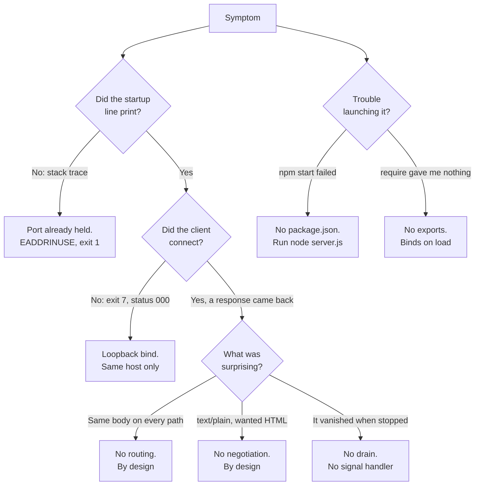

# Troubleshooting

This service has seven behaviours that reliably surprise people. Each one is
catalogued below with the symptom you actually see, the thing in the source
that produces it, and what to do about it.

Every symptom here was reproduced against a running instance of this
repository's `server.js` under Node.js 24.19.0, and every message, exit code,
status and byte count quoted on this page is one that was observed rather
than expected. Nothing on this page is a prediction.

This guide documents the program as it is built. Several of these symptoms
have an obvious code-level fix, and where that is true the entry says so as a
fact about the design rather than as a recommendation: the uniform response,
the fatal port collision and the abrupt shutdown are characteristics of a
deliberately minimal single-file fixture, not defects awaiting repair. The
remedies given are
operational — free a port, dial a different address, launch the file the way
it expects to be launched.

Source locators are anchored to baseline commit `1484182`, and line numbers
refer to that baseline layout of `server.js`. A claim about something that
exists nowhere in the file cites the whole file as
`Source: server.js:L1-L14`, because the claim is about the file rather than
about any one statement.

Each entry is laid out the same way: **Symptom**, then **Cause** with its
locator, then **Remedy**.

## Contents

- [How these findings were verified](#how-these-findings-were-verified)
- [Error: listen EADDRINUSE](#error-listen-eaddrinuse)
- [Connection refused from another machine or
  container](#connection-refused-from-another-machine-or-container)
- [The process died instantly on
  stop](#the-process-died-instantly-on-stop)
- [Every URL returns Hello, World!](#every-url-returns-hello-world)
- [There is no `npm start`](#there-is-no-npm-start)
- [`require('./server')` gave me
  nothing](#requireserver-gave-me-nothing)
- [I asked for HTML and got text](#i-asked-for-html-and-got-text)
- [D8 - Diagnostic decision tree](#d8---diagnostic-decision-tree)
- [Related documentation](#related-documentation)

## How these findings were verified

Most of this page rests on things the program does **not** do: it registers
no `'error'` listener, installs no signal handler, calls no `server.close()`,
reads no `process.env`, never touches `req.url`, `req.method` or
`req.headers`, and assigns nothing to `module.exports`. Those eight absences
are countable rather than a matter of opinion. `Source: server.js:L1-L14`.

One wrinkle makes the count worth stating carefully. `server.js` now carries
JSDoc comments that **name** several of those tokens in order to document
their absence, so a naive search matches comment prose. Excluding comment
lines gives the count that describes what executes:

```bash
grep -v -E '^[[:space:]]*(/\*|\*)' server.js | grep -c -F "process.env"
```

Observed output, and the observed output for each of the other seven tokens
as well:

```text
0
```

The rest of the page rests on direct observation of a live instance: the
status codes, headers and body sizes in the tables below, the stderr traces
quoted verbatim, the exit codes, and the behaviour of a process that loads
the module instead of running it.

## Error: listen EADDRINUSE

**Symptom.** The startup line never appears, and the process terminates at
once with a stack trace on stderr. Reproduced by starting a second instance
while the first still held the port. The trace opens:

```text
node:events:487
      throw er; // Unhandled 'error' event
      ^

Error: listen EADDRINUSE: address already in use 127.0.0.1:3000
    at Server.setupListenHandle [as _listen2] (node:net:2167:16)
    at listenInCluster (node:net:2224:12)
    at node:net:2448:7
Emitted 'error' event on Server instance at:
    at emitErrorNT (node:net:2203:8)
```

Two `process.processTicksAndRejections` frames belong to that output as
well, and are left out above only to keep the line width readable. After the
frames, the error's own fields are printed:

```text
  code: 'EADDRINUSE',
  errno: -4091,
  syscall: 'listen',
  address: '127.0.0.1',
  port: 3000
```

and the final line names the runtime, `Node.js v24.19.0`.

Match on the stable parts of that output: the
`Error: listen EADDRINUSE: address already in use 127.0.0.1:3000` line,
`code: 'EADDRINUSE'`, `syscall: 'listen'`, and the `address` and `port`
fields that identify exactly what could not be bound. The stack-frame line
numbers move with the Node.js version, and the numeric `errno` is
platform-specific — the value above was observed on Windows.

**The process exits with status `1`,** and its stdout is empty.

**Cause.** The bind failed, and the `'error'` event the server emits in
response has no listener, so Node.js rethrows it and tears the process down.
No `'error'` listener is registered anywhere in the file
(`Source: server.js:L1-L14`), which is exactly what the
`throw er; // Unhandled 'error' event` frame in the observed output reports.
The failure happens at bind time, in the
`server.listen(port, hostname, callback)` call. `Source: server.js:L12`.

There is no retry, no fallback port, and no diagnostic of the program's own
making — the trace above comes entirely from the runtime.

**The missing startup line is itself the diagnostic.** Because the bind
failed, the Listen Readiness Callback never runs, so the one line this
process would otherwise print is absent. `Source: server.js:L12-L14`. If you
are looking at stdout and it is empty, the socket was never bound; the
logging did not fail.

**Remedy.** Find what already holds the port and stop it. On a POSIX shell:

```bash
lsof -ti :3000
kill <pid>
```

On Windows PowerShell:

```text
(Get-NetTCPConnection -LocalPort 3000 -State Listen).OwningProcess
Stop-Process -Id <pid>
```

The alternative is to move this service to a port nothing else is using,
which means editing the `port` literal — the only mechanism that exists for
changing it, since no environment variable or flag is read.
`Source: server.js:L4`. The procedure, and what else follows from the edit,
is in [Configuration](./configuration.md).

## Connection refused from another machine or container

**Symptom.** Requests from the same host succeed, and requests from anywhere
else fail to connect at all. Both halves were verified on the same running
instance:

| Request target                | Observed result                        |
| ----------------------------- | -------------------------------------- |
| `http://127.0.0.1:3000/`      | `200`, `text/plain`, 14-byte body      |
| `http://<host-address>:3000/` | No connection; `curl` exits `7`        |

`<host-address>` stands for any of this host's own non-loopback IPv4
addresses; all of them behaved identically.

The distinction that matters: this is a **connection failure, not an HTTP
error**. There is no `403` and no `404` to read, because no TCP connection is
ever established and the server never sees the attempt. `curl` reports the
HTTP status as `000` — it never received one — exits `7`, and prints a
`Failed to connect` message naming the address and port it could not reach.
Nothing appears in the server's output, because nothing arrived.

**Cause.** The listener binds to the IPv4 loopback literal `'127.0.0.1'`,
which accepts connections only from the machine the process runs on.
`Source: server.js:L3`. That value is the address passed to the bind call.
`Source: server.js:L12`.

**Remedy.** Run the client on the same host — over loopback, the service
answers normally.

If reaching it from elsewhere is genuinely required, the only mechanism that
exists is to edit the host literal at `Source: server.js:L3`, and it is
worth being clear about what that does: it **changes the service's network
exposure**, since the value on `server.js:L12` is the interface the socket is
opened on. Public or production deployment is an explicitly unsupported use
case for this repository. See [Configuration](./configuration.md) for the
edit procedure and the verification step that follows it.

The container case deserves stating plainly, because it is where people lose
the most time. Injecting `-e HOST=0.0.0.0`, `--env`, or an env-file has **no
effect whatsoever**: nothing in the program reads `process.env`, so there is
nothing for an injected variable to reach. `Source: server.js:L1-L14`. A
container either runs edited source or remaps the address at its own
boundary — a published-port mapping, for instance — rather than configuring
the application.

## The process died instantly on stop

**Symptom.** `Ctrl+C`, `kill`, or `Stop-Process` ends the process
immediately. In-flight requests are not completed and open connections are
not drained. Observed directly: a request answered `200` moments before the
stop, and immediately after it the process was gone, the port was no longer
listening, and the next request failed to connect.

**Cause.** There is no graceful-shutdown path to take. No signal handler is
installed and `server.close()` is never called — anywhere in the file.
`Source: server.js:L1-L14`. Termination is therefore whatever the operating
system does to a process that has asked for no say in the matter: the
listening socket goes away with it.

**Remedy.** None exists in-process, and none is proposed here. This is
expected behaviour to plan around rather than a fault to fix:

- Stop the process when it is idle if completing in-flight work matters to
  you. Since the Request Handler Callback produces and completes every
  response in one pass with nothing pending afterwards, the window in which
  work can be lost is the request currently on the wire.
  `Source: server.js:L6-L10`.
- Expect no shutdown log line. The one line this process ever writes is the
  readiness line at startup. `Source: server.js:L12-L14`.
- Treat a restart as a cold start, because no state survives it — and none
  is kept in the first place.

The process state model, including the fact that no graceful-shutdown state
exists in it, is in
[Request lifecycle](./architecture/request-lifecycle.md).

## Every URL returns `Hello, World!`

**Symptom.** Every path returns the identical `200` response, including
paths that plainly do not exist.

**Cause.** There is exactly one request listener and there is no routing.
The Request Handler Callback never reads the request: nothing in it touches
`req.url`, `req.method` or `req.headers`, so no routing, parsing, branching
or content negotiation can take place. `Source: server.js:L6-L10`. What it
does instead, unconditionally and in three statements, is set the status to
`200` (`Source: server.js:L7`), set `Content-Type` to `text/plain`
(`Source: server.js:L8`), and end the response with the 14-byte body
(`Source: server.js:L9`).

Observed across a representative spread of paths:

| Path              | Status | `Content-Type` | Body size |
| ----------------- | ------ | -------------- | --------- |
| `/`               | 200    | `text/plain`   | 14 bytes  |
| `/does/not/exist` | 200    | `text/plain`   | 14 bytes  |
| `/favicon.ico`    | 200    | `text/plain`   | 14 bytes  |
| `/x?q=1&a=2`      | 200    | `text/plain`   | 14 bytes  |

The `/favicon.ico` row is the one that catches people out. Browsers request
that path automatically, so a single visit produces an extra hit that nobody
asked for, and it is answered with the greeting instead of an icon or a
`404`.

Two further consequences of the same omission:

- **There is no `404` path and no `405` path.** An unknown path and an
  unexpected method are indistinguishable from a valid request, because the
  request is never examined. `Source: server.js:L6-L10`.
- **`HEAD` is the one method whose response looks different.** It returns
  `200` with a **0-byte** body, and without a `Content-Length` header at
  all. That is the runtime suppressing the body for `HEAD`; the application
  does not special-case it and could not, since it cannot tell one method
  from another. `Source: server.js:L6-L10`.

| Method                                 | Status | Body size |
| -------------------------------------- | ------ | --------- |
| GET, POST, PUT, PATCH, DELETE, OPTIONS | 200    | 14 bytes  |
| HEAD                                   | 200    | 0 bytes   |

**Remedy.** None, because this is not a fault. The uniform response is the
system's defining characteristic, and this entry exists so that it stops
being a surprise. The full behaviour tables are in [Usage](./usage.md), and
the wire-level contract — including which headers the runtime injects rather
than the application — is specified in
[HTTP endpoint](./api-reference/http-endpoint.md).

## There is no `npm start`

**Symptom.** `npm start` fails. There is no script to run and no dependency
to install.

**Cause.** There is no `package.json` anywhere in the repository, and no
lockfile and no `node_modules` directory either — all confirmed absent by
direct inspection. With no manifest there is no `scripts` section, so there
is no npm entry point for `npm start` to find.

This is a consequence of the program's dependency list rather than an
oversight. Its sole import is `http` (`Source: server.js:L1`), which is a
Node.js built-in bundled with the runtime rather than a package fetched from
a registry. There are no third-party dependencies to declare and nothing to
install, so there is nothing a manifest would be carrying.

**Remedy.** Launch it with the only path that exists, from the repository
root:

```bash
node server.js
```

A successful start prints exactly one line and then serves requests until it
is stopped:

```text
Server running at http://127.0.0.1:3000/
```

Prerequisites, verification commands and the stop procedure are in
[Getting started](./getting-started.md).

## `require('./server')` gave me nothing

**Symptom.** Requiring the module hands back nothing usable — and the
requiring process then misbehaves.

**Cause.** The module assigns nothing to `module.exports`, so there is no
export to receive, and its body executes on load, so requiring it starts a
live server as a side effect. `Source: server.js:L1-L14`.

All three consequences were observed by loading the file from a separate
script:

1. **What you get back is an empty object.** `typeof` reports `object`,
   `JSON.stringify` gives `{}`, and it has **0** own keys. There is no
   server handle, no port accessor, and nothing to call.
2. **A socket is bound anyway.** After the loading script's own output, the
   line `Server running at http://127.0.0.1:3000/` appeared — the Listen
   Readiness Callback reporting a successful bind in a process that only
   meant to import the file. A request to that port was then answered `200`
   with the 14-byte body **by the requiring process itself**.
   `Source: server.js:L12-L14`.
3. **The requiring process never exits.** It had finished its own work and
   still sat there listening; it had to be terminated. The live server holds
   the event loop open, so a script that loads this module does not return
   control the way loading a module normally does.

There is a compound failure worth knowing about too. If a server already
holds the port, merely requiring the file **crashes the requiring process**:
it exited with status `1`, carrying the same `EADDRINUSE` trace described in
[Error: listen EADDRINUSE](#error-listen-eaddrinuse) — a program that never
intended to bind anything, killed by a bind it did not know it was
attempting.

**Remedy.** Run the file as a program, never import it:

```bash
node server.js
```

Nothing in this repository is designed to be consumed as a library; it is
consumed over HTTP. The client-side examples are in [Usage](./usage.md).

## I asked for HTML and got text

**Symptom.** A request that advertises a preference for HTML still receives
`text/plain`. Observed with `Accept: text/html,application/xhtml+xml`, which
returned `200` and `text/plain` like every other request.

**Cause.** No content negotiation exists, because the Request Handler
Callback never inspects `req.headers` — or any other part of the request.
`Source: server.js:L6-L10`. It sets `Content-Type` to `text/plain`
unconditionally, and deliberately without a `charset` parameter.
`Source: server.js:L8`.

**Remedy.** Expect `text/plain`, and read the `Accept` header as something
this service ignores rather than something it honours. In a browser the
greeting shows as plain text: there is no markup to render and no DOM to
inspect, because what arrives is 14 bytes of text.
`Source: server.js:L9`. The complete response contract is in
[HTTP endpoint](./api-reference/http-endpoint.md).

## D8 - Diagnostic decision tree

The tree below routes a symptom to its cause and its remedy. Start from
what you observed, not from what you expected.



Each outcome is explained in full by one section above:

- `R1` - [Error: listen EADDRINUSE](#error-listen-eaddrinuse)
- `R2` - [Connection refused from another machine or
  container](#connection-refused-from-another-machine-or-container)
- `R3` - [Every URL returns Hello, World!](#every-url-returns-hello-world)
- `R4` - [I asked for HTML and got text](#i-asked-for-html-and-got-text)
- `R5` - [The process died instantly on
  stop](#the-process-died-instantly-on-stop)
- `R6` - [There is no `npm start`](#there-is-no-npm-start)
- `R7` - [`require('./server')` gave me
  nothing](#requireserver-gave-me-nothing)

## Related documentation

- [Documentation hub](./README.md) — index for the whole documentation set.
- [Configuration](./configuration.md) — the host and port literals, the only
  mechanism for changing either, and what changes when you do.
- [Getting started](./getting-started.md) — prerequisites, the launch
  command, and how to stop the process.
- [Usage](./usage.md) — client examples, the method and path behaviour
  tables, and the import trap from the consumer's side.
- [HTTP endpoint](./api-reference/http-endpoint.md) — the wire-level
  response contract these symptoms are measured against.
- [Request lifecycle](./architecture/request-lifecycle.md) — the request
  path and the process state model, including the absence of any
  graceful-shutdown state.
